[← Lec 050: Excitation Phenomenon 2](Lecture_050_Excitation_Phenomenon_2.md) | [🏠 Index](00_yt_study_guide.md) | [Lec 052: Switching Transients →](Lecture_052_Switching_Transients.md)

---

# Electrical Machines | Lec 35 | Excitation Phenomenon - 3 | GATE/ESE Electrical Engineering

- **Source**: https://www.youtube.com/watch?v=gqVpwEHk3nA
- **Duration**: 01:10:18
- **Compiled**: 2026-09-21

---

## Overview

This lecture analyzes harmonic excitation phenomena and zero-sequence flux behavior in three-phase transformers. It links core geometry to the circulation paths of third-harmonic flux. The discussion establishes the mechanism of the oscillating neutral in ungrounded star-star systems. It also details the harmonic trapping behavior of delta windings and tertiary stabilization circuits.

## Contents

- [[#Review of Triplen Harmonics and Ungrounded Star-Star Systems|Review of Triplen Harmonics and Ungrounded Star-Star Systems]]
- [[#Third-Harmonic Paths in Banks and Five-Limb Cores|Third-Harmonic Paths in Banks and Five-Limb Cores]]
- [[#Harmonic Voltage Amplification and Oscillating Neutral Introduction|Harmonic Voltage Amplification and Oscillating Neutral Introduction]]
- [[#Harmonic Phasor Dynamics and Neutral Point Geometry|Harmonic Phasor Dynamics and Neutral Point Geometry]]
- [[#Neutral Point Shift and Angular Frequency Scaling|Neutral Point Shift and Angular Frequency Scaling]]
- [[#Circular Motion of the Oscillating Neutral and System Impact|Circular Motion of the Oscillating Neutral and System Impact]]
- [[#Three-Limb Core Construction and Tank Stray Losses|Three-Limb Core Construction and Tank Stray Losses]]
- [[#Star-Star Grounding and Telephone Line Interference|Star-Star Grounding and Telephone Line Interference]]
- [[#Harmonic Cancellation in Delta-Star and Star-Delta Connections|Harmonic Cancellation in Delta-Star and Star-Delta Connections]]
- [[#Delta-Delta Connection and System Drawbacks of Harmonics|Delta-Delta Connection and System Drawbacks of Harmonics]]
- [[#Harmonic Suppression Techniques and Delta Tertiary Windings|Harmonic Suppression Techniques and Delta Tertiary Windings]]
- [[#Harmonics Synthesis and Examination Principles|Harmonics Synthesis and Examination Principles]]

---

## Review of Triplen Harmonics and Ungrounded Star-Star Systems
_(00:12 - 06:07)_

### Foundation of Three-Phase Harmonics

In three-phase systems, triplen harmonics ($3^{\text{rd}}, 9^{\text{th}}, 15^{\text{th}}$) are zero sequence. All three phases share identical phase angles with zero relative displacement.

In a star connection, line voltages never contain third harmonics. Phase subtraction cancels identical co-phasal components:
$$
v_{ab3}(t) = v_{an3}(t) - v_{bn3}(t) = 0
$$

Star windings carry third-harmonic currents only when the neutral terminal connects to ground.

In a delta connection, circulating currents suppress third-harmonic voltages across the terminals:
$$
V_{L3} = 0, \quad V_{ph3} = 0
$$

The third-harmonic current circulates entirely within the delta loop. It cannot enter external line conductors.

### Star-Star System Without Neutral Grounding

Consider a three-phase transformer with star-connected primary and star-connected secondary windings. Assume neither neutral terminal connects to ground.

Because both neutral paths are open-circuited, no third-harmonic current can flow in either winding:
$$
I_{ph3,\text{pri}} = 0, \quad I_{ph3,\text{sec}} = 0
$$

Neglecting higher-order harmonics, the magnetizing current drawn from the source remains sinusoidal.

Core saturation requires a third harmonic in current or in flux. Because the connection blocks harmonic current, the third harmonic enters the magnetic flux:
$$
i_\mu(t) \text{ sinusoidal} \implies \phi(t) \text{ flat-topped} \implies e(t) \text{ peaky}
$$

The core flux becomes flat-topped. The induced phase voltage becomes peaky.

> [!info] Core Saturation Dilemma in Star-Star Banks
> An ungrounded star-star transformer prevents third-harmonic currents from circulating. Core saturation forces the third harmonic into the flux and induced voltage.

### Magnetic Path Dependency

Whether this third-harmonic flux can actually establish depends on the physical construction of the core. Three core types exist in practice:
1. A three-phase bank of three separate single-phase transformers.
2. A five-limb (five-legged) core.
3. A standard three-limb (three-legged) core.

Each core design provides a different magnetic reluctance path for zero-sequence flux.

## Third-Harmonic Paths in Banks and Five-Limb Cores
_(06:10 - 14:54)_

### Case 1: Three-Phase Transformer Bank

A three-phase transformer bank consists of three separate single-phase transformers. Each unit has its own independent magnetic core.

The primary and secondary windings connect in ungrounded star. As established, no third-harmonic current can flow. The magnetizing current remains sinusoidal, forcing a third-harmonic component into the core flux.

Because triplen harmonics are zero sequence, all three third-harmonic fluxes are identical:
$$
\Phi_{a3}(t) = \Phi_{b3}(t) = \Phi_{c3}(t) = \Phi_{m3}\sin(3\omega t)
$$

Each phase flux completes its closed magnetic loop entirely inside its own ferromagnetic core. The core uses high-permeability cold-rolled grain-oriented (CRGO) steel.

The magnetic reluctance of each core is:
$$
\mathcal{R} = \frac{l}{\mu A}
$$

Because core permeability $\mu$ is very high, reluctance is extremely low. The core offers a low-reluctance path to zero-sequence flux.

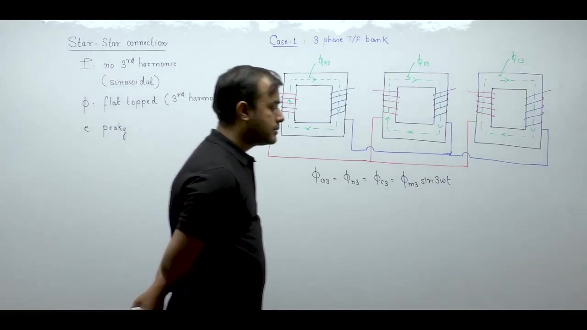

> [!success] Flux Result for Transformer Banks
> In a three-phase bank, each phase provides an independent iron path. Third-harmonic flux establishes easily, producing large third-harmonic induced voltages in each phase.

### Case 2: Five-Limb Core Construction

A five-limb core uses three wound central limbs and two unwound outer limbs. Four window openings separate the limbs.

Primary and secondary windings sit on the three central limbs. Phase $A$ occupies the first limb, phase $B$ the center limb, and phase $C$ the third limb.

All three phases produce upward-directed third-harmonic fluxes simultaneously:
$$
\Phi_{a3} = \Phi_{b3} = \Phi_{c3}
$$

These co-phasal fluxes require a return path through the core.

The outer unwound limbs provide this return path. The flux from phase $A$ returns through the adjacent left outer limb. The flux from phase $C$ returns through the right outer limb. The center flux from phase $B$ divides symmetrically between both outer paths.

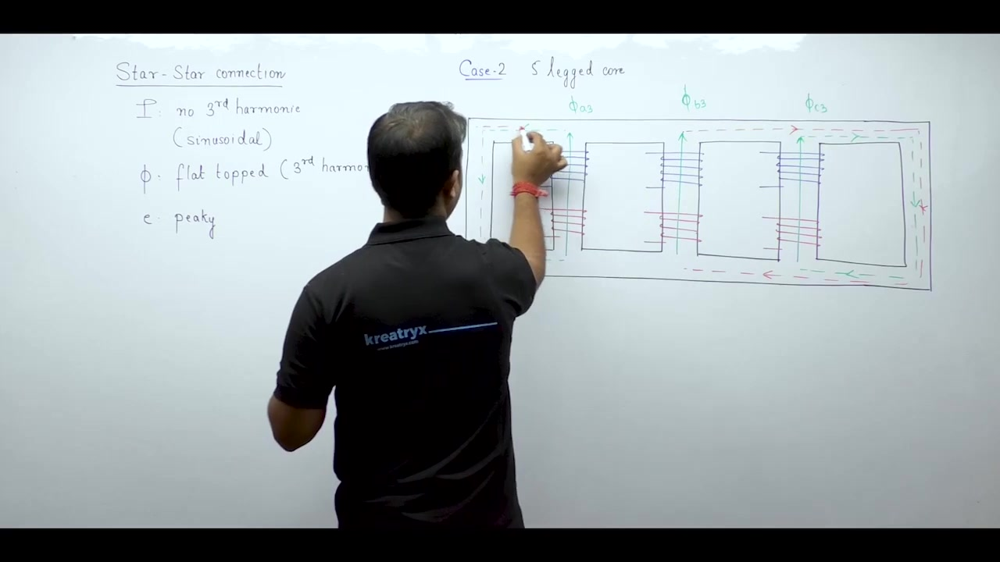

### Low-Reluctance Path and Voltage Distortion

All five limbs consist of high-permeability laminated steel. The third-harmonic flux never leaves the ferromagnetic material.

Because the outer limbs offer very low reluctance, large third-harmonic flux establishes in all three phases. This flux induces severe third-harmonic voltages in the windings.

> [!info] Operational Hazard of Induced Harmonic Voltage
> Third-harmonic phase voltages distort the terminal waveform supplied to loads. Distorted voltages increase insulation stress and degrade load equipment performance.

## Harmonic Voltage Amplification and Oscillating Neutral Introduction
_(14:54 - 19:37)_

### Derivation of Harmonic Amplification in Induced EMF

When third-harmonic flux exists in the core, the induced voltage undergoes amplified distortion.

Consider a core flux with fundamental and twenty percent third-harmonic content:
$$
\phi(t) = \Phi_{m1}\sin(\omega t) + 0.20\,\Phi_{m1}\sin(3\omega t)
$$

The ratio of harmonic to fundamental flux is:
$$
\frac{\Phi_3}{\Phi_1} = 0.20 \quad (20\%)
$$

Apply Faraday's Law of induction to calculate the induced voltage across $N$ turns:
$$
e(t) = -N \frac{d\phi}{dt} = -\omega N \Phi_{m1}\cos(\omega t) - 3\omega N (0.20\,\Phi_{m1})\cos(3\omega t)
$$

Define the fundamental and third-harmonic peak voltage amplitudes:
$$
\begin{aligned}
E_{m1} &= \omega N \Phi_{m1} \\
E_{m3} &= 3\omega N (0.20\,\Phi_{m1}) = 0.60\,E_{m1}
\end{aligned}
$$

Now calculate the ratio of third-harmonic to fundamental induced voltage:
$$
\frac{E_3}{E_1} = 0.60 \quad (60\%)
$$

Taking the time derivative multiplies the harmonic coefficient by its frequency order ($n = 3$). A 20% flux distortion amplifies into a 60% voltage distortion.

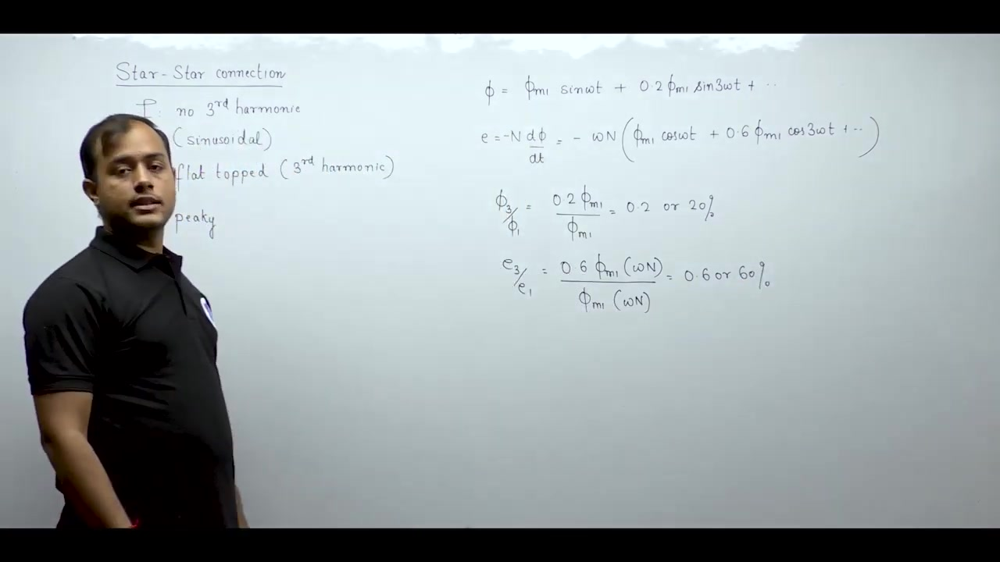

> [!success] Harmonic Magnification Rule
> For any harmonic of order $n$, the relative distortion in induced voltage is $n$ times larger than in the core flux:
> $$
> \frac{E_n}{E_1} = n \left(\frac{\Phi_n}{\Phi_1}\right)
> $$
> Higher harmonics produce severe voltage spikes and steep wave fronts.

### Elevation of RMS Phase Voltage

Now calculate the total root-mean-square (RMS) phase voltage:
$$
E_{\text{rms}} = \sqrt{E_1^2 + E_3^2}
$$

Substitute $E_3 = 0.60\,E_1$:
$$
E_{\text{rms}} = \sqrt{E_1^2 + (0.60\,E_1)^2} = \sqrt{1 + 0.36}\,E_1 \approx 1.17\,E_1
$$

The overall RMS phase voltage rises by seventeen percent above the fundamental value. This significant voltage increase strains insulation and accelerates dielectric breakdown.

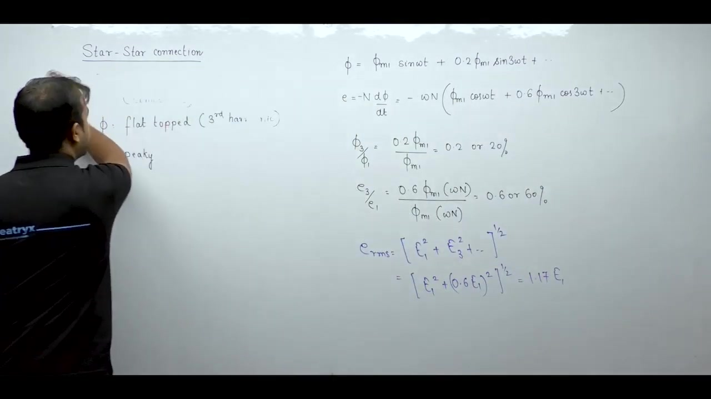

### Introduction to Oscillating Neutral

This severe phase voltage distortion creates an operational phenomenon termed the oscillating neutral.

Recall that star line voltages cancel all triplen harmonics:
$$
V_{L3} = 0
$$

Line voltages remain perfectly balanced and sinusoidal. But the individual phase voltages contain huge third-harmonic terms.

The physical neutral potential no longer stays at the geometric center of the three-phase system.

## Harmonic Phasor Dynamics and Neutral Point Geometry
_(19:37 - 24:42)_

### Rotating Harmonic Phasors and Phase Voltage Composition

Every harmonic component in an electrical machine rotates at an angular frequency proportional to its order $n$.

The fundamental voltage phasors rotate at angular speed $\omega$:
$$
\omega_1 = \omega
$$

The third harmonic rotates at three times fundamental speed:
$$
\omega_3 = 3\omega
$$

Similarly, fifth harmonics rotate at $5\omega$, and seventh harmonics rotate at $7\omega$.

Total phase voltage equals the sum of fundamental and harmonic voltages:
$$
v_{\text{phase}}(t) = v_1(t) + v_3(t) + v_5(t) + \dots
$$

The third harmonic is the most dominant harmonic component in iron-core transformers. So higher order harmonics like the fifth and seventh are usually neglected during primary analysis.

The fundamental components form a balanced positive-sequence set:
$$
\begin{aligned}
v_{an1}(t) &= V_{m1} \cos(\omega t) \\
v_{bn1}(t) &= V_{m1} \cos(\omega t - 120^\circ) \\
v_{cn1}(t) &= V_{m1} \cos(\omega t - 240^\circ)
\end{aligned}
$$

All three third-harmonic voltages are co-phasal and zero sequence:
$$
v_{an3}(t) = v_{bn3}(t) = v_{cn3}(t) = V_{m3} \cos(3\omega t)
$$

These triplen phasors point in the identical direction at any given instant and rotate together at speed $3\omega$.

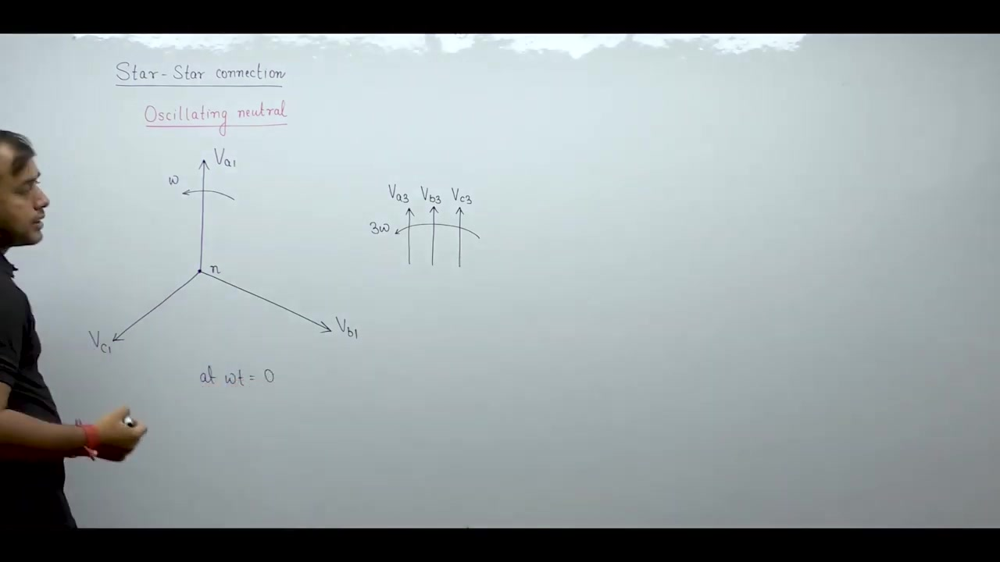

### Line Voltage Phasor Triangle and Neutral as Circumcenter

Line voltages are differences between individual phase terminal voltages:
$$
\begin{aligned}
\mathbf{V}_{ab} &= \mathbf{V}_a - \mathbf{V}_b \\
\mathbf{V}_{bc} &= \mathbf{V}_b - \mathbf{V}_c \\
\mathbf{V}_{ca} &= \mathbf{V}_c - \mathbf{V}_a
\end{aligned}
$$

In a phasor diagram, line voltage $\mathbf{V}_{ab}$ is represented by a directed vector pointing from vertex $B$ to vertex $A$.

Similarly, vector $C \to B$ represents $\mathbf{V}_{bc}$, and vector $A \to C$ represents $\mathbf{V}_{ca}$.

These three line voltage vectors close upon themselves to form an equilateral triangle $\Delta ABC$.

Because the system line voltages do not contain any third-harmonic components, triangle $\Delta ABC$ remains balanced and rigid at all times.

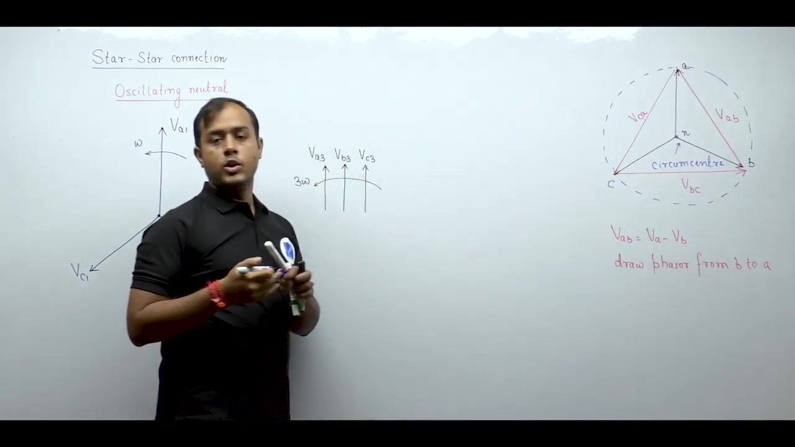

Now identify the position of the neutral node $N$.

For balanced fundamental phase voltages, each phase terminal sits at equal distance $V_{ph}$ from neutral node $N$:
$$
|\mathbf{V}_a - \mathbf{N}| = |\mathbf{V}_b - \mathbf{N}| = |\mathbf{V}_c - \mathbf{N}| = V_{ph}
$$

In planar geometry, the point equidistant from all three vertices of a triangle is the circumcenter.

A circle drawn with center $N$ and radius $R = V_{ph}$ passes through all three phase vertices $A$, $B$, and $C$.

> [!info] Geometric Neutral Definition
> The neutral point of a balanced three-phase system corresponds exactly to the circumcenter of the triangle formed by the line voltage phasors. The circumradius equals the fundamental phase voltage magnitude $V_{ph1}$.

### Impact of Triplen Harmonic Addition on Neutral Potential

Now superimpose the third-harmonic voltage component onto the fundamental phasors.

At $\omega t = 0$, the three third-harmonic phasors add equal in-phase vectors to each phase terminal.

Because line voltages are differences of phase voltages, the third harmonics subtract to zero across lines:
$$
\mathbf{V}_{ab3} = \mathbf{V}_{a3} - \mathbf{V}_{b3} = \mathbf{0}
$$

The line voltage triangle $\Delta ABC$ remains completely undisturbed.

But the physical potential of neutral point $N$ moves relative to the phase terminals.

Locating the neutral requires finding the center from which phase voltages originate. Adding third harmonics alters the distance between the line triangle vertices and the actual neutral potential.

## Neutral Point Shift and Angular Frequency Scaling
_(24:45 - 28:46)_

### Vector Addition of Fundamental and Harmonic Potentials at $\omega t = 0^\circ$

At initial instant $\omega t = 0^\circ$, consider the three fundamental phase voltage phasors radiating outward from fundamental neutral point $N$:
$$
\mathbf{V}_{a1}, \quad \mathbf{V}_{b1}, \quad \mathbf{V}_{c1}
$$

The third-harmonic voltages are co-phasal. All three point in the identical upward direction with magnitude $V_3$:
$$
\mathbf{V}_{a3} = \mathbf{V}_{b3} = \mathbf{V}_{c3} = \mathbf{V}_3
$$

Add the third-harmonic vector to each fundamental phase terminal:
$$
\begin{aligned}
\mathbf{V}_a &= \mathbf{V}_{a1} + \mathbf{V}_{a3} \\
\mathbf{V}_b &= \mathbf{V}_{b1} + \mathbf{V}_{b3} \\
\mathbf{V}_c &= \mathbf{V}_{c1} + \mathbf{V}_{c3}
\end{aligned}
$$

Now construct the line voltage phasors connecting the resultant phase terminals:
$$
\begin{aligned}
\mathbf{V}_{ab} &= \mathbf{V}_a - \mathbf{V}_b = \mathbf{V}_{a1} - \mathbf{V}_{b1} \\
\mathbf{V}_{bc} &= \mathbf{V}_b - \mathbf{V}_c = \mathbf{V}_{b1} - \mathbf{V}_{c1} \\
\mathbf{V}_{ca} &= \mathbf{V}_c - \mathbf{V}_a = \mathbf{V}_{c1} - \mathbf{V}_{a1}
\end{aligned}
$$

Because identical third-harmonic vectors cancel in pairs, the line voltage triangle $\Delta ABC$ remains identical in size and orientation.

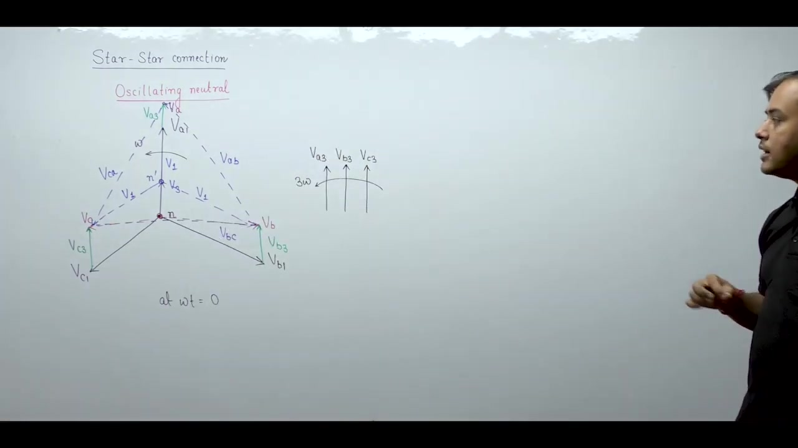

### Displaced Effective Neutral Point $N'$

The circumcenter of triangle $\Delta ABC$ defines the fundamental neutral position $N$. From $N$, distances to all three vertices equal $V_{ph1}$.

When third harmonics are present, the reference potential shifts. The effective neutral point becomes $N'$.

The displacement vector connecting original neutral $N$ to shifted neutral $N'$ equals:
$$
\vec{NN'} = \mathbf{V}_3
$$

> [!info] Neutral Shift Principle
> In an ungrounded star system, the geometric center of the line voltage triangle remains at $N$. But the effective neutral potential relocates to point $N'$ due to zero-sequence harmonic voltages.

### Angular Rotation Dynamics at $\omega t = 90^\circ$

Now observe the circuit behavior after fundamental phasors rotate counter-clockwise by ninety degrees.

Because phasors rotate at their respective angular frequencies:
$$
\theta_1 = \omega t = 90^\circ
$$

The third harmonic rotates at three times the speed:
$$
\theta_3 = 3\omega t = 3 \times 90^\circ = 270^\circ
$$

In a standard counter-clockwise polar coordinate system, an angle of $+270^\circ$ corresponds to $-90^\circ$:
$$
270^\circ \equiv -90^\circ
$$

A rotation of $-90^\circ$ turns the initial upward vertical phasor clockwise by ninety degrees.

So at $\omega t = 90^\circ$, all three third-harmonic phasors point horizontally to the right.

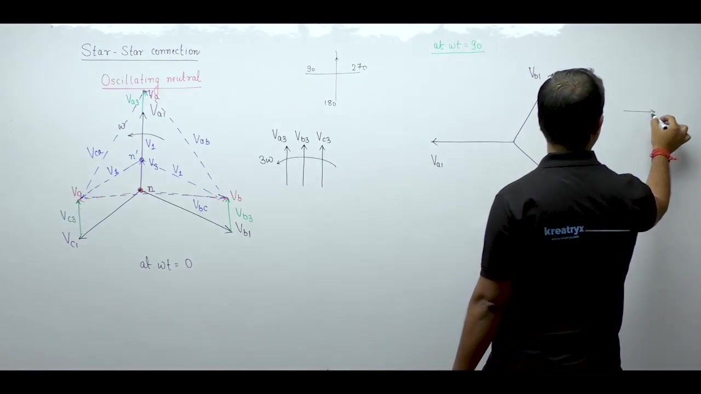

Add these rightward third-harmonic vectors to the rotated fundamental voltages:
$$
\begin{aligned}
\mathbf{V}_a(90^\circ) &= \mathbf{V}_{a1}(90^\circ) + \mathbf{V}_3 \angle 0^\circ \\
\mathbf{V}_b(90^\circ) &= \mathbf{V}_{b1}(90^\circ) + \mathbf{V}_3 \angle 0^\circ \\
\mathbf{V}_c(90^\circ) &= \mathbf{V}_{c1}(90^\circ) + \mathbf{V}_3 \angle 0^\circ
\end{aligned}
$$

The effective neutral $N'$ now lies directly to the right of fundamental center $N$.

As time advances, the effective neutral point moves continuously relative to the fundamental neutral.

## Circular Motion of the Oscillating Neutral and System Impact
_(29:15 - 36:14)_

### Circular Locus of the Effective Neutral

The neutral point derived from fundamental voltages remains stationary at the circumcenter $N$.

The third-harmonic voltages rotate counter-clockwise at triple speed ($3\omega$).

At every instant, effective neutral point $N'$ lies displaced from stationary center $N$ by third-harmonic phasor $\mathbf{V}_3(t)$:
$$
\vec{NN'}(t) = \mathbf{V}_3(t)
$$

The magnitude of this displacement vector is constant:
$$
|\vec{NN'}| = V_3
$$

The displacement vector rotates at angular velocity $3\omega$.

So the effective neutral point $N'$ traces a circular trajectory around $N$ with radius $V_3$ at angular speed $3\omega$.

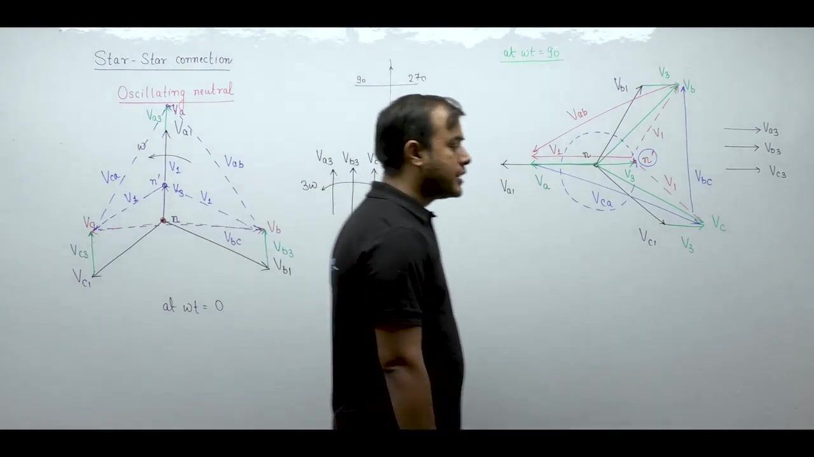

> [!info] Principle of the Oscillating Neutral
> In an ungrounded star-star transformer, the effective neutral $N'$ rotates around the stationary fundamental neutral $N$ in a circle of radius $V_3$ at triple angular speed $3\omega$. This rotation is called the oscillating neutral.

### Phase Voltage Distortion and Unbalance

Because the neutral point continuously shifts along a circular path, instantaneous distances from $N'$ to the three phase vertices change continuously.

Line voltages are independent of zero-sequence harmonics:
$$
V_{ab3} = V_{bc3} = V_{ca3} = 0
$$

The line voltage triangle $\Delta ABC$ remains balanced and invariant.

But the instantaneous phase voltage amplitudes fluctuate periodically:
$$
\begin{aligned}
v_a(t) &= v_{a1}(t) + V_{m3}\sin(3\omega t) \\
v_b(t) &= v_{b1}(t) + V_{m3}\sin(3\omega t) \\
v_c(t) &= v_{c1}(t) + V_{m3}\sin(3\omega t)
\end{aligned}
$$

At some instants, Phase A voltage reaches high positive values while Phase B and Phase C voltages drop. At other instants, Phase A voltage drops while other phases rise.

The phase voltages become heavily unbalanced and distorted.

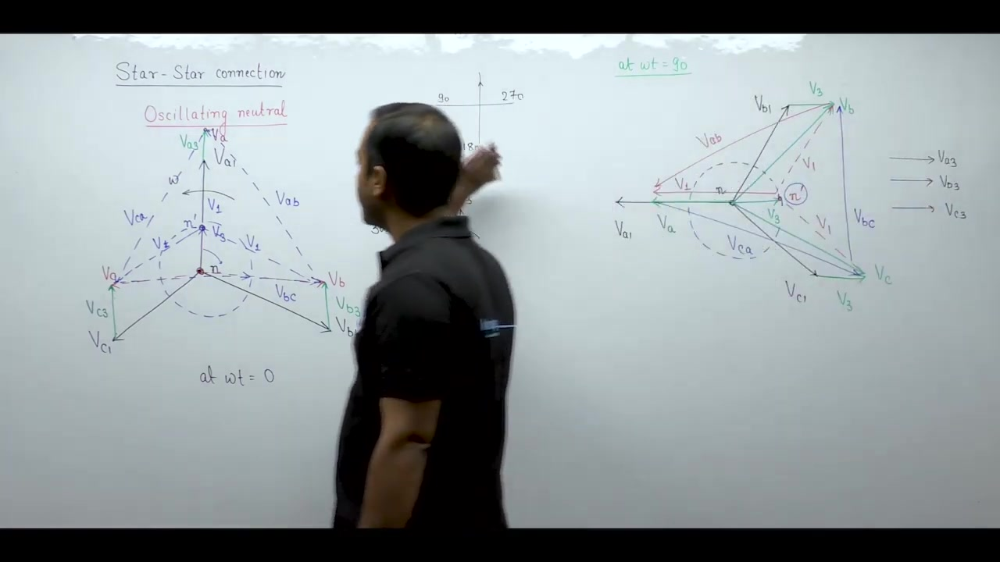

### Operational Hazards for Phase-to-Neutral Loads

The oscillation of neutral potential creates severe operational hazards in power systems.

Connecting single-phase loads between phase terminal and neutral exposes equipment to rapid voltage variations.

Consider domestic lamps or sensitive electronics connected across phase and neutral.

Periodic amplitude swings cause noticeable lamp flickering and stress electronic components.

Sustained voltage oscillations cause overheating and premature insulation breakdown:
$$
V_{\text{peak}} = V_{m1} + V_{m3}
$$

> [!success] Loading Constraint in Star-Star Transformers
> An ungrounded star-star transformer must never supply single-phase loads connected between line and neutral. Phase-to-neutral loads experience continuous voltage fluctuations that degrade performance and damage connected equipment.

## Three-Limb Core Construction and Tank Stray Losses
_(36:14 - 42:21)_

### Third-Harmonic Flux Cancellation in the Iron Core

Now examine the three-limb (three-legged) core-type transformer.

Windings for all three phases sit on the three central limbs. Concentric coils are used on each limb.

Because magnetizing currents lack triplen harmonics in an ungrounded star, each limb attempts to establish equal third-harmonic fluxes:
$$
\Phi_{a3} = \Phi_{b3} = \Phi_{c3} = \Phi_3
$$

These triplen fluxes are co-phasal. They travel in the same vertical direction through each limb toward the top yoke.

Apply Kirchhoff's Flux Law at the top yoke junction:
$$
\sum \Phi = \Phi_{a3} + \Phi_{b3} + \Phi_{c3} = 3\Phi_3 = 0
$$

The iron core provides no unwound return limb. The sum of fluxes entering the yoke junction cannot balance inside the ferromagnetic path:
$$
\Phi_3(\text{core}) = 0
$$

The iron path completely blocks closed zero-sequence flux circulation.

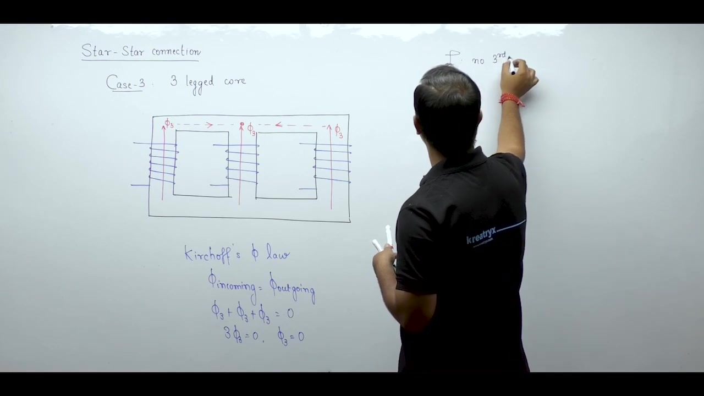

### Return Path Through Surrounding Air and Transformer Tank

This creates a fundamental physical dilemma.

The ungrounded star winding prevents third-harmonic currents. The core geometry provides no ferromagnetic return path for third-harmonic flux.

Magnetic flux must form closed loops. So triplen flux leaks out of the top yoke into the surrounding insulating medium.

The flux completes its loop through transformer oil, surrounding air, and the steel tank walls.

Air and oil have low magnetic permeability:
$$
\mu_{\text{air}} \approx \mu_0 \ll \mu_{\text{iron}}
$$

The magnetic reluctance of this return path is very large:
$$
\mathcal{R}_{\text{leakage}} = \frac{l}{\mu_0 A} \gg \mathcal{R}_{\text{iron}}
$$

Because the path reluctance is high, the resulting third-harmonic flux remains negligible:
$$
\Phi_3 = \frac{\text{MMF}_3}{\mathcal{R}_{\text{leakage}}} \approx 0
$$

So induced third-harmonic EMF $E_3$ remains very small. The core flux stays nearly sinusoidal without severe neutral oscillation.

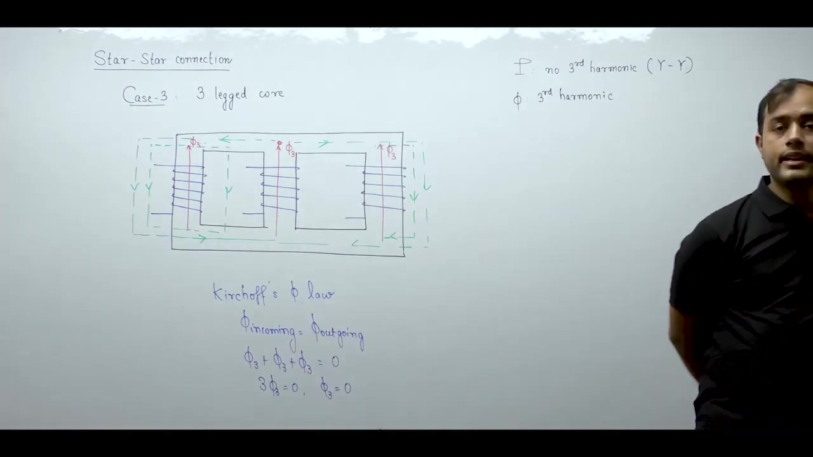

### Eddy Current Heating in Tank Walls and Aluminum Mitigation

Although third-harmonic flux in air is small, it passes directly through structural steel components.

The steel transformer tank provides a magnetic enclosure around the core and coils.

Alternating harmonic flux penetrating the conductive steel tank induces circulating eddy currents.

These induced currents cause resistive power dissipation:
$$
P_{\text{loss}} \propto B_3^2 f_3^2
$$

This produces localized heating and temperature rise in the tank walls.

To prevent excessive overheating, large transformer tanks are constructed from non-magnetic or high-conductivity metals like aluminum.

> [!info] Tank Loss Mitigation
> Aluminum possesses higher electrical conductivity and lower magnetic permeability than structural steel. Using aluminum tanks reduces magnetic field penetration and minimizes stray eddy current losses caused by triplen leakage flux.

## Star-Star Grounding and Telephone Line Interference
_(42:24 - 47:33)_

### Summary of Ungrounded Star-Star Operation

In an ungrounded star-star transformer, magnetizing currents cannot contain triplen harmonics:
$$
I_3 = 0
$$

The magnetizing current remains sinusoidal.

The magnetic core flux becomes flat-topped, introducing a third-harmonic component $\Phi_3$.

The induced phase voltage becomes peaky with magnified harmonic distortion:
$$
\frac{E_3}{E_1} = 3 \left(\frac{\Phi_3}{\Phi_1}\right)
$$

For single-phase transformer banks and five-limb cores, the third-harmonic flux traverses low-reluctance iron limbs. So $\Phi_3$ and $E_3$ reach large values.

For three-limb cores, the third-harmonic flux passes through air, oil, and tank walls. The high reluctance suppresses $\Phi_3$ and $E_3$, but causes tank wall eddy-current losses.

The ungrounded neutral oscillates around fundamental circumcenter $N$ at speed $3\omega$, unbalancing phase voltages.

### Star-Star System with Grounded Neutral

Now ground the neutral point of the star connection.

Grounding provides a return path through earth for zero-sequence currents.

Third-harmonic magnetizing currents can now flow freely through each phase and return through the neutral:
$$
i_n(t) = i_{a3}(t) + i_{b3}(t) + i_{c3}(t) = 3 I_{m3}\sin(3\omega t)
$$

Because the necessary third-harmonic excitation current is supplied, the core flux becomes sinusoidal:
$$
\phi(t) = \Phi_m \sin(\omega t)
$$

The induced phase voltages also become purely sinusoidal:
$$
e(t) = E_m \cos(\omega t)
$$

The oscillating neutral vanishes completely. All phase voltages remain balanced and constant in amplitude.

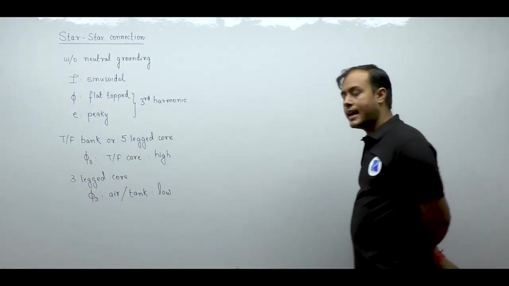

### Mechanism of Communication Line Interference

Grounding the neutral eliminates voltage distortion, but introduces a major operational drawback.

The third-harmonic currents flow out along the three transmission lines in parallel.

Balanced fundamental currents possess a $120^\circ$ phase displacement:
$$
i_{a1} + i_{b1} + i_{c1} = 0
$$

Their external magnetic fields cancel at neighboring parallel wires.

But third-harmonic currents are co-phasal:
$$
i_{a3} = i_{b3} = i_{c3} = I_{m3} \sin(3\omega t)
$$

All three phase conductors carry identical harmonic currents in the same physical direction at the same instant.

The three magnetic fields add constructively in space:
$$
\Phi_{\text{net}} = \Phi_{a3} + \Phi_{b3} + \Phi_{c3} = 3\Phi_3 \neq 0
$$

This pulsating 150 Hz magnetic field cuts across adjacent telephone lines.

Faraday's Law of induction dictates that this time-varying flux induces an unwanted noise voltage:
$$
e_{\text{induced}} = -\frac{d\Phi_{\text{net}}}{dt} \neq 0
$$

The induced 150 Hz voltage produces loud acoustic humming and signal interference on telephone communication circuits.

> [!info] Telephone Interference Factor
> Third-harmonic currents are co-phasal zero-sequence currents. Because they do not cancel in three-phase transmission lines, their combined magnetic flux induces non-zero harmonic voltages in parallel communication cables.

## Harmonic Cancellation in Delta-Star and Star-Delta Connections
_(47:33 - 54:11)_

### Harmonic Suppression Mechanism in Delta-Star ($\Delta-Y$) Banks

Now examine three-phase connections containing at least one delta winding.

Consider first a delta-connected primary supplying an ungrounded star secondary.

Apply a balanced sinusoidal voltage supply to the delta primary.

The primary winding draws an initial sinusoidal magnetizing current.

Due to core saturation, sinusoidal excitation creates a flat-topped core flux:
$$
\phi(t) = \Phi_{m1}\sin(\omega t) + \Phi_{m3}\sin(3\omega t)
$$

By Faraday's Law, this flat-topped flux induces a peaky phase voltage with a large third-harmonic component:
$$
e(t) = -N_1 \frac{d\phi}{dt} = E_{m1}\cos(\omega t) + 3 E_{m3}\cos(3\omega t)
$$

The third-harmonic voltages are co-phasal in all three delta phases.

They sum constructively around the closed delta mesh:
$$
\sum E_3 = e_{a3} + e_{b3} + e_{c3} = 3 E_3 \neq 0
$$

This net internal EMF drives a circulating third-harmonic current inside the delta loop:
$$
I_3 = \frac{3 E_3}{3 Z_3} = \frac{E_3}{Z_3}
$$

By Lenz's Law, this circulating current creates an opposing harmonic MMF.

The opposing flux cancels out the original third-harmonic core flux $\Phi_3$.

Both the resultant core flux and induced voltages become nearly sinusoidal.

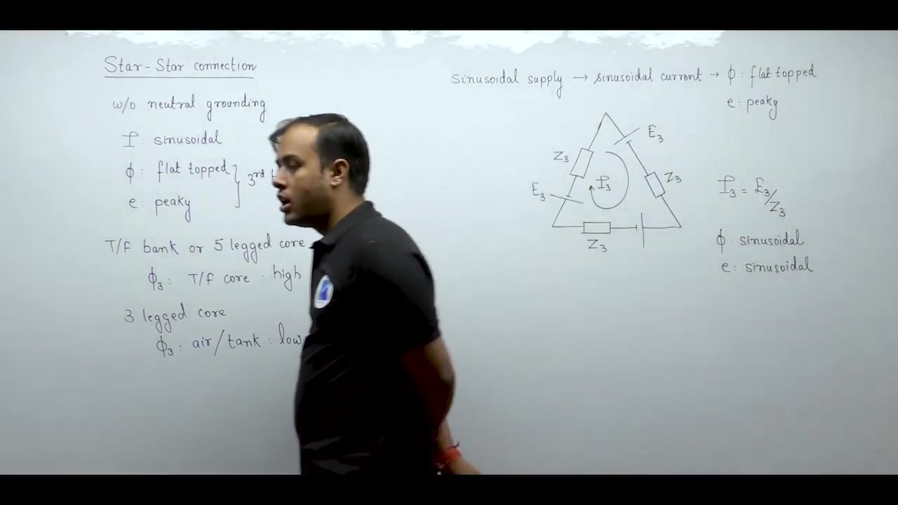

> [!info] Circulating Harmonic Confinement
> The third-harmonic current circulates entirely inside the closed mesh of the delta winding. It does not enter external supply lines. So no interference couples into communication lines.

### Harmonic Compensation in Star-Delta ($Y-\Delta$) Systems

Now consider a transformer with an ungrounded star primary and a delta-connected secondary.

Connect a sinusoidal voltage supply to the ungrounded star primary.

Because the star neutral is isolated, triplen currents cannot flow into the primary lines:
$$
I_{3,\text{pri}} = 0
$$

The primary current remains sinusoidal.

The magnetic core flux becomes flat-topped, establishing harmonic flux $\Phi_3$ across all core limbs.

This flat-topped flux links both primary and secondary turns.

It induces a peaky voltage with a third-harmonic component in each secondary winding phase:
$$
E_{3,\text{sec}} = 3\omega N_2 \Phi_{m3}
$$

The secondary delta winding provides a closed electrical path for zero-sequence voltages.

A third-harmonic circulating current flows around the secondary delta mesh:
$$
I_{3,\text{sec}} = \frac{E_{3,\text{sec}}}{Z_{3,\text{sec}}}
$$

This secondary circulating current establishes an equal and opposite harmonic core flux:
$$
\Phi_{3,\text{sec}} \approx -\Phi_3
$$

The secondary MMF cancels the core harmonic distortion.

As the net harmonic flux drops, the core flux and terminal voltages become nearly sinusoidal.

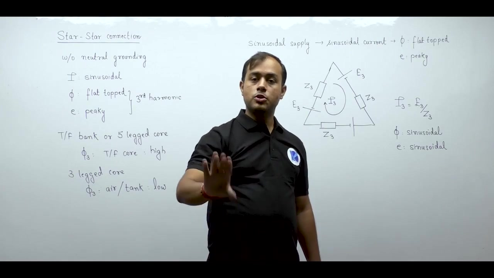

### Comparative Summary of Delta Connections

In both delta-star and star-delta banks, the delta winding provides a self-regulating harmonic filter.

The delta loop allows zero-sequence currents to circulate without flowing into transmission lines.

This provides two major operating advantages:
1. Core flux and induced voltages stay sinusoidal, eliminating neutral point oscillation.
2. Harmonic currents do not enter line conductors, eliminating telephone communication interference.

## Delta-Delta Connection and System Drawbacks of Harmonics
_(54:12 - 59:40)_

### Operation of the Delta-Delta ($\Delta-\Delta$) Transformer

In a delta-delta transformer, both primary and secondary circuits form closed loops.

When connected to a sinusoidal source, initial magnetizing action establishes third-harmonic voltages.

Because each side is a closed delta mesh, third-harmonic currents circulate freely in both windings:
$$
I_{3,\text{pri}} = \frac{E_{3,\text{pri}}}{Z_{3,\text{pri}}}, \quad I_{3,\text{sec}} = \frac{E_{3,\text{sec}}}{Z_{3,\text{sec}}}
$$

These circulating harmonic currents establish opposing MMFs in the core.

The opposing fluxes suppress third-harmonic distortion, maintaining sinusoidal core flux and induced EMFs.

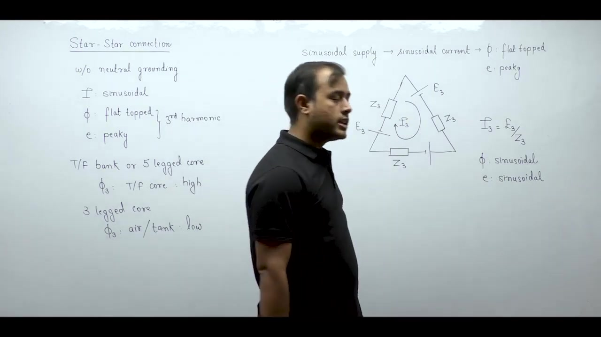

### Confinement of Triplen Currents Within Delta Meshes

A major technical advantage of the delta connection is harmonic confinement.

Consider line current entering a delta node:
$$
i_L(t) = i_a(t) - i_b(t)
$$

The third-harmonic currents in phase windings are co-phasal and equal:
$$
i_{a3}(t) = i_{b3}(t) = I_{m3}\sin(3\omega t)
$$

Now calculate the line third-harmonic current:
$$
i_{L3}(t) = i_{a3}(t) - i_{b3}(t) = 0
$$

Triplen currents remain trapped inside the delta mesh and never exit to the transmission lines.

In a star connection, line and phase currents are identical ($I_{\text{line}} = I_{\text{phase}}$). When neutral is grounded, triplen currents flow into transmission lines and cause telephone interference.

Delta connections eliminate communication line interference completely.

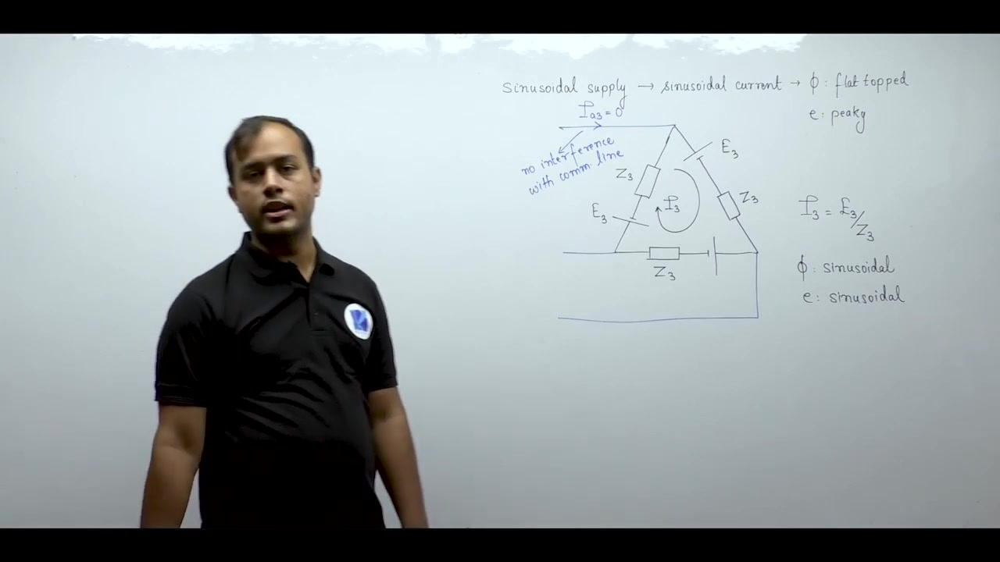

> [!info] Universal Delta Rule
> If any winding in a transformer bank is connected in delta, it carries the necessary third-harmonic magnetizing current internally. Core flux and induced voltages remain sinusoidal without generating external line harmonic currents.

### System-Wide Drawbacks of Harmonic Currents

Although circulating harmonic currents preserve sinusoidal flux, they introduce two distinct operational penalties.

First, harmonics increase winding copper loss.

Calculate the total RMS winding current:
$$
I_{\text{rms}} = \sqrt{I_1^2 + I_3^2 + I_5^2 + \dots}
$$

Because $I_{\text{rms}} > I_1$, the effective current heating the winding increases:
$$
P_{\text{cu}} = 3 I_{\text{rms}}^2 R = 3 (I_1^2 + I_3^2 + \dots) R
$$

Harmonic currents deliver zero active power to the load, but generate heat inside the copper conductors. This lowers overall transformer efficiency and increases thermal rating requirements.

Second, triplen currents that leak into transmission lines produce electromagnetic interference.

If zero-sequence harmonic currents flow along transmission lines, their time-varying magnetic field induces 150 Hz noise voltages in adjacent telephone circuits.

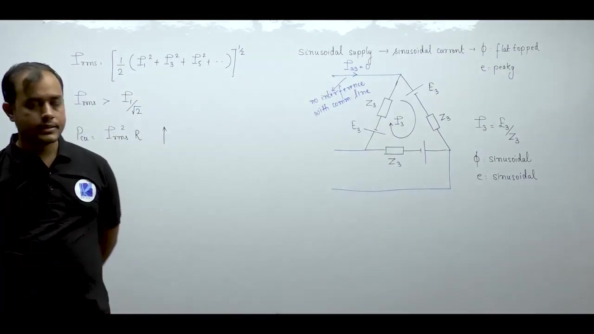

## Harmonic Suppression Techniques and Delta Tertiary Windings
_(59:40 - 66:27)_

### Core Loss Reduction in Flat-Topped Flux Regimes

A flat-topped flux waveform exhibits a reduced peak flux density $B_m$ compared to a pure sine wave of equal RMS voltage.

Core hysteresis loss depends strongly on peak flux density:
$$
P_h = k_h f B_m^{1.6}
$$

Eddy-current loss depends on the square of peak flux density:
$$
P_e = k_e f^2 B_m^2
$$

Because peak flux density drops, the total core iron loss decreases. This iron loss reduction is the sole technical benefit of a flat-topped flux profile.

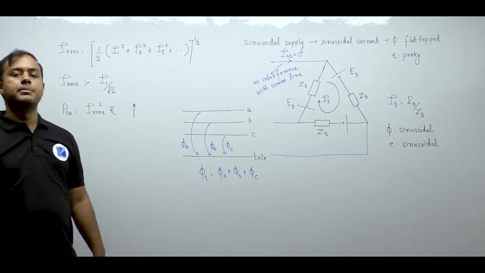

### Core Flux Density Reduction and Delta Phase Winding

Waveform distortion originates from magnetic saturation along the ferromagnetic B-H curve.

Several practical engineering methods eliminate harmonic distortion in power networks.

First, design the transformer with lower operating flux density:
$$
B_{\text{op}} < B_{\text{knee}}
$$

Confining operation strictly to the linear region of the magnetization curve prevents core saturation. Current and flux remain purely sinusoidal. But this requires larger core cross-sections, increasing transformer weight and manufacturing cost.

Second, connect at least one main winding in delta.

A delta primary or delta secondary provides an internal loop for zero-sequence currents.

Circulating third-harmonic currents cancel harmonic core flux. The induced phase voltage remains sinusoidal.

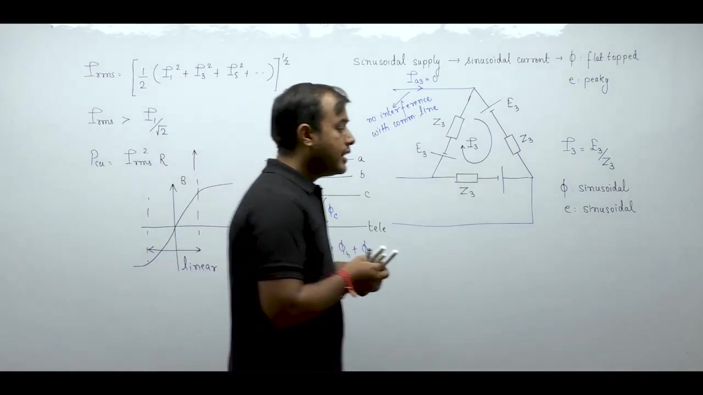

### Parallel Earthing Transformers and Delta Tertiary Windings

When an existing star-star installation must be retained, two specialized configurations eliminate harmonics.

The third method connects a star-delta grounding transformer in parallel with the main star-star bank:
$$
Y-Y \ \parallel \ Y-\Delta
$$

The auxiliary delta winding circulates the third-harmonic current. This cancels the zero-sequence core flux of the entire station.

The fourth and most widely used solution is the delta-connected tertiary winding.

A three-winding transformer is constructed with star primary, star secondary, and delta tertiary:
$$
Y-Y-\Delta
$$

The tertiary winding provides an internal closed loop on the common magnetic core.

Induced third-harmonic voltages drive circulating current:
$$
I_{3,\text{ter}} = \frac{E_{3,\text{ter}}}{Z_{3,\text{ter}}}
$$

This circulating current cancels out core third-harmonic flux $\Phi_3$.

Core flux and induced phase EMFs become sinusoidal. Neutral point oscillation is suppressed completely.

The tertiary delta also supplies auxiliary substation loads at an independent voltage level.

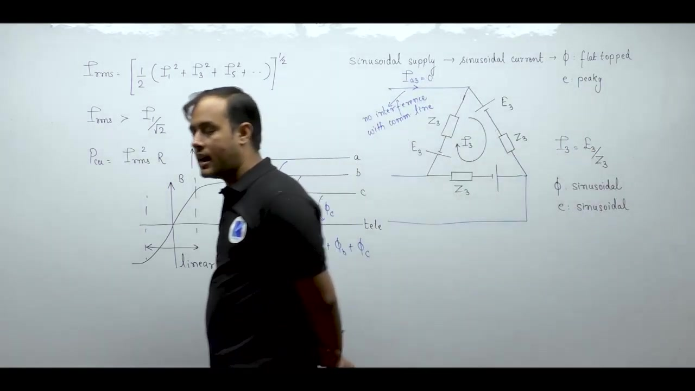

> [!success] Role of the Tertiary Delta
> In high-voltage star-star transformers, a delta tertiary winding provides a closed path for circulating third-harmonic currents. This eliminates the oscillating neutral, prevents telephone line interference, and stabilizes unbalanced phase voltages.

## Harmonics Synthesis and Examination Principles
_(66:27 - 70:10)_

### Comprehensive Functions of Tertiary Delta Windings

A tertiary winding connected in delta serves four main functions in modern substations.

First, it interconnects three distinct transmission voltage levels on a single transformer bank.

Second, connecting capacitor banks or synchronous condensers to the tertiary bus provides reactive power compensation. This improves station power factor and regulates transmission voltage.

Third, it provides a low-voltage supply for substation auxiliary loads like cooling fans, station lighting, and battery chargers.

Fourth, it circulates zero-sequence triplen currents internally:
$$
I_3 = \frac{E_3}{Z_3}
$$

Circulating harmonic currents neutralize third-harmonic core flux.

This suppresses the oscillating neutral completely.

With a stable neutral potential, operators can safely connect single-phase loads between phase and neutral.

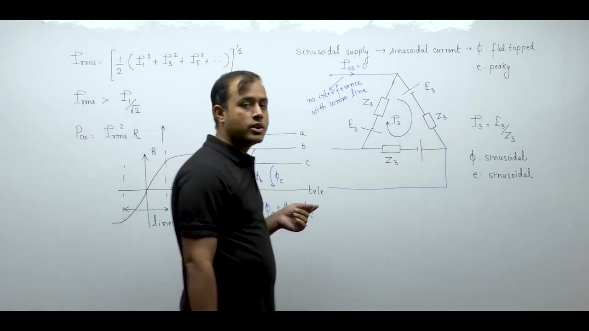

### Voltage Calculation Rules for Competitive Examinations

To solve numerical problems on harmonics, apply strict rules for star and delta terminals.

In a star connection, triplen harmonics appear in phase voltages:
$$
V_{\text{ph,rms}} = \sqrt{V_1^2 + V_3^2 + V_5^2 + \dots}
$$

Because line voltages are line-to-line potential differences, third harmonics subtract to zero:
$$
\mathbf{V}_{ab3} = \mathbf{V}_{a3} - \mathbf{V}_{b3} = \mathbf{0}
$$

Always exclude the third harmonic when computing star line voltages:
$$
V_{\text{L,rms}} = \sqrt{3}\,\sqrt{V_1^2 + V_5^2 + V_7^2 + \dots}
$$

When third harmonics exist in phase voltages, the line-to-phase ratio drops below the standard root-three factor:
$$
\frac{V_{\text{L,rms}}}{V_{\text{ph,rms}}} = \frac{\sqrt{3}\,V_1}{\sqrt{V_1^2 + V_3^2}} < \sqrt{3}
$$

In a delta connection, phase voltage and line voltage are identical:
$$
V_L = V_{ph}
$$

All third-harmonic voltages are trapped inside the delta loop. Third harmonics never appear across external terminals:
$$
V_{3,\text{terminal}} = 0
$$

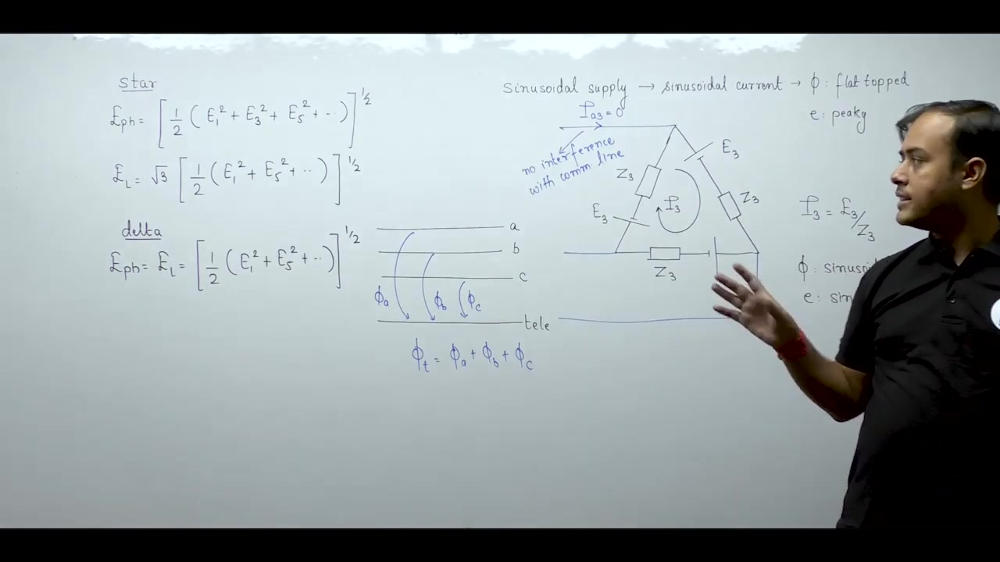

> [!success] Harmonic Voltage Calculation Rule
> For star connections, include third harmonics in phase voltage calculations, but exclude third harmonics from line voltage calculations. For delta connections, exclude third-harmonic voltages from both phase and line terminal values.

### Outlook Toward Switching Inrush Transients

With core excitation and harmonics fully analyzed, the steady-state magnetic behavior of transformers is established.

The remaining non-linear magnetic phenomenon is the switching transient.

When a transformer is energized onto an AC voltage source, magnetic flux can momentarily double its peak value.

This transient flux drives the iron core deep into saturation, drawing enormous magnetizing inrush currents.

---

## Summary and Key Takeaways

- In three-phase transformers, third-harmonic components are co-phasal zero-sequence quantities with identical phase angles across all three phases.
- Differentiating flux magnifies voltage distortion by the harmonic order: $E_n / E_1 = n (\Phi_n / \Phi_1)$, raising the third-harmonic induced voltage distortion by a factor of three.
- In ungrounded star-star systems, the effective neutral $N'$ rotates around the stationary fundamental circumcenter $N$ in a circle of radius $V_3$ at triple angular speed $3\omega$.
- Three-phase banks and five-limb cores provide low-reluctance iron paths that sustain high third-harmonic flux $\Phi_3$ and peaky phase voltages.
- Three-limb cores lack an iron return path for zero-sequence flux, forcing third-harmonic flux into the surrounding oil, air, and tank walls.
- Grounding the neutral in star-star systems allows third-harmonic currents to flow through transmission lines, which causes electromagnetic interference in parallel communication circuits.
- Delta windings form closed meshes where zero-sequence EMFs drive circulating currents $I_3 = E_3 / Z_3$ that cancel core harmonic flux and suppress the oscillating neutral.
- Third-harmonic currents trapped within delta meshes cannot enter external lines ($I_{L3} = 0$), completely eliminating communication line noise.
- Delta tertiary windings in three-winding transformers ($Y-Y-\Delta$) stabilize the neutral potential, improve station power factor, and allow single-phase phase-to-neutral loading.

---

[← Lec 050: Excitation Phenomenon 2](Lecture_050_Excitation_Phenomenon_2.md) | [🏠 Index](00_yt_study_guide.md) | [Lec 052: Switching Transients →](Lecture_052_Switching_Transients.md)
