[← Lec 051: Excitation Phenomenon 3](Lecture_051_Excitation_Phenomenon_3.md) | [🏠 Index](00_yt_study_guide.md) | [Lec 053: Problems based on Harmonics and Inrush Current →](Lecture_053_Problems_based_on_Harmonics_and_Inrush_Current.md)

---

# Electrical Machines | Lec 36 | Switching Transients | GATE/ESE Electrical Engineering

- **Source**: https://www.youtube.com/watch?v=ZCa9PWbW3MQ
- **Duration**: 00:45:21
- **Compiled**: 2026-09-21

---

## Overview

This lecture examines switching transients and the physics of magnetizing inrush current in power transformers. It derives the mathematical equation of core flux following sudden energization. The discussion highlights how core saturation and switching angles govern peak transient fluxes. It also analyzes protective relay coordination methods using harmonic restraint.

## Contents

- [[#Principles of Switching Transients and Transformer Modeling|Principles of Switching Transients and Transformer Modeling]]
- [[#Derivation of Core Flux and Transient Offset|Derivation of Core Flux and Transient Offset]]
- [[#Zero-Voltage Switching and Flux Doubling|Zero-Voltage Switching and Flux Doubling]]
- [[#Core Saturation and Magnetizing Inrush Current|Core Saturation and Magnetizing Inrush Current]]
- [[#Residual Flux Effects and Switching Angle Optimization|Residual Flux Effects and Switching Angle Optimization]]
- [[#Waveform Asymmetry and Second Harmonic Dominance|Waveform Asymmetry and Second Harmonic Dominance]]
- [[#Transient Damping and Mechanical Winding Stresses|Transient Damping and Mechanical Winding Stresses]]
- [[#Protection Relay Coordination and Transformer Module Summary|Protection Relay Coordination and Transformer Module Summary]]

---

## Principles of Switching Transients and Transformer Modeling
_(00:13 - 06:40)_

### Steady-State Analysis Versus Switching Transients

All prior transformer analyses examined settled AC steady-state performance.

A complete time-domain response consists of two distinct components:
$$
x(t) = x_{\text{transient}}(t) + x_{\text{steady-state}}(t)
$$

The steady-state response describes operation long after disturbances subside.

Whenever a circuit switch closes or opens, energy stored in magnetic fields cannot change instantaneously.

This sudden switching induces an AC switching transient.

The nature of the transient determines peak voltages and initial currents drawn by the transformer.

> [!info] Definition of Switching Transient
> A switching transient is the temporary dynamic response produced when a transformer is suddenly connected to or disconnected from an alternating voltage source by a switch.

### No-Load Transformer Model as an Inductive Coil

Consider an unloaded transformer with its secondary terminals open-circuited.

The primary winding draws total no-load current $I_0$:
$$
\mathbf{I}_0 = \mathbf{I}_\mu + \mathbf{I}_w
$$

Here $I_\mu$ represents reactive magnetizing current, and $I_w$ represents active core loss current.

In power transformers, the magnetizing component far exceeds the core loss component:
$$
I_\mu \gg I_w
$$

We can neglect $I_w$ during transient analysis without introducing significant error.

With secondary open and core losses neglected, the primary winding acts as an inductor.

Current flowing through the coil establishes magnetic flux linkage $\lambda$ in the iron core.

### Core Non-Linearities: Saturation and Hysteresis

In an ideal linear inductor, flux linkage is directly proportional to current:
$$
\lambda = L i \implies v(t) = L \frac{di}{dt}
$$

A ferromagnetic transformer core does not obey this linear relationship.

Two distinct physical non-linearities govern practical transformer cores:
1. Magnetic saturation: the B-H curve flattens at high flux density.
2. Magnetic hysteresis: the magnetization curve forms a closed loop, retaining remnant flux.

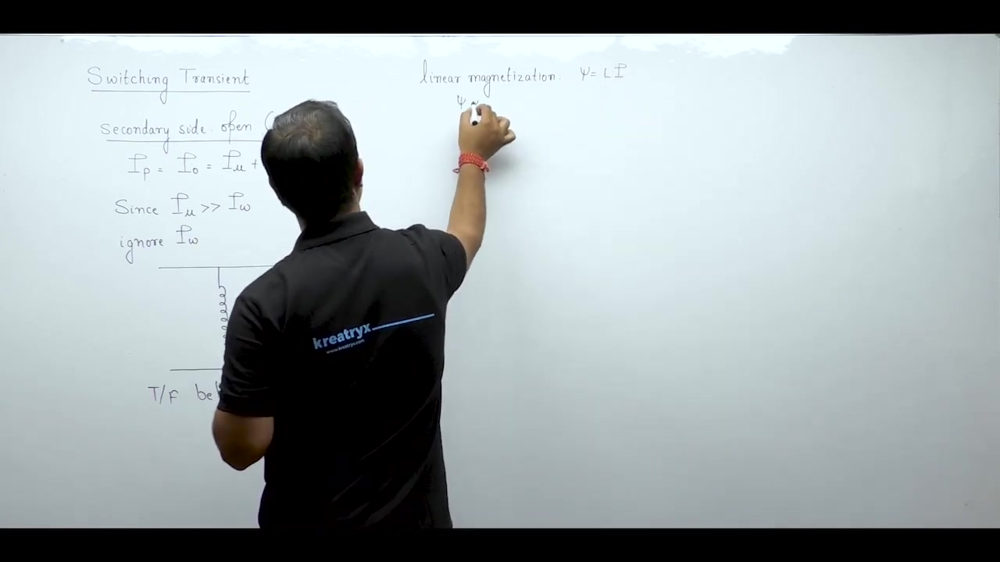

Because differential inductance $L = \frac{d\lambda}{di}$ varies non-linearly with flux density, the equation $v = L \frac{di}{dt}$ cannot model a saturable iron core.

We must apply Faraday's Law of electromagnetic induction directly:
$$
v(t) = N_1 \frac{d\phi}{dt}
$$

### Energization Circuit Formulation

Consider a transformer primary energized by a sinusoidal voltage source:
$$
v(t) = V_m \sin(\omega t)
$$

The circuit is connected through an ideal switch.

The switch closes at an arbitrary switching instant:
$$
t = t_0
$$

The secondary winding remains open.

At the instant of closure, the core voltage satisfies:
$$
N_1 \frac{d\phi}{dt} = V_m \sin(\omega t)
$$

Rearranging this differential equation gives the incremental core flux:
$$
d\phi = \frac{V_m}{N_1} \sin(\omega t)\,dt
$$

Solving this integral equation determines the transient flux trajectory and reveals whether dangerous flux peaks occur.

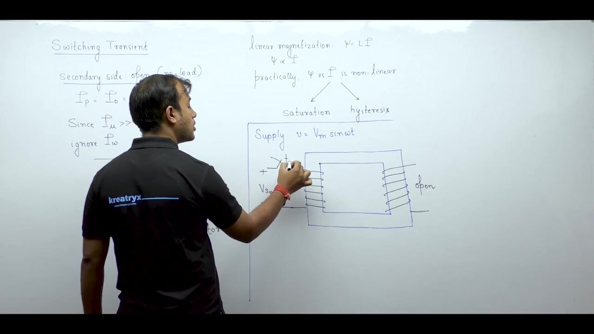

## Derivation of Core Flux and Transient Offset
_(06:40 - 12:49)_

### Mathematical Derivation of Core Flux

Now derive the exact time-domain expression for magnetic flux following switch closure.

The applied alternating voltage is:
$$
v(t) = V_m \sin(\omega t)
$$

Neglecting winding resistance, induced back-EMF equals applied voltage:
$$
e(t) = N_1 \frac{d\phi}{dt} = V_m \sin(\omega t)
$$

Separate variables and scale the time differential by angular frequency $\omega$:
$$
d\phi = \frac{V_m}{\omega N_1} \sin(\omega t)\,d(\omega t)
$$

Define peak steady-state core flux amplitude $\Phi_m$:
$$
\Phi_m = \frac{V_m}{\omega N_1}
$$

When previous excitation ceases, magnetic hysteresis leaves residual flux in the core.

This remnant flux can be directed clockwise or counter-clockwise:
$$
\phi(t_0) = \pm \phi_r
$$

Now integrate both sides from initial switching instant $t = t_0$ to arbitrary observation time $t$:
$$
\int_{\pm \phi_r}^{\phi(t)} d\phi = \Phi_m \int_{\omega t_0}^{\omega t} \sin(\omega t)\,d(\omega t)
$$

Evaluate the definite integrals on both sides:
$$
\phi(t) - (\pm \phi_r) = -\Phi_m \left[\cos(\omega t) - \cos(\omega t_0)\right]
$$

Rearranging terms yields the total core flux equation:
$$
\phi(t) = -\Phi_m \cos(\omega t) + \Phi_m \cos(\omega t_0) \pm \phi_r
$$

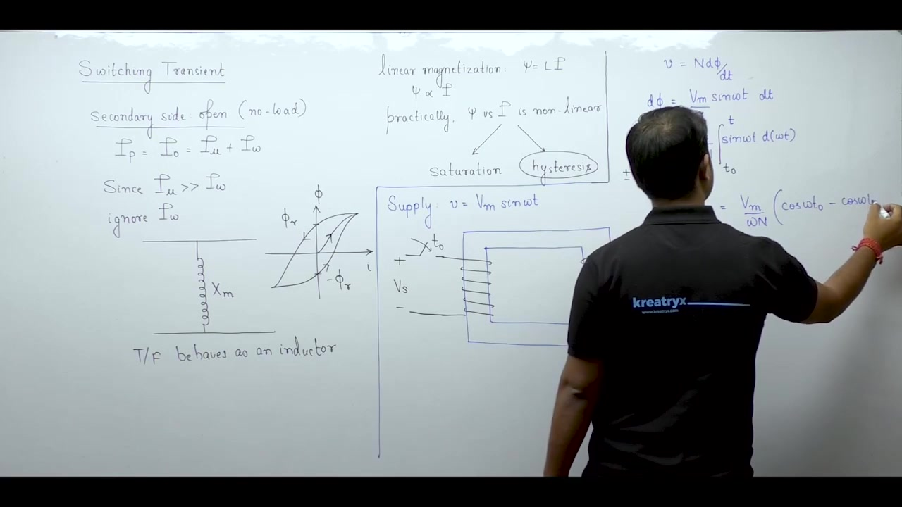

### Steady-State Versus Transient Component Identification

Now compare this dynamic result with steady-state expectations from phasor analysis.

In steady state, magnetizing current and core flux lag applied terminal voltage by ninety degrees:
$$
\phi_{\text{ss}}(t) = \Phi_m \sin(\omega t - 90^\circ)
$$

Using trigonometric identities, this simplifies directly:
$$
\sin(\omega t - 90^\circ) = -\cos(\omega t)
$$

So the pure steady-state flux component is:
$$
\phi_{\text{ss}}(t) = -\Phi_m \cos(\omega t)
$$

Notice that the derived total flux contains this exact steady-state term, but also includes additional constant terms.

Partition the total response into its two fundamental parts:
$$
\phi(t) = \phi_{\text{ss}}(t) + \phi_{\text{trans}}(t)
$$

Here the transient flux component is:
$$
\phi_{\text{trans}}(t) = \Phi_m \cos(\omega t_0) \pm \phi_r
$$

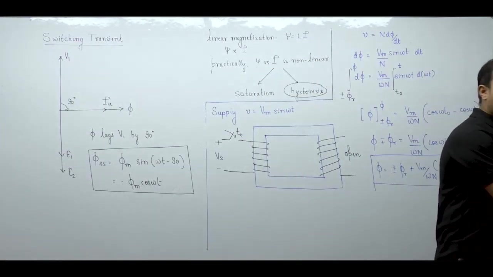

> [!success] Core Flux Composition Law
> When an unloaded transformer is energized at instant $t_0$, the resulting core flux is the superposition of an alternating steady-state component and a unidirectional transient DC offset:
> $$
> \phi(t) = \underbrace{-\Phi_m \cos(\omega t)}_{\text{AC Steady State}} + \underbrace{\Phi_m \cos(\omega t_0) \pm \phi_r}_{\text{Transient DC Offset}}
> $$

The transient term acts as a DC bias. Its magnitude depends directly on the voltage phase angle at the exact instant the contacts close.

## Zero-Voltage Switching and Flux Doubling
_(12:52 - 17:52)_

### Switching at the Zero-Voltage Instant

Now evaluate the core flux trajectory when the switch closes at $t_0 = 0$.

The applied voltage is:
$$
v(t) = V_m \sin(\omega t)
$$

At the switching instant:
$$
v(0) = V_m \sin(0) = 0
$$

Energizing at $t_0 = 0$ corresponds to closing the switch exactly when supply voltage passes through zero.

Assume for now that residual flux is zero:
$$
\phi_r = 0
$$

Substitute $t_0 = 0$ into the general flux equation:
$$
\phi(t) = -\Phi_m \cos(\omega t) + \Phi_m \cos(0)
$$

Because $\cos(0) = 1$, the expression simplifies:
$$
\phi(t) = \Phi_m (1 - \cos\omega t)
$$

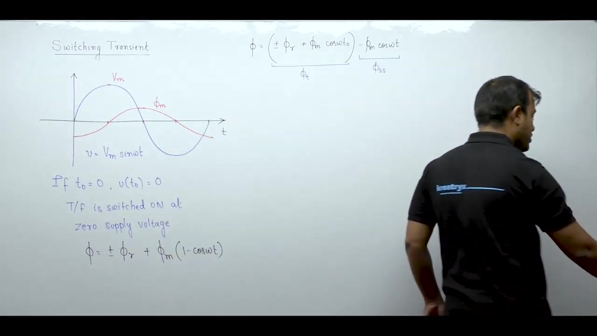

### Evaluation of Flux Waveform Values

Trace the value of core flux across the first half-cycle of the supply voltage.

At the initial instant $\omega t = 0$:
$$
\phi(0) = \Phi_m (1 - 1) = 0
$$

At one-quarter cycle ($\omega t = 90^\circ = \pi/2$):
$$
\phi\left(\frac{\pi}{2}\right) = \Phi_m (1 - 0) = \Phi_m
$$

At one-half cycle ($\omega t = 180^\circ = \pi$):
$$
\phi(\pi) = \Phi_m (1 - (-1)) = 2\Phi_m
$$

At the completion of one full cycle ($\omega t = 360^\circ = 2\pi$):
$$
\phi(2\pi) = \Phi_m (1 - 1) = 0
$$

The flux wave starts from zero, rises to a maximum of $2\Phi_m$ at $\omega t = \pi$, and returns to zero at $\omega t = 2\pi$.

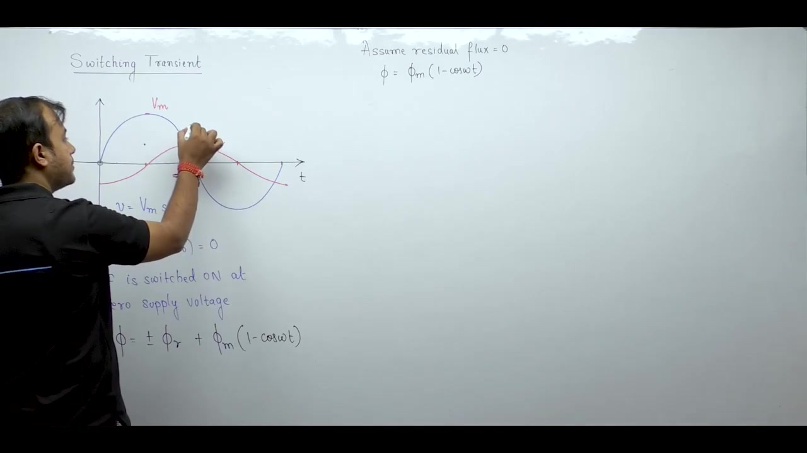

### The Flux Doubling Phenomenon

Compare this transient flux waveform with normal steady-state operation.

In normal steady state, flux oscillates symmetrically about zero:
$$
-\Phi_m \le \phi_{\text{ss}}(t) \le +\Phi_m
$$

Under zero-voltage switching, the flux wave contains a constant DC offset of $\Phi_m$.

The entire waveform shifts into the positive region:
$$
0 \le \phi(t) \le 2\Phi_m
$$

The maximum flux reaches exactly twice the peak steady-state value:
$$
\phi_{\text{peak}} = 2\Phi_m
$$

> [!success] The Flux Doubling Effect
> When a transformer is energized at the zero crossing of the supply voltage wave, the magnetic core flux experiences flux doubling. The peak transient flux reaches twice its rated steady-state amplitude:
> $$
> \phi_{\max} = 2\Phi_m
> $$

Transformers operate with steady-state peak flux density near the knee of magnetic saturation.

Doubling the core flux drives the ferromagnetic material into deep magnetic saturation.

## Core Saturation and Magnetizing Inrush Current
_(17:55 - 22:49)_

### The Non-Linear Magnetization Characteristic

To understand why flux doubling causes severe currents, examine the magnetic core saturation curve.

The relationship between core flux $\phi$ and magnetizing current $i_\mu$ is non-linear.

Under normal rated conditions, transformers operate near the knee point of the magnetization curve.

At the knee point, rated peak flux $\Phi_m$ requires a small magnetizing current:
$$
I_{\mu,\text{normal}} \approx (0.03 \text{ to } 0.05) I_{\text{FL}}
$$

This represents just three to five percent of rated full-load current $I_{\text{FL}}$.

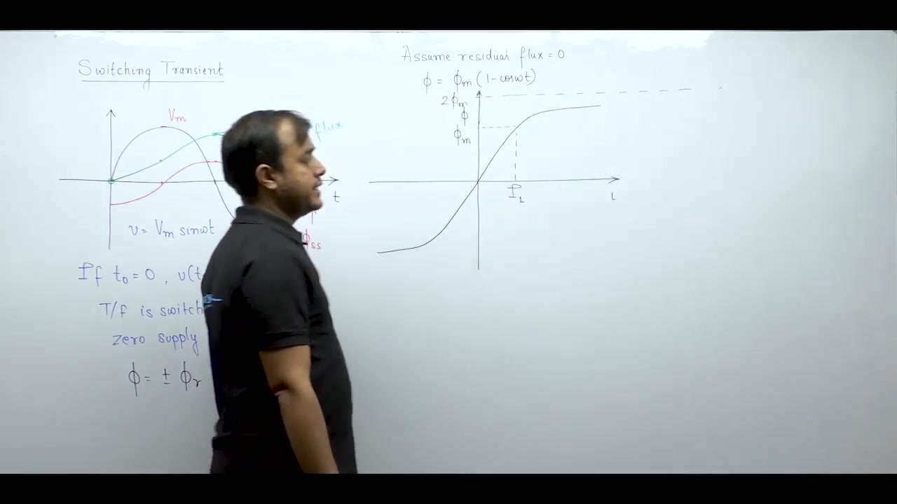

### Mechanism of Magnetizing Inrush Current

When zero-voltage switching drives the transient flux to $2\Phi_m$, the core enters deep saturation.

Beyond the knee point, the iron core behaves almost like an air core.

Incremental permeability drops toward the permeability of free space:
$$
\mu_r = \frac{1}{\mu_0} \frac{dB}{dH} \to 1
$$

In an ideal linear system, doubling the flux would simply double the current:
$$
\phi \propto i \implies I(2\Phi_m) = 2 I(\Phi_m)
$$

Because the curve flattens horizontally, establishing twice normal flux requires an immense increase in magnetizing ampere-turns.

The projection of $2\Phi_m$ onto the horizontal current axis lies extraordinarily far to the right.

The magnetizing current surges by roughly one hundred times its normal no-load value:
$$
\frac{I_{\text{inrush}}}{I_{\mu,\text{normal}}} \approx 100
$$

This enormous current drawn during core saturation is termed magnetizing inrush current.

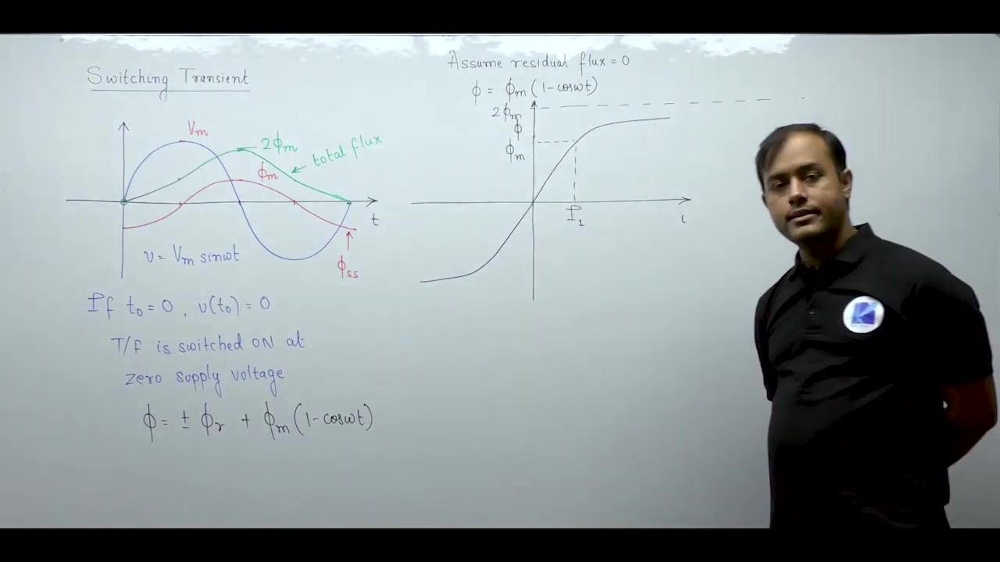

### Magnitude Relative to Rated Full-Load Current

Evaluate this surge in terms of rated full-load current $I_{\text{FL}}$.

Normal no-load current ranges from four to six percent of full-load current:
$$
I_0 \approx (0.04 \text{ to } 0.06) I_{\text{FL}}
$$

A hundred-fold amplification turns this small fraction into a massive surge:
$$
I_{\text{inrush}} \approx (5 \text{ to } 10) \times I_{\text{FL}}
$$

This means inrush current reaches five hundred to one thousand percent of the transformer rating.

> [!info] Magnetizing Inrush Current
> Magnetizing inrush current is the severe transient current drawn by a transformer upon sudden energization. It is caused by core flux doubling driving the ferromagnetic core deep into magnetic saturation. Peak values typically reach 5 to 10 times the rated full-load current.

Although the transformer is completely unloaded, it momentarily draws currents comparable to severe external short circuits.

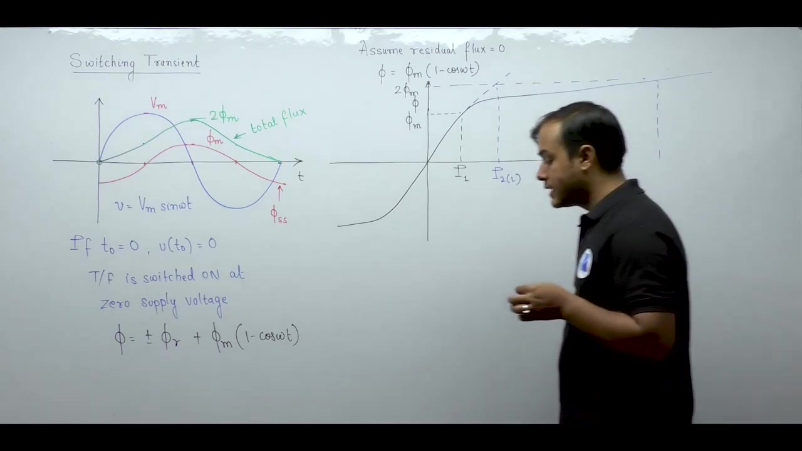

## Residual Flux Effects and Switching Angle Optimization
_(22:58 - 27:56)_

### Amplification of Peak Flux by Residual Magnetism

Now examine the impact of pre-existing residual flux $\phi_r$ inside the ferromagnetic core.

When a transformer is disconnected from the power grid, hysteresis prevents the core flux from dropping to zero.

Assume the core retains positive residual flux $+\phi_r$ oriented in the direction of the initial half-cycle.

Substitute this initial condition into the general flux integral for zero-voltage switching ($t_0 = 0$):
$$
\phi(t) = \Phi_m (1 - \cos\omega t) + \phi_r
$$

To find the maximum core flux, differentiate or set the cosine term to its minimum:
$$
\cos(\omega t) = -1 \implies \omega t = \pi
$$

Substitute $\cos(\pi) = -1$ into the equation:
$$
\phi_{\max} = \Phi_m (1 - (-1)) + \phi_r = 2\Phi_m + \phi_r
$$

The remnant flux elevates the peak flux beyond twice the steady-state rating.

Because the core was already deeply saturated at $2\Phi_m$, adding $\phi_r$ pushes the operating point into the extreme air-core saturation region.

The resulting inrush current becomes even more severe.

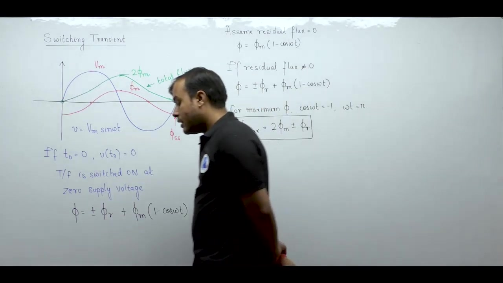

### Parametric Analysis of the Switching Instant

Now consider how the instant of switch closure affects the magnitude of the transient.

Recall the general flux equation without residual flux:
$$
\phi(t) = -\Phi_m \cos(\omega t) + \Phi_m \cos(\omega t_0)
$$

The transient component is determined solely by the switching angle $\omega t_0$:
$$
\phi_{\text{trans}} = \Phi_m \cos(\omega t_0)
$$

Because transients are undesirable, engineers seek to understand the two extreme operational boundaries.

### Worst-Case Transient Condition

The worst-case transient occurs when the transient flux amplitude reaches its maximum positive value:
$$
\cos(\omega t_0) = 1 \implies \omega t_0 = 0
$$

Evaluate the instantaneous supply voltage at this switching instant:
$$
v(t_0) = V_m \sin(0) = 0
$$

When energization occurs at zero instantaneous voltage, the transient DC offset equals $\Phi_m$.

This produces complete flux doubling and triggers the maximum possible magnetizing inrush current.

### Transient-Free Energization Condition

Conversely, we can eliminate the transient entirely by forcing the DC offset to zero:
$$
\phi_{\text{trans}} = \Phi_m \cos(\omega t_0) = 0
$$

This requires the cosine of the switching angle to vanish:
$$
\cos(\omega t_0) = 0 \implies \omega t_0 = \frac{\pi}{2} \ (90^\circ)
$$

Evaluate the instantaneous supply voltage at this switching angle:
$$
v(t_0) = V_m \sin\left(\frac{\pi}{2}\right) = V_m
$$

When energization occurs at peak instantaneous voltage, the transient offset is zero.

The flux immediately tracks the sinusoidal steady-state trajectory:
$$
\phi(t) = -\Phi_m \cos(\omega t)
$$

No flux doubling occurs, and no inrush current is drawn.

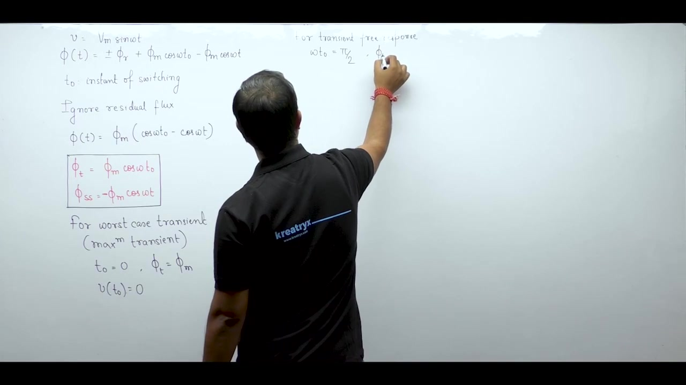

> [!success] Optimal Switching Rule
> In an unloaded transformer, switching at zero voltage produces the maximum transient DC offset ($\Phi_{\text{trans}} = \Phi_m$) and maximum inrush current. Switching at peak supply voltage ($v = V_m$) eliminates the transient entirely ($\Phi_{\text{trans}} = 0$), yielding immediate steady-state operation without inrush.

## Waveform Asymmetry and Second Harmonic Dominance
_(27:59 - 34:57)_

### Practical Switching Conditions

In power system substations, circuit breaker poles close at random points along the voltage cycle.

The switching angle lies somewhere between the two extremes:
$$
0 < \omega t_0 < \frac{\pi}{2}
$$

The resulting transient DC offset falls strictly between zero and maximum:
$$
0 < \phi_{\text{trans}} < \Phi_m
$$

So inrush currents under practical conditions are neither zero nor at absolute maximum, but remain large.

### Unidirectional Offset and Loss of Half-Wave Symmetry

Under worst-case switching, the total flux oscillates with a large DC bias:
$$
\phi(t) = \Phi_m (1 - \cos\omega t)
$$

The flux wave never enters the negative territory. It oscillates entirely in the positive half-plane.

Projecting this flux waveform through the non-linear magnetic saturation curve yields the magnetizing current.

During positive peaks near $2\Phi_m$, deep saturation draws sharp, narrow current pulses.

During the lower portion of the cycle near zero flux, current drops almost to zero.

The magnetizing inrush current is completely unidirectional.

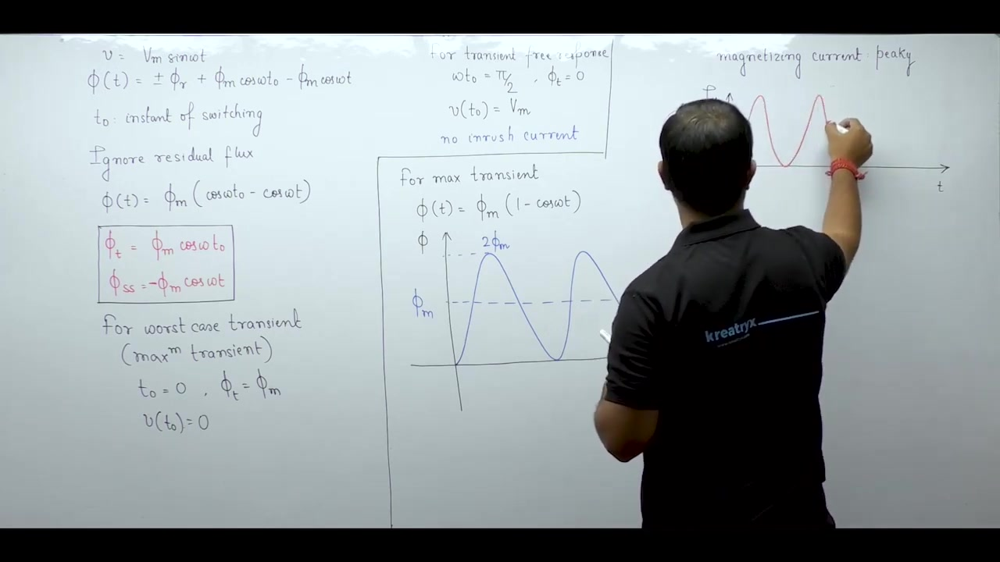

Now test for mathematical half-wave symmetry:
$$
f\left(t + \frac{T}{2}\right) = -f(t)
$$

Normal steady-state magnetizing current has identical positive and negative peaks, satisfying half-wave symmetry.

Inrush current has sharp positive peaks and zero negative excursions:
$$
i_{\text{inrush}}\left(t + \frac{T}{2}\right) \neq -i_{\text{inrush}}(t)
$$

Inrush current completely lacks half-wave symmetry.

### Fourier Analysis and Second Harmonic Dominance

According to Fourier series theory, waveforms lacking half-wave symmetry contain even harmonics alongside odd harmonics.

Expand the inrush current into its Fourier components:
$$
i_{\text{inrush}}(t) = I_{\text{dc}} + I_1 \cos(\omega t + \theta_1) + \sum_{n=2}^\infty I_n \cos(n\omega t + \theta_n)
$$

Harmonic amplitudes typically decay inversely with harmonic order $n$.

The lowest order harmonic after the fundamental is the second harmonic ($n = 2$).

So the second harmonic emerges as the most dominant harmonic component in magnetizing inrush current.

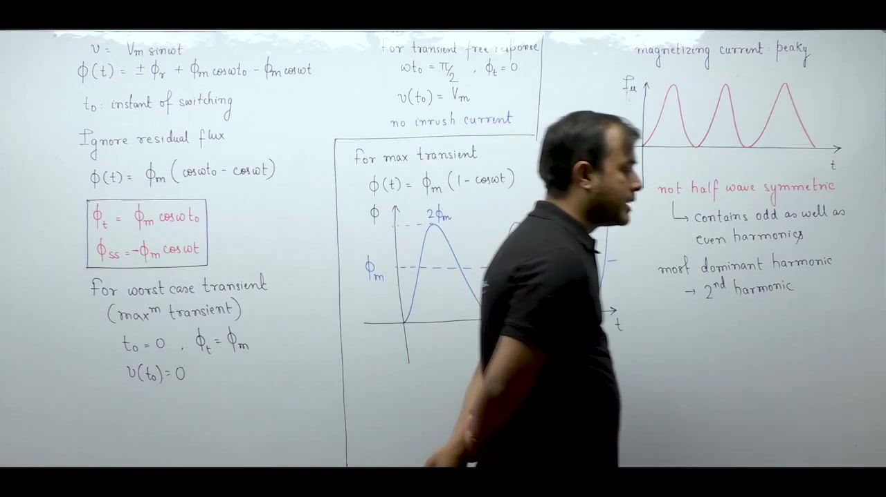

> [!info] Dominant Harmonic Comparison
> - In steady-state excitation, core flux maintains half-wave symmetry, so even harmonics are absent. The dominant harmonic is the third harmonic ($3^{\text{rd}}$ harmonic).
> - In magnetizing inrush transients, half-wave symmetry is broken. The dominant harmonic is the second harmonic ($2^{\text{nd}}$ harmonic).

This fundamental distinction serves as the electrical fingerprint that allows protective relays to recognize inrush events.

## Transient Damping and Mechanical Winding Stresses
_(35:00 - 39:59)_

### Exponential Decay of the Transient Flux Offset

Earlier derivations assumed an idealized lossless transformer circuit.

In that lossless idealization, the transient DC offset $\Phi_m$ would persist indefinitely.

In practical power transformers, real circuit losses are present.

Winding conductors possess internal electrical resistance $R$. The magnetic iron core exhibits hysteresis and eddy-current losses.

These resistive mechanisms dissipate stored energy and provide natural transient damping.

The transient flux component decays exponentially over time:
$$
\phi_{\text{trans}}(t) = \Phi_m \cos(\omega t_0)\,e^{-t/\tau}
$$

The decay rate depends on the effective $L/R$ time constant:
$$
\tau = \frac{L}{R}
$$

As time advances ($t \gg \tau$), the exponential term approaches zero:
$$
\lim_{t \to \infty} \phi_{\text{trans}}(t) = 0
$$

The total core flux waveform settles into balanced steady-state oscillations between $-\Phi_m$ and $+\Phi_m$.

As the DC bias decays, the core pulls out of deep saturation.

The magnetizing current drops rapidly from its massive inrush peak back to normal steady-state levels (3% to 5% of full-load current).

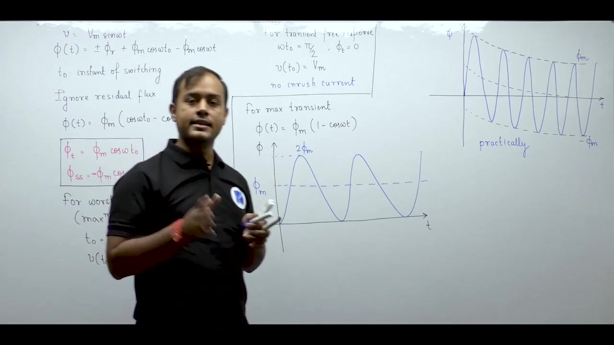

### Temporary Nature of Magnetizing Inrush

Inrush current is an unavoidable physical phenomenon during energization.

Every sudden switching event induces an electrical transient.

Because winding and core losses provide damping, inrush current is self-limiting. It lasts only a few cycles to a fraction of a second.

It does not persist under continuous steady-state loading.

> [!info] Temporary Transient Characteristic
> Magnetizing inrush current is strictly a temporary switching transient. It automatically dies down as circuit resistance damps the DC flux offset, returning no-load current to its normal rated level.

### Mechanical Forces on Transformer Windings

Although inrush current decays quickly, its extreme initial amplitude creates severe mechanical hazards.

Electromagnetic forces between current-carrying conductors are proportional to the square of the instantaneous current:
$$
F_{\text{mech}} \propto i^2
$$

When inrush current surges to ten times the rated full-load current ($i \approx 10 I_{\text{rated}}$), mechanical forces scale up:
$$
F_{\text{inrush}} \approx (10)^2 F_{\text{rated}} = 100 \times F_{\text{rated}}
$$

Primary and secondary windings carry currents in opposite directions, creating strong repulsive electromagnetic forces.

A hundred-fold surge in repulsive force can violently displace windings, fracture conductors, and crush solid insulation.

To withstand these forces, manufacturers apply heavy mechanical clamping and bracing to all winding assemblies.

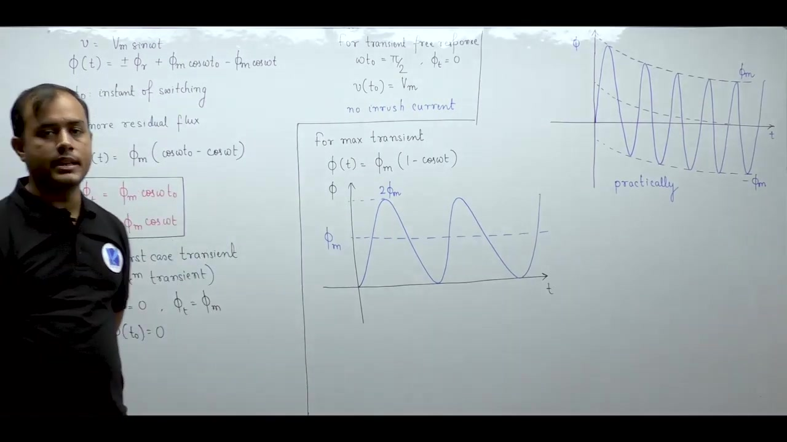

## Protection Relay Coordination and Transformer Module Summary
_(39:59 - 45:13)_

### Risk of Protective Relay Maloperation

Beyond mechanical stress, inrush current presents a major operational challenge to power system protection.

Transformers use differential protection relays as primary defense against internal short circuits.

A differential relay compares incoming primary current with outgoing secondary current:
$$
I_{\text{diff}} = |I_1 - I_2|
$$

Under normal load conditions, primary and secondary currents balance, producing zero differential current.

During energization, the secondary winding is open-circuited ($I_2 = 0$).

The primary winding draws huge magnetizing inrush current ($I_1 = I_{\text{inrush}}$).

The differential relay sees a massive unbalance:
$$
I_{\text{diff}} = |I_{\text{inrush}} - 0| = I_{\text{inrush}}
$$

Without specialized restraint, the relay misinterprets inrush current as an internal fault.

The relay trips the circuit breaker immediately. Every re-closing attempt triggers inrush and causes immediate tripping.

This nuisance disconnection is known as relay maloperation.

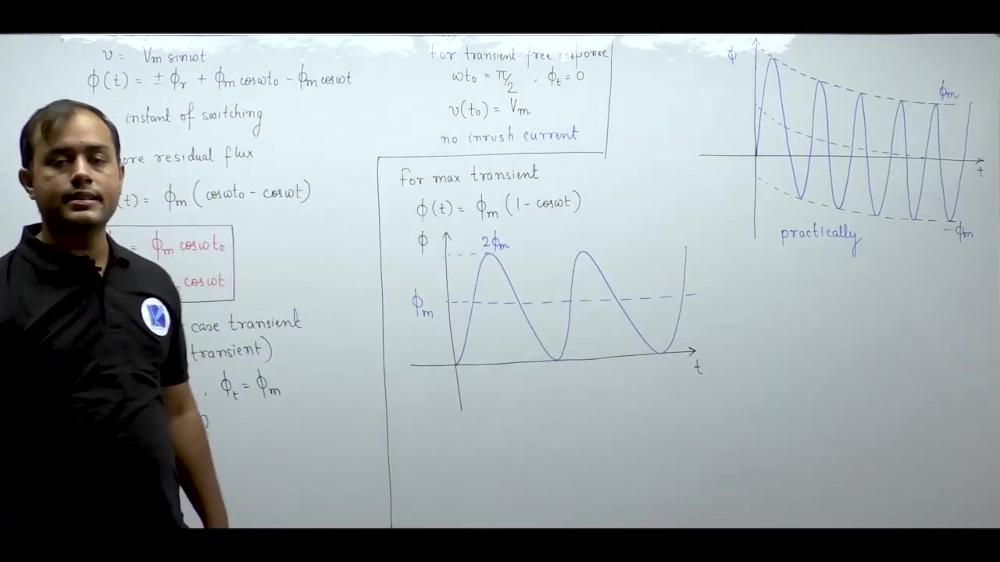

### Harmonic-Restraint Differential Protection

Protective schemes must distinguish internal fault currents from magnetizing inrush transients.

A physical property provides the necessary discrimination.

Genuine short-circuit faults carry almost pure fundamental current without significant harmonic content.

In contrast, inrush current is heavily distorted and rich in second harmonics ($15\%$ to $30\%$ of fundamental).

Engineers implement harmonic-restraint differential relays to prevent false tripping.

The relay contains two separate coil assemblies:
1. An operating coil energized by total differential current $|I_1 - I_2|$.
2. A restraining coil energized through a second-harmonic bandpass filter.

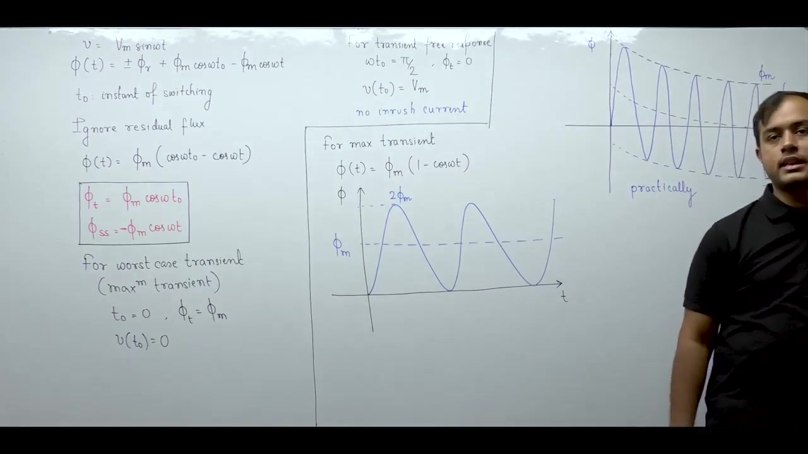

The net torque acting on the relay contacts equals:
$$
T_{\text{net}} = T_{\text{operating}} - T_{\text{restraining}}
$$

Here restraining torque is proportional to the second-harmonic current:
$$
T_{\text{restraining}} \propto I_{2\text{nd}}
$$

During inrush, abundant second harmonics generate strong restraining torque, blocking the relay from tripping.

During genuine internal faults, second harmonics are absent, allowing the relay to trip quickly and isolate the unit.

> [!info] Harmonic Restraint Principle
> A harmonic-restraint differential relay uses the presence of the second harmonic in magnetizing inrush to block false tripping during transformer energization, while maintaining rapid tripping for real internal faults.

### Summary of Transformer Analysis

This concludes the study of transformers in electrical machines.

Remember these core examination takeaways on switching transients:
- Energization at zero voltage produces worst-case flux doubling ($2\Phi_m$) and maximum inrush current.
- Energization at peak voltage produces zero transient offset and zero inrush current.
- Remnant core flux elevates peak flux to $2\Phi_m + \phi_r$.
- Inrush current contains a prominent second harmonic, which differential relays use for restraint.

With stationary magnetic devices complete, subsequent lectures investigate rotating machines, starting with electromechanical energy conversion principles.

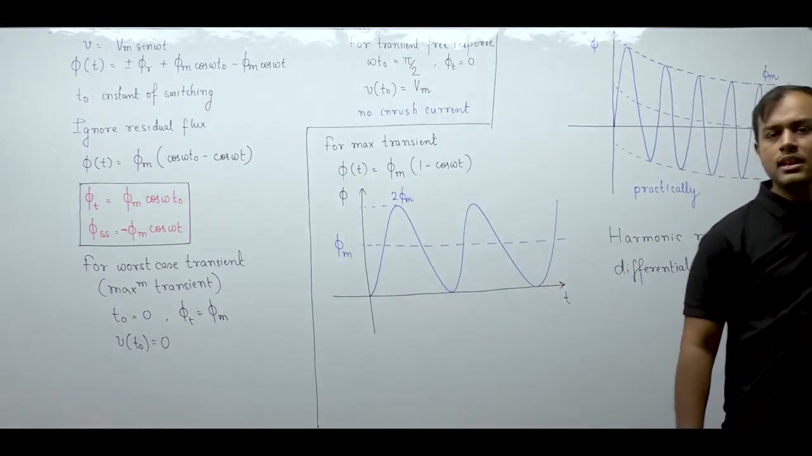

---

## Summary and Key Takeaways

- Sudden transformer energization induces an AC switching transient consisting of an alternating steady-state component and a unidirectional DC flux offset: $\phi(t) = -\Phi_m \cos(\omega t) + \Phi_m \cos(\omega t_0) \pm \phi_r$.
- Switching on at the instant of zero voltage ($\omega t_0 = 0$) causes flux doubling, where peak core flux reaches twice steady-state amplitude: $\phi_{\max} = 2\Phi_m$.
- Pre-existing remnant flux pushes peak core flux even higher to $\phi_{\max} = 2\Phi_m + \phi_r$.
- Switching on at peak supply voltage ($\omega t_0 = \pi/2$) eliminates the transient DC offset completely, producing a transient-free response.
- Severe core saturation during flux doubling produces magnetizing inrush currents of $5$ to $10$ times rated full-load current.
- Unidirectional flux offsets break half-wave symmetry, making the second harmonic ($2^{\text{nd}}$ harmonic) the most dominant harmonic in inrush current.
- Large inrush currents produce repulsive electromagnetic forces scaling with current squared ($F \propto i^2$), requiring heavy winding bracing.
- Circuit resistance and core losses provide natural damping, causing the DC flux offset and inrush current to decay exponentially with time constant $\tau = L/R$.
- Harmonic-restraint differential relays use second-harmonic current in their restraining coils to block false tripping during inrush while maintaining sensitivity to genuine faults.

---

[← Lec 051: Excitation Phenomenon 3](Lecture_051_Excitation_Phenomenon_3.md) | [🏠 Index](00_yt_study_guide.md) | [Lec 053: Problems based on Harmonics and Inrush Current →](Lecture_053_Problems_based_on_Harmonics_and_Inrush_Current.md)
