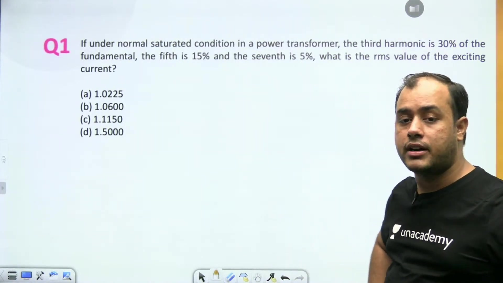
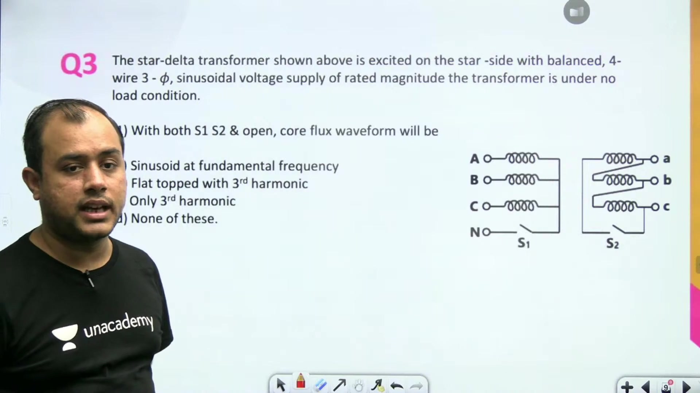
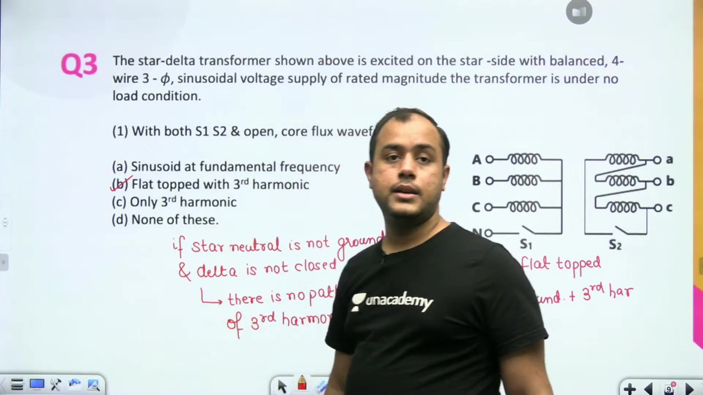
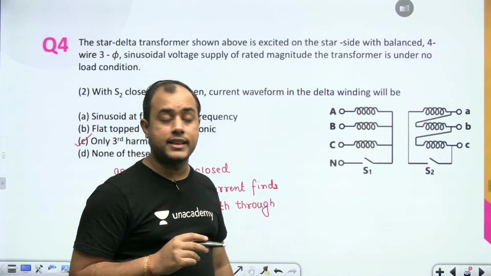
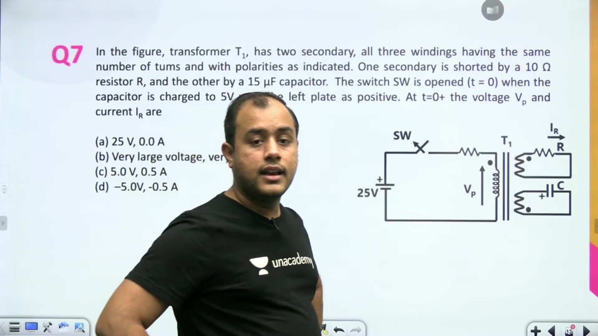
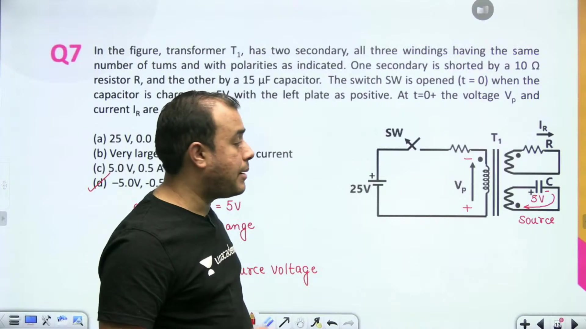
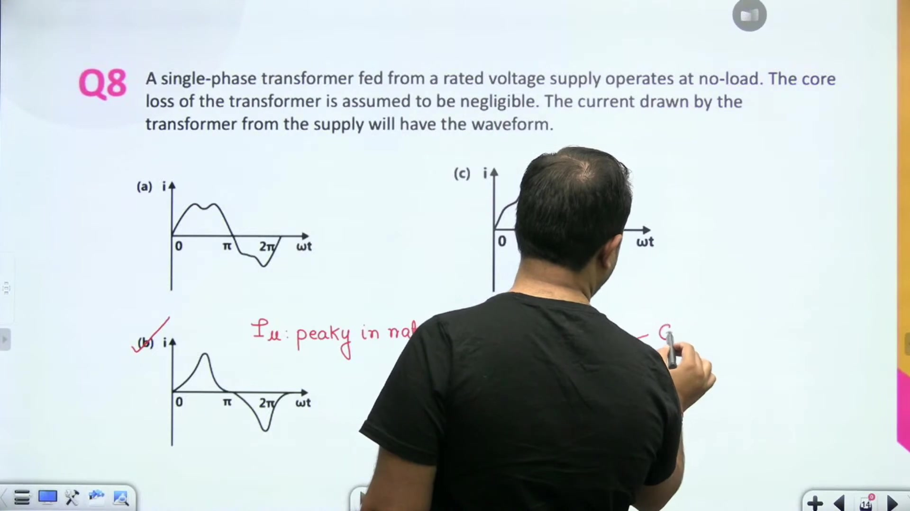
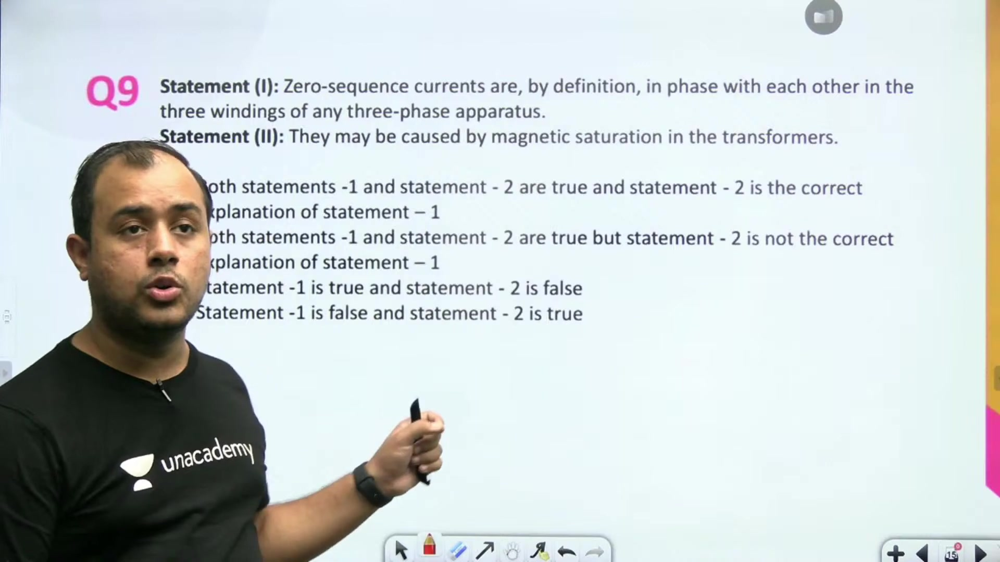
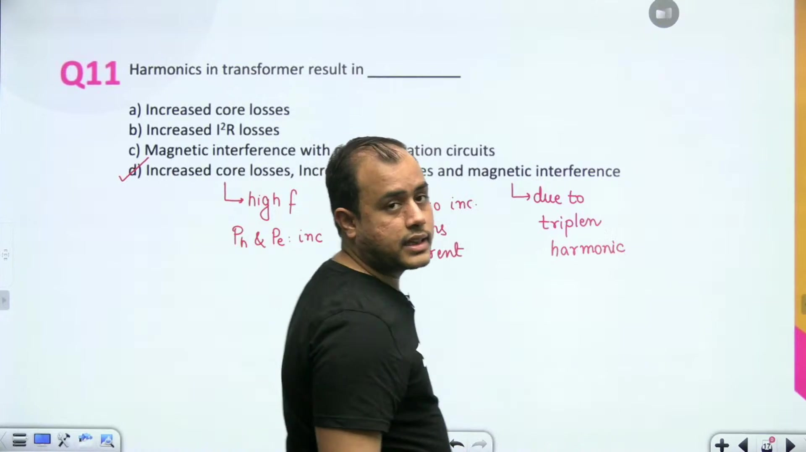

# Problems based on Harmonics and Inrush Current | L 17 | Electrical Machines | GATE 2022

- **Source**: https://www.youtube.com/watch?v=hwvRhuCKuEE
- **Duration**: 00:33:36
- **Compiled**: 2026-09-21

---

## Overview

This lecture solves key problems on harmonic distortion and switching inrush transients in power transformers.
It examines how non-linear magnetic saturation distorts exciting currents and shapes core flux waveforms.
The session investigates magnetic flux return paths in three-limb cores and circulating currents in delta windings.
It also determines the exact switching instant needed to avoid transient inrush currents and analyzes multi-winding transients.

## Contents

- [[#RMS Calculation of Saturated Exciting Current|RMS Calculation of Saturated Exciting Current]]
- [[#Third-Harmonic Flux Paths in Three-Phase Core-Type Transformers|Third-Harmonic Flux Paths in Three-Phase Core-Type Transformers]]
- [[#Core Flux and Delta Circulating Currents Under Switching Conditions|Core Flux and Delta Circulating Currents Under Switching Conditions]]
- [[#Harmonic Dominance, Inrush Minimization, and Multi-Winding Transients|Harmonic Dominance, Inrush Minimization, and Multi-Winding Transients]]
- [[#Multi-Winding Transient Solution, No-Load Waveforms, and Zero-Sequence Harmonics|Multi-Winding Transient Solution, No-Load Waveforms, and Zero-Sequence Harmonics]]
- [[#Causes, Effects, Limits, and Mitigation of Transformer Harmonics|Causes, Effects, Limits, and Mitigation of Transformer Harmonics]]
- [[#Open Delta Triplen Voltage and Transformer Problem Synthesis|Open Delta Triplen Voltage and Transformer Problem Synthesis]]

---

## RMS Calculation of Saturated Exciting Current
_(00:03 - 05:20)_

### Introduction to Harmonics and Inrush Transients

Transformer cores operate near magnetic saturation.
Non-linear permeability distorts alternating exciting current waves.
The resulting periodic waveform contains a fundamental term and odd harmonics.
Analyzing these components requires Fourier series expansion and orthogonal RMS summation.

### Orthogonal RMS Summation of Harmonics

Each harmonic current component is orthogonal over a fundamental period.
The total RMS exciting current depends on all individual harmonic RMS values.
Cross products between different frequencies integrate to zero over one cycle.
We express the net RMS value using root sum of squares.

$$
I_{\text{rms}} = \sqrt{I_1^2 + I_3^2 + I_5^2 + I_7^2 + \dots}
$$

Here $I_1$ is the fundamental RMS current.
The terms $I_3$, $I_5$, and $I_7$ denote the RMS values of higher odd harmonics.

### Worked Example: Saturated Power Transformer Exciting Current

> [!example] Problem
> Under normal saturated conditions of a power transformer, the harmonic contents are given as:
> - Third harmonic: $30\%$ of fundamental
> - Fifth harmonic: $15\%$ of fundamental
> - Seventh harmonic: $5\%$ of fundamental
> 
> Find the RMS value of exciting current with respect to the fundamental.

Let the fundamental RMS current be $I_1$.
Write each harmonic current in terms of $I_1$:

$$
\begin{aligned}
I_3 &= 0.30\,I_1 \\
I_5 &= 0.15\,I_1 \\
I_7 &= 0.05\,I_1
\end{aligned}
$$

Now substitute these values into the total RMS current expression:

$$
\begin{aligned}
I_{\text{rms}} &= \sqrt{I_1^2 + (0.30\,I_1)^2 + (0.15\,I_1)^2 + (0.05\,I_1)^2} \\
&= I_1 \sqrt{1 + 0.09 + 0.0225 + 0.0025} \\
&= I_1 \sqrt{1.115} \\
&\approx 1.056\,I_1
\end{aligned}
$$

> [!success] Result
> The total RMS exciting current is approximately $1.06\,I_1$.
> Harmonics increase the total RMS current drawn by the core by roughly $6\%$.

## Third-Harmonic Flux Paths in Three-Phase Core-Type Transformers
_(05:20 - 09:57)_

### Scaling and Independence of Harmonic Percentages

Harmonic contents are often specified as percentages of the fundamental.
Whether values are stated in peak or RMS terms does not change the ratio.
Every term scales by the same factor $\sqrt{2}$.
So the percentage representation holds directly for RMS calculations.
Factoring out the fundamental leaves a dimensionless scaling multiplier.

### In-Phase Nature of Triplen Fluxes

In a three-phase system the third-harmonic components are three times fundamental frequency.
The three phase fluxes at fundamental frequency are shifted by $120^\circ$.
Now multiply this phase displacement by three for the third harmonic.
The resulting angular shift becomes $3 \times 120^\circ = 360^\circ$.
A $360^\circ$ shift is equivalent to zero phase difference.
So all third-harmonic fluxes are completely in phase with each other.

$$
\begin{aligned}
\phi_{3a}(t) &= \Phi_{3m} \sin(3\omega t) \\
\phi_{3b}(t) &= \Phi_{3m} \sin(3(\omega t - 120^\circ)) = \Phi_{3m} \sin(3\omega t) \\
\phi_{3c}(t) &= \Phi_{3m} \sin(3(\omega t - 240^\circ)) = \Phi_{3m} \sin(3\omega t)
\end{aligned}
$$

All three triplen fluxes reach their positive peaks at the exact same instant.
They all point upwards through the three limbs simultaneously.

### Absence of a Closed Iron Return Path in Three-Limb Cores

> [!info] Definition
> A three-limb core provides magnetic return paths for fluxes that sum to zero.
> It cannot provide a closed iron path for zero-sequence or triplen flux components.

Apply magnetic Kirchhoff's law at the upper yoke.
The sum of fluxes entering the yoke must equal the flux leaving the yoke.
For fundamental components the sum of the three balanced phases is zero.
One limb always provides a return path for the other two limbs.

$$
\phi_{1a} + \phi_{1b} + \phi_{1c} = 0
$$

For third-harmonic fluxes the sum is not zero:

$$
\sum \phi_3 = \phi_{3a} + \phi_{3b} + \phi_{3c} = 3\Phi_{3m} \sin(3\omega t)
$$

The net flux cannot return through the iron limbs.
It is forced to leak out of the core into the surrounding medium.
The flux path closes through the transformer oil, structural steel, and tank walls.
Air and oil present very high reluctance to magnetic flux.
This high reluctance strongly suppresses the magnitude of third-harmonic core flux.
But stray flux entering steel tank walls causes eddy current heating.
Adding two unwound outer limbs in a five-limb core provides a low-reluctance iron return path.

## Core Flux and Delta Circulating Currents Under Switching Conditions
_(10:01 - 15:17)_

### Core Flux Waveform With Isolated Neutral and Open Delta

> [!example] Problem
> A star-delta transformer is fed from a balanced three-phase supply on the star side at no load.
> Switch $S_1$ in the star neutral is open.
> Switch $S_2$ in the delta mesh is also open.
> Determine the core flux waveform.

Under saturated conditions a magnetic core requires non-linear excitation.
Either the magnetizing current or the core flux must contain third harmonics.
With switch $S_1$ open the primary star neutral is isolated.
Triplen currents are in phase in all three lines.
They need a return conductor through the neutral to flow.
Because the neutral is disconnected, no third-harmonic current can flow in the primary.

Switch $S_2$ is also open in the delta winding.
The delta mesh is broken, so no circulating current can flow in the secondary.
Because third-harmonic current cannot exist anywhere, magnetizing current is purely sinusoidal.
When sinusoidal current excites a saturating iron core, flux becomes non-sinusoidal.
The core flux waveform develops a prominent third-harmonic component.

$$
\phi(t) = \Phi_1 \sin(\omega t) - \Phi_3 \sin(3\omega t)
$$

The third-harmonic flux subtracts from the fundamental at each positive and negative peak.
This creates a flat-topped flux waveform.

> [!success] Result
> When third-harmonic current is blocked in all windings, core flux becomes flat-topped.

### Current Waveform in Closed Delta at No Load

Now close switch $S_2$ while keeping $S_1$ open.
Closing $S_2$ completes the closed loop of the delta winding.
Third-harmonic phase induced voltages add directly in phase around the loop.
The net driving voltage in the closed loop is non-zero:

$$
e_{3\Delta}(t) = 3 E_{3m} \sin(3\omega t)
$$

This driving voltage circulates a third-harmonic current around the delta winding.
Now consider whether any fundamental current can flow.
The transformer runs at no load.
Secondary line terminals are open-circuited.
So secondary line currents are strictly zero:

$$
I_{\text{line}} = 0
$$

Fundamental currents in three-phase delta windings have $120^\circ$ phase shifts.
They cannot circulate in a closed mesh without entering the external line lines.
Because line currents are zero, fundamental current cannot exist in the secondary.
Third-harmonic currents are in-phase zero-sequence components.
They circulate entirely inside the delta mesh and cancel at each line node.
So the only current flowing in the delta winding is the third harmonic.
The waveform in the delta winding is a pure third-harmonic sinusoid.
If a load were connected, fundamental current would combine with the third harmonic to form a peaky wave.

## Harmonic Dominance, Inrush Minimization, and Multi-Winding Transients
_(15:17 - 20:10)_

### Dominance of Third Harmonics in Magnetizing Current

Under steady-state AC excitation the core B-H loop is symmetric.
The magnetizing current waveform shows odd half-wave symmetry.

$$
i_\mu(\omega t) = -i_\mu(\omega t + \pi)
$$

This symmetry eliminates all even harmonics from the Fourier series.
Only odd harmonics can exist in the magnetizing current.
Fourier amplitudes decrease quickly as the harmonic order increases.
The third harmonic is the lowest order odd harmonic after the fundamental.
So the magnetizing current is richest in the third harmonic.
The third-harmonic component reaches $30\%$ to $40\%$ of the fundamental value.

### Switching Instant for Minimum Inrush Transient

> [!info] Definition
> Transformer inrush current is an electromagnetic switching transient.
> It depends on the supply voltage phase angle at the exact switching instant.

Let the applied AC voltage be:

$$
v(t) = V_m \sin(\omega t)
$$

Integrating Faraday's law gives the core flux:

$$
\phi(t) = -\Phi_m \cos(\omega t) + \Phi_m \cos(\omega t_0)
$$

Here $\omega t_0$ is the switching angle.
The steady-state flux component lags the applied voltage by $90^\circ$:

$$
\phi_{ss}(t) = \Phi_m \sin(\omega t - 90^\circ) = -\Phi_m \cos(\omega t)
$$

When the applied voltage reaches its maximum, $\omega t_0 = 90^\circ$.
At this instant the steady-state flux is zero:

$$
\phi_{ss}(t_0) = -\Phi_m \cos(90^\circ) = 0
$$

The required initial flux matches the unenergized core condition.
The transient DC offset flux becomes zero:

$$
\phi_{\text{trans}} = \Phi_m \cos(90^\circ) = 0
$$

No transient flux is induced in the core.
The core does not enter saturation, so no inrush current flows.
To get minimum inrush current, close the switch at the instant of maximum voltage.

### Multi-Winding Transformer Circuit Under Switching

> [!example] Problem
> Transformer $T_1$ has one primary and two secondary windings.
> All three windings have identical turn numbers $N$.
> One secondary connects to a $10\,\Omega$ resistor.
> The other secondary connects to a $15\,\mu\text{F}$ capacitor.
> A switch opens at $t = 0$.
> The capacitor was charged to $5\,\text{V}$ with its left plate positive.
> Find the initial conditions at $t = 0^+$.

Capacitor voltage cannot jump instantaneously.
The voltage across the capacitor at $t = 0^+$ remains equal to its pre-switching value:

$$
v_C(0^+) = v_C(0^-) = 5\,\text{V}
$$

The charged capacitor acts as an independent voltage source across the third winding.
Coupling through the common magnetic core induces voltages in the primary and second secondary windings.

## Multi-Winding Transient Solution, No-Load Waveforms, and Zero-Sequence Harmonics
_(20:13 - 25:36)_

### Solution to the Multi-Winding Transformer Problem

Continue the three-winding transformer circuit analysis at $t = 0^+$.
The capacitor voltage remains at $5\,\text{V}$.
The left plate is positive, which connects to the unmarked terminal.
The dotted terminal connects to the negative plate.
So the capacitor forces the dotted terminal to $-5\,\text{V}$.

All three windings have equal turns:

$$
N_1 = N_2 = N_3
$$

The common core flux induces identical voltage across every turn.
The dot on the primary winding takes the same relative polarity:

$$
V_P(0^+) = -5\,\text{V}
$$

The minus sign indicates that the dotted terminal is negative.
Now look at the secondary winding with the $10\,\Omega$ resistor.
Its dotted terminal is also at $-5\,\text{V}$.
Current $I_R$ flows according to this terminal potential:

$$
I_R(0^+) = \frac{-5\,\text{V}}{10\,\Omega} = -0.5\,\text{A}
$$

> [!success] Result
> At the switching instant $t = 0^+$, $V_P = -5\,\text{V}$ and $I_R = -0.5\,\text{A}$.

### No-Load Current Waveform Under Negligible Core Loss

> [!example] Problem
> A single-phase transformer is fed from a rated sinusoidal voltage supply at no load.
> Core loss is negligible.
> Determine the waveform of the current drawn from the supply.

The applied voltage is sinusoidal.
Faraday's law requires the core flux to be sinusoidal as well.
At no load the transformer draws only magnetizing current $I_\mu$ when core loss is ignored:

$$
I_0 \approx I_\mu
$$

Ferromagnetic cores have non-linear $B-H$ magnetization curves.
Near the peak of the sinusoidal flux, the iron core saturates.
The core needs a disproportionately large current to produce the peak flux.
This pulls the current waveform into sharp, symmetrical peaks.
So the current waveform is peaky.
An air-core transformer has constant permeability and would draw a sinusoidal current.
If core loss were present, hysteresis would shift the peaky waveform left by angle $\beta$.

### Zero-Sequence Currents Versus Magnetic Saturation

> [!info] Definition
> Zero-sequence currents have equal magnitudes and identical phase angles across all three phases:
> $$I_{a0} = I_{b0} = I_{c0} = I_0 \angle \theta_0$$

Triplen harmonics created by saturation are in phase in all three phases.
They behave mathematically like zero-sequence currents.
But saturation is not the definition of zero sequence.
In power systems, unbalanced loads and ground faults produce zero-sequence currents without saturation.
Both statements are true.
The second statement does not explain the first statement.

## Causes, Effects, Limits, and Mitigation of Transformer Harmonics
_(25:36 - 30:47)_

### Primary Origin of Harmonics in Transformers

Magnetic core saturation is the main cause of harmonic generation in transformers.
Ferromagnetic materials do not exhibit a linear relation between flux density and magnetic field intensity.
The slope of the $B-H$ curve changes as the core reaches rated flux density.
If the applied voltage is sinusoidal, core flux is sinusoidal.
The non-linear magnetic curve then distorts the exciting current.
This distortion introduces odd harmonics into the system.

### Adverse Consequences of Transformer Harmonics

Harmonics create three major operational problems in power transformers:

1. **Higher Core Losses**: Eddy current loss scales with frequency squared:
   $$P_e \propto f^2$$
   Harmonic frequencies multiply eddy current heating in core laminations.
   Hysteresis loss also increases with frequency.

2. **Higher Copper Losses**: Harmonics increase the total RMS current:
   $$I_{\text{rms}} = \sqrt{I_1^2 + I_3^2 + I_5^2 + \dots}$$
   Higher RMS current increases winding $I^2R$ copper losses.

3. **Telecommunication Interference**: Triplen harmonics behave as zero-sequence currents.
   If neutral ground paths exist, they return through the earth.
   These ground currents induce electromagnetic interference in nearby communication lines.

> [!success] Result
> Harmonics increase core loss, raise copper loss, and cause inductive interference with communication circuits.

### Typical Third-Harmonic Current Magnitude

Under normal rated saturation, third-harmonic current is bounded.
In practical power transformers the third harmonic does not exceed $40\%$ of the fundamental.
It commonly ranges between $30\%$ and $40\%$ of the fundamental exciting current.

### Flux Doubling Effect During Switching

When a transformer is energized at voltage zero, the core flux experiences a severe transient.
The core flux reaches twice the maximum steady-state value:

$$
\phi_{\text{peak}} \approx 2\Phi_m
$$

This surge is known as the doubling effect.
Severe core saturation results, producing massive inrush currents.

### Methods to Mitigate Harmonics

> [!example] Problem
> Which of the following is NOT a method of reducing harmonics in a power transformer?
> - (A) Adding filters
> - (B) Capacitor banks
> - (C) Tuning inductors
> - (D) Pure resistor

Inductors and capacitors have frequency-dependent reactances:

$$
X_L = 2\pi f L, \quad X_C = \frac{1}{2\pi f C}
$$

They can be combined into tuned LC filters.
These filters trap or block specific harmonic frequencies.
A tertiary delta winding also traps circulating third-harmonic currents inside the transformer.
A pure resistor has a fixed resistance $R$ for all frequencies.
It cannot selectively remove harmonic frequencies without wasting fundamental power.
So adding a resistor is not a method to reduce harmonics.

## Open Delta Triplen Voltage and Transformer Problem Synthesis
_(30:47 - 33:34)_

### Open-Circuit Voltage Across a Broken Delta Corner

Consider a delta winding broken open at one corner terminal.
Under balanced sinusoidal conditions the fundamental phase voltages sum to zero:

$$
v_{1a}(t) + v_{1b}(t) + v_{1c}(t) = 0
$$

No fundamental voltage appears across the open break.
Now look at the third-harmonic induced voltages in each phase.
Triplen harmonic voltages are equal in magnitude and strictly in phase:

$$
v_{3a}(t) = v_{3b}(t) = v_{3c}(t) = E_{3m} \sin(3\omega t)
$$

Because all three phase voltages are in phase, they do not cancel around the mesh.
They add directly in series:

$$
v_{\text{corner}}(t) = v_{3a}(t) + v_{3b}(t) + v_{3c}(t) = 3 E_{3m} \sin(3\omega t)
$$

> [!success] Result
> A voltmeter across an open delta corner measures three times the third-harmonic phase voltage:
> $$V_{\text{open}} = 3 E_3$$

### Summary of Transformer Core and Harmonic Phenomena

This concludes the transformer problem series.
The problems covered key practical phenomena:

1. **Non-linear Magnetization**: Magnetic saturation distorts exciting currents, producing dominant third harmonics.
2. **Path Constraints**: Star windings with isolated neutrals block triplen currents, forcing flux to become flat-topped.
3. **Circulating Delta Currents**: Closed delta windings allow third-harmonic currents to circulate, restoring sinusoidal flux.
4. **Switching Inrush**: Energizing at voltage zero produces flux doubling up to $2\Phi_m$, while energizing at maximum voltage eliminates transient inrush.

These principles complete the analysis of static electromagnetic devices.
The next lectures transition to dynamic electromechanical energy conversion and rotating DC machines.

---

## Summary and Key Takeaways

- Saturated exciting current has an orthogonal RMS value given by $I_{\text{rms}} = \sqrt{I_1^2 + I_3^2 + I_5^2 + \dots}$.
- Third-harmonic fluxes in three-phase cores are in phase, forcing them to return through air, oil, and tank walls.
- Blocking third-harmonic currents in star and delta windings makes the core flux waveform flat-topped.
- In an unloaded star-delta transformer, only third-harmonic current circulates inside the closed delta mesh.
- Odd half-wave symmetry eliminates even harmonics, making the third harmonic dominant in magnetizing current.
- Switching at peak voltage ($\omega t_0 = 90^\circ$) eliminates transient DC flux and prevents switching inrush current.
- Switching at voltage zero triggers the doubling effect, driving core flux up to $2\Phi_m$.
- A voltmeter across a broken delta corner measures three times the third-harmonic phase voltage, $V_{\text{open}} = 3 E_3$.

