# Induction Machines Introduction | Electrical Machines | Lec 94 | GATE & ESE | Ankit Goyal

- **Source**: https://www.youtube.com/watch?v=UqgqYfsL-fs
- **Duration**: 00:49:07
- **Compiled**: 2026-09-23

---

## Overview

This lecture introduces the fundamental principles, operational mechanisms, and physical laws governing three-phase induction machines. It establishes the singly excited nature of the induction motor by comparing its stator and rotor to the primary and secondary windings of a transformer. The discussion explains how a rotating stator magnetic field induces rotor currents to generate torque in accordance with Lenz's law. Detailed analyses highlight the role of the air gap in creating high magnetizing current and leakage reactance. Finally, the lecture contrasts squirrel cage and wound-rotor constructions to show how magnetic poles interact across the air gap.

## Contents

- [[#Foundations of Induction Machines and Working Principles|Foundations of Induction Machines and Working Principles]]
- [[#Magnetic Circuit Differences and Energy Conversion Principles|Magnetic Circuit Differences and Energy Conversion Principles]]
- [[#Reluctance, Magnetizing Current, and Frequency Characteristics|Reluctance, Magnetizing Current, and Frequency Characteristics]]
- [[#Operating Principle of Three-Phase Induction Motors|Operating Principle of Three-Phase Induction Motors]]
- [[#Graphical and Physical Analysis of Torque Production|Graphical and Physical Analysis of Torque Production]]
- [[#Torque Formulation, Leakage Reactance, and Air Gap Optimization|Torque Formulation, Leakage Reactance, and Air Gap Optimization]]
- [[#Absence of Armature Reaction and Conditions for Steady Torque|Absence of Armature Reaction and Conditions for Steady Torque]]
- [[#Pole Adaptation and Vector Alignment Principles|Pole Adaptation and Vector Alignment Principles]]

---

## Foundations of Induction Machines and Working Principles
_(00:13 - 08:57)_

Induction machines form the most common type of electric motor in modern industry. Their study brings together principles from both synchronous machines and transformers. Some ideas come directly from transformer action. Other concepts rely on rotating magnetic fields from synchronous machines.

### Singly Excited Nature of Induction Machines

In DC machines and synchronous machines, external power feeds both windings. A DC machine receives power at the armature and the field winding. A synchronous machine takes three-phase AC on the stator and DC excitation on the rotor. Because both sides receive external electrical excitation, they are doubly excited machines.

An induction machine is different. It is a singly excited AC machine. External electrical supply connects to only one winding. Usually this is the stator winding. The rotor winding receives its electrical energy across the air gap purely through electromagnetic induction.

> [!info] Definition
> An induction machine is a singly excited AC machine. Its stator connects to an external AC supply. The rotor receives all its operating energy across the air gap by mutual induction.

No external electrical source touches the rotor. There are no slip rings supplying DC power to the rotor. This makes the mechanical construction simple and rugged.

### Operating Modes: Motor versus Generator

A balanced three-phase AC supply connects to the stator windings. The three windings sit displaced by $120^\circ$ in space. This creates a rotating magnetic field in the air gap. This field revolves at synchronous speed $N_s$:

$$N_s = \frac{120 f}{P}$$

Here $f$ is the supply frequency in hertz. $P$ is the total number of stator magnetic poles.

This rotating field sweeps past the rotor conductors. It cuts the rotor bars and induces an alternating electromotive force. Because the rotor circuit is closed, current circulates through the conductors. This interaction creates electromagnetic torque.

The direction of rotation depends on the relative speed between the rotor and the rotating field. Two distinct operating modes exist:

1. **Induction Motor Mode**: The rotor rotates at a steady speed $N_r$ less than the synchronous speed:
   $$N_r < N_s$$
   The rotating field moves faster than the rotor. The motor draws electrical power from the stator and delivers mechanical shaft torque.

2. **Induction Generator Mode**: An external prime mover drives the rotor faster than synchronous speed:
   $$N_r > N_s$$
   The rotor now overtakes the stator magnetic field. Mechanical power enters through the shaft. Net electrical active power flows back out into the AC network.

Induction generators are less common in traditional networks. They require external reactive power support to build their magnetic field. Most practical discussions therefore concentrate on the induction motor.

### The Asynchronous Machine

An induction motor can never run at synchronous speed. If the rotor speed $N_r$ ever matched $N_s$, the relative motion between the rotor conductors and the air gap field would vanish. The rate of flux cutting would become zero:

$$e = B l (v_s - v_r) = 0$$

Without induced EMF, no rotor current can flow. The electromagnetic torque drops immediately to zero. The rotor then slows down due to friction and load. As soon as the speed drops below $N_s$, relative motion returns. Torque appears again.

Because $N_r$ cannot equal $N_s$, the machine cannot run synchronously. For this reason, engineers call the induction motor an asynchronous machine.

### Comparing Induction Machines and Transformers

The energy transfer in an induction machine closely resembles a transformer. Both operate on mutual induction.

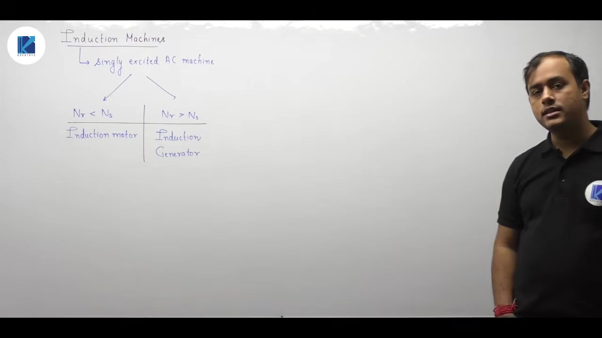

In a transformer, the primary winding connects to the source. The secondary connects to the load. In an induction motor, the stator connects to the supply. The rotor acts like the secondary.

In DC and synchronous machines, one winding makes flux while the other carries load current. We call them the field winding and the armature winding. In an induction motor, the stator performs both jobs at once. The stator winding draws magnetizing current to build the air gap flux. It also carries load current reflected from the rotor.

The total stator input current $I_1$ mirrors the primary current of a transformer:

$$I_1 = I_1' + I_0$$

Here $I_1'$ balances the demagnetizing rotor current under load. The component $I_0$ provides core excitation and magnetizing flux.

## Magnetic Circuit Differences and Energy Conversion Principles
_(08:57 - 14:01)_

Both transformers and induction motors rely on Faraday's law of induction. Yet their magnetic structures and energy roles differ in fundamental ways.

### Winding Terminology and Dual Functional Roles

In a static transformer, power enters the primary winding. Power leaves through the secondary winding to an external load. In an induction motor, power enters the stationary stator. Power appears by induction on the rotating rotor.

In DC and synchronous machinery, the field winding sets up the working flux. The armature winding carries the load current. In an induction motor, separate physical windings do not exist for these duties.

The stator winding performs both functions simultaneously. It draws a magnetizing current from the AC mains to establish the air gap flux. It also carries load current to balance the rotor current.

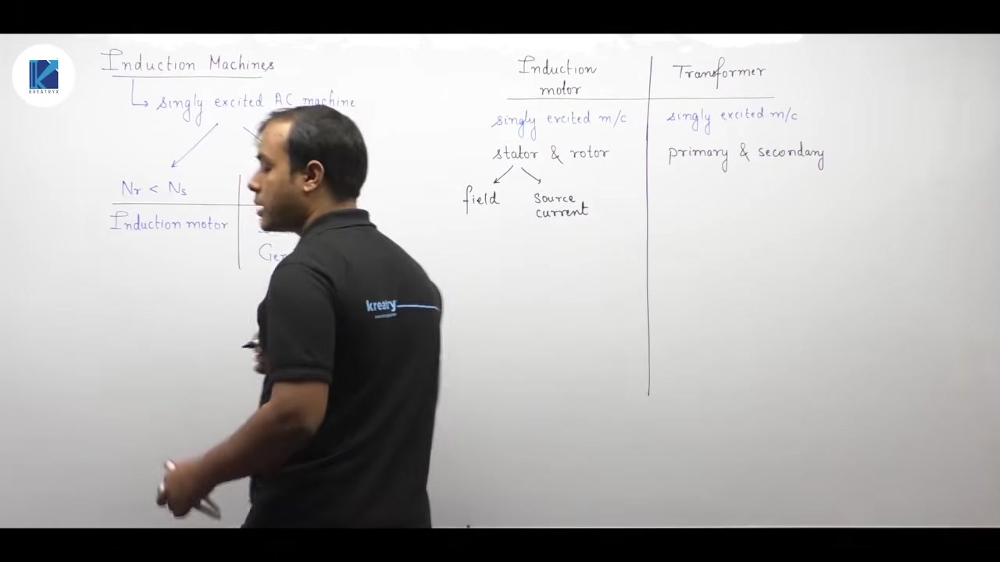

The primary current equation of a classical transformer describes this exact behavior:

$$I_1 = I_1' + I_0$$

Here $I_0$ represents the no-load excitation current. The component $I_1'$ represents the counter-current balancing rotor reaction.

### Energy Conversion: Static versus Electromechanical

A transformer involves no conversion between mechanical and electrical forms. The input is electrical power. The output is electrical power at a different voltage and current level. Magnetic flux in the core serves only as an intermediate coupling medium:

$$\text{Electrical Input} \longrightarrow \text{Magnetic Coupling} \longrightarrow \text{Electrical Output}$$

An induction machine is an electromechanical energy converter. In motoring operation, electrical power enters the stator terminals. Mechanical power leaves through the rotating shaft:

$$\text{Electrical Input} \longrightarrow \text{Air Gap Field} \longrightarrow \text{Mechanical Output}$$

In generator operation, mechanical torque drives the rotor. Electrical energy feeds back into the power system.

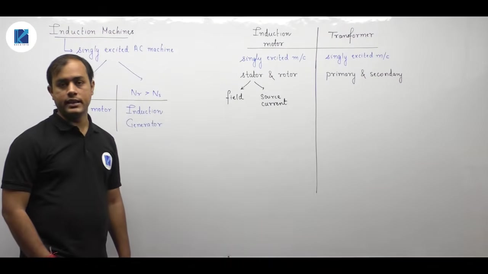

### Composite Magnetic Circuits versus Iron Core Circuits

The greatest physical difference between the two devices lies in their magnetic flux paths.

A transformer core consists entirely of high-permeability ferromagnetic laminations. Whether core-type or shell-type, the core forms a continuous closed magnetic loop. The mutual flux travels entirely through iron:

$$\mu_{\text{iron}} = \mu_r \mu_0 \quad (\mu_r \approx 2000\text{ to }6000)$$

Small leakage flux travels through air paths around the coils. But the mutual flux linking primary and secondary windings sees only iron. No deliberate air gap exists in power transformers.

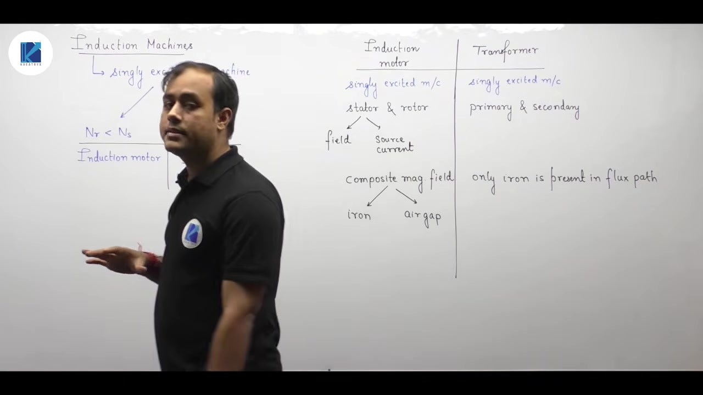

An induction motor requires mechanical clearance between the stationary stator and the rotating rotor. The rotor must spin freely inside the stator bore. Therefore, a physical air gap is mandatory.

The mutual flux path in an induction machine forms a composite magnetic circuit:

$$\text{Flux Path} = \text{Stator Iron} + \text{Air Gap} + \text{Rotor Iron} + \text{Air Gap}$$

Air has a low magnetic permeability:

$$\mu_{\text{air}} = \mu_0 = 4\pi \times 10^{-7}\text{ H/m}$$

Because air permeability is low, the air gap introduces significant magnetic reluctance. Even an air gap of less than one millimeter dominates the total reluctance of the magnetic circuit.

## Reluctance, Magnetizing Current, and Frequency Characteristics
_(14:01 - 19:09)_

The presence of an air gap in an induction machine fundamentally changes its magnetic circuit behavior compared to a transformer.

### Reluctance of the Flux Path

The reluctance of any magnetic path depends on its length, cross-sectional area, and permeability:

$$\mathcal{R} = \frac{l}{\mu A} = \frac{l}{\mu_r \mu_0 A}$$

In a transformer, the core consists of high-grade silicon steel laminations. The relative permeability $\mu_r$ ranges from 2000 to 6000. The magnetic circuit has low total reluctance:

$$\mathcal{R}_{\text{XFR}} \approx \frac{l_{\text{core}}}{\mu_r \mu_0 A_{\text{core}}}$$

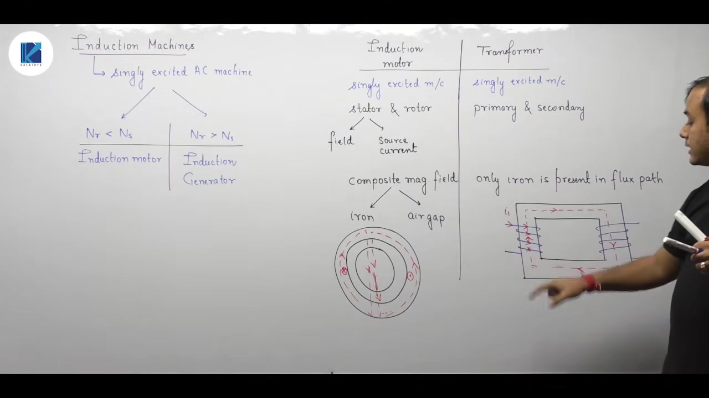

In an induction motor, the mutual flux must cross the physical air gap between the stator and the rotor. For air, $\mu_r = 1$. The air gap reluctance is given by:

$$\mathcal{R}_g = \frac{2 l_g}{\mu_0 A_g}$$

Here $l_g$ is the radial air gap length. The factor of 2 accounts for entering and leaving the rotor. Even though $l_g$ is very small, $\mu_0$ is tiny compared to $\mu_{\text{core}}$. The air gap reluctance makes up over $80\%$ of the total reluctance of the machine.

### Impact on Magnetizing Current

To establish a given mutual magnetic flux $\Phi$, the magnetic circuit requires a specific magnetomotive force:

$$\text{MMF} = \Phi \mathcal{R} = N_1 I_\mu$$

Solving for the magnetizing current $I_\mu$:

$$I_\mu = \frac{\Phi \mathcal{R}}{N_1}$$

Because the reluctance of an induction motor is much higher than that of a transformer, establishing the same flux requires a substantially larger magnetizing current.

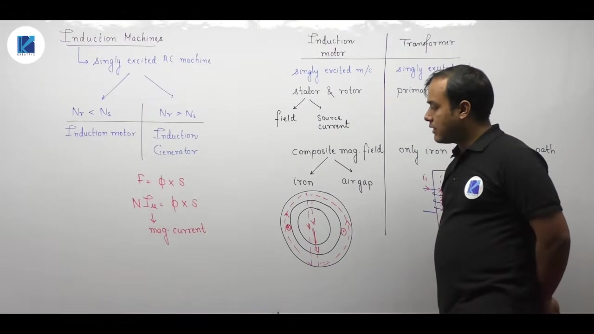

> [!info] Definition
> The magnetizing current $I_\mu$ is the reactive current component drawn from the AC source to produce working magnetic flux in the core and air gap.

In commercial transformers, the magnetizing current is small:

$$I_{\mu,\text{XFR}} = (0.04\text{ to }0.05) I_{\text{FL}}$$

In three-phase induction motors, the required magnetizing current is large:

$$I_{\mu,\text{IM}} = (0.30\text{ to }0.35) I_{\text{FL}}$$

This difference carries critical practical implications:

1. In transformers, engineers often neglect the magnetizing current during rough load analysis. In induction motors, $I_\mu$ is roughly a third of rated current and cannot be ignored.
2. The large magnetizing current creates a low no-load power factor in induction motors. Typical values range from $0.1$ to $0.2$ lagging at no load.

### Frequency Differences: Constant versus Variable Frequency

A transformer is a constant frequency device. The primary and secondary voltages always share the exact same frequency:

$$f_1 = f_2 = 50\text{ Hz}$$

An induction machine is a variable frequency device. The stator frequency matches the supply frequency $f$. But the rotor frequency depends on the relative speed between the rotating field and the rotor.

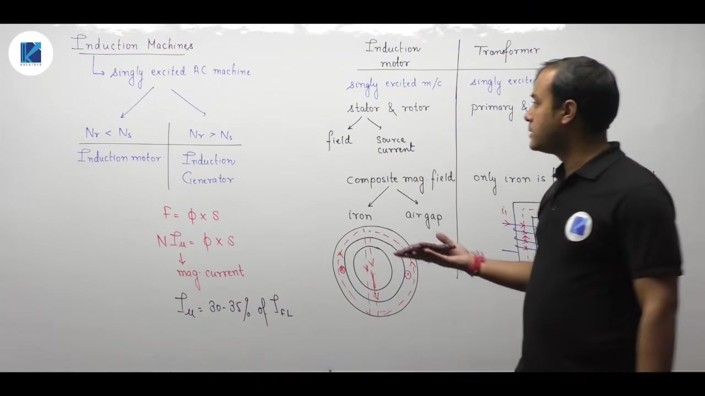

Let $N_s$ be the synchronous speed and $N_r$ be the rotor speed. The rotor induced frequency $f_r$ is:

$$f_r = s f$$

Here $s$ is the per-unit slip:

$$s = \frac{N_s - N_r}{N_s}$$

At standstill ($N_r = 0$), $s = 1$, so $f_r = f$. At normal full load, the slip is very small, typically $2\%$ to $5\%$. Thus the rotor frequency drops to around $1\text{ to }2.5\text{ Hz}$.

## Operating Principle of Three-Phase Induction Motors
_(19:10 - 25:44)_

The working principle of a three-phase induction motor combines rotating magnetic fields with Faraday's and Lenz's laws.

### Generation of the Rotating Magnetic Field

The stator core houses a balanced three-phase distributed winding. The phase axes sit spatially displaced from each other by $120^\circ$ electrical. When energized by balanced three-phase currents, these windings generate a rotating magnetic field (RMF).

The resulting field has constant magnitude and revolves in the air gap at synchronous speed $N_s$:

$$N_s = \frac{120 f}{P}$$

The speed $N_s$ is measured with respect to the stationary stator core.

### Production of Induced EMF and Rotor Currents

Initially, the rotor sits at standstill ($N_r = 0$). The air gap magnetic field rotates past the stationary rotor conductors at speed $N_s$.

Because the field sweeps across the conductors, lines of magnetic flux cut the rotor bars. By Faraday's law of electromagnetic induction, this flux cutting induces an electromotive force (EMF) in each rotor conductor:

$$e = B l v_{\text{rel}}$$

Here $B$ is the magnetic flux density, $l$ is the active conductor length, and $v_{\text{rel}}$ is the relative velocity.

To produce continuous torque, current must flow. Voltage alone does not create magnetic force. For current to flow, the rotor circuit must form a closed loop.

In squirrel cage motors, heavy metal end rings short-circuit all the rotor bars at both axial ends. In wound-rotor machines, external resistors or shorting links complete the three-phase rotor circuit.

Because the circuit is closed, the induced EMF drives a circulation of rotor currents $I_2$.

### Electromagnetic Torque and Lenz's Law

Each current-carrying rotor conductor sits immersed within the magnetic field of the air gap. A current-carrying conductor in a magnetic field experiences a mechanical force:

$$\vec{F} = I (\vec{L} \times \vec{B})$$

The sum of these conductor forces creates an electromagnetic torque $T$ about the motor shaft.

Lenz's law dictates the direction of this torque. An induced effect always opposes the cause that produced it.

> [!info] Definition
> According to Lenz's law, the electromagnetic torque acts to oppose the relative motion between the rotating stator field and the rotor conductors.

The underlying cause of the rotor EMF and current was the relative speed between the rotating field and the rotor conductors:

$$\Delta N = N_s - N_r$$

To eliminate this relative speed, the torque pushes the rotor in the same direction as the rotating magnetic field. The rotor accelerates forward to chase the stator field.

### Why the Rotor Cannot Reach Synchronous Speed

As the rotor accelerates, its speed $N_r$ rises. The relative speed $(N_s - N_r)$ drops.

Consider what would happen if the rotor ever reached synchronous speed:

$$N_r = N_s$$

If this condition occurred, the relative velocity between conductors and the rotating field would become zero:

$$v_{\text{rel}} = 0$$

The rate of magnetic flux cutting would drop to zero:

$$e = B l (0) = 0$$

With zero induced EMF, no rotor current can flow:

$$I_2 = 0$$

So the electromagnetic torque drops completely to zero:

$$T = 0$$

Without driving torque, friction and mechanical load immediately slow the rotor down. The rotor speed falls below $N_s$. As soon as $N_r < N_s$, relative motion reappears. Flux cutting resumes, EMF and current return, and torque develops again.

Because of this, an induction motor can never run at synchronous speed under steady motoring conditions. It must always operate at a speed slightly below $N_s$.

## Graphical and Physical Analysis of Torque Production
_(25:44 - 30:57)_

To visualize torque production clearly, we examine the space positions of the stator field and the rotor conductors.

### Relative Motion Viewpoint

Consider a two-pole machine. The stator winding produces a magnetic flux vector $\vec{\Phi}$. This vector rotates counter-clockwise around the air gap at synchronous speed $N_s$.

The rotor carries a balanced three-phase winding. Unlike a synchronous machine, the rotor does not have a DC field winding. It uses distributed AC phase belts labeled $A-A'$, $B-B'$, and $C-C'$.

Analyzing moving conductors in a moving magnetic field can be confusing. To simplify the analysis, we use relative motion.

Assume the stator magnetic field is stationary in space, directed horizontally from left to right. To preserve identical relative motion, we view the rotor conductors as rotating in the opposite direction. The rotor appears to spin clockwise at speed $N_s$.

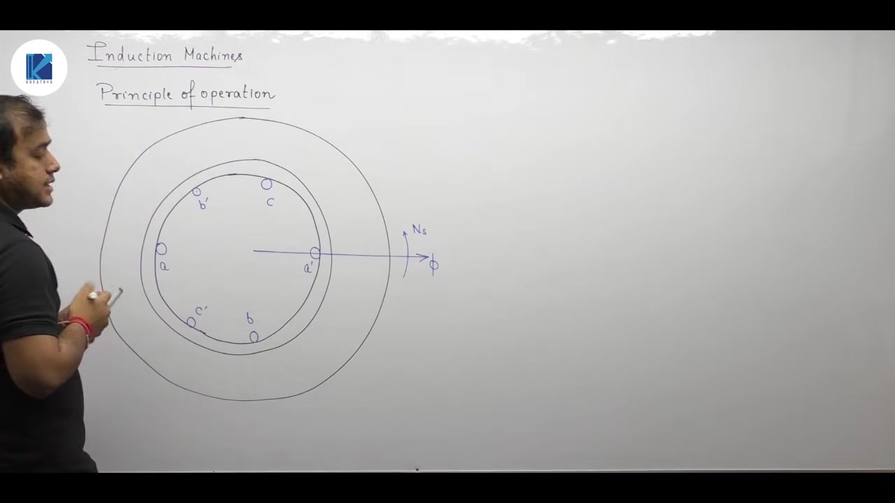

### Determining Induced EMF Directions

With the stator field pointing rightward, each rotor conductor moves through the flux. The motional electric field intensity follows the vector cross product:

$$\vec{E}_{\text{ind}} = \vec{v} \times \vec{B}$$

Consider the conductors located along the vertical axis:

1. **Top conductor**: Due to clockwise rotation, its linear velocity vector $\vec{v}$ points downwards. The magnetic field $\vec{B}$ points to the right. Taking the cross product:
   $$\vec{v} \times \vec{B} = (\text{downwards}) \times (\text{rightwards}) = \text{out of the page} \ (\odot)$$
   An outward directed EMF develops in this conductor.

2. **Bottom conductor**: Its linear velocity vector $\vec{v}$ points upwards. Taking the cross product:
   $$\vec{v} \times \vec{B} = (\text{upwards}) \times (\text{rightwards}) = \text{into the page} \ (\otimes)$$
   An inward directed EMF develops in this conductor.

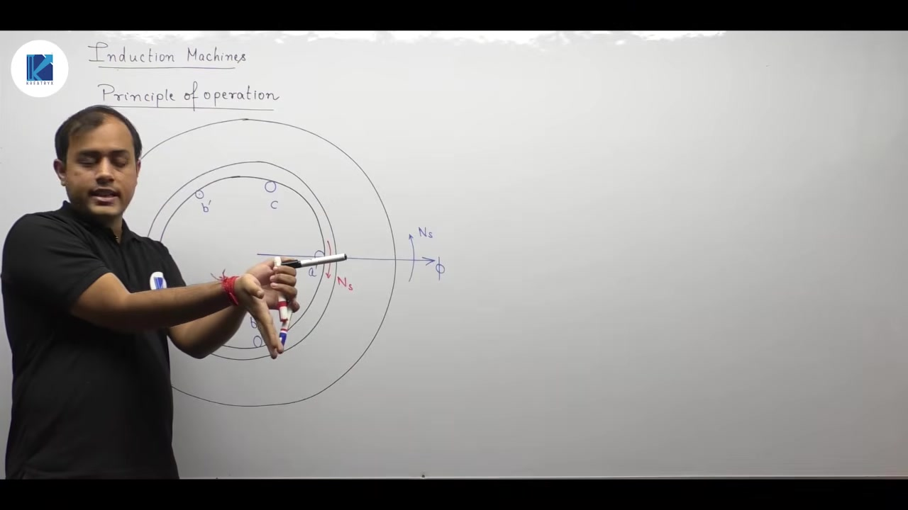

Along the horizontal axis, the conductor velocity is parallel to the magnetic field lines. The cross product $\vec{v} \times \vec{B}$ yields zero. No EMF is induced in conductors lying along the field axis.

### Maximum Induced EMF and Flux Linkage

A simple relationship connects flux linkage and induced voltage in AC windings:

$$\Phi(t) = \Phi_{\max} \cos(\omega t)$$

Faraday's law states that the induced EMF is the negative rate of change of flux linkage:

$$e(t) = -\frac{d\Phi(t)}{dt} = \omega \Phi_{\max} \sin(\omega t) = E_{\max} \cos(\omega t - 90^\circ)$$

The induced EMF lags the magnetic flux by $90^\circ$ in time phase.

Consider the coil formed by conductors $A$ and $A'$. This coil lies horizontally, parallel to the magnetic flux lines. No flux threads through the coil window. The enclosed flux linkage is zero.

Because the flux linkage is passing through zero, its time derivative is at its maximum value. Thus the maximum induced EMF appears in the coil that lies parallel to the magnetic field.

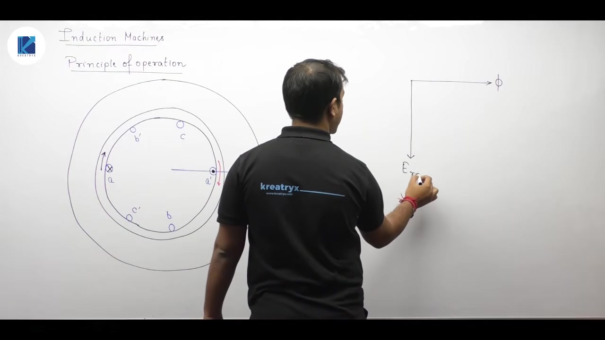

### Rotor Current in a Purely Resistive Rotor

Now suppose the rotor winding circuit is closed. Current circulates in the rotor. The magnitude and phase of this current depend on the rotor impedance:

$$\bar{I}_2 = \frac{\bar{E}_2}{R_2 + j X_2}$$

First consider an idealized case where the rotor is purely resistive ($X_2 = 0$).

In a purely resistive circuit, current is in phase with induced EMF:

$$\bar{I}_2 = \frac{\bar{E}_2}{R_2} \angle 0^\circ$$

The rotor current $I_2$ lies in the exact same phase as $E_2$. Because $E_2$ lags the mutual flux $\Phi$ by $90^\circ$, the rotor current also lags the flux by $90^\circ$. This phase relationship directly affects the electromagnetic torque.

## Torque Formulation, Leakage Reactance, and Air Gap Optimization
_(30:58 - 36:00)_

Electromagnetic torque in an AC machine depends on the field strength and the spatial alignment between stator and rotor fields.

### Torque in a Purely Resistive Rotor

From electromechanical energy conversion principles, the electromagnetic torque equation is:

$$T = \frac{\pi}{8} P^2 \Phi F_2 \sin\lambda$$

Here $P$ is the number of poles. $\Phi$ is the mutual flux per pole. $F_2$ is the peak rotor MMF. The angle $\lambda$ represents the space angle between the stator field vector and the rotor MMF vector.

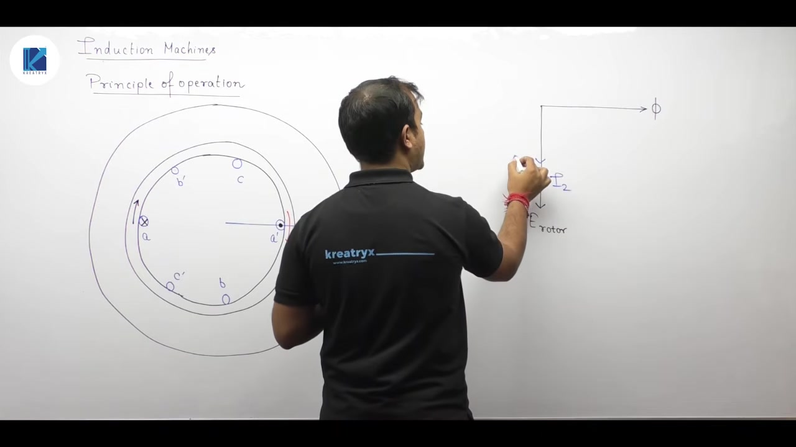

If the rotor is purely resistive, the rotor current aligns in time phase with the induced EMF. The resulting rotor MMF vector $F_2$ points straight downwards.

The stator flux vector points horizontally to the right. The angle between them is:

$$\lambda = 90^\circ$$

Substituting $\sin(90^\circ) = 1$ into the torque equation yields:

$$T = T_{\max} = \frac{\pi}{8} P^2 \Phi F_2$$

When stator and rotor fields sit at $90^\circ$ electrical, the developed torque reaches its theoretical maximum.

### The Effect of Leakage Reactance

In a real machine, pure resistance cannot exist alone. The air gap between stator and rotor allows some magnetic flux to leak.

Not all flux crossing the air gap links both windings. Some flux lines complete their paths entirely through air slots. We represent this leakage flux as a leakage reactance $X_2$ in the rotor equivalent circuit.

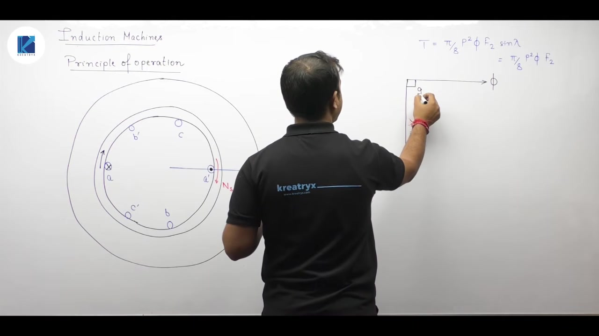

Because of this leakage inductance, the rotor impedance is complex:

$$\bar{Z}_2 = R_2 + j X_2$$

The rotor current $I_2$ now lags behind the induced EMF $E_2$ by an internal phase angle $\theta_2$:

$$\theta_2 = \arctan\left(\frac{X_2}{R_2}\right)$$

Because the current lags, the rotor MMF vector shifts backwards in space. The total space angle between the stator field and rotor MMF becomes:

$$\lambda = 90^\circ + \theta_2$$

Evaluating the sine term:

$$\sin\lambda = \sin(90^\circ + \theta_2) = \cos\theta_2$$

Substituting this into the general torque expression gives:

> [!success] Result
> $$T = \frac{\pi}{8} P^2 \Phi F_2 \cos\theta_2$$

Because $\cos\theta_2 \le 1$, leakage reactance reduces the developed electromagnetic torque. The factor $\cos\theta_2$ acts as an internal rotor power factor.

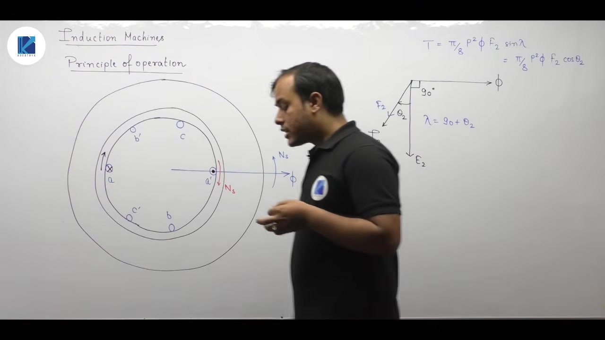

### Why Induction Motors Require a Small Air Gap

To maximize torque, the angle $\theta_2$ must be kept as small as possible. This requires minimizing the leakage reactance $X_2$.

Leakage flux paths pass primarily across the slot openings and across the air gap. Reducing the air gap length limits flux fringing and reduces leakage inductance.

Also, a shorter air gap reduces the magnetic reluctance. This cuts the required magnetizing current $I_\mu$ and raises the operating power factor.

For these reasons, designers make the air gap of an induction motor as small as mechanical clearance permits. Typical radial air gaps range from $0.25\text{ mm}$ in small motors to $1.5\text{ mm}$ in large industrial machines.

### Contrasting with Synchronous Machine Design

The air gap requirement in synchronous machines presents an instructive contrast. In synchronous machines, engineers deliberately choose a large air gap.

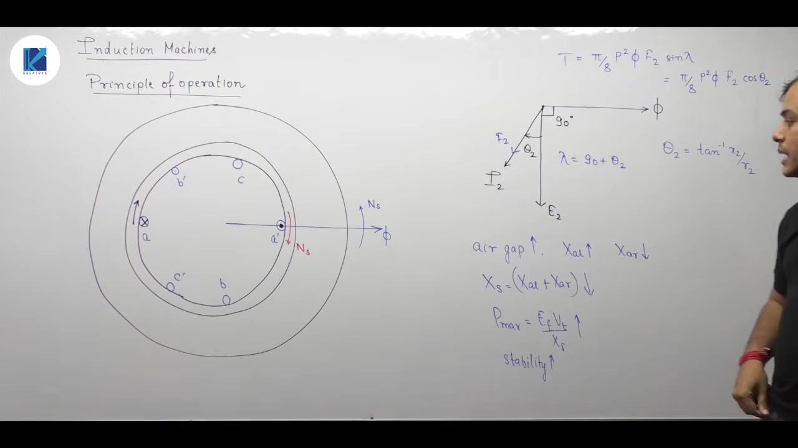

In a synchronous generator, the total synchronous reactance $X_s$ consists of leakage reactance and armature reaction reactance:

$$X_s = X_l + X_{ar}$$

A large air gap introduces high reluctance into the path of armature reaction flux. This suppresses armature reaction and makes $X_{ar}$ small. So the total synchronous reactance $X_s$ decreases.

The steady-state power transfer capability of a synchronous machine depends inversely on $X_s$:

$$P_{\max} = \frac{E_f V_t}{X_s}$$

Lowering $X_s$ increases $P_{\max}$. This raises the steady-state stability limit of the generator.

So synchronous machines use large air gaps to enhance stability. But induction motors use small air gaps to maximize torque and power factor.

## Absence of Armature Reaction and Conditions for Steady Torque
_(36:01 - 43:28)_

The absence of armature reaction in induction machines often surprises students. Understanding this distinction clarifies how torque develops across the air gap.

### Why Armature Reaction Does Not Exist in Induction Machines

In DC and synchronous machines, armature reaction represents a major topic. The field winding produces the main magnetic flux. The armature winding carries the load current. The MMF of the armature current distorts and weakens the main field flux.

In an induction machine, this concept does not apply.

The stator winding performs both functions simultaneously. It establishes the main working flux. It also carries the load current drawn from the AC source.

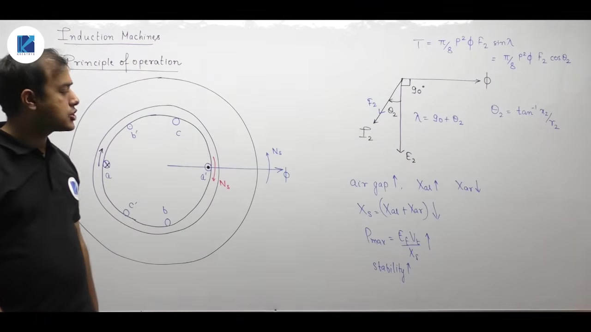

When the rotor carries current, it creates a demagnetizing effect on the core. The stator winding automatically draws a balancing current $I_1'$ from the mains. This preserves the core flux at a constant level.

This interaction is identical to a transformer. We do not speak of armature reaction in a transformer. For the same reason, the concept does not exist in an induction machine.

### Conditions for Continuous Electromagnetic Torque

Two fundamental conditions must be satisfied to produce steady, non-zero average torque in any AC machine:

1. Both the stator and rotor magnetic fields must rotate at the same speed in space. Their relative speed with respect to each other must be zero.
2. The stator and rotor must develop the exact same number of magnetic poles.

If either condition fails, the magnetic poles continually shift past each other. The instantaneous torque alternates rapidly and averages to zero.

### Rotor Constructions: Squirrel Cage versus Wound Rotor

Induction machines use two primary types of rotor construction:

1. **Squirrel Cage Rotor**: Conducting bars of aluminum or copper sit embedded in rotor slots. Heavy end rings short-circuit these bars at both ends. The structure resembles a cylindrical cage. It acts much like a continuous damper winding.
2. **Wound Rotor (Slip Ring)**: Insulated copper windings sit in the rotor slots. These windings form a balanced three-phase star connection. The terminal ends connect to three external slip rings on the shaft.

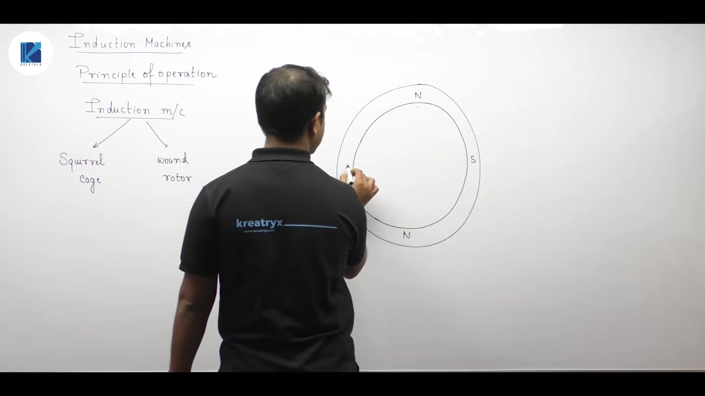

### Pole Induction on a Four-Pole Machine

Consider an induction machine with four stator poles ($N_1, S_1, N_2, S_2$). The stator field rotates counter-clockwise.

Between each pair of adjacent poles lies a neutral axis, also called the quadrature axis. Along the neutral axis, the conductor velocity aligns parallel to the magnetic flux lines. The cross product $\vec{v} \times \vec{B}$ equals zero, so no EMF develops.

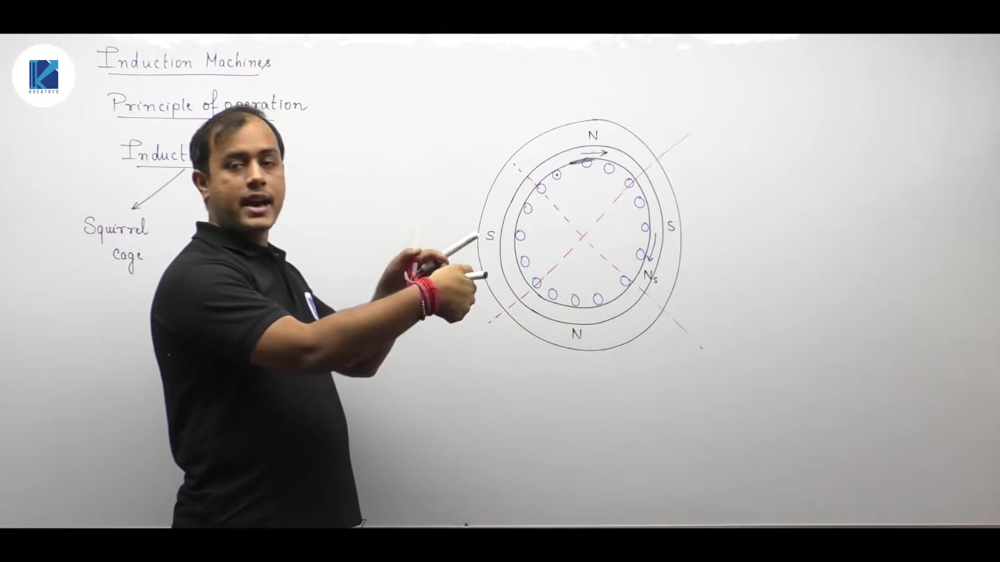

Under the North poles, conductors carry inward directed currents ($\otimes$). Under the South poles, conductors carry outward directed currents ($\odot$).

Each group of conductors produces a local magnetic field:

- Inward currents ($\otimes$) create clockwise magnetic field loops.
- Outward currents ($\odot$) create counter-clockwise magnetic field loops.

At the rotor surface, flux emerges where field lines leave the iron. This creates an induced North pole on the rotor. Where flux enters the iron, an induced South pole appears.

### Direction of Developed Torque

Now observe the magnetic force interactions between the stator and rotor poles:

- The stator North pole repels the adjacent rotor North pole forward.
- The stator South pole attracts the approaching rotor North pole.
- The stator South pole repels the adjacent rotor South pole forward.
- The stator North pole attracts the approaching rotor South pole.

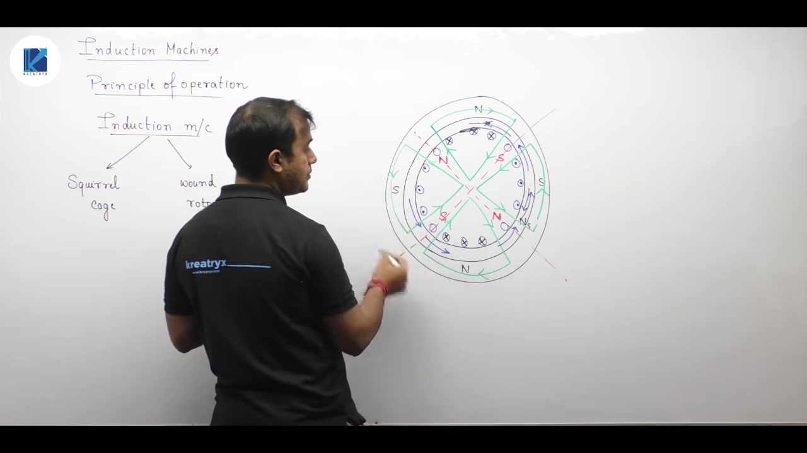

Every pole pair works together in the same circumferential direction. The resulting electromagnetic torque acts in the counter-clockwise direction.

This torque direction matches the rotation of the stator magnetic field. So the physical pole interaction confirms Lenz's law. The torque drives the rotor to follow the rotating field.

## Pole Adaptation and Vector Alignment Principles
_(43:28 - 48:59)_

The method of creating rotor poles reveals a fundamental difference between squirrel cage and wound-rotor induction motors.

### Inherent Pole Adaptation in Squirrel Cage Rotors

In a squirrel cage rotor, simple conductive bars span the rotor slots. End rings permanently short-circuit all the bars at both ends. No distinct coils or predetermined winding groups exist.

When the stator produces $P$ magnetic poles, the induced currents reverse direction $P$ times around the rotor periphery. Each reversal of current flow sets up a magnetic pole on the rotor surface.

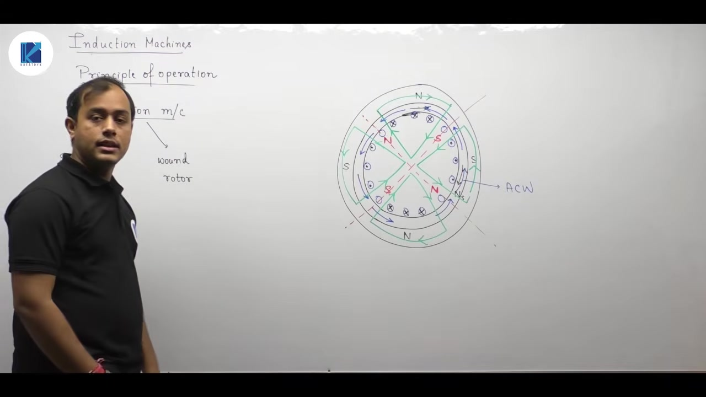

> [!success] Result
> A squirrel cage rotor automatically adapts to any stator pole number:
> $$P_{\text{rotor}} = P_{\text{stator}}$$

If the stator winding connects for four poles, the cage rotor automatically acts as a four-pole rotor. If you reconnect the stator for six poles, the cage rotor becomes a six-pole rotor. You never need to modify the cage rotor when changing stator pole numbers.

### Pole Constraints in Wound-Rotor Machines

A wound rotor behaves differently. It carries insulated, distributed three-phase windings placed in slots.

A magnetic pole appears in a wound winding only where the coil connections reverse the current flow. Because the coils are hardwired, the number of rotor poles is fixed during manufacturing.

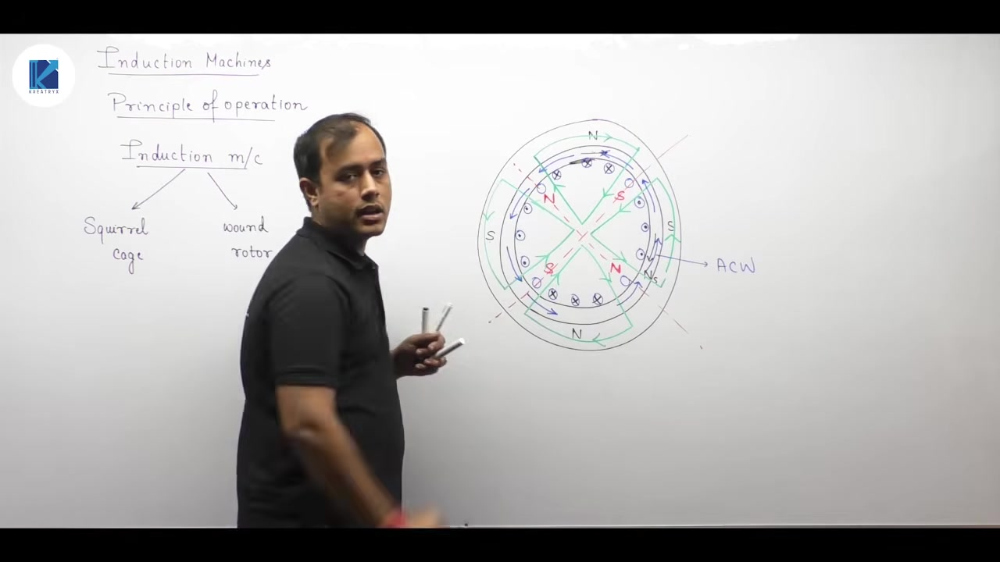

The rotor winding must be wound for the exact number of stator poles:

$$P_{\text{wound rotor}} = P_{\text{stator}} \quad (\text{by design})$$

If a wound rotor is placed inside a stator with a different pole count, the net torque averages to zero. The motor will fail to start.

### Alignment of Stator and Rotor MMF Vectors

The direction of electromagnetic torque can also be understood through vector alignment.

In any electric machine, torque acts to bring interacting magnetic fields into alignment. Recall the torque formula:

$$T = \frac{\pi}{8} P^2 \Phi F_2 \sin\lambda$$

The angle $\lambda$ represents the spatial displacement between the stator field $\vec{\Phi}$ and the rotor MMF $\vec{F}_2$.

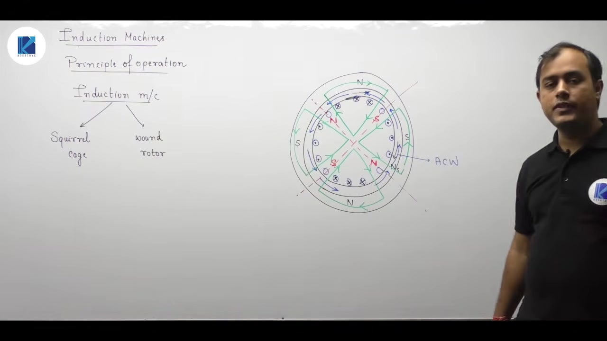

The physical system naturally seeks the lowest magnetic energy state. This state occurs when the two field vectors align ($\lambda = 0^\circ$).

Because of this, the rotor MMF continually tries to catch the revolving stator flux vector. The stator field rotates forward at synchronous speed $N_s$. To reduce the angle $\lambda$, the torque pulls the rotor in the same direction of rotation.

### Summary of Foundational Concepts

This introductory lecture establishes the core principles for the study of induction machines:

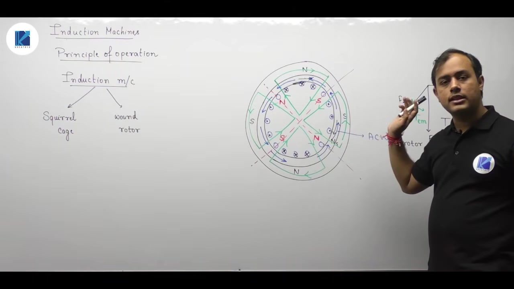

1. **Singly Excited Machine**: The stator connects to the AC supply. The rotor receives all working energy through mutual induction across the air gap.
2. **Asynchronous Operation**: The rotor must always run at a speed $N_r < N_s$ in motoring mode. Running at $N_s$ eliminates induced voltage and torque.
3. **Air Gap Role**: The air gap increases magnetic reluctance, requiring a large magnetizing current ($30\%\text{ to }35\%$ of full load). A small air gap minimizes leakage reactance and boosts torque.
4. **Armature Reaction**: The stator winding serves as both field and armature winding. No separate armature reaction phenomenon exists.
5. **Pole Matching**: Continuous torque requires equal pole counts on stator and rotor. A squirrel cage adapts automatically, while a wound rotor requires matching by design.

---

## Summary and Key Takeaways

- An induction machine is a singly excited AC machine where only the stator connects to a power source, while the rotor receives all its working energy through mutual induction across the air gap.
- An induction motor cannot operate at synchronous speed $N_s = 120 f / P$ because relative motion between the rotating stator field and the rotor conductors would vanish, reducing induced EMF, rotor current, and driving torque to zero.
- The composite magnetic circuit includes an air gap that sharply increases total reluctance, requiring a magnetizing current of $I_\mu \approx (0.30\text{ to }0.35) I_{\text{FL}}$, which cannot be neglected during equivalent circuit analysis.
- An induction machine operates as a variable frequency device where the rotor electrical frequency depends on slip according to $f_r = s f$.
- Rotor leakage reactance $X_2$ causes the rotor current to lag the induced EMF by an angle $\theta_2 = \arctan(X_2 / R_2)$, which reduces developed torque according to $T = \frac{\pi}{8} P^2 \Phi F_2 \cos\theta_2$.
- A small physical air gap is preferred in induction motors to minimize leakage reactance and magnetizing current, unlike synchronous machines where a large air gap improves steady-state power limits and stability.
- Armature reaction does not exist in an induction machine because the stator winding simultaneously produces the mutual flux and carries the load-balancing current.
- A squirrel cage rotor automatically induces the exact number of magnetic poles present on the stator ($P_r = P_s$), whereas a wound rotor must be manufactured with matching pole numbers by design.

