[← Lec 131: Induction Machines Introduction](Lecture_131_Induction_Machines_Introduction.md) | [🏠 Index](00_yt_study_guide.md) | [Lec 133: Induction Machine Construction 2 →](Lecture_133_Induction_Machine_Construction_2.md)

---

# Electrical Machines | Lec 95 | Induction Machine Construction - 1 | GATE Electrical Engineering

- **Source**: https://www.youtube.com/watch?v=Wk0b3yaoptg
- **Duration**: 00:48:50
- **Compiled**: 2026-09-23

---

## Overview

This lecture examines the physical construction of three-phase induction machines with an emphasis on stator slots and squirrel cage rotors. It explains magnetic pole formation along the stator bore and derives slot leakage permeance as a function of slot geometry. The discussion compares open, semi-open, and closed slot profiles across air gap reluctance, leakage reactance, harmonic generation, and power factor. Finally, the lecture details squirrel cage rotor construction, covering conductive bars, end rings, core laminations, skewing benefits, and running performance.

## Contents

- [[#Stator Construction and Winding Principles|Stator Construction and Winding Principles]]
- [[#Magnetic Poles and Slot Leakage Flux|Magnetic Poles and Slot Leakage Flux]]
- [[#Open Slot Construction and Magnetic Properties|Open Slot Construction and Magnetic Properties]]
- [[#Open Slots Characteristics and Semi-Open Slots|Open Slots Characteristics and Semi-Open Slots]]
- [[#Closed Slot Construction and Harmonic Reduction|Closed Slot Construction and Harmonic Reduction]]
- [[#Comparative Analysis and Slot Selection in Electric Machines|Comparative Analysis and Slot Selection in Electric Machines]]
- [[#Squirrel Cage Rotor Construction and Skewing|Squirrel Cage Rotor Construction and Skewing]]
- [[#Operational Characteristics of Squirrel Cage Rotors|Operational Characteristics of Squirrel Cage Rotors]]

---

## Stator Construction and Winding Principles
_(00:13 - 04:58)_

The construction of an induction machine divides into two main parts. The stationary part is the stator. The rotating part is the rotor. 

### Stator Construction

The stator of a three phase induction machine is identical to the stator of a three phase synchronous machine. It houses a balanced three phase distributed winding. The three phase windings are displaced from each other by $120^\circ$ electrical in space.

> [!info] Stator Winding Features
> - Displaced in space by $120^\circ$ electrical.
> - Supplied with balanced three phase currents.
> - Distributed across the stator periphery.
> - Short pitched to eliminate specific space harmonics.

When balanced three phase currents flow through these spatially displaced windings, they create a rotating magnetic field. This magnetic field rotates at synchronous speed $N_s$ relative to the stator structure:

$$N_s = \frac{120 f}{P}$$

Here $f$ is the supply frequency and $P$ is the number of stator poles.

### Mechanism of Magnetic Pole Formation

Magnetic poles form along the air gap periphery due to the direction of current in the conductors. Current flowing into the page is represented by a cross ($\otimes$). This creates a clockwise magnetic field. Current flowing out of the page is represented by a dot ($\odot$). This creates an anti-clockwise magnetic field.

When two adjacent conductors carry currents in opposite directions, their magnetic flux lines combine. They enter or leave the stator surface between the conductors. Flux leaving the stator forms a North pole. Flux entering the stator forms a South pole. 

Therefore, whenever two adjacent conductors carry currents in opposite directions, a magnetic pole forms between them.

## Magnetic Poles and Slot Leakage Flux
_(05:06 - 14:33)_

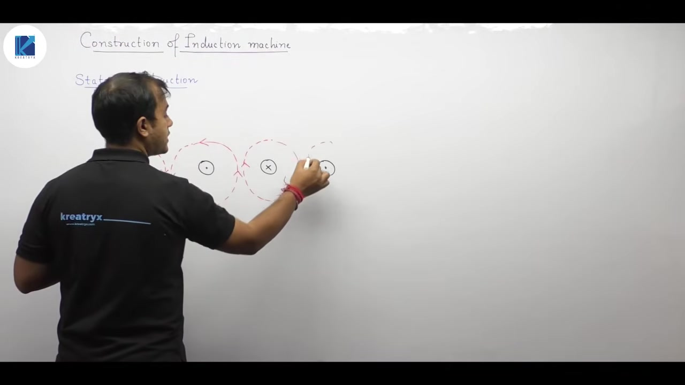

### Conductor Arrangements and Pole Formation

Consider four conductors arranged along the stator periphery with alternating currents: $\otimes, \odot, \otimes, \odot$. 

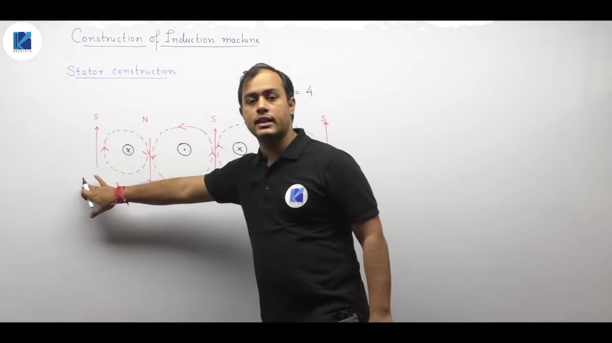

A cross creates a clockwise magnetic field. A dot creates an anti-clockwise field. Between the first two conductors, the flux lines point outward into the air gap. This forms a North pole. Between the next two conductors, flux lines enter the stator. This forms a South pole. In a complete circular periphery, four poles form (two North and two South).

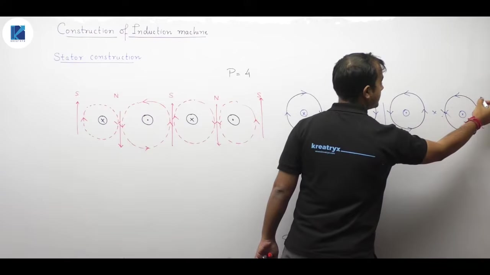

Now consider two pairs of conductors with currents in the same direction: $\otimes, \otimes, \odot, \odot$. 

Between the two adjacent cross conductors, one magnetic field points down while the other points up. They cancel each other. No magnetic pole forms between conductors carrying current in the same direction. Only two poles form around the machine periphery.

> [!info] Rule for Pole Formation
> - Opposite current directions between adjacent conductors induce a magnetic pole.
> - Same current directions between adjacent conductors cancel out, forming no pole.

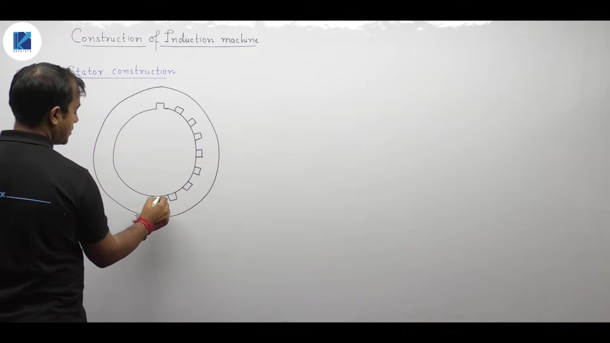

### Stator Slots and Teeth

The stator core is stamped from laminated silicon steel sheets. Windings sit inside slots punched into the inner periphery. The iron regions between adjacent slots are the stator teeth.

The conductor cross-sectional area determines the required slot volume. For a required cross-sectional area, two slot geometries are possible:
1. Wide and shallow (large width $w_s$, small depth $h$).
2. Narrow and deep (small width $w_s$, large depth $h$).

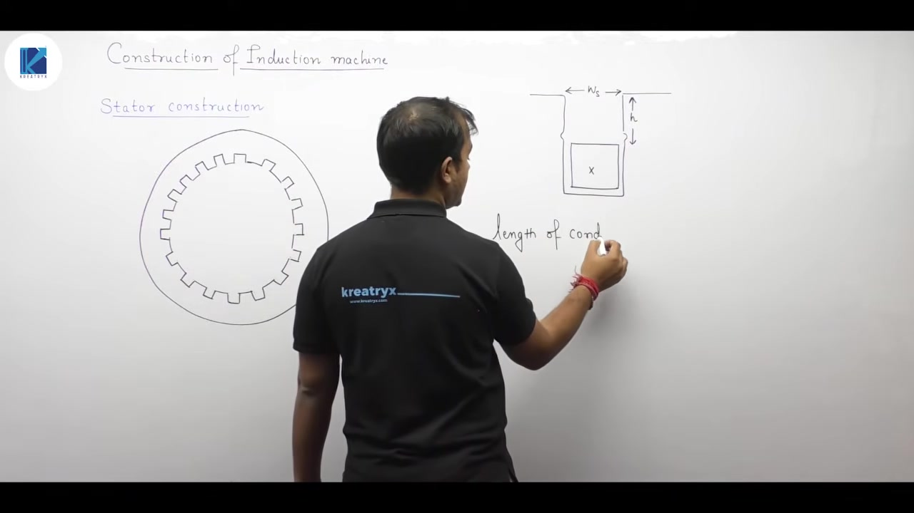

### Slot Leakage Permeance Derivation

Consider a rectangular slot of width $w_s$, conductor depth $h$, and axial core length $L_s$. Current $I$ flows through the embedded conductor.

The slot leakage flux crosses the slot width through air. The reluctance of this leakage path across the slot is:

$$\mathcal{R}_{\text{leakage}} = \frac{w_s}{\mu_0 L_s h}$$

The permeance of the leakage path is the reciprocal of reluctance:

$$\mathcal{P}_{\text{leakage}} = \frac{1}{\mathcal{R}_{\text{leakage}}} = \frac{\mu_0 L_s h}{w_s}$$

The slot leakage flux is:

$$\Phi_{\text{leakage}} = \text{MMF} \times \mathcal{P}_{\text{leakage}} = \frac{\mu_0 I L_s h}{w_s}$$

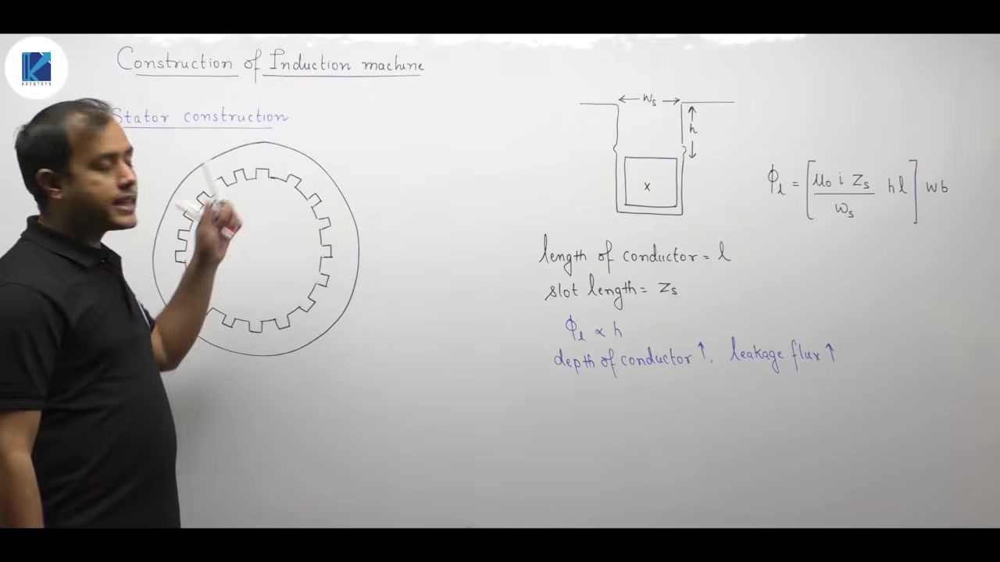

> [!success] Slot Leakage Proportionality
> The slot leakage flux and slot leakage reactance are directly proportional to slot depth and inversely proportional to slot width:
> $$\Phi_{\text{leakage}} \propto \frac{h}{w_s}$$
> $$X_l \propto \frac{h}{w_s}$$

When a slot is made deeper, the conductor sits farther away from the rotor. Magnetic coupling weakens and leakage flux increases. Deeper slots therefore exhibit higher leakage reactance.

## Open Slot Construction and Magnetic Properties
_(14:33 - 19:04)_

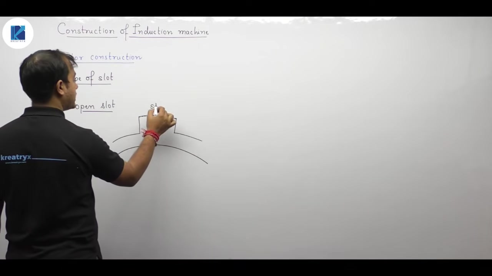

### Open Slot Characteristics

In an open slot, the slot opening has parallel sides. The width of the slot opening equals the full slot width. 

Two distinct flux components exist:
1. Mutual flux: Flux crossing the physical air gap and linking both stator and rotor conductors.
2. Leakage flux: Flux completing its path locally through air without crossing into the rotor.

### Air Gap Reluctance and Magnetizing Current

In open slots, the conductors remain physically exposed at the slot opening. To prevent rotating rotor parts from touching the stator conductors, the air gap length $g$ must be kept relatively large.

The mutual flux crosses the air gap twice. The reluctance offered to the mutual flux across the air gap is:

$$\mathcal{R}_{\text{gap}} = \frac{2g}{\mu_0 A}$$

As the air gap length $g$ increases, the air gap reluctance rises directly. The required magnetizing MMF is:

$$\text{MMF} = N I_\mu = \Phi \mathcal{R}_{\text{gap}}$$

$$I_\mu = \frac{\Phi \mathcal{R}_{\text{gap}}}{N} = \frac{2g \Phi}{\mu_0 A N}$$

> [!info] Magnetizing Current in Open Slots
> Because open slots require a larger physical air gap, they exhibit high magnetic reluctance. A higher magnetizing current $I_\mu$ is needed to establish the working air gap flux.

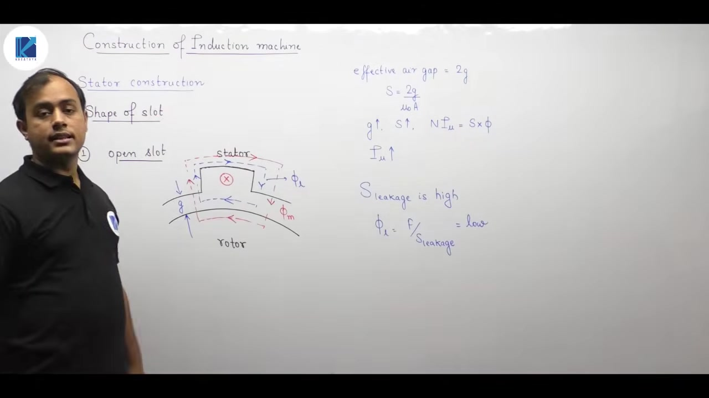

### Slot Leakage Reluctance and Leakage Reactance

In open slots, the leakage flux must cross across the wide open slot mouth through air. 

Air has very low permeability ($\mu_0$). So the magnetic reluctance encountered by the leakage flux, $\mathcal{R}_{\text{leakage}}$, is very high.

The leakage flux is:

$$\Phi_{\text{leakage}} = \frac{\text{MMF}}{\mathcal{R}_{\text{leakage}}}$$

Because $\mathcal{R}_{\text{leakage}}$ is high, the leakage flux is small. Therefore, open slots have the lowest leakage flux and the lowest leakage reactance among all slot types.

## Open Slots Characteristics and Semi-Open Slots
_(19:04 - 25:15)_

### Trade-offs of Open-Type Slots

In open-type slots, the mouth of the slot is completely open to the air gap. The leakage flux passes mostly through air across the wide opening. Because air has very high reluctance compared to iron, the leakage flux is low. This results in a low leakage reactance, which is a major advantage. 

Another practical advantage is coil placement. Since the slot mouth is wide open, preformed coils can be inserted directly and secured quickly. 

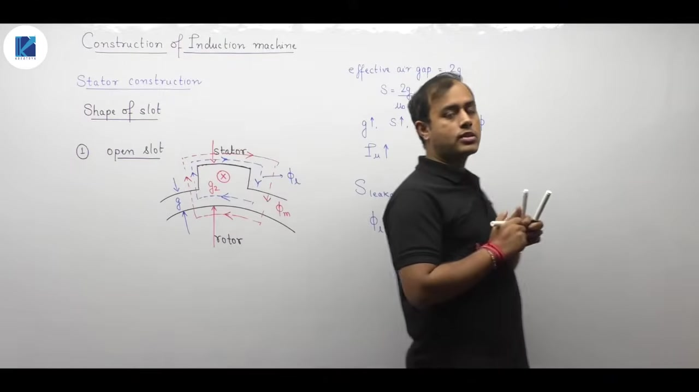

However, open slots present distinct disadvantages:

1. **Higher Magnetizing Current ($I_\mu$):** To prevent conductors from contacting the rotor, the mechanical clearance or air gap length $g$ must be relatively large. A larger air gap increases reluctance for mutual flux, demanding a larger magnetizing current and depressing the operating power factor.
2. **Non-Uniform Air Gap and Slot Harmonics:** The effective air gap is large at slot openings and small at tooth faces. This periodic alternation causes slot or tooth harmonics in the flux density waveform:
   $$
   n = \frac{2S}{P} \pm 1
   $$
   where $S$ is the number of stator slots and $P$ is the number of poles. These harmonics induce unwanted harmonic torques.

> [!info] Summary of Open Slots
> Open slots reduce leakage reactance and allow easy winding insertion. In return, they require higher magnetizing current and cause slot harmonics that generate harmonic torque.

---

### Semi-Open Type Slots

In semi-open slots, the slot mouth is partially closed by teeth extensions called slot lips. The opening facing the air gap is significantly narrower than the slot body.

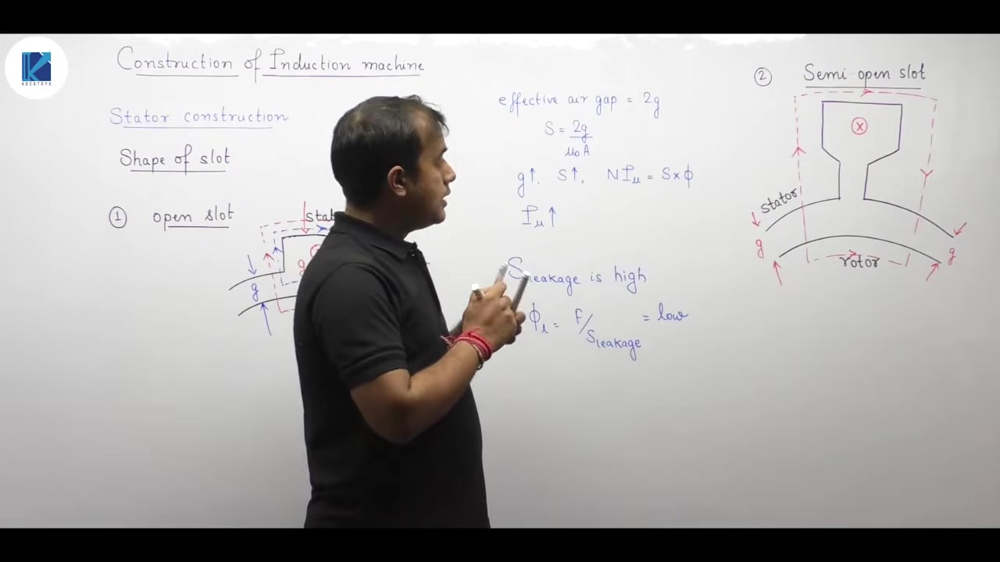

#### Air Gap and Magnetizing Current

Because the narrow mouth keeps conductors securely recessed inside the slot, there is minimal danger of stator conductors contacting the rotor. The physical air gap length $g$ can therefore be made smaller than in open-slot designs. 

With a smaller air gap length $g$, the reluctance of the mutual flux path decreases:
$$
\mathcal{R} = \frac{l_g}{\mu_0 A}
$$
Because reluctance is lower, the required magnetizing current $I_\mu$ decreases for the same mutual flux. This improves the machine's power factor.

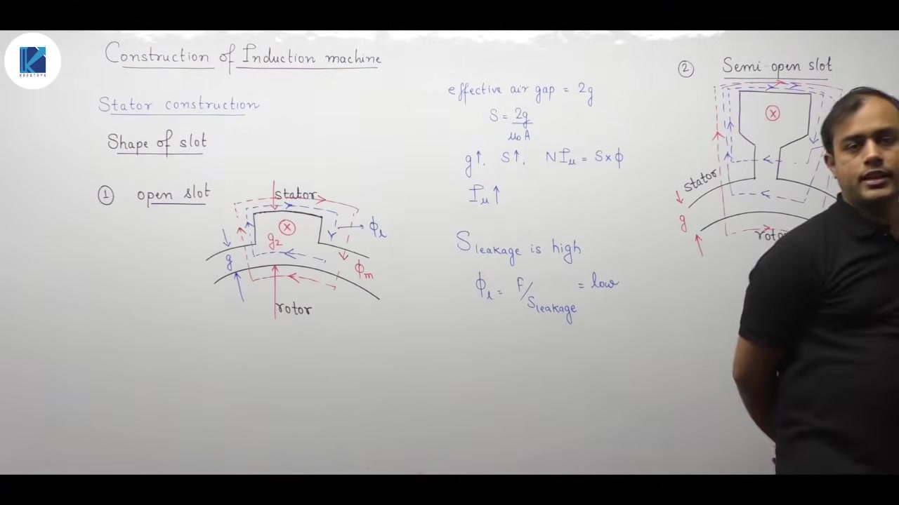

#### Leakage Flux and Reactance

The constricted slot opening creates an iron path with only a very narrow air gap for the leakage flux bridging the teeth tips. So the reluctance offered to the leakage flux is much lower than in open slots. 

> [!success] Semi-Open Slot Properties
> Compared to open slots, semi-open slots provide:
> 1. Reduced air gap length and lower magnetizing current $I_\mu$.
> 2. Higher leakage flux and higher leakage reactance $X_l$ due to lower reluctance across the slot lips.

## Closed Slot Construction and Harmonic Reduction
_(25:15 - 29:50)_

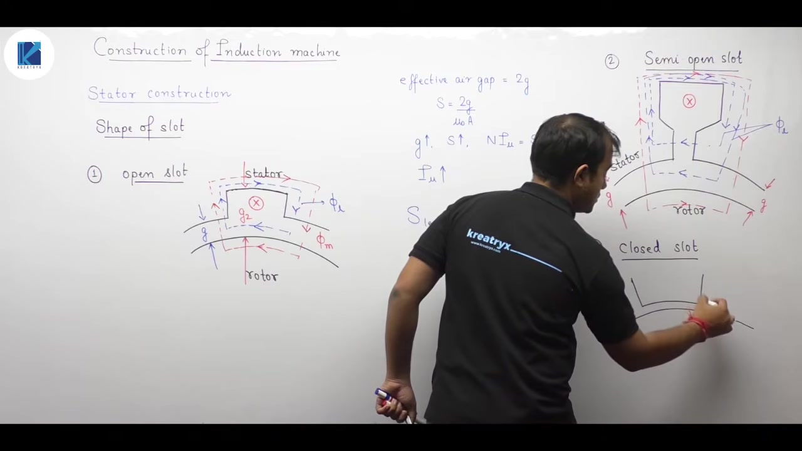

### Semi-Open Slot Operational Aspects

In semi-open slots, placing pre-formed coils requires pushing individual conductors through the narrowed mouth. The winding assembly is therefore more difficult than in open slots.

But the air gap along the periphery is much more uniform. The dip in flux density over the slot mouth is small. This substantially reduces slot harmonics and parasitic harmonic torques.

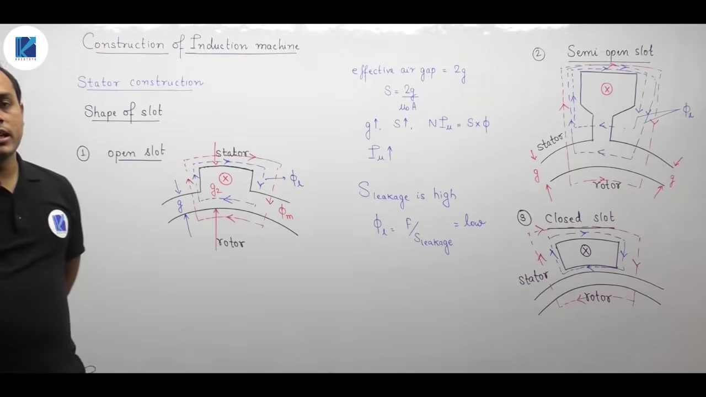

### Closed Slot Geometry

In a closed slot, an iron bridge fully covers the slot face. There is no opening into the air gap. The conductors sit inside completely enclosed tunnels within the stator laminations.

Because conductors are shielded behind solid iron, there is no risk of contact with the rotor. The physical air gap $g$ can be set to the absolute mechanical clearance minimum.

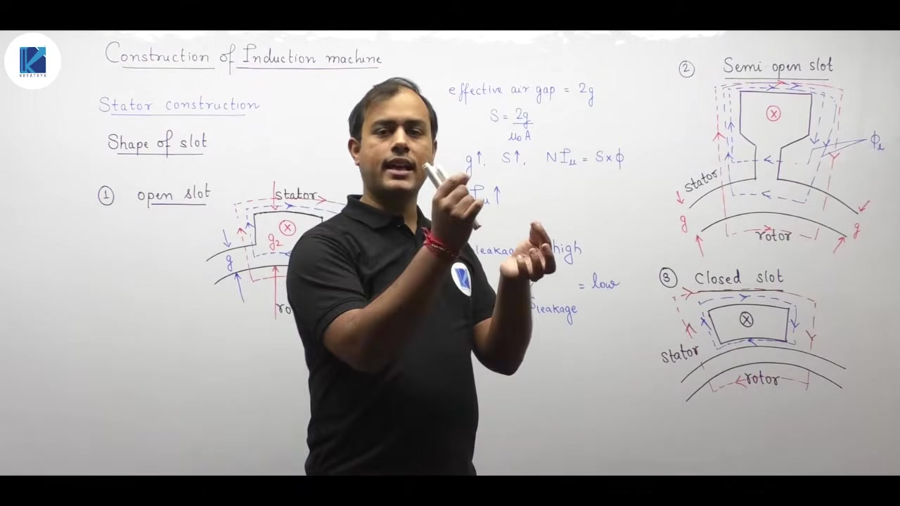

### Reluctance and Magnetizing Current in Closed Slots

The smooth, unbroken stator bore minimizes the air gap reluctance:

$$\mathcal{R}_{\text{gap}} = \frac{2g_{\text{min}}}{\mu_0 A}$$

Because the gap reluctance is the lowest among all three configurations, closed slots require the minimum magnetizing current $I_\mu$:

$$I_\mu = \frac{\Phi \mathcal{R}_{\text{gap}}}{N}$$

This yields the best no-load power factor.

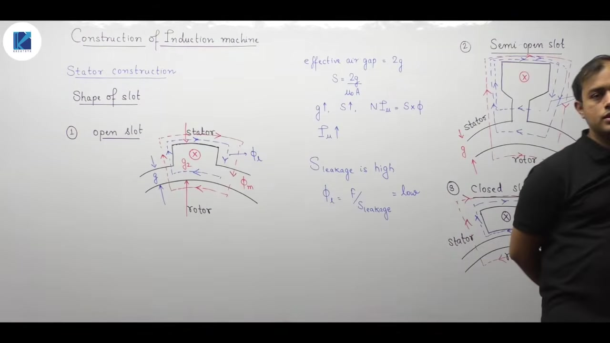

### Leakage Flux and Manufacturing Constraints

The iron bridge over the slot creates a continuous magnetic path for leakage flux. 

Because iron has high permeability ($\mu \gg \mu_0$), the reluctance of the leakage path drops drastically:

$$\mathcal{R}_{\text{leakage}} \approx \frac{w_s}{\mu_{\text{iron}} A_{\text{bridge}}} \approx \text{minimum}$$

This small reluctance causes heavy leakage flux across the slot top. So closed slots produce the highest leakage flux and highest leakage reactance $X_l$.

> [!info] Closed Slot Characteristics
> - Lowest air gap reluctance $\implies$ lowest magnetizing current $I_\mu$.
> - Lowest leakage path reluctance $\implies$ highest leakage reactance $X_l$.
> - Smooth air gap bore $\implies$ negligible slot harmonics.
> - Conductors must be threaded from one end like a needle, making winding insertion and repair extremely difficult.

## Comparative Analysis and Slot Selection in Electric Machines
_(29:52 - 35:46)_

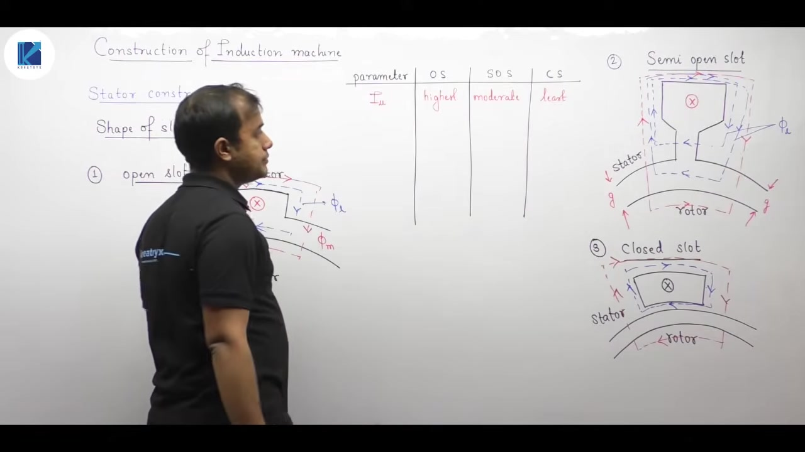

### Comparison Across Slot Configurations

The selection of slot type involves compromises among reluctance, leakage reactance, starting torque, winding ease, harmonics, and power factor.

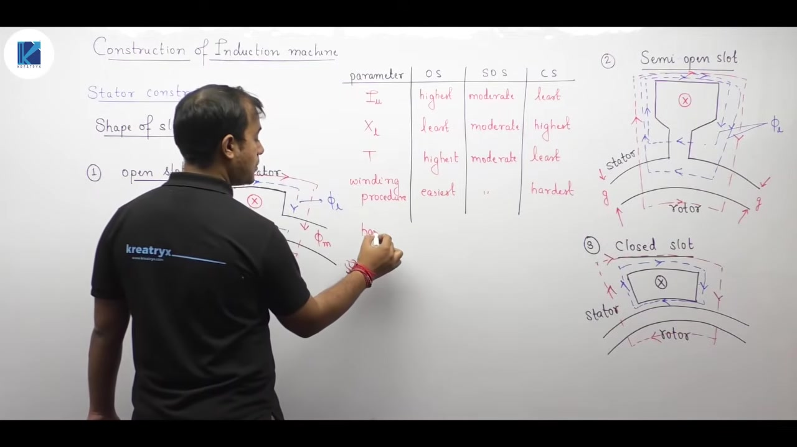

| Parameter | Open Slot | Semi-Open Slot | Closed Slot |
| :--- | :--- | :--- | :--- |
| **Air Gap Reluctance** | Highest | Moderate | Least |
| **Leakage Reactance ($X_l$)** | Least | Moderate | Highest |
| **Starting Torque** | Highest | Moderate | Least |
| **Winding Assembly** | Easiest | Moderate | Hardest |
| **Slot Harmonics** | Highest | Moderate | Least |
| **No-Load Power Factor** | Low | Moderate | Highest |
| **Full-Load Power Factor** | Highest | Moderate | Least |

### Derivation of Operational Impacts

1. **Torque and Leakage Reactance**:
   Electromagnetic torque depends on the rotor power factor:
   
   $$T \propto \cos\theta_2 = \frac{R_2}{\sqrt{R_2^2 + X_2^2}}$$
   
   Higher leakage reactance increases rotor impedance angle $\theta_2$ and decreases $\cos\theta_2$. Open slots produce the lowest leakage reactance. So they yield the highest torque for a given current.

2. **No-Load Power Factor**:
   At no load, active power is small. Reactive magnetizing current $I_\mu$ dominates the stator input:
   
   $$\cos\phi_0 \approx \frac{I_w}{I_0} \approx \frac{I_w}{\sqrt{I_w^2 + I_\mu^2}}$$
   
   Open slots need large $I_\mu$. So they exhibit a low no-load power factor. Closed slots require minimal $I_\mu$. So their no-load power factor is highest.

3. **Full-Load Power Factor**:
   Under full load, internal leakage reactance drops determine the phase displacement:
   
   $$\cos\phi_{\text{FL}} \approx \frac{R_{\text{eq}}}{Z_{\text{eq}}} = \frac{R_{\text{eq}}}{\sqrt{R_{\text{eq}}^2 + X_{\text{eq}}^2}}$$
   
   Because closed slots have massive leakage reactance $X_{\text{eq}}$, their full-load power factor is lowest. Open slots have minimal $X_{\text{eq}}$, giving the highest full-load power factor.

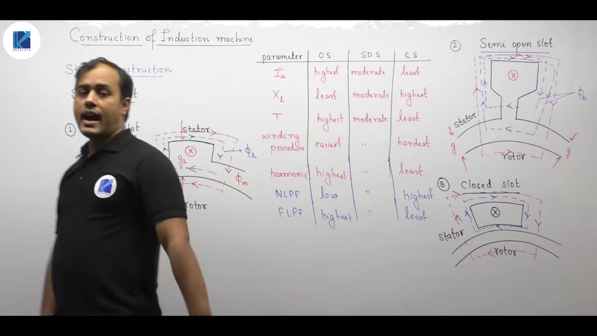

### Slot Selection for Specific Machines

- **Three Phase Induction Motor**: Uses semi-open slots. Harmonics must be kept low to prevent vibration and acoustic noise. Semi-open slots offer a practical compromise with moderate air gap, moderate leakage, and low harmonic content.
- **Synchronous Machine**: Uses open slots. Synchronous stability improves with a larger air gap and lower short-circuit ratio. Open slots provide the large effective air gap needed for field stability.
- **DC Machine**: Uses open slots. A large air gap reduces armature reaction cross-magnetization under the pole tips. This suppresses sparking and ensures clean commutation.
- **Fractional Horsepower and Toy Motors**: Use closed slots. These small machines are low-cost disposable items. Once manufactured, they are never rewound or repaired.

## Squirrel Cage Rotor Construction and Skewing
_(35:46 - 42:37)_

### Overview of Induction Motor Rotors

Induction motors use two distinct rotor constructions:
1. Squirrel cage rotor.
2. Wound rotor (slip ring rotor).

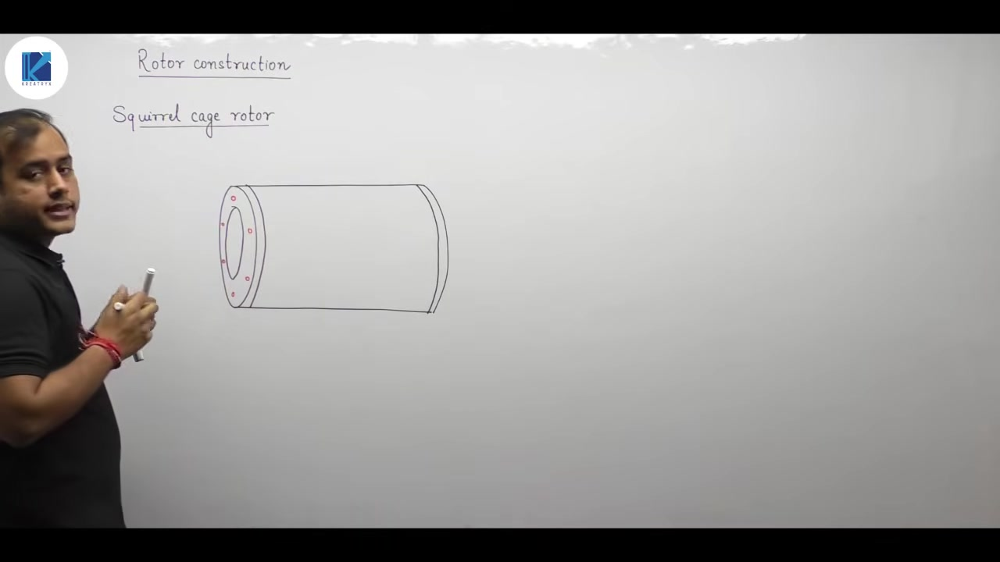

### Squirrel Cage Core and Rotor Bars

The squirrel cage rotor consists of a cylindrical core stamped from thin silicon steel laminations. The laminations are keyed directly to the central drive shaft. 

Instead of insulated wire coils, the rotor winding consists of heavy, uninsulated copper or aluminium bars. These bars are embedded directly into semi-closed or closed rotor slots.

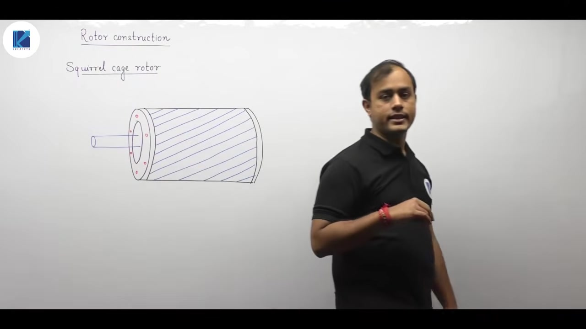

At each end of the rotor cylinder, heavy rings of the same conducting material connect the bars together. These are called end rings or short-circuiting gear. They short-circuit all the rotor conductors into a permanently closed cage. 

End rings also provide mechanical support. During high-speed rotation, strong centrifugal forces push the rotor bars outward. The end rings clamp the bars firmly in place.

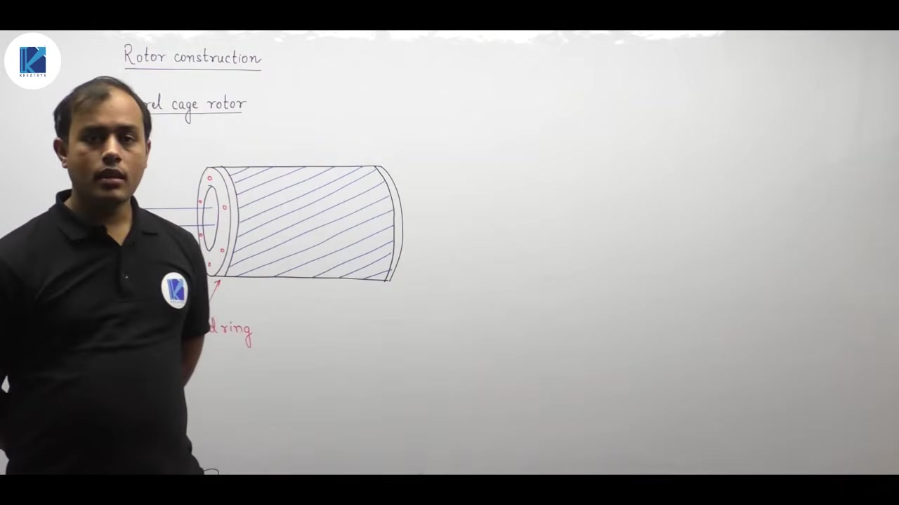

### Lamination Thickness: Stator vs Rotor

Both stator and rotor cores are laminated to limit eddy current losses caused by alternating flux. The classical eddy current loss formula is:

$$P_e = \frac{\pi^2 f^2 B_m^2 t^2}{6 \rho}$$

Here $f$ is frequency, $B_m$ is maximum flux density, $t$ is sheet thickness, and $\rho$ is electrical resistivity. For a given loss density, the product $f \cdot t$ remains roughly constant.

The stator operates at full line frequency ($f_1 = 50\text{ Hz}$). But the rotor experiences only slip frequency ($f_2 = s f_1 \approx 1\text{ to }3\text{ Hz}$ under normal running conditions). 

Because $f_{\text{stator}} \gg f_{\text{rotor}}$, the required lamination thicknesses differ:

$$t_{\text{stator}} < t_{\text{rotor}}$$

> [!info] Core Laminations
> - Stator laminations must be very thin (typically $0.35\text{ to }0.5\text{ mm}$) to suppress losses at line frequency.
> - Rotor laminations can be thicker ($0.5\text{ mm}$ or more) because rotor slip frequency is low.

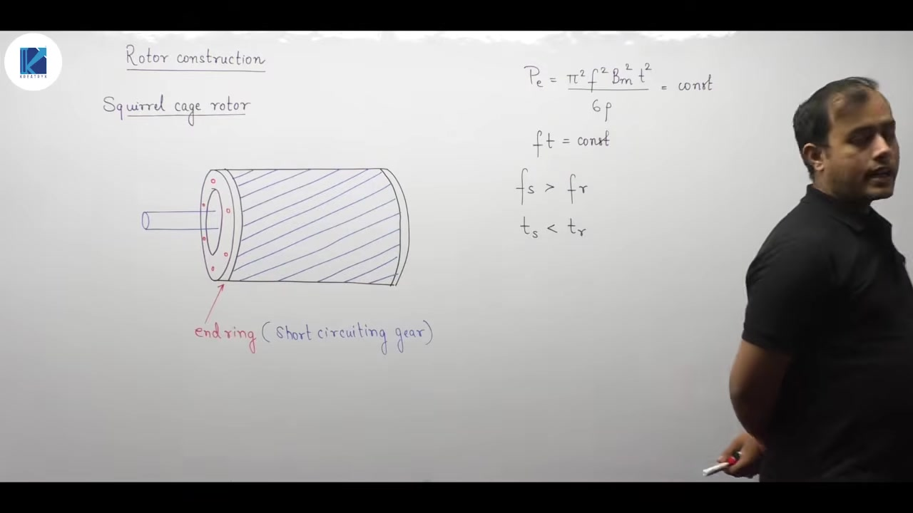

### Rotor Bar Skewing

Rotor slots are not aligned parallel to the shaft. Instead, they are skewed at an angle across the core length.

Skewing serves several functions:
1. It eliminates tooth ripple harmonics and slot harmonics.
2. It prevents cogging (magnetic locking between stator and rotor teeth).
3. It reduces acoustic noise and magnetic hum during motor operation.

## Operational Characteristics of Squirrel Cage Rotors
_(42:37 - 48:42)_

### Automatic Pole and Phase Induction

A squirrel cage rotor contains no distributed winding. It consists only of conductive bars shorted by end rings.

Because there is no fixed winding layout:
1. The rotor develops no predetermined number of poles. The rotating stator field induces exactly the same number of poles in the rotor cage as exist on the stator.
2. The rotor has no physically fixed phase count. In general analysis, engineers treat the rotor as having three phases.

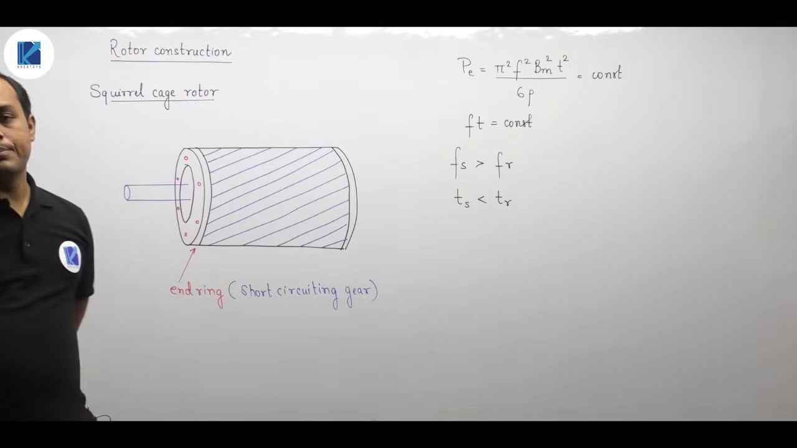

### Air Gap and Power Factor Advantages

The cylindrical outer surface of a squirrel cage rotor is smooth and uniform. This allows a very small mechanical air gap between stator and rotor compared to a wound rotor.

A smaller air gap length $g$ reduces air gap reluctance:
$$
\mathcal{R}_{\text{gap}} = \frac{l_g}{\mu_0 A}
$$
Because reluctance is low, the required magnetizing current $I_\mu$ is small. Lower magnetizing reactive current means the squirrel cage induction motor achieves a higher no-load power factor than a wound rotor machine.

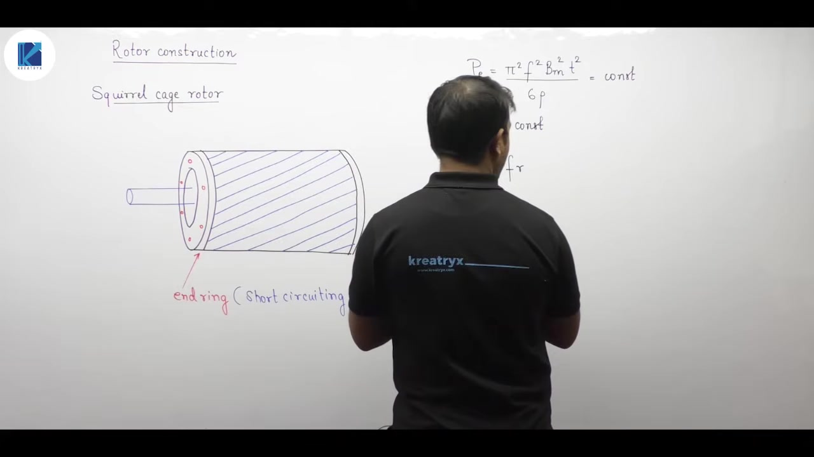

### Starting Performance and Rotor Skewing

To suppress slot harmonics, reduce cogging, and eliminate crawling torques, the rotor slots and conductor bars are skewed along the axial length.

However, the squirrel cage rotor has low inherent electrical resistance. Starting torque in an induction machine is directly proportional to rotor resistance:
$$
T_{\text{start}} \propto R_2
$$
Because $R_2$ is low, the squirrel cage induction motor develops low starting torque and draws high starting current. 

Also, the rotor power factor at standstill depends on resistance:
$$
\cos\theta_2 = \frac{R_2}{\sqrt{R_2^2 + X_{20}^2}}
$$
Low rotor resistance results in a poor starting power factor.

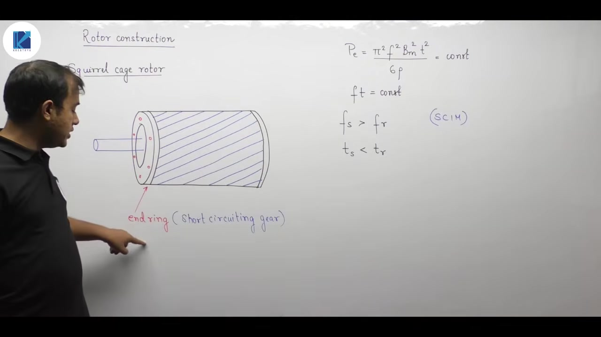

> [!info] Operating Trade-off of SCIM
> A squirrel cage induction motor has poor starting characteristics (low starting torque, high starting current, low starting power factor). But it offers excellent running characteristics (low magnetizing current, high running power factor, low losses, high efficiency).

### Practice Problem

> [!example] Problem
> A three-phase squirrel cage induction motor has 4 poles, 36 stator slots, and 28 rotor slots. Find the number of phases present on the rotor.

---

## Summary and Key Takeaways

- Adjacent conductors carrying opposite current directions induce a magnetic pole between them, whereas conductors carrying identical current directions form no pole.
- Slot leakage flux and slot leakage reactance are directly proportional to slot depth and inversely proportional to slot width, giving $X_l \propto \frac{h}{w_s}$.
- Open slots have the highest air gap reluctance, require the largest magnetizing current $I_\mu$, and produce noticeable slot harmonics of order $n = \frac{2S}{P} \pm 1$.
- Open slots offer the lowest leakage reactance and easiest coil insertion, making them standard for synchronous machines and DC machines.
- Semi-open slots balance air gap reluctance, leakage reactance, and harmonic distortion, making them the preferred choice for three-phase induction motors.
- Closed slots provide the lowest magnetizing current and lowest slot harmonics, but their continuous iron bridge causes massive leakage reactance.
- Stator laminations are thinner than rotor laminations because stator frequency ($f_1 = 50\text{ Hz}$) exceeds rotor slip frequency ($f_2 = s f_1$).
- A squirrel cage rotor automatically mirrors the number of magnetic poles established by the stator field.
- Rotor conductors are skewed across the core to suppress tooth harmonics, prevent cogging, and eliminate acoustic magnetic hum.

---

[← Lec 131: Induction Machines Introduction](Lecture_131_Induction_Machines_Introduction.md) | [🏠 Index](00_yt_study_guide.md) | [Lec 133: Induction Machine Construction 2 →](Lecture_133_Induction_Machine_Construction_2.md)
