[← Lec 132: Induction Machine Construction 1](Lecture_132_Induction_Machine_Construction_1.md) | [🏠 Index](00_yt_study_guide.md) | [Lec 134: Inverted Induction Motor →](Lecture_134_Inverted_Induction_Motor.md)

---

# Electrical Machines | Lec 96 | Induction Machine Construction - 2 | GATE Electrical Engineering

- **Source**: https://www.youtube.com/watch?v=J3BjnWsuUL8
- **Duration**: 00:44:05
- **Compiled**: 2026-09-23

---

## Overview

This lecture examines the construction, circuit arrangement, and relative kinematics of wound rotor induction machines. It establishes how rotor phase counts are determined from slot layouts and details the role of slip rings, carbon brushes, and external variable resistors. The discussion compares squirrel cage and slip ring machines across maintenance, starting torque, and industrial drive load categories. Finally, the lecture derives the slip frequency formula and proves that both stator and rotor magnetic fields rotate in synchronism at synchronous speed relative to the stationary stator.

## Contents

- [[#Wound Rotor Induction Machines and Rotor Phase Calculation|Wound Rotor Induction Machines and Rotor Phase Calculation]]
- [[#Slip Rings, Brushes, and External Rotor Resistance|Slip Rings, Brushes, and External Rotor Resistance]]
- [[#Comparative Analysis of SCIM versus SRIM and Load Types|Comparative Analysis of SCIM versus SRIM and Load Types]]
- [[#Parabolic Loads and Operational Revisit|Parabolic Loads and Operational Revisit]]
- [[#Slip Mechanics and Relative Motion in Induction Motors|Slip Mechanics and Relative Motion in Induction Motors]]
- [[#Mathematical Derivation of Rotor Frequency|Mathematical Derivation of Rotor Frequency]]
- [[#Rotor Magnetic Field and Multi-Frame Reference Speeds|Rotor Magnetic Field and Multi-Frame Reference Speeds]]
- [[#Torque Production Condition and Relative Speed Summary|Torque Production Condition and Relative Speed Summary]]

---

## Wound Rotor Induction Machines and Rotor Phase Calculation
_(00:13 - 07:46)_

### Overview of Induction Motor Construction

In the previous lecture, we examined stator slot shapes and squirrel cage rotors. Open slots serve synchronous and DC machines well because large air gaps improve stability and commutation. Semi-open slots suit induction machines best because they balance leakage reactance and harmonic distortion.

Now we study the second major rotor category: the wound rotor (or slip ring) induction motor.

### Determining Rotor Phase Count

Squirrel cage rotors contain uninsulated bars rather than a phase-distributed winding. To understand phase allocation in problem solving, consider the relationship between slots and magnetic poles.

> [!example] Problem: Rotor Phase Count
> A 3-phase, 4-pole induction motor has 36 stator slots and 28 rotor slots. Find the number of phases present on the rotor.

**Solution:**

First calculate the slots per pole per phase for the stator:

$$m = \frac{S_{\text{stator}}}{P \cdot m'} = \frac{36}{4 \times 3} = 3 \text{ slots/pole/phase}$$

For electromagnetic torque production, the rotor must develop the exact same number of poles as the stator:

$$P_{\text{rotor}} = P_{\text{stator}} = 4$$

Now compute the number of rotor slots per pole:

$$\text{Rotor slots per pole} = \frac{S_{\text{rotor}}}{P} = \frac{28}{4} = 7$$

Under each magnetic pole, there are 7 rotor slots. If each slot carries conductors forming a distinct phase, the rotor operates with 7 phases ($m_r = 7$).

> [!success] Result
> The rotor can be treated as having 7 phases with 1 slot per pole per phase.

### Wound Rotor Construction Principles

In a wound rotor induction machine (WRIM), insulated copper wire coils sit inside the rotor slots.

Key structural rules apply:
1. The rotor carries a balanced three-phase distributed winding.
2. The winding is short-pitched and distributed to eliminate space harmonics.
3. The rotor must always be wound for the exact number of stator poles ($P_r = P_s$).
4. The rotor winding is always connected in star.

## Slip Rings, Brushes, and External Rotor Resistance
_(07:46 - 14:29)_

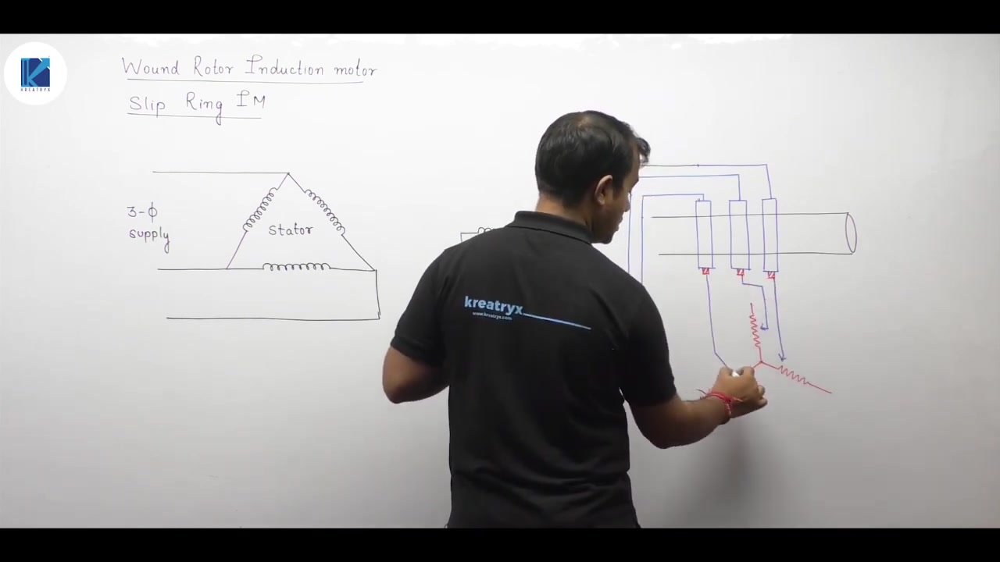

### Slip Ring and Brush Arrangement

The stator of an induction motor can be connected in star or delta. By default in industrial practice, it is delta connected.

The wound rotor winding is always star connected. The three open terminals of the star winding connect to three slip rings mounted on the motor shaft. 

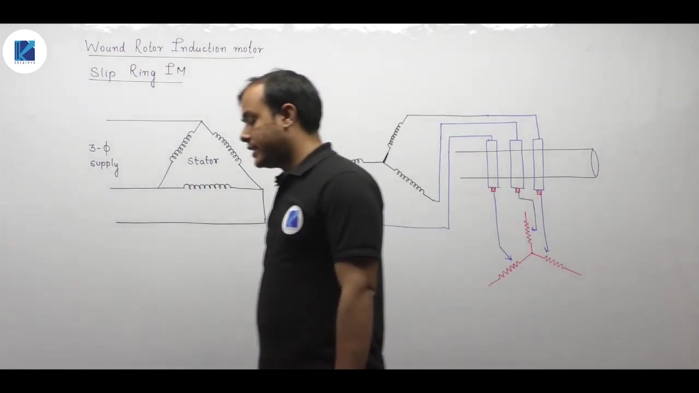

- **Slip rings**: Made of phosphor bronze for low friction and resistance to wear.
- **Brushes**: Made of carbon, held against the rotating slip rings by spring pressure.
- **External Rheostat**: A three-phase variable resistor connects to the brushes in series with each rotor phase.

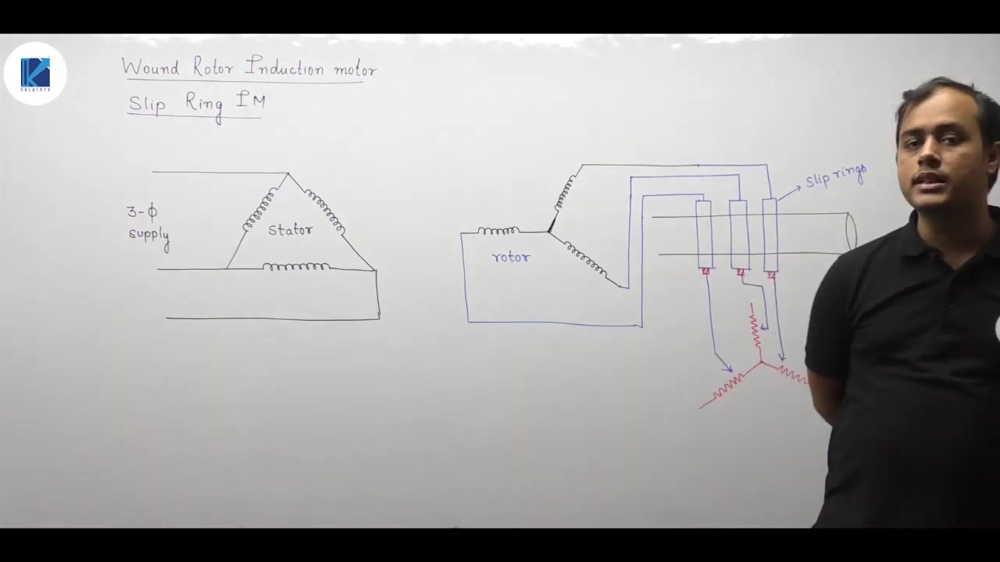

### Functions of External Rotor Resistance

Connecting an external variable resistance $R_{\text{ext}}$ into the rotor circuit provides four operational benefits:

1. **Limiting Starting Current**:
   At starting ($s = 1$), the rotor current is high. Adding external resistance increases total rotor impedance:
   
   $$I_{\text{start}} = \frac{E_2}{\sqrt{(R_2 + R_{\text{ext}})^2 + X_2^2}}$$
   
   This limits inrush current during startup.

2. **Increasing Starting Torque**:
   The starting torque is directly proportional to total rotor circuit resistance:
   
   $$T_{\text{start}} \propto (R_2 + R_{\text{ext}})$$
   
   Unlike squirrel cage motors with fixed low resistance, slip ring motors can start heavy mechanical loads under high torque.

3. **Improving Rotor Power Factor**:
   The rotor operating power factor increases with higher rotor circuit resistance:
   
   $$\cos\theta_2 = \frac{R_2 + R_{\text{ext}}}{\sqrt{(R_2 + R_{\text{ext}})^2 + X_2^2}}$$

4. **Speed Control**:
   Keeping external resistance in the rotor circuit during running allows speed control by introducing additional slip loss.

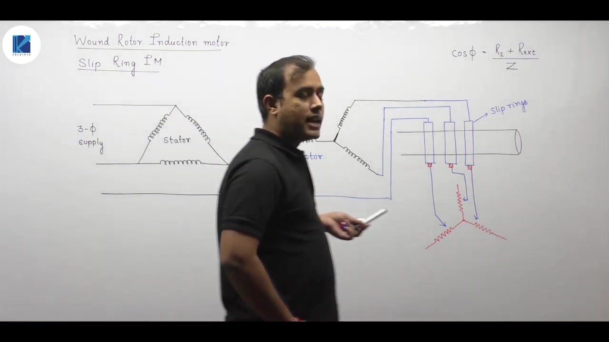

### Air Gap Considerations in Wound Rotors

Because the rotor holds a distributed wire winding, its outer surface is less smooth than a squirrel cage rotor. 

To avoid mechanical friction, the physical air gap must be larger. This larger air gap increases leakage flux and requires a higher magnetizing current. So the inherent base torque is slightly lower before external resistance is added.

## Comparative Analysis of SCIM versus SRIM and Load Types
_(14:34 - 20:29)_

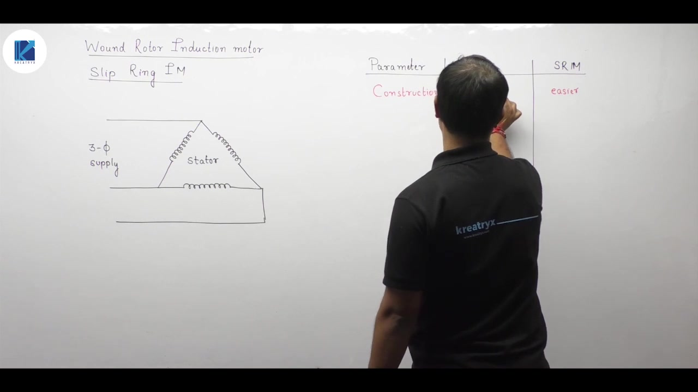

### Comparison: Squirrel Cage vs Slip Ring Induction Motors

The operational trade-offs between squirrel cage induction motors (SCIM) and slip ring induction motors (SRIM) are summarized below:

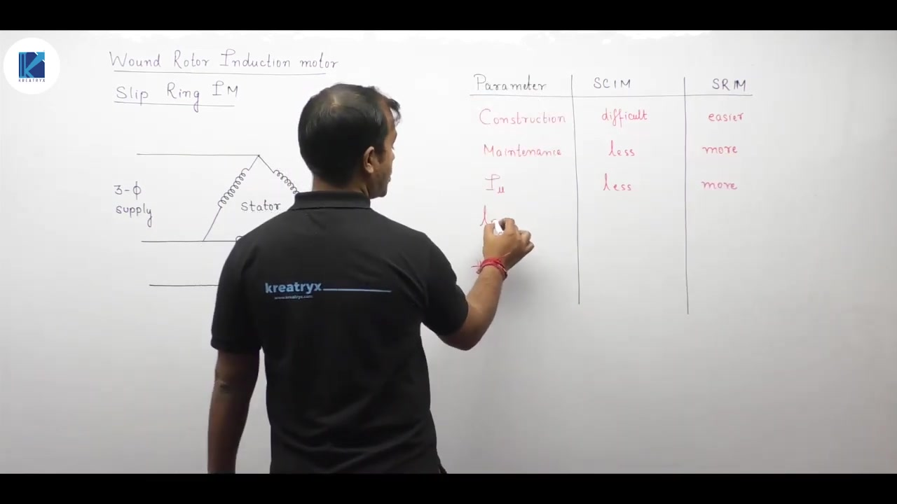

| Parameter | Squirrel Cage (SCIM) | Slip Ring (SRIM) |
| :--- | :--- | :--- |
| **Rotor Winding** | Solid uninsulated bars | Insulated phase-wound coils |
| **Mechanical Ruggedness** | Extremely rugged and durable | Less rugged |
| **Maintenance** | Almost zero maintenance | Regular brush/ring replacement |
| **Air Gap Length** | Smaller | Larger |
| **Magnetizing Current ($I_\mu$)** | Lower | Higher |
| **Starting Current** | High ($5\text{ to }7 \times I_{\text{FL}}$) | Low (limited by $R_{\text{ext}}$) |
| **Starting Torque** | Low | High (boosted by $R_{\text{ext}}$) |
| **Running Performance** | Superior efficiency and PF | Good |
| **Initial Cost** | Cheaper | More expensive |

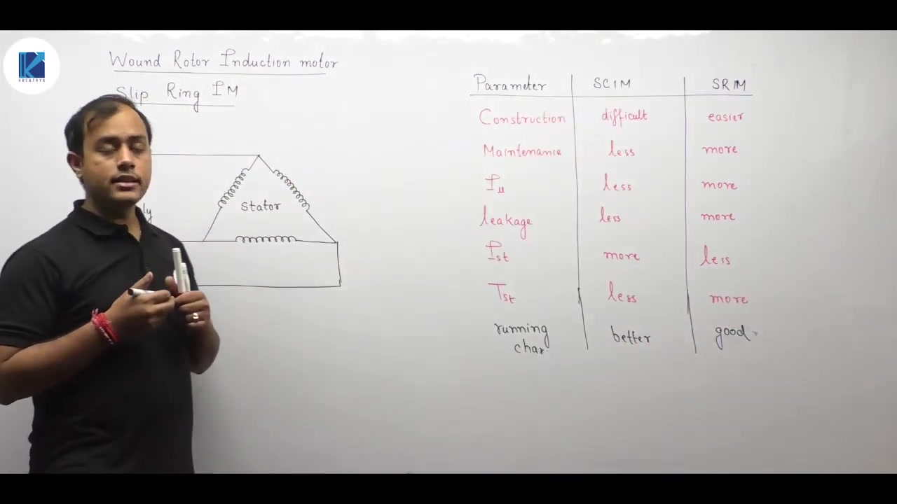

### Mechanical Ruggedness and Analysis

The squirrel cage rotor consists of solid aluminium or copper bars brazed to end rings. It has no insulated wire coils, slip rings, or carbon brushes. So it withstands heavy overloads, severe mechanical shocks, and vibration without breakdown.

In circuit analysis, both machines share identical equivalent circuit models. The physical rotor construction differs, but numerical and theoretical derivations are the same.

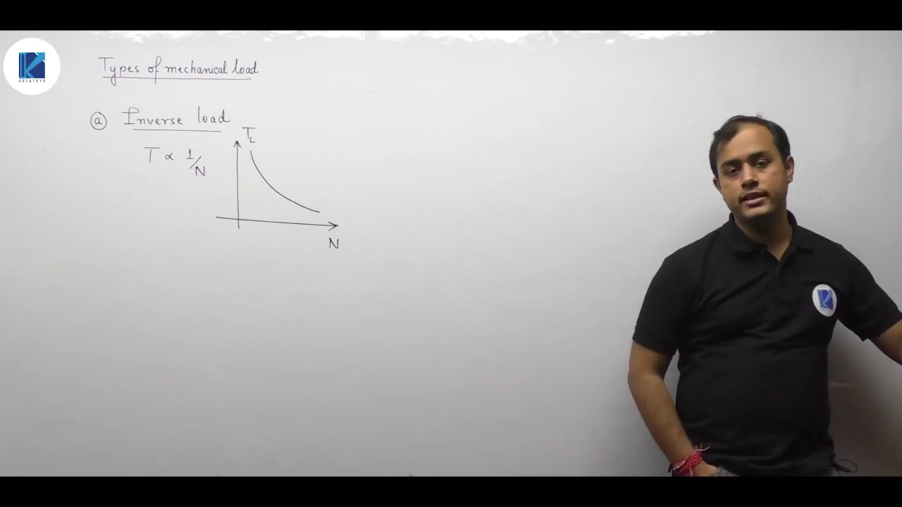

### Mechanical Load Classifications

Different industrial drives present distinct load torque characteristics:

1. **Inverse Load (Hyperbolic)**:
   The load torque varies inversely with rotational speed:
   
   $$T_L \propto \frac{1}{\omega_m}$$
   
   Applications include electric locomotives, traction drives, cranes, elevators, rolling mills, conveyor belts, and drilling machines.

2. **Constant Torque Load**:
   The load torque remains constant across operating speeds:
   
   $$T_L = \text{constant}$$
   
   Applications include loom mills, paper rolling mills, and lathe machines. Constant torque loads starting against friction often prefer slip ring induction motors.

## Parabolic Loads and Operational Revisit
_(20:29 - 24:48)_

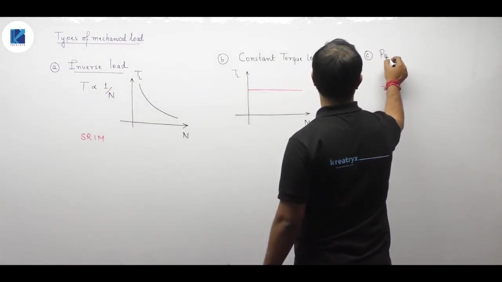

### Parabolic Loads (Fan and Pump Loads)

In parabolic loads, the load torque varies with the square or cube of speed:

$$T_L \propto \omega_m^2 \quad \text{or} \quad T_L \propto \omega_m^3$$

Common examples include fans, centrifugal pumps, and blowers. Squirrel cage induction motors drive most parabolic loads. At starting, the torque required by a fan is nearly zero. The motor starts easily without high starting torque.

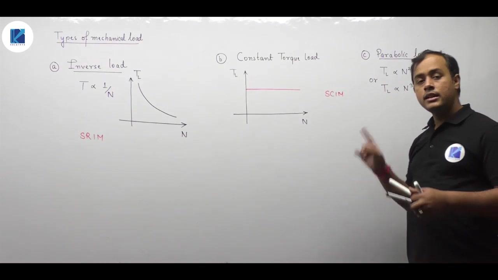

> [!info] Summary of Industrial Loads
> - **Inverse Load**: $T_L \propto \frac{1}{N}$ (Cranes, locomotives, elevators).
> - **Constant Torque**: $T_L = \text{const}$ (Lathes, paper mills).
> - **Parabolic Load**: $T_L \propto N^2$ (Fans, blowers, centrifugal pumps).

### Revisit of Induction Motor Operation

Let us review the step-by-step physical process leading to torque:

1. Balanced three-phase stator currents produce a stator rotating magnetic field.
2. The field rotates at synchronous speed $N_s = \frac{120 f}{P}$ relative to the stator.
3. The rotating field sweeps past the rotor conductors at relative speed.
4. An EMF is induced in the rotor by Faraday's law.
5. Rotor currents flow through the closed rotor circuit.
6. The interaction of rotor currents with the magnetic field creates electromagnetic torque.
7. The rotor accelerates in the direction of the rotating field toward speed $N_r$.

### Concept of Slip

The rotor cannot reach synchronous speed $N_s$. If $N_r = N_s$, relative motion vanishes, induced EMF drops to zero, and torque ceases. The rotor therefore slips behind the field.

Slip is the per-unit measure of relative speed:

$$s = \frac{N_s - N_r}{N_s}$$

The quantity $(N_s - N_r)$ is the slip speed or relative speed.

## Slip Mechanics and Relative Motion in Induction Motors
_(24:50 - 30:12)_

### Origin and Physical Meaning of Slip

The word slip comes from classical mechanics. When a wheel rotates with a peripheral speed equal to its translational speed, it rolls without slipping. When the two speeds differ, the contact surface slips.

In an induction machine, the stator magnetic field rotates at synchronous speed $N_s$. The rotor rotates at mechanical speed $N_r$. Because $N_r < N_s$, the rotor cannot keep pace with the field. The rotor continually slips behind the stator magnetic field.

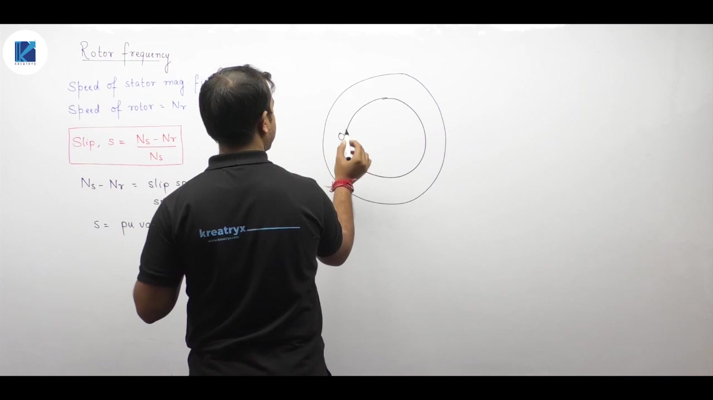

### Relative Speed of Field w.r.t. Rotor

Let the stator field rotate at $N_s$ in the clockwise direction. Let the rotor rotate at $N_r$ in the same direction. 

An observer on the rotor observes the stator magnetic field passing by at relative speed:

$$N_{\text{rel}} = N_s - N_r$$

Per-unit slip $s$ is the ratio of relative speed to synchronous speed:

$$s = \frac{N_s - N_r}{N_s}$$

$$N_{\text{rel}} = s N_s$$

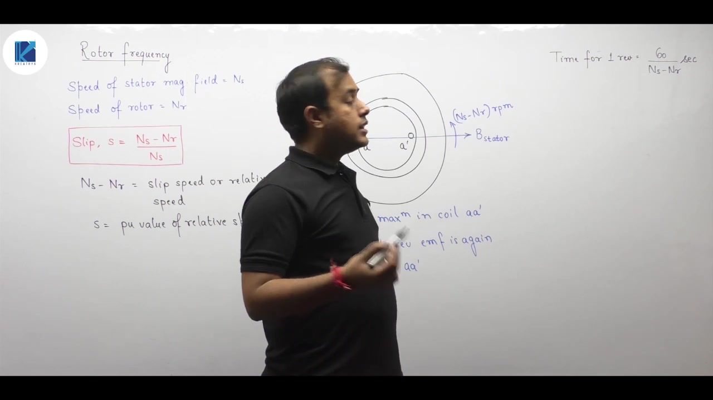

### Derivation of Relative Time Period

Consider a single rotor coil $a-a'$. Treat the rotor as stationary. The stator magnetic field rotates past this coil at $N_{\text{rel}} = (N_s - N_r)\text{ rpm}$.

In each relative revolution, the magnetic field aligns with coil $a-a'$, induces peak EMF, rotates through $90^\circ$ (zero EMF), passes through $180^\circ$ (negative peak), and returns to the initial position.

The field makes $(N_s - N_r)$ revolutions in 60 seconds. The time required for one complete relative revolution is:

$$T = \frac{60}{N_s - N_r} \text{ seconds}$$

This time $T$ represents the mechanical period of the induced rotor waveform.

## Mathematical Derivation of Rotor Frequency
_(30:15 - 35:00)_

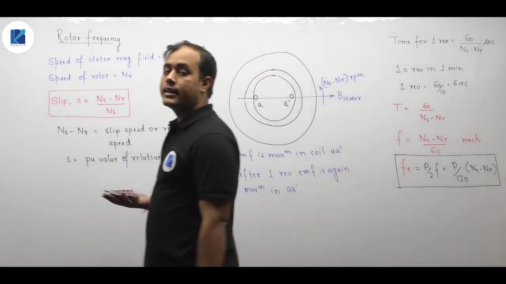

### Mechanical to Electrical Frequency Conversion

The relative time period for one complete relative revolution of the stator field past a rotor conductor is:

$$T = \frac{60}{N_s - N_r}$$

The mechanical cyclic frequency of rotation is:

$$f_m = \frac{1}{T} = \frac{N_s - N_r}{60} \text{ rev/sec}$$

To convert mechanical frequency into electrical frequency, multiply by the pole pairs $\frac{P}{2}$:

$$f_r = \frac{P}{2} f_m = \frac{P}{120} (N_s - N_r)$$

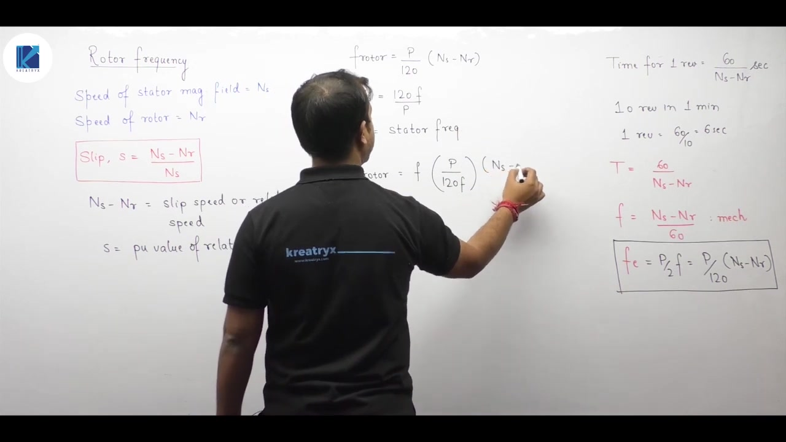

Now multiply and divide by the stator supply frequency $f = \frac{P N_s}{120}$:

$$
\begin{aligned}
f_r &= \left(\frac{N_s - N_r}{N_s}\right) \left(\frac{P N_s}{120}\right) \\
&= s f
\end{aligned}
$$

> [!success] Rotor Induced Frequency
> The electrical frequency of EMF and current induced in the rotor is directly proportional to slip:
> $$f_r = s f$$

### Operational Comparison with Transformers

In a static transformer, both primary and secondary windings operate at the same line frequency ($f_1 = f_2$). In an induction motor, the rotor is a variable frequency secondary.

Under standard running conditions, operating slip is small ($s \approx 0.02\text{ to }0.05$). For a $50\text{ Hz}$ stator supply:

$$f_r = (0.04)(50) = 2.0\text{ Hz}$$

Because the running rotor frequency is very low, rotor core losses are negligible compared to stator core losses.

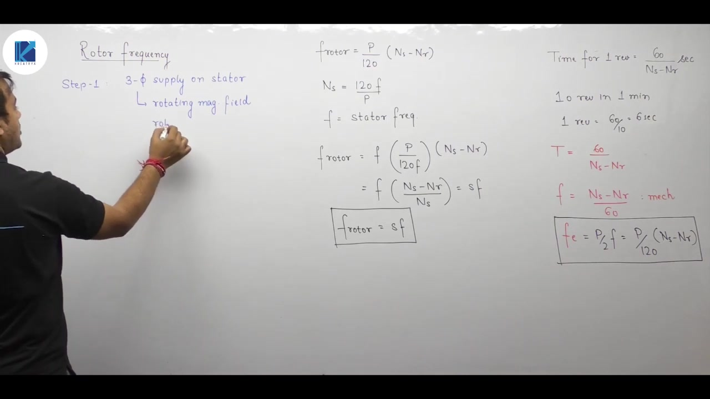

### Sequential Step-by-Step Overview

1. **Step 1**: Stator balanced three-phase currents produce a stator rotating magnetic field moving at $N_s$ relative to stator (ground).
2. **Step 2**: The rotor accelerates and rotates at mechanical speed $N_r$ in the same direction.
3. **Step 3**: The relative speed between the stator field and rotor conductors is $N_s - N_r = s N_s$.
4. **Step 4**: The frequency of induced voltage and current in the rotor is $f_r = s f$.

## Rotor Magnetic Field and Multi-Frame Reference Speeds
_(35:01 - 40:03)_

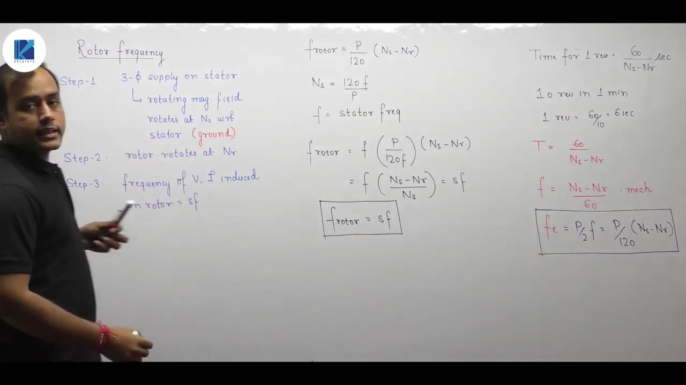

### Rotor Magnetic Field Generation

The rotor carries a balanced three-phase winding space-displaced by $120^\circ$ electrical. The induced rotor currents are balanced three-phase currents at slip frequency $f_r = s f$.

These balanced currents circulating through a spatially distributed winding set up a secondary rotating magnetic field. This field is the rotor rotating magnetic field (rotor RMF).

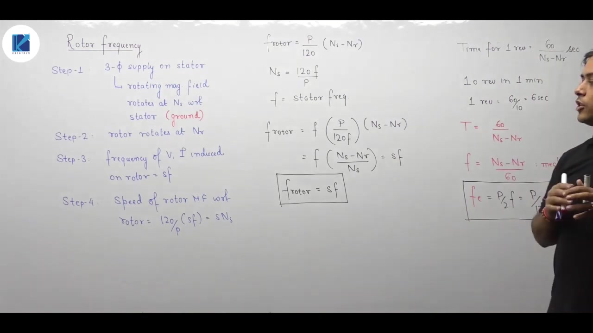

### Reference Frame for the Synchronous Speed Formula

The classical speed formula $\frac{120 f}{P}$ always yields the speed of a magnetic field relative to the physical structure carrying the winding:

- For stator windings on the stationary frame: Field speed relative to stator $= \frac{120 f}{P} = N_s$.
- For rotor windings on the rotating rotor frame: Field speed relative to rotor core $= \frac{120 f_r}{P} = \frac{120 (s f)}{P} = s N_s$.

> [!info] Speed of Rotor Field w.r.t. Rotor
> The rotor rotating magnetic field moves relative to the rotor structure at slip speed:
> $$N_{\text{RMF,rotor w.r.t. rotor}} = s N_s = N_s - N_r$$

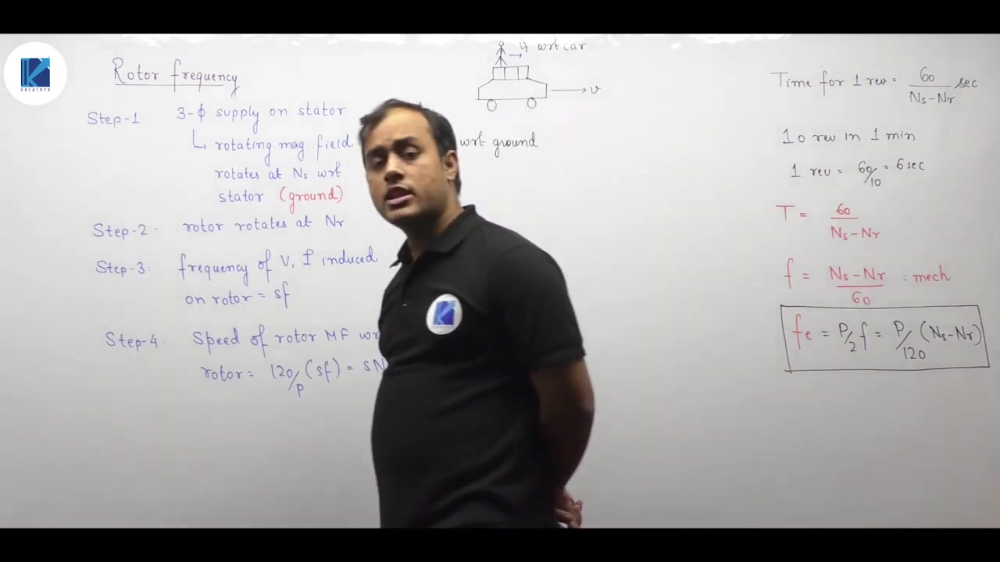

### Rotor Magnetic Field Speed Relative to Stator (Ground)

Consider a runner walking forward at speed $v_1$ atop a train moving forward at speed $v$ relative to the ground. A stationary observer on the platform measures the total velocity as:

$$v_{\text{ground}} = v + v_1$$

Apply this kinematic principle to the induction motor:
- The rotor structure rotates at speed $N_r$ relative to the stationary stator.
- The rotor magnetic field moves forward at speed $s N_s$ relative to the rotor structure.

The speed of the rotor magnetic field relative to the stator (ground) is the sum of the two speeds:

$$
\begin{aligned}
N_{\text{RMF,rotor w.r.t. stator}} &= N_r + s N_s \\
&= N_r + (N_s - N_r) \\
&= N_s
\end{aligned}
$$

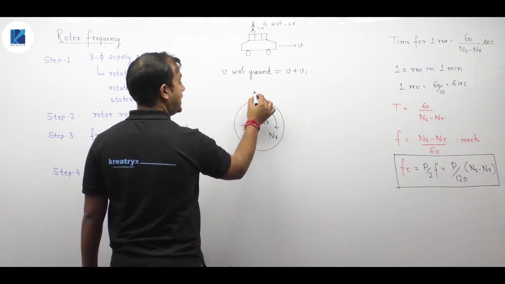

> [!success] Synchronization of Magnetic Fields
> The rotor rotating magnetic field moves at synchronous speed $N_s$ relative to the stationary stator:
> $$N_{\text{RMF,rotor w.r.t. stator}} = N_s$$

## Torque Production Condition and Relative Speed Summary
_(40:06 - 43:57)_

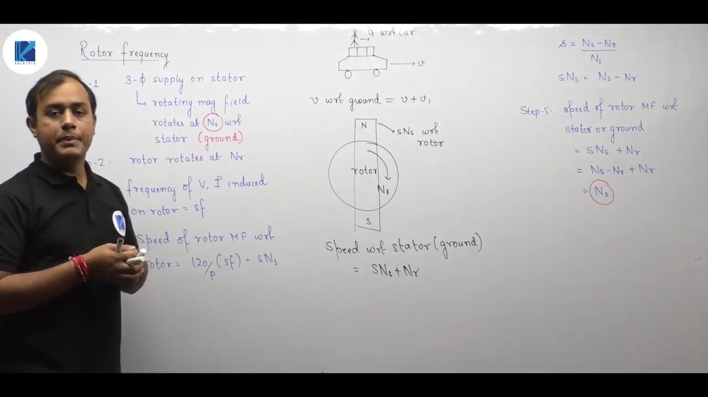

### Proof: Equal Field Speeds Relative to Stator

From the definition of slip:

$$s = \frac{N_s - N_r}{N_s} \implies s N_s = N_s - N_r$$

The total speed of the rotor magnetic field relative to the stator (ground) is:

$$N_{\text{RMF,rotor w.r.t. stator}} = s N_s + N_r = (N_s - N_r) + N_r = N_s$$

Both fields rotate at synchronous speed $N_s$ relative to the stationary stator core.

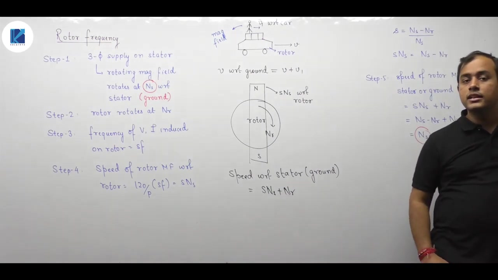

### Fundamental Condition for Steady Torque

For any electrical machine to produce a steady, unidirectional electromagnetic torque, two conditions must hold:
1. The stator and rotor must develop the same number of magnetic poles ($P_s = P_r$).
2. The stator magnetic field and the rotor magnetic field must be stationary relative to each other in space.

Because both fields rotate at $N_s$ relative to the stator:

$$N_{\text{stator field}} - N_{\text{rotor field}} = N_s - N_s = 0$$

The two magnetic fields remain locked in synchronism. They maintain a constant spatial angle $\delta$, producing constant electromagnetic torque without alternating pulsations.

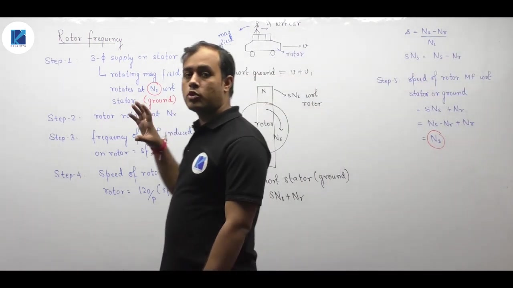

> [!info] Summary of Operating Speeds in Induction Machines
> 
> | Quantity | Reference Frame | Speed |
> | :--- | :--- | :--- |
> | **Stator Core** | Ground | $0$ (Stationary) |
> | **Rotor Core** | Stator (Ground) | $N_r$ |
> | **Stator RMF** | Stator (Ground) | $N_s = \frac{120 f}{P}$ |
> | **Stator RMF** | Rotor Core | $N_s - N_r = s N_s$ |
> | **Rotor RMF** | Rotor Core | $\frac{120 f_r}{P} = s N_s$ |
> | **Rotor RMF** | Stator (Ground) | $N_r + s N_s = N_s$ |
> | **Relative Speed between Fields** | Anywhere | $0$ (Relative Standstill) |

---

## Summary and Key Takeaways

- A wound rotor carries an insulated distributed winding that must be wound for the exact number of stator poles and connected in star.
- Phosphor bronze slip rings and carbon brushes connect an external 3-phase rheostat in series with the rotor winding to limit starting current, improve starting torque, and provide speed control.
- Squirrel cage motors offer superior mechanical ruggedness and lower maintenance, whereas slip ring motors provide high starting torque under heavy mechanical loads.
- Mechanical loads categorize into inverse loads ($T_L \propto \frac{1}{N}$), constant torque loads ($T_L = \text{const}$), and parabolic loads ($T_L \propto N^2$).
- Slip $s = \frac{N_s - N_r}{N_s}$ measures the per-unit relative speed between the rotating magnetic field and the mechanical rotor.
- The frequency of EMF and current induced in the rotor winding equals slip frequency, derived as $f_r = \frac{P}{120}(N_s - N_r) = s f$.
- The rotor rotating magnetic field moves at speed $s N_s$ relative to the rotor core and at speed $N_s$ relative to the stationary stator.
- Steady electromagnetic torque requires both stator and rotor magnetic fields to be stationary relative to each other in space.

---

[← Lec 132: Induction Machine Construction 1](Lecture_132_Induction_Machine_Construction_1.md) | [🏠 Index](00_yt_study_guide.md) | [Lec 134: Inverted Induction Motor →](Lecture_134_Inverted_Induction_Motor.md)
