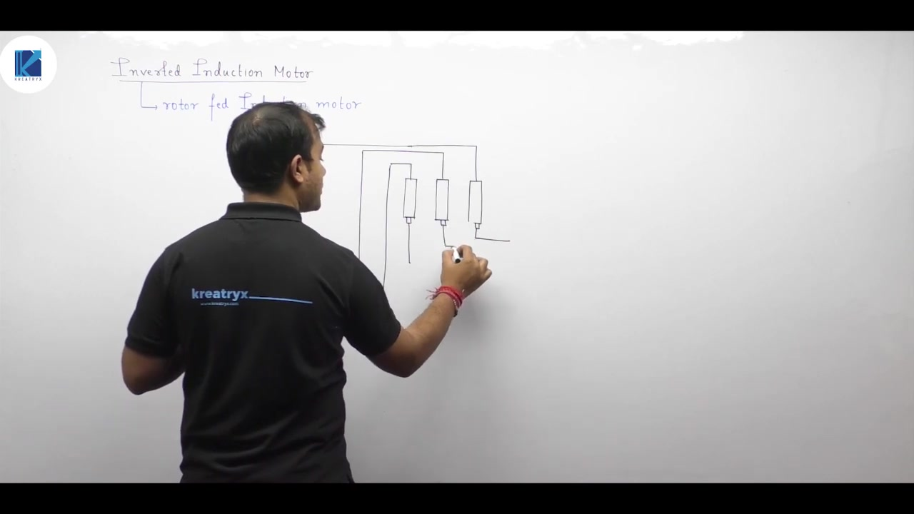
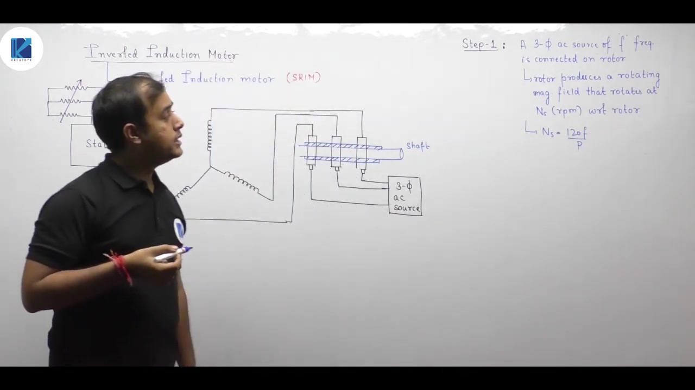
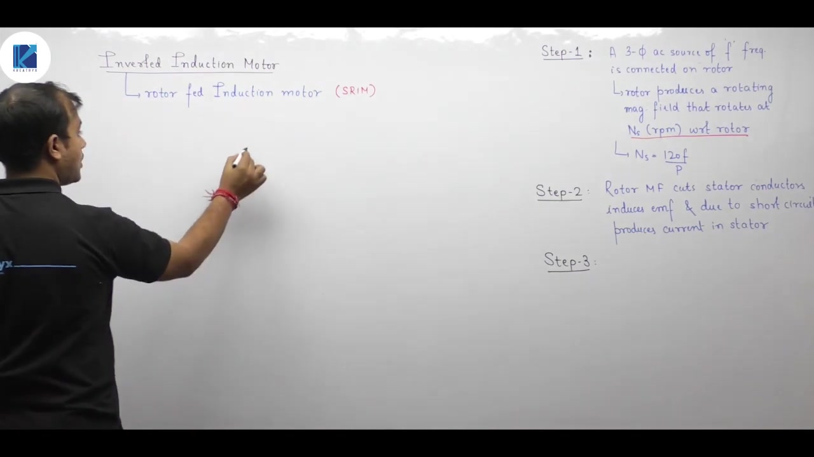
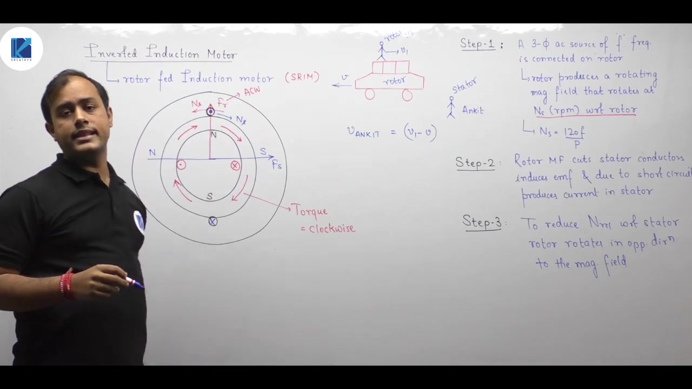
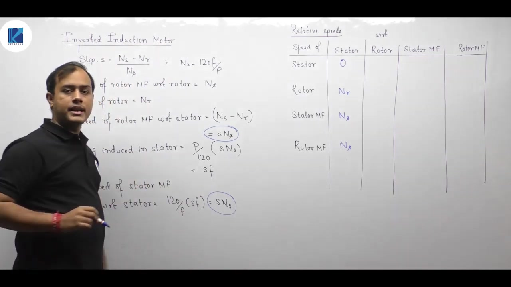
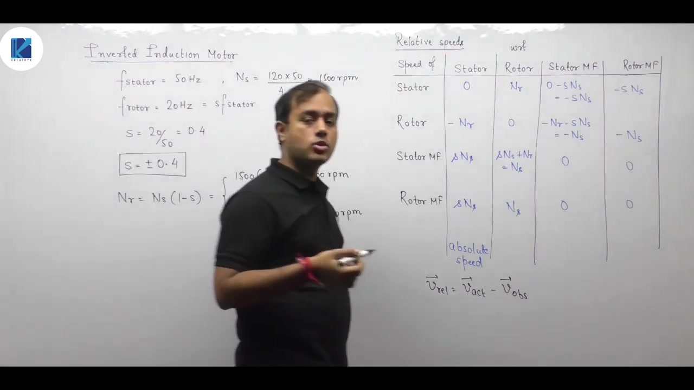

# Electrical Machines | Lec 97 | Inverted Induction Motor | GATE Electrical Engineering

- **Source**: https://www.youtube.com/watch?v=C8qkMm6eEaI
- **Duration**: 00:44:05
- **Compiled**: 2026-09-23

---

## Overview

This lecture explores the inverted induction motor where three-phase excitation is supplied to the rotor and the stator is short-circuited. It analyzes the relative speeds of the physical structures and magnetic fields using Lenz's law and relative kinematics. The discussion explains why the rotor rotates in reverse relative to its magnetic field. Finally, the lecture derives the operation of a wound-rotor induction machine as an electromechanical frequency changer and solves a dual-speed design problem.

## Contents

- [[#Inverted Induction Motor Overview and Connections|Inverted Induction Motor Overview and Connections]]
- [[#Production of Rotor Field and Interaction with Stator|Production of Rotor Field and Interaction with Stator]]
- [[#Mechanism of Torque and Rotor Motion|Mechanism of Torque and Rotor Motion]]
- [[#Relative Speeds and Stator Frequency in Inverted Motor|Relative Speeds and Stator Frequency in Inverted Motor]]
- [[#Comprehensive Relative Speed Matrices|Comprehensive Relative Speed Matrices]]
- [[#Induction Machine as a Frequency Changer|Induction Machine as a Frequency Changer]]
- [[#Frequency Changer Problem Solution and Summary|Frequency Changer Problem Solution and Summary]]

---

## Inverted Induction Motor Overview and Connections
_(00:13 - 07:45)_

### Review of Normal Induction Motor Operation
In a normal induction motor, a balanced three-phase AC supply is connected to the stator winding. This excitation produces a rotating magnetic field in the air gap. The field rotates at synchronous speed relative to the stator structure:

$$N_s = \frac{120 f}{P}$$

Here, $f$ is the stator supply frequency and $P$ is the number of poles. The field sweeps across the stationary rotor conductors and cuts them at speed $N_s$. This cutting action induces an electromotive force (EMF) and drives current through the closed rotor circuits. 

By Lenz's law and the Lorentz force principle, the interaction creates an electromagnetic torque. The torque drags the rotor in the direction of the rotating magnetic field. As the rotor accelerates to mechanical speed $N_r$, the relative speed between the stator field and rotor conductors decreases to:

$$N_{\text{rel}} = N_s - N_r$$

The rotor current oscillates at slip frequency:

$$f_r = s f = \left(\frac{N_s - N_r}{N_s}\right) f$$

The rotor currents produce a secondary rotating magnetic field. This field rotates at speed $s N_s$ relative to the rotor structure:

$$N_{\text{RMF,rotor w.r.t. rotor}} = \frac{120 f_r}{P} = \frac{120 (s f)}{P} = s N_s$$

Relative to the stationary stator, the rotor magnetic field moves at:

$$N_{\text{RMF,rotor w.r.t. stator}} = N_r + s N_s = N_r + (N_s - N_r) = N_s$$

Both magnetic fields rotate in space at the same synchronous speed $N_s$. Because their relative speed is zero, they maintain a stable spatial angle and develop steady electromagnetic torque.

### Concept of the Inverted Induction Motor
An inverted induction motor operates with the physical roles of the stator and rotor reversed. In this configuration, the three-phase AC supply is fed directly to the rotor winding. The stator winding terminals are closed or short-circuited through external resistances.

> [!info] Definition
> An induction machine is called an **inverted induction motor** (or **rotor-fed induction motor**) when its rotor winding is excited from a balanced three-phase AC source, while its stator winding is short-circuited or terminated across an impedance.

In competitive examinations like GATE, problems often avoid the term "inverted induction motor". They describe an induction motor with its three-phase supply connected to the rotor side. Whenever supply and rotor appear together, the motor is an inverted induction motor.

### Practical Construction and Feasibility
This inverted arrangement requires accessible rotor winding terminals. Therefore, it is only possible with a slip-ring induction motor (wound-rotor induction motor). 

In a squirrel-cage induction motor, the rotor consists of solid conducting bars permanently short-circuited at both ends by conducting end-rings. Because no external electrical connections can be made to the squirrel-cage bars, a squirrel-cage machine cannot be operated as an inverted induction motor.

In a slip-ring induction motor, the three phases of the rotor winding are brought out through three phosphor-bronze slip rings mounted on the rotor shaft. Carbon brushes ride on the slip rings to provide continuous electrical contact with the external three-phase supply. Insulation separates the slip rings from the steel shaft so that current flows only into the rotor winding phases. The stator windings are brought out to terminal boxes and shorted together, either directly or through balanced variable resistors.

## Production of Rotor Field and Interaction with Stator
_(07:45 - 12:43)_

### Generation of Rotor Rotating Magnetic Field
When a balanced three-phase AC voltage of frequency $f$ is applied to the three-phase rotor winding, balanced currents flow. Because the winding phases are displaced by $120^\circ$ electrical in space, these currents create a rotating magnetic field in the air gap.

The speed of this magnetic field depends on the frequency of the currents in that specific winding:

$$N_s = \frac{120 f}{P}$$

The formula $120 f / P$ always gives the speed of the magnetic field relative to the physical winding that creates it. In a normal induction motor, the stator winding creates the field. So the field moves at $N_s$ relative to the stator. In an inverted induction motor, the rotor winding creates the field. Therefore, the field rotates at speed $N_s$ relative to the rotor core:

$$N_{\text{field, rotor w.r.t. rotor}} = N_s$$

At standstill, the rotor has not started turning yet ($N_r = 0$). At this instant, the rotor magnetic field also moves at $N_s$ relative to the stator.

### Induction in Stator Conductors and Electromagnetic Forces
As the rotor magnetic field sweeps across the air gap, it cuts the stationary stator conductors. By Faraday's law of electromagnetic induction, an alternating EMF is induced in each phase of the stator winding.

Because the stator winding terminals are closed through external resistances, circulating three-phase currents flow in the stator. Now we have two current-carrying systems in a common magnetic field:
1. Current-carrying stator conductors lie in the rotor magnetic field. This creates a magnetic force on the stator.
2. Current-carrying rotor conductors lie in the stator magnetic field. This creates a magnetic force on the rotor.

By Newton's third law of motion, these interaction forces form an action-reaction pair:

$$F_{\text{rotor}} = - F_{\text{stator}} \implies T_{\text{rotor}} = - T_{\text{stator}}$$

The stator experiences an electromagnetic torque in one direction. An equal and opposite reaction torque acts upon the rotor.

### Application of Lenz's Law
Lenz's law states that any induced effect opposes the cause that produced it. Here, the cause of the induced EMF and current is the relative motion between the rotating rotor field and the stationary stator conductors. 

To reduce this relative motion, two mechanisms could theoretically work:
- The stator could accelerate in the direction of the rotor magnetic field to chase it.
- The rotor magnetic field could slow down relative to the stationary stator.

Because the stator frame is bolted firmly to the foundation, the stator cannot rotate. Therefore, the relative velocity can only decrease if the rotor magnetic field slows down in stationary space. As seen next, this requirement dictates the physical direction in which the rotor must rotate.

## Mechanism of Torque and Rotor Motion
_(12:43 - 17:31)_

### Physical Model: Drag and Reaction Force
Consider two bodies linked by a flexible coupling. When the first body moves forward, it exerts a forward tension force on the second body. At the same time, the second body exerts an equal backward drag force on the leading body.

This mechanical analogy applies directly to the inverted induction motor:
- The rotor magnetic field sweeps forward across the stator bore.
- It pulls on the stator conductors and tries to drag them forward.
- The stator is fixed to the foundation and cannot move.
- So the stator exerts an equal and opposite backward torque on the rotor system.

### Conductor-Level Vector Analysis
We can examine the electromagnetic interaction using $\vec{v} \times \vec{B}$:
1. Let the rotor field rotate counter-clockwise at speed $N_s$ with an upward flux density vector $\vec{B}$.
2. With respect to this moving field, the stationary stator conductors appear to move relatively to the right with velocity $\vec{v}_{\text{rel}}$.
3. The induced electric field in the conductor is:
   $$\vec{E} = \vec{v}_{\text{rel}} \times \vec{B}$$
   This vector points outward from the page (dot $\odot$). The return conductor carries current inward (cross $\otimes$).
4. The induced stator currents produce a stator MMF field $F_s$ directed horizontally.
5. The magnetic poles formed on the stator interact with the rotor poles. The resulting electromagnetic torque on the rotor acts clockwise.

Thus, the induced electromagnetic torque on the rotor acts in the opposite direction to the rotation of the rotor magnetic field.

### Physical Analogy: The Treadmill Effect
How can a rotating magnetic field slow down in stationary space when its speed relative to the winding is fixed at $N_s$?

Consider a person running on a treadmill. The person sprints forward at speed $v$. If the treadmill belt moves backward beneath them at speed $v$, the person remains stationary relative to the ground. If the belt runs backward at speed $u < v$, the person advances forward at a net speed of $v - u$ relative to an outside observer.

In an inverted induction motor, the rotor core acts as the treadmill:
- The three-phase rotor currents force the rotor magnetic field to move forward at speed $N_s$ relative to the rotor core.
- The backward reaction torque causes the rotor structure itself to rotate backward at mechanical speed $N_r$.
- So, in stationary space, the rotor magnetic field moves at net speed $N_s - N_r$.

By rotating backward, the rotor slows down its own field in space. This reduces the cutting velocity across the stationary stator conductors and satisfies Lenz's law.

## Relative Speeds and Stator Frequency in Inverted Motor
_(17:31 - 25:34)_

### Rotor Rotation Direction
In a conventional induction motor, the rotor rotates in the same direction as the rotating magnetic field. In an inverted induction motor, the rotor rotates in the opposite direction to its magnetic field.

> [!info] Core Rule
> In an inverted induction motor, the rotor rotates in a direction opposite to the rotating magnetic field created by the rotor winding.

This follows directly from relative velocity addition. Let the forward direction be positive:
1. The rotor magnetic field moves forward at speed $N_s$ relative to the rotor core.
2. The rotor core rotates backward at speed $N_r$ relative to the stationary stator frame.
3. Therefore, the velocity of the rotor magnetic field relative to the stationary stator is:
   $$N_{\text{RMF,rotor w.r.t. stator}} = N_s - N_r$$

If the rotor rotated in the same direction as the field, the speed in space would be $N_s + N_r$. That would increase the cutting speed across the stator conductors. Such an increase would violate Lenz's law. By rotating backward, the rotor reduces the relative cutting speed to $N_s - N_r$.

### Mechanical Analogies: Train and Escalator
Consider a passenger walking forward inside a train car at velocity $v_1$ relative to the car floor. If the train car travels backward at velocity $v_2$ relative to the ground track, an observer on the platform measures:

$$v_{\text{platform}} = v_1 - v_2$$

The backward motion of the vehicle subtracts from the passenger's forward motion. 

Similarly, consider a person walking up an escalator that moves downward. The upward walking speed is opposed by the downward belt motion. If both speeds match, the person stays stationary relative to the floor. If the person walks faster than the belt, the net progress is the difference between the two velocities.

### Induced Frequency in Stator Windings
In an inverted induction motor, the rotor is excited by the supply at frequency $f$. Induction takes place on the stator winding.

We define slip $s$ based on the relative cutting speed between the magnetic field and the induced conductors:

$$s = \frac{N_s - N_r}{N_s} \implies N_s - N_r = s N_s$$

The frequency induced in the stationary stator conductors depends on this relative cutting speed:

$$\begin{aligned}
f_{\text{stator}} &= \frac{P}{120} (N_{\text{rel}}) \\
&= \frac{P}{120} (N_s - N_r) \\
&= \frac{P}{120} (s N_s) \\
&= s \left(\frac{P N_s}{120}\right) \\
&= s f
\end{aligned}$$

> [!success] Frequency Duality
> - **Normal Induction Motor**: Stator supply frequency is $f$, rotor induced frequency is $f_r = s f$.
> - **Inverted Induction Motor**: Rotor supply frequency is $f$, stator induced frequency is $f_s = s f$.

### Synchronism of Fields in the Air Gap
The stator currents at frequency $s f$ flow through the balanced three-phase stator winding. This creates a stator magnetic field. The speed of the stator magnetic field relative to the stator structure is:

$$N_{\text{RMF,stator w.r.t. stator}} = \frac{120 f_{\text{stator}}}{P} = \frac{120 (s f)}{P} = s N_s = N_s - N_r$$

Notice that both magnetic fields move at the exact same speed relative to the stator:

$$N_{\text{RMF,rotor w.r.t. stator}} = N_s - N_r = s N_s$$
$$N_{\text{RMF,stator w.r.t. stator}} = s N_s$$

Therefore, the relative speed between the stator magnetic field and the rotor magnetic field is zero:

$$N_{\text{rel, fields}} = (N_s - N_r) - (N_s - N_r) = 0$$

Because both fields rotate at identical speeds in space, they remain stationary with respect to each other. This condition satisfies the fundamental requirement for developing steady electromagnetic torque in an AC machine.

## Comprehensive Relative Speed Matrices
_(25:34 - 35:23)_

### Definition of Slip Re-examined
Slip is fundamentally defined as the per-unit relative cutting speed between the magnetic field and the induced conductor:

$$s = \frac{v_{\text{field w.r.t. conductor}}}{v_{\text{synchronous}}}$$

Consider how this applies to both machine configurations:
- **Normal Induction Motor**: The exciting winding is on the stator, creating a stator field. The induced conductors are on the rotor. The relative cutting speed is $(N_s - N_r)$. Hence $s = \frac{N_s - N_r}{N_s}$.
- **Inverted Induction Motor**: The exciting winding is on the rotor, creating a rotor field. The induced conductors are on the stationary stator. In stationary space, the rotor field moves at $(N_s - N_r)$. The stator conductor speed is 0. So the relative cutting speed is $(N_s - N_r) - 0 = N_s - N_r$. Hence $s = \frac{N_s - N_r}{N_s}$.

Never treat slip as merely a mindless formula. It is always the relative speed between the active flux wave and the target conductor, normalized by synchronous speed.

### Relative Speed Matrix: Normal Induction Motor
Four entities exist in the machine:
1. Stator core ($S$)
2. Rotor core ($R$)
3. Stator rotating magnetic field ($\text{RMF}_s$)
4. Rotor rotating magnetic field ($\text{RMF}_r$)

The basic rule of relative kinematics states:

$$v_{A/B} = v_A - v_B$$

Here $v_A$ and $v_B$ are the velocities measured relative to stationary space (the stator frame). In a normal induction motor, taking the forward direction of field rotation as positive:
- Stator speed $= 0$
- Rotor speed $= N_r$
- Stator field speed $= N_s$
- Rotor field speed $= N_s$

Subtracting the observer's speed yields the complete relative speed matrix:

| Entity | w.r.t. Stator | w.r.t. Rotor | w.r.t. Stator Field | w.r.t. Rotor Field |
| :--- | :--- | :--- | :--- | :--- |
| **Stator** | $0$ | $-N_r$ | $-N_s$ | $-N_s$ |
| **Rotor** | $N_r$ | $0$ | $-(N_s - N_r) = -s N_s$ | $-(N_s - N_r) = -s N_s$ |
| **Stator Field** | $N_s$ | $N_s - N_r = s N_s$ | $0$ | $0$ |
| **Rotor Field** | $N_s$ | $N_s - N_r = s N_s$ | $0$ | $0$ |

A negative sign simply indicates rotation in the opposite direction. Notice that the relative speed between the two magnetic fields is zero in all reference frames.

### Relative Speed Matrix: Inverted Induction Motor
Now consider the inverted induction motor. The rotor field rotates forward at synchronous speed $N_s$ relative to the rotor core. Due to the electromagnetic reaction torque, the rotor rotates in reverse at mechanical speed $-N_r$.

Thus, the speeds relative to the stationary stator (ground) are:
- Stator speed $= 0$
- Rotor speed $= -N_r$
- Rotor field speed $= N_s + (-N_r) = N_s - N_r = s N_s$
- Stator field speed $= s N_s$

Subtracting each observer velocity gives the relative speed matrix for the inverted induction motor:

| Entity | w.r.t. Stator | w.r.t. Rotor | w.r.t. Stator Field | w.r.t. Rotor Field |
| :--- | :--- | :--- | :--- | :--- |
| **Stator** | $0$ | $+N_r$ | $-s N_s$ | $-s N_s$ |
| **Rotor** | $-N_r$ | $0$ | $-s N_s - N_r = -N_s$ | $-s N_s - N_r = -N_s$ |
| **Stator Field** | $s N_s$ | $s N_s - (-N_r) = N_s$ | $0$ | $0$ |
| **Rotor Field** | $s N_s$ | $s N_s - (-N_r) = N_s$ | $0$ | $0$ |

In both machines, knowing the speeds relative to the stationary stator gives the speeds in any other frame immediately by simple subtraction.

## Induction Machine as a Frequency Changer
_(35:23 - 41:20)_

### Principle of Electromechanical Frequency Conversion
In power electronics, static converters like cycloconverters or back-to-back inverters adjust frequency. In electrical machines, a slip-ring induction machine functions as an electromechanical frequency changer.

When the stator is excited from a constant-frequency supply $f$, the induced frequency at the slip rings is:

$$f_r = s f = \left(\frac{N_s - N_r}{N_s}\right) f$$

Synchronous speed $N_s$ is fixed by the stator supply frequency and pole count. But the rotor speed $N_r$ can be driven externally by a variable-speed prime mover (such as a DC motor). 

By adjusting the mechanical speed $N_r$ of the rotor, the operator directly controls slip $s$. This allows continuous adjustment of the secondary frequency $f_r$ at the slip-ring terminals.

### Dual-Speed Operation and Slip Signs
Consider an application requiring a specific secondary frequency $f_r$. The required slip magnitude is:

$$|s| = \frac{f_r}{f}$$

A physical electrical frequency cannot be negative. A negative sign in angular frequency simply causes a mathematical phase inversion:

$$\sin(-\omega t) = -\sin(\omega t) = \sin(\omega t - 180^\circ)$$

The negative sign indicates a $180^\circ$ phase shift in the voltage waveform. Therefore, two valid operating slips exist for any desired output frequency:

$$s = +|s| \quad \text{and} \quad s = -|s|$$

A positive slip ($s > 0$) corresponds to subsynchronous operation ($N_r < N_s$). Here the rotor rotates in the same direction as the stator rotating field. 

A negative slip ($s < 0$) corresponds to supersynchronous operation ($N_r > N_s$). Here the rotor is driven faster than the stator field in the forward direction. Alternatively, the rotor can be driven in reverse opposite to the stator field, yielding $s > 1$.

> [!example] Worked Example: Frequency Changer Speeds
> **Problem**: A 3-phase, 4-pole slip ring induction motor is used as a frequency changer. Its stator is excited from a 3-phase, 50 Hz supply. A load requiring a 3-phase, 20 Hz supply is connected across the rotor slip rings. 
> 1. Determine the two speeds at which the prime mover must drive the rotor.
> 2. Determine the ratio of the voltages available at the slip rings at these two speeds.

### Calculating the Operating Slips
The stator supply frequency is $f = 50\text{ Hz}$, and the required rotor frequency is $f_r = 20\text{ Hz}$.

The magnitude of the slip is:

$$|s| = \frac{f_r}{f} = \frac{20}{50} = 0.4$$

This yields two valid slip solutions:

$$s_1 = +0.4, \quad s_2 = -0.4$$

We now calculate synchronous speed:

$$N_s = \frac{120 f}{P} = \frac{120 \times 50}{4} = 1500\text{ rpm}$$

The prime mover speeds corresponding to these two slips are calculated next.

## Frequency Changer Problem Solution and Summary
_(41:23 - 43:59)_

### Calculation of Dual Rotor Speeds
From the definition of slip:

$$s = \frac{N_s - N_r}{N_s}$$

Rearranging this formula gives the mechanical rotor speed:

$$N_r = N_s (1 - s)$$

Now evaluate $N_r$ for the two slip values found earlier:

**Case 1: Subsynchronous Speed ($s = +0.4$)**
$$\begin{aligned}
N_{r1} &= 1500 \times (1 - 0.4) \\
&= 1500 \times 0.6 \\
&= 900\text{ rpm}
\end{aligned}$$

Here the prime mover drives the rotor forward at 900 rpm. The rotor rotates in the same direction as the stator rotating field.

**Case 2: Supersynchronous Speed ($s = -0.4$)**
$$\begin{aligned}
N_{r2} &= 1500 \times [1 - (-0.4)] \\
&= 1500 \times 1.4 \\
&= 2100\text{ rpm}
\end{aligned}$$

Here the prime mover drives the rotor forward at 2100 rpm. The rotor runs faster than the stator rotating field in the same direction.

> [!success] Dual Speeds
> The prime mover can drive the rotor at either **900 rpm** or **2100 rpm** to produce a 20 Hz supply at the slip rings.

### Voltage Ratio at the Slip Rings
The root-mean-square induced EMF per phase in an AC winding is given by:

$$E_2 = 4.44 \cdot f_r \cdot N_{\text{ph}} \cdot \Phi \cdot K_w$$

Here:
- $f_r$ is the rotor frequency (20 Hz in both cases).
- $N_{\text{ph}}$ is the number of series turns per phase on the rotor winding.
- $\Phi$ is the air-gap resultant flux per pole.
- $K_w$ is the rotor winding factor.

Because the stator voltage and supply frequency remain constant, the air-gap flux $\Phi$ is unchanged. The rotor frequency is 20 Hz at both speeds. Therefore, the magnitude of the induced rotor voltage is identical at both operating points:

$$\frac{E_{2,1}}{E_{2,2}} = \frac{4.44 \times 20 \times N_{\text{ph}} \Phi K_w}{4.44 \times 20 \times N_{\text{ph}} \Phi K_w} = 1$$

If the algebraic sign of slip is retained, the ratio becomes:

$$\frac{E_{2,1}}{E_{2,2}} = \frac{s_1}{s_2} = \frac{+0.4}{-0.4} = -1$$

The negative sign represents a $180^\circ$ electrical phase shift between the two induced voltage waveforms. Both answers, $1$ (voltage magnitude ratio) and $-1$ (phasor ratio), are correct.

### Chapter Summary: Normal vs Inverted Induction Motor
When analyzing induction machine questions in examinations, always check which winding receives the power source:
- **Supply on Stator**: Normal induction motor. The stator field rotates at $N_s$ relative to the stator. The rotor rotates in the same direction at $N_r$. Rotor frequency is $s f$.
- **Supply on Rotor**: Inverted induction motor. The rotor field rotates at $N_s$ relative to the rotor. The rotor rotates in reverse at $-N_r$. Stator frequency is $s f$. Both air-gap fields rotate at $s N_s$ relative to the stationary stator.

---

## Summary and Key Takeaways

- An inverted induction motor supplies three-phase AC power to the rotor through slip rings while the stator winding terminals are closed.
- The configuration requires external rotor connections, so it is physically possible only with a slip-ring (wound-rotor) induction motor.
- In an inverted induction motor, the rotor rotates in a direction opposite to the rotating magnetic field created by the rotor winding.
- The relative speed of the rotor magnetic field relative to the stationary stator is $N_s - N_r = s N_s$.
- The frequency induced in the stationary stator winding is $f_s = s f$, which is the dual of a conventional induction motor.
- Both the stator and rotor magnetic fields rotate synchronously at $s N_s$ relative to the stationary stator, maintaining zero relative speed between them.
- An induction machine operates as an electromechanical frequency changer where slip-ring frequency is continuously regulated by prime mover speed via $f_r = |s| f$.
- For any desired output frequency, two prime mover operating speeds exist: subsynchronous speed $N_{r1} = N_s(1 - |s|)$ and supersynchronous speed $N_{r2} = N_s(1 + |s|)$.

