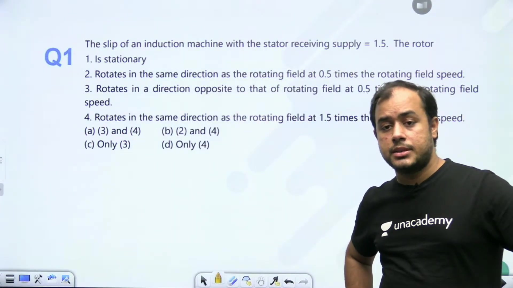
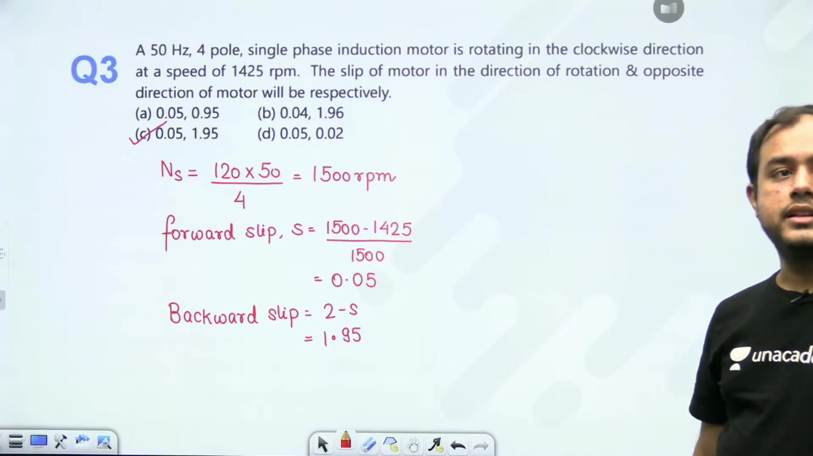
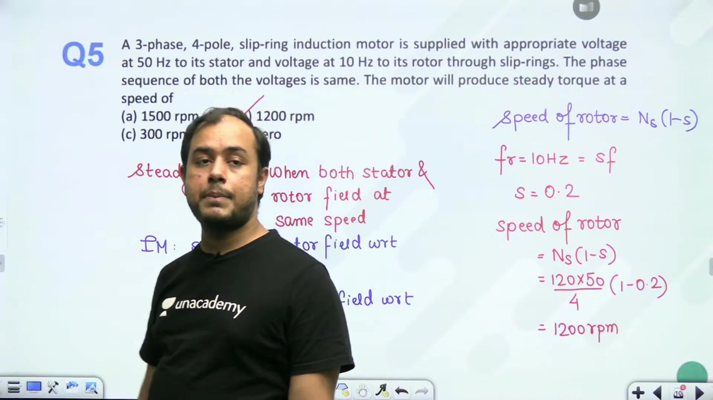
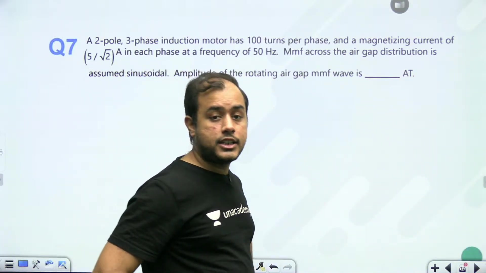
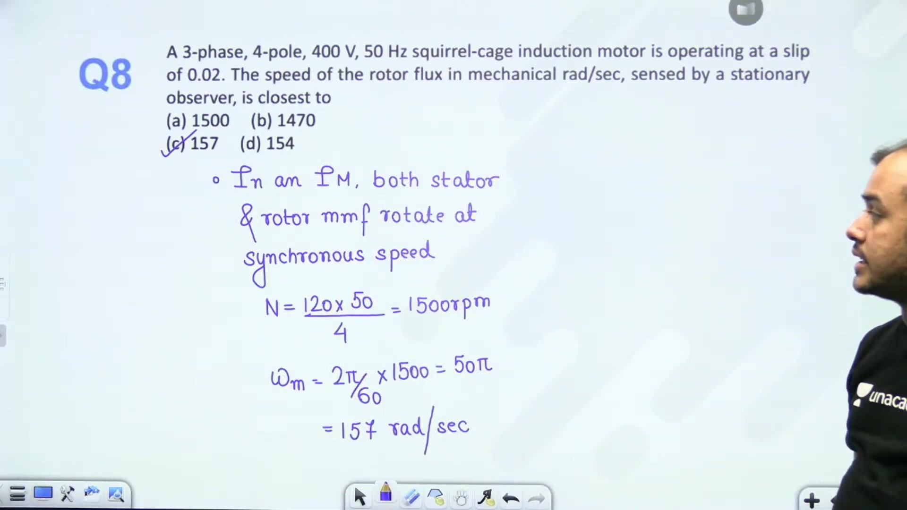
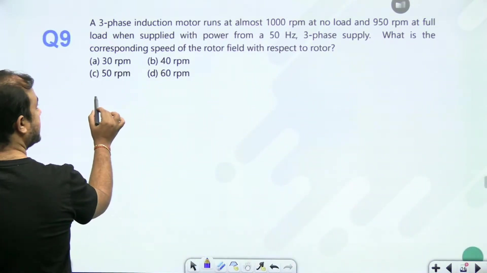
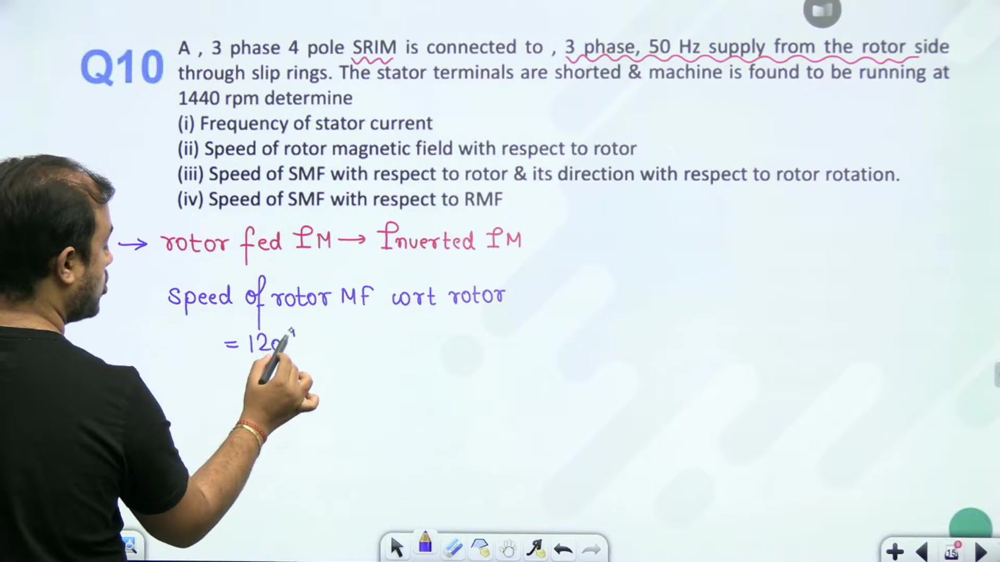
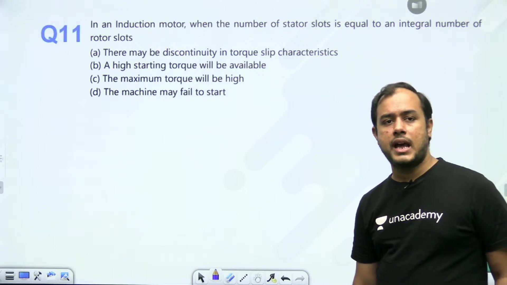
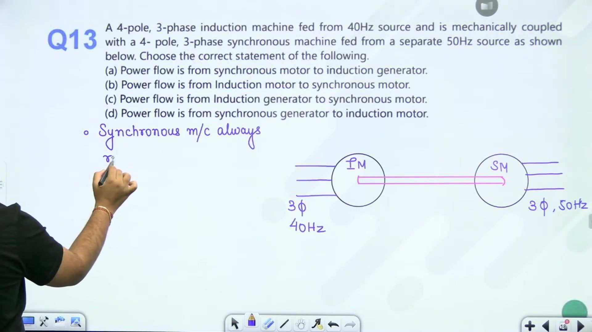
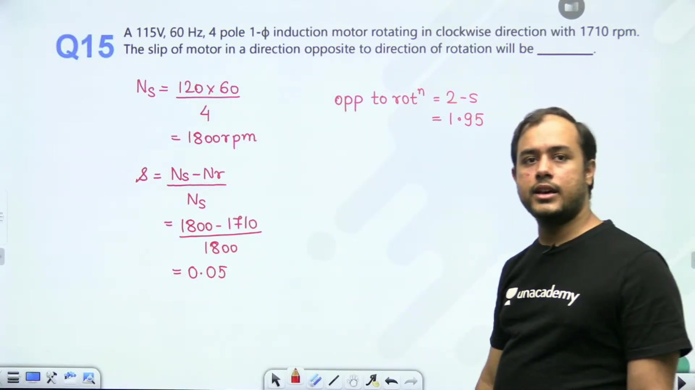

# Rotating Magnetic Field | L 37 | Electrical Machines | GATE 2022 | Ankit Sir

- **Source**: https://www.youtube.com/watch?v=IwTwlQdb3ME
- **Duration**: 00:55:58
- **Compiled**: 2026-09-23

---

## Overview

This lecture presents a problem-solving session focused on induction machine construction and rotating magnetic field kinematics. It covers operating slips across motoring, generating, and plugging regimes, along with forward and backward slip relationships in single-phase machines. The discussion works through conditions required to develop steady electromagnetic torque in doubly fed and mechanically coupled machine configurations. Finally, it analyzes resultant air-gap MMF magnitudes and the operation of rotor-fed inverted induction motors.

## Contents

- [[#Introduction and Operating Slip Problem|Introduction and Operating Slip Problem]]
- [[#Rotor Frequency and Single-Phase Slips|Rotor Frequency and Single-Phase Slips]]
- [[#Single-Phase Slips and Rotor Frequency Calculations|Single-Phase Slips and Rotor Frequency Calculations]]
- [[#Steady Torque Conditions and Dual-Fed Machine Analysis|Steady Torque Conditions and Dual-Fed Machine Analysis]]
- [[#Frequency Changer Voltages and Resultant Air Gap MMF|Frequency Changer Voltages and Resultant Air Gap MMF]]
- [[#Resultant MMF and Speed in Mechanical Radians|Resultant MMF and Speed in Mechanical Radians]]
- [[#Rotor Field Speed Relative to Rotor and Load Variation|Rotor Field Speed Relative to Rotor and Load Variation]]
- [[#Problem Solving on Rotor-Fed Inverted Motor|Problem Solving on Rotor-Fed Inverted Motor]]
- [[#Cogging and Supersynchronous Rotor Field Speeds|Cogging and Supersynchronous Rotor Field Speeds]]
- [[#Mechanically Coupled Machine Set and Power Flow|Mechanically Coupled Machine Set and Power Flow]]
- [[#Backward Slip and Problem Session Conclusion|Backward Slip and Problem Session Conclusion]]

---

## Introduction and Operating Slip Problem
_(00:02 - 04:46)_

### Review of Induction Machine Principles
The induction machine problem-solving series begins with machine construction and rotating magnetic field principles. In a standard polyphase induction motor, balanced three-phase AC excitation is fed to the stator winding. This produces a magnetic field that rotates at synchronous speed:

$$N_s = \frac{120 f}{P}$$

The rotor accelerates under electromagnetic torque. If the rotor rotates in the same direction as the revolving stator field at mechanical speed $N_r$, the fractional slip is:

$$s = \frac{N_s - N_r}{N_s}$$

### Problem: Machine Operating with Slip Greater than Unity

> [!example] Problem
> The slip of an induction motor with its stator receiving supply is 1.5. Describe the operational state of the rotor:
> - (A) Rotor is stationary
> - (B) Rotor rotates in the same direction at 0.5 times synchronous speed
> - (C) Rotor rotates in the opposite direction at 0.5 times synchronous speed
> - (D) Rotor rotates in the same direction at 1.5 times synchronous speed

### Analytical Derivation
From the fundamental definition of slip:

$$s = \frac{N_s - N_r}{N_s}$$

Rearranging for the rotor speed $N_r$:

$$
\begin{aligned}
s N_s &= N_s - N_r \\
N_r &= N_s (1 - s)
\end{aligned}
$$

Substitute the given slip $s = 1.5$:

$$
\begin{aligned}
N_r &= N_s (1 - 1.5) \\
&= -0.5 N_s
\end{aligned}
$$

> [!success] Result
> The rotor rotates in the opposite direction to the rotating magnetic field at 0.5 times synchronous speed. The correct option is **(C)**.

The negative sign indicates counter-rotation relative to the stator rotating field. This condition occurs during plugging (braking mode) or when an external drive forces reverse rotation.

## Rotor Frequency and Single-Phase Slips
_(04:52 - 09:51)_

### Physical Meaning of Slip Magnitude and Direction
When slip exceeds unity ($s > 1$), solving the slip relation yields a negative rotor velocity:

$$N_r = N_s (1 - s)$$

For $s = 1.5$, $N_r = -0.5 N_s$. The rotor is physically rotating against the forward rotating stator field. This mode occurs during plugging, where two stator supply phases are reversed to brake the machine rapidly.

### Problem: Rotor Induced Frequency and Speed Calculation

> [!example] Problem
> The EMF in the stator of an 8-pole induction machine has a frequency of 50 Hz. The induced EMF in the rotor has a frequency of 1.5 Hz. Find the operating slip and the mechanical speed at which the motor runs.

### Solution
The frequency of the induced rotor currents depends on slip:

$$f_r = s f$$

Solve for operating slip:

$$s = \frac{f_r}{f} = \frac{1.5}{50} = 0.03$$

Now calculate the synchronous speed of the 8-pole stator field:

$$N_s = \frac{120 f}{P} = \frac{120 \times 50}{8} = 750\text{ rpm}$$

The rotor mechanical speed is:

$$
\begin{aligned}
N_r &= N_s (1 - s) \\
&= 750 \times (1 - 0.03) \\
&= 750 \times 0.97 \\
&= 727.5\text{ rpm}
\end{aligned}
$$

> [!success] Result
> The operating slip is **0.03** (or 3%), and the motor runs at **727.5 rpm**.

### Forward and Backward Slips in Single-Phase Motors
In single-phase induction motors, the pulsating stator field resolves into two counter-revolving fields by double revolving field theory:
1. A forward revolving field rotating at $+N_s$.
2. A backward revolving field rotating at $-N_s$.

If the rotor turns clockwise at speed $N_r$ in the direction of the forward field, the forward slip is:

$$s_f = \frac{N_s - N_r}{N_s}$$

The backward slip relative to the backward revolving field is:

$$s_b = \frac{-N_s - (-N_r)}{-N_s} = \frac{N_s + N_r}{N_s} = 2 - s_f$$

This relation $s_b = 2 - s_f$ is fundamental to single-phase induction machine analysis.

## Single-Phase Slips and Rotor Frequency Calculations
_(09:52 - 14:33)_

### Worked Example: Forward and Backward Slips

> [!example] Problem
> A 50 Hz, 4-pole single-phase induction motor rotates clockwise at 1425 rpm. Determine the operating slip in the direction of rotation (forward slip) and in the opposite direction (backward slip).

### Solution
First calculate synchronous speed:

$$N_s = \frac{120 f}{P} = \frac{120 \times 50}{4} = 1500\text{ rpm}$$

The forward slip in the direction of rotation is:

$$
\begin{aligned}
s_f &= \frac{N_s - N_r}{N_s} \\
&= \frac{1500 - 1425}{1500} \\
&= \frac{75}{1500} = 0.05
\end{aligned}
$$

The backward slip in the opposite direction is:

$$
\begin{aligned}
s_b &= 2 - s_f \\
&= 2 - 0.05 = 1.95
\end{aligned}
$$

> [!success] Result
> The forward slip is **0.05** and the backward slip is **1.95**.

### Worked Example: Rotor Current Frequency

> [!example] Problem
> An 8-pole, 3-phase, 50 Hz induction motor operates at a speed of 720 rpm. Determine the frequency of the rotor currents.

### Solution
Calculate synchronous speed:

$$N_s = \frac{120 f}{P} = \frac{120 \times 50}{8} = 750\text{ rpm}$$

Compute fractional slip:

$$
\begin{aligned}
s &= \frac{N_s - N_r}{N_s} \\
&= \frac{750 - 720}{750} \\
&= \frac{30}{750} = \frac{1}{25} = 0.04
\end{aligned}
$$

The frequency of the rotor currents is:

$$f_r = s f = 0.04 \times 50 = 2\text{ Hz}$$

> [!success] Result
> The induced rotor current frequency is **2 Hz**.

### Problem on Doubly Fed Induction Machine
Consider a 3-phase, 4-pole wound-rotor induction machine. Its stator receives a 50 Hz voltage, and its rotor receives a 10 Hz voltage through slip rings with the same phase sequence. The operating condition required for producing non-zero steady torque will be derived next.

## Steady Torque Conditions and Dual-Fed Machine Analysis
_(14:44 - 19:48)_

### Conditions for Steady Electromagnetic Torque
In any electromagnetic machine, producing non-zero average torque requires two fundamental conditions:
1. The stator and rotor must produce an identical number of magnetic poles ($P_s = P_r$).
2. The magnetic fields produced by the stator and rotor must rotate at the exact same speed in space.

If the two fields rotate at different speeds in space, their relative angular displacement varies continuously with time. The resulting torque alternates sinusoidally. Its average value over a complete cycle is zero.

### Problem: Doubly Fed Machine Speed

> [!example] Problem
> A 3-phase, 4-pole slip ring induction motor receives a balanced 50 Hz supply on its stator. A 10 Hz voltage is fed to its rotor winding through slip rings with the same phase sequence. At what rotor speed will the motor produce steady electromagnetic torque?

### Analytical Solution
The synchronous speed of the stator rotating field is:

$$N_s = \frac{120 f_s}{P} = \frac{120 \times 50}{4} = 1500\text{ rpm}$$

The rotor winding is excited at frequency $f_r = 10\text{ Hz}$. This excitation establishes a magnetic field that rotates relative to the rotor structure at:

$$N_{\text{field w.r.t. rotor}} = \frac{120 f_r}{P} = \frac{120 \times 10}{4} = 300\text{ rpm}$$

In terms of slip:

$$s = \frac{f_r}{f_s} = \frac{10}{50} = 0.2$$

The speed of the rotor field relative to stationary space is:

$$N_{\text{rotor field w.r.t. space}} = N_r + N_{\text{field w.r.t. rotor}} = N_r + s N_s$$

For steady torque, the rotor field in space must match the stator field speed:

$$N_r + s N_s = N_s$$

Solving for mechanical rotor speed:

$$
\begin{aligned}
N_r &= N_s (1 - s) \\
&= 1500 \times (1 - 0.2) \\
&= 1500 \times 0.8 = 1200\text{ rpm}
\end{aligned}
$$

> [!success] Result
> To develop steady torque, the rotor must run at **1200 rpm**.

If the rotor were operated at any other speed (such as 1100 rpm), the space fields would lose synchronism. The torque would pulsate rapidly with zero net work output.

## Frequency Changer Voltages and Resultant Air Gap MMF
_(19:49 - 24:38)_

### Frequency Changer Voltage Ratio Analysis
When an induction machine is operated as an electromechanical frequency changer, the rotor is driven by a variable-speed prime mover while the stator is connected to a balanced grid of frequency $f$. 

The induced rotor EMF per phase is:

$$E_2 = 4.44 \cdot f_r \cdot N_{\text{ph}} \cdot \Phi \cdot K_w$$

Since the rotor frequency is $f_r = |s| f$, the rotor induced EMF is directly proportional to the magnitude of the operating slip:

$$E_2 \propto |s|$$

For a required secondary frequency $f_r = 25\text{ Hz}$ from a 50 Hz stator supply:

$$|s| = \frac{f_r}{f} = \frac{25}{50} = 0.5 \implies s = \pm 0.5$$

The prime mover can drive the rotor at two distinct speeds:
1. Subsynchronous speed: $N_{r1} = N_s(1 - 0.5) = 0.5 N_s$.
2. Supersynchronous speed: $N_{r2} = N_s[1 - (-0.5)] = 1.5 N_s$.

The voltage ratio between these two operating conditions is:

$$\frac{E_{2,1}}{E_{2,2}} = \frac{|s_1|}{|s_2|} = \frac{0.5}{0.5} = 1$$

If phase relationship is accounted for, the ratio is $-1$, signifying a $180^\circ$ phase shift. The magnitude of the terminal voltage is identical at both speeds.

### Amplitude of Resultant Air Gap MMF

> [!example] Problem
> A 3-phase, 4-pole, 50 Hz induction motor has a nearly sinusoidal air gap MMF distribution. The rms magnetizing current is $I_\mu = \frac{5}{\sqrt{2}}\text{ A}$, and there are 100 series turns per phase. Determine the peak amplitude of the resultant air gap rotating MMF wave.

### Analytical Calculation
First determine the peak magnetizing current per phase:

$$I_m = \sqrt{2} \cdot I_{\mu,\text{rms}} = \sqrt{2} \times \frac{5}{\sqrt{2}} = 5\text{ A}$$

The peak pulsating MMF developed by a single phase is:

$$F_m = N_{\text{ph}} I_m = 100 \times 5 = 500\text{ AT}$$

In a balanced 3-phase winding, three pulsating MMFs displaced by $120^\circ$ in space and time combine to produce a single rotating MMF wave. The peak amplitude of this resultant wave is:

$$
\begin{aligned}
F_{\text{resultant}} &= \frac{3}{2} F_m \\
&= 1.5 \times 500 \\
&= 750\text{ AT}
\end{aligned}
$$

> [!success] Result
> The amplitude of the resultant air gap rotating MMF wave is **750 ampere-turns (AT)**.

## Resultant MMF and Speed in Mechanical Radians
_(24:41 - 29:32)_

### Rotating MMF of Polyphase Stator Windings
In a balanced three-phase AC winding with $N_{\text{ph}}$ series turns per phase and rms phase current $I_{\text{rms}}$, the peak current is $I_m = \sqrt{2} I_{\text{rms}}$. The maximum pulsating MMF along each phase magnetic axis is:

$$F_m = N_{\text{ph}} I_m$$

When balanced three-phase currents excite the winding, the three space-displaced pulsating MMFs combine into a revolving field of constant magnitude:

$$F_{\text{net}}(\theta, t) = \frac{3}{2} F_m \cos(\theta - \omega t)$$

The peak amplitude of the rotating MMF wave is $1.5 F_m$.

### Problem: Field Speed in Mechanical Radians per Second

> [!example] Problem
> In a 3-phase, 4-pole, 50 Hz induction motor, determine the speed of the rotor rotating magnetic field relative to the stationary stator frame in mechanical radians per second.

### Analytical Calculation
First calculate the synchronous speed in revolutions per minute (rpm):

$$N_s = \frac{120 f}{P} = \frac{120 \times 50}{4} = 1500\text{ rpm}$$

In stationary space, the rotor magnetic field and the stator magnetic field rotate together at synchronous speed $N_s$. 

To convert this rotational speed into mechanical angular velocity ($\text{rad/s}$):

$$
\begin{aligned}
\omega_m &= \frac{2\pi N_s}{60} \\
&= \frac{2\pi \times 1500}{60} \\
&= 50\pi \approx 157.08\text{ rad/s}
\end{aligned}
$$

> [!success] Result
> The speed of the rotor field with respect to the stator is **$50\pi\text{ rad/s}$** (or **$157.08\text{ rad/s}$**).

### Mechanical vs Electrical Angular Velocity
Notice the distinction between mechanical and electrical radians:
- The mechanical angular speed is $\omega_m = \frac{2\pi N_s}{60} = \frac{4\pi f}{P}$.
- The electrical angular frequency is $\omega_e = \frac{P}{2} \omega_m = 2\pi f = 2\pi \times 50 = 314.16\text{ rad/s}$.

Students often lose marks in examinations by confusing mechanical and electrical radians per second. Always check the exact units requested in the problem statement.

## Rotor Field Speed Relative to Rotor and Load Variation
_(29:34 - 34:18)_

### Electrical Angular Speed Formula
In electrical radians per second, the synchronous angular speed of the stator magnetic field depends only on supply frequency:

$$\omega_e = 2\pi f$$

For a standard 50 Hz supply:

$$\omega_e = 2\pi \times 50 \approx 314.16\text{ electrical rad/s}$$

This electrical speed is independent of the number of magnetic poles on the machine.

### Problem: Rotor Field Speed Relative to Rotor

> [!example] Problem
> A 3-phase induction motor runs at 950 rpm at full load. At no-load, it runs at nearly 1000 rpm. Determine the speed of the rotor rotating magnetic field with respect to the rotor structure at full load.

### Solution
At no-load, the rotor develops minimal electromagnetic torque to overcome mechanical friction and windage. Operating slip is nearly zero ($s \approx 0$). The no-load speed is very close to synchronous speed:

$$N_s \approx 1000\text{ rpm}$$

With full-load mechanical speed $N_r = 950\text{ rpm}$, the slip speed is:

$$N_{\text{slip}} = N_s - N_r = 1000 - 950 = 50\text{ rpm}$$

The speed of the rotor rotating magnetic field relative to the rotor structure is:

$$
\begin{aligned}
N_{\text{field w.r.t. rotor}} &= \frac{120 f_r}{P} \\
&= \frac{120 (s f)}{P} \\
&= s N_s \\
&= N_s - N_r \\
&= 1000 - 950 = 50\text{ rpm}
\end{aligned}
$$

> [!success] Result
> The speed of the rotor magnetic field with respect to the rotor core is **50 rpm**.

Relative to a stationary observer, the rotor field moves at:

$$N_{\text{field w.r.t. space}} = N_r + (N_s - N_r) = 950 + 50 = 1000\text{ rpm}$$

### Effect of Load Changes on Slip
As mechanical load on the motor increases, the rotor decelerates slightly to draw larger rotor currents and generate matching electromagnetic torque. Hence slip increases with load. 

However, slip is not simply halved when load torque is halved unless the motor operates strictly within the linear low-slip region. Exact relationships require the full equivalent circuit and torque-slip equation.

## Problem Solving on Rotor-Fed Inverted Motor
_(34:37 - 39:22)_

### The Inverted Induction Motor Duality
When a 3-phase induction motor receives electrical power on its rotor winding and has its stator winding closed, it operates as an inverted (rotor-fed) induction motor.

The basic governing relationships interchange between the two members:
- **Normal Motor**: Stator creates the primary field. Field speed w.r.t. stator $= N_s$. Rotor induced frequency $= s f$. Rotor rotates in the same direction as the field.
- **Inverted Motor**: Rotor creates the primary field. Field speed w.r.t. rotor $= N_s$. Stator induced frequency $= s f$. Rotor rotates in the opposite direction to the field.

### Problem: Comprehensive Speeds in Rotor-Fed Motor

> [!example] Problem
> A 3-phase, 4-pole slip ring induction motor is connected to a 3-phase, 50 Hz supply from the rotor side through slip rings. The rotor rotates at 1440 rpm. Determine:
> 1. The speed of the rotor magnetic field with respect to the rotor winding.
> 2. The operating slip.
> 3. The induced frequency in the stator winding.
> 4. The speed of the stator magnetic field with respect to the rotor structure.
> 5. The relative speed between the stator magnetic field and the rotor magnetic field.

### Detailed Solution
1. **Speed of rotor field w.r.t. rotor winding**:
   The rotor winding carries the 50 Hz primary excitation. Thus, the field moves at synchronous speed relative to the rotor core:
   $$N_{\text{field w.r.t. rotor}} = \frac{120 f}{P} = \frac{120 \times 50}{4} = 1500\text{ rpm}$$

2. **Operating slip**:
   $$s = \frac{N_s - N_r}{N_s} = \frac{1500 - 1440}{1500} = \frac{60}{1500} = 0.04$$

3. **Induced stator frequency**:
   By duality, the frequency induced in the stationary stator is:
   $$f_{\text{stator}} = s f = 0.04 \times 50 = 2\text{ Hz}$$

4. **Speed of stator field w.r.t. rotor**:
   Because the stator and rotor magnetic fields rotate in synchronism in space, their speeds relative to the rotor core are identical:
   $$N_{\text{stator field w.r.t. rotor}} = 1500\text{ rpm}$$

5. **Relative speed between stator and rotor fields**:
   To sustain steady electromagnetic torque, both fields must be stationary relative to each other in the air gap:
   $$N_{\text{rel, fields}} = 0\text{ rpm}$$

> [!success] Result Summary
> - Rotor field w.r.t. rotor: **1500 rpm**
> - Operating slip: **0.04**
> - Stator induced frequency: **2 Hz**
> - Stator field w.r.t. rotor: **1500 rpm**
> - Relative speed between fields: **0 rpm**

## Cogging and Supersynchronous Rotor Field Speeds
_(39:22 - 44:18)_

### Phenomenon of Cogging (Magnetic Locking)
In squirrel-cage induction motors, when the number of stator slots $S_s$ equals or is an integral multiple of the number of rotor slots $S_r$ ($S_s = k S_r$, where $k$ is an integer), the stator teeth align directly opposite the rotor teeth at multiple points along the air-gap circumference.

This alignment creates a path of minimum magnetic reluctance between the stator and rotor iron cores. A strong radial magnetic attraction locks the rotor in position at start-up. The motor develops little or no starting torque and fails to start. This phenomenon is known as **cogging** or **magnetic locking**.

To prevent cogging:
- The number of rotor slots is chosen to avoid integral ratios with stator slots ($S_s \neq k S_r$).
- Rotor slots are skewed by one stator slot pitch.

### Problem: Field Speeds at Negative Slip

> [!example] Problem
> A 4-pole, 3-phase, 50 Hz induction machine runs at a slip of $s = -0.01$. Determine the speeds at which the magnetic field due to rotor currents rotates:
> 1. With respect to the stationary stator.
> 2. With respect to the rotor core structure.

### Detailed Solution
First compute the synchronous speed of the machine:

$$N_s = \frac{120 f}{P} = \frac{120 \times 50}{4} = 1500\text{ rpm}$$

The mechanical rotor speed at $s = -0.01$ is:

$$
\begin{aligned}
N_r &= N_s (1 - s) \\
&= 1500 \times [1 - (-0.01)] \\
&= 1500 \times 1.01 = 1515\text{ rpm}
\end{aligned}
$$

Because $N_r > N_s$, the machine operates in the induction generator region (supersynchronous speed).

1. **Rotor field speed with respect to stator**:
   In space, the rotor magnetic field and stator magnetic field always rotate synchronously at synchronous speed $N_s$:
   $$N_{\text{field w.r.t. stator}} = 1500\text{ rpm}$$

2. **Rotor field speed with respect to rotor core**:
   The relative speed between the rotor field and rotor core is:
   $$
   \begin{aligned}
   N_{\text{field w.r.t. rotor}} &= s N_s \\
   &= -0.01 \times 1500 = -15\text{ rpm}
   \end{aligned}
   $$
   The magnitude is $15\text{ rpm}$. The negative sign indicates that relative to the physical rotor structure, the rotor flux wave moves backward at 15 rpm.

Adding the mechanical rotor speed and the relative field speed yields the speed in space:

$$N_{\text{space}} = N_r + s N_s = 1515 + (-15) = 1500\text{ rpm}$$

This confirms that the rotor flux wave travels at synchronous speed in stationary space.

## Mechanically Coupled Machine Set and Power Flow
_(44:21 - 49:19)_

### Mechanically Coupled Synchronous and Induction Machine Problem

> [!example] Problem
> A 4-pole, 3-phase induction machine is connected to a 40 Hz AC grid. Its rotor shaft is mechanically coupled to a 4-pole, 3-phase synchronous machine fed from a separate 50 Hz AC grid. Determine the operational mode of each machine and the direction of power flow.

### Operating Speed and Mode Determination
A synchronous machine tied to a constant-frequency electrical network runs at synchronous speed without slip:

$$N_{\text{sync}} = \frac{120 f_{\text{sync}}}{P} = \frac{120 \times 50}{4} = 1500\text{ rpm}$$

Because both machines are mounted on a common mechanical shaft, the mechanical speed of the induction machine rotor is fixed:

$$N_r = N_{\text{sync}} = 1500\text{ rpm}$$

Now calculate the natural synchronous speed of the 40 Hz induction machine:

$$N_{s,\text{IM}} = \frac{120 f_{\text{IM}}}{P} = \frac{120 \times 40}{4} = 1200\text{ rpm}$$

Compare the actual rotor speed with the induction machine synchronous speed:

$$N_r = 1500\text{ rpm} > N_{s,\text{IM}} = 1200\text{ rpm}$$

The slip of the induction machine is:

$$s = \frac{N_{s,\text{IM}} - N_r}{N_{s,\text{IM}}} = \frac{1200 - 1500}{1200} = -0.25$$

Because slip is negative and speed exceeds synchronous speed, the induction machine operates as an **induction generator**.

### Direction of Power Flow
Every generator requires mechanical shaft power from a prime mover:
1. The synchronous machine draws electrical power from the 50 Hz electrical grid and operates as a **synchronous motor**.
2. It converts this electrical energy into mechanical power, driving the common shaft at 1500 rpm.
3. The mechanical shaft power enters the induction machine.
4. The induction machine converts this mechanical power into electrical energy and delivers 40 Hz electrical power to the 40 Hz system.

> [!success] Power Flow Path
> Electrical power flows from the **50 Hz grid** $\to$ **Synchronous Motor** $\to$ **Mechanical Shaft** $\to$ **Induction Generator** $\to$ **40 Hz grid**.

This coupled set acts as an electromechanical frequency changer converting power from 50 Hz to 40 Hz. The power flow is determined entirely by synchronous speeds and shaft coupling rather than machine excitation levels.

## Backward Slip and Problem Session Conclusion
_(49:19 - 55:56)_

### Worked Example: Opposite Direction Slip Calculation

> [!example] Problem
> A 4-pole, 60 Hz induction motor operates at a forward slip of 5% ($s = 0.05$). What is the slip of the rotor relative to the backward revolving magnetic field (opposite to the direction of physical rotation)?

### Analytical Solution
First calculate synchronous speed:

$$N_s = \frac{120 f}{P} = \frac{120 \times 60}{4} = 1800\text{ rpm}$$

The rotor speed in the forward direction is:

$$
\begin{aligned}
N_r &= N_s (1 - s) \\
&= 1800 \times (1 - 0.05) \\
&= 1800 \times 0.95 = 1710\text{ rpm}
\end{aligned}
$$

The backward rotating field travels in the opposite direction at $-N_s = -1800\text{ rpm}$. 

The slip relative to the backward field is:

$$
\begin{aligned}
s_b &= \frac{(-N_s) - N_r}{-N_s} \\
&= \frac{N_s + N_r}{N_s} \\
&= 1 + \frac{N_r}{N_s} \\
&= 1 + (1 - s) \\
&= 2 - s
\end{aligned}
$$

Substitute the forward slip $s = 0.05$:

$$s_b = 2 - 0.05 = 1.95$$

> [!success] Result
> The slip in the direction opposite to rotation is **1.95** (or 195%).

### Key Rules for Examination Problems
1. **Direction of Rotation**:
   - $s < 0$: Supersynchronous generating region ($N_r > N_s$).
   - $0 < s < 1$: Subsynchronous motoring region ($0 < N_r < N_s$).
   - $s > 1$: Reverse rotation or plugging region ($N_r < 0$).
2. **Frequency of Currents**:
   - In normal motors, rotor frequency is $f_r = s f$.
   - In rotor-fed inverted motors, stator induced frequency is $f_s = s f$.
3. **Double Revolving Field Slips**:
   - Forward slip is $s_f = s$.
   - Backward slip is $s_b = 2 - s$.
4. **Synchronism of Air-Gap Waves**:
   - Steady torque demands that the rotor field and stator field maintain zero relative speed in the air gap ($N_{\text{rel, fields}} = 0$).

---

## Summary and Key Takeaways

- Operating slip $s = \frac{N_s - N_r}{N_s}$ classifies machine operation: $0 < s < 1$ for motoring, $s < 0$ for generating, and $s > 1$ for plugging with counter-rotation.
- In single-phase induction machines, the forward slip is $s_f = s$ and the backward slip relative to the reverse revolving field is $s_b = 2 - s_f$.
- Developing steady electromagnetic torque requires that the machine stator and rotor have identical pole counts and that both air-gap magnetic fields rotate at identical speeds in space.
- An induction machine operating as an electromechanical frequency changer delivers slip-ring frequency $f_r = |s| f$ with terminal voltage proportional to $|s|$.
- A balanced three-phase winding excited by peak phase current $I_m$ produces a resultant rotating air-gap MMF wave of constant peak amplitude $F_{\text{net}} = \frac{3}{2} N_{\text{ph}} I_m$.
- Synchronous speed in mechanical radians per second is $\omega_m = \frac{2\pi N_s}{60}$, whereas in electrical radians per second it is $\omega_e = 2\pi f$.
- In a rotor-fed inverted induction motor, the rotor field rotates at $N_s$ relative to the rotor core, the stator induced frequency is $f_s = s f$, and the rotor physically counter-rotates.
- Cogging or magnetic locking occurs when stator slots equal an integral multiple of rotor slots ($S_s = k S_r$), causing teeth alignment into a minimum reluctance path.
- In mechanically coupled machine sets operating at different frequencies, the machine running above its synchronous speed operates as a generator delivering power to its local grid.

