# Equivalent Circuit - 1 | Electrical Machines | Lec 98 | GATE/ESE (EE, ECE) | Ankit Goyal

- **Source**: https://www.youtube.com/watch?v=DyAQgR3A1fY
- **Duration**: 00:44:11
- **Compiled**: 2026-09-23

---

## Overview

This lecture establishes the equivalent circuit and power flow equations of three-phase induction machines. It begins by examining space-phasor diagrams under both motoring and generating regimes. The lecture shows how rotor electrical parameters vary with slip. Then it develops the transformed rotor circuit operating at constant stator line frequency. Finally, it analyzes the division of air-gap power into copper losses and gross mechanical power.

## Contents

- [[#Induction Motor Phasor Diagram and Resultant Air-Gap Flux|Induction Motor Phasor Diagram and Resultant Air-Gap Flux]]
- [[#Torque Production Angle and Induction Generator Phasor Diagram|Torque Production Angle and Induction Generator Phasor Diagram]]
- [[#Generator Action Dynamics and Standstill Rotor EMF|Generator Action Dynamics and Standstill Rotor EMF]]
- [[#Running Condition Parameters and Circuit Transformation|Running Condition Parameters and Circuit Transformation]]
- [[#Transformed Rotor Model and Air-Gap Power Concept|Transformed Rotor Model and Air-Gap Power Concept]]
- [[#Power Flow Analysis and Developed Torque Formulation|Power Flow Analysis and Developed Torque Formulation]]
- [[#Shaft Torque, Friction Losses, and Net Output|Shaft Torque, Friction Losses, and Net Output]]

---

## Induction Motor Phasor Diagram and Resultant Air-Gap Flux
_(00:14 - 07:49)_

### Magnetic Coupling in the Air Gap

An induction machine operates through magnetic interaction across its air gap. Both stator and rotor windings carry alternating currents. Each winding establishes its own rotating magnetic field. The air gap does not hold these two fluxes separately. Instead, they combine into a single resultant mutual flux wave $\vec{\Phi}_r$.

> [!info] Definition: Resultant Air-Gap Flux
> The resultant air-gap flux is the space phasor sum of the stator flux and the rotor flux:
> $$\vec{\Phi}_r = \vec{\Phi}_1 + \vec{\Phi}_2$$
> This resultant flux induces EMF in both the stator and the rotor windings.

Neither winding induced EMF can be calculated using its own flux alone. Both windings see the mutual air-gap flux $\vec{\Phi}_r$.

### Constructing the Motor Phasor Diagram

Let the resultant air-gap flux $\vec{\Phi}_r$ serve as the reference phasor. Both induced EMFs lag this flux by $90^\circ$:
$$\vec{E}_1 = -j \omega N_1 K_{w1} \vec{\Phi}_r$$
$$\vec{E}_2 = -j \omega N_2 K_{w2} \vec{\Phi}_r$$

The rotor usually has fewer turns than the stator. So $E_2$ has a smaller magnitude than $E_1$.

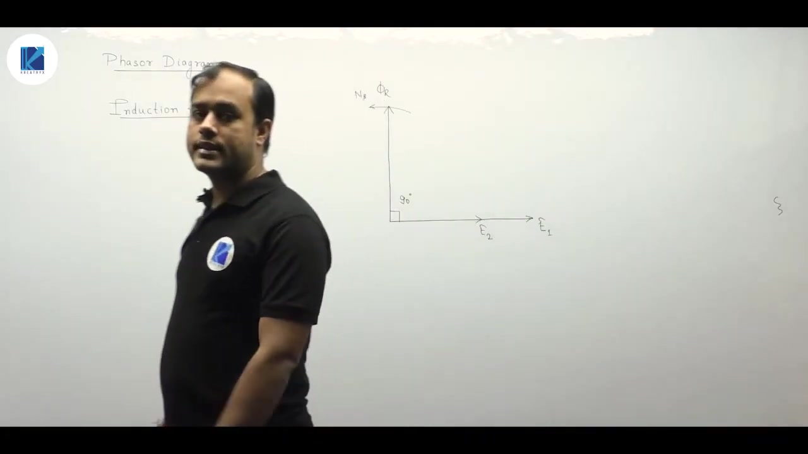

The rotor circuit is closed on itself. Induced EMF $\vec{E}_2$ drives a rotor current $\vec{I}_2$. The rotor winding has resistance $R_2$ and leakage reactance $X_2$. Therefore the rotor current lags $\vec{E}_2$ by an impedance angle $\theta_2$:
$$\theta_2 = \tan^{-1}\left(\frac{X_2}{R_2}\right)$$

### Stator Flux Determination

The rotor flux $\vec{\Phi}_2$ is in phase with the rotor current $\vec{I}_2$. Because the total air gap flux is $\vec{\Phi}_r = \vec{\Phi}_1 + \vec{\Phi}_2$, we find the stator flux by vector subtraction:
$$\vec{\Phi}_1 = \vec{\Phi}_r - \vec{\Phi}_2$$

To construct $\vec{\Phi}_1$, reverse $\vec{\Phi}_2$ to form $-\vec{\Phi}_2$ and add it to $\vec{\Phi}_r$. 

The rotor magnetic field attempts to align with the stator field. This magnetic pull drags the rotor in the direction of the rotating stator flux wave. Motoring torque develops in the direction of field rotation.

## Torque Production Angle and Induction Generator Phasor Diagram
_(07:55 - 13:11)_

### Torque Production and Field Alignment

Electromagnetic torque in an electric machine arises from field interaction. Generalized machine theory shows torque is proportional to the cross product of two interacting flux waves:
$$T_e \propto \Phi_a \Phi_b \sin\delta_{ab}$$

We can choose any pair among stator flux $\vec{\Phi}_1$, rotor flux $\vec{\Phi}_2$, and resultant flux $\vec{\Phi}_r$. Choosing $\vec{\Phi}_r$ and $\vec{\Phi}_2$, the physical angle between them is $90^\circ + \theta_2$.

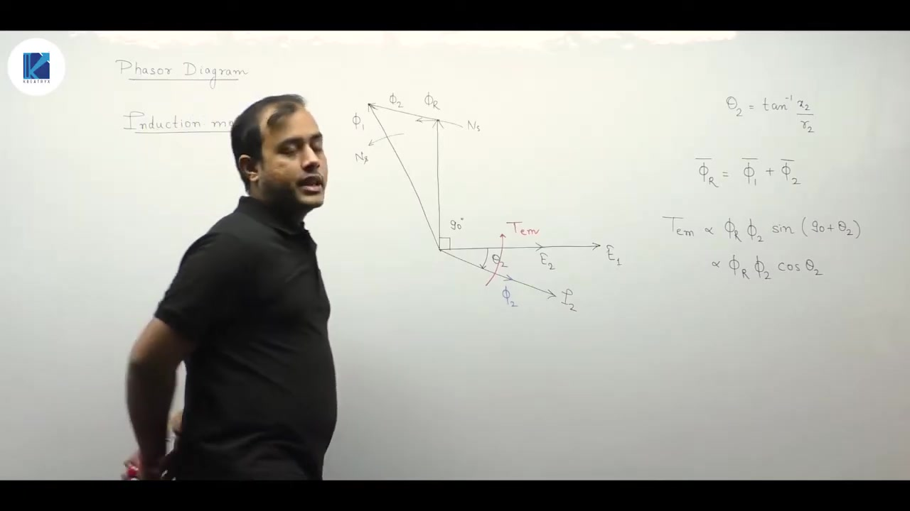

The torque expression becomes:
$$T_e \propto \Phi_r \Phi_2 \sin(90^\circ + \theta_2) = \Phi_r \Phi_2 \cos\theta_2$$

> [!success] Result: Maximum Torque Condition
> To maximize electromagnetic torque for given flux levels, $\theta_2$ must be minimized:
> $$\theta_2 \to 0 \implies \cos\theta_2 \to 1$$
> This requires negligible rotor leakage reactance ($X_2 \ll R_2$). A purely resistive rotor yields the highest torque per ampere.

### Shifting to Induction Generator Mode

In synchronous machines, converting from motor to generator inverts the armature current. The armature reaction magnetic field flips direction. The exact same behavior occurs in an induction machine.

When the machine acts as a generator, mechanical power drives the rotor above synchronous speed ($s < 0$). The physical current generated in the rotor reverses direction relative to the induced EMF.

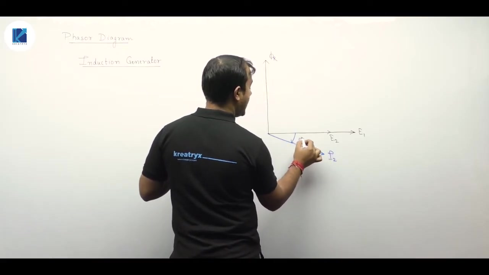

To construct the generator phasor diagram:
1. Start with resultant air-gap flux $\vec{\Phi}_r$ along the horizontal reference axis.
2. Draw induced EMFs $\vec{E}_1$ and $\vec{E}_2$ lagging $\vec{\Phi}_r$ by $90^\circ$.
3. Mark rotor current $\vec{I}_2$ lagging $\vec{E}_2$ by $\theta_2$.
4. Invert the rotor flux vector $\vec{\Phi}_2$ so it opposes the motoring direction.
5. Combine $\vec{\Phi}_r$ and $-\vec{\Phi}_2$ to determine the new stator flux vector.

## Generator Action Dynamics and Standstill Rotor EMF
_(13:15 - 18:47)_

### Electromagnetic Torque in Generator Mode

In generator mode, the rotor is mechanically driven faster than synchronous speed ($N_r > N_s$). Stator flux is obtained by subtracting the inverted rotor flux from the resultant flux:
$$\vec{\Phi}_1 = \vec{\Phi}_r - \vec{\Phi}_2$$

The rotor flux still tries to align with the stator flux. Because $\vec{\Phi}_1$ now lags behind $\vec{\Phi}_2$ in space, the alignment torque acts in the clockwise direction. 

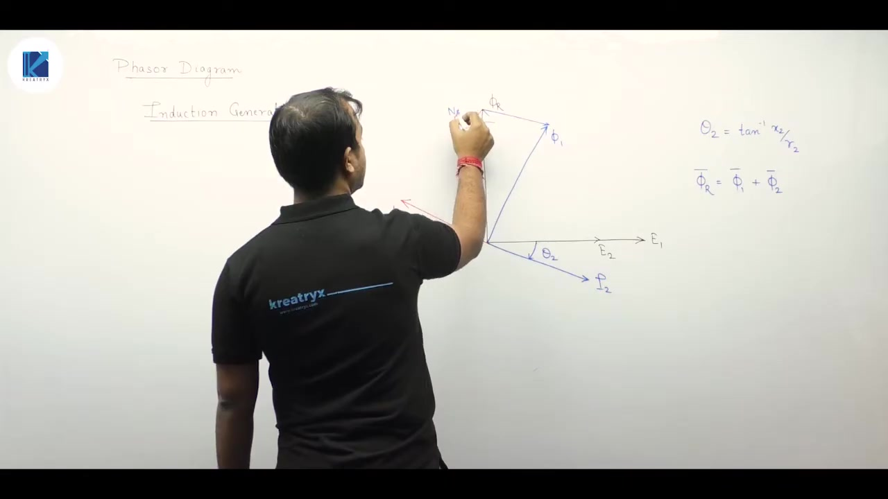

The shaft rotates counter-clockwise. But the electromagnetic torque acts clockwise. It opposes rotation.

> [!info] Definition: Generator vs Motor Torque Action
> In an electric motor, developed electromagnetic torque acts in the direction of rotation. It drives the mechanical load.
> In an electric generator, developed electromagnetic torque opposes the direction of prime mover rotation. It provides counter-torque.

The angle between $\vec{\Phi}_r$ and $\vec{\Phi}_2$ is now $90^\circ - \theta_2$. The torque expression yields:
$$T_e \propto \Phi_r \Phi_2 \sin(90^\circ - \theta_2) = \Phi_r \Phi_2 \cos\theta_2$$

The unified torque relation covers both regimes:
$$T_e \propto \Phi_r \Phi_2 \sin(90^\circ \pm \theta_2) = \Phi_r \Phi_2 \cos\theta_2$$
Here plus applies to motoring and minus applies to generating.

### Rotor Equivalent Circuit at Standstill

Now we construct the equivalent circuit of the induction motor. We start with the rotor because its electrical parameters vary with slip.

At standstill, the rotor speed is zero:
$$N_r = 0 \implies s = \frac{N_s - 0}{N_s} = 1$$

The frequency of currents induced in the rotor equals the stator line frequency:
$$f_r = s f = 1 \times f = f$$

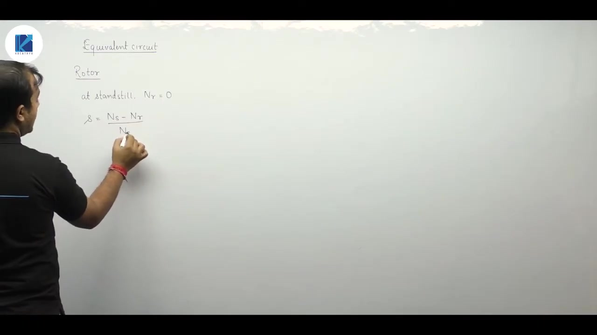

The induced EMF per phase in the rotor winding at standstill is:
$$E_2 = \sqrt{2}\pi f N_{ph2} K_{w2} \Phi_m \approx 4.44 f N_{ph2} K_{w2} \Phi_m$$

Here $N_{ph2}$ is the number of series turns per phase on the rotor. $K_{w2}$ is the rotor winding factor. At standstill, the rotor behaves exactly like the secondary winding of a static transformer.

## Running Condition Parameters and Circuit Transformation
_(18:51 - 27:34)_

### Rotor Frequency and Parameters Under Running Conditions

When the rotor rotates at mechanical speed $N_r$, the relative speed between field and rotor drops to $s N_s$. Slip is:
$$s = \frac{N_s - N_r}{N_s}$$

The frequency of EMF induced in the rotor winding decreases proportionally:
$$f_r = s f$$

The induced rotor EMF under running conditions becomes:
$$E_{2r} = \sqrt{2}\pi (s f) N_{ph2} K_{w2} \Phi_m = s E_2$$

Both induced EMF and leakage reactance depend directly on frequency. The rotor leakage inductance $L_2$ is constant. So the running leakage reactance is:
$$X_{2r} = 2\pi f_r L_2 = 2\pi (s f) L_2 = s X_2$$

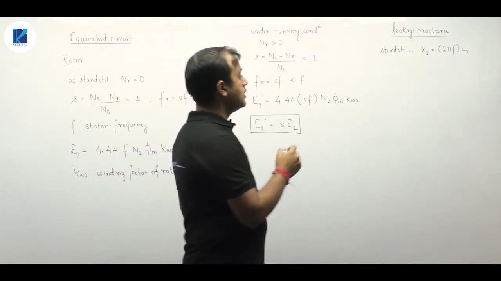

The winding resistance $R_2$ is determined by conductor dimensions and resistivity. It is independent of frequency. So $R_2$ remains constant at all speeds.

### Impedance and Current

At standstill ($s = 1$), the rotor per-phase impedance and current are:
$$Z_2 = \sqrt{R_2^2 + X_2^2}$$
$$I_2 = \frac{E_2}{\sqrt{R_2^2 + X_2^2}}$$

Under running conditions at slip $s$, the rotor per-phase circuit has impedance:
$$Z_{2r} = \sqrt{R_2^2 + (s X_2)^2}$$
$$I_2 = \frac{s E_2}{\sqrt{R_2^2 + (s X_2)^2}}$$

The phase lag angle is:
$$\theta_2 = \tan^{-1}\left(\frac{s X_2}{R_2}\right)$$

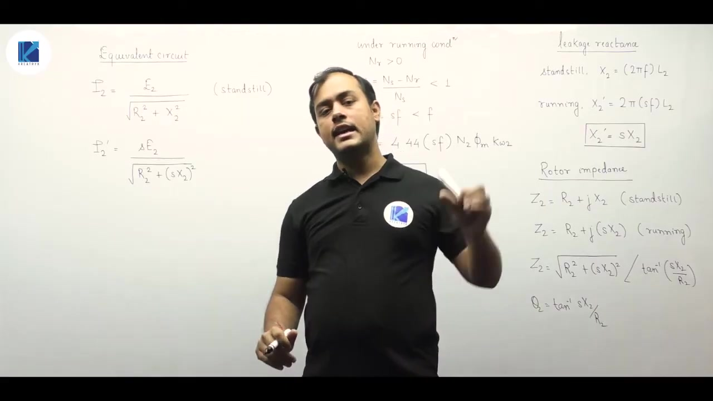

### Algebraic Transformation to Constant-Frequency Model

In the physical running circuit, the EMF source and the leakage reactance both vary with speed. We can divide both the numerator and the denominator of the current equation by $s$:

> [!success] Result: Transformed Rotor Current
> $$I_2 = \frac{E_2}{\sqrt{\left(\frac{R_2}{s}\right)^2 + X_2^2}}$$
> The phase angle is unchanged:
> $$\theta_2 = \tan^{-1}\left(\frac{X_2}{R_2 / s}\right) = \tan^{-1}\left(\frac{s X_2}{R_2}\right)$$

This mathematical step transforms the circuit into an equivalent circuit operating at constant stator supply frequency $f$. The induced EMF is fixed at $E_2$. The leakage reactance is fixed at standstill value $X_2$. All slip dependence moves into a single variable resistance $R_2/s$.

## Transformed Rotor Model and Air-Gap Power Concept
_(27:34 - 32:02)_

### Comparison of Rotor Circuit Models

We can represent the induction motor rotor in three distinct electrical forms.

1. **Standstill Circuit ($s = 1$)**:
   The rotor is stationary. Frequency is $f$. The circuit has induced EMF $E_2$, winding resistance $R_2$, and standstill reactance $X_2$.
2. **Actual Running Circuit (Variable Frequency $s f$)**:
   The rotor turns at speed $N_r$. Induced EMF drops to $s E_2$. Leakage reactance drops to $s X_2$. Resistance remains $R_2$. The loop operates at slip frequency $f_r = s f$.
3. **Transformed Running Circuit (Line Frequency $f$)**:
   We divide EMF and impedance by slip $s$. The circuit operates at line frequency $f$. The EMF is $E_2$ and the leakage reactance is $X_2$. The resistance is replaced by $R_2 / s$.

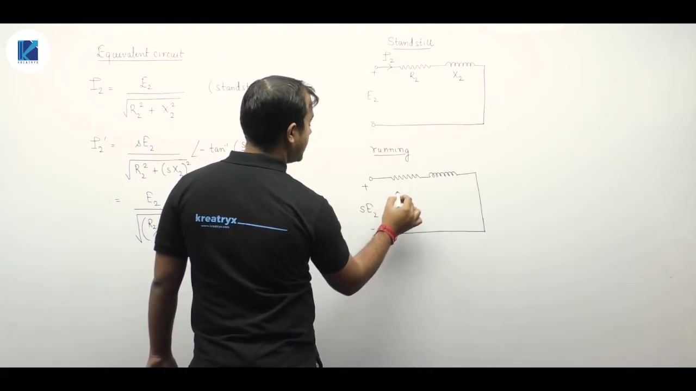

The current magnitude and phase angle remain identical in both running models. The transformed model is much easier to analyze. It allows direct connection to the stator circuit across an ideal transformer ratio.

### Physical Meaning of Variable Resistance $R_2 / s$

In the transformed circuit, resistance $R_2 / s$ is drawn as a rheostat or variable resistor. 

> [!info] Definition: Slip-Dependent Rotor Resistance
> The rotor resistance is shown as a variable element because slip $s$ changes with rotor speed:
> $$s = \frac{N_s - N_r}{N_s}$$
> As the mechanical shaft load changes, rotor speed adjusts. Slip shifts, altering the effective electrical resistance $R_2 / s$.

When the motor runs near synchronous speed, slip is very small ($s \approx 0.02$). The term $R_2 / s$ becomes very large. When stalled, $s = 1$, and $R_2 / s = R_2$.

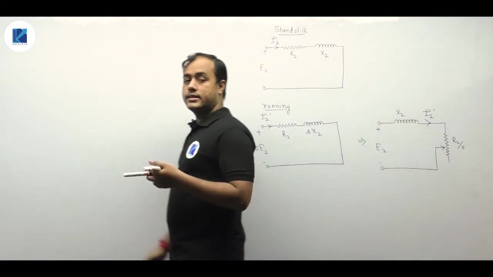

### Air-Gap Power Definition

Power flows from the electrical grid into the stator winding. Stator copper and core losses consume part of this input. The remaining electromagnetic power travels across the physical air gap into the rotor.

This electromagnetic power transferred to the rotor is denoted as $P_{\text{ag}}$ (air-gap power). In some textbooks it is written as $P_g$. Every watt entering the rotor passes through the air gap via the mutual flux wave.

## Power Flow Analysis and Developed Torque Formulation
_(32:07 - 39:37)_

### Air-Gap Power Derivation

Air-gap power is the real electrical power delivered across the air gap. We evaluate it from the transformed circuit impedance:
$$P_{\text{ag}} = E_2 I_2 \cos\theta_2$$

Substitute rotor current and power factor:
$$I_2 = \frac{E_2}{\sqrt{(R_2/s)^2 + X_2^2}}$$
$$\cos\theta_2 = \frac{R_2/s}{\sqrt{(R_2/s)^2 + X_2^2}}$$

Multiply them together:
$$P_{\text{ag}} = \frac{E_2^2 (R_2/s)}{(R_2/s)^2 + X_2^2} = I_2^2 \left(\frac{R_2}{s}\right)$$

Reactance consumes no active power. All real power crossing the gap is absorbed across the resistance $R_2 / s$.

### Power Partitioning in the Rotor

The total resistance $R_2 / s$ splits into two parts:
$$\frac{R_2}{s} = R_2 + R_2 \left(\frac{1-s}{s}\right)$$

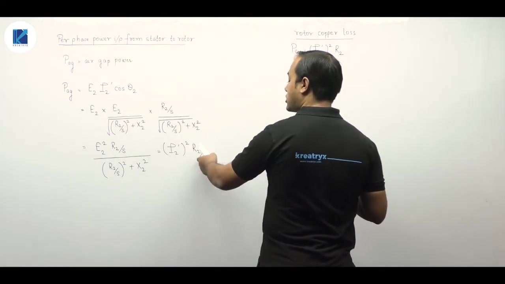

Multiplying each term by $I_2^2$ reveals the physical power breakdown:
1. **Rotor Copper Loss ($P_{cu}$)**:
   $$P_{cu} = I_2^2 R_2 = s P_{\text{ag}}$$
   This is the heat dissipated in the winding resistance.
2. **Gross Mechanical Power Developed ($P_m$)**:
   $$P_m = I_2^2 R_2 \left(\frac{1-s}{s}\right) = (1-s) P_{\text{ag}}$$
   This power converts into mechanical form on the rotor body.

> [!success] Result: Fundamental Power Flow Ratio
> In any induction machine, rotor powers obey a fixed ratio:
> $$P_{\text{ag}} : P_{cu} : P_m = 1 : s : (1-s)$$

Even in an ideal induction motor with negligible friction and stator losses, rotor copper loss still takes an exact fraction $s$ of the air-gap power. Electromechanical conversion yields $(1-s) P_{\text{ag}}$.

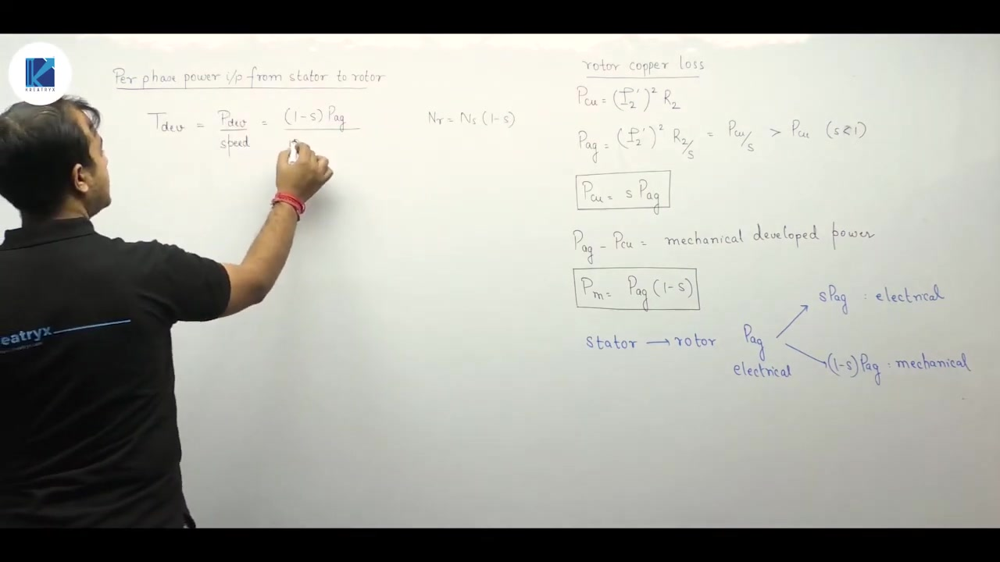

### Formulations for Developed Torque

Electromagnetic torque equals mechanical power developed divided by rotor mechanical angular speed $\omega_r$:
$$T_d = \frac{P_m}{\omega_r}$$

Substitute $P_m = (1-s) P_{\text{ag}}$ and $\omega_r = (1-s) \omega_s$:
$$T_d = \frac{(1-s) P_{\text{ag}}}{(1-s) \omega_s} = \frac{P_{\text{ag}}}{\omega_s}$$

Both $(1-s)$ terms cancel out. We have two equivalent methods to evaluate developed torque:
1. Divide gross mechanical power $P_m$ by rotor mechanical speed $\omega_r$.
2. Divide total air-gap power $P_{\text{ag}}$ by synchronous speed $\omega_s$.

Synchronous angular speed $\omega_s$ is constant for a given line frequency and pole count:
$$\omega_s = \frac{2\pi N_s}{60} = \frac{4\pi f}{P}$$
Using $P_{\text{ag}} / \omega_s$ is often much simpler in numerical problems.

## Shaft Torque, Friction Losses, and Net Output
_(39:37 - 44:04)_

### Total Power Requirement for Torque

Torque exists purely in the mechanical domain. The mechanical domain has no phases. There is no concept of per-phase torque.

> [!important] Rule: Torque Calculation Uses Total Three-Phase Power
> Always compute torque using total three-phase power:
> $$P_{\text{ag,3}\phi} = 3 P_{\text{ag,1}\phi}$$
> $$P_{m,3\phi} = 3 P_{m,1\phi}$$
> Never use per-phase power directly to state machine torque.

### Mechanical Losses and Shaft Power

Gross mechanical power developed is $P_m = (1-s) P_{\text{ag}}$. Friction and windage losses ($P_{fw}$) take place as the rotor spins. These mechanical losses consume part of the developed power.

The net power reaching the machine shaft is:
$$P_{sh} = P_{out} = P_m - P_{fw}$$

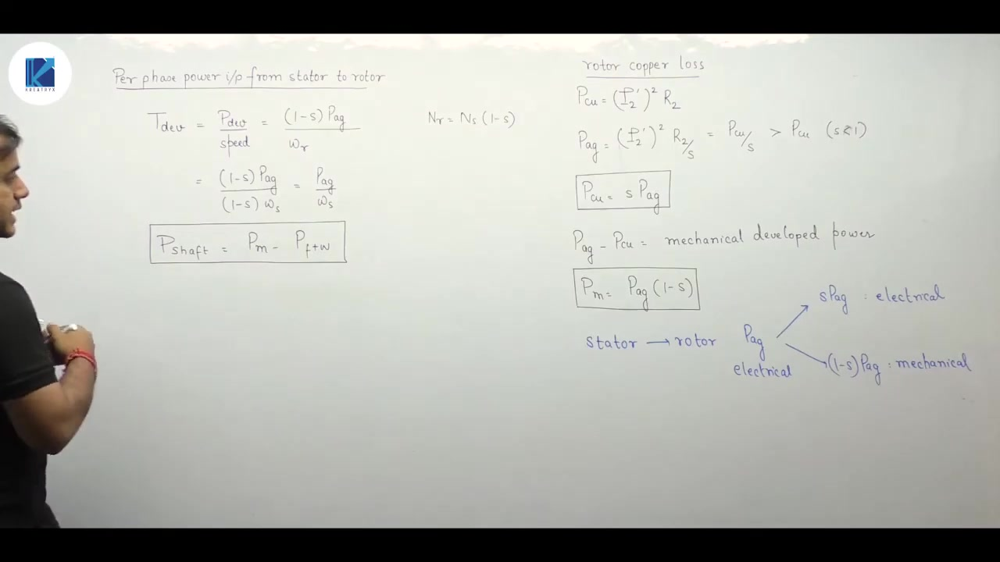

### Shaft Torque and Loss Torque

Because of friction and windage losses, not all developed torque reaches the coupled load. Three distinct torques are defined:

1. **Developed Torque ($T_d$)**:
   The internal electromagnetic torque produced by electromechanical conversion:
   $$T_d = \frac{P_m}{\omega_r} = \frac{P_{\text{ag}}}{\omega_s}$$
2. **Shaft Torque ($T_{sh}$)**:
   The actual mechanical torque delivered to the load at the shaft:
   $$T_{sh} = \frac{P_{sh}}{\omega_r} = \frac{P_m - P_{fw}}{(1-s)\omega_s}$$
   This is also called load torque.
3. **Loss Torque ($T_{loss}$)**:
   The torque absorbed by mechanical drag and bearing friction:
   $$T_{loss} = T_d - T_{sh} = \frac{P_{fw}}{\omega_r} = \frac{P_{fw}}{(1-s)\omega_s}$$

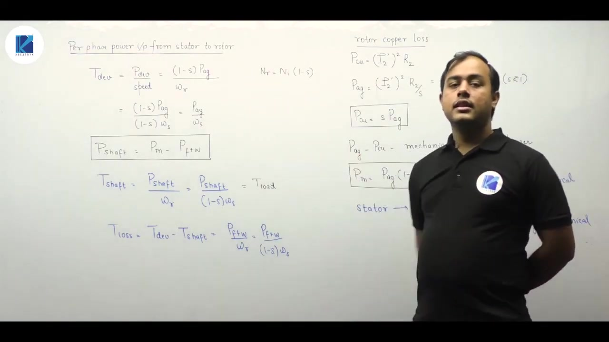

### Summary of Rotor Power Distribution

Power transfers from the stator across the air gap into the rotor as $P_{\text{ag}}$. This air-gap power splits into two streams:
- Rotor copper loss: $P_{cu} = s P_{\text{ag}}$
- Gross mechanical power: $P_m = (1-s) P_{\text{ag}}$

Friction and windage losses subtract from $P_m$ to give useful shaft power $P_{sh}$. The real power across resistance $R_2 / s$ in the equivalent circuit directly represents total air-gap power $P_{\text{ag}}$.

---

## Summary and Key Takeaways

- The air-gap flux is the space-phasor resultant $\vec{\Phi}_r = \vec{\Phi}_1 + \vec{\Phi}_2$, which induces EMF in both stator and rotor windings.
- Electromagnetic torque develops as the rotor flux tries to catch the stator flux, yielding $T_e \propto \Phi_r \Phi_2 \cos\theta_2$.
- Maximum torque per ampere requires minimizing the rotor impedance angle $\theta_2$, meaning rotor leakage reactance should be negligible compared to resistance.
- Under running conditions at slip $s$, rotor frequency is $f_r = s f$, induced EMF is $E_{2r} = s E_2$, and leakage reactance is $X_{2r} = s X_2$.
- Dividing rotor loop equations by slip $s$ yields a transformed circuit with constant standstill EMF $E_2$, reactance $X_2$, and effective variable resistance $R_2 / s$.
- Total real air-gap power transferred across the gap equals active power absorbed by the effective resistance: $P_{\text{ag}} = I_2^2 (R_2 / s)$.
- Air-gap power divides into rotor ohmic loss and gross electromechanical developed power according to $P_{\text{ag}} : P_{cu} : P_m = 1 : s : (1-s)$.
- Developed torque can be computed as $T_d = P_m / \omega_r = P_{\text{ag}} / \omega_s$, using total three-phase power.
- Shaft torque delivered to the mechanical load is $T_{sh} = (P_m - P_{fw}) / \omega_r$, where friction and windage losses reduce net torque by $T_{loss}$.

