[← Lec 136: Equivalent Circuit 1](Lecture_136_Equivalent_Circuit_1.md) | [🏠 Index](00_yt_study_guide.md) | [Lec 138: Losses and Efficiency of Induction Machines →](Lecture_138_Losses_and_Efficiency_of_Induction_Machines.md)

---

# Electrical Machines | Lec 99 | Equivalent Circuit - 2 | GATE Electrical Engineering

- **Source**: https://www.youtube.com/watch?v=K2QQi9ab4RE
- **Duration**: 00:40:59
- **Compiled**: 2026-09-23

---

## Overview

This lecture completes the equivalent circuit modeling and power analysis of three-phase induction motors. It develops the stator equivalent circuit using effective turns and analyzes the high magnetizing current caused by the air gap. The lecture resolves the difference between the two rotor equivalent circuits through observer frames of reference. Finally, it constructs the complete stator-referred equivalent circuit, details the power flow cascade, and categorizes motor losses and efficiency.

## Contents

- [[#Stator Induced EMF and Effective Turns Ratio|Stator Induced EMF and Effective Turns Ratio]]
- [[#Stator Equivalent Circuit and Shunt Branch Parameters|Stator Equivalent Circuit and Shunt Branch Parameters]]
- [[#Rotor Frequency Transformation and Circuit Equivalence|Rotor Frequency Transformation and Circuit Equivalence]]
- [[#Frame of Reference Concept and Complete Equivalent Circuit|Frame of Reference Concept and Complete Equivalent Circuit]]
- [[#Resistance Splitting and the Comprehensive Power Flow Diagram|Resistance Splitting and the Comprehensive Power Flow Diagram]]
- [[#Loss Classification, Efficiency, and Mechanical Aspects|Loss Classification, Efficiency, and Mechanical Aspects]]

---

## Stator Induced EMF and Effective Turns Ratio
_(00:13 - 06:30)_

### Stator Induced EMF Formulation

In an induction motor, three-phase AC excitation feeds the stator winding at grid frequency $f$. The resultant rotating magnetic flux wave $\Phi_m$ passes across the air gap. It links both stator and rotor turns.

The RMS induced EMF per phase in the stator winding is:
$$E_1 = \sqrt{2}\pi f N_{ph1} K_{w1} \Phi_m \approx 4.44 f N_1 K_{w1} \Phi_m$$

Here $N_1$ is the number of series turns per phase. $K_{w1}$ is the stator winding factor, accounting for pitch and distribution factors ($K_{w1} = K_{p1} K_{d1}$).

The peak mutual flux per pole is obtained from peak air-gap flux density $B_m$:
$$\Phi_m = B_{avg} A_{pole} = \left(\frac{2}{\pi} B_m\right) \left(\frac{\pi D L}{P}\right) = \frac{2 B_m D L}{P}$$

This relation matches synchronous machine and transformer formulations.

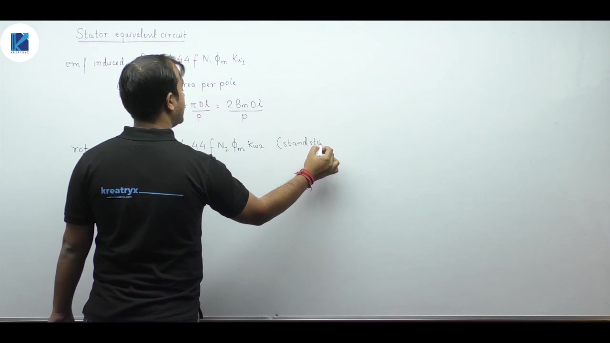

### Standstill Rotor EMF and Transformation Ratio

At standstill, the rotor sees the full line frequency $f$. The standstill induced rotor EMF per phase is:
$$E_2 = 4.44 f N_2 K_{w2} \Phi_m$$

Taking the ratio of stator EMF to standstill rotor EMF gives:
$$\frac{E_1}{E_2} = \frac{N_1 K_{w1}}{N_2 K_{w2}} = \frac{N_{e1}}{N_{e2}}$$

Here $N_{e1} = N_1 K_{w1}$ and $N_{e2} = N_2 K_{w2}$ represent the effective series turns per phase of the respective windings.

> [!success] Result: Transformation Ratio
> The effective voltage transformation ratio of an induction machine is:
> $$a = \frac{E_1}{E_2} = \frac{N_{e1}}{N_{e2}}$$
> Since stator voltage is higher than rotor voltage in standard machines, $a > 1$.

### MMF Balance Using Effective Turns

In static transformers, primary and secondary MMFs balance each other across the magnetic core. The same balance holds in an induction machine. But because distributed windings are chorded and spread across slots, effective turns must be used.

> [!important] Rule: MMF Balancing Uses Effective Turns
> Never balance MMF in an induction motor using raw turn counts. Always use effective turns:
> $$N_{e1} I_1 = N_{e2} I_2 + \text{MMF}_0$$

Divide through by stator effective turns $N_{e1}$:
$$I_1 = \left(\frac{N_{e2}}{N_{e1}}\right) I_2 + I_0 = I_1' + I_0$$
Here $I_1'$ is the reflected rotor load current and $I_0$ is the no-load excitation current.

## Stator Equivalent Circuit and Shunt Branch Parameters
_(06:30 - 11:11)_

### Stator Circuit Architecture

The operating principle of an induction motor directly parallels a transformer. So its stator per-phase equivalent circuit is modeled with identical elements.

The circuit components include:
- **$R_1$**: Stator winding resistance per phase, accounting for copper losses.
- **$X_1$**: Stator leakage reactance per phase, representing leakage flux paths.
- **$R_c$**: Shunt core-loss resistance, representing eddy current and hysteresis losses in the stator laminations.
- **$X_m$**: Shunt magnetizing reactance, representing the mutual air-gap flux path.

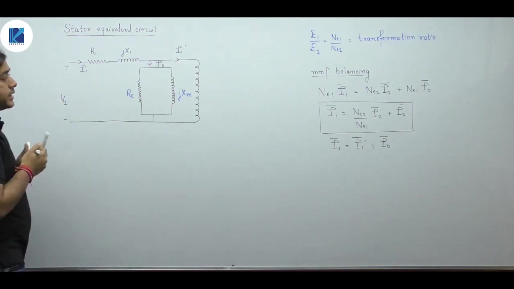

The stator input current $\vec{I}_1$ splits into two parallel paths:
$$\vec{I}_1 = \vec{I}_1' + \vec{I}_0$$

Here $\vec{I}_1'$ is the reflected rotor load current. $\vec{I}_0$ is the no-load excitation current.

### No-Load Current Components

The excitation current $\vec{I}_0$ consists of two quadrature components:
$$\vec{I}_0 = \vec{I}_w + \vec{I}_\mu$$

1. **Core-loss component ($I_w$)**: In phase with induced EMF $E_1$. It flows through $R_c$ to supply iron losses:
   $$I_w = \frac{E_1}{R_c}$$
2. **Magnetizing component ($I_\mu$)**: Lags $E_1$ by $90^\circ$. It flows through $X_m$ to establish the mutual air-gap flux:
   $$I_\mu = \frac{E_1}{X_m}$$

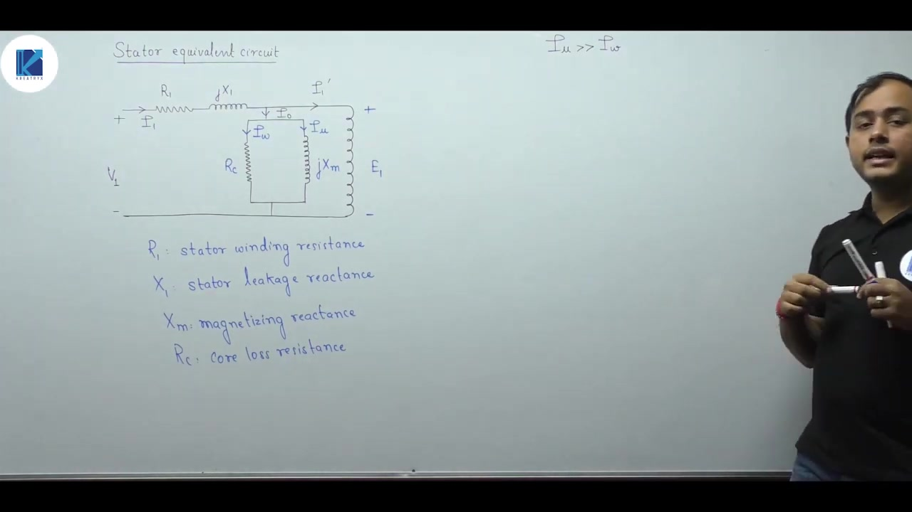

### Comparison with Transformer Shunt Branch

In static transformers, the core is continuous iron with no air gap. The magnetizing current is small, typically $2\%$ to $5\%$ of rated current.

In an induction motor, magnetic flux must cross the physical air gap twice. Air has vastly higher reluctance than silicon steel. Therefore, the stator draws a substantial magnetizing current ($25\%$ to $40\%$ of rated current).

> [!info] Definition: Shunt Branch Simplification
> Because $I_\mu \gg I_w$, magnetizing reactance is much smaller than core-loss resistance:
> $$X_m \ll R_c$$
> In parallel combinations, the smaller branch impedance dominates. Therefore, $R_c$ is frequently neglected in standard equivalent circuit calculations, leaving only $X_m$ in the shunt branch.

## Rotor Frequency Transformation and Circuit Equivalence
_(11:11 - 19:13)_

### Why Rotor Frequency Must Be Transformed

In a conventional two-winding transformer, both windings operate at the exact same line frequency:
$$f_1 = f_2 = f$$

In an induction motor, the stator operates at grid frequency $f$, but the actual rotor operates at slip frequency:
$$f_r = s f$$

Magnetic coupling across different electrical frequencies cannot be modeled directly by static transformer equations. To treat an induction machine like a transformer, we must transform the rotor frequency from $s f$ to line frequency $f$.

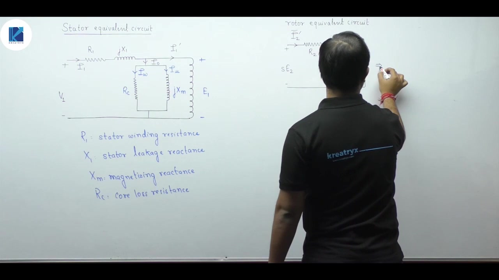

### Mathematical Duality of the Two Rotor Circuits

Consider the actual running rotor circuit at frequency $s f$:
- Induced EMF: $E_{2r} = s E_2$
- Winding resistance: $R_2$
- Leakage reactance: $X_{2r} = s X_2$

The rotor current is:
$$I_2 = \frac{s E_2}{\sqrt{R_2^2 + (s X_2)^2}}$$
The phase angle is:
$$\theta_2 = \tan^{-1}\left(\frac{s X_2}{R_2}\right)$$

Now divide the numerator and denominator by slip $s$:
$$I_2 = \frac{E_2}{\sqrt{\left(\frac{R_2}{s}\right)^2 + X_2^2}}$$
The phase angle becomes:
$$\theta_2 = \tan^{-1}\left(\frac{X_2}{R_2 / s}\right) = \tan^{-1}\left(\frac{s X_2}{R_2}\right)$$

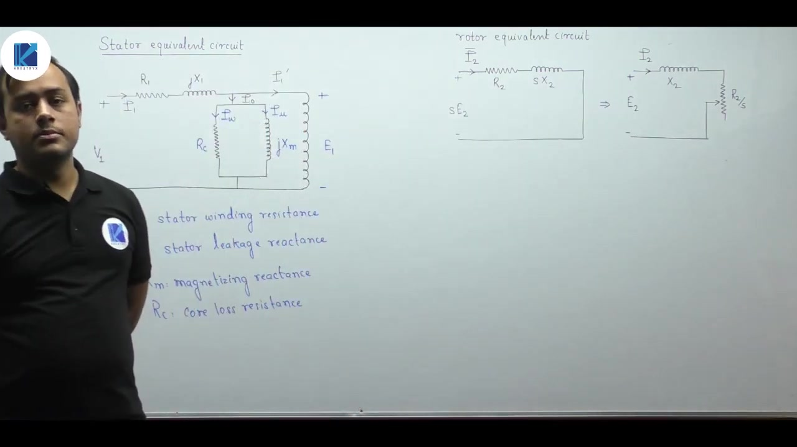

Both current magnitude and phase angle remain completely unchanged.

### Physical Difference Between Models

Although both circuits yield identical currents and phase angles, they differ in real active power:
- **First circuit (Frequency $s f$)**:
  Active power absorbed by the resistance is:
  $$P = I_2^2 R_2 = P_{cu2}$$
  This accounts only for ohmic copper loss.
- **Second circuit (Frequency $f$)**:
  Active power absorbed by the resistance is:
  $$P = I_2^2 \left(\frac{R_2}{s}\right) = P_{\text{ag}}$$
  This equals the full air-gap power crossing into the rotor.

This power difference leads directly to the frame of reference concept.

## Frame of Reference Concept and Complete Equivalent Circuit
_(19:13 - 28:42)_

### Why Real Powers Differ: The Frame of Reference Insight

If both rotor circuit representations yield identical currents and phase angles, why do their active power expressions differ?

The answer lies in the observer frame of reference:
1. **Rotor Frame of Reference (Frequency $s f$)**:
   The electrical frequency is the slip frequency $s f$. An observer placed on the rotor sees the rotor conductors as stationary. Relative velocity between observer and rotor is zero.
   $$v_{\text{rel}} = 0 \implies \omega_{\text{rel}} = 0$$
   Mechanical power is torque times angular speed:
   $$P_m = T \cdot \omega_{\text{rel}} = 0$$
   Because no rotation can be observed, no mechanical power appears in this circuit. The only real power visible is ohmic heating in the winding resistance:
   $$P_{\text{in}} = I_2^2 R_2 = P_{cu2}$$
2. **Stator Frame of Reference (Frequency $f$)**:
   The frequency is the line frequency $f$. An observer stands on the stationary stator frame. The rotor clearly rotates at speed $N_r = N_s(1-s)$.
   Both mechanical rotation and winding heating are observed simultaneously. The total power entering the circuit is the complete air-gap power:
   $$P_{\text{in}} = I_2^2 \left(\frac{R_2}{s}\right) = P_{\text{ag}} = P_{cu2} + P_m$$

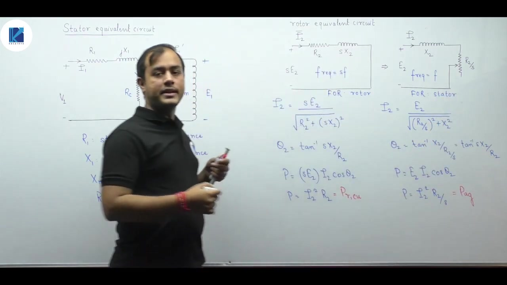

### Complete Equivalent Circuit Referred to Stator

With both stator and rotor circuits operating at line frequency $f$, we can join them across an ideal transformer with turns ratio $a = N_{e1} / N_{e2}$.

Referring all rotor quantities to the stator winding:
$$
\begin{aligned}
R_2' &= a^2 R_2 = \left(\frac{N_{e1}}{N_{e2}}\right)^2 R_2 \\
X_2' &= a^2 X_2 = \left(\frac{N_{e1}}{N_{e2}}\right)^2 X_2 \\
I_2' &= \frac{I_2}{a} = \left(\frac{N_{e2}}{N_{e1}}\right) I_2
\end{aligned}
$$

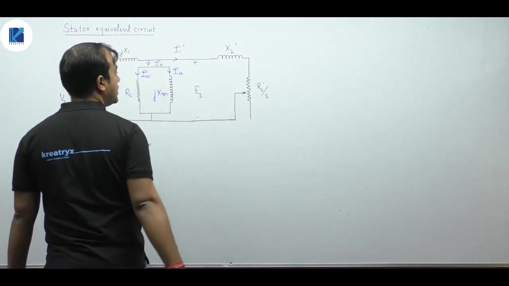

> [!success] Result: Complete Equivalent Circuit Equations
> The complete per-phase loop equations viewed from the stator terminals are:
> $$
> \begin{aligned}
> \vec{V}_1 &= \vec{I}_1 (R_1 + j X_1) + \vec{E}_1 \\
> \vec{E}_1 &= \vec{I}_2' \left(\frac{R_2'}{s} + j X_2'\right) \\
> \vec{I}_1 &= \vec{I}_1' + \vec{I}_0
> \end{aligned}
> $$

### Why Rotor Core Losses Are Ignored

Core loss consists of hysteresis and eddy current losses:
$$P_{core} = P_h + P_e = k_h f B_m^n + k_e f^2 B_m^2$$

In the stator, flux alternates at grid frequency ($50\text{ Hz}$), causing normal core losses in $R_c$. In the rotor under normal operation, slip is very small ($s \approx 0.01$ to $0.04$). The rotor electrical frequency is only $0.5\text{ Hz}$ to $2\text{ Hz}$.

Because hysteresis loss varies with $f$ and eddy current loss varies with $f^2$, rotor core losses are negligible during running conditions.

## Resistance Splitting and the Comprehensive Power Flow Diagram
_(28:42 - 34:19)_

### Splitting Rotor Resistance into Loss and Load Elements

To distinguish electrical losses from mechanical power in circuit schematics, the rotor resistance $R_2'/s$ is decomposed:
$$\frac{R_2'}{s} = R_2' + R_2'\left(\frac{1-s}{s}\right)$$

This separates the equivalent circuit into two series resistive components:
1. **Physical winding resistance ($R_2'$)**:
   Carries current $I_2'$ and dissipates active power as heat:
   $$P_{cu2} = 3 (I_2')^2 R_2'$$
   This accounts for the actual rotor copper loss.
2. **Fictitious electromechanical load resistance ($R_L'$)**:
   Defined as:
   $$R_L' = R_2'\left(\frac{1-s}{s}\right)$$
   Active power consumed by this resistance models electromechanical energy conversion:
   $$P_m = 3 (I_2')^2 R_2'\left(\frac{1-s}{s}\right) = (1-s) P_{\text{ag}}$$

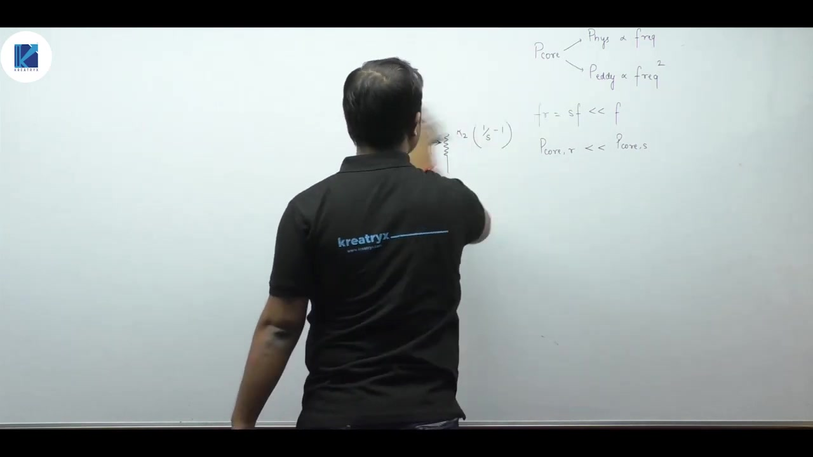

### Complete Power Flow Tree

An induction motor draws all operating power through its three-phase stator terminals:
$$P_{\text{in}} = \sqrt{3} V_L I_L \cos\theta$$

Power cascades through the machine stages as follows:
1. **Stator copper loss**: $P_{cu1} = 3 I_1^2 R_1$.
2. **Stator core loss**: $P_{core1} = 3 E_1^2 / R_c$.
3. **Air-gap power ($P_{\text{ag}}$)**:
   $$P_{\text{ag}} = P_{\text{in}} - P_{cu1} - P_{core1} = 3 (I_2')^2 \left(\frac{R_2'}{s}\right)$$
4. **Rotor copper loss**:
   $$P_{cu2} = s P_{\text{ag}} = 3 (I_2')^2 R_2'$$
5. **Gross mechanical power developed ($P_m$)**:
   $$P_m = P_{\text{ag}} - P_{cu2} = (1-s) P_{\text{ag}}$$
6. **Shaft output power ($P_{\text{shaft}}$)**:
   Friction and windage losses ($P_{fw}$) subtract from $P_m$:
   $$P_{\text{shaft}} = P_m - P_{fw}$$

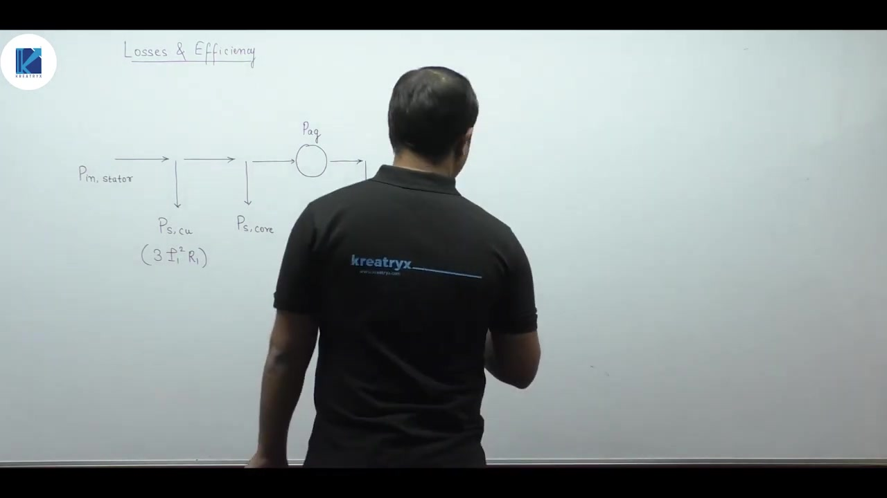

### Why Rotational Loss Is Not Merged

In DC machines, core loss and friction loss are lumped together into a single term called rotational loss.

> [!important] Rule: Never Merge Rotational Losses in Induction Machines
> In an induction machine, stator core loss occurs at supply frequency $f$ on the stationary stator. Mechanical friction and windage occur on the rotating rotor.
> Because they occur at different points in the power flow tree, they must never be combined into a single lumped loss.

## Loss Classification, Efficiency, and Mechanical Aspects
_(34:19 - 40:52)_

### Classification of Losses

Losses in an induction motor divide into fixed and variable categories:

1. **Fixed Losses (Constant Losses)**:
   These losses remain essentially independent of load current:
   - **Stator core loss ($P_{\text{core1}}$)**: Set by supply voltage and frequency.
   - **Bearing friction loss**: Mechanical friction at the rotor shaft support bearings.
   - **Brush friction loss**: Friction between carbon brushes and copper slip rings (occurs only in slip-ring induction motors).
   - **Windage loss**: Aerodynamic drag against the spinning rotor.
2. **Variable Losses**:
   These losses vary directly with operating load and current:
   - **Stator copper loss**: Proportional to $I_1^2 R_1$.
   - **Rotor copper loss**: Proportional to $(I_2')^2 R_2'$, which equals $s P_{\text{ag}}$.
   - **Brush contact drop loss**: Voltage drop at brush interfaces, $V_{BD} \cdot I_a$ (slip-ring motors only).
   - **Stray load loss**: High-frequency leakage flux losses in iron teeth, usually neglected.

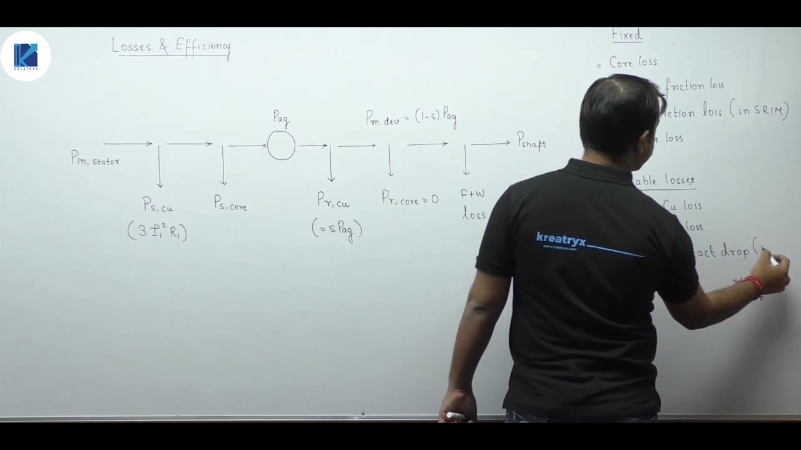

### Overall Efficiency and Maximum Efficiency Condition

Overall machine efficiency is output power divided by total input power:
$$\eta = \frac{P_{\text{shaft}}}{P_{\text{shaft}} + P_{\text{fixed}} + P_{\text{variable}}}$$

> [!success] Result: Condition for Maximum Efficiency
> Maximum efficiency occurs when variable losses equal fixed losses:
> $$P_{\text{variable}} = P_{\text{fixed}}$$
> $$3 I_1^2 R_{eq} = P_{core1} + P_{fw}$$
> Brush contact drop does not affect this condition because its derivative with respect to current is constant.

### Lubrication and Mechanical Drag Differences

Friction at the rotor bearings is reduced using specialized lubricants:
- **Small induction motors**: Greased ball bearings provide sealed lubrication.
- **Large induction motors**: Continuous lube oil lubrication is used. The lube oil serves dual functions as a lubricant and as a thermal coolant.

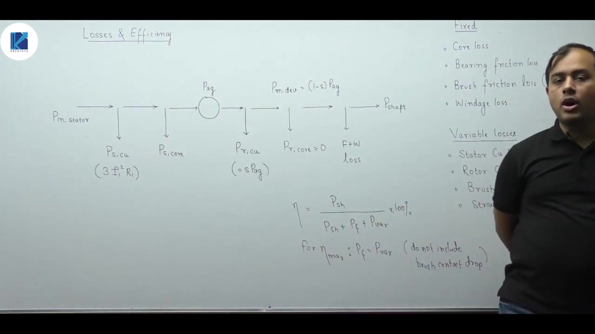

### Windage Loss: Slip-Ring vs Squirrel-Cage

Windage loss depends on the volume of air sheared within the machine housing:
- Slip-ring induction motors have wound rotors with larger radial air gaps. A larger air volume inside the gap experiences higher turbulent shear, creating greater aerodynamic drag.
- Squirrel-cage induction motors have compact, smooth cylindrical rotors and narrower air gaps.

Therefore, windage loss in a slip-ring motor is substantially higher than in an equivalent squirrel-cage motor.

---

## Summary and Key Takeaways

- Induced EMF in stator and rotor windings depends on effective turns, yielding the transformation ratio $a = E_1 / E_2 = N_{e1} / N_{e2} = (N_1 K_{w1}) / (N_2 K_{w2})$.
- MMF balancing between stator and rotor requires effective turns rather than raw turn counts: $N_{e1} I_1 = N_{e2} I_2 + \text{MMF}_0$.
- The presence of an air gap drastically increases magnetizing current to $25\% \text{–} 40\%$ of rated current, making $X_m \ll R_c$ so $R_c$ is often omitted in shunt calculations.
- Transforming the rotor loop from frequency $s f$ to line frequency $f$ shifts the observer frame of reference from the spinning rotor to the stationary stator.
- In the rotor reference frame, relative speed is zero so only rotor copper loss $I_2^2 R_2$ appears, while in the stator frame, rotor rotation is observed so total air-gap power $I_2^2 (R_2/s)$ appears.
- Rotor core losses are neglected during normal running conditions because rotor slip frequency $s f$ is very small ($0.5\text{–}2\text{ Hz}$).
- Splitting rotor resistance as $R_2'/s = R_2' + R_2'(1-s)/s$ isolates physical ohmic loss from the fictitious electromechanical load resistance $R_L'$.
- Core loss on the stationary stator and friction loss on the spinning rotor occur at different physical locations and must never be merged into a single rotational loss.
- Maximum efficiency occurs when variable losses equal fixed losses: $P_{\text{variable}} = P_{\text{fixed}}$, with brush contact drop excluded from the condition.

---

[← Lec 136: Equivalent Circuit 1](Lecture_136_Equivalent_Circuit_1.md) | [🏠 Index](00_yt_study_guide.md) | [Lec 138: Losses and Efficiency of Induction Machines →](Lecture_138_Losses_and_Efficiency_of_Induction_Machines.md)
