[← Lec 137: Equivalent Circuit 2](Lecture_137_Equivalent_Circuit_2.md) | [🏠 Index](00_yt_study_guide.md) | [Lec 139: Torque Slip Characteristics 1 →](Lecture_139_Torque_Slip_Characteristics_1.md)

---

# Losses and Efficiency of Induction Machines | L 38 | Electrical Machines | GATE 2022 | Ankit Sir

- **Source**: https://www.youtube.com/watch?v=pa30V1ocJvk
- **Duration**: 01:16:06
- **Compiled**: 2026-09-23

---

## Overview

This lecture examines quantitative problem-solving methods for losses, power flow, and efficiency in three-phase induction machines. The discussion develops the complete power flow model from stator input through the air gap to the mechanical shaft. It presents worked numerical problems covering rotor EMF cycle rates, slip-ring contact gear losses, network analysis using both approximate and exact T-equivalent circuits, and constant-torque response under voltage and frequency disturbances. Through systematic derivations, the lecture establishes how operating slip governs torque generation, internal electrical losses, and overall machine efficiency.

## Contents

- [[#Induction Motor Losses and Rotor Frequency Fundamentals|Induction Motor Losses and Rotor Frequency Fundamentals]]
- [[#Calculation of Developed Torque and Power Flow|Calculation of Developed Torque and Power Flow]]
- [[#Completion of Problem 1 and Introduction to Equivalent Circuit Analysis|Completion of Problem 1 and Introduction to Equivalent Circuit Analysis]]
- [[#Circuit Reduction and Air Gap Power Computation|Circuit Reduction and Air Gap Power Computation]]
- [[#Evaluation of Motor Output, Efficiency, and Power Factor|Evaluation of Motor Output, Efficiency, and Power Factor]]
- [[#Slip-Ring Rotor Losses and Resistance Determination|Slip-Ring Rotor Losses and Resistance Determination]]
- [[#Analysis of Net Mechanical Power and Rotor Losses|Analysis of Net Mechanical Power and Rotor Losses]]
- [[#Power Flow Cascade and Efficiency Calculation|Power Flow Cascade and Efficiency Calculation]]
- [[#Constant-Torque Response to Voltage and Frequency Disturbances|Constant-Torque Response to Voltage and Frequency Disturbances]]
- [[#Disturbed Speed Computation and Power Input Calculation|Disturbed Speed Computation and Power Input Calculation]]
- [[#Slip Determination from Normalized Loss Relations|Slip Determination from Normalized Loss Relations]]
- [[#Exact T-Equivalent Circuit Parameter Analysis|Exact T-Equivalent Circuit Parameter Analysis]]
- [[#Torque Calculation and Simplified Series Circuit Modeling|Torque Calculation and Simplified Series Circuit Modeling]]
- [[#Power Stages, Output Torque, and Overall Efficiency|Power Stages, Output Torque, and Overall Efficiency]]

---

## Induction Motor Losses and Rotor Frequency Fundamentals
_(00:02 - 05:36)_

Losses and efficiency form one of the most frequently tested areas in induction machine problems. A solid grasp of the power flow across the air gap is key to solving these questions quickly and accurately.

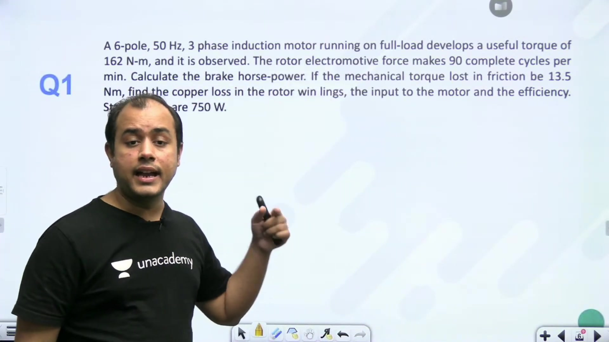

### Rotor EMF Frequency and Slip Determination

In many exam problems, rotor electrical frequency is not given directly. Instead, questions often state the number of complete cycles the rotor electromotive force makes per minute.

> [!info] Rotor Frequency Relation
> If the rotor induced EMF completes $n$ cycles in one minute, the rotor frequency $f_r$ is:
> $$f_r = \frac{n}{60}\text{ Hz}$$
> Since rotor frequency depends on slip $s$ and stator frequency $f$, slip is:
> $$s = \frac{f_r}{f}$$

For a 6-pole, $50\text{ Hz}$ three-phase motor where the rotor EMF completes 90 cycles per minute:

$$f_r = \frac{90}{60} = 1.5\text{ Hz}$$

The operating slip is:

$$s = \frac{1.5}{50} = 0.03$$

### Speeds and Brake Horsepower Setup

The synchronous speed of the stator rotating magnetic field is:

$$N_s = \frac{120 f}{P} = \frac{120 \times 50}{6} = 1000\text{ rpm}$$

The rotor runs at mechanical speed $N_r$:

$$N_r = N_s (1 - s) = 1000 \times (1 - 0.03) = 970\text{ rpm}$$

The angular speed in radians per second is:

$$\omega_r = \frac{2\pi N_r}{60} = \frac{2\pi \times 970}{60}\text{ rad/s}$$

Useful torque refers specifically to the shaft torque $T_{\text{sh}}$ available to the load. Brake horsepower (BHP) measures the net mechanical output power delivered at the shaft:

$$P_{\text{sh}} = T_{\text{sh}} \omega_r$$

Here $T_{\text{sh}} = 162\text{ N-m}$. The friction and windage loss torque is $T_{\text{loss}} = 13.5\text{ N-m}$. The total electromagnetic torque developed by the rotor is the sum of shaft torque and loss torque.

## Calculation of Developed Torque and Power Flow
_(05:40 - 10:01)_

Continuing from the rated data of the 6-pole, $50\text{ Hz}$ induction motor, we evaluate the mechanical output power and establish the link between air gap power and developed torque.

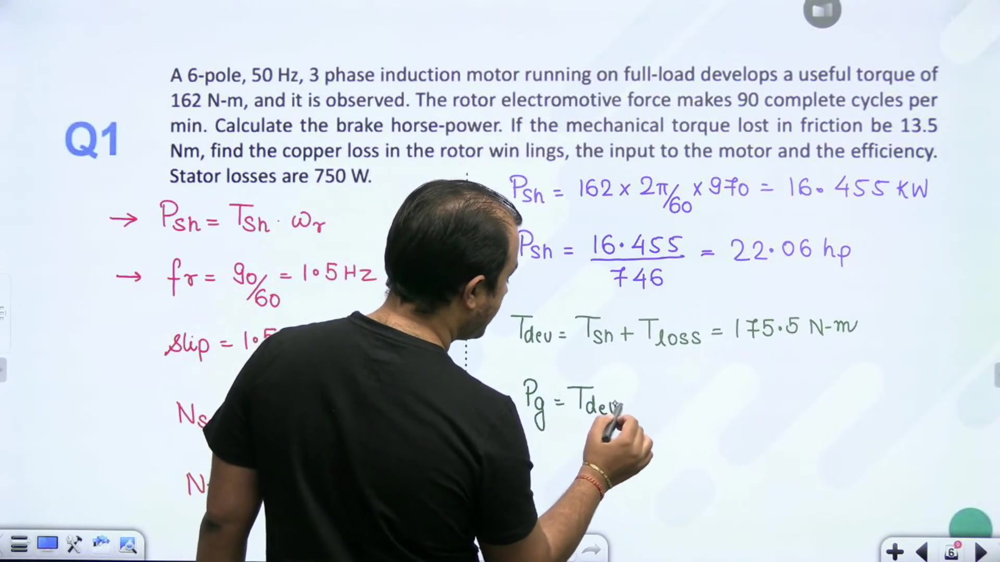

### Shaft Output Power and Horsepower Conversion

The shaft torque is $T_{\text{sh}} = 162\text{ N-m}$. The rotor speed is $N_r = 970\text{ rpm}$. The shaft mechanical power in watts is:

$$P_{\text{sh}} = T_{\text{sh}} \omega_r = 162 \times \left(\frac{2\pi \times 970}{60}\right) = 16455.04\text{ W}$$

To express this shaft power as brake horsepower (BHP):

$$1\text{ hp} = 746\text{ W}$$

$$P_{\text{sh}} = \frac{16455.04}{746} = 22.058\text{ hp} \approx 22.06\text{ hp}$$

> [!success] Brake Horsepower
> The useful shaft output power developed by the motor is $22.06\text{ hp}$ ($16.455\text{ kW}$).

### Developed Torque and Air Gap Power

Friction and windage losses exert a retarding torque on the rotor shaft. The mechanical torque lost in friction is $T_{\text{loss}} = 13.5\text{ N-m}$.

The total electromagnetic torque developed inside the rotor is:

$$T_{\text{dev}} = T_{\text{sh}} + T_{\text{loss}} = 162 + 13.5 = 175.5\text{ N-m}$$

We can calculate the air gap power $P_G$ directly from developed torque. Air gap power equals developed torque multiplied by the synchronous angular speed $\omega_s$:

$$\omega_s = \frac{2\pi N_s}{60} = \frac{2\pi \times 1000}{60} = 104.72\text{ rad/s}$$

$$P_G = T_{\text{dev}} \omega_s = 175.5 \times 104.72 = 18378.36\text{ W} \approx 18.378\text{ kW}$$

Once air gap power $P_G$ is known, rotor copper loss follows directly from operating slip:

$$P_{\text{rcu}} = s P_G$$

Since $s = 0.03$, this gives a simple route to find the rotor electrical losses.

## Completion of Problem 1 and Introduction to Equivalent Circuit Analysis
_(10:15 - 16:53)_

We finish evaluating the performance metrics of the first motor. Then we examine a problem requiring equivalent circuit modeling.

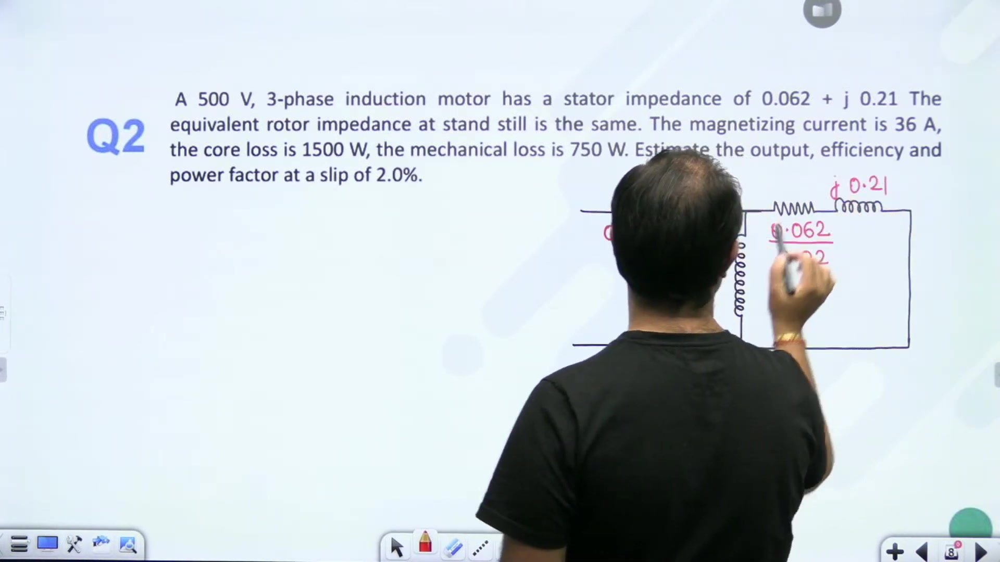

### Completing the First Problem

With air gap power $P_G = 18.378\text{ kW}$ and slip $s = 0.03$:

$$P_{\text{rcu}} = s P_G = 0.03 \times 18378\text{ W} = 551.35\text{ W}$$

Total electrical input power to the motor stator is:

$$P_{\text{in}} = P_G + P_{\text{stator losses}} = 18378 + 750 = 19128\text{ W}$$

The overall efficiency is:

$$\eta = \frac{P_{\text{sh}}}{P_{\text{in}}} \times 100 = \frac{16455}{19128} \times 100 = 86.02\%$$

> [!success] Problem 1 Answers
> 1. Brake horsepower: $22.06\text{ hp}$
> 2. Rotor copper loss: $551.35\text{ W}$
> 3. Motor electrical input: $19.128\text{ kW}$
> 4. Overall efficiency: $86.02\%$

### Induction Motor Equivalent Circuit Formulation

> [!example] Problem 2
> A $500\text{ V}$, 3-phase induction motor has stator impedance $(0.062 + j0.21)\ \Omega$ per phase. Rotor standstill impedance referred to stator is identical: $(0.062 + j0.21)\ \Omega$ per phase. Magnetizing current is $36\text{ A}$. Core loss is $1.5\text{ kW}$ and mechanical loss is $750\text{ W}$. Find output power, efficiency, and power factor at slip $s = 0.02$.

In induction machine conventions, delta connection is the standard default unless specified otherwise. In a delta-connected stator:

$$V_{\text{ph}} = V_L = 500\text{ V}$$

The rotor branch resistance referred to the stator becomes:

$$\frac{R_2'}{s} = \frac{0.062}{0.02} = 3.1\ \Omega$$

The rotor leakage reactance is $X_2' = 0.21\ \Omega$. Core loss resistance is usually omitted from the circuit schematic and treated as a fixed constant loss. Because magnetizing current is substantial in induction machines, shifting the magnetizing branch across the stator impedance involves an engineering approximation that is evaluated next.

## Circuit Reduction and Air Gap Power Computation
_(17:04 - 21:37)_

When the exact internal air gap voltage phase angle is not provided, placing the shunt magnetizing branch at the machine input terminals provides a practical solution.

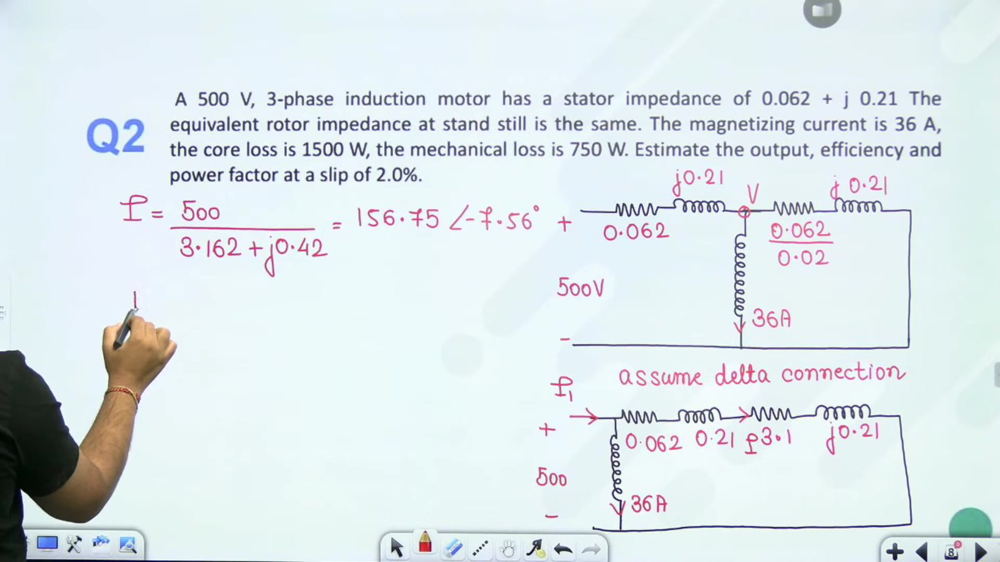

### Evaluation of Branch Current

In the approximate circuit representation, the supply voltage of $500\text{ V}$ per phase appears directly across the series combination of stator and rotor impedances.

The total series impedance per phase is:

$$Z_{\text{series}} = (R_1 + \frac{R_2'}{s}) + j(X_1 + X_2')$$

Substituting the numerical values:

$$Z_{\text{series}} = (0.062 + 3.1) + j(0.21 + 0.21) = 3.162 + j0.42\ \Omega$$

The magnitude of this impedance is:

$$|Z_{\text{series}}| = \sqrt{3.162^2 + 0.42^2} = \sqrt{9.9982 + 0.1764} = 3.1898\ \Omega$$

The rotor branch current magnitude is:

$$I_2' = \frac{V_{\text{ph}}}{|Z_{\text{series}}|} = \frac{500}{3.1898} = 156.75\text{ A}$$

Notice that the magnetizing current of $36\text{ A}$ is about $23\%$ of this load current. It is substantial. But moving the branch allows direct computation.

### Air Gap Power and Mechanical Power Developed

Air gap power $P_G$ represents the total electromagnetic power transferred across the air gap into the rotor circuit.

> [!info] Air Gap Power Formula
> For a balanced three-phase machine:
> $$P_G = 3 (I_2')^2 \left(\frac{R_2'}{s}\right)$$

Substituting the rotor current and resistance:

$$P_G = 3 \times (156.75)^2 \times 3.1 = 3 \times 24570.56 \times 3.1 = 228506\text{ W} \approx 228.51\text{ kW}$$

Developed gross mechanical power $P_{\text{dev}}$ is:

$$P_{\text{dev}} = P_G (1 - s)$$

With slip $s = 0.02$:

$$P_{\text{dev}} = 228.51 \times (1 - 0.02) = 228.51 \times 0.98 = 223.94\text{ kW}$$

The remaining fraction $s P_G$ is dissipated as rotor copper loss.

## Evaluation of Motor Output, Efficiency, and Power Factor
_(21:37 - 26:25)_

With air gap power and gross developed power known, we evaluate net mechanical output, motor input power, operating efficiency, and input power factor.

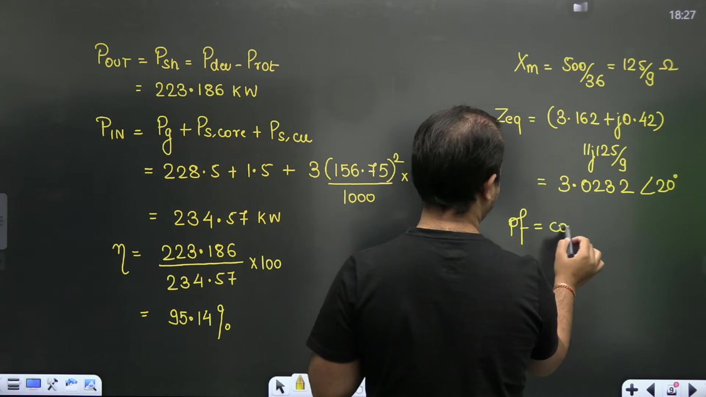

### Net Shaft Output Power

Mechanical rotational losses are given as $750\text{ W} = 0.75\text{ kW}$. Net shaft power is:

$$P_{\text{sh}} = P_{\text{dev}} - P_{\text{mech}}$$

$$P_{\text{sh}} = 223.936 - 0.75 = 223.186\text{ kW}$$

### Total Input Power and Efficiency

Total motor input power consists of air gap power plus all stator losses:

$$P_{\text{in}} = P_G + P_{\text{core}} + P_{\text{scu}}$$

Here stator core loss is $P_{\text{core}} = 1.5\text{ kW}$.

Stator copper loss per phase uses stator resistance $R_1 = 0.062\ \Omega$ and current $I_1 \approx I_2' = 156.75\text{ A}$:

$$P_{\text{scu}} = 3 (I_1)^2 R_1 = 3 \times (156.75)^2 \times 0.062 = 4569.1\text{ W} \approx 4.57\text{ kW}$$

Total input power is:

$$P_{\text{in}} = 228.50 + 1.50 + 4.57 = 234.57\text{ kW}$$

Overall efficiency is the ratio of net mechanical shaft output to total electrical input:

$$\eta = \frac{P_{\text{sh}}}{P_{\text{in}}} \times 100 = \frac{223.186}{234.57} \times 100 = 95.15\%$$

### Input Impedance and Power Factor

The magnetizing branch reactance is derived from rated voltage and magnetizing current:

$$X_m = \frac{V_{\text{ph}}}{I_\mu} = \frac{500}{36} = \frac{125}{9} \approx 13.89\ \Omega$$

The net input impedance seen by the supply per phase is:

$$Z_{\text{in}} = j X_m \parallel Z_{\text{series}} = j 13.89 \parallel (3.162 + j0.42)$$

Evaluating this parallel combination yields:

$$Z_{\text{in}} = 3.0232 \angle 20.0^\circ\ \Omega$$

> [!success] Problem 2 Results
> 1. Net output shaft power: $223.19\text{ kW}$
> 2. Motor efficiency: $95.15\%$
> 3. Operating power factor:
> $$\text{pf} = \cos(20.0^\circ) = 0.94\text{ lagging}$$

## Slip-Ring Rotor Losses and Resistance Determination
_(26:26 - 31:48)_

Wound rotor (slip-ring) induction motors allow external connections to the rotor circuit. When analyzing their losses, we must account for external contact losses alongside winding resistance losses.

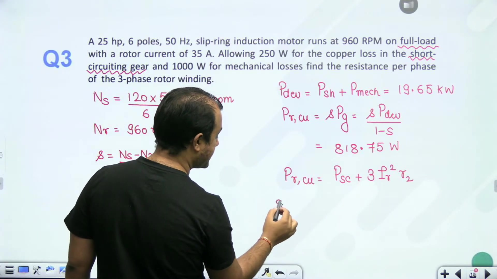

### Speed and Operating Slip

> [!example] Problem 3
> A $25\text{ hp}$, 6-pole, $50\text{ Hz}$ slip-ring induction motor runs at $960\text{ rpm}$ on full load. The rotor current is $35\text{ A}$. The electrical loss in the short-circuiting gear is $250\text{ W}$, and mechanical loss is $1000\text{ W}$. Find the resistance per phase of the 3-phase rotor winding.

First compute synchronous speed:

$$N_s = \frac{120 f}{P} = \frac{120 \times 50}{6} = 1000\text{ rpm}$$

The full-load slip is:

$$s = \frac{N_s - N_r}{N_s} = \frac{1000 - 960}{1000} = 0.04$$

### Mechanical Power and Total Rotor Losses

The rated shaft output power is:

$$P_{\text{sh}} = 25\text{ hp} = 25 \times 746\text{ W} = 18650\text{ W} = 18.65\text{ kW}$$

The gross developed mechanical power includes friction and windage:

$$P_{\text{dev}} = P_{\text{sh}} + P_{\text{mech}} = 18650 + 1000 = 19650\text{ W} = 19.65\text{ kW}$$

Developed power and total rotor copper loss are related by:

$$P_{\text{rcu,total}} = \left(\frac{s}{1 - s}\right) P_{\text{dev}} = \left(\frac{0.04}{0.96}\right) \times 19650 = 818.75\text{ W}$$

### Separating Winding Loss from Short-Circuiting Gear Loss

The rotor circuit consists of the internal three-phase windings plus the external contacts and short-circuiting gear.

Total rotor electrical loss is:

$$P_{\text{rcu,total}} = P_{\text{gear}} + P_{\text{winding}}$$

Here $P_{\text{gear}} = 250\text{ W}$. Therefore, the copper loss dissipated strictly within the rotor windings is:

$$P_{\text{winding}} = 818.75 - 250 = 568.75\text{ W}$$

In slip-ring induction motors, the rotor winding is always star-connected. The three-phase copper loss in the windings is:

$$P_{\text{winding}} = 3 (I_r)^2 R_2$$

where $I_r = 35\text{ A}$ is the rotor phase current and $R_2$ is the winding resistance per phase.

We solve for $R_2$ directly:

$$R_2 = \frac{P_{\text{winding}}}{3 (I_r)^2} = \frac{568.75}{3 \times 35^2} = \frac{568.75}{3675} = 0.15476\ \Omega$$

> [!success] Rotor Winding Resistance
> The resistance per phase of the three-phase rotor winding is $0.1548\ \Omega$.

## Analysis of Net Mechanical Power and Rotor Losses
_(31:49 - 36:48)_

We examine another practical problem that clarifies the terminology between gross developed mechanical power and net shaft power.

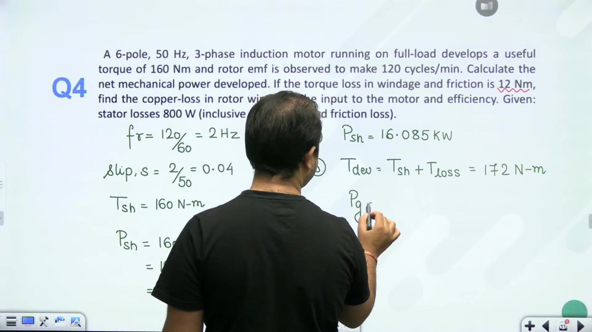

### Operating Conditions and Speed

> [!example] Problem 4
> A 6-pole, $50\text{ Hz}$, 3-phase induction motor running on full load develops a useful torque of $160\text{ N-m}$. The rotor EMF makes 120 complete cycles per minute. Find the net mechanical power developed. If torque lost in friction and windage is $12\text{ N-m}$, find rotor copper loss, motor input power, and efficiency. Stator losses are $800\text{ W}$.

First determine rotor electrical frequency and operating slip:

$$f_r = \frac{120\text{ cycles}}{60\text{ s}} = 2\text{ Hz}$$

$$s = \frac{f_r}{f} = \frac{2}{50} = 0.04$$

Synchronous speed is:

$$N_s = \frac{120 \times 50}{6} = 1000\text{ rpm}$$

The rotor runs at mechanical speed:

$$N_r = N_s (1 - s) = 1000 \times (1 - 0.04) = 960\text{ rpm}$$

### Net Mechanical Power (Shaft Power)

In electrical machine terminology, "gross mechanical power" refers to electromagnetic power $P_{\text{dev}}$ developed by the rotor. In contrast, "net mechanical power" refers to the usable shaft power $P_{\text{sh}}$ delivered to the load.

$$\omega_r = \frac{2\pi N_r}{60} = \frac{2\pi \times 960}{60} = 100.53\text{ rad/s}$$

$$P_{\text{sh}} = T_{\text{sh}} \omega_r = 160 \times 100.53 = 16084.95\text{ W} \approx 16.085\text{ kW}$$

### Developed Torque, Air Gap Power, and Losses

The friction and windage loss torque is $T_{\text{loss}} = 12\text{ N-m}$. Total developed torque is:

$$T_{\text{dev}} = T_{\text{sh}} + T_{\text{loss}} = 160 + 12 = 172\text{ N-m}$$

The synchronous angular velocity is:

$$\omega_s = \frac{2\pi \times 1000}{60} = 104.72\text{ rad/s}$$

Air gap power transferred across the stator-rotor boundary is:

$$P_G = T_{\text{dev}} \omega_s = 172 \times 104.72 = 18011.8\text{ W} \approx 18.012\text{ kW}$$

The copper loss dissipated in the rotor windings is:

$$P_{\text{rcu}} = s P_G = 0.04 \times 18011.8 = 720.47\text{ W}$$

Total electrical input power to the stator equals air gap power plus stator losses:

$$P_{\text{in}} = P_G + P_{\text{stator}} = 18.012 + 0.800 = 18.812\text{ kW}$$

Overall efficiency is:

$$\eta = \frac{P_{\text{sh}}}{P_{\text{in}}} \times 100 = \frac{16.085}{18.812} \times 100 = 85.50\%$$

> [!success] Problem 4 Summary
> - Net mechanical power: $16.085\text{ kW}$
> - Rotor copper loss: $720.47\text{ W}$
> - Stator input power: $18.812\text{ kW}$
> - Efficiency: $85.50\%$

## Power Flow Cascade and Efficiency Calculation
_(36:51 - 41:39)_

A clear understanding of the induction motor power stage cascade allows rapid solution of standard objective exam questions.

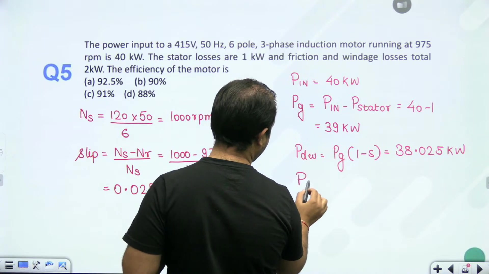

### Cascade Flow Principles

Electrical power passes through distinct physical stages between the stator terminals and the mechanical load:

1. Electrical input power $P_{\text{in}}$ enters the three-phase stator windings.
2. Stator copper losses $P_{\text{scu}}$ and stator core losses $P_{\text{core}}$ are deducted.
3. The remaining power crosses the air gap as air gap power $P_G$.
4. Rotor copper losses $s P_G$ are subtracted, leaving gross mechanical developed power $P_{\text{dev}} = (1 - s) P_G$.
5. Mechanical friction and windage losses $P_{\text{mech}}$ are deducted, delivering net shaft output $P_{\text{sh}}$.

### Worked Example: Standard Power Flow Problem

> [!example] Problem 5
> A 3-phase induction motor running at $975\text{ rpm}$ draws $40\text{ kW}$. Stator losses are $1\text{ kW}$, and friction and windage losses are $2\text{ kW}$. The efficiency of the motor is:
> (a) $87.5\%$  
> (b) $90.0\%$  
> (c) $92.5\%$  
> (d) $95.0\%$

Assuming standard 6-pole, $50\text{ Hz}$ design:

$$N_s = \frac{120 \times 50}{6} = 1000\text{ rpm}$$

The operating slip is:

$$s = \frac{N_s - N_r}{N_s} = \frac{1000 - 975}{1000} = 0.025$$

Air gap power transferred across the air gap is:

$$P_G = P_{\text{in}} - P_{\text{stator}} = 40\text{ kW} - 1\text{ kW} = 39\text{ kW}$$

The gross mechanical power developed inside the rotor is:

$$P_{\text{dev}} = P_G (1 - s) = 39 \times (1 - 0.025) = 38.025\text{ kW}$$

Net shaft output power after accounting for rotational friction and windage is:

$$P_{\text{sh}} = P_{\text{dev}} - P_{\text{mech}} = 38.025 - 2.0 = 36.025\text{ kW}$$

Overall motor efficiency is:

$$\eta = \frac{P_{\text{sh}}}{P_{\text{in}}} \times 100 = \frac{36.025}{40.0} \times 100 = 90.0625\% \approx 90\%$$

> [!success] Answer
> The correct option is **(b) 90%**.

## Constant-Torque Response to Voltage and Frequency Disturbances
_(41:39 - 46:38)_

Grid disturbances alter system voltage and frequency simultaneously. When an induction motor drives a constant-torque load, operating slip and shaft speed adjust to maintain equilibrium.

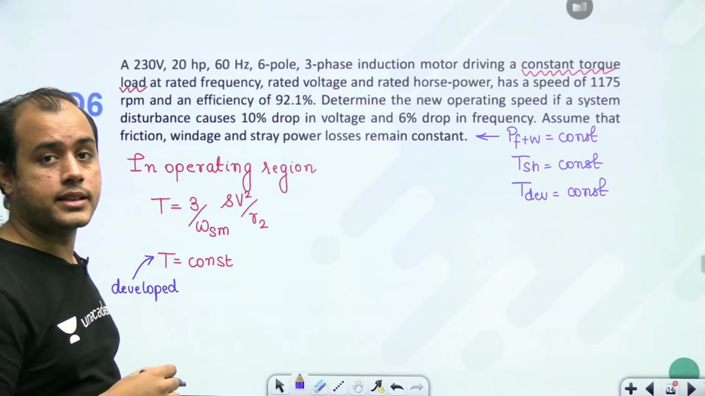

### Uniqueness of Air Gap Power in Induction Machines

In DC and synchronous machines, distinct windings receive independent power supplies. In induction machines, energy transfers across the air gap purely by mutual magnetic induction.

Air gap power $P_G$ links the stator electrical world to the rotor electromechanical world.

### Torque-Slip Proportionality in Stable Region

Under normal running conditions, the induction motor operates at small slip ($s < s_m$). In this linear region:

$$T \approx \frac{3}{\omega_s} \frac{V^2 (R_2'/s)}{(R_2'/s)^2} = \frac{3}{\omega_s} \frac{s V^2}{R_2'}$$

Since synchronous speed $\omega_s \propto f$, electromagnetic torque obeys the proportional relation:

$$T_{\text{dev}} \propto \frac{s V^2}{f}$$

> [!info] Torque Invariance Condition
> If the motor drives a constant torque load and rotational loss torque remains constant:
> $$T_{\text{dev1}} = T_{\text{dev2}} \implies \frac{s_1 V_1^2}{f_1} = \frac{s_2 V_2^2}{f_2}$$

### Worked Example: System Disturbance Analysis

> [!example] Problem 6
> A $230\text{ V}$, $20\text{ hp}$, $60\text{ Hz}$, 6-pole, 3-phase induction motor drives a constant torque load at rated conditions with speed $1175\text{ rpm}$. Find the new operating speed if a disturbance causes a $10\%$ drop in voltage and a $6\%$ drop in frequency. Rotational losses remain constant.

The initial synchronous speed is:

$$N_{s1} = \frac{120 f_1}{P} = \frac{120 \times 60}{6} = 1200\text{ rpm}$$

The initial operating slip is:

$$s_1 = \frac{N_{s1} - N_{r1}}{N_{s1}} = \frac{1200 - 1175}{1200} = \frac{25}{1200} = \frac{1}{48} \approx 0.02083$$

The disturbed electrical quantities are:

$$V_2 = 0.90 V_1$$

$$f_2 = 0.94 f_1$$

From the torque equilibrium condition:

$$s_2 = s_1 \left(\frac{f_2}{f_1}\right) \left(\frac{V_1}{V_2}\right)^2 = s_1 \times \frac{0.94}{(0.90)^2} = s_1 \times \frac{0.94}{0.81} = 1.1605 s_1$$

## Disturbed Speed Computation and Power Input Calculation
_(46:44 - 52:03)_

We finish computing the new operating speed under voltage and frequency drops. Then we solve a power input problem and introduce algebraic loss relationships.

### Completing the Disturbance Calculation

From the proportionality relationship:

$$s_2 = 1.1605 \times \frac{1}{48} = 0.024177$$

Many students mistakenly multiply the new factor $(1 - s_2)$ by the original synchronous speed. This is incorrect because supply frequency decreased by $6\%$.

The new synchronous speed is:

$$N_{s2} = \frac{120 f_2}{P} = \frac{120 \times (60 \times 0.94)}{6} = 1200 \times 0.94 = 1128\text{ rpm}$$

The new rotor operating speed is:

$$N_{r2} = N_{s2} (1 - s_2) = 1128 \times (1 - 0.024177) = 1100.73\text{ rpm}$$

> [!success] New Operating Speed
> After a $10\%$ voltage drop and $6\%$ frequency drop, the motor settles at $1100.7\text{ rpm}$.

### Stator Input and Air Gap Power Computation

In a balanced three-phase system, electrical input power is:

$$P_{\text{in}} = \sqrt{3} V_L I_L \cos\phi$$

For a $400\text{ V}$ motor drawing line current with known power factor:

$$P_{\text{in}} = 27.713\text{ kW}$$

Deducting stator core loss ($1.2\text{ kW}$) and stator copper loss ($1.5\text{ kW}$) yields the air gap power:

$$P_G = P_{\text{in}} - P_{\text{core}} - P_{\text{scu}} = 27.713 - 1.200 - 1.500 = 25.013\text{ kW}$$

Rotor copper losses ($900\text{ W}$) occur downstream in the rotor. They must not be deducted when determining air gap power.

## Slip Determination from Normalized Loss Relations
_(52:07 - 57:06)_

When actual power ratings are not given, algebraic loss ratios combined with efficiency allow direct determination of operating slip.

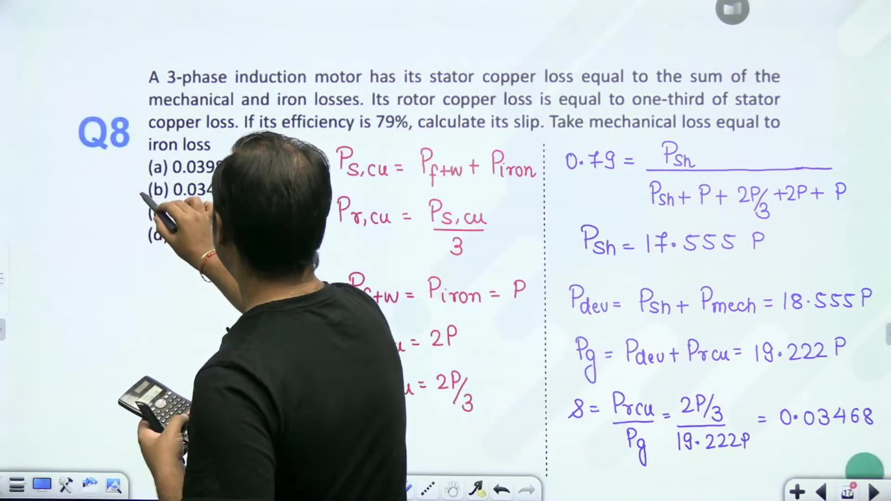

### Algebraic Formulation of Machine Losses

> [!example] Problem 7
> In a 3-phase induction motor, stator copper loss equals the sum of mechanical and iron losses. Rotor copper loss equals one-third of stator copper loss. Mechanical loss equals iron loss. If full-load efficiency is $79\%$, determine the operating slip.

Let mechanical rotational loss and iron loss both equal $P$:

$$P_{\text{mech}} = P_{\text{iron}} = P$$

Stator copper loss is the sum of mechanical and iron losses:

$$P_{\text{scu}} = P_{\text{mech}} + P_{\text{iron}} = 2P$$

Rotor copper loss is one-third of stator copper loss:

$$P_{\text{rcu}} = \frac{1}{3} P_{\text{scu}} = \frac{2P}{3}$$

Total losses in the machine are:

$$\sum P_{\text{loss}} = P + P + 2P + \frac{2P}{3} = \frac{14P}{3}$$

### Shaft Power and Power Flow Ratios

Efficiency is the ratio of shaft output power to total electrical input:

$$\eta = \frac{P_{\text{sh}}}{P_{\text{sh}} + \sum P_{\text{loss}}} = 0.79$$

Rearranging the efficiency equation yields:

$$P_{\text{sh}} = \frac{0.79}{1 - 0.79} \times \left(\frac{14P}{3}\right) = \left(\frac{0.79}{0.21}\right) \times 4.667 P = 17.556 P$$

Gross developed mechanical power includes mechanical losses:

$$P_{\text{dev}} = P_{\text{sh}} + P_{\text{mech}} = 17.556 P + P = 18.556 P$$

Air gap power transferred across the air gap is:

$$P_G = P_{\text{dev}} + P_{\text{rcu}} = 18.556 P + 0.667 P = 19.223 P$$

### Operating Slip Calculation

Operating slip is the ratio of rotor copper loss to air gap power:

$$s = \frac{P_{\text{rcu}}}{P_G} = \frac{2P/3}{19.223 P} = \frac{0.6667}{19.223} = 0.03468$$

> [!success] Calculated Slip
> The operating slip is $s = 0.03468$ ($3.47\%$), corresponding to Option (b).

## Exact T-Equivalent Circuit Parameter Analysis
_(57:10 - 61:53)_

When magnetizing reactance is comparable to branch impedances, the exact T-equivalent circuit must be solved using AC network theorems.

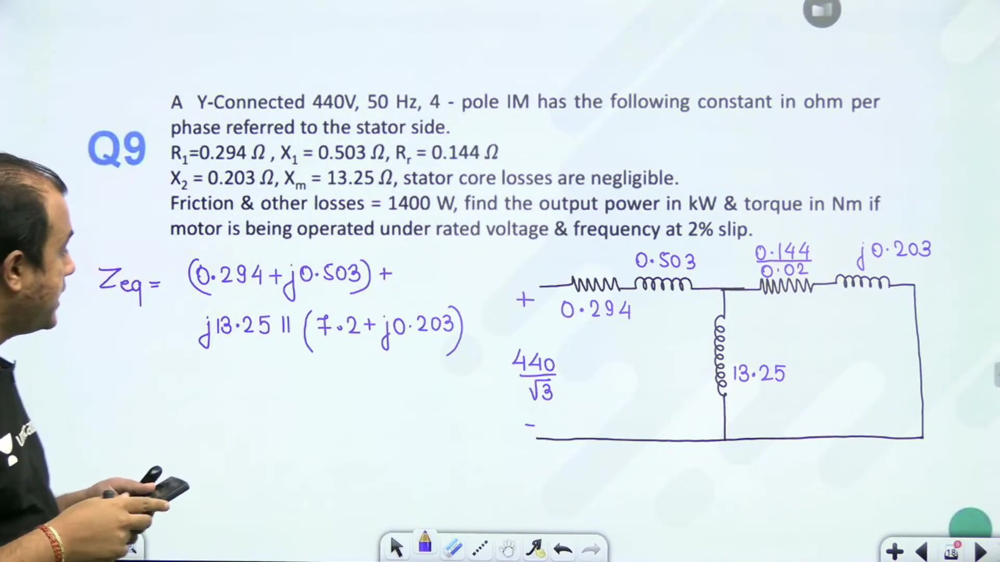

### Equivalent Circuit Parameter Representation

> [!example] Problem 8
> A star-connected, $440\text{ V}$, $50\text{ Hz}$, 4-pole induction motor has parameters per phase referred to stator:
> - $R_1 = 0.294\ \Omega$, $X_1 = 0.503\ \Omega$
> - $R_2' = 0.144\ \Omega$, $X_2' = 0.203\ \Omega$
> - $X_m = 13.25\ \Omega$
> - Rotational loss $= 1400\text{ W}$
> Find output power in $\text{kW}$ and torque in $\text{N-m}$ at rated voltage and $2\%$ slip.

For a star connection, the phase voltage applied across the stator is:

$$V_{\text{ph}} = \frac{V_L}{\sqrt{3}} = \frac{440}{\sqrt{3}} = 254.034\text{ V}$$

At slip $s = 0.02$, the rotor resistance referred to the stator is:

$$\frac{R_2'}{s} = \frac{0.144}{0.02} = 7.2\ \Omega$$

The rotor branch impedance is:

$$Z_2' = 7.2 + j0.203\ \Omega$$

### Total Input Impedance Calculation

The magnetizing branch $j X_m = j13.25\ \Omega$ is connected in parallel with the rotor branch $Z_2'$.

The parallel impedance of the magnetizing and rotor branches is:

$$Z_p = \frac{(j13.25)(7.2 + j0.203)}{7.2 + j(0.203 + 13.25)} = \frac{j13.25(7.2 + j0.203)}{7.2 + j13.453}$$

Adding the series stator impedance $Z_1 = 0.294 + j0.503\ \Omega$ yields total input impedance:

$$Z_{\text{eq}} = Z_1 + Z_p = 6.766 \angle 32.23^\circ\ \Omega$$

### Stator Current and Current Division

The total stator phase current is:

$$I_1 = \frac{V_{\text{ph}}}{Z_{\text{eq}}} = \frac{254.034}{6.766} = 37.545\text{ A}$$

This stator current splits between the magnetizing branch and the rotor branch. By the AC current divider rule:

$$I_2' = I_1 \times \frac{j X_m}{Z_2' + j X_m} = 37.545 \times \frac{j13.25}{7.2 + j13.453}$$

Evaluating the magnitude:

$$|I_2'| = 37.545 \times \frac{13.25}{\sqrt{7.2^2 + 13.453^2}} = 37.545 \times \frac{13.25}{15.258} = 32.60\text{ A}$$

> [!success] Branch Currents
> - Total stator input current: $I_1 = 37.55\text{ A}$
> - Rotor branch current referred to stator: $I_2' = 32.60\text{ A}$

## Torque Calculation and Simplified Series Circuit Modeling
_(62:10 - 67:37)_

We complete the shaft torque evaluation for Problem 8. Then we examine Problem 9 where the magnetizing branch is neglected.

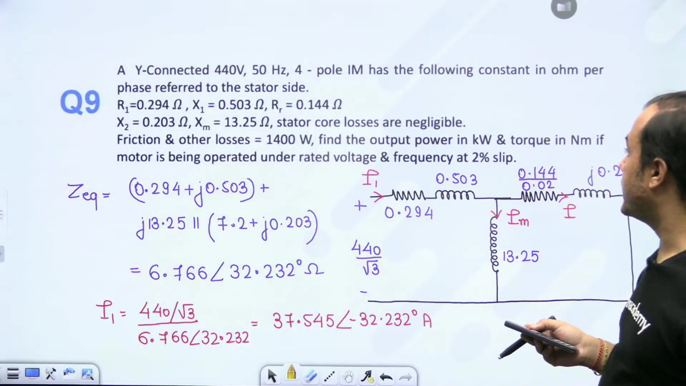

### Shaft Output Power and Torque for Problem 8

With the rotor branch current $I_2' = 32.60\text{ A}$ and effective resistance $R_2'/s = 7.2\ \Omega$, total air gap power is:

$$P_G = 3 (I_2')^2 \left(\frac{R_2'}{s}\right) = 3 \times (32.60)^2 \times 7.2 = 22956\text{ W} \approx 22.956\text{ kW}$$

Gross mechanical developed power is:

$$P_{\text{dev}} = P_G (1 - s) = 22.956 \times (1 - 0.02) = 22.497\text{ kW}$$

The rotational friction and windage loss is $P_{\text{mech}} = 1400\text{ W} = 1.400\text{ kW}$. Net shaft power delivered to the load is:

$$P_{\text{sh}} = P_{\text{dev}} - P_{\text{mech}} = 22.497 - 1.400 = 21.097\text{ kW}$$

For a 4-pole, $50\text{ Hz}$ machine, synchronous speed is $N_s = 1500\text{ rpm}$. The rotor mechanical speed is:

$$N_r = N_s (1 - s) = 1500 \times 0.98 = 1470\text{ rpm}$$

The rotor mechanical angular velocity is:

$$\omega_r = \frac{2\pi \times 1470}{60} = 153.94\text{ rad/s}$$

Net shaft output torque is:

$$T_{\text{sh}} = \frac{P_{\text{sh}}}{\omega_r} = \frac{21097}{153.94} = 137.05\text{ N-m}$$

> [!info] Torque Relations
> - Electromagnetic developed torque:
> $$T_{\text{dev}} = \frac{P_G}{\omega_s} = \frac{P_{\text{dev}}}{\omega_r}$$
> - Useful shaft torque delivered to the load:
> $$T_{\text{sh}} = \frac{P_{\text{sh}}}{\omega_r}$$

### Simplified Series Model Formulation

> [!example] Problem 9
> A star-connected, $440\text{ V}$, $50\text{ Hz}$, 6-pole induction motor has parameters:
> - $R_1 = 0.3\ \Omega$, $X_1 = 0.6\ \Omega$
> - $R_2' = 0.24\ \Omega$, $X_2' = 1.2\ \Omega$
> - Rotational losses $= 500\text{ W}$
> Neglecting the magnetizing branch, find stator current, rotor speed, output torque, and efficiency at $5\%$ slip ($s = 0.05$).

At $s = 0.05$, the equivalent rotor load resistance is:

$$\frac{R_2'}{s} = \frac{0.24}{0.05} = 4.8\ \Omega$$

The total series impedance per phase is:

$$Z_t = (R_1 + \frac{R_2'}{s}) + j(X_1 + X_2') = (0.3 + 4.8) + j(0.6 + 1.2) = 5.1 + j1.8\ \Omega$$

The magnitude and phase of total impedance are:

$$|Z_t| = \sqrt{5.1^2 + 1.8^2} = \sqrt{26.01 + 3.24} = 5.408\ \Omega$$

$$\theta = \tan^{-1}\left(\frac{1.8}{5.1}\right) = 19.44^\circ$$

The phase voltage is $V_{\text{ph}} = 440 / \sqrt{3} = 254.03\text{ V}$.

The stator line current is:

$$I_1 = \frac{V_{\text{ph}}}{|Z_t|} = \frac{254.03}{5.408} = 46.97\text{ A}$$

The synchronous speed is:

$$N_s = \frac{120 \times 50}{6} = 1000\text{ rpm}$$

The rotor runs at mechanical speed:

$$N_r = N_s (1 - s) = 1000 \times (1 - 0.05) = 950\text{ rpm}$$

## Power Stages, Output Torque, and Overall Efficiency
_(67:40 - 76:01)_

We complete the power flow analysis for the series-modeled induction motor without a magnetizing branch.

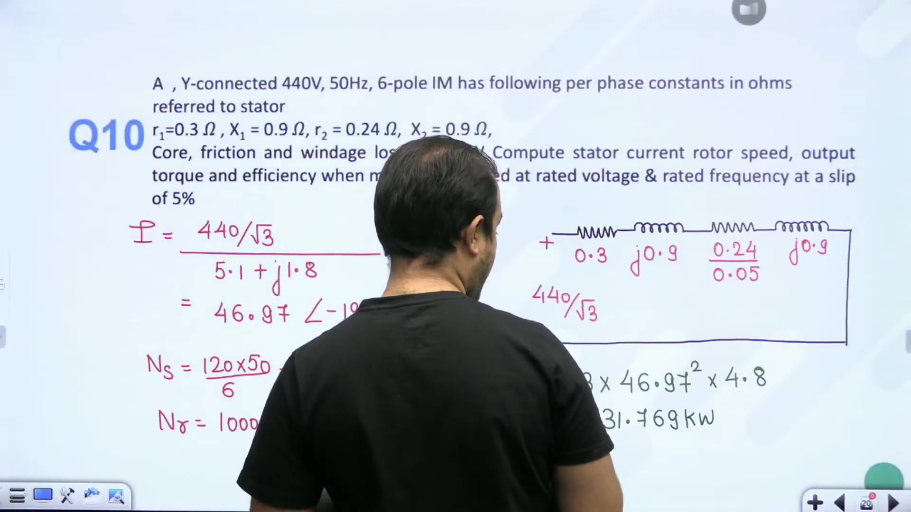

### Air Gap Power and Mechanical Power Developed

The effective resistance representing mechanical load and rotor copper loss is $R_2'/s = 4.8\ \Omega$. With stator current $I_1 = 46.97\text{ A}$, the air gap power transferred to the rotor is:

$$P_G = 3 (I_1)^2 \left(\frac{R_2'}{s}\right) = 3 \times (46.97)^2 \times 4.8 = 31769.3\text{ W} \approx 31.769\text{ kW}$$

Gross mechanical developed power is:

$$P_{\text{dev}} = P_G (1 - s) = 31.769 \times (1 - 0.05) = 31.769 \times 0.95 = 30.181\text{ kW}$$

The rotational friction and windage loss is $P_{\text{mech}} = 500\text{ W} = 0.500\text{ kW}$.

Net useful shaft output power is:

$$P_{\text{sh}} = P_{\text{dev}} - P_{\text{mech}} = 30.181 - 0.500 = 29.681\text{ kW}$$

### Useful Shaft Torque

The rotor mechanical speed is $N_r = 950\text{ rpm}$. The angular velocity is:

$$\omega_r = \frac{2\pi \times 950}{60} = 99.484\text{ rad/s}$$

Net shaft output torque delivered to the mechanical drive is:

$$T_{\text{sh}} = \frac{P_{\text{sh}}}{\omega_r} = \frac{29681}{99.484} = 179.52\text{ N-m}$$

### Total Input Power and Efficiency

Stator copper loss is calculated using stator resistance $R_1 = 0.3\ \Omega$:

$$P_{\text{scu}} = 3 (I_1)^2 R_1 = 3 \times (46.97)^2 \times 0.3 = 1985.58\text{ W} \approx 1.986\text{ kW}$$

Since stator core loss is omitted from the simplified circuit data, the total electrical power supplied to the motor is:

$$P_{\text{in}} = P_G + P_{\text{scu}} = 31.769 + 1.986 = 33.755\text{ kW}$$

The overall efficiency is:

$$\eta = \frac{P_{\text{sh}}}{P_{\text{in}}} \times 100 = \frac{29.681}{33.755} \times 100 = 87.93\%$$

> [!success] Problem 9 Complete Results
> - Stator line current: $I_1 = 46.97\text{ A}$ at $\text{pf} = 0.943\text{ lagging}$
> - Operating rotor speed: $N_r = 950\text{ rpm}$
> - Useful shaft torque: $T_{\text{sh}} = 179.5\text{ N-m}$
> - Overall motor efficiency: $\eta = 87.93\%$

---

## Summary and Key Takeaways

- The rotor EMF oscillation rate $n$ in cycles per minute gives the rotor frequency as $f_r = n / 60\text{ Hz}$, which establishes operating slip via $s = f_r / f$.
- Air gap power $P_G$ links electromagnetic developed torque $T_{\text{dev}}$ and synchronous speed through $P_G = T_{\text{dev}} \omega_s$, while gross developed mechanical power satisfies $P_{\text{dev}} = T_{\text{dev}} \omega_r = (1 - s) P_G$.
- Rotor copper loss is strictly proportional to slip according to $P_{\text{rcu}} = s P_G = [s / (1 - s)] P_{\text{dev}}$.
- In slip-ring induction motors, total rotor electrical loss separates into internal winding copper loss $3 I_r^2 R_2$ and external contact loss in the short-circuiting gear.
- In the normal low-slip operating region, electromagnetic torque satisfies $T_{\text{dev}} \propto s V^2 / f$, requiring operating slip to scale as $s_2 = s_1 (f_2 / f_1) (V_1 / V_2)^2$ under constant developed torque.
- Disturbance calculations for rotor speed must use the updated synchronous speed $N_{s2} = 120 f_2 / P$ in the relation $N_{r2} = N_{s2}(1 - s_2)$.
- Stator core loss in induction machines occurs almost entirely in the stator laminations because slip frequency in the rotor core is very low during normal operation.
- In the exact T-equivalent circuit, total input impedance $Z_{\text{eq}} = Z_1 + (j X_m \parallel Z_2')$ determines stator current, after which current division yields the rotor branch current $I_2'$ for air gap power evaluation.

---

[← Lec 137: Equivalent Circuit 2](Lecture_137_Equivalent_Circuit_2.md) | [🏠 Index](00_yt_study_guide.md) | [Lec 139: Torque Slip Characteristics 1 →](Lecture_139_Torque_Slip_Characteristics_1.md)
