[← Lec 138: Losses and Efficiency of Induction Machines](Lecture_138_Losses_and_Efficiency_of_Induction_Machines.md) | [🏠 Index](00_yt_study_guide.md) | [Lec 140: Torque Slip Characteristics 2 →](Lecture_140_Torque_Slip_Characteristics_2.md)

---

# Torque Slip Characteristics - 1 | Electrical Machines | Lec 100 | GATE & ESE (EE, ECE) | Ankit Goyal

- **Source**: https://www.youtube.com/watch?v=OdA19ldXm7E
- **Duration**: 00:40:00
- **Compiled**: 2026-09-23

---

## Overview

This lecture establishes the complete analytical and graphical treatment of torque-slip characteristics for three-phase induction machines. The stator circuit is reduced to a Thévenin equivalent network to derive closed-form expressions for rotor current, air gap power, and developed electromagnetic torque. The complete torque-speed characteristic is mapped across motoring, generating, and braking regimes. Standard engineering approximations are then developed for both low-slip linear operation and high-slip starting conditions.

## Contents

- [[#Introduction to Torque-Slip Characteristics and Equivalent Circuit Formulation|Introduction to Torque-Slip Characteristics and Equivalent Circuit Formulation]]
- [[#Thévenin Equivalent Circuit of the Stator Network|Thévenin Equivalent Circuit of the Stator Network]]
- [[#General Developed Torque Equation Using Thévenin Parameters|General Developed Torque Equation Using Thévenin Parameters]]
- [[#Complete Torque-Speed Characteristic and Modes of Operation|Complete Torque-Speed Characteristic and Modes of Operation]]
- [[#Generating Mode, Braking (Plugging), and Approximate Circuit Assumptions|Generating Mode, Braking (Plugging), and Approximate Circuit Assumptions]]
- [[#Approximate Developed Torque Formula and Voltage Dependence|Approximate Developed Torque Formula and Voltage Dependence]]
- [[#Low-Slip Linear Region, High-Slip Region, and Starting Torque|Low-Slip Linear Region, High-Slip Region, and Starting Torque]]
- [[#Comprehensive Summary of Induction Motor Torque Formulas|Comprehensive Summary of Induction Motor Torque Formulas]]

---

## Introduction to Torque-Slip Characteristics and Equivalent Circuit Formulation
_(00:12 - 05:14)_

### Physical Significance of Torque-Speed Relationships

In previous lectures, we developed the per-phase equivalent circuit of the three-phase induction motor. We also mapped power flows through stator copper loss, core loss, air gap power, rotor copper loss, and shaft output. The most important performance curve for any electric motor is its torque-speed characteristic. 

In DC machines, we plotted speed against torque to see how motor speed drops as mechanical load rises. Ideally, a motor should exhibit zero speed regulation. Its speed would remain strictly constant regardless of load torque. Real machines slow down as torque increases. In an induction machine, we plot electromagnetic torque against slip rather than mechanical speed. Because rotor speed directly maps to slip, this plot is called the torque-slip characteristic.

### Formulations for Developed Electromagnetic Torque

We can calculate developed torque $T_{\text{dev}}$ in two ways:

$$T_{\text{dev}} = \frac{P_{\text{dev}}}{\omega_r}$$

Here $P_{\text{dev}}$ is mechanical power developed by the rotor, and $\omega_r$ is rotor angular velocity in radians per second. Alternatively, we can use air gap power:

$$T_{\text{dev}} = \frac{P_G}{\omega_s}$$

Here $P_G$ is air gap power across the magnetic field, and $\omega_s$ is synchronous angular speed:

$$\omega_s = \frac{2\pi N_s}{60} = \frac{4\pi f}{P}\text{ rad/s}$$

Both definitions yield identical numerical values because $P_{\text{dev}} = (1 - s) P_G$ and $\omega_r = (1 - s) \omega_s$.

In circuit analysis, the second formula is far easier to evaluate. In the per-phase equivalent circuit referred to the stator, air gap power corresponds to the real power absorbed by the fictitious resistance $r_2'/s$:

$$P_G = 3 (I_2')^2 \left(\frac{r_2'}{s}\right)$$

Dividing this active power by synchronous speed $\omega_s$ gives developed torque directly.

### Simplifying the Per-Phase Stator Circuit

The exact equivalent circuit contains a stator series branch $R_1 + j x_1$, a shunt magnetizing branch $R_c \parallel j X_m$, and the referred rotor branch $j x_2' + r_2'/s$. 

In practical induction machines, magnetizing current $I_\mu$ is much larger than core-loss current $I_w$. Typical values show $I_\mu$ reaching thirty to fifty percent of rated current. Core loss resistance $R_c$ is very large compared to $X_m$. We safely neglect $R_c$ and omit the core-loss resistor from the shunt branch.

> [!info] Circuit Assumptions
> Stator voltage $V_1$ is always taken as the per-phase supply voltage. Core loss resistance $R_c$ is omitted because $I_\mu \gg I_w$. To determine the rotor current $I_2'$, we reduce the network to the left of the rotor branch into a Thévenin equivalent circuit.

## Thévenin Equivalent Circuit of the Stator Network
_(05:14 - 10:07)_

### Derivation of Thévenin Voltage

To find the rotor current, we disconnect the rotor branch $r_2'/s + j x_2'$ and determine the Thévenin equivalent across those open terminals.

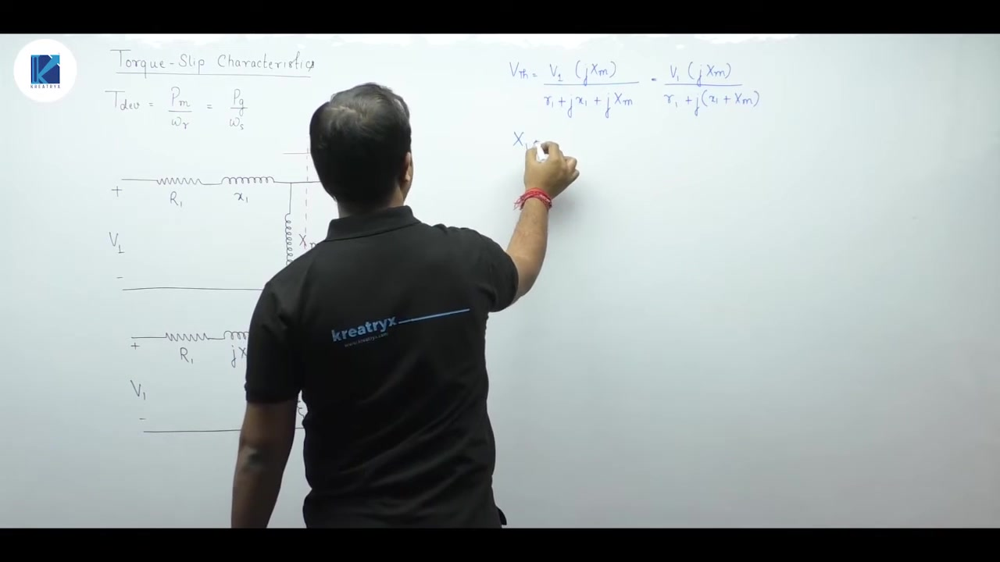

The open-circuit voltage $V_{th}$ across the magnetizing branch is obtained by voltage division:

$$V_{th} = V_1 \frac{j X_m}{R_1 + j (x_1 + X_m)}$$

Here $x_1$ is the stator leakage reactance and $X_m$ is the magnetizing reactance. We define the total stator standstill reactance as:

$$X_1 = x_1 + X_m$$

Substituting $X_1$ into the voltage expression yields:

$$V_{th} = V_1 \frac{j X_m}{R_1 + j X_1}$$

In practical induction machines, $X_m$ ranges between $200\ \Omega$ and $300\ \Omega$. By contrast, stator resistance $R_1$ is typically only $0.1\ \Omega$ to $0.5\ \Omega$. Because $R_1 \ll X_1$, we neglect $R_1$ in the denominator. The Thévenin voltage magnitude simplifies to:

> [!success] Thévenin Voltage Formula
> $$V_{th} \approx V_1 \frac{X_m}{X_1} = V_1 \frac{X_m}{x_1 + X_m}$$

### Derivation of Thévenin Impedance

To determine Thévenin impedance $Z_{th}$, we turn off the independent stator voltage source $V_1$ by replacing it with a short circuit.

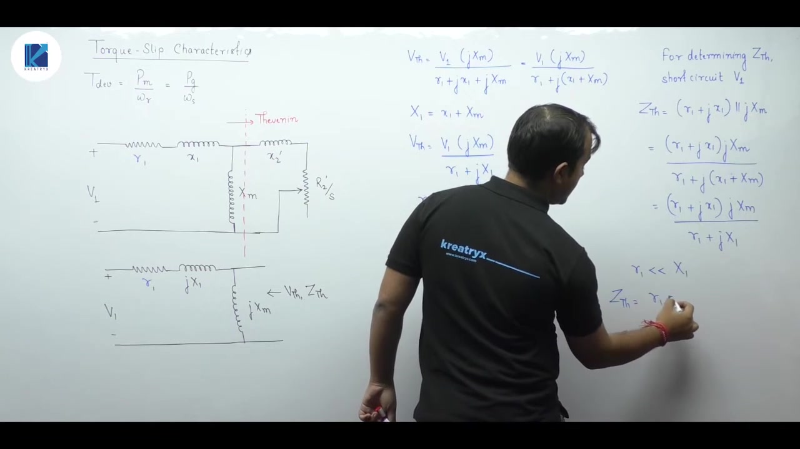

With $V_1 = 0$, the stator branch $R_1 + j x_1$ appears in parallel with the magnetizing branch $j X_m$:

$$Z_{th} = (R_1 + j x_1) \parallel j X_m = \frac{(R_1 + j x_1) j X_m}{R_1 + j (x_1 + X_m)}$$

Substituting $X_1 = x_1 + X_m$ gives:

$$Z_{th} = \frac{(R_1 + j x_1) j X_m}{R_1 + j X_1}$$

Using the same valid approximation $R_1 \ll X_1$, the denominator reduces to $j X_1$. The $j$ factor in numerator and denominator cancels out:

$$Z_{th} \approx \frac{(R_1 + j x_1) j X_m}{j X_1} = (R_1 + j x_1) \frac{X_m}{X_1}$$

Separating this into real and imaginary components yields the Thévenin parameters:

> [!success] Thévenin Resistance and Reactance
> $$R_{th} = R_1 \frac{X_m}{X_1} = R_1 \frac{X_m}{x_1 + X_m}$$
> $$X_{th} = x_1 \frac{X_m}{X_1} = x_1 \frac{X_m}{x_1 + X_m}$$

Both $R_1$ and $x_1$ are scaled down by the ratio $X_m / (x_1 + X_m)$. Because $X_m$ is much larger than $x_1$, this ratio is typically between $0.90$ and $0.97$.

## General Developed Torque Equation Using Thévenin Parameters
_(10:12 - 14:48)_

### Single-Loop Circuit Model

Replacing the stator network by its Thévenin equivalent turns the motor circuit into a simple single series loop.

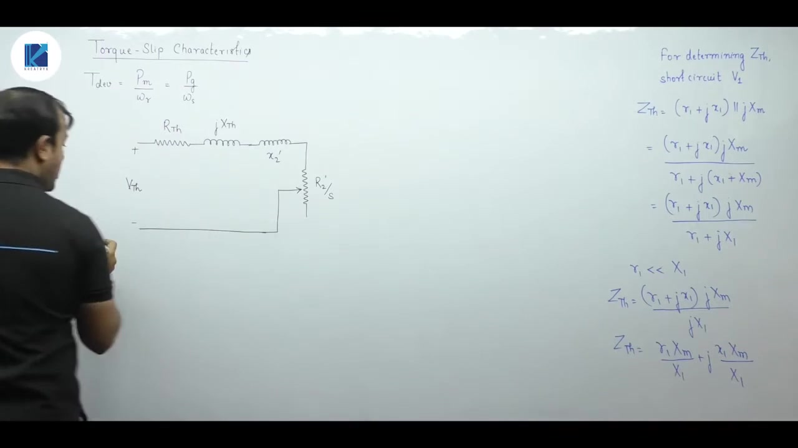

The loop consists of the Thévenin source $V_{th}$, Thévenin impedance $R_{th} + j X_{th}$, and the rotor branch $r_2'/s + j x_2'$. 

We recap the Thévenin voltage parameter:

$$V_{th} = V_1 \left(\frac{X_m}{x_1 + X_m}\right)$$

The Thévenin equivalent resistance is expressed as:

$$R_{th} = R_1 \left(\frac{X_m}{x_1 + X_m}\right)$$

Similarly, the Thévenin equivalent reactance is given by:

$$X_{th} = x_1 \left(\frac{X_m}{x_1 + X_m}\right)$$

Here $x_1$ and $x_2'$ are stator and rotor leakage reactances at line frequency.

### Calculation of Referred Rotor Current

The referred rotor current $I_2'$ flows through the loop. 

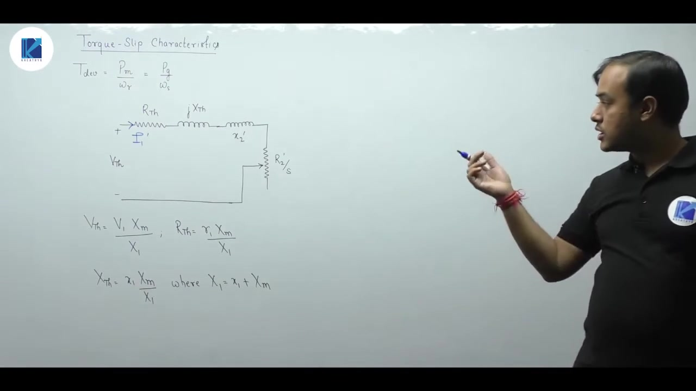

Applying Ohm's law gives:

$$I_2' = \frac{V_{th}}{\left(R_{th} + \frac{r_2'}{s}\right) + j (X_{th} + x_2')}$$

The magnitude of this current is:

$$|I_2'| = \frac{V_{th}}{\sqrt{\left(R_{th} + \frac{r_2'}{s}\right)^2 + (X_{th} + x_2')^2}}$$

### Air Gap Power and Developed Torque Derivation

Total air gap power $P_G$ across all three phases equals the total active power dissipated in $r_2'/s$:

$$P_G = 3 |I_2'|^2 \left(\frac{r_2'}{s}\right)$$

Substituting the current magnitude squared yields:

$$P_G = \frac{3 V_{th}^2 \left(\frac{r_2'}{s}\right)}{\left(R_{th} + \frac{r_2'}{s}\right)^2 + (X_{th} + x_2')^2}$$

Electromagnetic torque $T_{\text{dev}}$ is obtained by dividing air gap power by synchronous angular velocity $\omega_s$:

$$T_{\text{dev}} = \frac{P_G}{\omega_s}$$

This yields the complete general torque equation for the three-phase induction motor:

> [!success] General Developed Torque Equation
> $$T_{\text{dev}} = \frac{3}{\omega_s} \frac{V_{th}^2 \left(\frac{r_2'}{s}\right)}{\left(R_{th} + \frac{r_2'}{s}\right)^2 + (X_{th} + x_2')^2}$$

This formula accounts for stator resistance and leakage reactance through $R_{th}$ and $X_{th}$. While practical numerical problems often use approximations, this general form covers all machine conditions.

## Complete Torque-Speed Characteristic and Modes of Operation
_(15:04 - 21:16)_

### Core Losses in Power Flow Calculations

If core losses are specified as a power loss rather than circuit parameters, do not force them into $Z_{th}$. Use the standard power flow diagram instead. Subtract stator copper and core losses from electrical input power to find air gap power $P_G$. Then divide by synchronous speed:

$$T_{\text{dev}} = \frac{P_G}{\omega_s}$$

This provides the exact electromagnetic torque developed by the machine.

### Constructing the Torque-Speed Characteristic Curve

Developed torque depends directly on slip $s$. Rotor speed $N_r$ and slip $s$ are related by:

$$s = \frac{N_s - N_r}{N_s}$$

$$N_r = N_s (1 - s)$$

Plotting torque against rotor speed from $-N_s$ to $2 N_s$ maps slip from $s = 2$ down to $s = -1$.

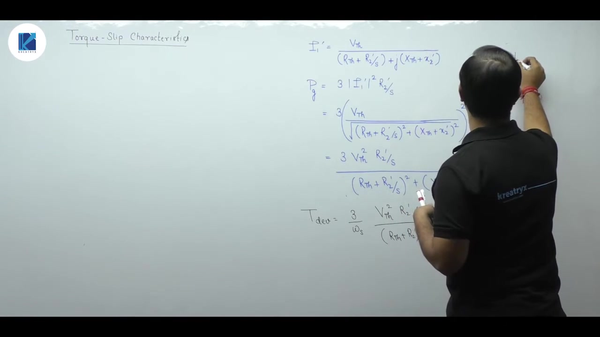

As speed increases from left to right, slip decreases. At standstill ($N_r = 0$), slip is $s = 1$. At synchronous speed ($N_r = N_s$), slip is $s = 0$. At reverse synchronous speed ($N_r = -N_s$), slip reaches $s = 2$.

### The Three Operating Regimes

The characteristic divides into three distinct operational zones based on slip:

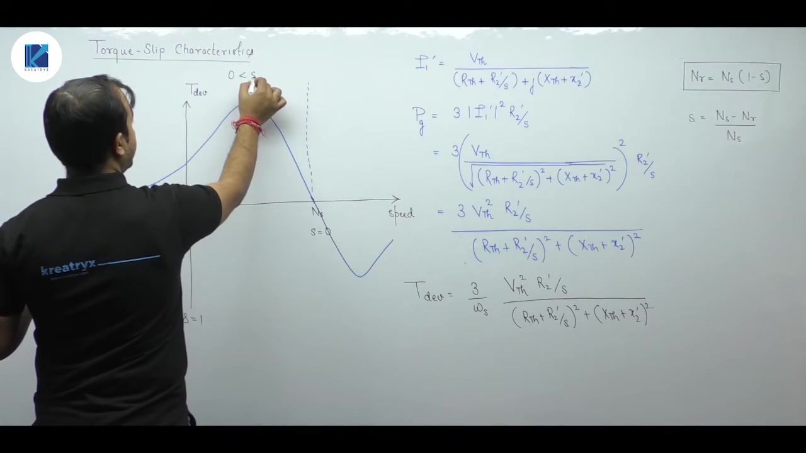

1. **Motoring Mode ($0 < s < 1$):**
   Rotor speed lies between zero and synchronous speed ($0 < N_r < N_s$). The rotor turns in the same direction as the stator rotating magnetic field. Torque is positive and drives the mechanical load.

2. **Generating Mode ($s < 0$):**
   Rotor speed exceeds synchronous speed ($N_r > N_s$). An external prime mover drives the shaft above synchronous speed. Developed torque turns negative, opposing the drive and delivering electrical power to the AC supply.

3. **Braking Mode or Plugging ($s > 1$):**
   Rotor rotates in the direction opposite to the stator field ($N_r < 0$). Developed torque acts in the forward direction, opposing rotor rotation and quickly bringing the shaft to rest.

### Salient Operating Points on the Motoring Curve

The motoring curve contains critical operational landmarks:

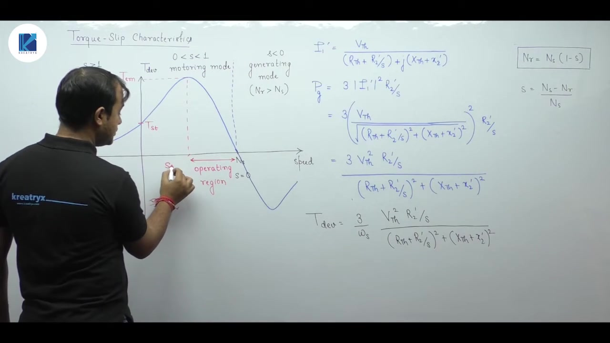

- **Starting Torque ($T_{\text{st}}$):** The torque produced at zero rotor speed ($s = 1$).
- **Maximum Developed Torque ($T_{\text{max}}$):** The peak torque, also called breakdown or pull-out torque. The slip at this peak is denoted $s_{mT}$.
- **Zero Torque Point:** At $s = 0$ ($N_r = N_s$), relative motion between rotor conductors and stator field vanishes, so developed torque is zero.
- **Stable Operating Region:** The region between synchronous speed and breakdown slip ($0 \le s \le s_{mT}$) is stable. If load torque rises, motor speed drops slightly, slip increases, and motor torque increases to match the load.

## Generating Mode, Braking (Plugging), and Approximate Circuit Assumptions
_(21:16 - 26:24)_

### Generating Mode ($s < 0$)

When the rotor is driven above synchronous speed ($N_r > N_s$) by an external prime mover, slip becomes negative:

$$s = \frac{N_s - N_r}{N_s} < 0$$

The rotor cuts the stator rotating magnetic field in reverse relative to motoring operation. The induced rotor currents reverse direction, and electromagnetic torque becomes negative. The machine delivers active electrical power back to the AC grid through its stator terminals. 

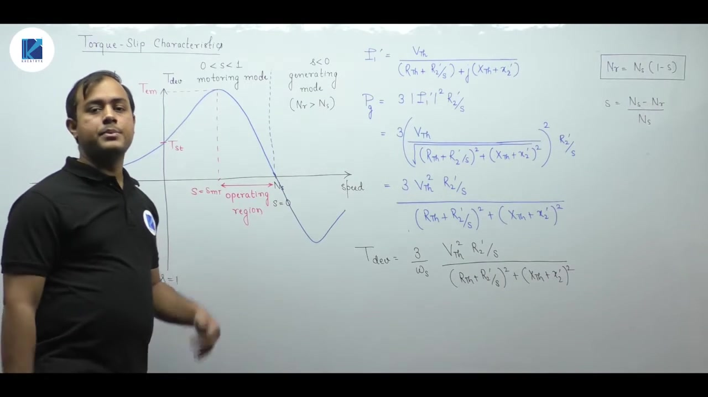

Because an induction generator cannot establish its own excitation, its stator must remain connected to an AC grid or constant-frequency busbar. The external grid supplies the reactive magnetizing power $Q$ needed to sustain the air gap flux while receiving active electrical power $P$ from the machine.

### Braking Mode and Plugging ($s > 1$)

In the braking region, slip exceeds unity ($s > 1$). 

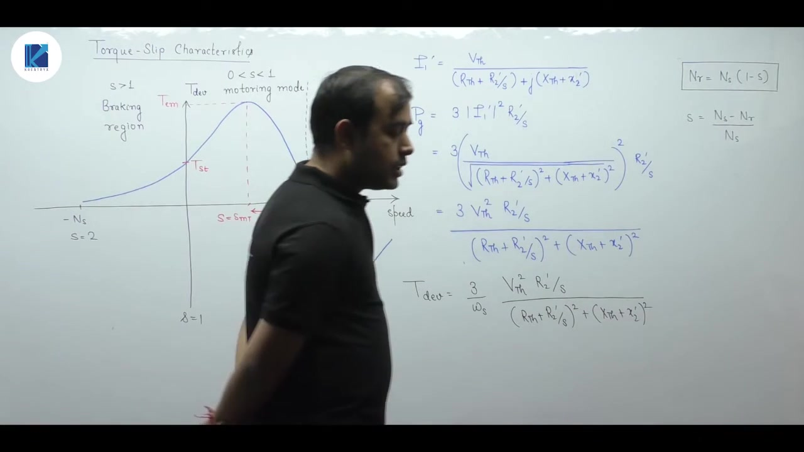

Slip exceeds 1 whenever rotor speed $N_r$ is negative relative to the stator rotating field:

$$s = \frac{N_s - (-N_r)}{N_s} = \frac{N_s + N_r}{N_s} > 1$$

In practice, this mode is created by a process called plugging. While the motor runs forward in the clockwise direction, two supply leads to the stator are swapped. Reversing the phase sequence instantly reverses the stator rotating magnetic field. 

Mechanical inertia prevents the heavy rotor from reversing instantly. The rotor continues spinning forward while the field sweeps backward. The rotor and magnetic field now rotate in opposite directions. The machine produces strong counter-torque that rapidly decelerates the rotor to a stop.

### Approximate Analysis: Neglecting Stator Impedance

Engineering exams often do not supply stator resistance $R_1$ or leakage reactance $x_1$. In those cases, we neglect stator impedance entirely.

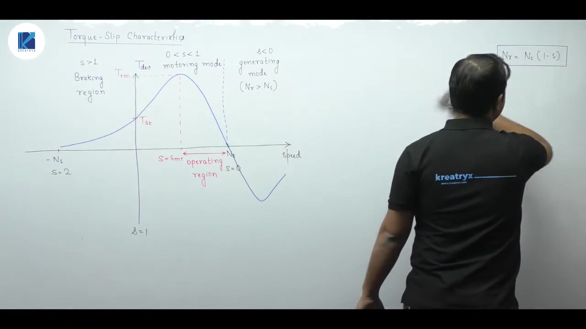

We apply two simplifications:
1. The stator series impedance is set to zero: $R_1 \to 0$ and $x_1 \to 0$. This treats the series stator branch as a short circuit.
2. The magnetizing branch impedance is considered very large: $X_m \to \infty$. This treats the shunt branch as an open circuit.

Under these conditions, full stator supply voltage $V_1$ drops directly across the rotor branch.

## Approximate Developed Torque Formula and Voltage Dependence
_(26:26 - 31:42)_

### Evaluation of Approximate Thévenin Parameters

When stator resistance and leakage reactance are neglected ($R_1 \to 0$ and $x_1 \to 0$), the Thévenin parameters simplify drastically. 

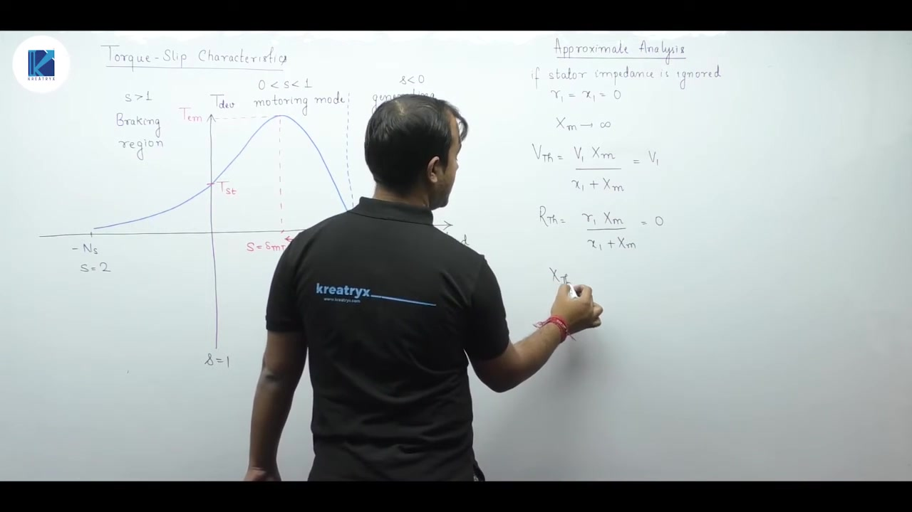

The open-circuit voltage becomes:

$$V_{th} = V_1 \left(\frac{X_m}{0 + X_m}\right) = V_1$$

The Thévenin resistance becomes:

$$R_{th} = 0 \left(\frac{X_m}{0 + X_m}\right) = 0$$

The Thévenin reactance becomes:

$$X_{th} = 0 \left(\frac{X_m}{0 + X_m}\right) = 0$$

These identical parameters hold even if magnetizing reactance $X_m$ is finite. As long as $R_1 \to 0$ and $x_1 \to 0$, $V_{th}$ equals phase voltage $V_1$, and both $R_{th}$ and $X_{th}$ vanish.

### Simplified Approximate Torque Equation

Substituting $V_{th} = V_1$, $R_{th} = 0$, and $X_{th} = 0$ into the general torque equation yields:

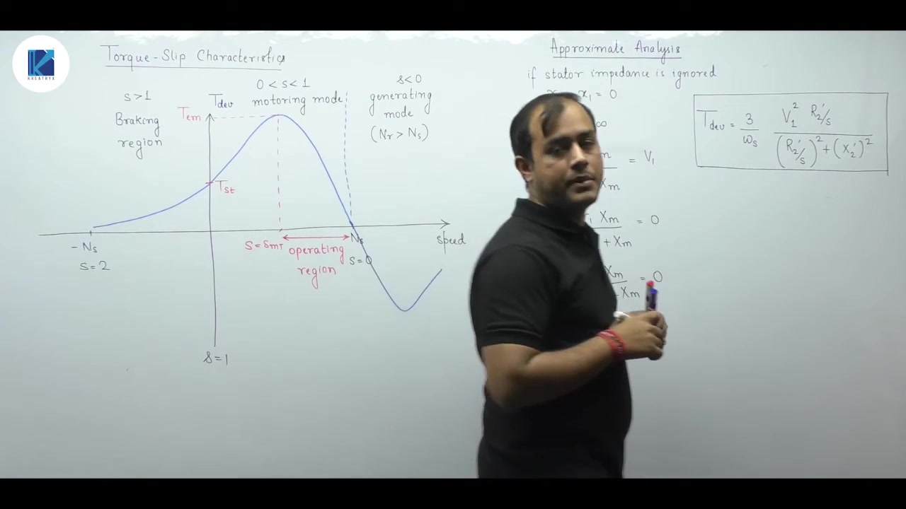

> [!success] Approximate Developed Torque Equation
> $$T_{\text{dev}} = \frac{3}{\omega_s} \frac{V_1^2 \left(\frac{r_2'}{s}\right)}{\left(\frac{r_2'}{s}\right)^2 + (x_2')^2}$$

Here $\omega_s$ is the synchronous angular speed:

$$\omega_s = \frac{2\pi N_s}{60} = \frac{4\pi f}{P}\text{ rad/s}$$

This equation is used in most competitive examinations because stator impedance is frequently omitted in problem statements.

### Voltage Squared Dependence and Stator Connection Convention

The approximate formula highlights that developed electromagnetic torque is directly proportional to the square of per-phase supply voltage:

$$T_{\text{dev}} \propto V_1^2$$

A slight drop in supply voltage causes a significant reduction in developed torque. A ten percent decrease in terminal voltage produces roughly a nineteen percent drop in developed torque.

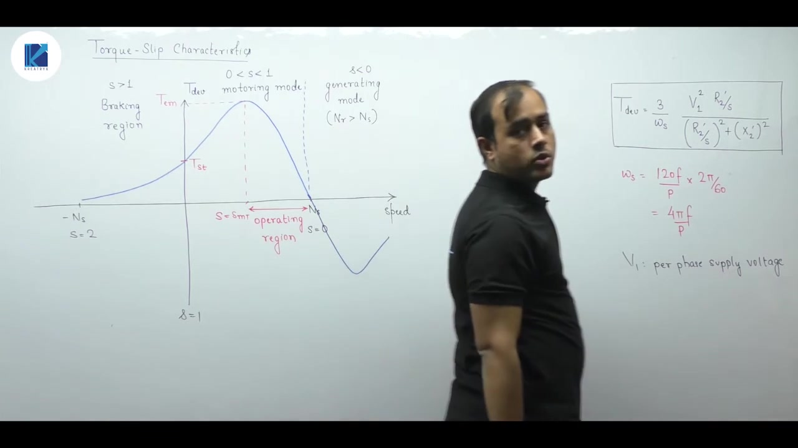

To maximize torque, per-phase voltage $V_1$ should be as high as possible. In a delta ($\Delta$) connection, the phase voltage equals the line voltage ($V_{\text{ph}} = V_L$). In a star ($\text{Y}$) connection, phase voltage is reduced by $\sqrt{3}$ ($V_{\text{ph}} = V_L / \sqrt{3}$). 

> [!info] Standard Default Assumption
> If a problem does not specify the stator winding connection, always assume the stator is delta connected. Delta connection provides full line voltage across each phase winding, maximizing developed electromagnetic torque.

## Low-Slip Linear Region, High-Slip Region, and Starting Torque
_(31:47 - 37:39)_

### Low-Slip Linear Region ($0 < s \le s_{mT}$)

In the normal operating range near synchronous speed, slip $s$ is very small. Typical full-load slip values range from $0.01$ to $0.05$. 

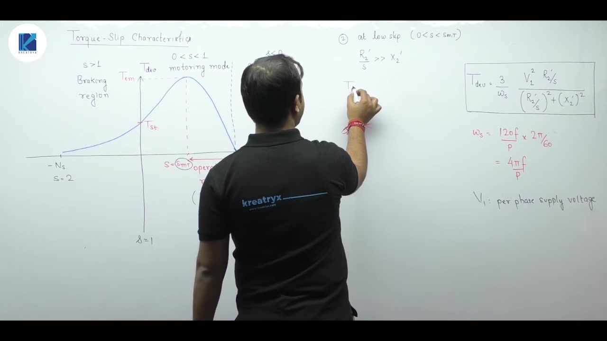

Because $s$ is tiny, the term $r_2'/s$ becomes very large compared to rotor leakage reactance $x_2'$:

$$\frac{r_2'}{s} \gg x_2'$$

In the denominator of the approximate torque equation, $(x_2')^2$ is negligible compared to $(r_2'/s)^2$. 

The equation simplifies directly:

$$T_{\text{dev}} \approx \frac{3}{\omega_s} \frac{V_1^2 \left(\frac{r_2'}{s}\right)}{\left(\frac{r_2'}{s}\right)^2}$$

Canceling one $r_2'/s$ term from numerator and denominator gives:

> [!success] Linear Region Torque Equation
> $$T_{\text{dev}} \approx \frac{3}{\omega_s} \frac{V_1^2}{r_2'} s$$

In this region, developed torque is directly proportional to slip ($T_{\text{dev}} \propto s$). The torque-slip curve is nearly a straight line from zero speed up to breakdown slip $s_{mT}$. If a problem states that the motor operates in its linear region, use this formula directly.

### High-Slip Region ($s_{mT} < s \le 1$)

Beyond breakdown slip toward standstill, slip approaches unity. In electrical machines, winding resistance is always much smaller than leakage reactance ($r_2' \ll x_2'$). 

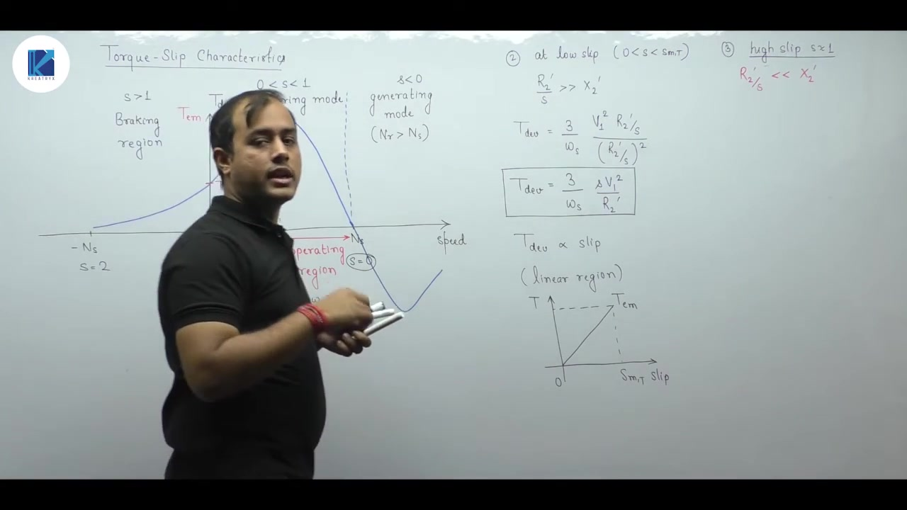

When slip is near 1, $r_2'/s \approx r_2'$. Therefore, $r_2'/s$ is much smaller than $x_2'$:

$$\frac{r_2'}{s} \ll x_2'$$

In the denominator, $(r_2'/s)^2$ is now negligible compared to $(x_2')^2$. 

The torque equation becomes:

$$T_{\text{dev}} \approx \frac{3}{\omega_s} \frac{V_1^2 \left(\frac{r_2'}{s}\right)}{(x_2')^2} = \frac{3}{\omega_s} \frac{V_1^2 r_2'}{s (x_2')^2}$$

Here developed torque is inversely proportional to slip ($T_{\text{dev}} \propto 1/s$). The characteristic curve droops nonlinearly in this high-slip region.

### Starting Torque and Rotor Resistance Dependence

At standstill, the rotor speed is zero and slip is exactly unity ($s = 1$). 

Substituting $s = 1$ into the high-slip expression gives starting torque $T_{\text{st}}$:

$$T_{\text{st}} \approx \frac{3}{\omega_s} \frac{V_1^2 r_2'}{(x_2')^2}$$

This shows a fundamental physical law of induction motors:

> [!success] Starting Torque Proportionality
> $$T_{\text{st}} \propto r_2'$$

Starting torque is directly proportional to rotor circuit resistance. To obtain high starting torque, rotor resistance must be high at start.

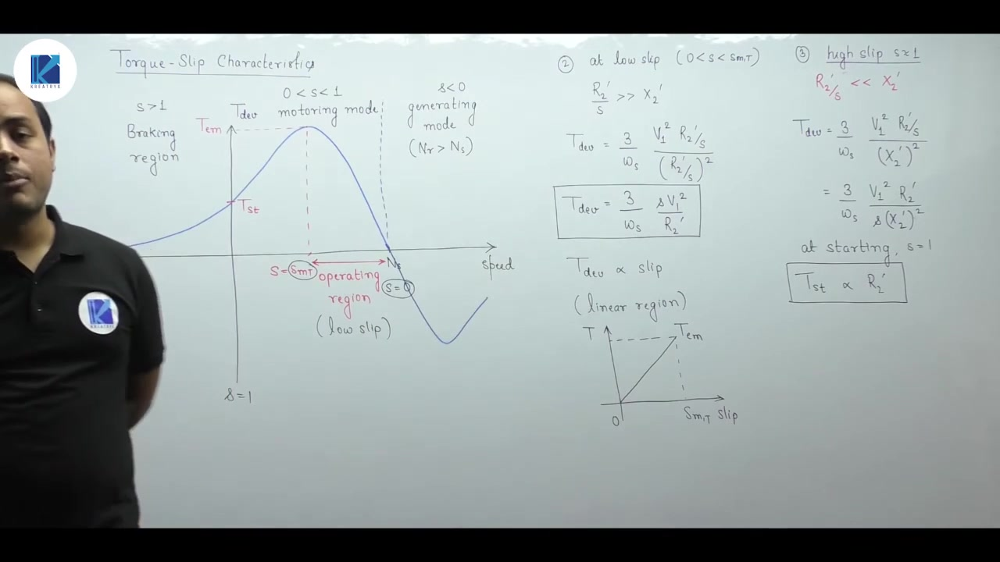

In a wound-rotor (slip-ring) induction motor, external rheostats are easily inserted into the rotor circuit via slip rings to boost starting torque. In squirrel-cage motors, rotor bars are permanently short-circuited by end rings, making external resistance insertion impossible. 

This same principle applies when starting synchronous motors using damper windings: damper bar resistance is designed high to produce strong breakaway starting torque.

## Comprehensive Summary of Induction Motor Torque Formulas
_(37:40 - 39:52)_

### The Hierarchy of Torque Equations

We have derived three main formulas for developed electromagnetic torque in an induction machine. Knowing when to apply each formula is essential for efficient problem solving.

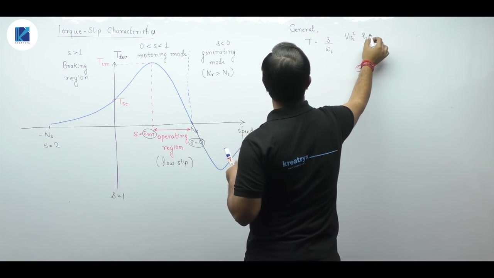

#### 1. Exact Thévenin Formula

Use this formula when stator parameters $R_1$ and $x_1$ are explicitly given:

$$T_{\text{dev}} = \frac{3}{\omega_s} \frac{V_{th}^2 \left(\frac{r_2'}{s}\right)}{\left(R_{th} + \frac{r_2'}{s}\right)^2 + (X_{th} + x_2')^2}$$

Here the Thévenin parameters are defined by:

$$V_{th} = V_1 \left(\frac{X_m}{x_1 + X_m}\right)$$

The resistance and reactance components are:

$$R_{th} = R_1 \left(\frac{X_m}{x_1 + X_m}\right), \quad X_{th} = x_1 \left(\frac{X_m}{x_1 + X_m}\right)$$

#### 2. Stator Impedance Neglected ($R_1 = 0, x_1 = 0$)

Use this formula when stator impedance is not provided or explicitly neglected:

$$T_{\text{dev}} = \frac{3}{\omega_s} \frac{V_1^2 \left(\frac{r_2'}{s}\right)}{\left(\frac{r_2'}{s}\right)^2 + (x_2')^2}$$

Here $V_1$ is the per-phase supply voltage, and $\omega_s = 4\pi f / P\text{ rad/s}$.

#### 3. Low-Slip Linear Region Formula ($0 < s \le s_{mT}$)

Use this approximation only when the motor operates near synchronous speed in its normal load range:

$$T_{\text{dev}} \approx \frac{3}{\omega_s} \frac{V_1^2}{r_2'} s$$

In this region, developed torque varies linearly with slip ($T_{\text{dev}} \propto s$).

### Practical Application Guidelines

When solving numerical problems, check the given data carefully before picking an equation:

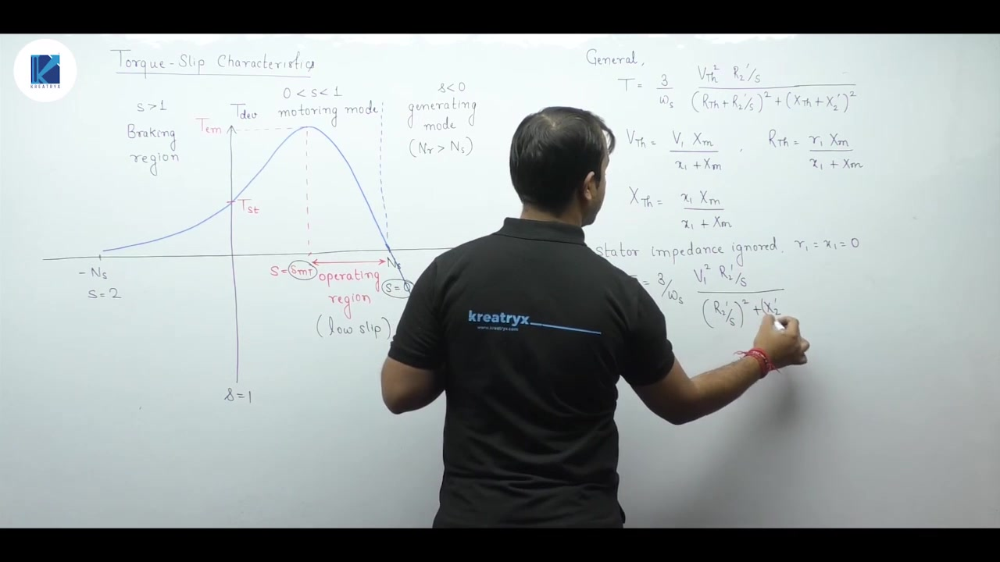

> [!info] Decision Rules for Torque Equations
> - If stator resistance and reactance are given, evaluate $V_{th}$, $R_{th}$, and $X_{th}$, then use the exact formula.
> - If stator impedance is omitted, assume $R_1 = 0$ and $x_1 = 0$, then use the approximate formula with $V_1$.
> - If the problem specifies operation in the low-slip linear region, first verify that slip satisfies $0 < s \le s_{mT}$, then use $T_{\text{dev}} \propto s$. Never apply the linear formula beyond breakdown slip.

---

## Summary and Key Takeaways

- Developed electromagnetic torque is obtained by dividing three-phase air gap power by synchronous angular velocity: $T_{\text{dev}} = P_G / \omega_s$.
- Thévenin reduction of the stator network yields $V_{th} \approx V_1 [X_m / (x_1 + X_m)]$, $R_{th} \approx R_1 [X_m / (x_1 + X_m)]$, and $X_{th} \approx x_1 [X_m / (x_1 + X_m)]$.
- The exact general torque formula is $T_{\text{dev}} = \frac{3}{\omega_s} \frac{V_{th}^2 (r_2'/s)}{(R_{th} + r_2'/s)^2 + (X_{th} + x_2')^2}$.
- An induction machine operates in motoring mode for $0 < s < 1$, generating mode for $s < 0$, and braking (plugging) mode for $s > 1$.
- Plugging is initiated by swapping two stator supply phases, making the stator field rotate opposite to the rotor and yielding slips between $1 < s \le 2$.
- Neglecting stator impedance ($R_1 = 0, x_1 = 0$) simplifies the torque equation to $T_{\text{dev}} = \frac{3}{\omega_s} \frac{V_1^2 (r_2'/s)}{(r_2'/s)^2 + (x_2')^2}$, showing $T_{\text{dev}} \propto V_1^2$.
- In the low-slip region ($0 \le s \le s_{mT}$), $r_2'/s \gg x_2'$, resulting in a linear torque-slip relationship: $T_{\text{dev}} \approx \frac{3}{\omega_s} \frac{V_1^2}{r_2'} s$.
- Starting torque ($s = 1$) is directly proportional to rotor circuit resistance: $T_{\text{st}} \propto r_2'$.

---

[← Lec 138: Losses and Efficiency of Induction Machines](Lecture_138_Losses_and_Efficiency_of_Induction_Machines.md) | [🏠 Index](00_yt_study_guide.md) | [Lec 140: Torque Slip Characteristics 2 →](Lecture_140_Torque_Slip_Characteristics_2.md)
