# Electrical Machines | Lec 101 | Torque Slip Characteristics -2 | GATE Electrical Engineering

- **Source**: https://www.youtube.com/watch?v=aBFWdvuxu7c
- **Duration**: 00:50:20
- **Compiled**: 2026-09-23

---

## Overview

This lecture examines torque-slip and torque-speed relationships in three-phase induction machines.
It establishes the maximum torque condition using the Maximum Power Transfer Theorem applied across the rotor resistance branch.
The discussion demonstrates why maximum breakdown torque is independent of rotor resistance while the breakdown slip varies proportionally with resistance.
It details starting torque behavior across different rotor slot geometries and determines the required external rotor resistance to achieve maximum torque at standstill.
Finally, the lecture develops normalized torque ratio expressions relating operating torque, starting torque, full-load torque, and maximum breakdown torque.

## Contents

- [[#Recapitulation of Developed Torque and Graphical Inversion|Recapitulation of Developed Torque and Graphical Inversion]]
- [[#Speed vs. Torque Characteristics and Maximum Torque Formulation|Speed vs. Torque Characteristics and Maximum Torque Formulation]]
- [[#Analytical Derivation of Maximum Torque and Breakdown Slip|Analytical Derivation of Maximum Torque and Breakdown Slip]]
- [[#Effect of Rotor Resistance on Breakdown Torque and Starting Torque Fundamentals|Effect of Rotor Resistance on Breakdown Torque and Starting Torque Fundamentals]]
- [[#Starting Heavy Loads and Approximate Starting Torque|Starting Heavy Loads and Approximate Starting Torque]]
- [[#Influence of Leakage Reactance and Maximum Starting Torque|Influence of Leakage Reactance and Maximum Starting Torque]]
- [[#Torque Ratio Formulas and Operating Points|Torque Ratio Formulas and Operating Points]]
- [[#Torque Ratios via Current and Lecture Summary|Torque Ratios via Current and Lecture Summary]]

---

## Recapitulation of Developed Torque and Graphical Inversion
_(00:18 - 06:07)_

### Review of Core Torque Expressions

In the previous lecture, we derived developed electromagnetic torque from the Thévenin equivalent circuit of a three-phase induction motor:

The general torque formula is:

$$T_{\text{dev}} = \frac{3}{\omega_s} \frac{V_{th}^2 \left(\frac{r_2'}{s}\right)}{\left(R_{th} + \frac{r_2'}{s}\right)^2 + (X_{th} + x_2')^2}$$

Here the Thévenin parameters are defined by:

$$V_{th} = V_1 \left(\frac{X_m}{x_1 + X_m}\right)$$

$$R_{th} = R_1 \left(\frac{X_m}{x_1 + X_m}\right), \quad X_{th} = x_1 \left(\frac{X_m}{x_1 + X_m}\right)$$

When stator impedance is neglected ($R_1 = 0, x_1 = 0$), the Thévenin terms reduce to $V_{th} = V_1$, $R_{th} = 0$, and $X_{th} = 0$. 

The torque expression simplifies to:

$$T_{\text{dev}} = \frac{3}{\omega_s} \frac{V_1^2 \left(\frac{r_2'}{s}\right)}{\left(\frac{r_2'}{s}\right)^2 + (x_2')^2}$$

In the low-slip linear region ($0 < s \le s_{mT}$), $r_2'/s \gg x_2'$. 

This leads to the direct linear relation:

$$T_{\text{dev}} \approx \frac{3}{\omega_s} \frac{V_1^2}{r_2'} s$$

### Motivation for Speed-Torque Characteristics

Our earlier plots placed electromagnetic torque on the vertical axis and mechanical speed on the horizontal axis. In drive applications, engineers usually plot speed on the vertical axis and load torque on the horizontal axis. 

This requires plotting the inverse function of the torque-speed curve. Inverting a graph swaps the coordinates so the horizontal variable becomes the vertical variable.

### Practical Technique to Invert Any Curve

You can invert any curve quickly during exams without mathematical re-plotting.

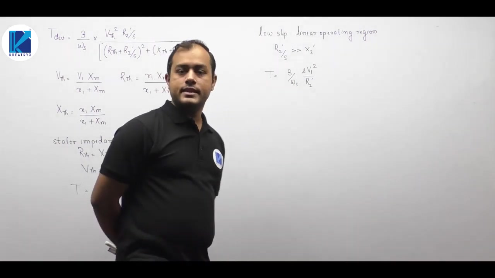

Follow these simple steps:
1. Draw the standard curve on paper with torque $T$ on the vertical axis and speed $\omega$ on the horizontal axis.
2. Turn the sheet of paper over to look through the back. The vertical axis still shows torque, but the horizontal axis points in the negative speed direction.
3. Rotate the paper 90 degrees clockwise.

Speed now lies on the vertical axis, and torque lies on the horizontal axis. Tracing the curve through the back of the paper yields the exact speed-torque characteristic.

## Speed vs. Torque Characteristics and Maximum Torque Formulation
_(06:07 - 13:01)_

### The Speed vs. Torque Characteristic

Using the graphical inversion method, we obtain the speed versus torque characteristic of the induction motor. 

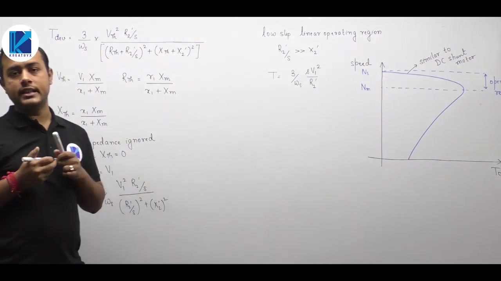

On this curve, synchronous speed $N_s$ occurs at zero torque. As load torque increases, motor speed drops slightly. The speed corresponding to maximum torque is $N_{mT}$. 

The region between synchronous speed $N_s$ and $N_{mT}$ is the stable operating region. In this region, the speed droop with increasing torque is very modest.

> [!info] Analogy with DC Shunt Motors
> In the normal operating region, the torque-speed curve of a three-phase induction motor closely mirrors that of a DC shunt motor. Both maintain nearly constant operating speed across their full load range. Therefore, an induction motor serves as an AC alternative to the DC shunt motor.

### Formulation for Maximum Developed Torque

We now find the maximum developed torque $T_{\text{max}}$ (also called breakdown torque) and the slip $s_{mT}$ at which it occurs.

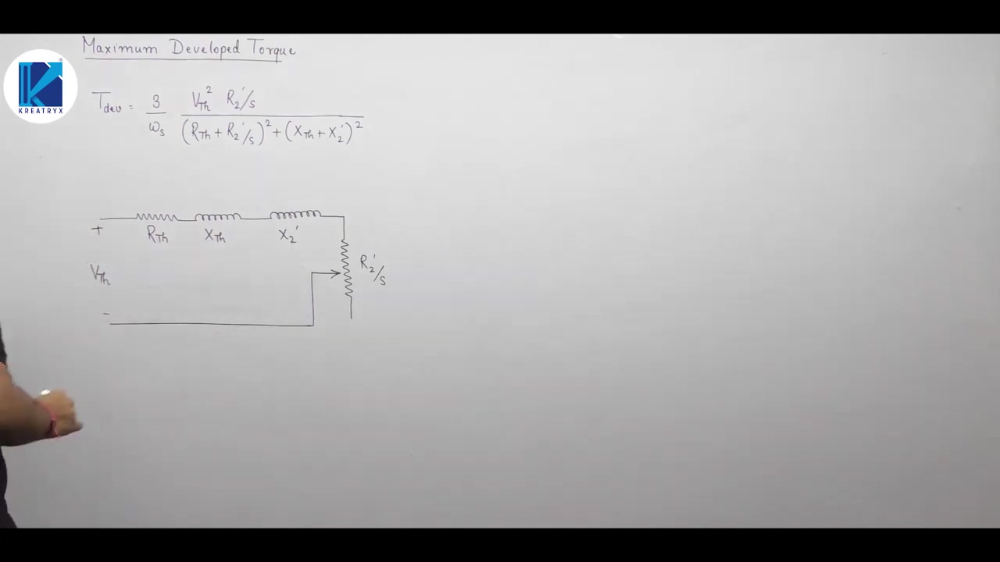

The general torque expression is:

$$T_{\text{dev}} = \frac{3}{\omega_s} \frac{V_{th}^2 \left(\frac{r_2'}{s}\right)}{\left(R_{th} + \frac{r_2'}{s}\right)^2 + (X_{th} + x_2')^2}$$

We could differentiate $T_{\text{dev}}$ with respect to slip $s$ and set $d T_{\text{dev}} / ds = 0$. That calculation is lengthy and prone to algebraic errors.

### The Network Theorem Approach (MPTT)

A much simpler approach uses network theorems. Developed electromagnetic torque is:

$$T_{\text{dev}} = \frac{P_G}{\omega_s}$$

Synchronous angular velocity $\omega_s$ is strictly constant. Torque is directly proportional to three-phase air gap power $P_G$. Therefore, developed torque reaches its maximum when air gap power is maximized:

$$T_{\text{dev}} = T_{\text{max}} \iff P_G = P_{G,\text{max}}$$

In the Thévenin equivalent circuit, air gap power is the real power absorbed by the variable resistor $r_2'/s$. 

Because the parameter to be varied is a pure resistance, we apply the Maximum Power Transfer Theorem directly across $r_2'/s$.

## Analytical Derivation of Maximum Torque and Breakdown Slip
_(13:01 - 21:07)_

### Condition for Maximum Air Gap Power via MPTT

In the single-loop Thévenin equivalent circuit, the load across the rotor branch is pure resistance $r_2'/s$. The remaining network has impedance:

$$Z_{\text{source}} = R_{th} + j (X_{th} + x_2')$$

According to the Maximum Power Transfer Theorem, pure resistance absorbs maximum power when its value equals the magnitude of the source impedance:

$$\frac{r_2'}{s_{mT}} = |Z_{\text{source}}| = \sqrt{R_{th}^2 + (X_{th} + x_2')^2}$$

Solving for the breakdown slip $s_{mT}$ yields:

> [!success] Breakdown Slip (Exact Formula)
> $$s_{mT} = \frac{r_2'}{\sqrt{R_{th}^2 + (X_{th} + x_2')^2}}$$

This simple network theorem avoids taking derivatives of the quotient in the torque equation.

### Derivation of Maximum Developed Torque ($T_{\text{max}}$)

Let $|Z| = \sqrt{R_{th}^2 + (X_{th} + x_2')^2}$. Substituting $r_2'/s = |Z|$ into the general torque equation gives:

$$T_{\text{max}} = \frac{3}{\omega_s} \frac{V_{th}^2 |Z|}{(R_{th} + |Z|)^2 + (X_{th} + x_2')^2}$$

Expand the denominator:

$$(R_{th} + |Z|)^2 + (X_{th} + x_2')^2 = R_{th}^2 + |Z|^2 + 2 R_{th} |Z| + (X_{th} + x_2')^2$$

Recognizing that $R_{th}^2 + (X_{th} + x_2')^2 = |Z|^2$, the denominator becomes:

$$|Z|^2 + |Z|^2 + 2 R_{th} |Z| = 2 |Z|^2 + 2 R_{th} |Z| = 2 |Z| (R_{th} + |Z|)$$

Substitute this back into the torque expression. The factor $|Z|$ in numerator and denominator cancels:

$$T_{\text{max}} = \frac{3}{2 \omega_s} \frac{V_{th}^2}{R_{th} + |Z|}$$

Replacing $|Z|$ with its full radical expression gives:

> [!success] Maximum Developed Torque (Exact Formula)
> $$T_{\text{max}} = \frac{3}{2 \omega_s} \frac{V_{th}^2}{R_{th} + \sqrt{R_{th}^2 + (X_{th} + x_2')^2}}$$

### Approximate Formulas Neglecting Stator Impedance

When stator impedance is neglected ($R_1 = 0, x_1 = 0$), $V_{th} = V_1$, $R_{th} = 0$, and $X_{th} = 0$.

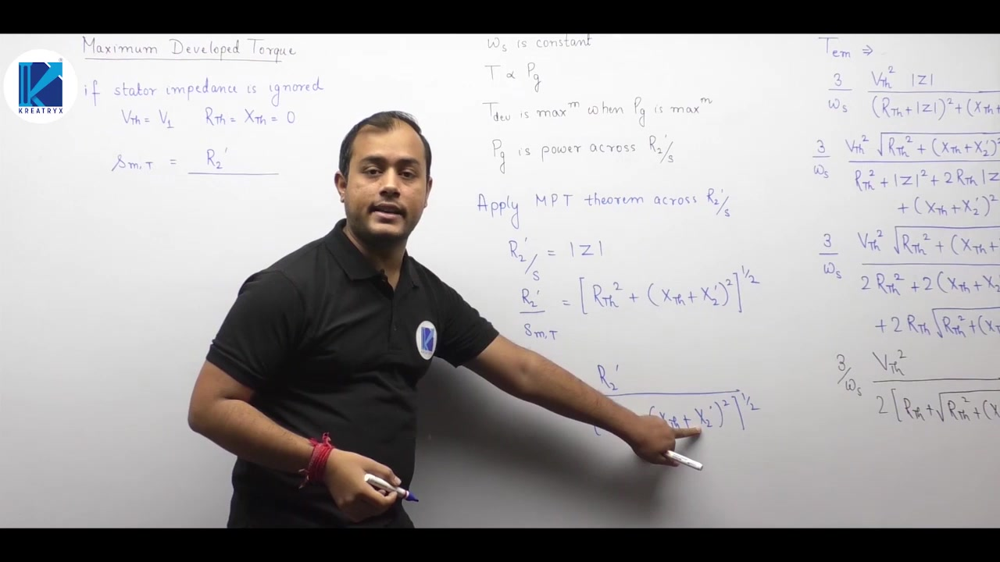

The breakdown slip simplifies to:

$$s_{mT} = \frac{r_2'}{\sqrt{0 + (0 + x_2')^2}} = \frac{r_2'}{x_2'} = \frac{r_2}{x_2}$$

The ratio of referred rotor parameters equals the ratio of actual unreferred rotor parameters because the turns ratio squared cancels out. 

The maximum breakdown torque simplifies to:

$$T_{\text{max}} = \frac{3}{2 \omega_s} \frac{V_1^2}{0 + \sqrt{0 + (x_2')^2}} = \frac{3}{2 \omega_s} \frac{V_1^2}{x_2'}$$

This approximate formula for $T_{\text{max}}$ is the primary expression used in engineering examinations.

## Effect of Rotor Resistance on Breakdown Torque and Starting Torque Fundamentals
_(21:08 - 28:35)_

### Invariance of Maximum Torque to Rotor Resistance

The approximate expression for maximum breakdown torque reveals a critical property:

$$T_{\text{max}} = \frac{3}{2 \omega_s} \frac{V_1^2}{x_2'}$$

Rotor resistance $r_2'$ does not appear in this expression. 

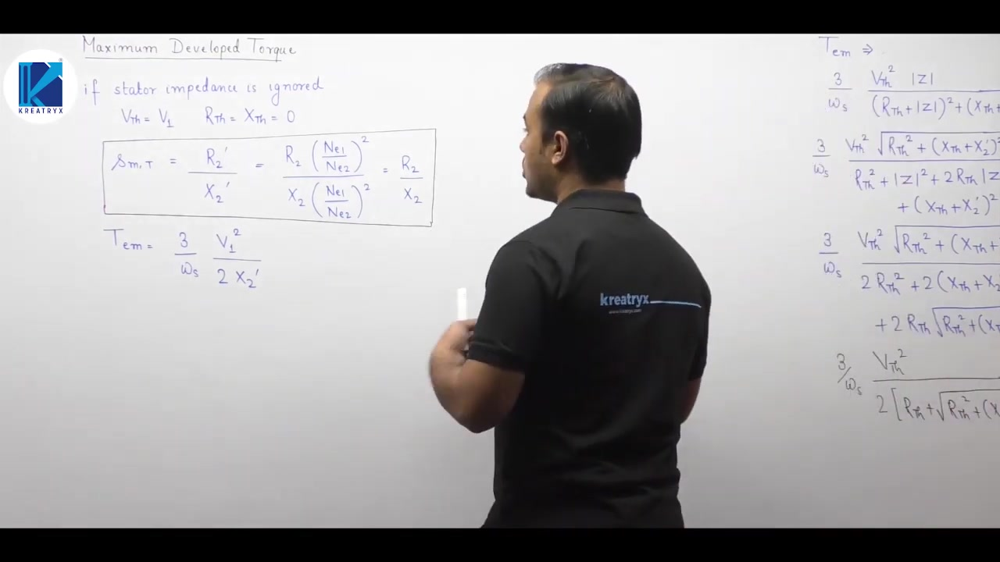

Therefore, maximum breakdown torque is completely independent of rotor resistance. Changing rotor resistance does not alter the peak torque magnitude.

However, breakdown slip $s_{mT}$ is directly proportional to rotor resistance:

$$s_{mT} = \frac{r_2'}{x_2'} \implies s_{mT} \propto r_2'$$

As rotor resistance increases, $s_{mT}$ increases. Mechanical speed at maximum torque is:

$$N_{mT} = N_s (1 - s_{mT})$$

Because $s_{mT}$ rises with $r_2'$, the rotor speed at which maximum torque occurs drops. Increasing rotor resistance shifts the peak torque toward higher slip without changing peak torque height.

### Air Gap Length and Leakage Reactance

In every torque equation, leakage reactance appears in the denominator. To maximize developed torque, leakage reactance must be kept small. 

Leakage reactance arises from magnetic flux that does not link both stator and rotor windings. Minimizing physical air gap length lowers magnetic reluctance across the main flux path. This reduces stray leakage flux and increases developed torque.

### Definition of Starting Torque and Stalling Torque

Starting torque $T_{\text{st}}$ is the electromagnetic torque developed at standstill ($N_r = 0, s = 1$). 

It is also called stalling torque. Stalling torque represents the opposing mechanical counter-torque required to hold the rotor stationary against its forward electromagnetic drive.

Setting slip $s = 1$ in the general torque equation gives:

> [!success] General Starting Torque Equation
> $$T_{\text{st}} = \frac{3}{\omega_s} \frac{V_{th}^2 r_2'}{(R_{th} + r_2')^2 + (X_{th} + x_2')^2}$$

Starting torque is directly proportional to rotor resistance $r_2'$. Increasing rotor resistance increases starting torque. High starting torque is necessary to break away heavy loads from rest, such as trains, cranes, and electric vehicles.

## Starting Heavy Loads and Approximate Starting Torque
_(28:35 - 33:33)_

### Physical Requirements for High Starting Torque

Electric drives in traction, cranes, hoists, and lifts must start from rest under heavy mechanical loads. 

When a machine is stationary, static friction opposes initial motion. Static friction is always higher than kinetic friction. Overcoming static friction and the inertia of a loaded train or crane hoist requires a large initial breakaway torque. 

If a drive cannot produce sufficient starting torque, it cannot accelerate under load. Because starting torque is directly proportional to rotor resistance ($T_{\text{st}} \propto r_2'$), keeping rotor circuit resistance high during start-up is essential for heavy-duty starting.

### Approximate Formula for Starting Torque

When stator impedance is neglected ($R_1 = 0, x_1 = 0$), $V_{th} = V_1$, $R_{th} = 0$, and $X_{th} = 0$. 

Substituting slip $s = 1$ into the approximate torque equation yields:

$$T_{\text{st}} = \frac{3}{\omega_s} \frac{V_1^2 r_2'}{(r_2')^2 + (x_2')^2}$$

In practical induction machines, rotor winding resistance is much smaller than standstill rotor leakage reactance ($r_2' \ll x_2'$). 

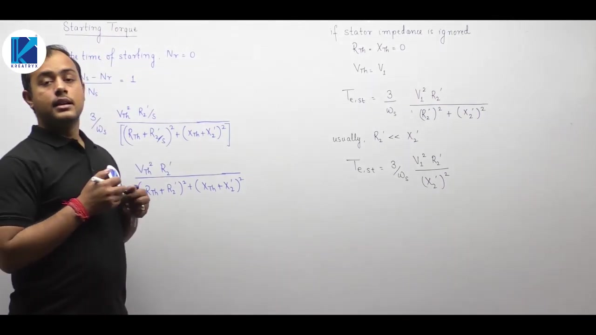

The resistance term $(r_2')^2$ in the denominator is negligible compared to $(x_2')^2$:

> [!success] Approximate Starting Torque
> $$T_{\text{st}} \approx \frac{3}{\omega_s} \frac{V_1^2 r_2'}{(x_2')^2}$$

### Practical Guidance on Formula Memorization

Do not try to memorize dozens of specialized formula variations. 

To solve examination problems reliably:
1. Remember the general torque equation and set $s = 1$ to find starting torque.
2. Remember that maximum torque occurs when $r_2'/s = |Z_{\text{source}}|$, which reduces to $s_{mT} = r_2'/x_2'$ when stator impedance is neglected.
3. Understand that starting torque is proportional to rotor resistance, while maximum torque is independent of rotor resistance.

## Influence of Leakage Reactance and Maximum Starting Torque
_(33:34 - 39:57)_

### Slot Construction and Leakage Reactance

Starting torque depends inversely on rotor leakage reactance $x_2'$.
Leakage reactance depends heavily on the slot geometry used in the core:

1. **Closed Slots**:
   Closed slots provide a low reluctance iron path across the slot top.
   This creates maximum leakage flux and the highest leakage reactance.
   Because reactance is largest, starting torque and running torque are lowest.

2. **Semi-Open Slots**:
   Semi-open slots narrow the slot opening.
   They offer moderate leakage flux and intermediate starting torque.

3. **Open Slots**:
   Open slots present a large non-magnetic air opening at the slot top.
   Leakage flux is lowest, so leakage reactance is minimized.
   Hence open slots yield the highest starting torque.

$$
T_{\text{open}} > T_{\text{semi-open}} > T_{\text{closed}}
$$

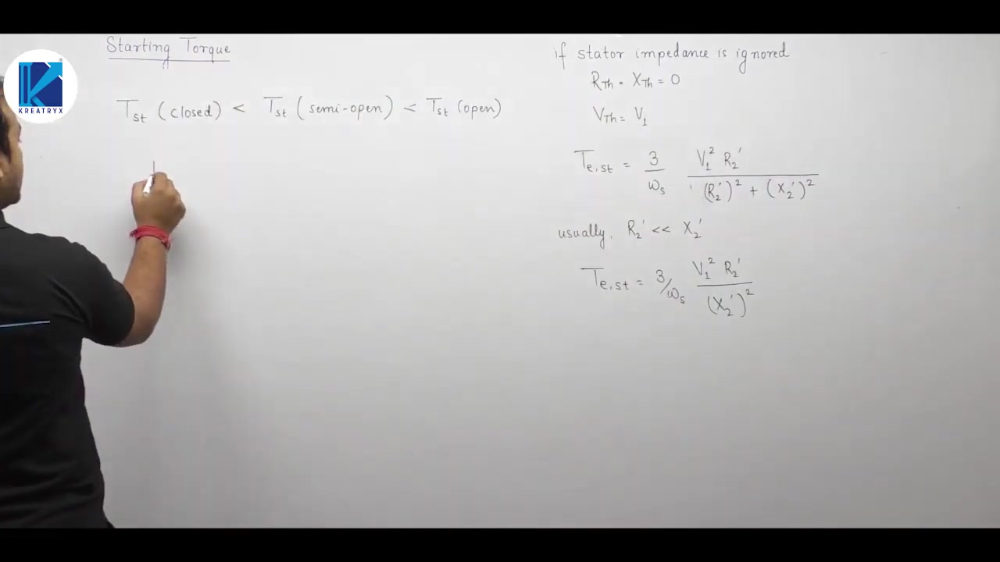

### Condition for Maximum Torque at Starting

We often want an induction motor to deliver its breakdown torque right at standstill.
Since torque is a single-valued function of slip on the stable branch, equating torques requires equating their slips.
At standstill, slip equals 1.
Therefore, maximum torque occurs at starting when:
$$
s_{mT} = 1
$$

Neglecting stator impedance gives the natural slip for peak torque:
$$
s_{mT} = \frac{r_2}{x_2}
$$

In practical machines, rotor winding resistance $r_2$ is always much smaller than leakage reactance $x_2$.
As a result, $s_{mT}$ is typically between 0.1 and 0.2.
Natural starting torque is therefore well below peak torque.

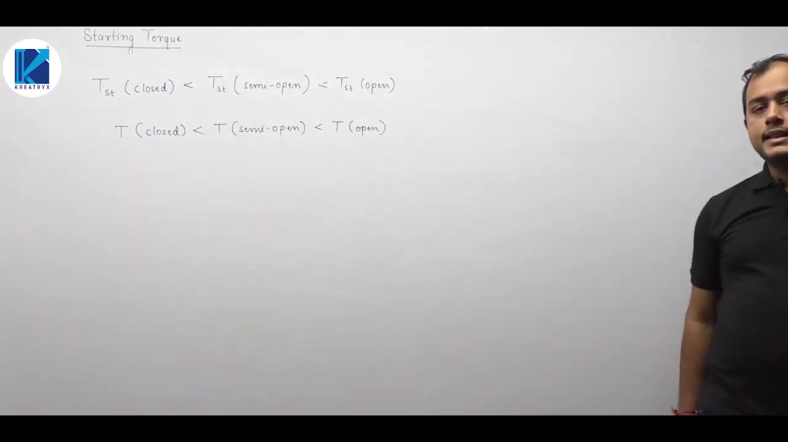

### Adding External Resistance in Slip-Ring Motors

To make the machine develop maximum torque at standstill, we increase rotor circuit resistance.
Let an external resistance $R_{\text{ext}}$ be inserted in series per phase of the rotor.
The total rotor circuit resistance becomes $r_2 + R_{\text{ext}}$.
The new slip for maximum torque is:
$$
s_{mT}' = \frac{r_2 + R_{\text{ext}}}{x_2}
$$

Set this equal to unity:
$$
1 = \frac{r_2 + R_{\text{ext}}}{x_2}
$$

> [!success] Required External Resistance for Maximum Starting Torque
> $$
> R_{\text{ext}} = x_2 - r_2
> $$

If referred values to stator are used, the equation is $R_{\text{ext}}' = x_2' - r_2'$.

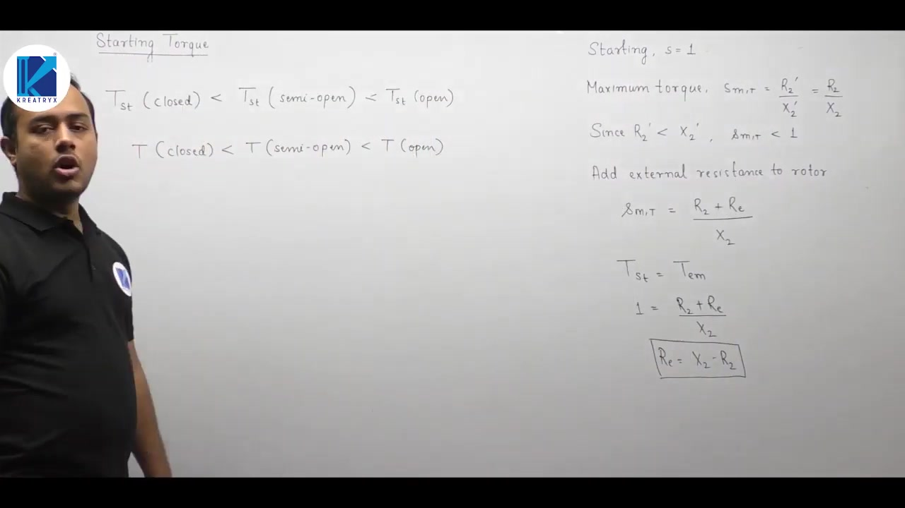

### Practical Limitation to Slip-Ring Machines

This method of adding external resistance applies strictly to wound-rotor (slip-ring) induction motors.
Slip rings and brushes expose the rotor circuit terminals to the outside.
In squirrel-cage motors, rotor bars are permanently short-circuited by end rings.
Cage machines have no external terminals, so external resistance cannot be added.

## Torque Ratio Formulas and Operating Points
_(39:58 - 46:07)_

### Derivation of the Torque Ratio $T / T_{\text{max}}$

We can express the developed torque at any slip $s$ as a fraction of the maximum torque $T_{\text{max}}$.
Assume stator impedance is negligible.
Recall the developed torque expression:
$$
T_{\text{dev}} = \frac{3}{\omega_s} \frac{V_1^2 \left(\frac{r_2'}{s}\right)}{\left(\frac{r_2'}{s}\right)^2 + (x_2')^2}
$$

Under the same approximation, maximum torque equals:
$$
T_{\text{max}} = \frac{3}{\omega_s} \frac{V_1^2}{2 x_2'}
$$

Dividing developed torque by maximum torque eliminates constant factors:
$$
\frac{T}{T_{\text{max}}} = \frac{2 x_2' \left(\frac{r_2'}{s}\right)}{\left(\frac{r_2'}{s}\right)^2 + (x_2')^2}
$$

Factor out $(x_2')^2$ from the denominator:
$$
\frac{T}{T_{\text{max}}} = \frac{2 \left(\frac{r_2'}{s x_2'}\right)}{\left(\frac{r_2'}{s x_2'}\right)^2 + 1}
$$

Recall that the slip at maximum torque is $s_{mT} = r_2' / x_2'$.
Substitute this into the expression:
$$
\frac{T}{T_{\text{max}}} = \frac{2 \left(\frac{s_{mT}}{s}\right)}{\left(\frac{s_{mT}}{s}\right)^2 + 1}
$$

Divide both numerator and denominator by $(s_{mT} / s)$:

> [!success] Ratio of Torque to Maximum Torque
> $$
> \frac{T}{T_{\text{max}}} = \frac{2}{\dfrac{s_{mT}}{s} + \dfrac{s}{s_{mT}}}
> $$

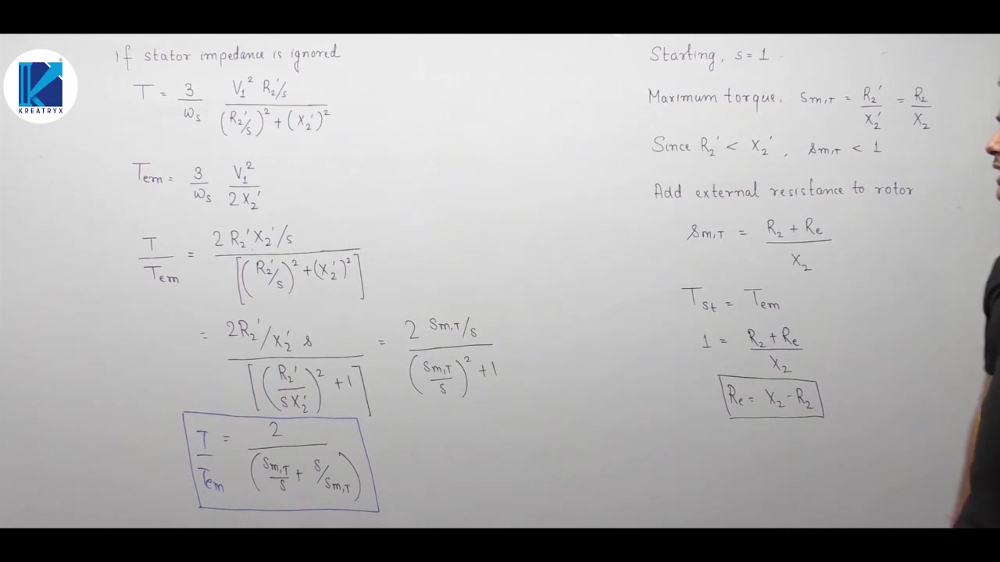

### Important Constraint on Using the Formula

Notice that this equation contains two slips, $s$ and $s_{mT}$.
Students sometimes make the mistake of generalizing this to arbitrary slips $s_1$ and $s_2$.
They try to evaluate $T_1 / T_2$ by replacing $s_{mT}$ with $s_1$ and $s$ with $s_2$.
Never do this.
The derivation relies specifically on the formula for maximum torque.
It is valid only when comparing torque at slip $s$ directly to $T_{\text{max}}$.

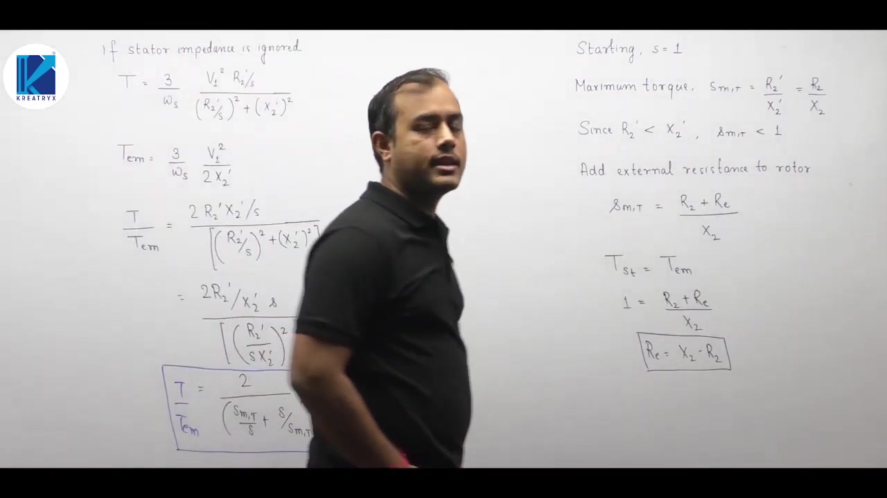

### Full-Load and Starting Torque Ratios

For full-load operation at slip $s_{FL}$, the ratio becomes:
$$
\frac{T_{FL}}{T_{\text{max}}} = \frac{2}{\dfrac{s_{mT}}{s_{FL}} + \dfrac{s_{FL}}{s_{mT}}}
$$

At starting, rotor speed is zero so slip equals 1.
Substituting $s = 1$ gives the starting torque ratio:
$$
\frac{T_{\text{st}}}{T_{\text{max}}} = \frac{2}{s_{mT} + \dfrac{1}{s_{mT}}}
$$

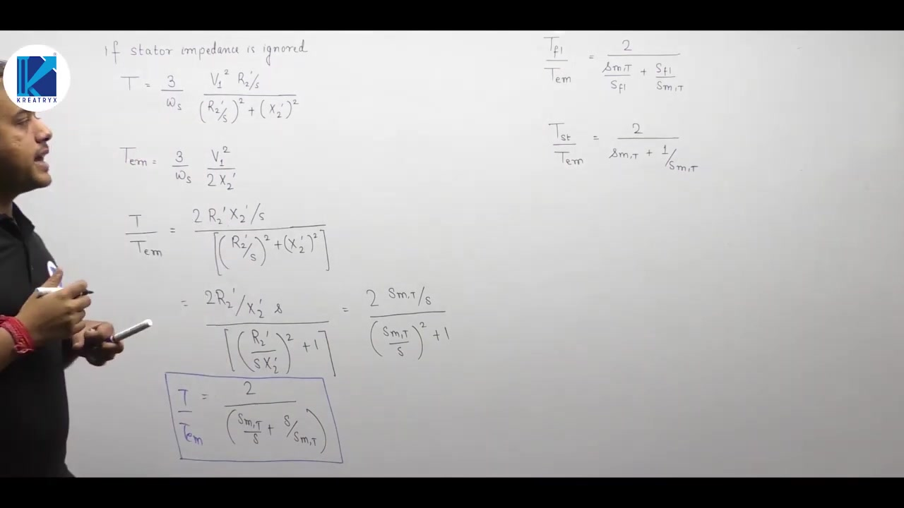

### Ratio of Starting Torque to Full-Load Torque

We often need to find $T_{\text{st}} / T_{FL}$ directly in exam problems.
Express this as a product of two known ratios:
$$
\frac{T_{\text{st}}}{T_{FL}} = \left(\frac{T_{\text{st}}}{T_{\text{max}}}\right) \left(\frac{T_{\text{max}}}{T_{FL}}\right)
$$

Substitute both expressions into the product:
$$
\frac{T_{\text{st}}}{T_{FL}} = \left[\frac{2}{s_{mT} + \dfrac{1}{s_{mT}}}\right] \left[\frac{\dfrac{s_{mT}}{s_{FL}} + \dfrac{s_{FL}}{s_{mT}}}{2}\right]
$$

The factor of 2 cancels out neatly:

> [!success] Ratio of Starting to Full-Load Torque
> $$
> \frac{T_{\text{st}}}{T_{FL}} = \frac{\dfrac{s_{mT}}{s_{FL}} + \dfrac{s_{FL}}{s_{mT}}}{s_{mT} + \dfrac{1}{s_{mT}}}
> $$

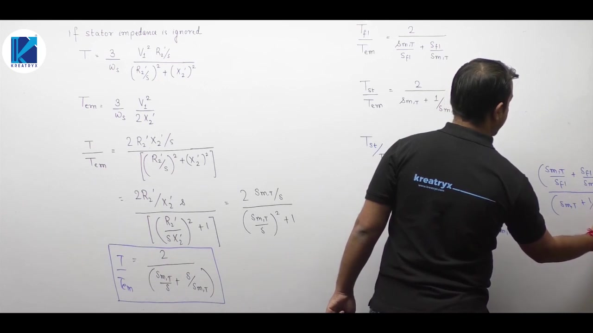

## Torque Ratios via Current and Lecture Summary
_(46:09 - 50:14)_

### Starting Torque to Full-Load Torque in Terms of Current

We can also express the torque ratio using rotor currents.
Recall that developed torque is related to air-gap power:
$$
T_{\text{dev}} = \frac{P_g}{\omega_s} = \frac{3 (I_2')^2 \left(\dfrac{r_2'}{s}\right)}{\omega_s}
$$

Let $I_{\text{st}}'$ be the starting rotor current and $I_{FL}'$ be the full-load rotor current.
Calculate the ratio of starting torque to full-load torque:
$$
\frac{T_{\text{st}}}{T_{FL}} = \frac{\dfrac{3 (I_{\text{st}}')^2 r_2'}{\omega_s \cdot 1}}{\dfrac{3 (I_{FL}')^2 r_2'}{\omega_s \cdot s_{FL}}}
$$

Notice that the constant 3, synchronous speed $\omega_s$, and rotor resistance $r_2'$ cancel out.
Because rotor current is proportional to stator line current during starting, we write:

> [!success] Current-Based Torque Ratio
> $$
> \frac{T_{\text{st}}}{T_{FL}} = \left(\frac{I_{\text{st}}}{I_{FL}}\right)^2 s_{FL}
> $$

Here $I_{\text{st}}$ is starting line current, $I_{FL}$ is rated full-load current, and $s_{FL}$ is full-load slip.
This relation is central when analyzing induction motor starters.

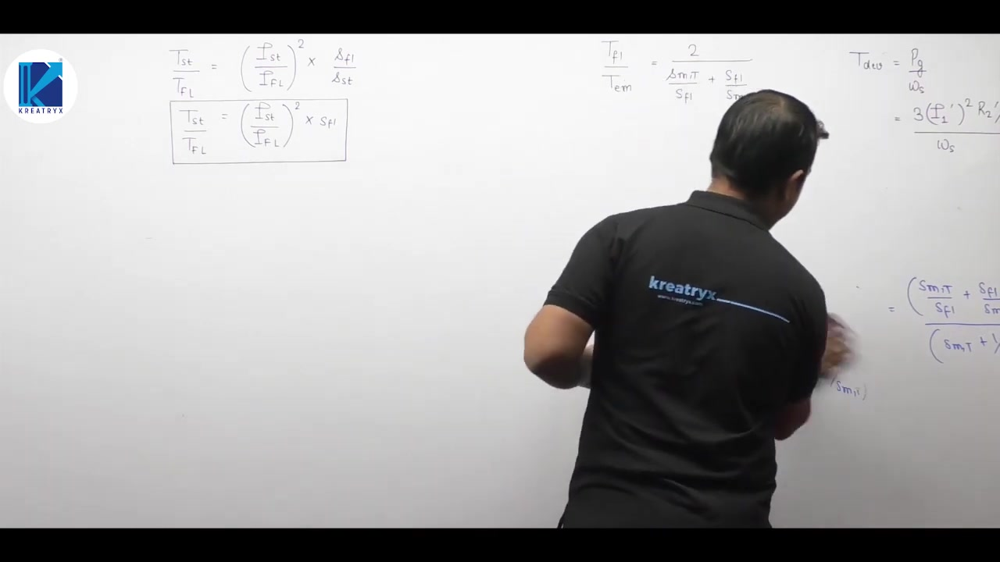

### Key Takeaways of the Lecture

We summarize the key results established in this lecture:

1. **Maximum Torque via MPTT**:
   Maximum mechanical power transfer occurs when $r_2'/s$ matches the magnitude of the Thevenin impedance seen from the rotor terminals:
   $$
   \frac{r_2'}{s_{mT}} = \sqrt{R_{th}^2 + (X_{th} + x_2')^2}
   $$

2. **Approximate Slip at Maximum Torque**:
   Neglecting stator impedance yields:
   $$
   s_{mT} \approx \frac{r_2'}{x_2'}
   $$
   The slip for maximum torque is directly proportional to rotor circuit resistance.

3. **Peak Breakdown Torque**:
   Neglecting stator resistance:
   $$
   T_{\text{max}} \approx \frac{3}{\omega_s} \frac{V_1^2}{2 x_2'}
   $$
   Maximum torque is independent of rotor resistance.
   Adding external resistance shifts the peak torque toward higher slips without changing its amplitude.

4. **Normalized Torque Ratio**:
   Neglecting stator impedance:
   $$
   \frac{T}{T_{\text{max}}} = \frac{2}{\dfrac{s_{mT}}{s} + \dfrac{s}{s_{mT}}}
   $$

5. **Starting Condition**:
   At starting, rotor speed is zero ($s = 1$).
   The starting torque ratio is:
   $$
   \frac{T_{\text{st}}}{T_{\text{max}}} = \frac{2}{s_{mT} + \dfrac{1}{s_{mT}}}
   $$

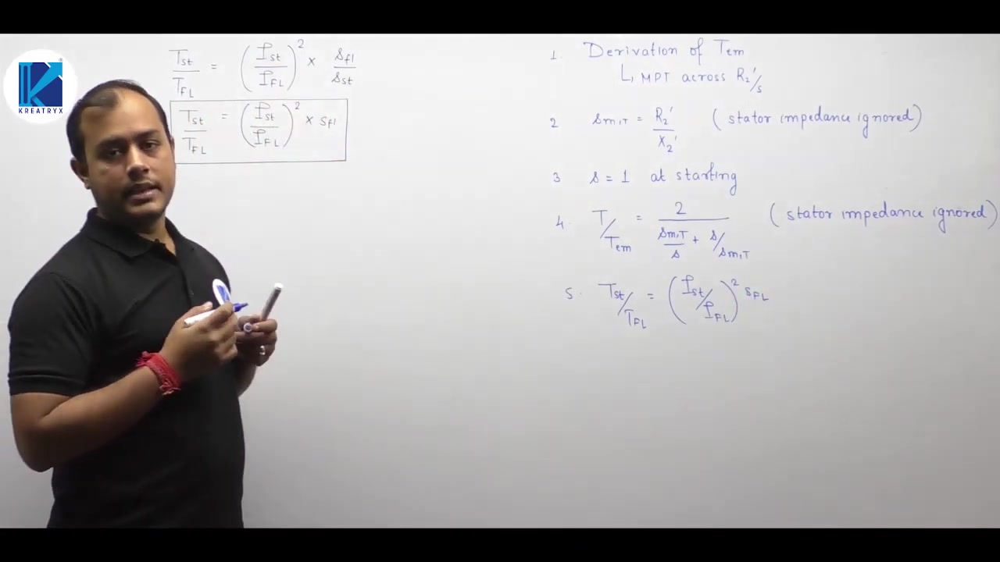

---

## Summary and Key Takeaways

- Maximum mechanical power transfer occurs when rotor branch resistance satisfies $r_2'/s_{mT} = \sqrt{R_{th}^2 + (X_{th} + x_2')^2}$.
- Neglecting stator impedance simplifies the breakdown slip expression to $s_{mT} \approx r_2'/x_2'$, proving that breakdown slip is directly proportional to rotor circuit resistance.
- Peak breakdown torque is given approximately by $T_{\text{max}} \approx \frac{3}{2 \omega_s} \frac{V_1^2}{x_2'}$, which is independent of rotor resistance $r_2'$.
- Adding external resistance $R_{\text{ext}}$ shifts the torque-speed peak toward lower speeds without altering the value of maximum torque.
- Closed rotor slots have the highest leakage reactance and yield the lowest starting torque, whereas open slots minimize leakage reactance and provide maximum starting torque.
- To achieve maximum torque at starting ($s=1$), external resistance equal to $R_{\text{ext}} = x_2 - r_2$ must be inserted in slip-ring rotor circuits.
- The developed torque normalized to maximum torque is given by $\frac{T}{T_{\text{max}}} = \frac{2}{\dfrac{s_{mT}}{s} + \dfrac{s}{s_{mT}}}$.
- The ratio of starting torque to full-load torque can be calculated from current as $\frac{T_{\text{st}}}{T_{FL}} = \left(\frac{I_{\text{st}}}{I_{FL}}\right)^2 s_{FL}$.

