# Electrical Machines | Lec 102 | Torque Slip Characteristics -3 | GATE Electrical Engineering

- **Source**: https://www.youtube.com/watch?v=SPexadar380
- **Duration**: 00:49:44
- **Compiled**: 2026-09-23

---

## Overview

This lecture examines how induction motor torque-speed and power-speed curves shift under parameter variations.
It analyzes changes in rotor resistance, leakage reactance, supply voltage, and supply frequency under constant $V/f$ and constant voltage regimes.
The discussion isolates mechanical power in the equivalent circuit and derives the condition for maximum mechanical power transfer.
Finally, the lecture details overall operating characteristics, proving how speed, power factor, stator current, and efficiency evolve from no-load to rated full-load.

## Contents

- [[#Parameter Variations: Influence of Rotor Resistance|Parameter Variations: Influence of Rotor Resistance]]
- [[#Influence of Leakage Reactance and Supply Voltage|Influence of Leakage Reactance and Supply Voltage]]
- [[#Rotor Resistance Effects on Current, Power Factor, and Speed|Rotor Resistance Effects on Current, Power Factor, and Speed]]
- [[#Frequency and Voltage Variations: Foundations of $V/f$ Control|Frequency and Voltage Variations: Foundations of $V/f$ Control]]
- [[#Power-Slip Characteristics and Mechanical Power Modeling|Power-Slip Characteristics and Mechanical Power Modeling]]
- [[#Derivation of Maximum Mechanical Power|Derivation of Maximum Mechanical Power]]
- [[#Power-Slip Curve Across Operating Modes and Load-Speed Characteristics|Power-Slip Curve Across Operating Modes and Load-Speed Characteristics]]
- [[#Operating Characteristics: Torque and Power Factor Evolution|Operating Characteristics: Torque and Power Factor Evolution]]
- [[#Operating Characteristics: Efficiency, Stator Current, and Summary Curves|Operating Characteristics: Efficiency, Stator Current, and Summary Curves]]

---

## Parameter Variations: Influence of Rotor Resistance
_(00:13 - 06:24)_

### Review of Fundamental Torque Relationships

In previous lectures, we derived key formulas for the three-phase induction motor:

1. **Slip at Maximum Torque**:
   $$
   s_{mT} \approx \frac{R_2}{X_2}
   $$
2. **Maximum Breakdown Torque**:
   $$
   T_{\text{max}} \approx \frac{3}{\omega_s} \frac{V_1^2}{2 X_2}
   $$
3. **Normalized Torque Ratio**:
   $$
   \frac{T}{T_{\text{max}}} = \frac{2}{\dfrac{s_{mT}}{s} + \dfrac{s}{s_{mT}}}
   $$
4. **Current-Based Torque Ratio**:
   $$
   \frac{T_{\text{st}}}{T_{FL}} = \left(\frac{I_{\text{st}}}{I_{FL}}\right)^2 s_{FL}
   $$

We now examine how the torque-speed curve shifts as machine parameters change.

### Analytical Effect of Rotor Resistance $R_2$

Consider the effect of increasing rotor resistance $R_2$ on machine performance:

- **Synchronous Speed ($N_s$)**:
  $$
  N_s = \frac{120 f}{P}
  $$
  Synchronous speed depends solely on supply frequency and stator poles.
  It is independent of rotor resistance and remains constant.

- **Breakdown Slip ($s_{mT}$)**:
  Because $s_{mT} = R_2 / X_2$, the slip at maximum torque is directly proportional to $R_2$.
  Increasing $R_2$ increases $s_{mT}$.

- **Speed at Maximum Torque ($N_{mT}$)**:
  $$
  N_{mT} = N_s (1 - s_{mT})
  $$
  As $s_{mT}$ increases, the rotor speed where maximum torque occurs decreases.
  Peak torque is reached at a lower speed.

- **Starting Torque ($T_{\text{st}}$)**:
  In the high-slip starting region where $s=1$:
  $$
  T_{\text{st}} \propto R_2
  $$
  Starting torque increases with rotor resistance.

- **Maximum Torque ($T_{\text{max}}$)**:
  The expression for $T_{\text{max}}$ contains no $R_2$ term.
  Hence maximum breakdown torque is completely independent of rotor resistance.
  The peak amplitude remains unchanged.

> [!success] Rotor Resistance Rule
> Increasing rotor resistance preserves the magnitude of maximum torque.
> It shifts the peak toward lower speeds and increases starting torque.

### Graphical Shifts of the Torque-Speed Characteristic

Let us plot torque versus speed for increasing values of rotor resistance $R_2 < R_2' < R_2''$.
Each curve begins at a higher starting torque at standstill ($N=0$).
Each curve reaches the exact same horizontal peak height $T_{\text{max}}$.
However, the peak occurs earlier along the speed axis.
All curves eventually converge to zero torque at synchronous speed $N_s$.

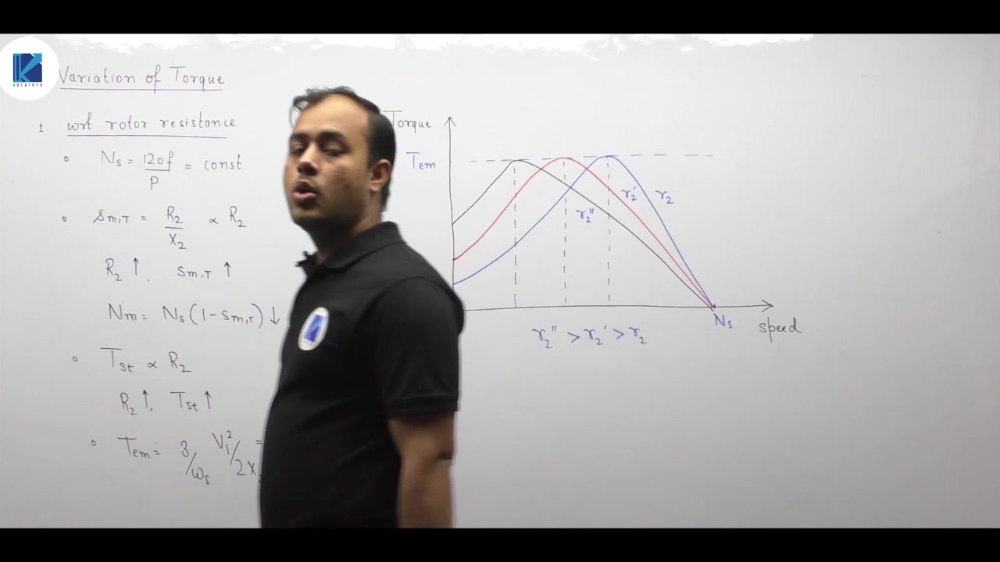

### Steady-State Operating Speed Under Constant Load Torque

Consider the rotational equation of motion for the motor drive:
$$
J \frac{d^2 \theta}{dt^2} = T_m - T_L
$$
Here $T_m$ is motor electromagnetic torque and $T_L$ is load torque.
Under steady-state running conditions, angular acceleration is zero:
$$
T_m = T_L
$$

Draw a horizontal line representing constant load torque $T_L$ across the curves.
The intersection with each curve yields the operating speeds $N_1$, $N_2$, and $N_3$.
Because higher resistance curves shift to the left, we observe:
$$
N_3 < N_2 < N_1
$$

As rotor resistance increases, the steady-state operating speed under a constant load drops.
This principle is used for rotor resistance speed control in wound-rotor motors.

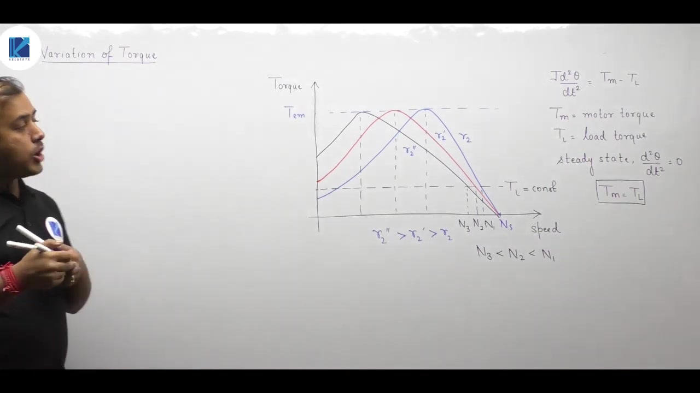

## Influence of Leakage Reactance and Supply Voltage
_(06:37 - 11:51)_

### Variation with Respect to Leakage Reactance $X_2$

Next, consider how leakage reactance affects the torque-speed curve.
Synchronous speed $N_s$ depends on supply frequency and pole count, so it remains constant.

- **Breakdown Slip ($s_{mT}$)**:
  $$
  s_{mT} = \frac{R_2}{X_2}
  $$
  As leakage reactance $X_2$ increases, breakdown slip decreases.

- **Speed at Maximum Torque ($N_{mT}$)**:
  $$
  N_{mT} = N_s (1 - s_{mT})
  $$
  Because $s_{mT}$ decreases, the rotor speed where maximum torque occurs increases.
  The peak shifts rightward toward synchronous speed.

- **Starting Torque ($T_{\text{st}}$)**:
  $$
  T_{\text{st}} = \frac{3}{\omega_s} \frac{V_1^2 R_2'}{(R_2')^2 + (X_2')^2} \approx \frac{3}{\omega_s} \frac{V_1^2 R_2'}{(X_2')^2}
  $$
  As $X_2'$ increases, starting torque decreases significantly.

- **Maximum Breakdown Torque ($T_{\text{max}}$)**:
  $$
  T_{\text{max}} = \frac{3}{\omega_s} \frac{V_1^2}{2 X_2'}
  $$
  As $X_2'$ increases, peak breakdown torque decreases inversely.

> [!important] Universal Effect of Leakage
> Increasing leakage reactance reduces developed torque across all slips.
> Starting torque, peak breakdown torque, and intermediate torques all decrease.
> To maximize torque output, induction motors are designed with minimal air gap length.

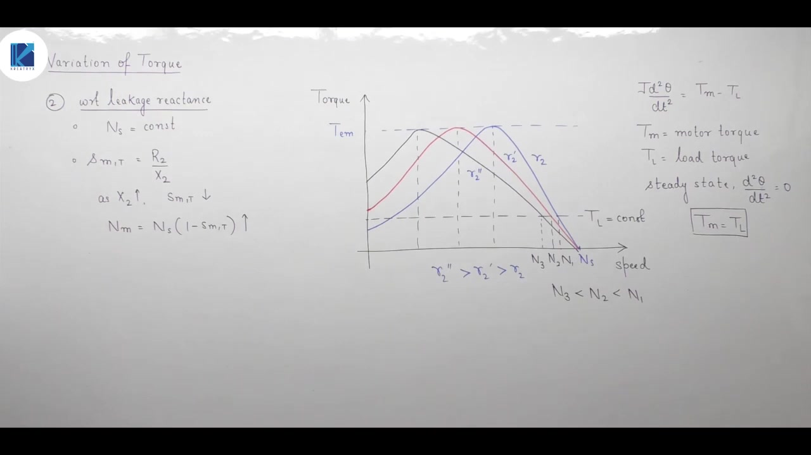

### Graphical Shift with Increasing Leakage Reactance

Plot torque versus speed for increasing leakage reactances $X_2 < X_2' < X_2''$:
- The starting torque decreases at $N=0$.
- The maximum torque peak becomes lower.
- The speed corresponding to maximum torque moves closer to $N_s$.
- All curves terminate at zero torque at synchronous speed $N_s$.

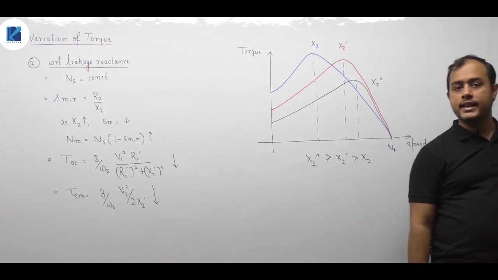

### Variation with Respect to Supply Voltage $V_1$

Now consider the effect of varying stator supply voltage $V_1$:

- **Synchronous Speed ($N_s$)**:
  Constant, since frequency and pole count are unchanged.

- **Breakdown Slip ($s_{mT}$)**:
  $$
  s_{mT} = \frac{R_2}{X_2}
  $$
  This depends solely on rotor parameters and remains constant.

- **Speed at Maximum Torque ($N_{mT}$)**:
  $$
  N_{mT} = N_s (1 - s_{mT}) = \text{constant}
  $$
  Maximum torque always occurs at the exact same rotor speed regardless of voltage.

- **Developed Torque ($T_{\text{dev}}$)**:
  Electromagnetic torque at any slip is proportional to $V_1^2$:
  $$
  T_{\text{dev}} \propto V_1^2
  $$
  Both starting torque and maximum torque scale with the square of supply voltage.

> [!success] Supply Voltage Scaling
> Changing supply voltage scales the torque characteristic vertically by $V_1^2$.
> It does not shift the location of synchronous speed or the speed of peak torque.

Because torque scales with $V_1^2$, stator windings are often connected in delta during normal running.
Delta connection applies full line voltage across each phase winding, maximizing torque output.

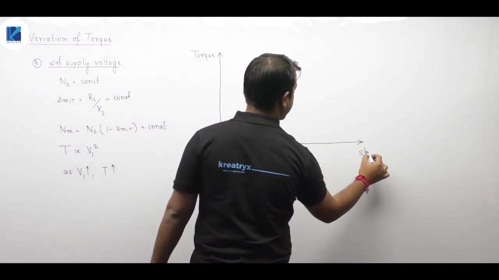

## Rotor Resistance Effects on Current, Power Factor, and Speed
_(11:55 - 16:58)_

### Summary of Rotor Resistance Effects

We can systematically summarize the consequences of increasing rotor resistance in an induction motor:

1. **Starting Torque Increases**:
   Starting torque $T_{\text{st}}$ is proportional to rotor resistance $R_2$ when starting slip $s = 1$.

2. **Maximum Torque is Unaffected**:
   Breakdown torque $T_{\text{max}}$ depends only on stator voltage and leakage reactance, not on $R_2$.

3. **Breakdown Slip Increases**:
   The slip for maximum torque $s_{mT} = R_2 / X_2$ increases proportionally with $R_2$.

4. **Operating Speed Decreases**:
   Under a constant load torque, the intersection of load torque and motor torque shifts to a lower speed.

### Effect on Stator and Rotor Current

Neglecting stator impedance, the rotor branch connects directly across stator phase voltage $V_1$.
The rotor current referred to stator is:
$$
I_2' = \frac{V_1}{\sqrt{\left(\dfrac{R_2'}{s}\right)^2 + (X_2')^2}}
$$

At any given slip $s$, increasing rotor resistance increases total circuit impedance.
Therefore, the current drawn by the motor decreases.
Adding rotor resistance during starting limits the high starting inrush current.

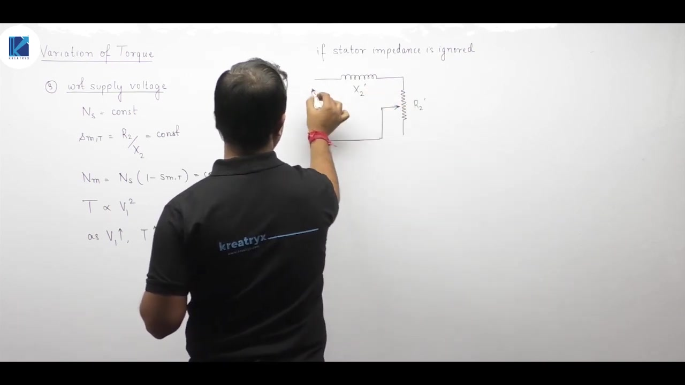

### Effect on Power Factor

The impedance angle of the rotor branch is given by:
$$
\tan \phi = \frac{X_2'}{\dfrac{R_2'}{s}} = \frac{s X_2'}{R_2'}
$$

As rotor resistance $R_2'$ increases, the phase angle $\phi$ decreases.
Since $\cos \phi$ is a decreasing function of $\phi$ in the first quadrant, the operating power factor increases.
Adding rotor resistance improves motor power factor during starting and running conditions.

> [!success] Current and Power Factor Improvement
> Increasing rotor circuit resistance:
> 1. Reduces stator and rotor currents.
> 2. Improves the operating power factor ($\cos \phi \uparrow$).

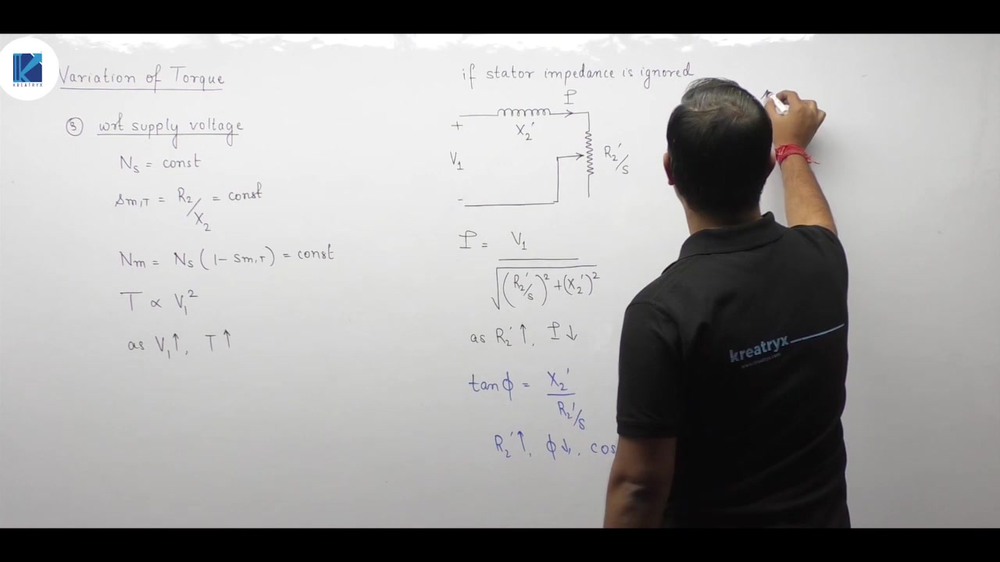

### Current Versus Speed Characteristics

We can plot rotor current against rotor speed $N$.
Recall the speed-slip relationship:
$$
N = N_s (1 - s)
$$
As rotor speed increases toward synchronous speed $N_s$, slip $s$ approaches zero.
As $s \to 0$, the effective rotor resistance $R_2'/s$ approaches infinity.
So rotor current drops smoothly from a large starting value to zero at synchronous speed:
$$
I_2'(N_s) = 0
$$

Curves plotted for higher values of rotor resistance lie entirely below lower resistance curves.
At every speed, a higher rotor resistance draws less current.

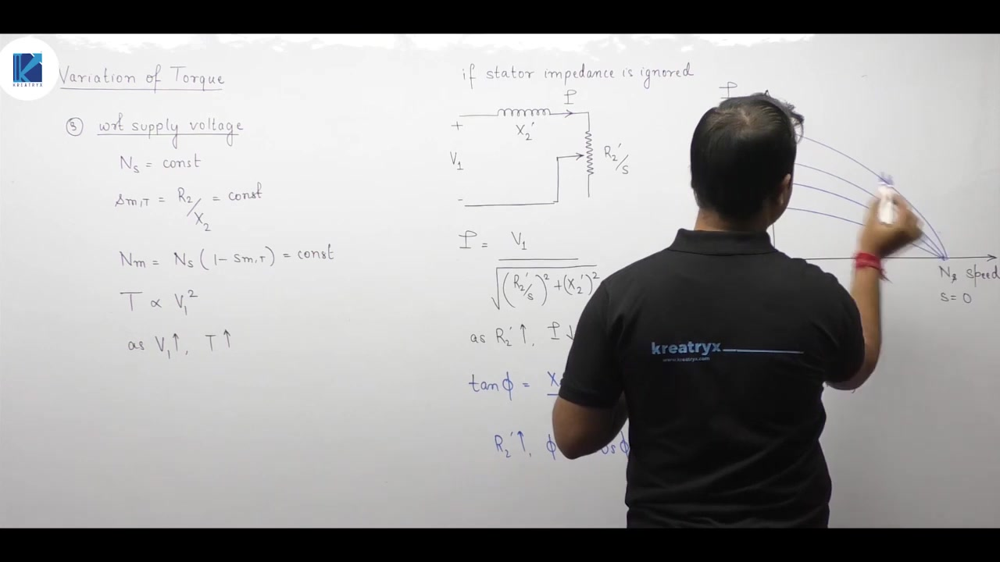

## Frequency and Voltage Variations: Foundations of $V/f$ Control
_(17:03 - 23:04)_

### Frequency Dependence of Machine Parameters

When stator supply frequency $f$ changes, several circuit quantities change accordingly:

1. **Synchronous Speed ($\omega_s$)**:
   $$
   \omega_s = \frac{4 \pi f}{P} \propto f
   $$

2. **Rotor Leakage Reactance ($X_2$)**:
   $$
   X_2 = 2 \pi f L_2 \propto f
   $$

3. **Rotor Resistance ($R_2$)**:
   Ignoring skin effect, DC and low-frequency rotor resistance is independent of supply frequency.

4. **Breakdown Slip ($s_{mT}$)**:
   $$
   s_{mT} = \frac{R_2}{X_2} \propto \frac{1}{f}
   $$
   As supply frequency increases, breakdown slip decreases.

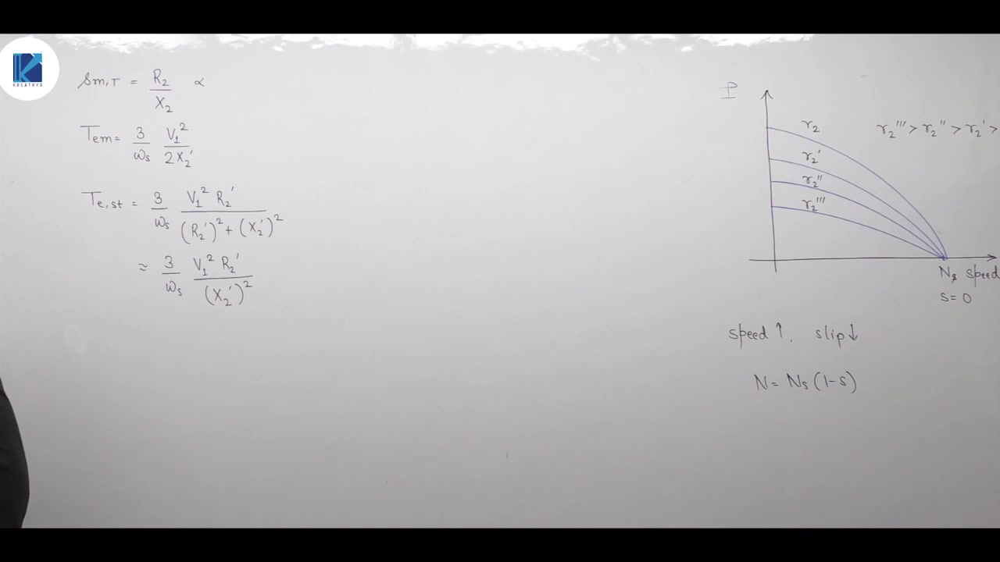

### Scaling of Maximum and Starting Torque

Substitute the frequency dependences into the torque expressions:

- **Maximum Torque**:
  $$
  T_{\text{max}} = \frac{3}{2 \omega_s} \frac{V_1^2}{X_2} \propto \frac{V_1^2}{f \cdot f} = \frac{V_1^2}{f^2}
  $$

- **Starting Torque**:
  Using the approximate starting formula where reactance dominates:
  $$
  T_{\text{st}} \approx \frac{3}{\omega_s} \frac{V_1^2 R_2'}{(X_2')^2} \propto \frac{V_1^2}{f \cdot f^2} = \frac{V_1^2}{f^3}
  $$

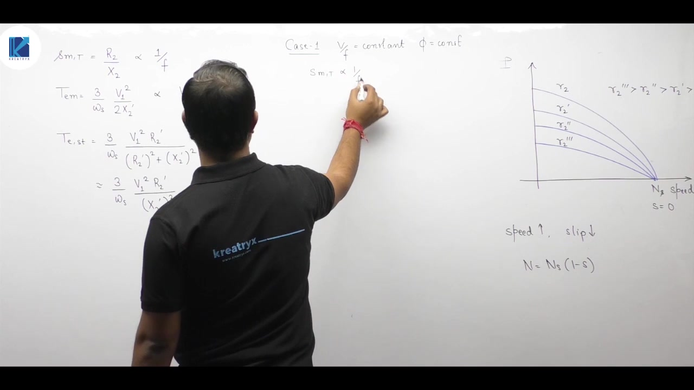

### Case 1: Constant $V/f$ Control (Below Base Speed)

In variable-frequency motor drives, the stator voltage is adjusted alongside frequency to keep the ratio $V/f$ constant.
This maintains a constant mutual air-gap flux and prevents magnetic saturation:

- **Breakdown Slip**:
  $$
  s_{mT} \propto \frac{1}{f}
  $$

- **Maximum Torque**:
  $$
  T_{\text{max}} \propto \left(\frac{V_1}{f}\right)^2 = \text{constant}
  $$
  Peak breakdown torque remains completely constant across the entire operating frequency range.

- **Starting Torque**:
  $$
  T_{\text{st}} \propto \frac{1}{f} \left(\frac{V_1}{f}\right)^2 \propto \frac{1}{f}
  $$
  At lower operating frequencies, starting torque increases.

> [!success] Constant $V/f$ Behavior
> With constant $V/f$, maximum breakdown torque remains constant.
> Starting torque is inversely proportional to frequency.

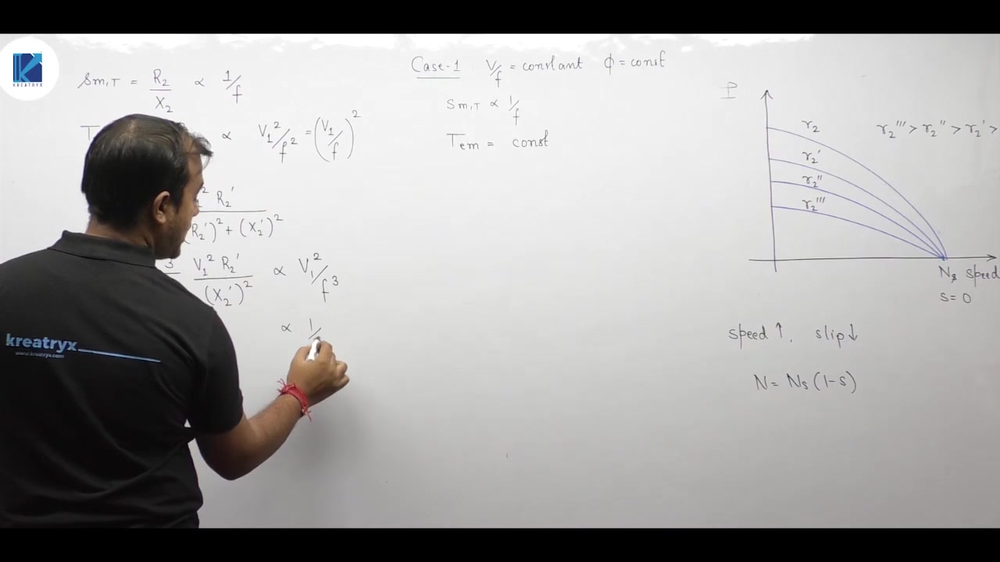

### Case 2: Constant Voltage with Variable Frequency (Above Base Speed)

Above rated base speed, supply voltage cannot exceed the rated insulation limit ($V_1 = \text{constant}$).
Speed is increased purely by raising frequency $f$:

- **Breakdown Slip**:
  $$
  s_{mT} \propto \frac{1}{f}
  $$

- **Maximum Torque**:
  $$
  T_{\text{max}} \propto \frac{1}{f^2}
  $$

- **Starting Torque**:
  $$
  T_{\text{st}} \propto \frac{1}{f^3}
  $$

Both peak torque and starting torque diminish rapidly as frequency rises in the field-weakening regime.

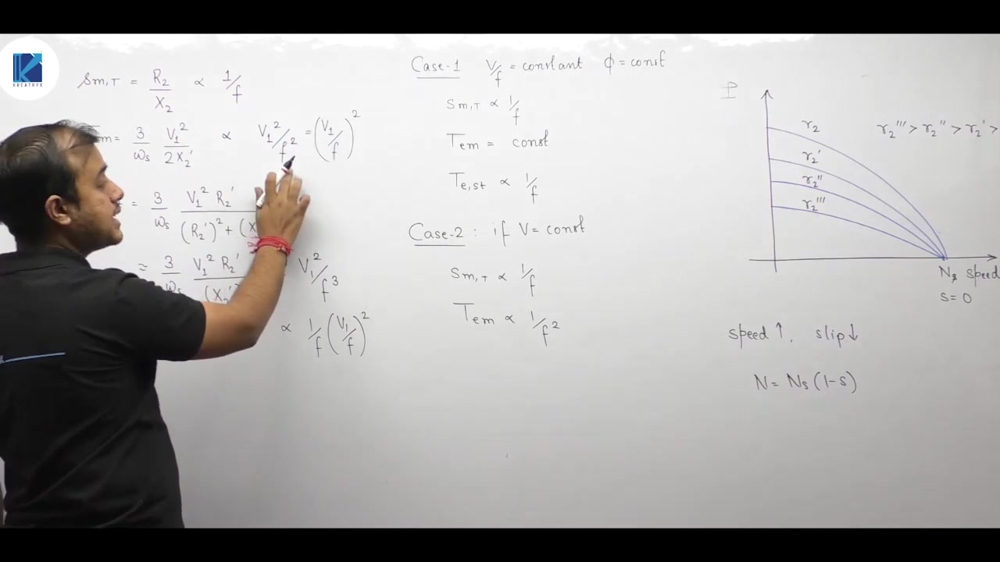

## Power-Slip Characteristics and Mechanical Power Modeling
_(23:07 - 28:00)_

### Concept of the Power-Slip Characteristic

Just as we plot developed torque against slip or speed, we can plot developed power.
An induction motor processes several power quantities:
1. Stator electrical input power $P_{\text{in}}$.
2. Stator copper and iron losses.
3. Air-gap power $P_g$ transferred across the air gap.
4. Rotor ohmic loss $P_{\text{cu2}}$.
5. Developed internal mechanical power $P_{\text{mech}}$.
6. Useful shaft output power $P_{\text{shaft}}$.

The power-slip characteristic specifically tracks developed mechanical power $P_{\text{mech}}$ as a function of rotor speed:
$$
P_{\text{mech}} = (1 - s) P_g
$$

### Equivalent Circuit Representation of Mechanical Power

Recall the single-phase Thevenin equivalent circuit of the induction motor.
The rotor branch has series impedance $j x_2'$ and effective load resistance $R_2'/s$.
The active power consumed in $R_2'/s$ is the total air-gap power $P_g$.

To isolate mechanical power, split the effective rotor resistance into two parts:
$$
\frac{R_2'}{s} = R_2' + R_2'\left(\frac{1}{s} - 1\right)
$$

The first term $R_2'$ represents physical rotor winding resistance.
The power dissipated in $R_2'$ is the rotor copper loss:
$$
P_{\text{cu2}} = 3 (I_2')^2 R_2' = s P_g
$$

The second term $R_2'(1/s - 1)$ is the electrical analog of mechanical power.
The active power dissipated in this resistance represents gross developed mechanical power:
$$
P_{\text{mech}} = 3 (I_2')^2 R_2'\left(\frac{1}{s} - 1\right) = (1 - s) P_g
$$

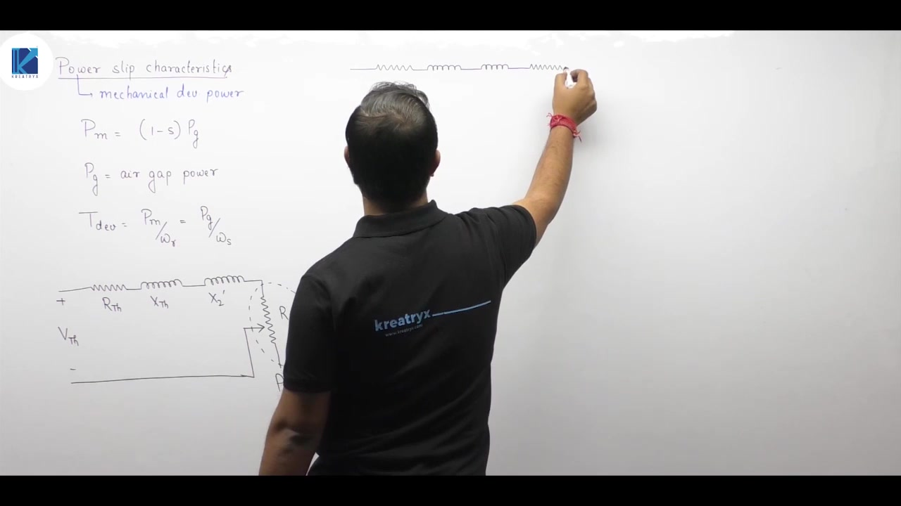

### Boundary Values of Mechanical Power

Examine the value of mechanical developed power at the speed boundaries:

1. **Standstill ($s = 1$, $N = 0$)**:
   The mechanical load resistance becomes:
   $$
   R_{\text{mech}} = R_2'\left(\frac{1}{1} - 1\right) = 0
   $$
   Because the resistance is zero, the power dissipated in it is zero:
   $$
   P_{\text{mech}}(s=1) = 0
   $$
   At starting, torque is non-zero, but rotor speed is zero.
   Hence mechanical power output is zero.

2. **Synchronous Speed ($s = 0$, $N = N_s$)**:
   The mechanical load resistance approaches infinity:
   $$
   R_{\text{mech}} = R_2'\left(\frac{1}{0} - 1\right) \to \infty
   $$
   An open circuit draws zero rotor current ($I_2' = 0$).
   Therefore, developed mechanical power is again zero:
   $$
   P_{\text{mech}}(s=0) = 0
   $$

> [!success] Boundary Behavior
> Developed mechanical power is identically zero at both standstill ($s=1$) and synchronous speed ($s=0$).
> It reaches a positive maximum at an intermediate speed between standstill and synchronous speed.

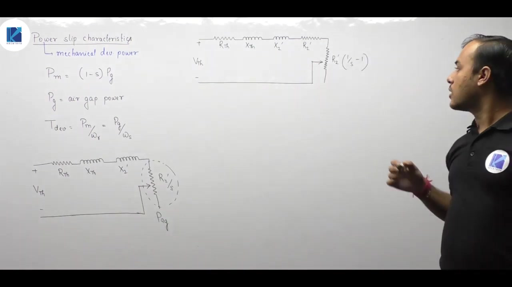

## Derivation of Maximum Mechanical Power
_(28:13 - 33:12)_

### Contrast Between Maximum Torque and Maximum Mechanical Power

A common conceptual error is assuming maximum torque and maximum mechanical power occur at the same slip.
Recall:
$$
T_{\text{dev}} = \frac{P_g}{\omega_s}
$$
Because synchronous speed $\omega_s$ is constant, maximizing torque is identical to maximizing air-gap power $P_g$.

However, mechanical power involves rotor speed:
$$
P_{\text{mech}} = T_{\text{dev}} \omega_r = T_{\text{dev}} \omega_s (1 - s)
$$
As slip $s$ changes, both torque $T_{\text{dev}}$ and speed factor $(1 - s)$ change simultaneously.
Maximizing torque does not maximize mechanical power.
The peak of mechanical power occurs at a different slip than the peak of torque.

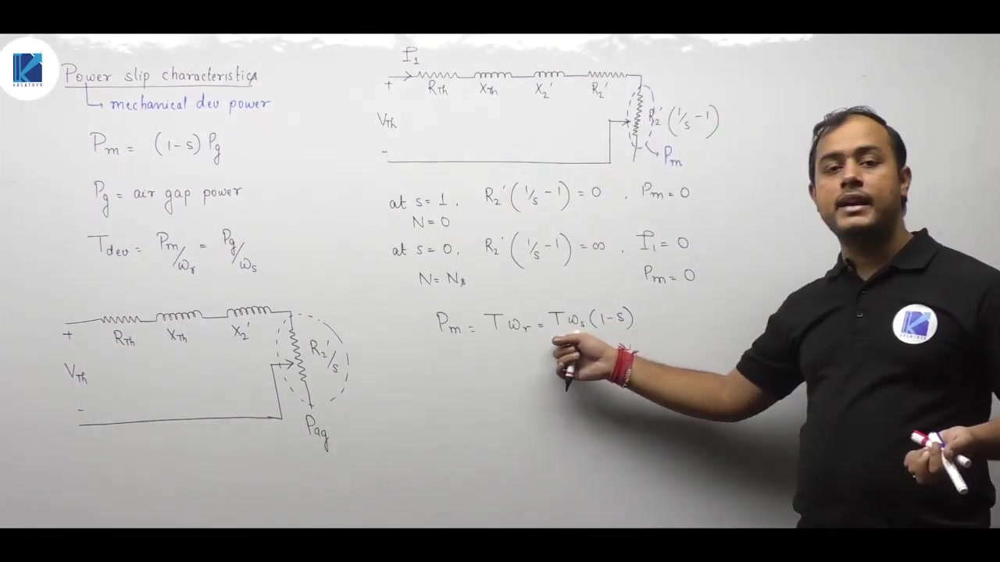

### Applying MPTT Across Mechanical Load Resistance

To maximize mechanical power, analyze the power absorbed by the load resistance:
$$
R_{\text{mech}} = R_2'\left(\frac{1}{s} - 1\right)
$$
Looking into the network from the terminals of $R_{\text{mech}}$, the remaining series source impedance is:
$$
Z_{\text{source}} = (R_{th} + R_2') + j (X_{th} + x_2')
$$

According to the Maximum Power Transfer Theorem, pure resistance absorbs maximum power when its value equals the magnitude of the source impedance:

> [!info] Maximum Power Transfer Condition
> $$
> R_2'\left(\frac{1}{s_{mp}} - 1\right) = |Z_{\text{source}}| = \sqrt{(R_{th} + R_2')^2 + (X_{th} + x_2')^2}
> $$

Here $s_{mp}$ denotes the slip at maximum mechanical power.

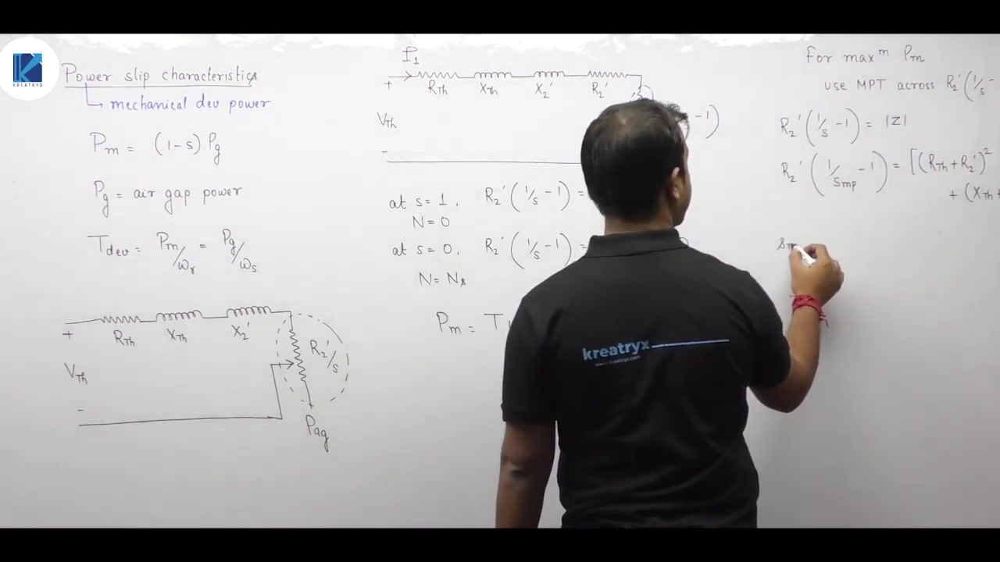

### Analytical Expression for Breakdown Slip $s_{mp}$

Divide both sides by $R_2'$:
$$
\frac{1}{s_{mp}} - 1 = \frac{\sqrt{(R_{th} + R_2')^2 + (X_{th} + x_2')^2}}{R_2'}
$$

Add 1 to both sides:
$$
\frac{1}{s_{mp}} = \frac{R_2' + \sqrt{(R_{th} + R_2')^2 + (X_{th} + x_2')^2}}{R_2'}
$$

Inverting gives the slip for maximum mechanical power:

> [!success] Slip at Maximum Mechanical Power
> $$
> s_{mp} = \frac{R_2'}{R_2' + \sqrt{(R_{th} + R_2')^2 + (X_{th} + x_2')^2}}
> $$

Compare this with the slip for maximum torque:
$$
s_{mT} = \frac{R_2'}{\sqrt{R_{th}^2 + (X_{th} + x_2')^2}}
$$
Notice that $s_{mp} < s_{mT}$.
Therefore, maximum mechanical power always occurs at a lower slip and higher rotor speed than maximum torque.

### Maximum Mechanical Power Formula

At slip $s_{mp}$, total circuit resistance seen by Thevenin source $V_{th}$ is:
$$
R_{\text{total}} = (R_{th} + R_2') + |Z_{\text{source}}|
$$
Calculating current and evaluating total three-phase power $3 (I_2')^2 R_{\text{mech}}$ gives:

> [!success] Peak Mechanical Developed Power
> $$
> P_{\text{mech,max}} = \frac{3 V_{th}^2}{2 \left[(R_{th} + R_2') + \sqrt{(R_{th} + R_2')^2 + (X_{th} + x_2')^2}\right]}
> $$

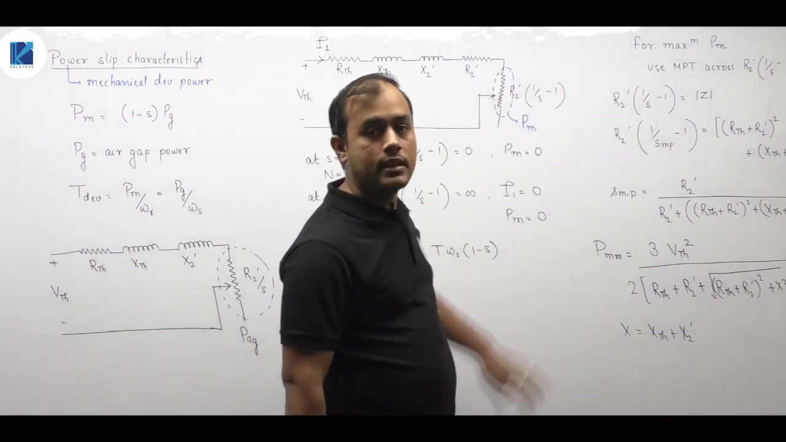

## Power-Slip Curve Across Operating Modes and Load-Speed Characteristics
_(33:12 - 39:12)_

### Complete Power-Slip Characteristic

Plot developed mechanical power $P_{\text{mech}}$ against rotor speed across all three operational regions:

1. **Motoring Region ($0 < N < N_s$, $0 < s < 1$)**:
   The rotor turns in the same direction as the stator magnetic field.
   Developed mechanical power is positive.
   Power starts at zero at standstill, peaks at $s_{mp}$, and returns to zero at synchronous speed $N_s$.

2. **Generating Region ($N > N_s$, $s < 0$)**:
   An external prime mover drives the rotor faster than synchronous speed.
   The slip becomes negative.
   Developed mechanical power becomes negative, indicating mechanical power is absorbed to supply electrical energy.

3. **Braking/Plugging Region ($N < 0$, $s > 1$)**:
   The rotor spins opposite to the revolving stator field.
   Slip exceeds unity.
   Developed power is negative, meaning mechanical energy is consumed alongside electrical input to brake the rotor.

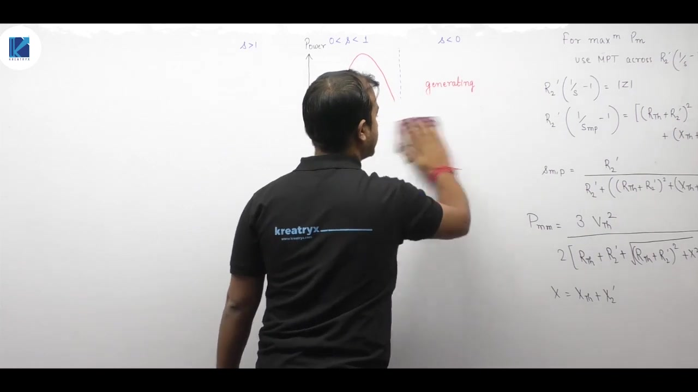

### Comparison of Peak Operating Conditions

Keep the distinction between maximum torque and maximum mechanical power clearly separated:

| Parameter | Load Resistance for MPTT | Source Impedance Magnitude |
| :--- | :--- | :--- |
| **Maximum Torque ($T_{\text{max}}$)** | $\dfrac{R_2'}{s}$ | $\sqrt{R_{th}^2 + (X_{th} + x_2')^2}$ |
| **Maximum Mechanical Power ($P_{\text{mech,max}}$)** | $R_2'\left(\dfrac{1}{s} - 1\right)$ | $\sqrt{(R_{th} + R_2')^2 + (X_{th} + x_2')^2}$ |

Notice that $s_{mp} < s_{mT}$.
Maximum mechanical power occurs closer to synchronous speed than breakdown torque.

### Operating Characteristics Under Varying Load

We now examine how machine variables behave as mechanical load on the shaft increases from no-load to full-load:

- **Speed Variation**:
  Load torque opposes the direction of rotor rotation.
  As shaft load increases, this opposing torque increases.
  The motor slows down slightly to develop the required counter-torque.

- **No-Load Speed**:
  At no-load, the only opposing torques are friction and windage.
  Required torque is tiny, so slip is nearly zero.
  For a 4-pole 50 Hz motor with $N_s = 1500\text{ rpm}$, no-load speed is around 1490 to 1495 rpm.

- **Full-Load Speed**:
  At rated full-load, the speed droops slightly to around 1440 to 1450 rpm.
  Slip remains modest, usually between 2% and 5%.
  The speed droop from no-load to full-load is small, resembling the speed regulation of a DC shunt motor.

## Operating Characteristics: Torque and Power Factor Evolution
_(39:13 - 44:08)_

### Torque Demand Under Mechanical Loading

At no-load, the rotor develops only a tiny electromagnetic torque.
This minimal torque overcomes mechanical bearing friction and aerodynamic windage.
When shaft load is applied, the load imposes a substantial counter-torque.
To maintain steady rotation, the motor must increase its developed torque:
$$
T_m = T_L
$$

In the normal low-slip operating region, developed torque is proportional to slip:
$$
T_{\text{dev}} \propto s
$$
Higher load demands greater torque.
Greater torque requires a larger operating slip.
Larger slip corresponds to a drop in rotor speed:
$$
N = N_s (1 - s)
$$
Both physical intuition and circuit equations confirm that increasing shaft load lowers operating speed.

### No-Load Power Factor Behavior

At no-load, the induction motor functions similarly to an open-circuited transformer.
It draws a no-load current $I_0$ composed of two parts:
1. Core-loss component $I_w$ in phase with applied voltage.
2. Magnetizing current $I_\mu$ in phase with mutual air-gap flux $\Phi$.

Because of the non-magnetic air gap, the reluctance of the magnetic circuit is high.
The magnetizing current $I_\mu$ is very large compared to $I_w$:
$$
I_\mu \gg I_w
$$
Magnetizing current represents purely reactive power.
Because reactive power heavily dominates over active losses at no-load, the no-load power factor is poor:
$$
\cos \phi_0 \approx 0.1 \text{ to } 0.2 \text{ lagging}
$$

### Phasor Diagram and Power Factor Improvement with Load

As mechanical load is applied to the shaft, the rotor draws active current to do mechanical work.
The rotor circuit contains winding resistance and leakage reactance.
Therefore, rotor current naturally lags induced rotor voltage.

The load current reflects onto the stator as primary load component $I_1'$.
Total stator current is the phasor sum:
$$
\bar{I}_1 = \bar{I}_0 + \bar{I}_1'
$$

On the phasor diagram, adding the active-dominated load component $I_1'$ swings total current $\bar{I}_1$ closer to the voltage axis.
The phase angle reduces:
$$
\phi_1 < \phi_0
$$
Since the angle decreases, the power factor increases:
$$
\cos \phi_1 > \cos \phi_0
$$

> [!success] Power Factor Improvement
> The power factor of an induction motor improves substantially as load increases from no-load to full-load.
> At rated full-load, power factor reaches typical values between 0.85 and 0.90 lagging.

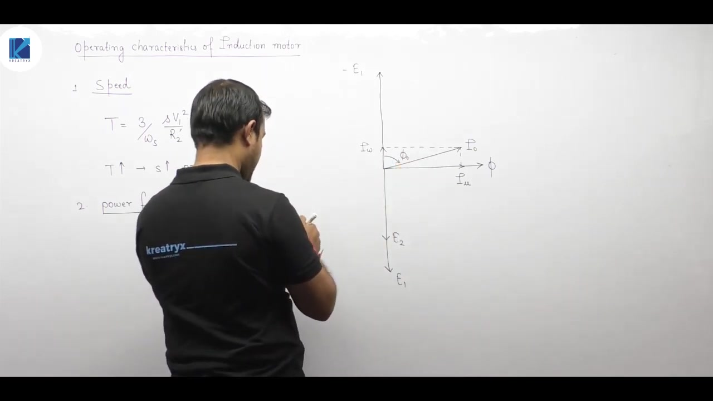

## Operating Characteristics: Efficiency, Stator Current, and Summary Curves
_(44:10 - 49:37)_

### Efficiency Variation with Load

Machine efficiency is defined as:
$$
\eta = \frac{P_{\text{out}}}{P_{\text{in}}} = \frac{P_{\text{out}}}{P_{\text{out}} + P_{\text{losses}}}
$$

At no-load, shaft output power is zero ($P_{\text{out}} = 0$).
Even though no-load losses exist, the useful efficiency is zero.
As mechanical shaft load increases, output power increases rapidly.
Efficiency climbs steeply up to a maximum.

Maximum efficiency occurs when variable copper losses equal constant core, friction, and windage losses:
$$
P_{\text{cu}}(I_1) = P_{\text{constant}}
$$

If shaft load is increased beyond this optimal point, $I^2 R$ copper losses grow with the square of current.
These variable losses outpace the increase in useful shaft power, so efficiency declines.

> [!success] Efficiency Characteristic
> Induction motor efficiency starts at zero at no-load.
> It rises to a maximum around 75% to 85% of rated full-load, and then declines slightly at rated and overload conditions.

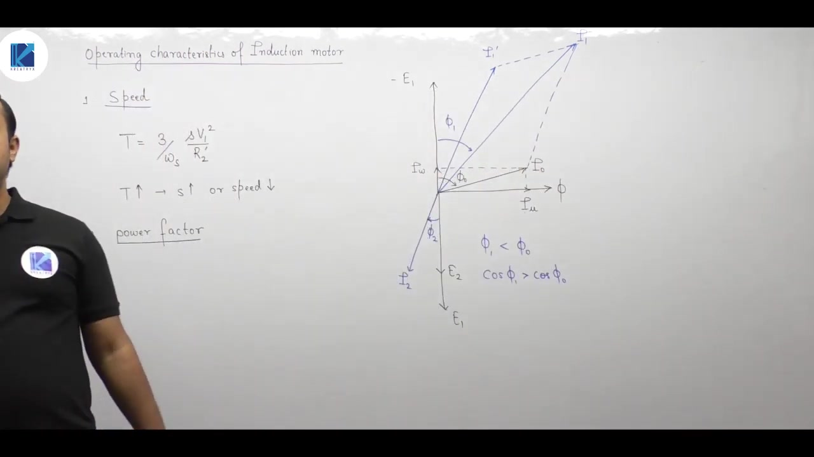

### Stator Current Variation with Load

At no-load, the motor draws a magnetizing-dominated current $I_0$.
This no-load current is typically 30% to 40% of rated full-load current.
As mechanical load on the rotor increases, the motor draws greater active current to meet shaft power demand.
Stator current rises monotonically from its no-load value up to 1.0 per unit at rated full-load.

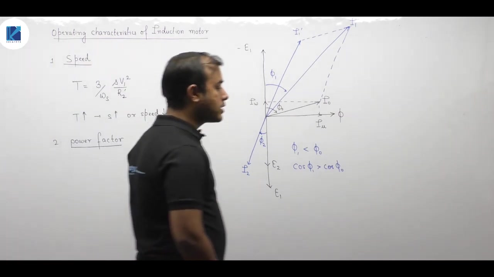

### Combined Operating Characteristics

We can plot all four major machine parameters on a normalized per-unit axis against load (0 to 1.0 p.u.):

1. **Rotor Speed ($N$)**:
   Starts very close to synchronous speed $N_s$ at no-load.
   Droops slightly (by 2% to 5%) in an almost linear manner toward rated full-load.

2. **Power Factor ($\cos \phi$)**:
   Starts very low (0.1 to 0.2 lagging) at no-load.
   Rises steeply as active current increases, leveling off around 0.85 to 0.90 lagging near full-load.

3. **Efficiency ($\eta$)**:
   Starts at zero at no-load.
   Rises smoothly to a peak at partial load, then gently decreases toward full-load.

4. **Stator Current ($I$)**:
   Starts at roughly 0.3 p.u. at no-load and increases monotonically to 1.0 p.u. at full-load.

5. **Developed Torque ($T$)**:
   Starts nearly at zero (supplying only friction and windage) and increases linearly with load.

| Machine Parameter | Variation from No-Load to Full-Load |
| :--- | :--- |
| **Speed** | Decreases slightly |
| **Power Factor** | Increases significantly |
| **Stator Current** | Increases monotonically |
| **Developed Torque** | Increases linearly |
| **Efficiency** | First increases to maximum, then decreases |

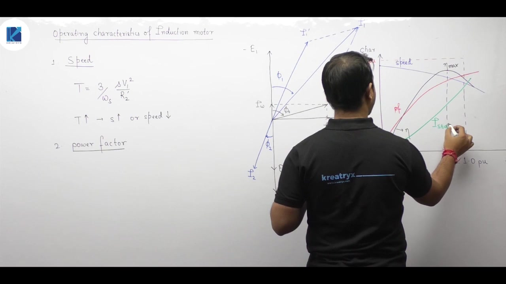

---

## Summary and Key Takeaways

- Increasing rotor resistance preserves peak breakdown torque magnitude while shifting the peak toward lower speeds and increasing starting torque.
- Higher leakage reactance reduces starting torque, maximum breakdown torque, and intermediate torques across all slips.
- Supply voltage scaling shifts the entire torque-speed curve vertically by $V_1^2$ without changing the speed corresponding to maximum torque.
- In constant $V/f$ operation below base speed, maximum breakdown torque remains constant and starting torque varies inversely with frequency as $T_{\text{st}} \propto 1/f$.
- Above base speed with constant voltage, maximum torque scales as $T_{\text{max}} \propto 1/f^2$ and starting torque scales as $T_{\text{st}} \propto 1/f^3$.
- Mechanical power is modeled by fictitious resistance $R_2'(1/s - 1)$, and reaches its peak at slip $s_{mp} = \frac{R_2'}{R_2' + \sqrt{(R_{th} + R_2')^2 + (X_{th} + x_2')^2}}$, which is strictly less than breakdown slip $s_{mT}$.
- At no-load, an induction motor draws a high magnetizing current through the air gap, resulting in a low power factor between 0.1 and 0.2 lagging.
- Applying shaft load increases active stator current, which causes power factor to rise toward 0.85 to 0.90 lagging and causes efficiency to reach a peak where variable copper losses equal constant losses.

