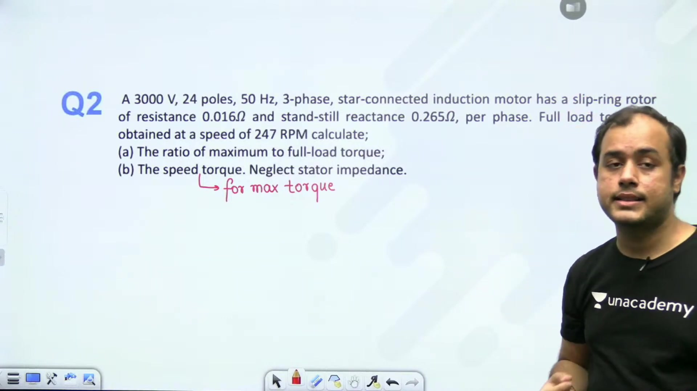
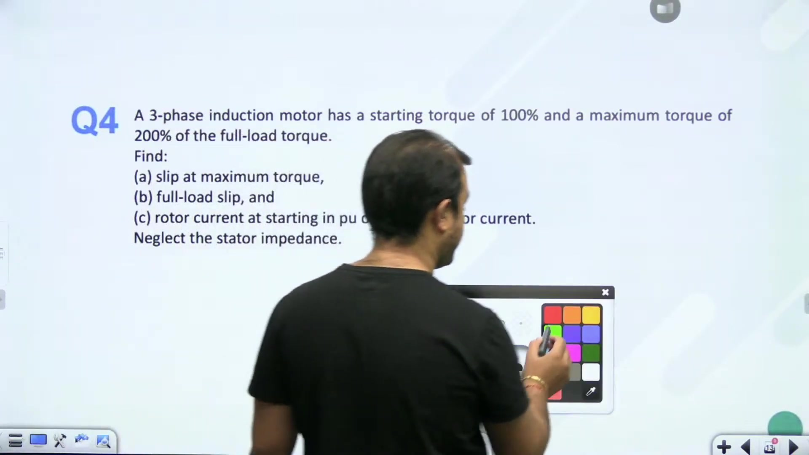
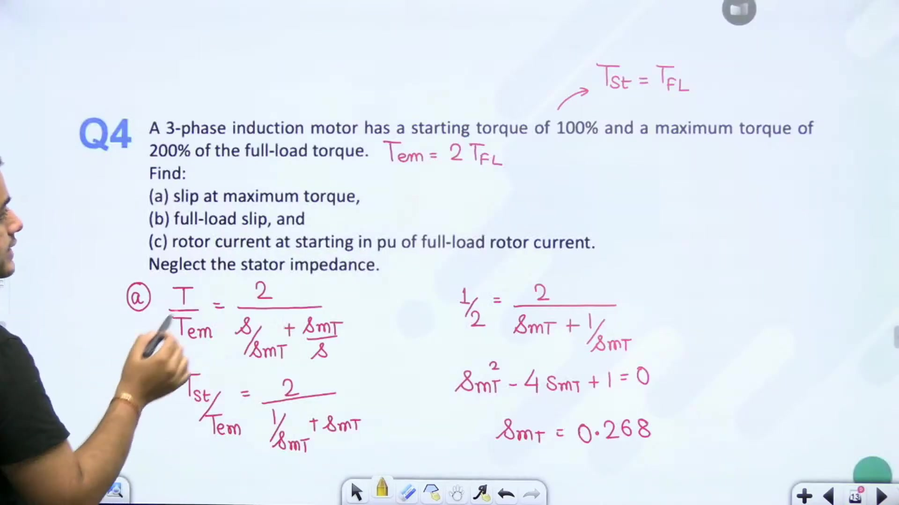
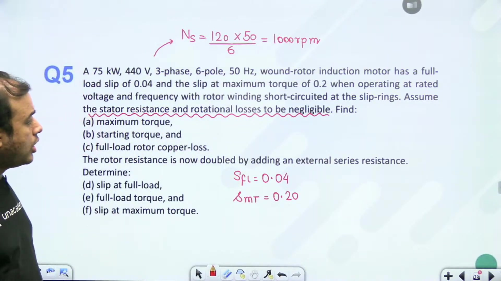
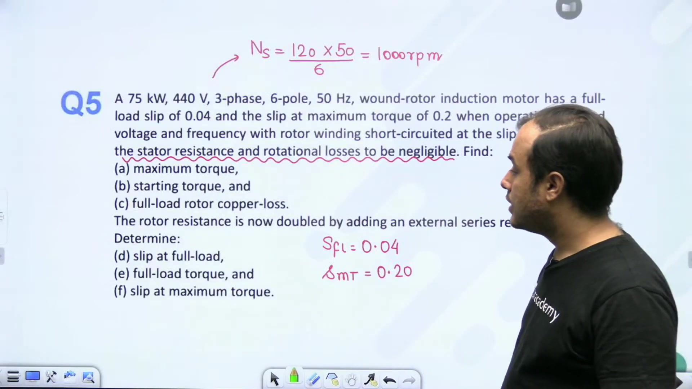
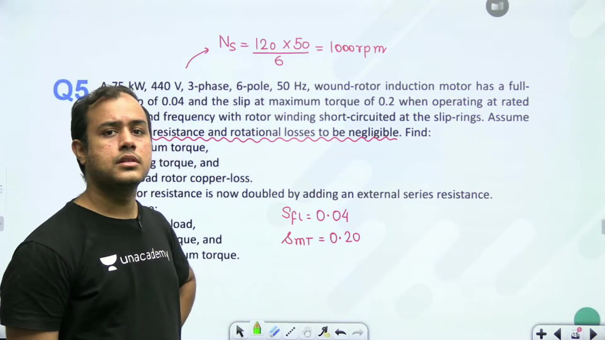
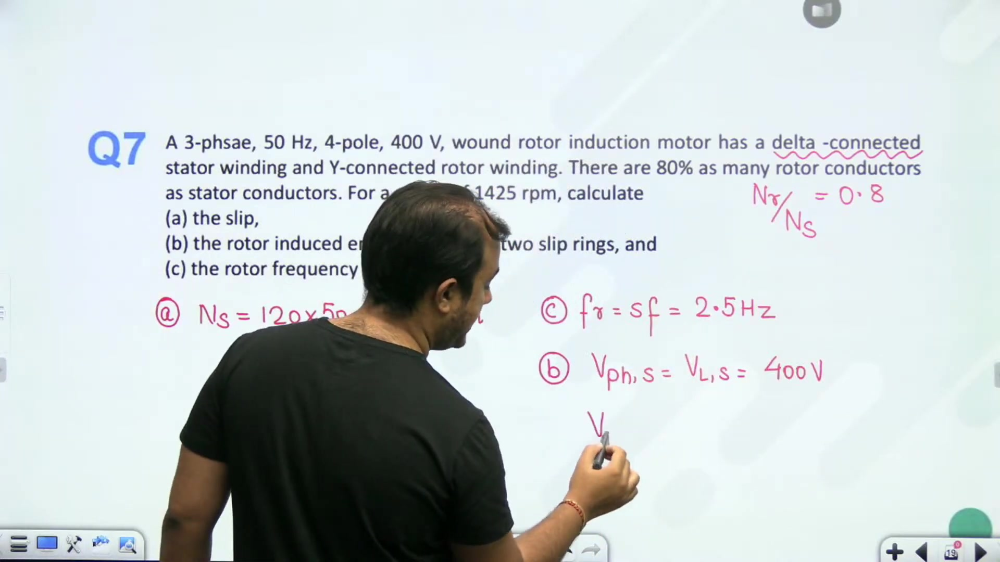
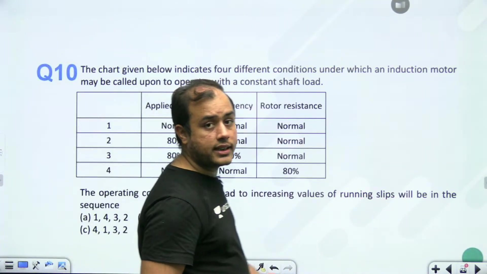
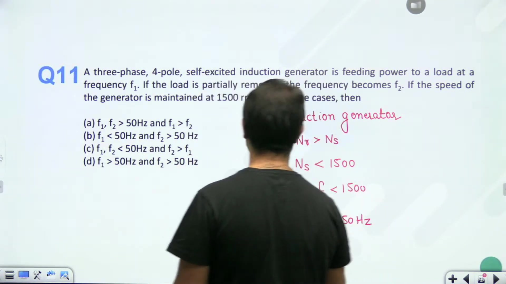
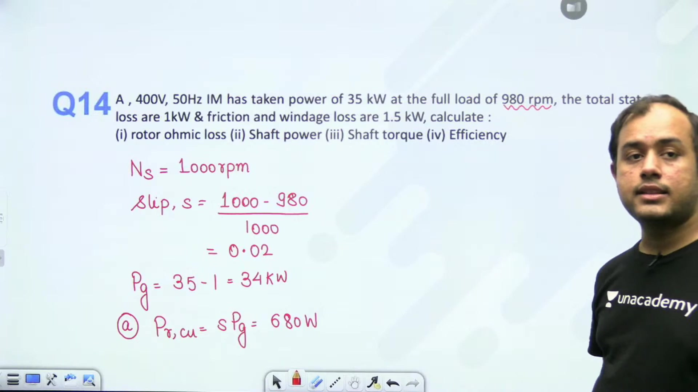

# Torque Slip Characteristics - 1 | L 39 | Electrical Machines | GATE 2022 | Ankit Sir

- **Source**: https://www.youtube.com/watch?v=jhmeR1x2eco
- **Duration**: 01:20:24
- **Compiled**: 2026-09-23

---

## Overview

This lecture solves key numerical problems on 3-phase induction motors with a focus on torque-slip characteristics and power flow. It covers developed torque, breakdown conditions, and the distinction between maximum torque and maximum mechanical power. Worked examples demonstrate the use of normalized torque ratios to solve exam problems without requiring absolute terminal voltages. The session also analyzes external rotor resistance control, plugging mode dynamics, time harmonics in inverter supplies, and full energy audits.

## Contents

- [[#Core Themes in Induction Motor Problems and Motor Specification|Core Themes in Induction Motor Problems and Motor Specification]]
- [[#Developed Torque and Mechanical Power at Specified Slip|Developed Torque and Mechanical Power at Specified Slip]]
- [[#Maximum Mechanical Power and Slip at Maximum Power|Maximum Mechanical Power and Slip at Maximum Power]]
- [[#Problem 2: Multi-Pole Induction Motor and Torque Ratio Analysis|Problem 2: Multi-Pole Induction Motor and Torque Ratio Analysis]]
- [[#Problem 3: Wound Rotor Performance and Rotor Resistance Addition|Problem 3: Wound Rotor Performance and Rotor Resistance Addition]]
- [[#Power Conversion in Horsepower and Torque Percentage Equations|Power Conversion in Horsepower and Torque Percentage Equations]]
- [[#Determining Full-Load Operating Slip from Breakdown Ratios|Determining Full-Load Operating Slip from Breakdown Ratios]]
- [[#Problem 5: Wound-Rotor Induction Motor and External Resistance|Problem 5: Wound-Rotor Induction Motor and External Resistance]]
- [[#External Resistance for Maximum Starting Torque and Doubled Resistance|External Resistance for Maximum Starting Torque and Doubled Resistance]]
- [[#Operation Under Constant Shaft Load and Speed Reduction|Operation Under Constant Shaft Load and Speed Reduction]]
- [[#Rotor Induced EMF and Voltage Between Slip Rings|Rotor Induced EMF and Voltage Between Slip Rings]]
- [[#Braking Mode and Time-Domain EMF Expressions|Braking Mode and Time-Domain EMF Expressions]]
- [[#Parameter Variations Under Constant Shaft Load|Parameter Variations Under Constant Shaft Load]]
- [[#Induction Generator Frequency Dynamics and Time Harmonics Slip|Induction Generator Frequency Dynamics and Time Harmonics Slip]]
- [[#Complete Induction Motor Power Flow and Efficiency|Complete Induction Motor Power Flow and Efficiency]]
- [[#Summary of Problem Patterns and Practice Strategy|Summary of Problem Patterns and Practice Strategy]]

---

## Core Themes in Induction Motor Problems and Motor Specification
_(00:13 - 05:11)_

Induction machine questions in competitive exams focus heavily on three major topics:
1. Equivalent circuit models and power flow balances.
2. Torque-slip and torque-speed equations.
3. Starting methods, rotor resistance control, and speed regulation.

Understanding how to compute synchronous speed, operating slip, and referred rotor quantities is the foundation of solving these numerical problems.

### Problem Formulation: 4-Pole Induction Motor Parameters

Consider a 3-phase induction motor with the following specifications:
- Stator winding: 4-pole, star-connected.
- Supply: 50 Hz, 200 V line-to-line.
- Rotor winding parameters per phase at standstill:
  - Resistance: $r_2 = 0.1\,\Omega$
  - Leakage reactance: $x_2 = 0.9\,\Omega$
- Rotor-to-stator turns ratio: $k = \frac{N_{\text{rotor}}}{N_{\text{stator}}} = 0.67$.

We want to calculate the performance of this motor under various operating conditions.

> [!example] Problem Setup
> A 3-phase, 4-pole, star-connected 50 Hz induction motor operates from a 200 V supply. The standstill rotor parameters per phase are $r_2 = 0.1\,\Omega$ and $x_2 = 0.9\,\Omega$. The turns ratio is $k = 0.67$. We seek to determine synchronous speed, operating speed at 4% slip, and referred rotor phase voltage.

### Determining Synchronous Speed and Rotor Speed

The synchronous speed of the rotating magnetic field depends directly on supply frequency and pole count:

$$N_s = \frac{120 f}{P} = \frac{120 \times 50}{4} = 1500\text{ rpm}$$

The mechanical synchronous speed in radians per second is:

$$\omega_s = \frac{2 \pi N_s}{60} = \frac{2 \pi \times 1500}{60} = 50 \pi \approx 157.08\text{ rad/s}$$

When the motor runs at a per-unit slip of $s = 0.04$ (4% slip), the actual rotor speed is:

$$N_r = N_s (1 - s) = 1500 \times (1 - 0.04) = 1500 \times 0.96 = 1440\text{ rpm}$$

The rotor mechanical angular velocity is:

$$\omega_r = \frac{2 \pi N_r}{60} = \frac{2 \pi \times 1440}{60} = 48 \pi \approx 150.80\text{ rad/s}$$

### Referring Stator Supply Voltage to the Rotor Side

To solve the rotor circuit, we can either refer rotor parameters to the stator side or refer stator voltage to the rotor side. Working directly on the rotor side avoids scaling impedances by $k^2$.

Since the stator is star-connected, the stator phase voltage is:

$$V_{1,ph} = \frac{V_L}{\sqrt{3}} = \frac{200}{\sqrt{3}}\text{ V}$$

The standstill induced EMF per phase in the rotor is obtained by multiplying by the turns ratio $k$:

$$V_2 = k V_{1,ph} = 0.67 \times \frac{200}{\sqrt{3}} = \frac{134}{\sqrt{3}}\text{ V} \approx 77.37\text{ V}$$

With $V_2$, $r_2$, and $x_2$ known, all subsequent torque and power quantities can be determined directly.

## Developed Torque and Mechanical Power at Specified Slip
_(05:11 - 09:54)_

Once circuit quantities are referred to the rotor, we compute developed electromagnetic torque and mechanical power at any given slip. 

### Torque Calculation at 4% Slip

At a slip of $s = 0.04$, the effective rotor resistance is:

$$\frac{r_2}{s} = \frac{0.1}{0.04} = 2.5\,\Omega$$

The general expression for developed electromagnetic torque in a 3-phase induction motor, neglecting stator impedance, is:

$$T_{\text{dev}} = \frac{3}{\omega_s} \frac{V_2^2 \left(\frac{r_2}{s}\right)}{\left(\frac{r_2}{s}\right)^2 + x_2^2}$$

The parameters are $V_2 = \frac{134}{\sqrt{3}}\text{ V}$, $\omega_s = 50 \pi \approx 157.08\text{ rad/s}$, $\frac{r_2}{s} = 2.5\,\Omega$, and $x_2 = 0.9\,\Omega$.

Substitute these numerical values:

$$T_{\text{dev}} = \frac{3}{50 \pi} \frac{\left(\frac{134}{\sqrt{3}}\right)^2 \times 2.5}{(2.5)^2 + (0.9)^2} = \frac{3}{50 \pi} \frac{\frac{17956}{3} \times 2.5}{6.25 + 0.81}$$

$$T_{\text{dev}} = \frac{17956 \times 2.5}{50 \pi \times 7.06} = \frac{44890}{1108.98} \approx 40.48\text{ N}\cdot\text{m}$$

### Mechanical Power Developed

Mechanical power developed across all three phases equals electromagnetic torque multiplied by rotor angular velocity:

$$P_{\text{mech}} = T_{\text{dev}} \omega_r$$

Since $\omega_r = 48 \pi\text{ rad/s}$:

$$P_{\text{mech}} = 40.48 \times 48 \pi \approx 6103.5\text{ W} \approx 6.104\text{ kW}$$

Also, mechanical power can be computed directly from air-gap power:

$$P_g = 3 I_2^2 \left(\frac{r_2}{s}\right) = \frac{P_{\text{mech}}}{1 - s}$$

$$P_{\text{mech}} = (1 - s) P_g = (1 - 0.04) \times \frac{6103.5}{0.96} = 6103.5\text{ W}$$

### Breakdown Torque and Slip at Maximum Torque

Maximum developed torque occurs when the effective rotor resistance equals standstill reactance:

$$s_{mT} = \frac{r_2}{x_2} = \frac{0.1}{0.9} = \frac{1}{9} \approx 0.1111$$

The breakdown torque expression is:

$$T_{\text{max}} = \frac{3}{2 \omega_s} \frac{V_2^2}{x_2}$$

Substitute $V_2 = \frac{134}{\sqrt{3}}\text{ V}$ and $x_2 = 0.9\,\Omega$:

$$T_{\text{max}} = \frac{3}{2 \times 50 \pi} \frac{\frac{17956}{3}}{0.9} = \frac{17956}{100 \pi \times 0.9} = \frac{17956}{282.74} \approx 63.51\text{ N}\cdot\text{m}$$

> [!success] Result
> At 4% slip, developed torque is $T_{\text{dev}} = 40.48\text{ N}\cdot\text{m}$ and mechanical power is $P_{\text{mech}} = 6.104\text{ kW}$. The maximum breakdown torque is $T_{\text{max}} = 63.51\text{ N}\cdot\text{m}$, occurring at slip $s_{mT} = 0.1111$.

## Maximum Mechanical Power and Slip at Maximum Power
_(09:57 - 14:47)_

Maximum developed torque and maximum developed mechanical power occur at different rotor speeds. Confusing these two conditions is a common mistake in exam problems.

### Speed at Maximum Torque

With breakdown slip $s_{mT} = \frac{1}{9} \approx 0.1111$, the motor speed at maximum torque is:

$$N_{mT} = N_s (1 - s_{mT}) = 1500 \times \left(1 - \frac{1}{9}\right) = 1500 \times \frac{8}{9} = 1333.33\text{ rpm}$$

### Maximum Power Transfer Condition for Mechanical Power

In the rotor equivalent circuit, mechanical power developed per phase is dissipated across the variable load resistance:

$$R_L' = r_2 \left(\frac{1 - s}{s}\right)$$

The source impedance feeding this variable load resistance consists of the rotor winding resistance and leakage reactance:

$$Z_{\text{source}} = r_2 + j x_2$$

By the Maximum Power Transfer Theorem (MPTT), maximum mechanical power occurs when the load resistance equals the magnitude of the source impedance:

$$R_L' = |Z_{\text{source}}| = \sqrt{r_2^2 + x_2^2}$$

### Determining the Slip at Maximum Mechanical Power

Substitute $R_L' = r_2 \left(\frac{1 - s_{mP}}{s_{mP}}\right) = \frac{r_2}{s_{mP}} - r_2$:

$$\frac{r_2}{s_{mP}} - r_2 = \sqrt{r_2^2 + x_2^2}$$

$$\frac{r_2}{s_{mP}} = r_2 + \sqrt{r_2^2 + x_2^2}$$

Solving for the slip at maximum mechanical power $s_{mP}$:

$$s_{mP} = \frac{r_2}{r_2 + \sqrt{r_2^2 + x_2^2}}$$

Now calculate the impedance magnitude with $r_2 = 0.1\,\Omega$ and $x_2 = 0.9\,\Omega$:

$$|Z_2| = \sqrt{(0.1)^2 + (0.9)^2} = \sqrt{0.01 + 0.81} = \sqrt{0.82} \approx 0.9055\,\Omega$$

Substitute $|Z_2|$ into the slip equation:

$$s_{mP} = \frac{0.1}{0.1 + 0.9055} = \frac{0.1}{1.0055} \approx 0.09945$$

Notice that $s_{mP} \approx 0.0995$ is slightly less than $s_{mT} = 0.1111$. So maximum mechanical power occurs at a slightly higher speed than maximum torque.

### Evaluating Maximum Mechanical Power

The total 3-phase maximum mechanical power is given by:

$$P_{\text{mech,max}} = 3 \times \frac{V_2^2}{2 \left(r_2 + \sqrt{r_2^2 + x_2^2}\right)}$$

Substitute $V_2 = \frac{134}{\sqrt{3}}\text{ V}$ and the denominator value $r_2 + |Z_2| = 1.0055\,\Omega$:

$$P_{\text{mech,max}} = 3 \times \frac{\frac{17956}{3}}{2 \times 1.0055} = \frac{17956}{2.011} \approx 8928.89\text{ W} \approx 8.93\text{ kW}$$

> [!success] Result
> Slip at maximum mechanical power is $s_{mP} = 0.0995$. The maximum mechanical power developed is $P_{\text{mech,max}} = 8.93\text{ kW}$.

## Problem 2: Multi-Pole Induction Motor and Torque Ratio Analysis
_(14:50 - 20:14)_

When solving torque-speed problems, you often do not need terminal voltage. Using normalized torque ratio formulas allows you to solve problems quickly.

### Torque Equation Tools

Two primary mathematical relationships are essential when stator impedance is neglected:

1. The absolute developed torque formula:

$$T = \frac{3}{\omega_s} \frac{V_1^2 \left(\frac{r_2}{s}\right)}{\left(\frac{r_2}{s}\right)^2 + x_2^2}$$

2. The normalized torque ratio formula:

$$\frac{T}{T_{\text{max}}} = \frac{2}{\frac{s_{mT}}{s} + \frac{s}{s_{mT}}}$$

This second equation depends only on the ratio of operating slip $s$ to breakdown slip $s_{mT}$.

### Problem 2 Formulation

> [!example] Problem
> A 3000 V, 24-pole, 50 Hz, 3-phase star-connected induction motor has rotor parameters referred to rotor: $r_2 = 0.016\,\Omega$ and $x_2 = 0.265\,\Omega$. At full load, the motor runs at 244 rpm. Determine:
> 1. Full load slip $s_{FL}$.
> 2. Slip at maximum torque $s_{mT}$.
> 3. The ratio of starting torque to full load torque $\frac{T_{\text{st}}}{T_{FL}}$.

### Determining Synchronous Speed and Full Load Slip

Compute the synchronous speed:

$$N_s = \frac{120 f}{P} = \frac{120 \times 50}{24} = 250\text{ rpm}$$

With full load speed $N_r = 244\text{ rpm}$, the full load slip is:

$$s_{FL} = \frac{N_s - N_r}{N_s} = \frac{250 - 244}{250} = \frac{6}{250} = 0.024$$

### Slip at Maximum Torque

The slip at maximum torque depends only on rotor resistance and standstill leakage reactance:

$$s_{mT} = \frac{r_2}{x_2} = \frac{0.016}{0.265} \approx 0.06038$$

### Ratio of Starting Torque to Full Load Torque

Starting torque occurs at slip $s = 1$. The ratio of starting torque to maximum torque is:

$$\frac{T_{\text{st}}}{T_{\text{max}}} = \frac{2}{\frac{s_{mT}}{1} + \frac{1}{s_{mT}}} = \frac{2 s_{mT}}{1 + s_{mT}^2}$$

The ratio of full load torque to maximum torque is:

$$\frac{T_{FL}}{T_{\text{max}}} = \frac{2}{\frac{s_{mT}}{s_{FL}} + \frac{s_{FL}}{s_{mT}}}$$

Dividing the two ratios gives:

$$\frac{T_{\text{st}}}{T_{FL}} = \frac{\frac{T_{\text{st}}}{T_{\text{max}}}}{\frac{T_{FL}}{T_{\text{max}}}} = \frac{\frac{s_{mT}}{s_{FL}} + \frac{s_{FL}}{s_{mT}}}{s_{mT} + \frac{1}{s_{mT}}}$$

Substitute $s_{FL} = 0.024$ and $s_{mT} = 0.06038$:

$$\frac{s_{mT}}{s_{FL}} = \frac{0.06038}{0.024} \approx 2.516$$

$$\frac{s_{FL}}{s_{mT}} = \frac{0.024}{0.06038} \approx 0.3975$$

The numerator is:

$$2.516 + 0.3975 = 2.9135$$

The denominator is:

$$0.06038 + \frac{1}{0.06038} = 0.06038 + 16.562 \approx 16.622$$

So the torque ratio is:

$$\frac{T_{\text{st}}}{T_{FL}} = \frac{2.9135}{16.622} \approx 0.1753$$

> [!success] Result
> Full load slip is $s_{FL} = 0.024$, slip at breakdown torque is $s_{mT} = 0.0604$, and starting torque is approximately $17.5\%$ of full load torque.

## Problem 3: Wound Rotor Performance and Rotor Resistance Addition
_(20:17 - 25:06)_

In GATE examinations, complete equivalent circuits with magnetizing branches and stator impedances are rarely specified. Unless test data like no-load or blocked-rotor tests are given, always neglect stator resistance and leakage reactance.

### Problem Formulation: 400 V Induction Motor

> [!example] Problem Setup
> A 3-phase, 4-pole, 50 Hz star-connected induction motor operates on a 400 V supply. The rotor winding parameters referred to rotor are:
> - $r_2 = 0.05\,\Omega$
> - $x_2 = 0.25\,\Omega$
> The turns ratio of stator to rotor per phase is $k = \frac{N_1}{N_2} = 2$.
> Full-load slip is $s_{FL} = 0.05$. 
> Find:
> 1. Full-load torque.
> 2. Maximum breakdown torque.
> 3. Additional external rotor resistance required to double the breakdown slip.

### Equivalent Stator and Rotor Voltages

Stator line voltage is $V_L = 400\text{ V}$. Because the stator is star-connected:

$$V_{1,ph} = \frac{400}{\sqrt{3}}\text{ V}$$

Referring stator phase voltage to the rotor using $k = N_1 / N_2 = 2$:

$$V_2 = \frac{V_{1,ph}}{k} = \frac{400}{2 \sqrt{3}} = \frac{200}{\sqrt{3}}\text{ V} \approx 115.47\text{ V}$$

Synchronous mechanical angular speed is:

$$\omega_s = \frac{120 f}{P} \times \frac{2 \pi}{60} = \frac{120 \times 50}{4} \times \frac{2 \pi}{60} = 50 \pi \approx 157.08\text{ rad/s}$$

### Full-Load Torque Evaluation

At full-load slip $s_{FL} = 0.05$:

$$\frac{r_2}{s_{FL}} = \frac{0.05}{0.05} = 1.0\,\Omega$$

Substitute into the torque formula:

$$\begin{aligned}
T_{FL} &= \frac{3}{\omega_s} \frac{V_2^2 \left(\frac{r_2}{s_{FL}}\right)}{\left(\frac{r_2}{s_{FL}}\right)^2 + x_2^2} \\
&= \frac{3}{50 \pi} \frac{\left(\frac{200}{\sqrt{3}}\right)^2 \times 1.0}{(1.0)^2 + (0.25)^2} = \frac{40000}{50 \pi \times (1 + 0.0625)} \\
&= \frac{40000}{50 \pi \times 1.0625} \approx \frac{40000}{166.897} \approx 239.67\text{ N}\cdot\text{m}
\end{aligned}$$

### Maximum Breakdown Torque

The slip at maximum torque is:

$$s_{mT} = \frac{r_2}{x_2} = \frac{0.05}{0.25} = 0.20$$

The maximum breakdown torque is:

$$T_{\text{max}} = \frac{3}{2 \omega_s} \frac{V_2^2}{x_2}$$

$$T_{\text{max}} = \frac{3}{2 \times 50 \pi} \frac{\frac{40000}{3}}{0.25} = \frac{40000}{100 \pi \times 0.25} = \frac{40000}{25 \pi} \approx 509.3\text{ N}\cdot\text{m}$$

Notice that the breakdown torque depends inversely on rotor reactance $x_2$ and is completely independent of rotor resistance $r_2$.

> [!success] Result
> Full-load torque is $T_{FL} \approx 239.7\text{ N}\cdot\text{m}$ and maximum breakdown torque is $T_{\text{max}} \approx 509.3\text{ N}\cdot\text{m}$.

## Power Conversion in Horsepower and Torque Percentage Equations
_(25:11 - 30:38)_

Engineering practice often specifies motor ratings in horsepower and expresses torque requirements as percentages of full-load torque.

### Mechanical Output and Conversion to Horsepower

When developed mechanical power $P_{\text{mech}}$ is obtained in watts, converting to metric horsepower uses:

$$\text{Horsepower (hp)} = \frac{P_{\text{mech}}\text{ in Watts}}{746}$$

For example, when $P_{\text{mech}} = 6242\text{ W}$:

$$\text{Output Power} = \frac{6242}{746} \approx 8.368\text{ hp}$$

### Problem 4: Percentage Torque Specifications

Consider a typical exam problem where parameter values like voltage and reactance are omitted entirely:

> [!example] Problem
> A 3-phase induction motor has:
> - Starting torque equal to 100% of full-load torque: $T_{\text{st}} = T_{FL}$.
> - Maximum torque equal to 200% of full-load torque: $T_{\text{max}} = 2 T_{FL}$.
> 
> Determine:
> 1. The slip at maximum torque $s_{mT}$.
> 2. The full-load operating slip $s_{FL}$.

### Setting Up the Ratio Equations

From the problem statement:

$$\frac{T_{\text{st}}}{T_{\text{max}}} = \frac{T_{FL}}{2 T_{FL}} = \frac{1}{2} = 0.5$$

We also know the theoretical relationship between starting torque and maximum breakdown torque:

$$\frac{T_{\text{st}}}{T_{\text{max}}} = \frac{2}{\frac{s_{mT}}{1} + \frac{1}{s_{mT}}} = \frac{2 s_{mT}}{1 + s_{mT}^2}$$

Equating this expression to $0.5$:

$$\frac{2 s_{mT}}{1 + s_{mT}^2} = \frac{1}{2}$$

Cross-multiplying gives:

$$4 s_{mT} = 1 + s_{mT}^2$$

$$s_{mT}^2 - 4 s_{mT} + 1 = 0$$

### Solving the Quadratic Slip Equation

Solve using the standard quadratic root formula:

$$s_{mT} = \frac{-(-4) \pm \sqrt{(-4)^2 - 4(1)(1)}}{2(1)} = \frac{4 \pm \sqrt{16 - 4}}{2} = \frac{4 \pm \sqrt{12}}{2}$$

$$s_{mT} = 2 \pm \sqrt{3}$$

Evaluating the two mathematical roots:
- $s_{mT1} = 2 + 1.732 = 3.732$
- $s_{mT2} = 2 - 1.732 = 0.268$

In the motoring region, slip must lie between 0 and 1. So we reject the root greater than 1:

$$s_{mT} = 2 - \sqrt{3} \approx 0.268$$

> [!success] Result
> Slip at maximum torque is $s_{mT} = 2 - \sqrt{3} \approx 0.268$.

## Determining Full-Load Operating Slip from Breakdown Ratios
_(30:41 - 35:35)_

After finding breakdown slip $s_{mT}$ from the starting torque ratio, the full-load operating slip $s_{FL}$ is found using the ratio of full-load torque to maximum torque.

### Setting Up the Full-Load Equation

The problem states that maximum breakdown torque is 200% of full-load torque:

$$T_{\text{max}} = 2 T_{FL} \implies \frac{T_{FL}}{T_{\text{max}}} = \frac{1}{2} = 0.5$$

The normalized torque equation at full load is:

$$\frac{T_{FL}}{T_{\text{max}}} = \frac{2}{\frac{s_{mT}}{s_{FL}} + \frac{s_{FL}}{s_{mT}}}$$

Substitute $\frac{T_{FL}}{T_{\text{max}}} = \frac{1}{2}$:

$$\frac{2}{\frac{s_{mT}}{s_{FL}} + \frac{s_{FL}}{s_{mT}}} = \frac{1}{2}$$

$$\frac{s_{mT}}{s_{FL}} + \frac{s_{FL}}{s_{mT}} = 4$$

### Solving for the Ratio of Slips

Let $y = \frac{s_{FL}}{s_{mT}}$. The equation becomes:

$$y + \frac{1}{y} = 4 \implies y^2 - 4 y + 1 = 0$$

This has the exact same algebraic structure as before:

$$y = \frac{s_{FL}}{s_{mT}} = 2 \pm \sqrt{3}$$

Under normal full-load operating conditions, the induction motor operates in the stable region where slip is small. Specifically, operating slip must be less than breakdown slip:

$$s_{FL} < s_{mT} \implies y = \frac{s_{FL}}{s_{mT}} < 1$$

Therefore we must choose the minus sign:

$$y = 2 - \sqrt{3} \approx 0.268$$

### Computing Full-Load Slip

Recall that $s_{mT} = 2 - \sqrt{3} \approx 0.268$. We find $s_{FL}$:

$$s_{FL} = s_{mT} \times (2 - \sqrt{3}) = (2 - \sqrt{3})^2$$

Expand the squared binomial:

$$(2 - \sqrt{3})^2 = 4 - 4 \sqrt{3} + 3 = 7 - 4 \sqrt{3}$$

$$s_{FL} = 7 - 4(1.73205) = 7 - 6.9282 = 0.0718$$

So the full-load slip is approximately $7.18\%$.

> [!success] Result
> Slip at maximum torque is $s_{mT} = 2 - \sqrt{3} \approx 0.268$ (26.8%), and full-load slip is $s_{FL} = (2 - \sqrt{3})^2 \approx 0.0718$ (7.18%).

## Problem 5: Wound-Rotor Induction Motor and External Resistance
_(35:36 - 40:31)_

Wound-rotor induction motors allow external three-phase resistance banks to be connected across the slip rings. This modifies starting torque and operating speed without changing the peak breakdown torque.

### Problem Formulation: 6-Pole Wound-Rotor Motor

> [!example] Problem
> A 3-phase, 50 Hz, 6-pole wound-rotor induction motor operates at rated voltage and frequency with slip rings short-circuited.
> - Full-load slip: $s_{FL} = 0.04$ (4%).
> - Slip at maximum torque: $s_{mT} = 0.20$ (20%).
> - Stator impedance and rotational losses are negligible.
> 
> Find:
> 1. The ratio of starting torque to full-load torque.
> 2. The ratio of maximum torque to full-load torque.
> 3. The additional resistance required per phase to achieve maximum torque at starting.

### Synchronous Speed and Natural Ratios

For a 6-pole, 50 Hz machine, synchronous speed is:

$$N_s = \frac{120 f}{P} = \frac{120 \times 50}{6} = 1000\text{ rpm}$$

The ratio of full-load torque to maximum breakdown torque is:

$$\frac{T_{FL}}{T_{\text{max}}} = \frac{2}{\frac{s_{mT}}{s_{FL}} + \frac{s_{FL}}{s_{mT}}}$$

We compute the slip ratios $\frac{s_{mT}}{s_{FL}} = \frac{0.20}{0.04} = 5$ and $\frac{s_{FL}}{s_{mT}} = \frac{0.04}{0.20} = 0.2$.

Substitute these into the torque ratio formula:

$$\frac{T_{FL}}{T_{\text{max}}} = \frac{2}{5 + 0.2} = \frac{2}{5.2} = \frac{1}{2.6} \approx 0.3846$$

Therefore:

$$\frac{T_{\text{max}}}{T_{FL}} = 2.6$$

### Starting Torque to Full-Load Torque Ratio

At starting, slip is $s = 1$. The ratio of starting torque to maximum torque is:

$$\frac{T_{\text{st}}}{T_{\text{max}}} = \frac{2 s_{mT}}{1 + s_{mT}^2} = \frac{2(0.20)}{1 + (0.20)^2} = \frac{0.40}{1 + 0.04} = \frac{0.40}{1.04} = \frac{40}{104} \approx 0.3846$$

Now find the ratio of starting torque to full-load torque:

$$\frac{T_{\text{st}}}{T_{FL}} = \frac{\frac{T_{\text{st}}}{T_{\text{max}}}}{\frac{T_{FL}}{T_{\text{max}}}} = \frac{\frac{2}{5.2}}{\frac{2}{5.2}} = 1.0$$

Starting torque exactly equals full-load torque for this motor configuration.

> [!success] Result
> The ratio of maximum torque to full-load torque is $\frac{T_{\text{max}}}{T_{FL}} = 2.6$, and the starting torque equals full-load torque: $\frac{T_{\text{st}}}{T_{FL}} = 1.0$.

## External Resistance for Maximum Starting Torque and Doubled Resistance
_(40:34 - 45:25)_

Adding external resistance shifts the maximum breakdown torque toward standstill ($s = 1$). This increases starting torque without diminishing maximum torque.

### Designing External Resistance for Maximum Starting Torque

To develop maximum torque at starting, the slip at maximum torque must equal 1:

$$s_{mT}' = 1.0$$

Since $s_{mT} = \frac{R_2}{X_2}$, the total rotor circuit resistance must equal the standstill reactance:

$$\frac{R_2 + R_{\text{ext}}}{X_2} = 1.0 \implies R_2 + R_{\text{ext}} = X_2$$

From the initial short-circuited condition:

$$s_{mT} = \frac{R_2}{X_2} = 0.20 \implies X_2 = \frac{R_2}{0.20} = 5 R_2$$

Substitute $X_2 = 5 R_2$ into the condition:

$$R_2 + R_{\text{ext}} = 5 R_2$$

$$R_{\text{ext}} = 4 R_2$$

So the external resistance added per phase must be four times the original rotor winding resistance.

### Doubling Rotor Resistance

Now consider another case: suppose external resistance is inserted such that total rotor resistance is doubled:

$$R_2' = 2 R_2 \implies R_{\text{ext}} = R_2$$

Because slip at maximum torque is directly proportional to rotor resistance:

$$s_{mT}' = \frac{R_2'}{X_2} = \frac{2 R_2}{X_2} = 2 s_{mT} = 2 \times 0.20 = 0.40$$

The new breakdown slip is $0.40$.

### New Starting Torque Ratio with Doubled Resistance

With $s_{mT}' = 0.40$, calculate the new ratio of starting torque to maximum torque:

$$\frac{T_{\text{st}}'}{T_{\text{max}}} = \frac{2 s_{mT}'}{1 + (s_{mT}')^2} = \frac{2(0.40)}{1 + (0.40)^2} = \frac{0.80}{1 + 0.16} = \frac{0.80}{1.16} \approx 0.6897$$

Recall that maximum torque $T_{\text{max}} = 2.6 T_{FL}$. We express the new starting torque as a multiple of full-load torque:

$$\frac{T_{\text{st}}'}{T_{FL}} = \frac{T_{\text{st}}'}{T_{\text{max}}} \times \frac{T_{\text{max}}}{T_{FL}} = 0.6897 \times 2.6 \approx 1.793$$

Starting torque increases from $1.0 T_{FL}$ to approximately $1.79 T_{FL}$.

> [!success] Result
> To achieve maximum torque at standstill, add $R_{\text{ext}} = 4 R_2$. When rotor resistance is doubled, the breakdown slip doubles to $s_{mT}' = 0.40$, and starting torque increases to $1.79$ times full-load torque.

## Operation Under Constant Shaft Load and Speed Reduction
_(45:29 - 50:15)_

When an induction motor drives a constant-torque load, any change in rotor resistance shifts the operating point along a horizontal load line.

### Constant Torque Condition

In the normal operating region (low slip region), developed electromagnetic torque is approximately linear with slip:

$$T \approx \frac{3}{\omega_s} \frac{s V^2}{R_2}$$

For a constant load torque $T_L = \text{constant}$ at rated voltage:

$$\frac{s}{R_2} = \text{constant} \implies \frac{s_1}{R_2} = \frac{s_2}{R_2'}$$

If rotor resistance is doubled by inserting external resistance ($R_2' = 2 R_2$):

$$s_2 = s_1 \times \frac{R_2'}{R_2} = 0.04 \times 2 = 0.08$$

The operating slip doubles from $4\%$ to $8\%$.

### New Operating Speed

Recall that synchronous speed is $N_s = 1000\text{ rpm}$. The original full-load speed with short-circuited slip rings was:

$$N_{r1} = 1000 \times (1 - 0.04) = 960\text{ rpm}$$

With doubled rotor resistance, the new operating speed becomes:

$$N_{r2} = N_s (1 - s_2) = 1000 \times (1 - 0.08) = 1000 \times 0.92 = 920\text{ rpm}$$

So rotor resistance control provides speed reduction below synchronous speed.

### Exact Calculation via Torque Ratio Equation

If we avoid the low-slip approximation and use the exact torque equation:

$$\frac{T_{FL}}{T_{\text{max}}} = \frac{2}{\frac{s_{mT}'}{s_2} + \frac{s_2}{s_{mT}'}}$$

Here $T_{FL} / T_{\text{max}} = 1 / 2.6 \approx 0.3846$ and $s_{mT}' = 0.40$:

$$\frac{2}{\frac{0.40}{s_2} + \frac{s_2}{0.40}} = \frac{1}{2.6} \implies \frac{0.40}{s_2} + \frac{s_2}{0.40} = 5.2$$

Multiply both sides by $s_2$:

$$0.40 + \frac{s_2^2}{0.40} = 5.2 s_2 \implies s_2^2 - 2.08 s_2 + 0.16 = 0$$

Solving this quadratic gives:

$$\begin{aligned}
s_2 &= \frac{2.08 \pm \sqrt{(2.08)^2 - 4(0.16)}}{2} = \frac{2.08 \pm \sqrt{3.6864}}{2} \\
&= \frac{2.08 - 1.92}{2} = \frac{0.16}{2} = 0.08
\end{aligned}$$

The exact quadratic formula yields precisely $s_2 = 0.08$. This confirms that the linear approximation is highly accurate in the normal operating range.

> [!success] Result
> Under constant load torque, doubling rotor resistance doubles operating slip to $s = 0.08$. Operating speed drops from 960 rpm to 920 rpm.

## Rotor Induced EMF and Voltage Between Slip Rings
_(50:15 - 55:27)_

Rotor induced voltage and frequency vary dynamically with slip. At standstill, an induction motor behaves as a transformer with an air gap. Under running conditions, rotor frequency and EMF scale directly with slip.

### Problem Formulation: Delta-Stator Induction Motor

> [!example] Problem
> A 3-phase, 50 Hz, 4-pole, 400 V wound-rotor induction motor has a delta-connected stator winding.
> - The rotor has 80% as many conductors as the stator ($N_2 / N_1 = 0.8$).
> - The motor runs at a speed of 1425 rpm.
> 
> Calculate:
> 1. Operating slip $s$.
> 2. Rotor frequency $f_r$.
> 3. Induced rotor EMF per phase at standstill and during running.
> 4. Voltage across the rotor slip rings during running.

### Why Delta Stators are Common

Torque is proportional to the square of phase voltage ($T \propto V_{ph}^2$). In delta connection:

$$V_{1,ph} = V_L = 400\text{ V}$$

If the stator were star-connected, phase voltage would drop by $\sqrt{3}$ to $230.9\text{ V}$, reducing torque by a factor of 3 for the same line voltage.

### Operating Slip and Rotor Frequency

Synchronous speed is:

$$N_s = \frac{120 f}{P} = \frac{120 \times 50}{4} = 1500\text{ rpm}$$

At rotor speed $N_r = 1425\text{ rpm}$, the slip is:

$$s = \frac{N_s - N_r}{N_s} = \frac{1500 - 1425}{1500} = \frac{75}{1500} = \frac{1}{20} = 0.05$$

Rotor frequency is given by the product of slip and supply frequency:

$$f_r = s f = 0.05 \times 50 = 2.5\text{ Hz}$$

### Rotor Induced EMF per Phase

Since conductor count is 80% of stator conductors, the effective turns ratio is:

$$k = \frac{N_2}{N_1} = 0.8$$

At standstill ($s = 1$), the rotor phase EMF behaves like a transformer secondary voltage:

$$E_2 = k V_{1,ph} = 0.8 \times 400 = 320\text{ V}$$

Under running conditions at slip $s = 0.05$, the induced phase EMF becomes:

$$E_{2r} = s E_2 = 0.05 \times 320 = 16\text{ V}$$

### Terminal Voltage Between Slip Rings

Wound-rotor motor slip rings are connected to the rotor winding terminals. Rotor windings are almost universally star-connected to provide three external slip rings with a common neutral point.

Because the rotor is star-connected, the voltage between any two slip rings is the line-to-line voltage:

$$V_{\text{slip rings}} = \sqrt{3} E_{2r} = 16 \sqrt{3}\text{ V} \approx 27.71\text{ V}$$

> [!success] Result
> Slip is $s = 0.05$, rotor frequency is $f_r = 2.5\text{ Hz}$, running rotor phase EMF is $E_{2r} = 16\text{ V}$, and the line voltage between slip rings is $V_{\text{slip rings}} = 16 \sqrt{3}\text{ V} \approx 27.71\text{ V}$.

## Braking Mode and Time-Domain EMF Expressions
_(55:30 - 61:31)_

Understanding the different operational modes of an induction machine clarifies how energy flows between electrical mains and the mechanical shaft.

### Problem 7: Induction Machine in Braking Mode (Plugging)

> [!example] Problem
> A 3-phase induction machine operates on a 3-phase fixed-frequency AC supply at a per-unit slip of $s = 1.5$.
> Which of the following statements are correct?
> 1. It delivers electrical power to the mains.
> 2. It draws mechanical power through the shaft.
> 3. It draws electrical power from the mains.

### Mechanics of the Braking Mode ($s > 1$)

When slip $s > 1$, the rotor runs in the direction opposite to the rotating magnetic field:

$$N_r = N_s (1 - s) = N_s (1 - 1.5) = -0.5 N_s$$

Because the rotor turns opposite to the rotating field, developed electromagnetic torque opposes the physical rotor rotation:

$$T_{\text{dev}} \text{ is in the forward direction, opposing negative } N_r$$

So mechanical power developed is negative:

$$P_{\text{mech}} = T_{\text{dev}} \omega_r < 0$$

A negative mechanical power means the machine absorbs mechanical power from the shaft.

Simultaneously, air-gap power is positive:

$$P_g = \frac{P_{\text{mech}}}{1 - s} = \frac{-|P_{\text{mech}}|}{-0.5} > 0$$

Positive air-gap power means the machine draws electrical power from the stator supply. Both electrical power from the mains and mechanical power from the shaft enter the rotor. All of this combined power is dissipated as heat in the rotor resistance ($P_{\text{cu2}} = s P_g = 1.5 P_g$).

So statements 2 and 3 are correct. The machine draws electrical power from the mains and draws mechanical power from the shaft.

### Problem 8: Time-Domain Rotor EMF Expression

> [!example] Problem
> In a 3-phase induction motor, the stator rotating field has angular speed $\omega$, and the actual rotor angular speed is $\omega_r$. The stator induced EMF is given by:
> 
> $$e_1(t) = k_{ws} N_1 \phi \sin(\omega t)$$
> 
> What is the induced rotor EMF $e_2(t)$ if the rotor has $N_2$ turns per phase and winding factor $k_{wr}$?

The rotor conductors experience flux cutting at slip speed:

$$\omega_{\text{slip}} = \omega - \omega_r$$

The per-unit slip is:

$$s = \frac{\omega - \omega_r}{\omega} \implies s \omega = \omega - \omega_r$$

The frequency of the induced rotor EMF is the slip frequency:

$$\omega_r' = s \omega = \omega - \omega_r$$

The magnitude of induced EMF scales with effective turns and slip frequency:

$$e_2(t) = s k_{wr} N_2 \phi \sin(s \omega t) = s k_{wr} N_2 \phi \sin((\omega - \omega_r) t)$$

> [!success] Result
> In braking mode ($s = 1.5$), the machine draws mechanical power from the shaft and electrical power from the mains. The instantaneous rotor EMF has frequency $s \omega = \omega - \omega_r$.

## Parameter Variations Under Constant Shaft Load
_(61:33 - 66:20)_

When an induction motor drives a constant-torque shaft load, variations in voltage, frequency, or resistance force the machine to adjust its operating slip.

### Problem Formulation: Ranking Operating Conditions by Running Slip

> [!example] Problem
> An induction motor drives a constant shaft torque under four different operating conditions:
> - Condition 1: Applied voltage normal, frequency normal, rotor resistance normal ($V_0, f_0, R_{20}$).
> - Condition 2: Applied voltage 80%, frequency normal, rotor resistance normal ($0.8 V_0, f_0, R_{20}$).
> - Condition 3: Applied voltage 80%, frequency 80%, rotor resistance normal ($0.8 V_0, 0.8 f_0, R_{20}$).
> - Condition 4: Applied voltage normal, frequency normal, rotor resistance 80% ($V_0, f_0, 0.8 R_{20}$).
> 
> Arrange the four operating conditions in ascending order of running slip.

### Relating Slip to Terminal Parameters

In the low-slip region, developed electromagnetic torque is expressed as:

$$T \approx \frac{3}{\omega_s} \frac{s V^2}{R_2}$$

Synchronous angular speed is proportional to frequency ($\omega_s \propto f$). Therefore:

$$T \propto \frac{s V^2}{f R_2}$$

Because the shaft torque is constant:

$$\frac{s V^2}{f R_2} = \text{constant} \implies s \propto \frac{f R_2}{V^2}$$

This proportional relationship allows direct comparison of all four conditions against the normal baseline slip $s_0$.

### Evaluating Each Condition

**Condition 1 (Baseline):**
All parameters are at rated values:

$$s_1 = s_0$$

**Condition 2 ($V = 0.8 V_0$):**
Voltage is reduced to 80% with frequency and resistance unchanged:

$$s_2 = s_0 \times \frac{1}{(0.8)^2} = \frac{s_0}{0.64} = 1.5625 s_0$$

**Condition 3 ($V = 0.8 V_0, f = 0.8 f_0$):**
Both voltage and frequency are reduced to 80%:

$$s_3 = s_0 \times \frac{0.8}{(0.8)^2} = \frac{s_0}{0.8} = 1.25 s_0$$

**Condition 4 ($R_2 = 0.8 R_{20}$):**
Rotor resistance is reduced to 80% with voltage and frequency normal:

$$s_4 = s_0 \times 0.8 = 0.8 s_0$$

### Sorting into Ascending Order

Comparing the numerical multipliers:
- Condition 4: $0.8 s_0$
- Condition 1: $1.0 s_0$
- Condition 3: $1.25 s_0$
- Condition 2: $1.5625 s_0$

In ascending order of running slip:

$$s_4 < s_1 < s_3 < s_2$$

The correct sequence is $4, 1, 3, 2$ (Option C).

> [!success] Result
> The running slip increases in the order $4, 1, 3, 2$. Lowering rotor resistance reduces slip, whereas lowering voltage without changing frequency causes the greatest increase in slip.

## Induction Generator Frequency Dynamics and Time Harmonics Slip
_(66:28 - 71:50)_

Induction generators and inverter-fed induction motors exhibit distinct frequency and harmonic characteristics that differ from standard sinusoidal line-fed operation.

### Problem 10: Isolated Induction Generator Frequency Dynamics

> [!example] Problem
> An induction generator driven at a fixed shaft speed of 1500 rpm delivers power to an isolated electrical load at frequency $f_1$. When the load is disconnected, the generated frequency becomes $f_2$.
> What is the relationship between $f_1$, $f_2$, and 50 Hz?

In generator mode, the rotor must run faster than the synchronous rotating field:

$$N_r > N_s \implies N_s < N_r = 1500\text{ rpm}$$

Since synchronous speed is $N_s = \frac{120 f}{P}$:

$$\frac{120 f_1}{4} < 1500 \implies f_1 < 50\text{ Hz}$$

The machine frequency droop characteristic dictates that frequency drops as electrical load increases. Removing the electrical load allows the machine to recover speed and frequency. So the no-load frequency $f_2$ must exceed the loaded frequency $f_1$:

$$f_2 > f_1$$

The generator cannot exceed 50 Hz. If frequency exceeded 50 Hz, $N_s$ would exceed 1500 rpm, converting the machine into a motor. Therefore:

$$f_1 < f_2 < 50\text{ Hz}$$

The correct answer is Option C.

### Problem 11: 5th Time Harmonic Slip in Inverter Drives

> [!example] Problem
> A 3-phase, 50 Hz Voltage Source Inverter (VSI) supplies a 3-phase, 4-pole induction motor. The output contains a dominant 5th harmonic. The motor operates at a fundamental slip of $s_1 = 0.04$.
> Calculate the operating slip with respect to the 5th harmonic.

Because the harmonic originates in the inverter voltage waveform, it is a time harmonic. The fundamental stator field rotates forward at synchronous speed $N_s$.

With fundamental slip $s_1 = 0.04$, rotor mechanical speed is:

$$N_r = (1 - s_1) N_s = (1 - 0.04) N_s = 0.96 N_s$$

For time harmonics, the phase sequence of the $k$-th harmonic follows:
- Harmonics with $k = 6m + 1$ (7th, 13th) have positive sequence and rotate at $+k N_s$.
- Harmonics with $k = 6m - 1$ (5th, 11th) have negative sequence and rotate backwards at $-k N_s$.

Therefore, the 5th time harmonic creates a rotating field spinning in reverse at:

$$N_{s5} = -5 N_s$$

### Calculating Harmonic Slip

The per-unit slip of the rotor with respect to the 5th harmonic field is:

$$s_5 = \frac{N_{s5} - N_r}{N_{s5}} = \frac{-5 N_s - 0.96 N_s}{-5 N_s}$$

Factoring out $N_s$ and simplifying:

$$s_5 = \frac{-5.96}{-5.0} = \frac{5.96}{5.0} = 1.192$$

Because $s_5 > 1$, the 5th harmonic operates in the braking (plugging) region, developing backward braking torque and producing parasitic rotor losses.

> [!success] Result
> For the induction generator, $f_1 < f_2 < 50\text{ Hz}$. For the inverter-fed motor, operating slip with respect to the 5th time harmonic is $s_5 = 1.192$.

## Complete Induction Motor Power Flow and Efficiency
_(71:53 - 78:04)_

A rigorous power flow audit traces energy conversions from electrical stator input to usable mechanical shaft torque, identifying copper losses, iron losses, and mechanical friction.

### Problem Formulation: 400 V, 35 kW Induction Motor

> [!example] Problem
> A 3-phase, 400 V, 50 Hz induction motor takes an electrical input of 35 kW when running at a full-load speed of 980 rpm.
> - Stator losses: 1 kW.
> - Friction and windage losses: 1.5 kW.
> 
> Calculate:
> 1. Full-load slip $s$.
> 2. Air-gap power $P_g$.
> 3. Rotor ohmic copper loss $P_{\text{cu2}}$.
> 4. Developed mechanical power $P_{\text{dev}}$.
> 5. Net shaft output power $P_{\text{shaft}}$.
> 6. Net shaft torque $T_{\text{shaft}}$.
> 7. Overall motor efficiency $\eta$.

### Synchronous Speed and Slip

Because pole number is not explicitly stated, select the standard synchronous speed closest to 980 rpm:

$$N_s = 1000\text{ rpm} \quad (P = 6\text{ poles})$$

Operating slip is:

$$s = \frac{N_s - N_r}{N_s} = \frac{1000 - 980}{1000} = \frac{20}{1000} = 0.02$$

### Power Flow Balance Equations

The energy flow progresses across the machine stages:

**1. Air-gap power $P_g$:**

$$P_g = P_{\text{in}} - P_{\text{stator}} = 35\text{ kW} - 1.0\text{ kW} = 34\text{ kW} = 34000\text{ W}$$

**2. Rotor copper loss $P_{\text{cu2}}$:**

$$P_{\text{cu2}} = s P_g = 0.02 \times 34000\text{ W} = 680\text{ W} = 0.68\text{ kW}$$

**3. Developed mechanical power $P_{\text{dev}}$:**

$$P_{\text{dev}} = (1 - s) P_g = P_g - P_{\text{cu2}} = 34\text{ kW} - 0.68\text{ kW} = 33.32\text{ kW}$$

**4. Shaft power output $P_{\text{shaft}}$:**
Subtract rotational friction and windage losses:

$$P_{\text{shaft}} = P_{\text{dev}} - P_{\text{fw}} = 33.32\text{ kW} - 1.5\text{ kW} = 31.82\text{ kW}$$

### Net Shaft Torque and Efficiency

The actual rotor mechanical speed in radians per second is:

$$\omega_r = \frac{2 \pi N_r}{60} = \frac{2 \pi \times 980}{60} = \frac{98 \pi}{3} \approx 102.625\text{ rad/s}$$

Net shaft torque delivered to the mechanical load is:

$$T_{\text{shaft}} = \frac{P_{\text{shaft}}}{\omega_r} = \frac{31820}{102.625} \approx 310.06\text{ N}\cdot\text{m}$$

Overall machine efficiency is the ratio of mechanical shaft output to electrical power input:

$$\eta = \frac{P_{\text{shaft}}}{P_{\text{in}}} \times 100\% = \frac{31.82\text{ kW}}{35.0\text{ kW}} \times 100\% \approx 90.91\%$$

> [!success] Result
> Air-gap power is $P_g = 34\text{ kW}$, rotor copper loss is $680\text{ W}$, net shaft power is $31.82\text{ kW}$, net shaft torque is $310.06\text{ N}\cdot\text{m}$, and overall efficiency is $90.91\%$.

## Summary of Problem Patterns and Practice Strategy
_(78:04 - 80:16)_

Solving induction motor problems requires connecting circuit concepts to mechanical outputs. Mastering a few core equations allows you to tackle any exam variation.

### Core Equation Summary

1. **Synchronous Speed and Slip:**

$$N_s = \frac{120 f}{P}, \quad s = \frac{N_s - N_r}{N_s}$$

2. **Developed Torque (Neglecting Stator Impedance):**

$$T = \frac{3}{\omega_s} \frac{V_2^2 \left(\frac{r_2}{s}\right)}{\left(\frac{r_2}{s}\right)^2 + x_2^2}$$

3. **Breakdown Torque and Slip:**

$$s_{mT} = \frac{r_2}{x_2}, \quad T_{\text{max}} = \frac{3}{2 \omega_s} \frac{V_2^2}{x_2}$$

4. **Normalized Torque Ratio:**

$$\frac{T}{T_{\text{max}}} = \frac{2}{\frac{s_{mT}}{s} + \frac{s}{s_{mT}}}$$

5. **Maximum Mechanical Power Slip:**

$$s_{mP} = \frac{r_2}{r_2 + \sqrt{r_2^2 + x_2^2}}$$

### Key Insights for Competitive Exams

- **Rotor Resistance Invariance:** Peak breakdown torque $T_{\text{max}}$ is independent of rotor resistance $R_2$. Adding rotor resistance shifts the peak to a higher slip without altering its magnitude.
- **Starting Torque Enhancement:** Starting torque increases as rotor resistance increases up to $R_2 = X_2$ ($s_{mT} = 1$). Adding resistance beyond $X_2$ decreases starting torque.
- **Harmonic Field Speeds:** Stator time harmonics rotate at $N_{sk} = \pm k N_s$. A 5th time harmonic rotates backwards at $-5 N_s$, resulting in a slip $s_5 > 1$ that causes parasitic braking.
- **Power Hierarchy:** Air-gap power $P_g$, rotor copper loss $P_{\text{cu2}}$, and developed mechanical power $P_{\text{dev}}$ always satisfy the strict ratio:

$$P_g : P_{\text{cu2}} : P_{\text{dev}} = 1 : s : (1 - s)$$

> [!success] Result
> Master the torque ratio equation and power flow ratio $1 : s : (1 - s)$ to solve induction motor problems efficiently without tedious circuit derivations.

---

## Summary and Key Takeaways

- The developed electromagnetic torque neglecting stator impedance is $T = \frac{3}{\omega_s} \frac{V_2^2 (r_2/s)}{(r_2/s)^2 + x_2^2}$, with breakdown slip $s_{mT} = \frac{r_2}{x_2}$ and peak torque $T_{\text{max}} = \frac{3}{2 \omega_s} \frac{V_2^2}{x_2}$.
- Maximum mechanical power occurs at slip $s_{mP} = \frac{r_2}{r_2 + \sqrt{r_2^2 + x_2^2}}$, which is always lower than the breakdown torque slip $s_{mT}$.
- The normalized torque ratio $\frac{T}{T_{\text{max}}} = \frac{2}{\frac{s_{mT}}{s} + \frac{s}{s_{mT}}}$ allows direct calculation of operating and starting torque ratios without terminal voltage data.
- Maximum breakdown torque $T_{\text{max}}$ is completely independent of rotor circuit resistance $R_2$.
- Inserting external rotor resistance increases starting torque and operating slip, with maximum starting torque occurring when $R_2 + R_{\text{ext}} = X_2$.
- Under constant load torque in the low-slip region, running slip is proportional to rotor resistance and frequency, and inversely proportional to the square of voltage ($s \propto \frac{f R_2}{V^2}$).
- In braking or plugging mode ($s > 1$), the machine draws mechanical power through the shaft and electrical power from the supply, dissipating both as rotor copper heat.
- In inverter drives, the 5th time harmonic rotates backwards at $-5 N_s$, resulting in a high harmonic slip $s_5 = \frac{-5 N_s - N_r}{-5 N_s} > 1$ that produces parasitic braking.
- Complete power flow in an induction motor strictly obeys the fundamental ratio $P_g : P_{\text{cu2}} : P_{\text{dev}} = 1 : s : (1 - s)$.

