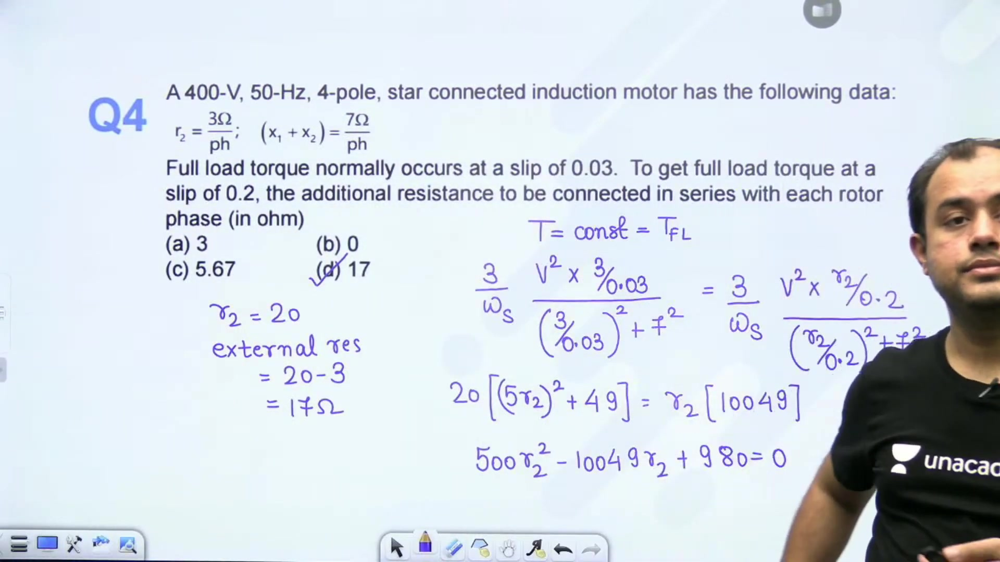
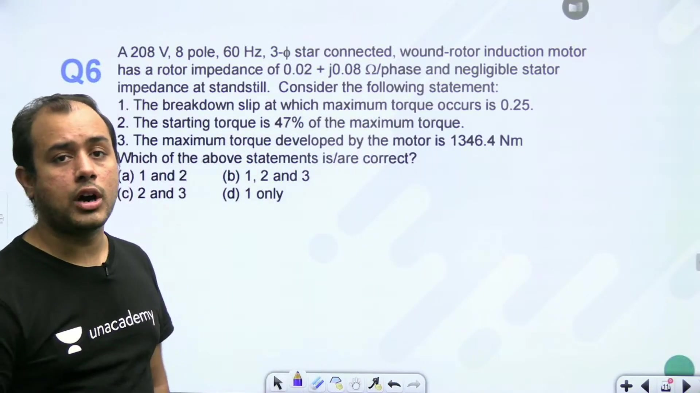
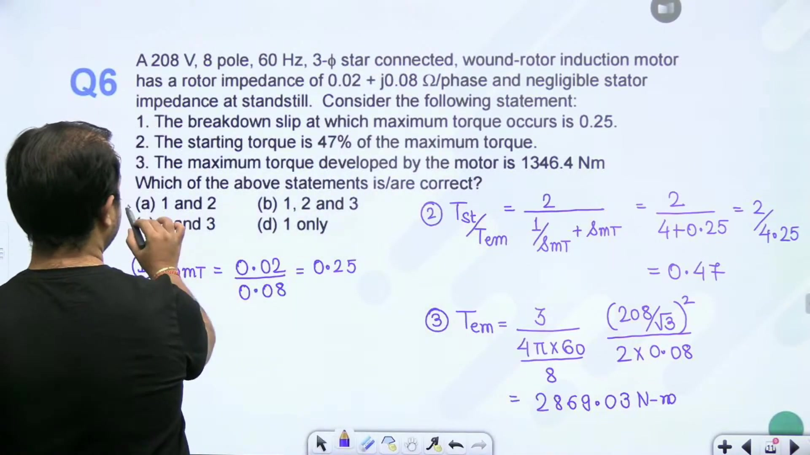
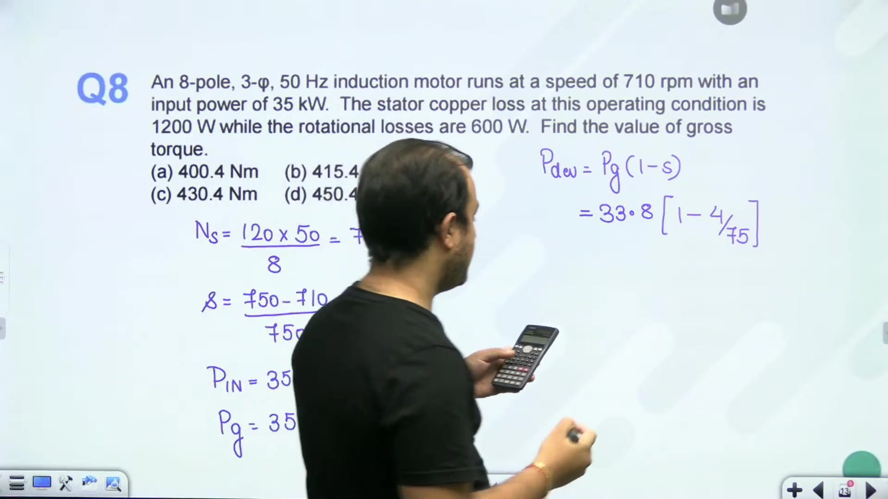
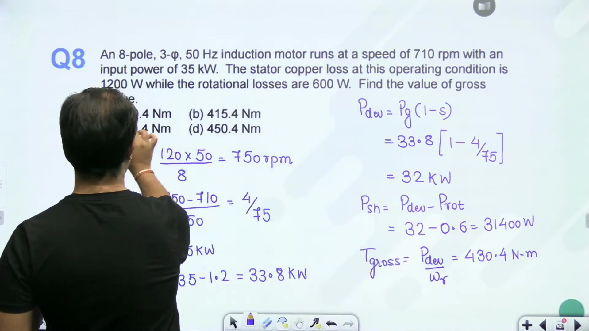
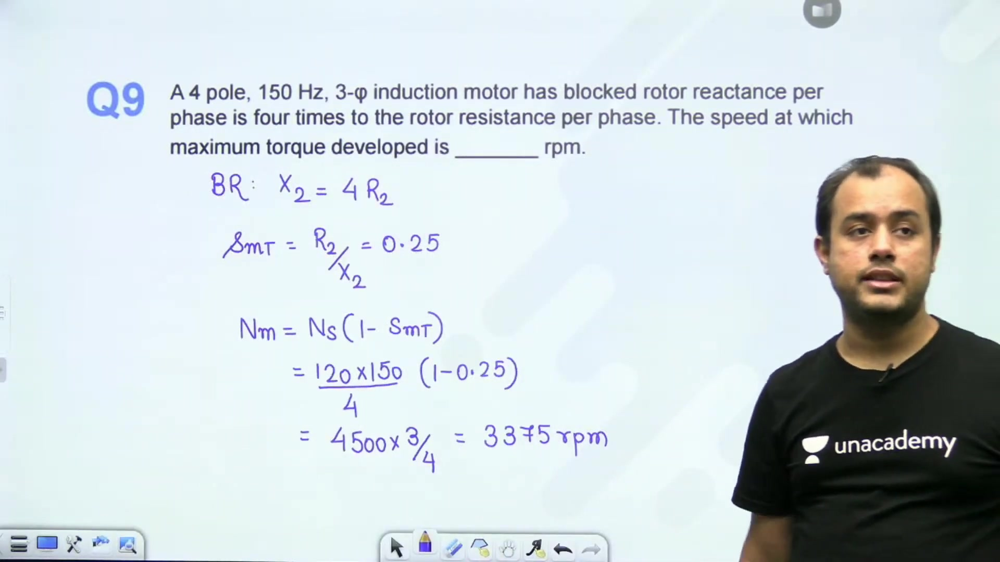
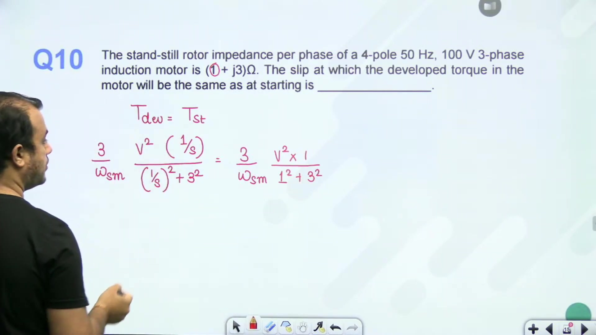
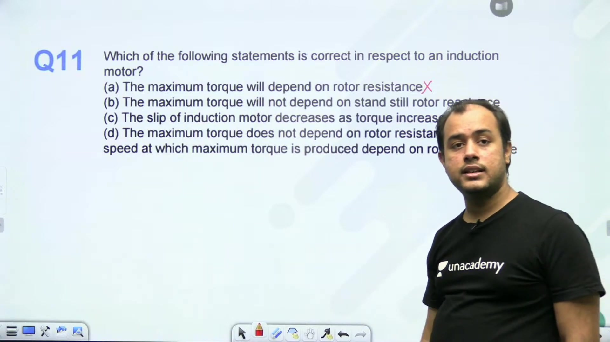
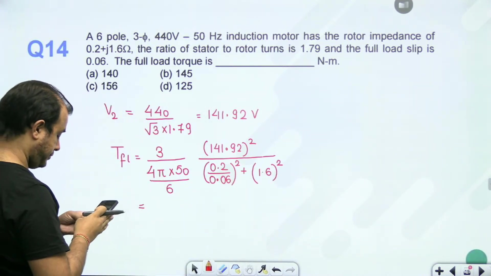

# Torque Slip Characteristics - 2 | L 40 | Electrical Machines | GATE 2022 | Ankit Sir

- **Source**: https://www.youtube.com/watch?v=VxAbdLzfr1E
- **Duration**: 00:49:06
- **Compiled**: 2026-09-23

---

## Overview

This lecture solves fourteen comprehensive numerical problems on the torque-slip characteristics and performance of 3-phase induction motors. It focuses on analytical methods for evaluating operating slip, starting torque ratios, and breakdown conditions under varied operating constraints. The discussion details the influence of rotor resistance insertion, frequency and voltage variations, and stator leakage impedance. Through step-by-step solutions, it demonstrates how normalized torque equations provide quick, exact solutions for competitive examinations.

## Contents

- [[#Session Introduction and Problem 1: Full-Load to Maximum Torque Ratio|Session Introduction and Problem 1: Full-Load to Maximum Torque Ratio]]
- [[#Problem 2 and Problem 3: Maximum Torque and Starting Current Ratios|Problem 2 and Problem 3: Maximum Torque and Starting Current Ratios]]
- [[#Problem 4: External Rotor Resistance for Full-Load Torque at Specified Slip|Problem 4: External Rotor Resistance for Full-Load Torque at Specified Slip]]
- [[#Problem 5 and Problem 6: Frequency-Voltage Scaling and Multi-Statement Evaluation|Problem 5 and Problem 6: Frequency-Voltage Scaling and Multi-Statement Evaluation]]
- [[#Problem 6 Continued and Problem 7: Starting-to-Maximum Torque Ratios|Problem 6 Continued and Problem 7: Starting-to-Maximum Torque Ratios]]
- [[#Problem 8: Induction Motor Power Flow and Gross Developed Torque|Problem 8: Induction Motor Power Flow and Gross Developed Torque]]
- [[#Problem 9 and Problem 10: Speed at Maximum Torque and Slip for Starting Torque Match|Problem 9 and Problem 10: Speed at Maximum Torque and Slip for Starting Torque Match]]
- [[#Problem 11 and Problem 12: Invariance of Maximum Torque and Frequency Scaling|Problem 11 and Problem 12: Invariance of Maximum Torque and Frequency Scaling]]
- [[#Problem 13 and Problem 14: Terminal Voltage Reduction and Full-Load Torque|Problem 13 and Problem 14: Terminal Voltage Reduction and Full-Load Torque]]
- [[#Problem Session Summary and Analytical Review|Problem Session Summary and Analytical Review]]

---

## Session Introduction and Problem 1: Full-Load to Maximum Torque Ratio
_(00:01 - 04:34)_

This session explores numerical problems on the torque-slip characteristics of 3-phase induction motors. The problems test core concepts including torque ratios, parameter scaling, power flow, and the impact of voltage and frequency variations.

### Distinction Between Air-Gap Power and Mechanical Power

Before solving numerical problems, note the difference between air-gap power and developed mechanical power in the rotor equivalent circuit.
- The total power transferred across the air gap corresponds to the power dissipated across resistance $\frac{R_2}{s}$.
- The developed gross mechanical power corresponds to the power converted in the fictitious load resistance $R_2 \left(\frac{1 - s}{s}\right)$.

When finding the condition for maximum mechanical power, we consider the load resistance $R_2\left(\frac{1-s}{s}\right)$. But when finding maximum electromagnetic torque, we maximize the power transferred across the air gap.

### Problem 1: Formulation and Breakdown Slip

Consider a 3-phase induction motor with the following specifications:
- Frequency: $f = 50\text{ Hz}$
- Number of poles: $P = 6$
- Standstill rotor parameters per phase: $R_2 = 0.1\,\Omega$, $X_2 = 0.92\,\Omega$
- Full load operating slip: $s_{FL} = 0.03$ (3%)
- Stator voltage drop is neglected, and rotor resistance is assumed constant.

> [!example] Problem 1
> A 3-phase, 50 Hz, 6-pole induction motor has a rotor resistance of $0.1\,\Omega$ and standstill reactance of $0.92\,\Omega$. Neglecting stator impedance, find the ratio of full load torque to maximum torque ($T_{FL} / T_{\text{max}}$) if the full load slip is 3%.

When stator impedance is neglected, the slip at maximum torque $s_{mT}$ depends only on rotor resistance and standstill leakage reactance:

$$s_{mT} = \frac{R_2}{X_2} = \frac{0.1}{0.92} \approx 0.1087$$

### Calculating Full-Load to Breakdown Torque Ratio

The ratio of full-load torque to maximum torque in terms of operating slip and breakdown slip is given by the standard relation:

$$\frac{T_{FL}}{T_{\text{max}}} = \frac{2}{\frac{s_{mT}}{s_{FL}} + \frac{s_{FL}}{s_{mT}}}$$

This formula assumes negligible stator impedance. Substituting the values:

$$\frac{s_{mT}}{s_{FL}} = \frac{0.1087}{0.03} \approx 3.6233, \quad \frac{s_{FL}}{s_{mT}} = \frac{0.03}{0.1087} \approx 0.2760$$

Evaluating the ratio:

$$\frac{T_{FL}}{T_{\text{max}}} = \frac{2}{3.6233 + 0.2760} = \frac{2}{3.8993} \approx 0.5129$$

Rounding to three decimal places yields 0.513.

> [!success] Result
> The ratio of full load torque to maximum torque is $0.513$.

## Problem 2 and Problem 3: Maximum Torque and Starting Current Ratios
_(04:37 - 10:25)_

This section solves two fundamental problems. First, calculating maximum developed torque when stator resistance is zero but stator leakage reactance is present. Second, determining starting torque from the starting current multiplier.

### Problem 2: Maximum Developed Torque with Stator Leakage Reactance

Consider a 3-phase squirrel cage induction motor with the following specifications:
- Stator voltage: $V_L = 400\text{ V}$, star-connected
- Number of poles: $P = 4$
- Frequency: $f = 50\text{ Hz}$
- Total leakage reactance per phase referred to stator: $x_1 + x_2' = \frac{16}{\pi}\,\Omega$
- Rotor resistance per phase referred to stator: $r_2' = 1\,\Omega$
- Stator resistance is neglected ($r_1 = 0$)

> [!example] Problem 2
> A 3-phase, 400 V, star-connected, 4-pole, 50 Hz squirrel cage induction motor has a total leakage reactance per phase referred to stator of $16/\pi\,\Omega$, and rotor resistance per phase referred to stator of $1\,\Omega$. Neglecting stator resistance, find the maximum developed torque.

### Maximum Torque Derivation with Stator Leakage Reactance

When stator resistance $r_1 = 0$, the breakdown slip and maximum torque expressions incorporate total leakage reactance $x_1 + x_2'$:

$$s_{mT} = \frac{r_2'}{x_1 + x_2'}$$

The maximum developed torque per phase is:

$$T_{\text{max}} = \frac{3}{2 \omega_s} \frac{V_1^2}{x_1 + x_2'}$$

Here $V_1$ is the stator phase voltage:

$$V_1 = \frac{V_L}{\sqrt{3}} = \frac{400}{\sqrt{3}}\text{ V}$$

The mechanical synchronous speed $\omega_s$ is:

$$\omega_s = \frac{4 \pi f}{P} = \frac{4 \pi \times 50}{4} = 50 \pi\text{ rad/s}$$

Substitute these quantities into the torque equation:

$$\begin{aligned}
T_{\text{max}} &= \frac{3}{2 (50 \pi)} \frac{(400 / \sqrt{3})^2}{16 / \pi} \\
&= \frac{3}{100 \pi} \times \frac{160000 / 3}{16 / \pi} \\
&= \frac{160000}{100 \times 16} \\
&= 100\text{ N}\cdot\text{m}
\end{aligned}$$

> [!success] Result: Problem 2
> The maximum developed torque is $100\text{ N}\cdot\text{m}$. Notice that the factor $\pi$ cancels out neatly.

### Problem 3: Starting Torque to Full-Load Torque Ratio

We now determine starting torque from short-circuit starting current.

> [!example] Problem 3
> The full load slip of a 3-phase squirrel cage induction motor is 0.05. The starting current is 5 times the rated full-load current ($I_{\text{st}} = 5 I_{FL}$). Find the ratio of starting torque to full-load torque ($T_{\text{st}} / T_{FL}$).

Electromagnetic torque is proportional to the rotor copper loss divided by slip:

$$T \propto \frac{I_2^2 R_2}{s}$$

Because rotor resistance $R_2$ is constant:

$$\frac{T_{\text{st}}}{T_{FL}} = \left(\frac{I_{\text{st}}}{I_{FL}}\right)^2 \times \frac{s_{FL}}{s_{\text{st}}}$$

At standstill, the starting slip is $s_{\text{st}} = 1$. This simplifies the torque ratio:

$$\frac{T_{\text{st}}}{T_{FL}} = \left(\frac{I_{\text{st}}}{I_{FL}}\right)^2 s_{FL}$$

Substitute the given numbers:
- Starting current multiplier: $\frac{I_{\text{st}}}{I_{FL}} = 5$
- Full load operating slip: $s_{FL} = 0.05$

$$\frac{T_{\text{st}}}{T_{FL}} = (5)^2 \times 0.05 = 25 \times 0.05 = 1.25$$

> [!success] Result: Problem 3
> The starting torque equals $1.25$ times the full load torque ($T_{\text{st}} = 1.25 T_{FL}$).

## Problem 4: External Rotor Resistance for Full-Load Torque at Specified Slip
_(10:25 - 15:02)_

Wound-rotor induction motors allow external resistance insertion into the rotor circuit through slip rings. Adding resistance shifts the torque-slip curve toward higher slip without altering maximum torque.

### Problem Formulation

Consider a wound-rotor induction motor where rated full-load torque must occur at an elevated slip value:
- Stator voltage: $400\text{ V}$, 50 Hz, 4-pole star-connected
- Original full-load operating slip: $s_1 = 0.03$
- Target operating slip at full-load torque: $s_2 = 0.20$
- Standstill rotor circuit resistance per phase: $R_2$
- Additional external resistance inserted per rotor phase: $r_{\text{ext}}$

> [!example] Problem 4
> A 400 V, 50 Hz, 4-pole star-connected induction motor develops full-load torque at a slip of 0.03. To obtain the same full-load torque at a slip of 0.20, find the additional resistance $r_{\text{ext}}$ to be connected in series with each rotor phase in terms of $R_2$.

### Low-Slip Region Approximation

Under normal steady-state running conditions, operating slip is small. In this region, $\frac{R_2}{s} \gg X_2$. The torque expression simplifies to:

$$T \approx \frac{3}{\omega_s} \frac{V_1^2}{\frac{R_{2,\text{total}}}{s}} = \frac{3 V_1^2}{\omega_s} \frac{s}{R_{2,\text{total}}}$$

Since applied voltage and supply frequency remain constant:

$$T \propto \frac{s}{R_{2,\text{total}}}$$

To maintain constant full-load torque at the new slip $s_2$:

$$\frac{s_1}{R_2} = \frac{s_2}{R_2 + r_{\text{ext}}}$$

Rearranging gives the total required rotor resistance:

$$\frac{R_2 + r_{\text{ext}}}{R_2} = \frac{s_2}{s_1} \implies 1 + \frac{r_{\text{ext}}}{R_2} = \frac{0.20}{0.03} = \frac{20}{3} \approx 6.667$$

Solving for external resistance per phase:

$$r_{\text{ext}} = R_2 \left(\frac{s_2}{s_1} - 1\right) = R_2 \left(\frac{20}{3} - 1\right) = \frac{17}{3} R_2 \approx 5.67 R_2$$

### Exact Torque Expression Equating

If standstill leakage reactance $X_2$ is considered, equate the exact torque equations for both operating states:

$$\frac{R_2 / s_1}{(R_2 / s_1)^2 + X_2^2} = \frac{R_2' / s_2}{(R_2' / s_2)^2 + X_2^2}$$

Here $R_2' = R_2 + r_{\text{ext}}$. The two roots of this equality correspond to the stable motoring region and the unstable high-slip region. For operation along the stable operating zone with identical effective impedance $\frac{R_2}{s_1} = \frac{R_2'}{s_2}$:

$$\frac{R_2 + r_{\text{ext}}}{0.20} = \frac{R_2}{0.03} \implies R_2 + r_{\text{ext}} = 6.67 R_2 \implies r_{\text{ext}} = 5.67 R_2$$

The rotor current magnitude and power factor remain identical between the two operating points. The extra slip power converts into heat in the external rheostat.

> [!success] Result: Problem 4
> The required external resistance per phase is $r_{\text{ext}} = 5.67 R_2$.

## Problem 5 and Problem 6: Frequency-Voltage Scaling and Multi-Statement Evaluation
_(15:09 - 19:46)_

Changing supply voltage and frequency changes both maximum torque and breakdown slip. This section examines how these parameters scale and verifies multi-part statements for a wound-rotor machine.

### Problem 5: Scaling with Frequency and Voltage

Consider the effect of simultaneous frequency and voltage reduction:
- New frequency: $f_2 = 0.5 f_1$ (halved)
- New voltage: $V_2 = 0.75 V_1$ (three-fourths)

> [!example] Problem 5
> The supply frequency and applied terminal voltage of an induction motor are reduced to half and three-fourths of their original values respectively. Determine the ratio of the new maximum torque to original maximum torque, and how the slip at maximum torque changes.

### Scaling of Breakdown Slip

The slip at maximum torque when stator impedance is neglected is:

$$s_{mT} = \frac{R_2}{X_2}$$

Because standstill leakage reactance is directly proportional to frequency ($X_2 = 2 \pi f L_2$):

$$s_{mT} \propto \frac{1}{f}$$

Comparing the new and original breakdown slips:

$$\frac{s_{mT2}}{s_{mT1}} = \frac{f_1}{f_2} = \frac{f_1}{0.5 f_1} = 2$$

So the slip at maximum torque doubles.

### Scaling of Maximum Torque

The maximum torque expression is:

$$T_{\text{max}} = \frac{3}{2 \omega_s} \frac{V_1^2}{X_2}$$

Synchronous angular speed $\omega_s$ is proportional to frequency ($\omega_s \propto f$), and standstill reactance $X_2$ is also proportional to frequency ($X_2 \propto f$). Therefore:

$$T_{\text{max}} \propto \frac{V^2}{\omega_s X_2} \propto \frac{V^2}{f^2} = \left(\frac{V}{f}\right)^2$$

Computing the ratio of new to original breakdown torque:

$$\begin{aligned}
\frac{T_{\text{max}2}}{T_{\text{max}1}} &= \left(\frac{V_2}{V_1}\right)^2 \times \left(\frac{f_1}{f_2}\right)^2 \\
&= \left(\frac{3}{4}\right)^2 \times (2)^2 \\
&= \frac{9}{16} \times 4 \\
&= \frac{9}{4} = 2.25
\end{aligned}$$

> [!success] Result: Problem 5
> Slip at maximum torque doubles ($s_{mT2} = 2 s_{mT1}$), and maximum torque increases to $2.25$ times its original value.

### Problem 6: Statement Analysis for 208 V Motor

Consider an 8-pole wound rotor induction motor with:
- Line voltage: $V_L = 208\text{ V}$, 60 Hz, star-connected
- Standstill rotor parameters per phase: $r_2 = 0.02\,\Omega$, $x_2 = 0.08\,\Omega$
- Negligible stator impedance

> [!example] Problem 6
> Evaluate the truth value of the statements:
> 1. The breakdown slip at which maximum torque occurs is 0.25.
> 2. The ratio of starting torque to maximum torque is approximately 0.47.

### Evaluating Breakdown Slip (Statement 1)

With negligible stator impedance:

$$s_{mT} = \frac{r_2}{x_2} = \frac{0.02}{0.08} = 0.25$$

Statement 1 is true. Breakdown torque occurs at $25\%$ slip.

## Problem 6 Continued and Problem 7: Starting-to-Maximum Torque Ratios
_(19:57 - 24:53)_

This section completes the statement analysis for the 208 V motor and solves for the breakdown slip from specified torque percentages.

### Problem 6: Evaluating Statements 2 and 3

Continuing the 208 V, 8-pole, 60 Hz wound-rotor motor evaluation where $s_{mT} = 0.25$:

#### Evaluating Starting-to-Maximum Torque Ratio (Statement 2)

The ratio of starting torque to maximum torque when stator impedance is neglected is:

$$\frac{T_{\text{st}}}{T_{\text{max}}} = \frac{2}{s_{mT} + \frac{1}{s_{mT}}}$$

Substitute $s_{mT} = 0.25$:

$$\frac{T_{\text{st}}}{T_{\text{max}}} = \frac{2}{0.25 + \frac{1}{0.25}} = \frac{2}{0.25 + 4} = \frac{2}{4.25} \approx 0.4706$$

Statement 2 states the ratio is approximately 0.47. This statement is true.

#### Evaluating Maximum Torque Magnitude (Statement 3)

Statement 3 claims maximum torque equals $1346.4\text{ N}\cdot\text{m}$. Synchronous speed for an 8-pole, 60 Hz motor is:

$$\omega_s = \frac{4 \pi f}{P} = \frac{4 \pi \times 60}{8} = 30 \pi \approx 94.25\text{ rad/s}$$

With phase voltage $V_1 = \frac{208}{\sqrt{3}}\text{ V}$ and rotor reactance $x_2 = 0.08\,\Omega$:

$$\begin{aligned}
T_{\text{max}} &= \frac{3}{2 \omega_s} \frac{V_1^2}{x_2} \\
&= \frac{3}{2 \times 30 \pi} \times \frac{(208 / \sqrt{3})^2}{0.08} \\
&= \frac{1}{20 \pi} \times \frac{43264 / 3 \times 3}{0.08} \\
&= \frac{43264}{20 \pi \times 0.08} \\
&= \frac{43264}{1.6 \pi} \approx 2869.03\text{ N}\cdot\text{m}
\end{aligned}$$

Because $2869.03\text{ N}\cdot\text{m} \neq 1346.4\text{ N}\cdot\text{m}$, Statement 3 is false.

> [!success] Result: Problem 6
> Statements 1 and 2 are true, while Statement 3 is false.

### Problem 7: Breakdown Slip from Percentage Torques

We now find breakdown slip when starting and maximum torques are expressed as percentages of full load.

> [!example] Problem 7
> A 3-phase induction motor at rated voltage and frequency develops a starting torque of 150% and a maximum torque of 200% of full-load torque. Neglecting stator resistance and rotational losses, find the slip at maximum torque.

### Formulating the Ratio and Quadratic Equation

Express given torque percentages:
- $T_{\text{st}} = 1.5 T_{FL}$
- $T_{\text{max}} = 2.0 T_{FL}$

Forming the ratio:

$$\frac{T_{\text{st}}}{T_{\text{max}}} = \frac{1.5}{2.0} = 0.75 = \frac{3}{4}$$

Equating this to the normalized torque ratio formula:

$$\frac{2}{s_{mT} + \frac{1}{s_{mT}}} = \frac{2 s_{mT}}{s_{mT}^2 + 1} = \frac{3}{4}$$

Cross-multiply and arrange as a quadratic equation:

$$\begin{aligned}
8 s_{mT} &= 3 (s_{mT}^2 + 1) \\
3 s_{mT}^2 - 8 s_{mT} + 3 &= 0
\end{aligned}$$

Solve using the quadratic formula:

$$\begin{aligned}
s_{mT} &= \frac{-(-8) \pm \sqrt{(-8)^2 - 4(3)(3)}}{2(3)} \\
&= \frac{8 \pm \sqrt{64 - 36}}{6} \\
&= \frac{8 \pm \sqrt{28}}{6} \\
&= \frac{8 \pm 5.2915}{6}
\end{aligned}$$

Evaluating the two mathematical roots:

$$s_{mT1} = \frac{8 - 5.2915}{6} \approx 0.4514, \quad s_{mT2} = \frac{8 + 5.2915}{6} \approx 2.215$$

For stable motoring operation, slip must satisfy $0 < s_{mT} < 1$. The root $s_{mT} \approx 2.215$ corresponds to the plugging (braking) region. Therefore, choose $s_{mT} = 0.451$.

> [!success] Result: Problem 7
> The slip at maximum torque is $s_{mT} = 0.451$ (Option D).

## Problem 8: Induction Motor Power Flow and Gross Developed Torque
_(25:00 - 29:47)_

Determining developed electromagnetic torque requires tracing the power flow from stator electrical input to rotor mechanical conversion. This section shows the equivalence between air-gap and mechanical expressions for gross torque.

### Problem Formulation: Power Flow Data

Consider a 3-phase induction motor operating under the following conditions:
- Supply frequency: $f = 50\text{ Hz}$
- Number of poles: $P = 8$
- Electrical input power: $P_{\text{in}} = 35\text{ kW}$
- Stator copper loss: $P_{cu1} = 1.2\text{ kW}$
- Rotational (friction and windage) losses: $P_{fw} = 1.5\text{ kW}$
- Stator core loss is neglected
- Rotor operating speed: $N_r = 710\text{ rpm}$

> [!example] Problem 8
> A 3-phase, 8-pole, 50 Hz induction motor takes a power input of 35 kW. The stator copper loss is 1.2 kW and rotational loss is 1.5 kW. If the motor runs at 710 rpm, find the gross electromagnetic torque developed.

### Operating Slip and Air-Gap Power Calculation

First calculate synchronous speed:

$$N_s = \frac{120 f}{P} = \frac{120 \times 50}{8} = 750\text{ rpm}$$

The mechanical synchronous speed in radians per second is:

$$\omega_s = \frac{2 \pi N_s}{60} = \frac{2 \pi \times 750}{60} = 25 \pi \approx 78.54\text{ rad/s}$$

Now compute the operating slip:

$$s = \frac{N_s - N_r}{N_s} = \frac{750 - 710}{750} = \frac{40}{750} = \frac{4}{75} \approx 0.05333$$

Air-gap power $P_g$ is electrical power transferred across the air gap:

$$P_g = P_{\text{in}} - P_{cu1} = 35\text{ kW} - 1.2\text{ kW} = 33.8\text{ kW} = 33800\text{ W}$$

### Equivalence of Gross Developed Torque Expressions

Developed gross electromagnetic torque can be evaluated using two identical expressions:

$$\begin{aligned}
T_{\text{dev}} &= \frac{P_g}{\omega_s} \\
&= \frac{P_{\text{dev}}}{\omega_r}
\end{aligned}$$

Because $P_{\text{dev}} = (1 - s) P_g$ and $\omega_r = (1 - s) \omega_s$, the factor $(1 - s)$ cancels out completely:

$$\frac{P_{\text{dev}}}{\omega_r} = \frac{(1 - s) P_g}{(1 - s) \omega_s} = \frac{P_g}{\omega_s}$$

Evaluating gross developed torque directly from air-gap power:

$$T_{\text{dev}} = \frac{33800}{25 \pi} = \frac{1352}{\pi} \approx 430.36\text{ N}\cdot\text{m}$$

Rounding gives $430.4\text{ N}\cdot\text{m}$.

### Verification via Mechanical Output Power

Verify this value using rotor mechanical developed power:

$$P_{\text{dev}} = (1 - s) P_g = \left(1 - \frac{4}{75}\right) \times 33800 = \frac{71}{75} \times 33800 \approx 31997.33\text{ W}$$

The rotor speed in radians per second is:

$$\omega_r = \frac{2 \pi \times 710}{60} = \frac{71 \pi}{3} \approx 74.35\text{ rad/s}$$

Dividing mechanical power by rotor angular speed:

$$T_{\text{dev}} = \frac{31997.33}{\frac{71 \pi}{3}} = \frac{31997.33 \times 3}{71 \pi} = \frac{95992}{71 \pi} = \frac{1352}{\pi} \approx 430.36\text{ N}\cdot\text{m}$$

Both approaches produce the exact same value.

> [!success] Result: Problem 8
> The gross developed electromagnetic torque is $430.4\text{ N}\cdot\text{m}$ (Option C).

## Problem 9 and Problem 10: Speed at Maximum Torque and Slip for Starting Torque Match
_(29:52 - 34:35)_

This section covers high-frequency motor operation and solves for the running slip where motor torque matches starting torque.

### Problem 9: Speed of Maximum Torque at 150 Hz

Consider an induction motor operating at a higher supply frequency:
- Number of poles: $P = 4$
- Frequency: $f = 150\text{ Hz}$
- Standstill blocked-rotor reactance: $X_2 = 4 R_2$

> [!example] Problem 9
> A 4-pole, 150 Hz, 3-phase induction motor has a standstill rotor reactance per phase equal to four times the rotor resistance per phase. Find the speed at which maximum torque is developed.

### Breakdown Slip and Speed Computation

Synchronous speed at $150\text{ Hz}$ is:

$$N_s = \frac{120 f}{P} = \frac{120 \times 150}{4} = 4500\text{ rpm}$$

The slip at maximum torque is:

$$s_{mT} = \frac{R_2}{X_2} = \frac{R_2}{4 R_2} = \frac{1}{4} = 0.25$$

The mechanical speed at which breakdown torque develops is:

$$N_{mT} = N_s (1 - s_{mT}) = 4500 \times (1 - 0.25) = 4500 \times 0.75 = 3375\text{ rpm}$$

> [!success] Result: Problem 9
> The speed at maximum torque is $3375\text{ rpm}$.

### Problem 10: Running Slip for Torque Equal to Starting Torque

Next we find the steady-state operating slip where developed torque equals standstill torque.

> [!example] Problem 10
> A 3-phase induction motor has rotor resistance per phase $R_2 = 1\,\Omega$ and standstill reactance per phase $X_2 = 3\,\Omega$. Find the running slip at which the developed torque equals the starting torque.

### Equating Developed and Starting Torque

The general expression for developed electromagnetic torque per phase is:

$$T(s) = \frac{3}{\omega_s} V_1^2 \frac{R_2 / s}{(R_2 / s)^2 + X_2^2}$$

At starting ($s = 1$):

$$T_{\text{st}} = \frac{3}{\omega_s} V_1^2 \frac{R_2}{R_2^2 + X_2^2}$$

Equate $T(s) = T_{\text{st}}$ and cancel constant multipliers $\frac{3 V_1^2}{\omega_s}$:

$$\frac{R_2 / s}{(R_2 / s)^2 + X_2^2} = \frac{R_2}{R_2^2 + X_2^2}$$

Substitute given parameters $R_2 = 1\,\Omega$ and $X_2 = 3\,\Omega$:

$$\frac{1/s}{(1/s)^2 + 3^2} = \frac{1}{1^2 + 3^2} = \frac{1}{10}$$

Rearranging terms:

$$\frac{10}{s} = \frac{1}{s^2} + 9$$

Multiply the entire equation by $s^2$:

$$\begin{aligned}
10 s &= 1 + 9 s^2 \\
9 s^2 - 10 s + 1 &= 0
\end{aligned}$$

Factor this quadratic equation:

$$(9s - 1)(s - 1) = 0$$

This yields two roots:

$$s_1 = 1, \quad s_2 = \frac{1}{9} \approx 0.1111$$

The root $s = 1$ is the starting condition itself. The running slip where motor torque matches starting torque is $s = 1/9 \approx 0.111$.

> [!success] Result: Problem 10
> The motor develops torque equal to its starting torque at a running slip of $s = 0.111$ ($11.1\%$).

## Problem 11 and Problem 12: Invariance of Maximum Torque and Frequency Scaling
_(34:37 - 39:30)_

This section analyzes the fundamental dependence of maximum torque on motor parameters and calculates the supply frequency needed to produce peak torque at standstill.

### Problem 11: Conceptual Evaluation of Induction Motor Torque

Exam questions frequently test the distinction between the magnitude of maximum torque and the speed at which it occurs.

> [!example] Problem 11
> Which of the following statements is correct with respect to a 3-phase induction motor?
> A. Maximum torque depends on rotor resistance.
> B. Maximum torque does not depend on standstill rotor reactance.
> C. Slip decreases as load torque increases.
> D. Maximum torque does not depend on rotor resistance, yet the speed at which it occurs depends on rotor resistance.

### Parameter Dependence Analysis

Examine the theoretical expressions when stator impedance is neglected:
- Maximum developed torque:
  $$T_{\text{max}} = \frac{3}{2 \omega_s} \frac{V_1^2}{X_2}$$
  The rotor resistance $R_2$ does not appear in this equation. Therefore, maximum torque is independent of rotor resistance.
- Breakdown slip:
  $$s_{mT} = \frac{R_2}{X_2}$$
  The slip at which breakdown torque occurs depends directly on $R_2$.
- Breakdown speed:
  $$N_{mT} = N_s (1 - s_{mT}) = N_s \left(1 - \frac{R_2}{X_2}\right)$$
  Because $s_{mT}$ depends on $R_2$, the rotor speed at maximum torque also depends directly on $R_2$.

Evaluating each statement:
- **Statement A is false**: $T_{\text{max}}$ is independent of $R_2$.
- **Statement B is false**: $T_{\text{max}}$ is inversely proportional to $X_2$.
- **Statement C is false**: In the stable operating region, slip increases as torque increases because the motor slows down under load.
- **Statement D is true**: $T_{\text{max}}$ does not depend on rotor resistance, but the speed at which it occurs does depend on rotor resistance.

> [!success] Result: Problem 11
> The correct statement is Option D.

### Problem 12: Supply Frequency for Maximum Torque at Starting

We now determine the supply frequency required to achieve peak breakdown torque right at standstill.

> [!example] Problem 12
> For a 3-phase squirrel cage induction motor, the rotor leakage reactance at standstill is twice the rotor resistance at 50 Hz. Find the supply frequency at which maximum torque is obtained at starting.

### Frequency Dependence and Condition for Peak Starting Torque

At rated frequency $f_1 = 50\text{ Hz}$, the given parameter relationship is:

$$X_2 = 2 R_2$$

At any arbitrary supply frequency $f$, rotor leakage reactance scales proportionally:

$$X_2(f) = X_2 \left(\frac{f}{50}\right) = 2 R_2 \left(\frac{f}{50}\right)$$

Maximum torque occurs when the operating slip equals breakdown slip:

$$s = s_{mT} = \frac{R_2}{X_2(f)}$$

At starting, rotor speed is zero, so $s = 1$. For maximum torque to occur at starting:

$$s_{mT} = 1 \implies \frac{R_2}{X_2(f)} = 1 \implies X_2(f) = R_2$$

Substitute the frequency-dependent reactance into this condition:

$$\begin{aligned}
2 R_2 \left(\frac{f}{50}\right) &= R_2 \\
\frac{2 f}{50} &= 1 \\
f &= \frac{50}{2} = 25\text{ Hz}
\end{aligned}$$

Reducing the supply frequency to 25 Hz reduces standstill reactance until it equals rotor resistance. This places maximum torque right at starting.

> [!success] Result: Problem 12
> The required supply frequency is $25\text{ Hz}$.

## Problem 13 and Problem 14: Terminal Voltage Reduction and Full-Load Torque
_(39:52 - 44:43)_

This section determines the torque reduction caused by an undervoltage condition and calculates rated full-load torque from referred rotor equivalent circuit parameters.

### Problem 13: Percentage Reduction in Torque from Undervoltage

Electromagnetic torque at any specified slip is proportional to the square of terminal voltage:

$$T \propto V^2$$

> [!example] Problem 13
> If the applied terminal voltage of an induction motor is reduced by 20%, calculate the percentage reduction in developed torque at the same operating slip.

Let the original terminal voltage be $V_1$. A $20\%$ reduction means the new voltage is:

$$V_2 = (1 - 0.20) V_1 = 0.80 V_1$$

The new torque developed at the same slip is:

$$\frac{T_2}{T_1} = \left(\frac{V_2}{V_1}\right)^2 = (0.80)^2 = 0.64$$

The percentage reduction in torque is:

$$\text{Percentage Reduction} = \frac{T_1 - T_2}{T_1} \times 100\% = (1 - 0.64) \times 100\% = 36\%$$

A $20\%$ dip in terminal supply voltage reduces electromagnetic torque output by $36\%$.

> [!success] Result: Problem 13
> The developed torque decreases by $36\%$.

### Problem 14: Full-Load Torque Evaluation with Turns Ratio

Consider a 3-phase wound rotor induction motor with:
- Stator voltage: $V_L = 400\text{ V}$ line-to-line
- Referred rotor phase voltage: $V_2 = 141.92\text{ V}$
- Rotor winding resistance per phase: $R_2 = 0.2\,\Omega$
- Standstill rotor leakage reactance per phase: $X_2 = 2\,\Omega$
- Full load operating slip: $s_{FL} = 0.06$ (6%)
- Synchronous speed: $\omega_s$

> [!example] Problem 14
> A 3-phase induction motor has rotor parameters per phase $R_2 = 0.2\,\Omega$, $X_2 = 2\,\Omega$, and full load slip $s = 0.06$. The referred rotor phase voltage is $141.92\text{ V}$. Find the developed full-load torque.

### Full-Load Torque Calculation

The 3-phase developed torque is:

$$T_{FL} = \frac{3}{\omega_s} \frac{V_2^2 \left(\frac{R_2}{s}\right)}{\left(\frac{R_2}{s}\right)^2 + X_2^2}$$

Evaluate the effective rotor branch resistance at $6\%$ slip:

$$\frac{R_2}{s} = \frac{0.2}{0.06} = \frac{10}{3} \approx 3.333\,\Omega$$

Compute the impedance denominator:

$$\left(\frac{R_2}{s}\right)^2 + X_2^2 = (3.333)^2 + 2^2 = 11.111 + 4 = 15.111\,\Omega^2$$

Substituting the known parameters:

$$\begin{aligned}
T_{FL} &= \frac{3}{\omega_s} \times \frac{(141.92)^2 \times 3.333}{15.111} \\
&= \frac{3}{\omega_s} \times \frac{20141.29 \times 3.333}{15.111} \\
&= \frac{3}{\omega_s} \times 4442.54 \\
&= 140.68\text{ N}\cdot\text{m}
\end{aligned}$$

> [!success] Result: Problem 14
> The full-load developed electromagnetic torque is $140.68\text{ N}\cdot\text{m}$.

## Problem Session Summary and Analytical Review
_(44:46 - 48:55)_

This concluding section summarizes the mathematical relationships and problem-solving patterns explored across the lecture.

### Consolidated Formulation Matrix

The problems solved in this session rely on a compact set of core relations:

1. **Normalized Torque Ratio**:
   $$\frac{T}{T_{\text{max}}} = \frac{2}{\frac{s_{mT}}{s} + \frac{s}{s_{mT}}}$$
   Used when stator impedance is negligible. For starting torque, set $s = 1$.

2. **Starting Torque from Starting Current Multiplier**:
   $$\frac{T_{\text{st}}}{T_{FL}} = \left(\frac{I_{\text{st}}}{I_{FL}}\right)^2 s_{FL}$$
   Derived directly from rotor copper loss at starting versus full load.

3. **External Resistance Insertion**:
   $$T \propto \frac{s}{R_{2,\text{total}}} \implies \frac{s_1}{R_2} = \frac{s_2}{R_2 + r_{\text{ext}}}$$
   Enables operating speed adjustment while maintaining constant full-load torque.

4. **Supply Parameter Variations**:
   $$s_{mT} \propto \frac{1}{f}, \quad T_{\text{max}} \propto \left(\frac{V}{f}\right)^2$$
   Determines the scaling of breakdown slip and maximum torque when frequency and voltage vary.

5. **Power Flow and Torque Equivalence**:
   $$T_{\text{dev}} = \frac{P_g}{\omega_s} = \frac{P_{\text{dev}}}{\omega_r}$$
   Both expressions yield identical results because the $(1 - s)$ factor cancels between power and speed.

### Key Insights for Competitive Examination

- When solving for breakdown slip $s_{mT}$ from a quadratic equation, always choose the root satisfying $0 < s_{mT} \le 1$ for motoring. Roots exceeding unity correspond to plugging mode.
- Changing rotor resistance does not alter the peak value of breakdown torque. It only shifts the slip at which breakdown torque occurs.
- To produce peak torque right at standstill, reduce the supply frequency until $X_2(f) = R_2$.
- When stator leakage reactance $x_1$ is included but stator resistance $r_1$ is neglected, replace $x_2'$ with $x_1 + x_2'$ in the maximum torque formula.

> [!info] Next Topics
> The following session covers induction machine stability, circle diagrams, and standard testing procedures including no-load and blocked-rotor tests.

---

## Summary and Key Takeaways

- When stator impedance is neglected, the torque ratio satisfies $\frac{T}{T_{\text{max}}} = \frac{2}{\frac{s_{mT}}{s} + \frac{s}{s_{mT}}}$, where breakdown slip is $s_{mT} = \frac{R_2}{X_2}$.
- If stator resistance is zero but stator leakage reactance is present, breakdown torque is $T_{\text{max}} = \frac{3}{2 \omega_s} \frac{V_1^2}{x_1 + x_2'}$.
- The ratio of starting torque to full-load torque relates directly to starting current by $\frac{T_{\text{st}}}{T_{FL}} = \left(\frac{I_{\text{st}}}{I_{FL}}\right)^2 s_{FL}$.
- Maintaining constant full-load torque at higher slip requires added rotor resistance scaling as $\frac{s_1}{R_2} = \frac{s_2}{R_2 + r_{\text{ext}}}$.
- Breakdown slip scales inversely with supply frequency ($s_{mT} \propto 1/f$), while maximum torque scales with the square of the voltage-to-frequency ratio ($T_{\text{max}} \propto (V/f)^2$).
- Gross developed electromagnetic torque can be evaluated using either air-gap power or developed mechanical power: $T_{\text{dev}} = \frac{P_g}{\omega_s} = \frac{P_{\text{dev}}}{\omega_r}$.
- Maximum breakdown torque magnitude is independent of rotor resistance, but the rotor speed at which maximum torque occurs depends directly on rotor resistance.
- For maximum torque to occur right at standstill ($s = 1$), the supply frequency must be adjusted until standstill reactance matches rotor resistance ($X_2(f) = R_2$).

