# Electrical Machines | Lec 103 | Stability & Testing of Induction Motor | GATE Electrical Engineering

- **Source**: https://www.youtube.com/watch?v=ePsBUg-DBSs
- **Duration**: 00:55:29
- **Compiled**: 2026-09-23

---

## Overview

This lecture establishes the operating point stability criteria and experimental testing procedures for three-phase induction motors. It begins by examining the mechanical dynamic equation of motion to derive physical and derivative stability conditions on torque-speed axes. The presentation then maps transformer open-circuit and short-circuit tests to induction motor no-load and blocked-rotor tests. It demonstrates how to determine equivalent circuit branch parameters, separate core loss from mechanical friction and windage, analyze non-rated operating conditions, and predict Direct-On-Line starting currents from test data.

## Contents

- [[#Operating Point Stability and Motor Dynamic Equation|Operating Point Stability and Motor Dynamic Equation]]
- [[#Graphical and Mathematical Stability Criteria|Graphical and Mathematical Stability Criteria]]
- [[#Worked Examples of Speed-Torque Stability|Worked Examples of Speed-Torque Stability]]
- [[#Induction Motor Testing and the No-Load Test Principle|Induction Motor Testing and the No-Load Test Principle]]
- [[#No-Load Test Measurements and Impedance Calculations|No-Load Test Measurements and Impedance Calculations]]
- [[#Power Balance and Separation of No-Load Losses|Power Balance and Separation of No-Load Losses]]
- [[#Parametric Variations in No-Load Test Conditions|Parametric Variations in No-Load Test Conditions]]
- [[#Blocked Rotor Test Principle and Equivalent Circuit|Blocked Rotor Test Principle and Equivalent Circuit]]
- [[#Parameter Calculation and Direct-On-Line Starting Relations|Parameter Calculation and Direct-On-Line Starting Relations]]

---

## Operating Point Stability and Motor Dynamic Equation
_(00:13 - 05:16)_

### Definition of System Stability

A physical system is stable if it returns to its initial operating condition after a disturbance. If a motor runs at a given speed and load torque, any transient disturbance may change its speed. When the disturbance ends, a stable motor settles back to its original equilibrium point.

> [!info] Definition of Stability
> A drive system is stable if it returns to its equilibrium operating state after being disturbed from that state.

### Mechanical Dynamic Equation

The rotational motion of a motor driving a mechanical load follows Newton's second law for angular motion:

$$J \frac{d^2\theta}{dt^2} = T_m - T_L$$

Here, $J$ is the polar moment of inertia of the rotating mass. $\theta$ is the angular displacement. The term $\frac{d^2\theta}{dt^2}$ is the angular acceleration. $T_m$ is the electromagnetic torque developed by the motor. $T_L$ is the mechanical load torque opposing rotation.

Angular acceleration can also be written as the rate of change of angular speed $\omega$:

$$\frac{d^2\theta}{dt^2} = \frac{d\omega}{dt}$$

So the dynamic equation becomes:

$$J \frac{d\omega}{dt} = T_m - T_L$$

This equation holds when rotational losses such as bearing friction and windage are neglected. If rotational losses are present, they are either grouped into $T_L$ or subtracted from the electromagnetic torque.

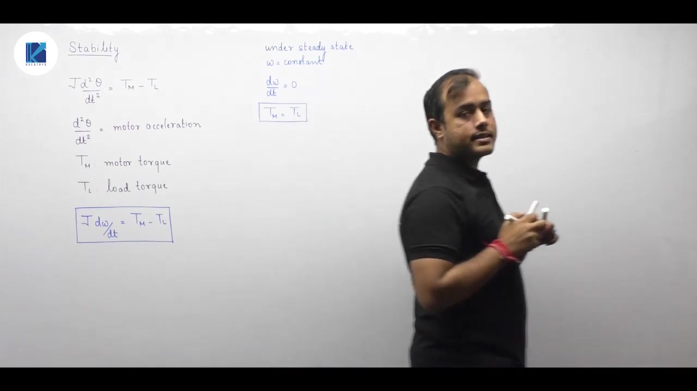

### Steady-State Equilibrium and Operating Point

Under steady-state operation, the motor runs at a constant speed $\omega$:

$$\omega = \text{constant} \implies \frac{d\omega}{dt} = 0$$

When the acceleration is zero, the dynamic equation yields:

> [!success] Result
> $$T_m = T_L$$

The motor neither speeds up nor slows down. The developed torque balances the load torque exactly.

Graphically, the steady-state operating speed is the intersection point of the motor torque-speed curve and the load torque-speed curve. At this point, both the motor and load demand the same torque at that speed.

## Graphical and Mathematical Stability Criteria
_(05:21 - 15:04)_

### Physical Disturbance Method

Consider an induction motor driving a mechanical load. In many cases, the motor torque-speed curve intersects the load torque-speed curve at two separate points, labeled A and B. Both points satisfy the steady-state equilibrium condition $T_m = T_L$. But only one of them is stable.

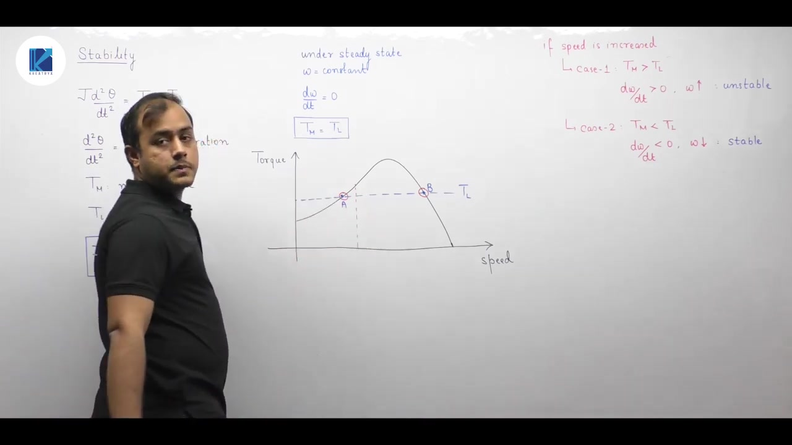

To test stability physically, introduce a small perturbation in speed:

1. **Case 1 ($T_m > T_L$):** The motor produces more torque than the load demands. From the dynamic equation $J \frac{d\omega}{dt} = T_m - T_L$, the angular acceleration $\frac{d\omega}{dt}$ is positive. The motor accelerates. Speed increases even further away from the operating point. So the operating point is unstable.
2. **Case 2 ($T_m < T_L$):** Load torque exceeds motor torque. The net torque is negative, so $\frac{d\omega}{dt} < 0$. The motor decelerates. Speed drops back toward the operating point. So the operating point is stable.

At point A, increasing speed moves the system into a region where the motor curve is higher than the load curve. Thus, $T_m > T_L$ and speed keeps increasing. Point A is unstable.

At point B, increasing speed causes the load torque curve to sit higher than the motor curve. Thus, $T_L > T_m$, producing deceleration that restores original speed. Point B is stable.

### Mathematical Slope Criterion

We can translate this physical behavior into a derivative condition. At equilibrium, both torques are equal. When speed increases by $\Delta\omega$, stability demands that load torque grows faster than motor torque:

$$\Delta T_L > \Delta T_m \implies \frac{dT_L}{d\omega} > \frac{dT_m}{d\omega}$$

> [!success] Result
> For torque plotted on the vertical axis and speed on the horizontal axis:
> $$\frac{dT_L}{d\omega} > \frac{dT_m}{d\omega} \implies \text{Stable Operating Point}$$
> $$\frac{dT_m}{d\omega} > \frac{dT_L}{d\omega} \implies \text{Unstable Operating Point}$$

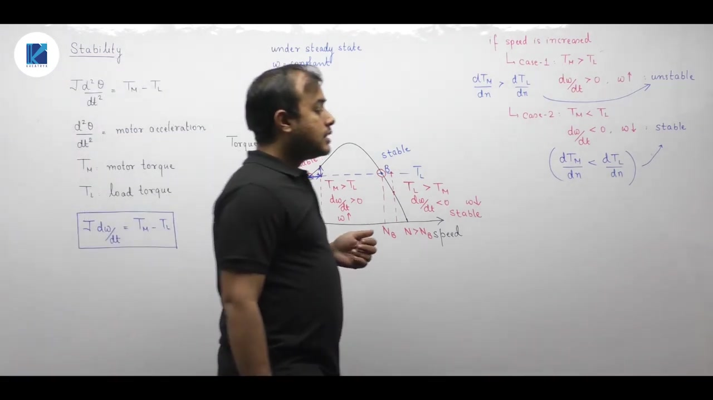

Let us apply this rule to point A and point B:
- At point A, the motor curve has a positive slope ($\frac{dT_m}{d\omega} > 0$). The load torque is constant, so its slope is zero ($\frac{dT_L}{d\omega} = 0$). Here $\frac{dT_m}{d\omega} > \frac{dT_L}{d\omega}$, which confirms point A is unstable.
- At point B, the motor curve has a negative slope ($\frac{dT_m}{d\omega} < 0$). The load slope is zero. Here $\frac{dT_L}{d\omega} > \frac{dT_m}{d\omega}$, which proves point B is stable.

### Stability with Inverted Axes

Exams often plot speed on the vertical axis and torque on the horizontal axis. The derivative criterion cannot be applied blindly without inverting the slopes.

The simplest approach is to test disturbances directly:
- Since speed is on the vertical axis, increasing speed corresponds to an upward shift.
- Move vertically upward from the equilibrium point.
- Check which curve lies further to the right along the horizontal torque axis.
- If the load torque curve lies further right, then $T_L > T_m$, producing negative acceleration. The operating point is stable.
- If the motor torque curve lies further right, $T_m > T_L$, causing positive acceleration and instability.

## Worked Examples of Speed-Torque Stability
_(15:04 - 20:38)_

### Graphical Analysis on Speed versus Torque Axes

When speed is on the vertical axis and torque is on the horizontal axis, we determine stability by checking how the curves respond to vertical shifts.

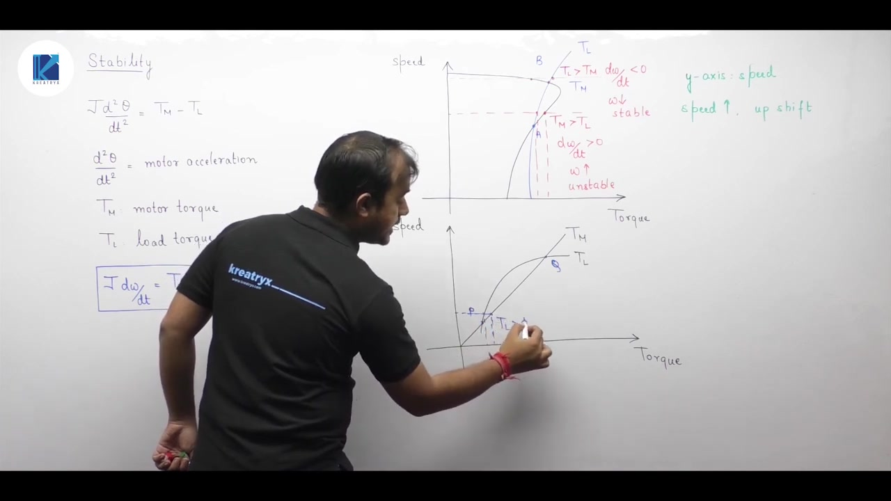

Consider two intersection points, A and B:
1. **Operating Point A:** From point A, increase speed slightly upward. Looking horizontally, the motor torque curve $T_m$ lies further right than the load torque curve $T_L$. So $T_m > T_L$. This net torque creates positive acceleration $\frac{d\omega}{dt} > 0$. The speed rises further away from A. Therefore, point A is unstable.
2. **Operating Point B:** From point B, shift speed slightly upward. The load torque curve $T_L$ lies further right than $T_m$. So $T_L > T_m$. The net torque is negative, so $\frac{d\omega}{dt} < 0$. The motor decelerates back down to B. Point B is stable.

### The True Meaning of Stability

> [!info] Definition
> Stability is determined by whether the system reaction opposes the initial disturbance. The response must act opposite to the direction of perturbation.

Consider two points P and Q:
- At point P, a speed increase causes $T_L > T_m$, driving speed back down. The motion opposes the disturbance. Point P is stable.
- At point Q, suppose we perturb the system by reducing speed downward. In that region below Q, the load torque curve lies further right than the motor curve. Thus $T_L > T_m$. Since $T_L > T_m$, the deceleration $\frac{d\omega}{dt}$ is negative. Speed drops even further downward away from Q. Because the speed response reinforces the disturbance rather than opposing it, point Q is unstable.

> [!success] Result
> A speed decrease alone does not indicate stability or instability. If you perturb speed upward, speed must decrease back. If you perturb speed downward, speed must increase back.

### Summary of Stability Criteria

Before moving on to motor testing, keep these rules in mind:
- When torque is on the y-axis and speed is on the x-axis, calculate slopes including their signs:
  $$\frac{dT_L}{d\omega} > \frac{dT_m}{d\omega} \implies \text{Stable}$$
- When speed is on the y-axis, apply an upward or downward test shift. Check whether the net torque opposes the shift.
- This criterion applies to any motor drive system, including DC and AC machines.

## Induction Motor Testing and the No-Load Test Principle
_(20:38 - 26:14)_

### Comparison with Transformer Tests

The per-phase equivalent circuit of an induction motor closely matches that of a transformer. In a transformer, we perform open-circuit and short-circuit tests to find equivalent circuit parameters.

Similar tests can determine the induction motor parameters. But an induction motor delivers mechanical power rather than electrical power. We cannot physically open-circuit or short-circuit mechanical output terminals. So the test methods and names are adapted.

> [!info] Principle
> The tests performed on an induction motor mirror the open-circuit and short-circuit tests of a transformer. But they use mechanical operating states to create the open and short-circuit conditions.

### Equivalent Circuit and Mechanical Load Representation

The per-phase equivalent circuit consists of:
- Stator resistance $R_1$ and stator leakage reactance $X_1$.
- Magnetizing reactance $X_m$.
- Referred rotor resistance $R'_2$ and rotor leakage reactance $X'_2$.
- A variable load resistance representing gross mechanical power:
  $$R'_L = R'_2\left(\frac{1}{s}-1\right)$$

The power consumed in this variable resistor represents the developed mechanical power. So the motor acts like a transformer feeding a variable resistance load $R'_L$.

### The No-Load Test Condition

The open-circuit condition corresponds to setting the load resistance to infinity:

$$R'_2\left(\frac{1}{s}-1\right) \to \infty$$

This occurs when slip $s$ approaches zero:

$$s \to 0 \implies N \approx N_s$$

Zero slip means the rotor runs at synchronous speed $N_s$. In practice, an uncoupled induction motor running on no load rotates at nearly synchronous speed. For instance, a $1000\text{ rpm}$ synchronous motor runs at about $995\text{ rpm}$ on no load.

At this operating point, $s \approx 0$. The rotor resistance becomes very large, so the rotor branch draws negligible current. The circuit simplifies to the stator impedance and the magnetizing branch.

> [!success] Result
> The no-load test of an induction motor corresponds to the open-circuit test of a transformer. It is used to determine:
> 1. Shunt branch parameters ($X_m$).
> 2. No-load constant losses (core loss plus friction and windage loss).

## No-Load Test Measurements and Impedance Calculations
_(26:14 - 31:49)_

### Test Setup and Measurements

During the no-load test, rated balanced three-phase voltage at rated frequency is applied to the stator terminals. The rotor runs uncoupled from any mechanical load.

We measure three quantities at the stator input:
1. Line-to-line voltage $V_{nl}$.
2. Total three-phase active power input $P_{nl}$, measured with two wattmeters.
3. Line current $I_{nl}$, measured with an ammeter in each phase.

To eliminate minor meter imbalances, we average the three ammeter readings:

$$I_{nl} = \frac{I_{A} + I_{B} + I_{C}}{3}$$

This average gives the scalar magnitude of the no-load current $I_0$.

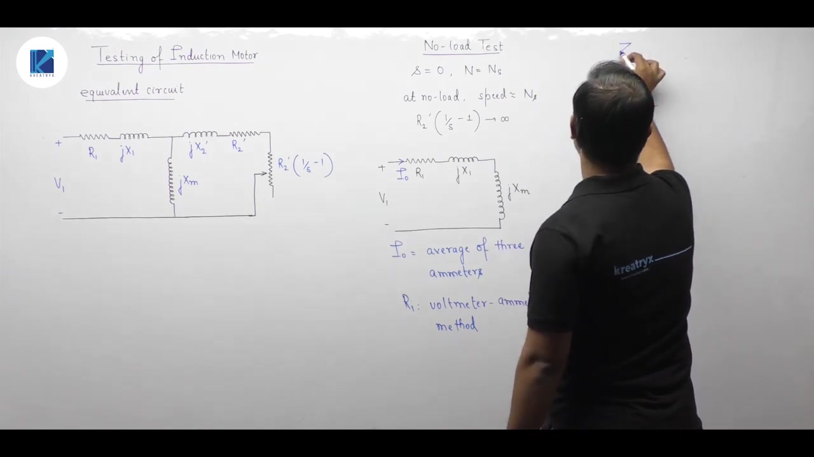

### Determining Stator Resistance $R_1$

Stator winding resistance $R_1$ is not found from the no-load AC test. It is measured separately using a DC voltmeter and ammeter.

A DC current is passed through two stator terminals. The ratio of DC voltage to DC current gives the DC resistance:
- For a star-connected stator: $R_{dc} = \frac{V_{dc}}{2 I_{dc}}$.
- For a delta-connected stator: $R_{dc} = \frac{3}{2} \left(\frac{V_{dc}}{I_{dc}}\right)$.

Due to skin effect, the effective AC resistance is higher than the DC value. At $50\text{ Hz}$, we apply an empirical factor between $1.2$ and $1.3$:

$$R_1 = (1.2 \text{ to } 1.3) \times R_{dc}$$

### Per-Phase No-Load Impedance

To compute equivalent circuit values, convert measured line quantities into per-phase values:
- For star connection: $V_{ph} = \frac{V_{nl}}{\sqrt{3}}$, $I_{ph} = I_{nl}$.
- For delta connection: $V_{ph} = V_{nl}$, $I_{ph} = \frac{I_{nl}}{\sqrt{3}}$.

The per-phase no-load impedance is:

$$Z_{nl} = \frac{V_{ph}}{I_{ph}}$$

The no-load equivalent series resistance $R_{nl}$ is simply the stator resistance $R_1$. So the total no-load reactance is:

> [!success] Result
> $$X_{nl} = \sqrt{Z_{nl}^2 - R_1^2} = X_1 + X_m$$

Here, $X_{nl}$ represents the sum of the stator leakage reactance $X_1$ and the magnetizing reactance $X_m$. The test yields their sum. We cannot isolate $X_m$ until $X_1$ is found from the blocked rotor test.

## Power Balance and Separation of No-Load Losses
_(31:52 - 36:54)_

### Components of No-Load Power Input

The active power measured during the no-load test ($P_{nl}$) accounts for all losses in the motor at no load:

$$P_{nl} = P_{\text{cu, stator}} + P_{\text{core, stator}} + P_{\text{core, rotor}} + P_{\text{mech}}$$

Let us inspect each loss component:
1. **Stator copper loss:** $3 I_{nl}^2 R_1$. Since $R_1$ is known from the DC resistance measurement, this loss is calculated directly.
2. **Rotor core loss:** The rotor frequency is $f_r = s f$. At no load, $s \approx 0$, so rotor frequency is a fraction of a hertz. Core loss is proportional to frequency squared. So rotor iron loss is negligible and taken as zero.
3. **Rotor copper loss:** At no load, rotor current is negligible, so rotor copper loss is approximately zero.
4. **Mechanical loss ($P_{\text{mech}}$):** Comprises friction in the bearings and aerodynamic windage ($P_{f+w}$).

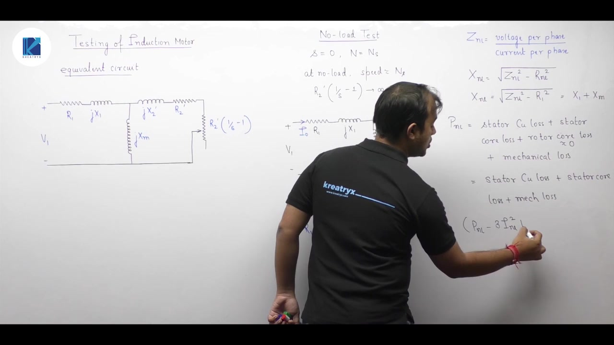

### Rotational Losses

Subtracting the known stator copper loss from the total no-load power gives the combined rotational losses:

> [!success] Result
> $$P_{\text{rot}} = P_{nl} - 3 I_{nl}^2 R_1 = P_{\text{core}} + P_{f+w}$$

The wattmeter measurement alone gives only their sum. It does not separate iron loss from friction and windage loss.

### Graphical Separation of Core Loss from Friction and Windage

To separate these two losses, run the no-load test across a range of stator voltages down to the point where the motor begins to stall. Frequency is kept constant.

Here is the underlying physical behavior:
- Core loss depends on peak flux density:
  $$B_m \propto \frac{V}{f} \implies P_{\text{core}} \propto V^2$$
  Core loss drops to zero if the terminal voltage drops to zero.
- Mechanical loss ($P_{f+w}$) depends strictly on rotor speed. Since speed stays nearly synchronous across this voltage range, mechanical loss remains constant.

Now plot rotational loss $P_{\text{rot}}$ against applied voltage $V$ (or $V^2$). Extrapolate the resulting curve back to the vertical axis at $V = 0$:

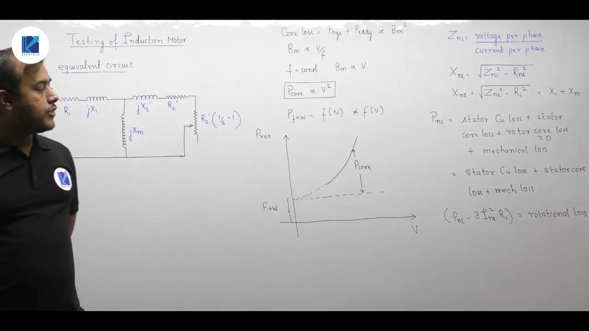

> [!info] Loss Separation Rule
> - The intercept on the vertical axis at $V = 0$ gives the constant friction and windage loss $P_{f+w}$.
> - The difference between total rotational loss at rated voltage and this intercept gives the stator core loss $P_{\text{core}}$ at rated voltage.

## Parametric Variations in No-Load Test Conditions
_(36:56 - 42:15)_

### Case 1: Reduced Voltage at Rated Frequency

> [!example] Problem
> What happens if the no-load test is conducted at rated frequency ($f = f_{\text{rated}}$) but at a voltage less than rated ($V < V_{\text{rated}}$)?

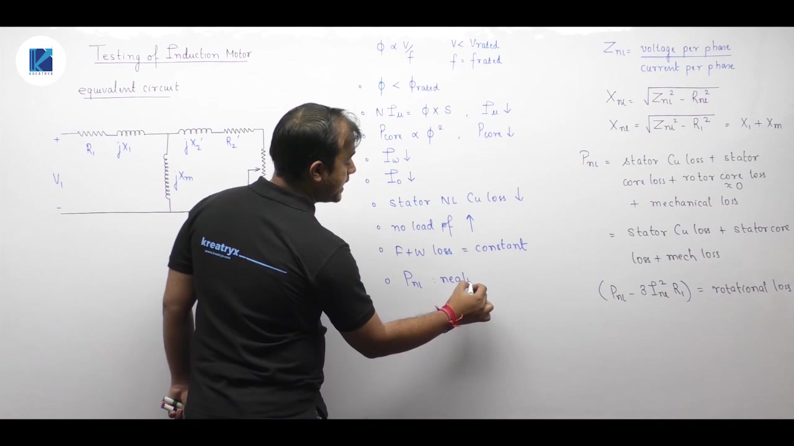

Let us trace each variable step by step:
1. **Core Flux:** Peak flux depends on the voltage-to-frequency ratio:
   $$\Phi \propto \frac{V}{f}$$
   Since $V < V_{\text{rated}}$ and $f = f_{\text{rated}}$, the flux $\Phi$ decreases below rated flux.
2. **Magnetizing Current:** The magnetizing MMF satisfies $N I_\mu = \Phi \mathcal{R}$. Reluctance $\mathcal{R}$ is fixed by motor geometry. Because flux drops, magnetizing current $I_\mu$ decreases.
3. **Core Loss and Working Current:** Core loss depends on flux squared ($P_{\text{core}} \propto \Phi^2$). Core loss decreases, which reduces the active loss current component $I_w$.
4. **No-Load Current and Copper Loss:** The total no-load current is:
   $$I_0 = \sqrt{I_\mu^2 + I_w^2}$$
   Since both components drop, $I_0$ decreases. Stator no-load copper loss ($3 I_0^2 R_1$) drops as well.
5. **No-Load Power Factor:** Magnetizing current $I_\mu$ draws reactive power. With $I_\mu$ reduced, the reactive power consumption drops significantly. So the no-load power factor increases.
6. **Mechanical Loss and Total Active Power:** Mechanical loss $P_{f+w}$ depends on rotor speed. Since frequency is rated, synchronous speed is unchanged. Speed remains constant, so friction and windage loss is constant. Because mechanical loss dominates no-load real power, the total active power $P_{nl}$ shows little change.

### Case 2: Rated Voltage at Reduced Frequency

> [!example] Problem
> What happens if the no-load test is conducted at rated voltage ($V = V_{\text{rated}}$) but at less than rated frequency ($f < f_{\text{rated}}$)?

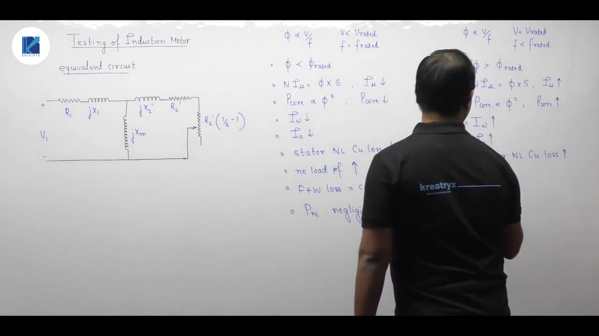

Here the denominator of the flux equation decreases:

$$\Phi \propto \frac{V}{f} \implies \Phi > \Phi_{\text{rated}}$$

1. **Magnetic Saturation:** Because flux exceeds rated flux, the magnetic iron core is driven deep into saturation.
2. **Magnetizing Current ($I_\mu$):** Due to saturation, core reluctance rises sharply. Magnetizing current $I_\mu$ increases substantially.
3. **Core Loss:** Since $\Phi$ increases, hysteresis and eddy current losses increase. The loss component $I_w$ increases.
4. **Total Current and Stator Copper Loss:** Both $I_\mu$ and $I_w$ rise. So no-load current $I_0$ increases. Stator copper loss rises.
5. **Mechanical Loss:** Synchronous speed depends on frequency:
   $$N_s = \frac{120 f}{P}$$
   A lower frequency lowers synchronous speed and rotor speed. Since mechanical loss depends on speed, friction and windage loss decreases.
6. **Power Factor:** The heavy rise in magnetizing current causes reactive power to shoot up. The operating no-load power factor decreases.

## Blocked Rotor Test Principle and Equivalent Circuit
_(42:18 - 48:18)_

### Principle of the Blocked Rotor Test

In a transformer short-circuit test, the secondary terminals are short-circuited. For an induction motor, the electrical equivalent of the mechanical load is:

$$R'_L = R'_2\left(\frac{1}{s}-1\right)$$

This resistance becomes a direct short circuit ($R'_L = 0$) when the slip is unity:

$$s = 1 \implies N = 0$$

> [!info] Definition
> The blocked rotor test (or locked rotor test) is conducted with the rotor held stationary at rest ($N = 0, s = 1$). A mechanical brake or pulley-belt clamping arrangement keeps the rotor from spinning.

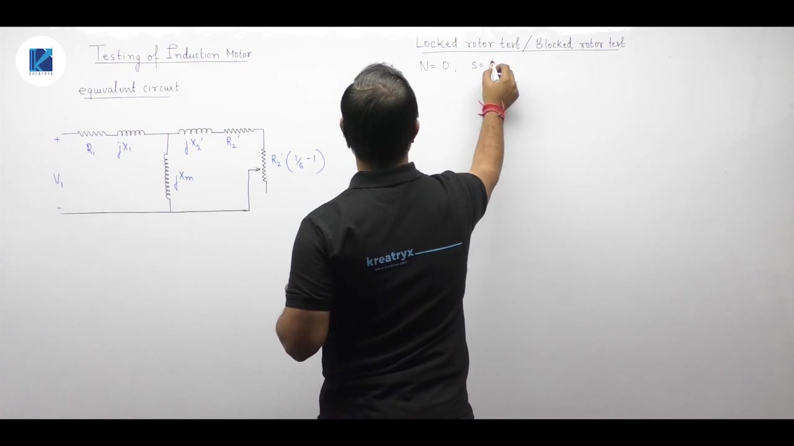

### Test Conditions and Approximations

Like the short-circuit test on a transformer, this test is conducted at rated stator current.

Because the rotor is locked at $s = 1$, the impedance of the machine is very small. Only a small fraction of rated voltage ($10\%\text{ to }15\%$) is needed to circulate full-load current:

$$V_{br} \ll V_{\text{rated}}$$

This reduced voltage yields two major circuit simplifications:
1. **Low Core Loss and Neglected Magnetizing Branch:** The flux depends on applied voltage:
   $$\Phi \propto \frac{V_{br}}{f}$$
   Since $V_{br}$ is very low, flux is tiny. Magnetizing current $I_\mu$ is negligible. We can ignore the shunt branch $jX_m$. Core loss is proportional to $\Phi^2$, so core loss is also neglected.
2. **Zero Mechanical Loss:** Since the rotor does not rotate ($N = 0$), friction and windage losses are zero.

> [!success] Result
> Under blocked-rotor test conditions, all iron and mechanical losses are zero. The total active power input represents only the stator and rotor winding copper losses.

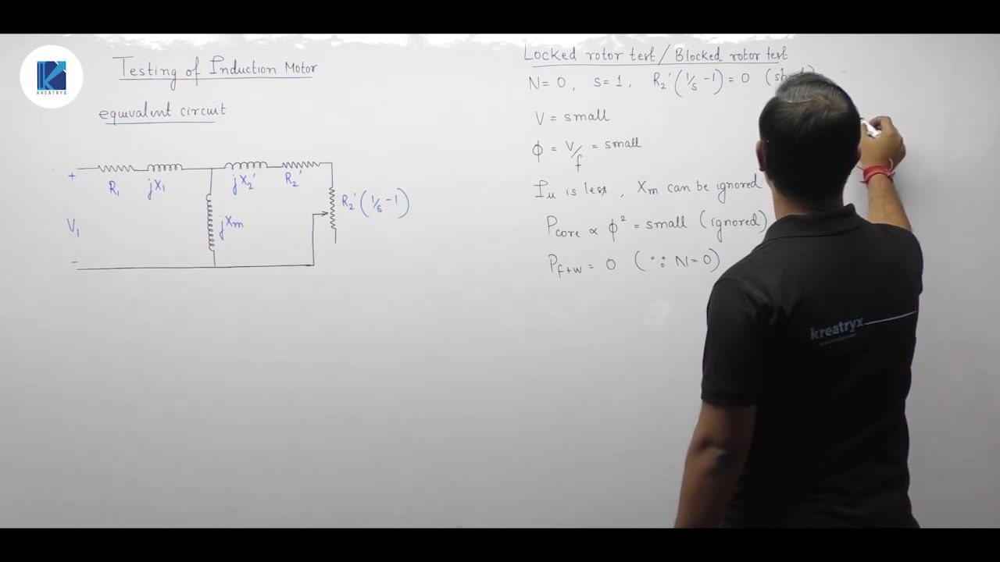

### Equivalent Series Circuit Model

With the shunt branch and the load resistor eliminated, the circuit reduces to a pure series impedance:

$$R_{01} = R_1 + R'_2$$
$$X_{01} = X_1 + X'_2$$

Here, $R_{01}$ is the total equivalent winding resistance referred to the stator. $X_{01}$ is the total leakage reactance referred to the stator.

The applied voltage is $V_{br}$ and the circulating current is $I_{br}$. The test objectives are:
1. Determine the series parameters $R_{01}$ and $X_{01}$.
2. Measure the full-load variable copper losses.

## Parameter Calculation and Direct-On-Line Starting Relations
_(48:21 - 55:21)_

### Parameter Extraction from Blocked Rotor Test

During the blocked rotor test, we record line voltage $V_{br}$, line current $I_{br}$, and total three-phase power $P_{br}$.

Convert these to per-phase values:
- For star connection: $V_{br, ph} = \frac{V_{br}}{\sqrt{3}}$, $I_{br, ph} = I_{br}$.
- For delta connection: $V_{br, ph} = V_{br}$, $I_{br, ph} = \frac{I_{br}}{\sqrt{3}}$.

The blocked-rotor impedance per phase is:

$$Z_{br} = \frac{V_{br, ph}}{I_{br, ph}}$$

The active power represents three-phase copper loss:

$$P_{br} = 3 I_{br, ph}^2 R_{01}$$

From this, the total equivalent resistance referred to the stator is:

> [!success] Result
> $$R_{01} = \frac{P_{br}}{3 I_{br, ph}^2}$$

Since stator resistance $R_1$ is measured independently with DC, the rotor resistance referred to the stator is:

$$R'_2 = R_{01} - R_1$$

Next, find the total leakage reactance:

$$X_{01} = \sqrt{Z_{br}^2 - R_{01}^2}$$

In standard industrial machines, we divide this reactance equally between stator and rotor:

$$X_1 = X'_2 = \frac{X_{01}}{2} = 0.5 X_{01}$$

Now we can determine the magnetizing reactance $X_m$. From the no-load test, we had $X_{nl} = X_1 + X_m$. Using $X_1$ from this test yields:

$$X_m = X_{nl} - X_1$$

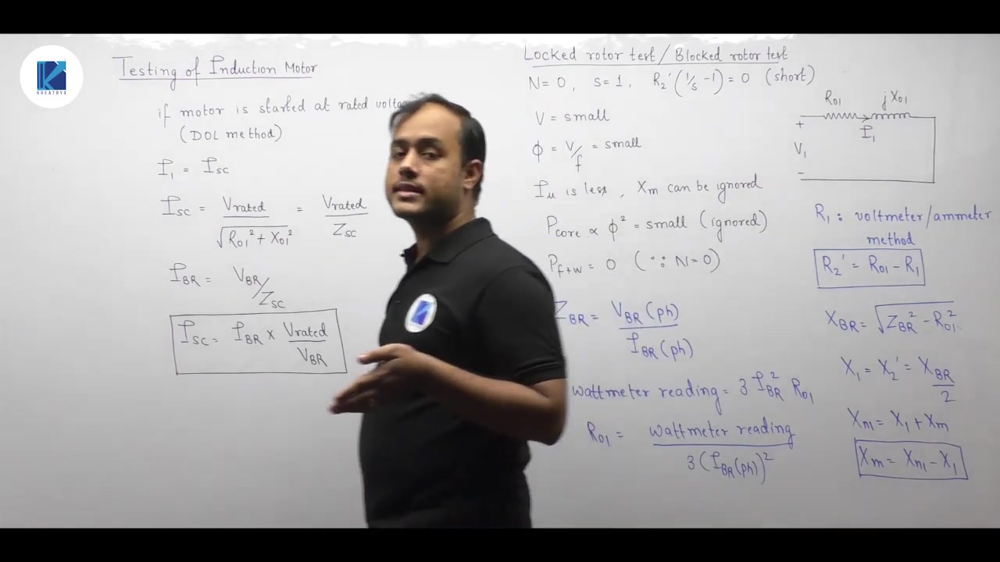

### Direct-On-Line (DOL) Starting Relations

When an induction motor starts directly across full rated voltage, its rotor is initially stationary ($N = 0, s = 1$). This starting state is physically identical to the blocked rotor test.

Under Direct-On-Line (DOL) starting at rated phase voltage $V_{\text{rated, ph}}$, the starting current is called the short-circuit current $I_{sc}$:

$$I_{sc} = \frac{V_{\text{rated, ph}}}{Z_{sc}}$$

During the blocked rotor test, the current was:

$$I_{br} = \frac{V_{br, ph}}{Z_{sc}}$$

Because the standstill impedance $Z_{sc}$ is the same in both cases, we relate starting current to test current by a simple voltage ratio:

> [!success] Result
> $$I_{sc} = I_{br} \times \left(\frac{V_{\text{rated}}}{V_{br}}\right)$$

This relation connects laboratory low-voltage test measurements directly to full-voltage starting behavior. Given blocked-rotor test measurements, you can calculate the inrush starting current and the starting torque developed by the motor at rated voltage.

---

## Summary and Key Takeaways

- The mechanical dynamic equation of motion is $J \frac{d\omega}{dt} = T_m - T_L$, where equilibrium steady-state operation occurs at $T_m = T_L$.
- On a torque (vertical) versus speed (horizontal) plot, an operating point is stable if $\frac{dT_L}{d\omega} > \frac{dT_m}{d\omega}$, ensuring that any speed disturbance produces a restoring torque.
- When speed is plotted on the vertical axis, stability is determined by introducing a vertical test shift and verifying that net torque opposes the perturbation.
- The no-load test runs uncoupled at $s \approx 0$, which open-circuits the mechanical load resistance $R'_2\left(\frac{1}{s}-1\right)$ and yields the no-load reactance $X_{nl} = X_1 + X_m$.
- Stator winding resistance $R_1$ is determined using a DC voltmeter-ammeter measurement and multiplied by an AC skin-effect factor of $1.2$ to $1.3$.
- Friction and windage loss $P_{f+w}$ is separated from stator core loss by extrapolating the rotational loss curve against applied voltage down to $V = 0$.
- In the blocked rotor test, the rotor is clamped at standstill ($s = 1$), which reduces the circuit to series resistance $R_{01}$ and leakage reactance $X_{01} = 2 X_1 = 2 X'_2$.
- The magnetizing reactance is obtained by combining results from both tests: $X_m = X_{nl} - X_1$.
- Direct-On-Line full-voltage starting current is directly proportional to blocked-rotor test current through the voltage ratio $I_{sc} = I_{br} \left(\frac{V_{\text{rated}}}{V_{br}}\right)$.

