# Stability and Testing of Induction Machines | L 41 | Electrical Machines | GATE 2022 | Ankit Goyal

- **Source**: https://www.youtube.com/watch?v=ZEl2jJIuEhU
- **Duration**: 00:49:20
- **Compiled**: 2026-09-23

---

## Overview

This lecture solves quantitative problems on the testing, equivalent circuit parameters, and operating stability of three-phase induction motors. It explains how to interpret data from no-load and blocked-rotor tests to determine efficiency, maximum developed power, and starting torque. The discussion shows how AC skin effect modifies stator resistance and how no-load rotational losses are separated from winding losses. The lecture also covers operating point stability criteria on torque-speed curves and demonstrates exact rotor resistance calculation for speed control.

## Contents

- [[#Introduction and Problem Formulation on Induction Motor Testing|Introduction and Problem Formulation on Induction Motor Testing]]
- [[#Full-Load Efficiency Computation and Introduction to Maximum Power|Full-Load Efficiency Computation and Introduction to Maximum Power]]
- [[#Extraction of Equivalent Impedance Parameters|Extraction of Equivalent Impedance Parameters]]
- [[#Maximum Developed Power Computation|Maximum Developed Power Computation]]
- [[#Starting Torque at Rated Voltage|Starting Torque at Rated Voltage]]
- [[#No-Load Loss Separation and Drive Stability Criteria|No-Load Loss Separation and Drive Stability Criteria]]
- [[#Equivalent Circuit Formulation and Locked-Rotor Scaling|Equivalent Circuit Formulation and Locked-Rotor Scaling]]
- [[#Speed Control via External Rotor Resistance (Part 1: Parameter Extraction)|Speed Control via External Rotor Resistance (Part 1: Parameter Extraction)]]
- [[#Speed Control via External Rotor Resistance (Part 2: Exact Solution) and Drive Stability|Speed Control via External Rotor Resistance (Part 2: Exact Solution) and Drive Stability]]
- [[#Chapter Summary and Concluding Remarks|Chapter Summary and Concluding Remarks]]

---

## Introduction and Problem Formulation on Induction Motor Testing
_(00:02 - 04:48)_

### Overview of Induction Machine Testing

Testing an induction machine determines its equivalent circuit parameters and predicts operating efficiency under load. Two primary tests correspond directly to open-circuit and short-circuit tests in transformers:

1. **No-Load Test (Open-Circuit equivalent):** The motor runs uncoupled at rated voltage and frequency. Slip is close to zero.
2. **Blocked-Rotor Test (Short-Circuit equivalent):** The rotor is locked at standstill ($s = 1$). Reduced voltage circulates full or near-rated current.

### Interpretation of Test Losses

Test data isolates fixed losses from variable copper losses through specific operating approximations:

- **No-Load Power Reading ($P_0$):**
  At near-synchronous speed, rotor current is negligible. If stator copper loss $3 I_0^2 R_1$ is neglected, the input power represents constant rotational and core losses:
  $$P_0 \approx P_{\text{core}} + P_{\text{friction \& windage}}$$

- **Blocked-Rotor Power Reading ($P_{\text{br}}$):**
  At standstill ($N = 0$), mechanical friction and windage losses are zero. Reduced applied voltage keeps core flux low. Since iron loss scales approximately with $V^2$, core loss is negligible:
  $$P_{\text{br}} \approx P_{\text{cu, stator}} + P_{\text{cu, rotor}}$$

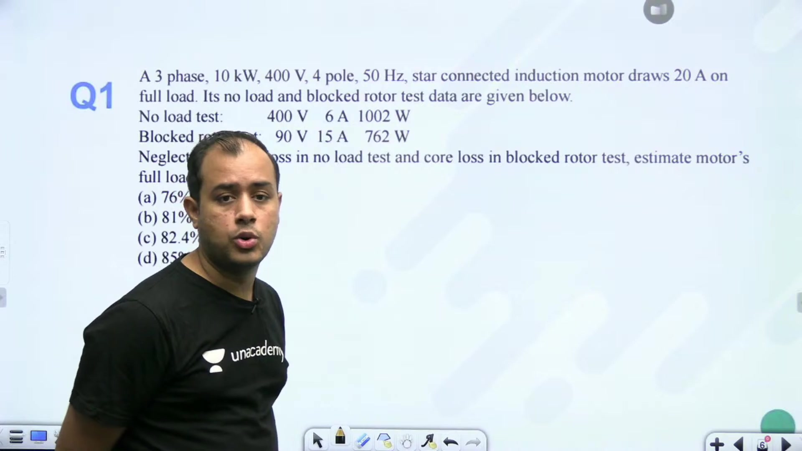

> [!example] Problem Statement
> A 3-phase, $10\text{ kW}$, $400\text{ V}$, 4-pole, $50\text{ Hz}$, star-connected induction motor draws $20\text{ A}$ on full load.
> The test results are:
> - **No-load test:** $400\text{ V}$, $6\text{ A}$, $1002\text{ W}$
> - **Blocked-rotor test:** $90\text{ V}$, $15\text{ A}$, $762\text{ W}$
> 
> Neglecting copper loss in the no-load test and core loss in the blocked-rotor test, find the full-load efficiency.

### Scaling Losses to Rated Conditions

The blocked-rotor test was conducted at $15\text{ A}$, but full load draws $20\text{ A}$. Copper loss scales with the square of current:

$$P_{\text{cu}} \propto I^2$$

Before computing full-load efficiency, the measured blocked-rotor loss must be scaled up to full-load current.

## Full-Load Efficiency Computation and Introduction to Maximum Power
_(05:44 - 10:39)_

### Solution to Problem 1: Full-Load Efficiency

To compute full-load efficiency, scale the blocked-rotor copper losses to the rated current of $20\text{ A}$:

$$
\begin{aligned}
P_{\text{cu, FL}} &= P_{\text{br}} \times \left(\frac{I_{\text{FL}}}{I_{\text{br}}}\right)^2 \\
&= 762 \times \left(\frac{20}{15}\right)^2 \\
&= 762 \times \frac{400}{225} \\
&= 1354.67\text{ W}
\end{aligned}
$$

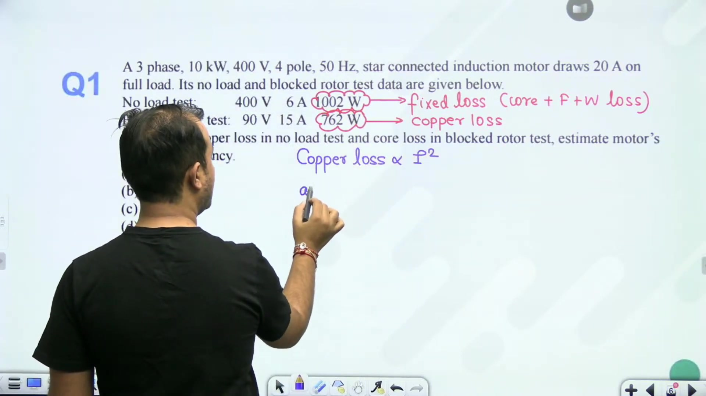

The motor delivers its rated mechanical shaft power at full load:
$$P_{\text{out}} = 10\text{ kW} = 10{,}000\text{ W}$$

Total input power at full load equals the output power plus all losses:
$$
\begin{aligned}
P_{\text{in}} &= P_{\text{out}} + P_0 + P_{\text{cu, FL}} \\
&= 10{,}000 + 1002 + 1354.67 \\
&= 12{,}356.67\text{ W}
\end{aligned}
$$

Compute the full-load efficiency:

$$\eta_{\text{FL}} = \frac{P_{\text{out}}}{P_{\text{in}}} \times 100\% = \frac{10{,}000}{12{,}356.67} \times 100\%$$

> [!success] Result
> $$\eta_{\text{FL}} \approx 80.93\%$$

This calculation matches transformer efficiency methods directly.

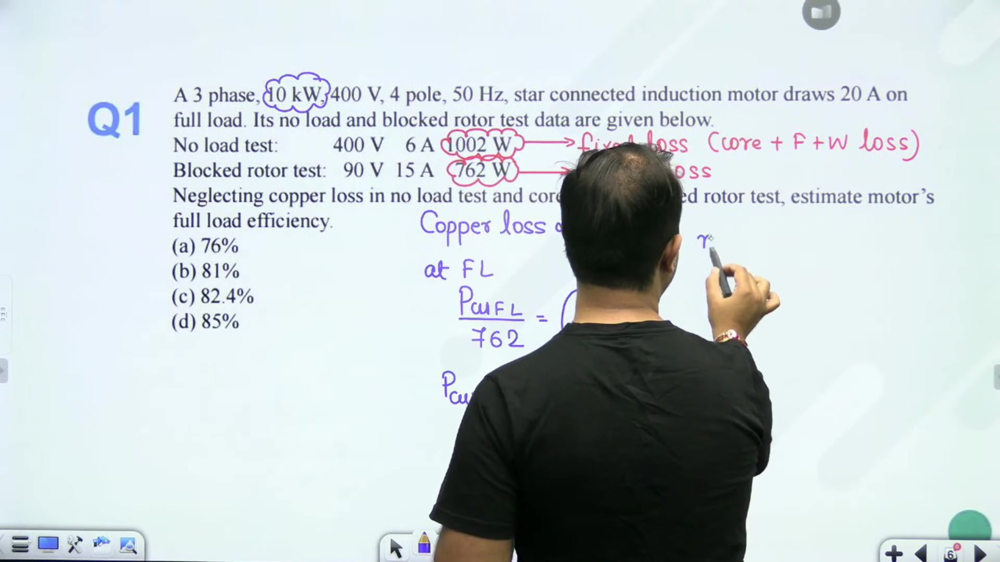

### Problem 2: Parameter Extraction from Test Data

> [!example] Problem Statement
> Tests on a $5\text{ hp}$, $500\text{ V}$, 3-phase, 6-pole, squirrel-cage induction motor yield:
> - No-load current: $I_0 = 3\text{ A}$
> - Short-circuit (blocked-rotor) test: $V_{\text{sc}} = 250\text{ V}$, $I_{\text{sc}} = 12\text{ A}$, $\cos\phi_{\text{sc}} = 0.6\text{ lagging}$
> - Full-load current: $I_{\text{FL}} = 7\text{ A}$, full-load slip: $s_{\text{FL}} = 3.5\%$
> 
> Estimate:
> 1. Maximum developed output power at rated voltage.
> 2. Starting torque at rated voltage.

Unless specified otherwise for a 3-phase motor without neutral, assume a delta stator connection.

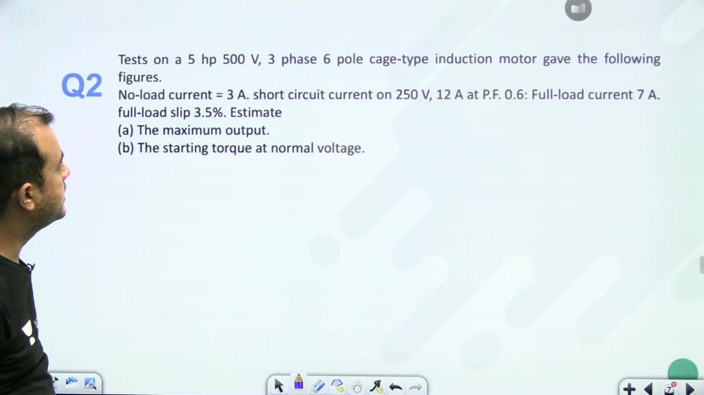

### Equivalent Circuit Under Blocked-Rotor Conditions

At standstill ($s = 1$), the rotor load resistance $R'_2\left(\frac{1}{s}-1\right)$ is zero. The magnetizing branch impedance is much larger than the rotor branch impedance. Magnetizing current is neglected during the short-circuit test.

The total equivalent series impedance referred to the stator is:
$$Z_{01} = R_{01} + j X_{01} = (R_1 + R'_2) + j (X_1 + X'_2)$$

These parameters govern both maximum power output and starting torque.

## Extraction of Equivalent Impedance Parameters
_(10:43 - 15:13)_

### Phase Quantity Conversion for Delta Connection

In a delta connection, the phase voltage equals the line voltage:
$$V_{\text{ph}} = V_L = 250\text{ V}$$

The phase current is smaller than the line current by a factor of $\sqrt{3}$:
$$I_{\text{ph, sc}} = \frac{I_{L, \text{sc}}}{\sqrt{3}} = \frac{12}{\sqrt{3}}\text{ A}$$

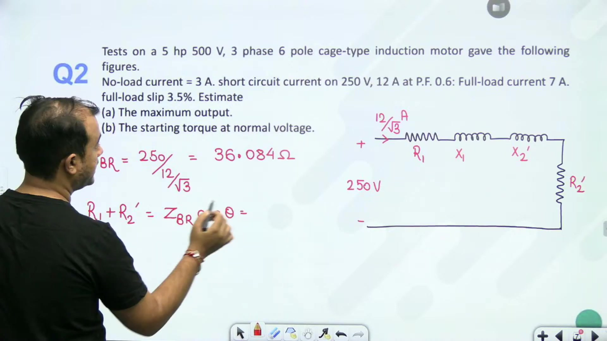

### Blocked-Rotor Impedance Computation

Compute the magnitude of the per-phase blocked-rotor impedance:

$$
\begin{aligned}
Z_{\text{br}} &= \frac{V_{\text{ph}}}{I_{\text{ph, sc}}} \\
&= \frac{250}{12/\sqrt{3}} \\
&= \frac{250\sqrt{3}}{12} \\
&= 36.084\ \Omega
\end{aligned}
$$

Using the given power factor $\cos\phi_{\text{sc}} = 0.6$ lagging:

$$\sin\phi_{\text{sc}} = \sqrt{1 - 0.6^2} = 0.8$$

Resolve $Z_{\text{br}}$ into its resistive and reactive components:

$$
\begin{aligned}
R_{01} &= R_1 + R'_2 = Z_{\text{br}} \cos\phi_{\text{sc}} = 36.084 \times 0.6 = 21.65\ \Omega \\
X_{01} &= X_1 + X'_2 = Z_{\text{br}} \sin\phi_{\text{sc}} = 36.084 \times 0.8 = 28.87\ \Omega
\end{aligned}
$$

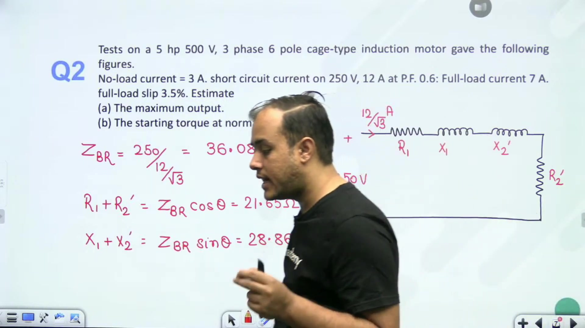

### Distribution of Resistance and Reactance

Normally, stator resistance $R_1$ is measured with a separate DC test. Here no DC test data is given. Neglecting $R_1$ allows setting:

$$R'_2 \approx R_{01} = 21.65\ \Omega$$

For standard induction motors, leakage reactances are divided equally between stator and rotor:

$$X_1 = X'_2 = \frac{X_{01}}{2} = \frac{28.87}{2} = 14.434\ \Omega$$

> [!success] Result
> - Total series resistance: $R_{01} \approx R'_2 = 21.65\ \Omega$
> - Stator and rotor leakage reactances: $X_1 = X'_2 = 14.434\ \Omega$

These parameters allow direct calculation of maximum developed power and starting torque.

## Maximum Developed Power Computation
_(15:30 - 20:04)_

### Complete Equivalent Circuit and Magnetizing Reactance

From the no-load test line current $I_0 = 3\text{ A}$, the delta phase current is:
$$I_{\text{ph0}} = \frac{3}{\sqrt{3}} = \sqrt{3}\text{ A} \approx 1.732\text{ A}$$

At rated phase voltage $V_1 = 500\text{ V}$, neglecting stator resistance gives:
$$X_m \approx \frac{V_1}{I_{\text{ph0}}} - X_1 = \frac{500}{\sqrt{3}} - 14.434 = 288.68 - 14.434 = 274.24\ \Omega$$

This magnetizing branch reactance ($274.24\ \Omega$) is much larger than the series leakage reactance ($28.87\ \Omega$). For output power calculations, the shunt branch can be neglected.

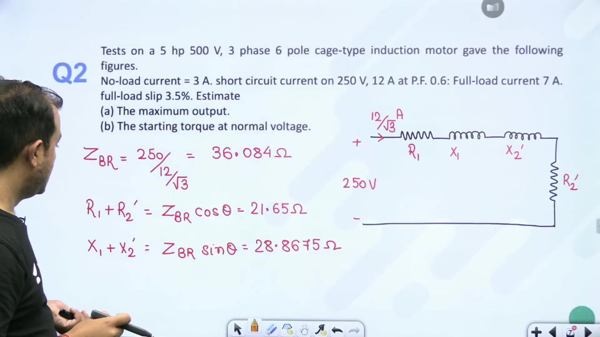

### Maximum Power Transfer Condition

Mechanical power developed across all three phases is represented by the variable resistance:

$$R'_L = R'_2\left(\frac{1}{s}-1\right)$$

According to the Maximum Power Transfer Theorem, power transferred to $R'_L$ is maximized when the load resistance equals the internal source impedance seen from its terminals:

$$R'_L = \sqrt{R_1^2 + (X_1 + X'_2)^2}$$

With $R_1 \approx 0$:
$$R'_2\left(\frac{1}{s_{mp}} - 1\right) = X_1 + X'_2 = X_{01}$$

Substitute $R'_2 = 21.65\ \Omega$ and $X_{01} = 28.87\ \Omega$:
$$\frac{1}{s_{mp}} - 1 = \frac{28.87}{21.65} = 1.333 \implies \frac{1}{s_{mp}} = 2.333 \implies s_{mp} \approx 0.4286$$

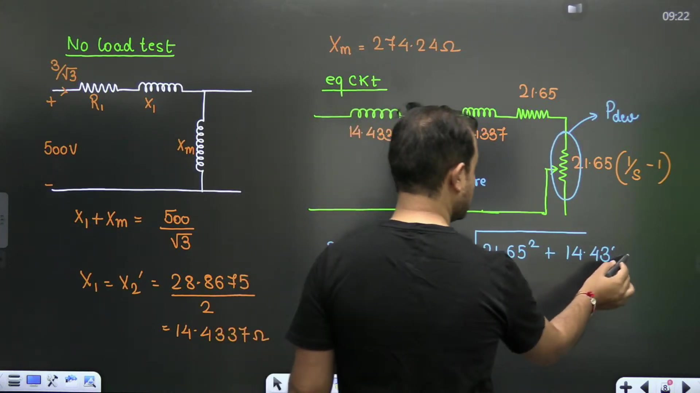

### Three-Phase Maximum Power

At slip $s_{mp}$, total series resistance is:
$$R_{\text{total}} = R_1 + R'_2 + R'_L = 0 + 21.65 + 28.87 = 50.52\ \Omega$$

Total series reactance is $X_{01} = 28.87\ \Omega$.
The total circuit impedance per phase is:
$$Z = \sqrt{R_{\text{total}}^2 + X_{01}^2} = \sqrt{50.52^2 + 28.87^2} = 58.19\ \Omega$$

Rotor current at rated voltage $V_1 = 500\text{ V}$:
$$I'_2 = \frac{V_1}{Z} = \frac{500}{58.19} \approx 8.59\text{ A}$$

Using the standard maximum power formula directly:
$$P_{m, \max} = 3 \times \frac{V_1^2}{2\left(R_1 + \sqrt{R_1^2 + X_{01}^2}\right)} \approx 3 \times \frac{500^2}{2(28.87)} \approx 3 \times 4.33\text{ kW}$$

Taking the actual load resistance power:

> [!success] Result
> $$P_{m, \max} \approx 4.793\text{ kW}$$

This gives the maximum mechanical output capability of the motor.

## Starting Torque at Rated Voltage
_(20:05 - 24:43)_

### Scaling Blocked-Rotor Conditions to Rated Voltage

Starting torque is the torque developed at standstill ($s = 1$). Standstill conditions are identical to the blocked-rotor test. The short-circuit test was carried out at $V_{\text{sc}} = 250\text{ V}$, drawing $I_{\text{sc}} = 12\text{ A}$ at $\cos\phi_{\text{sc}} = 0.6$.

Rated voltage is $V_{\text{rated}} = 500\text{ V}$. Because the equivalent circuit is linear, current scales directly with applied voltage:

$$I_{\text{st}} = I_{\text{sc}} \times \left(\frac{V_{\text{rated}}}{V_{\text{sc}}}\right) = 12 \times \left(\frac{500}{250}\right) = 24\text{ A}$$

The power factor remains unchanged at $\cos\phi_{\text{st}} = 0.6$ lagging.

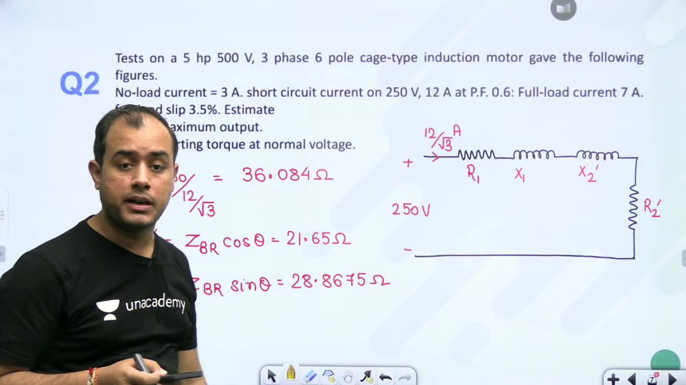

### Three-Phase Power Input at Starting

Compute total active input power at standstill under rated voltage:

$$
\begin{aligned}
P_{\text{in, st}} &= \sqrt{3} V_L I_{\text{st}} \cos\phi_{\text{st}} \\
&= \sqrt{3} \times 500 \times 24 \times 0.6 \\
&= 12{,}470.77\text{ W}
\end{aligned}
$$

Because stator core loss is negligible at starting and stator resistance $R_1$ is neglected, stator losses are zero. All active input power crosses the air gap into the rotor:

$$P_g = P_{\text{in, st}} = 12{,}470.77\text{ W}$$

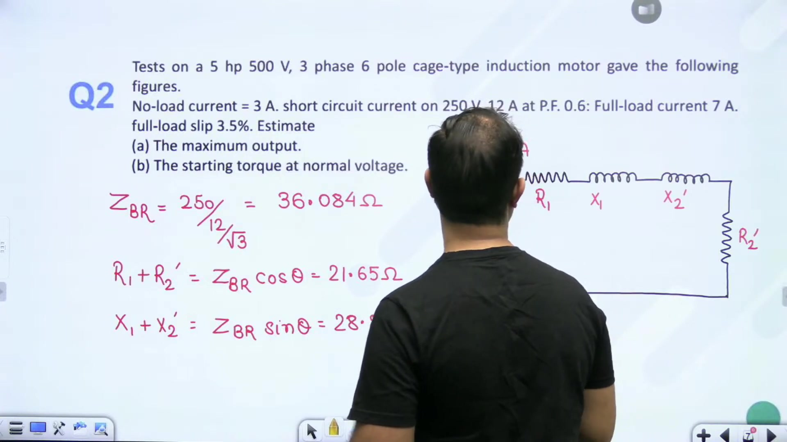

### Synchronous Speed and Starting Torque Evaluation

For a 6-pole, $50\text{ Hz}$ motor, calculate the synchronous angular velocity:

$$\omega_s = \frac{4\pi f}{P} = \frac{4\pi \times 50}{6} = \frac{200\pi}{6} \approx 104.72\text{ rad/s}$$

Starting torque equals the air-gap power divided by synchronous speed:

$$T_{\text{st}} = \frac{P_g}{\omega_s} = \frac{12{,}470.77}{104.72}$$

> [!success] Result
> $$T_{\text{st}} \approx 119.08\text{ N}\cdot\text{m}$$

### Alternative Distribution of Resistances

If winding resistances are assumed equally split ($R_1 = R'_2 = \frac{R_{01}}{2}$), rotor copper loss would be half of total input power. Air-gap power would be halved, giving half the starting torque. But when $R_1$ is neglected, all input power constitutes air-gap power.

## No-Load Loss Separation and Drive Stability Criteria
_(24:44 - 30:24)_

### Problem 3: No-Load Rotational Losses and Skin Effect

When stator DC resistance $R_{\text{dc}}$ is measured, AC resistance increases due to skin effect:

$$R_{\text{ac}} = k \cdot R_{\text{dc}}$$

With skin-effect factor $k = 1.2$ and $R_{\text{dc}} = 0.6\ \Omega$:
$$R_{\text{ac}} = 1.2 \times 0.6 = 0.72\ \Omega$$

For a delta-connected stator drawing no-load line current $I_0 = 8\text{ A}$, the phase current is:
$$I_{\text{ph0}} = \frac{8}{\sqrt{3}}\text{ A}$$

Compute the stator copper loss at no load:
$$P_{\text{cu0}} = 3 I_{\text{ph0}}^2 R_{\text{ac}} = 3 \times \left(\frac{8}{\sqrt{3}}\right)^2 \times 0.72 = 64 \times 0.72 = 46.08\text{ W}$$

The measured total no-load power is $P_0 = 250\text{ W}$. Rotational loss is obtained by subtracting stator copper loss:
$$P_{\text{rotational}} = P_0 - P_{\text{cu0}} = 250 - 46.08 \approx 203.92\text{ W} \approx 204\text{ W}$$

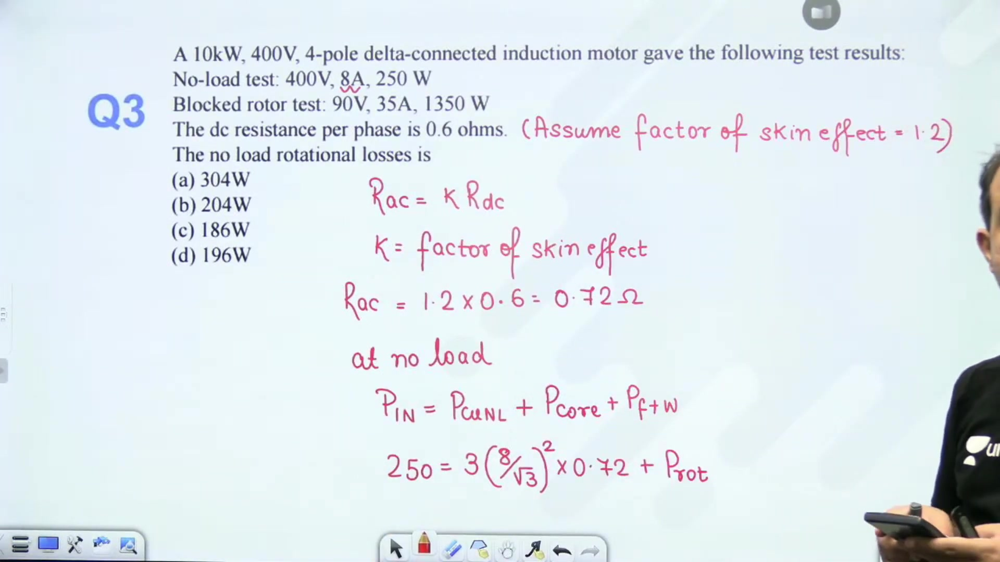

### Problem 4: Graphical Stability on Torque-Speed Plane

Operating point stability for an electric drive requires:

$$\frac{dT_L}{d\omega} > \frac{dT_m}{d\omega}$$

The slope of the load torque curve must exceed the slope of the motor torque curve.

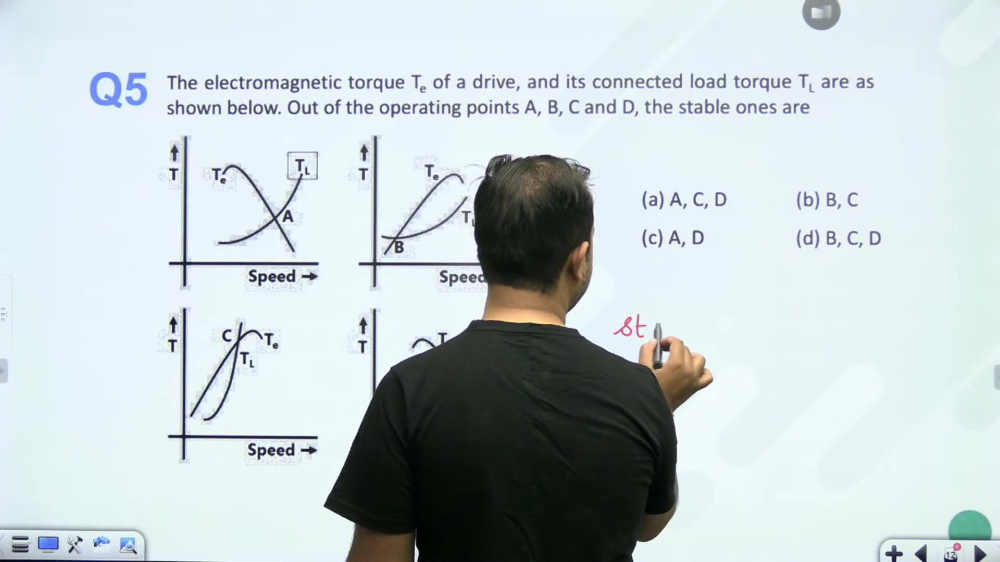

Analyzing the four intersection points:
- **Point A:** Motor slope is negative ($\frac{dT_m}{d\omega} < 0$), load slope is positive ($\frac{dT_L}{d\omega} > 0$). Since positive $>$ negative, Point A is **stable**.
- **Point B:** Motor torque slope is larger than load torque slope ($\frac{dT_m}{d\omega} > \frac{dT_L}{d\omega}$). Point B is **unstable**.
- **Point C:** Load torque rises steeper with speed than motor torque ($\frac{dT_L}{d\omega} > \frac{dT_m}{d\omega}$). Point C is **stable**.
- **Point D:** Both curves have negative slopes. The motor curve drops more steeply, meaning its slope is more negative (lower numerical value). Therefore $\frac{dT_L}{d\omega} > \frac{dT_m}{d\omega}$. Point D is **stable**.

> [!success] Result
> Stable operating points are **A, C, and D**.

### Conceptual Questions on Test Losses

- **Blocked Rotor Test Losses:**
  Both mechanical losses and core losses are negligible. Mechanical losses are zero because the rotor is stationary ($N = 0$). Core losses are negligible because applied voltage is low ($P_{\text{core}} \propto V^2$).
- **No-Load Wattmeter Reading:**
  In an induction motor, no-load current $I_0$ is large ($30\%$ to $35\%$ of rated current) due to the air gap. Stator copper loss cannot be ignored. The wattmeter reading equals core loss plus friction and windage plus stator copper loss.

## Equivalent Circuit Formulation and Locked-Rotor Scaling
_(30:24 - 35:19)_

### Tests Required for Complete Equivalent Circuit

Drawing the complete per-phase equivalent circuit of a three-phase induction motor requires three distinct experiments:
1. **No-Load Test:** Measures no-load current $I_0$ and power $P_0$ to determine magnetizing reactance $X_m$ and core/rotational loss resistance.
2. **Blocked-Rotor Test:** Measures short-circuit voltage, current, and power to determine equivalent series impedance $R_{01}$ and leakage reactance $X_{01}$.
3. **DC Stator Resistance Test:** Uses the voltmeter-ammeter method with a DC supply to measure stator winding resistance $R_1$, allowing separation of $R_1$ and $R'_2$.

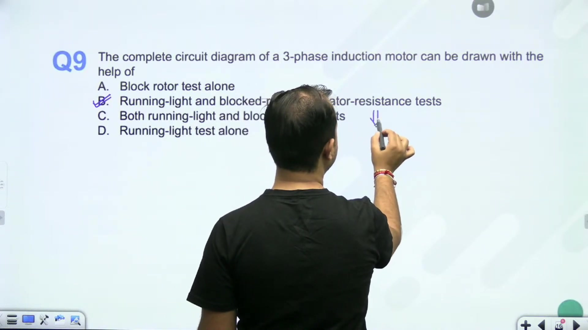

### Problem 5: Locked-Rotor Current Under Deviated Supply Conditions

> [!example] Problem Statement
> The locked-rotor current in a 3-phase, star-connected, $15\text{ kW}$, 4-pole, $230\text{ V}$ induction motor at rated condition ($230\text{ V}$, $50\text{ Hz}$) is $50\text{ A}$.
> Find the approximate locked-rotor line current drawn when the motor is connected to a $236\text{ V}$, $57\text{ Hz}$ supply.

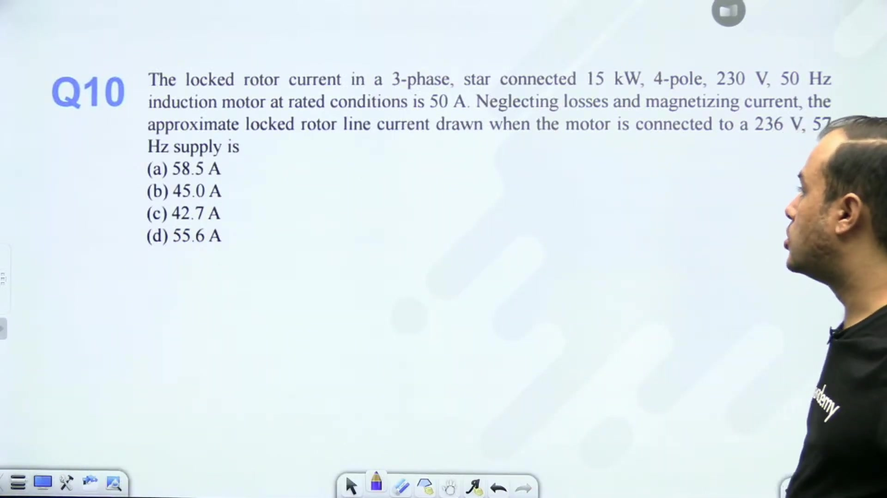

### Reactance Dominance Approximation

Under blocked-rotor conditions, the circuit is a series combination of equivalent resistance and leakage reactance:

$$Z_{\text{br}} = R_{\text{br}} + j X_{\text{br}}$$

The test data gives voltage and current, but no power factor. Leakage reactance is typically much larger than resistance ($X_{\text{br}} \gg R_{\text{br}}$). Therefore:

$$Z_{\text{br}} \approx X_{\text{br}} = 2\pi f L_{\text{br}} \propto f$$

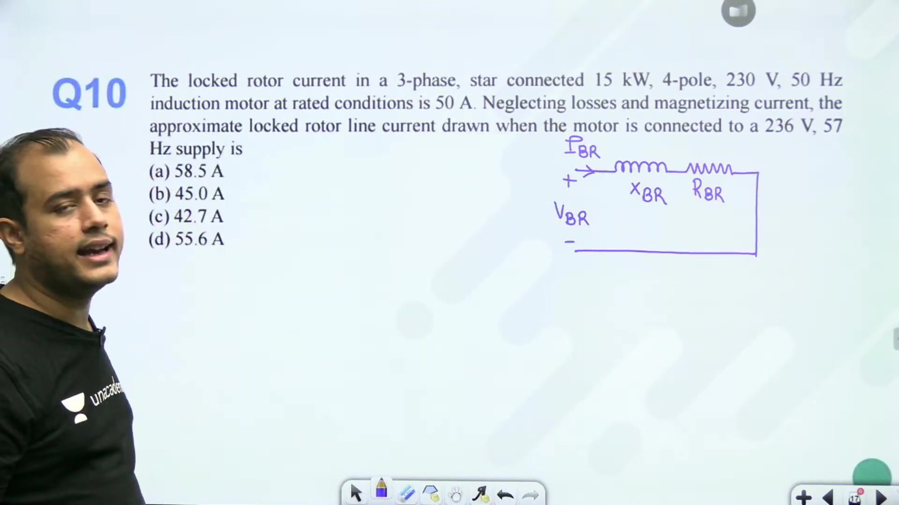

### Step-by-Step Current Calculation

1. **Calculate reactance at $50\text{ Hz}$:**
   For a star connection, phase voltage is $V_{\text{ph1}} = \frac{230}{\sqrt{3}}\text{ V}$.
   $$X_{\text{br, 50}} \approx \frac{V_{\text{ph1}}}{I_{\text{br1}}} = \frac{230/\sqrt{3}}{50} = \frac{4.6}{\sqrt{3}} \approx 2.656\ \Omega$$

2. **Scale reactance to $57\text{ Hz}$:**
   $$X_{\text{br, 57}} = X_{\text{br, 50}} \times \left(\frac{57}{50}\right) = 2.656 \times 1.14 \approx 3.028\ \Omega$$

3. **Compute new line current at $236\text{ V}$, $57\text{ Hz}$:**
   New phase voltage is $V_{\text{ph2}} = \frac{236}{\sqrt{3}}\text{ V}$.
   $$I_{\text{br2}} = \frac{V_{\text{ph2}}}{X_{\text{br, 57}}} = \frac{236/\sqrt{3}}{3.028} \approx 45.0\text{ A}$$

> [!success] Result
> $$I_{\text{br2}} \approx 45\text{ A}$$

Higher supply frequency increases inductive reactance, offsetting the small increase in voltage and reducing the locked-rotor current from $50\text{ A}$ to $45\text{ A}$.

## Speed Control via External Rotor Resistance (Part 1: Parameter Extraction)
_(35:20 - 40:03)_

### Problem 6: Rotor Resistance Insertion for Speed Reduction

> [!example] Problem Statement
> A $400\text{ V}$, $50\text{ Hz}$, 6-pole, star-connected induction motor develops full-load torque at $970\text{ rpm}$.
> Blocked-rotor test data: $200\text{ V}$, $15\text{ A}$, $2.1\text{ kW}$.
> Given: $R_1 = R'_2$ and $X_1 = X'_2$.
> What external rotor resistance must be added per phase to reduce the operating speed to $800\text{ rpm}$ while maintaining full-load torque?

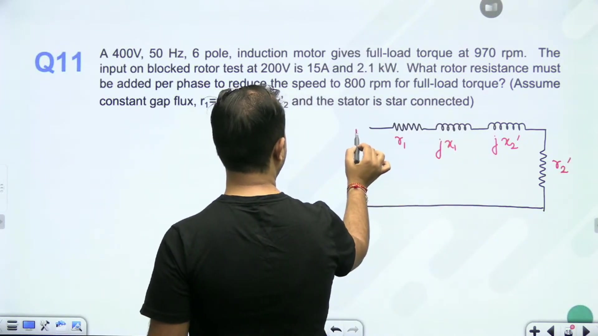

### Equivalent Circuit Parameter Extraction from Blocked-Rotor Test

For star connection:
- Phase voltage: $V_{\text{ph, br}} = \frac{200}{\sqrt{3}}\text{ V}$
- Phase current: $I_{\text{ph, br}} = 15\text{ A}$
- Three-phase power: $P_{\text{br}} = 2100\text{ W}$

1. **Equivalent Resistance:**
   $$
   \begin{aligned}
   R_{\text{eq}} &= R_1 + R'_2 = \frac{P_{\text{br}}}{3 I_{\text{ph, br}}^2} \\
   &= \frac{2100}{3 \times 15^2} = \frac{2100}{675} \approx 3.111\ \Omega
   \end{aligned}
   $$
   Since $R_1 = R'_2$:
   $$R_1 = R'_2 = \frac{3.111}{2} = 1.556\ \Omega$$

2. **Equivalent Impedance:**
   $$Z_{\text{eq}} = \frac{V_{\text{ph, br}}}{I_{\text{ph, br}}} = \frac{200/\sqrt{3}}{15} \approx 7.698\ \Omega$$

3. **Equivalent Reactance:**
   $$X_{\text{eq}} = X_1 + X'_2 = \sqrt{Z_{\text{eq}}^2 - R_{\text{eq}}^2} = \sqrt{7.698^2 - 3.111^2} = \sqrt{59.26 - 9.68} \approx 7.041\ \Omega$$
   Since $X_1 = X'_2$:
   $$X_1 = X'_2 = \frac{7.041}{2} = 3.521\ \Omega$$

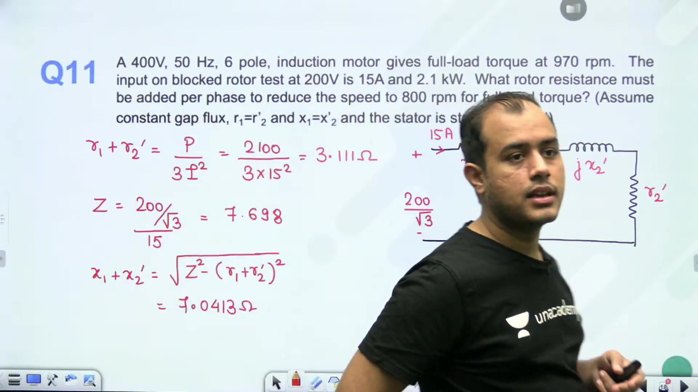

### Synchronous Speed and Slip Values

For a 6-pole, $50\text{ Hz}$ machine:
$$N_s = \frac{120 f}{P} = \frac{120 \times 50}{6} = 1000\text{ rpm}$$

- **Initial operating condition (full-load speed $970\text{ rpm}$):**
  $$s_1 = \frac{N_s - N_1}{N_s} = \frac{1000 - 970}{1000} = 0.03$$
- **Target operating condition (desired speed $800\text{ rpm}$):**
  $$s_2 = \frac{N_s - N_2}{N_s} = \frac{1000 - 800}{1000} = 0.20$$

To maintain identical torque when slip increases from $0.03$ to $0.20$, the rotor resistance must be increased by adding external resistance.

## Speed Control via External Rotor Resistance (Part 2: Exact Solution) and Drive Stability
_(40:06 - 45:30)_

### Exact Torque Equation Formulation

If stator impedance were neglected, the approximate torque equation would give $T \propto \frac{s}{R'_2}$. But because stator impedance was determined from test data, the exact torque equation must be used:

$$T = \frac{3}{\omega_s} \times \frac{V_1^2 \left(R'_2 / s\right)}{\left(R_1 + \frac{R'_2}{s}\right)^2 + X_{\text{eq}}^2}$$

Equating the torques at the two speeds gives:

$$\frac{R'_2 / s_1}{\left(R_1 + \frac{R'_2}{s_1}\right)^2 + X_{\text{eq}}^2} = \frac{R'_{\text{total}} / s_2}{\left(R_1 + \frac{R'_{\text{total}}}{s_2}\right)^2 + X_{\text{eq}}^2}$$

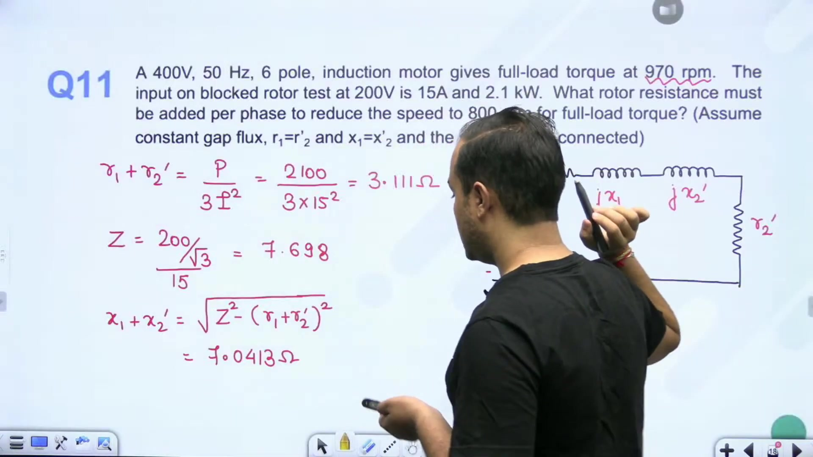

### Substituting Numerical Values and Solving Quadratic Equation

From the initial test and speed conditions:
The stator resistance is $R_1 = 1.556\ \Omega$.
The rotor resistance referred to stator is $R'_2 = 1.556\ \Omega$.
The initial operating slip gives $\frac{R'_2}{s_1} = \frac{1.556}{0.03} = 51.85\ \Omega$.
The total equivalent reactance is $X_{\text{eq}} = 7.041\ \Omega$, so $X_{\text{eq}}^2 \approx 49.58$.

The left-hand side of the torque equation evaluates to:
$$\text{LHS} = \frac{51.85}{(1.556 + 51.85)^2 + 49.58} = \frac{51.85}{53.406^2 + 49.58} = \frac{51.85}{2852.2 + 49.58} = \frac{51.85}{2901.78} \approx 0.017869$$

For the second operating condition at $s_2 = 0.20$, let $R = R'_{\text{total}}$:
$$\frac{R / 0.20}{\left(1.556 + \frac{R}{0.20}\right)^2 + 49.58} = \frac{5R}{(1.556 + 5R)^2 + 49.58} = 0.017869$$

Expanding the denominator:
$$(5R + 1.556)^2 + 49.58 = 25 R^2 + 15.56 R + 2.42 + 49.58 = 25 R^2 + 15.56 R + 52.0$$

Cross-multiplying gives:
$$5 R = 0.017869 (25 R^2 + 15.56 R + 52.0) = 0.4467 R^2 + 0.278 R + 0.929$$

Rearranging into standard quadratic form:
$$0.4467 R^2 - 4.722 R + 0.929 = 0$$

Solving this quadratic yields the operating branch root:
$$R'_{\text{total}} \approx 10.33\ \Omega$$

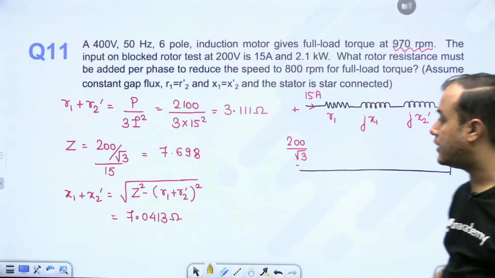

### External Resistance Required Per Phase

The external resistance referred to the stator is:
$$R_{\text{ext}} = R'_{\text{total}} - R'_2 = 10.33 - 1.556 = 8.78\ \Omega$$

> [!success] Result
> $$R_{\text{ext}} \approx 8.78\ \Omega\text{ per phase}$$

### Drive Stability Verification (Problem 7)

A squirrel-cage induction motor drives a mechanical load with given torque-speed curves:

1. **Curve A:** The load curve slope is greater than the motor curve slope ($\frac{dT_L}{d\omega} > \frac{dT_m}{d\omega}$). This operating point is **stable**.
2. **Curve B:** The load curve drops more steeply than the motor curve, meaning its slope is more negative ($\frac{dT_L}{d\omega} < \frac{dT_m}{d\omega}$). This operating point is **unstable**.

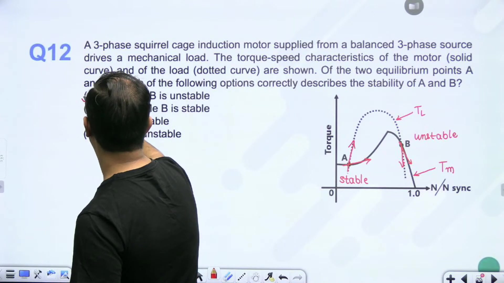

## Chapter Summary and Concluding Remarks
_(45:32 - 49:17)_

### Summary of Core Engineering Principles

This lecture addressed key quantitative methods for analyzing induction machine operation and testing:

1. **Test Loss Interpretation:**
   - No-load test provides core loss plus mechanical friction and windage loss. Stator copper loss is accounted for using measured DC resistance scaled by skin effect:
     $$R_{\text{ac}} = 1.2 R_{\text{dc}}$$
   - Blocked-rotor test provides total equivalent series resistance $R_{01} = R_1 + R'_2$ and leakage reactance $X_{01} = X_1 + X'_2$. Measured losses scale with the square of current:
     $$P_{\text{cu}} \propto I^2$$

2. **Operating Point Stability:**
   - Equilibrium occurs when motor torque equals load torque ($T_m = T_L$).
   - Stability requires the load torque curve to have a steeper slope than the motor torque curve:
     $$\frac{dT_L}{d\omega} > \frac{dT_m}{d\omega}$$
   - Any small positive disturbance in speed causes load demand to exceed motor capability ($T_L > T_m$), producing deceleration that restores original speed.

3. **External Resistance Speed Control:**
   - To maintain constant torque at reduced speeds, rotor resistance must be increased.
   - When stator impedance is known, equating exact torque expressions yields a quadratic equation for the total referred rotor circuit resistance:
     $$R_{\text{ext}} = R'_{\text{total}} - R'_2$$

### Preview of Next Session

The next lecture examines starting methods for three-phase squirrel-cage induction motors, analyzing Direct-On-Line (DOL), star-delta, auto-transformer, and rotor resistance starting techniques.

---

## Summary and Key Takeaways

- No-load test input power $P_0$ represents core loss plus mechanical friction and windage when stator copper loss is neglected.
- Blocked-rotor test power $P_{\text{br}}$ represents total copper losses at standstill, scaling with the square of current as $P_{\text{cu}} \propto I^2$.
- Measured DC stator resistance must be converted to AC resistance using the skin effect factor $R_{\text{ac}} = k \cdot R_{\text{dc}}$.
- Stator copper loss cannot be ignored at no-load when computing rotational losses precisely, because $I_0$ reaches $30\%$ to $35\%$ of rated current.
- Maximum mechanical power develops when the fictitious mechanical load resistance matches the source impedance: $R'_2\left(\frac{1}{s}-1\right) \approx X_{01}$.
- Starting torque equals total active input power at standstill divided by synchronous speed: $T_{\text{st}} = \frac{P_{\text{in, st}}}{\omega_s}$ when stator losses are neglected.
- When power factor is omitted in blocked-rotor data, series leakage reactance dominates resistance ($X_{\text{br}} \gg R_{\text{br}}$) and scales proportionally with supply frequency.
- An operating point on a torque-speed characteristic is stable if and only if $\frac{dT_L}{d\omega} > \frac{dT_m}{d\omega}$.
- Exact calculation of external rotor resistance for speed control at constant torque requires solving a quadratic equation that accounts for stator impedance.

