# Circle Diagram of Induction Motor | Electrical Machines | Lec 104 | GATE/ESE (EE, ECE) | Ankit Goyal

- **Source**: https://www.youtube.com/watch?v=vMY-IizxLFM
- **Duration**: 01:03:26
- **Compiled**: 2026-09-23

---

## Overview

This lecture explains the geometric derivation and construction of the circle diagram for three-phase induction machines. It demonstrates how no-load and blocked-rotor test measurements define the semicircular locus of stator current. The discussion breaks down total input power into output shaft power, copper losses, and constant rotational losses. It establishes the power line and torque line to graphically determine motor efficiency, operating slip, and pull-out torque.

## Contents

- [[#Overview of the Circle Diagram and Rotor Current Locus|Overview of the Circle Diagram and Rotor Current Locus]]
- [[#Derivation of the Semicircular Locus for Rotor and Load Currents|Derivation of the Semicircular Locus for Rotor and Load Currents]]
- [[#Addition of No-Load Current and Shift of the Origin|Addition of No-Load Current and Shift of the Origin]]
- [[#Power Interpretation of Phasor Components and Loss Inclusion|Power Interpretation of Phasor Components and Loss Inclusion]]
- [[#Blocked-Rotor Test Geometry and Standstill Power Representation|Blocked-Rotor Test Geometry and Standstill Power Representation]]
- [[#Geometric Construction of the Circle from Test Points|Geometric Construction of the Circle from Test Points]]
- [[#Separation of Losses Under Blocked-Rotor Conditions|Separation of Losses Under Blocked-Rotor Conditions]]
- [[#Separation of Stator and Rotor Copper Losses and the Torque Line|Separation of Stator and Rotor Copper Losses and the Torque Line]]
- [[#Geometric Proof of Copper Loss Proportionality|Geometric Proof of Copper Loss Proportionality]]
- [[#Proof of Series Copper Loss and Shaft Output Power|Proof of Series Copper Loss and Shaft Output Power]]
- [[#Power Line, Torque Line, and Operating Characteristics|Power Line, Torque Line, and Operating Characteristics]]

---

## Overview of the Circle Diagram and Rotor Current Locus
_(00:13 - 05:39)_

### Role of the Circle Diagram in Induction Machine Analysis

The circle diagram is a graphical representation of the steady-state performance of a three-phase induction motor. It yields the exact same operating quantities as the analytical equivalent circuit: line current, power factor, electromagnetic torque, mechanical shaft power, losses, and efficiency.

While modern numerical software solves equivalent circuits rapidly, the circle diagram remains important for conceptual understanding and competitive examinations such as ESE Conventional papers.

> [!info] Definition
> The circle diagram is the circular locus of the stator current phasor as the motor slip varies from synchronous speed ($s = 0$) to standstill ($s = 1$) and beyond.

### Rotor Equivalent Circuit and Voltage Equation

Consider the per-phase rotor circuit of an induction motor referred to standstill. The induced voltage $E_2$ acts across the rotor leakage reactance $X_2$ and the effective rotor resistance $R_2/s$:

$$I_2 = \frac{E_2}{\frac{R_2}{s} + jX_2}$$

Rewriting this in terms of the applied induced EMF:

$$E_2 = I_2\left(\frac{R_2}{s}\right) + j I_2 X_2$$

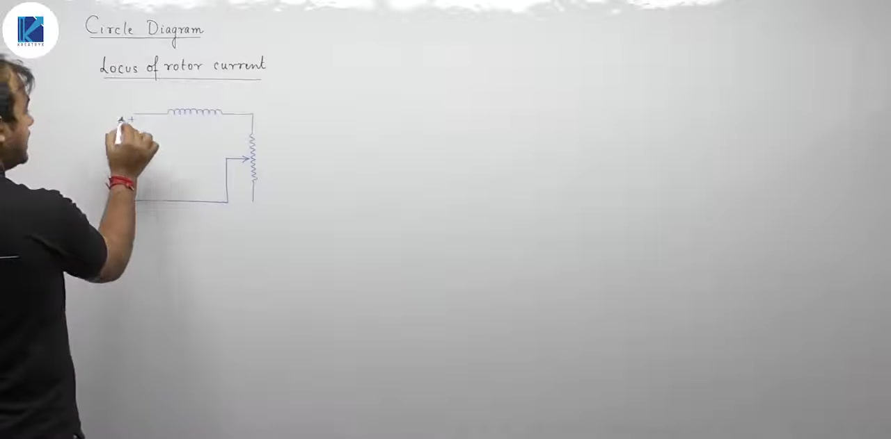

### Algebraic Transformation to Identify Locus

To reveal the geometric locus of $I_2$, divide the entire equation by $jX_2$:

$$\frac{E_2}{jX_2} = \frac{I_2 R_2}{s (jX_2)} + \frac{j I_2 X_2}{j X_2}$$

Recall that dividing by $j$ equals multiplying by $-j$:

$$-j\frac{E_2}{X_2} = -j I_2 \left(\frac{R_2}{s X_2}\right) + I_2$$

Rearranging the terms:

$$-j\frac{E_2}{X_2} = I_2 - j I_2 \left(\frac{R_2}{s X_2}\right)$$

This expression shows that a constant vector $-j\frac{E_2}{X_2}$ equals the vector sum of two components that are perpendicular to each other.

## Derivation of the Semicircular Locus for Rotor and Load Currents
_(05:39 - 12:52)_

### Geometric Proof of Semicircular Locus for Rotor Current

In the equation $-j\frac{E_2}{X_2} = I_2 - j I_2 \left(\frac{R_2}{s X_2}\right)$:

1. Let $E_2$ be oriented vertically along the imaginary axis.
2. The term $-j\frac{E_2}{X_2}$ has constant magnitude $\frac{E_2}{X_2}$ and lags $E_2$ by $90^\circ$. It forms a fixed horizontal diameter $OB$.
3. The phasor $I_2$ lags $E_2$ by the rotor impedance angle $\theta_2 = \tan^{-1}\left(\frac{sX_2}{R_2}\right)$.
4. The second component $-j I_2 \left(\frac{R_2}{s X_2}\right)$ is perpendicular to $I_2$, lagging it by $90^\circ$.

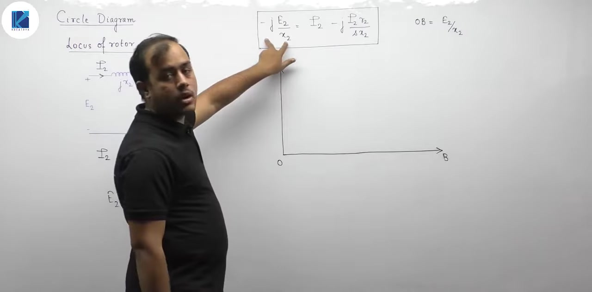

Because the angle between $I_2$ and the second component is always $90^\circ$, their intersection traces a right angle subtended by the fixed diameter $OB$. In plane geometry, the locus of a vertex subtending a constant right angle over a fixed hypotenuse is a semicircle.

> [!success] Result
> The locus of the rotor current phasor $I_2$ is a semicircle of diameter:
> $$\text{Diameter} = \frac{E_2}{X_2}$$

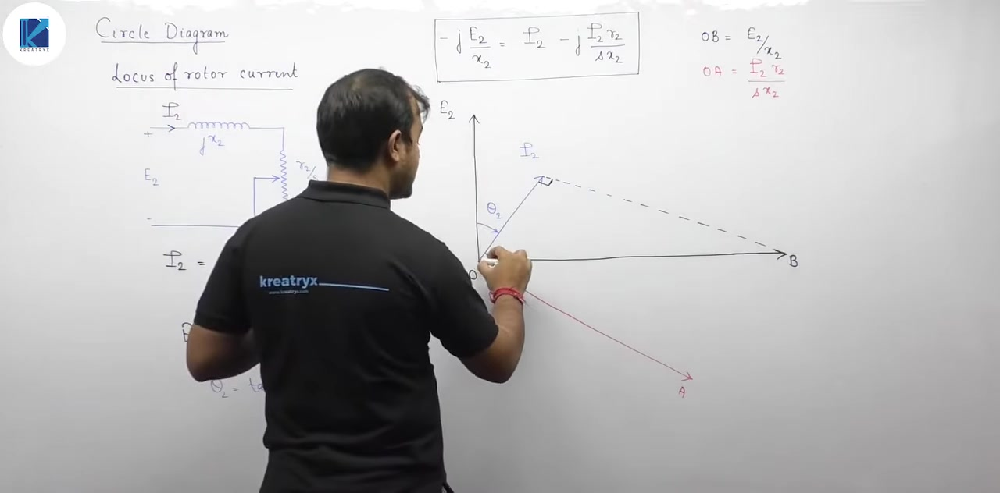

### Approximate Equivalent Circuit Representation

In an actual motor, we must account for stator impedance and magnetizing current. The circle diagram employs the approximate equivalent circuit of the induction motor, where the shunt magnetizing branch ($R_c \parallel jX_m$) is shifted directly to the stator input terminals.

The total stator line current $I_1$ splits into:
$$I_1 = I_0 + I'_1$$

Here $I_0$ is the constant no-load current. The load component $I'_1$ flows through the series combination of stator and rotor impedances:

$$I'_1 = \frac{V_1}{\left(R_1 + \frac{R'_2}{s}\right) + j(X_1 + X'_2)}$$

### Locus of the Load Component of Stator Current

Following the identical algebraic steps as for the rotor circuit:

$$-j\frac{V_1}{X_1 + X'_2} = I'_1 - j I'_1 \left(\frac{R_1 + R'_2/s}{X_1 + X'_2}\right)$$

> [!success] Result
> The locus of $I'_1$ is a semicircle with diameter:
> $$\text{Diameter} = \frac{V_1}{X_1 + X'_2}$$

The upper semicircle represents motor operation ($s > 0$). If completed into a full circle, the lower semicircle represents induction generator operation ($s < 0$).

## Addition of No-Load Current and Shift of the Origin
_(12:57 - 18:06)_

### Vector Addition of Excitation Current

To obtain the total input stator current $I_1 = I_0 + I'_1$, the locus of $I'_1$ must be added vectorially to the no-load current $I_0$.

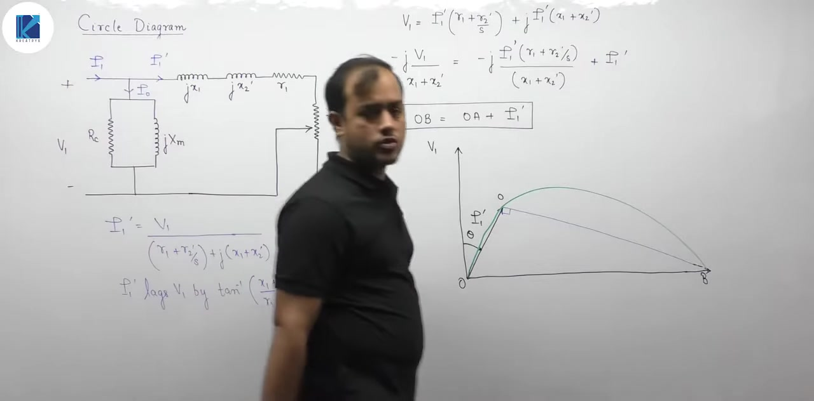

The excitation current $I_0$ is obtained from the no-load test:
- It lags the applied phase voltage $V_1$ by no-load power factor angle $\phi_0$.
- Because of the large magnetizing requirement across the air gap, $\phi_0$ is large (typically $70^\circ$ to $80^\circ$ lagging).

### Constructing the Semicircle from Point Q

Instead of drawing the diameter from the origin $O$, the origin of the semicircle is shifted to the tip of $I_0$, denoted as point $Q$.

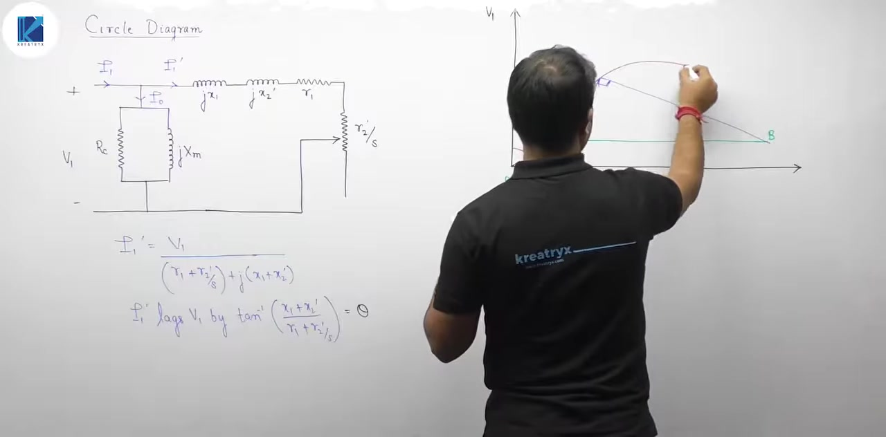

From point $Q$:
1. A horizontal line is drawn parallel to the voltage quadrature axis.
2. The diameter of the semicircle lies along this horizontal line originating from $Q$.
3. Any operating stator current $I_1$ is drawn as a vector from the true origin $O$ to the operating point on the circular arc.
4. The load component $I'_1$ is the vector drawn from $Q$ to that same point.

As motor slip $s$ increases from 0 toward 1, the impedance phase angle $\theta = \tan^{-1}\left(\frac{X_1 + X'_2}{R_1 + R'_2/s}\right)$ increases. The operating point moves along the perimeter of the semicircle away from $Q$.

## Power Interpretation of Phasor Components and Loss Inclusion
_(18:06 - 23:08)_

### Active and Reactive Power Projections

In any AC circuit where terminal voltage $V_1$ serves as the reference along the vertical axis:
- The component of current parallel to $V_1$ (vertical component) is in phase with voltage. It represents active (real) power:
  $$P = 3 V_1 I \cos\phi \propto \text{vertical component of current}$$
- The component of current perpendicular to $V_1$ (horizontal component) is in quadrature with voltage. It represents reactive power:
  $$Q = 3 V_1 I \sin\phi \propto \text{horizontal component of current}$$

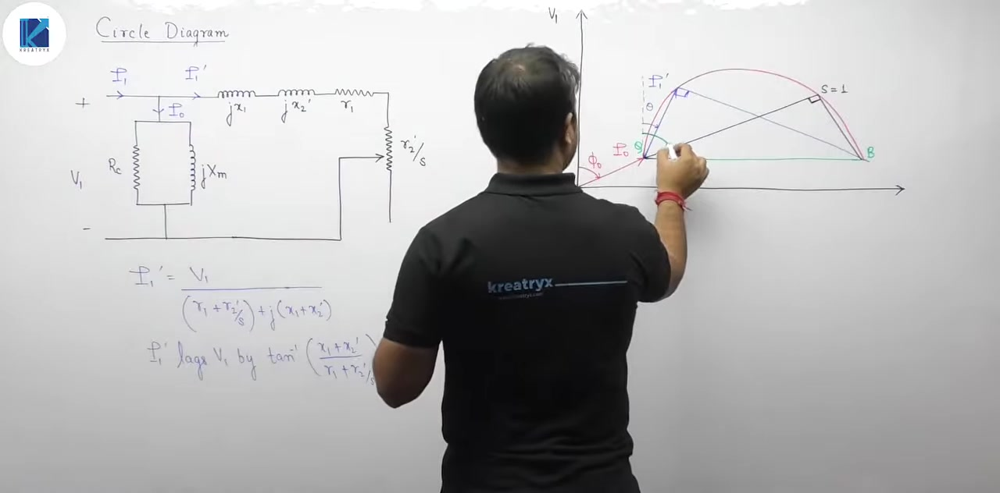

### Distinction Between Transformers and Induction Motors

In a static transformer, no-load losses consist almost entirely of core loss in $R_c$. An induction motor rotates, introducing mechanical bearing friction and windage losses.

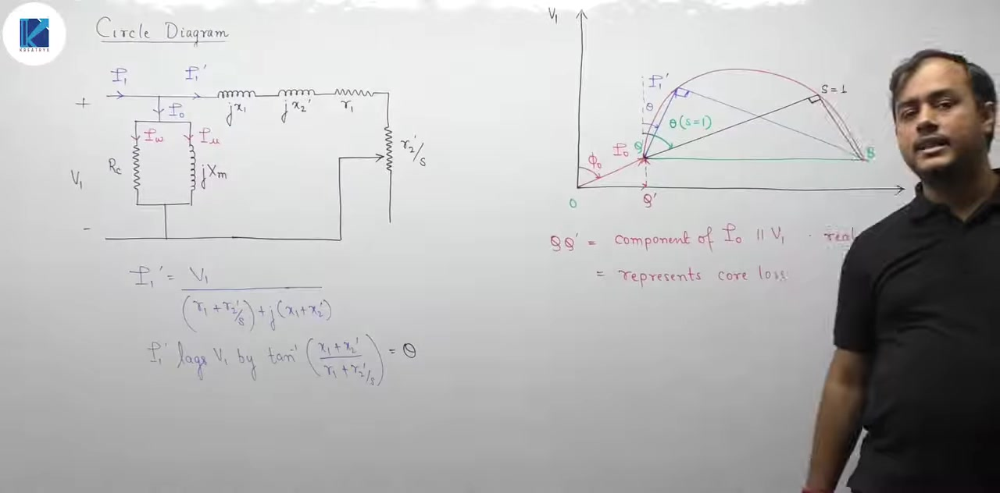

During a practical no-load test:
- The rotor runs uncoupled near synchronous speed ($s \approx 0$).
- Total active power drawn by the motor includes both core loss and mechanical rotational loss:
  $$P_0 = P_{\text{core}} + P_{\text{friction \& windage}}$$

When $I_0$ is plotted from experimental test data, its vertical intercept $QN$ automatically includes friction and windage losses alongside stator core losses:

$$QN \propto P_{\text{fixed}} = P_{\text{core}} + P_{\text{fw}}$$

This establishes a constant loss baseline below the horizontal reference line passing through $Q$.

## Blocked-Rotor Test Geometry and Standstill Power Representation
_(23:08 - 28:05)_

### Constructing the Short-Circuit Phasor

The blocked-rotor test provides:
- Blocked-rotor current $I_{\text{sc}}$ scaled to rated voltage $V_1$.
- Short-circuit power factor angle $\phi_{\text{sc}} = \cos^{-1}\left(\frac{P_{\text{sc}}}{\sqrt{3} V_1 I_{\text{sc}}}\right)$.

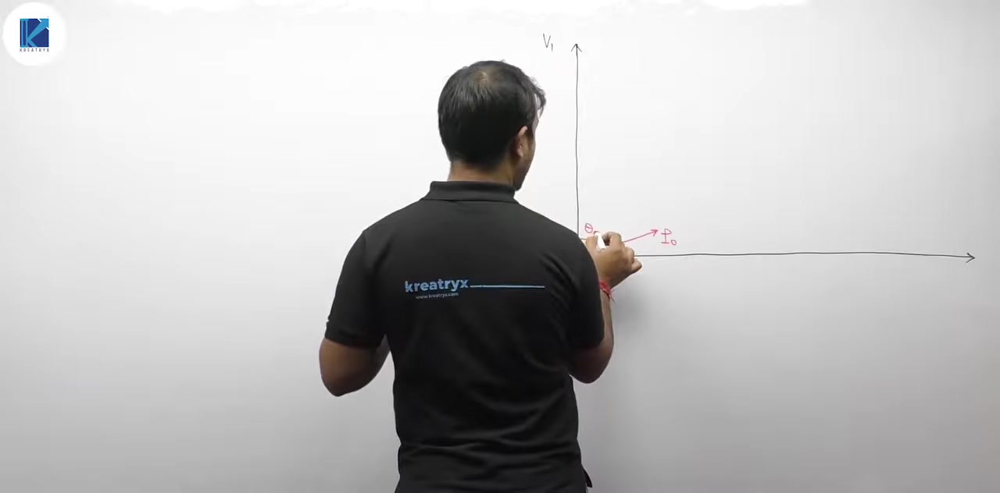

Plotting procedure:
1. From origin $O$, draw phasor $OB$ representing $I_{\text{sc}}$ lagging $V_1$ by angle $\phi_{\text{sc}}$.
2. Connect point $Q$ (tip of $I_0$) to point $B$. The vector $QB$ represents the load component of current at standstill, $I'_{\text{sc}}$.
3. Draw a perpendicular to $QB$ from $B$. The point where this line intersects the horizontal diameter defines the circle diameter $QA$.

> [!info] Definition
> The chord $QB$ connects the no-load operating point $Q$ ($s \approx 0$) to the standstill operating point $B$ ($s = 1$). It is known as the **power line**.

### Vertical Intercept and Total Standstill Power

Drop a vertical perpendicular from point $B$ down to the horizontal baseline:
- It intersects the horizontal reference line passing through $Q$ at point $D$.
- It intersects the horizontal axis passing through $O$ at point $C$.

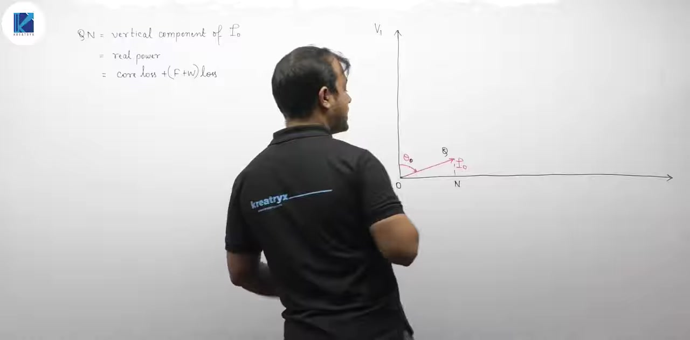

The total vertical height $BC$ represents the total active power drawn at standstill under rated voltage:

$$BC \propto P_{\text{sc}} = \sqrt{3} V_1 I_{\text{sc}} \cos\phi_{\text{sc}}$$

The lower portion $DC = QN$ represents the constant loss baseline. The remaining upper portion $BD$ represents the total series copper loss under blocked-rotor conditions:

$$BD \propto P_{\text{cu, sc}} = 3 (I'_{\text{sc}})^2 (R_1 + R'_2)$$

## Geometric Construction of the Circle from Test Points
_(28:05 - 33:08)_

### Locating the Operating Semicircle

Once the no-load operating point $Q$ and the short-circuit operating point $B$ are plotted from test data, the complete semicircle can be constructed geometrically:

1. Connect point $Q$ to point $B$. The segment $QB$ forms a chord of the circle.
2. At point $B$, draw a perpendicular line to chord $QB$ ($90^\circ$ clockwise).
3. The point where this perpendicular intersects the horizontal reference line extending from $Q$ gives the other end of the diameter, labeled point $A$.

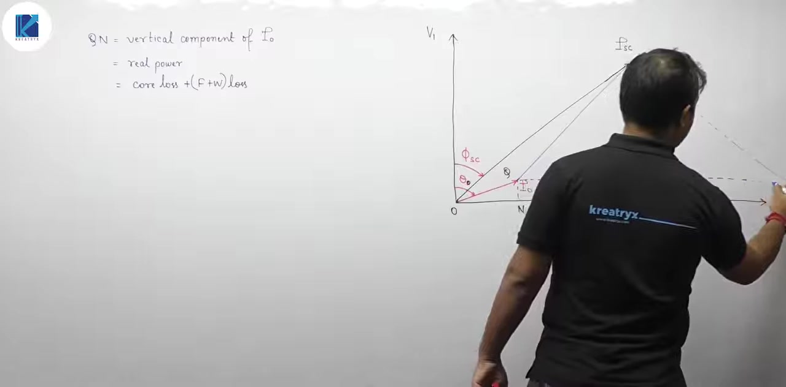

The segment $QA$ forms the diameter of the semicircle:

$$\text{Diameter } QA = \frac{V_1}{X_1 + X'_2}$$

Because angle $\angle QBA = 90^\circ$, the locus of all operating points for $0 \le s \le 1$ must lie along the circumference of this semicircle.

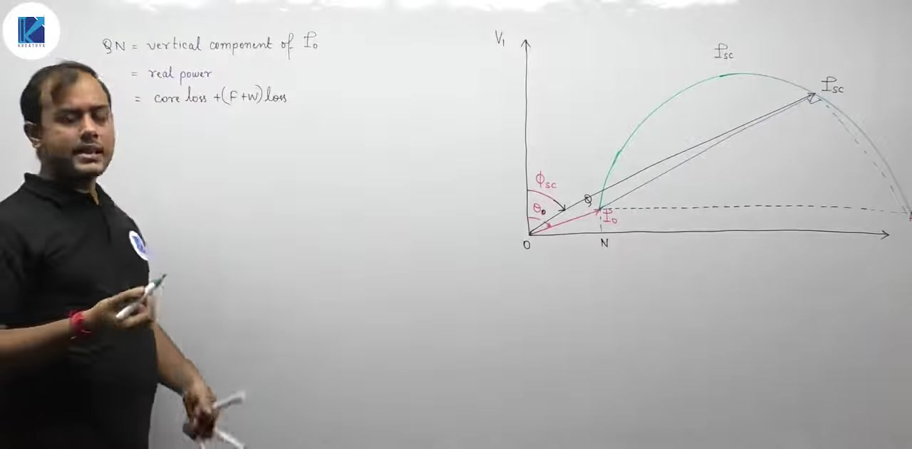

### Operating Point Position of Blocked-Rotor Current

In practical induction machines, the leakage reactance is significantly larger than the total winding resistance ($X_1 + X'_2 \gg R_1 + R'_2$).
- The short-circuit power factor $\cos\phi_{\text{sc}}$ is low (typically $0.3$ to $0.5$ lagging).
- The phase angle $\phi_{\text{sc}}$ is large.
- So point $B$ lies on the right-hand falling slope of the semicircle, well past the crest.

Drop a vertical perpendicular from point $B$ down to the horizontal baseline:
- Label the intersection on the horizontal baseline as $C$.
- The total vertical segment $BC$ is the vertical component of $I_{\text{sc}}$.
- This component directly represents the active power consumed at standstill under rated voltage.

## Separation of Losses Under Blocked-Rotor Conditions
_(33:10 - 38:11)_

### Physical Reallocation of Core and Mechanical Losses

Under no-load running conditions ($s \approx 0$):
- Stator frequency is $f_1 = 50\text{ Hz}$.
- Rotor frequency is $f_r = s f_1 \approx 0\text{ Hz}$.
- Rotor core losses are negligible.
- Mechanical rotational losses (friction and windage) are present.
- Constant loss baseline is:
  $$DC = P_{\text{core, stator}} + P_{\text{friction \& windage}}$$

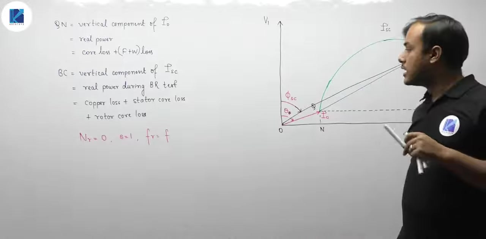

Under blocked-rotor standstill conditions ($s = 1$):
- Mechanical speed is zero ($N = 0$). Friction and windage loss drops to zero.
- The rotor is held stationary, so rotor frequency equals supply frequency ($f_r = f_1 = 50\text{ Hz}$).
- Significant hysteresis and eddy-current core losses now develop in the rotor iron.

> [!info] Physical Balance of Baseline Losses
> In the blocked-rotor test, rotor core loss increases and takes the place of the absent friction and windage loss:
> $$DC \approx P_{\text{core, stator}} + P_{\text{core, rotor}}$$
> The vertical distance between the two horizontal reference lines remains essentially unchanged.

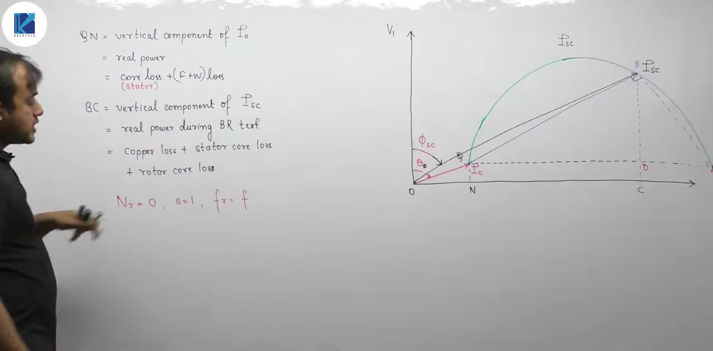

### Division of Total Series Copper Losses

The remaining vertical height $BD$ represents the total copper loss of the motor under standstill conditions at rated voltage:

$$BD \propto P_{\text{cu, total}} = P_{\text{cu, stator}} + P_{\text{cu, rotor}}$$

Both stator and rotor series windings carry the referred short-circuit current $I'_{\text{sc}}$:
$$P_{\text{cu, stator}} = 3 (I'_{\text{sc}})^2 R_1$$
$$P_{\text{cu, rotor}} = 3 (I'_{\text{sc}})^2 R'_2$$

Taking their ratio:

$$\frac{P_{\text{cu, rotor}}}{P_{\text{cu, stator}}} = \frac{R'_2}{R_1}$$

Copper loss divides between rotor and stator directly in proportion to their respective resistances.

## Separation of Stator and Rotor Copper Losses and the Torque Line
_(38:11 - 45:37)_

### Dividing the Blocked-Rotor Copper Loss Line

The total copper loss segment $BD$ must be divided between the rotor and stator.
- Stator resistance $R_1$ is found from the DC voltmeter-ammeter test.
- Blocked-rotor equivalent resistance gives $R_{\text{eq}} = R_1 + R'_2$, so $R'_2 = R_{\text{eq}} - R_1$.

A point $E$ is located on segment $BD$ such that:

$$\frac{BE}{ED} = \frac{R'_2}{R_1} = \frac{\text{rotor copper loss}}{\text{stator copper loss}}$$

- Upper segment $BE$ represents standstill rotor copper loss.
- Lower segment $ED$ represents standstill stator copper loss.

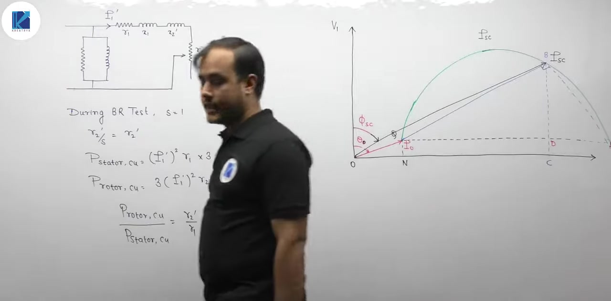

### Constructing the Torque Line

Connect point $Q$ (the origin of the semicircle) to point $E$.

> [!info] Definition
> The line $QE$ connecting the no-load point $Q$ to the resistance division point $E$ on the standstill loss line is called the **torque line**.

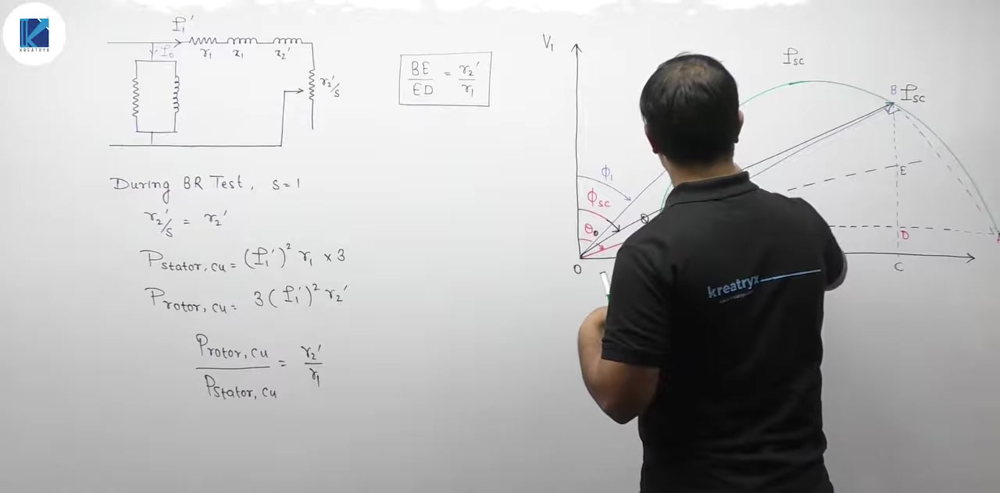

### General Operating Load Point and Vertical Power Intercepts

Let the motor operate at an arbitrary load drawing stator current $I_1$ with phase angle $\phi_1$.
- Draw $I_1$ from origin $O$ to operating point $F$ on the circular arc.
- The load component $I'_1$ is the vector connecting $Q$ to $F$.

Drop a vertical perpendicular from point $F$ down to the horizontal baseline:
- It intersects the circular arc at $F$.
- It intersects the power line $QB$ at point $H$.
- It intersects the torque line $QE$ at point $K$.
- It intersects the horizontal reference line at point $G$.
- It intersects the horizontal baseline at point $M$.

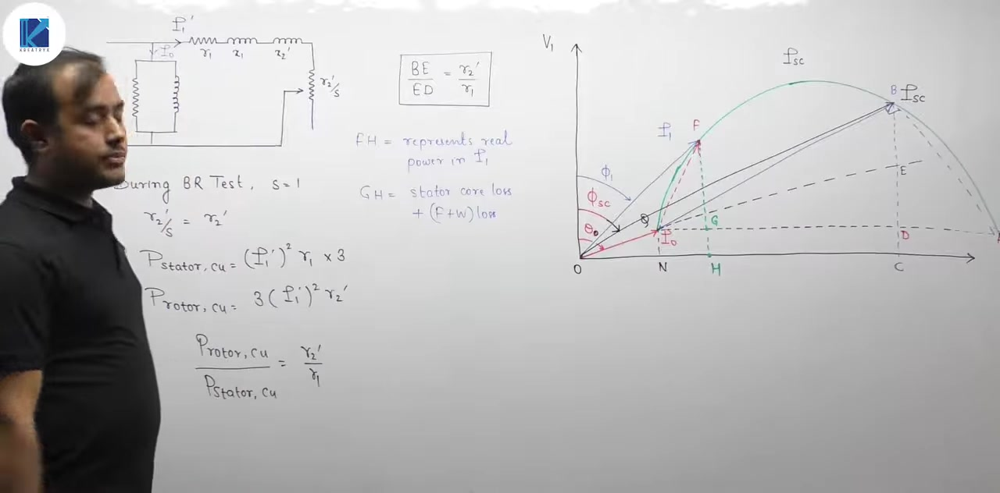

The vertical height $FM$ represents the total active electrical power input per phase:

$$P_{\text{in}} \propto FM$$

The constant baseline segment $GM$ represents fixed core and mechanical losses:

$$P_{\text{fixed}} \propto GM$$

The remaining height $FG = FM - GM$ represents developed mechanical power plus total winding copper losses.

## Geometric Proof of Copper Loss Proportionality
_(45:37 - 51:56)_

### Similar Triangles on the Circle Diagram

To prove that the vertical intercept $HG$ accurately represents the copper loss at operating current $I'_1$, examine the triangles formed with the horizontal axis:

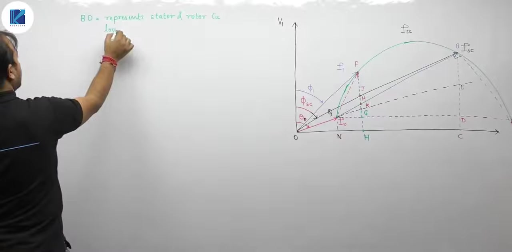

Consider right-angled triangles:
1. $\triangle BQD$ with base $QD$, height $BD$, and hypotenuse $QB$.
2. $\triangle HQG$ with base $QG$, height $HG$, and hypotenuse $QH$.

Because they share the common angle $\angle BQD$, these triangles are similar:

$$\frac{HG}{BD} = \frac{QG}{QD}$$

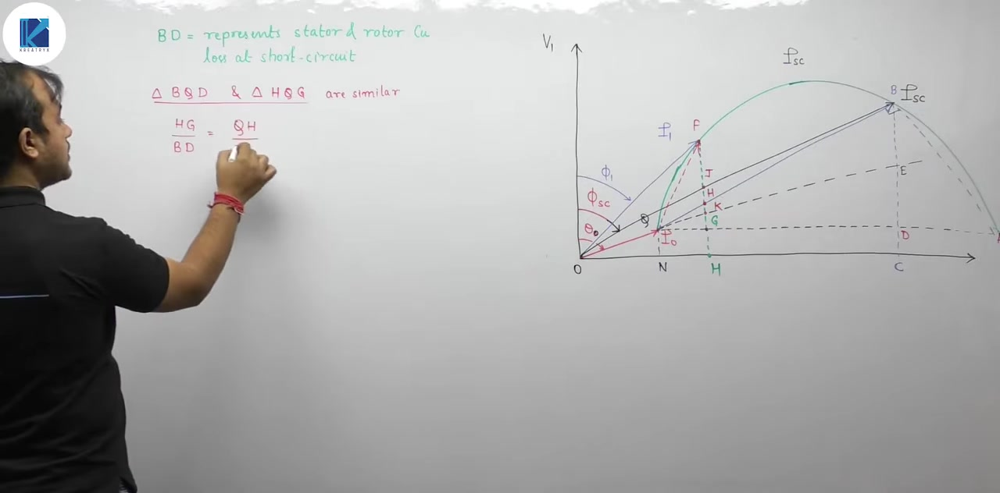

### Expressing Base Segments via Circle Diameter

Now examine right-angled triangles inscribed in the semicircle with diameter $QA$:
- For operating point $F$: connect $F$ to diameter endpoint $A$. In right-angled $\triangle QFA$ ($\angle QFA = 90^\circ$):
  $$QF = QA \cos(\angle FQA)$$
- For standstill point $B$: connect $B$ to diameter endpoint $A$. In right-angled $\triangle QBA$ ($\angle QBA = 90^\circ$):
  $$QB = QA \cos(\angle BQA)$$

In triangle $\triangle FQG$:
$$QG = QF \cos(\angle FQG)$$
Since $\angle FQG = \angle FQA$:
$$\cos(\angle FQG) = \frac{QF}{QA} \implies QG = QF \times \frac{QF}{QA} = \frac{QF^2}{QA}$$

In triangle $\triangle BQD$:
$$QD = QB \cos(\angle BQD)$$
Since $\angle BQD = \angle BQA$:
$$\cos(\angle BQD) = \frac{QB}{QA} \implies QD = QB \times \frac{QB}{QA} = \frac{QB^2}{QA}$$

This provides the exact expressions for both base segments in terms of current lengths.

## Proof of Series Copper Loss and Shaft Output Power
_(51:58 - 56:39)_

### Ratio of Vertical Intercepts

From the expressions for base segments derived in the previous section:
$$QG = \frac{QF^2}{QA}$$
$$QD = \frac{QB^2}{QA}$$

Substituting these base expressions into the similar triangle ratio gives:
$$\frac{HG}{BD} = \frac{QG}{QD} = \frac{QF^2 / QA}{QB^2 / QA} = \frac{QF^2}{QB^2}$$

Here $QF$ equals the operating rotor current $I'_1$. The length $QB$ equals the standstill current $I'_{\text{sc}}$.

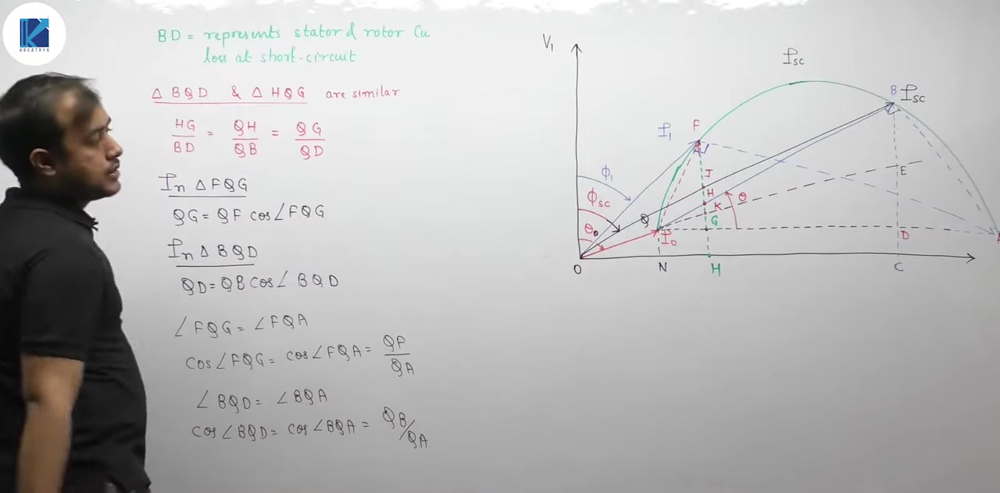

### Equivalence to Operating Copper Loss

Multiply both numerator and denominator by $(R_1 + R'_2)$:
$$\frac{HG}{BD} = \frac{I_1'^2 (R_1 + R'_2)}{I_{\text{sc}}'^2 (R_1 + R'_2)} = \frac{P_{\text{cu}}(I'_1)}{P_{\text{cu, sc}}}$$

We know that vertical intercept $BD$ represents total copper loss at blocked rotor:
$$BD \propto P_{\text{cu, sc}}$$

Therefore, the vertical intercept $HG$ directly represents the total copper loss at operating current:

> [!success] Result
> $$HG \propto P_{\text{cu, stator}} + P_{\text{cu, rotor}}$$

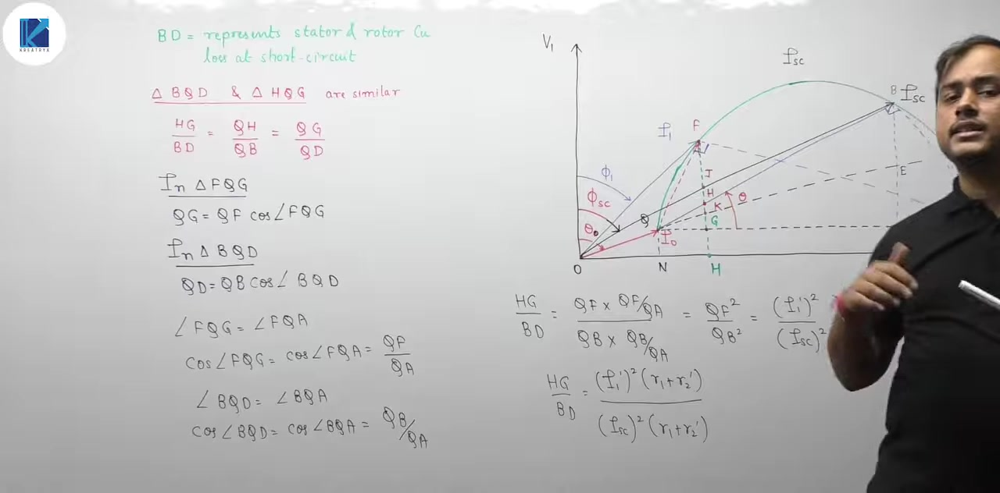

### Division of Copper Loss by Line QE

The torque line $QE$ divides standstill copper loss $BD$ into rotor copper loss $BE$ and stator copper loss $ED$. By similar triangles, line $QE$ also divides operating copper loss $HG$ into two parts:
- Segment $HK$ represents rotor copper loss.
- Segment $KG$ represents stator copper loss.

$$\frac{HK}{KG} = \frac{BE}{ED} = \frac{R'_2}{R_1}$$

### Shaft Output Power

The total vertical length from the circle to the no-load axis is $FG$. It represents total developed power plus copper loss:
$$FG = P_{\text{out}} + P_{\text{cu, stator}} + P_{\text{cu, rotor}}$$

The geometric segment $FG$ also breaks into two parts:
$$FG = FH + HG$$

Since $HG$ accounts for total stator and rotor copper loss:

> [!success] Result
> $$FH = FG - HG = P_{\text{out}}$$

The vertical distance $FH$ from the circle to line $QB$ equals mechanical shaft output power.

## Power Line, Torque Line, and Operating Characteristics
_(56:42 - 63:14)_

### Power Line and Torque Line Definitions

The vertical intercept $FH$ between the circle and chord $QB$ represents mechanical output power $P_{\text{out}}$.

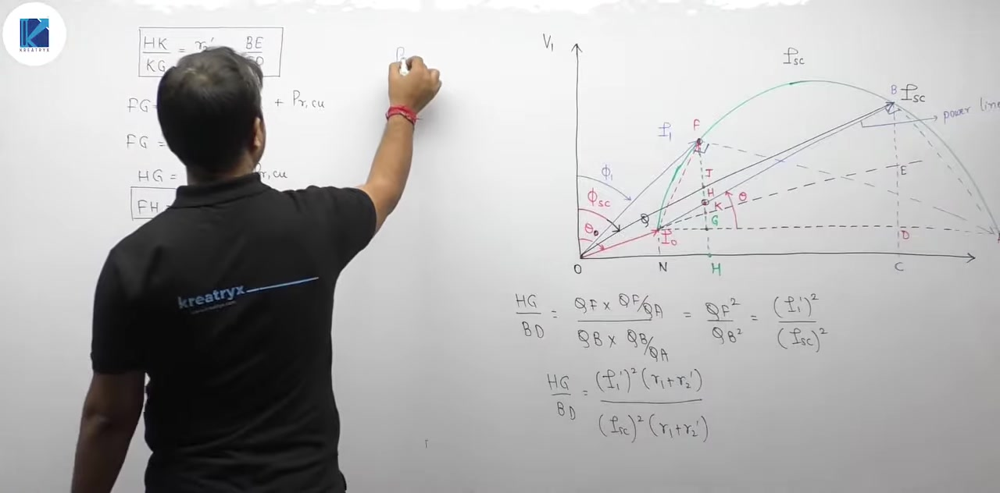

Because point $H$ lies along chord $QB$, chord $QB$ is defined as the power line.

Air-gap power equals mechanical output power plus rotor copper loss:
$$P_g = P_{\text{out}} + P_{\text{cu, rotor}}$$

On the circle diagram:
- Segment $FH$ is $P_{\text{out}}$.
- Segment $HK$ is rotor copper loss.

Their sum forms vertical segment $FK$:
$$FK = FH + HK = P_g$$

Electromagnetic torque equals air-gap power divided by synchronous mechanical speed:
$$T = \frac{P_g}{\omega_s} = \frac{FK}{\omega_s}$$

Point $K$ lies on line $QE$. Therefore, line $QE$ is defined as the torque line.

### Determining Operating Slip and Efficiency

The diagram directly provides operating slip as the ratio of rotor copper loss to air-gap power:

> [!success] Result
> $$s = \frac{P_{\text{cu, rotor}}}{P_g} = \frac{HK}{FK}$$

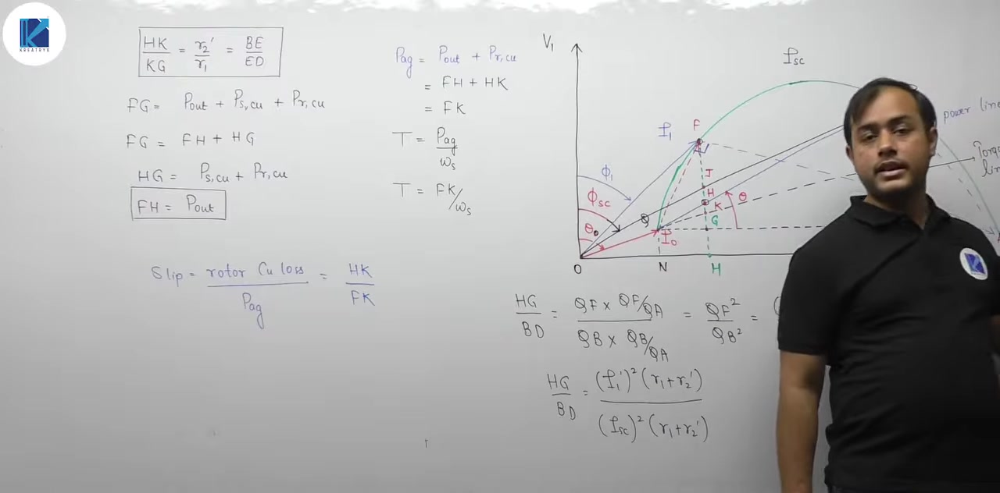

To compute motor efficiency, consider total electrical input power $P_{\text{in}}$. Let $M$ be the intercept on the horizontal reference line. Then vertical length $FM$ represents total electrical input power.

Motor efficiency is:
$$\eta = \frac{P_{\text{out}}}{P_{\text{in}}} = \frac{FH}{FM}$$

### Maximum Power and Maximum Torque Constructions

To locate the operating point of maximum mechanical output power:
1. Draw a perpendicular line from semicircle center $C'$ to the power line $QB$.
2. Extend this perpendicular until it cuts the circle circumference.
3. The vertical distance from that intersection point down to the power line gives the maximum power.

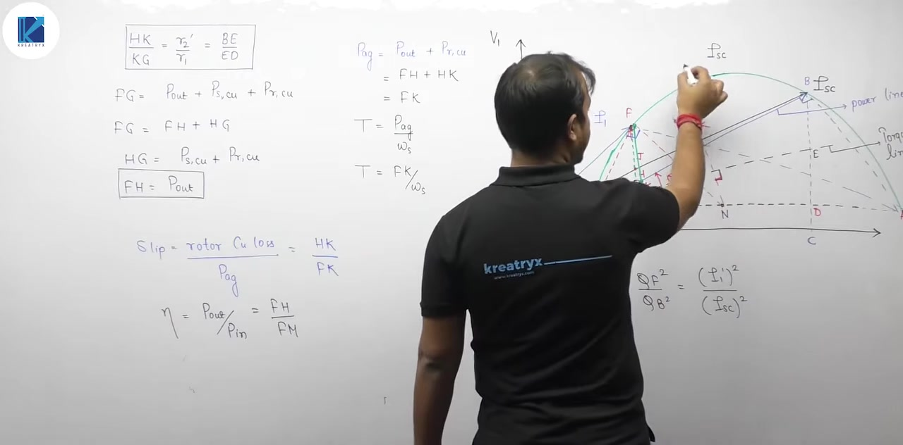

To locate the operating point of maximum torque:
1. Draw a perpendicular line from center $C'$ to the torque line $QE$.
2. Extend this line to cut the circle at point $P$.
3. The vertical segment $PR$ from point $P$ down to the torque line represents the breakdown torque.

> [!info] Summary of Segment Representation
> - Segment $FH$: Shaft output power $P_{\text{out}}$.
> - Segment $HK$: Rotor copper loss.
> - Segment $KG$: Stator copper loss.
> - Segment $GM$: Fixed core and rotational losses.
> - Segment $FK$: Air-gap power $P_g$ and torque $T$.
> - Segment $FM$: Electrical input power $P_{\text{in}}$.

---

## Summary and Key Takeaways

- The rotor current locus forms a semicircle with diameter equal to $\frac{V_1}{X_{01}}$ lying on a horizontal reference line shifted by no-load current $I_0$.
- In the circle diagram, vertical distances from any operating point represent real power while horizontal distances represent reactive power.
- Semicircle construction requires only no-load and blocked-rotor test data to fix the origin, the chord $QB$, and the diameter endpoint.
- Line $QB$ represents the power line because the vertical segment from the circle down to $QB$ equals mechanical shaft output power $P_{\text{out}}$.
- Line $QE$ represents the torque line because the vertical segment from the circle down to $QE$ equals air-gap power $P_g$.
- Operating slip is measured directly as the ratio of rotor copper loss to air-gap power: $s = \frac{HK}{FK}$.
- Operating motor efficiency is given by the ratio of shaft output vertical segment to total input vertical segment: $\eta = \frac{FH}{FM}$.
- Maximum output power and maximum electromagnetic torque occur at the intersection points of perpendiculars drawn from the semicircle center to the power line and torque line.

