# Starting of SCIM | Electrical Machines | Lec 105 | GATE/ESE (EE, ECE) | Ankit Goyal

- **Source**: https://www.youtube.com/watch?v=DlXAh9B10hI
- **Duration**: 00:50:16
- **Compiled**: 2026-09-23

---

## Overview

This lecture examines starting methods for three-phase squirrel-cage induction motors. It explains why high standstill currents occur when the fictitious mechanical load resistance drops to zero at unity slip. The discussion evaluates Direct-On-Line starting alongside reduced-voltage techniques, including stator impedance, auto-transformer, and star-delta starters. Quantitative comparisons demonstrate the impact of voltage scaling on stator winding currents, line currents, and developed starting torque.

## Contents

- [[#The Starting Problem in Induction Motors|The Starting Problem in Induction Motors]]
- [[#Direct-On-Line Starting and Torque Ratio|Direct-On-Line Starting and Torque Ratio]]
- [[#Circuit Analysis of DOL Starting and Short-Circuit Current|Circuit Analysis of DOL Starting and Short-Circuit Current]]
- [[#Stator Resistance and Reactance Starting|Stator Resistance and Reactance Starting]]
- [[#Stator Reactor Drawback and Auto-Transformer Introduction|Stator Reactor Drawback and Auto-Transformer Introduction]]
- [[#Auto-Transformer Starting Analysis|Auto-Transformer Starting Analysis]]
- [[#Star-Delta Starter Principles and Switching Transients|Star-Delta Starter Principles and Switching Transients]]
- [[#Modified Closed-Transition Star-Delta Starter|Modified Closed-Transition Star-Delta Starter]]
- [[#Summary and Comparison of SCIM Starting Methods|Summary and Comparison of SCIM Starting Methods]]

---

## The Starting Problem in Induction Motors
_(00:13 - 06:27)_

### Why Starting Methods Are Needed for Self-Starting Machines

Synchronous motors require starting methods because they produce zero net starting torque. Induction motors, in contrast, are inherently self-starting. When a three-phase voltage is applied to the stator, a rotating magnetic field develops immediately and induces rotor currents.

The issue with induction motors is not starting capability, but starting current magnitude.

At standstill, the rotor speed is zero ($N_r = 0$). This sets the operating slip to unity:
$$s = \frac{N_s - N_r}{N_s} = 1$$

In the per-phase equivalent circuit, the resistance representing mechanical shaft power is:
$$R'_2\left(\frac{1}{s} - 1\right)$$

At $s = 1$, this resistance evaluates to zero:
$$R'_2\left(\frac{1}{1} - 1\right) = 0$$

The mechanical load resistance becomes a complete short circuit.

### Equivalent Circuit at Standstill and High Starting Current

Neglecting the parallel magnetizing branch, the motor circuit at standstill consists only of series winding impedances:
$$Z_{\text{sc}} = (R_1 + R'_2) + j(X_1 + X'_2)$$

Its magnitude is:
$$|Z_{\text{sc}}| = \sqrt{(R_1 + R'_2)^2 + (X_1 + X'_2)^2}$$

Because winding resistances and leakage reactances are small, the input impedance is low. When rated line voltage $V_1$ is applied directly across the terminals, the starting current is large:
$$I_{\text{sc}} = \frac{V_1}{Z_{\text{sc}}}$$

This starting current typically reaches 5 to 8 times the rated full-load current.

> [!info] Starting Objective
> Starting methods must reduce the excessive starting current to safe limits without causing an unacceptable drop in starting torque.

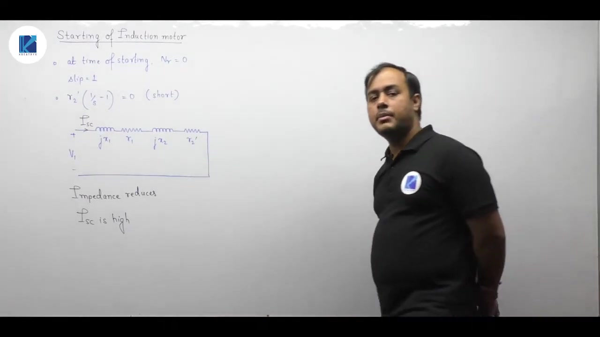

### Small Versus Large Induction Motors

The physical impact of starting current depends on motor size:

1. **Small Induction Motors ($< 5\text{ HP}$):**
   - The rotor shaft diameter is small and the moment of inertia is low.
   - The motor accelerates rapidly.
   - Slip drops quickly from $1$ toward its normal low operating value ($s \approx 0.02 - 0.05$).
   - As slip falls, effective rotor resistance $\frac{R'_2}{s}$ rises quickly, restoring high impedance.
   - The large current persists only for a few seconds. Small motors can safely start Direct-On-Line (DOL).

2. **Large Induction Motors ($> 5\text{ HP}$):**
   - Large shafts and heavy coupled mechanical loads create high rotational inertia.
   - Acceleration is slow, so the machine takes much longer to reach rated speed.
   - The heavy current flows for an extended duration.
   - The heat generated in the windings scales as:
     $$H = I^2 R t$$
   - The extended time $t$ under high current causes severe thermal and mechanical stresses that damage winding insulation.
   - Reduced-voltage starting techniques are mandatory for large induction motors.

## Direct-On-Line Starting and Torque Ratio
_(06:27 - 12:50)_

### The Fundamental Torque-Current Relationship

Electromagnetic torque in an induction machine is proportional to air-gap power divided by synchronous speed:
$$T = \frac{P_g}{\omega_s}$$

Air-gap power per phase is given by $I_2^2 \left(\frac{R'_2}{s}\right)$. Neglecting constant terms and supply frequency, developed torque is proportional to the square of rotor current divided by slip:
$$T \propto \frac{I_2^2}{s}$$

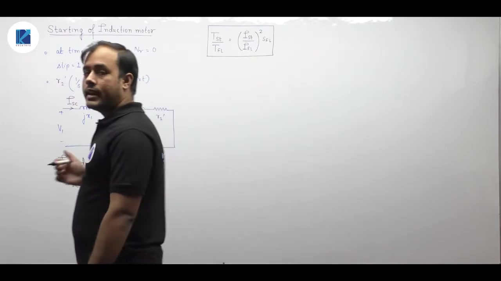

Evaluating this proportionality at starting ($s = 1$) and at full load ($s = s_{\text{fl}}$):
- At starting: $T_{\text{st}} \propto \frac{I_{2, \text{st}}^2}{1}$
- At full load: $T_{\text{fl}} \propto \frac{I_{2, \text{fl}}^2}{s_{\text{fl}}}$

Taking the ratio:
$$\frac{T_{\text{st}}}{T_{\text{fl}}} = \left(\frac{I_{2, \text{st}}}{I_{2, \text{fl}}}\right)^2 s_{\text{fl}}$$

Referring rotor currents to the stator side via the effective turns ratio, the transformation constants cancel out:

> [!success] Result
> $$\frac{T_{\text{st}}}{T_{\text{fl}}} = \left(\frac{I_{\text{st}}}{I_{\text{fl}}}\right)^2 s_{\text{fl}}$$

Here $I_{\text{st}}$ is the stator starting current, and $I_{\text{fl}}$ is the full-load stator current.

### Squirrel-Cage Constraint and Voltage Control

In wound-rotor (slip-ring) motors, external resistors can be inserted via slip rings to increase rotor resistance. This raises starting torque while reducing starting current.

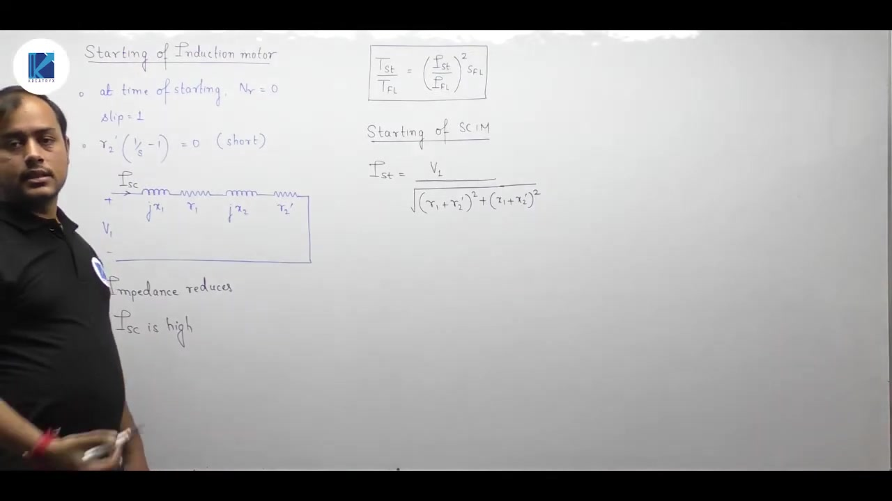

In squirrel-cage induction motors (SCIM), rotor bars are permanently short-circuited by end rings. External rotor resistance cannot be added.

The starting current is:
$$I_{\text{st}} = \frac{V_1}{\sqrt{(R_1 + R'_2)^2 + (X_1 + X'_2)^2}}$$

Since machine internal impedance is fixed, the only parameter available to limit starting current is stator terminal voltage $V_1$.

However, torque is proportional to the square of terminal voltage:
$$T \propto V_1^2$$

Reducing voltage reduces current linearly, but penalizes torque quadratically. The starting torque must remain large enough to overcome static friction and accelerate the load.

### Direct-On-Line (DOL) Starting

In Direct-On-Line starting, rated line voltage is applied directly to the stator terminals at standstill:

- The starting current equals the full short-circuit current:
  $$I_{\text{st}} = I_{\text{sc}}$$
- The DOL torque ratio is:
  $$\left(\frac{T_{\text{st}}}{T_{\text{fl}}}\right)_{\text{DOL}} = \left(\frac{I_{\text{sc}}}{I_{\text{fl}}}\right)^2 s_{\text{fl}}$$

DOL starting provides the highest starting torque, but draws maximum starting current ($5$ to $8$ times $I_{\text{fl}}$). All reduced-voltage starting techniques are compared against DOL as the reference standard.

## Circuit Analysis of DOL Starting and Short-Circuit Current
_(12:55 - 17:50)_

### Short-Circuit Current and Test Equivalence

When rated line voltage $V_{1, \text{rated}}$ is applied at starting, the motor operates at standstill ($s = 1$). Under this condition, the starting current equals the short-circuit current:
$$I_{\text{st}} = I_{\text{sc}}$$

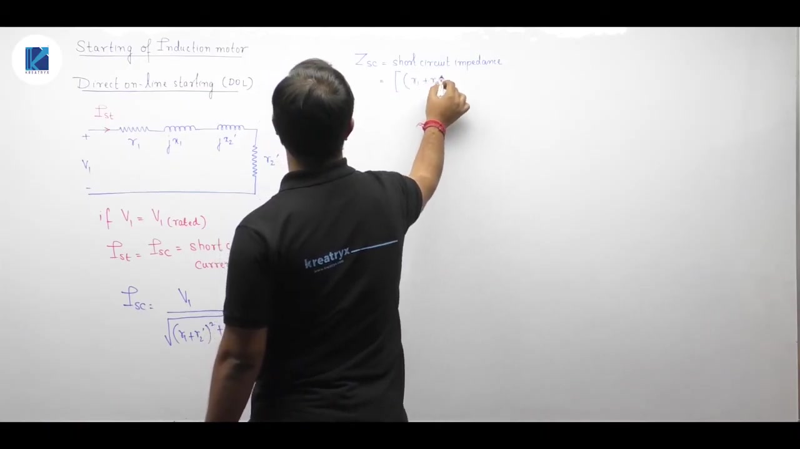

The motor draws:
$$I_{\text{sc}} = \frac{V_1}{Z_{\text{sc}}} = \frac{V_1}{\sqrt{(R_1 + R'_2)^2 + (X_1 + X'_2)^2}}$$

Here $Z_{\text{sc}}$ is the short-circuit impedance measured during a blocked-rotor test:
$$Z_{\text{sc}} = R_{\text{eq}} + j X_{\text{eq}}$$

This direct correspondence allows blocked-rotor test measurements to predict starting performance without requiring a locked-rotor starting test at full rated voltage.

### Torque Ratio Formulation in DOL Starting

To evaluate starting torque relative to normal full-load torque, recall that torque is proportional to the square of stator current times slip:
$$T \propto I_1^2 \left(\frac{1}{s}\right)$$

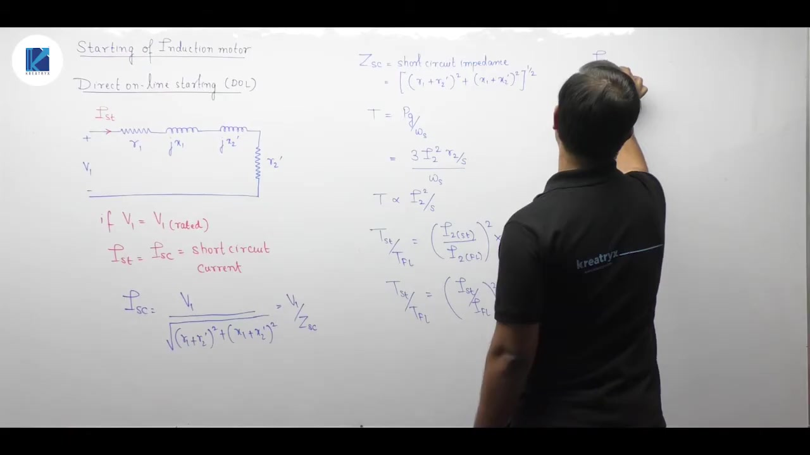

At full-load operation, the machine runs at rated current $I_{\text{fl}}$ with small operating slip $s_{\text{fl}}$:
$$T_{\text{fl}} \propto \frac{I_{\text{fl}}^2}{s_{\text{fl}}}$$

At starting, current is $I_{\text{sc}}$ and slip is unity ($s = 1$):
$$T_{\text{st}} \propto \frac{I_{\text{sc}}^2}{1}$$

Dividing the two equations gives the DOL starting torque ratio:

> [!success] Result
> $$\left(\frac{T_{\text{st}}}{T_{\text{fl}}}\right)_{\text{DOL}} = \left(\frac{I_{\text{sc}}}{I_{\text{fl}}}\right)^2 s_{\text{fl}}$$

### Example Analysis

Consider a typical 3-phase induction motor with:
- $\frac{I_{\text{sc}}}{I_{\text{fl}}} = 6$
- $s_{\text{fl}} = 0.04$

Under DOL starting:
$$\frac{T_{\text{st}}}{T_{\text{fl}}} = (6)^2 \times 0.04 = 36 \times 0.04 = 1.44$$

The motor produces $144\%$ of its full-load torque at standstill. It draws $600\%$ of full-load current from the supply.

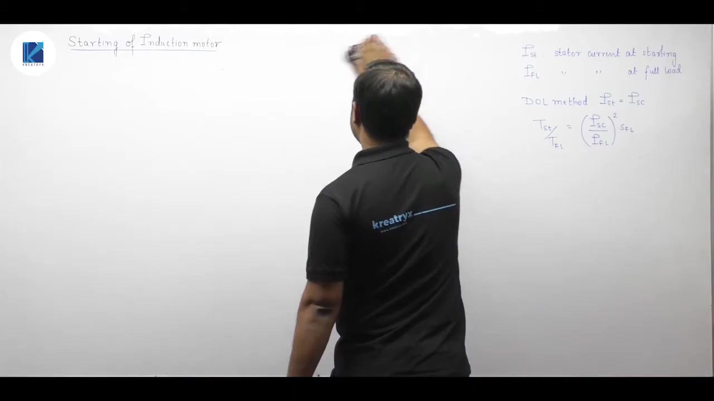

### Motivation for Reduced Voltage Starting

While DOL starting provides ample breakaway torque ($1.44 T_{\text{fl}}$), the $600\%$ current surge causes severe voltage dips on weak distribution feeders.

Reduced-voltage starting methods lower the stator voltage during starting to limit supply current, then switch to full voltage once the rotor accelerates.

## Stator Resistance and Reactance Starting
_(17:53 - 22:50)_

### Potential Division Principle

The simplest method to reduce terminal voltage is inserting impedance in series with each stator phase.

This series impedance acts as a potential divider between the AC supply and the stator winding:
- **Resistors:** Dissipate active power as heat ($I^2 R$), creating thermal losses and lowering starting efficiency.
- **Reactors (Inductors):** Draw reactive power with minimal active power dissipation. Therefore, reactors are preferred over resistors.

### Voltage and Current Scaling

Consider a star-connected stator connected to line voltage $\sqrt{3} V_1$.

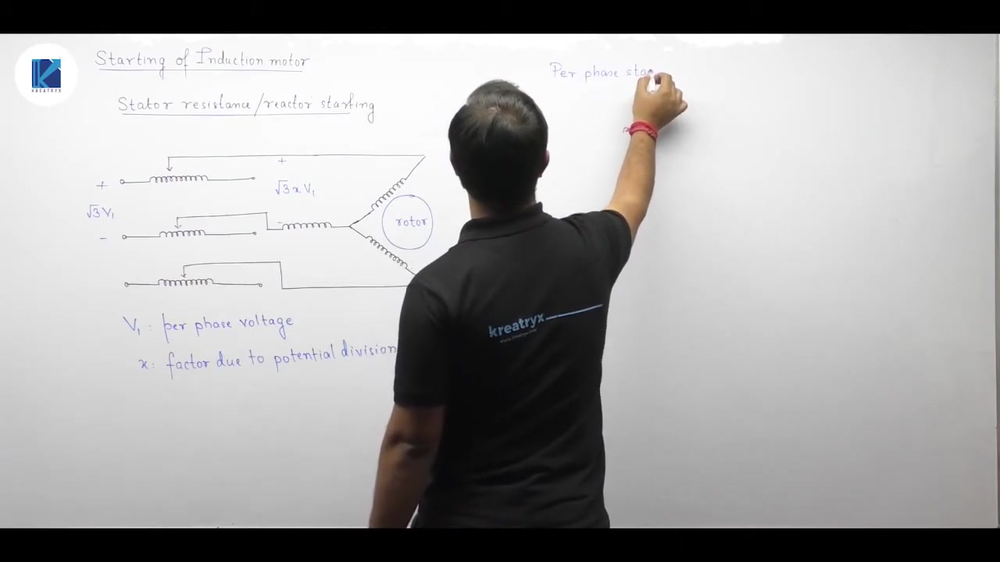

Let $x$ represent the voltage division fraction across the stator terminals ($x < 1$):
- Per-phase stator voltage drops to:
  $$V_{\text{stator, ph}} = x V_1$$
- Motor internal impedance $Z_{\text{sc}}$ remains unchanged.
- The starting current flowing through the stator phase winding becomes:
  $$I_{\text{st}} = \frac{x V_1}{Z_{\text{sc}}} = x \left(\frac{V_1}{Z_{\text{sc}}}\right) = x I_{\text{sc}}$$

Because the series impedance connects directly between the line and the motor, the supply line current equals the stator phase current:
$$I_{\text{supply}} = I_{\text{st}} = x I_{\text{sc}}$$

Both the motor current and the line current are scaled down by factor $x$.

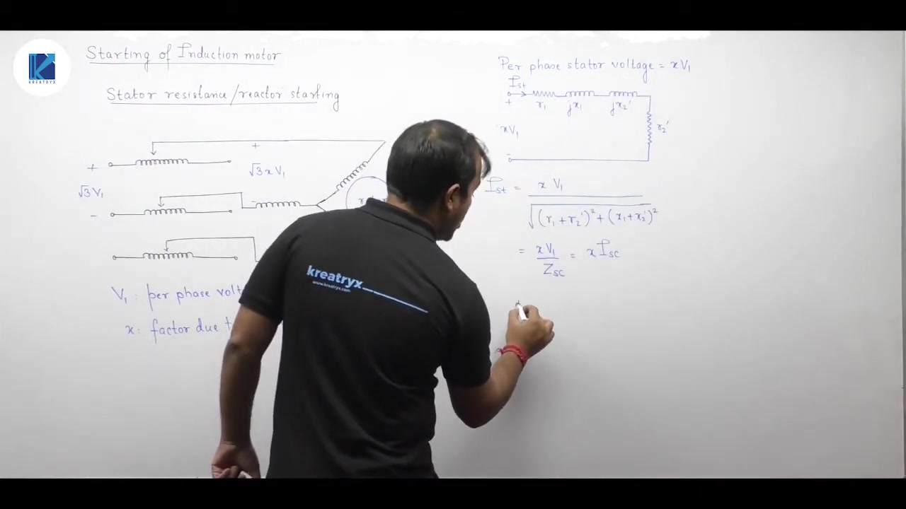

### Torque Ratio under Stator Impedance Starting

Substituting $I_{\text{st}} = x I_{\text{sc}}$ into the torque ratio formula gives:
$$\frac{T_{\text{st}}}{T_{\text{fl}}} = \left(\frac{x I_{\text{sc}}}{I_{\text{fl}}}\right)^2 s_{\text{fl}}$$

Squaring the factor $x$ brings $x^2$ outside the bracket:

> [!success] Result
> $$\frac{T_{\text{st}}}{T_{\text{fl}}} = x^2 \left(\frac{I_{\text{sc}}}{I_{\text{fl}}}\right)^2 s_{\text{fl}} = x^2 \left(\frac{T_{\text{st}}}{T_{\text{fl}}}\right)_{\text{DOL}}$$

Under stator impedance starting, torque drops by factor $x^2$, while starting current drops only by factor $x$.

## Stator Reactor Drawback and Auto-Transformer Introduction
_(22:53 - 27:47)_

### The Asymmetry in Stator Impedance Starting

The central drawback of stator resistance or reactance starting is the asymmetry between current reduction and torque reduction:

$$\frac{I_{\text{st}}}{I_{\text{sc}}} = x$$
$$\frac{T_{\text{st}}}{T_{\text{st, DOL}}} = x^2$$

Since the voltage scaling factor $x$ is less than unity ($x < 1$), its square is smaller than $x$:
$$x^2 < x$$

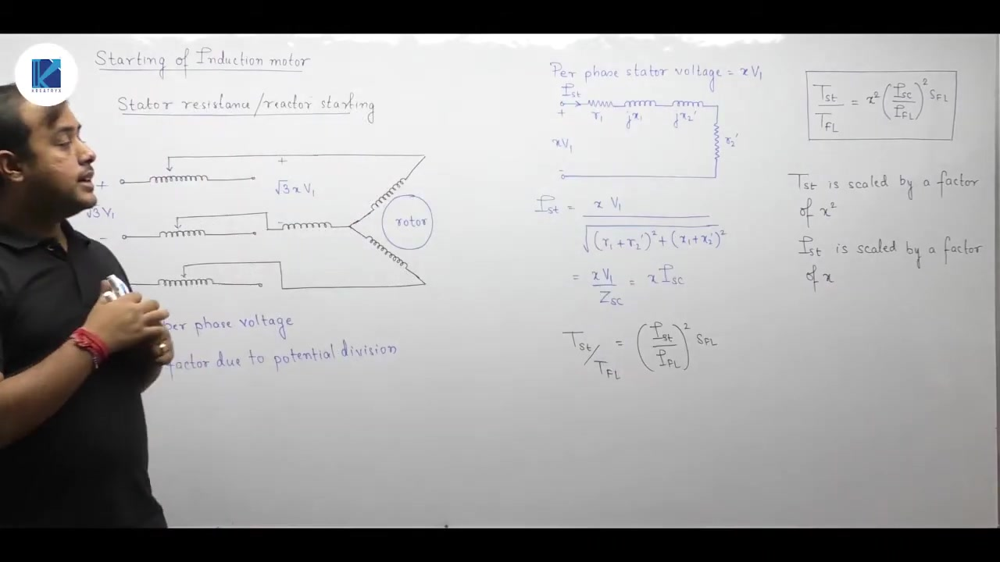

For example, if terminal voltage is reduced to $50\%$ ($x = 0.5$):
- Starting current drawn from the supply reduces to $50\%$ of $I_{\text{sc}}$.
- Developed starting torque collapses to $(0.5)^2 = 0.25$, or $25\%$ of full DOL torque.

The objective of starter design is to minimize starting current while preserving maximum possible starting torque. Stator impedance starting does the opposite: it reduces current moderately while severely penalizing torque.

### Introduction to Auto-Transformer Starting

To overcome this deficiency, a step-down auto-transformer is used.

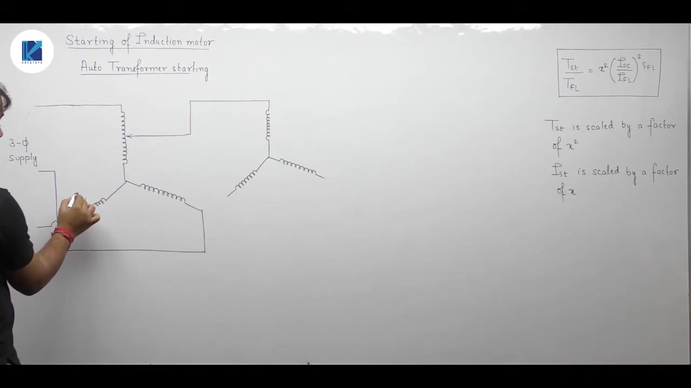

In a three-phase auto-transformer starter:
- The high-voltage primary winding connects directly to the three-phase AC supply mains.
- The low-voltage secondary taps connect to the stator phase windings.
- Tappings are selected via a changeover switch (common taps are $50\%$, $65\%$, and $80\%$).

Let the transformation tapping ratio be $1:x$, where $x < 1$:
$$V_2 = x V_1$$

If line voltage from the utility is $\sqrt{3} V_1$, the voltage applied across the motor stator terminals is reduced to $\sqrt{3} x V_1$. The per-phase voltage across each stator winding is $x V_1$.

## Auto-Transformer Starting Analysis
_(27:47 - 32:39)_

### Motor Current Versus Supply Current

In auto-transformer starting, two distinct currents must be analyzed: the current entering the motor terminals and the current drawn from the utility mains.

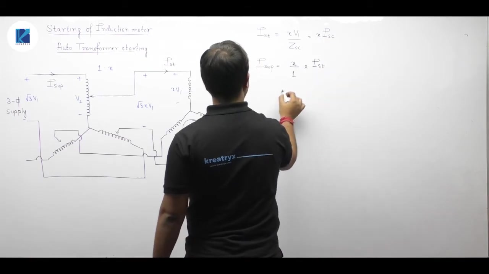

1. **Motor Stator Current ($I_{\text{st, motor}}$):**
   The voltage applied to the motor terminals is $x V_1$.
   The motor impedance at standstill is $Z_{\text{sc}}$.
   $$I_{\text{st, motor}} = \frac{x V_1}{Z_{\text{sc}}} = x I_{\text{sc}}$$
   The current flowing through the motor stator windings reduces by factor $x$.

2. **Supply Line Current ($I_{\text{supply}}$):**
   The auto-transformer steps down voltage by tapping ratio $x$:
   $$V_2 = x V_1$$
   Neglecting magnetizing current, input apparent power equals output apparent power:
   $$V_1 I_{\text{supply}} = V_2 I_{\text{st, motor}} = (x V_1) I_{\text{st, motor}}$$
   Dividing by $V_1$:
   $$I_{\text{supply}} = x I_{\text{st, motor}} = x (x I_{\text{sc}}) = x^2 I_{\text{sc}}$$

> [!success] Result
> While the motor winding current is reduced by factor $x$, the line current drawn from the electrical grid is reduced by factor $x^2$.

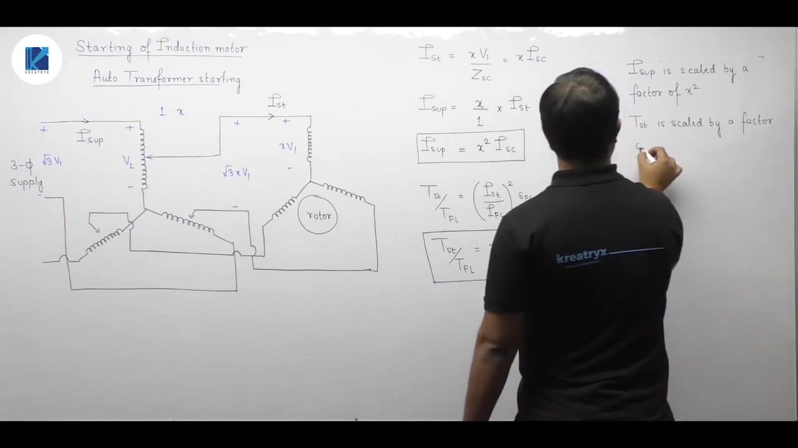

### Starting Torque Equation

Developed torque is governed by the actual current flowing through the motor windings:
$$\frac{T_{\text{st}}}{T_{\text{fl}}} = \left(\frac{I_{\text{st, motor}}}{I_{\text{fl}}}\right)^2 s_{\text{fl}}$$

Substituting $I_{\text{st, motor}} = x I_{\text{sc}}$:

> [!success] Result
> $$\frac{T_{\text{st}}}{T_{\text{fl}}} = x^2 \left(\frac{I_{\text{sc}}}{I_{\text{fl}}}\right)^2 s_{\text{fl}} = x^2 \left(\frac{T_{\text{st}}}{T_{\text{fl}}}\right)_{\text{DOL}}$$

### Comparison with Stator Reactor Starting

Compare the two reduced-voltage methods:
- **Stator Reactor Starting:**
  - Supply current scales by $x$.
  - Torque scales by $x^2$.
- **Auto-transformer Starting:**
  - Supply current scales by $x^2$.
  - Torque scales by $x^2$.

In auto-transformer starting, supply current and starting torque decrease by the exact same proportion ($x^2$).

If $x = 0.5$, both supply current demand and developed starting torque equal $25\%$ of their full DOL values. The transformer action relieves the supply grid without introducing extra active power loss.

## Star-Delta Starter Principles and Switching Transients
_(32:49 - 42:29)_

### Operating Principle of Star-Delta Starter

A star-delta starter applies to motors designed to run normally in a delta connection.

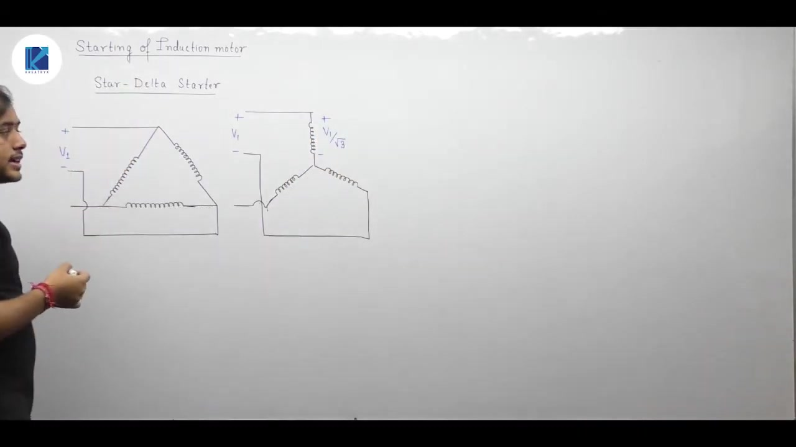

During starting, the stator phase windings are temporarily reconnected in star. Once the motor accelerates, they switch to delta:
- **In Delta Running:**
  The full line-to-line voltage $V_1$ appears across each phase winding:
  $$V_{\text{ph, delta}} = V_1$$
- **In Star Starting:**
  The voltage across each phase winding is:
  $$V_{\text{ph, star}} = \frac{V_1}{\sqrt{3}}$$

Reconnecting the stator in star reduces the per-phase voltage by a factor of $\frac{1}{\sqrt{3}}$.

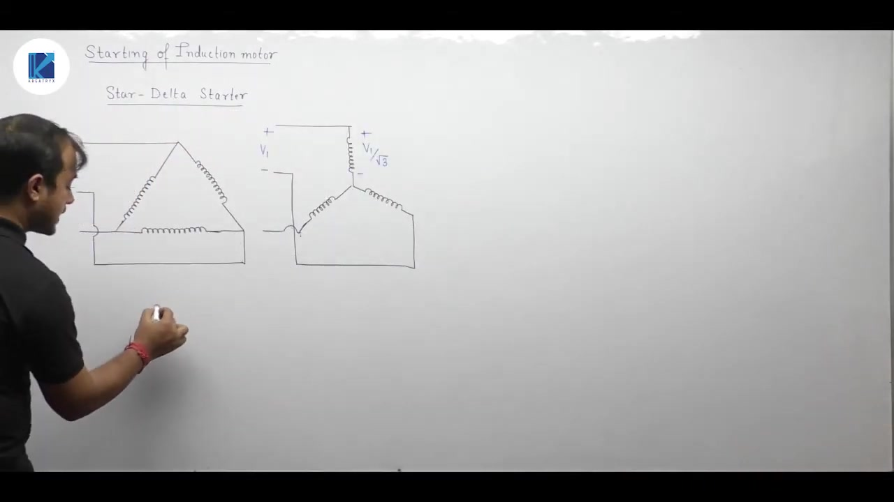

### Winding and Line Currents

1. **Winding Current in Star:**
   $$I_{\text{st, ph}} = \frac{V_{\text{ph, star}}}{Z_{\text{sc}}} = \frac{V_1 / \sqrt{3}}{Z_{\text{sc}}} = \frac{I_{\text{sc}}}{\sqrt{3}}$$
2. **Supply Line Current in Star:**
   In star, line current equals phase current:
   $$I_{\text{line, star}} = I_{\text{st, ph}} = \frac{I_{\text{sc}}}{\sqrt{3}}$$
3. **Supply Line Current in Delta (DOL):**
   If started directly in delta at voltage $V_1$:
   $$I_{\text{line, delta}} = \sqrt{3} I_{\text{ph, delta}} = \sqrt{3} I_{\text{sc}}$$

Taking the ratio of line currents drawn from the supply:

> [!success] Result
> $$\frac{I_{\text{line, star}}}{I_{\text{line, delta}}} = \frac{I_{\text{sc}} / \sqrt{3}}{\sqrt{3} I_{\text{sc}}} = \frac{1}{3}$$

The line current drawn from the supply grid during star starting is one-third of the line current drawn in DOL delta starting.

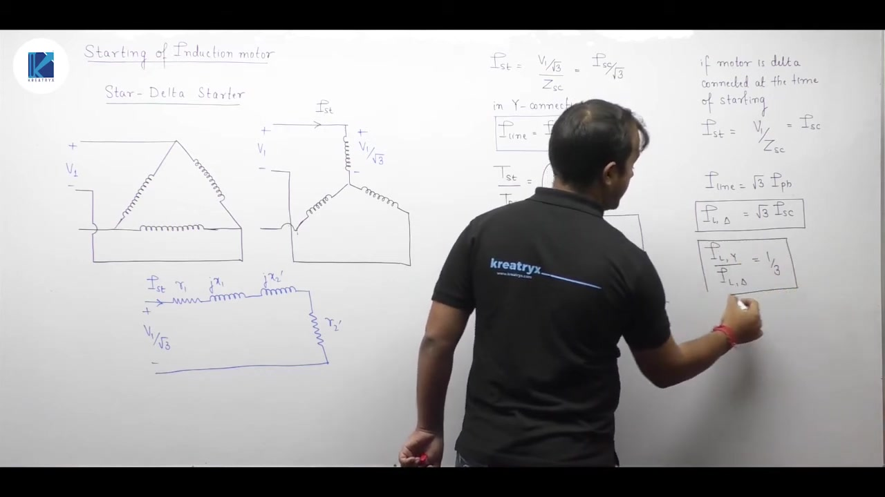

### Starting Torque Reduction

Starting torque depends on the current flowing through each phase winding:
$$\frac{T_{\text{st}}}{T_{\text{fl}}} = \left(\frac{I_{\text{st, ph}}}{I_{\text{fl}}}\right)^2 s_{\text{fl}} = \left(\frac{I_{\text{sc}} / \sqrt{3}}{I_{\text{fl}}}\right)^2 s_{\text{fl}}$$

Squaring $\frac{1}{\sqrt{3}}$ gives $\frac{1}{3}$:

> [!success] Result
> $$T_{\text{st, star}} = \frac{1}{3} T_{\text{st, delta}}$$

Both supply line current and starting torque decrease by a factor of $\frac{1}{3}$.

### Open-Transition Switching Transients

In standard star-delta starters, the switch disconnects the windings from star before reconnecting them in delta.

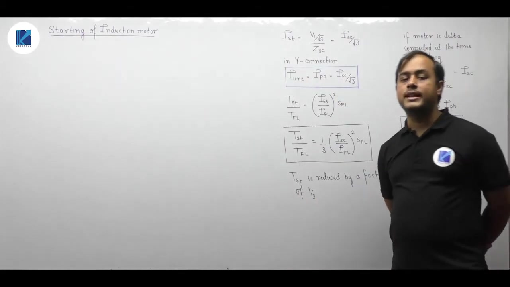

This open-transition introduces a hazard:
1. When disconnected, stator current drops to zero.
2. Magnetic flux in the rotor and air gap cannot change instantaneously.
3. The rotating residual flux induces an alternating EMF in the disconnected stator windings.
4. When reconnected across the three-phase mains in delta, the induced EMF may be $180^\circ$ out of phase with the supply voltage.
5. In the worst case, the voltages add constructively ($V_1 + E_1$).
6. This produces severe inrush current surges that can trip circuit breakers and mechanically stress the winding overhangs.

To minimize current surges, the motor must accelerate to at least $80\%$ of rated speed before switching to delta. At $80\%$ speed, operating slip is low ($s \approx 0.2$), and rotor impedance $\frac{R'_2}{s}$ has increased significantly.

## Modified Closed-Transition Star-Delta Starter
_(42:29 - 47:48)_

### Overcoming Switching Surges

Open-transition star-delta starters disconnect the stator from the supply when changing connections. Trapped rotor flux produces back-EMF that causes severe inrush current upon reconnection.

The modified star-delta starter uses closed transition. It switches connections without interrupting the supply connection.

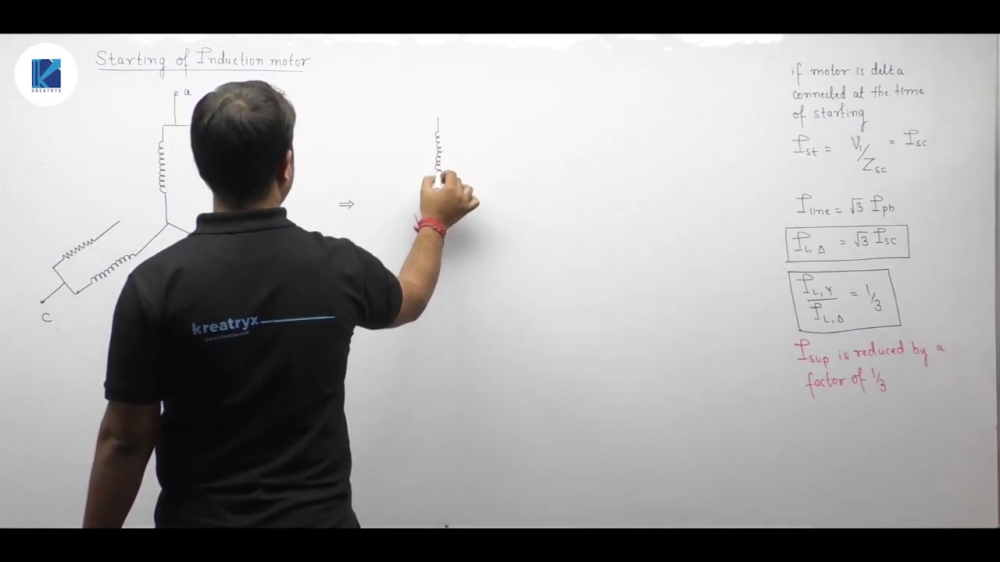

### Circuit Configuration and Transition Sequence

In this modified configuration, transition resistors are connected in parallel with each stator winding phase ($A$, $B$, and $C$).

The transition follows four distinct states:

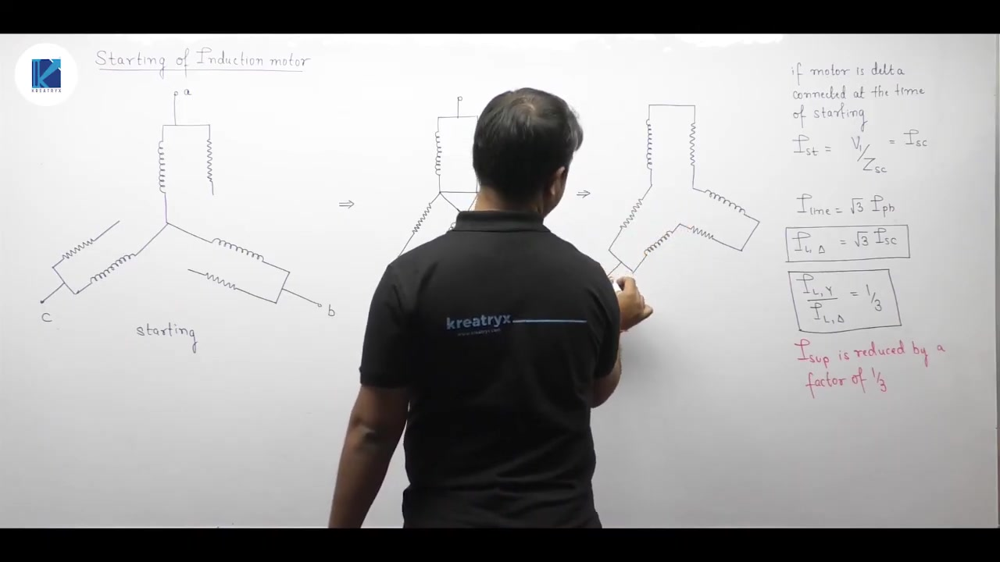

1. **Starting State (Star):**
   - The three main phase windings are connected in star to the supply.
   - The parallel transition resistors remain open-circuited.
   - Starting current is limited to $I_{\text{line}} = \frac{I_{\text{sc}}}{\sqrt{3}}$.
   - The motor accelerates up to $80\%$ of synchronous speed.

2. **Insertion of Parallel Resistors:**
   - The transition resistors are connected to the star neutral point.
   - Each resistor is placed in parallel across its phase winding.
   - Current divides between the winding and the resistor.

3. **Opening the Neutral Star Point:**
   - The main star neutral switch is opened.
   - The windings remain connected to the supply through the resistor network.
   - Because the circuit remains closed, current flows continuously and stator flux is maintained.

4. **Shorting Resistors to Form Delta:**
   - The transition resistors are short-circuited.
   - A closed delta loop remains, containing only the three stator phase windings.
   - Full line voltage $V_1$ appears across each winding in delta.

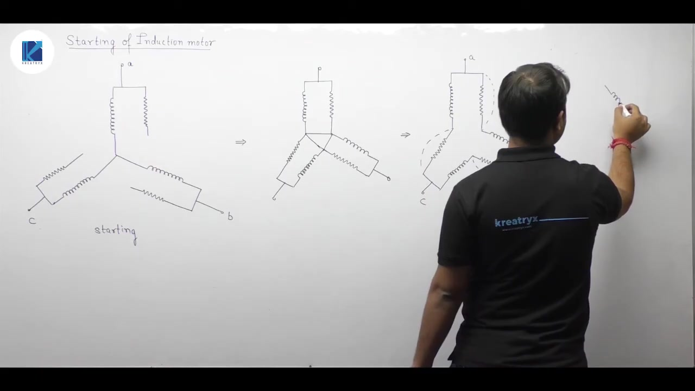

> [!info] Closed-Transition Benefit
> Because the motor windings remain connected to the AC line throughout the switching sequence, stator flux never collapses. Switching inrush transients are prevented.

## Summary and Comparison of SCIM Starting Methods
_(47:48 - 50:09)_

### Comparative Analysis of Starting Methods

All squirrel-cage starting methods adjust the voltage applied to the machine. They differ in how the voltage reduction is achieved and how line current relates to stator winding current.

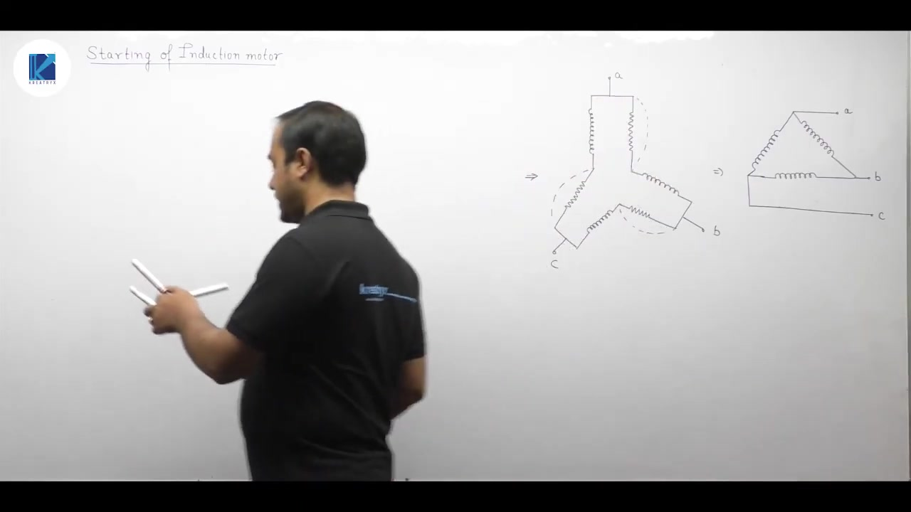

Here $I_{\text{sc}}$ represents the short-circuit current drawn at full rated voltage, and $x$ is the voltage scaling factor ($x < 1$).

### Master Comparison Table

| Starting Method | Motor Winding Current ($I_{\text{st, motor}}$) | Supply Line Current ($I_{\text{supply}}$) | Starting Torque Ratio ($\frac{T_{\text{st}}}{T_{\text{fl}}}$) | Torque Scaling ($T_{\text{st}} / T_{\text{st, DOL}}$) |
| :--- | :--- | :--- | :--- | :--- |
| **Direct-On-Line (DOL)** | $I_{\text{sc}}$ | $I_{\text{sc}}$ | $\left(\frac{I_{\text{sc}}}{I_{\text{fl}}}\right)^2 s_{\text{fl}}$ | $1$ |
| **Stator Reactor / Resistor** | $x I_{\text{sc}}$ | $x I_{\text{sc}}$ | $x^2 \left(\frac{I_{\text{sc}}}{I_{\text{fl}}}\right)^2 s_{\text{fl}}$ | $x^2$ |
| **Auto-transformer** | $x I_{\text{sc}}$ | $x^2 I_{\text{sc}}$ | $x^2 \left(\frac{I_{\text{sc}}}{I_{\text{fl}}}\right)^2 s_{\text{fl}}$ | $x^2$ |
| **Star-Delta** | $\frac{I_{\text{sc}}}{\sqrt{3}}$ | $\frac{I_{\text{sc}}}{\sqrt{3}}$ | $\frac{1}{3} \left(\frac{I_{\text{sc}}}{I_{\text{fl}}}\right)^2 s_{\text{fl}}$ | $\frac{1}{3}$ |

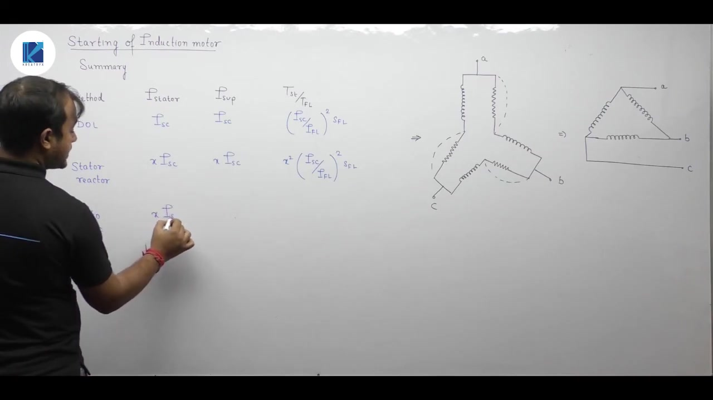

### Key Takeaway on Line Current in Star-Delta

In star-delta starting, the line current drawn from the supply in star starting compared to full-voltage delta DOL starting is:

> [!success] Result
> $$\frac{I_{\text{line, star}}}{I_{\text{line, delta}}} = \frac{I_{\text{sc}} / \sqrt{3}}{\sqrt{3} I_{\text{sc}}} = \frac{1}{3}$$

The supply current and starting torque both drop to exactly one-third of their direct-on-line delta values.

---

## Summary and Key Takeaways

- At standstill ($s = 1$), the mechanical load equivalent resistance $R'_2\left(\frac{1}{s}-1\right)$ is zero, leaving only winding impedance to limit the starting current.
- Small induction motors ($< 5\text{ HP}$) can start Direct-On-Line because low rotational inertia allows rapid acceleration before thermal damage occurs.
- The general torque ratio equation relates starting torque to full-load torque as $\frac{T_{\text{st}}}{T_{\text{fl}}} = \left(\frac{I_{\text{st}}}{I_{\text{fl}}}\right)^2 s_{\text{fl}}$.
- Under Direct-On-Line starting at rated line voltage, starting current equals short-circuit current: $I_{\text{st}} = I_{\text{sc}} = \frac{V_1}{Z_{\text{sc}}}$.
- In stator reactor starting with voltage scaling factor $x$, supply current drops by $x$ while starting torque drops by $x^2$.
- In auto-transformer starting with transformation ratio $x$, both supply line current and developed starting torque reduce by factor $x^2$.
- In star-delta starting, phase voltage drops by $\frac{1}{\sqrt{3}}$, reducing both supply line current and starting torque to $\frac{1}{3}$ of their delta DOL values.
- Closed-transition star-delta starters use parallel transition resistors to maintain uninterrupted supply connections, preventing trapped rotor flux from inducing severe switching transients.

