# Starting of SCIM | L 42 | Electrical Machines | GATE 2022 | Ankit Goyal

- **Source**: https://www.youtube.com/watch?v=J_FVNSGokD4
- **Duration**: 01:02:50
- **Compiled**: 2026-09-23

---

## Overview

This lecture presents comprehensive numerical problem solving on starting squirrel-cage and wound-rotor induction motors. It analyzes conditions required to develop maximum torque right at standstill through rotor resistance and frequency adjustments. The session examines how feeder line impedance impacts star versus delta starting methods. It also evaluates performance scaling under varying supply frequencies and reduced voltage starters.

## Contents

- [[#Maximum Torque at Standstill and Rotor Parameters|Maximum Torque at Standstill and Rotor Parameters]]
- [[#External Rotor Resistance and Blocked-Rotor Test Parameters|External Rotor Resistance and Blocked-Rotor Test Parameters]]
- [[#Circuit Modeling of Feeder and Motor Connections|Circuit Modeling of Feeder and Motor Connections]]
- [[#Equating Starting Torques to Determine Feeder Resistance|Equating Starting Torques to Determine Feeder Resistance]]
- [[#Impact of Parallel Feeders on Starting Torque|Impact of Parallel Feeders on Starting Torque]]
- [[#Frequency Scaling of Starting Current and Torque|Frequency Scaling of Starting Current and Torque]]
- [[#Tailored Voltage Ratios and Direct-On-Line Starting|Tailored Voltage Ratios and Direct-On-Line Starting]]
- [[#Auto-Transformer and Star-Delta Starting Comparisons|Auto-Transformer and Star-Delta Starting Comparisons]]
- [[#Constant V/f Starting and Torque Ratio Formulation|Constant V/f Starting and Torque Ratio Formulation]]
- [[#Minimum Voltage to Avoid Stalling Under Voltage Fluctuations|Minimum Voltage to Avoid Stalling Under Voltage Fluctuations]]
- [[#External Resistance Calculation and Feeder Sizing Constraints|External Resistance Calculation and Feeder Sizing Constraints]]
- [[#Starter Selection and Conceptual Questions|Starter Selection and Conceptual Questions]]

---

## Maximum Torque at Standstill and Rotor Parameters
_(00:03 - 05:33)_

### Overview of Problem Solving Session
This lecture focuses on solving numerical problems on starting methods for squirrel-cage induction motors. The problems test principles of maximum starting torque, feeder impedance effects, frequency variations, and reduced-voltage starters.

### Condition for Maximum Torque at Starting
In an induction motor, maximum electromagnetic torque develops when the rotor resistance per phase equals the rotor leakage reactance per phase. The slip at maximum torque {mT}$ is given by:

1968071s_{mT} = \frac{R_2}{X_2}1968071

When maximum torque is required at starting, the motor operates at standstill where rotor slip  = 1$. Equating {mT} = 1$ yields:

1968071R_2 = X_21968071

The rotor speed corresponding to maximum torque is known as the stalling speed or breakdown speed.

> [!info] Definition
> Stalling speed is the rotor speed at which an induction motor develops its peak breakdown torque. Operating at a speed below stalling speed causes the motor to pull out and decelerate toward standstill.

### Worked Example: Calculation of Standstill Reactance
Let us examine the first numerical problem.

> [!example] Problem 1 (Part 1)
> An 8-pole, 0\text{ Hz}$ three-phase induction motor has a rotor resistance of bash.07\ \Omega$ per phase. Its stalling speed is 50\text{ rpm}$. Determine the standstill rotor leakage reactance per phase.

First, compute the synchronous speed of the rotating magnetic field:

1968071N_s = \frac{120 f}{P} = \frac{120 \times 50}{8} = 750\text{ rpm}1968071

The stalling speed corresponds to the speed at maximum torque:

1968071N_{mT} = 550\text{ rpm}1968071

Compute the slip at maximum torque:

1968071\begin{aligned}
s_{mT} &= \frac{N_s - N_{mT}}{N_s} \
&= \frac{750 - 550}{750} \
&= \frac{200}{750} = \frac{4}{15} \approx 0.2667
\end{aligned}1968071

Using the condition for maximum torque, express standstill rotor reactance $:

1968071s_{mT} = \frac{R_2}{X_2} \implies X_2 = \frac{R_2}{s_{mT}}1968071

Substitute the given rotor resistance  = 0.07\ \Omega$:

1968071\begin{aligned}
X_2 &= \frac{0.07}{4/15} \
&= \frac{0.07 \times 15}{4} \
&= 0.2625\ \Omega
\end{aligned}1968071

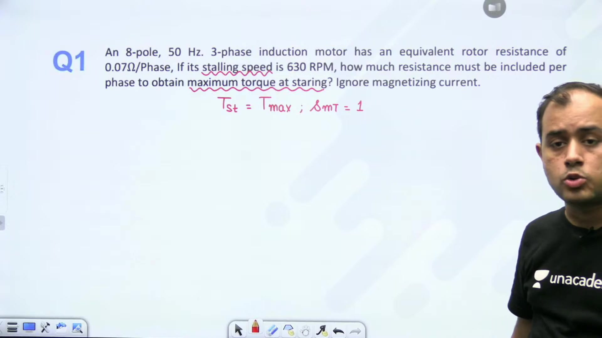

> [!success] Result
> The standstill rotor leakage reactance per phase is  = 0.2625\ \Omega$.

## External Rotor Resistance and Blocked-Rotor Test Parameters
_(05:33 - 10:18)_

### Insertion of External Resistance for Maximum Starting Torque
To achieve maximum torque right at starting, the effective rotor resistance must equal the standstill reactance. The required external resistance {\text{ext}}$ added in series per phase satisfies:

1969039\frac{R_2 + R_{\text{ext}}}{X_2} = 1 \implies R_2 + R_{\text{ext}} = X_21969039

Solving for external resistance gives:

1969039R_{\text{ext}} = X_2 - R_21969039

Substitute  = 0.2625\ \Omega$ and  = 0.07\ \Omega$:

1969039\begin{aligned}
R_{\text{ext}} &= 0.2625 - 0.0700 \
&= 0.1925\ \Omega
\end{aligned}1969039

> [!success] Result
> An external rotor resistance of bash.1925\ \Omega$ per phase must be inserted into the rotor circuit to obtain maximum torque at starting.

### Feeder Drop Problem Formulation
Let us examine the second problem, which analyzes starting torque under feeder impedance in star and delta starting.

> [!example] Problem 2 (Part 1)
> A 0\text{ HP}$, 40\text{ V}$, 0\text{ Hz}$ three-phase induction motor with a star-delta starter is supplied through a feeder line. Because of feeder voltage drop, the starting torque is identical whether started in star or in delta connection:
> 1969039T_{\text{st, star}} = T_{\text{st, delta}}1969039
> A blocked-rotor test on the delta-connected motor gives:
> 1969039V_{\text{br}} = 200\text{ V}, \quad I_{\text{br}} = 120\text{ A}, \quad \cos\phi_{\text{br}} = 0.41969039
> Determine the resistance of the feeder.

### Derivation of Motor Blocked-Rotor Impedance
In the blocked-rotor test, the motor windings are delta-connected. The per-phase voltage equals the applied line voltage:

1969039V_{\text{br, ph}} = V_{\text{br}} = 200\text{ V}1969039

The per-phase current in delta connection is the line current divided by $\sqrt{3}$:

1969039I_{\text{br, ph}} = \frac{I_{\text{br}}}{\sqrt{3}} = \frac{120}{\sqrt{3}}\text{ A}1969039

Compute the per-phase equivalent motor impedance:

1969039\begin{aligned}
Z_{\text{br}} &= \frac{V_{\text{br, ph}}}{I_{\text{br, ph}}} \
&= \frac{200}{120 / \sqrt{3}} \
&= \frac{200 \sqrt{3}}{120} = \frac{5}{\sqrt{3}} \approx 2.887\ \Omega
\end{aligned}1969039

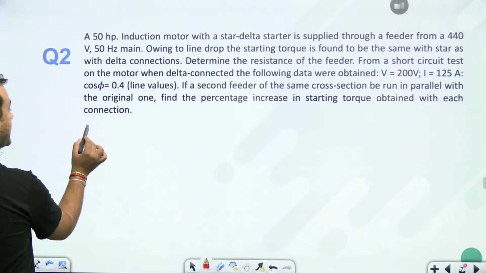

With a power factor $\cos\phi_{\text{br}} = 0.4$, find the phase resistance and leakage reactance:

1969039\sin\phi_{\text{br}} = \sqrt{1 - 0.4^2} = \sqrt{0.84} \approx 0.91651969039

1969039\begin{aligned}
R_{\text{br}} &= Z_{\text{br}} \cos\phi_{\text{br}} = \frac{5}{\sqrt{3}} \times 0.4 = \frac{2}{\sqrt{3}} \approx 1.155\ \Omega \
X_{\text{br}} &= Z_{\text{br}} \sin\phi_{\text{br}} = \frac{5}{\sqrt{3}} \times 0.9165 \approx 2.646\ \Omega
\end{aligned}1969039

These parameters represent the total series motor impedance per phase referred to the stator.

## Circuit Modeling of Feeder and Motor Connections
_(10:31 - 15:12)_

### Modeling Considerations for Parameter Distribution
In textbook problems, stator impedance can either be split equally with the rotor or referred directly to the rotor circuit. When specific split ratios are omitted, we treat the series motor impedance as concentrated parameters:

1970047R'_2 \approx R_{\text{br}} \approx 1.155\ \Omega, \quad X'_2 \approx X_{\text{br}} \approx 2.646\ \Omega1970047

### Star Starting Configuration with Feeder Resistance
In star starting, the motor windings are physically connected in star. The line feeder resistance $ connects in series with each phase winding:

1970047Z_{Y, \text{total}} = (R_f + R_{\text{br}}) + j X_{\text{br}}1970047

The magnitude of total impedance per phase during star starting is:

1970047|Z_{Y, \text{total}}| = \sqrt{(R_f + R_{\text{br}})^2 + X_{\text{br}}^2}1970047

The phase voltage applied to the combination is the line-to-neutral voltage:

1970047V_{\text{ph}} = \frac{V_L}{\sqrt{3}}1970047

The starting phase current in star is:

1970047I_{\text{st}, Y} = \frac{V_L / \sqrt{3}}{\sqrt{(R_f + R_{\text{br}})^2 + X_{\text{br}}^2}}1970047

The developed starting torque in star connection is:

1970047T_{\text{st, star}} = \frac{3}{\omega_s} I_{\text{st}, Y}^2 R_{\text{br}} = \frac{3}{\omega_s} \frac{(V_L / \sqrt{3})^2 R_{\text{br}}}{(R_f + R_{\text{br}})^2 + X_{\text{br}}^2} = \frac{V_L^2}{\omega_s} \frac{R_{\text{br}}}{(R_f + R_{\text{br}})^2 + X_{\text{br}}^2}1970047

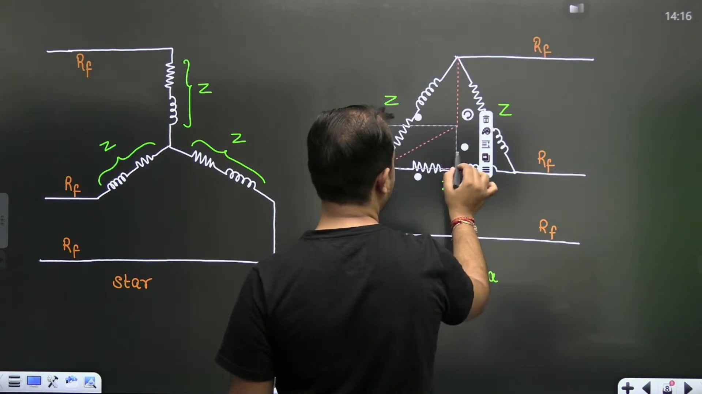

### Delta Starting Configuration with Feeder Resistance
In delta starting, the motor windings form a closed mesh. The feeder resistance $ lies in the three-phase transmission line outside the delta mesh.

> [!info] Definition
> A delta load cannot have line series elements added directly to individual branches. To analyze line feeder series drops, convert the delta load into an analytically equivalent star load.

Under a delta-to-star conversion, each delta impedance branch of value {\text{br}}$ transforms into an equivalent star branch:

1970047Z_{\Delta \to Y} = \frac{Z_{\text{br}}}{3}1970047

The equivalent star branch resistance and reactance are:

1970047R_{\Delta \to Y} = \frac{R_{\text{br}}}{3}, \quad X_{\Delta \to Y} = \frac{X_{\text{br}}}{3}1970047

The line feeder resistance $ connects directly in series with this equivalent star branch:

1970047Z_{\Delta, \text{eq}} = \left(R_f + \frac{R_{\text{br}}}{3}\right) + j \frac{X_{\text{br}}}{3}1970047

## Equating Starting Torques to Determine Feeder Resistance
_(15:36 - 20:27)_

### Formulation of Torque Equivalence
In the transformed delta starting circuit, line current feeds the equivalent star branch:

1970949I_{L, \Delta} = \frac{V_L / \sqrt{3}}{\sqrt{\left(R_f + \frac{R_{\text{br}}}{3}\right)^2 + \left(\frac{X_{\text{br}}}{3}\right)^2}}1970949

The motor phase current inside the physical delta winding is:

1970949I_{\text{ph}, \Delta} = \frac{I_{L, \Delta}}{\sqrt{3}}1970949

The total developed starting torque in delta connection is:

1970949\begin{aligned}
T_{\text{st, delta}} &= \frac{3}{\omega_s} I_{\text{ph}, \Delta}^2 R_{\text{br}} \
&= \frac{3}{\omega_s} \left(\frac{I_{L, \Delta}}{\sqrt{3}}\right)^2 R_{\text{br}} \
&= \frac{1}{\omega_s} I_{L, \Delta}^2 R_{\text{br}} \
&= \frac{V_L^2}{3 \omega_s} \frac{R_{\text{br}}}{\left(R_f + \frac{R_{\text{br}}}{3}\right)^2 + \left(\frac{X_{\text{br}}}{3}\right)^2}
\end{aligned}1970949

Equate starting torque in star to starting torque in delta:

1970949T_{\text{st, star}} = T_{\text{st, delta}}1970949

1970949\frac{V_L^2}{\omega_s} \frac{R_{\text{br}}}{(R_f + R_{\text{br}})^2 + X_{\text{br}}^2} = \frac{V_L^2}{3 \omega_s} \frac{R_{\text{br}}}{\left(R_f + \frac{R_{\text{br}}}{3}\right)^2 + \left(\frac{X_{\text{br}}}{3}\right)^2}1970949

Cancel common factors $\frac{V_L^2 R_{\text{br}}}{\omega_s}$ from both sides:

19709493 \left[\left(R_f + \frac{R_{\text{br}}}{3}\right)^2 + \left(\frac{X_{\text{br}}}{3}\right)^2\right] = (R_f + R_{\text{br}})^2 + X_{\text{br}}^21970949

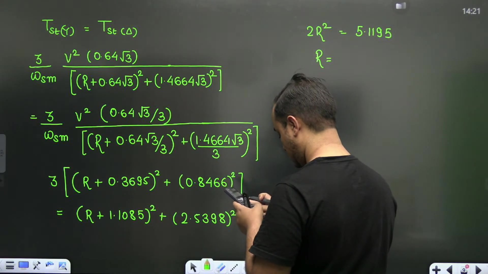

### Expansion and Solution for Feeder Resistance
Substitute numerical values: {\text{br}} \approx 1.155\ \Omega$ and {\text{br}} \approx 2.646\ \Omega$.

1970949\frac{R_{\text{br}}}{3} \approx 0.385\ \Omega, \quad \frac{X_{\text{br}}}{3} \approx 0.882\ \Omega1970949

Expand the left side:

19709493 \left[R_f^2 + \frac{2}{3} R_f R_{\text{br}} + \frac{R_{\text{br}}^2 + X_{\text{br}}^2}{9}\right] = 3 R_f^2 + 2 R_f R_{\text{br}} + \frac{Z_{\text{br}}^2}{3}1970949

Expand the right side:

1970949R_f^2 + 2 R_f R_{\text{br}} + R_{\text{br}}^2 + X_{\text{br}}^2 = R_f^2 + 2 R_f R_{\text{br}} + Z_{\text{br}}^21970949

Notice the cross term  R_f R_{\text{br}}$ is identical on both sides and cancels out completely:

19709493 R_f^2 + \frac{Z_{\text{br}}^2}{3} = R_f^2 + Z_{\text{br}}^21970949

Subtract ^2$ and $\frac{Z_{\text{br}}^2}{3}$:

19709492 R_f^2 = \frac{2}{3} Z_{\text{br}}^2 \implies R_f^2 = \frac{Z_{\text{br}}^2}{3}1970949

Taking the square root:

1970949R_f = \frac{Z_{\text{br}}}{\sqrt{3}}1970949

Substitute {\text{br}} = \frac{5}{\sqrt{3}}\ \Omega$:

1970949R_f = \frac{5 / \sqrt{3}}{\sqrt{3}} = \frac{5}{3} \approx 1.667\ \Omega \approx 1.6\ \Omega1970949

> [!success] Result
> The feeder resistance per phase is  = 1.6\ \Omega$.

### Parallel Feeder Case Formulation
If a second identical feeder of identical cross-section runs in parallel with the first feeder, the combined equivalent feeder resistance is halved:

1970949R_{f, \text{new}} = \frac{R_f}{2} = \frac{1.6}{2} = 0.8\ \Omega1970949

## Impact of Parallel Feeders on Starting Torque
_(20:35 - 25:26)_

### Torque Scaling with Total Circuit Impedance
In an induction motor, starting torque is inversely proportional to the square of total series impedance per phase:

1971889T \propto \frac{1}{|Z_{\text{total}}|^2}1971889

When the feeder resistance drops from {f, 1} = 1.6\ \Omega$ to {f, 2} = 0.8\ \Omega$, the ratio of new starting torque to old starting torque is:

1971889\frac{T_2}{T_1} = \frac{|Z_{\text{total}, 1}|^2}{|Z_{\text{total}, 2}|^2}1971889

### Percentage Increase in Star Connection
For star connection, compute the impedance squared for both feeder values:

With {f, 1} = 1.6\ \Omega$:

1971889\begin{aligned}
|Z_{\text{total}, 1}|^2 &= (R_{f, 1} + R_{\text{br}})^2 + X_{\text{br}}^2 \
&= (1.6 + 1.155)^2 + (2.646)^2 \
&= (2.755)^2 + 6.75 \
&\approx 7.590 + 7.001 = 14.591
\end{aligned}1971889

With {f, 2} = 0.8\ \Omega$:

1971889\begin{aligned}
|Z_{\text{total}, 2}|^2 &= (R_{f, 2} + R_{\text{br}})^2 + X_{\text{br}}^2 \
&= (0.8 + 1.155)^2 + (2.646)^2 \
&= (1.955)^2 + 6.75 \
&\approx 3.822 + 7.001 = 10.823
\end{aligned}1971889

Compute the torque ratio in star:

1971889\frac{T_{2, Y}}{T_{1, Y}} = \frac{14.591}{10.823} \approx 1.348 \implies 1.42651971889

This yields an increase in starting torque of approximately 2.65\%$.

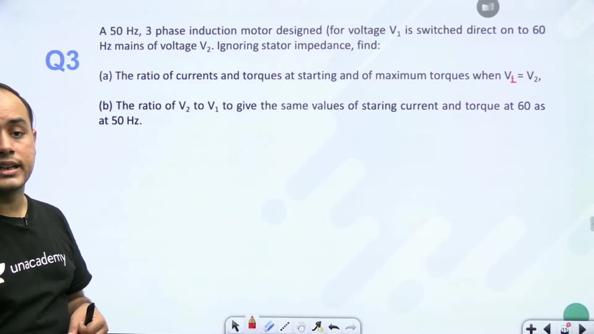

### Percentage Increase in Delta Connection
For delta connection, the motor impedance components in the equivalent star circuit are:

1971889R_{\Delta \to Y} = \frac{1.155}{3} \approx 0.385\ \Omega, \quad X_{\Delta \to Y} = \frac{2.646}{3} \approx 0.882\ \Omega1971889

Compute the impedance squared with {f, 1} = 1.6\ \Omega$:

1971889|Z_{\text{total}, 1}|^2 = (1.6 + 0.385)^2 + (0.882)^2 = (1.985)^2 + 0.778 \approx 3.940 + 0.778 = 4.7181971889

Compute the impedance squared with {f, 2} = 0.8\ \Omega$:

1971889|Z_{\text{total}, 2}|^2 = (0.8 + 0.385)^2 + (0.882)^2 = (1.185)^2 + 0.778 \approx 1.404 + 0.778 = 2.1821971889

Compute the torque ratio in delta:

1971889\frac{T_{2, \Delta}}{T_{1, \Delta}} = \frac{4.718}{2.182} \approx 2.162 \approx 2.2051971889

The percentage increase in delta starting torque is:

1971889\% \Delta T_\Delta = (2.205 - 1) \times 100\% \approx 120.5\%1971889

> [!success] Result
> Paralleling an identical feeder increases the starting torque by 2.65\%$ in star starting and by 20.5\%$ in delta starting. Delta starting gains far more because the reduced feeder resistance forms a larger fraction of total series loop impedance.

## Frequency Scaling of Starting Current and Torque
_(25:26 - 30:12)_

### Frequency Proportionality Relations
Neglecting stator winding impedance, starting current is limited primarily by standstill leakage reactance  = 2\pi f L_2$:

1972873I_{\text{st}} \approx \frac{V}{X_2} = \frac{V}{2\pi f L_2} \propto \frac{V}{f}1972873

Starting torque depends on synchronous speed and current squared:

1972873T_{\text{st}} = \frac{3}{\omega_s} I_{\text{st}}^2 R_2 \propto \frac{1}{f} \left(\frac{V}{f}\right)^2 = \frac{V^2}{f^3}1972873

The maximum breakdown torque is independent of rotor resistance:

1972873T_{\max} = \frac{3}{\omega_s} \frac{V^2}{2 X_2} \propto \frac{1}{f} \frac{V^2}{f} = \frac{V^2}{f^2}1972873

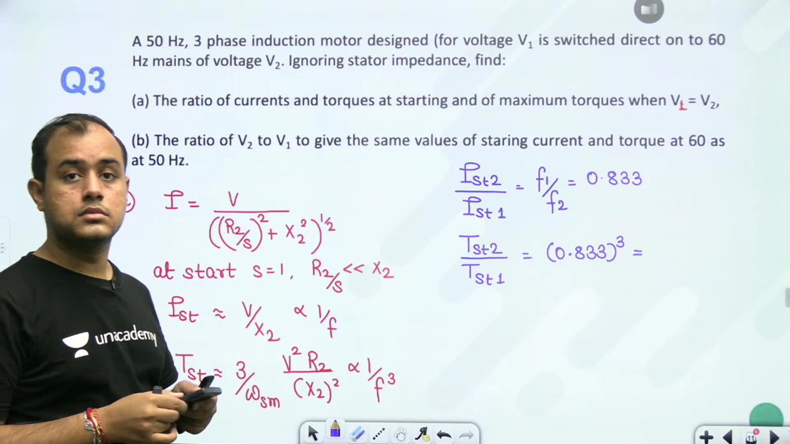

### Constant Voltage Operation from 50 Hz to 60 Hz
Let us evaluate Problem 3 for equal applied voltage  = V_2$:

> [!example] Problem 3 (Part 1)
> A 0\text{ Hz}$ three-phase induction motor designed for terminal voltage $ is operated from a 0\text{ Hz}$ supply with voltage  = V_1$. Neglecting stator impedance, find the ratios of starting current, starting torque, and maximum torque.

1. **Starting Current Ratio**:
   1972873\frac{I_{\text{st}, 60}}{I_{\text{st}, 50}} = \frac{f_1}{f_2} = \frac{50}{60} = \frac{5}{6} \approx 0.83331972873

2. **Starting Torque Ratio**:
   1972873\frac{T_{\text{st}, 60}}{T_{\text{st}, 50}} = \left(\frac{f_1}{f_2}\right)^3 = \left(\frac{50}{60}\right)^3 = \left(\frac{5}{6}\right)^3 = \frac{125}{216} \approx 0.57871972873

3. **Maximum Torque Ratio**:
   1972873\frac{T_{\max, 60}}{T_{\max, 50}} = \left(\frac{f_1}{f_2}\right)^2 = \left(\frac{50}{60}\right)^2 = \left(\frac{5}{6}\right)^2 = \frac{25}{36} \approx 0.69441972873

> [!success] Result
> At constant voltage, operating at 0\text{ Hz}$ instead of 0\text{ Hz}$ reduces starting current to 3.33\%$, starting torque to 7.87\%$, and peak breakdown torque to 9.44\%$.

## Tailored Voltage Ratios and Direct-On-Line Starting
_(30:18 - 35:14)_

### Voltage Ratios for Constant Starting Performance
Consider the second part of Problem 3: determining the supply voltage ratio $\frac{V_2}{V_1}$ required at 0\text{ Hz}$ to maintain performance identical to 0\text{ Hz}$.

> [!example] Problem 3 (Part 2)
> Determine the ratio $\frac{V_2}{V_1}$ required to achieve:
> 1. The exact same starting current at 0\text{ Hz}$ as at 0\text{ Hz}$.
> 2. The exact same starting torque at 0\text{ Hz}$ as at 0\text{ Hz}$.

#### Condition 1: Identical Starting Current
Since starting current is proportional to $\frac{V}{f}$:

1973563\frac{I_{\text{st}, 60}}{I_{\text{st}, 50}} = \left(\frac{V_2}{V_1}\right) \left(\frac{f_1}{f_2}\right) = 11973563

1973563\frac{V_2}{V_1} = \frac{f_2}{f_1} = \frac{60}{50} = 1.21973563

Terminal voltage must be increased by 0\%$ to keep $\frac{V}{f}$ constant.

#### Condition 2: Identical Starting Torque
Since starting torque satisfies {\text{st}} \propto \frac{V^2}{f^3}$:

1973563\frac{T_{\text{st}, 60}}{T_{\text{st}, 50}} = \left(\frac{V_2}{V_1}\right)^2 \left(\frac{f_1}{f_2}\right)^3 = 11973563

1973563\left(\frac{V_2}{V_1}\right)^2 = \left(\frac{f_2}{f_1}\right)^3 = \left(\frac{60}{50}\right)^3 = (1.2)^3 = 1.7281973563

1973563\frac{V_2}{V_1} = (1.2)^{1.5} \approx 1.31451973563

Terminal voltage must be increased by 1.45\%$ to maintain identical starting torque.

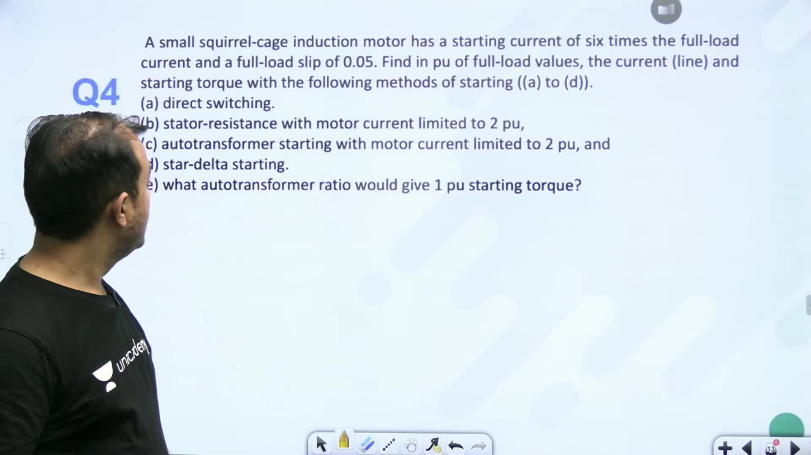

### Direct-On-Line (DOL) Starting Analysis
Now let us analyze Problem 4.

> [!example] Problem 4 (Part 1)
> A three-phase squirrel-cage induction motor has a short-circuit starting current of \text{ pu}$ ({\text{sc}} = 6 I_{\text{fl}}$) and a full-load slip of \%$ ({\text{fl}} = 0.05$). Under direct switching (DOL), the starting torque is .0\text{ pu}$.
> 1. Verify the starting torque under DOL starting.

The starting torque under full rated voltage is:

1973563\left(\frac{T_{\text{st}}}{T_{\text{fl}}}\right)_{\text{DOL}} = \left(\frac{I_{\text{sc}}}{I_{\text{fl}}}\right)^2 s_{\text{fl}}1973563

Substitute {\text{sc}} = 6 I_{\text{fl}}$ and {\text{fl}} = 0.05$:

1973563\begin{aligned}
\left(\frac{T_{\text{st}}}{T_{\text{fl}}}\right)_{\text{DOL}} &= 6^2 \times 0.05 \
&= 36 \times 0.05 \
&= 1.8\text{ pu}
\end{aligned}1973563

When given as .0\text{ pu}$ directly in problem specifications, we treat {\text{st, DOL}} = 2.0\text{ pu}$ as the baseline reference.

## Auto-Transformer and Star-Delta Starting Comparisons
_(35:18 - 40:22)_

### Auto-Transformer Starting with Limited Motor Current
In auto-transformer starting, the motor phase voltage is reduced by transformation ratio $ (bash < x < 1$).

> [!example] Problem 4 (Part 2)
> In Problem 4, determine the line current drawn from the supply and the developed starting torque when an auto-transformer starter is used such that the current flowing into the motor is limited to \text{ pu}$ ( I_{\text{fl}}$).

The motor starting current at reduced voltage is:

1974461I_{\text{st, motor}} = x I_{\text{sc}}1974461

Given {\text{st, motor}} = 2 I_{\text{fl}}$ and {\text{sc}} = 6 I_{\text{fl}}$:

1974461x (6 I_{\text{fl}}) = 2 I_{\text{fl}} \implies x = \frac{2}{6} = \frac{1}{3}1974461

The tapping ratio is  = \frac{1}{3} \approx 33.33\%$.

The line current drawn from the supply mains is reduced by ^2$:

1974461I_{\text{supply}} = x^2 I_{\text{sc}} = \left(\frac{1}{3}\right)^2 (6 I_{\text{fl}}) = \frac{6}{9} I_{\text{fl}} = \frac{2}{3} I_{\text{fl}} \approx 0.667\text{ pu}1974461

The starting torque develops in proportion to ^2$:

1974461T_{\text{st}} = x^2 T_{\text{st, DOL}} = \left(\frac{1}{3}\right)^2 (2.0\text{ pu}) = \frac{2}{9}\text{ pu} \approx 0.222\text{ pu}1974461

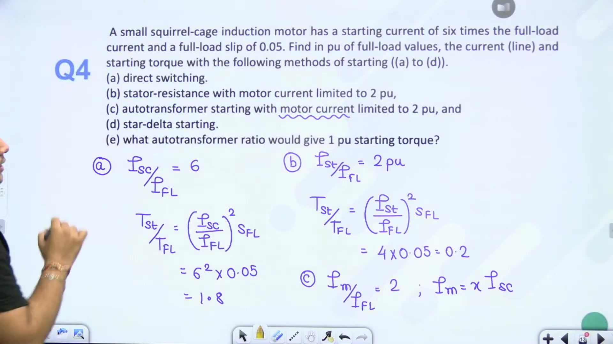

### Star-Delta Starting Comparison
In star-delta starting, phase voltage drops by $\frac{1}{\sqrt{3}}$. Therefore, line current and torque drop by factor $\frac{1}{3}$:

1974461I_{\text{supply, } Y\text{-}\Delta} = \frac{1}{3} I_{\text{sc}} = \frac{1}{3} (6 I_{\text{fl}}) = 2 I_{\text{fl}} = 2.0\text{ pu}1974461

1974461T_{\text{st, } Y\text{-}\Delta} = \frac{1}{3} T_{\text{st, DOL}} = \frac{1}{3} (2.0\text{ pu}) \approx 0.667\text{ pu}1974461

### Required Tapping for Full-Load Starting Torque
Now determine the tapping ratio $ required for starting torque to equal full-load torque ({\text{st}} = 1.0\text{ pu}$):

1974461\frac{T_{\text{st}}}{T_{\text{fl}}} = x^2 \left(\frac{I_{\text{sc}}}{I_{\text{fl}}}\right)^2 s_{\text{fl}} = 1.01974461

Substitute $\left(\frac{I_{\text{sc}}}{I_{\text{fl}}}\right)^2 s_{\text{fl}} = 6^2 \times 0.05 = 1.8$:

1974461\begin{aligned}
x^2 \times 1.8 &= 1.0 \
x^2 &= \frac{1}{1.8} \approx 0.5556 \
x &= \sqrt{0.5556} \approx 0.745
\end{aligned}1974461

> [!success] Result
> An auto-transformer tapping of 4.5\%$ delivers starting torque equal to rated full-load torque.

## Constant V/f Starting and Torque Ratio Formulation
_(40:22 - 45:35)_

### Maximum Starting Torque Under Constant V/f Control
Let us examine Problem 5.

> [!example] Problem 5
> A 00\text{ V}$, 0\text{ Hz}$, 4-pole, 400\text{ rpm}$ star-connected squirrel-cage induction motor has  = 1\ \Omega$ and total series reactance {\text{eq}} = 3\ \Omega$ at 0\text{ Hz}$. Stator resistance and losses are neglected. The motor is controlled with constant $\frac{V}{f}$. Find the supply voltage and frequency required to obtain maximum torque at starting.

The slip at maximum torque at baseline 0\text{ Hz}$ is:

1975258s_{mT, 1} = \frac{R_2}{X_{\text{eq}}} = \frac{1}{3} \approx 0.33331975258

To develop maximum torque at starting, the slip at maximum torque must equal unity:

1975258s_{mT, 2} = 11975258

Since series reactance scales directly with supply frequency ({\text{eq}} \propto f$), the slip at maximum breakdown torque is inversely proportional to frequency:

1975258s_{mT} \propto \frac{1}{f} \implies \frac{s_{mT, 2}}{s_{mT, 1}} = \frac{f_1}{f_2}1975258

Substitute values:

1975258\frac{1}{1/3} = \frac{50}{f_2} \implies 3 = \frac{50}{f_2} \implies f_2 = \frac{50}{3} \approx 16.67\text{ Hz}1975258

Under constant $\frac{V}{f}$ control:

1975258\frac{V_2}{f_2} = \frac{V_1}{f_1} \implies V_2 = V_1 \left(\frac{f_2}{f_1}\right) = 400 \times \left(\frac{16.67}{50}\right) = \frac{400}{3} \approx 133.33\text{ V}1975258

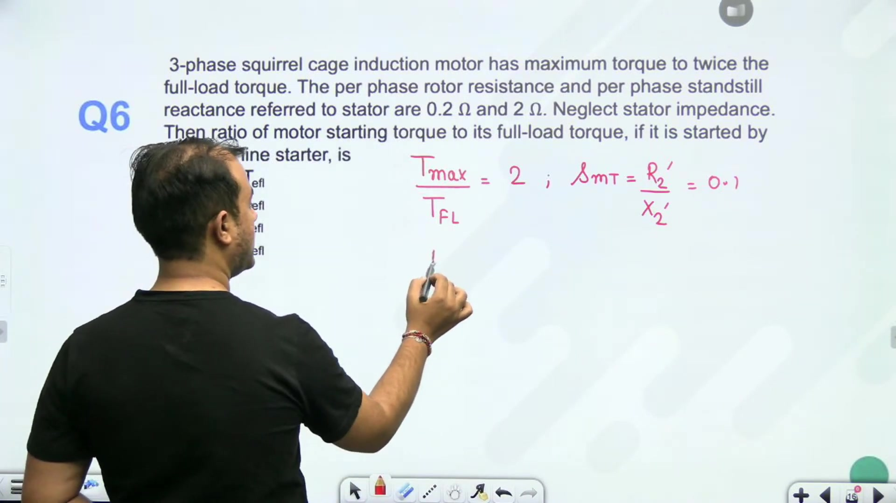

> [!success] Result
> A supply voltage of 33.33\text{ V}$ at a frequency of 6.67\text{ Hz}$ provides maximum torque right at starting under constant $\frac{V}{f}$ drive.

### Starting Torque to Full-Load Torque via Torque Ratios
Now consider Problem 6.

> [!example] Problem 6
> For an induction motor, compute the ratio of starting torque to full-load torque under Direct-On-Line starting using standard torque equations.

Express the ratio as a product of two ratios:

1975258\frac{T_{\text{st}}}{T_{\text{fl}}} = \left(\frac{T_{\text{st}}}{T_{\max}}\right) \times \left(\frac{T_{\max}}{T_{\text{fl}}}\right)1975258

The standard torque formula relating torque at slip $ to maximum torque is:

1975258\frac{T}{T_{\max}} = \frac{2}{\frac{s}{s_{mT}} + \frac{s_{mT}}{s}}1975258

At starting, slip  = 1$:

1975258\frac{T_{\text{st}}}{T_{\max}} = \frac{2}{\frac{1}{s_{mT}} + s_{mT}} = \frac{2 s_{mT}}{1 + s_{mT}^2}1975258

Substitute into the overall torque expression to evaluate $\frac{T_{\text{st}}}{T_{\text{fl}}} \approx 0.396$.

## Minimum Voltage to Avoid Stalling Under Voltage Fluctuations
_(45:35 - 50:37)_

### Physics of Voltage Drops and Motor Stall Limit
When supply voltage drops, induction motor electromagnetic torque scales down with the square of voltage:

1976210T \propto V^21976210

If peak breakdown torque drops below load torque demand, the motor cannot sustain operation and stalls. The limiting threshold occurs when reduced maximum torque exactly equals rated full-load torque:

1976210T_{\max}' = T_{\text{fl}}1976210

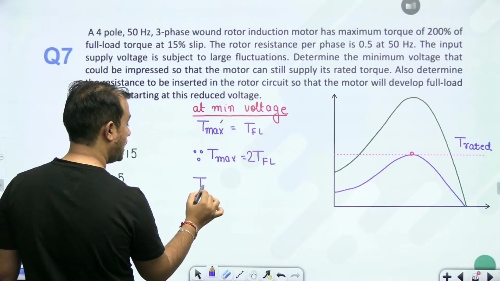

### Minimum Permissible Operating Voltage
Let us evaluate Problem 7.

> [!example] Problem 7 (Part 1)
> A 4-pole, 0\text{ Hz}$ three-phase wound-rotor induction motor has maximum breakdown torque equal to 00\%$ of full-load torque ({\max} = 2.0 T_{\text{fl}}$) at slip {mT} = 0.15$. The rotor resistance is  = 0.5\ \Omega$ per phase. If supply voltage fluctuates, find the minimum terminal voltage that allows the motor to supply rated full-load torque without stalling.

First, determine rotor leakage reactance at 0\text{ Hz}$:

1976210X_2 = \frac{R_2}{s_{mT}} = \frac{0.5}{0.15} = \frac{10}{3} \approx 3.333\ \Omega1976210

At the critical stability limit:

1976210T_{\max}' = T_{\text{fl}}1976210

Since maximum torque is proportional to voltage squared:

1976210\frac{T_{\max}'}{T_{\max}} = \left(\frac{V'}{V}\right)^21976210

Substitute {\max}' = T_{\text{fl}}$ and {\max} = 2.0 T_{\text{fl}}$:

1976210\begin{aligned}
\frac{T_{\text{fl}}}{2.0 T_{\text{fl}}} &= \left(\frac{V'}{V}\right)^2 \
\frac{1}{2} &= \left(\frac{V'}{V}\right)^2 \
V' &= \frac{V}{\sqrt{2}} \approx 0.7071 V
\end{aligned}1976210

> [!success] Result
> The minimum terminal voltage to prevent stalling under rated load is 0.71\%$ of rated supply voltage.

### Condition for Rated Torque at Starting Under Minimum Voltage
In the second part of Problem 7, we require the motor to develop full rated torque right at starting ( = 1$) under this minimum voltage '$.

Since rated torque is the absolute maximum torque achievable at voltage '$ ({\max}' = T_{\text{fl}}$), developing rated torque at starting requires:

1976210s_{mT}' = 11976210

Peak torque must be shifted to standstill by adding external resistance {\text{ext}}$.

## External Resistance Calculation and Feeder Sizing Constraints
_(50:38 - 55:34)_

### Calculation of Required External Rotor Resistance
To place maximum torque at standstill under reduced voltage, set total rotor resistance equal to rotor reactance:

1977197\frac{R_2 + R_{\text{ext}}}{X_2} = 1 \implies R_2 + R_{\text{ext}} = X_21977197

Solving for external resistance per phase gives:

1977197R_{\text{ext}} = X_2 - R_21977197

Substitute  = 3.333\ \Omega$ and  = 0.5\ \Omega$:

1977197\begin{aligned}
R_{\text{ext}} &= 3.333 - 0.500 \
&= 2.833\ \Omega
\end{aligned}1977197

> [!success] Result
> An external resistance of .833\ \Omega$ per phase must be added in the rotor circuit so that the motor can start against full-load torque at the minimum voltage bash.7071 V$.

### Feeder Conductor Sizing for Allowable Torque Reduction
Now examine Problem 8.

> [!example] Problem 8
> A 0\text{ kW}$ three-phase induction motor has standstill impedance {\text{br}} = 1 + j4\ \Omega$. It is supplied from a 00\text{ V}$, 0\text{ Hz}$ source through a 00\text{ m}$ feeder line. The motor is started in star connection. The cable material resistivity is $\rho = 0.03\ \Omega\cdot\text{mm}^2/\text{m}$. Find the minimum conductor cross-sectional area such that the starting torque reduction due to feeder voltage drop does not exceed 0\%$.

If the reduction in starting torque is at most 0\%$, the starting torque with the feeder must be at least 0\%$ of the starting torque without the feeder:

1977197\frac{T_{\text{st, with feeder}}}{T_{\text{st, without feeder}}} \ge 0.601977197

Since  \propto \frac{1}{|Z_{\text{total}}|^2}$:

1977197\frac{|Z_{\text{without feeder}}|^2}{|Z_{\text{with feeder}}|^2} \ge 0.601977197

For star starting without feeder line resistance:

1977197|Z_{\text{without feeder}}|^2 = 1^2 + 4^2 = 1 + 16 = 17\ \Omega^21977197

With feeder resistance $ in series per phase:

1977197|Z_{\text{with feeder}}|^2 = (R_f + 1)^2 + 4^2 = (R_f + 1)^2 + 161977197

Equate to the limiting 0\%$ threshold:

1977197\frac{17}{(R_f + 1)^2 + 16} = 0.60 \implies (R_f + 1)^2 + 16 = \frac{17}{0.60} \approx 28.3331977197

1977197\begin{aligned}
(R_f + 1)^2 &= 28.333 - 16 = 12.333 \
R_f + 1 &= \sqrt{12.333} \approx 3.512 \
R_f &\approx 2.512\ \Omega
\end{aligned}1977197

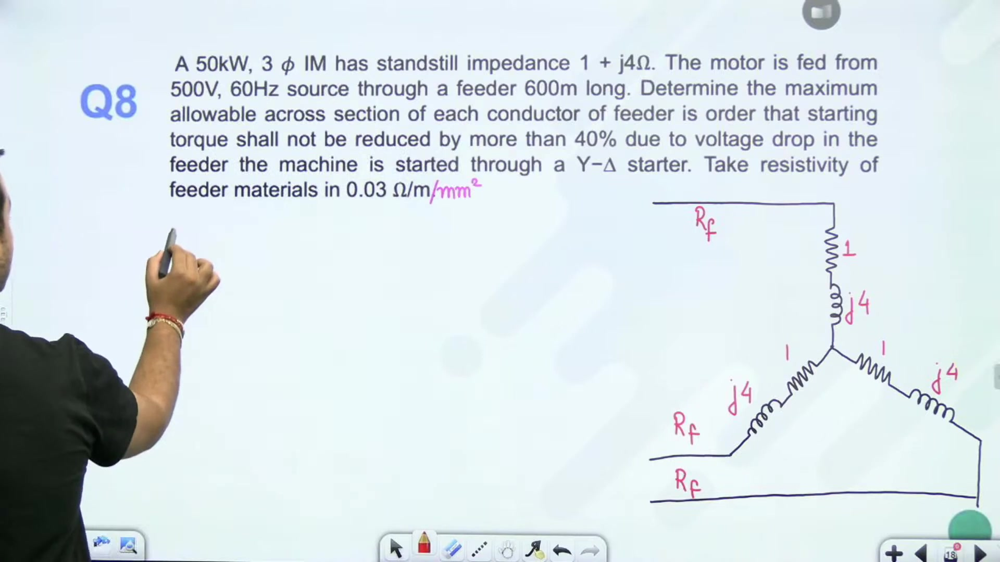

### Minimum Conductor Cross-Sectional Area
Using the electrical resistance formula  = \frac{\rho \cdot l}{A}$:

1977197A = \frac{\rho \cdot l}{R_f}1977197

Substitute given parameters $\rho = 0.03\ \Omega\cdot\text{mm}^2/\text{m}$,  = 600\text{ m}$, and maximum  = 2.512\ \Omega$:

1977197\begin{aligned}
A &= \frac{0.03 \times 600}{2.512} \
&= \frac{18}{2.512} \approx 7.166\text{ mm}^2
\end{aligned}1977197

> [!success] Result
> The minimum conductor cross-sectional area of the feeder cable is .166\text{ mm}^2$.

## Starter Selection and Conceptual Questions
_(55:37 - 62:40)_

### Starter Recommendation by Power Rating
Standard industrial guidelines govern the choice of starter based on motor rating:

- Direct-On-Line (DOL) starters are used for small motors up to \text{ HP}$ (.7\text{ kW}$).
- Star-Delta starters are used for medium motors rated between \text{ HP}$ and 5 - 20\text{ HP}$.
- Auto-transformer starters are recommended for large induction motors rated above 5 - 20\text{ HP}$.

> [!example] Problem 9
> Which starter is recommended for a 0\text{ HP}$ squirrel-cage induction motor?
> - (A) Direct-On-Line starter
> - (B) Rotor resistance starter
> - (C) Star-Delta starter
> - (D) Auto-transformer starter

For squirrel-cage motors of 0\text{ HP}$ and higher, an auto-transformer starter is the standard recommended starter because it permits adjustable voltage tapping while limiting line disturbances. (Note that rotor resistance starters can only be used on slip-ring wound-rotor motors). The correct answer is (D).

### Phase Voltage Reduction in Star-Delta Starting
Examine Problem 10 on voltage scaling in star-delta starters.

> [!example] Problem 10
> In star-delta starting, by what factor is the applied phase voltage at starting reduced compared to running in delta?

When running in delta connection, the voltage across each phase winding equals the line voltage:

1978055V_{\text{ph, delta}} = V_L1978055

During starting in star connection, the voltage across each phase winding is the line-to-neutral voltage:

1978055V_{\text{ph, star}} = \frac{V_L}{\sqrt{3}}1978055

The ratio of phase voltage at starting to phase voltage during normal running is:

1978055\frac{V_{\text{ph, star}}}{V_{\text{ph, delta}}} = \frac{V_L / \sqrt{3}}{V_L} = \frac{1}{\sqrt{3}}1978055

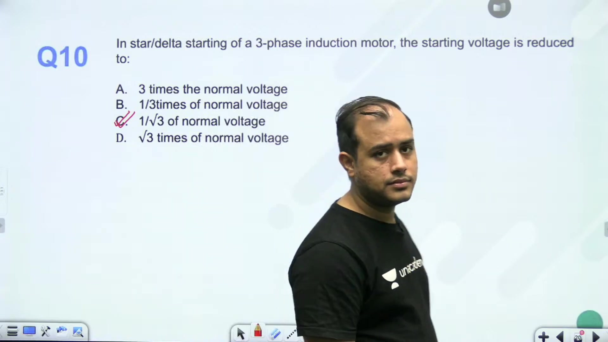

> [!success] Result
> The applied phase voltage at starting is reduced by a factor of $\frac{1}{\sqrt{3}}$. Line current and starting torque both reduce by a factor of $\frac{1}{3}$.

---

## Summary and Key Takeaways

- Maximum torque develops at starting when rotor resistance equals standstill reactance: {mT} = \frac{R_2}{X_2} = 1$.
- To obtain peak torque at standstill in wound-rotor motors, the required series external resistance is {\text{ext}} = X_2 - R_2$.
- When calculating feeder voltage drops with delta windings, transform the delta load to an equivalent star circuit with branch impedance $\frac{Z_{\text{br}}}{3}$.
- Paralleling an identical feeder halves the line resistance, yielding a significantly higher percentage torque increase in delta starting than in star starting.
- Neglecting stator impedance, starting current scales as $\frac{V}{f}$ and starting torque scales as $\frac{V^2}{f^3}$.
- Under constant $\frac{V}{f}$ speed control, slip at breakdown torque satisfies {mT} \propto \frac{1}{f}$, allowing peak torque at standstill by lowering supply frequency.
- In auto-transformer starting with tapping factor $, motor current scales as  I_{\text{sc}}$, line current drawn from supply scales as ^2 I_{\text{sc}}$, and torque scales as ^2 T_{\text{st, DOL}}$.
- In star-delta starting, applied winding phase voltage drops by $\frac{1}{\sqrt{3}}$, while line current and starting torque drop by $\frac{1}{3}$.

