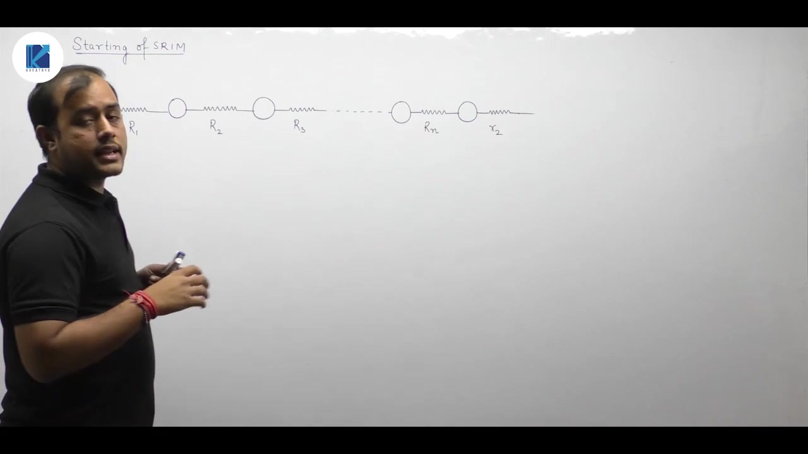
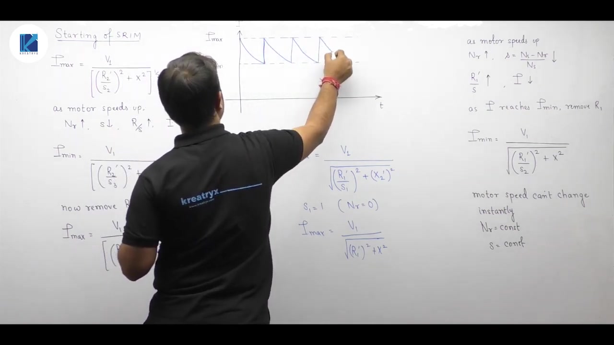
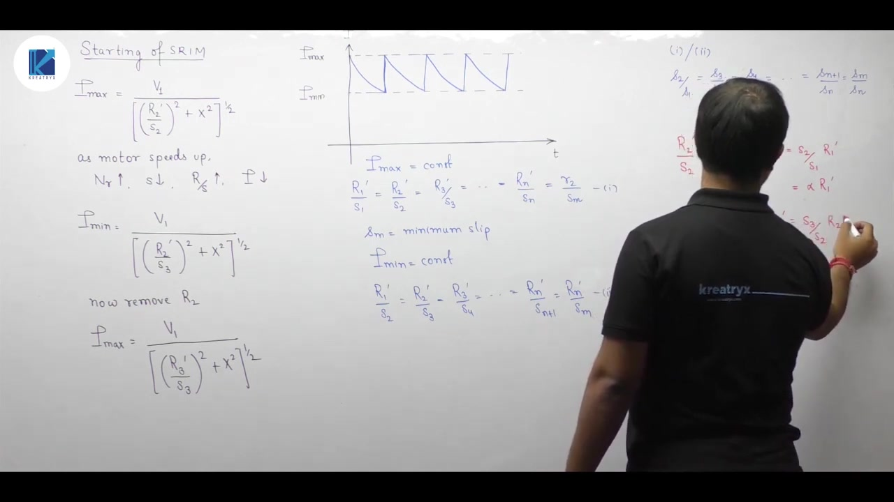
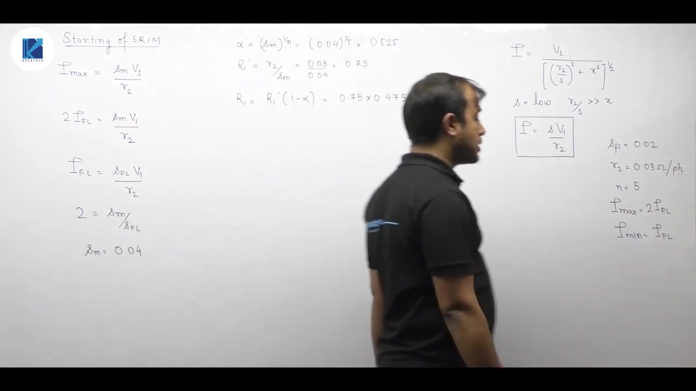

# Electrical Machines | Lec 106 | Starting of SRIM | GATE/ESE Electrical Engineering

- **Source**: https://www.youtube.com/watch?v=vro0fzqEfzk
- **Duration**: 00:29:30
- **Compiled**: 2026-09-23

---

## Overview

This lecture establishes the theory, mathematical derivation, and practical design of rotor resistance starters for slip-ring induction motors. It explains how inserting external resistance through slip rings restricts starting inrush currents while developing high starting torque. The discussion shows how progressive resistance switching bounds the rotor current between specified maximum and minimum limits. It proves that the switching slips and resistance sections form geometric progressions and provides a structured five-step design algorithm.

## Contents

- [[#Principles and Assumptions of Slip-Ring Motor Starting|Principles and Assumptions of Slip-Ring Motor Starting]]
- [[#Rotor Circuit Formulations and Current Oscillations|Rotor Circuit Formulations and Current Oscillations]]
- [[#Geometric Progression of Switching Slips and Resistances|Geometric Progression of Switching Slips and Resistances]]
- [[#Starter Section Calculation and Step-by-Step Procedure|Starter Section Calculation and Step-by-Step Procedure]]
- [[#Worked Numerical Example: Rotor Starter Design|Worked Numerical Example: Rotor Starter Design]]

---

## Principles and Assumptions of Slip-Ring Motor Starting
_(00:12 - 04:51)_

### Rotor Resistance Control in Slip-Ring Motors
In squirrel-cage induction motors, the rotor conductors are short-circuited by end rings. The rotor circuit cannot be altered externally. In contrast, a slip-ring induction motor provides physical access to the rotor windings through slip rings and carbon brushes.

Adding external resistance to each rotor phase increases total rotor circuit resistance. This accomplishes two major objectives:
1. It increases total impedance at starting, thereby reducing excessive inrush current.
2. It increases starting torque, enabling the machine to start against heavy mechanical loads.

### Stepped Resistance Switching Mechanism
As the rotor accelerates from standstill, rotor speed $N_r$ rises and slip $s$ decreases:

$$s = \frac{N_s - N_r}{N_s}$$

The effective rotor impedance term is given by:

$$Z_2(s) = \sqrt{\left(\frac{R_2}{s}\right)^2 + X_2^2}$$

As slip falls toward rated values, $R_2/s$ naturally increases. Because the internal equivalent impedance rises on its own, external resistance sections can be progressively removed from the circuit without causing excessive current. This stepped removal closely parallels the operation of multi-stud DC motor starters.

> [!info] Definition
> A rotor resistance starter consists of multiple resistance sections connected between contact studs per rotor phase. As the motor gains speed, the starter arm cuts out resistance sections sequentially to maintain high acceleration torque while limiting peak currents.

### Fundamental Modeling Assumptions
To derive the analytical stepping relationships, four simplifying assumptions are made:

1. The magnetizing shunt branch is neglected because no-load current is small compared to starting current.
2. Stator series impedance is neglected ($R_1 \approx 0$ and $X_1 \approx 0$).
3. The mechanical load torque demand remains constant throughout the starting process.
4. The rotor current oscillates strictly between a specified upper limit $I_{\max}$ and a lower limit $I_{\min}$.

## Rotor Circuit Formulations and Current Oscillations
_(04:51 - 09:49)_

### Circuit Resistance Definitions Across Studs
Consider an $n$-section starter with $n+1$ contact studs. Let the individual external resistance sections in each rotor phase be $R_1, R_2, R_3, \dots, R_n$, and let the internal winding resistance of the rotor be $r_2$.

We define the total rotor circuit resistance present on each stud:

- **Stud 1 (Standstill)**: All external sections are in series:
  $$R_1' = R_1 + R_2 + R_3 + \dots + R_n + r_2$$
- **Stud 2**: Section $R_1$ is cut out:
  $$R_2' = R_2 + R_3 + \dots + R_n + r_2$$
- **Stud $k$**: Sections $R_1$ through $R_{k-1}$ are removed:
  $$R_k' = R_k + \dots + R_n + r_2$$
- **Stud $n+1$ (Final Running Position)**: All external sections are removed:
  $$R_{n+1}' = r_2$$

### Initial Standstill Current
At standstill, rotor speed is zero, giving an initial slip of:

$$s_1 = 1$$

The peak starting current on the first stud is:

$$I_{\max} = \frac{V_1}{\sqrt{(R_1'/s_1)^2 + X^2}} = \frac{V_1}{\sqrt{(R_1')^2 + X^2}}$$

Here $V_1$ is the stator-referred supply voltage and $X$ is the standstill rotor leakage reactance.

### Dynamic Switching Cycle
As the machine accelerates under developed torque:
1. Rotor speed increases, slip falls from $s_1$ to $s_2$, and effective impedance $R_1'/s$ increases.
2. Rotor current decays from $I_{\max}$ down to the design lower threshold $I_{\min}$:
   $$I_{\min} = \frac{V_1}{\sqrt{(R_1'/s_2)^2 + X^2}}$$
3. The moment current reaches $I_{\min}$, contact arm advances to stud 2, cutting out resistance $R_1$.
4. Due to mechanical inertia, rotor speed cannot change instantaneously ($\Delta N_r \approx 0 \implies s$ remains $s_2$).
5. With circuit resistance abruptly reduced to $R_2'$, the current shoots back up immediately to $I_{\max}$:
   $$I_{\max} = \frac{V_1}{\sqrt{(R_2'/s_2)^2 + X^2}}$$

## Geometric Progression of Switching Slips and Resistances
_(09:49 - 15:35)_

### Bounded Current Waveform
The rotor current waveform traces a periodic sawtooth profile bounded strictly between $I_{\min}$ and $I_{\max}$.

Because all peak currents are engineered to be identical ($I_{\max} = \text{constant}$), the corresponding total effective circuit resistances must be equal:

$$\frac{R_1'}{s_1} = \frac{R_2'}{s_2} = \frac{R_3'}{s_3} = \dots = \frac{R_n'}{s_n} = \frac{r_2}{s_m}$$

Here $s_m$ is the minimum operating slip reached on the final running stud. Similarly, all minimum currents are equal ($I_{\min} = \text{constant}$):

$$\frac{R_1'}{s_2} = \frac{R_2'}{s_3} = \frac{R_3'}{s_4} = \dots = \frac{R_n'}{s_m}$$

### Derivation of the Slip Ratio Alpha
Divide the corresponding terms of the maximum current equation by the minimum current equation:

$$\frac{R_1'/s_1}{R_1'/s_2} = \frac{s_2}{s_1}, \quad \frac{R_2'/s_2}{R_2'/s_3} = \frac{s_3}{s_2}, \quad \dots, \quad \frac{R_n'/s_n}{R_n'/s_m} = \frac{s_m}{s_n}$$

All these ratios are identical and equal to a common constant $\alpha$:

$$\frac{s_2}{s_1} = \frac{s_3}{s_2} = \frac{s_4}{s_3} = \dots = \frac{s_m}{s_n} = \alpha$$

> [!info] Definition
> The switching slips at successive starter studs form a Geometric Progression (GP) with a common ratio $\alpha < 1$.

Because the rotor accelerates and slip drops across stages, later slips are smaller than previous slips, guaranteeing $\alpha < 1$.

### Determination of Alpha from Running Slip
Express consecutive slips in terms of $\alpha$:

$$
\begin{aligned}
s_2 &= \alpha s_1 \\
s_3 &= \alpha s_2 = \alpha^2 s_1 \\
s_m &= \alpha^n s_1
\end{aligned}
$$

At the instant of starting, the initial slip is $s_1 = 1$. Therefore:

$$s_m = \alpha^n$$

> [!success] Result
> The common stepping ratio $\alpha$ depends solely on the minimum operating slip $s_m$ and the number of resistance sections $n$:
> $$\alpha = s_m^{1/n}$$

## Starter Section Calculation and Step-by-Step Procedure
_(15:35 - 23:23)_

### Progression of Total Circuit Resistances
From the maximum current equality:

$$\frac{R_2'}{R_1'} = \frac{s_2}{s_1} = \alpha \implies R_2' = \alpha R_1'$$

Similarly, $R_3' = \alpha R_2' = \alpha^2 R_1'$, and in general:

$$R_k' = \alpha^{k-1} R_1'$$

On the final stud ($k = n+1$), all external sections are bypassed, leaving only internal rotor resistance $r_2$:

$$r_2 = R_{n+1}' = \alpha^n R_1' = s_m R_1' \implies R_1' = \frac{r_2}{s_m}$$

### Evaluation of Individual Resistance Sections
The individual resistance sections connected between adjacent contact studs are obtained from the differences between remaining circuit resistances:

$$
\begin{aligned}
R_1 &= R_1' - R_2' = R_1'(1 - \alpha) \\
R_2 &= R_2' - R_3' = \alpha R_1'(1 - \alpha) = \alpha R_1 \\
R_3 &= R_3' - R_4' = \alpha^2 R_1'(1 - \alpha) = \alpha^2 R_1 \\
R_k &= \alpha^{k-1} R_1
\end{aligned}
$$

The individual resistance sections themselves form a geometric progression with common ratio $\alpha$.

### Five-Step Starter Design Algorithm
To design a rotor resistance starter, apply this five-step sequence:

1. **Step 1**: Find the common ratio:
   $$\alpha = s_m^{1/n}$$
2. **Step 2**: Calculate the total initial rotor circuit resistance:
   $$R_1' = \frac{r_2}{s_m}$$
3. **Step 3**: Compute the first external resistance section:
   $$R_1 = R_1'(1 - \alpha)$$
4. **Step 4**: Compute the subsequent resistance sections:
   $$R_2 = \alpha R_1, \quad R_3 = \alpha^2 R_1, \quad \dots, \quad R_n = \alpha^{n-1} R_1$$
5. **Step 5**: Determine the total external resistance inserted per phase:
   $$R_{\text{ext}} = R_1' - r_2$$

> [!info] Definition
> For $n$ resistance sections, exactly $n+1$ contact studs are required per phase. Stud 1 is the starting position, and stud $n+1$ is the running position.

## Worked Numerical Example: Rotor Starter Design
_(23:23 - 29:22)_

### Problem Formulation
Let us apply the five-step design procedure to a comprehensive problem.

> [!example] Problem
> A 3-phase slip-ring induction motor has an internal rotor resistance of $0.03\ \Omega$ per phase. A 6-stud starter is used. The full-load slip is $2\%$. The starting current oscillates between rated full-load current ($I_{\min} = I_{\text{fl}}$) and twice rated full-load current ($I_{\max} = 2 I_{\text{fl}}$). Standstill rotor leakage reactance is neglected.
> Determine the resistance of each starter section per phase.

### Step 1: Determination of Minimum Slip and Alpha
Because the starter has 6 contact studs, the number of resistance sections is:

$$n = \text{studs} - 1 = 6 - 1 = 5$$

When leakage reactance is neglected, the rotor current expression is:

$$I \approx \frac{s V_1}{r_2}$$

At rated full load: $I_{\text{fl}} = \frac{s_{\text{fl}} V_1}{r_2}$. On the final stud at minimum slip $s_m$: $I_{\max} = \frac{s_m V_1}{r_2}$. Taking the ratio:

$$\frac{I_{\max}}{I_{\text{fl}}} = \frac{s_m}{s_{\text{fl}}} = 2 \implies s_m = 2 s_{\text{fl}} = 2 \times 0.02 = 0.04$$

Now compute the common ratio $\alpha$:

$$\alpha = s_m^{1/n} = (0.04)^{1/5} = (0.04)^{0.2} \approx 0.5253$$

### Step 2 to 4: Section Resistances
Compute total initial resistance $R_1'$:

$$R_1' = \frac{r_2}{s_m} = \frac{0.03}{0.04} = 0.75\ \Omega$$

Compute the first resistance section $R_1$:

$$R_1 = R_1'(1 - \alpha) = 0.75 \times (1 - 0.5253) = 0.75 \times 0.4747 \approx 0.3560\ \Omega$$

Now calculate the remaining sections using $R_k = \alpha^{k-1} R_1$:

$$
\begin{aligned}
R_2 &= \alpha R_1 = 0.5253 \times 0.3560 \approx 0.1870\ \Omega \\
R_3 &= \alpha R_2 = 0.5253 \times 0.1870 \approx 0.0982\ \Omega \\
R_4 &= \alpha R_3 = 0.5253 \times 0.0982 \approx 0.0516\ \Omega \\
R_5 &= \alpha R_4 = 0.5253 \times 0.0516 \approx 0.0271\ \Omega
\end{aligned}
$$

Verify the sum of all sections:

$$R_{\text{ext}} = \sum_{k=1}^5 R_k = 0.3560 + 0.1870 + 0.0982 + 0.0516 + 0.0271 = 0.7199\ \Omega$$

Total resistance matches: $R_{\text{ext}} + r_2 = 0.7199 + 0.03 \approx 0.75\ \Omega = R_1'$.

> [!success] Result
> The five starter sections per phase are $R_1 \approx 0.356\ \Omega$, $R_2 \approx 0.187\ \Omega$, $R_3 \approx 0.098\ \Omega$, $R_4 \approx 0.052\ \Omega$, and $R_5 \approx 0.027\ \Omega$.

---

## Summary and Key Takeaways

- External rotor resistance can be inserted into slip-ring induction motors via slip rings to increase starting torque and limit starting current.
- As the rotor accelerates, slip drops and effective internal impedance $R_2/s$ naturally rises, enabling progressive removal of external resistance steps.
- Rotor current is maintained within designed operational bounds oscillating between $I_{\max}$ and $I_{\min}$.
- Consecutive switching slips form a geometric progression with common ratio $\alpha = s_m^{1/n}$, where $s_m$ is the minimum operating slip and $n$ is the number of resistance sections.
- An $n$-section rotor resistance starter requires exactly $n+1$ contact studs per rotor phase.
- Total remaining circuit resistances on consecutive studs follow the geometric progression $R_k' = \alpha^{k-1} R_1'$, with $R_1' = \frac{r_2}{s_m}$.
- Individual resistance sections connected between adjacent studs satisfy $R_k = \alpha^{k-1} R_1$, where the first section is $R_1 = R_1'(1 - \alpha)$.
- When designing starter sections, the minimum operating slip $s_m$ must be calculated from operating current bounds and should not be assumed equal to full-load slip.

