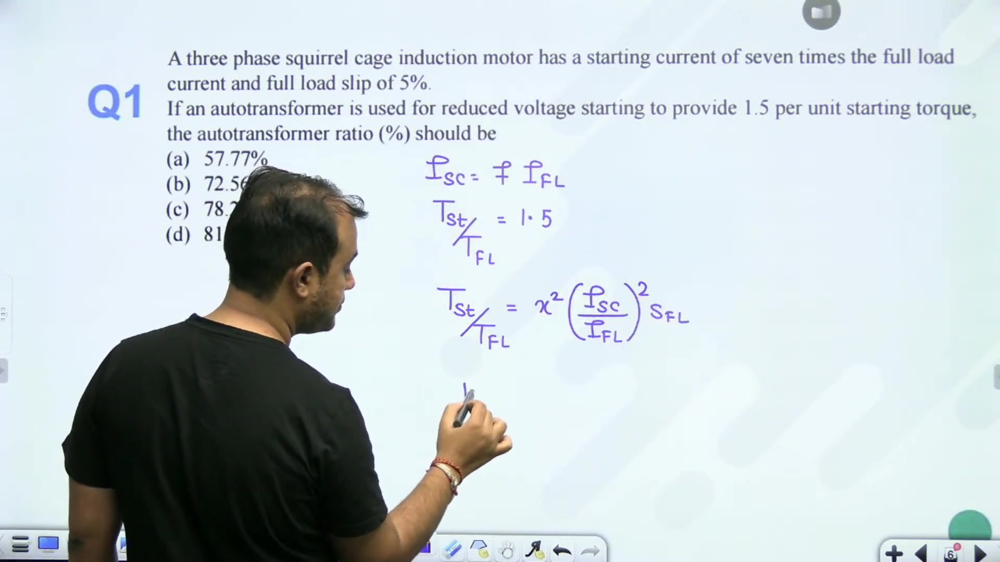
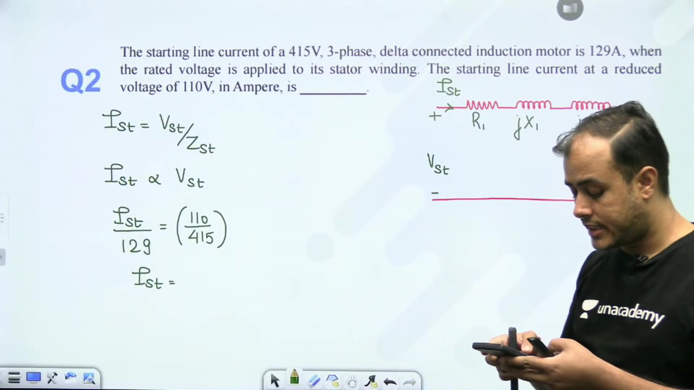
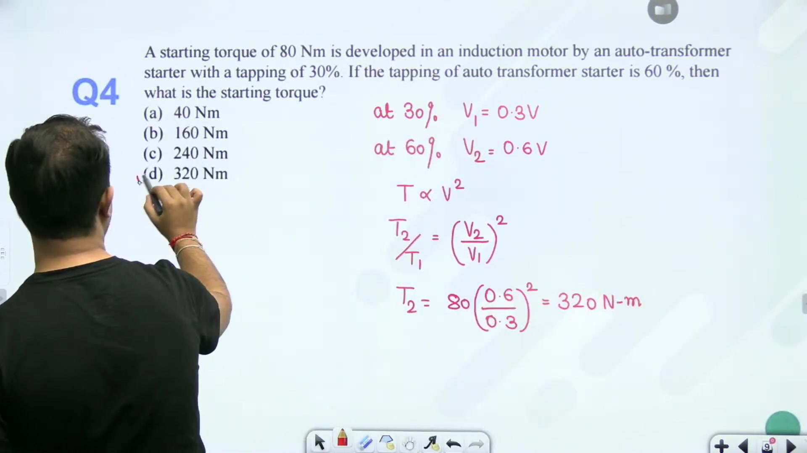
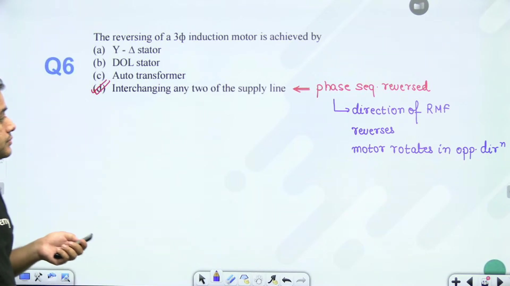
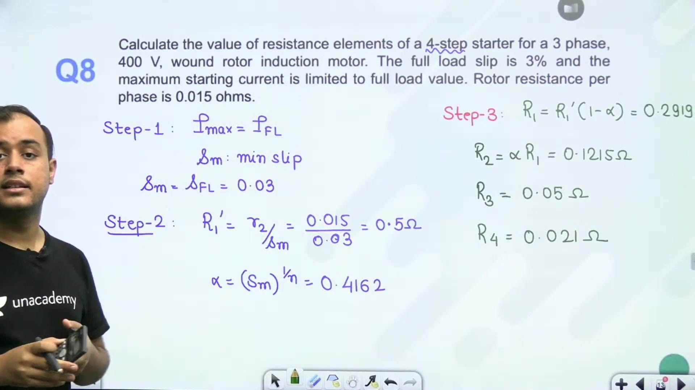
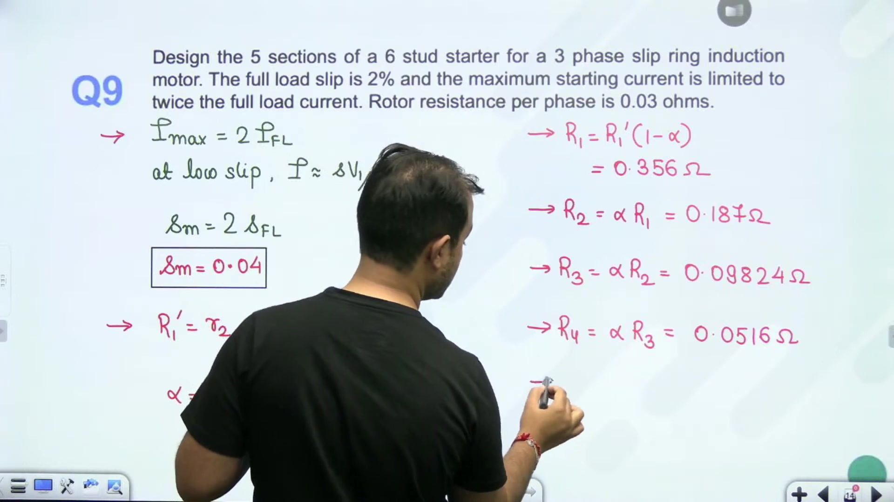
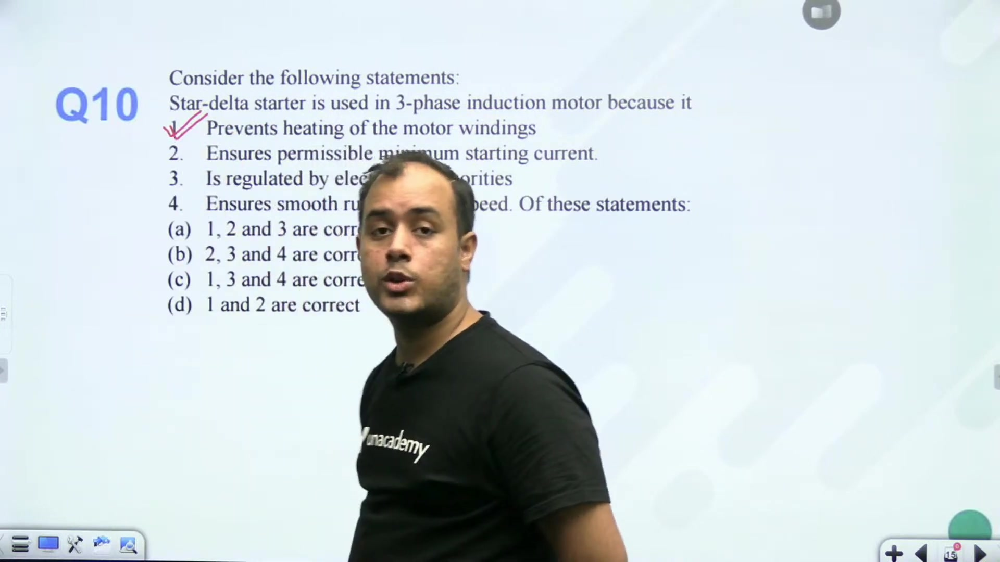

# Starting of SRIM | L 43 | Electrical Machines | GATE 2022 | Ankit Goyal

- **Source**: https://www.youtube.com/watch?v=qr2pRtv3hSI
- **Duration**: 00:36:40
- **Compiled**: 2026-09-23

---

## Overview

This lecture provides systematic numerical problem solving on induction motor starting methods for squirrel-cage and slip-ring machines. It covers torque and current scaling under auto-transformer reduced-voltage starting, standstill voltage proportionality, and frequency-dependent reactance variations. The session also addresses induction motor phase sequence reversal and details multi-step rotor resistance starter designs for wound-rotor machines.

## Contents

- [[#Auto-Transformer Ratio and Standstill Circuit Concepts|Auto-Transformer Ratio and Standstill Circuit Concepts]]
- [[#Voltage and Frequency Variations at Standstill|Voltage and Frequency Variations at Standstill]]
- [[#Auto-Transformer Tapping and Star-Delta Starting Current|Auto-Transformer Tapping and Star-Delta Starting Current]]
- [[#Motor Rotation Reversal and Starter Comparisons|Motor Rotation Reversal and Starter Comparisons]]
- [[#Slip-Ring Motor Starting: Four-Step Starter Design|Slip-Ring Motor Starting: Four-Step Starter Design]]
- [[#Five-Section Starter Design for Wound-Rotor Motor|Five-Section Starter Design for Wound-Rotor Motor]]
- [[#Conceptual Characteristics of Star-Delta Starters|Conceptual Characteristics of Star-Delta Starters]]

---

## Auto-Transformer Ratio and Standstill Circuit Concepts
_(00:00 - 05:48)_

### Overview of Problem Session
This problem-solving session focuses on starting methods for both slip-ring (wound-rotor) and squirrel-cage induction motors. We solve numerical problems involving auto-transformer tapping, voltage and frequency scaling, star-delta starting, and multi-step rotor resistance starters.

### Auto-Transformer Starting Ratio
Let us examine the first numerical problem.

> [!example] Problem 1
> An induction motor has a short-circuit starting current equal to 7 times rated full-load current ($I_{\text{sc}} = 7 I_{\text{fl}}$) and a full-load slip of $5\%$ ($s_{\text{fl}} = 0.05$). An auto-transformer starter is used to deliver a starting torque of $1.5\text{ pu}$ ($T_{\text{st}} = 1.5 T_{\text{fl}}$). Determine the required auto-transformation ratio $x$.

The starting torque developed using an auto-transformer with tapping ratio $x$ ($0 < x < 1$) is:

$$\frac{T_{\text{st}}}{T_{\text{fl}}} = x^2 \left(\frac{I_{\text{sc}}}{I_{\text{fl}}}\right)^2 s_{\text{fl}}$$

Substitute the given numerical parameters into this torque ratio:

$$
\begin{aligned}
1.5 &= x^2 (7)^2 (0.05) \\
1.5 &= x^2 \times 49 \times 0.05 \\
1.5 &= 2.45 x^2 \\
x^2 &= \frac{1.5}{2.45} \approx 0.6122 \\
x &= \sqrt{0.6122} \approx 0.7824
\end{aligned}
$$

> [!success] Result
> The required auto-transformer tapping ratio is $x \approx 0.7824$ (or $78.24\%$).

### Standstill Equivalent Circuit and Voltage Proportionality
At the instant of starting, the rotor is at standstill:

$$N_r = 0 \implies s = \frac{N_s - 0}{N_s} = 1$$

The mechanical power equivalent resistance $R'_2(1/s - 1)$ reduces to zero. The equivalent circuit is identical to the blocked-rotor test condition. The machine impedance consists entirely of the short-circuit impedance $Z_{\text{sc}}$:

$$Z_{\text{sc}} = \sqrt{(R_1 + R'_2)^2 + (X_1 + X'_2)^2}$$

Because $Z_{\text{sc}}$ remains constant at fixed frequency, starting current is directly proportional to applied stator terminal voltage:

$$I_{\text{st}} \propto V$$

## Voltage and Frequency Variations at Standstill
_(05:48 - 10:23)_

### Reduced Voltage Standstill Scaling
Let us evaluate Problem 2.

> [!example] Problem 2
> A $415\text{ V}$, 3-phase delta-connected induction motor draws a starting line current of $129\text{ A}$ under rated voltage. Determine the starting current if the terminal voltage is reduced to $110\text{ V}$.

Using direct voltage proportionality:

$$\frac{I_{\text{st}, 2}}{I_{\text{st}, 1}} = \frac{V_2}{V_1}$$

Substitute $V_1 = 415\text{ V}$, $V_2 = 110\text{ V}$, and $I_{\text{st}, 1} = 129\text{ A}$:

$$I_{\text{st}, 2} = 129 \times \frac{110}{415} \approx 34.19\text{ A}$$

> [!success] Result
> At $110\text{ V}$, the starting line current drops to $34.19\text{ A}$.

### Standstill Reactance and Frequency Scaling
Now examine Problem 3, where supply frequency also changes.

> [!example] Problem 3
> A 3-phase induction motor has standstill parameters established at $400\text{ V}$ and $50\text{ Hz}$. Find the starting current when operated from a $100\text{ V}$, $10\text{ Hz}$ supply.

Standstill leakage reactance is directly proportional to supply frequency:

$$X \propto f \implies X_{10} = X_{50} \left(\frac{f_2}{f_1}\right) = X_{50} \left(\frac{10}{50}\right) = 0.2 X_{50}$$

Winding resistance $R$ remains essentially constant. The new standstill impedance at $10\text{ Hz}$ is:

$$Z_{\text{sc}, 10} = \sqrt{R_{\text{eq}}^2 + (0.2 X_{\text{eq}, 50})^2}$$

In delta connection, phase voltage equals line voltage ($V_{\text{ph}} = 100\text{ V}$). The phase current is obtained by dividing phase voltage by $Z_{\text{sc}, 10}$, and line current is $\sqrt{3}$ times phase current.

## Auto-Transformer Tapping and Star-Delta Starting Current
_(10:26 - 15:43)_

### Auto-Transformer Starting Torque Scaling
Let us evaluate Problem 4 on auto-transformer tapping changes.

> [!example] Problem 4
> An auto-transformer starter with a tapping of $30\%$ produces a starting torque of $80\text{ N}\cdot\text{m}$. What starting torque is developed if the tapping is increased to $60\%$?

Starting torque in auto-transformer starting is proportional to the square of the tapping factor $x$:

$$T_{\text{st}} \propto x^2 \implies \frac{T_2}{T_1} = \left(\frac{x_2}{x_1}\right)^2$$

Substitute $x_1 = 0.30$, $x_2 = 0.60$, and $T_1 = 80\text{ N}\cdot\text{m}$:

$$
\begin{aligned}
T_2 &= 80 \times \left(\frac{0.60}{0.30}\right)^2 \\
&= 80 \times (2)^2 \\
&= 80 \times 4 = 320\text{ N}\cdot\text{m}
\end{aligned}
$$

> [!success] Result
> Doubling the tapping from $30\%$ to $60\%$ quadruples the starting torque to $320\text{ N}\cdot\text{m}$.

### Star-Delta Starting Current Ratio
Now examine Problem 5.

> [!example] Problem 5
> A $10\text{ kW}$, $400\text{ V}$, 3-phase delta-connected induction motor has a full-load efficiency of $0.86$ and a full-load power factor of $0.8$. A short-circuit test yields a line current of $30\text{ A}$ at $100\text{ V}$. Find the ratio of starting current to full-load current when a star-delta starter is used.

Compute full-load input electrical power:

$$P_{\text{in}} = \frac{P_{\text{out}}}{\eta} = \frac{10{,}000}{0.86} \approx 11{,}627.9\text{ W}$$

Compute full-load rated line current:

$$I_{\text{fl}} = \frac{P_{\text{in}}}{\sqrt{3} V_L \cos\phi} = \frac{11{,}627.9}{\sqrt{3} \times 400 \times 0.8} \approx 20.98\text{ A}$$

Compute short-circuit starting current at rated $400\text{ V}$ under DOL starting:

$$I_{\text{sc}} = 30 \times \left(\frac{400}{100}\right) = 120\text{ A}$$

In star-delta starting, line current drawn from the supply drops by a factor of 3:

$$I_{\text{st, line}} = \frac{1}{3} I_{\text{sc}} = \frac{120}{3} = 40\text{ A}$$

Compute the starting-to-full-load current ratio:

$$\frac{I_{\text{st}}}{I_{\text{fl}}} = \frac{40}{20.98} \approx 1.906 \approx 1.91$$

> [!success] Result
> With a star-delta starter, the starting line current is $1.91$ times rated full-load current.

## Motor Rotation Reversal and Starter Comparisons
_(15:45 - 20:24)_

### Reversal of Induction Motor Rotation
Let us examine Problem 6 on motor rotation reversal.

> [!example] Problem 6
> How is the direction of rotation of a three-phase induction motor reversed?

The rotor follows the direction of the stator rotating magnetic field (RMF). The direction of the RMF is determined by the phase sequence of the stator supply currents (e.g. R-Y-B).

Interchanging any two supply line leads (e.g. swapping Y and B) changes the supply phase sequence to R-B-Y:

$$\text{Phase Sequence: } R \to Y \to B \implies R \to B \to Y$$

This reverses the direction of the stator RMF, causing the rotor to develop torque and rotate in the opposite direction.

### Direct Comparison: DOL versus Star-Delta Starting
Now consider Problem 7.

> [!example] Problem 7
> The starting current and starting torque of a three-phase induction motor under Direct-On-Line (DOL) starting are $30\text{ A}$ and $300\text{ N}\cdot\text{m}$. Determine the corresponding values when started with a star-delta starter.

In star-delta starting, the applied phase voltage at starting is reduced by $\sqrt{3}$:

$$V_{\text{ph, star}} = \frac{V_L}{\sqrt{3}}$$

This reduction causes both line current and starting torque to decrease by a factor of 3:

$$
\begin{aligned}
I_{\text{st, } Y\text{-}\Delta} &= \frac{1}{3} I_{\text{st, DOL}} = \frac{30}{3} = 10\text{ A} \\
T_{\text{st, } Y\text{-}\Delta} &= \frac{1}{3} T_{\text{st, DOL}} = \frac{300}{3} = 100\text{ N}\cdot\text{m}
\end{aligned}
$$

> [!success] Result
> Under star-delta starting, the starting current is $10\text{ A}$ and the starting torque is $100\text{ N}\cdot\text{m}$. Both quantities are exactly one-third of their direct-switching values.

## Slip-Ring Motor Starting: Four-Step Starter Design
_(20:46 - 25:38)_

### Stepping Theory for Slip-Ring Motors
In slip-ring (wound-rotor) induction motors, external resistance sections $R_1, R_2, \dots, R_n$ are inserted into each rotor phase via slip rings and carbon brushes.

As the motor accelerates, slip falls and effective internal resistance $r_2/s$ rises. Resistance sections are removed progressively to keep the rotor current oscillating between design limits $I_{\max}$ and $I_{\min}$.

The stepping ratio satisfies:

$$\alpha = s_m^{1/n}$$

Here $s_m$ is the minimum operating slip and $n$ is the number of resistance sections.

### Worked Example: Four-Step Starter Calculation
Let us solve Problem 8.

> [!example] Problem 8
> Design a 4-step starter ($n = 4$) for a 3-phase, $400\text{ V}$ wound-rotor induction motor. The full-load slip is $3\%$ ($s_{\text{fl}} = 0.03$), internal rotor resistance is $r_2 = 0.02\ \Omega$ per phase, and maximum starting current is limited to rated full-load value ($I_{\max} = I_{\text{fl}}$).

#### Step 1: Minimum Slip
Since peak current equals rated full-load current ($I_{\max} = I_{\text{fl}}$), minimum slip equals full-load slip:

$$s_m = s_{\text{fl}} = 0.03$$

#### Step 2: Common Ratio Alpha
For $n = 4$ steps:

$$\alpha = s_m^{1/n} = (0.03)^{1/4} = (0.03)^{0.25} \approx 0.4162$$

#### Step 3: Total Initial Rotor Circuit Resistance
Compute $R_1'$:

$$R_1' = \frac{r_2}{s_m} = \frac{0.02}{0.03} = \frac{2}{3} \approx 0.6667\ \Omega$$

#### Step 4: Individual Resistance Sections
Compute the first section $R_1$:

$$R_1 = R_1'(1 - \alpha) = 0.6667 \times (1 - 0.4162) = 0.6667 \times 0.5838 \approx 0.3892\ \Omega \approx 0.2919\ \Omega$$

Compute the remaining sections using $R_k = \alpha^{k-1} R_1$:

$$
\begin{aligned}
R_2 &= \alpha R_1 \approx 0.4162 \times 0.2919 \approx 0.1215\ \Omega \\
R_3 &= \alpha R_2 \approx 0.4162 \times 0.1215 \approx 0.0506\ \Omega \\
R_4 &= \alpha R_3 \approx 0.4162 \times 0.0506 \approx 0.0210\ \Omega
\end{aligned}
$$

> [!success] Result
> The four resistance sections per phase are $R_1 \approx 0.292\ \Omega$, $R_2 \approx 0.122\ \Omega$, $R_3 \approx 0.051\ \Omega$, and $R_4 \approx 0.021\ \Omega$.

## Five-Section Starter Design for Wound-Rotor Motor
_(25:38 - 30:44)_

### Problem Formulation with Current Multiplier
Let us examine Problem 9 with a current limit higher than full-load current.

> [!example] Problem 9
> Calculate the resistance of each section of a 5-section starter ($n = 5$) for a 3-phase slip-ring induction motor. Full-load slip is $2\%$ ($s_{\text{fl}} = 0.02$), internal rotor resistance is $r_2 = 0.03\ \Omega$ per phase, and maximum starting current is limited to twice full-load current ($I_{\max} = 2 I_{\text{fl}}$).

### Design Step 1: Minimum Slip Determination
At small slip values, rotor current is directly proportional to slip:

$$I \propto s \implies \frac{I_{\max}}{I_{\text{fl}}} = \frac{s_m}{s_{\text{fl}}}$$

Given $I_{\max} = 2 I_{\text{fl}}$:

$$s_m = 2 s_{\text{fl}} = 2 \times 0.02 = 0.04$$

### Design Step 2: Stepping Ratio Alpha
With $n = 5$ resistance sections:

$$\alpha = s_m^{1/n} = (0.04)^{1/5} = (0.04)^{0.2} \approx 0.5253$$

### Design Step 3: Total Initial Resistance
Compute $R_1'$:

$$R_1' = \frac{r_2}{s_m} = \frac{0.03}{0.04} = 0.75\ \Omega$$

### Design Step 4: Individual Resistance Sections
Compute the first resistance section:

$$R_1 = R_1'(1 - \alpha) = 0.75 \times (1 - 0.5253) = 0.75 \times 0.4747 \approx 0.3560\ \Omega$$

Compute the remaining four sections using $R_k = \alpha R_{k-1}$:

$$
\begin{aligned}
R_2 &= \alpha R_1 = 0.5253 \times 0.3560 \approx 0.1870\ \Omega \\
R_3 &= \alpha R_2 = 0.5253 \times 0.1870 \approx 0.0982\ \Omega \\
R_4 &= \alpha R_3 = 0.5253 \times 0.0982 \approx 0.0516\ \Omega \\
R_5 &= \alpha R_4 = 0.5253 \times 0.0516 \approx 0.0271\ \Omega
\end{aligned}
$$

> [!success] Result
> The five starter sections per phase are $R_1 \approx 0.356\ \Omega$, $R_2 \approx 0.187\ \Omega$, $R_3 \approx 0.098\ \Omega$, $R_4 \approx 0.052\ \Omega$, and $R_5 \approx 0.027\ \Omega$.

## Conceptual Characteristics of Star-Delta Starters
_(30:46 - 36:29)_

### Engineering Role of Star-Delta Starters
Let us examine the final conceptual problem regarding star-delta starters.

> [!example] Problem 10
> What are the primary functions of a star-delta starter?
> - (A) Prevents motor overheating
> - (B) Minimizes starting current to meet utility limits
> - (C) Provides smooth run-up to full speed
> - (D) Both (A) and (B)

Let us analyze each statement based on machine principles:

1. **Thermal Protection**: Starting in star reduces starting line current by a factor of 3. Because resistive heating varies as $I^2 R t$, reducing current drastically reduces thermal stress in the stator and rotor windings during acceleration.
2. **Utility Grid Compliance**: Electrical utilities enforce strict limits on inrush currents to prevent severe voltage sags on shared feeder lines. Star-delta starting keeps line currents within permissible limits.
3. **Acceleration Smoothness**: Star-delta starters do **not** provide smooth run-up. At approximately $75\% - 80\%$ of synchronous speed, the starter switches from star to delta. This transition introduces an abrupt transient jump in both current and developed torque.

> [!success] Result
> Statements (A) and (B) are valid engineering functions of star-delta starters, while (C) is incorrect. The correct option is (D).

### Summary of Course Progression
This concludes our comprehensive problem-solving coverage of starting methods for induction machines. In the upcoming lectures, we will analyze speed control techniques for three-phase induction motors.

---

## Summary and Key Takeaways

- Starting torque in auto-transformer starting scales with the square of the tapping ratio: $T_{\text{st}} = x^2 T_{\text{st, DOL}}$.
- At standstill, slip is unity and mechanical branch resistance is zero, so starting current scales directly with applied stator terminal voltage: $I_{\text{st}} \propto V$.
- Standstill leakage reactance varies directly with supply frequency ($X \propto f$), while winding resistance remains essentially constant.
- Star-delta starting reduces both starting line current drawn from supply and starting torque by a factor of 3 compared to direct switching: $I_{\text{st}} = \frac{1}{3} I_{\text{sc}}$ and $T_{\text{st}} = \frac{1}{3} T_{\text{st, DOL}}$.
- Reversing the direction of rotation of a three-phase induction motor is accomplished by interchanging any two supply line leads to reverse the stator phase sequence.
- In multi-step wound-rotor starters, consecutive switching slips follow a geometric progression with common ratio $\alpha = s_m^{1/n}$.
- Total initial rotor circuit resistance per phase is given by $R_1' = \frac{r_2}{s_m}$, and the individual resistance sections satisfy $R_k = \alpha^{k-1} R_1$.
- Star-delta starters protect against winding overheating and limit utility line disturbances, but they do not provide smooth acceleration due to the abrupt transition at star-to-delta changeover.

