[← Lec 150: Starting of SRIM](Lecture_150_Starting_of_SRIM.md) | [🏠 Index](00_yt_study_guide.md) | [Lec 152: Speed Control of Induction Motor 2 →](Lecture_152_Speed_Control_of_Induction_Motor_2.md)

---

# Speed Control of Induction Motor-1 | Electrical Machines | Lec 107 | GATE/ESE Electrical Engineering

- **Source**: https://www.youtube.com/watch?v=DdEmZwgmY6c
- **Duration**: 00:41:30
- **Compiled**: 2026-09-23

---

## Overview

This lecture introduces the principles of speed control in three-phase induction motors with a focus on slip control techniques. It contrasts constant torque and constant power operating regimes and classifies methods into slip control and synchronous speed control. The lecture analyzes stator voltage control and rotor resistance control, deriving operating slip formulas under constant torque and quadratic fan loads. It also explains the rotor EMF injection method, detailing the frequency matching criterion and how injected phase angles enable sub-synchronous and super-synchronous speeds.

## Contents

- [[#Drive Requirements and Speed Control Classifications|Drive Requirements and Speed Control Classifications]]
- [[#Stator Voltage Control Fundamentals and Circuit Modeling|Stator Voltage Control Fundamentals and Circuit Modeling]]
- [[#Stator Voltage Control Performance and Practical Drawbacks|Stator Voltage Control Performance and Practical Drawbacks]]
- [[#Rotor Resistance Control Principles and Mathematical Modeling|Rotor Resistance Control Principles and Mathematical Modeling]]
- [[#Practical Limitations of Rotor Resistance Control|Practical Limitations of Rotor Resistance Control]]
- [[#Rotor EMF Injection Method and Equivalent Circuit Formulation|Rotor EMF Injection Method and Equivalent Circuit Formulation]]
- [[#Slip Determination and Sub-Synchronous versus Super-Synchronous Modes|Slip Determination and Sub-Synchronous versus Super-Synchronous Modes]]

---

## Drive Requirements and Speed Control Classifications
_(00:13 - 07:07)_

### Necessity of Speed Control in Induction Motors

Industrial applications and electric traction drives require variable speed operation. Running motors at a fixed speed is rarely practical for vehicles, rolling mills, or automated machinery. 

Variable speed drives provide smooth acceleration and deceleration. This minimizes mechanical stress on shafts, gears, and couplings, extending the working life of the machine. Controlled speed also reduces energy consumption compared to mechanical throttling or brake control.

### Drive Regimes: Constant Torque vs Constant Power

Electric motor drives fall into two distinct operating regimes based on speed:

1. **Constant Torque Drive (Below Base Speed):**
   Below rated base speed, the motor operates at its maximum rated flux and current. The permissible torque remains constant:
   $$
   T = \text{constant}
   $$
   The output power increases linearly with shaft speed:
   $$
   P = T \omega \propto N
   $$

2. **Constant Power Drive (Above Base Speed):**
   Above rated base speed, applied voltage cannot exceed rated insulation limits. Flux must be weakened. The maximum available torque falls inversely with speed:
   $$
   T \propto \frac{1}{N} \implies T \times N = \text{constant}
   $$
   This represents a rectangular hyperbola on the torque-speed plane. The machine delivers constant rated power.

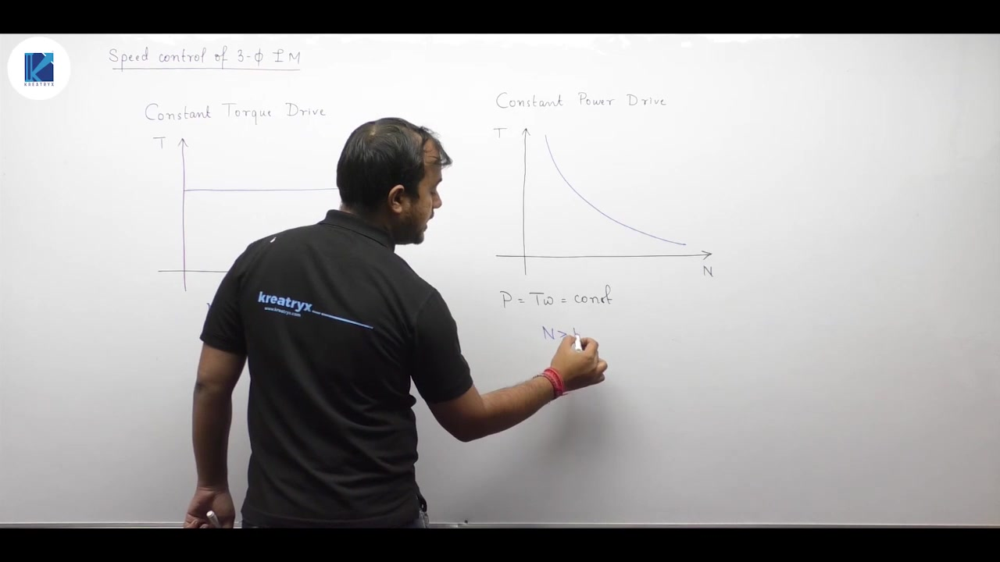

### Classification of Induction Motor Speed Control Methods

The rotor speed of an induction motor is governed by:
$$
N = N_s (1 - s)
$$
where synchronous speed is:
$$
N_s = \frac{120 f}{P}
$$
Speed control methods divide into two primary categories:

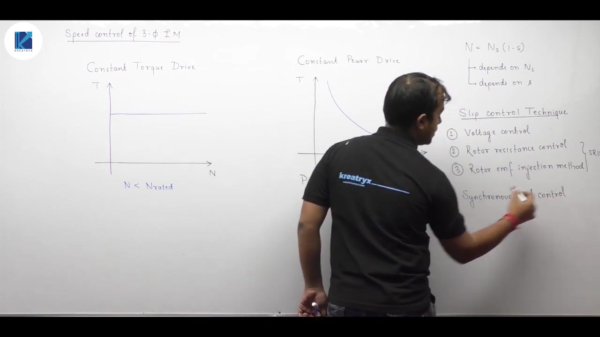

#### 1. Slip Control Methods (Varying $s$)
These methods change the operating slip while keeping synchronous speed $N_s$ constant:
- **Stator Voltage Control:** Applicable to both squirrel cage and slip ring motors.
- **Rotor Resistance Control:** Applicable exclusively to slip ring (wound rotor) motors.
- **Rotor EMF Injection Method:** Applicable exclusively to slip ring motors via slip rings.

#### 2. Synchronous Speed Control Methods (Varying $N_s$)
These methods change the synchronous speed of the rotating stator magnetic field:
- **Frequency Control ($v/f$ Control):** Adjusts supply frequency using power electronics inverters.
- **Pole Changing Method:** Altering effective stator poles via winding taps or separate windings.
- **Slip Power Recovery Schemes:** Recovering rotor slip power and returning it to the supply.

> [!info] Rotor Construction Dependency
> Squirrel cage rotors automatically form the same number of poles as the stator field. So pole-changing techniques work easily on squirrel cage machines. Wound rotors have fixed pole windings and cannot use pole-changing methods.

## Stator Voltage Control Fundamentals and Circuit Modeling
_(07:07 - 12:14)_

### Applicability of Pole-Changing Techniques

In squirrel cage motors, rotor poles are induced automatically by the rotating stator field. Changing stator poles automatically changes rotor poles. 

In wound rotor motors, the rotor has a fixed physical winding. Changing stator poles without altering rotor winding connections produces zero average torque. So pole-changing speed control is restricted to squirrel cage induction motors.

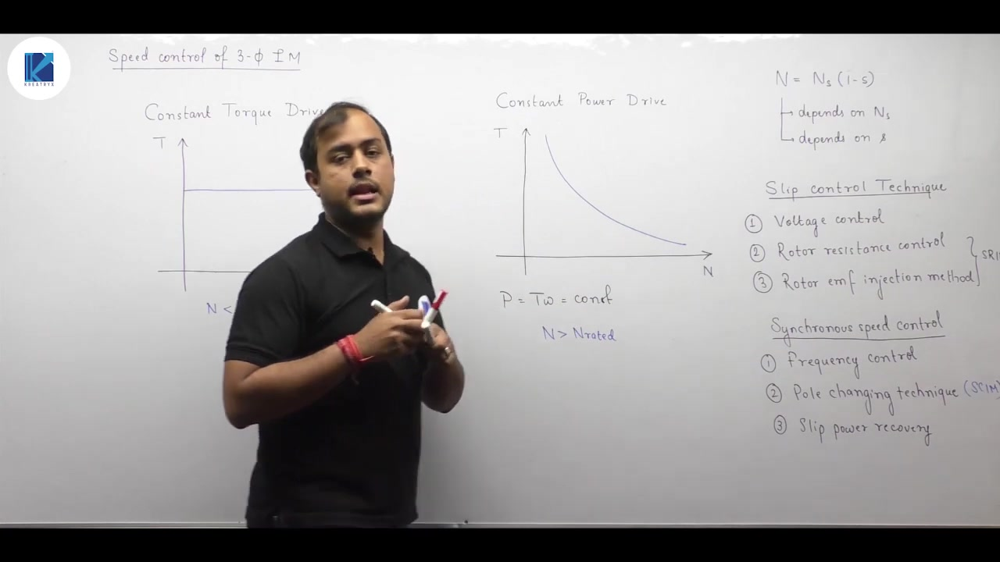

### Principle of Stator Voltage Control

Stator voltage control is a slip control method. The supply voltage applied to the stator terminals is varied to control motor speed. 

In industrial drives, load torque may vary with speed. For example:
- **Constant torque loads:** $T = \text{constant}$
- **Fan or blower loads:** $T \propto N^2$
- **Frictional or viscous loads:** $T \propto N$

To derive the basic relationships, we first consider a constant load torque.

### Equivalent Circuit Simplification at Low Slip

To analyze stator voltage control analytically, stator impedance is neglected ($R_1 \approx 0$, $X_1 \approx 0$). The stator terminal voltage $V_1$ applies directly across the magnetizing and rotor branches.

Under normal continuous operation, an induction motor runs close to synchronous speed ($N \approx N_s$). The operating slip is very small ($s \ll 1$). So:
$$
\frac{R_2'}{s} \gg X_2'
$$
The rotor circuit impedance is dominated by the effective resistance:
$$
Z_2' \approx \frac{R_2'}{s}
$$

### Rotor Current and Developed Torque Expressions

The stator-referred rotor current simplifies to:
$$
I_2' = \frac{V_1}{\sqrt{\left(\frac{R_2'}{s}\right)^2 + (X_2')^2}} \approx \frac{s V_1}{R_2'}
$$
The electromagnetic torque developed by the three-phase machine is:
$$
T = \frac{3}{\omega_s} (I_2')^2 \frac{R_2'}{s}
$$
Substituting the low-slip current expression yields:

> [!success] Low-Slip Torque Approximation
> $$
> T \approx \frac{3}{\omega_s} \frac{s V_1^2}{R_2'}
> $$

This fundamental relationship shows that at low operating slips, developed torque is directly proportional to operating slip $s$ and proportional to the square of stator voltage $V_1^2$.

## Stator Voltage Control Performance and Practical Drawbacks
_(12:19 - 19:30)_

### Constant Torque Operation and Sub-Base Speeds

For a constant torque load ($T = \text{constant}$), the low-slip torque equation requires:
$$
s V_1^2 = \text{constant}
$$
This yields an inverse relationship between slip and terminal voltage:
$$
s \propto \frac{1}{V_1^2}
$$
When terminal voltage $V_1$ is reduced, the operating slip $s$ must increase to sustain the load torque. Because shaft speed is $N = N_s (1 - s)$, an increase in slip reduces the rotor speed.

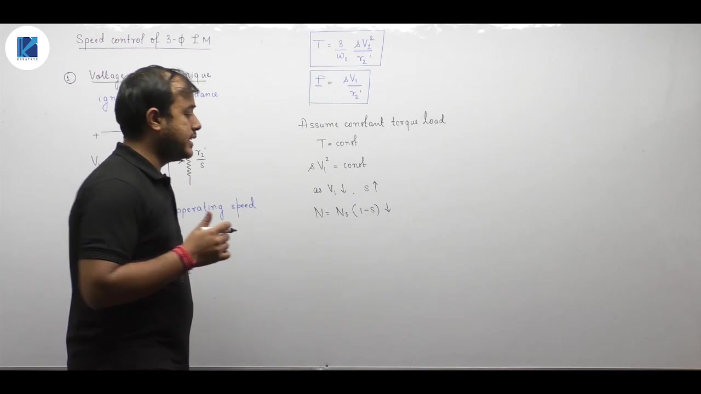

Terminal voltage cannot exceed rated voltage. Increasing voltage above rated limits saturates the magnetic core and destroys insulation. So stator voltage can only be reduced below rated values. 

> [!info] Operating Speed Range
> Stator voltage control yields speeds strictly below base speed. It cannot provide speeds above rated synchronous speed.

### Variable Load Profiles (Fan Loads)

In many fan, pump, or centrifugal compressor drives, load torque varies with the square of speed:
$$
T_L \propto N^2
$$
Equating developed motor torque to load torque yields:
$$
s V_1^2 \propto [N_s(1 - s)]^2
$$
Because synchronous speed $N_s = \frac{120 f}{P}$ remains constant, the ratio formulation between two operating states is:

> [!success] Fan Load Ratio Formula
> $$
> \frac{s_1 V_1^2}{s_2 V_2^2} = \left(\frac{N_1}{N_2}\right)^2 = \left(\frac{1 - s_1}{1 - s_2}\right)^2
> $$

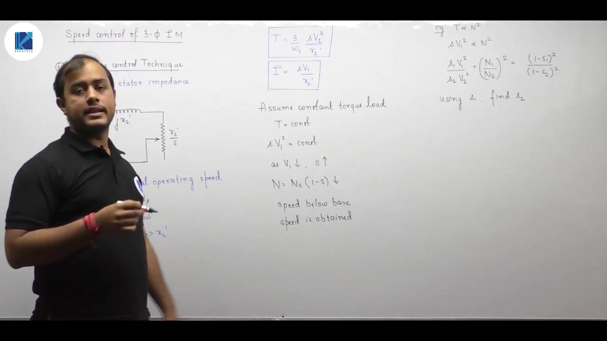

### Current Inversion and Overheating Limitations

For constant torque, the rotor current behavior is found by substituting $s \propto \frac{1}{V_1^2}$ into the current expression:
$$
I_2' \propto s V_1 \propto \left(\frac{1}{V_1^2}\right) V_1 = \frac{1}{V_1}
$$
As voltage $V_1$ decreases, the rotor and stator currents rise inversely with voltage. 

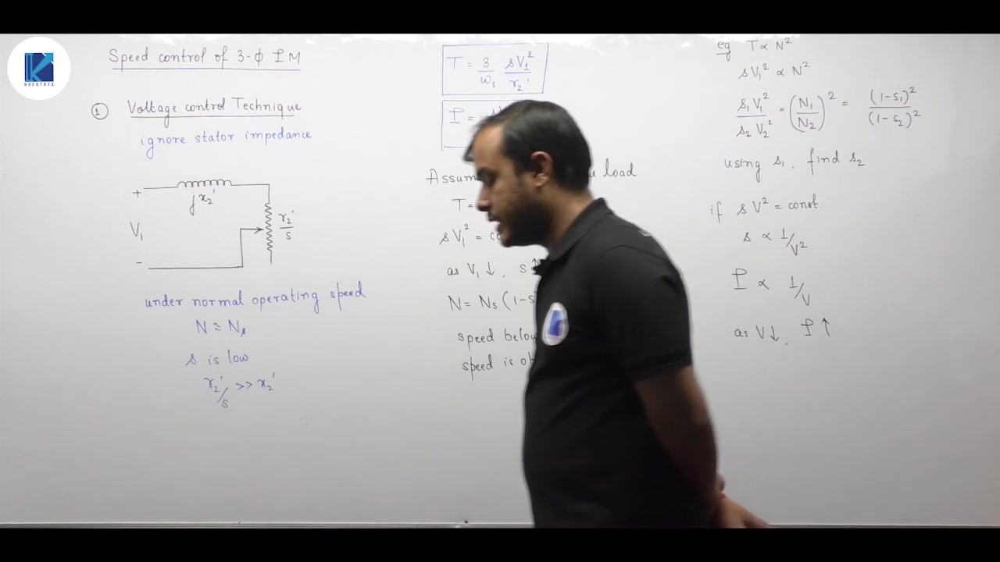

This creates severe practical drawbacks:
1. **Severe Stator and Rotor Heating:** The heat generated in the windings is $H = I^2 R t$. High currents create rapid temperature spikes that can melt winding insulation.
2. **Narrow Speed Range:** To prevent burnout, voltage cannot be reduced drastically. Practical speed reduction is limited to roughly $10\%$ to $15\%$.
3. **Short-Duty Operation Only:** The method is unsuitable for continuous duty at low speeds. It is used only for brief, intermittent speed adjustments.

## Rotor Resistance Control Principles and Mathematical Modeling
_(19:34 - 24:30)_

### Requirement for Slip Ring Construction

Rotor resistance control can only be applied to slip ring (wound rotor) induction motors. Squirrel cage rotors consist of permanently short-circuited solid bars and end rings. They offer no electrical access to add series external resistances.

In slip ring motors, the three-phase rotor winding terminals connect to external variable rheostats through carbon brushes and slip rings.

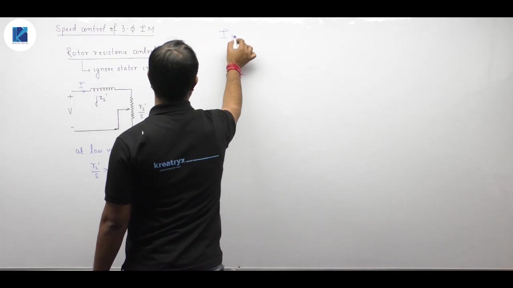

### Equivalent Circuit Under External Resistance

Neglecting stator impedance ($R_1 \approx 0, X_1 \approx 0$), the supply voltage $V_1$ applies directly across the rotor branch. When an external per-phase resistance $R_E$ is inserted into the rotor:

The stator-referred rotor circuit resistance becomes:
$$
R_{2,\text{total}}' = R_2' + R_E'
$$
where resistances are referred using effective turns:
$$
R_2' = R_2 \left(\frac{N_{e1}}{N_{e2}}\right)^2, \quad R_E' = R_E \left(\frac{N_{e1}}{N_{e2}}\right)^2
$$
Here $N_e$ is the effective number of turns ($N \times k_w$).

At low operating slips where $N \approx N_s$, the branch impedance is resistive:
$$
\frac{R_2' + R_E'}{s} \gg X_2'
$$
The torque equation simplifies to:
$$
T \approx \frac{3}{\omega_s} \frac{s V_1^2}{R_2' + R_E'}
$$

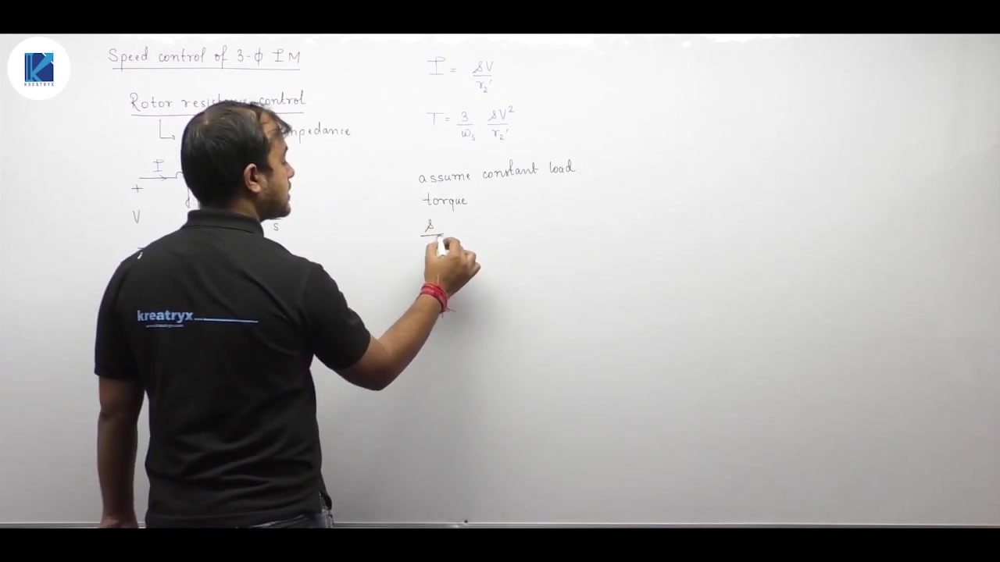

### Constant Torque Operation

For a constant load torque ($T = \text{constant}$):
$$
\frac{s}{R_2' + R_E'} = \text{constant}
$$
Equating initial operating conditions (subscript 1) to final conditions with added external resistance (subscript 2):
$$
\frac{s_1}{R_2'} = \frac{s_2}{R_2' + R_E'}
$$
Since the turns ratio term $\left(\frac{N_{e1}}{N_{e2}}\right)^2$ is common to all terms, it cancels completely:

> [!success] New Slip Under Constant Torque
> $$
> s_2 = s_1 \left(\frac{R_2 + R_E}{R_2}\right)
> $$

Because $R_2 + R_E > R_2$, the new operating slip $s_2$ is strictly greater than $s_1$. Higher slip means lower rotor speed ($N_2 < N_1$).

### Fan Load Formulation ($T \propto N^2$)

If the machine drives a fan or centrifugal pump, load torque varies with speed squared:
$$
T \propto N^2 \propto (1 - s)^2
$$
The slip equation becomes:

> [!example] Fan Load Slip Ratio
> $$
> \frac{s_1 / R_2'}{s_2 / (R_2' + R_E')} = \left(\frac{1 - s_1}{1 - s_2}\right)^2
> $$

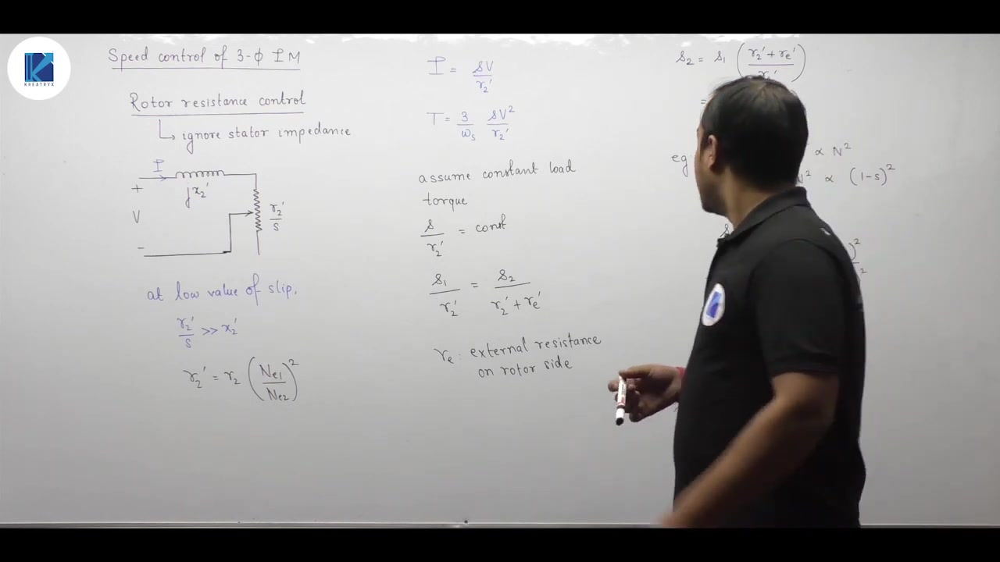

This formula allows exact calculation of the required rheostat value $R_E$ for any desired speed reduction under quadratic loads.

## Practical Limitations of Rotor Resistance Control
_(24:33 - 29:25)_

### Speed Reduction Below Base Speed

Adding external resistance $R_E$ increases the total rotor circuit resistance. For a constant torque load:
$$
s_2 = s_1 \left(1 + \frac{R_E}{R_2}\right)
$$
Because $R_E > 0$, the operating slip increases. The motor operating speed:
$$
N_2 = N_s (1 - s_2) < N_1
$$
always falls below the initial operating speed. Like stator voltage control, rotor resistance control only produces speeds below rated base speed.

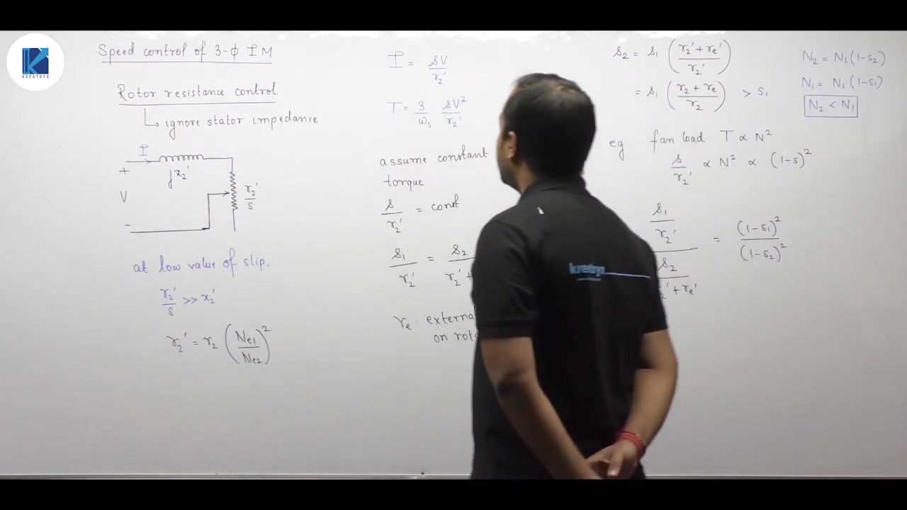

### Constant Current and Excessive Copper Losses

Under constant load torque, the ratio $\frac{s}{R_2 + R_E}$ remains constant. The rotor current magnitude:
$$
I_2' \approx \frac{s V_1}{R_2' + R_E'} = \text{constant}
$$
remains invariant with speed changes. 

However, total rotor circuit resistance increases significantly. The rotor copper losses surge:
$$
P_{\text{cu}} = 3 I_2^2 (R_2 + R_E)
$$
All electrical power converted to heat inside external rheostats represents direct energy waste. The machine's operating efficiency drops sharply in direct proportion to speed reduction:
$$
\eta \approx (1 - s) \propto N
$$

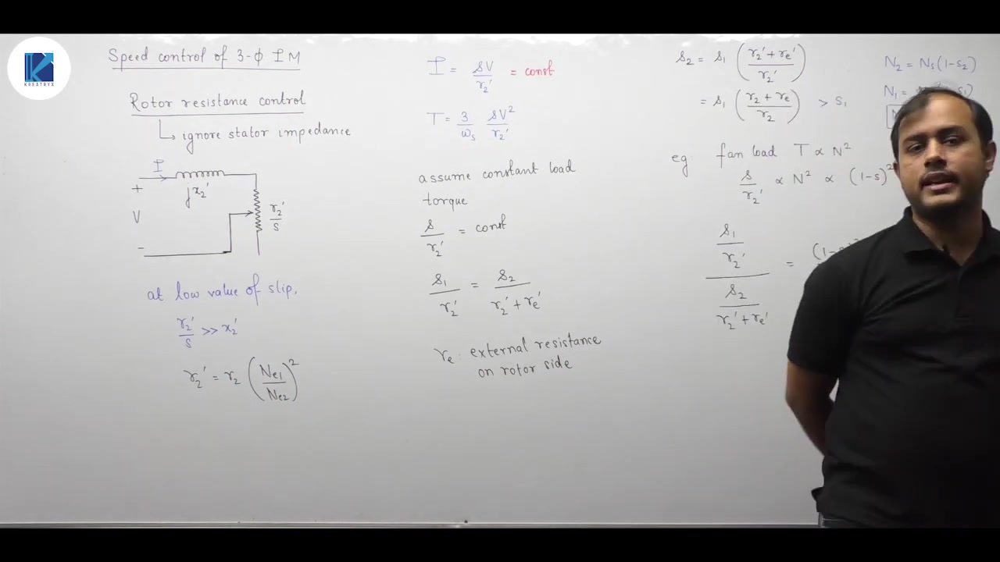

### Poor Speed Regulation and Thermal Restrictions

Rotor resistance control suffers from several major practical drawbacks:

1. **Large Speed Fluctuation:** The speed regulation of an electric motor is:
   $$
   \text{Speed Regulation} = \frac{N_{\text{NL}} - N_{\text{FL}}}{N_{\text{FL}}}
   $$
   Adding large rotor resistance flattens the torque-speed curve. Small variations in mechanical load cause large, unacceptable fluctuations in shaft speed.

2. **Severe Overheating:** The massive $I^2 R t$ thermal dissipation inside the external resistances prevents long-term continuous speed control. It is limited to cranes, hoists, and intermittent duty.

3. **Narrow Practical Range:** Achieving wide speed variations requires enormous rheostats. The associated heat dissipation becomes uneconomic and unmanageable.

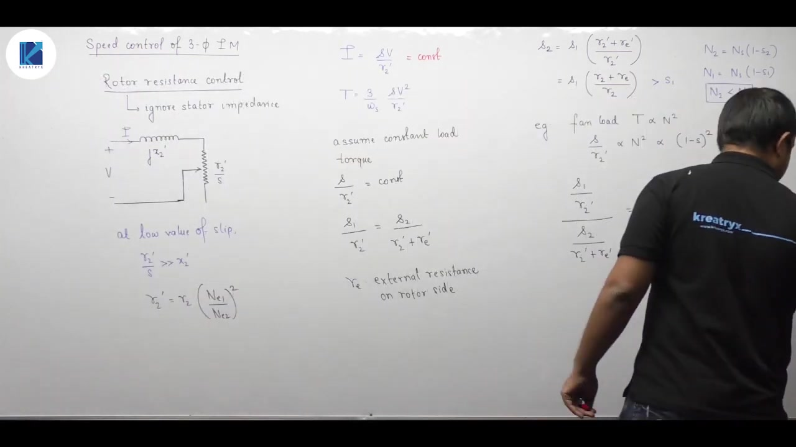

> [!info] Summary of Rotor Resistance Control
> Rotor resistance control provides speeds strictly below base speed. Current remains constant under constant torque, but rotor copper loss increases rapidly. This causes poor efficiency, severe overheating, and large speed regulation.

## Rotor EMF Injection Method and Equivalent Circuit Formulation
_(29:27 - 34:24)_

### Physical Concept and Frequency Synchronization

The rotor EMF injection method controls induction motor speed by introducing an external alternating voltage $E_i$ directly into the rotor circuit via slip rings. It is applicable exclusively to wound rotor induction machines.

In an induction machine running at slip $s$, the fundamental frequency of the mutually induced rotor EMF $s E_2$ is:
$$
f_r = s f
$$
To superimpose or subtract two alternating potentials vectorially, both sources must share the exact same frequency. 

> [!info] Frequency Requirement
> The injected external voltage $E_i$ must have a frequency strictly equal to the rotor slip frequency ($f_{\text{inj}} = s f$).

### Equivalent Rotor Circuit with Injected EMF

The actual per-phase rotor circuit consists of:
- Mutually induced rotor EMF: $s E_2$
- Injected external EMF: $E_i$
- Internal rotor resistance: $R_2$
- Rotor leakage reactance: $j s X_2$

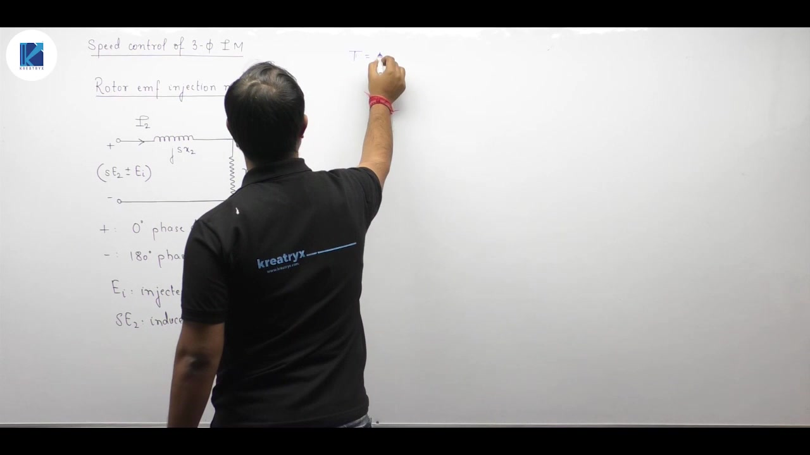

The net effective rotor driving EMF depends on the phase angle $\alpha$ between $s E_2$ and $E_i$:
- **In-Phase ($\alpha = 0^\circ$):** The sources add arithmetically ($E_{\text{net}} = s E_2 + E_i$).
- **Phase Opposition ($\alpha = 180^\circ$):** The sources oppose each other ($E_{\text{net}} = s E_2 - E_i$).
- **Arbitrary Phase ($\alpha$):** Phasor addition is required ($\vec{E}_{\text{net}} = s \vec{E}_2 + \vec{E}_i$).

### Torque Invariance and Constant Torque Condition

In an induction motor, electromagnetic torque can be evaluated from the air gap power $P_g$:
$$
T = \frac{P_g}{\omega_s} = \frac{3}{\omega_s} E_2 I_2 \cos\theta_2
$$
Here $E_2$ is the induced rotor EMF at standstill, evaluated from the stator's stationary reference frame. The stationary frame captures both rotor copper losses and electromechanical power conversion.

Because supply voltage and frequency are constant, $E_2$ and $\omega_s$ remain constant. For a constant load torque ($T = \text{constant}$):

> [!success] Torque Invariance Condition
> $$
> I_2 \cos\theta_2 = \text{constant}
> $$

Substituting the rotor power factor $\cos\theta_2 = \frac{R_2}{Z_2}$ gives the exact governing relationship:
$$
I_2 \frac{R_2}{Z_2} = \text{constant}
$$
This condition governs the calculation of operating slip under any injected rotor EMF.

## Slip Determination and Sub-Synchronous versus Super-Synchronous Modes
_(34:27 - 41:18)_

### Derivation of Operating Slip Under Injected EMF

To find the new slip $s_2$ with injected EMF, we apply the constant torque constraint:
$$
I_{2,1} \cos\theta_{2,1} = I_{2,2} \cos\theta_{2,2}
$$

#### 1. Initial State (No Injected EMF: $E_i = 0$, Slip $s_1$)
The rotor current and power factor are:
$$
I_{2,1} = \frac{s_1 E_2}{\sqrt{R_2^2 + (s_1 X_2)^2}}
$$
$$
\cos\theta_{2,1} = \frac{R_2}{\sqrt{R_2^2 + (s_1 X_2)^2}}
$$
Multiplying both terms yields:
$$
I_{2,1} \cos\theta_{2,1} = \frac{s_1 E_2 R_2}{R_2^2 + (s_1 X_2)^2}
$$

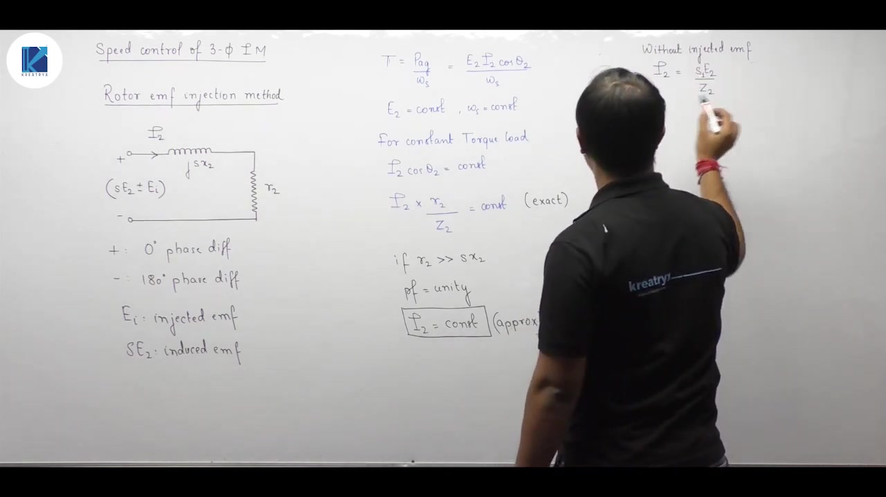

#### 2. Modified State (With Injected EMF $E_i$, New Slip $s_2$)
The net driving voltage in the rotor circuit is $|s_2 E_2 \pm E_i|$. The new rotor current is:
$$
I_{2,2} = \frac{|s_2 E_2 \pm E_i|}{\sqrt{R_2^2 + (s_2 X_2)^2}}
$$
The rotor power factor is:
$$
\cos\theta_{2,2} = \frac{R_2}{\sqrt{R_2^2 + (s_2 X_2)^2}}
$$
Equating the two torque expressions:

> [!success] Exact Injected EMF Governing Equation
> $$
> \frac{s_1 E_2}{R_2^2 + (s_1 X_2)^2} = \frac{s_2 E_2 \pm E_i}{R_2^2 + (s_2 X_2)^2}
> $$

Given $s_1, E_2, R_2, X_2$, and $E_i$, this algebraic equation yields the new operating slip $s_2$.

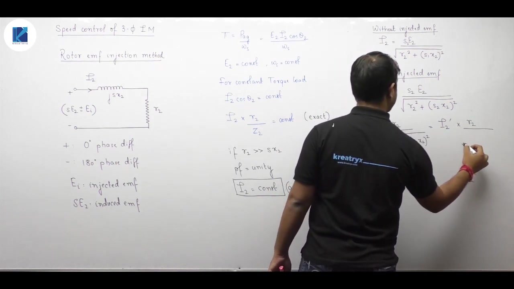

### Operating Speed Regimes

Unlike stator voltage control and rotor resistance control, this method can run both below and above synchronous speed.

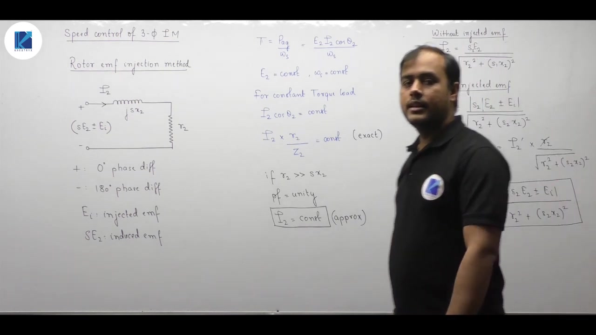

1. **Sub-Synchronous Speed ($N < N_s$):**
   The injected EMF is in phase opposition ($180^\circ$ phase shift) with the induced EMF ($s E_2 - E_i$). The net driving voltage drops. The rotor must slow down, increasing slip ($s_2 > s_1$) to maintain torque.

2. **Super-Synchronous Speed ($N > N_s$):**
   The injected EMF is in phase ($0^\circ$ phase shift) with the induced EMF ($s E_2 + E_i$). The net driving voltage increases. The rotor accelerates above synchronous speed, driving slip into negative values ($s < 0$).

> [!info] Phase Angle Role
> Whether the motor operates in sub-synchronous or super-synchronous speed depends entirely on the phase of the injected EMF relative to the induced EMF.

---

## Summary and Key Takeaways

- Motor drives run as constant torque drives below base speed with $T = \text{constant}$, and as constant power drives above base speed where torque falls as $T \propto \frac{1}{N}$.
- At low slips ($s \ll 1$), induction motor torque approximates as $T \approx \frac{3}{\omega_s} \frac{s V_1^2}{R_2'}$.
- For a constant torque load, stator voltage control requires $s V_1^2 = \text{constant}$, which causes stator current to rise inversely as $I \propto \frac{1}{V_1}$, restricting voltage control to narrow ranges and short-duty cycles.
- For fan loads under voltage control, speed obeys the ratio $\frac{s_1 V_1^2}{s_2 V_2^2} = \left(\frac{1 - s_1}{1 - s_2}\right)^2$.
- In slip ring induction motors, adding external rotor resistance $R_E$ shifts operating slip to $s_2 = s_1 \left(\frac{R_2 + R_E}{R_2}\right)$, but causes large $I^2 R$ copper losses, lowered efficiency, and degraded speed regulation.
- The rotor EMF injection method requires the injected voltage frequency to strictly equal the rotor slip frequency ($f_{\text{inj}} = s f$).
- Under rotor EMF injection with constant torque, the operating point satisfies $I_2 \cos\theta_2 = \text{constant}$, enabling sub-synchronous operation when injected in phase opposition and super-synchronous operation when injected in phase.

---

[← Lec 150: Starting of SRIM](Lecture_150_Starting_of_SRIM.md) | [🏠 Index](00_yt_study_guide.md) | [Lec 152: Speed Control of Induction Motor 2 →](Lecture_152_Speed_Control_of_Induction_Motor_2.md)
