[← Lec 151: Speed Control of Induction Motor 1](Lecture_151_Speed_Control_of_Induction_Motor_1.md) | [🏠 Index](00_yt_study_guide.md) | [Lec 153: Speed Control of IM 1 →](Lecture_153_Speed_Control_of_IM_1.md)

---

# Electrical Machines | Lec 108 | Speed Control of Induction Motor-2 | GATE/ESE Electrical Engineering

- **Source**: https://www.youtube.com/watch?v=zF5WSpRLA_Q
- **Duration**: 00:43:42
- **Compiled**: 2026-09-23

---

## Overview

This lecture examines synchronous speed control methods for three-phase induction motors. It focuses on variable frequency control below and above base speed using power electronic inverters. The lecture details the torque-speed characteristics under constant $V/f$ control, drive capability regions, and low-frequency voltage boost. It also covers discrete speed adjustment through consequent pole changing in squirrel cage machines. Finally, it analyzes slip power recovery through cumulative and differential cascading of induction and synchronous machines.

## Contents

- [[#Introduction to Synchronous Speed Control and Frequency Control|Introduction to Synchronous Speed Control and Frequency Control]]
- [[#Constant V/f Control: Inverter Implementation and Torque Characteristics|Constant V/f Control: Inverter Implementation and Torque Characteristics]]
- [[#Load Torque Analysis and Operation Above Base Speed|Load Torque Analysis and Operation Above Base Speed]]
- [[#Torque Curves Above Base Speed and Drive Capability Characteristics|Torque Curves Above Base Speed and Drive Capability Characteristics]]
- [[#Voltage vs Frequency Profile and Low Frequency Voltage Boost|Voltage vs Frequency Profile and Low Frequency Voltage Boost]]
- [[#Pole Changing Technique and Consequent Poles|Pole Changing Technique and Consequent Poles]]
- [[#Pole Switching Operation and Slip Power Recovery Fundamentals|Pole Switching Operation and Slip Power Recovery Fundamentals]]
- [[#Cascading of Induction Motors: Cumulative Cascading|Cascading of Induction Motors: Cumulative Cascading]]
- [[#Differential Cascading and Cascading with Synchronous Machines|Differential Cascading and Cascading with Synchronous Machines]]

---

## Introduction to Synchronous Speed Control and Frequency Control
_(00:12 - 05:06)_

### Review of Slip Control Techniques

Induction motor speed control falls into two broad categories. These are slip control and synchronous speed control.

The previous lecture covered three primary slip control methods:
1. **Stator Voltage Control**: Reducing stator voltage increases slip for a given load torque. But current and losses rise, which limits this method to short duty cycles.
2. **Rotor Resistance Control**: Adding external resistance into a wound rotor increases slip and reduces speed. However, rotor copper loss increases directly with slip, which lowers efficiency.
3. **Rotor EMF Injection Method**: Injecting a voltage into the rotor circuit at slip frequency allows speed control both below and above synchronous speed while keeping $I_2 \cos\theta_2$ constant for constant torque operation.

### Principle of Synchronous Speed Control

Rotor speed relates to synchronous speed and slip through:

$$N = N_s (1 - s)$$

Synchronous speed depends directly on supply frequency and pole count:

$$N_s = \frac{120 f}{P}$$

By controlling $N_s$, we control motor speed without forcing operation at poor efficiency or high slip.

### Frequency Control Fundamentals

Frequency control is the most versatile and widely used speed control technique for induction motors. It provides speed regulation across a broad operating span.

Varying stator frequency modifies synchronous speed directly:
- If frequency decreases below rated frequency ($f < f_{\text{rated}}$), synchronous speed drops. This gives speeds below base speed.
- If frequency increases above rated frequency ($f > f_{\text{rated}}$), synchronous speed rises. This gives speeds above base speed.

### The Need for Constant V/f Below Base Speed

The air gap magnetic flux per pole depends on the ratio of induced voltage to supply frequency:

$$\Phi \propto \frac{V}{f}$$

When operating below base speed ($f < f_{\text{rated}}$), reducing frequency alone would cause flux $\Phi$ to rise sharply. This drives the iron core into deep magnetic saturation. Saturation causes excessive magnetizing current, severe core losses, and distortion.

> [!info] Constant Flux Criterion
> To maintain rated core flux and prevent saturation below base speed, stator terminal voltage $V$ must decrease in direct proportion to frequency $f$:
>
> $$\frac{V}{f} = \text{constant}$$

So below base speed, every decrease in frequency requires a matching proportional decrease in terminal voltage.

## Constant V/f Control: Inverter Implementation and Torque Characteristics
_(05:06 - 09:45)_

### Inverter Implementation with PWM Control

To vary both voltage and frequency simultaneously, modern drives use a three-phase power electronics inverter.

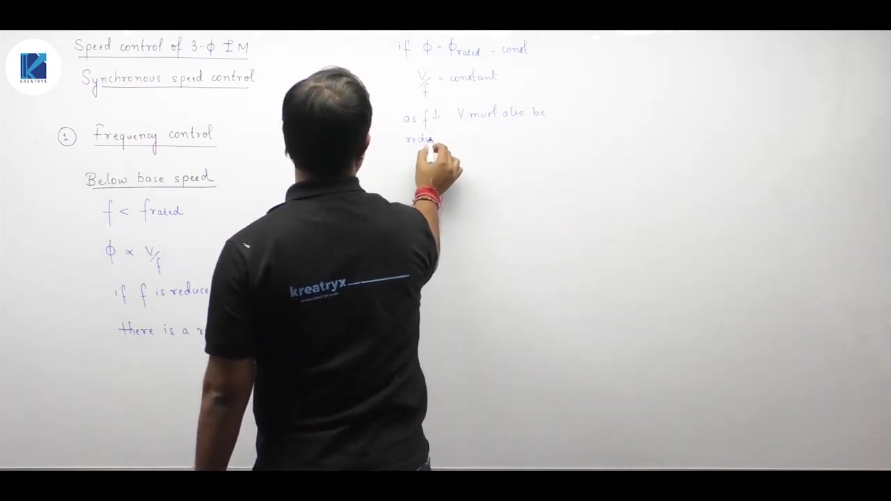

Adjusting the switching period of the semiconductor devices varies the fundamental frequency $f$. To adjust the magnitude of the stator terminal voltage $V$, pulse width modulation (PWM) is applied. By adjusting the modulation index, the inverter maintains the desired $V/f$ ratio across the speed range.

### Derivation of Torque Equations under Constant V/f

Let us analyze how machine parameters and torques behave when $V/f$ is held constant.

The slip at maximum torque is:

$$s_{mT} = \frac{R_2}{X_2} = \frac{R_2}{2\pi f L_2} \propto \frac{1}{f}$$

As frequency decreases, $s_{mT}$ increases inversely with frequency.

Meanwhile, synchronous speed varies directly with frequency:

$$N_s = \frac{120 f}{P} \propto f$$

Next, examine the maximum electromagnetic torque:

$$T_{\max} = \frac{3}{2 \omega_s} \frac{V_1^2}{2 X_2}$$

Here $\omega_s \propto f$ and $X_2 \propto f$. Substituting these proportionalities:

$$T_{\max} \propto \frac{V_1^2}{f \cdot f} = \left(\frac{V_1}{f}\right)^2$$

> [!success] Invariance of Maximum Torque
> Because $V/f$ is maintained constant, the peak breakdown torque remains unchanged at all operating frequencies below base speed:
>
> $$T_{\max} = \text{constant}$$

Now examine starting torque. At standstill ($s = 1$), assuming $R_2 \ll X_2$:

$$T_{st} \approx \frac{3}{\omega_s} \frac{V_1^2 R_2}{X_2^2}$$

The denominator contains $\omega_s \propto f$ and $X_2^2 \propto f^2$, which together form an $f^3$ term:

$$T_{st} \propto \frac{V_1^2}{f \cdot f^2} = \left(\frac{V_1}{f}\right)^2 \frac{1}{f}$$

Since $V_1/f$ is constant, this reduces to:

$$T_{st} \propto \frac{1}{f}$$

So as frequency decreases, the starting torque increases.

### Torque-Speed Characteristics

As frequency drops from $f_1$ to $f_2$ and then to $f_3$ (where $f_1 > f_2 > f_3$):
1. Synchronous speed shifts leftward: $N_{s3} < N_{s2} < N_{s1}$.
2. Maximum torque stays constant: $T_{\max1} = T_{\max2} = T_{\max3}$.
3. Starting torque increases: $T_{st3} > T_{st2} > T_{st1}$.

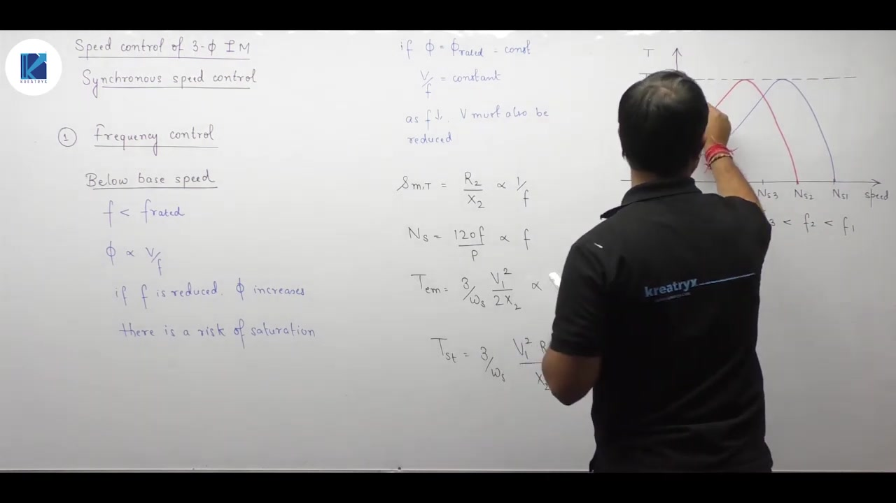

The stable operating zones of these curves run parallel to each other. This parallelism gives excellent speed regulation across the entire sub-base speed range.

## Load Torque Analysis and Operation Above Base Speed
_(09:47 - 14:23)_

### Slip Speed Invariance under Constant Torque Load

In the low slip stable region, the electromagnetic torque is:

$$T = \frac{3}{\omega_s} \frac{s V_1^2}{R_2'}$$

We can express slip as $s = \frac{\omega_s - \omega_r}{\omega_s}$. Substituting this into the torque relation gives:

$$T = \frac{3}{\omega_s^2} \frac{(\omega_s - \omega_r) V_1^2}{R_2'}$$

Since $\omega_s$ is proportional to supply frequency $f$:

$$T \propto \left(\frac{V_1}{f}\right)^2 (\omega_s - \omega_r)$$

Under constant $V/f$ control below base speed, the ratio $V_1/f$ is constant. If the driven mechanical load also demands a constant torque ($T = \text{constant}$), then:

$$\omega_s - \omega_r = \text{constant}$$

Expressed in revolutions per minute:

$$N_s - N_r = \text{constant}$$

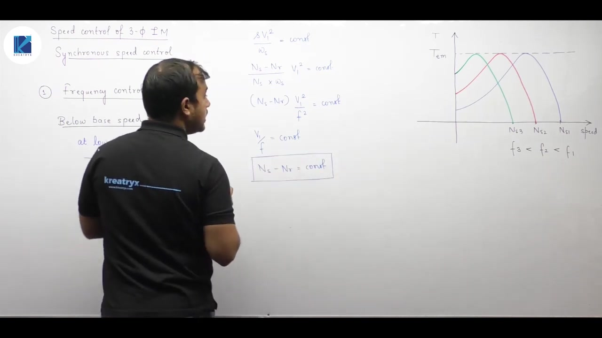

> [!success] Constant Slip Speed Rule
> For any constant torque load driven below base speed under constant $V/f$ control, the slip speed $N_s - N_r$ remains strictly constant.

> [!example] Numerical Illustration
> Consider a 4-pole 50 Hz motor with $N_s = 1500\text{ rpm}$ running at $N_r = 1450\text{ rpm}$. The slip speed is:
>
> $$N_s - N_r = 1500 - 1450 = 50\text{ rpm}$$
>
> If frequency is reduced to 40 Hz:
>
> $$N_s' = \frac{120 \times 40}{4} = 1200\text{ rpm}$$
>
> Because slip speed remains 50 rpm for constant load torque:
>
> $$N_r' = N_s' - 50 = 1200 - 50 = 1150\text{ rpm}$$

### Operation Above Base Speed ($f > f_{\text{rated}}$)

To drive the motor above base speed, supply frequency must be increased beyond rated frequency.

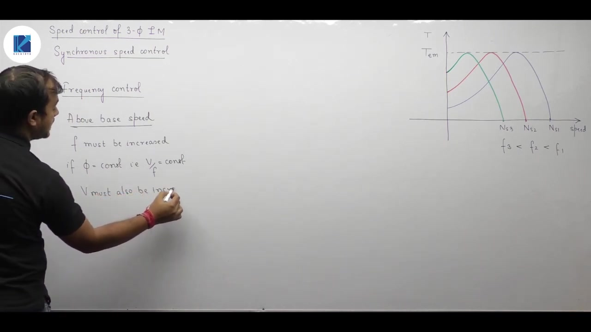

If we attempted to maintain constant $V/f$, terminal voltage $V$ would have to rise above rated voltage. But terminal voltage cannot exceed rated voltage without exceeding stator insulation breakdown limits.

So above base speed:
- Frequency increases: $f > f_{\text{rated}}$
- Voltage stays fixed at rated value: $V = V_{\text{rated}} = \text{constant}$

### Breakdown Torque and Field Weakening Above Base Speed

Because voltage is clamped while frequency increases, the air gap flux weakens:

$$\Phi \propto \frac{V_{\text{rated}}}{f} \propto \frac{1}{f}$$

Let us examine the resulting maximum torque:

$$T_{\max} = \frac{3}{2 \omega_s} \frac{V_1^2}{2 X_2}$$

Here $V_1$ is constant, while $\omega_s \propto f$ and $X_2 \propto f$:

$$T_{\max} \propto \frac{1}{f \cdot f} = \frac{1}{f^2}$$

So breakdown torque drops inversely with the square of frequency in the field-weakening region.

## Torque Curves Above Base Speed and Drive Capability Characteristics
_(14:27 - 19:20)_

### Starting Torque and Breakdown Torque Above Base Speed

Let us analyze machine torques when frequency is increased above base speed ($f > f_{\text{rated}}$) with terminal voltage held constant at $V_{\text{rated}}$.

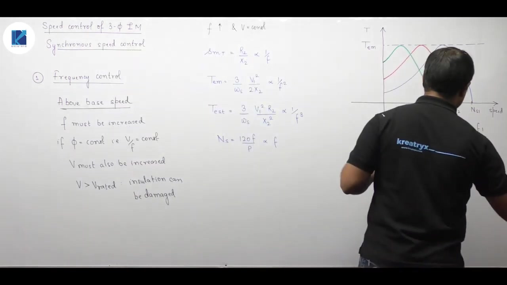

The starting torque at standstill is:

$$T_{st} \approx \frac{3}{\omega_s} \frac{V_{\text{rated}}^2 R_2}{X_2^2}$$

Here $\omega_s \propto f$ and $X_2^2 \propto f^2$. Because $V_{\text{rated}}$ is fixed:

$$T_{st} \propto \frac{1}{f \cdot f^2} = \frac{1}{f^3}$$

The maximum torque is:

$$T_{\max} \propto \frac{V_{\text{rated}}^2}{\omega_s X_2} \propto \frac{1}{f^2}$$

So as frequency increases above rated value:
1. Synchronous speed increases: $N_s \propto f$.
2. Breakdown torque decreases rapidly: $T_{\max} \propto 1/f^2$.
3. Starting torque collapses even faster: $T_{st} \propto 1/f^3$.

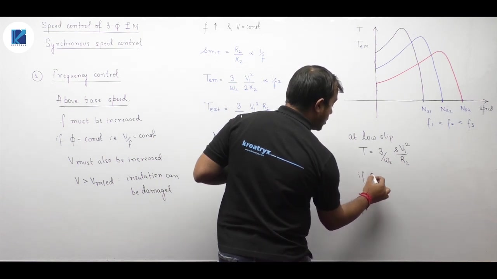

### Load Torque Response Above Base Speed

In the low slip linear zone, torque is:

$$T = \frac{3}{\omega_s} \frac{s V_{\text{rated}}^2}{R_2'}$$

Because $V_{\text{rated}}$ and $R_2'$ are constant:

$$T \propto \frac{s}{\omega_s} \propto \frac{s}{f}$$

If the motor drives a constant torque load ($T = \text{constant}$):

$$\frac{s}{f} = \text{constant} \implies s \propto f$$

> [!success] Slip Variation Above Base Speed
> For a constant torque load operated above base speed:
>
> $$\frac{s_1}{s_2} = \frac{f_1}{f_2}$$

Do not assume slip remains fixed when frequency changes. The load torque characteristic determines how slip shifts.

### Constant Torque and Constant Power Drive Regions

Combining both operating zones yields the complete drive capability profile:

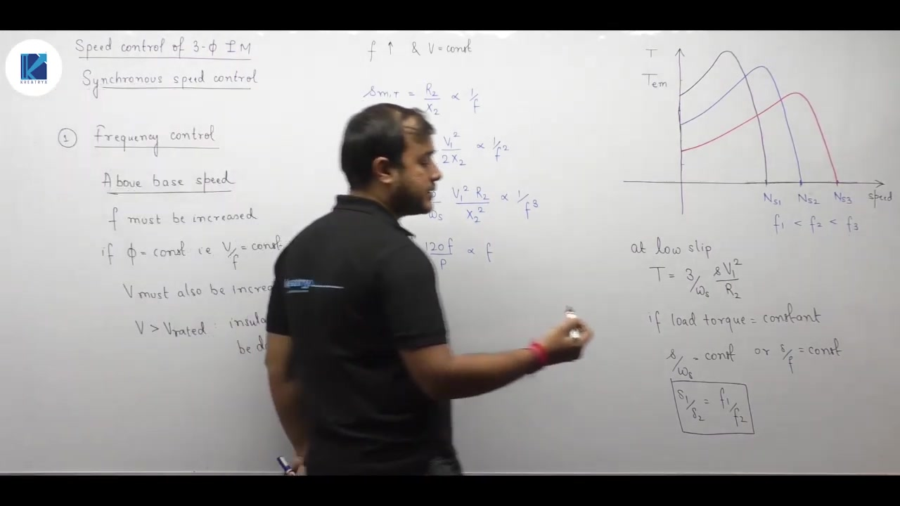

1. **Below Base Speed ($0 \le N \le N_{\text{base}}$)**:
   - $V/f = \text{constant}$, core flux is constant.
   - Motor operates as a **Constant Torque Drive**.
   - Rated torque capability is flat, while maximum power capability rises linearly: $P = T \omega_m \propto N$.

2. **Above Base Speed ($N > N_{\text{base}}$)**:
   - $V = V_{\text{rated}}$, flux weakens as $1/f$.
   - Motor operates as a **Constant Power Drive**.
   - Power capability remains capped at rated power, while available torque falls hyperbolically: $T \propto 1/N$.

## Voltage vs Frequency Profile and Low Frequency Voltage Boost
_(19:20 - 24:04)_

### Ideal Voltage vs Frequency Characteristic

When combining sub-base and supra-base speed ranges, the theoretical relationship between stator terminal voltage $V$ and frequency $f$ has two distinct zones:

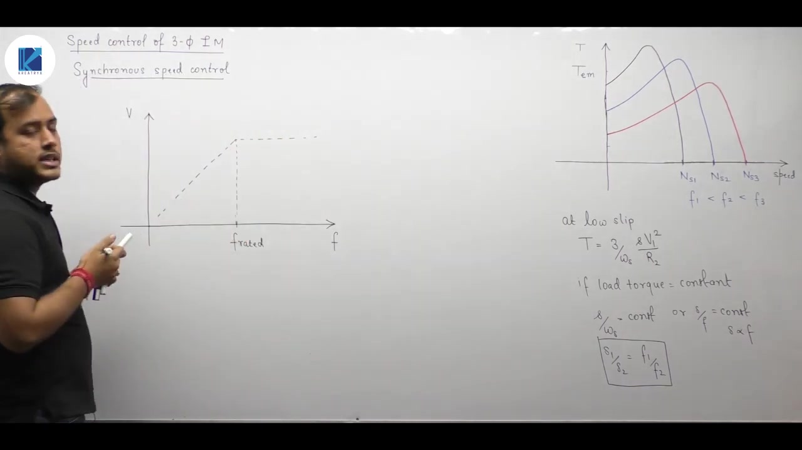

1. For $f \le f_{\text{rated}}$: $V \propto f$, producing a straight line passing through the origin.
2. For $f > f_{\text{rated}}$: $V = V_{\text{rated}} = \text{constant}$, giving a horizontal flat line.

### Low Frequency Stator Resistance Drop

In an actual motor, the air gap core flux depends on the induced air gap back EMF $E_1$, not terminal voltage $V_1$:

$$E_1 = 4.44 f N_1 \Phi_m k_{w1} \implies \Phi_m \propto \frac{E_1}{f}$$

The stator terminal voltage differs from induced EMF by the series stator impedance drop:

$$V_1 = E_1 + I_1 (R_1 + j X_1)$$

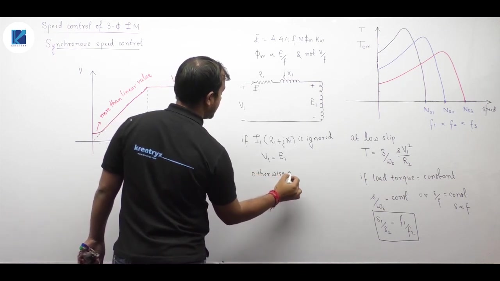

At typical rated frequencies, the inductive reactance $X_1$ dominates, and the drop across $R_1$ is small relative to $V_1$. So $E_1 \approx V_1$.

However, at very low supply frequencies:
- Reactance $X_1 = 2\pi f L_1$ approaches zero.
- Stator resistance $R_1$ remains constant regardless of frequency.
- Supply voltage $V_1$ is reduced to a very small value.

Under these conditions, the voltage drop across $R_1$ consumes a large fraction of the applied terminal voltage $V_1$. As a result:

$$E_1 < V_1 \implies \frac{E_1}{f} < \frac{V_1}{f}$$

If $V_1/f$ is maintained strictly linear down toward zero frequency, $E_1/f$ drops significantly. The core flux $\Phi_m$ decreases, weakening the motor torque severely at low speeds.

### Low Frequency Voltage Boost

To keep the core flux $\Phi_m$ at its rated value at low speeds, the terminal voltage must exceed the value predicted by pure proportionality.

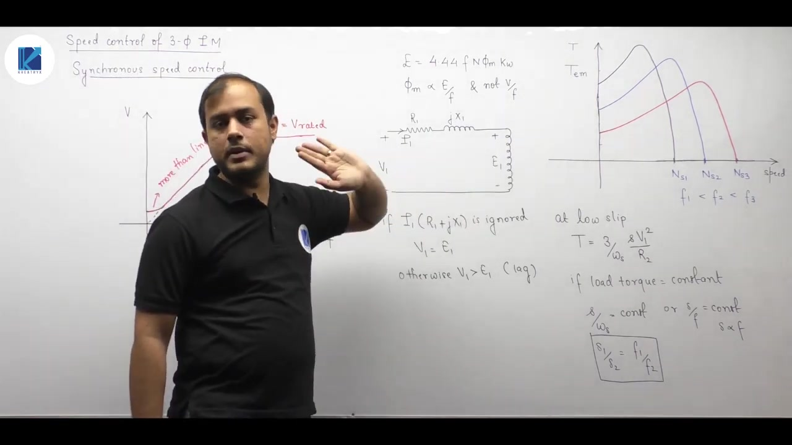

> [!info] Voltage Boost Requirement
> At low stator frequencies, an additional voltage offset (stator resistance compensation or voltage boost) must be added to $V_1$:
>
> $$V_1 = I_1 R_1 + k f$$
>
> This boost offsets the internal resistive drop $I_1 R_1$, keeping $E_1/f$ constant and preserving full rated breakdown torque during low-speed operation.

## Pole Changing Technique and Consequent Poles
_(24:05 - 28:43)_

### Applicability to Squirrel Cage Induction Motors

Synchronous speed depends inversely on the number of stator magnetic poles:

$$N_s = \frac{120 f}{P}$$

The pole changing technique alters $P$ to obtain discrete operating speeds.

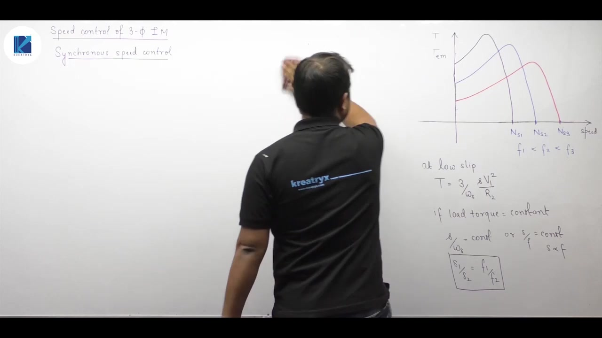

> [!info] Rotor Restriction
> Pole changing applies only to squirrel cage induction motors (SCIM). In a cage rotor, closed conductive bars and end rings adapt naturally to whatever pole count the stator magnetic field establishes.

In contrast, a wound rotor induction motor (SRIM) has a three-phase winding wound for an explicit pole number. If stator poles change, the rotor fails to produce unvarying unidirectional torque unless it is physically rewound for the same pole count.

### Principle of Consequent Poles

Poles are changed by reconnecting stator winding coil groups. This is the consequent pole technique.

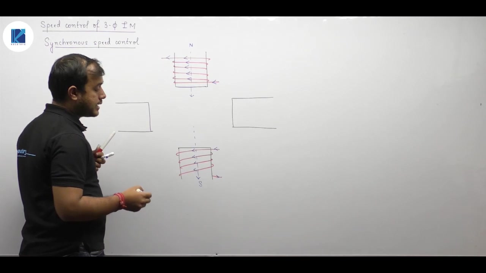

Consider a magnetic structure with four salient physical cores:
1. **Series Aiding Connection ($P = 2$)**:
   - Current flows through two opposite coils such that one coil drives magnetic flux radially inward while the second coil drives flux outward.
   - One coil acts as a North pole. The second coil acts as a South pole.
   - The total active pole count is two ($P = 2$).

2. **Series Opposing Connection ($P = 4$)**:
   - Current in one coil group is reversed.
   - Now both wound coils drive flux outward, making both of them North poles.
   - Magnetic flux lines must form closed continuous loops. So flux returning into the intermediate unwound core sections forces those sections to act as South poles.
   - These intermediate poles are called consequent poles.
   - As a result, four magnetic poles ($P = 4$) appear around the air gap.

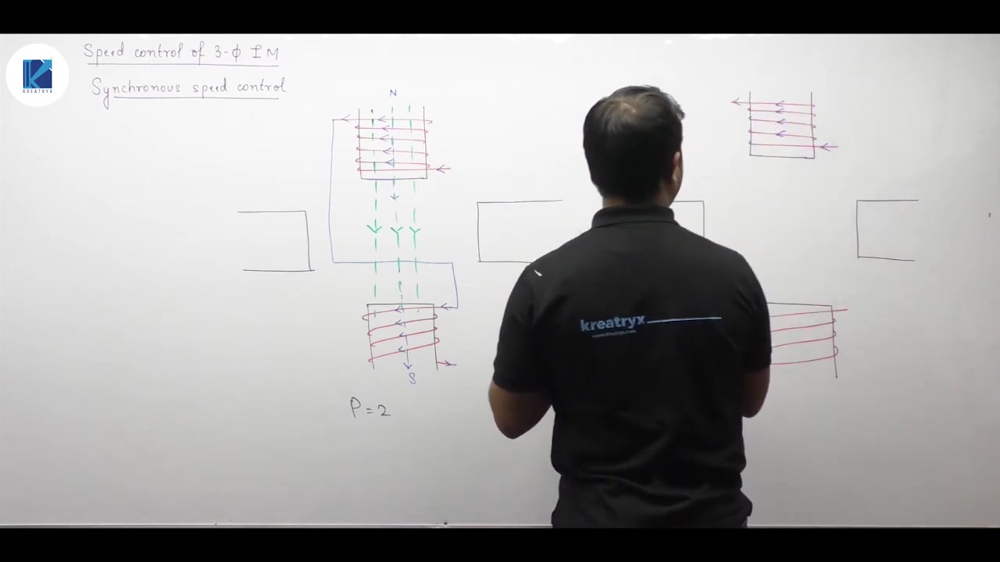

Simply reversing the connection of half of the stator winding doubles the pole count. This changes the pole count by a factor of 2:1.

## Pole Switching Operation and Slip Power Recovery Fundamentals
_(28:43 - 33:41)_

### Discrete Speed Steps with Pole Changing

By changing stator winding terminal interconnections, the effective pole number shifts by an exact factor of 2.

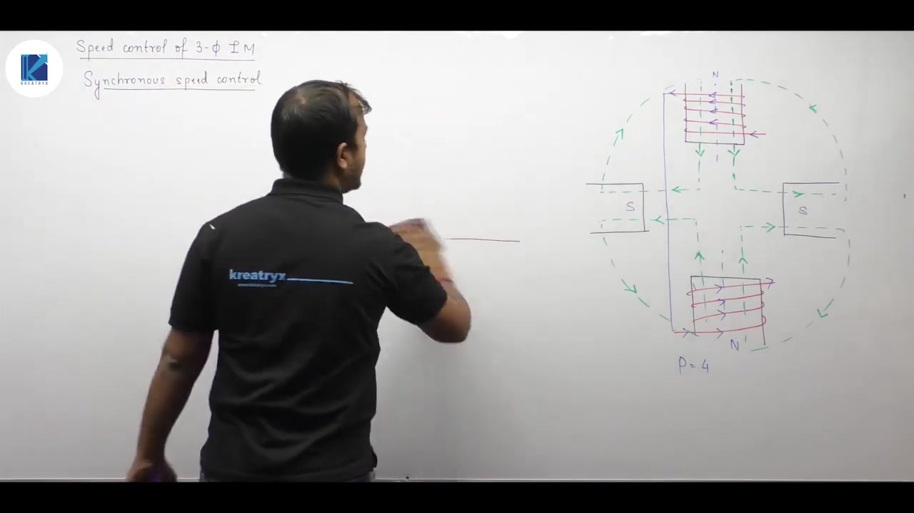

When the machine switches from a 2-pole connection to a 4-pole connection on a 50 Hz supply:
- For $P = 2$: $N_s = \frac{120 \times 50}{2} = 3000\text{ rpm}$
- For $P = 4$: $N_s = \frac{120 \times 50}{4} = 1500\text{ rpm}$

This technique produces stepped speed control rather than smooth continuous speed variation. It is widely used in multi-speed fans, elevators, and marine pumps.

### Fundamentals of Slip Power Recovery

The total electrical power transferred across the air gap into the rotor is air gap power $P_g$.

This air gap power divides into two distinct parts:
1. **Mechanical Power Component**: $(1 - s) P_g$, which converts into gross mechanical power developed by the shaft.
2. **Electrical Power Component**: $s P_g$, which represents the electrical power existing in the rotor windings at slip frequency $s f$.

> [!info] Nature of Rotor Power
> In a conventional induction motor, the electrical component $s P_g$ is dissipated as heat in the rotor resistance ($P_{cu} = s P_g$). Even if an idealized machine has zero stray and mechanical losses, the mechanical output cannot exceed $(1 - s) P_g$. The component $s P_g$ always exists.

In standard rotor resistance control, operating at high slip wastes large amounts of energy as heat in rotor resistors.

Slip power recovery recovers this electrical power $s P_g$ instead of throwing it away as heat:
- The recovered power can be fed back to the AC grid through converters.
- Or it can drive a second auxiliary motor mechanically coupled to the same load.

### Cascading Configuration

Cascading is an electro-mechanical arrangement combining two induction motors to achieve speed control and slip power recovery.

The first machine (Motor A) must be a wound rotor induction motor (SRIM). This is necessary because slip power must be extracted through its slip rings.

The second machine (Motor B) can be either a slip ring induction motor or a squirrel cage induction motor.

Motor A receives a three-phase supply at frequency $f_1$ and has $P_1$ poles. Its slip rings output electrical power at rotor slip frequency $f_r = s_1 f_1$. This slip frequency power feeds the stator of Motor B directly. Both rotors are rigidly mounted to a common shaft.

## Cascading of Induction Motors: Cumulative Cascading
_(33:47 - 39:27)_

### Dual Electrical and Mechanical Coupling

Cascaded induction motors share both electrical and mechanical connections.

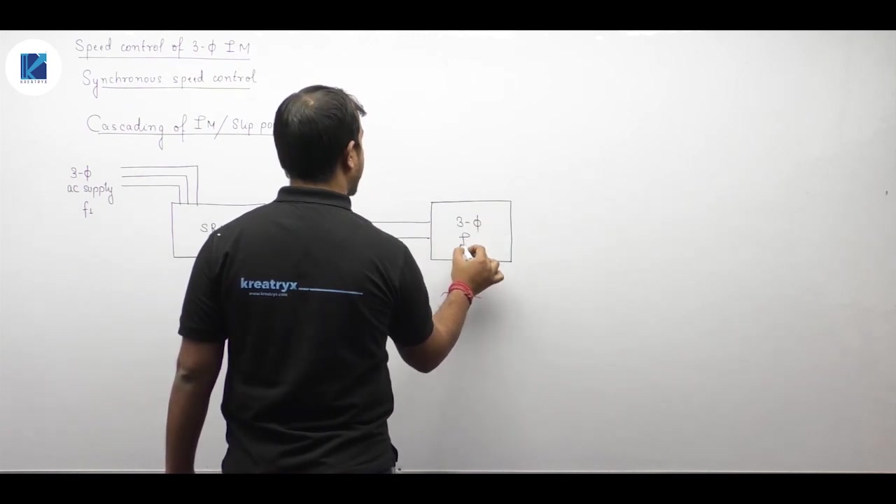

1. **Electrical Coupling**: Three slip rings on the rotor of Motor A supply three-phase current into the stator of Motor B. The frequency entering Motor B is the slip frequency of Motor A:
   $$f_2 = s_1 f_1$$
2. **Mechanical Coupling**: Both motor rotors mount on the same rigid shaft or couple through a mechanical linkage. Therefore, both rotors rotate at the exact same physical speed:
   $$N_1 = N_2 = N_{\text{set}}$$

### Cumulative vs Differential Cascading

Depending on stator connections, the motors can aid or oppose each other:

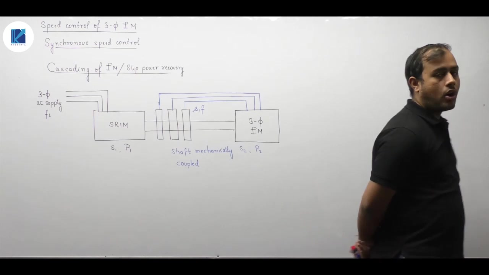

- **Cumulative Cascading**: When both stators share the same phase sequence, their rotating magnetic fields rotate in the same physical direction. Both motors produce electromagnetic torque in the same direction.
- **Differential Cascading**: When the phase sequence of Motor B is reversed relative to Motor A, their rotating magnetic fields rotate in opposite directions. The motors produce opposing torques.

### Derivation of Set Speed in Cumulative Cascading

In cumulative cascading, both machines produce torque in the same direction.

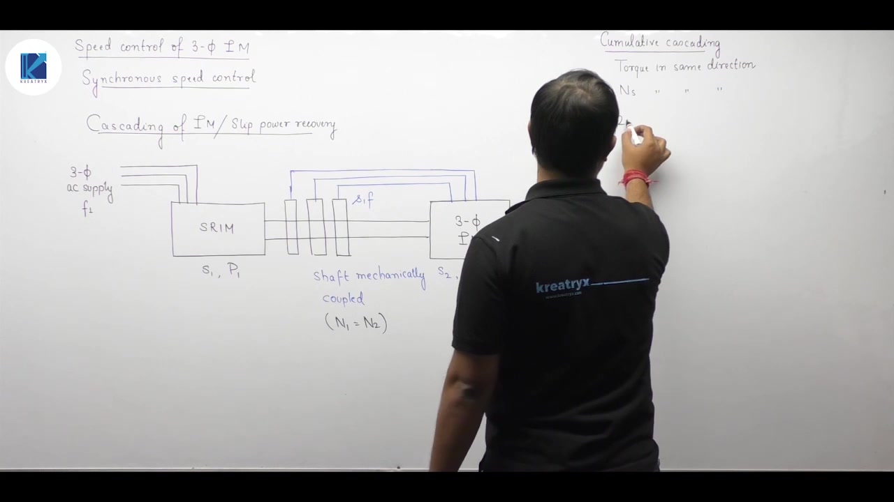

The rotor speed of Motor A is:

$$N_1 = \frac{120 f_1}{P_1} (1 - s_1)$$

Motor B receives stator frequency $f_2 = s_1 f_1$. Its rotor speed is:

$$N_2 = \frac{120 f_2}{P_2} (1 - s_2) = \frac{120 (s_1 f_1)}{P_2} (1 - s_2)$$

Because the shafts are rigidly coupled, $N_1 = N_2$. Assuming the secondary machine operates at light load or very small slip ($s_2 \approx 0$):

$$\frac{120 f_1}{P_1} (1 - s_1) \approx \frac{120 s_1 f_1}{P_2}$$

Canceling common factors $\frac{120 f_1}{1}$:

$$\frac{1 - s_1}{P_1} = \frac{s_1}{P_2}$$

Cross-multiplying gives:

$$P_2 (1 - s_1) = P_1 s_1 \implies P_2 = (P_1 + P_2) s_1$$

So the operating slip of Motor A is:

$$s_1 = \frac{P_2}{P_1 + P_2}$$

Substituting $s_1$ back into the speed equation for $N_1$:

$$N_{\text{set}} = \frac{120 f_1}{P_1} \left(1 - \frac{P_2}{P_1 + P_2}\right) = \frac{120 f_1}{P_1} \left(\frac{P_1}{P_1 + P_2}\right)$$

> [!success] Cumulative Cascaded Speed
> The synchronous speed of the cumulatively cascaded set equals that of an equivalent single machine having $(P_1 + P_2)$ poles:
>
> $$N_{\text{set}} = \frac{120 f_1}{P_1 + P_2}$$

So two machines with $P_1$ and $P_2$ poles combine cumulatively to yield a stable lower operating speed corresponding to $(P_1 + P_2)$ poles.

## Differential Cascading and Cascading with Synchronous Machines
_(39:27 - 43:31)_

### Derivation of Set Speed in Differential Cascading

In differential cascading, the phase sequence of Motor B is reversed. Its rotating magnetic field turns in the opposite direction.

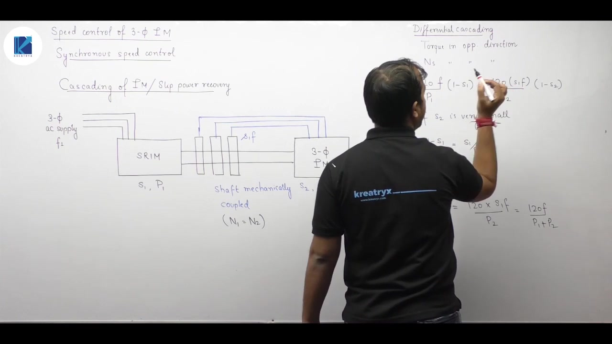

Because the mechanical shaft forces both rotors to rotate together in the direction of the dominant machine, Motor B tends to rotate opposite to Motor A:

$$N_1 = -N_2$$

Expressing speeds in terms of slip and poles with $s_2 \approx 0$:

$$\frac{120 f_1}{P_1} (1 - s_1) \approx -\frac{120 (s_1 f_1)}{P_2}$$

Canceling common factors $\frac{120 f_1}{1}$:

$$\frac{1 - s_1}{P_1} = -\frac{s_1}{P_2} \implies P_2 (1 - s_1) = -P_1 s_1$$

Rearranging:

$$P_2 = (P_2 - P_1) s_1 \implies s_1 = \frac{P_2}{P_2 - P_1}$$

Substituting $s_1$ back into the expression for set speed:

$$N_{\text{set}} = \frac{120 f_1}{|P_1 - P_2|}$$

> [!success] Differential Cascaded Speed
> For differential cascading with $P_1 \ne P_2$, the synchronous speed corresponds to an equivalent machine with $|P_1 - P_2|$ poles:
>
> $$N_{\text{set}} = \frac{120 f_1}{|P_1 - P_2|}$$
>
> If $P_1 = P_2$, the denominator goes to zero and differential cascading cannot operate.

### Exact Two-Variable Analysis in Problems

In rigorous problem solving, secondary slip $s_2$ cannot be neglected.

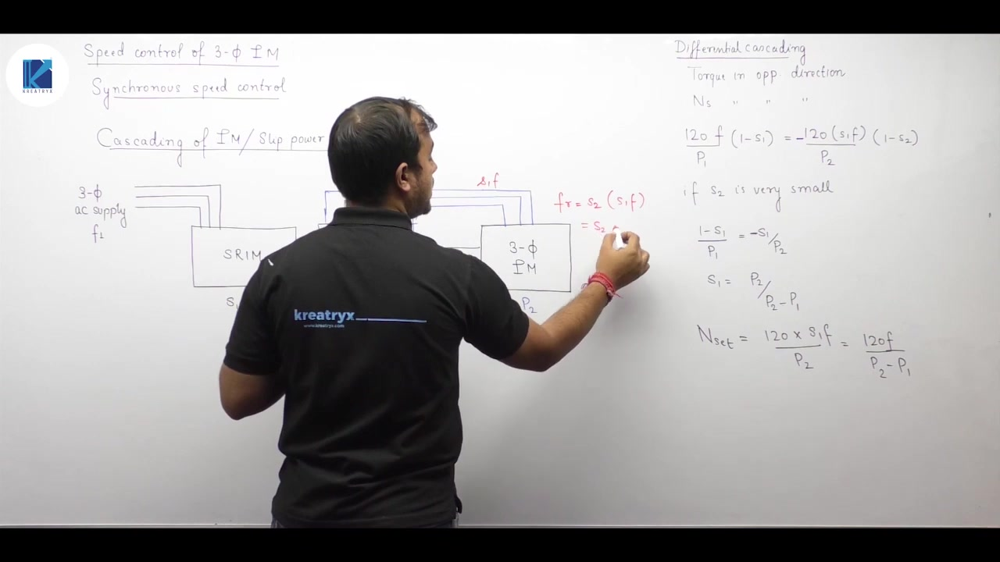

There are two unknown slips: $s_1$ and $s_2$. Two independent equations are required:
1. **Shaft Speed Equality**:
   $$\frac{120 f_1}{P_1}(1 - s_1) = \pm \frac{120 (s_1 f_1)}{P_2}(1 - s_2)$$
2. **Rotor Frequency of Motor B**:
   $$f_{r2} = s_2 f_2 = s_1 s_2 f_1$$

The given secondary rotor frequency provides the second equation to solve for both slips uniquely.

### Cascading an Induction Motor with a Synchronous Machine

If an induction machine is mechanically cascaded on a common shaft with a synchronous machine:

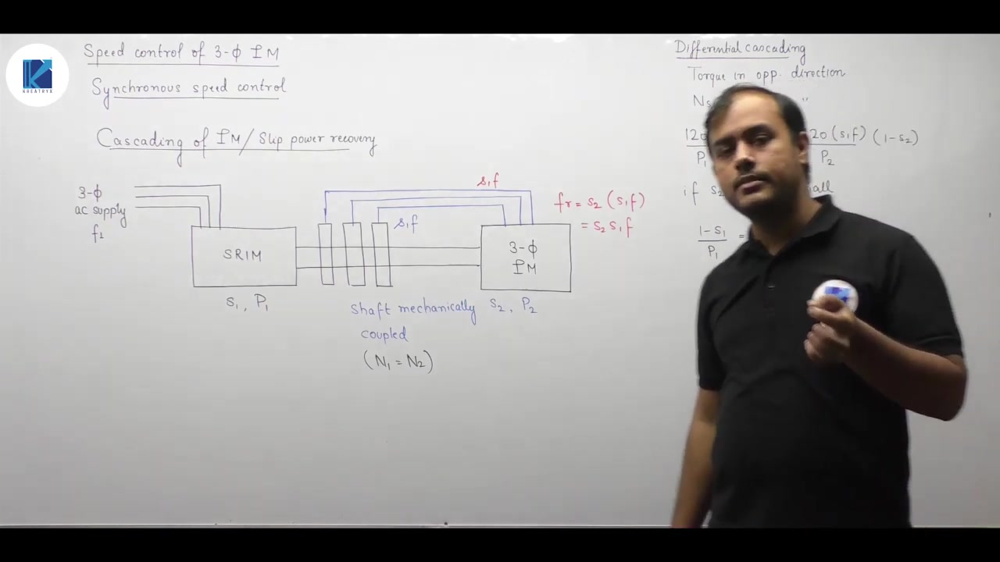

> [!info] Synchronous Speed Locking
> A synchronous machine must run strictly at synchronous speed to maintain synchronism:
>
> $$N_s = \frac{120 f}{P_{\text{sync}}}$$
>
> Therefore, the entire cascaded set operates at the exact synchronous speed determined by the synchronous machine poles:
>
> $$N_{\text{set}} = \frac{120 f}{P_{\text{sync}}}$$

The induction motor operates at slip determined by that fixed speed, supplying or absorbing torque as dictated by the load.

### Summary of Speed Control for Examinations

For competitive examinations such as GATE and ESE:
1. **Primary Focus Areas**:
   - Stator Voltage Control
   - Rotor Resistance Control
   - Constant $V/f$ Frequency Control (Sub-base and Supra-base speed curves)
2. **Secondary Topics**:
   - Consequent Pole Switching (2:1 ratio)
   - Cascading / Slip Power Recovery sets

---

## Summary and Key Takeaways

- Below base speed ($f < f_{\text{rated}}$), maintaining a constant ratio of terminal voltage to frequency ($V/f = \text{constant}$) keeps air gap core flux constant and prevents magnetic saturation.
- Under constant $V/f$ control below base speed, maximum breakdown torque remains constant ($T_{\max} = \text{constant}$), while starting torque increases inversely with frequency ($T_{st} \propto 1/f$).
- For any constant torque mechanical load operating below base speed under constant $V/f$ control, the slip speed remains constant: $N_s - N_r = \text{constant}$.
- Above base speed ($f > f_{\text{rated}}$), terminal voltage is clamped at rated voltage to protect winding insulation, so the motor enters the field-weakening constant power region where $T_{\max} \propto 1/f^2$.
- At low stator frequencies, the series stator resistance drop $I_1 R_1$ can no longer be neglected, requiring an intentional voltage boost to keep air gap induced EMF $E_1/f$ constant.
- The pole changing method alters synchronous speed by switching stator coil polarities in a 2:1 ratio using consequent poles, and this technique applies exclusively to squirrel cage induction motors.
- The total power crossing the air gap divides into mechanical power $(1 - s) P_g$ and rotor electrical power $s P_g$, which can be recovered rather than wasted as heat.
- Two mechanically coupled induction motors operating in cumulative cascading run at a set synchronous speed corresponding to total effective poles: $N_{\text{set}} = \frac{120 f_1}{P_1 + P_2}$.
- When cascaded in differential mode with reversed phase sequence, the set synchronous speed corresponds to the pole difference: $N_{\text{set}} = \frac{120 f_1}{|P_1 - P_2|}$.

---

[← Lec 151: Speed Control of Induction Motor 1](Lecture_151_Speed_Control_of_Induction_Motor_1.md) | [🏠 Index](00_yt_study_guide.md) | [Lec 153: Speed Control of IM 1 →](Lecture_153_Speed_Control_of_IM_1.md)
