# Speed Control of IM - 1 | L 44 | Electrical Machines | GATE 2022 | Ankit Goyal

- **Source**: https://www.youtube.com/watch?v=hoKWN0Yx7H8
- **Duration**: 00:54:10
- **Compiled**: 2026-09-23

---

## Overview

This lecture solves advanced problem scenarios on induction motor speed control, rotor resistance modification, and stator coil reconnections. It examines power flow ratios across air gap, rotor copper loss, and shaft output under constant stator current and variable fan loads. The discussion details inverted induction motor operation where power feeds into the rotor while driving a coupled DC generator. It concludes by calculating minimum terminal voltage limits under supply fluctuations and determining consequent pole configurations when stator coil polarities reverse.

## Contents

- [[#Power Flow Analysis and Stator Input Calculation|Power Flow Analysis and Stator Input Calculation]]
- [[#Rotor Resistance Insertion under Rated Stator Current|Rotor Resistance Insertion under Rated Stator Current]]
- [[#Mechanical Power Degradation and Rotor Copper Loss Variation|Mechanical Power Degradation and Rotor Copper Loss Variation]]
- [[#Fan Load Analysis and Rotor Resistance Speed Control|Fan Load Analysis and Rotor Resistance Speed Control]]
- [[#Minimum Rotor Resistance for Starting on Load|Minimum Rotor Resistance for Starting on Load]]
- [[#External Resistance Calculation and Steady-State Speed Analysis|External Resistance Calculation and Steady-State Speed Analysis]]
- [[#Running Speed without External Resistance and Inverted Induction Motor Setup|Running Speed without External Resistance and Inverted Induction Motor Setup]]
- [[#DC Generator Output Analysis and Voltage Fluctuation Limits|DC Generator Output Analysis and Voltage Fluctuation Limits]]
- [[#Minimum Voltage Limits, External Resistance for Starting, and Pole Consequent Connections|Minimum Voltage Limits, External Resistance for Starting, and Pole Consequent Connections]]
- [[#Consequent Pole Modification and Coil Reconnection|Consequent Pole Modification and Coil Reconnection]]

---

## Power Flow Analysis and Stator Input Calculation
_(00:02 - 07:16)_

### Power Flow Relationships in Induction Machines

The flow of electrical and mechanical power in an induction motor follows definite ratios:

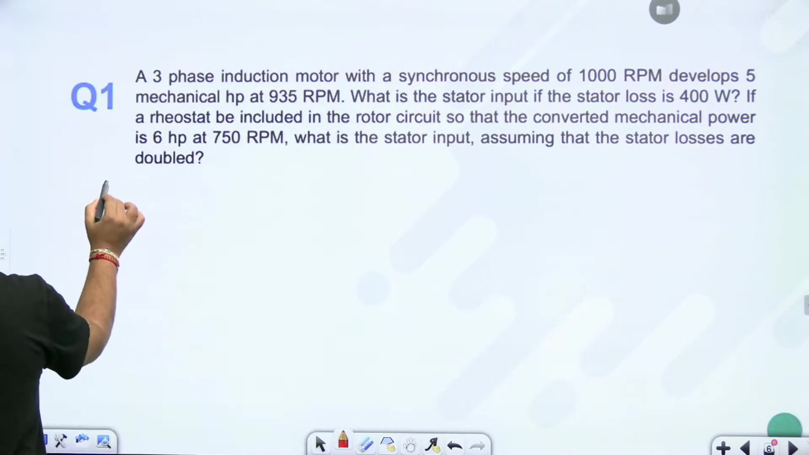

$$
\begin{aligned}
P_{\text{in}} &= P_g + P_{\text{stator loss}} \\
P_g : P_{cu} : P_{\text{mech}} &= 1 : s : (1 - s)
\end{aligned}
$$

From these proportions, air gap power relates to developed mechanical power by:

$$P_g = \frac{P_{\text{mech}}}{1 - s}$$

### Worked Problem 1: Stator Input Power Calculation

> [!example] Problem 1
> A 3-phase induction motor with a synchronous speed of $1000\text{ rpm}$ develops $5\text{ hp}$ at $935\text{ rpm}$.
> 1. Determine stator input power if stator losses are $400\text{ W}$.
> 2. An external rheostat is inserted into the rotor circuit so that the motor develops $6\text{ hp}$ at $750\text{ rpm}$ with stator losses increased to $800\text{ W}$. Determine the new stator input power.

#### Solution to Part 1

First calculate operating slip:

$$s_1 = \frac{N_s - N_1}{N_s} = \frac{1000 - 935}{1000} = 0.065$$

Convert mechanical developed power from horsepower to watts:

$$P_{\text{mech1}} = 5 \times 746 = 3730\text{ W}$$

The air gap power transferred across the stator is:

$$P_{g1} = \frac{P_{\text{mech1}}}{1 - s_1} = \frac{3730}{1 - 0.065} = \frac{3730}{0.935} = 3989.3\text{ W}$$

Stator input power includes stator core and copper losses:

$$P_{\text{in1}} = P_{g1} + P_{\text{stator loss}} = 3989.3 + 400 = 4389.3\text{ W}$$

#### Solution to Part 2

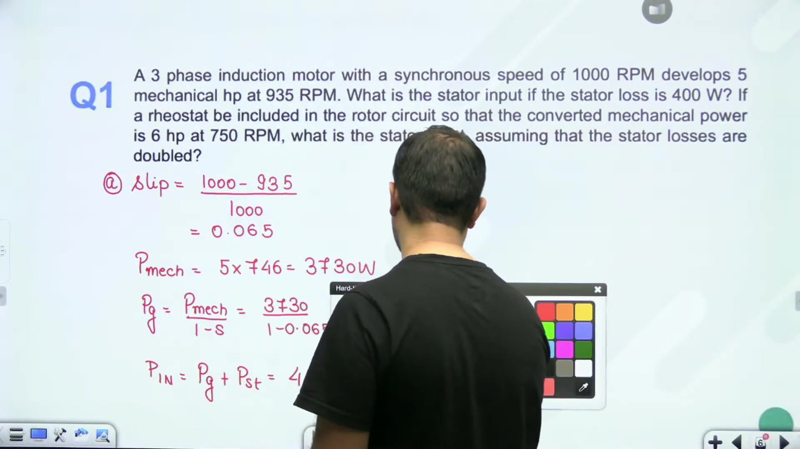

When the rotor rheostat reduces speed to $750\text{ rpm}$, the new slip becomes:

$$s_2 = \frac{1000 - 750}{1000} = \frac{250}{1000} = 0.25$$

The developed mechanical power is:

$$P_{\text{mech2}} = 6 \times 746 = 4476\text{ W}$$

Calculate the corresponding air gap power:

$$P_{g2} = \frac{P_{\text{mech2}}}{1 - s_2} = \frac{4476}{1 - 0.25} = \frac{4476}{0.75} = 5968\text{ W}$$

With stator losses given as $800\text{ W}$, the total electrical input power is:

$$P_{\text{in2}} = P_{g2} + P_{\text{stator loss}} = 5968 + 800 = 6768\text{ W}$$

> [!success] Result
> The stator input powers are $4389.3\text{ W}$ for the initial condition and $6768\text{ W}$ when operating with the rotor circuit rheostat.

## Rotor Resistance Insertion under Rated Stator Current
_(07:16 - 12:10)_

### Condition of Constant Stator Current

When external resistance is added to the rotor circuit while the stator draws its rated full load current, the motor operates at constant current magnitude.

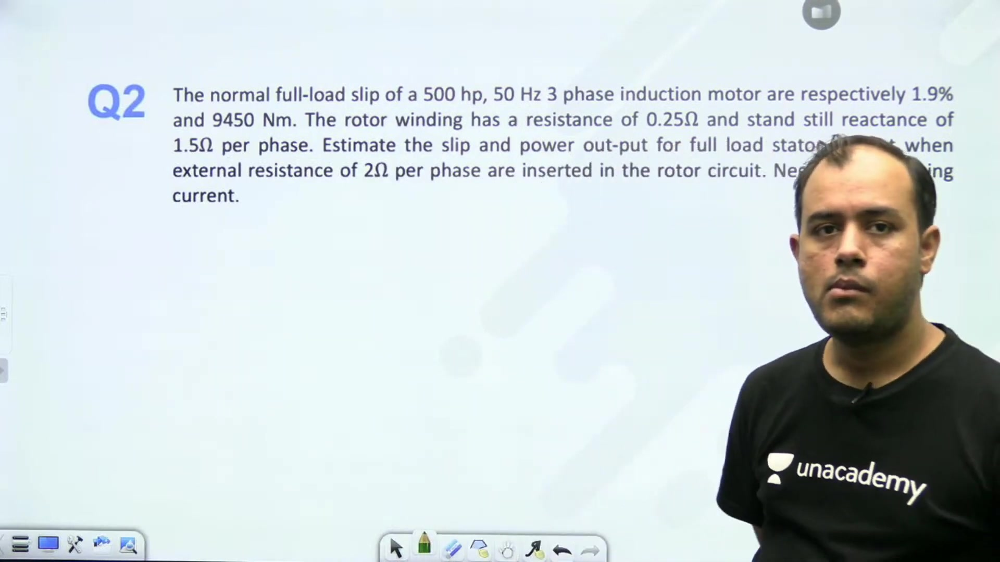

Neglecting magnetizing shunt impedance:
- Terminal voltage $V_1$ is constant.
- Stator current $I_1$ is constant at rated value.
- Therefore, the input impedance magnitude $|Z|$ of the motor remains unchanged.

The equivalent rotor impedance referred to stator is:

$$|Z_2| = \sqrt{\left(\frac{R_2}{s}\right)^2 + X_2^2}$$

Since standstill leakage reactance $X_2$ is fixed by machine geometry, preserving total impedance $|Z_2|$ requires:

$$\frac{R_2}{s_1} = \frac{R_2 + R_{\text{ext}}}{s_2}$$

### Worked Problem 2: Slip and Power Output Determination

> [!example] Problem 2
> A $500\text{ hp}$, $50\text{ Hz}$, 3-phase induction motor has full load slip $s_1 = 1.9\%$ and full load torque $9450\text{ N m}$.
> Rotor winding resistance is $R_2 = 0.25\,\Omega/\text{phase}$ and reactance is $X_2 = 0.75\,\Omega/\text{phase}$.
> Estimate the operating slip and power output at rated stator current when an external resistance $R_{\text{ext}} = 2\,\Omega/\text{phase}$ is inserted into the rotor circuit. Neglect magnetizing branch current.

#### Evaluation of New Slip

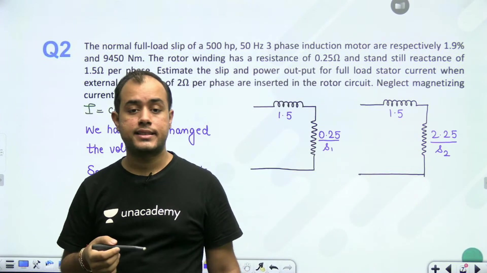

The initial rotor circuit parameters are:
- $R_2 = 0.25\,\Omega/\text{phase}$
- Initial slip $s_1 = 0.019$
- Total rotor resistance after insertion:
  $$R_{2,\text{new}} = R_2 + R_{\text{ext}} = 0.25 + 2.0 = 2.25\,\Omega/\text{phase}$$

Apply the impedance constancy criterion:

$$
\begin{aligned}
\frac{R_2}{s_1} &= \frac{R_2 + R_{\text{ext}}}{s_2} \\
\frac{0.25}{0.019} &= \frac{2.25}{s_2} \\
s_2 &= 0.019 \times \frac{2.25}{0.25} = 0.019 \times 9 = 0.171
\end{aligned}
$$

So the new operating slip increases by a factor of 9 to $17.1\%$.

> [!success] Derived Slip
> The operating slip under rated stator current with $2\,\Omega/\text{phase}$ external rotor resistance is:
>
> $$s_2 = 0.171 \quad (17.1\%)$$

## Mechanical Power Degradation and Rotor Copper Loss Variation
_(12:10 - 16:19)_

### Power Output with External Rotor Resistance

Continuing Problem 2, determine the new shaft mechanical power output when external resistance $R_{\text{ext}} = 2\,\Omega/\text{phase}$ is inserted into the rotor circuit under rated stator current.

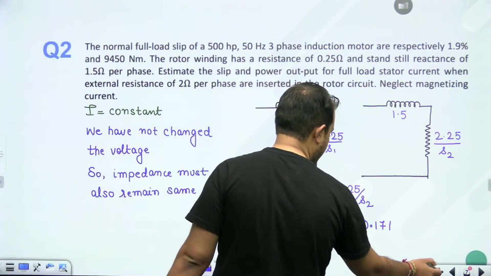

Because stator voltage $V_1$, stator current $I_1$, and total input impedance $|Z_2|$ are identical in both cases, the active power entering the rotor remains constant:

$$P_{g1} = P_{g2} = P_g = \text{constant}$$

The developed mechanical powers for the two operating conditions relate directly to slip:

$$
\begin{aligned}
P_{m1} &= (1 - s_1) P_g \\
P_{m2} &= (1 - s_2) P_g
\end{aligned}
$$

Taking their ratio eliminates the unknown air gap power:

$$\frac{P_{m2}}{P_{m1}} = \frac{1 - s_2}{1 - s_1}$$

Substituting initial power $P_{m1} = 500\text{ hp}$, $s_1 = 0.019$, and $s_2 = 0.171$:

$$P_{m2} = 500 \times \frac{1 - 0.171}{1 - 0.019} = 500 \times \frac{0.829}{0.981} = 422.5\text{ hp}$$

> [!success] Power Output Result
> When the motor operates at rated stator current with the external rotor resistor inserted, developed shaft power reduces to:
>
> $$P_{m2} = 422.5\text{ hp}$$

### Worked Problem 3: Rotor Copper Loss Increase

> [!example] Problem 3
> If the operating slip of an induction motor increases from $s_1 = 0.01$ to $s_2 = 0.04$ while the rotor power input is held constant at $P_g = 2000\text{ W}$, determine the increase in rotor copper losses.

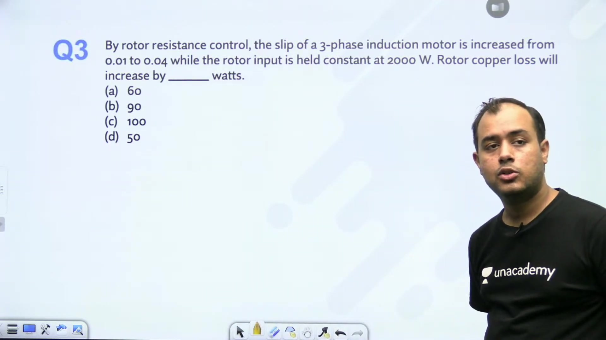

Rotor electrical power dissipation (rotor copper loss) relates to air gap input by:

$$P_{cu} = s P_g$$

Calculate copper losses at each slip value:
- Initial rotor copper loss:
  $$P_{cu1} = s_1 P_g = 0.01 \times 2000 = 20\text{ W}$$
- Final rotor copper loss:
  $$P_{cu2} = s_2 P_g = 0.04 \times 2000 = 80\text{ W}$$

The net increase in rotor copper loss is:

$$\Delta P_{cu} = P_{cu2} - P_{cu1} = (s_2 - s_1) P_g = (0.04 - 0.01) \times 2000 = 60\text{ W}$$

> [!success] Copper Loss Result
> The rotor copper loss increases by $60\text{ W}$.

## Fan Load Analysis and Rotor Resistance Speed Control
_(16:24 - 21:13)_

### Slip Ring Rotor Phase Resistance

In a wound rotor induction motor, the rotor winding is star-connected to bring three terminals out to the slip rings.

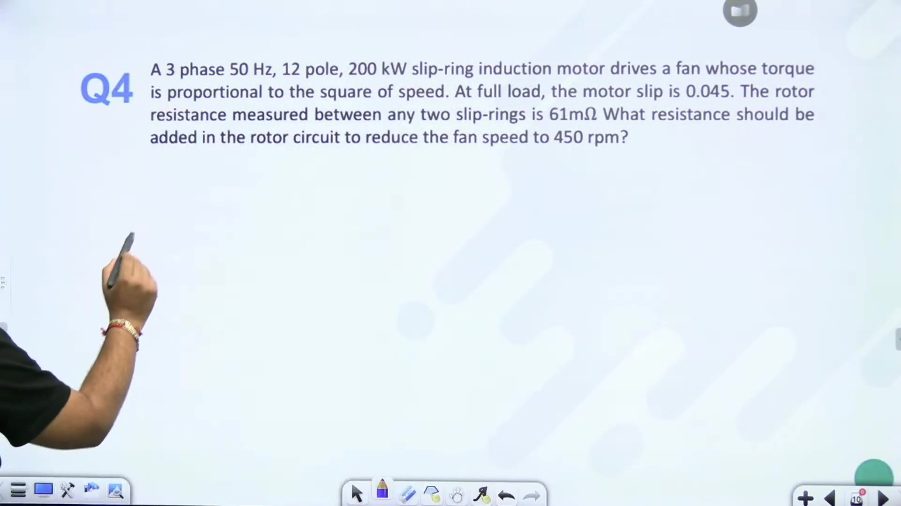

When the resistance is measured between any two external slip rings at standstill, two phase windings are connected in series:

$$R_{\text{between slip rings}} = 2 R_2 \implies R_2 = \frac{R_{\text{between slip rings}}}{2}$$

### Worked Problem 4: Speed Reduction on a Fan Load

> [!example] Problem 4
> A 3-phase, $50\text{ Hz}$, 12-pole, $200\text{ kW}$ slip ring induction motor drives a fan whose load torque varies with the square of speed:
>
> $$T_L \propto N^2$$
>
> At full load, the motor operates at slip $s_1 = 0.045$, and the resistance measured between two slip rings is $61\text{ m}\Omega$.
> What external resistance must be added to the rotor circuit per phase to reduce the operating speed to $450\text{ rpm}$?

#### Parameter Evaluation and Formulation

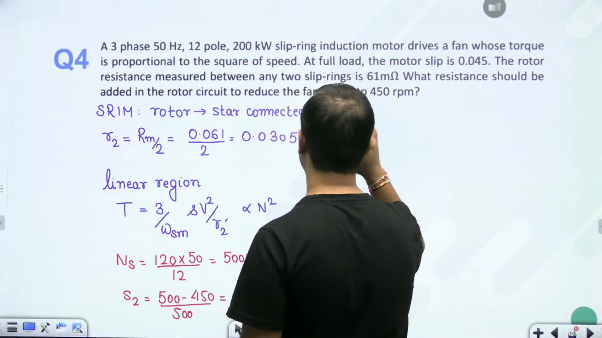

1. **Rotor Phase Resistance**:
   $$R_2 = \frac{61\text{ m}\Omega}{2} = 30.5\text{ m}\Omega = 0.0305\,\Omega/\text{phase}$$

2. **Synchronous Speed and Operating Slips**:
   $$N_s = \frac{120 f}{P} = \frac{120 \times 50}{12} = 500\text{ rpm}$$
   Initial speed and slip are:
   $$s_1 = 0.045 \implies N_1 = N_s (1 - s_1) = 500(1 - 0.045) = 477.5\text{ rpm}$$
   For the reduced speed $N_2 = 450\text{ rpm}$:
   $$s_2 = \frac{N_s - N_2}{N_s} = \frac{500 - 450}{500} = \frac{50}{500} = 0.10$$

3. **Motor Torque in Linear Stable Region**:
   In the normal operating low-slip region:
   $$T \approx \frac{3}{\omega_s} \frac{s V_1^2}{R_{2,\text{total}}}$$
   With supply voltage $V_1$ and synchronous speed $\omega_s$ constant:
   $$\frac{T_2}{T_1} = \frac{\frac{s_2}{R_2 + R_{\text{ext}}}}{\frac{s_1}{R_2}} = \frac{s_2}{s_1} \frac{R_2}{R_2 + R_{\text{ext}}}$$

4. **Load Torque Constraint**:
   Because the fan load torque varies with speed squared:
   $$\frac{T_2}{T_1} = \left(\frac{N_2}{N_1}\right)^2 = \left(\frac{1 - s_2}{1 - s_1}\right)^2$$

Equating motor torque ratio to load torque ratio:

$$\frac{s_2}{s_1} \frac{R_2}{R_2 + R_{\text{ext}}} = \left(\frac{1 - s_2}{1 - s_1}\right)^2$$

Substitute known numerical values:

$$\frac{0.10}{0.045} \frac{0.0305}{0.0305 + R_{\text{ext}}} = \left(\frac{1 - 0.10}{1 - 0.045}\right)^2 = \left(\frac{0.90}{0.955}\right)^2$$

This sets up the complete relation to extract external rotor resistance $R_{\text{ext}}$.

## Minimum Rotor Resistance for Starting on Load
_(21:17 - 27:19)_

### Fan Load Resistance Completion

Completing the numerical evaluation from Problem 4:

$$\frac{0.10}{0.045} \frac{0.0305}{0.0305 + R_{\text{ext}}} = \left(\frac{0.90}{0.955}\right)^2 = 0.888$$

Rearranging the terms gives:

$$\frac{0.0305}{0.0305 + R_{\text{ext}}} = 0.888 \times \frac{0.045}{0.10} = 0.3996$$

Solving for the denominator:

$$0.0305 + R_{\text{ext}} = \frac{0.0305}{0.3996} = 0.0763\,\Omega/\text{phase}$$

Subtracting the internal winding resistance gives:

$$R_{\text{ext}} = 0.0763 - 0.0305 = 0.0458\,\Omega/\text{phase}$$

> [!success] Fan Load Resistance Result
> An external resistance of $R_{\text{ext}} = 0.0458\,\Omega/\text{phase}$ reduces the operating fan speed to $450\text{ rpm}$.

### Starting on Load Criteria

When an induction motor is energized while mechanically coupled to a heavy load, it accelerates from standstill ($s = 1$) only if:

$$T_{st} \ge T_L$$

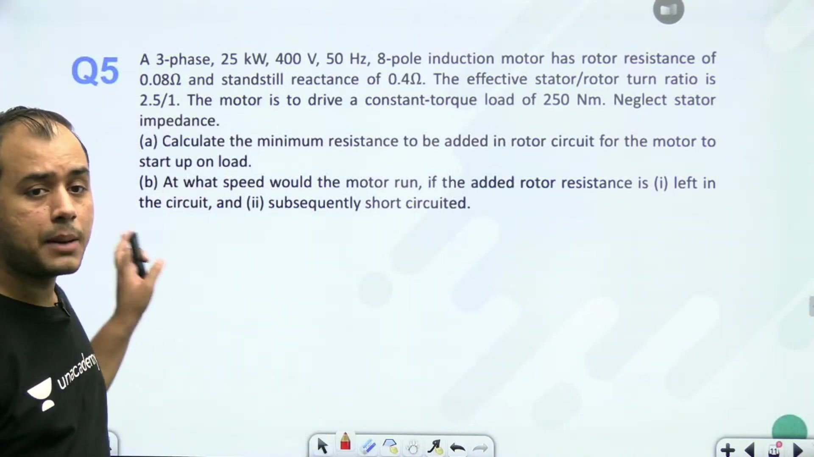

### Worked Problem 5: Starting on a Constant Torque Load

> [!example] Problem 5
> A 3-phase, $25\text{ kW}$, $400\text{ V}$, $50\text{ Hz}$, 8-pole wound rotor induction motor has $R_2 = 0.08\,\Omega/\text{phase}$, standstill reactance $X_2 = 0.4\,\Omega/\text{phase}$, and stator-to-rotor effective turns ratio $a = 2.5$.
> The motor drives a constant torque load $T_L = 250\text{ N m}$. Stator impedance is negligible.
> 1. Calculate the minimum external resistance $R_{\text{ext}}$ to be added to the rotor circuit for the motor to start on load.

#### Calculation of Referred Parameters

Synchronous angular speed is:

$$\omega_{sm} = \frac{4\pi f}{P} = \frac{4\pi \times 50}{8} = 78.54\text{ rad/s}$$

Assuming star-connected stator winding, the phase voltage is:

$$V_{\text{phase, stator}} = \frac{400}{\sqrt{3}} = 230.94\text{ V}$$

Referring stator phase voltage to the rotor side yields:

$$V_2 = \frac{V_1}{a} = \frac{230.94}{2.5} = 92.38\text{ V}$$

#### Starting Torque Equation

At starting ($s = 1$), total rotor resistance is $(R_2 + R_{\text{ext}})$:

$$T_{st} = \frac{3}{\omega_{sm}} \frac{V_2^2 (R_2 + R_{\text{ext}})}{(R_2 + R_{\text{ext}})^2 + X_2^2}$$

Setting $T_{st} = 250\text{ N m}$ and letting $x = R_2 + R_{\text{ext}}$ gives:

$$250 = \frac{3}{78.54} \frac{(92.38)^2 x}{x^2 + (0.4)^2} = 325.9 \frac{x}{x^2 + 0.16}$$

Rearranging into standard quadratic form:

$$
\begin{aligned}
250 (x^2 + 0.16) &= 325.9 x \\
x^2 - 1.304 x + 0.16 &= 0
\end{aligned}
$$

Using the quadratic formula to solve for $x$:

$$x = \frac{1.304 \pm \sqrt{(1.304)^2 - 4(1)(0.16)}}{2} = \frac{1.304 \pm 1.030}{2}$$

The two mathematical roots are $x_1 = 1.167\,\Omega/\text{phase}$ and $x_2 = 0.137\,\Omega/\text{phase}$.

Choosing the smaller practical root keeps normal running efficiency high:

$$R_2 + R_{\text{ext}} = 0.137\,\Omega/\text{phase} \implies R_{\text{ext}} = 0.137 - 0.08 = 0.057\,\Omega/\text{phase}$$

> [!success] Minimum Added Resistance
> The minimum external resistance required to start against $250\text{ N m}$ is $R_{\text{ext}} = 0.057\,\Omega/\text{phase}$.

## External Resistance Calculation and Steady-State Speed Analysis
_(27:22 - 31:25)_

### Selecting the Feasible Rotor Resistance

From the previous quadratic equation, two possible values were obtained for total rotor circuit resistance $x = R_2 + R_{\text{ext}}$. We select the lower value:
$$x = 0.137\ \Omega/\text{phase}$$

An excessively high resistance causes high $I^2R$ copper losses and lowers operating efficiency. The existing rotor resistance is $R_2 = 0.08\ \Omega/\text{phase}$.

We compute the required external resistance directly:
$$R_{\text{ext}} = 0.137 - 0.08 = 0.057\ \Omega/\text{phase}$$

> [!success] Required External Resistance
> The external resistance added to the rotor circuit to develop the required starting torque is:
> $$R_{\text{ext}} = 0.057\ \Omega/\text{phase}$$

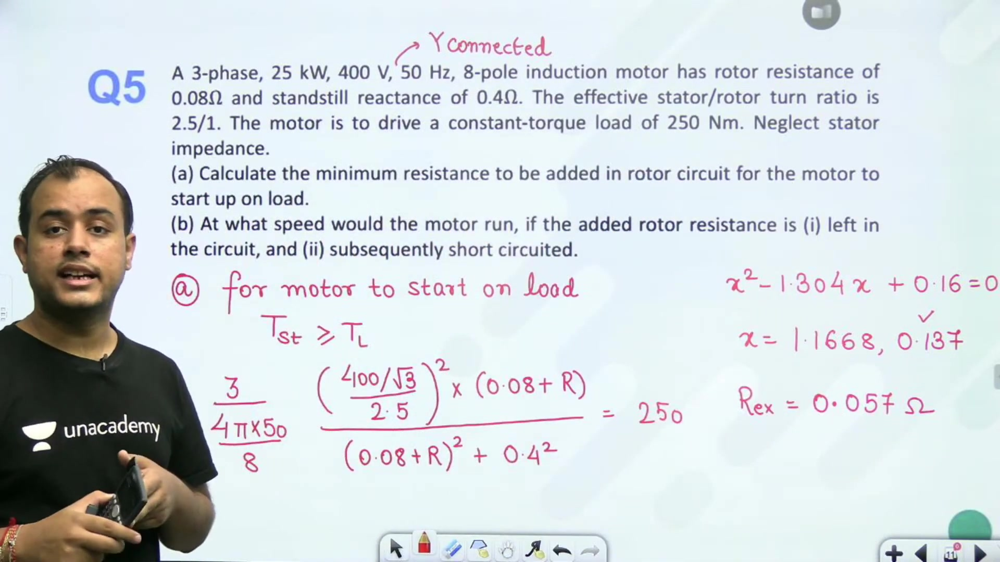

### Operating Speed with External Resistance Inserted

Next, determine the motor operating speed when this external resistance remains inside the rotor circuit. The motor drives a constant load torque of $T_L = 250\ \text{N}\cdot\text{m}$. 

Under normal running conditions, the motor operates in the stable low-slip region. In this region, electromagnetic torque is directly proportional to slip:
$$T \approx \frac{3}{\omega_{sm}} \cdot \frac{s V_2^2}{R_2 + R_{\text{ext}}}$$

The synchronous speed in mechanical radians per second is:
$$\omega_{sm} = \frac{2\pi \times 750}{60} = 78.54\ \text{rad/s}$$

The rotor-referred phase voltage is $V_2 = 92.38\ \text{V}$. Total rotor resistance per phase is $0.137\ \Omega$.

Now equate motor torque to load torque:
$$250 = \frac{3}{78.54} \cdot \frac{s \times (92.38)^2}{0.137}$$

Solving this relation for operating slip yields:
$$s = 0.105$$

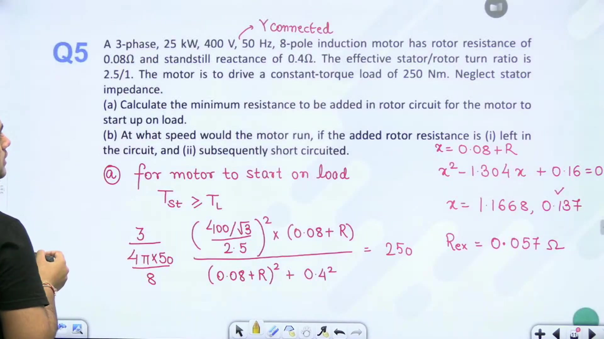

Now calculate the rotor speed:
$$N = N_s(1 - s) = 750 \times (1 - 0.105) = 671.25\ \text{rpm}$$

So the steady operating speed with external resistance inserted is approximately $671.25\ \text{rpm}$.

### Operating Condition when External Resistance is Removed

When the external resistance is cut out after starting, total rotor resistance returns to its internal value $R_2 = 0.08\ \Omega/\text{phase}$.

We apply the same linear low-slip torque equation with load torque $T_L = 250\ \text{N}\cdot\text{m}$:
$$T = \frac{3}{\omega_{sm}} \cdot \frac{s V_2^2}{R_2}$$

Referring voltages and parameters to the rotor side simplifies the arithmetic. It avoids cumbersome transformations of rotor impedance to the stator side.

## Running Speed without External Resistance and Inverted Induction Motor Setup
_(31:33 - 36:29)_

### Speed Calculation without External Resistance

Recall the previous motor problem where $T_L = 250\ \text{N}\cdot\text{m}$. When the external resistance is cut out, only the original rotor resistance $R_2 = 0.08\ \Omega/\text{phase}$ remains.

We substitute this into the low-slip torque equation:
$$250 = \frac{3}{78.54} \cdot \frac{s \times (92.38)^2}{0.08}$$

Solving for operating slip:
$$s = 0.0613$$

The synchronous speed is $N_s = 750\ \text{rpm}$. Now calculate the motor running speed:
$$N = N_s(1 - s) = 750 \times (1 - 0.0613) = 704\ \text{rpm}$$

> [!success] Speed Comparison
> Without external resistance, the motor runs at $704\ \text{rpm}$. With external resistance inserted, it ran at $671.25\ \text{rpm}$. Adding rotor resistance reduces motor speed for a constant load torque.

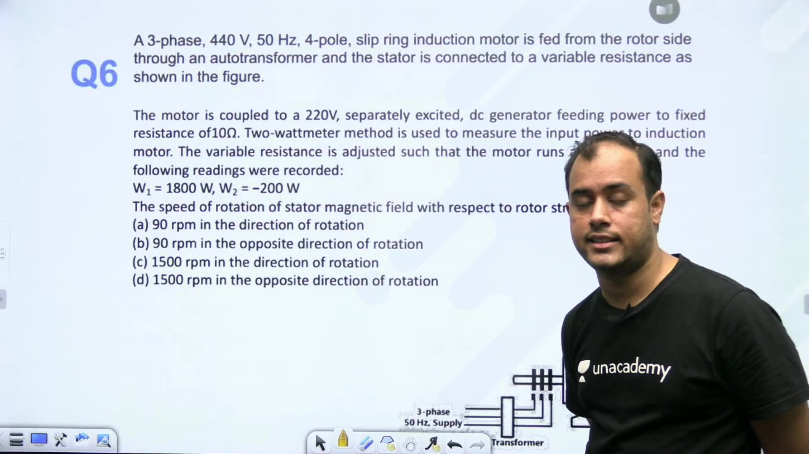

### Inverted Induction Motor Problem Formulation

Next consider a comprehensive problem involving rotor-fed operation.

> [!example] Problem Statement
> A 3-phase, 440 V, 50 Hz, 4-pole slip-ring induction motor is fed from the rotor side through an autotransformer. The stator is connected to a variable external resistance. The motor is mechanically coupled to a 220 V separately excited DC generator. The generator supplies power to a fixed resistance of $10\ \Omega$.
> 
> Input power to the induction motor is measured using the two-wattmeter method. With the variable stator resistance adjusted, the motor runs at $N = 1410\ \text{rpm}$. The wattmeter readings are:
> $$W_1 = 1800\ \text{W}, \quad W_2 = -200\ \text{W}$$
> 
> Determine:
> 1. Speed of rotation of the stator magnetic field with respect to the rotor structure.
> 2. Power and current relationships between the machines.

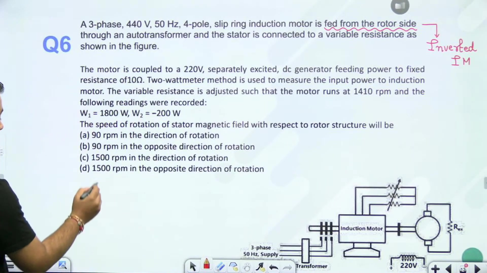

### Relative Speed of the Magnetic Fields

When 3-phase AC power is fed into the rotor windings, the machine operates as an inverted induction motor. 

The rotor currents establish a rotating magnetic field in the air gap. The synchronous speed of this rotor-produced field relative to the rotor structure depends strictly on the supply frequency and pole count:
$$N_s = \frac{120 f}{P} = \frac{120 \times 50}{4} = 1500\ \text{rpm}$$

In any induction motor, the stator magnetic field and rotor magnetic field are magnetically locked. They rotate at exactly the same speed in space.

Therefore, the speed of the stator magnetic field with respect to the rotor structure equals the speed of the rotor magnetic field with respect to the rotor structure:
$$N_{\text{field/rotor}} = 1500\ \text{rpm}$$

Relative to the physical rotor body, this magnetic field sweeps forward at $1500\ \text{rpm}$. Because the rotor structure rotates at $N = 1410\ \text{rpm}$ in space, the relative speed between the field and rotor structure is $1500\ \text{rpm}$.

### Power Flow Direction

Power enters the induction motor through its rotor slip rings. Part of this electrical input covers rotor copper losses. The remainder crosses the air gap to the stator, while mechanical power is developed at the rotor shaft.

The rotor shaft drives the coupled separately excited DC generator. The DC generator converts this mechanical power into electrical output delivered to the $10\ \Omega$ load resistance.

## DC Generator Output Analysis and Voltage Fluctuation Limits
_(36:29 - 42:57)_

### DC Generator Load Current and Power Calculation

Continuing the coupled inverted induction motor problem, we evaluate the electrical output of the DC generator.

The two-wattmeter method measures the total electrical input to the induction motor:
$$P_{\text{in}} = W_1 + W_2 = 1800 + (-200) = 1600\ \text{W}$$

Neglecting stator and rotor winding resistance losses, all electrical input enters the air gap:
$$P_g = 1600\ \text{W}$$

The synchronous speed for a 4-pole, 50 Hz machine is $N_s = 1500\ \text{rpm}$. With the motor operating at $N = 1410\ \text{rpm}$, the operating slip is:
$$s = \frac{1500 - 1410}{1500} = \frac{90}{1500} = 0.06$$

The mechanical power developed at the motor shaft is:
$$P_m = (1 - s)P_g = (1 - 0.06) \times 1600 = 0.94 \times 1600 = 1504\ \text{W}$$

Assuming a lossless mechanical coupling and an ideal DC generator, this mechanical power converts directly into DC electrical output:
$$P_{dc} = 1504\ \text{W}$$

This power is dissipated across the load resistor $R_L = 10\ \Omega$:
$$P_{dc} = I^2 R_L \implies I^2 \times 10 = 1504$$

Solving for load current:
$$I = \sqrt{\frac{1504}{10}} = \sqrt{150.4} \approx 12.26\ \text{A}$$

> [!success] Coupled System Results
> The mechanical power transmitted across the shaft is $1504\ \text{W}$. The current delivered by the DC generator to the $10\ \Omega$ load is $12.26\ \text{A}$.

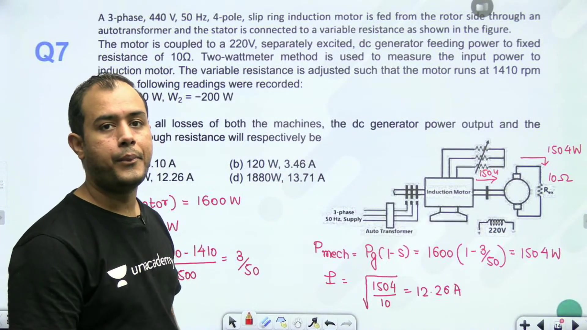

### Speed Calculation with Reduced Load Torque

Now consider a motor operating under reduced load.

> [!example] Worked Example: Half Load Speed
> A 10 kW, 50 Hz, 3-phase induction motor develops rated torque at $1440\ \text{rpm}$. If the load torque is reduced to half its rated value, find the new rotor speed. Assume a linear torque-slip characteristic.

The nearest synchronous speed above $1440\ \text{rpm}$ is $N_s = 1500\ \text{rpm}$ (corresponding to $P = 4$).

The initial full-load slip is:
$$s_1 = \frac{1500 - 1440}{1500} = \frac{60}{1500} = 0.04$$

In the normal operating low-slip region, torque is directly proportional to slip:
$$T \propto s$$

When load torque is halved:
$$T_2 = \frac{T_1}{2} \implies s_2 = \frac{s_1}{2} = \frac{0.04}{2} = 0.02$$

Now compute the new operating speed:
$$N_2 = N_s(1 - s_2) = 1500 \times (1 - 0.02) = 1470\ \text{rpm}$$

So reducing the load torque to half increases motor speed from $1440\ \text{rpm}$ to $1470\ \text{rpm}$.

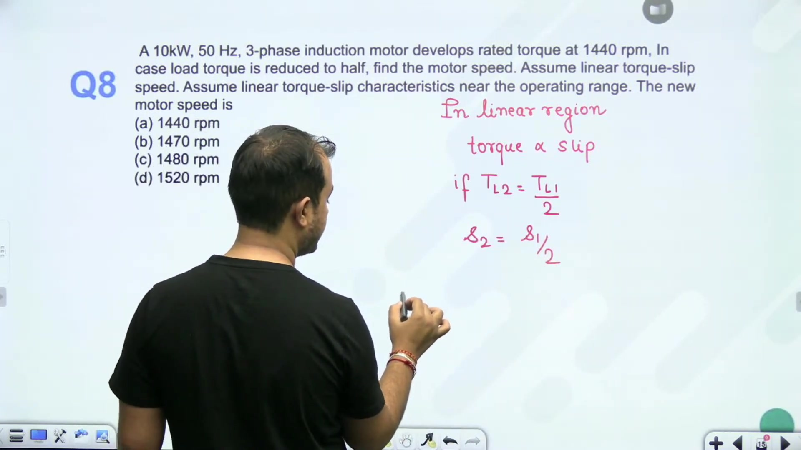

### Minimum Supply Voltage for Rated Torque

Next analyze motor operation under severe supply voltage fluctuations.

> [!example] Problem Statement: Voltage Reduction Limit
> A 4-pole, 50 Hz, 3-phase wound-rotor induction motor has a maximum breakdown torque equal to $200\%$ of full-load torque at $15\%$ slip:
> $$\frac{T_{\text{max}}}{T_{\text{fl}}} = 2, \quad s_{mT} = 0.15$$
> The rotor resistance is $R_2 = 0.5\ \Omega/\text{phase}$. If the supply voltage fluctuates, find the minimum voltage that can sustain rated torque.

At the lowest possible voltage, the reduced maximum breakdown torque must just equal the rated full-load torque. If the voltage drops any further, the motor stalls.

## Minimum Voltage Limits, External Resistance for Starting, and Pole Consequent Connections
_(42:57 - 47:46)_

### Derivation of Minimum Voltage for Rated Torque

Continuing the voltage fluctuation problem, the motor must supply its rated full-load torque $T_{\text{fl}}$ without stalling.

As supply voltage drops, the peak breakdown torque $T_{\text{max}}$ diminishes. The lowest permissible voltage occurs when the new breakdown torque just matches rated torque:
$$T_{\text{max, new}} = T_{\text{fl}}$$

We know from the problem statement that:
$$T_{\text{max, old}} = 2 T_{\text{fl}} \implies T_{\text{max, new}} = \frac{T_{\text{max, old}}}{2}$$

Maximum torque is proportional to the square of terminal voltage:
$$T_{\text{max}} \propto V^2$$

Therefore:
$$\left(\frac{V_{\text{new}}}{V_{\text{old}}}\right)^2 = \frac{T_{\text{max, new}}}{T_{\text{max, old}}} = \frac{1}{2}$$

Taking the square root gives:
$$V_{\text{new}} = \frac{V_{\text{old}}}{\sqrt{2}} \approx 0.707 V_{\text{old}}$$

> [!success] Minimum Sustaining Voltage
> The minimum supply voltage needed to deliver rated torque is $70.7\%$ of rated voltage. Any further reduction causes the motor to pull out of synchronism and stall.

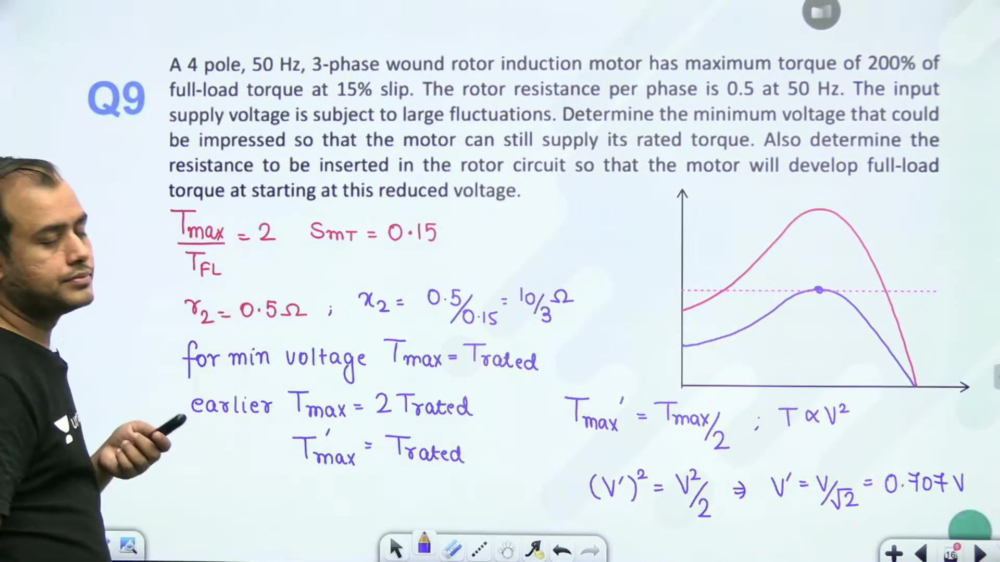

### External Resistance for Maximum Starting Torque

The second part of the problem asks for the external resistance required to develop rated torque at starting under this minimum voltage condition.

Because rated torque is now the maximum breakdown torque, maximum torque must occur precisely at starting ($s = 1$):
$$s_{mT, \text{new}} = 1$$

The condition for maximum torque at any slip is:
$$s_{mT} = \frac{R_{\text{total}}}{X_2} = \frac{R_2 + R_{\text{ext}}}{X_2}$$

First find the rotor reactance $X_2$ from the original operating condition:
$$s_{mT, \text{old}} = \frac{R_2}{X_2} = 0.15$$

Given $R_2 = 0.5\ \Omega/\text{phase}$:
$$X_2 = \frac{R_2}{0.15} = \frac{0.5}{0.15} = 3.33\ \Omega/\text{phase}$$

For maximum torque at standstill ($s = 1$):
$$R_2 + R_{\text{ext}} = X_2$$

Substitute the reactance value:
$$R_{\text{ext}} = X_2 - R_2 = 3.33 - 0.5 = 2.83\ \Omega/\text{phase}$$

So adding $2.83\ \Omega/\text{phase}$ external resistance produces maximum torque at start.

### Pole Amplitude Modulation and Consequent Poles

Next, examine pole count modification by changing coil connections.

> [!info] Principle of Consequent Poles
> In an AC winding, magnetic poles are created at the boundaries between conductors carrying currents in opposite directions. Adjacent opposite currents form alternating North and South magnetic poles.

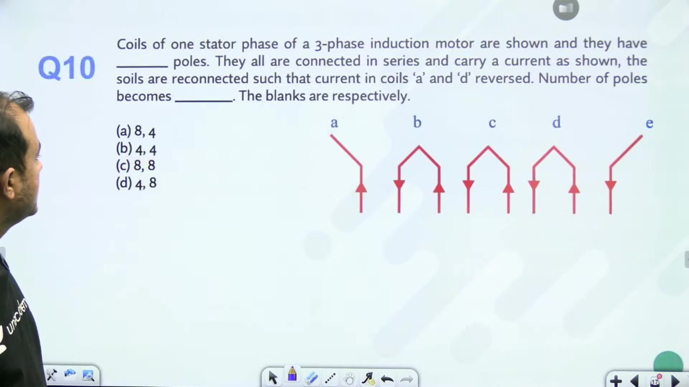

In a continuous cylindrical stator, the winding wraps around a circle. Each transition between upward and downward current arrows establishes a pole. 

Across an open diagram, 7 current reversals appear between adjacent coil sides. Closing the circular stator connects the two end conductors together. This forms the 8th pole.

The original connection therefore produces:
$$P = 8\ \text{poles}$$

We now examine how reversing current in selected coils modifies this total pole number.

## Consequent Pole Modification and Coil Reconnection
_(48:09 - 54:00)_

### Effect of Reversing Coils A and D

Recall the stator phase winding with series-connected coils labeled A through D. Initially the alternate current arrows produced an 8-pole magnetic field.

Now the connections to coils A and D are reversed. Current through coils A and D now flows in the opposite direction compared to before.

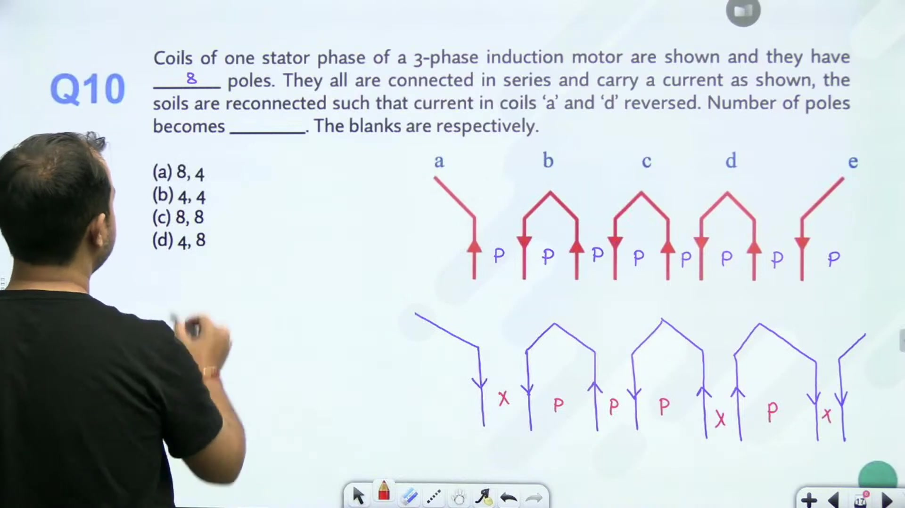

We reapply the fundamental rule for magnetic pole formation:
- A magnetic pole is formed between two adjacent conductors carrying currents in opposite directions.
- No pole forms between adjacent conductors carrying currents in the same direction.

Tracing along the coil sides:
1. Where adjacent conductors carry currents in opposite directions, a distinct North or South magnetic pole appears.
2. Where adjacent conductors carry currents in the same direction, the magnetic fields merge into a single extended region without forming an intermediate pole.
3. Accounting for all reversals along the winding path and across the closed cylindrical boundary yields fewer total reversals.

Counting the reversals after reconnecting coils A and D shows that the number of distinct poles reduces from 8 to 4 poles:
$$P_{\text{new}} = 4\ \text{poles}$$

> [!success] Pole Changing Result
> By reversing the current in specific coil groups, the effective number of stator poles changes from 8 poles to 4 poles. This doubles synchronous speed from $750\ \text{rpm}$ to $1500\ \text{rpm}$ at $50\ \text{Hz}$.

### Turn and Conductor Relationships

In machine design and winding calculations, remember the basic relationship between conductors and turns:
- Each complete turn comprises two active coil conductors (one on each coil side).
- Therefore, for a total of $Z$ conductors, the number of turns is:
$$T = \frac{Z}{2}$$

For a balanced 3-phase machine, the number of series turns per phase is:
$$T_{\text{ph}} = \frac{T}{3} = \frac{Z}{6}$$

This distinction is essential when calculating winding factors, induced electromotive forces, and equivalent circuit parameters referred across stator and rotor phases.

---

## Summary and Key Takeaways

- In an induction motor, power partitions according to the strict ratio $P_g : P_{cu} : P_m = 1 : s : (1 - s)$, allowing developed mechanical power to define air gap power through $P_g = P_m / (1 - s)$.
- When external rotor resistance is inserted while maintaining rated stator current and constant terminal voltage, input impedance magnitude $|Z_2|$ remains constant, forcing $R_2 / s_1 = (R_2 + R_{\text{ext}}) / s_2$.
- Constant air gap power under increased slip diverts developed mechanical power into increased rotor copper loss in direct proportion to slip: $P_{cu} = s P_g$.
- For fan loads where load torque obeys $T_L \propto N^2$, torque equality in the low-slip region gives $s / (R_2 + R_{\text{ext}}) \propto (1 - s)^2$.
- In an inverted induction motor fed from slip rings, the magnetic field rotates at synchronous speed $N_s = 120f / P$ relative to the physical rotor structure.
- Mechanical power developed by an inverted induction motor acts as prime mover input to a coupled generator: $P_m = (1 - s)P_g$.
- The lowest supply voltage capable of delivering rated load without stalling occurs when reduced breakdown torque equals rated torque: $T_{\text{max, new}} = T_{\text{fl}}$.
- Because maximum torque scales as $V^2$, halving the breakdown torque requires terminal voltage to remain at least $V_{\text{min}} = V_{\text{rated}} / \sqrt{2} \approx 0.707 V_{\text{rated}}$.
- Magnetic poles form at junctions where adjacent conductors carry opposite currents, and reversing selected coil groups alters the active pole count through consequent pole action.

