# Speed Control of IM - 2 | L 45 | Electrical Machines | GATE 2022 | Ankit Goyal

- **Source**: https://www.youtube.com/watch?v=N7RmYwEDxh0
- **Duration**: 00:45:46
- **Compiled**: 2026-09-23

---

## Overview

This lecture solves quantitative problems across multiple induction motor speed control techniques. It begins with frequency variation under fixed voltage and analyzes rotor EMF injection for sub-synchronous and super-synchronous operation. The discussion details stator voltage control penalties, evaluating rotor ohmic loss increase and power factor degradation under constant torque loads. It concludes with frequency shifts in breakdown torque, cumulative cascade set speed calculations, and autotransformer starting current quadratic scaling.

## Contents

- [[#Speed Control Classification and Supply Frequency Scaling|Speed Control Classification and Supply Frequency Scaling]]
- [[#Rotor EMF Injection Method and Constant Torque Analysis|Rotor EMF Injection Method and Constant Torque Analysis]]
- [[#Slip Solutions and Rotor Resistance Speed Control|Slip Solutions and Rotor Resistance Speed Control]]
- [[#Stator Voltage Control, Speed Degradation, and Rotor Copper Losses|Stator Voltage Control, Speed Degradation, and Rotor Copper Losses]]
- [[#Power Factor Degradation and V/f Magnetic Flux Constraints|Power Factor Degradation and V/f Magnetic Flux Constraints]]
- [[#Frequency Variation Effects on Maximum Breakdown Torque|Frequency Variation Effects on Maximum Breakdown Torque]]
- [[#Cascade Connection Analysis and Constant Slip-Speed V/f Control|Cascade Connection Analysis and Constant Slip-Speed V/f Control]]
- [[#Rotor Construction Constraints, Autotransformer Starting, and Injection Requirements|Rotor Construction Constraints, Autotransformer Starting, and Injection Requirements]]
- [[#Starting Resistance Optimization and Rheostatic Speed Control Limits|Starting Resistance Optimization and Rheostatic Speed Control Limits]]

---

## Speed Control Classification and Supply Frequency Scaling
_(00:00 - 04:41)_

### Overview of Induction Motor Speed Control Methods

Speed control of three-phase induction motors falls into six primary methods:
1. Rotor resistance control (applicable strictly to slip-ring induction motors).
2. Stator voltage control.
3. Rotor electromotive force (EMF) injection method.
4. Supply frequency ($V/f$) control.
5. Pole changing techniques (applicable to squirrel cage machines).
6. Cascade control of two mechanically coupled induction motors.

### Air Gap Flux Density Under Frequency Variation

When supply frequency varies without changing the applied terminal voltage, core saturation becomes a primary concern.

> [!info] Voltage-Frequency Flux Relation
> The peak magnetic flux density $B_m$ established across the stator and rotor air gap is governed by Faraday's law of induction. Neglecting stator impedance drop:
> $$V \approx E = 4.44 k_w f N_{\text{ph}} \Phi_m$$
> Because air gap flux $\Phi_m = B_m A_{\text{core}}$, the peak flux density scales directly with the ratio of applied terminal voltage to supply frequency:
> $$B_m \propto \frac{V}{f}$$

> [!example] Worked Example: Frequency Reduction at Constant Voltage
> The speed of an induction motor is controlled by varying supply frequency. The maximum air gap flux density is $B_{m1} = 1.0\ \text{T}$ at rated supply voltage and frequency. 
> 
> If the supply frequency is reduced to $0.75$ of its rated value while terminal voltage is kept unchanged, determine the new maximum air gap flux density $B_{m2}$.

We express the ratio of flux densities between the two operating states:
$$\frac{B_{m2}}{B_{m1}} = \left(\frac{V_2}{V_1}\right) \left(\frac{f_1}{f_2}\right)$$

Given conditions:
- $V_2 = V_1$ (voltage kept constant)
- $f_2 = 0.75 f_1$ (frequency reduced to 75%)
- $B_{m1} = 1.0\ \text{T}$

Substitute these values into the ratio:
$$\frac{B_{m2}}{1.0} = (1) \times \left(\frac{f_1}{0.75 f_1}\right) = \frac{1}{0.75} = \frac{4}{3} \approx 1.333$$

Solving for $B_{m2}$:
$$B_{m2} = 1.333\ \text{T}$$

> [!success] Core Saturation Result
> The air gap flux density increases to $1.333\ \text{T}$. Reducing frequency without reducing voltage forces the magnetic core deep into saturation, drastically increasing magnetizing current and core losses.

## Rotor EMF Injection Method and Constant Torque Analysis
_(04:58 - 09:53)_

### Principle of Rotor EMF Injection

Speed control by injecting an external voltage into the rotor circuit provides continuous control without large rheostatic losses. 

An external AC source injects an EMF $E_j$ through the slip rings at rotor slip frequency $f_r = s f$. When the injected EMF is in phase with the rotor induced EMF, it aids rotor current. When injected in phase opposition, it opposes rotor current.

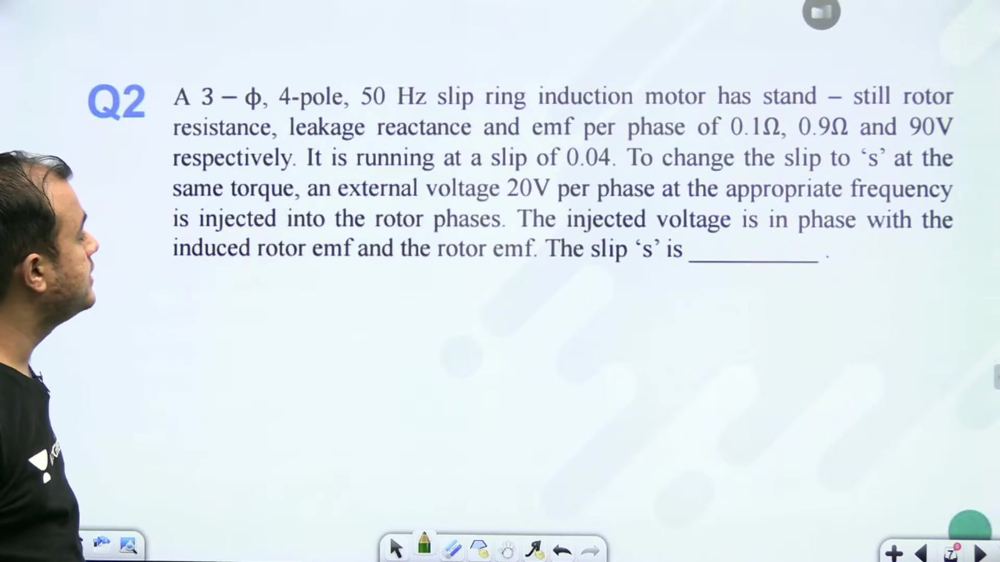

### Constant Torque and Air Gap Power Constraint

Consider motor operation under constant load torque:
$$T = \frac{P_g}{\omega_s} = \text{constant}$$

Because synchronous speed $\omega_s$ is fixed by the supply frequency, air gap power $P_g$ must remain constant:
$$P_g = 3 E_2 I_2 \cos \theta_2 = \text{constant}$$

The standstill rotor induced EMF $E_2$ depends strictly on air gap flux and remains constant. Therefore, maintaining constant torque requires:
$$I_2 \cos \theta_2 = \text{constant}$$

### Derivation of the Rotor Impedance Relation

Before injection, the rotor current and power factor angle are given by:
$$I_2 = \frac{s E_2}{\sqrt{R_2^2 + (s X_2)^2}}, \quad \cos \theta_2 = \frac{R_2}{\sqrt{R_2^2 + (s X_2)^2}}$$

Multiplying these two expressions yields:
$$I_2 \cos \theta_2 = \frac{s E_2 R_2}{R_2^2 + (s X_2)^2}$$

The denominator contains the square of rotor impedance:
$$Z_2^2 = R_2^2 + (s X_2)^2$$

Equating this expression before and after external EMF injection enforces the constant torque condition.

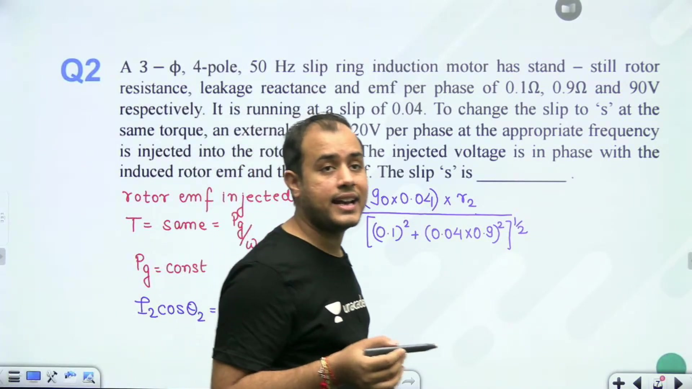

> [!example] Problem Formulation
> A 3-phase, 50 Hz induction motor has standstill rotor EMF $E_2 = 90\ \text{V/phase}$, rotor resistance $R_2 = 0.1\ \Omega/\text{phase}$, and standstill leakage reactance $X_2 = 1.0\ \Omega/\text{phase}$. At full load, the operating slip is $s_1 = 0.04$. 
> 
> An external voltage is injected into the rotor circuit to modify the operating slip to $s$ while delivering the same load torque.

We compute the baseline constant:
$$I_2 \cos \theta_2 \propto \frac{s_1 E_2 R_2}{R_2^2 + (s_1 X_2)^2}$$

Substitute the initial values:
$$\frac{0.04 \times 90 \times 0.1}{(0.1)^2 + (0.04 \times 1.0)^2} = \frac{0.36}{0.01 + 0.0016} = \frac{0.36}{0.0116} \approx 318.69$$

Equating this baseline value to the expression under the new operating condition establishes a quadratic equation in new slip $s$.

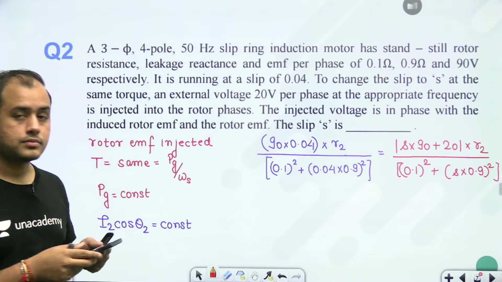

Expanding and collecting coefficients gives:
$$258.147 s^2 - 90 s - 16.813 = 0$$

Solving this quadratic equation yields two roots for slip:
$$s = 0.4833 \quad \text{and} \quad s = -0.1347$$

> [!success] Dual Speed Operating Modes
> The positive root $s = 0.4833$ corresponds to sub-synchronous motor operation. The negative root $s = -0.1347$ corresponds to super-synchronous motor operation, where the machine runs above synchronous speed while still motoring.

## Slip Solutions and Rotor Resistance Speed Control
_(10:00 - 14:56)_

### Physical Interpretation of Dual Slip Solutions

In the rotor EMF injection quadratic equation, two roots for slip were obtained:
$$s = 0.4833 \quad \text{and} \quad s = -0.1347$$

Both roots represent physically realizable steady-state operating points:
- **Sub-synchronous operation ($s > 0$)**: The injected voltage opposes the induced rotor EMF. Slip increases and rotor speed falls below synchronous speed. Power is extracted from the rotor circuit.
- **Super-synchronous operation ($s < 0$)**: The injected voltage aids the induced rotor EMF. Slip becomes negative and rotor speed exceeds synchronous speed ($N > N_s$). Power is injected into the rotor circuit from the external source.

This demonstrates that the rotor EMF injection method enables smooth bidirectional speed regulation on either side of synchronous speed.

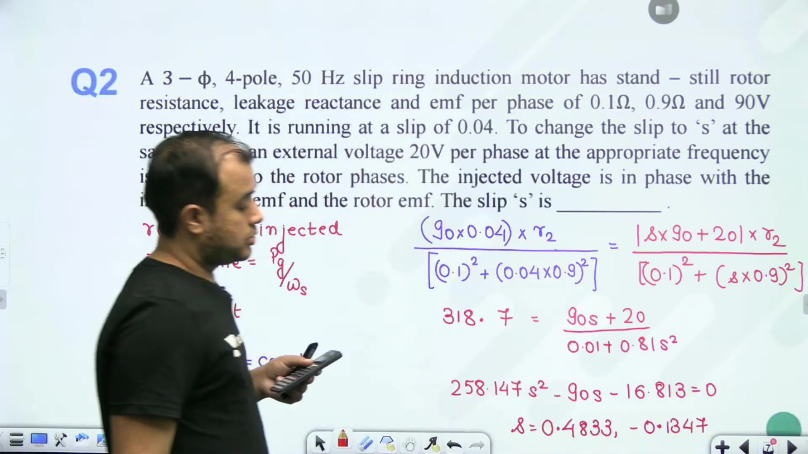

### Constant Torque Operation with Rotor Resistance Control

Now consider speed control by inserting external resistance into the rotor circuit.

> [!example] Worked Example: Added Resistance at Constant Torque
> A 3-phase induction motor operates initially at $1440\ \text{rpm}$ from a $50\ \text{Hz}$ supply. The rotor resistance is $R_2 = 0.25\ \Omega/\text{phase}$. 
> 
> Additional resistance $R_{\text{ext}}$ is inserted into the rotor circuit to reduce the speed to $1200\ \text{rpm}$ while the motor develops the same load torque. Determine the required added resistance.

First find the synchronous speed. The nearest synchronous speed above $1440\ \text{rpm}$ is $N_s = 1500\ \text{rpm}$ ($P = 4$).

Now compute the initial and final slips:
$$s_1 = \frac{1500 - 1440}{1500} = \frac{60}{1500} = 0.04$$
$$s_2 = \frac{1500 - 1200}{1500} = \frac{300}{1500} = 0.20$$

Under normal steady-state conditions, the motor operates in the stable linear low-slip zone:
$$T \approx \frac{3}{\omega_s} \cdot \frac{s V_1^2}{R_{\text{rotor}}}$$

Because terminal voltage $V_1$, synchronous speed $\omega_s$, and load torque $T$ remain constant:
$$\frac{s}{R_{\text{rotor}}} = \text{constant}$$

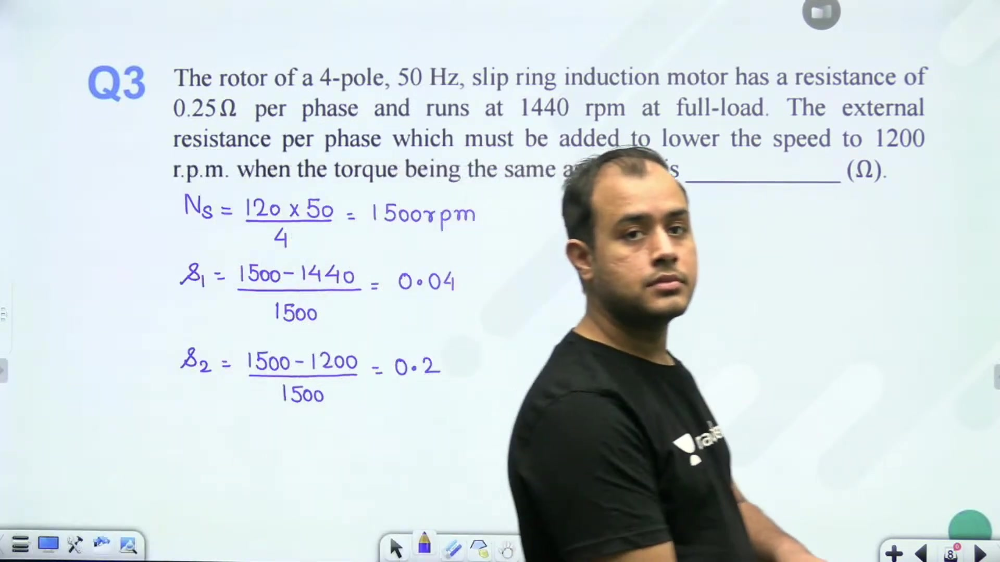

Equating the ratio between initial and final operating states gives:
$$\frac{s_1}{R_2} = \frac{s_2}{R_2 + R_{\text{ext}}}$$

Substitute the numerical values:
$$\frac{0.04}{0.25} = \frac{0.20}{R_2 + R_{\text{ext}}}$$

Cross-multiply and solve for total rotor circuit resistance:
$$R_2 + R_{\text{ext}} = 0.25 \times \frac{0.20}{0.04} = 0.25 \times 5 = 1.25\ \Omega/\text{phase}$$

Now compute the required external resistance:
$$R_{\text{ext}} = 1.25 - 0.25 = 1.0\ \Omega/\text{phase}$$

> [!success] Required Added Resistance
> To reduce the rotor speed from $1440\ \text{rpm}$ to $1200\ \text{rpm}$ under constant torque, an external resistance of $1.0\ \Omega/\text{phase}$ must be added.

## Stator Voltage Control, Speed Degradation, and Rotor Copper Losses
_(14:58 - 19:57)_

### Stator Voltage Speed Control Fundamentals

In stator voltage control, the terminal voltage applied to the induction motor stator is varied while maintaining supply frequency constant.

> [!example] Worked Example: Voltage Reduction at Constant Torque
> A 4-pole, 400 V, 50 Hz, 3-phase squirrel cage induction motor develops full load torque at $1470\ \text{rpm}$ with a full load power factor of $0.85$. Rotational losses and magnetizing branch current are neglected.
> 
> The supply voltage is reduced from $400\ \text{V}$ to $340\ \text{V}$ while driving the same load torque. Determine:
> 1. The new rotor speed.
> 2. The percentage increase in rotor ohmic losses.

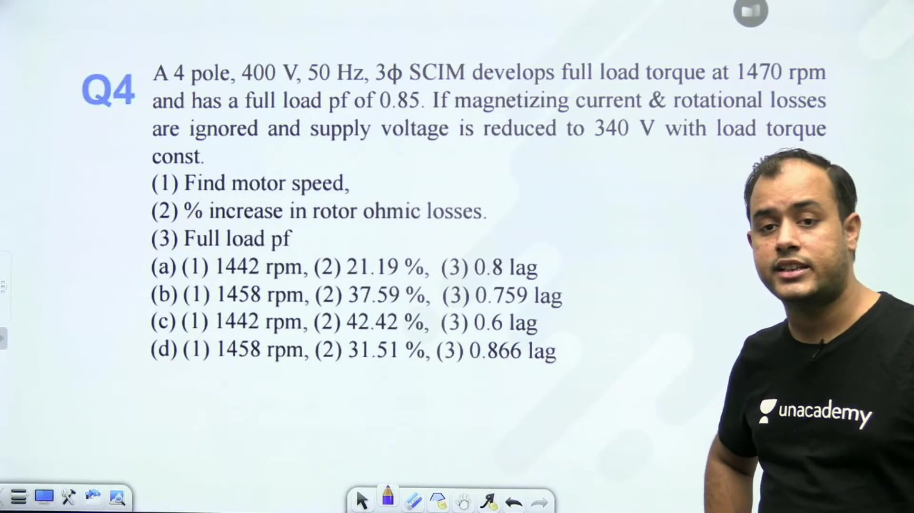

### Operating Slip and Speed Calculation

First determine synchronous speed:
$$N_s = \frac{120 f}{P} = \frac{120 \times 50}{4} = 1500\ \text{rpm}$$

The initial full-load slip at $1470\ \text{rpm}$ is:
$$s_1 = \frac{1500 - 1470}{1500} = \frac{30}{1500} = 0.02$$

In the normal operating low-slip region, electromagnetic torque is given by:
$$T \approx \frac{3}{\omega_s} \cdot \frac{s V^2}{R_2} \implies T \propto s V^2$$

Because load torque remains constant:
$$s_1 V_1^2 = s_2 V_2^2 \implies s_2 = s_1 \left(\frac{V_1}{V_2}\right)^2$$

Substitute the voltage values:
$$s_2 = 0.02 \times \left(\frac{400}{340}\right)^2 = 0.02 \times (1.1765)^2 = 0.02 \times 1.384 = 0.02768$$

Now calculate the new operating speed:
$$N_2 = N_s(1 - s_2) = 1500 \times (1 - 0.02768) \approx 1458.47\ \text{rpm}$$

> [!success] New Operating Speed
> Reducing terminal voltage from $400\ \text{V}$ to $340\ \text{V}$ forces slip to increase from $0.02$ to $0.02768$. Motor speed drops from $1470\ \text{rpm}$ to $1458.47\ \text{rpm}$.

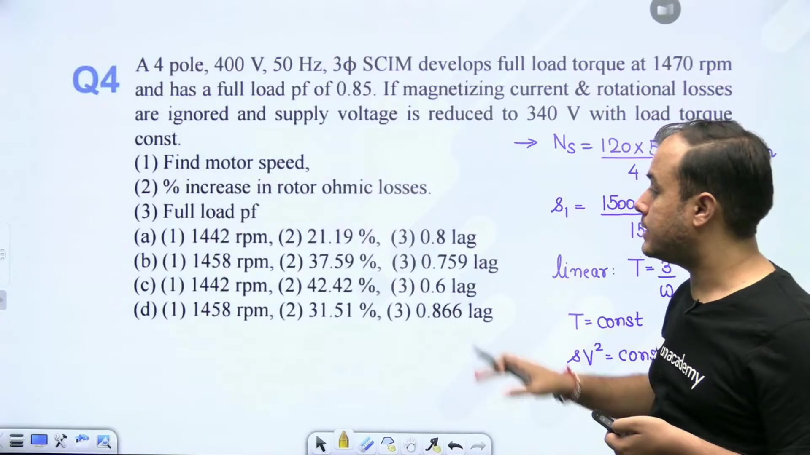

### Evaluation of Rotor Copper Losses

Next evaluate how rotor heating changes under voltage control.

The torque developed by the machine relates to air gap power by:
$$T = \frac{P_g}{\omega_s}$$

Since load torque $T$ and synchronous speed $\omega_s$ are constant, air gap power $P_g$ remains constant. Rotor copper loss relates directly to slip and air gap power:
$$P_{cu} = s P_g$$

Because $P_g$ is invariant:
$$\frac{P_{cu2}}{P_{cu1}} = \frac{s_2}{s_1} = \frac{0.02768}{0.02} = 1.384$$

The percentage increase in rotor copper losses is:
$$\% \Delta P_{cu} = (1.384 - 1.0) \times 100\% = 38.4\%$$

Rotor ohmic loss increases by $38.4\%$. This thermal penalty is the main disadvantage of stator voltage control, as the rotor must dissipate extra heat without developing additional shaft power.

## Power Factor Degradation and V/f Magnetic Flux Constraints
_(20:00 - 24:55)_

### Power Factor Calculation Under Reduced Stator Voltage

Continuing the stator voltage control problem, determine the operating power factor when terminal voltage drops to $340\ \text{V}$.

Neglecting magnetizing shunt current and core loss, the motor power factor equals the rotor circuit phase angle:
$$\cos \phi \approx \cos \theta_2$$

The rotor impedance seen by the induced EMF consists of effective resistance $R_2 / s$ and leakage reactance $X_2$:
$$\tan \phi = \frac{X_2}{R_2 / s} = \frac{s X_2}{R_2}$$

Because rotor resistance $R_2$ and reactance $X_2$ are constant machine parameters:
$$\tan \phi \propto s$$

Initially, at full load and rated voltage:
$$\cos \phi_1 = 0.85 \implies \phi_1 = \cos^{-1}(0.85) = 31.788^\circ$$

The initial tangent of the impedance angle is:
$$\tan \phi_1 = \tan(31.788^\circ) = 0.61974$$

Now evaluate the angle under the reduced voltage state where slip increased to $s_2 = 0.02768$:
$$\tan \phi_2 = \frac{s_2}{s_1} \tan \phi_1 = \frac{0.02768}{0.02} \times 0.61974 = 1.384 \times 0.61974 = 0.8577$$

Taking the inverse tangent:
$$\phi_2 = \tan^{-1}(0.8577) = 40.62^\circ$$

The resulting operating power factor is:
$$\cos \phi_2 = \cos(40.62^\circ) \approx 0.76\ \text{lagging}$$

> [!success] Power Factor Degradation
> As stator voltage drops at constant load torque, slip increases. This shifts the rotor impedance toward a higher inductive ratio, dropping power factor from $0.85$ lagging to $0.76$ lagging.

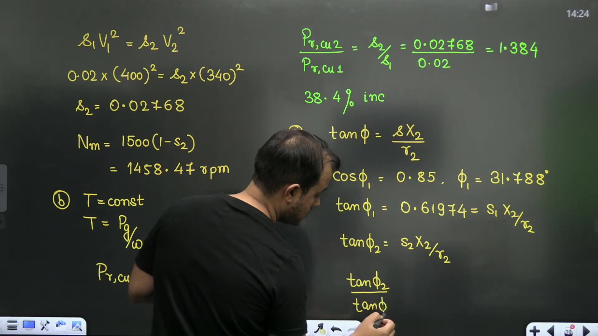

### Critical Examination of V/f Drive Flux Invariance

Next analyze constant $V/f$ induction motor drives through an assertion-reason question.

> [!example] Conceptual Check: Sub-Synchronous V/f Characteristics
> **Assertion (A)**: Under $V/f$ control of an induction motor, the maximum developed breakdown torque remains constant across a wide speed range in the sub-synchronous region.
> 
> **Reason (R)**: The magnetic flux in the machine is maintained constant at its rated value by keeping the terminal ratio $V/f$ constant.

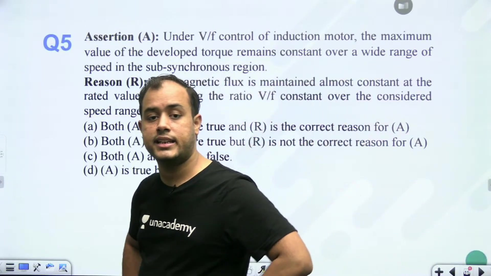

#### Evaluating the Assertion
Below base synchronous speed, keeping $V/f$ constant maintains approximately constant air gap flux. The maximum torque is given by:
$$T_{\text{max}} \approx \frac{3}{2 \omega_s} \cdot \frac{V^2}{2 X_1 + 2 X_2'} \propto \left(\frac{V}{f}\right)^2$$

Because $V/f$ is constant, peak breakdown torque remains essentially invariant over the sub-synchronous speed range. The motor operates as a constant torque drive. The assertion is true.

#### Evaluating the Reason
Air gap flux is actually governed by the internal induced EMF $E_1$, not the terminal voltage $V$:
$$\Phi_m \propto \frac{E_1}{f}$$

The stator terminal voltage relates to internal induced EMF by:
$$V = E_1 + I_1(R_1 + j X_1)$$

At high frequencies, the stator impedance drop $I_1 Z_1$ is negligibly small compared to $V$, so $E_1 \approx V$. 

At low supply frequencies and low terminal voltages, stator resistance $R_1$ does not scale down with frequency. The resistive voltage drop $I_1 R_1$ consumes a large fraction of terminal voltage:
$$E_1 = V - I_1 Z_1 \ll V$$

So $E_1 / f$ drops noticeably below its rated value:
$$\Phi_m < \Phi_{\text{rated}}$$

> [!info] Flux Weakening at Low Frequencies
> Maintaining the terminal ratio $V/f$ constant fails to maintain constant flux at low operating frequencies. Terminal voltage boost must be applied at low speeds to compensate for the stator resistance drop.
> 
> Therefore, Assertion (A) is True and Reason (R) is False (Option D).

## Frequency Variation Effects on Maximum Breakdown Torque
_(24:58 - 29:47)_

### Breakdown Torque and Slip under Supply Frequency Changes

When an induction motor is moved to a supply of different voltage and frequency, both its synchronous speed and leakage reactances change.

> [!example] Worked Example: Variable Frequency Supply Reconnection
> A 440 V, 3-phase, 4-pole, 50 Hz squirrel cage induction motor develops a maximum breakdown torque equal to three times full load torque at $1200\ \text{rpm}$:
> $$\frac{T_{\text{max1}}}{T_{\text{fl1}}} = 3, \quad N_{\text{max1}} = 1200\ \text{rpm}$$
> The motor is reconnected to a 400 V, 40 Hz source. 
> 
> Determine:
> 1. The speed at which maximum torque occurs.
> 2. The new ratio of maximum torque to full load torque.

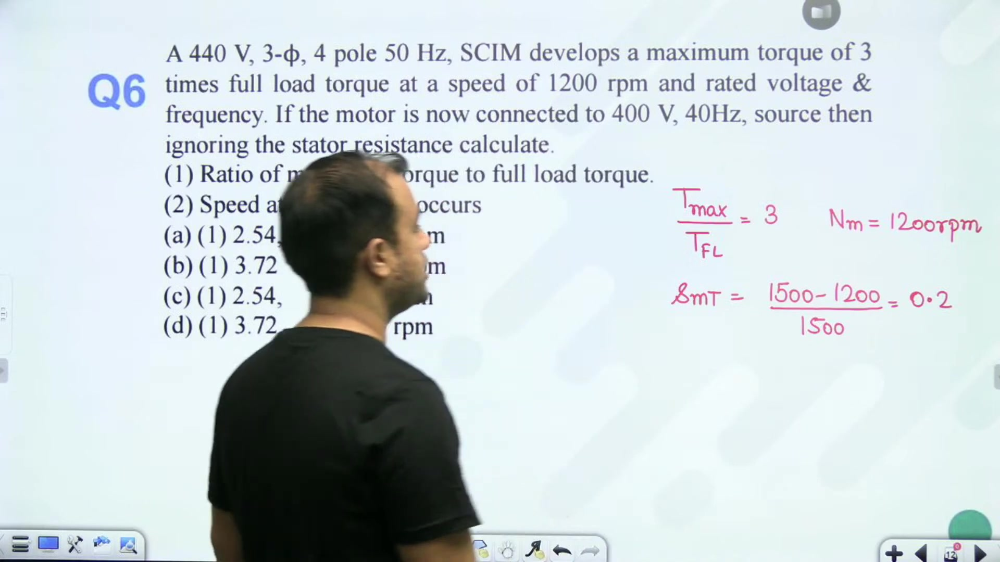

### Determining Initial Parameters and Full-Load Slip

The original synchronous speed at 50 Hz is:
$$N_{s1} = \frac{120 \times 50}{4} = 1500\ \text{rpm}$$

The slip at maximum torque under initial conditions is:
$$s_{mT1} = \frac{N_{s1} - N_{\text{max1}}}{N_{s1}} = \frac{1500 - 1200}{1500} = \frac{300}{1500} = 0.20$$

We relate full-load torque to maximum breakdown torque using the standard relation:
$$\frac{T_{\text{fl1}}}{T_{\text{max1}}} = \frac{2}{\frac{s_{\text{fl1}}}{s_{mT1}} + \frac{s_{mT1}}{s_{\text{fl1}}}} = \frac{1}{3}$$

Let $y = s_{\text{fl1}} / s_{mT1}$. Then:
$$\frac{2}{y + \frac{1}{y}} = \frac{1}{3} \implies y + \frac{1}{y} = 6$$

This yields the quadratic equation:
$$y^2 - 6y + 1 = 0$$

Solving for the smaller, stable root:
$$y = \frac{6 - \sqrt{36 - 4}}{2} = 3 - \sqrt{8} \approx 0.17157$$

Now calculate the initial full-load slip:
$$s_{\text{fl1}} = y \times s_{mT1} = 0.17157 \times 0.20 \approx 0.0343$$

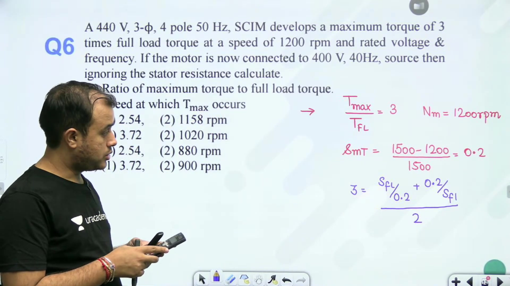

### Shift in Maximum Torque Speed at 40 Hz

Standstill rotor leakage reactance is directly proportional to frequency:
$$X_2 \propto f$$

The slip at maximum torque depends inversely on rotor reactance:
$$s_{mT} = \frac{R_2}{X_2} \propto \frac{1}{f}$$

Scaling $s_{mT}$ to the new 40 Hz frequency:
$$s_{mT2} = s_{mT1} \left(\frac{f_1}{f_2}\right) = 0.20 \times \left(\frac{50}{40}\right) = 0.25$$

The new synchronous speed at 40 Hz is:
$$N_{s2} = \frac{120 \times 40}{4} = 1200\ \text{rpm}$$

The speed at which maximum breakdown torque occurs is:
$$N_{\text{max2}} = N_{s2}(1 - s_{mT2}) = 1200 \times (1 - 0.25) = 900\ \text{rpm}$$

> [!success] Speed of Peak Torque
> At 40 Hz, peak breakdown torque occurs at $900\ \text{rpm}$.

### Evaluating the New Torque Ratio

Using the updated maximum slip $s_{mT2} = 0.25$ and the baseline full-load slip $s_{\text{fl}} \approx 0.0343$:
$$\frac{T_{\text{fl2}}}{T_{\text{max2}}} = \frac{2}{\frac{s_{\text{fl}}}{s_{mT2}} + \frac{s_{mT2}}{s_{\text{fl}}}} = \frac{2}{\frac{0.0343}{0.25} + \frac{0.25}{0.0343}} = \frac{2}{0.1372 + 7.2886} = \frac{2}{7.4258} \approx 0.2693$$

Inverting gives the new ratio of maximum torque to full-load torque:
$$\frac{T_{\text{max2}}}{T_{\text{fl2}}} = \frac{1}{0.2693} \approx 3.713$$

So reducing the frequency to 40 Hz increases the relative overload capability ratio to $3.713$.

## Cascade Connection Analysis and Constant Slip-Speed V/f Control
_(29:49 - 34:52)_

### Cumulative Cascade Connection Principles

In cascade control, two induction motors are mounted on a common mechanical shaft. The primary motor has slip rings and receives power directly from the main line supply. Its rotor output delivers slip-frequency electrical power to the stator of the auxiliary motor.

> [!example] Worked Example: Cumulative Cascade Set Speed
> A 4-pole main induction motor ($P_1 = 4$) and a 6-pole auxiliary induction motor ($P_2 = 6$) are connected in cumulative cascade. The supply frequency is $f = 50\ \text{Hz}$. 
> 
> The frequency measured in the secondary (rotor) winding of the auxiliary motor is $1.0\ \text{Hz}$. Determine the operating speed of the cascaded motor set.

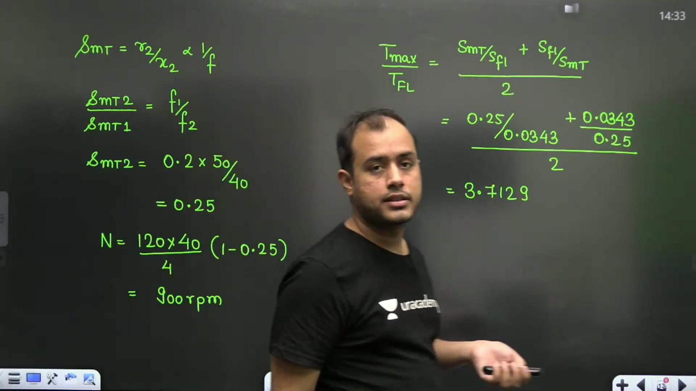

The stator of the auxiliary motor receives power at the rotor frequency of the main motor:
$$f_1' = s_1 f$$

The rotor frequency of the auxiliary motor is then:
$$f_2' = s_2 f_1' = s_1 s_2 f$$

Given $f_2' = 1.0\ \text{Hz}$ with $f = 50\ \text{Hz}$:
$$s_1 s_2 \times 50 = 1 \implies s_1 s_2 = \frac{1}{50} = 0.02$$

Because both motors are rigidly coupled to the same mechanical shaft, their operating speeds must match:
$$N_1 = N_2$$

Expressing the mechanical speeds in terms of synchronous speeds:
$$\frac{120 f}{P_1}(1 - s_1) = \frac{120 (s_1 f)}{P_2}(1 - s_2)$$

Canceling the common factor $120 f$:
$$\frac{1 - s_1}{P_1} = \frac{s_1(1 - s_2)}{P_2} = \frac{s_1 - s_1 s_2}{P_2}$$

Substitute $P_1 = 4$, $P_2 = 6$, and $s_1 s_2 = 0.02$:
$$\frac{1 - s_1}{4} = \frac{s_1 - 0.02}{6}$$

Cross-multiply and solve for $s_1$:
$$6(1 - s_1) = 4(s_1 - 0.02) \implies 6 - 6 s_1 = 4 s_1 - 0.08$$
$$10 s_1 = 6.08 \implies s_1 = 0.608$$

Now determine the set running speed from the main motor:
$$N = N_{s1}(1 - s_1) = \left(\frac{120 \times 50}{4}\right)(1 - 0.608) = 1500 \times 0.392 = 588\ \text{rpm}$$

> [!success] Cascade Set Speed
> The steady-state operating speed of the cumulative cascaded set is $588\ \text{rpm}$.

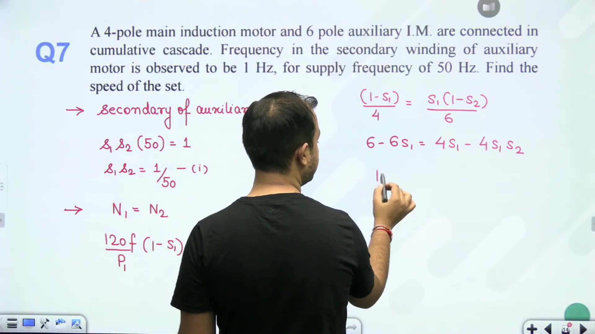

### Invariant Slip-Speed Property in V/f Control

Next analyze speed regulation under constant $V/f$ operation at reduced supply frequency.

> [!info] Slip Speed Invariance Rule
> In the stable low-slip operating region under constant $V/f$ control, the electromagnetic torque equation reduces to:
> $$T \propto \frac{s V^2}{f R_2} \propto \frac{s f^2}{f} \propto s f$$
> Because the absolute difference between synchronous speed and rotor speed is proportional to slip frequency:
> $$N_s - N_r = s N_s = s \left(\frac{120 f}{P}\right) \propto s f$$
> Therefore, if load torque is constant under constant $V/f$ control, the slip speed difference remains strictly constant:
> $$N_s - N_r = \text{constant}$$

> [!example] Worked Example: Constant Torque Speed at 30 Hz
> A 4-pole induction motor operates with constant $V/f$ control. At rated 50 Hz, 400 V supply, the running speed is $1440\ \text{rpm}$. 
> 
> Find the motor running speed when supply frequency is reduced to $30\ \text{Hz}$ under constant load torque.

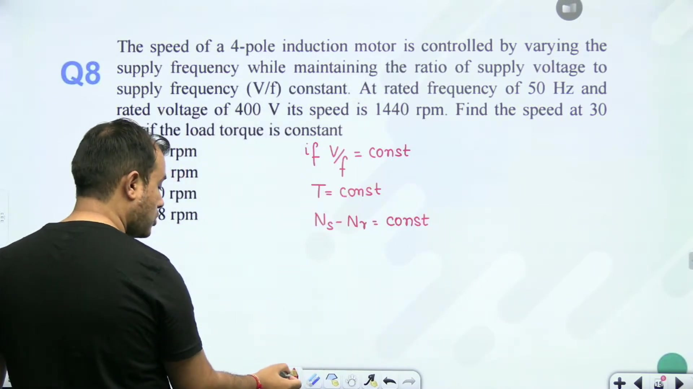

Evaluate the baseline slip speed at rated 50 Hz:
$$N_{s1} = \frac{120 \times 50}{4} = 1500\ \text{rpm}$$
$$N_{s1} - N_{r1} = 1500 - 1440 = 60\ \text{rpm}$$

Now determine the new synchronous speed at 30 Hz:
$$N_{s2} = \frac{120 \times 30}{4} = 900\ \text{rpm}$$

Applying the invariant slip speed property:
$$N_{s2} - N_{r2} = 60\ \text{rpm}$$

Solving for the new rotor operating speed:
$$N_{r2} = 900 - 60 = 840\ \text{rpm}$$

So the motor runs at $840\ \text{rpm}$ when frequency is lowered to $30\ \text{Hz}$ under constant load torque.

## Rotor Construction Constraints, Autotransformer Starting, and Injection Requirements
_(34:57 - 39:56)_

### Speed Control Applicability across Rotor Constructions

The physical construction of the rotor dictates which speed control methods are feasible:

> [!info] Squirrel Cage vs. Slip Ring Applicability
> 1. **Squirrel Cage Induction Motor (SCIM)**: Rotor conductors are permanently short-circuited by end rings. There is no external electrical access to the rotor. Therefore:
>    - Stator voltage control is applicable.
>    - Frequency ($V/f$) control is applicable.
>    - Pole changing techniques (consequent poles / PAM) are applicable.
>    - Rotor resistance and rotor EMF injection methods **cannot** be applied.
> 2. **Wound Rotor / Slip Ring Induction Motor (SRIM)**: Rotor phases terminate at external slip rings with carbon brushes. Rotor resistance control and rotor EMF injection methods are applicable. Pole changing is generally impractical because rotor winding poles must be reconfigured alongside the stator.

### Autotransformer Starting Current Scaling

In reduced-voltage autotransformer starting, understanding the difference between motor terminal current and supply line current is critical.

> [!example] Worked Example: Autotransformer Starting Current
> Direct-on-line (DOL) switching of normal rated voltage to a 3-phase induction motor produces a starting line current of $I_{\text{direct}} = 20\ \text{A}$. An autotransformer starter reduces starting voltage to $25\%$ of rated voltage ($x = 0.25$). 
> 
> Calculate the starting current drawn by the autotransformer from the AC supply.

Let the autotransformer tapping ratio be:
$$x = 0.25 = \frac{1}{4}$$

The voltage applied to the motor terminals is reduced by factor $x$:
$$V_{\text{motor}} = x V_{\text{rated}}$$

Because motor starting impedance at standstill is fixed, the current drawn by the motor scales linearly with terminal voltage:
$$I_{\text{motor, start}} = x I_{\text{direct}} = 0.25 \times 20 = 5.0\ \text{A}$$

The autotransformer is an ideal transformer where primary and secondary powers balance:
$$V_{\text{line}} I_{\text{line, start}} = V_{\text{motor}} I_{\text{motor, start}} = (x V_{\text{line}})(x I_{\text{direct}})$$

Therefore, the current drawn from the AC supply scales with the square of the tapping ratio:
$$I_{\text{line, start}} = x^2 I_{\text{direct}}$$

Substitute $x = 1/4$ and $I_{\text{direct}} = 20\ \text{A}$:
$$I_{\text{line, start}} = (0.25)^2 \times 20 = \frac{1}{16} \times 20 = 1.25\ \text{A}$$

> [!success] Supply vs. Motor Starting Current
> While the motor draws $5.0\ \text{A}$ at its terminals, the autotransformer draws only $1.25\ \text{A}$ from the AC supply line.

### Requirements for Secondary Foreign Voltage Injection

When using the voltage injection method for speed control:
- The injected voltage source connects across the rotor slip rings.
- To produce steady electromagnetic torque without pulsative fluctuations, the magnetic field produced by injected rotor currents must stay stationary relative to the stator air gap field.
- Therefore, the injected voltage frequency must strictly match the rotor slip frequency:
$$f_{\text{injected}} = f_r = s f$$

This method provides continuous bidirectional speed regulation above and below synchronous base speed without the heavy thermal penalties of rotor resistance insertion.

## Starting Resistance Optimization and Rheostatic Speed Control Limits
_(39:56 - 45:36)_

### Condition for Maximum Starting Torque

In wound-rotor induction motors, external resistance can be inserted into the rotor circuit through the slip rings at standstill.

> [!info] Maximum Torque at Standstill
> The general condition for developing peak breakdown torque at slip $s_{mT}$ is:
> $$s_{mT} = \frac{R_{\text{rotor}}}{X_2} = \frac{R_2 + R_{\text{ext}}}{X_2}$$
> To achieve maximum breakdown torque directly at start ($s = 1$):
> $$s_{mT} = 1 \implies R_2 + R_{\text{ext}} = X_2$$
> Therefore, external resistance must be added until total rotor circuit resistance equals standstill rotor leakage reactance:
> $$R_{\text{ext}} = X_2 - R_2$$

This condition cannot be implemented in squirrel cage motors because the rotor cage has fixed resistance and no slip rings.

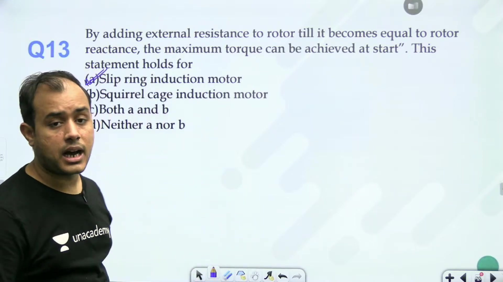

### Disadvantages of Rotor Resistance Speed Control

While inserting resistance into the rotor circuit provides a simple way to vary running speed, it possesses severe operational drawbacks:
1. **Low Operating Efficiency**: Rotor copper loss is directly proportional to slip ($P_{cu} = s P_g$). Operating at low speeds (high slip) diverts most air gap power into rotor ohmic heat.
2. **Thermal Dissipation Limits**: Continuous operation with large external resistors produces excessive heat, requiring bulky external cooling or liquid rheostats.
3. **Poor Speed Regulation**: The slope of the torque-speed curve flattens drastically. Small changes in shaft load torque result in large speed fluctuations.

Because of these severe losses, continuous industrial speed regulation favors solid-state variable frequency drives or rotor EMF injection systems.

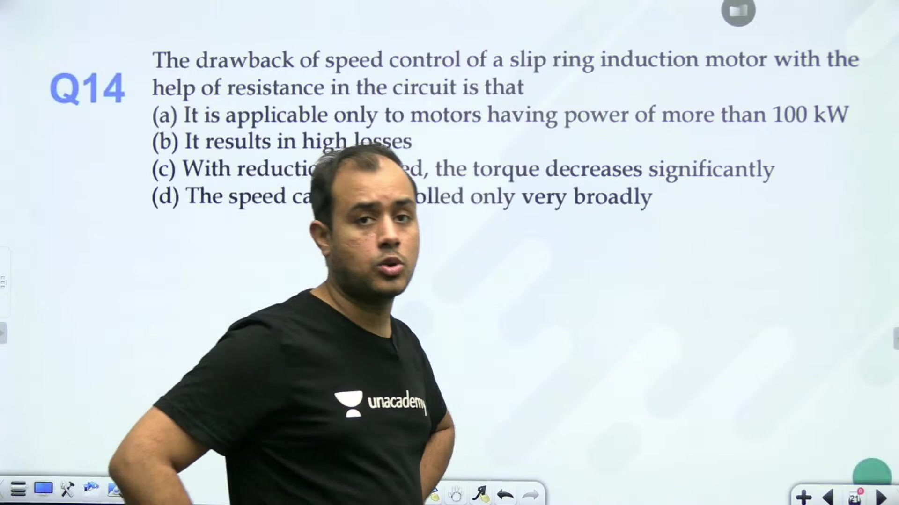

### Concluding Summary of Induction Motor Speed Regulation

The lecture established that while stator voltage control and rotor resistance control offer simple implementation, their high losses and narrow stable speed ranges restrict their use. Modern high-performance drives rely on constant $V/f$ inverter supplies for sub-synchronous constant-torque control and field weakening above base frequency. For wound rotor machines, secondary foreign voltage injection delivers efficient continuous bidirectional control across sub-synchronous and super-synchronous speeds.

---

## Summary and Key Takeaways

- Air gap flux density scales directly with the terminal voltage-to-frequency ratio $B_m \propto V/f$, causing core saturation if supply frequency is reduced without lowering applied voltage.
- Under constant load torque, rotor EMF injection maintains constant air gap power, enforcing $I_2 \cos \theta_2 = \text{constant}$ and yielding two operating slips corresponding to sub-synchronous and super-synchronous motoring.
- In the low-slip linear region, rotor resistance control maintains constant torque by preserving the ratio $s / R_{\text{rotor}} = \text{constant}$.
- Stator voltage control at constant torque forces operating slip to scale inversely with voltage squared according to $s \propto 1/V^2$.
- Rotor ohmic copper loss increases in direct proportion to operating slip under constant torque: $P_{cu} = s P_g$.
- Slip for maximum torque scales inversely with frequency ($s_{mT} \propto 1/f$), causing peak torque speed to shift when supply frequency changes.
- In a cumulative cascaded set, mechanical speeds match according to $(1 - s_1)/P_1 = (s_1 - s_1 s_2)/P_2$ with auxiliary rotor frequency given by $f_2' = s_1 s_2 f$.
- In constant $V/f$ drives driving constant torque loads, the absolute slip speed difference remains invariant across frequencies: $N_s - N_r = \text{constant}$.
- Autotransformer starting reduces motor terminal current by tapping ratio $x$, while the current drawn from the supply scales by $x^2$.

