# Braking of Induction Motor | Electrical Machines | Lec 109 | GATE & ESE (EE, ECE) | Ankit Goyal

- **Source**: https://www.youtube.com/watch?v=f-RBM0txOdc
- **Duration**: 00:27:37
- **Compiled**: 2026-09-23

---

## Overview

This lecture examines electrical braking methods for three-phase induction motors. It focuses on the operating principles and mathematical relationships of regenerative braking, dynamic braking, and plugging. The discussion details how stationary DC excitation produces a stationary stator field to achieve smooth dynamic retardation. It then derives the reverse torque and altered slip relationships that govern rapid deceleration during plugging. Finally, the lecture analyzes how frequency-dependent rotor skin effect influences starting performance and introduces pull-up torque.

## Contents

- [[#Electrical Braking Principles and Regenerative Deceleration|Electrical Braking Principles and Regenerative Deceleration]]
- [[#Dynamic Braking (DC Injection Braking)|Dynamic Braking (DC Injection Braking)]]
- [[#Dynamic Braking Torque and Plugging Fundamentals|Dynamic Braking Torque and Plugging Fundamentals]]
- [[#Dynamic Equations of Plugging and Skin Effect|Dynamic Equations of Plugging and Skin Effect]]

---

## Electrical Braking Principles and Regenerative Deceleration
_(00:13 - 07:11)_

### Mechanical versus Electrical Braking

Braking brings a rotating motor and its mechanical load to rest. Two methods are used in industrial drives:
1. **Mechanical Friction Braking**: Friction shoes, bands, or discs clamp against a rotating drum. Friction dissipates stored mechanical energy as heat. It suffers from friction lining wear and lacks rapid, fine-tuned control.
2. **Electrical Braking**: The motor converts rotating kinetic energy into electrical energy, either feeding it back to the supply or dissipating it internally. It provides rapid deceleration without mechanical friction wear.

> [!info] Objective of Electrical Braking
> Electrical braking applies electromagnetic torque opposite to the direction of shaft rotation, bringing the rotor to rest within a minimum desired time interval.

Similar to DC machines, three primary electrical braking methods exist for three-phase induction motors:
- Regenerative braking.
- Dynamic (DC injection) braking.
- Plugging (reverse current braking).

### Regenerative Braking Mechanism

Regenerative braking occurs when the induction machine transitions from motor action into generator action.

Recall the operational distinction:
- **Motoring Mode**: The rotor rotates slower than the stator magnetic field ($N_r < N_s$). Slip is positive ($0 < s < 1$). The machine draws active electrical power and delivers mechanical shaft torque.
- **Generating Mode**: The rotor rotates faster than the stator magnetic field ($N_r > N_s$). Slip becomes negative ($s < 0$). Mechanical power drives the rotor, and the machine returns active electrical power to the AC supply.

When braking, rotor speed $N_r$ cannot be suddenly increased because no prime mover is attached. Instead, synchronous speed $N_s$ is abruptly reduced below the operating speed $N_r$:
$$N_s < N_r$$

Under this condition, the machine acts as an induction generator. The kinetic energy stored in the rotating mass:
$$E_k = \frac{1}{2} J \omega_r^2$$
is converted into electrical power and returned to the supply mains. This extracts kinetic energy, rapidly decelerating the motor shaft.

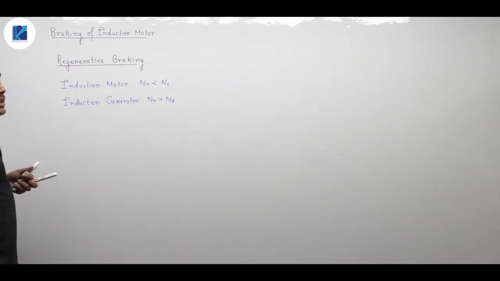

### Methods of Lowering Synchronous Speed

Synchronous speed is defined by:
$$N_s = \frac{120 f}{P}$$

To reduce $N_s$ below the current rotor speed $N_r$, two techniques are used:
1. **Pole Changing Technique**: Stator coil connections are reconfigured to double the effective pole count from $P$ to $2P$. This cuts synchronous speed in half ($N_s' = N_s / 2$). If the rotor was running near original synchronous speed, it finds itself running faster than $N_s'$, initiating regenerative braking.
2. **Variable Frequency Inverter Control**: In variable frequency drives (VFDs), the supply frequency $f$ is continuously ramped down while keeping the $V/f$ ratio constant. Synchronous speed drops smoothly ahead of the rotor speed, maintaining regenerative braking across a wide speed range.

### Crucial Operational Constraint

As the machine regenerates, rotor speed $N_r$ drops rapidly. 

If the supply remains connected after $N_r$ drops below the new lower synchronous speed $N_s$, the slip becomes positive again ($N_r < N_s$). The machine resumes motoring operation and stabilizes at the lower synchronous speed rather than coming to rest.

> [!important] Supply Disconnection Rule
> To prevent re-acceleration in the motoring mode, the stator supply must be disconnected or transferred to a plugging/friction brake just before rotor speed reaches the lower synchronous speed.

## Dynamic Braking (DC Injection Braking)
_(07:11 - 12:12)_

Dynamic braking provides controlled deceleration without returning energy to the AC supply line. In an induction motor, this method requires replacing the three-phase AC excitation with a direct current supply across the stator terminals.

### DC Excitation Principle

When stopping the motor, the three-phase AC line is disconnected from the stator. A DC source is then connected across the stator terminals. 

Because the stator current is direct current, the magnetic field cannot rotate. The stator magnetic field becomes completely stationary in space. Its angular velocity is zero:

$$N_s = 0\text{ rpm}$$

The rotor continues rotating in the forward direction at speed $N_r$ due to mechanical inertia. As the rotor conductors cut this stationary magnetic field, voltages are induced in the rotor cage or windings. The resulting rotor currents interact with the stationary stator flux to produce a counter torque. This torque opposes rotation and slows the rotor down quickly.

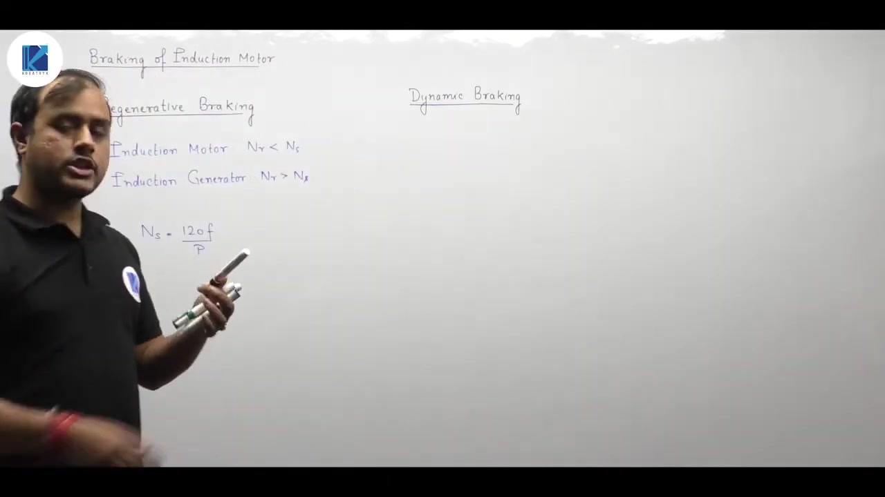

### Resultant Stator MMF Under DC Injection

To see how the stationary field forms, consider three stator phases placed $120^\circ$ apart in space: $A\text{-}A'$, $B\text{-}B'$, and $C\text{-}C'$. 

Suppose a DC current $I$ enters phase $A$ and returns equally through phases $B$ and $C$ in parallel:

$$\begin{aligned}
I_A &= I \\
I_B &= -\frac{I}{2} \\
I_C &= -\frac{I}{2}
\end{aligned}$$

Each phase winding has an effective turns count $N$. The individual MMF magnitudes are:

$$\begin{aligned}
F_A &= N I \\
F_B &= \frac{1}{2} N I \\
F_C &= \frac{1}{2} N I
\end{aligned}$$

Phase $A$ produces an MMF directed along its positive magnetic axis. Phases $B$ and $C$ carry negative currents. Their MMF vectors point in the reverse directions of their spatial axes. 

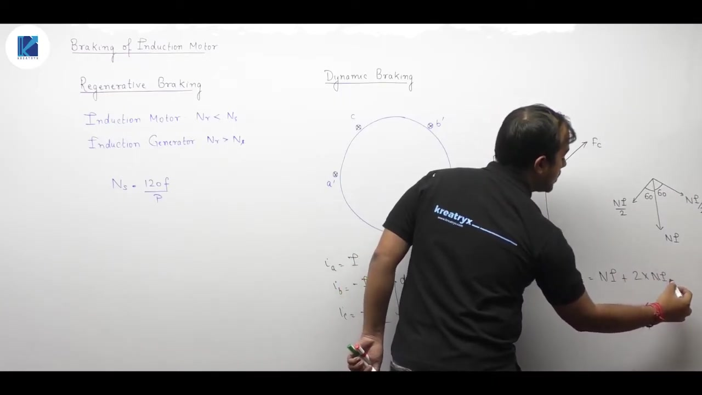

Resolving these components along the axis of phase $A$ and its perpendicular axis:

$$\begin{aligned}
F_{\text{horizontal}} &= F_B \sin(60^\circ) - F_C \sin(60^\circ) = 0 \\
F_{\text{vertical}} &= F_A + F_B \cos(60^\circ) + F_C \cos(60^\circ) \\
&= N I + 2 \left( \frac{1}{2} N I \cos(60^\circ) \right) \\
&= N I + N I \left(\frac{1}{2}\right) \\
&= \frac{3}{2} N I
\end{aligned}$$

> [!success] Result
> The resultant stator MMF has a constant magnitude of $\frac{3}{2} N I$ fixed along the phase $A$ axis:
> $$F_{\text{net}} = 1.5 N I$$
> The field magnitude remains constant, but its spatial speed is zero.

### Effective Operating Slip and Braking Action

Slip measures the relative motion between the stator magnetic field and the rotor conductors:

$$s = \frac{\text{Speed of Stator Field} - \text{Speed of Rotor}}{\text{Synchronous Speed}}$$

Under DC injection braking, the stator field speed is zero ($N_s = 0$). The rotor spins forward at speed $N_r$. Relative to the rated base synchronous speed $N_{s0}$:

$$s_b = \frac{0 - N_r}{N_{s0}} = -\frac{N_r}{N_{s0}}$$

The negative slip indicates generator action relative to the stationary field. Kinetic energy stored in the rotating mass converts into electrical energy. This energy dissipates as heat in the rotor circuit resistance.

As the rotor slows down, $N_r$ drops toward zero. When $N_r = 0$, relative motion ceases and the braking torque becomes zero. So dynamic braking brings the motor to rest smoothly without reversing its direction of rotation.

## Dynamic Braking Torque and Plugging Fundamentals
_(12:22 - 17:36)_

Dynamic braking retards the rotor through negative slip and Lenz's law. In contrast, plugging achieves rapid deceleration by reversing the stator phase sequence.

### Torque Derivation in Dynamic Braking

In dynamic braking, the motor operates with a negative relative slip:

$$s_b = -\frac{N_r}{N_{s0}}$$

The torque developed in an induction machine referred to the stator is:

$$T = \frac{3}{\omega_s} \frac{V^2 \frac{R_2'}{s}}{\left(R_1 + \frac{R_2'}{s}\right)^2 + (X_1 + X_2')^2}$$

When we substitute negative slip $s = s_b < 0$ into this expression, the calculated torque becomes negative:

$$T_{\text{brake}} < 0$$

A negative electromagnetic torque opposes forward rotation. Rather than driving the load, the electromagnetic torque acts directly as a retarding torque.

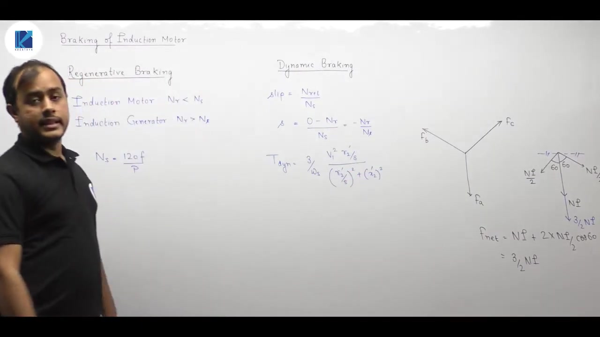

### Physical Mechanism via Lenz's Law

The stopping action follows directly from Lenz's law:
1. The stator DC excitation holds the magnetic field completely stationary in space.
2. The rotor conductors cut through this stationary magnetic flux as they spin forward.
3. Voltages and currents are induced in the closed rotor circuit.
4. By Lenz's law, these induced currents set up an opposing torque that tries to reduce the relative velocity between field and rotor.

Because the stator field is fixed by DC current, it cannot rotate to catch up with the rotor. The rotor is forced to decelerate toward standstill. When the rotor reaches zero speed, relative motion vanishes and induced torque drops to zero.

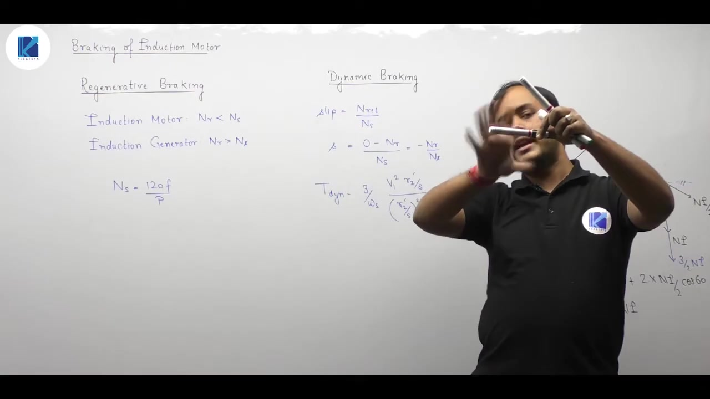

### Principle of Plugging (Reverse Current Braking)

Plugging is the fastest electrical braking method. In a DC motor, plugging requires reversing the armature voltage polarity. In a three-phase induction motor, we interchange any two supply lines connected to the stator.

Interchanging two lines reverses the phase sequence from $A\text{-}B\text{-}C$ to $A\text{-}C\text{-}B$. This abruptly reverses the direction of the rotating magnetic field.

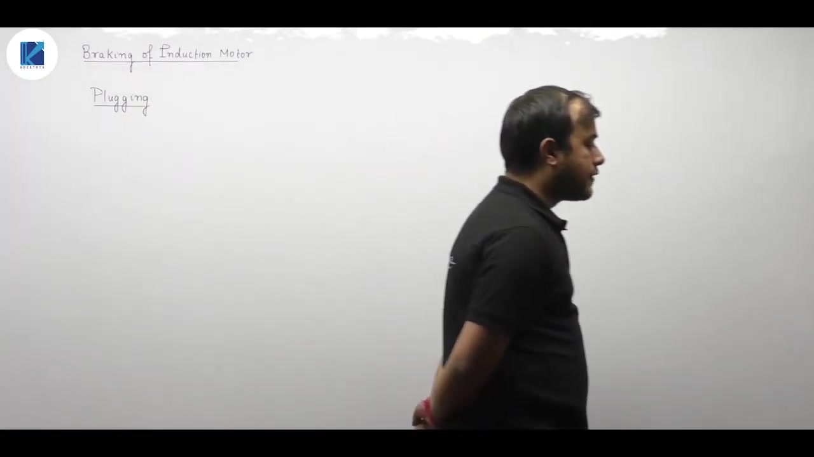

> [!info] Definition
> **Plugging** is the braking method where any two stator supply leads are interchanged. This reverses the phase sequence, causing the stator rotating magnetic field to rotate opposite to the rotor.

When the field reverses direction, synchronous speed changes from $+N_s$ to $-N_s$. The backward-rotating magnetic field sweeps past the forward-rotating rotor conductors at very high relative speed:

$$N_{\text{rel}} = -N_s - N_r = -(N_s + N_r)$$

This creates a large reverse electromagnetic torque that quickly forces the rotor to a stop.

### Slip During Plugging

Before plugging, the motor runs forward at speed $N_r \approx N_s$, so slip $s \approx 0$. 

Immediately after interchanging the stator leads, synchronous speed becomes $-N_s$. The new operating slip $s_p$ is:

$$\begin{aligned}
s_p &= \frac{(-N_s) - N_r}{-N_s} \\
&= \frac{N_s + N_r}{N_s} \\
&= 1 + \frac{N_r}{N_s}
\end{aligned}$$

Since $N_r / N_s = 1 - s$, where $s$ is the normal motoring slip:

$$s_p = 1 + (1 - s) = 2 - s$$

> [!success] Result
> At the instant of plugging from near synchronous speed ($s \approx 0$), the slip reaches:
> $$s_p \approx 2$$
> As the motor decelerates toward standstill ($N_r = 0$), the slip decreases to:
> $$s_p = 1$$

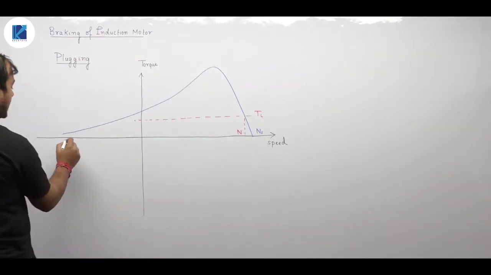

Because the field rotates at $-N_s$, the torque-speed curve shifts into the plugging region. The counter-torque remains strong all the way down to zero speed. If the supply is not disconnected at standstill, the motor will accelerate in the reverse direction.

## Dynamic Equations of Plugging and Skin Effect
_(17:39 - 27:29)_

Reversing the stator phase sequence inverts the electromagnetic torque. This section covers the dynamic deceleration equations during plugging and explains how skin effect alters torque-speed curves.

### Mechanics of Deceleration During Plugging

The rotational dynamics of the motor drive obey Newton's second law for rotating bodies:

$$J \frac{d\omega}{dt} = T_e - T_L$$

Here $J$ is the total moment of inertia. $T_e$ is the developed motor torque and $T_L$ is the load torque. 

Before braking, the motor operates at steady speed, so acceleration is zero:

$$\frac{d\omega}{dt} = 0 \implies T_e = T_L$$

During normal motoring at slip $s$, the load torque matches the baseline motor torque:

$$T_L = \frac{3}{\omega_s} \frac{V^2 \frac{R_2'}{s}}{\left(R_1 + \frac{R_2'}{s}\right)^2 + (X_1 + X_2')^2}$$

Upon reversing the stator phase sequence, the motor torque reverses its direction:

$$T_e = -T_{\text{plugging}}$$

Now both the electromagnetic torque and the load torque act in the same direction to retard the motor:

$$J \frac{d\omega}{dt} = -T_{\text{plugging}} - T_L = -(|T_e| + T_L)$$

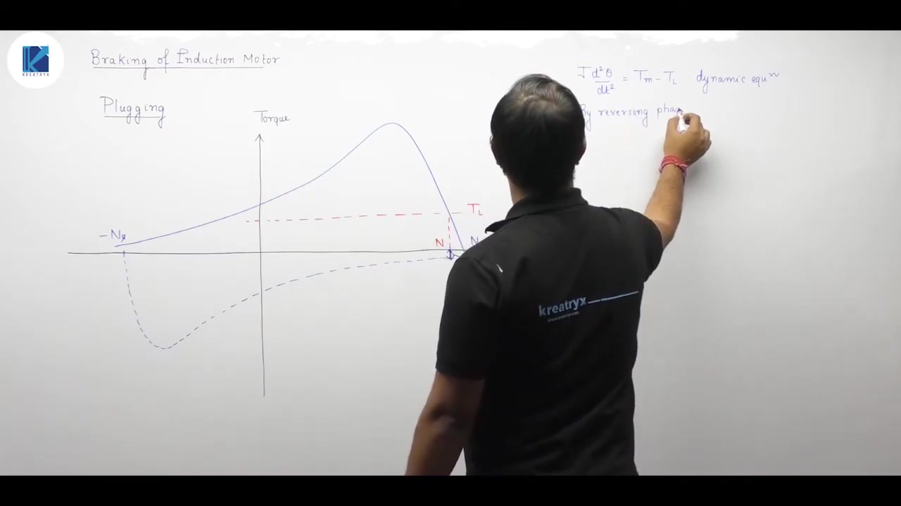

The net braking torque that decelerates the drive is:

$$T_{\text{braking}} = T_{\text{plugging}} + T_L$$

> [!success] Result
> The plugging torque is calculated using the altered slip $s_p = 2 - s$:
> $$T_{\text{plugging}} = \frac{3}{\omega_s} \frac{V^2 \frac{R_2'}{2 - s}}{\left(R_1 + \frac{R_2'}{2 - s}\right)^2 + (X_1 + X_2')^2}$$
> The total instantaneous braking torque decelerating the rotor shaft is:
> $$T_{\text{braking}} = T(s) + T(2 - s)$$

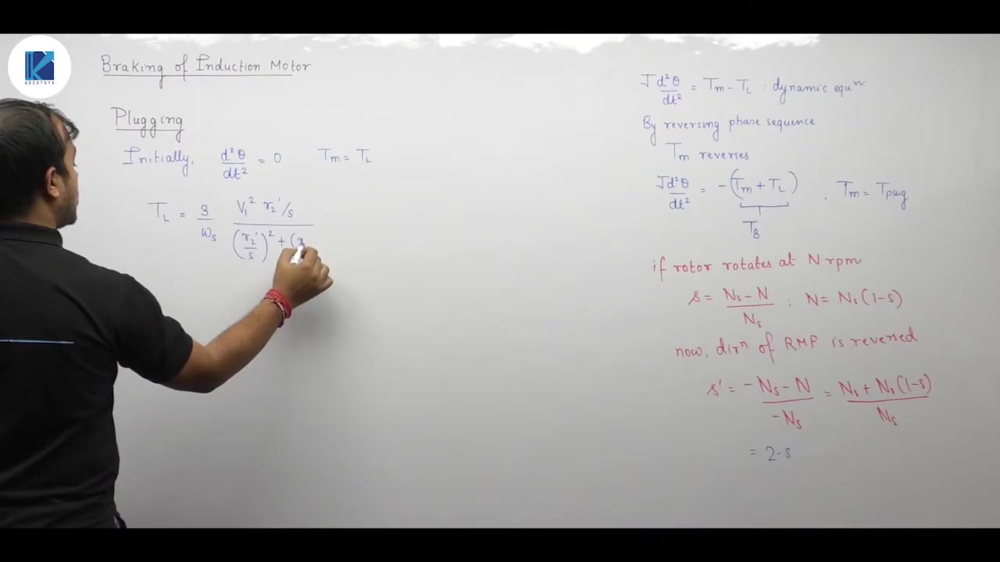

### Skin Effect and Torque-Speed Profile

In practical induction machines, rotor conductor resistance is not constant. It varies with rotor current frequency due to the skin effect.

At the instant of starting, slip is unity ($s = 1$). The rotor frequency equals the stator line frequency:

$$f_r = s f = f$$

For a 50 Hz line supply, the rotor current alternates at 50 Hz at stand-still. High frequency forces current to concentrate near the outer surface of rotor conductors. This skin effect sharply raises the effective AC rotor resistance $R_2$.

Since starting torque is proportional to rotor resistance:

$$T_{\text{st}} \propto R_2$$

The elevated rotor resistance boosts starting torque above its nominal DC-resistance value.

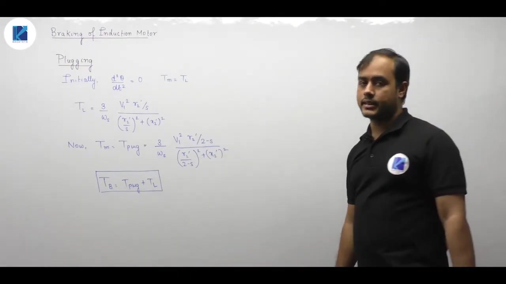

### Pull-Up Torque and Breakdown Torque

As the rotor accelerates, slip $s$ decreases rapidly. The rotor frequency drops accordingly:

$$f_r = s f \ll f$$

As rotor frequency declines, the skin effect diminishes. The effective rotor resistance falls back toward its lower DC resistance value. 

When rotor resistance drops, developed torque briefly decreases before the classic low-slip behavior dominates. This creates a dip in the torque-speed curve at intermediate speeds.

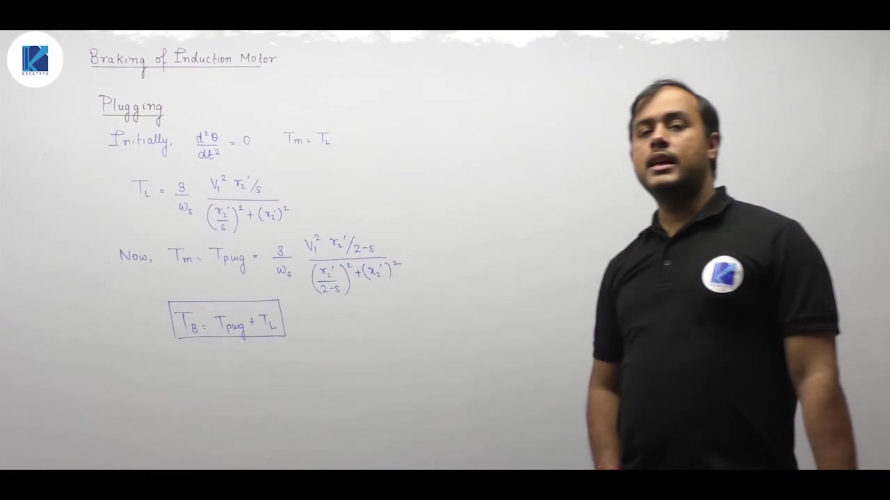

Key landmarks on this practical torque-speed curve are:
1. **Breakdown Torque (Maximum / Pull-Out Torque)**: The highest electromagnetic torque developed by the motor along its stable characteristic.
2. **Pull-Up Torque**: The local minimum torque reached during the dip as the motor accelerates from rest.

> [!info] Definition
> **Pull-up torque** is the minimum torque developed by an induction motor between stand-still and the breakdown torque region. It is caused by frequency-dependent skin effect variations in the rotor conductors.

Beyond the pull-up dip, rotor frequency is very small (typically 1 to 3 Hz). Rotor resistance remains essentially constant, and the motor follows standard textbook induction curves up to its operating speed.

---

## Summary and Key Takeaways

- Electrical braking converts rotating mechanical kinetic energy into electrical energy without wearing mechanical brake shoes.
- Regenerative braking occurs when rotor speed exceeds synchronous speed ($N_r > N_s$), producing negative slip and returning electric power to the AC supply.
- In dynamic braking, the AC line is disconnected and DC current is injected across the stator terminals, setting up a stationary magnetic field of magnitude $1.5 N I$.
- The effective operating slip during dynamic braking is negative ($s_b = -N_r / N_{s0}$), producing a counter-torque that brings the rotor to rest without reversal.
- Plugging is initiated by swapping two stator supply lines, reversing the rotating field to synchronous speed $-N_s$.
- The operating slip at the start of plugging from near-synchronous forward speed is $s_p = 2 - s \approx 2$.
- The total decelerating torque during plugging equals the sum of the electromagnetic plugging torque and the mechanical load torque: $T_{\text{braking}} = T_{\text{plugging}} + T_L$.
- Skin effect at line frequency raises effective rotor resistance at stand-still, boosting starting torque.
- Diminishing skin effect as the rotor accelerates creates a temporary dip in torque known as pull-up torque before reaching breakdown torque.

