# Braking of Induction Motor | L 46 | Electrical Machines | GATE 2022 | Ankit Goyal

- **Source**: https://www.youtube.com/watch?v=0m4pbxc7uwE
- **Duration**: 00:27:06
- **Compiled**: 2026-09-23

---

## Overview

This practice session reviews electrical braking methods for three-phase induction motors through conceptual questions and numerical calculations. It examines industrial selection criteria, comparing regenerative braking, DC dynamic braking, and plugging across hoists, rolling mills, and machine tools. The lecture details the terminal connections and operating slip regions that define each braking mode. It then presents a complete numerical evaluation of load torque, plugging torque, and total retarding torque using induction motor equivalent circuit parameters.

## Contents

- [[#Industrial Braking Applications and Selection|Industrial Braking Applications and Selection]]
- [[#Operating Modes and Terminal Conditions|Operating Modes and Terminal Conditions]]
- [[#Efficiency, Braking Torque, and DC Excitation|Efficiency, Braking Torque, and DC Excitation]]
- [[#Numerical Analysis of Plugging and Dynamic Braking|Numerical Analysis of Plugging and Dynamic Braking]]
- [[#Summary of Braking Concepts and Exam Strategy|Summary of Braking Concepts and Exam Strategy]]

---

## Industrial Braking Applications and Selection
_(00:02 - 04:40)_

Electrical braking brings an induction motor smoothly and rapidly to rest without mechanical friction wear. Selecting an appropriate braking technique depends on the operational demands of the industrial load.

### Comparison of Electrical Braking Methods

Three principal electrical braking techniques apply to three-phase induction machines:
1. **Regenerative Braking**: The rotor speed exceeds the stator synchronous speed ($N_r > N_s$). Mechanical kinetic energy is converted into electrical energy and sent back to the AC grid.
2. **Dynamic Braking (DC Injection Braking)**: The stator is disconnected from the AC line and supplied with DC current. The resulting stationary magnetic field retards the rotating rotor smoothly.
3. **Plugging (Reverse Current Braking)**: Two stator supply terminals are interchanged. This reverses the phase sequence, causing the stator field to rotate backwards and develop a massive counter-torque.

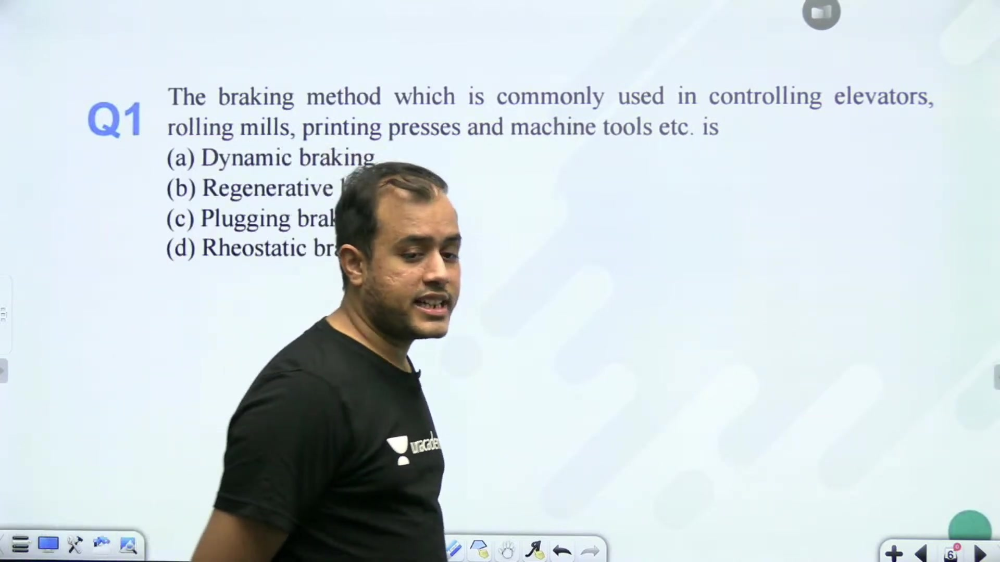

### Industrial Application Criteria

Different industrial loads require specific braking characteristics:

- **Electric Traction, Cranes, and Hoists**: Regenerative braking is ideal here. When a crane lowers a heavy load or an electric train travels downhill, gravity drives the motor above synchronous speed. The machine works as an induction generator and feeds power back into the overhead catenary. This conserves large quantities of energy.
- **Elevators, Rolling Mills, Printing Presses, and Machine Tools**: These drives require smooth, controlled deceleration to precise stopping positions without mechanical shock. Dynamic braking is preferred in these applications. It dissipates the kinetic energy in the rotor resistance and brings the shaft to rest without reversing the rotation.

> [!example] Problem
> The braking method commonly used in controlling elevators, rolling mills, printing presses, and machine tools is:
> - (A) Regenerative braking
> - (B) Dynamic braking
> - (C) Plugging
> - (D) Mechanical braking
> 
> **Answer**: **(B) Dynamic braking**. While regenerative braking excels in energy recovery for cranes and traction, dynamic braking offers smooth, reliable deceleration for machine tools and printing presses without risk of reverse rotation.

Dynamic braking protects sensitive mechanical gearing and tool cutters from violent torque reversals while eliminating friction pad wear.

## Operating Modes and Terminal Conditions
_(04:42 - 09:29)_

Electrical braking transforms the operational mode of an electric motor. This section analyzes the slip conditions, terminal reconfigurations, and machine behavior across plugging, dynamic braking, and regenerative braking.

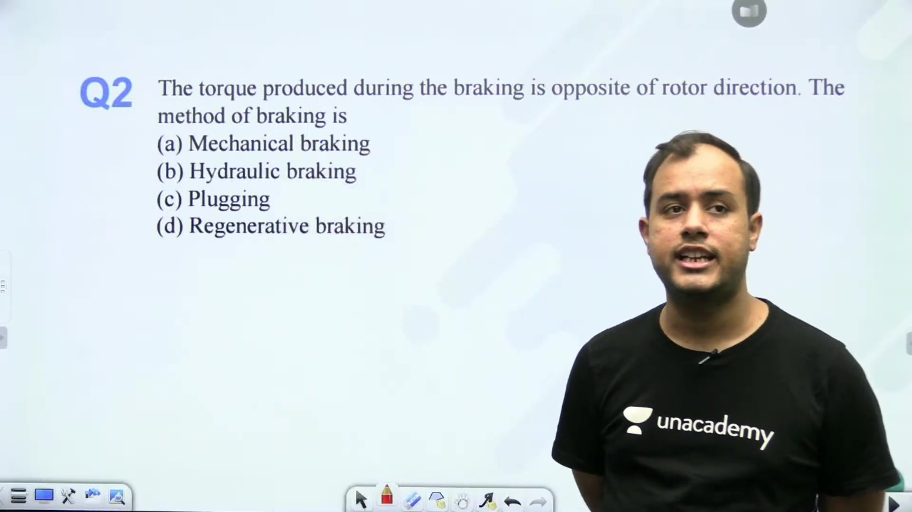

### Mechanism of Plugging

In normal motoring, the electromagnetic torque $T_e$ acts in the direction of rotor rotation. To arrest the rotor abruptly, plugging reverses this torque direction:

$$T_e \text{ opposes } \omega_r$$

This is accomplished by interchanging any two phase terminals of the stator supply (for example, swapping phase $B$ and phase $C$).

> [!info] Definition
> **Phase Sequence Reversal**: Swapping two supply leads reverses the stator phase sequence from $A\text{-}B\text{-}C$ to $A\text{-}C\text{-}B$. This flips the direction of the rotating magnetic field from $+N_s$ to $-N_s$.

Since the magnetic field rotates backwards while the rotor continues spinning forward, the relative speed becomes:

$$N_{\text{rel}} = -N_s - N_r = -(N_s + N_r)$$

This creates a massive counter-torque that drives the rotor speed rapidly toward zero.

### Induction Motor Behavior Under DC Dynamic Braking

During DC dynamic braking, the three-phase AC source is disconnected from the stator. A steady direct current (DC) source is then connected across the stator terminals.

Because DC excitation has zero electrical frequency ($f = 0$), the resulting stator magnetic field is completely stationary:

$$N_s = 0\text{ rpm}$$

The rotor continues rotating forward at speed $N_r$. Relative to the rated base synchronous speed $N_s$, the operating slip is:

$$s_b = \frac{0 - N_r}{N_s} = -\frac{N_r}{N_s} < 0$$

> [!success] Result
> Because the operating slip $s_b$ is negative, the induction motor operates in the **generating region**.
> The machine converts rotational kinetic energy into electrical energy dissipated as $I^2 R$ heat in the rotor resistance.

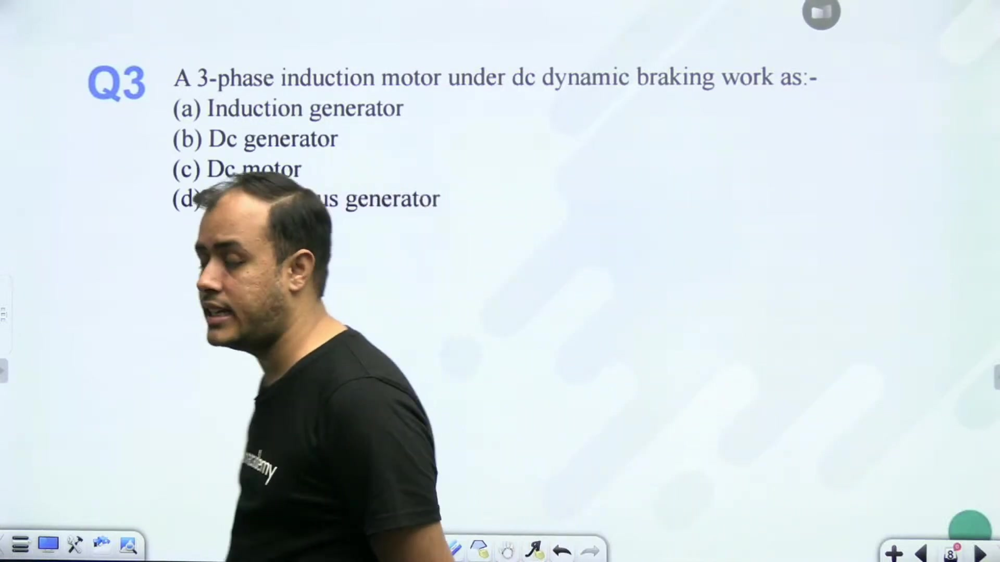

### Regenerative Braking Conditions and Overhauling Loads

Regenerative braking occurs naturally when an external mechanical source or gravitational force drives the rotor faster than the synchronous speed:

$$N_r > N_s \implies s = \frac{N_s - N_r}{N_s} < 0$$

A typical practical scenario is lowering a heavy load in a crane or hoist. Gravity acts in the direction of descent. If no braking torque were applied, gravitational acceleration would cause the load to fall dangerously fast. 

As the motor exceeds synchronous speed, it operates as an induction generator. It supplies an upward braking torque that matches the downward gravitational torque, holding the descent speed safely just above synchronous speed.

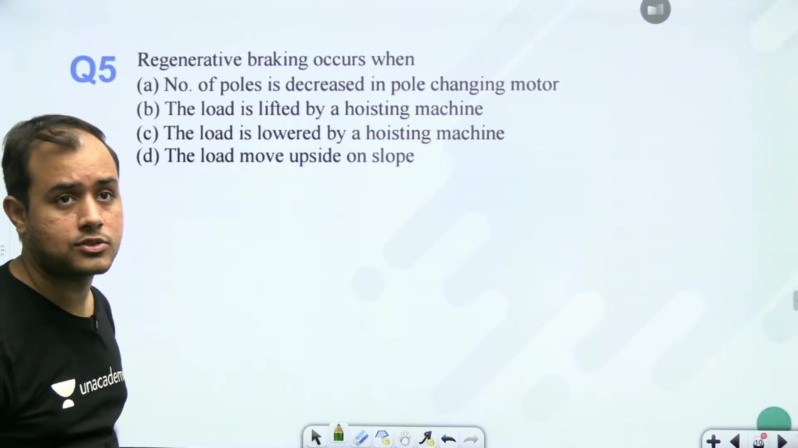

The fundamental principle across both AC and DC machines is identical:
- The machine operates as a generator, converting stored mechanical energy into electrical energy.
- In an induction motor, this occurs when rotor speed $N_r$ exceeds $N_s$.
- In a DC machine, it occurs when back EMF $E_b$ exceeds terminal voltage $V_t$.

## Efficiency, Braking Torque, and DC Excitation
_(09:34 - 14:28)_

Different braking methods trade off stopping speed, thermal losses, and system efficiency. This section compares energy efficiency, braking torque magnitude, and field excitation requirements.

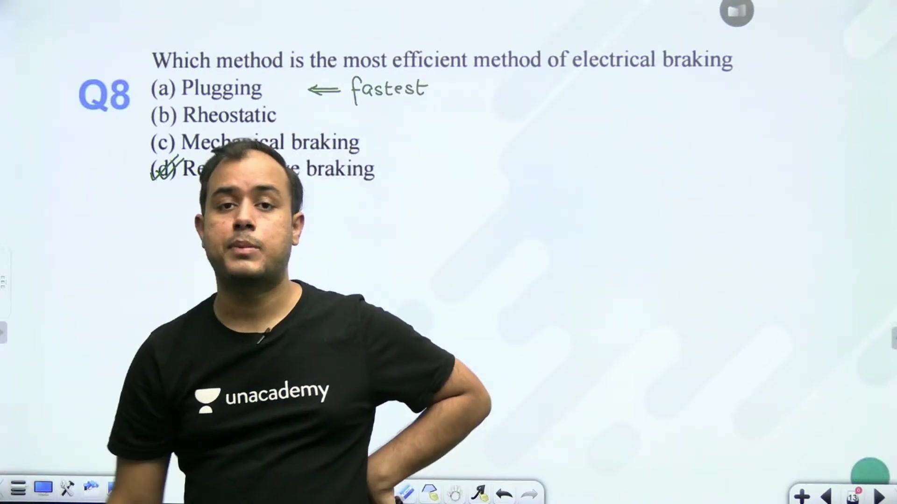

### Efficiency Comparison Among Braking Methods

Braking methods differ substantially in how they handle mechanical energy:

- **Regenerative Braking (Most Efficient)**: The motor acts as an electrical generator. It converts the mechanical kinetic energy of the rotating mass back into electrical energy and feeds it into the AC supply grid. This avoids waste heat and conserves power, making it the most energy-efficient braking method. It is universally used in railway traction systems such as modern metro trains.
- **Plugging (Fastest but Least Efficient)**: Plugging provides rapid stopping by driving the field in reverse. However, all rotational kinetic energy, along with additional electrical energy pulled from the AC supply during the braking interval, dissipates as $I^2 R$ heat inside the rotor. This creates severe thermal stress and poor energy efficiency.
- **Dynamic Braking (Intermediate)**: Only the stored kinetic energy of the rotor converts to electrical power and dissipates as heat. No extra electrical energy is consumed from the line during deceleration, aside from minor DC field losses.

> [!example] Problem
> Which method is the most efficient method of electrical braking?
> - (A) Mechanical friction braking
> - (B) Dynamic braking
> - (C) Plugging
> - (D) Regenerative braking
> 
> **Answer**: **(D) Regenerative braking**. It returns energy to the supply rather than dissipating it as heat.

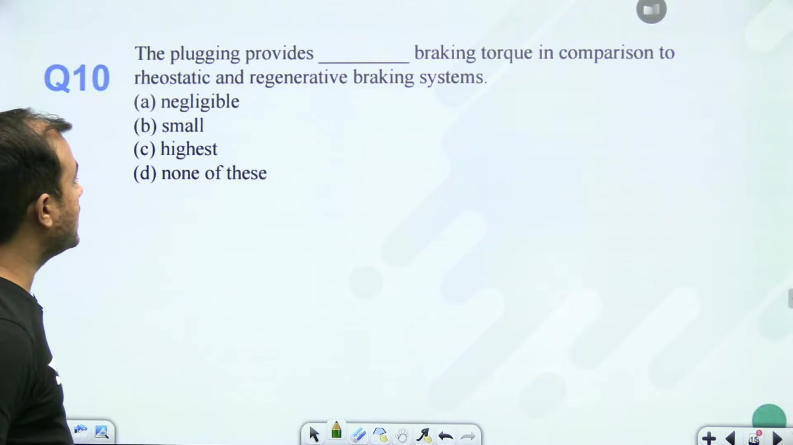

### Magnitude of Braking Torque

The magnitude of braking torque determines how rapidly a drive can be arrested:

> [!success] Result
> **Plugging provides the highest braking torque** compared to rheostatic (dynamic) and regenerative braking systems.
> 
> Because the magnetic field rotates backwards at $-N_s$, the relative speed between field and rotor reaches its maximum value:
> $$N_{\text{rel}} = N_s + N_r$$
> This large relative speed creates heavy rotor currents and maximum counter-torque.

### Dynamic Braking in DC Machines: Field Excitation

Dynamic braking in DC machines requires disconnecting the armature from the DC source and connecting an external dissipating resistor $R_{\text{ext}}$ across the armature terminals.

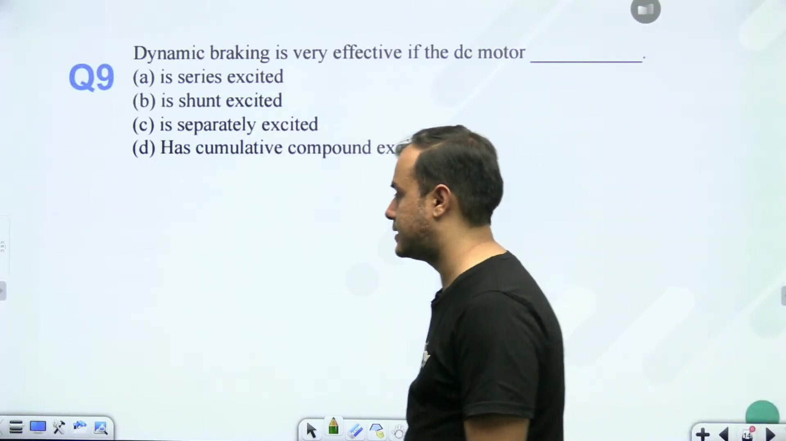

The armature generates current from its back EMF:

$$I_a = \frac{E_b}{R_a + R_{\text{ext}}} = \frac{k \phi \omega}{R_a + R_{\text{ext}}}$$

The braking torque is:

$$T_b = k \phi I_a = \frac{(k \phi)^2 \omega}{R_a + R_{\text{ext}}}$$

If the machine were self-excited (such as a series motor or disconnected shunt motor), removing line voltage would kill the field current. The magnetic flux $\phi$ would immediately collapse to residual levels, resulting in near-zero braking torque. 

Therefore, dynamic braking is most effective in a **separately excited DC motor**, where the field winding remains energized from an independent source to maintain strong flux throughout deceleration.

## Numerical Analysis of Plugging and Dynamic Braking
_(15:00 - 23:20)_

This section demonstrates how to calculate load torque, plugging torque, total braking torque, and dynamic braking torque from induction motor equivalent circuit parameters.

### Wear Reduction and Terminal Protection

Electrical braking reduces mechanical wear. By absorbing the rotor kinetic energy through electromagnetic counter-torque, mechanical friction brakes are used only as holding brakes at zero speed. This drastically reduces pad abrasion.

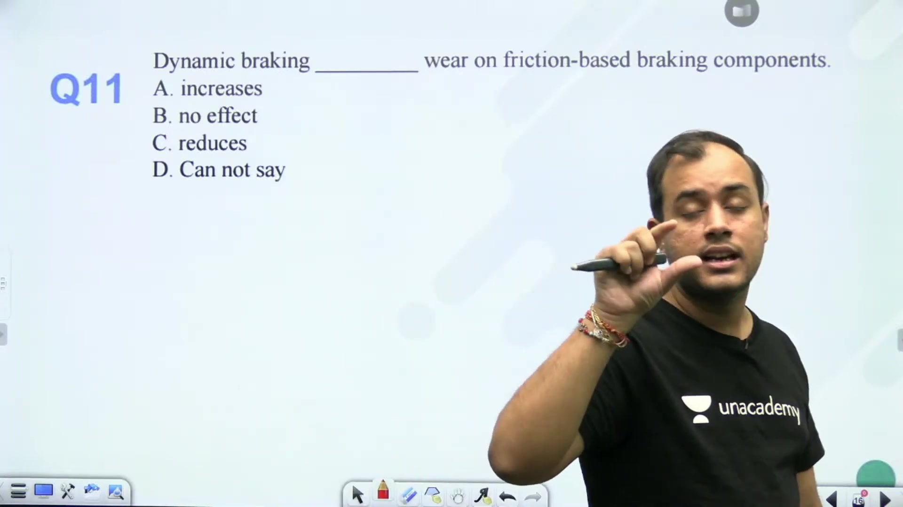

In permanent magnet DC motors, dynamic braking cannot be achieved by dead-shorting the armature terminals. Directly shorting the terminals causes extreme inrush currents that can demagnetize the permanent magnets and burn the brush gear. An external current-limiting braking resistor must always be placed across the armature.

### Comprehensive Numerical Problem

> [!example] Problem
> A $400\text{ V}$, $50\text{ Hz}$, 4-pole, 3-phase, star-connected induction motor has the following equivalent circuit parameters referred to the stator:
> - Stator leakage impedance: $Z_1 = 0.5 + j1.2\,\Omega$
> - Rotor leakage impedance: $Z_2' = 0.3 + j1.0\,\Omega$
> - Full-load slip: $s = 0.05$
> 
> Determine:
> 1. The initial load torque $T_L$ before braking.
> 2. The plugging torque $T_{\text{plugging}}$ immediately after reversing the supply phase sequence.
> 3. The total initial braking torque $T_{\text{braking}}$ during plugging.
> 4. The effective slip for dynamic braking.

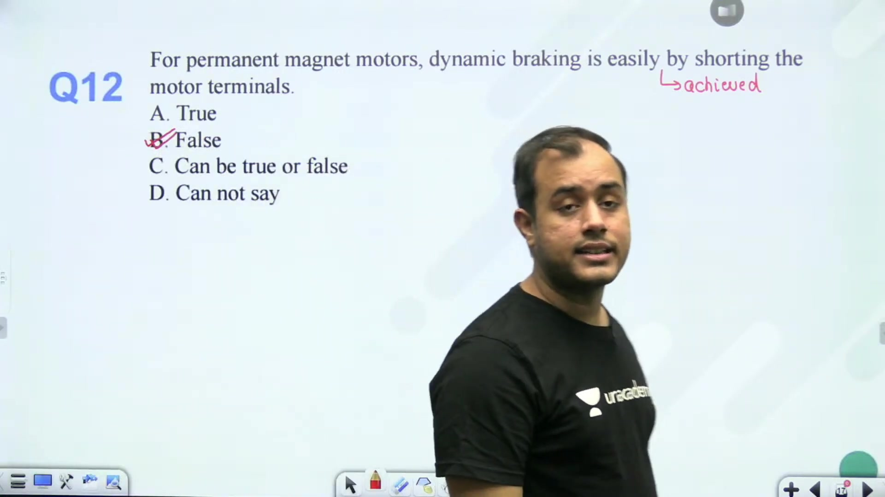

### Step 1: Pre-Braking Steady Load Torque

First, find the synchronous angular speed $\omega_s$:

$$\omega_s = \frac{4\pi f}{P} = \frac{4\pi (50)}{4} = 157.08\text{ rad/s}$$

The per-phase terminal voltage for star connection is:

$$V_1 = \frac{400}{\sqrt{3}} \approx 230.94\text{ V}$$

At full-load slip $s = 0.05$:

$$\frac{R_2'}{s} = \frac{0.3}{0.05} = 6.0\,\Omega$$

The total equivalent impedance per phase is:

$$
\begin{aligned}
Z_{\text{in}} &= \left(R_1 + \frac{R_2'}{s}\right) + j(X_1 + X_2') \\
&= (0.5 + 6.0) + j(1.2 + 1.0) \\
&= 6.5 + j2.2\,\Omega
\end{aligned}
$$

The magnitude squared of impedance is:

$$|Z_{\text{in}}|^2 = (6.5)^2 + (2.2)^2 = 42.25 + 4.84 = 47.09\,\Omega^2$$

The steady motoring torque matches the load torque $T_L$:

$$
\begin{aligned}
T_L &= \frac{3}{\omega_s} \frac{V_1^2 \left(\frac{R_2'}{s}\right)}{|Z_{\text{in}}|^2} \\
&= \frac{3}{157.08} \frac{(230.94)^2 \times 6.0}{47.09} \\
&= 0.0191 \times \frac{53333.33 \times 6.0}{47.09} \\
&= 129.78\text{ N}\cdot\text{m}
\end{aligned}
$$

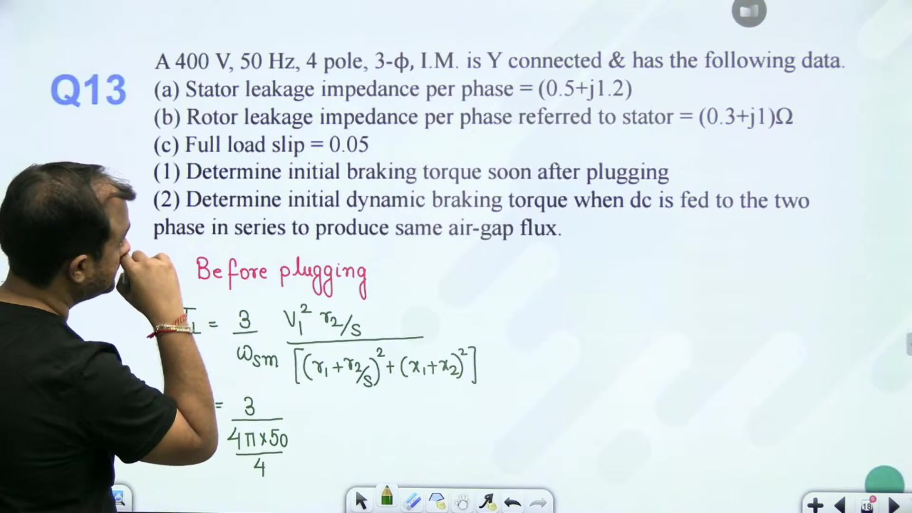

### Step 2: Instantaneous Plugging Torque

At the instant of plugging, the stator field reverses to $-N_s$. The operating slip changes to $s_p$:

$$s_p = 2 - s = 2 - 0.05 = 1.95$$

The effective rotor resistance parameter becomes:

$$\frac{R_2'}{s_p} = \frac{0.3}{1.95} = 0.1538\,\Omega$$

The new equivalent impedance is:

$$
\begin{aligned}
Z_{\text{plug}} &= (0.5 + 0.1538) + j(1.2 + 1.0) \\
&= 0.6538 + j2.2\,\Omega
\end{aligned}
$$

Its magnitude squared is:

$$|Z_{\text{plug}}|^2 = (0.6538)^2 + (2.2)^2 = 0.4275 + 4.84 = 5.2675\,\Omega^2$$

The electromagnetic counter-torque developed during plugging is:

$$
\begin{aligned}
T_{\text{plugging}} &= \frac{3}{\omega_s} \frac{V_1^2 \left(\frac{R_2'}{s_p}\right)}{|Z_{\text{plug}}|^2} \\
&= \frac{3}{157.08} \frac{(230.94)^2 \times 0.1538}{5.2675} \\
&= 29.75\text{ N}\cdot\text{m}
\end{aligned}
$$

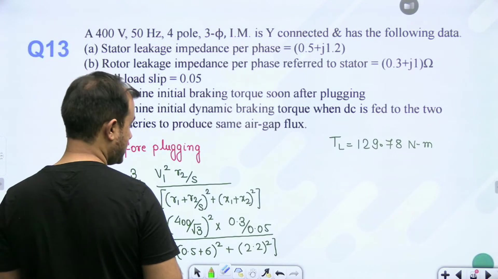

### Step 3: Total Initial Braking Torque

Newton's equation of motion during plugging gives:

$$J \frac{d\omega}{dt} = -T_{\text{plugging}} - T_L$$

The total instantaneous retarding torque acting on the rotor shaft is:

$$
\begin{aligned}
T_{\text{braking}} &= T_L + T_{\text{plugging}} \\
&= 129.78 + 29.75 \\
&= 159.53\text{ N}\cdot\text{m}
\end{aligned}
$$

> [!success] Result
> At the instant of plugging, the shaft experiences a total decelerating torque of:
> $$T_{\text{braking}} = 159.53\text{ N}\cdot\text{m}$$

### Step 4: Operating Slip for Dynamic Braking

Under DC dynamic braking, the stator magnetic field is stationary in space ($N_s = 0$). The operating slip relative to base speed is:

$$s_b = \frac{0 - N_r}{N_s} = -\frac{N_r}{N_s} = -(1 - s)$$

For initial motoring slip $s = 0.05$:

$$s_b = -(1 - 0.05) = -0.95$$

Substituting $s_b = -0.95$ into the torque equation yields the dynamic braking counter-torque.

## Summary of Braking Concepts and Exam Strategy
_(23:20 - 27:05)_

Mastering induction motor braking requires recognizing the governing slip expression and energy flow for each method. This section consolidates the key principles and calculation workflows tested in competitive examinations.

### Comparison Summary of Braking Modes

| Braking Method | Triggering Mechanism | Operating Slip | Energy Exchange | Primary Application |
| :--- | :--- | :--- | :--- | :--- |
| **Regenerative Braking** | $N_r > N_s$ | $s = \frac{N_s - N_r}{N_s} < 0$ | Kinetic energy returned to AC supply line | Electric traction, cranes, hoists |
| **Dynamic Braking** | Stator switched from AC to DC | $s_b = -\frac{N_r}{N_{s0}}$ | Kinetic energy dissipated in rotor resistance | Machine tools, printing presses, elevators |
| **Plugging** | Two stator supply lines interchanged | $s_p = 2 - s$ | Kinetic energy + supply energy dissipated as heat | Emergency stops, rapid reversal |

### Examination Problem Workflow

When solving induction motor braking problems in GATE and engineering service exams, follow this sequence:
1. **Identify the baseline operating slip**:
   $$s = \frac{N_s - N_r}{N_s}$$
2. **Compute pre-braking load torque**:
   $$T_L = \frac{3}{\omega_s} \frac{V_1^2 (R_2'/s)}{(R_1 + R_2'/s)^2 + (X_1 + X_2')^2}$$
3. **Determine the altered slip**:
   - For plugging: $s_p = 2 - s$.
   - For dynamic braking: $s_b = -N_r / N_{s0} = -(1 - s)$.
4. **Calculate counter-torque**:
   - In plugging, the total retarding torque is $T_{\text{braking}} = T_L + T_{\text{plugging}}$.
   - In dynamic braking, the counter-torque is obtained directly from $s_b$.

This systematic approach resolves both numerical computations and conceptual multiple-choice questions reliably.

---

## Summary and Key Takeaways

- Regenerative braking is the most energy-efficient method because it recovers kinetic energy and feeds power back to the AC grid.
- Dynamic braking is preferred in machine tools and printing presses because it decelerates the drive smoothly without reversing shaft rotation.
- Plugging provides the highest instantaneous braking torque by rotating the stator field in reverse at $-N_s$.
- Under DC dynamic braking, the stator magnetic field is stationary ($N_s = 0$), operating the induction motor in the generating quadrant with slip $s_b = -N_r / N_s < 0$.
- In plugging, the operating slip immediately after interchanging two stator supply terminals is $s_p = 2 - s$.
- The total decelerating torque acting on the shaft during plugging is the sum of load torque and electromagnetic plugging torque: $T_{\text{braking}} = T_L + T_{\text{plugging}}$.
- In permanent magnet DC machines, dynamic braking requires an external series resistor to prevent damaging current spikes across the armature.
- Dynamic braking in conventional DC machines is most effective with separately excited field connections to avoid flux collapse upon line disconnection.

