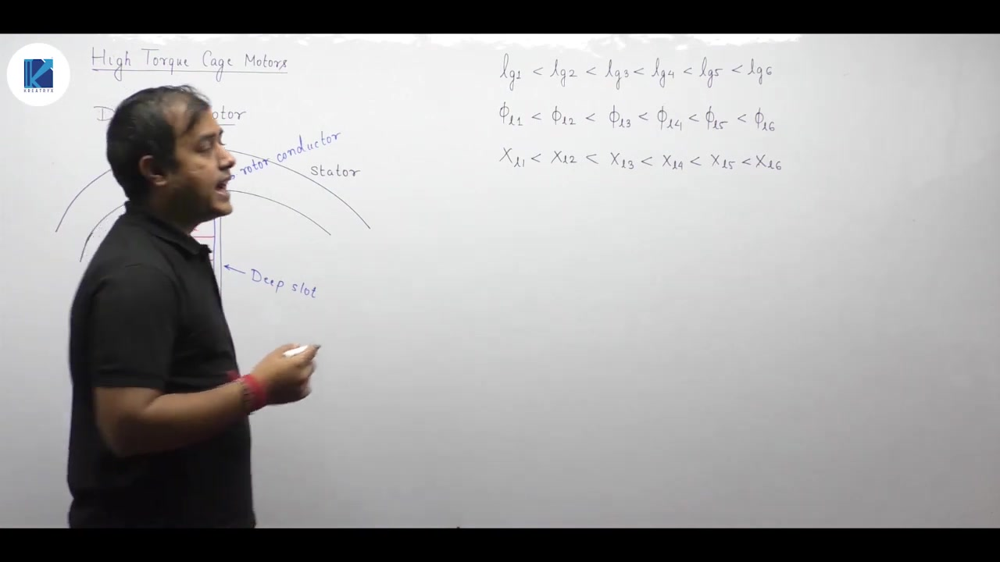
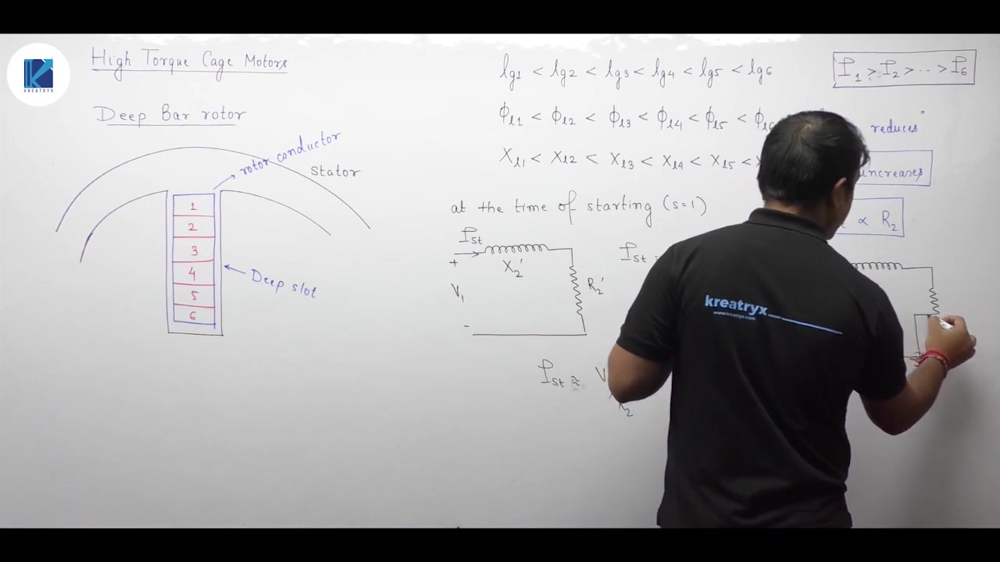
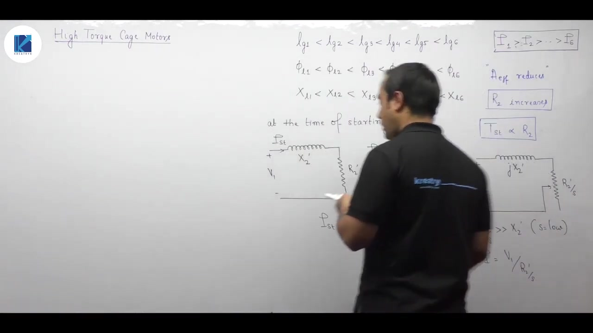
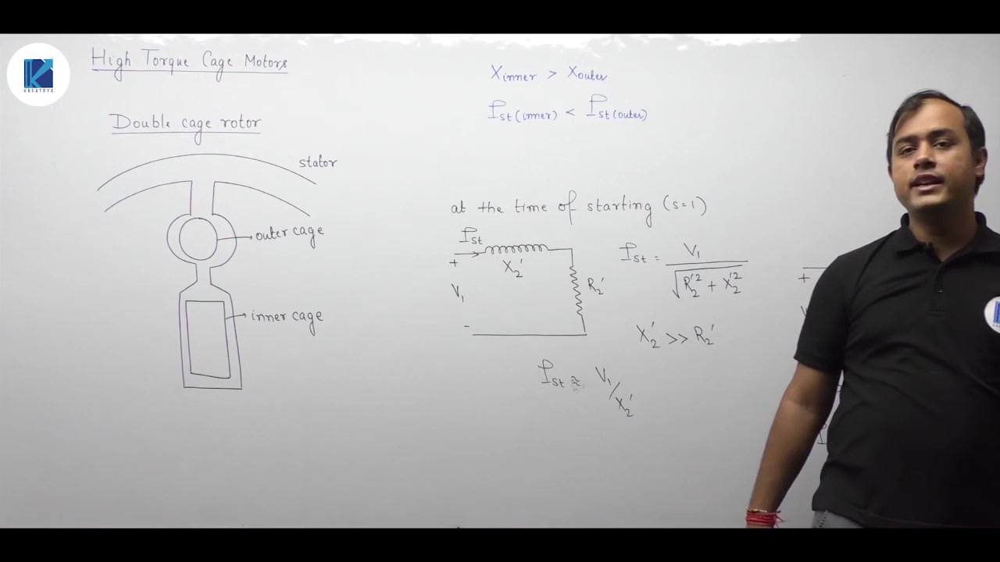
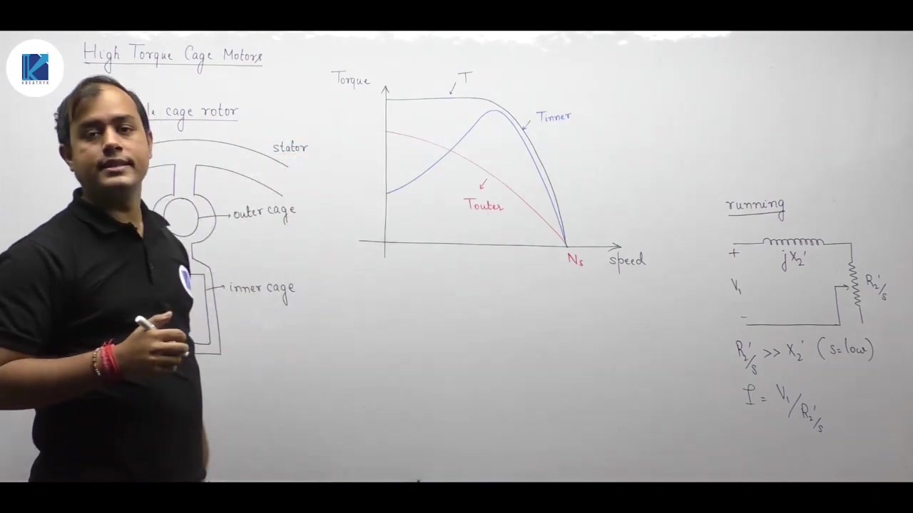
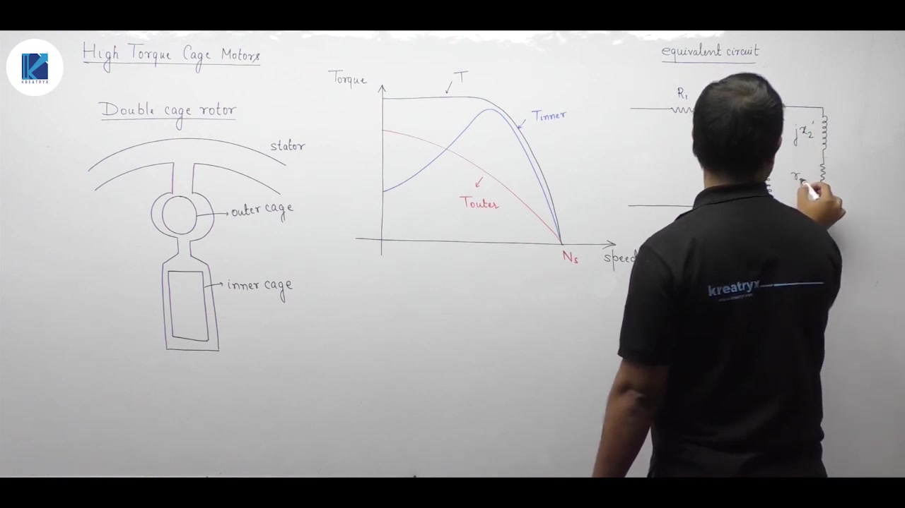
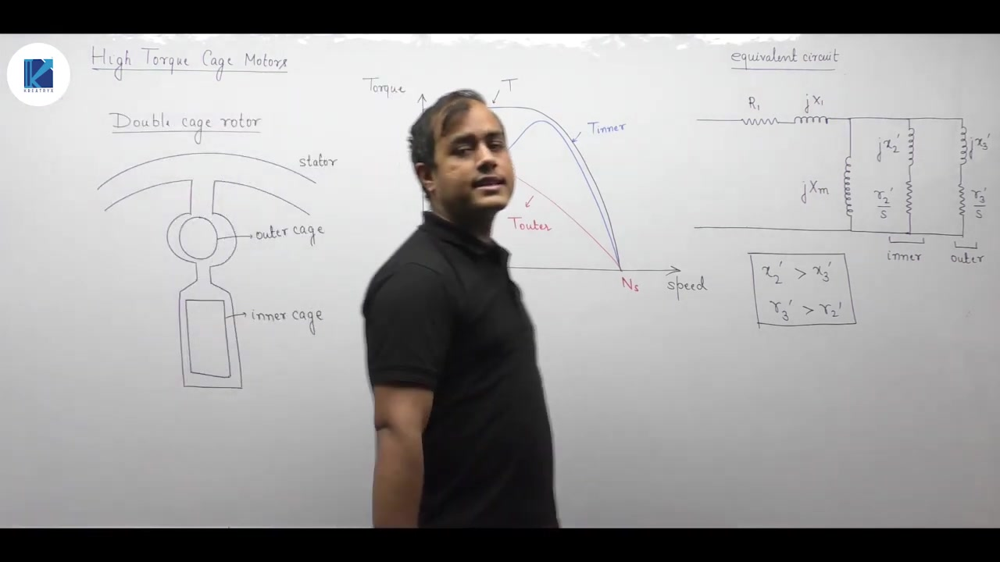

[← Lec 156: Braking of Induction Motor](Lecture_156_Braking_of_Induction_Motor.md) | [🏠 Index](00_yt_study_guide.md) | [Lec 158: Miscellaneous Concepts →](Lecture_158_Miscellaneous_Concepts.md)

---

# Electrical Machines | Lec 110 | High Torque Cage Rotor | GATE/ESE Electrical Engineering

- **Source**: https://www.youtube.com/watch?v=EEnOc4EMEUo
- **Duration**: 00:25:10
- **Compiled**: 2026-09-23

---

## Overview

This lecture examines high starting torque squirrel cage induction motors. It explains how deep bar and double cage rotor constructions overcome the poor starting torque of standard cage machines without external slip rings. The discussion demonstrates how slot leakage flux gradients induce an automatic skin effect, raising effective rotor resistance at stand-still. It then details the construction of double cage rotors, tracing how current shifts between cages from starting to running, and derives the composite torque-speed characteristics and parallel per-phase equivalent circuit model.

## Contents

- [[#Deep Bar Rotor Construction and Starting Mechanics|Deep Bar Rotor Construction and Starting Mechanics]]
- [[#Deep Bar Running Transition and Double Cage Construction|Deep Bar Running Transition and Double Cage Construction]]
- [[#Torque Characteristics and Equivalent Circuit Modeling|Torque Characteristics and Equivalent Circuit Modeling]]

---

## Deep Bar Rotor Construction and Starting Mechanics
_(00:12 - 10:10)_

Standard squirrel cage induction motors are rugged and efficient. However, their closed rotor cage prevents inserting external resistors to boost starting torque. This section analyzes the deep bar rotor design, explaining how slot leakage variation produces an automatic skin effect that enhances starting torque.

### Starting Versus Running Requirements

An induction motor presents conflicting rotor resistance requirements:
- **At Starting**: A high rotor resistance $R_2$ is needed. Starting torque is directly proportional to rotor resistance ($T_{\text{st}} \propto R_2$), and higher resistance limits starting current.
- **Under Normal Running**: A low rotor resistance is required. Low resistance minimizes rotor $I^2 R$ copper losses, maintains small operating slip, and ensures high operating efficiency.

While wound rotor machines use external rheostats to meet both needs, cage rotors achieve this internally through frequency-dependent skin effect constructions: the **deep bar rotor** and the **double cage rotor**.

### Slot Depth and Leakage Reactance Distribution

In a deep bar rotor, the rotor slots are narrow and deep. A tall rectangular copper or aluminum conductor bar fills the entire slot.

Consider the deep conductor bar divided into incremental horizontal layers from top to bottom (layers 1 through 6). Layer 1 lies closest to the stator bore and air gap. Layer 6 lies deep at the bottom of the slot.

The leakage flux crosses the slot between the teeth. Any leakage flux line crossing below a layer links only the conductors above it:
- Layer 1 links only the leakage flux passing above it near the slot opening.
- Layer 6 at the bottom links all the leakage flux that crosses the slot above it throughout the entire depth.

Because leakage inductance is proportional to total leakage flux linkages, leakage reactance increases markedly with slot depth:

$$X_{L1} < X_{L2} < X_{L3} < X_{L4} < X_{L5} < X_{L6}$$

### Current Redistribution at Starting via Skin Effect

At stand-still ($s = 1$), rotor currents alternate at the full line frequency ($f_r = f = 50\text{ Hz}$).

At 50 Hz, leakage reactance dominates resistance:

$$X_2 \gg R_2$$

The starting current distribution across the parallel conductor layers depends inversely on their leakage reactances:

$$I_k \approx \frac{V_1}{X_{Lk}}$$

Because layer 1 has the lowest leakage reactance, it carries the largest current:

$$I_1 > I_2 > I_3 > I_4 > I_5 > I_6$$

Current is forced out of the slot bottom and crowds into the top layer near the rotor surface.

> [!info] Definition
> **Skin Effect in Deep Bars**: At high rotor frequencies, the gradient of slot leakage reactance forces rotor current to crowd near the outer conductor periphery (slot opening). This non-uniform current distribution reduces the effective cross-sectional area of the conductor.

### Elevation of Effective Rotor Resistance and Starting Torque

Because current flows primarily through the top fraction of the bar, the effective cross-sectional area is reduced:

$$A_{\text{eff}} < A_{\text{total}}$$

Since resistance is inversely proportional to cross-sectional area ($R = \rho l / A$), the effective AC rotor resistance rises substantially:

$$R_{2,\text{ac}} \gg R_{2,\text{dc}}$$

> [!success] Result
> Due to the elevated effective AC resistance, the motor develops high starting torque:
> $$T_{\text{st}} \propto R_{2,\text{ac}}$$
> Deep bar construction increases starting torque while limiting starting current without requiring slip rings.

## Deep Bar Running Transition and Double Cage Construction
_(10:11 - 19:59)_

As an induction motor accelerates from stand-still to its rated operating speed, rotor frequency plummets from line frequency to only a few hertz. This section explains the transition from skin-effect operation to uniform current conduction in deep bars, and introduces the double cage rotor construction.

### Deep Bar Behavior Under Normal Running Conditions

When the motor runs at normal speed, slip is very small (typically $s = 0.02$ to $0.05$). The rotor electrical frequency drops accordingly:

$$f_r = s f \approx 1 \text{ to } 2.5\text{ Hz}$$

In the per-phase equivalent circuit, the rotor resistance parameter is $R_2'/s$. At very low slip:

$$\frac{R_2'}{s} \gg X_2'$$

Because the resistive component dominates the impedance, leakage reactance has negligible influence on current flow:

$$I_2' \approx \frac{V_1}{R_2'/s}$$

Current distribution across the bar depth is now dictated by resistance rather than leakage reactance. Because the bar material has uniform resistivity, current distributes evenly across the entire cross-section:
- Conductor cross-section is fully utilized ($A_{\text{eff}} = A_{\text{total}}$).
- Effective rotor resistance returns to its minimum DC value ($R_{2,\text{dc}}$).
- Rotor $I^2 R$ copper losses remain low, ensuring high running efficiency and low full-load slip.

### Principle of Double Cage Rotor

The double cage rotor applies this same variable-impedance principle using two physically distinct, concentric squirrel cages placed in each rotor slot.

The two cages are:
1. **Outer Cage**: Placed near the top of the slot close to the stator air gap. It is constructed from bars of smaller cross-sectional area or higher-resistivity alloy (brass, bronze, or aluminum). It has **high resistance** and **low leakage reactance**.
2. **Inner Cage**: Placed deep in the slot away from the air gap. It consists of large cross-section copper bars. It has **low resistance** and **high leakage reactance** because its slot leakage flux links substantial rotor iron.

> [!info] Definition
> **Double Cage Induction Motor**: An induction motor whose rotor carries two concentric squirrel cages connected in parallel by common copper end rings at both ends of the rotor stack.

### Operation at Starting vs Running

The parallel cages obey the parameter relationships:

$$
\begin{aligned}
X_{\text{inner}} &\gg X_{\text{outer}} \\
R_{\text{outer}} &\gg R_{\text{inner}}
\end{aligned}
$$

- **At Starting ($s = 1$, $f_r = 50\text{ Hz}$)**: Leakage reactance dominates cage impedances ($X \gg R$). Because $X_{\text{inner}} \gg X_{\text{outer}}$, the inner cage presents a very high impedance. Most starting current is forced through the outer cage ($I_{\text{outer}} \gg I_{\text{inner}}$). The high resistance of the outer cage produces high starting torque and limits starting inrush current.
- **Under Normal Running ($s \ll 1$, $f_r \approx 1\text{ to } 3\text{ Hz}$)**: Leakage reactances become negligible ($s X_2' \approx 0$). Branch currents divide inversely with resistance ($I \propto 1/R$). Because $R_{\text{inner}} \ll R_{\text{outer}}$, almost all rotor current transfers to the inner cage ($I_{\text{inner}} \gg I_{\text{outer}}$).

> [!success] Result
> The double cage motor automatically achieves the ideal performance compromise:
> - The high-resistance outer cage dominates starting to maximize torque.
> - The low-resistance inner cage dominates running to maximize efficiency.

## Torque Characteristics and Equivalent Circuit Modeling
_(19:59 - 25:02)_

A double cage induction motor develops an electromagnetic torque composed of two distinct components. This section develops the composite torque-speed characteristic and presents the exact equivalent circuit model for numerical analysis.

### Superposition of Cage Torques

Each cage develops an independent electromagnetic torque on the rotor:
1. **Outer Cage Torque ($T_{\text{outer}}$)**: Because the outer cage has high resistance, its torque peaks near stand-still ($s \approx 1$). As rotor speed increases and current transfers to the inner cage, outer cage torque decreases monotonically toward zero at synchronous speed.
2. **Inner Cage Torque ($T_{\text{inner}}$)**: Because the inner cage has low resistance and high leakage reactance, it produces low starting torque. However, it develops a classic high-breakdown torque peak at low operating slip near synchronous speed.

The net torque developed on the rotor shaft equals the algebraic sum of the two cage torques:

$$T_{\text{total}} = T_{\text{inner}} + T_{\text{outer}}$$

> [!success] Result
> The resulting composite torque-speed characteristic combines the desirable traits of both cages:
> - High starting torque ($T_{\text{st}}$) from the outer cage.
> - High breakdown torque and steep stable running curve from the inner cage.
> - Flat torque plateau across intermediate speeds.

### Per-Phase Equivalent Circuit

In the per-phase equivalent circuit, the two cages appear as two parallel rotor branches connected across the air-gap magnetizing branch.

Let:
- Inner cage: Referred resistance $R_2'$, leakage reactance $X_2'$.
- Outer cage: Referred resistance $R_3'$, leakage reactance $X_3'$.

The branch impedances referred to the stator are:

$$
\begin{aligned}
Z_{\text{inner}} &= \frac{R_2'}{s} + j X_2' \\
Z_{\text{outer}} &= \frac{R_3'}{s} + j X_3'
\end{aligned}
$$

The total effective rotor impedance is the parallel combination:

$$Z_2 = \frac{Z_{\text{inner}} Z_{\text{outer}}}{Z_{\text{inner}} + Z_{\text{outer}}}$$

### Numerical Calculation Procedure

When evaluating performance or torque ratios in competitive examinations:
1. **Calculate Inner Cage Torque**:
   $$T_{\text{inner}} = \frac{3}{\omega_s} \frac{V_1^2 \left(\frac{R_2'}{s}\right)}{\left(R_1 + \frac{R_2'}{s}\right)^2 + (X_1 + X_2')^2}$$
2. **Calculate Outer Cage Torque**:
   $$T_{\text{outer}} = \frac{3}{\omega_s} \frac{V_1^2 \left(\frac{R_3'}{s}\right)}{\left(R_1 + \frac{R_3'}{s}\right)^2 + (X_1 + X_3')^2}$$
3. **Obtain Net Torque or Torque Ratio**:
   $$T_{\text{total}} = T_{\text{inner}} + T_{\text{outer}} \quad \text{or} \quad \text{Ratio} = \frac{T_{\text{outer}}}{T_{\text{inner}}}$$

This parallel branch model models deep bar and double cage machines accurately from stand-still to full load.

---

## Summary and Key Takeaways

- Squirrel cage motors intrinsically possess low starting torque, which deep bar and double cage designs elevate internally.
- In deep bar rotors, slot leakage flux increases with depth, causing leakage reactance to be lowest at the top of the bar and highest at the bottom ($X_{\text{top}} \ll X_{\text{bottom}}$).
- At starting line frequency ($50\text{ Hz}$), current crowds into the upper section of the deep bar via skin effect, reducing effective cross-sectional area and sharply increasing AC resistance.
- Elevated starting resistance increases starting torque ($T_{\text{st}} \propto R_2$) while limiting starting current.
- Under normal low-slip running conditions, the resistive term $R_2'/s$ dominates leakage reactance, restoring uniform current distribution and low rotor copper losses.
- Double cage rotors utilize two concentric cages connected in parallel by common end rings.
- The outer cage has high resistance and low leakage reactance ($R_{\text{outer}} \gg R_{\text{inner}}$, $X_{\text{outer}} \ll X_{\text{inner}}$), dominating starting operation.
- The inner cage has low resistance and high leakage reactance, carrying the bulk of the rotor current during running conditions to maintain high efficiency.
- In the per-phase equivalent circuit, a double cage rotor is modeled as two parallel branches connected across the magnetizing reactance: $Z_2 = (R_2'/s + jX_2') \parallel (R_3'/s + jX_3')$.

---

[← Lec 156: Braking of Induction Motor](Lecture_156_Braking_of_Induction_Motor.md) | [🏠 Index](00_yt_study_guide.md) | [Lec 158: Miscellaneous Concepts →](Lecture_158_Miscellaneous_Concepts.md)
