[← Lec 157: High Torque Cage Rotor](Lecture_157_High_Torque_Cage_Rotor.md) | [🏠 Index](00_yt_study_guide.md) | [Lec 159: High Torque Cage Rotor and Induction Generator →](Lecture_159_High_Torque_Cage_Rotor_and_Induction_Generator.md)

---

# Electrical Machines | Lec 111 | Miscellaneous Concepts | GATE/ESE Electrical Engineering

- **Source**: https://www.youtube.com/watch?v=WXQujFXTUl8
- **Duration**: 00:46:21
- **Compiled**: 2026-09-23

---

## Overview

This lecture covers parasitic harmonic phenomena and induction generator fundamentals. It explores space harmonics caused by non-sinusoidal winding distributions and slotting. The discussion explains how harmonic fields cause crawling and cogging in squirrel-cage rotors, along with their mitigation techniques. Finally, it analyzes the operation, reactive power needs, and power flow of grid-connected and self-excited induction generators.

## Contents

- [[#Space Harmonics and Harmonic Field Speeds|Space Harmonics and Harmonic Field Speeds]]
- [[#Crawling Phenomenon and Saddle Dip Analysis|Crawling Phenomenon and Saddle Dip Analysis]]
- [[#Crawling Mitigation and Cogging Fundamentals|Crawling Mitigation and Cogging Fundamentals]]
- [[#Cogging Prevention and the Trade-Offs of Slot Skewing|Cogging Prevention and the Trade-Offs of Slot Skewing]]
- [[#Induction Generator Principles and Reactive Power Requirements|Induction Generator Principles and Reactive Power Requirements]]
- [[#Self-Excited vs Externally Excited Induction Generators|Self-Excited vs Externally Excited Induction Generators]]
- [[#Generator Power Flow and Induction vs Synchronous Motor Comparison|Generator Power Flow and Induction vs Synchronous Motor Comparison]]

---

## Space Harmonics and Harmonic Field Speeds
_(00:14 - 07:28)_

Non-sinusoidal winding distributions and slot openings distort the spatial air-gap flux density waveform from an ideal sinusoid. This section analyzes the space harmonics produced in three-phase induction machines, deriving the speed and direction of their rotating magnetic fields.

### Nature of Space Harmonics

In an AC machine supplied by a purely sinusoidal electrical source, the time variation of current remains sinusoidal. However, the spatial distribution of flux density $B(\theta)$ along the air-gap circumference contains higher spatial harmonics. Expanding the spatial flux density wave via Fourier series yields:

$$B(\theta, t) = \sum_{n=1, 5, 7, \dots}^{\infty} B_n \cos(n \theta \mp \omega t)$$

Triplen harmonics ($n = 3, 9, 15, \dots$) cancel in balanced three-phase windings. The remaining space harmonic orders satisfy:

$$n = 6k \pm 1, \quad \text{for } k = 1, 2, 3, \dots$$

### Sequence and Rotational Direction of Harmonic Fields

Space harmonics split into two sequence families:
1. **Positive Sequence Harmonics ($n = 6k + 1$)**: For $k = 1$, this gives the **7th harmonic** ($n = 7$). Its magnetic field rotates in the **same (forward) direction** as the fundamental field.
2. **Negative Sequence Harmonics ($n = 6k - 1$)**: For $k = 1$, this gives the **5th harmonic** ($n = 5$). Its magnetic field rotates in the **opposite (backward) direction** relative to the fundamental field.

### Speed of Harmonic Rotating Fields

The electrical supply frequency $f$ connected to the stator winding is fixed. However, an $n$-th space harmonic creates an effective magnetic field having $n$ times the fundamental pole count:

$$P_n = n P$$

The synchronous speed of the $n$-th harmonic field is:

$$N_{sn} = \frac{120 f}{P_n} = \frac{120 f}{n P} = \frac{N_s}{n}$$

> [!success] Result
> The speeds and directions of the lowest dominant space harmonics are:
> - **5th Space Harmonic ($n = 5$)**:
>   $$N_{s5} = -\frac{N_s}{5} \quad (\text{backward rotation})$$
> - **7th Space Harmonic ($n = 7$)**:
>   $$N_{s7} = +\frac{N_s}{7} \quad (\text{forward rotation})$$

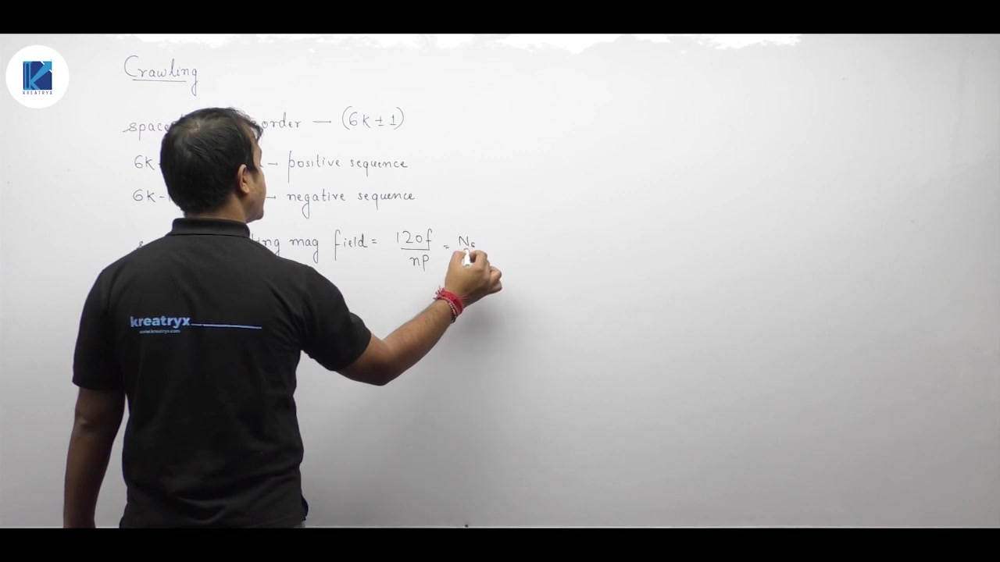

### Direction of Developed Harmonic Torques

In an induction machine, the rotor always develops electromagnetic torque in the direction of field rotation:
- The forward-rotating 7th harmonic field develops positive forward torque below $+N_s / 7$.
- The backward-rotating 5th harmonic field develops negative counter-torque opposing the forward motion of the rotor.

Because harmonic amplitude drops inversely with order, the 5th harmonic is stronger than the 7th harmonic, altering the torque curve near stand-still.

## Crawling Phenomenon and Saddle Dip Analysis
_(07:28 - 16:25)_

When space harmonics distort the air-gap magnetic field, their individual torque curves superimpose on the fundamental characteristic. This section analyzes the composite torque profile and explains how a stable operating point at low speed causes crawling.

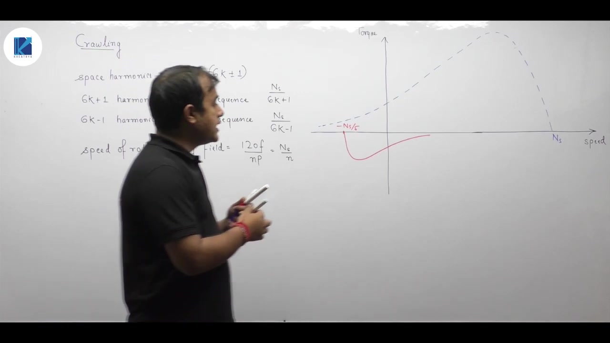

### Superposition of Harmonic Torques

The total electromagnetic torque developed by the motor is the sum of fundamental and harmonic torque components:

$$T_e = T_1 + T_5 + T_7$$

1. **Fundamental Torque ($T_1$)**: Positive forward driving torque, peaking at breakdown torque and falling to zero at $N_s$.
2. **5th Harmonic Torque ($T_5$)**: Rotates backward at $-N_s / 5$. Across positive rotor speeds ($N > 0$), the 5th harmonic operates in its plugging region, generating negative retarding torque.
3. **7th Harmonic Torque ($T_7$)**: Rotates forward at $+N_s / 7$. It develops positive motoring torque below $N_s / 7$, reaches a local peak just below $N_s / 7$, and drops to zero at $N_s / 7$. Past $N_s / 7$, it develops negative generator torque.

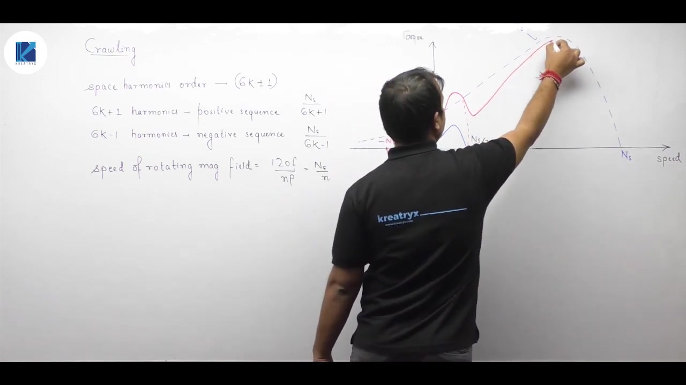

### Formation of the Saddle Dip

Because harmonic field strength decreases with harmonic order, the 5th harmonic is stronger than the 7th harmonic. At stand-still ($N = 0$), the negative torque of the 5th harmonic dominates the positive torque of the 7th harmonic, causing net starting torque to be slightly lower than the ideal fundamental value.

As the rotor accelerates toward $N_s / 7$, the 7th harmonic develops a sharp positive torque peak, elevating total motor torque above the fundamental curve. Immediately beyond $N_s / 7$, the 7th harmonic enters its generating region and exerts negative counter-torque. 

This rapid transition creates a pronounced dip in the composite torque-speed characteristic called the **saddle region**.

### Operating Points and Dynamic Stability

Plotting a constant mechanical load torque line $T_L$ across the composite characteristic yields four intersection points: A, B, C, and D.

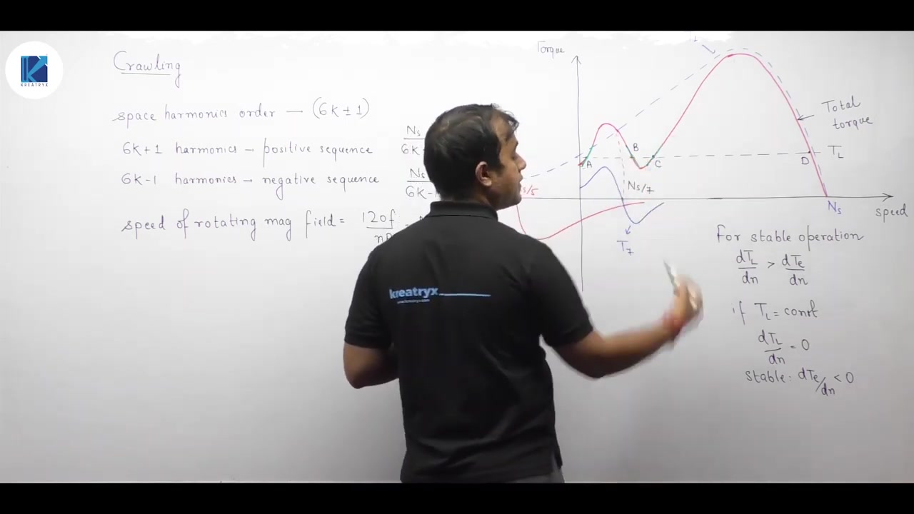

The general condition for dynamic steady-state stability is:

$$\frac{d T_L}{dN} > \frac{d T_e}{dN}$$

For a constant load torque ($d T_L / dN = 0$), stability requires:

$$\frac{d T_e}{dN} < 0$$

- **Points A and C**: The slope of the motor torque curve is positive ($d T_e / dN > 0$). These points are **unstable**.
- **Points B and D**: The slope of the motor torque curve is negative ($d T_e / dN < 0$). These points are **stable operating points**.

### Crawling Definition and Operational Hazards

> [!info] Definition
> **Crawling**: The abnormal operational condition where an induction motor fails to accelerate to its rated speed and remains trapped running stably at a sub-synchronous speed near one-seventh of synchronous speed:
> $$N \approx \frac{N_s}{7}$$
> It is caused by the stable intersection of the 7th space harmonic torque saddle with the load torque curve.

Operating at crawling speed ($N \approx N_s / 7$) is extremely hazardous to the machine:

$$s = \frac{N_s - \frac{N_s}{7}}{N_s} = \frac{6}{7} \approx 0.857$$

Because operating slip is very high:
- The effective rotor resistance parameter $R_2 / s$ is very small.
- Total machine impedance is very low.
- The stator draws near-starting inrush currents (400% to 600% of rated current).

Continuous operation at crawling speed rapidly burns out the stator and rotor insulation.

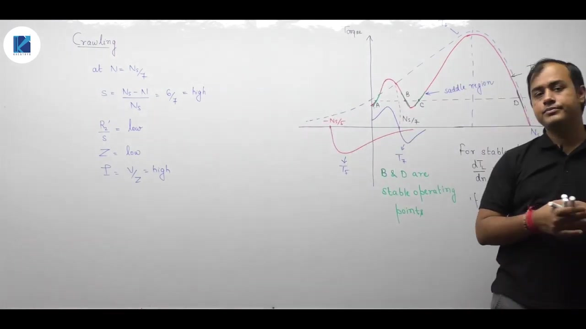

### Acceleration Through the Saddle Region

To avoid crawling, the motor's accelerating torque $(T_e - T_L)$ must remain positive throughout the saddle dip.

If the motor possesses high starting torque, the rotor accelerates rapidly enough to punch through the saddle region before settling at point B. Once past point C, the motor accelerates smoothly to its normal rated operating point D.

Because wound rotor (slip-ring) induction motors allow high external rotor resistance at start, they develop high starting torque and easily bypass the saddle. Therefore, **crawling is predominantly observed in squirrel cage induction motors**.

## Crawling Mitigation and Cogging Fundamentals
_(16:25 - 22:08)_

Crawling and cogging represent two distinct parasitic phenomena in squirrel cage induction machines. This section explains how to eliminate crawling harmonics and introduces the magnetic mechanism of cogging.

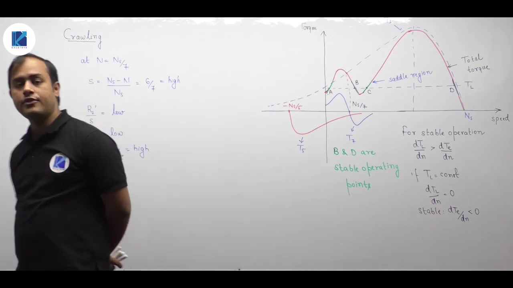

### Methods to Eliminate Crawling

Since crawling is driven primarily by the 5th and 7th space harmonics, suppressing these two harmonics eliminates crawling:

1. **Fractional Pitch (Chording) of Stator Windings**: Coils are short-pitched by a chording angle $\alpha$. The pitch factor for the $n$-th harmonic is:
   $$k_{pn} = \cos\left(\frac{n \alpha}{2}\right)$$
   Selecting a coil span of $5/6$ of pole pitch ($\alpha = 30^\circ$) eliminates or heavily suppresses both 5th and 7th harmonics simultaneously:
   $$k_{p5} = \cos(75^\circ) \approx 0.259, \quad k_{p7} = \cos(105^\circ) \approx -0.259$$
2. **Distributed Stator Windings**: Distributing coils across multiple slots per pole per phase reduces high-order spatial harmonic amplitudes via the distribution factor $k_{dn}$.
3. **Skewing of Rotor Slots**: Tilting the rotor conductor bars by approximately one stator slot pitch smooths out slot harmonic fluctuations along the axial length.

### Mechanism of Cogging (Magnetic Locking)

> [!info] Definition
> **Cogging (Magnetic Locking)**: The phenomenon where an induction motor refuses to start from rest when the number of stator slots $S_s$ and rotor slots $S_r$ are equal or have an integral ratio:
> $$S_s = S_r \quad \text{or} \quad S_s = k S_r$$

When stator slots and rotor slots are equal or integral multiples, the teeth of the stator and rotor align simultaneously across the air gap.

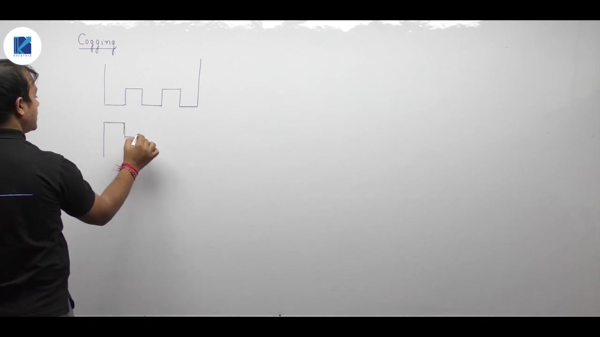

### Reluctance and Magnetic Attraction

When stator teeth face rotor teeth directly:
- The effective air-gap length across the machine drops to its absolute minimum value.
- The reluctance of the magnetic circuit reaches a global minimum.

As magnetizing current energizes the stator, strong magnetic poles of opposite polarity form across opposing tooth faces (North faces South). Strong radial attractive forces lock the teeth into direct alignment.

If the rotor attempts to rotate away from this position, the magnetic path reluctance increases sharply. The magnetic field vigorously resists this displacement by exerting a powerful **reluctance torque** that pulls the rotor back into alignment.

## Cogging Prevention and the Trade-Offs of Slot Skewing
_(22:08 - 27:43)_

Cogging locks the motor at standstill through reluctance torque. This section covers design rules to prevent cogging, details rotor slot skewing, and examines the performance trade-offs of harmonic suppression.

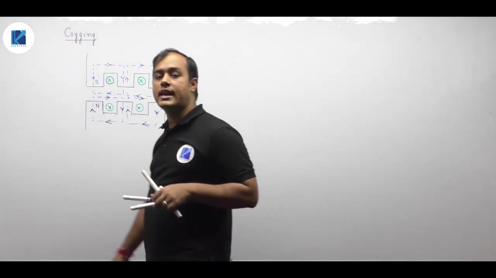

### Reluctance Torque Condition for Cogging

At stand-still, magnetic flux lines establish a state of minimum reluctance across aligned tooth pairs. If the motor develops starting torque $T_{\text{st}}$, it can only start if:

$$T_{\text{st}} > T_{\text{reluctance, max}}$$

If starting torque is insufficient to overcome the peak reluctance torque ($T_{\text{st}} \le T_{\text{reluctance}}$), the rotor remains magnetically locked. The machine hums loudly, draws heavy starting current, and fails to rotate.

### Design Methods to Avoid Cogging

Two primary design rules prevent cogging in squirrel cage induction machines:

1. **Proper Slot Combination Choice**: The number of stator slots $S_s$ and rotor slots $S_r$ must be chosen such that they share no common integral factor:
   $$S_s \neq S_r \quad \text{and} \quad \frac{S_s}{S_r} \neq \text{integer}$$
   Using prime numbers or relatively prime slot combinations prevents simultaneous alignment of teeth across the air gap.
2. **Skewing of Rotor Slots**: Rotor slots are not cut parallel to the shaft axis. They are skewed by an angle $\theta_{\text{skew}}$, typically equal to one stator slot pitch.

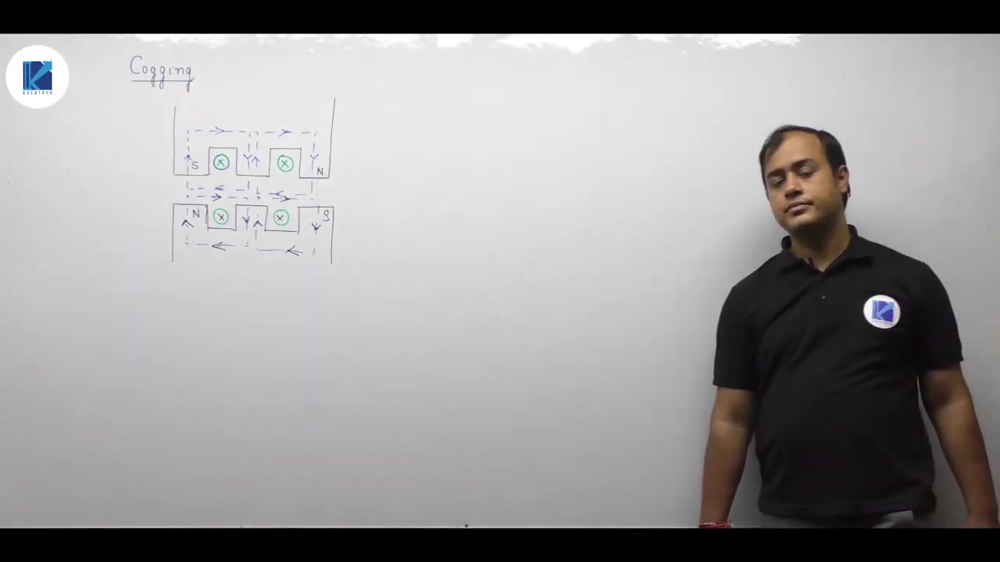

### Mechanics and Trade-Offs of Slot Skewing

When rotor slots are skewed by one stator slot pitch, the position of each rotor bar varies continuously along the axial length of the core:
- A rotor tooth faces a stator slot opening at one end of the stack while facing a stator tooth at the other end.
- The net reluctance along the whole axial length remains nearly constant as the rotor turns.
- Reluctance torque is virtually eliminated, preventing cogging.

Skewing also smooths out higher-order space harmonics, eliminating crawling saddles, harmonic synchronous torques, and magnetic hum.

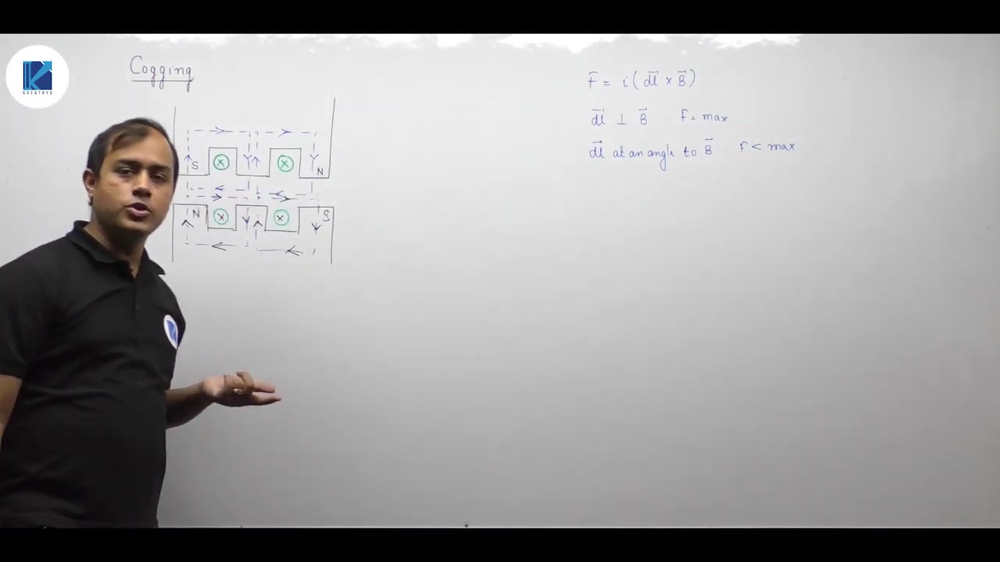

However, skewing involves a performance penalty. The Lorentz force acting on a conductor carrying current $I$ in a magnetic field $\vec{B}$ is:

$$\vec{F} = I (\vec{dl} \times \vec{B})$$

When the conductor is perpendicular to the flux ($\theta = 90^\circ$), force is maximized ($\sin 90^\circ = 1$). When skewed at an angle $\theta < 90^\circ$, the effective tangential driving force is reduced by the skew factor:

$$k_{\text{skew}} = \frac{\sin(\gamma/2)}{\gamma/2} < 1$$

where $\gamma$ is the skew angle in electrical radians.

> [!success] Result
> **Trade-Off of Skewing**:
> - **Benefits**: Completely eliminates cogging, prevents crawling, and eliminates high-frequency acoustic noise.
> - **Penalties**: Slightly reduces induced EMF, developed torque, and maximum breakdown torque ($T_{\text{max}}$).

## Induction Generator Principles and Reactive Power Requirements
_(27:50 - 32:43)_

An induction machine operates reversibly as a generator when driven mechanically above its synchronous speed. This section establishes the operating conditions of an induction generator and explains why it operates strictly at a leading power factor.

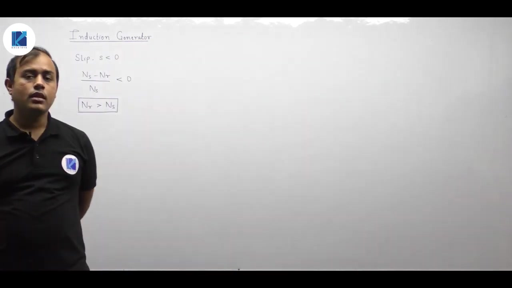

### Generation Condition and Slip

An induction motor cannot exceed synchronous speed on its own. To operate as an induction generator, an external mechanical prime mover (such as a wind turbine, steam turbine, or diesel engine) must rotate the shaft faster than synchronous speed:

$$N_r > N_s$$

The operating slip becomes negative:

$$s = \frac{N_s - N_r}{N_s} < 0$$

> [!info] Definition
> **Induction Generator (Asynchronous Generator)**: An induction machine whose rotor is driven by an external prime mover at speeds above synchronous speed ($s < 0$). It converts mechanical input into electrical power delivered at its stator terminals.

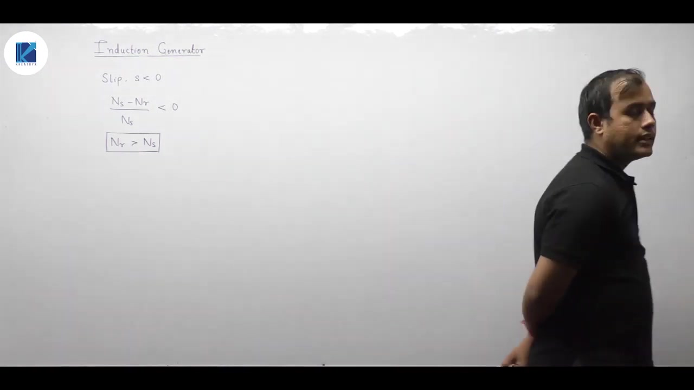

### Magnetizing Field and Reactive Power Demand

In an ordinary synchronous generator, a DC source excites the rotor field winding to establish the magnetic flux. The rotor of an induction machine carries no external electrical source.

To establish air-gap working flux, the induction generator must draw magnetizing current from its stator terminals:
- Real power flows **out** of the stator terminals into the load or grid ($P_{\text{out}} > 0$).
- Reactive power must flow **into** the stator winding from an external electrical source to sustain the magnetic field ($Q_{\text{in}} > 0$).

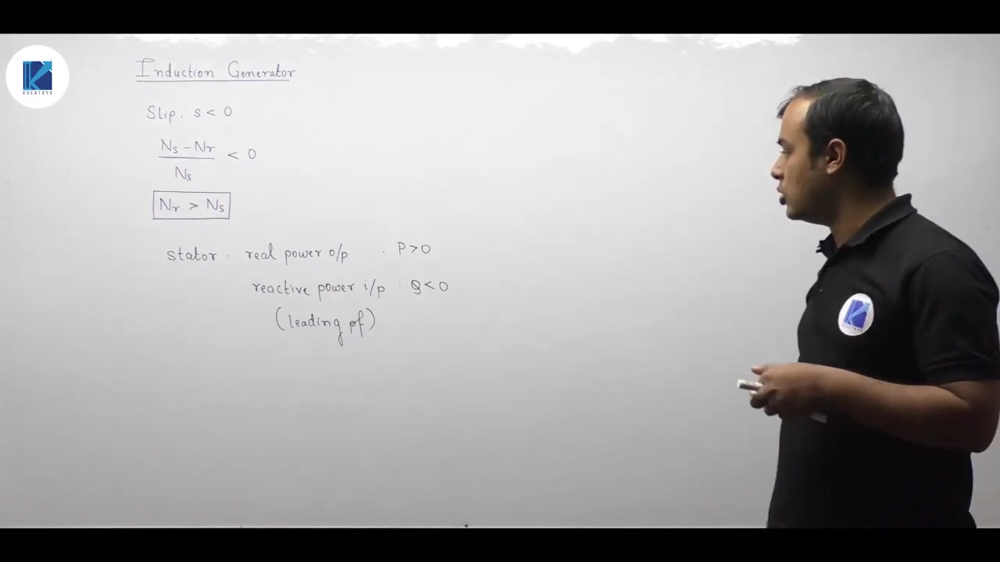

### Leading Power Factor Operation

In standard AC power conventions, power delivered by a generator is defined as positive output:
- Delivered Real Power: $P = P_{\text{out}} > 0$
- Delivered Reactive Power: $Q = -Q_{\text{in}} < 0$

When a generator delivers positive active power while absorbing lagging reactive power (or delivering leading reactive power), the terminal operating power factor is **leading**:

$$\tan\phi = \frac{Q_{\text{delivered}}}{P_{\text{delivered}}} < 0 \implies \text{Leading Power Factor}$$

> [!success] Result
> **Power Factor Rule**:
> - An induction generator **always operates at a leading power factor**. It can never deliver power at a lagging power factor.
> - In contrast, a synchronous generator can operate at lagging, unity, or leading power factor by adjusting its rotor DC excitation.

## Self-Excited vs Externally Excited Induction Generators
_(32:43 - 39:50)_

Depending on the source of magnetizing reactive power, induction generators are classified as self-excited or externally excited. This section explores voltage build-up dynamics in standalone installations and grid connections for renewable energy.

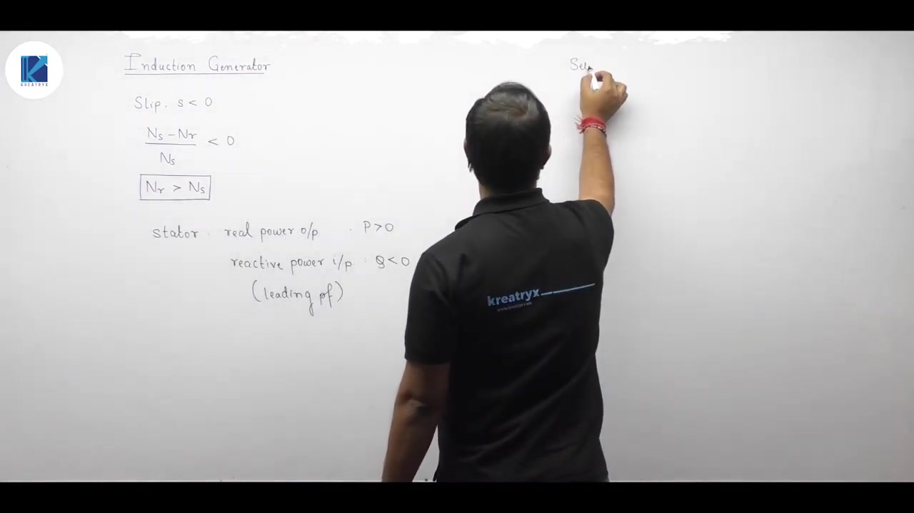

### Self-Excited Induction Generator (SEIG)

A self-excited induction generator operates disconnected from an electrical utility grid. A three-phase capacitor bank is connected in parallel with the stator terminals to deliver the required magnetizing reactive power:

$$Q_C = 3 V^2 \omega C$$

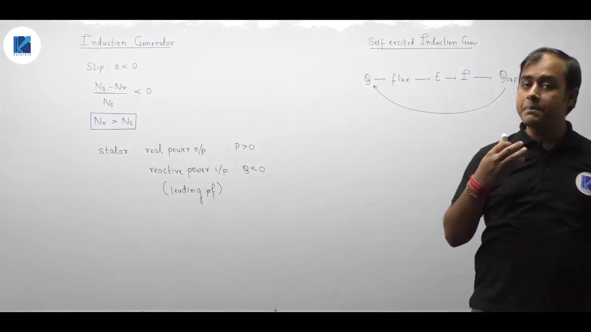

### Voltage Build-Up Process via Residual Magnetism

A passive capacitor bank cannot supply reactive current without terminal voltage. Voltage build-up relies on rotor residual flux:
1. When rotated by the prime mover above synchronous speed, small residual magnetism in the rotor iron cuts the stator windings.
2. This induces a small residual EMF ($E_{\text{res}}$) across the stator terminals.
3. The residual EMF drives a small leading current $I_C$ through the parallel capacitors.
4. The capacitor current supplies magnetizing reactive power, which reinforces the initial residual flux.
5. The reinforced flux induces higher stator EMF, which drives larger capacitor current.

This positive regenerative feedback loop causes stator voltage to grow exponentially. As flux density increases, the iron core saturates. The non-linear magnetization curve intersects the linear capacitor volt-ampere line, establishing a stable steady-state operating voltage.

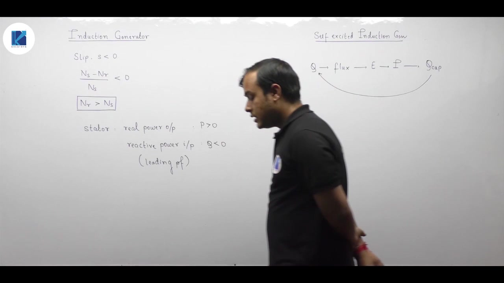

### Externally Excited Induction Generator

An externally excited induction generator is connected directly to a live AC power system (the electrical grid).

Synchronous generators operating in parallel across the grid automatically supply the magnetizing reactive current needed by the induction machine. The induction generator simply exports its real electrical power into the network.

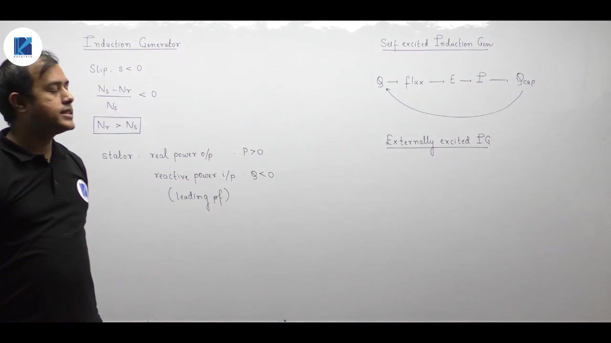

> [!info] Definition
> **Grid-Connected (Externally Excited) Asynchronous Generator**: An induction generator connected directly to an AC grid. The grid fixes the terminal frequency and voltage while supplying the necessary magnetizing vars, and the generator injects active power proportional to negative slip.

### Practical Applications and Technical Limitations

Externally excited induction generators are widely used in:
- Small hydroelectric stations.
- Wind turbine generation systems.
- Industrial waste-heat energy recovery drives.

Their primary operational limitations are:
1. **Continuous Reactive Power Consumption**: The machine absorbs vars from the system under all operating conditions, requiring external power factor correction capacitors.
2. **Poor Voltage Regulation**: In standalone SEIG setups, terminal voltage fluctuates with variations in load and prime mover speed.
3. **Restricted Leading Power Factor**: Output is strictly confined to a leading power factor.

## Generator Power Flow and Induction vs Synchronous Motor Comparison
_(39:55 - 46:14)_

The direction of power flow reverses when an induction machine transitions from motoring to generation. This section derives the power equations for an induction generator and presents a comparison between induction and synchronous motors.

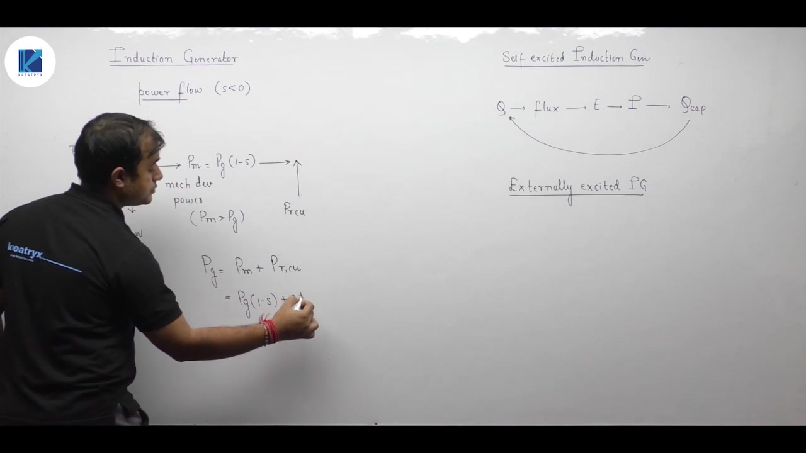

### Power Flow in an Induction Generator

In an induction generator, energy transfers from the mechanical shaft to the electrical grid:

1. **Shaft Input Power ($P_{\text{shaft}}$)**: Supplied mechanically by the prime mover:
   $$P_{\text{shaft}} = T_{\text{shaft}} \omega_r$$
2. **Gross Mechanical Developed Power ($P_m$)**: Mechanical losses (friction and windage $P_{\text{mech}}$) are subtracted:
   $$P_m = P_{\text{shaft}} - P_{\text{mech}}$$
3. **Air-Gap Power ($P_g$)**: Rotor copper losses ($P_{cu,r} = |s| P_g$) are subtracted:
   $$P_g = P_m - P_{cu,r} = P_m - |s| P_g$$
   In generator operation, $s < 0$, so $P_m = P_g (1 - s) > P_g$. The gross mechanical power is greater than the air-gap power.
4. **Active Electrical Output ($P_{\text{out}}$)**: Stator core loss $P_{\text{core}}$ and stator copper loss $P_{cu,s}$ are subtracted as the air-gap power passes through the stator:
   $$P_{\text{out}} = P_g - P_{cu,s} - P_{\text{core}}$$

> [!important]
> In an induction generator, **air-gap power flows from rotor to stator** across the air gap. This is the reverse of motor operation.

### Equivalent Circuit Representation

In the per-phase equivalent circuit:

$$\frac{R_2'}{s} < 0 \quad (\text{since } s < 0)$$

A negative fictitious resistance indicates that this branch acts as an active electrical source, injecting power into the equivalent network.

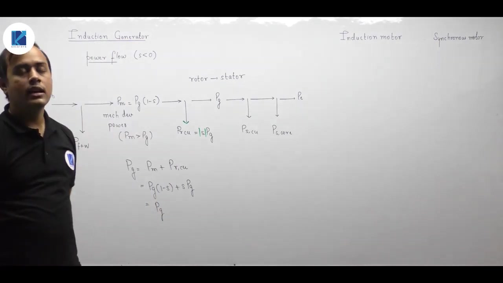

### Comprehensive Comparison: Induction vs Synchronous Motor

| Feature / Parameter | Induction Motor | Synchronous Motor |
| :--- | :--- | :--- |
| **Self-Starting Ability** | Inherently self-starting. | Not self-starting (requires damper winding or pony motor). |
| **Operating Speed** | Sub-synchronous, decreases with load ($N = N_s(1-s)$). | Strictly constant at synchronous speed ($N = N_s$). |
| **Rotor Excitation** | No DC excitation needed on rotor. | Requires external DC excitation on rotor field winding. |
| **Operating Power Factor** | Strictly lagging under all operating conditions. | Flexible: operates at lagging, unity, or leading PF via excitation control. |
| **Speed Control** | Easily controlled via $V/f$, pole changing, or cascade. | Inflexible speed: requires variable frequency inverter supply. |
| **Power Factor Improvement** | Cannot improve system power factor. | Can run unloaded as a **synchronous condenser** to improve grid power factor. |
| **Torque-Voltage Relationship** | Torque proportional to voltage squared: $T \propto V^2$. | Torque directly proportional to terminal voltage: $T \propto V$. |
| **Economic Range** | Cheaper and simpler for speeds $> 500\text{ rpm}$ and ratings $< 120\text{ kW}$. | More economical for low speeds $< 500\text{ rpm}$ and high ratings $> 120\text{ kW}$. |

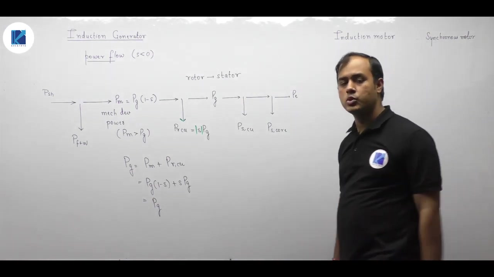

These distinct operating and construction characteristics govern the selection of three-phase AC motors across modern industrial drives.

---

## Summary and Key Takeaways

- Space harmonics of order $r = 6k \pm 1$ rotate at speeds $N_r = N_s / r$, where order $6k+1$ rotates forward and order $6k-1$ rotates backward.
- The 7th harmonic creates a forward saddle dip around $N_s/7$, causing the motor to crawl at low speed if load torque intersects this dip stably.
- Cogging occurs at standstill when stator and rotor slot numbers share a common integer factor, locking teeth in minimum reluctance alignment.
- Cogging is prevented by selecting $S_s \neq S_r$ with no common factors, or by skewing rotor slots by one stator slot pitch.
- Skewing eliminates slot harmonics and smooths torque, but it slightly reduces fundamental induced EMF and leakage inductance.
- An induction machine operates as an induction generator when an external prime mover drives the rotor above synchronous speed ($s < 0$).
- An induction generator delivers active power to the grid but always absorbs reactive power for core magnetization.
- A standalone self-excited induction generator requires residual rotor magnetism and a shunt capacitor bank to supply lagging reactive magnetization.

---

[← Lec 157: High Torque Cage Rotor](Lecture_157_High_Torque_Cage_Rotor.md) | [🏠 Index](00_yt_study_guide.md) | [Lec 159: High Torque Cage Rotor and Induction Generator →](Lecture_159_High_Torque_Cage_Rotor_and_Induction_Generator.md)
