[← Lec 158: Miscellaneous Concepts](Lecture_158_Miscellaneous_Concepts.md) | [🏠 Index](00_yt_study_guide.md) | [Lec 160: Single Phase Induction Motor 1 →](Lecture_160_Single_Phase_Induction_Motor_1.md)

---

# High Torque Cage Rotor and Induction Generator | L 47 | Electrical Machines | GATE 2022

- **Source**: https://www.youtube.com/watch?v=9wT1vMX7Md8
- **Duration**: 00:45:10
- **Compiled**: 2026-09-23

---

## Overview

This lecture works through examination problems on high torque cage rotors, induction generators, and parasitic harmonic phenomena. It details numerical torque evaluations for inner and outer rotor cages at standstill and rated speed. It analyzes supersynchronous induction generator speed calculations, air-gap power linearity, and rotor copper loss. Finally, it addresses cogging, crawling saddle dips, deep bar skin effect current distributions, and isolated generator excitation.

## Contents

- [[#Double Cage Rotor Construction and Standstill Torque Formulation|Double Cage Rotor Construction and Standstill Torque Formulation]]
- [[#Total Standstill Torque and Running Torque with Star-Delta Starting|Total Standstill Torque and Running Torque with Star-Delta Starting]]
- [[#Standstill Torque Ratio of Cages and Introduction to Induction Generators|Standstill Torque Ratio of Cages and Introduction to Induction Generators]]
- [[#Induction Generator Operating Speeds and Power Flow Equations|Induction Generator Operating Speeds and Power Flow Equations]]
- [[#Running Torque Ratio and Parasitic Phenomena (Cogging vs Crawling)|Running Torque Ratio and Parasitic Phenomena (Cogging vs Crawling)]]
- [[#Space Harmonic Torques, Saddle Dip, and Deep Bar Current Distribution|Space Harmonic Torques, Saddle Dip, and Deep Bar Current Distribution]]
- [[#Induction Generator Rotor Copper Loss and Parameter Determination|Induction Generator Rotor Copper Loss and Parameter Determination]]
- [[#External Resistance Control, Slot Depth Effects, and Applications|External Resistance Control, Slot Depth Effects, and Applications]]
- [[#Three-Phase Induction Machine Syllabus Summary and Study Roadmap|Three-Phase Induction Machine Syllabus Summary and Study Roadmap]]

---

## Double Cage Rotor Construction and Standstill Torque Formulation
_(00:02 - 05:16)_

### Overview of High Torque Cage Rotors

Standard squirrel cage induction motors suffer from low starting torque and high starting current. Inserting external resistance is not possible because the rotor bars are short-circuited permanently by end rings. High torque cage rotors overcome this limitation using either deep rotor bars or double cage constructions. 

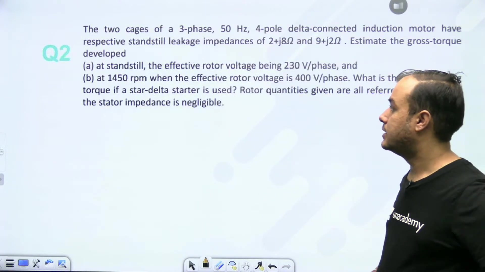

A double cage rotor contains two distinct sets of rotor bars placed in separate slots:
1. **Outer Cage**: Located close to the air gap. It uses high-resistance material or smaller cross-sectional area, giving high resistance $R_o$. Because it sits near the slot opening, its leakage flux path involves little iron, resulting in low leakage reactance $X_o$.
2. **Inner Cage**: Buried deeper in the rotor core. It uses low-resistance material and larger cross-section, giving low resistance $R_i$. Because it is surrounded by iron core, its leakage flux path is large, producing high leakage reactance $X_i$.

Both cages are connected in parallel through common end rings. Under standstill conditions ($s = 1$), rotor frequency equals stator supply frequency. Due to high reactance in the inner cage, rotor currents preferentially flow through the outer cage, generating high starting torque.

### Standstill Torque Modeling for Parallel Cages

> [!info] Parallel Cage Modeling Principle
> In a double cage induction motor, the inner and outer cages act as two independent rotor circuits in parallel. The total electromagnetic torque is the algebraic sum of the individual cage torques:
> $$T_{\text{total}} = T_{\text{outer}} + T_{\text{inner}}$$

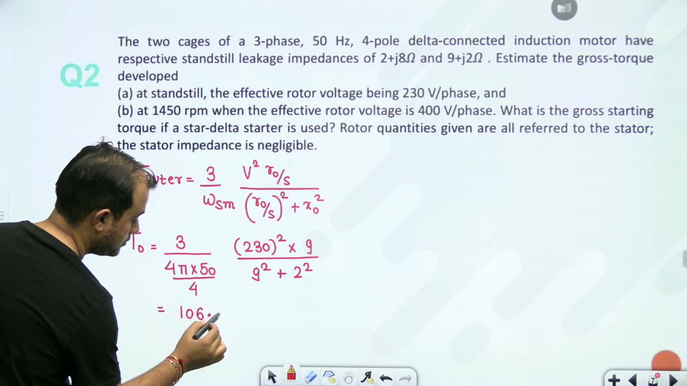

For an effective rotor phase voltage $V_2$ at standstill ($s = 1$), the synchronous mechanical speed is:
$$\omega_{sm} = \frac{4 \pi f}{P} \text{ rad/s}$$

The electromagnetic starting torque contributed by the outer cage is:
$$T_{\text{outer}} = \frac{3}{\omega_{sm}} \frac{V_2^2 R_o}{R_o^2 + X_o^2}$$

Similarly, the starting torque contributed by the inner cage is:
$$T_{\text{inner}} = \frac{3}{\omega_{sm}} \frac{V_2^2 R_i}{R_i^2 + X_i^2}$$

### Worked Example: Outer Cage Standstill Torque

> [!example] Problem
> A 3-phase, 50 Hz, 4-pole double-cage induction motor has the following standstill rotor parameters per phase:
> - Outer cage: $R_o = 0.3\,\Omega$, $X_o = 0.15\,\Omega$
> - Inner cage: $R_i = 0.06\,\Omega$, $X_i = 0.6\,\Omega$
> 
> The effective rotor voltage is $230\text{ V}$ per phase at standstill. Find the synchronous speed and the gross torque developed by the outer cage at standstill.

First, compute the synchronous mechanical angular speed:
$$\omega_{sm} = \frac{4 \pi \times 50}{4} = 50 \pi \approx 157.08\text{ rad/s}$$

Now compute the torque developed by the outer cage at $s = 1$:
$$
\begin{aligned}
T_{\text{outer}} &= \frac{3}{157.08} \times \frac{(230)^2 \times 0.3}{(0.3)^2 + (0.15)^2} \\
&= \frac{3 \times 52900 \times 0.3}{157.08 \times (0.09 + 0.0225)} \\
&= \frac{47610}{157.08 \times 0.1125} \\
&= 106.98\text{ N}\cdot\text{m}
\end{aligned}
$$

The outer cage provides the dominant component of starting torque.

## Total Standstill Torque and Running Torque with Star-Delta Starting
_(05:37 - 10:31)_

### Total Gross Torque at Standstill

Continuing from the previous analysis, the torque of the inner cage at standstill ($s = 1$) is evaluated with parameters $R_i = 0.06\,\Omega$, $X_i = 0.6\,\Omega$, and $V_2 = 230\text{ V/phase}$:
$$
\begin{aligned}
T_{\text{inner}} &= \frac{3}{\omega_{sm}} \frac{V_2^2 R_i}{R_i^2 + X_i^2} \\
&= \frac{3}{157.08} \times \frac{(230)^2 \times 0.06}{(0.06)^2 + (0.6)^2} \\
&= \frac{3 \times 52900 \times 0.06}{157.08 \times (0.0036 + 0.36)} \\
&= \frac{9522}{157.08 \times 0.3636} \\
&= 29.715\text{ N}\cdot\text{m}
\end{aligned}
$$

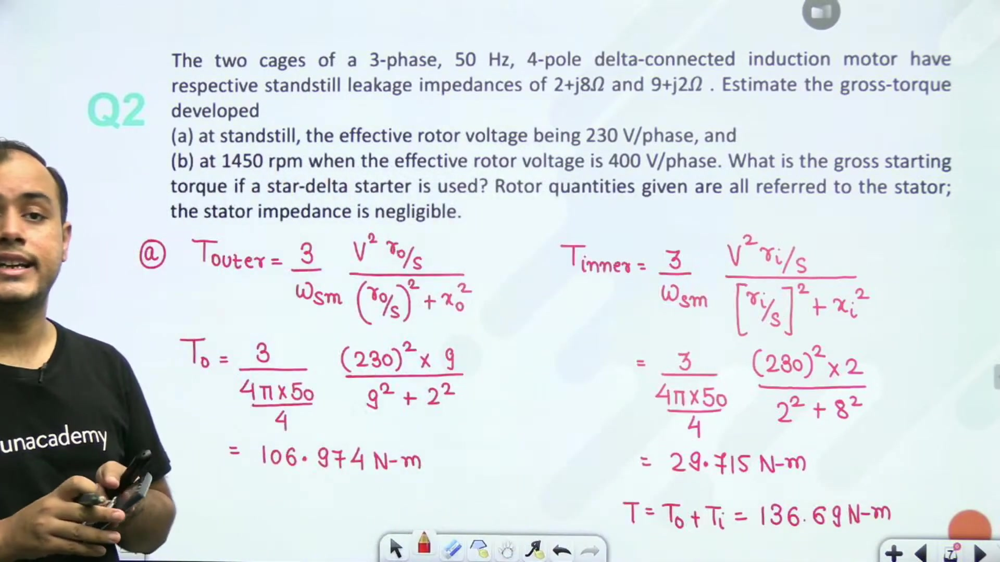

The total standstill torque is the sum of both contributions:
$$
\begin{aligned}
T_{\text{total, st}} &= T_{\text{outer}} + T_{\text{inner}} \\
&= 106.98 + 29.715 \\
&= 136.69\text{ N}\cdot\text{m}
\end{aligned}
$$

Notice that the outer cage contributes $106.98 / 136.69 \approx 78.3\%$ of the total starting torque. This confirms that the outer cage dominates at starting.

### Running Torque at 1450 rpm

Now consider running operation at rotor speed $N = 1450\text{ rpm}$ when supplied at an effective rotor voltage $V_2 = 400\text{ V/phase}$. 

The synchronous speed is:
$$N_s = \frac{120 f}{P} = \frac{120 \times 50}{4} = 1500\text{ rpm}$$

The operating slip is:
$$s = \frac{N_s - N}{N_s} = \frac{1500 - 1450}{1500} = \frac{50}{1500} = \frac{1}{30} \approx 0.0333$$

At this slip, effective rotor resistances become:
$$\frac{R_o}{s} = 0.3 \times 30 = 9.0\,\Omega$$
$$\frac{R_i}{s} = 0.06 \times 30 = 1.8\,\Omega$$

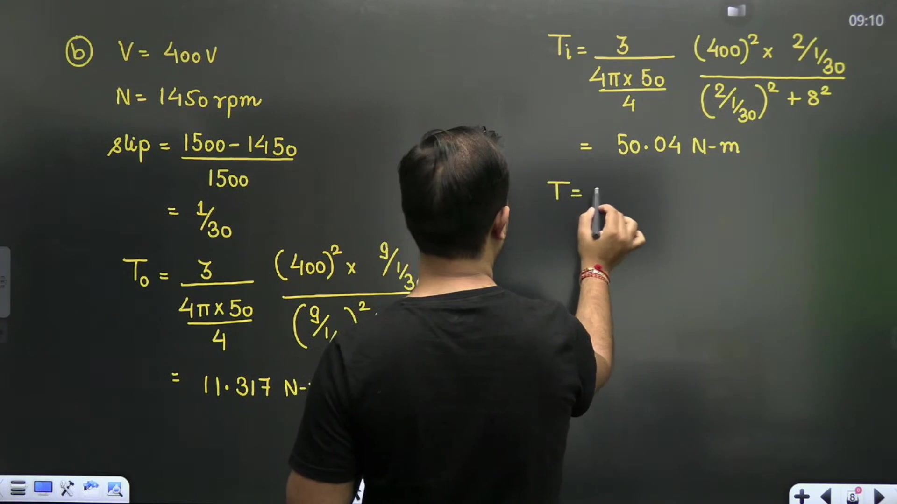

Now calculate the running torque produced by each cage:
$$
\begin{aligned}
T_{\text{outer, run}} &= \frac{3}{\omega_{sm}} \frac{V_2^2 (R_o / s)}{(R_o / s)^2 + X_o^2} \\
&= \frac{3}{157.08} \times \frac{(400)^2 \times 9.0}{(9.0)^2 + (0.15)^2} \\
&= \frac{3 \times 160000 \times 9.0}{157.08 \times (81 + 0.0225)} \\
&= 11.317\text{ N}\cdot\text{m}
\end{aligned}
$$

For the inner cage:
$$
\begin{aligned}
T_{\text{inner, run}} &= \frac{3}{\omega_{sm}} \frac{V_2^2 (R_i / s)}{(R_i / s)^2 + X_i^2} \\
&= \frac{3}{157.08} \times \frac{(400)^2 \times 1.8}{(1.8)^2 + (0.6)^2} \\
&= \frac{3 \times 160000 \times 1.8}{157.08 \times (3.24 + 0.36)} \\
&= \frac{864000}{157.08 \times 3.60} \\
&= 50.04\text{ N}\cdot\text{m}
\end{aligned}
$$

The total torque under running conditions is:
$$T_{\text{total, run}} = T_{\text{outer, run}} + T_{\text{inner, run}} = 11.317 + 50.04 = 61.36\text{ N}\cdot\text{m}$$

Here the inner cage contributes $50.04 / 61.36 \approx 81.5\%$ of the total running torque. At low operating slip, the inner cage dominates completely.

### Star-Delta Starting Torque Comparison

When a star-delta starter is employed, the voltage applied across each stator phase at starting is reduced by a factor of $1/\sqrt{3}$. Because electromagnetic torque is proportional to the square of the voltage, starting torque with a star-delta starter is reduced by $1/3$:
$$T_{\text{st(Y-\Delta)}} = \frac{1}{3} T_{\text{st(DOL)}}$$

If the motor starts from the $400\text{ V}$ supply using a star-delta starter, we can scale the starting torque from the $230\text{ V}$ direct-on-line baseline:
$$
\begin{aligned}
T_{\text{st(Y-\Delta)}} &= \frac{1}{3} \times T_{\text{st}}(230\text{ V}) \times \left(\frac{400}{230}\right)^2 \\
&= \frac{1}{3} \times 136.69 \times (1.7391)^2 \\
&= \frac{1}{3} \times 136.69 \times 3.0246 \\
&= 137.8\text{ N}\cdot\text{m}
\end{aligned}
$$

> [!success] Dual-Cage Operating Principle
> At starting, leakage reactance dominates over resistance. Current flows predominantly through the low-reactance outer cage, delivering high starting torque. At normal operating speed, slip is very small, so $R/s$ dominates over reactance. Current shifts naturally into the low-resistance inner cage, providing high running efficiency.

## Standstill Torque Ratio of Cages and Introduction to Induction Generators
_(10:31 - 15:29)_

### Ratio of Outer to Inner Torque at Starting

Exam questions often ask for the ratio of starting torques developed by the two cages. Because both cages see the same effective air gap voltage $V_2$ and have $s = 1$ at standstill, the voltage and synchronous speed terms cancel out.

The ratio of torque developed by the outer cage to that developed by the inner cage is:
$$\frac{T_{\text{outer}}}{T_{\text{inner}}} = \frac{\frac{R_o}{R_o^2 + X_o^2}}{\frac{R_i}{R_i^2 + X_i^2}} = \left(\frac{R_o}{R_i}\right) \left(\frac{R_i^2 + X_i^2}{R_o^2 + X_o^2}\right)$$

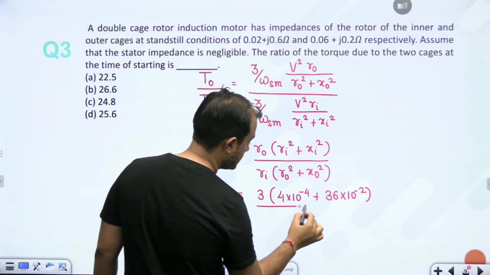

### Worked Example: Numerical Starting Torque Ratio

> [!example] Problem
> A double cage induction motor has per-phase standstill impedances:
> - Inner cage: $Z_i = (0.02 + j 0.6)\,\Omega$
> - Outer cage: $Z_o = (0.06 + j 0.2)\,\Omega$
> 
> Determine the ratio of the torque produced by the two cages at starting.

First, extract the resistance and reactance values:
- $R_o = 0.06\,\Omega$, $X_o = 0.2\,\Omega$
- $R_i = 0.02\,\Omega$, $X_i = 0.6\,\Omega$

Compute the resistance ratio:
$$\frac{R_o}{R_i} = \frac{0.06}{0.02} = 3$$

Compute the impedance magnitudes squared:
$$Z_i^2 = R_i^2 + X_i^2 = (0.02)^2 + (0.6)^2 = 4 \times 10^{-4} + 0.36 = 0.3604\,\Omega^2$$
$$Z_o^2 = R_o^2 + X_o^2 = (0.06)^2 + (0.2)^2 = 36 \times 10^{-4} + 0.04 = 0.0436\,\Omega^2$$

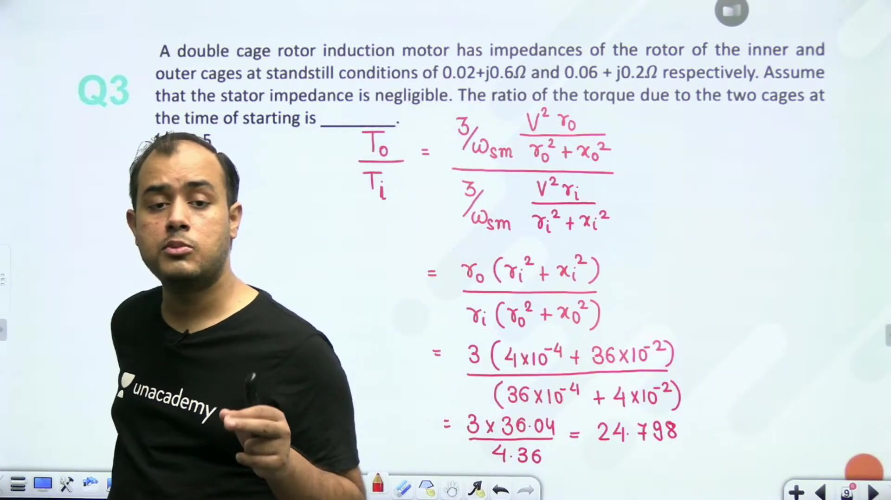

Substitute these into the torque ratio formula:
$$
\begin{aligned}
\frac{T_{\text{outer}}}{T_{\text{inner}}} &= 3 \times \frac{0.3604}{0.0436} \\
&= 3 \times 8.266 \\
&\approx 24.8 \approx 25
\end{aligned}
$$

> [!success] Key Takeaway
> At starting, the outer cage produces approximately 25 times the torque of the inner cage. The outer cage provides nearly all the starting effort, while the inner cage carries almost no starting load.

### Introduction to Induction Generator Mechanics

An induction machine is reversible. When operated at a rotor speed $N_r$ below synchronous speed $N_s$, the slip $s$ is positive ($0 < s < 1$). The machine acts as a motor, converting electrical energy into mechanical power.

If an external prime mover drives the rotor above synchronous speed ($N_r > N_s$), the slip becomes negative:
$$s = \frac{N_s - N_r}{N_s} < 0$$

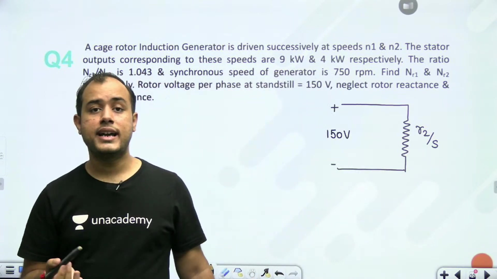

When $s < 0$, the equivalent resistance $R_2 / s$ becomes negative. A negative resistance indicates that the rotor circuit supplies active power rather than consuming it. Air gap power $P_g$ reverses direction, flowing from the rotor across the air gap into the stator.

If rotor leakage reactance and stator impedance are neglected, the per-phase equivalent circuit simplifies to the air gap branch:
$$P_g = 3 \frac{E_2^2}{R_2 / s} = 3 \frac{E_2^2 \, s}{R_2}$$

Because $s < 0$, $P_g$ is negative with respect to the motoring reference, representing real electrical power delivered to the stator terminals.

## Induction Generator Operating Speeds and Power Flow Equations
_(15:43 - 20:57)_

### Air Gap Power and Slip Relationship in Induction Generators

In an induction machine, the direction of power flow depends entirely on the operational mode:
- **Induction Motor**: Active power flows from the electrical grid into the stator, across the air gap ($P_g > 0$), and reaches the rotor shaft as mechanical gross output.
- **Induction Generator**: Mechanical energy is supplied to the shaft by a prime mover. Gross mechanical power flows from the rotor across the air gap ($P_g < 0$) into the stator windings, emerging as electrical output at the terminal grid.

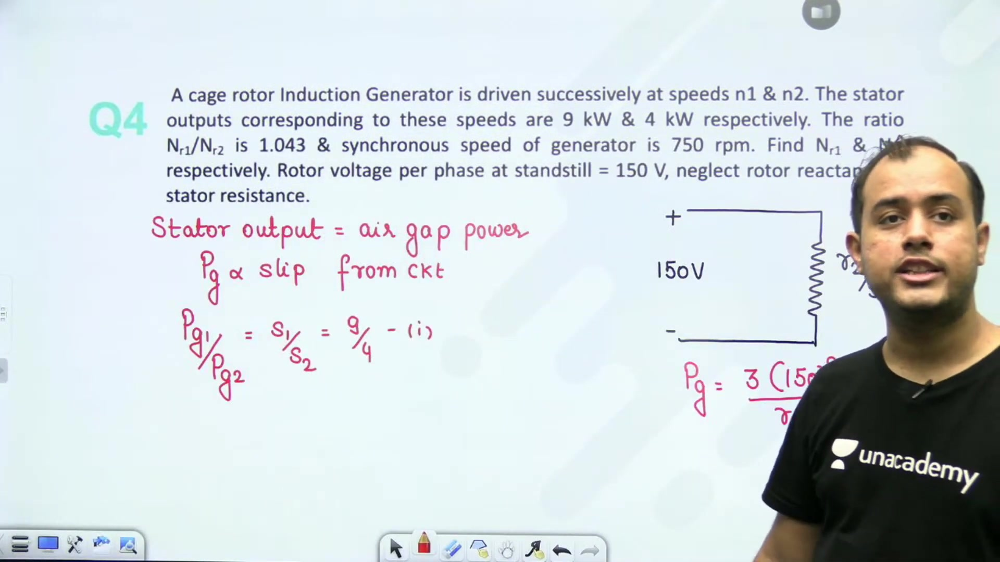

When stator resistance and rotor leakage reactance are neglected, the air-gap power per phase is given by:
$$P_g = 3 \frac{E_2^2}{R_2 / s} = 3 \frac{E_2^2 \, s}{R_2}$$

Because $E_2$ and $R_2$ are constant machine parameters, the air-gap power is directly proportional to the operating slip:
$$P_g \propto s$$

### Worked Example: Dual Operating Speeds

> [!example] Problem
> A cage rotor induction generator is driven successively at speeds $N_{r1}$ and $N_{r2}$.
> The stator active outputs are $9\text{ kW}$ and $4\text{ kW}$.
> The speed ratio is $\frac{N_{r1}}{N_{r2}} = 1.043$.
> The synchronous speed is $N_s = 750\text{ rpm}$.
> Standstill rotor phase voltage is $150\text{ V}$.
> Neglecting rotor reactance and stator resistance, find speeds $N_{r1}$ and $N_{r2}$.

Since stator resistance and rotor reactance are neglected, the stator output equals the air-gap power $P_g$.

Because $P_g \propto s$, the ratio of the two power outputs gives:
$$\frac{P_{g1}}{P_{g2}} = \frac{s_1}{s_2} = \frac{9}{4} = 2.25 \implies s_1 = 2.25 \, s_2$$

Now relate rotor speed to synchronous speed and slip:
$$N_r = N_s (1 - s)$$

The ratio of rotor speeds is:
$$\frac{N_{r1}}{N_{r2}} = \frac{N_s (1 - s_1)}{N_s (1 - s_2)} = \frac{1 - s_1}{1 - s_2} = 1.043$$

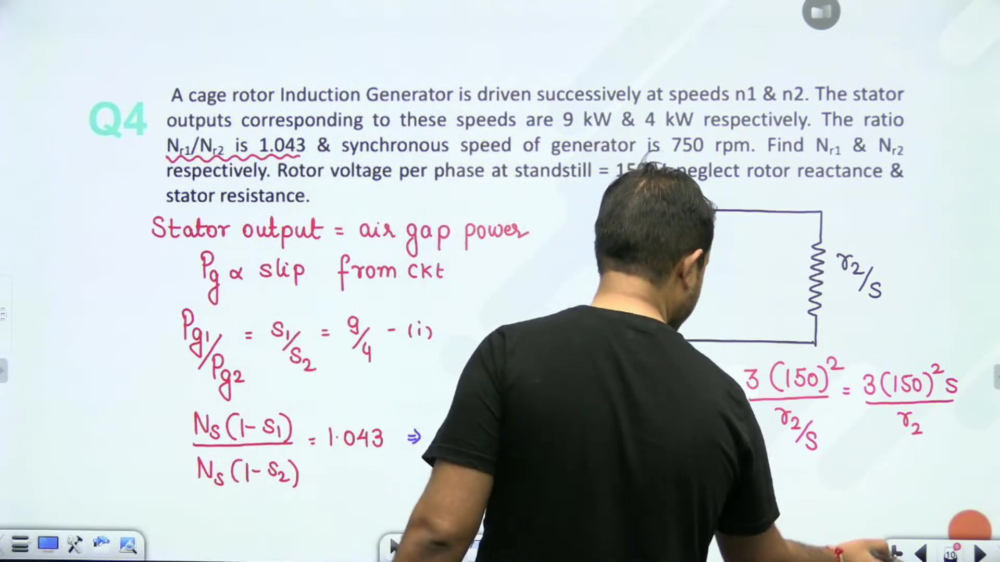

Substitute $s_1 = 2.25 \, s_2$ into the ratio equation:
$$
\begin{aligned}
\frac{1 - 2.25 \, s_2}{1 - s_2} &= 1.043 \\
1 - 2.25 \, s_2 &= 1.043 (1 - s_2) \\
1 - 2.25 \, s_2 &= 1.043 - 1.043 \, s_2 \\
1 - 1.043 &= (2.25 - 1.043) \, s_2 \\
-0.043 &= 1.207 \, s_2 \\
s_2 &= -\frac{0.043}{1.207} \approx -0.03562
\end{aligned}
$$

Now compute $s_1$:
$$s_1 = 2.25 \times (-0.03562) = -0.08014 \approx -0.08$$

Both slips are negative, which confirms induction generator operation above synchronous speed.

Now compute the rotor speeds:
$$
\begin{aligned}
N_{r1} &= N_s (1 - s_1) \\
&= 750 \times (1 - (-0.08014)) \\
&= 750 \times 1.08014 \\
&= 810.11\text{ rpm}
\end{aligned}
$$

$$
\begin{aligned}
N_{r2} &= N_s (1 - s_2) \\
&= 750 \times (1 - (-0.03562)) \\
&= 750 \times 1.03562 \\
&= 776.72\text{ rpm}
\end{aligned}
$$

Check the ratio:
$$\frac{810.11}{776.72} \approx 1.04299 \approx 1.043$$

The values match the given problem statement.

### Generator Power Flow Relations

> [!info] Power Balance in an Induction Generator
> For an induction generator operating at negative slip $s < 0$:
> 1. **Mechanical Input Power**:
>    $$P_{\text{mech, in}} = P_{\text{shaft}} = P_g (1 - s)$$
>    Since $s$ is negative, $(1 - s) > 1$, which means $P_{\text{mech, in}} > P_g$.
> 2. **Rotor Copper Loss**:
>    $$P_{\text{Cu, rotor}} = |s| P_g = -s P_g$$
>    The mechanical input supplies both the air-gap power and internal rotor copper loss:
>    $$P_{\text{mech, in}} = P_g + P_{\text{Cu, rotor}}$$
> 3. **Net Electrical Output**:
>    $$P_{\text{elec, out}} = P_g - P_{\text{stator losses}}$$
>    Stator core loss and stator copper loss are subtracted from $P_g$ to give terminal active power.

## Running Torque Ratio and Parasitic Phenomena (Cogging vs Crawling)
_(20:59 - 25:55)_

### Running Torque Ratio Calculation

Under normal running conditions, the operational slip is small (typically $s \approx 0.02 - 0.05$). At such low slips, the effective rotor resistance $R/s$ is large compared to leakage reactance.

The ratio of cage torques at any operating slip $s$ is:
$$\frac{T_{\text{outer}}}{T_{\text{inner}}} = \frac{\frac{R_o / s}{(R_o / s)^2 + X_o^2}}{\frac{R_i / s}{(R_i / s)^2 + X_i^2}} = \left(\frac{R_o}{R_i}\right) \left[\frac{(R_i / s)^2 + X_i^2}{(R_o / s)^2 + X_o^2}\right]$$

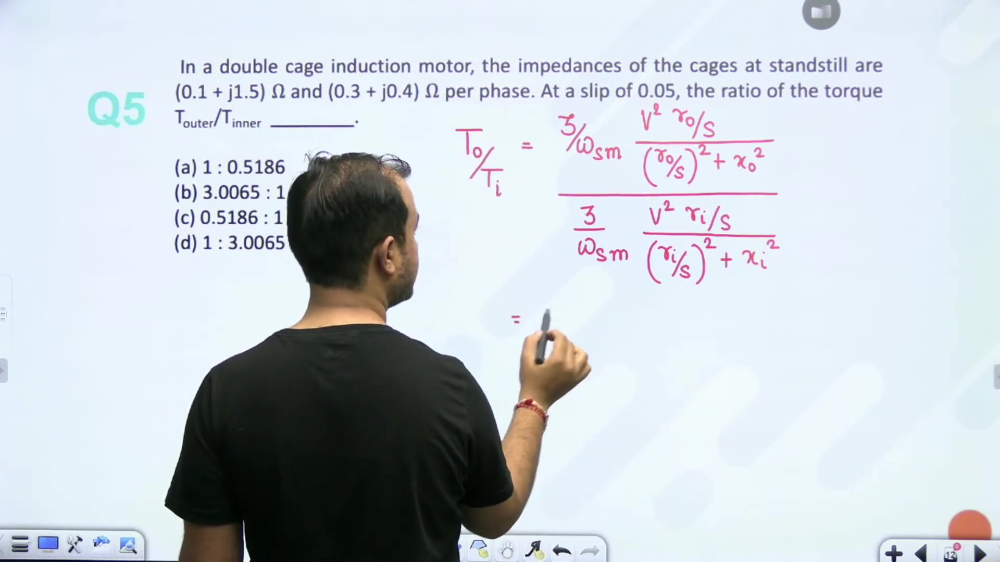

### Worked Example: Running Torque Ratio at Slip 0.05

> [!example] Problem
> A double cage induction motor has the following parameters per phase:
> - Outer cage: $R_o = 0.03\,\Omega$, $X_o = 0.4\,\Omega$
> - Inner cage: $R_i = 0.1\,\Omega$, $X_i = 0.3\,\Omega$
> 
> Find the ratio of outer cage torque to inner cage torque at an operating slip of $s = 0.05$.

First, compute the effective resistance terms at $s = 0.05$:
$$\frac{R_o}{s} = \frac{0.03}{0.05} = 0.6\,\Omega$$
$$\frac{R_i}{s} = \frac{0.1}{0.05} = 2.0\,\Omega$$

Compute the impedance magnitudes squared:
$$Z_{o,\text{run}}^2 = (R_o / s)^2 + X_o^2 = (0.6)^2 + (0.4)^2 = 0.36 + 0.16 = 0.52\,\Omega^2$$
$$Z_{i,\text{run}}^2 = (R_i / s)^2 + X_i^2 = (2.0)^2 + (0.3)^2 = 4.0 + 0.09 = 4.09\,\Omega^2$$

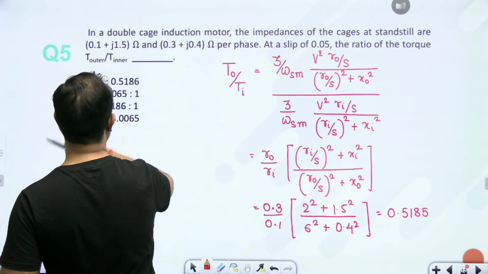

Substitute these into the torque ratio formula:
$$
\begin{aligned}
\frac{T_{\text{outer}}}{T_{\text{inner}}} &= \left(\frac{R_o / s}{R_i / s}\right) \times \left(\frac{Z_{i,\text{run}}^2}{Z_{o,\text{run}}^2}\right) \\
&= \left(\frac{0.6}{2.0}\right) \times \left(\frac{4.09}{0.52}\right) \\
&= 0.3 \times 7.865 \\
&\approx 0.5185
\end{aligned}
$$

Because $\frac{T_{\text{outer}}}{T_{\text{inner}}} = 0.5185 < 1$, the inner cage produces nearly twice the torque of the outer cage.

### Cogging vs Crawling: Conceptual Comparison

> [!info] Fundamental Distinction
> - **Cogging (Magnetic Locking)**: Occurs at standstill ($N = 0$). The motor fails to start altogether.
> - **Crawling**: Occurs during running. The motor starts and accelerates, but locks into a stable low speed (approximately $N_s / 7$).

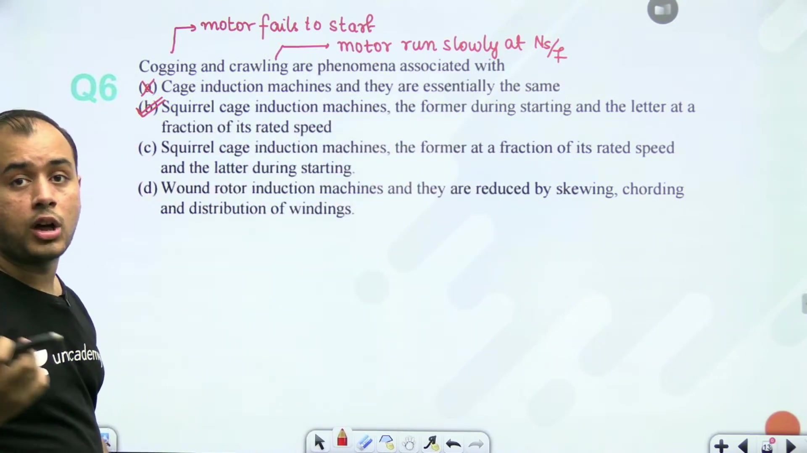

Here is a summary of the differences:

| Feature | Cogging | Crawling |
| :--- | :--- | :--- |
| **Operating State** | Standstill ($s = 1$, $N = 0$) | Running at low speed ($N \approx N_s / 7$, $s \approx 6/7$) |
| **Physical Cause** | Reluctance locking between stator and rotor teeth | 7th space harmonic rotating forward |
| **Machine Type Affected** | Squirrel cage induction motors | Squirrel cage induction motors |
| **Wound Rotor Susceptibility** | Very low (wound rotor has high starting torque and skewed slots) | Very low (high starting torque rapidly crosses saddle region) |
| **Mitigation Technique** | Skew rotor slots; make $S_s \neq S_r$ without common factors | Chording/short-pitching; skewing rotor slots |

Wound rotor induction motors do not crawl. Their high starting torque allows the motor to accelerate through the saddle region without getting trapped.

## Space Harmonic Torques, Saddle Dip, and Deep Bar Current Distribution
_(26:09 - 31:25)_

### Space Harmonics and Crawling Mechanics

Space harmonics arise from the non-sinusoidal spatial distribution of stator windings in slots. For a three-phase supply, the spatial harmonic orders are:
$$r = 6k \pm 1, \quad k = 1, 2, 3, \dots$$

- For $k = 1$, the 5th harmonic rotates backwards at synchronous speed $N_{s5} = -N_s / 5$.
- The 7th harmonic rotates forwards at synchronous speed $N_{s7} = +N_s / 7$.

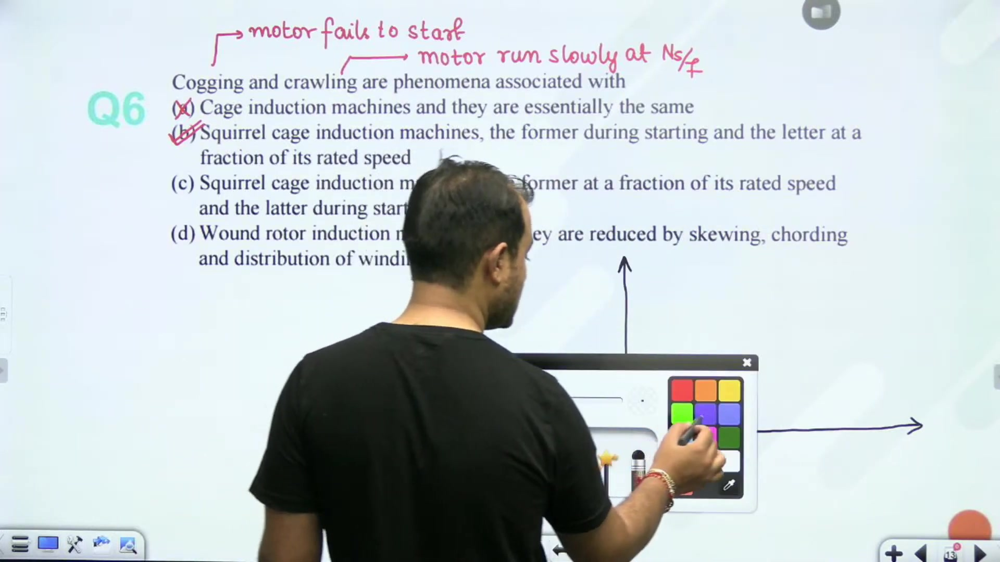

The 5th harmonic produces a backward torque, exerting a slight braking effect across forward motoring speeds. 

The 7th harmonic acts as an independent miniature motor rotating forward:
- For $N < N_s / 7$, it develops motoring torque in the forward direction.
- At $N = N_s / 7$, its torque drops to zero.
- For $N > N_s / 7$, it runs supersynchronously relative to its own field, developing generating (negative) torque.

This generating region creates a distinct downward dip (the saddle dip) in the net electromagnetic torque curve slightly above $N_s / 7$:
$$T_e(N) = T_1(N) + T_5(N) + T_7(N)$$

If the motor drives a load whose torque requirement exceeds this dip, the net acceleration torque becomes zero. The motor stalls at a stable speed near $N_s / 7$, causing crawling.

### Deep Bar Rotor Current Distribution at Starting

A deep bar rotor consists of tall, narrow conductors embedded in deep rotor slots. At standstill ($s = 1$), rotor frequency equals supply frequency ($50\text{ Hz}$ or $60\text{ Hz}$).

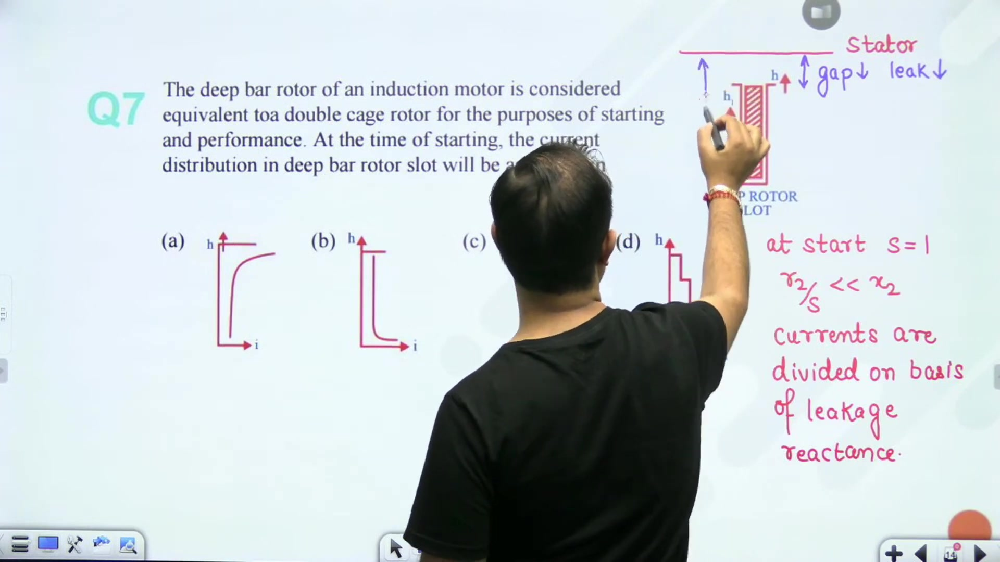

The slot conductor can be visualized as multiple parallel horizontal layers from the top (near the air gap) to the bottom (near the shaft):
1. **Bottom Layers**: Linked by leakage flux crossing the slot body above them plus iron core leakage flux. Their leakage inductance and leakage reactance are very high.
2. **Top Layers**: Linked by only the small leakage flux near the slot opening. Their leakage inductance and leakage reactance are very low.

At starting, rotor leakage reactance dominates heavily over resistance ($X_2 \gg R_2$). Current divides among parallel layers inversely proportional to their leakage reactances:
$$I(x) \propto \frac{1}{X_L(x)}$$

Because $X_{\text{top}} \ll X_{\text{bottom}}$, current crowds toward the top of the bar:
$$I_{\text{top}} \gg I_{\text{bottom}}$$

This phenomenon is an operational manifestation of the **skin effect**.

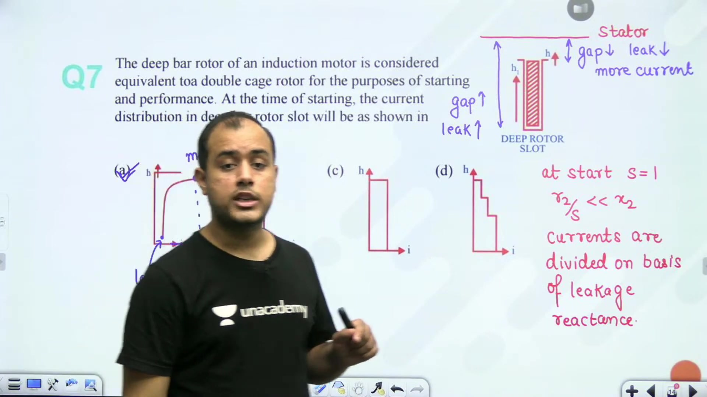

> [!success] Effect of Current Crowding
> By forcing current into the upper portion of the conductor at starting:
> 1. The effective cross-sectional area carrying current is significantly reduced.
> 2. The effective AC rotor resistance rises ($R_{\text{ac}} \gg R_{\text{dc}}$).
> 3. Starting torque increases directly ($T_{\text{st}} \propto R_2$).
> 
> When the motor speeds up, rotor slip drops ($s \approx 0.02 - 0.05$). Rotor frequency drops to $1 - 2.5\text{ Hz}$, rendering leakage reactance negligible. Current redistributes evenly across the full bar cross-section, restoring low DC resistance and high running efficiency.

## Induction Generator Rotor Copper Loss and Parameter Determination
_(31:30 - 36:11)_

### Rotor Copper Loss in Supersynchronous Generation

In an induction machine operating as a generator, mechanical shaft power is converted into electromagnetic air gap power. Internal rotor copper losses dissipate a portion of this mechanical energy before it crosses the air gap:
$$P_{\text{Cu, rotor}} = |s| P_g = -s P_g \quad (s < 0)$$

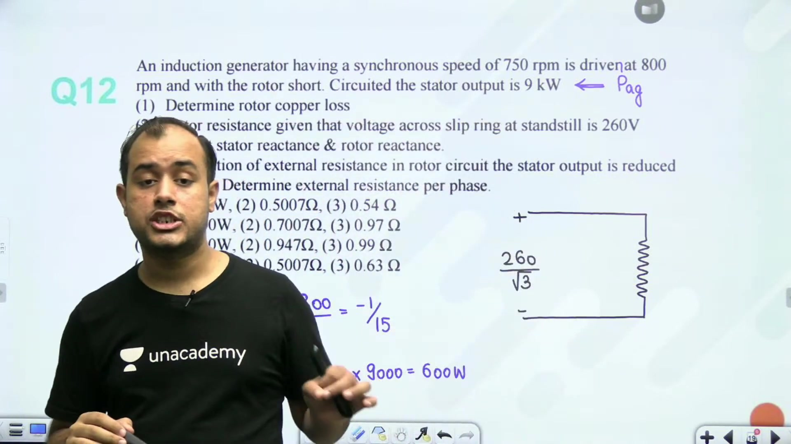

### Worked Example: Loss and Rotor Resistance Calculation

> [!example] Problem
> A 3-phase, 50 Hz, 8-pole induction generator is driven by a prime mover at $800\text{ rpm}$.
> It delivers an air-gap power of $P_g = 9\text{ kW}$.
> The voltage across the open-circuit slip rings at standstill is $260\text{ V}$.
> Neglecting stator impedance and rotor leakage reactance, calculate:
> 1. The rotor copper loss.
> 2. The rotor resistance per phase.

First, compute the synchronous speed of the 8-pole, 50 Hz stator field:
$$N_s = \frac{120 f}{P} = \frac{120 \times 50}{8} = 750\text{ rpm}$$

Compute the operating slip:
$$s = \frac{N_s - N_r}{N_s} = \frac{750 - 800}{750} = -\frac{50}{750} = -\frac{1}{15} \approx -0.0667$$

Now calculate the total 3-phase rotor copper loss:
$$
\begin{aligned}
P_{\text{Cu, rotor}} &= |s| P_g \\
&= \frac{1}{15} \times 9000\text{ W} \\
&= 600\text{ W}
\end{aligned}
$$

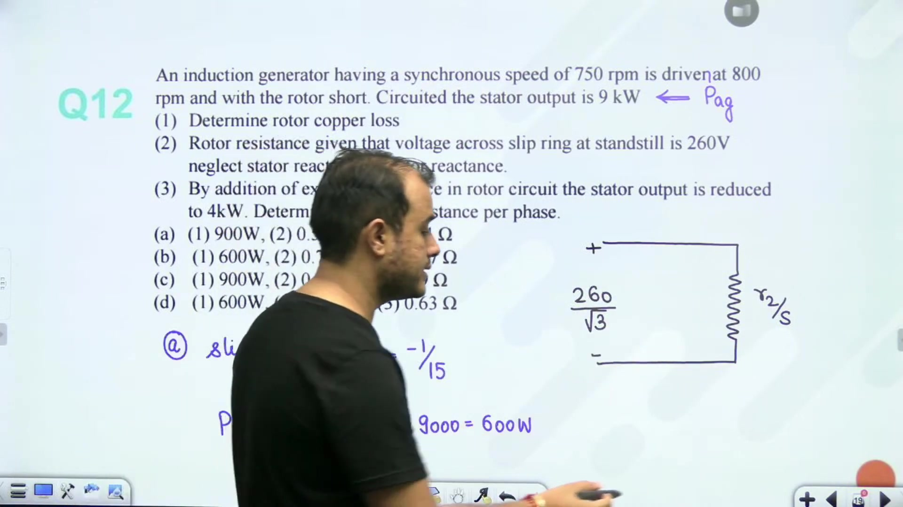

Now consider the rotor circuit equivalent model. Rotor slip rings always provide a three-phase star connection. The open-circuit voltage measured between slip rings at standstill is the line-to-line voltage:
$$V_{\text{slip-ring, LL}} = 260\text{ V}$$

The per-phase induced rotor voltage at standstill is:
$$E_2 = \frac{V_{\text{slip-ring, LL}}}{\sqrt{3}} = \frac{260}{\sqrt{3}}\text{ V}$$

With stator impedance and rotor leakage reactance neglected, the 3-phase air-gap power is:
$$P_g = 3 \frac{E_2^2}{R_2 / |s|}$$

Substitute the known values into this equation:
$$
\begin{aligned}
9000 &= 3 \times \frac{\left(\frac{260}{\sqrt{3}}\right)^2}{\frac{R_2}{1/15}} \\
9000 &= 3 \times \frac{\frac{(260)^2}{3}}{15 R_2} \\
9000 &= \frac{(260)^2}{15 R_2} \\
9000 &= \frac{67600}{15 R_2} \\
15 R_2 &= \frac{67600}{9000} \approx 7.511 \\
R_2 &= \frac{7.511}{15} \approx 0.5007 \approx 0.5\,\Omega/\text{phase}
\end{aligned}
$$

> [!success] Calculated Machine Constants
> 1. Rotor copper loss = $600\text{ W}$.
> 2. Rotor resistance per phase $R_2 = 0.5\,\Omega$.

## External Resistance Control, Slot Depth Effects, and Applications
_(36:32 - 41:23)_

### External Resistance Control in Wound Rotor Induction Generators

When a wound rotor induction generator is driven at a fixed mechanical speed $N_r$ by a prime mover, its operating slip remains completely fixed:
$$s = \frac{N_s - N_r}{N_s} = \text{constant}$$

To modify the electrical output power or air-gap power at this fixed speed, external resistors can be added in series with the rotor phases via slip rings:
$$R_{\text{total}} = R_2 + R_{\text{ext}}$$

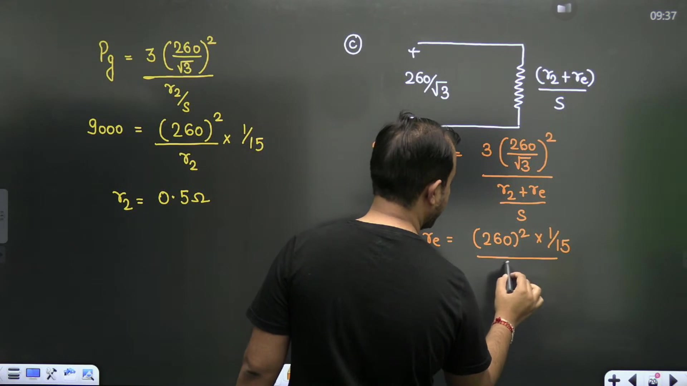

### Worked Example: External Resistance Insertion

> [!example] Problem
> Continuing the previous induction generator, an external resistance $R_{\text{ext}}$ is connected into the rotor circuit to reduce the air-gap power from $9000\text{ W}$ to $4000\text{ W}$. The prime mover maintains the speed at $800\text{ rpm}$. Find the required external resistance per phase.

Because the prime mover maintains the speed at $800\text{ rpm}$, the slip remains unchanged at $s = -1/15$.

The air-gap power with external resistance inserted is:
$$P_g' = 3 \frac{E_2^2}{(R_2 + R_{\text{ext}}) / |s|}$$

Substitute the known parameters ($P_g' = 4000\text{ W}$, $E_2 = 260 / \sqrt{3}\text{ V}$, $|s| = 1/15$):
$$
\begin{aligned}
4000 &= 3 \times \frac{\frac{(260)^2}{3}}{15 (R_2 + R_{\text{ext}})} \\
4000 &= \frac{67600}{15 (R_2 + R_{\text{ext}})} \\
15 (R_2 + R_{\text{ext}}) &= \frac{67600}{4000} = 16.90 \\
R_2 + R_{\text{ext}} &= \frac{16.90}{15} \approx 1.1266\,\Omega
\end{aligned}
$$

Using $R_2 = 0.5\,\Omega$:
$$R_{\text{ext}} = 1.1266 - 0.5 = 0.6266\,\Omega/\text{phase}$$

### Influence of Rotor Slot Depth on Machine Performance

Consider two induction machines, A and B, identical in all respects except that Machine B has deeper rotor slots than Machine A.

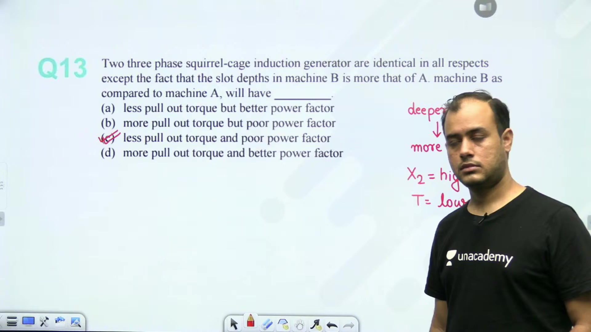

Deeper slots increase the iron leakage flux path across the slot body:
1. **Leakage Reactance Increases**: Deeper embedding of conductors increases slot leakage flux, meaning $X_{2B} > X_{2A}$.
2. **Breakdown (Pull-Out) Torque Decreases**:
   $$T_{\text{max}} \approx \frac{3 V_1^2}{2 \omega_{sm} X_2}$$
   Because $X_2$ increases, maximum developed torque drops.
3. **Power Factor Deteriorates**:
   $$\cos \phi \approx \frac{R}{\sqrt{R^2 + X^2}}$$
   Larger leakage reactance demands greater reactive magnetizing current, lowering operating power factor.

Therefore, Machine B has less pull-out torque and a poorer power factor than Machine A.

### Applications and Excitation of Induction Generators

> [!info] Suitable Application Domains
> - **Wind Energy and Micro-Hydro Systems**: Ideal for variable-speed operation where the prime mover speed fluctuates. The induction generator can feed power into a stiff AC grid without precise synchronizing gear.
> - **Conventional Thermal and Hydro Plants**: Require synchronous generators because they must maintain tight grid frequency and deliver both active and reactive power.

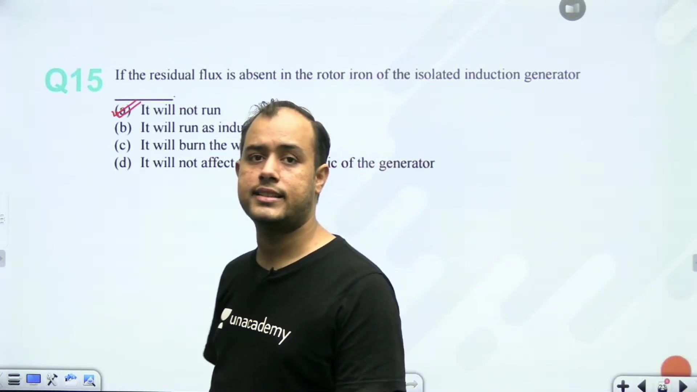

### Voltage Build-Up in Isolated Self-Excited Induction Generators

In an isolated installation without a grid connection, an induction machine requires a shunt capacitor bank to supply lagging reactive magnetization:
1. **Residual Magnetism Requirement**: The rotor iron must retain residual magnetic flux to generate a small initial EMF when spun by the prime mover.
2. **Capacitive Current Reinforcement**: This tiny EMF drives capacitive leading current through the stator capacitor bank, reinforcing the air gap flux.
3. **Voltage Saturation**: The terminal voltage builds up until the non-linear magnetizing curve intersects the capacitive reactance line.

If residual flux is absent in the rotor iron, no initial EMF is generated. The capacitor bank cannot draw current, and the generator fails to build up voltage.

## Three-Phase Induction Machine Syllabus Summary and Study Roadmap
_(41:23 - 45:05)_

### Summary of the Three-Phase Induction Machine Module

This session concludes the comprehensive problem series on three-phase induction machines. Across the lectures, the study has traversed all major operational and design aspects:
1. **Rotating Magnetic Field and Principles**: Generation of constant magnitude stator flux rotating at synchronous speed $N_s = 120 f / P$.
2. **Equivalent Circuit and Modeling**: Exact and approximate equivalent circuits, parameter determination via no-load and blocked-rotor tests, and performance prediction.
3. **Torque-Speed Characteristics**: Maximum torque conditions, operating slip ranges, starting torque, and mechanical power development.
4. **Starting and Speed Control**: Direct-on-line, star-delta, auto-transformer, and rotor resistance starters; stator voltage control, frequency control ($V/f$), and pole changing.
5. **Electric Braking**: Regenerative braking, plugging (reverse current braking), and DC dynamic (rheostatic) braking.
6. **Parasitic Effects and Special Rotors**: Skin effect in deep bar rotors, dual-cage performance, crawling mitigation, and cogging prevention.
7. **Induction Generators**: Grid-connected and self-excited operation, reactive power dynamics, and power flow equations.

### Examination Preparation Guidelines for GATE and ESE

Mastery of electrical machines for competitive examinations requires structured problem practice alongside conceptual clarity. Key examination habits include:
- **Separation of Cages**: In double cage problems, treat inner and outer cages as two distinct parallel circuits rather than combining parameters prematurely.
- **Sign Conventions in Generation**: Remember that slip is negative ($s < 0$) in generation. Mechanical power input exceeds air-gap power because the shaft supplies both active output and internal rotor copper loss.
- **Space vs Time Harmonics**: Space harmonics alter rotational speeds ($N_r = N_s / r$) through spatial winding distributions. Time harmonics alter supply frequency directly ($f_n = n f$).

> [!info] Next Module in the Course
> With three-phase machines completed, the syllabus transitions to **Single-Phase Induction Motors**, covering double revolving field theory, equivalent circuit modeling, split-phase starting, capacitor-start, and capacitor-run motors.

---

## Summary and Key Takeaways

- In a double-cage rotor, the outer cage has high resistance and low leakage reactance, producing high starting torque ($T_{\text{outer}} \gg T_{\text{inner}}$ at $s = 1$).
- At normal operating speeds, $R_2 / s$ dominates over leakage reactance, causing the low-resistance inner cage to develop the vast majority of running torque ($T_{\text{inner}} \gg T_{\text{outer}}$).
- In a deep bar rotor at standstill, depth-dependent leakage inductance forces current into the top of the conductor, increasing effective AC resistance through the skin effect.
- An induction machine operates as an induction generator when driven mechanically above synchronous speed ($s < 0$), where air-gap power is proportional to slip ($P_g \propto s$) when rotor reactance is neglected.
- Mechanical power input to an induction generator exceeds air-gap power ($P_{\text{mech, in}} = P_g (1 - s) > P_g$) because it supplies both electrical output and internal rotor copper losses ($P_{\text{Cu, rotor}} = |s| P_g$).
- Cogging is a standstill phenomenon where tooth alignment reluctance torque locks the rotor, whereas crawling is a low-speed running phenomenon caused by the forward-rotating 7th space harmonic saddle dip near $N_s / 7$.
- Increasing rotor slot depth increases leakage reactance, which reduces maximum pull-out torque and degrades the operating power factor.
- A standalone self-excited induction generator requires residual rotor magnetism and terminal shunt capacitors to initiate and sustain voltage build-up.

---

[← Lec 158: Miscellaneous Concepts](Lecture_158_Miscellaneous_Concepts.md) | [🏠 Index](00_yt_study_guide.md) | [Lec 160: Single Phase Induction Motor 1 →](Lecture_160_Single_Phase_Induction_Motor_1.md)
