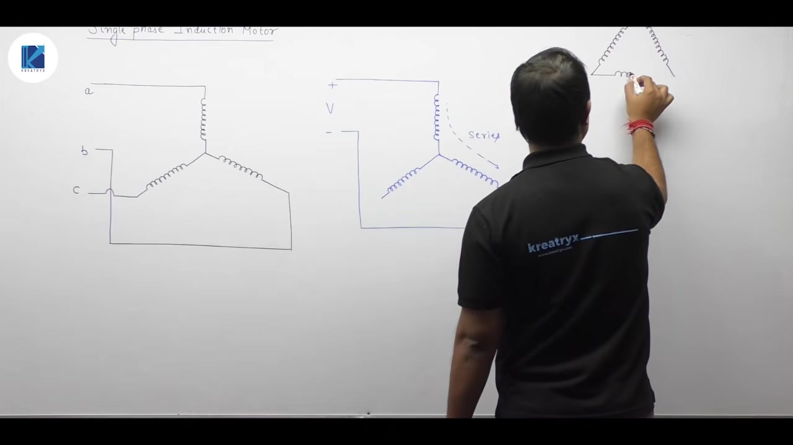
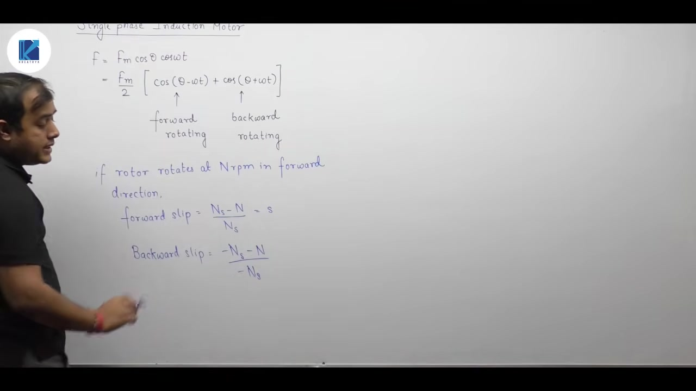
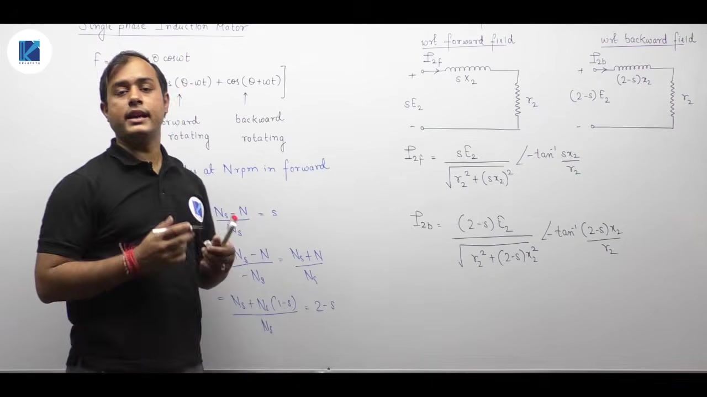
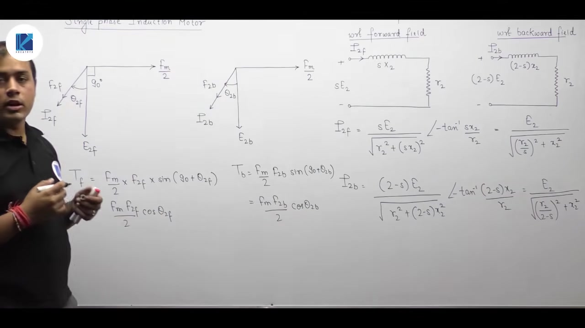
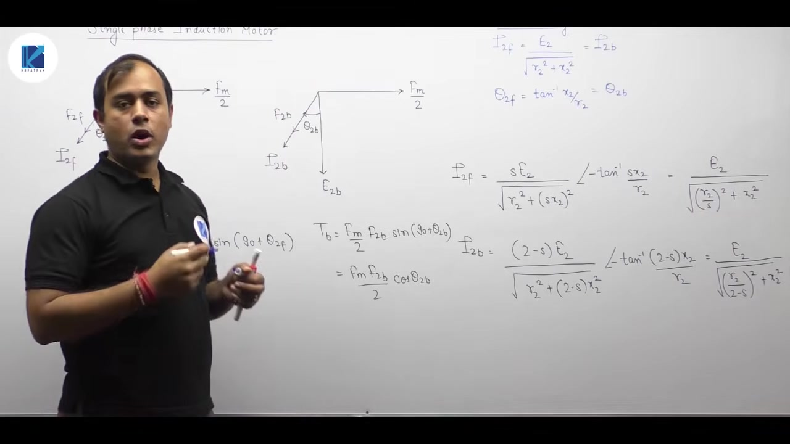
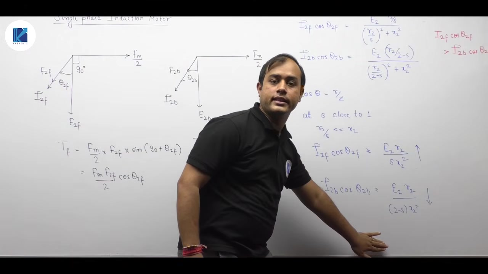
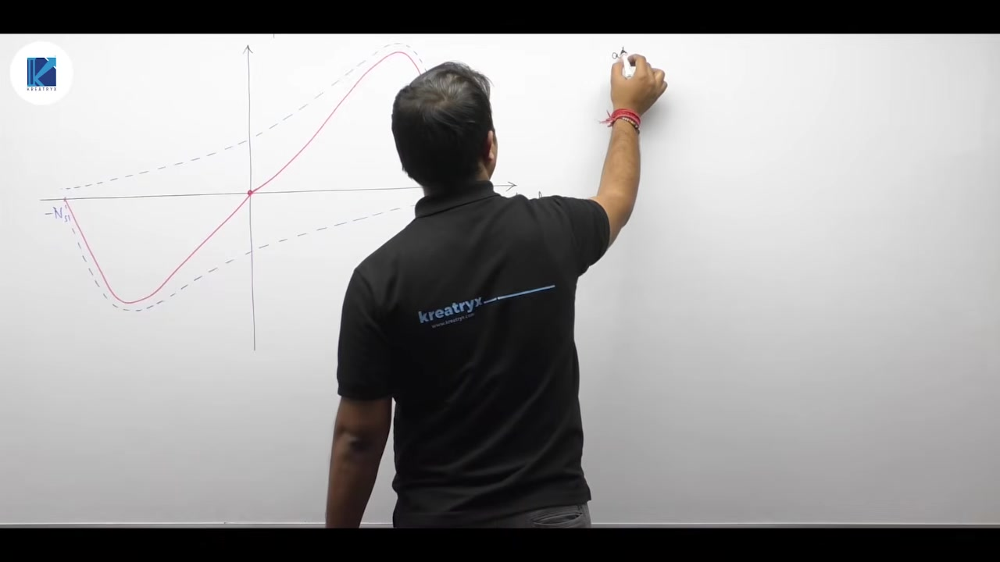
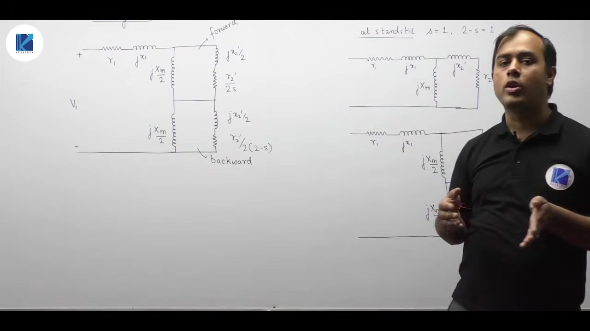

# Single Phase Induction Motor-1 | Induction Machine | Lec 112 | GATE & ESE | Ankit Goyal

- **Source**: https://www.youtube.com/watch?v=FvAqndJj0ok
- **Duration**: 00:36:02
- **Compiled**: 2026-09-23

---

## Overview

This lecture introduces the single-phase induction motor using double revolving field theory. It shows how disconnecting one phase wire from a three-phase stator leaves a single-phase winding. The pulsating air-gap MMF resolves into forward and backward rotating fields of equal amplitude. The lecture analyzes rotor equivalent circuits, slips, and torques produced by both fields. It proves why starting torque is zero and explains how an initial mechanical push produces self-acceleration. Finally, it constructs the complete running equivalent circuit and torque-speed characteristics.

## Contents

- [[#Single-Phase Induction Motor Fundamentals & Double Revolving Field Theory|Single-Phase Induction Motor Fundamentals & Double Revolving Field Theory]]
- [[#Rotor Equivalent Circuits for Forward and Backward Fields|Rotor Equivalent Circuits for Forward and Backward Fields]]
- [[#Torque Production and Zero Starting Torque|Torque Production and Zero Starting Torque]]
- [[#Torque Under Running Conditions & Self-Acceleration|Torque Under Running Conditions & Self-Acceleration]]
- [[#Torque-Speed Characteristics & Complete Equivalent Circuit|Torque-Speed Characteristics & Complete Equivalent Circuit]]

---

## Single-Phase Induction Motor Fundamentals & Double Revolving Field Theory
_(00:12 - 09:22)_

### Introduction to Single-Phase Induction Motors

A single-phase induction motor operates from a single-phase AC supply rather than a balanced three-phase system. We can obtain single-phase operation directly from a three-phase motor. If one supply line disconnects from a running three-phase stator, only a single line-to-line voltage remains.

Consider a star-connected stator with phases $A$, $B$, and $C$. If line $C$ opens, phase winding $C$ carries no current. Windings $A$ and $B$ now form a series circuit across the single-phase supply voltage $V$. 

Similarly, in a delta-connected stator, disconnecting line wire $C$ leaves phase winding $AB$ in parallel with the series combination of windings $BC$ and $CA$. In both configurations, only a single excitation voltage exists. No polyphase time displacement remains.

> [!info] Definition
> When one supply line disconnects from a three-phase induction motor, only a single phase remains. The machine operates as a single-phase induction motor.

Compared to three-phase induction motors, single-phase motors exhibit:
- Lower power output for a given frame size.
- Lower efficiency due to higher relative losses.
- Poorer power factor.

---

### Double Revolving Field Theory

A single-phase stator winding carries an alternating current $i(t) = I_m \cos\omega t$. The winding is distributed in space such that its MMF varies cosinusoidally along the air gap periphery. 

$$f(\theta, t) = F_m \cos\theta \cos\omega t$$

Using the trigonometric identity $\cos A \cos B = \frac{1}{2}[\cos(A - B) + \cos(A + B)]$, we expand the MMF expression:

$$\begin{aligned}
f(\theta, t) &= \frac{F_m}{2} \cos(\theta - \omega t) + \frac{F_m}{2} \cos(\theta + \omega t) \\
&= f_f(\theta, t) + f_b(\theta, t)
\end{aligned}$$

The pulsating single-phase field resolves into two revolving magnetic fields:
1. **Forward rotating field ($f_f$)**: Amplitude $F_m / 2$, rotating at synchronous speed $+N_s$ in the positive $\theta$ direction.
2. **Backward rotating field ($f_b$)**: Amplitude $F_m / 2$, rotating at synchronous speed $-N_s$ in the negative $\theta$ direction.

Both fields rotate at synchronous speed $N_s = 120 f / P$, but in opposite directions.

---

### Forward and Backward Slip

Assume the rotor rotates at speed $N$ rpm in the forward direction. We define the forward slip $s$ relative to the forward rotating stator field:

$$s = \frac{N_s - N}{N_s}$$

The rotor speed expressed in terms of slip is:

$$N = N_s (1 - s)$$

Now evaluate the backward slip $s_b$ relative to the backward rotating stator field, which rotates at $-N_s$:

$$\begin{aligned}
s_b &= \frac{-N_s - N}{-N_s} \\
&= \frac{N_s + N}{N_s} \\
&= \frac{N_s + N_s (1 - s)}{N_s} \\
&= 2 - s
\end{aligned}$$

> [!success] Result
> When the rotor rotates in the forward direction at speed $N$, its slip with respect to the forward field is $s$. Its slip with respect to the backward field is $2 - s$.

This $2 - s$ slip factor matches the condition observed during plugging in polyphase induction motors, where the stator phase sequence is reversed.

## Rotor Equivalent Circuits for Forward and Backward Fields
_(09:24 - 14:10)_

### Forward Rotor Equivalent Circuit

In a three-phase induction motor, rotor quantities depend directly on slip. For a single-phase machine, the rotor experiences two separate revolving fields simultaneously. Each field induces its own voltage and produces a distinct rotor current.

First, consider the forward rotating field. The slip with respect to this field is $s$. The induced EMF at standstill is $E_2$. At slip $s$, the induced EMF becomes $s E_2$, and the rotor reactance becomes $s X_2$.

The forward rotor current $I_{2f}$ flows through rotor resistance $R_2$ and reactance $s X_2$:

$$\begin{aligned}
I_{2f} &= \frac{s E_2}{R_2 + j s X_2} \\
&= \frac{s E_2}{\sqrt{R_2^2 + (s X_2)^2}} \angle -\tan^{-1}\left(\frac{s X_2}{R_2}\right)
\end{aligned}$$

Dividing the numerator and denominator by $s$ gives the standard referred representation:

$$I_{2f} = \frac{E_2}{\sqrt{(R_2 / s)^2 + X_2^2}} \angle -\theta_{2f}$$

where:

$$\theta_{2f} = \tan^{-1}\left(\frac{s X_2}{R_2}\right) = \tan^{-1}\left(\frac{X_2}{R_2 / s}\right)$$

Because the rotor circuit is inductive, the forward rotor current lags behind the forward induced voltage by angle $\theta_{2f}$.

---

### Backward Rotor Equivalent Circuit

Now consider the backward rotating field. Its slip relative to the forward-running rotor is $2 - s$.

The frequency of the backward rotor current is $(2 - s) f$. Hence, the rotor induced EMF due to the backward field is $(2 - s) E_2$. The corresponding rotor leakage reactance is $(2 - s) X_2$.

The backward rotor current $I_{2b}$ is:

$$\begin{aligned}
I_{2b} &= \frac{(2 - s) E_2}{R_2 + j (2 - s) X_2} \\
&= \frac{(2 - s) E_2}{\sqrt{R_2^2 + ((2 - s) X_2)^2}} \angle -\tan^{-1}\left(\frac{(2 - s) X_2}{R_2}\right)
\end{aligned}$$

Dividing through by $2 - s$ gives:

$$I_{2b} = \frac{E_2}{\sqrt{(R_2 / (2 - s))^2 + X_2^2}} \angle -\theta_{2b}$$

where:

$$\theta_{2b} = \tan^{-1}\left(\frac{(2 - s) X_2}{R_2}\right) = \tan^{-1}\left(\frac{X_2}{R_2 / (2 - s)}\right)$$

> [!success] Result
> The forward and backward fields establish two distinct rotor currents:
> $$I_{2f} = \frac{E_2}{\sqrt{(R_2/s)^2 + X_2^2}}, \quad I_{2b} = \frac{E_2}{\sqrt{(R_2/(2-s))^2 + X_2^2}}$$
> Both currents lag their respective induced EMFs by their respective impedance angles $\theta_{2f}$ and $\theta_{2b}$.

Each rotor current produces its own rotor MMF wave in the air gap:
- $F_{2f}$ due to $I_{2f}$, interacting with the forward stator field.
- $F_{2b}$ due to $I_{2b}$, interacting with the backward stator field.

## Torque Production and Zero Starting Torque
_(14:13 - 21:01)_

### Forward and Backward Torque Phasor Analysis

Electromagnetic torque in an induction machine results from the interaction of stator and rotor MMF waves. The general torque expression is:

$$T \propto F_{\text{stator}} F_{\text{rotor}} \sin\delta$$

where $\delta$ is the space angle between the stator and rotor MMF axes.

For the forward rotating field:
- Stator MMF amplitude is $F_m / 2$.
- The forward induced EMF $E_{2f}$ lags the stator MMF by $90^\circ$.
- Rotor current $I_{2f}$ lags $E_{2f}$ by angle $\theta_{2f}$.
- Rotor MMF $F_{2f}$ is in phase with $I_{2f}$.

The angle between stator MMF and rotor MMF is $\delta_f = 90^\circ + \theta_{2f}$. The forward torque is:

$$\begin{aligned}
T_f &= k \left(\frac{F_m}{2}\right) F_{2f} \sin(90^\circ + \theta_{2f}) \\
&= k \frac{F_m F_{2f}}{2} \cos\theta_{2f}
\end{aligned}$$

For the backward rotating field:
- Stator MMF amplitude is also $F_m / 2$.
- Backward induced EMF $E_{2b}$ lags stator MMF by $90^\circ$.
- Rotor current $I_{2b}$ and rotor MMF $F_{2b}$ lag $E_{2b}$ by angle $\theta_{2b}$.

The backward torque is:

$$\begin{aligned}
T_b &= k \left(\frac{F_m}{2}\right) F_{2b} \sin(90^\circ + \theta_{2b}) \\
&= k \frac{F_m F_{2b}}{2} \cos\theta_{2b}
\end{aligned}$$

The forward field pulls the rotor forward. The backward field pulls the rotor backward. The net electromagnetic torque is the difference between them:

$$T_{\text{net}} = T_f - T_b$$

---

### Condition at Starting ($s = 1$)

At standstill, the rotor speed is zero ($N = 0$).

$$\begin{aligned}
s &= \frac{N_s - 0}{N_s} = 1 \\
s_b &= 2 - s = 2 - 1 = 1
\end{aligned}$$

Substituting $s = 1$ and $2 - s = 1$ into the rotor expressions:

$$\begin{aligned}
I_{2f} &= \frac{E_2}{\sqrt{R_2^2 + X_2^2}} = I_{2b} \\
\theta_{2f} &= \tan^{-1}\left(\frac{X_2}{R_2}\right) = \theta_{2b}
\end{aligned}$$

Because the rotor currents are equal in magnitude, the resulting rotor MMF amplitudes are equal:

$$F_{2f} = F_{2b}$$

Also, the power factor angles are identical:

$$\cos\theta_{2f} = \cos\theta_{2b}$$

Therefore, the developed torques are equal in magnitude:

$$T_f = T_b$$

The net torque at standstill becomes:

$$T_{\text{start}} = T_f - T_b = 0$$

> [!success] Result
> At starting, $s = 1$ and $2 - s = 1$. The forward and backward rotor currents, power factors, and torques are identical. The net torque is zero:
> $$T_{\text{net, start}} = 0$$
> A single-phase induction motor has no inherent starting torque and is not self-starting.

## Torque Under Running Conditions & Self-Acceleration
_(21:01 - 28:04)_

### Behavior Upon Initial Push

Although a single-phase induction motor has zero starting torque, giving the rotor an initial spin produces net accelerating torque. In domestic ceiling fans, giving stationary blades an initial push starts rotation.

Suppose the rotor receives an initial mechanical push in the forward direction.
- The forward speed increases from zero to $N > 0$.
- The forward slip drops below unity: $s < 1$.
- The backward slip rises above unity: $2 - s > 1$.

To see how the developed torque responds, inspect the torque component proportional to $I_2 \cos\theta_2$.

$$\begin{aligned}
I_{2f} \cos\theta_{2f} &= \frac{E_2}{\sqrt{(R_2 / s)^2 + X_2^2}} \times \frac{R_2 / s}{\sqrt{(R_2 / s)^2 + X_2^2}} \\
&= \frac{E_2 (R_2 / s)}{(R_2 / s)^2 + X_2^2}
\end{aligned}$$

Similarly, for the backward field:

$$I_{2b} \cos\theta_{2b} = \frac{E_2 [R_2 / (2 - s)]}{[R_2 / (2 - s)]^2 + X_2^2}$$

Near starting, $s$ is close to 1, so $R_2 / s \ll X_2$. We neglect the resistance term in the denominator:

$$\begin{aligned}
I_{2f} \cos\theta_{2f} &\approx \frac{E_2 R_2}{s X_2^2} \\
I_{2b} \cos\theta_{2b} &\approx \frac{E_2 R_2}{(2 - s) X_2^2}
\end{aligned}$$

As the rotor accelerates forward:
- $s$ decreases, so $1 / s$ increases. Thus $I_{2f} \cos\theta_{2f}$ increases.
- $2 - s$ increases, so $1 / (2 - s)$ decreases. Thus $I_{2b} \cos\theta_{2b}$ decreases.

So:

$$T_f > T_b \implies T_{\text{net}} = T_f - T_b > 0$$

> [!success] Result
> When given an initial push in the forward direction:
> $$s < 1 \quad \text{and} \quad 2 - s > 1$$
> $$T_f > T_b \implies T_{\text{net}} > 0$$
> The machine develops a net forward torque. The rotor accelerates on its own up to operating speed.

---

### Directional Symmetry

If the initial push is given in the backward direction, the roles reverse:
- Speed is $-N$.
- The backward slip drops below 1.
- The forward slip exceeds 1.
- Backward torque exceeds forward torque ($T_b > T_f$).
- The motor accelerates in the backward direction.

A single-phase induction motor will run in whichever direction it is initially started.

## Torque-Speed Characteristics & Complete Equivalent Circuit
_(28:08 - 35:55)_

### Resultant Torque-Speed Characteristics

The torque-speed curve of a single-phase induction motor is obtained by adding the forward and backward torque curves algebraically.

- Forward torque $T_f$ acts towards $+N_s$, becoming zero at $N = +N_s$.
- Backward torque $T_b$ acts towards $-N_s$, becoming zero at $N = -N_s$.
- At standstill ($N = 0$), $T_f = T_b$, giving zero net starting torque.
- In the range $0 < N < N_s$, $T_f > T_b$, producing a positive motoring torque curve that peaks below synchronous speed and drops to a negative value at $+N_s$.

The characteristic is symmetric in the first and third quadrants:
- If pushed in the positive direction, the motor operates in Quadrant 1.
- If pushed in the negative direction, the motor operates in Quadrant 3.

---

### Equivalent Circuit at Standstill

At standstill, the rotor speed is zero ($s = 1$ and $2 - s = 1$). 

The stator circuit comprises resistance $R_1$ and leakage reactance $X_1$. In parallel with the magnetizing branch $j X_m$ is the referred rotor circuit $(R_2' + j X_2')$.

Because both the magnetizing reactance and rotor branches share the same air-gap voltage $V_{\text{gap}}$, we can split each branch into two equal series halves:
- Magnetizing branch: two series reactances of $j X_m / 2$.
- Rotor branch: two series halves, each having reactance $j X_2' / 2$ and resistance $R_2' / 2$.

Across each half, the voltage is exactly $V_{\text{gap}} / 2$. Because the intermediate nodes are at equal potential, they can be connected together.

---

### Equivalent Circuit Under Running Conditions

Under running conditions, the forward rotor circuit is governed by slip $s$, while the backward rotor circuit is governed by slip $2 - s$. 

When referred to the stator, the slip factor appears solely in the resistance terms:
- **Forward impedance branch ($Z_f$)**:
  $$Z_f = \frac{j X_m}{2} \parallel \left(\frac{R_2'}{2s} + j \frac{X_2'}{2}\right)$$
- **Backward impedance branch ($Z_b$)**:
  $$Z_b = \frac{j X_m}{2} \parallel \left(\frac{R_2'}{2(2 - s)} + j \frac{X_2'}{2}\right)$$

The total input impedance seen by stator voltage $V_1$ is:

$$Z_{\text{in}} = (R_1 + j X_1) + Z_f + Z_b$$

> [!success] Result
> The double revolving field theory represents the single-phase induction motor as a series combination of the stator impedance, the forward field impedance $Z_f$, and the backward field impedance $Z_b$:
> $$Z_{\text{in}} = R_1 + j X_1 + \left[\frac{j X_m}{2} \parallel \left(\frac{R_2'}{2s} + j \frac{X_2'}{2}\right)\right] + \left[\frac{j X_m}{2} \parallel \left(\frac{R_2'}{2(2 - s)} + j \frac{X_2'}{2}\right)\right]$$

---

## Summary and Key Takeaways

- Disconnecting one supply line from a star or delta stator reduces a three-phase motor to single-phase operation across a single terminal voltage.
- A single-phase pulsating MMF $F_m \cos\theta \cos\omega t$ resolves into forward and backward revolving fields of magnitude $F_m / 2$ rotating at $+N_s$ and $-N_s$.
- For a rotor running at speed $N$, the forward slip is $s = (N_s - N)/N_s$ and the backward slip is $s_b = 2 - s$.
- The rotor equivalent impedances are $R_2 / s + j X_2$ for the forward field and $R_2 / (2 - s) + j X_2$ for the backward field.
- At standstill ($s = 1$), forward and backward currents and power factors are equal, making forward torque equal to backward torque ($T_f = T_b$).
- The net starting torque is zero ($T_{\text{start}} = 0$), so an unassisted single-phase induction motor is not self-starting.
- An initial forward push makes $s < 1$ and $2 - s > 1$, which increases $T_f$ above $T_b$ and accelerates the rotor in the direction of the push.
- The net torque-speed curve is symmetric in the first and third quadrants, passing through zero at $N = 0$.
- The complete running equivalent circuit places the stator impedance in series with the forward parallel branch $Z_f$ and the backward parallel branch $Z_b$.

