# Electrical Machines | Lec 113 | Single Phase Induction Motor-2 | GATE/ESE Electrical Engineering

- **Source**: https://www.youtube.com/watch?v=68N1xTckLjU
- **Duration**: 00:49:18
- **Compiled**: 2026-09-23

---

## Overview

This lecture examines starting methods and performance optimization for single-phase induction motors. It explains how phase-splitting creates an asymmetric pair of forward and backward revolving magnetic fields to produce starting torque. The discussion analyzes resistance split-phase motors, capacitor-start motors, permanent-split capacitor motors, and two-value capacitor motors. Mathematical conditions are derived for creating a pure rotating magnetic field and for maximizing starting torque. Finally, analytical and shortcut techniques are established to determine the direction of rotor rotation.

## Contents

- [[#Starting Principles & Phase Splitting in Single-Phase Motors|Starting Principles & Phase Splitting in Single-Phase Motors]]
- [[#Resistance Split-Phase Induction Motor Design & Currents|Resistance Split-Phase Induction Motor Design & Currents]]
- [[#Forward and Backward MMF Wave Analysis|Forward and Backward MMF Wave Analysis]]
- [[#Torque-Speed Characteristics & Introduction to Capacitor Split-Phase Motors|Torque-Speed Characteristics & Introduction to Capacitor Split-Phase Motors]]
- [[#Capacitance Derivation for Pure Rotating Magnetic Field|Capacitance Derivation for Pure Rotating Magnetic Field]]
- [[#Capacitor-Run and Capacitor-Start Capacitor-Run Motors|Capacitor-Run and Capacitor-Start Capacitor-Run Motors]]
- [[#Maximum Starting Torque Formulation in Capacitor Motors|Maximum Starting Torque Formulation in Capacitor Motors]]
- [[#Maximum Starting Torque Derivation & Direction of Rotation|Maximum Starting Torque Derivation & Direction of Rotation]]
- [[#Direction of Rotation Determination & Shortcut Rule|Direction of Rotation Determination & Shortcut Rule]]

---

## Starting Principles & Phase Splitting in Single-Phase Motors
_(00:13 - 05:05)_

### Why Starting Assistance is Required

An unassisted single-phase induction motor produces two revolving magnetic fields of identical amplitude. One rotates forward at $+N_s$, and the other rotates backward at $-N_s$. At standstill ($s = 1$), both fields generate equal and opposite torques. The net starting torque is zero, so the motor cannot start on its own.

If only a single unidirectional rotating field existed, no opposing torque would occur. The rotor would accelerate immediately. 

> [!info] Principle of Revolving Magnetic Fields
> A single-phase pulsating field cannot produce a purely unidirectional revolving magnetic field. To create a unidirectional rotating magnetic field, at least two phases are needed.

To generate a circular rotating magnetic field from two phases, two conditions must be satisfied:
1. **Space displacement**: The two stator windings must be placed at $90^\circ$ electrical to each other along the stator periphery.
2. **Time displacement**: The currents flowing through the two windings must have a $90^\circ$ electrical phase displacement in time.

---

### The Split-Phase Concept

A single-phase supply provides only a single alternating voltage. To create two phases from one supply, we use the method of phase splitting.

The stator carries two separate windings:
- **Main winding**: Placed in stator slots and connected directly across the supply.
- **Auxiliary (starting) winding**: Displaced $90^\circ$ electrical in space from the main winding. A centrifugal switch is connected in series with this auxiliary circuit.

Both windings are connected in parallel across the single-phase AC source. By choosing different impedance characteristics for the two parallel paths, we split the incoming line current into two branch currents with a time phase difference.

## Resistance Split-Phase Induction Motor Design & Currents
_(05:08 - 11:51)_

### Centrifugal Switch & Auxiliary Winding Design

In a resistance split-phase motor, the auxiliary winding is needed only during starting. A centrifugal switch is placed in series with the auxiliary winding.

As the rotor accelerates during starting, centrifugal force acts radially outwards on rotating flyweights in the switch. When the rotor reaches about 75% to 80% of synchronous speed, the switch contacts open. This disconnects the auxiliary winding from the supply.

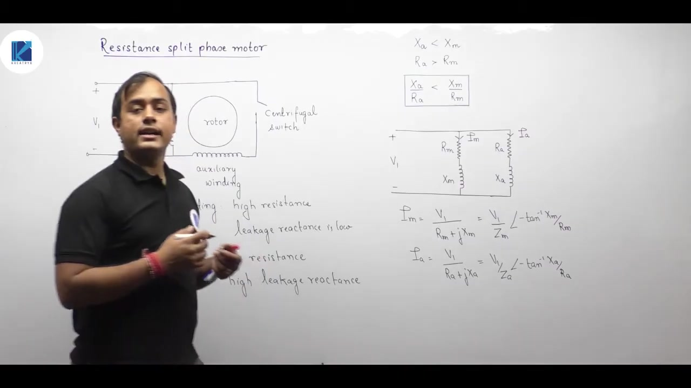

To create a phase angle difference between the two branch currents:
- **Auxiliary winding**: Wound with thin copper wire. Its conductor cross-sectional area is about 25% of that of the main winding. Because resistance is $R = \rho L / A$, smaller wire gauge gives high winding resistance $R_a$. The stator slots for the auxiliary winding are shallow, giving low leakage reactance $X_a$.
- **Main winding**: Wound with thick wire placed deep in the stator slots. It has low resistance $R_m$ and high leakage reactance $X_m$.

Thus:

$$R_a > R_m \quad \text{and} \quad X_a < X_m$$

This gives contrasting impedance ratios:

$$\frac{X_a}{R_a} < \frac{X_m}{R_m}$$

---

### Branch Currents and Phase Angles

Both windings are connected across supply voltage $V_1$. 

The current in the main winding is:

$$
\begin{aligned}
I_m &= \frac{V_1}{R_m + j X_m} \\
&= \frac{V_1}{Z_m} \angle -\phi_m
\end{aligned}
$$

where:

$$\phi_m = \tan^{-1}\left(\frac{X_m}{R_m}\right)$$

The current in the auxiliary winding is:

$$
\begin{aligned}
I_a &= \frac{V_1}{R_a + j X_a} \\
&= \frac{V_1}{Z_a} \angle -\phi_a
\end{aligned}
$$

where:

$$\phi_a = \tan^{-1}\left(\frac{X_a}{R_a}\right)$$

Because $X_a / R_a < X_m / R_m$, the phase angles satisfy:

$$\phi_a < \phi_m$$

> [!success] Result
> Both currents lag behind the applied voltage $V_1$. But because the auxiliary winding has a smaller $X/R$ ratio, $I_a$ lags by a much smaller angle than $I_m$:
> $$\phi_a < \phi_m$$
> The phase angle difference between the two winding currents is:
> $$\alpha = \phi_m - \phi_a \approx 20^\circ \text{ to } 30^\circ$$

This phase angle difference $\alpha$ is insufficient for true quadrature, but it is enough to create an initial forward accelerating torque.

## Forward and Backward MMF Wave Analysis
_(12:00 - 17:15)_

### Double Revolving Field Resolution for Both Windings

Let the space coordinate $\theta$ be measured along the stator circumference. The two windings are placed in space quadrature:
- Main winding MMF axis at $\theta = 0^\circ$
- Auxiliary winding MMF axis at $\theta = 90^\circ$

The pulsating MMF produced by the main winding is:

$$
\begin{aligned}
F_m(\theta, t) &= F_{m,\text{peak}} \cos\theta \cos(\omega t - \phi_m) \\
&= \frac{F_{m,\text{peak}}}{2} \left[ \cos(\theta - \omega t + \phi_m) + \cos(\theta + \omega t - \phi_m) \right]
\end{aligned}
$$

The pulsating MMF produced by the auxiliary winding is:

$$
\begin{aligned}
F_a(\theta, t) &= F_{a,\text{peak}} \cos(\theta + 90^\circ) \cos(\omega t - \phi_a) \\
&= -F_{a,\text{peak}} \sin\theta \cos(\omega t - \phi_a)
\end{aligned}
$$

Using trigonometric product-to-sum identities, $F_a$ also splits into two revolving components:

$$F_a(\theta, t) = \frac{F_{a,\text{peak}}}{2} \left[ \cos(\theta - \omega t - 90^\circ + \phi_a) + \cos(\theta + \omega t + 90^\circ - \phi_a) \right]$$

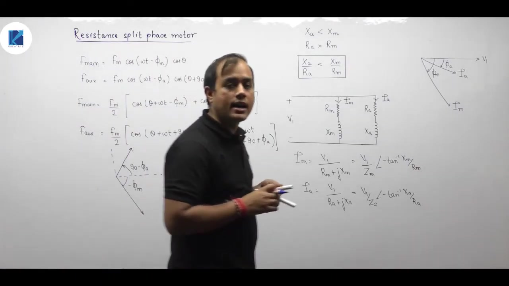

---

### Resultant Forward and Backward Fields

The total MMF consists of two rotating fields:
1. **Forward revolving component** traveling with speed $+\omega$ (arguments containing $\theta - \omega t$):
   - From main winding: phase angle $+\phi_m$
   - From auxiliary winding: phase angle $-90^\circ + \phi_a$
2. **Backward revolving component** traveling with speed $-\omega$ (arguments containing $\theta + \omega t$):
   - From main winding: phase angle $-\phi_m$
   - From auxiliary winding: phase angle $+90^\circ - \phi_a$

Consider the angular difference between the two component vectors:

For the forward component:
$$\Delta \theta_f = \phi_m - (\phi_a - 90^\circ) = 90^\circ + (\phi_m - \phi_a) = 90^\circ + \alpha$$

When $\theta$ space displacement is chosen appropriately, the forward components add with a smaller phase gap:
Take a typical numerical case where $\phi_m = 70^\circ$ and $\phi_a = 20^\circ$.
- For the forward rotating wave, the phase angle between the two components is small (around $40^\circ$).
- For the backward rotating wave, the phase angle between the two components is wide (around $140^\circ$).

Two phasors with a smaller angle between them add constructively. In contrast, two phasors separated by a wide angle largely oppose and cancel each other.

> [!success] Result
> The resultant forward rotating field $B_f$ is significantly stronger than the backward rotating field $B_b$:
> $$B_f \gg B_b$$
> This asymmetry creates unequal torques in the rotor:
> $$T_f > T_b \implies T_{\text{net}} = T_f - T_b > 0$$
> Therefore, the motor develops positive starting torque and becomes self-starting.

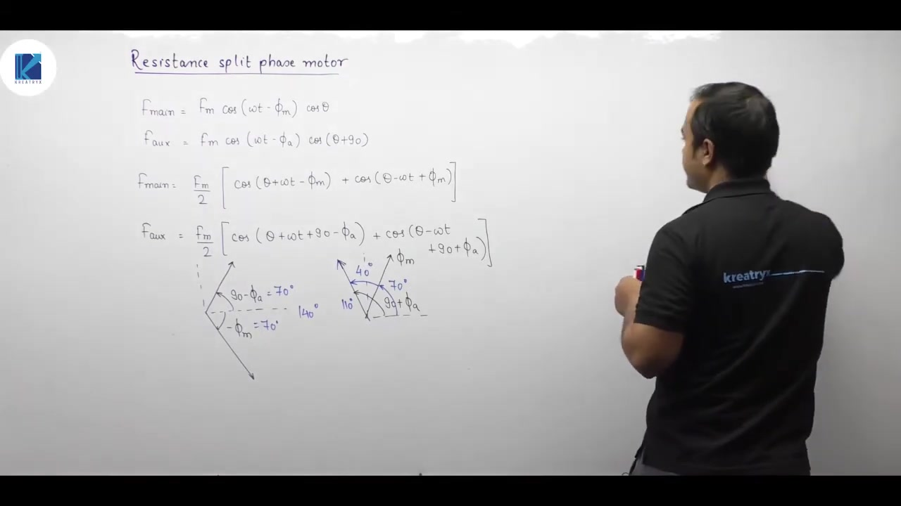

---

### Key Operational Takeaways

1. **Incomplete Quadrature**: Because $\alpha \approx 20^\circ \text{ to } 30^\circ \neq 90^\circ$, a pure rotating magnetic field cannot be created. Both forward and backward rotating fields co-exist.
2. **Starting Torque**: Starting torque is positive because $B_f > B_b$. But it is moderate due to the residual backward field and backward braking torque.
3. **Dual Winding Contribution**: Both main and auxiliary windings actively produce torque during the starting phase until the centrifugal switch opens.

## Torque-Speed Characteristics & Introduction to Capacitor Split-Phase Motors
_(17:15 - 22:23)_

### Operating Torque-Speed Characteristic of Resistance Split-Phase Motors

During starting, both the main and auxiliary windings are energized in parallel. The motor develops a positive starting torque.

As the motor accelerates and reaches about 75% to 80% of synchronous speed ($N_s$), the centrifugal switch trips. This disconnects the auxiliary winding.

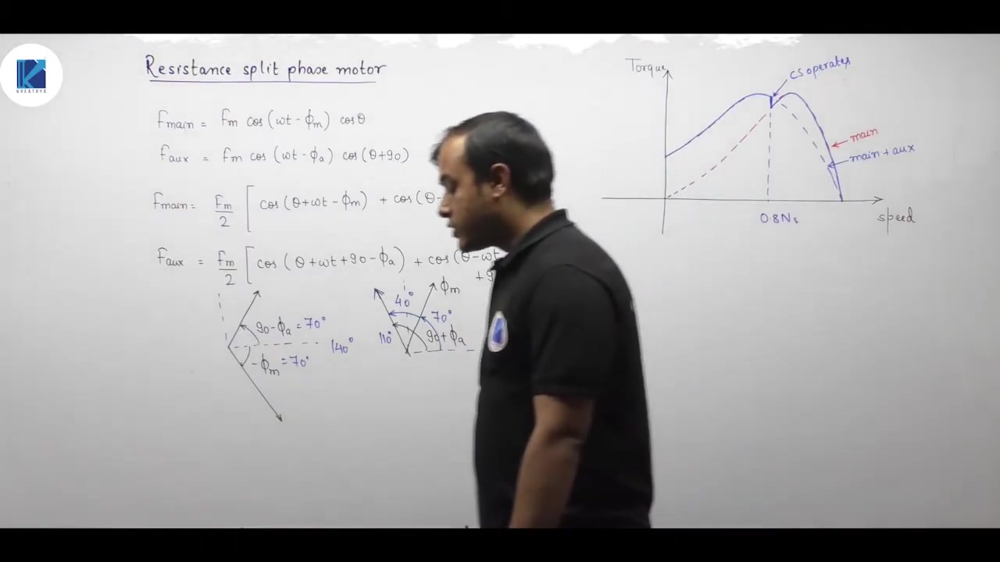

When the switch opens, the torque characteristic abruptly transitions from the combined curve to the main-winding-only curve. This transition appears as a noticeable kink in the torque-speed curve near operating speed.

The motor then continues operating along the single-phase running curve up to its normal full-load operating point.

---

### Drawbacks of Resistance Split-Phase Design

1. The phase angle difference $\alpha$ between $I_m$ and $I_a$ is only around $20^\circ \text{ to } 30^\circ$.
2. It cannot achieve true space-time quadrature ($\alpha = 90^\circ$).
3. The backward rotating field is not eliminated. It creates noticeable rotor heating, lower efficiency, and moderate starting torque.
4. High auxiliary winding resistance causes substantial $I^2 R$ heat loss during starting.

---

### Introduction to Capacitor Split-Phase Motors

To overcome the low starting torque of resistance split-phase motors, a capacitor is placed in series with the auxiliary winding.

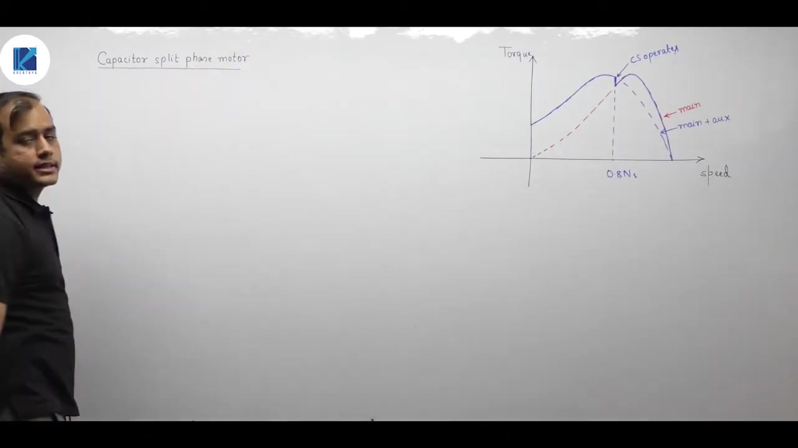

The objective of adding the capacitor is to achieve a $90^\circ$ phase shift between the two currents:
- The main winding is inductive, so $I_m$ lags the terminal voltage $V_1$.
- The auxiliary branch contains a capacitor $C$, making its net impedance capacitive. Thus, $I_a$ leads the terminal voltage $V_1$.

By making $I_m$ lag and $I_a$ lead, the angle between them can reach:

$$\alpha = \phi_m + \phi_a \approx 90^\circ$$

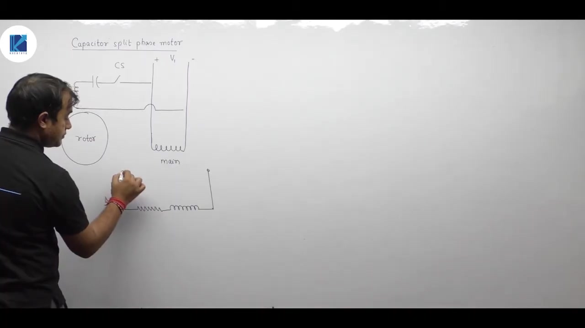

---

### Circuit Model of the Capacitor Motor

The parallel branches across supply $V_1$ are:
1. **Main winding branch**:
   $$Z_m = R_m + j X_m$$
   $$I_m = \frac{V_1}{R_m + j X_m} = \frac{V_1}{|Z_m|} \angle -\phi_m$$
   where $\phi_m = \tan^{-1}(X_m / R_m)$.

2. **Auxiliary winding branch** (with capacitor and centrifugal switch):
   $$Z_a = R_a + j (X_a - X_c)$$
   where $X_c = \frac{1}{\omega C}$.

## Capacitance Derivation for Pure Rotating Magnetic Field
_(22:27 - 27:23)_

### Branch Currents and Quadrature Condition

The main winding impedance is inductive:
$$Z_m = R_m + j X_m = |Z_m| \angle \phi_m$$

Its current lags supply voltage $V_1$:
$$I_m = \frac{V_1}{\sqrt{R_m^2 + X_m^2}} \angle -\phi_m$$
where:
$$\phi_m = \tan^{-1}\left(\frac{X_m}{R_m}\right)$$

In the auxiliary winding branch, we choose $X_c > X_a$ so that the net reactance is capacitive:
$$Z_a = R_a - j(X_c - X_a)$$

Its current leads supply voltage $V_1$:
$$I_a = \frac{V_1}{\sqrt{R_a^2 + (X_c - X_a)^2}} \angle +\phi_a$$
where:
$$\phi_a = \tan^{-1}\left(\frac{X_c - X_a}{R_a}\right)$$

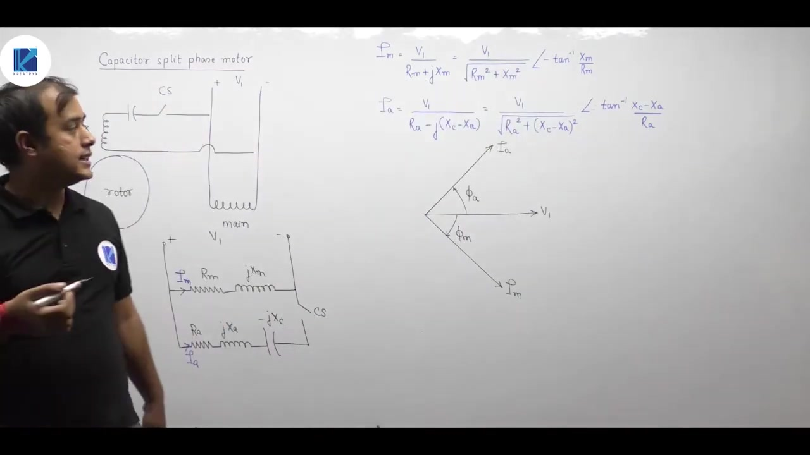

---

### Condition for 90-Degree Phase Shift

To eliminate the backward rotating field entirely, the two currents must be in perfect time quadrature:

$$\phi_a + \phi_m = 90^\circ$$

Substitute the expressions for $\phi_a$ and $\phi_m$:

$$\tan^{-1}\left(\frac{X_c - X_a}{R_a}\right) + \tan^{-1}\left(\frac{X_m}{R_m}\right) = 90^\circ$$

Rearranging gives:

$$\tan^{-1}\left(\frac{X_c - X_a}{R_a}\right) = 90^\circ - \tan^{-1}\left(\frac{X_m}{R_m}\right)$$

Take the tangent of both sides:

$$\frac{X_c - X_a}{R_a} = \tan\left[90^\circ - \tan^{-1}\left(\frac{X_m}{R_m}\right)\right] = \cot\left[\tan^{-1}\left(\frac{X_m}{R_m}\right)\right]$$

Since $\cot(\theta) = 1 / \tan(\theta)$:

$$\frac{X_c - X_a}{R_a} = \frac{R_m}{X_m}$$

Multiply across by $R_a$:

$$X_c - X_a = R_a \left(\frac{R_m}{X_m}\right)$$

> [!success] Result
> The capacitive reactance required for pure rotating magnetic field is:
> $$X_c = X_a + R_a \left(\frac{R_m}{X_m}\right)$$
> Since $X_c = \frac{1}{\omega C} = \frac{1}{2\pi f C}$, the required capacitance value is:
> $$C = \frac{1}{2\pi f \left[X_a + R_a \left(\frac{R_m}{X_m}\right)\right]}$$

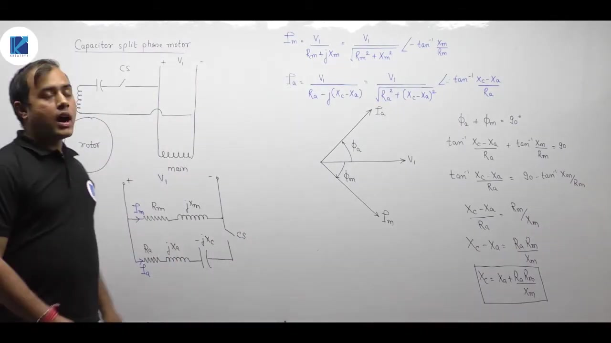

---

### Effect on Starting Torque

With this specific capacitor value:
1. The backward rotating field cancels out completely at standstill.
2. Only a pure, forward rotating magnetic field exists during starting.
3. Starting torque is significantly higher than in resistance split-phase motors.
4. When the motor accelerates to roughly 75% to 80% of synchronous speed, the centrifugal switch opens and disconnects both the capacitor and the auxiliary winding.

## Capacitor-Run and Capacitor-Start Capacitor-Run Motors
_(27:27 - 31:52)_

### Capacitor-Start Torque-Speed Curve

In a capacitor-start motor, high starting torque is developed along the combined (main + auxiliary) curve.

At approximately $0.8 N_s$, the centrifugal switch opens. The motor operating point jumps down from the combined curve to the main winding curve. The motor then runs as a pure single-phase induction motor.

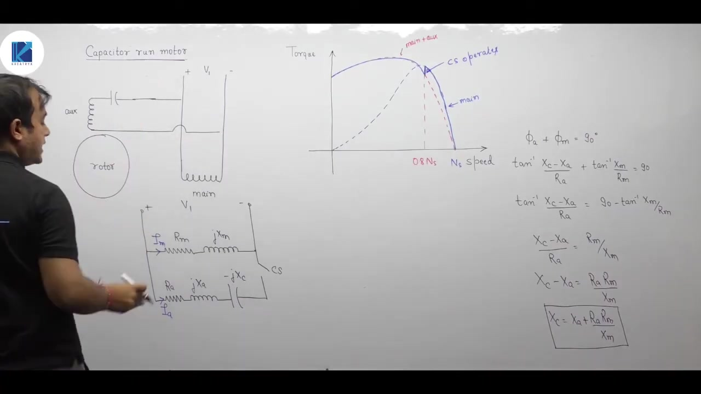

---

### Permanent-Split Capacitor (Capacitor-Run) Motor

In a capacitor-run (permanent-split capacitor) motor, the capacitor is permanently connected in series with the auxiliary winding.

- **No centrifugal switch**: The auxiliary winding and capacitor remain energized continuously.
- **Smooth torque curve**: There is no abrupt jump or kink in the torque-speed curve. The machine operates on the combined characteristic at all speeds.
- **Quiet operation**: A rotating magnetic field exists during normal running. This minimizes double-frequency pulsating torque, resulting in quiet and vibration-free operation (ideal for ceiling fans and blowers).
- **Better power factor**: The permanent capacitor improves the overall input power factor.

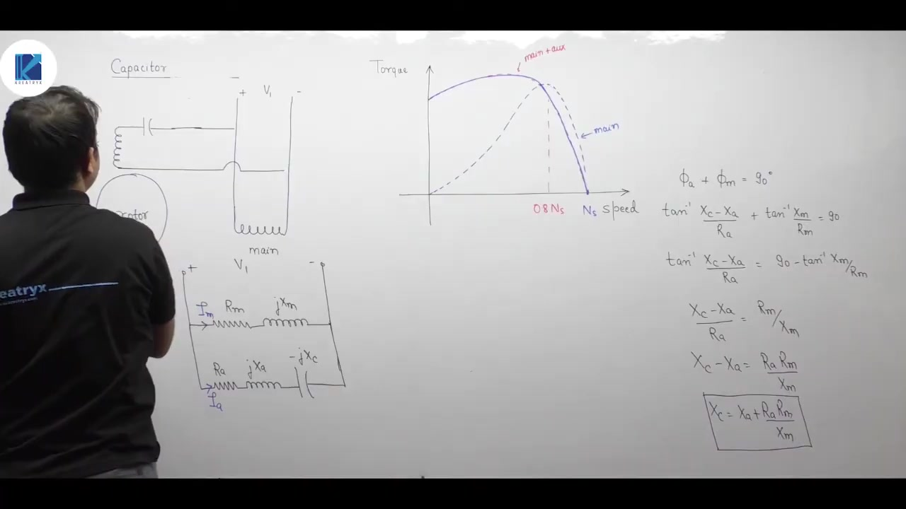

---

### Capacitor-Start Capacitor-Run (Two-Value Capacitor) Motor

A single capacitor cannot optimize both starting and running conditions:
- **Starting** requires high capacitance to give a large starting current with a $90^\circ$ phase shift for high torque.
- **Running** requires lower capacitance to balance MMFs under continuous duty without overheating the auxiliary winding.

A two-value capacitor motor uses two parallel capacitors in the auxiliary branch:
1. **Starting capacitor ($C_s$)**: High capacitance, short-time rated (electrolytic). It is connected in series with a centrifugal switch.
2. **Running capacitor ($C_r$)**: Lower capacitance, continuous rated (oil-filled paper or polypropylene). It remains connected permanently.

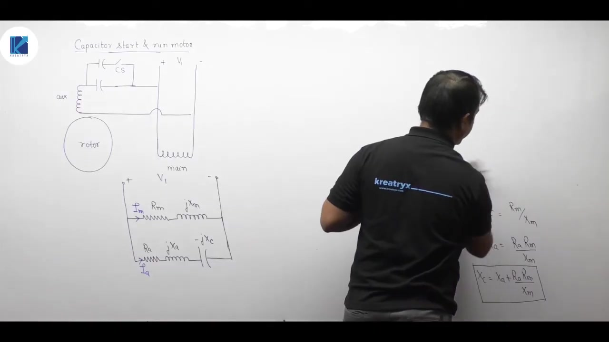

> [!info] Definition
> - **Start Capacitor ($C_s$)**: Switched out by the centrifugal switch around $75\%\text{--}80\% N_s$. It provides high starting torque.
> - **Run Capacitor ($C_r$)**: Remains in the circuit at all times. It maintains balanced two-phase operation, high running efficiency, and low acoustic noise.

## Maximum Starting Torque Formulation in Capacitor Motors
_(32:00 - 39:40)_

### Combined Characteristic of Two-Value Capacitor Motors

The capacitor-start capacitor-run motor combines high starting torque with smooth, quiet running performance.
- At start, both capacitors ($C_s + C_r$) are connected in parallel, giving high starting capacitance and large starting torque.
- Near $75\%\text{--}80\% N_s$, the centrifugal switch opens and takes out $C_s$.
- The operating point transfers smoothly to the run characteristic governed by $C_r$.

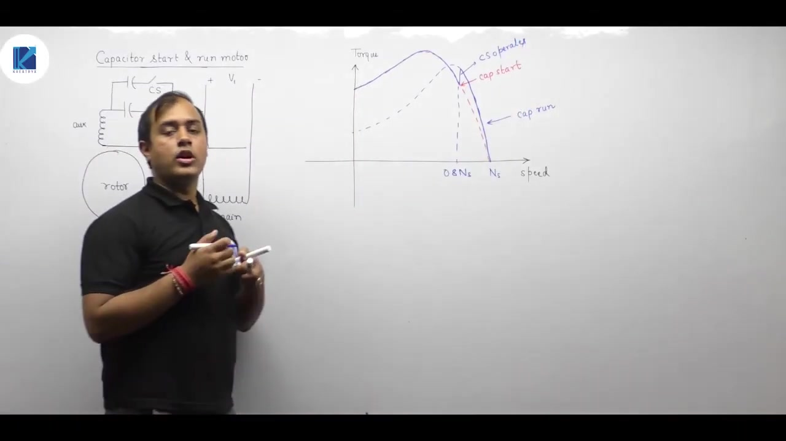

---

### Why $\alpha = 90^\circ$ Does Not Maximize Starting Torque

Starting torque in a two-phase induction motor is proportional to:

$$T_{\text{start}} \propto I_m I_a \sin\alpha$$

where:
- $I_m$ is the main winding current magnitude.
- $I_a$ is the auxiliary winding current magnitude.
- $\alpha = \phi_m + \phi_a$ is the phase angle between $I_m$ and $I_a$.

At first glance, one might assume that setting $\alpha = 90^\circ$ yields maximum torque because $\sin(90^\circ) = 1$. However, this assumption is incorrect.

The main winding impedance $Z_m$ is fixed, so $I_m = V_1 / |Z_m|$ is constant. But in the auxiliary winding branch:

$$I_a = \frac{V_1}{\sqrt{R_a^2 + (X_c - X_a)^2}}$$

Changing the capacitance $C$ alters both:
1. The auxiliary phase angle $\phi_a = \tan^{-1}\left(\frac{X_c - X_a}{R_a}\right)$.
2. The current magnitude $I_a$.

Increasing $X_c$ alters $\alpha$ toward $90^\circ$, but it also increases branch impedance, which reduces $I_a$. Because torque depends on the product $I_a \sin\alpha$, we must optimize both parameters together.

---

### Mathematical Setup for Starting Torque Optimization

Substitute $I_m = \frac{V_1}{Z_m}$ and $I_a = \frac{V_1}{Z_a}$ into the torque equation:

$$T_{\text{start}} \propto \frac{V_1}{Z_m} \frac{V_1}{Z_a} \sin(\phi_m + \phi_a)$$

From the auxiliary impedance triangle:
$$\cos\phi_a = \frac{R_a}{Z_a} \implies Z_a = \frac{R_a}{\cos\phi_a}$$

Substitute $Z_a$ into the torque relation:

$$T_{\text{start}} \propto \frac{V_1^2}{Z_m R_a} \cos\phi_a \sin(\phi_m + \phi_a)$$

Notice that $V_1$, $Z_m$, $R_a$, and $\phi_m$ are all fixed machine parameters. Only $\phi_a$ depends on $X_c$.

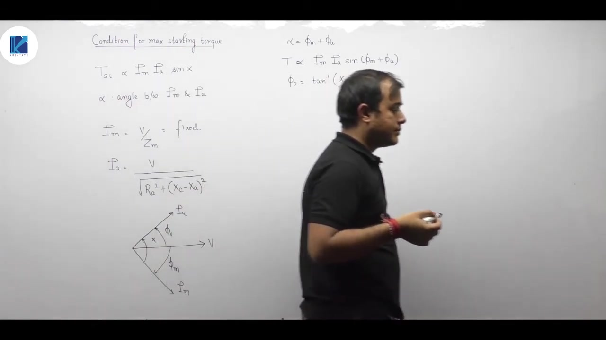

## Maximum Starting Torque Derivation & Direction of Rotation
_(39:40 - 44:10)_

### Derivation of Condition for Maximum Starting Torque

From the previous section, starting torque is proportional to:

$$T_{\text{start}} \propto \frac{V_1^2}{Z_m R_a} \sin(\phi_m + \phi_a) \cos\phi_a$$

Using the trigonometric identity $\sin A \cos B = \frac{1}{2}[\sin(A + B) + \sin(A - B)]$:

$$
\begin{aligned}
\sin(\phi_m + \phi_a) \cos\phi_a &= \frac{1}{2}\left[\sin((\phi_m + \phi_a) + \phi_a) + \sin((\phi_m + \phi_a) - \phi_a)\right] \\
&= \frac{1}{2}\left[\sin(\phi_m + 2\phi_a) + \sin\phi_m\right]
\end{aligned}
$$

Substitute this back into the torque expression:

$$T_{\text{start}} \propto \frac{V_1^2}{2 Z_m R_a} \left[\sin(\phi_m + 2\phi_a) + \sin\phi_m\right]$$

In this expression:
- $V_1$, $Z_m$, $R_a$, and $\phi_m$ are fixed parameters of the machine and supply.
- The term $\sin\phi_m$ is constant.
- Only the first term, $\sin(\phi_m + 2\phi_a)$, can be varied by adjusting the series capacitance.

To maximize $T_{\text{start}}$, maximize the term $\sin(\phi_m + 2\phi_a)$:

$$\sin(\phi_m + 2\phi_a) = 1 \implies \phi_m + 2\phi_a = 90^\circ$$

Solving for $\phi_a$:

> [!success] Result
> The condition for maximum starting torque is:
> $$\phi_a = \frac{90^\circ - \phi_m}{2}$$
> where:
> $$\phi_m = \tan^{-1}\left(\frac{X_m}{R_m}\right) \quad \text{and} \quad \phi_a = \tan^{-1}\left(\frac{X_c - X_a}{R_a}\right)$$

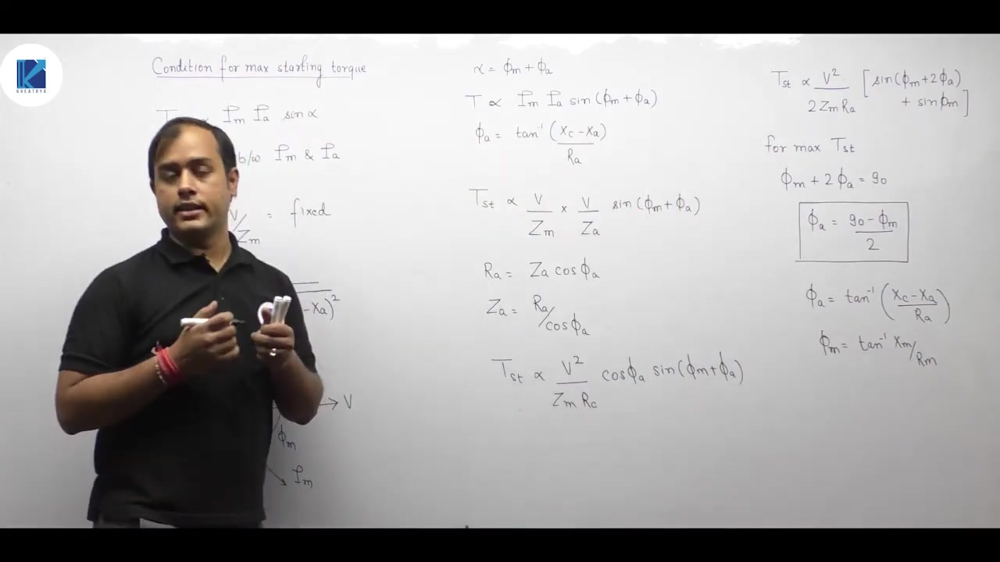

---

### Comparison of the Two Design Criteria

It is vital to distinguish between these two separate conditions:
1. **Condition for Pure Rotating Magnetic Field (Time Quadrature)**:
   $$\phi_m + \phi_a = 90^\circ \implies X_c = X_a + R_a \left(\frac{R_m}{X_m}\right)$$
2. **Condition for Maximum Starting Torque**:
   $$\phi_a = \frac{90^\circ - \phi_m}{2} \implies \phi_m + 2\phi_a = 90^\circ$$

These two optimal capacitance values are different. In practice, starting capacitors are sized closer to the maximum starting torque condition.

---

### Direction of Rotating Magnetic Field and Rotor Rotation

The direction of rotation of the rotor is always governed by the direction of rotation of the stator magnetic field.

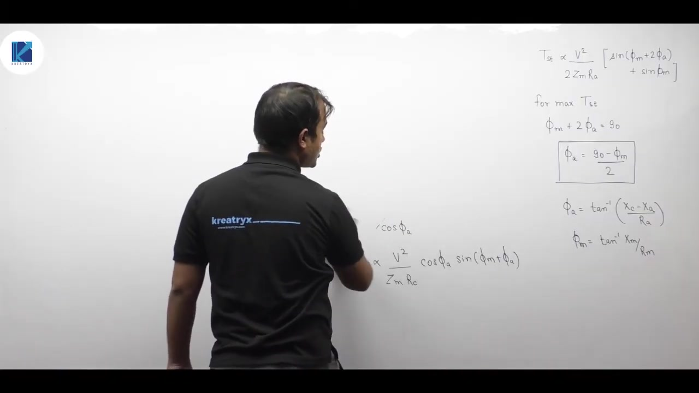

To determine the direction of the rotating magnetic field:
1. Identify the spatial orientation axes of the main winding ($M$) and auxiliary winding ($A$).
2. Write the time expressions for the currents:
   $$i_m(t) = I_{m,\text{peak}} \sin(\omega t - \phi_m)$$
   $$i_a(t) = I_{a,\text{peak}} \sin(\omega t - \phi_a)$$
3. The flux produced by each winding is in phase with its respective current.
4. Calculate the resultant flux vector at two distinct successive time instants ($t = t_1$ and $t = t_2$).
5. The direction in which the resultant vector moves indicates the direction of rotation.

## Direction of Rotation Determination & Shortcut Rule
_(44:13 - 49:10)_

### Two-Instant Analytical Method

Consider a single-phase induction motor where the main winding axis points along $+x$ and the auxiliary winding axis points along $+y$.

The winding currents are:
$$
\begin{aligned}
i_m(t) &= I_{m,\text{peak}} \sin(\omega t - \phi_m) \\
i_a(t) &= I_{a,\text{peak}} \sin(\omega t - \phi_a)
\end{aligned}
$$

Typically $\phi_m > \phi_a$, meaning auxiliary current $I_a$ is leading relative to main winding current $I_m$.

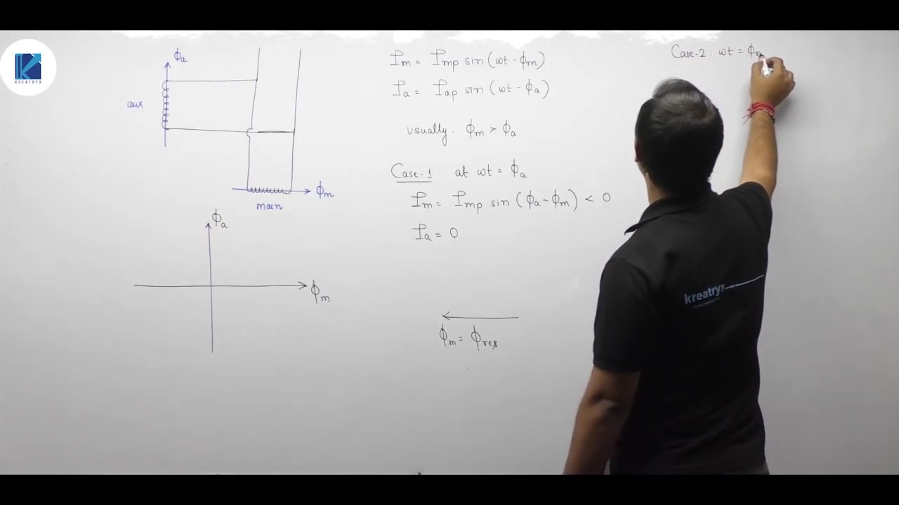

#### Instant 1: $\omega t = \phi_a$
Substitute $\omega t = \phi_a$:
$$
\begin{aligned}
i_a &= I_{a,\text{peak}} \sin(\phi_a - \phi_a) = 0 \\
i_m &= I_{m,\text{peak}} \sin(\phi_a - \phi_m) < 0 \quad (\text{since } \phi_a < \phi_m)
\end{aligned}
$$

Since $i_a = 0$ and $i_m < 0$, the resultant flux vector $\Phi_{\text{net}}$ lies along the negative main winding axis (pointing horizontally left).

#### Instant 2: $\omega t = \phi_m$ (chronologically later than $\phi_a$)
Substitute $\omega t = \phi_m$:
$$
\begin{aligned}
i_m &= I_{m,\text{peak}} \sin(\phi_m - \phi_m) = 0 \\
i_a &= I_{a,\text{peak}} \sin(\phi_m - \phi_a) > 0 \quad (\text{since } \phi_m > \phi_a)
\end{aligned}
$$

Now $i_m = 0$ and $i_a > 0$. The resultant flux vector $\Phi_{\text{net}}$ lies along the positive auxiliary winding axis (pointing vertically upward).

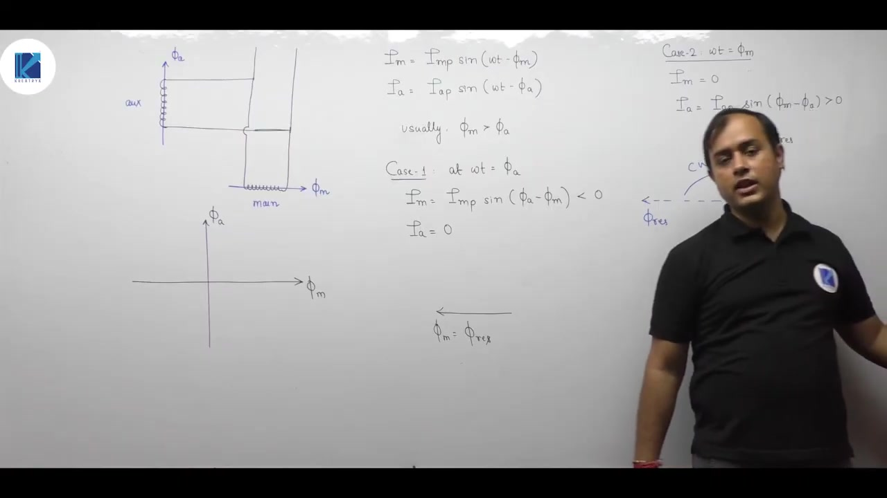

Between Instant 1 and Instant 2, the resultant flux vector rotated from pointing left ($-x$) to pointing up ($+y$). In space, this is a **clockwise rotation**.

Therefore, the motor rotor rotates in the **clockwise direction**.

---

### The Leading-to-Lagging Shortcut Rule

Calculating the resultant vector at two time points is precise, but a reliable shortcut can be applied directly in exam problems:

> [!info] Definition
> **Leading-to-Lagging Rotation Rule**:
> 1. **Electrical Phasor Diagram**: Determine which winding current leads the other. (For example, $I_a$ leads $I_m$).
> 2. **Physical Space Diagram**: In the spatial MMF layout of the stator, trace the path from the axis of the **leading current winding** toward the axis of the **lagging current winding** along the shortest angle ($90^\circ$).
> 
> The physical direction of that trace (clockwise or counterclockwise) is the exact direction of rotation of the magnetic field and the rotor.

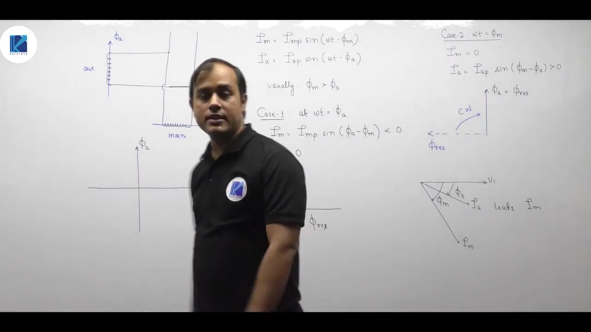

---

### Reversing Rotor Rotation

To reverse the direction of rotation in any split-phase or capacitor motor:
- Reverse the terminal connections of **either** the auxiliary winding or the main winding.
- **Never reverse both windings simultaneously**, as reversing both leaves the relative phase sequence and direction of rotation unchanged.

---

## Summary and Key Takeaways

- Standstill single-phase motors lack starting torque because equal and opposite forward and backward rotating magnetic fields cancel each other.
- Resistance split-phase motors use an auxiliary winding with high resistance and low reactance to create an initial phase difference $\alpha \approx 20^\circ \text{ to } 30^\circ$.
- A centrifugal switch opens at approximately $75\%\text{--}80\%$ of synchronous speed, disconnecting the auxiliary circuit in split-phase and capacitor-start motors.
- Pure time quadrature ($\alpha = 90^\circ$) eliminates the backward revolving field and requires series capacitive reactance $X_c = X_a + R_a (R_m / X_m)$.
- Maximum starting torque requires a different condition: $\phi_a = (90^\circ - \phi_m) / 2$, which accounts for variations in both auxiliary current magnitude and phase angle.
- Permanent-split capacitor motors omit the centrifugal switch to maintain balanced two-phase operation, lower acoustic noise, and improved running power factor.
- Two-value capacitor motors use a large electrolytic start capacitor ($C_s$) in parallel with a smaller continuous-duty run capacitor ($C_r$) to achieve high starting torque and smooth running.
- In space, the rotor rotates from the axis of the leading current winding toward the axis of the lagging current winding along the shortest angle.
- Reversing the terminal connections of either the main winding or the auxiliary winding reverses the direction of rotor rotation.

