[← Lec 161: Single Phase Induction Motor 2](Lecture_161_Single_Phase_Induction_Motor_2.md) | [🏠 Index](00_yt_study_guide.md)

---

# Single Phase Induction Motor | L 48 | Electrical Machines | GATE 2022 | Ankit Goyal

- **Source**: https://www.youtube.com/watch?v=cOLfgO5qF9U
- **Duration**: 00:49:06
- **Compiled**: 2026-09-23

---

## Overview

This lecture solves representative GATE and ESE numerical problems on single-phase induction motors. It covers equivalent circuit analysis at no-load and full-load slip, input impedance calculations, and power factor determination. The discussion analyzes the double revolving field theory, rotor frequency ratios, and air-gap flux asymmetry. Finally, it demonstrates exact methods to determine rotor rotation direction and derives capacitance criteria for both space-time quadrature and maximum starting torque.

## Contents

- [[#Single-Phase Motor Equivalent Circuit at No-Load|Single-Phase Motor Equivalent Circuit at No-Load]]
- [[#No-Load Power Factor Result & Rotor Rotation Principles|No-Load Power Factor Result & Rotor Rotation Principles]]
- [[#Determining Rotor Direction & Phase Difference Analysis|Determining Rotor Direction & Phase Difference Analysis]]
- [[#Phase Difference Criterion & Double Revolving Field Theory|Phase Difference Criterion & Double Revolving Field Theory]]
- [[#Synchronous Speed Response & Capacitance for Quadrature|Synchronous Speed Response & Capacitance for Quadrature]]
- [[#Winding Resistance Ratio & Running Slip Analysis|Winding Resistance Ratio & Running Slip Analysis]]
- [[#Full Equivalent Circuit Input Impedance and Current|Full Equivalent Circuit Input Impedance and Current]]
- [[#Rotor Frequency, Flux Ratio & Starting Torque Test Data|Rotor Frequency, Flux Ratio & Starting Torque Test Data]]
- [[#Maximum Starting Torque Capacitance & Running Performance|Maximum Starting Torque Capacitance & Running Performance]]

---

## Single-Phase Motor Equivalent Circuit at No-Load
_(00:00 - 06:53)_

### Problem: No-Load Power Factor Calculation

> [!example] Problem
> The equivalent circuit of a single-phase induction motor has the following parameters:
> - Stator: $R_1 = 12\,\Omega$, $X_1 = 12\,\Omega$
> - Magnetizing reactance: $X_m = 240\,\Omega \implies \frac{X_m}{2} = 120\,\Omega$
> - Rotor referred to stator: $R_2' = 12\,\Omega$, $X_2' = 12\,\Omega \implies \frac{X_2'}{2} = 6\,\Omega$
> 
> At no-load, the rotor speed is approximated as synchronous speed ($N_r \approx N_s$). Find the input power factor of the motor.

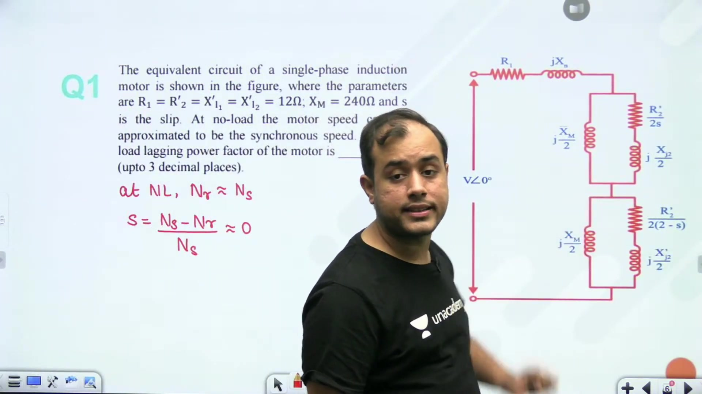

---

### Analysis at No-Load Slip ($s \approx 0$)

At no-load, the slip is:

$$s = \frac{N_s - N_r}{N_s} \approx 0$$

For the forward rotor branch:

$$\frac{R_2'}{2s} \to \infty$$

The forward rotor branch resistance becomes an open circuit. So no current flows through the forward rotor leakage reactance $j \frac{X_2'}{2}$. The entire forward rotor circuit is open. Only the forward magnetizing branch $j \frac{X_m}{2} = j120\,\Omega$ carries current.

For the backward rotor branch, the backward slip is:

$$s_b = 2 - s \approx 2 - 0 = 2$$

The backward rotor resistance is:

$$\frac{R_2'}{2(2 - s)} = \frac{12}{2 \times 2} = \frac{12}{4} = 3\,\Omega$$

The backward rotor branch impedance is:

$$Z_{2b} = 3 + j6\,\Omega$$

This backward rotor branch is in parallel with the backward magnetizing branch $j \frac{X_m}{2} = j120\,\Omega$.

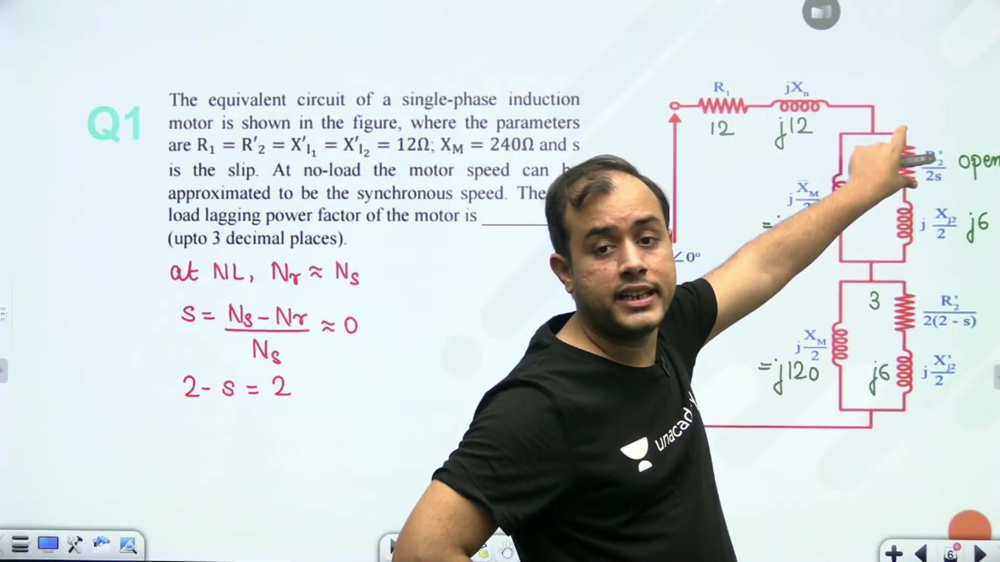

---

### Input Impedance Calculation with Approximation

The total input impedance seen from the supply terminals is:

$$Z_{\text{in}} = R_1 + jX_1 + j\frac{X_m}{2} + \left[ j\frac{X_m}{2} \parallel \left( \frac{R_2'}{2(2-s)} + j\frac{X_2'}{2} \right) \right]$$

Substitute the numeric parameters:

$$Z_{\text{in}} = 12 + j12 + j120 + [j120 \parallel (3 + j6)] = 12 + j132 + Z_b$$

The parallel combination $Z_b$ is:

$$Z_b = \frac{j120 \times (3 + j6)}{3 + j(120 + 6)} = \frac{-720 + j360}{3 + j126}$$

Since $3 \ll 126$, we approximate the denominator as $j126$:

$$
\begin{aligned}
Z_b &\approx \frac{-720 + j360}{j126} \\
&= \frac{360}{126} + j\frac{720}{126} \\
&= 2.857 + j5.714\,\Omega
\end{aligned}
$$

Add this to the series stator and forward magnetizing components:

$$
\begin{aligned}
Z_{\text{in}} &= (12 + 2.857) + j(132 + 5.714) \\
&= 14.857 + j137.714\,\Omega
\end{aligned}
$$

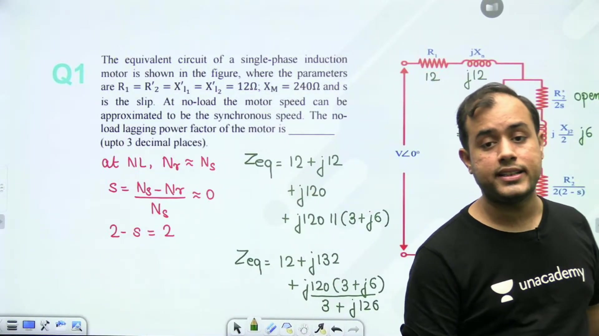

## No-Load Power Factor Result & Rotor Rotation Principles
_(06:57 - 11:31)_

### Completion of No-Load Power Factor Calculation

From the previous section, the total equivalent input impedance is:

$$Z_{\text{in}} = 14.857 + j137.714\,\Omega$$

The phase angle $\phi$ between supply voltage and current is:

$$\tan\phi = \frac{X_{\text{in}}}{R_{\text{in}}} = \frac{137.714}{14.857} = 9.2692$$

Taking the inverse tangent:

$$\phi = \tan^{-1}(9.2692) = 83.842^\circ$$

The operating power factor is:

$$\text{pf} = \cos\phi = \cos(83.842^\circ) = 0.107 \text{ lagging}$$

> [!success] Result
> At no-load, the motor draws predominantly magnetizing reactive power. Its input power factor is:
> $$\text{pf} = 0.107 \text{ lagging}$$

This approximation neglects the small stator resistance compared to magnetizing reactance in the parallel branch denominator. It is identical to the standard approximation used in Thevenin equivalent circuits for torque-slip curves.

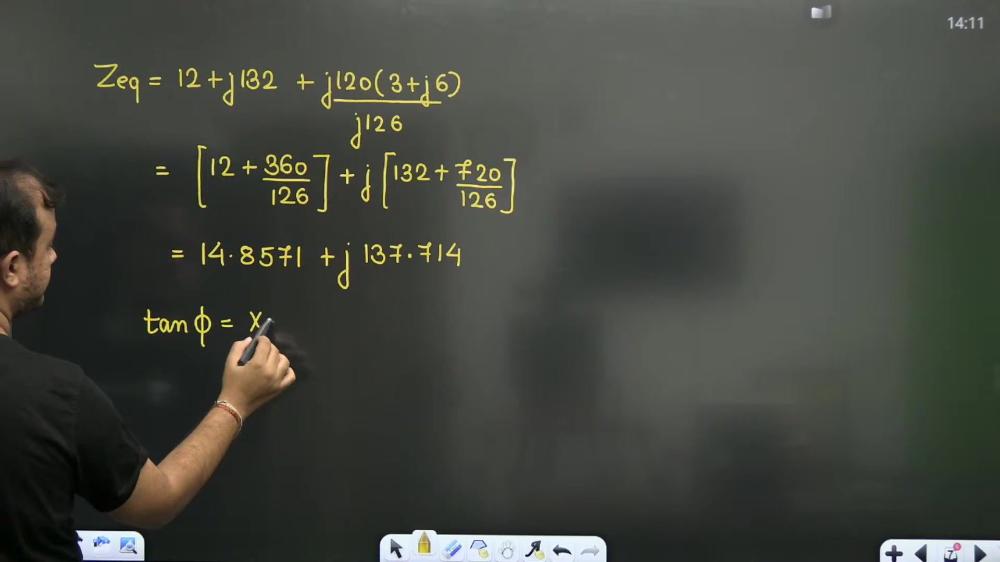

---

### Direction of Rotation in Split-Phase Motors

A fundamental problem in split-phase motors is determining the direction of rotor rotation when the main and auxiliary windings are energized.

Both windings are connected in parallel across the same AC supply voltage $V$:

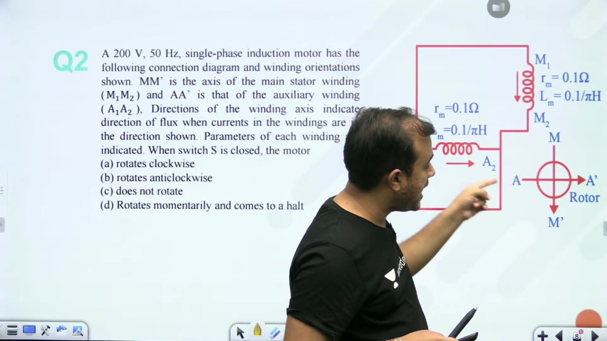

The branch current phase angles relative to supply voltage $V$ are:
- **Main winding current $I_m$**:
  $$I_m \text{ lags } V \text{ by } \theta_m = \tan^{-1}\left(\frac{X_m}{R_m}\right)$$
- **Auxiliary winding current $I_a$ (resistance split)**:
  $$I_a \text{ lags } V \text{ by } \theta_a = \tan^{-1}\left(\frac{X_a}{R_a}\right)$$
- **Auxiliary winding current $I_a$ (capacitor split)**:
  If $X_c > X_a$, the branch impedance is capacitive:
  $$I_a \text{ leads } V \text{ by } \theta_a = \tan^{-1}\left(\frac{X_c - X_a}{R_a}\right)$$

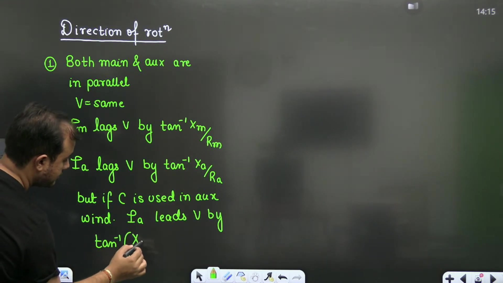

To find rotation, compare the two branch phase angles to determine which current leads the other.

## Determining Rotor Direction & Phase Difference Analysis
_(11:36 - 16:29)_

### The Leading-to-Lagging Rotation Rule

> [!info] Definition
> **Direction of Rotation Rule**:
> 1. Compute the phase angles of both winding currents relative to the common terminal voltage.
> 2. Construct the time-phasor diagram to determine which current leads the other.
> 3. In the stator space diagram, trace from the axis of the **leading current winding** to the axis of the **lagging current winding**.
> 
> The physical direction of this trace (clockwise or counter-clockwise) is the direction in which the rotor will rotate.

---

### Application Examples

#### Case 1: Auxiliary Current Leads Main Current ($I_a \text{ leads } I_m$)
If $I_a$ is ahead of $I_m$ in the time-phasor diagram, rotation proceeds from the auxiliary winding axis toward the main winding axis.
In the stator space diagram, if the auxiliary axis is at $+90^\circ$ and the main axis is along $0^\circ$, tracing from auxiliary to main gives clockwise rotation.

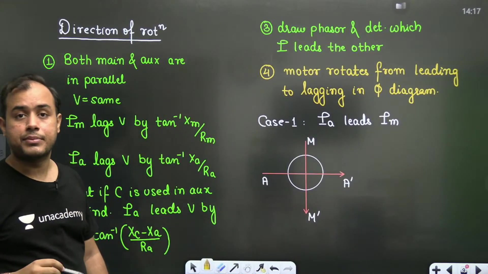

#### Case 2: Main Current Leads Auxiliary Current ($I_m \text{ leads } I_a$)
If $I_m$ leads $I_a$, rotation proceeds from the main winding axis toward the auxiliary winding axis.
This reverses the physical direction of the rotating magnetic field and rotor motion.

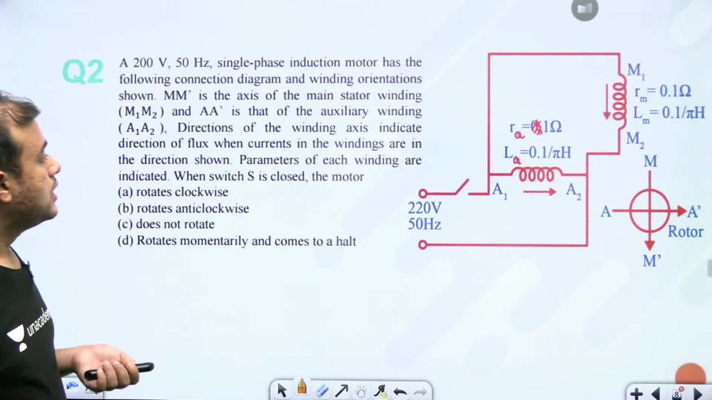

---

### Problem: Resistance Split-Phase Angle Evaluation

> [!example] Problem
> A single-phase motor has:
> - Main winding: $R_m = 0.1\,\Omega$, $L_m = \frac{0.1}{\pi}\,\text{H}$
> - Frequency: $f = 50\,\text{Hz} \implies \omega = 2\pi \times 50 = 100\pi\,\text{rad/s}$
> 
> Find the main winding impedance angle.

The main winding inductive reactance is:

$$X_m = \omega L_m = 100\pi \times \frac{0.1}{\pi} = 10\,\Omega$$

The phase lag angle is:

$$\theta_m = \tan^{-1}\left(\frac{X_m}{R_m}\right) = \tan^{-1}\left(\frac{10}{0.1}\right) = \tan^{-1}(100) = 89.427^\circ$$

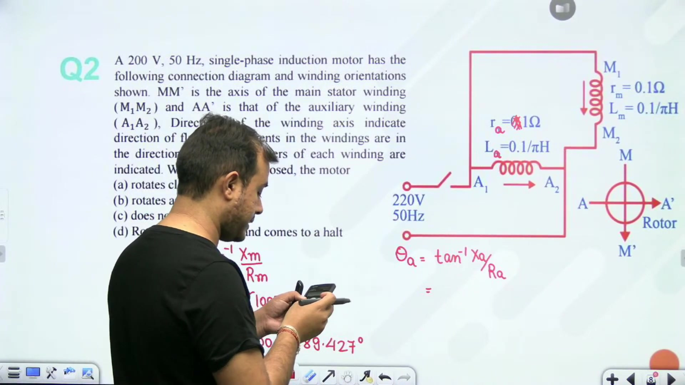

Both main and auxiliary currents lag behind the applied voltage by nearly $90^\circ$. If the angular difference between them is negligible, the starting torque will be close to zero.

## Phase Difference Criterion & Double Revolving Field Theory
_(16:33 - 21:29)_

### Starting Torque Threshold and Phase Difference

In the previous problem, the main and auxiliary winding phase angles evaluated to:

$$\theta_m = 89.427^\circ \quad \text{and} \quad \theta_a = 84.289^\circ$$

The phase angle difference between the two winding currents is:

$$\alpha = \theta_m - \theta_a = 89.427^\circ - 84.289^\circ = 5.138^\circ$$

Because starting torque is proportional to $\sin\alpha$:

$$T_{\text{start}} \propto I_m I_a \sin\alpha$$

When $\alpha$ is only around $5^\circ$, $\sin(5.138^\circ) \approx 0.0895$. The resulting starting torque is negligible. It cannot overcome rotor static friction.

> [!info] Definition
> For a resistance split-phase motor to develop practical starting torque, the phase angle difference $\alpha$ between $I_m$ and $I_a$ must be substantial, typically at least $20^\circ \text{ to } 30^\circ$. If the difference is below $10^\circ$, the motor fails to start.

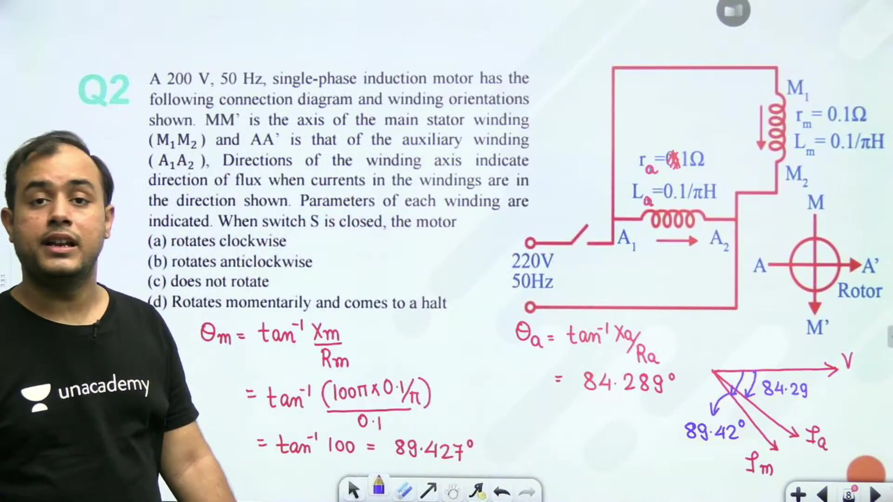

---

### Double Revolving Field Theory Principles

> [!example] Problem
> According to double revolving field theory, any alternating quantity can be resolved into two rotating components. What is the relation between their directions and magnitudes?

A single-phase pulsating MMF standing wave is:

$$F(\theta, t) = F_m \cos\theta \cos\omega t$$

Using the trigonometric identity $2 \cos A \cos B = \cos(A - B) + \cos(A + B)$:

$$F(\theta, t) = \frac{F_m}{2} \cos(\theta - \omega t) + \frac{F_m}{2} \cos(\theta + \omega t)$$

This resolves the alternating standing wave into two rotating fields:
1. **Forward Rotating Field**: $\frac{F_m}{2} \cos(\theta - \omega t)$, traveling in the positive $\theta$ direction at synchronous speed $+N_s$.
2. **Backward Rotating Field**: $\frac{F_m}{2} \cos(\theta + \omega t)$, traveling in the negative $\theta$ direction at synchronous speed $-N_s$.

> [!success] Result
> The two components rotate in opposite directions with equal speeds, and each has half the peak amplitude ($\frac{F_m}{2}$) of the original alternating field.

---

### Backward Equivalent Circuit Parameter Calculation

In the equivalent circuit, the backward rotor resistance referred to the stator is:

$$R_{2b} = \frac{R_2'}{2(2 - s)}$$

For $R_2' = 7.8\,\Omega$ and synchronous speed $N_s = 1500\,\text{rpm}$ with running speed $N_r = 1425\,\text{rpm}$:

$$
\begin{aligned}
s &= \frac{1500 - 1425}{1500} = \frac{75}{1500} = 0.05 = \frac{1}{20} \\
2 - s &= 2 - 0.05 = 1.95 \\
R_{2b} &= \frac{7.8}{2 \times 1.95} = \frac{7.8}{3.9} = 2.0\,\Omega
\end{aligned}
$$

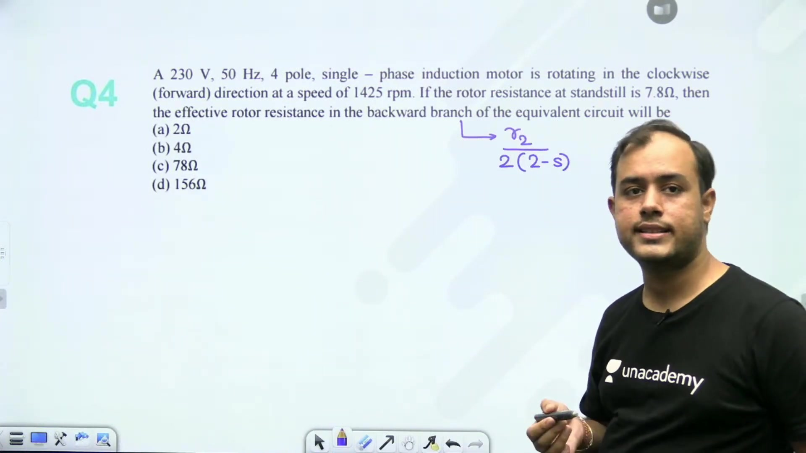

## Synchronous Speed Response & Capacitance for Quadrature
_(21:31 - 27:06)_

### Motor Response at Synchronous Speed

> [!example] Problem
> A single-phase induction motor with only the main winding excited runs at synchronous speed $N_s$. Which rotating field is dominant?

Consider the rotor rotating in the forward direction at synchronous speed ($N = +N_s$):
- Forward slip: $s_f = \frac{N_s - N_s}{N_s} = 0$
- Backward slip: $s_b = 2 - s_f = 2$

For the forward component, zero slip means the rotor runs synchronously with the forward field. No rotor current is induced by the forward field ($I_{2f} = 0$). Rotor demagnetization is zero, so the forward magnetizing branch impedance is large:

$$Z_f \approx j\frac{X_m}{2}$$

For the backward component, the slip is 2. The rotor cuts the backward field at double synchronous speed. A large demagnetizing rotor current is induced. This shorts out the backward magnetizing branch:

$$Z_b \approx \frac{R_2'}{4} + j\frac{X_2'}{2} \ll Z_f$$

Because both branches are in series, the forward branch takes nearly all the applied voltage:

$$V_f \gg V_b \implies \Phi_f \gg \Phi_b$$

> [!success] Result
> When the rotor runs at synchronous speed in the forward direction, the forward rotating field is much stronger than the backward rotating field. Conversely, if driven backward at $-N_s$, the backward field dominates.

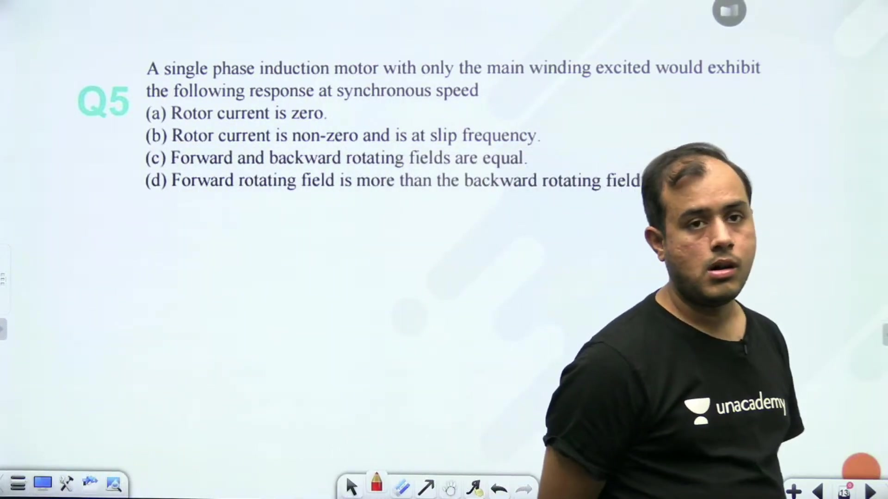

---

### Problem: Capacitance Calculation for 90-Degree Phase Shift

> [!example] Problem
> A single-phase $230\,\text{V}$, $50\,\text{Hz}$, 4-pole capacitor-start induction motor has:
> - Main winding: $Z_m = 4 + j4\,\Omega$ ($R_m = 4\,\Omega, X_m = 4\,\Omega$)
> - Auxiliary winding: $Z_a = 6 + j8\,\Omega$ ($R_a = 6\,\Omega, X_a = 8\,\Omega$)
> 
> Find the series capacitance required to produce an exact $90^\circ$ phase shift between main and auxiliary winding currents.

The formula for pure $90^\circ$ time-phase displacement (space-time quadrature) is:

$$X_c = X_a + R_a \left(\frac{R_m}{X_m}\right)$$

Substitute the machine impedance values:

$$X_c = 8 + 6 \left(\frac{4}{4}\right) = 8 + 6 = 14 \implies X_c = 18\,\Omega$$

With supply frequency $f = 50\,\text{Hz}$:

$$\omega = 2\pi f = 2\pi \times 50 = 314.16\,\text{rad/s}$$

The required capacitance is:

$$C = \frac{1}{\omega X_c} = \frac{1}{2\pi \times 50 \times 18} = 176.84 \times 10^{-6}\,\text{F} = 176.8\,\mu\text{F}$$

> [!success] Result
> The required starting capacitor is:
> $$C = 176.8\,\mu\text{F}$$

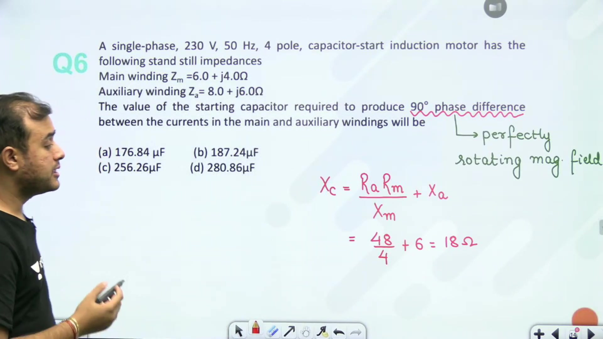

## Winding Resistance Ratio & Running Slip Analysis
_(27:06 - 32:00)_

### Problem: Ratio of Auxiliary to Main Winding Resistance

> [!example] Problem
> The starting currents in the main and auxiliary windings of a single-phase induction motor are:
> - $I_m = 4\angle 0^\circ\,\text{A}$
> - $I_a = 4\angle -30^\circ\,\text{A}$
> 
> when a common supply voltage of $V = 200\angle 0^\circ\,\text{V}$ is applied.
> Determine the ratio of the effective resistance of the auxiliary winding to that of the main winding ($\frac{R_a}{R_m}$).

First, determine the complex input impedance for each winding branch:

For the main winding:

$$Z_m = \frac{V}{I_m} = \frac{200\angle 0^\circ}{4\angle 0^\circ} = 50\angle 0^\circ\,\Omega$$

Because the impedance angle is $0^\circ$, the main winding has zero net reactance at this operating point:

$$R_m = |Z_m| \cos(0^\circ) = 50\,\Omega$$

For the auxiliary winding:

$$Z_a = \frac{V}{I_a} = \frac{200\angle 0^\circ}{4\angle -30^\circ} = 50\angle +30^\circ\,\Omega$$

Its effective resistance is the real part of $Z_a$:

$$R_a = |Z_a| \cos(30^\circ) = 50 \cos(30^\circ)\,\Omega$$

Now calculate the ratio of the two resistances:

$$\frac{R_a}{R_m} = \frac{50 \cos(30^\circ)}{50} = \cos(30^\circ) = \frac{\sqrt{3}}{2} \approx 0.866$$

> [!success] Result
> The resistance ratio is:
> $$\frac{R_a}{R_m} = 0.866$$

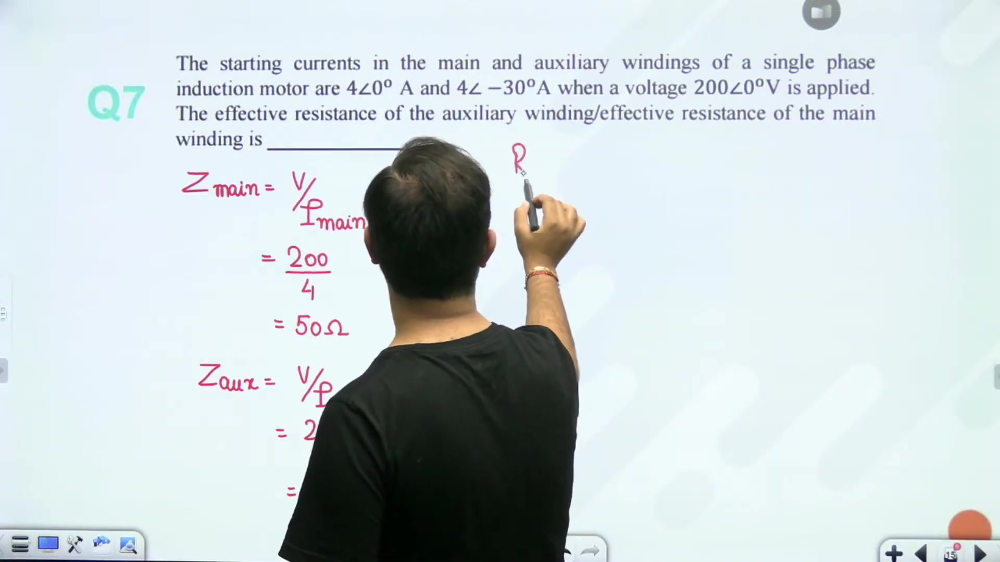

---

### Operating Slip Calculation under Loaded Condition

Consider a 4-pole, $50\,\text{Hz}$ single-phase induction motor running at speed $N_r = 940\,\text{rpm}$.

The synchronous speed is:

$$N_s = \frac{120 f}{P} = \frac{120 \times 50}{4} = 1500\,\text{rpm}$$

The operating forward slip is:

$$
\begin{aligned}
s &= \frac{N_s - N_r}{N_s} \\
&= \frac{1500 - 940}{1500} = \frac{560}{1500} = 0.3733
\end{aligned}
$$

The backward slip is:

$$2 - s = 2 - 0.3733 = 1.6267$$

These forward and backward slip values are needed to determine the rotor branch impedances under running conditions.

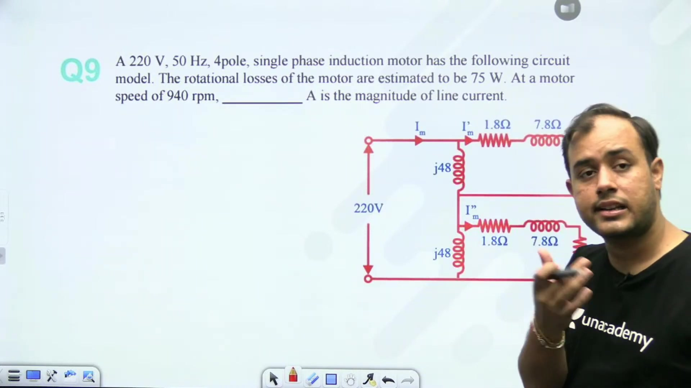

## Full Equivalent Circuit Input Impedance and Current
_(32:03 - 36:34)_

### Problem: Operating Line Current Calculation

> [!example] Problem
> A single-phase $220\,\text{V}$ induction motor operates at slip $s = 0.3733$.
> The parameters are:
> - Magnetizing branch: $j\frac{X_m}{2} = j48\,\Omega$
> - Forward rotor branch: $\frac{R_2'}{2s} + j\frac{X_2'}{2} = 1.8 + j3.4\,\Omega$
> - Backward rotor branch: $\frac{R_2'}{2(2-s)} + j\frac{X_2'}{2} = 10.907 + j3.4\,\Omega$
> 
> Compute the total input impedance and the supply line current magnitude.

---

### Forward and Backward Branch Impedance Evaluation

The forward branch impedance $Z_f$ consists of the forward magnetizing reactance in parallel with the forward rotor branch:

$$
\begin{aligned}
Z_f &= j48 \parallel (1.8 + j3.4) \\
&= \frac{j48 \times (1.8 + j3.4)}{1.8 + j(48 + 3.4)} \\
&= 11.32\angle 46.62^\circ\,\Omega
\end{aligned}
$$

The backward branch impedance $Z_b$ consists of the backward magnetizing reactance in parallel with the backward rotor branch:

$$
\begin{aligned}
Z_b &= j48 \parallel (10.907 + j3.4) \\
&= \frac{j48 \times (10.907 + j3.4)}{10.907 + j(48 + 3.4)} \\
&= 7.48\angle 67.48^\circ\,\Omega
\end{aligned}
$$

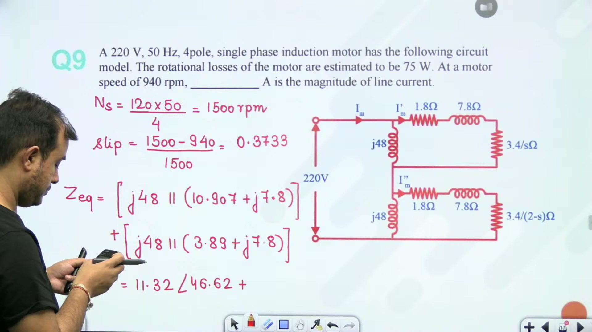

---

### Total Input Impedance and Current

Neglecting stator series impedance for this calculation, the total input impedance seen from the supply is:

$$
\begin{aligned}
Z_{\text{total}} &= Z_f + Z_b \\
&= 11.32\angle 46.62^\circ + 7.48\angle 67.48^\circ \\
&= (7.78 + j8.23) + (2.86 + j6.91) \\
&= 10.64 + j15.14 \\
&= 18.5\angle 54.89^\circ\,\Omega
\end{aligned}
$$

The supply current magnitude is:

$$I = \frac{V}{Z_{\text{total}}} = \frac{220}{18.5} = 11.89\,\text{A}$$

> [!success] Result
> Under this loaded operating slip, the motor draws:
> $$I = 11.89\,\text{A} \quad \text{at a power factor of } \cos(54.89^\circ) = 0.575 \text{ lagging}$$

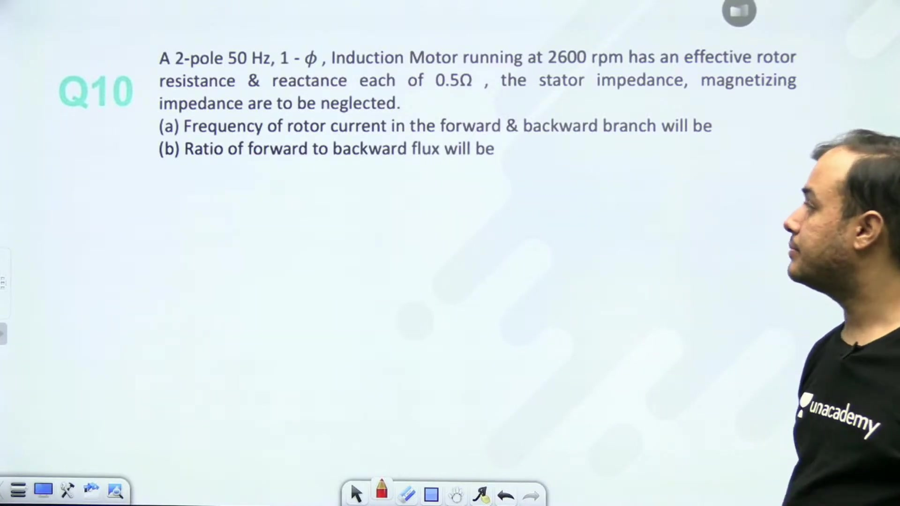

## Rotor Frequency, Flux Ratio & Starting Torque Test Data
_(37:02 - 41:59)_

### Problem: Forward to Backward Rotor Frequency Ratio

> [!example] Problem
> A single-phase induction motor operates at forward slip $s_f = \frac{2}{15}$.
> 1. Find the ratio of the frequency of rotor current induced by the forward field to that induced by the backward field ($\frac{f_f}{f_b}$).
> 2. Determine the ratio of forward air-gap flux to backward air-gap flux ($\frac{\Phi_f}{\Phi_b}$).

The forward rotor current frequency is:

$$f_f = s_f f$$

The backward slip is:

$$s_b = 2 - s_f = 2 - \frac{2}{15} = \frac{28}{15}$$

The backward rotor current frequency is:

$$f_b = s_b f = (2 - s_f) f$$

The ratio of the rotor frequencies is:

$$\frac{f_f}{f_b} = \frac{s_f f}{(2 - s_f) f} = \frac{s_f}{2 - s_f} = \frac{2/15}{28/15} = \frac{2}{28} = \frac{1}{14}$$

> [!success] Result
> The forward to backward rotor frequency ratio is:
> $$\frac{f_f}{f_b} = \frac{1}{14}$$

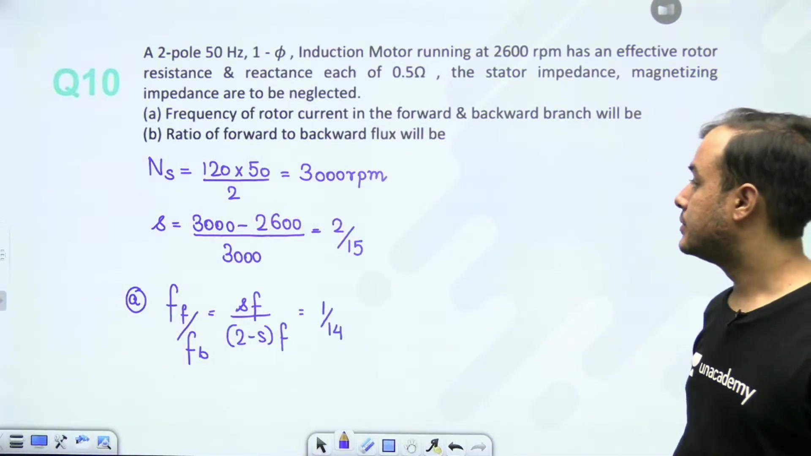

---

### Air-Gap Flux Ratio Calculation

Since both revolving fields are excited across parallel branches sharing common induced EMFs:

$$\frac{\Phi_f}{\Phi_b} = \frac{I_f}{I_b} = \frac{Z_b}{Z_f}$$

Evaluating the branch impedances with rotor parameters halved between branches yields:

$$\frac{\Phi_f}{\Phi_b} = 0.1499$$

---

### Motor Selection & Test Data for Maximum Starting Torque

Resistance split-phase motors produce low starting torque due to poor time-phase angle difference ($\alpha \approx 20^\circ$). They are recommended for **low-inertia loads** such as small fans, blowers, and centrifugal pumps.

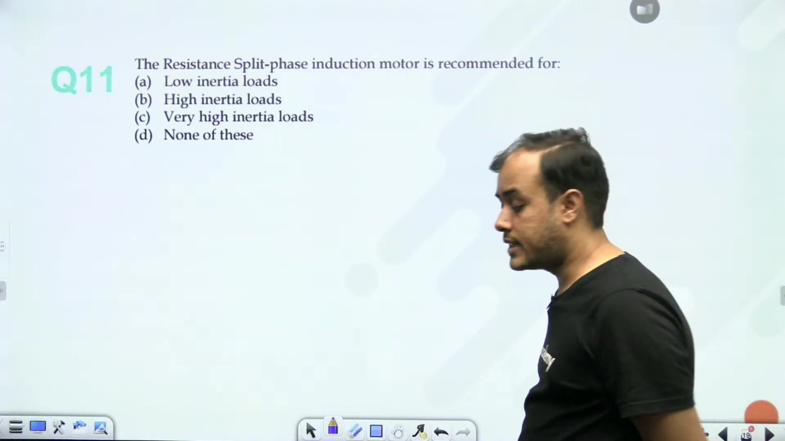

#### Evaluating Main Winding Parameters from Test Data
Given test measurements:
- Main winding: $V_m = 100\,\text{V}$, $I_m = 2\,\text{A}$, $P_m = 40\,\text{W}$

The main winding power factor angle is:

$$\cos\phi_m = \frac{P_m}{V_m I_m} = \frac{40}{100 \times 2} = \frac{40}{200} = 0.2$$

$$\phi_m = \cos^{-1}(0.2) = 78.463^\circ$$

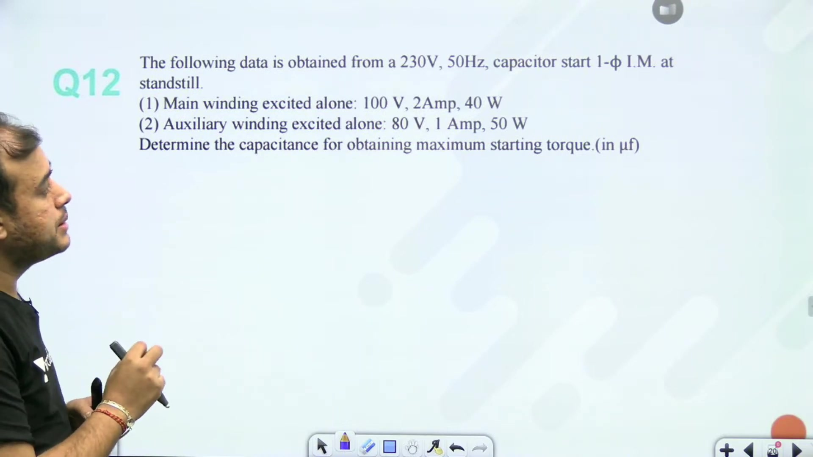

## Maximum Starting Torque Capacitance & Running Performance
_(42:03 - 49:01)_

### Problem: Capacitance for Maximum Starting Torque

> [!example] Problem
> Standstill test data for a $230\,\text{V}$, $50\,\text{Hz}$ capacitor-start single-phase induction motor:
> - Main winding: $V_m = 100\,\text{V}$, $I_m = 2\,\text{A}$, $P_m = 40\,\text{W}$
> - Auxiliary winding: $V_a = 80\,\text{V}$, $I_a = 1\,\text{A}$, $P_a = 50\,\text{W}$
> 
> Find the series capacitance required to produce maximum starting torque.

---

### Auxiliary Winding Parameter Extraction

From the auxiliary winding test:

$$Z_a = \frac{V_a}{I_a} = \frac{80}{1} = 80\,\Omega$$

$$R_a = \frac{P_a}{I_a^2} = \frac{50}{1^2} = 50\,\Omega$$

The auxiliary leakage reactance is:

$$X_a = \sqrt{Z_a^2 - R_a^2} = \sqrt{80^2 - 50^2} = \sqrt{6400 - 2500} = \sqrt{3900} \approx 62.45\,\Omega$$

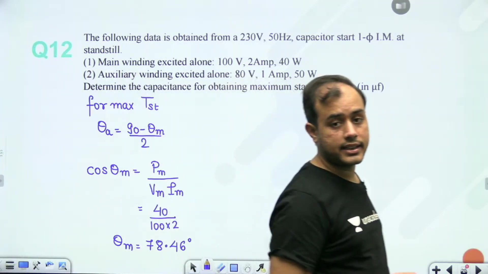

---

### Calculation of Required Starting Capacitance

From Section 8, the main winding angle is $\phi_m = 78.463^\circ$.
The condition for maximum starting torque is:

$$\phi_a = \frac{90^\circ - \phi_m}{2} = \frac{90^\circ - 78.463^\circ}{2} = \frac{11.537^\circ}{2} = 5.768^\circ$$

The auxiliary branch leading angle is related to net capacitive reactance:

$$\tan\phi_a = \frac{X_c - X_a}{R_a} \implies X_c = X_a + R_a \tan\phi_a$$

Substitute the numerical values:

$$
\begin{aligned}
X_c &= 62.45 + 50 \times \tan(5.768^\circ) \\
&= 62.45 + 50 \times 0.10105 \\
&= 62.45 + 5.052 = 67.502\,\Omega
\end{aligned}
$$

With supply frequency $f = 50\,\text{Hz}$:

$$C = \frac{1}{2\pi f X_c} = \frac{1}{2\pi \times 50 \times 67.502} = 47.15 \times 10^{-6}\,\text{F} \approx 47.11\,\mu\text{F}$$

> [!success] Result
> The capacitance required for maximum starting torque is:
> $$C = 47.11\,\mu\text{F}$$

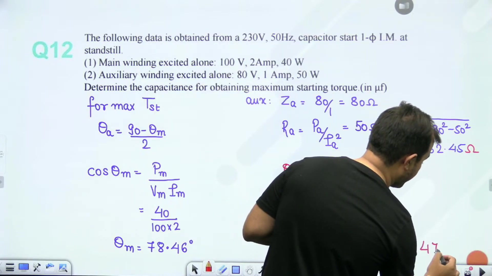

---

### Running Performance of Two-Value Capacitor Motors

> [!example] Problem
> Which single-phase motor exhibits high efficiency and high power factor under continuous running conditions?
> - (A) Capacitor-start induction motor
> - (B) Capacitor-start capacitor-run induction motor (two-value capacitor motor)
> - (C) Resistance split-phase motor
> - (D) Shaded-pole motor

**Correct Option: (B)**

In a capacitor-start motor, the centrifugal switch disconnects the auxiliary winding and capacitor around $75\%\text{--}80\% N_s$. The machine runs as a pure single-phase motor, which has lower efficiency and a lower power factor.

In a two-value capacitor motor, a run capacitor remains permanently in series with the auxiliary winding:
1. It maintains near-perfect time quadrature under running load.
2. It eliminates the backward rotating magnetic field during operation.
3. It substantially improves running efficiency, reduces acoustic noise, and raises the power factor.

---

## Summary and Key Takeaways

- At no-load synchronous speed ($s \approx 0$), the forward rotor branch resistance $\frac{R_2'}{2s}$ becomes an open circuit, causing the forward branch to draw purely magnetizing reactive current.
- The no-load power factor of a single-phase induction motor is very low and lagging ($\text{pf} \approx 0.1\text{ lagging}$) due to the large magnetizing branch requirement.
- In double revolving field theory, a single-phase pulsating MMF decomposes into two counter-rotating fields, each of magnitude $\frac{F_m}{2}$, rotating at synchronous speed $\pm N_s$.
- Physical rotor rotation always proceeds from the space axis of the leading current winding toward the space axis of the lagging current winding along the shortest spatial displacement.
- In split-phase motors, a minimum phase difference $\alpha \ge 20^\circ \text{ to } 30^\circ$ is essential to produce sufficient starting torque; angular differences under $10^\circ$ produce negligible torque.
- The forward-to-backward rotor current frequency ratio is $\frac{f_f}{f_b} = \frac{s_f}{2 - s_f}$, which also governs the ratio of induced rotor EMFs.
- Series capacitance required for pure $90^\circ$ time-phase displacement is $X_c = X_a + R_a \left(\frac{R_m}{X_m}\right)$.
- Series capacitance required for maximum starting torque is governed by the distinct condition $\phi_a = \frac{90^\circ - \phi_m}{2}$.
- Two-value capacitor motors retain a run capacitor under continuous operation, maintaining balanced two-phase running conditions with high efficiency and power factor.

---

[← Lec 161: Single Phase Induction Motor 2](Lecture_161_Single_Phase_Induction_Motor_2.md) | [🏠 Index](00_yt_study_guide.md)
