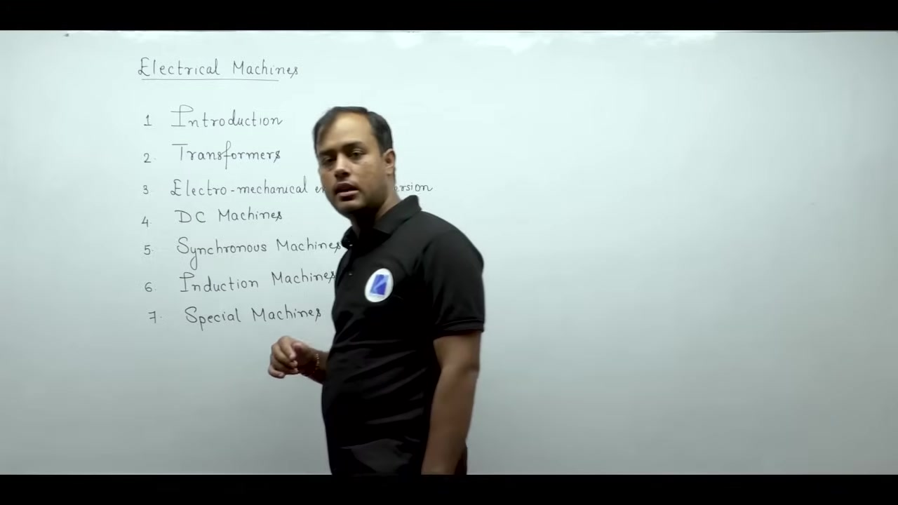
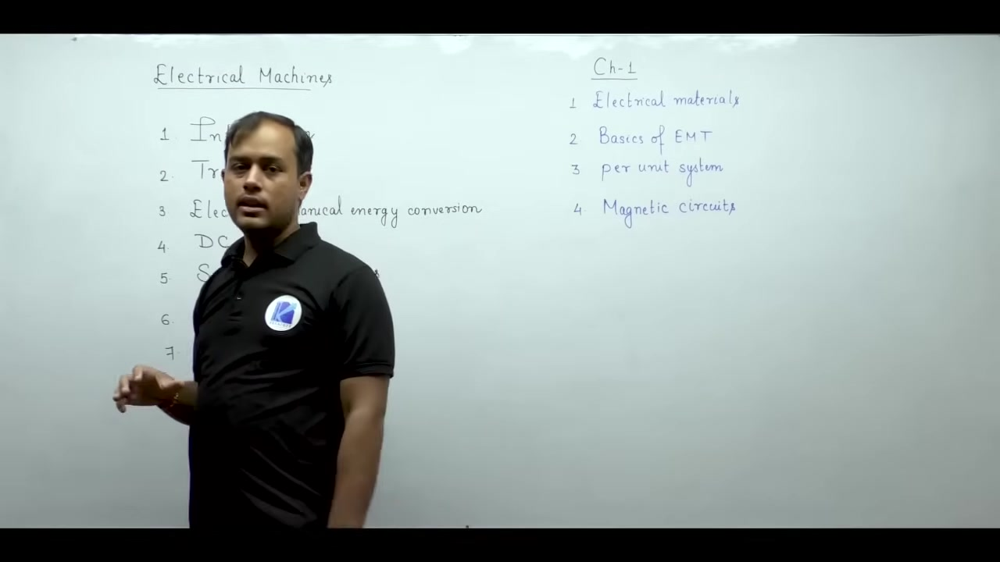
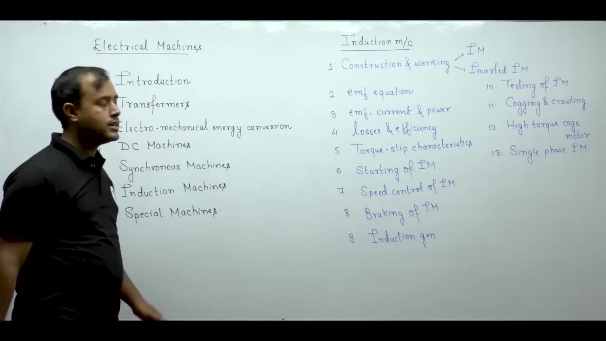

[🏠 Index](00_yt_study_guide.md) | [Lec 002: Electrical Materials →](Lecture_002_Electrical_Materials.md)

---

# Introduction to Electrical Machines | Lec 1 | Electrical Machines | GATE & ESE | Ankit Goyal

- **Source**: https://www.youtube.com/watch?v=PmBqB-4hgW4
- **Duration**: 00:47:15
- **Compiled**: 2026-09-15

---

## Overview

This lecture introduces the complete curriculum and preparation strategy for electrical machines. It organizes the subject into seven structured modules, from foundational materials to specific machine architectures (DC, Synchronous, Induction). It emphasizes that understanding physical construction is key to grasping equivalent circuits, and that long-term retention requires patient numerical problem-solving rather than rote theory memorization.

## Contents

- [[#Course Overview and Syllabus Architecture|Course Overview and Syllabus Architecture]]
- [[#Exam Weightage, Textbooks, and Preparation Strategy|Exam Weightage, Textbooks, and Preparation Strategy]]
- [[#Foundations and Introduction to Transformers|Foundations and Introduction to Transformers]]
- [[#Practical Transformers and Energy Conversion|Practical Transformers and Energy Conversion]]
- [[#Direct Current Machines Architecture|Direct Current Machines Architecture]]
- [[#Synchronous Machines Architecture|Synchronous Machines Architecture]]
- [[#Induction Machines, Special Machines, and Study Mindset|Induction Machines, Special Machines, and Study Mindset]]

---

## Course Overview and Syllabus Architecture
_(00:12 - 05:26)_

Electrical machines form the backbone of electrical engineering, heavily featured in PSUs, technical interviews, and competitive exams. 

### Two-Part Study Approach
- **Conceptual Understanding**: Focus on physical principles and operating mechanisms to build intuition.
- **Problem-Solving Skills**: Master analytical formulas and numerical techniques, as this is where exam marks come from.

### Course Syllabus Structure
The course covers seven main units:

1. **Introduction**: Basic engineering tools, electrical materials, electromagnetic foundations, per-unit analysis.
2. **Transformers**: Ideal and practical transformers, equivalent circuits, losses, regulation, three-phase connections.
3. **Electromechanical Energy Conversion**: Power flow, field energy, co-energy, force/torque production.
4. **DC Machines**: Armature windings, armature reaction, commutation, characteristics, speed control, testing.
5. **Synchronous Machines**: Cylindrical and salient-pole machines, rotating magnetic fields, voltage regulation, power-angle curves.
6. **Induction Machines**: Polyphase/single-phase motors, torque-slip curves, starting, speed control.
7. **Special Machines**: Stepper, hysteresis, and reluctance motors.

> [!info] Core Curriculum Scope
> Chapters 2 through 6 form the core numerical syllabus for GATE. Chapters 1 and 3 provide the analytical foundation. Chapter 7 covers special fractional-kilowatt machines for ESE and state exams.

## Exam Weightage, Textbooks, and Preparation Strategy
_(05:30 - 11:31)_

Electrical machines typically carry 12 to 15 marks in GATE, mostly from numerical problems.

### Recommended Reference Textbooks

- **Electrical Machinery (P.S. Bimbhra)**: Standard textbook for machine fundamentals.
- **Generalized Theory of Electrical Machines (P.S. Bimbhra)**: Useful for advanced machine analysis.
- **Electrical Machines (Ankit Goyal)**: Designed specifically for GATE and ESE, combining concise theory with a large problem bank.

### How to Read Numerical Problems
Questions in exams are rarely plug-and-chug. They contain critical descriptive operating conditions. Follow this sequence:
1. Read the problem statement patiently.
2. Identify the operating state of the machine.
3. List the given parameters and what you need to find.
4. Select the governing formula and calculate.

> [!info] The 30-Second Rule
> Spend at least 30 seconds reading the problem statement carefully before writing any equations. Decoding the question correctly solves half the problem.

## Foundations and Introduction to Transformers
_(11:37 - 20:17)_

Chapter 1 introduces four analytical tools that prepare you for the entire machines course.

### Four Building Blocks in Chapter 1
- **Electrical Materials**: Copper (windings), Aluminium (alternative conductor/tanks), Carbon (brushes), Iron/Silicon Steel (magnetic cores).
- **Basics of Electromagnetic Theory**: Focus on magnetic flux paths, field energy, and induction laws.
- **Per-Unit System**: Normalizes parameters ($\text{PU} = \frac{\text{Actual}}{\text{Base}}$) to remove transformation ratios across voltage levels.
- **Magnetic Circuits**: Converts magnetic paths into equivalent electric circuits:
  - Magnetomotive force ($F = N I$) acts like voltage ($V$).
  - Magnetic flux ($\phi$) acts like electric current ($I$).
  - Reluctance ($\mathcal{R}$) acts like electrical resistance ($R$).

> [!info] Electrical-Magnetic Analogy
> Modeling magnetic paths as equivalent electric circuits lets you solve magnetic problems using Ohm's law and standard network theorems.

### Beginning Chapter 2: Transformers
- Study starts with physical construction to visualize the core, windings, insulation, and tank.
- Induced electromotive force equation:
  $$E = 4.44 f N \phi_m$$
- Ideal transformers assume zero winding resistance, zero core loss, and infinite permeability. 

## Practical Transformers and Energy Conversion
_(20:17 - 28:58)_

Practical transformer models are built by adding non-idealities one by one to the ideal core.

### Building the Practical Transformer Model
1. **Core Loss ($R_c$)**: Shunt resistance representing hysteresis and eddy current heating.
2. **Magnetizing Reactance ($X_m$)**: Shunt reactance representing the finite permeability requiring magnetizing current.
3. **Winding Resistance ($R_1, R_2$)**: Ohmic resistance of copper windings causing $I^2 R$ losses.
4. **Leakage Reactance ($X_1, X_2$)**: Series reactance from flux that does not link both windings.

### Transformer Testing and Efficiency
- **Open-Circuit (OC) Test**: Done at rated voltage on the LV side to find no-load core loss ($R_c$ and $X_m$).
- **Short-Circuit (SC) Test**: Done at rated current on the HV side to find full-load copper loss and series impedance.
- **Efficiency ($\eta$)**: 
  $$\eta = \frac{P_{out}}{P_{out} + P_{core} + P_{copper}}$$
  Maximum efficiency occurs when variable copper loss equals constant core loss.
- **Voltage Regulation ($VR$)**: Measures output voltage drop between no-load and full-load.

### Electromechanical Energy Conversion
- Generators convert mechanical power to electrical; motors do the reverse. A magnetic field couples the systems.
- Force in translational systems is derived from co-energy ($W_f'$):
  $$F_e = +\frac{\partial W_f'(i, x)}{\partial x}$$

> [!info] Principle of Energy Balance
> In an electromechanical system, total electrical input energy equals mechanical work done plus increase in stored field energy plus energy losses.

## Direct Current Machines Architecture
_(29:01 - 33:45)_

DC machines introduce the physical principles of rotating machinery, governed by a small set of formulas.

### Construction and Rotating Machinery Foundations
- **Field Winding**: Stator poles that set up main flux.
- **Armature Winding**: Rotor slots carrying lap or wave windings.
- **Armature Reaction**: Armature magnetic field distorting the main field flux.
- **Commutation**: Segments and brushes converting internal AC to external DC.

### Governing Equations of the DC Machine
- **Induced EMF ($E_a$)**:
  $$E_a = \frac{P \phi Z N}{60 A}$$
- **Electromagnetic Torque ($T_e$)**:
  $$T_e = \frac{P \phi Z I_a}{2 \pi A}$$
- Where $P$ = poles, $\phi$ = flux/pole, $Z$ = conductors, $N$ = speed in rpm, $A$ = parallel paths.

> [!success] Unified Machine Constant
> Defining $K_a = \frac{P Z}{2 \pi A}$, we write $E_a = K_a \phi \omega_m$ and $T_e = K_a \phi I_a$. Electric power converted equals mechanical power ($E_a I_a = T_e \omega_m$).

### Three Pillars of DC Motor Operation
1. **Starting**: Uses starters (3-point/4-point) to limit destructive starting currents when back-EMF is zero.
2. **Speed Control**: Armature voltage control (below base speed) and field flux weakening (above base speed).
3. **Electric Braking**: Regenerative braking, dynamic (rheostatic) braking, and plugging.

## Synchronous Machines Architecture
_(33:45 - 39:18)_

Synchronous machines operate at a constant synchronous speed tied to the supply frequency.

### Construction and Rotating Magnetic Field
- **Stator**: Carries 3-phase distributed armature winding, creating a rotating magnetic field.
- **Rotor**: Carries DC field winding. Can be Cylindrical (turbo-alternators) or Salient-Pole (hydro-alternators).
- Synchronous speed equation:
  $$N_s = \frac{120 f}{P}$$

### Induced Electromotive Force
- RMS induced EMF per phase:
  $$E_{ph} = 4.44 f \phi T_{ph} k_w$$
- **Winding Factor ($k_w$)**: Product of pitch factor ($k_p$, for short-pitching) and distribution factor ($k_d$, for distributed coils).

### Power-Angle Relation
- For cylindrical rotor machines, active power is:
  $$P = \frac{E V}{X_s} \sin\delta$$
- For salient-pole machines (Blondel's two-reaction theory):
  $$P = \frac{E V}{X_d} \sin\delta + \frac{V^2}{2}\left(\frac{1}{X_q} - \frac{1}{X_d}\right)\sin 2\delta$$

> [!success] Reluctance Power
> In salient-pole alternators, the $\sin 2\delta$ term represents reluctance power, developing torque even without DC field excitation.

## Induction Machines, Special Machines, and Study Mindset
_(39:18 - 47:08)_

Induction machines account for the largest share of industrial motor drives.

### Construction and Rotor Topologies
- **Squirrel-Cage Rotor**: Solid conducting bars shorted by end rings. Rugged and reliable.
- **Slip-Ring (Wound) Rotor**: 3-phase insulated winding brought to slip rings, allowing external resistance for higher starting torque.

### Power Flow and the Golden Ratio
- The rotor runs at speed $N_r$, slightly less than synchronous speed $N_s$.
- Operating slip: $s = \frac{N_s - N_r}{N_s}$.
- Power divides in a strict ratio across the air gap:
  $$P_g : P_{cu} : P_{mech} = 1 : s : (1 - s)$$

> [!success] The Induction Machine Power Division
> Rotor ohmic losses equal slip times air gap power ($P_{cu} = s P_g$). Operating at low slip ensures high machine efficiency.

### Torque-Slip Characteristics
- **Low Slip ($s \ll s_{max}$)**: Torque varies linearly with slip ($T \propto s$).
- **High Slip ($s \gg s_{max}$)**: Torque varies inversely with slip ($T \propto 1/s$).
- **Maximum Torque ($T_{max}$)**: Independent of rotor resistance, but higher resistance shifts $T_{max}$ to a higher slip.

### Study Timeline and Mental Preparation
- **Consistent Practice**: Aim for 30-45 days, combining daily videos with numerical practice.
- **Focus**: Don't be overwhelmed by the breadth; master Chapter 1 to make subsequent chapters intuitive.

---

## Summary and Key Takeaways

- **Exam Strategy**: Numerical practice yields 13-14 out of the 15 GATE marks. Read problem statements for 30 seconds before writing formulas.
- **Magnetic Circuits**: Map physical magnetic paths into electrical equivalents ($F = N I$ as voltage, $\phi$ as current).
- **Practical Transformers**: Modeled by adding $R_c$, $X_m$, $R_{1,2}$, and $X_{1,2}$ to the ideal core.
- **DC Machines**: Converting electric to mechanical power follows $E_a I_a = T_e \omega_m$.
- **Synchronous Machines**: Power transfer depends on the load angle $\delta$, with salient poles providing additional reluctance power.
- **Induction Machines**: Slip determines the fundamental power split $P_g : P_{cu} : P_{mech} = 1 : s : (1 - s)$.
- **Operational Pillars**: Motor analysis universally rests on starting, speed control, and electric braking.

---

[🏠 Index](00_yt_study_guide.md) | [Lec 002: Electrical Materials →](Lecture_002_Electrical_Materials.md)
