[← Lec 001: Introduction to Electrical Machines](Lecture_001_Introduction_to_Electrical_Machines.md) | [🏠 Index](00_yt_study_guide.md) | [Lec 003: Electrical Materials 2 →](Lecture_003_Electrical_Materials_2.md)

---

# Electrical Materials | Electrical Machines | Lec 2 | GATE & ESE (EE, ECE) | Ankit Goyal

- **Source**: https://www.youtube.com/watch?v=xtUKUj3Fd8w
- **Duration**: 01:13:04
- **Compiled**: 2026-09-16

---

## Overview

This lecture establishes the selection criteria for conducting and magnetic materials in electrical machines. It evaluates copper, aluminium, and carbon based on conductivity, temperature response, and mechanical strength. It derives the conductor area required for equal resistance and explores their specific applications. Finally, the lecture introduces magnetic materials, contrasting diamagnetic (dipole opposition) with paramagnetic (dipole alignment) behaviors.

## Contents

- [[#Classification of Electrical Materials and Conducting Materials|Classification of Electrical Materials and Conducting Materials]]
- [[#Desirable Properties of Highly Conducting Materials|Desirable Properties of Highly Conducting Materials]]
- [[#Mechanical and Chemical Properties of Conductors|Mechanical and Chemical Properties of Conductors]]
- [[#Copper Properties and Comparison with Aluminium|Copper Properties and Comparison with Aluminium]]
- [[#Cross-Sectional Area Derivation and Aluminium Applications|Cross-Sectional Area Derivation and Aluminium Applications]]
- [[#Aluminium Passivation and Electrical Carbon Brushes|Aluminium Passivation and Electrical Carbon Brushes]]
- [[#Brush Contact Voltage Drop and Introduction to Magnetic Materials|Brush Contact Voltage Drop and Introduction to Magnetic Materials]]
- [[#Diamagnetic Materials and Induced Dipole Alignment|Diamagnetic Materials and Induced Dipole Alignment]]
- [[#Magnetic Susceptibility and Relative Permeability of Diamagnetic Materials|Magnetic Susceptibility and Relative Permeability of Diamagnetic Materials]]
- [[#Field Divergence in Diamagnets and Paramagnetic Fundamentals|Field Divergence in Diamagnets and Paramagnetic Fundamentals]]
- [[#Paramagnetic Dipole Alignment and Positive Susceptibility|Paramagnetic Dipole Alignment and Positive Susceptibility]]
- [[#Flux Concentration in Paramagnets and Comprehensive Lecture Summary|Flux Concentration in Paramagnets and Comprehensive Lecture Summary]]

---

## Classification of Electrical Materials and Conducting Materials
_(00:12 - 08:11)_

Electrical machines rely on three primary classes of materials for their physical operation.

> [!info] Definition: Classification of Machine Materials
> 1. **Conducting Materials**: Provide a low-resistance path for electric currents (windings).
> 2. **Magnetic Materials**: Support and guide magnetic flux for energy conversion (cores).
> 3. **Insulating Materials**: Isolate live conductors from each other and the grounded chassis to prevent leaks and shocks.

### Types of Electrically Conducting Materials
- **Highly Conducting Materials**: Pure metals (Copper, Aluminium, Gold, Silver) that minimize $I^2 R$ heat loss in windings.
- **Highly Resistive Materials**: Metallic alloys used when intentional heating is desired (e.g., irons, toasters).

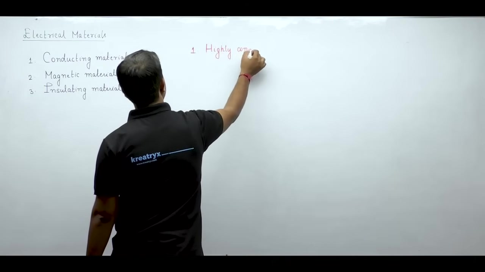

### Why Alloys Exhibit Higher Resistivity
- Pure elemental metals have regular crystal lattices, allowing electrons to drift freely with few collisions.
- Melting metals together to form an alloy introduces foreign atoms of different radii, distorting the neat lattice.
- Electrons suffer frequent collisions in this distorted structure, sharply increasing material resistivity.

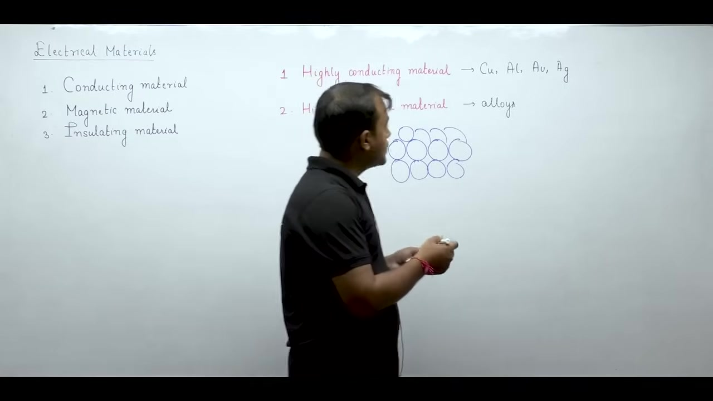

## Desirable Properties of Highly Conducting Materials
_(08:15 - 13:11)_

Unlike heating appliances, electrical machines require the lowest possible electrical resistance to curb energy loss.

### Comparison Between Pure Metals and Alloys
> [!info] Definition: Temperature Dependence of Resistance
> Resistance changes with temperature ($\Delta T$): $R = R_0 (1 + \alpha_0 \Delta T)$. Here, $\alpha_0$ is the temperature coefficient.

- **Alloys**: Higher electrical resistivity but very low temperature coefficient ($\alpha$). Their resistance barely drifts, making them ideal for measurement instruments.
- **Pure Metals**: Lower resistivity (high conductivity) but higher temperature coefficient ($\alpha$). Used for machine windings despite resistance drift because minimizing baseline loss is crucial.

### Core Properties Required for Machine Windings
1. **Highest Possible Conductivity**: Minimizes winding resistance and baseline $I^2 R$ heat losses.
2. **Low Temperature Coefficient**: Prevents a vicious cycle where heat increases resistance, causing even more heat, which lowers machine efficiency ($\eta = \frac{P_{\text{out}}}{P_{\text{in}}}$).

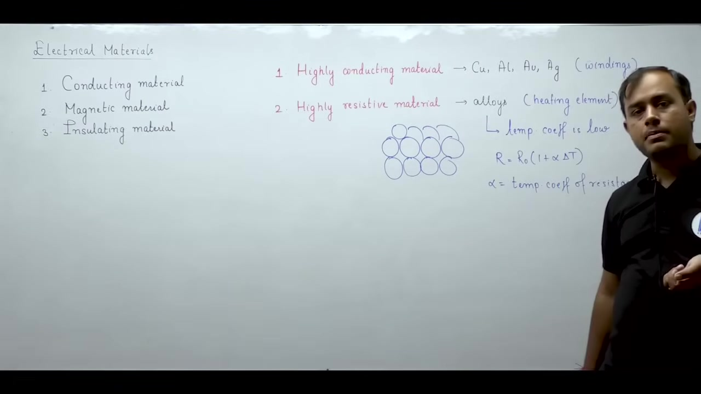

## Mechanical and Chemical Properties of Conductors
_(13:11 - 20:12)_

Machine windings must survive severe mechanical stress during manufacturing and daily use.

### Essential Properties
1. **Mechanical Strength and Ductility**: Wire must bend tightly around iron cores without snapping or cracking under tension.
2. **Rollability and Drawability**: Must be rollable into flat strips and drawable through dies into continuous thin wires.
3. **Weldability and Solderability**: Must form clean joints to prevent high contact resistance and localized hotspots.
4. **Corrosion Resistance**: Must resist atmospheric oxidation and chemical fumes for decades to avoid winding thinning and failure.

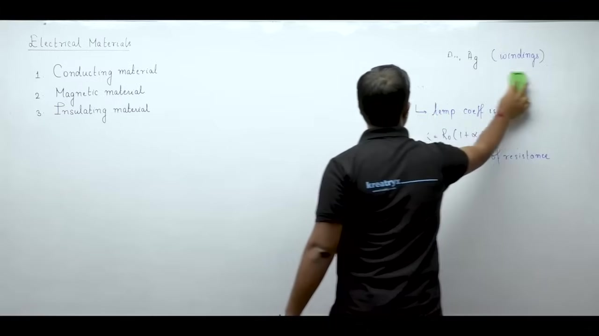
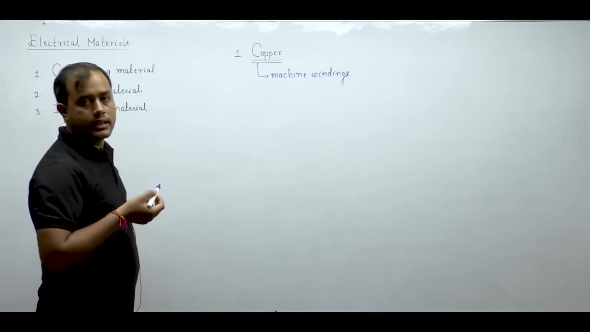

### Copper as the Primary Machine Conductor
> [!info] Definition: Practical Conductor Selection
> Conductivity order: $\sigma_{\text{Ag}} > \sigma_{\text{Cu}} > \sigma_{\text{Au}} > \sigma_{\text{Al}}$. Selection balances conductivity with raw material cost.

- Silver and Gold have extreme market costs, raising tariffs and risking theft.
- **Copper** provides much higher conductivity than Aluminium, handles higher current density, and is affordable. It serves as the universal standard for stator/rotor/transformer windings.

## Copper Properties and Comparison with Aluminium
_(20:13 - 27:35)_

### Distinctive Features of Copper
1. **Corrosion Resistance**: Highly stable chemically, ensuring a long operational lifespan.
2. **Hard-Drawn Copper**: Cold-working boosts tensile strength so wires don't snap when pulled tight over cores.
3. **Temperature Coefficient**: Copper's resistance rises noticeably with heat ($\alpha_{\text{Cu}} \approx 0.00393\text{ /}^\circ\text{C}$).

### Aluminium as the Next Best Alternative
- Copper depletion has driven up costs, making abundant, cheaper Aluminium an attractive alternative.
- Aluminium tears easily during wire drawing, so it is preferred for thick bars or foil sheets rather than fine wires.

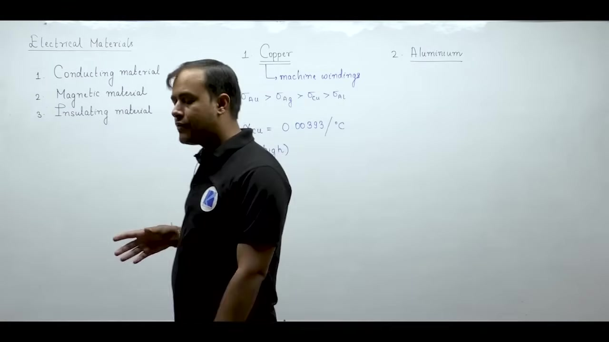

### Normalized Comparison (Base = Copper 1.0)
| Parameter | Copper | Aluminium | Engineering Impact |
| :--- | :--- | :--- | :--- |
| **Cost** | $1.00$ | $0.49$ | Aluminium is roughly half the cost. |
| **Area** ($A$) | $1.00$ | $1.62$ | Aluminium requires 62% more area for equal resistance. |
| **Diameter** ($d$) | $1.00$ | $1.27$ | Thicker wire demands larger machine slots. |
| **Tensile Strength** | $1.00$ | $0.64$ | Aluminium breaks more easily under tension. |
| **Weight** | $1.00$ | $0.48$ | Aluminium conductors weigh half as much. |

## Cross-Sectional Area Derivation and Aluminium Applications
_(27:35 - 34:15)_

### Derivation: Conductor Area for Equal Resistance
- Resistance formula: $R = \frac{L}{\sigma A}$.
- Equating Copper and Aluminium resistances of identical length:
  $$\frac{L}{\sigma_{\text{Cu}} A_{\text{Cu}}} = \frac{L}{\sigma_{\text{Al}} A_{\text{Al}}}$$
- Solving for Aluminium area:
  $$A_{\text{Al}} = \left( \frac{\sigma_{\text{Cu}}}{\sigma_{\text{Al}}} \right) A_{\text{Cu}}$$
- Since copper's conductivity is about 1.62 times higher:
  $$A_{\text{Al}} \approx 1.62 \, A_{\text{Cu}}$$

> [!success] Result: Cross-Sectional Area Ratio
> For identical electrical resistance and heating, an aluminium conductor requires 62% more cross-sectional area than a copper one.

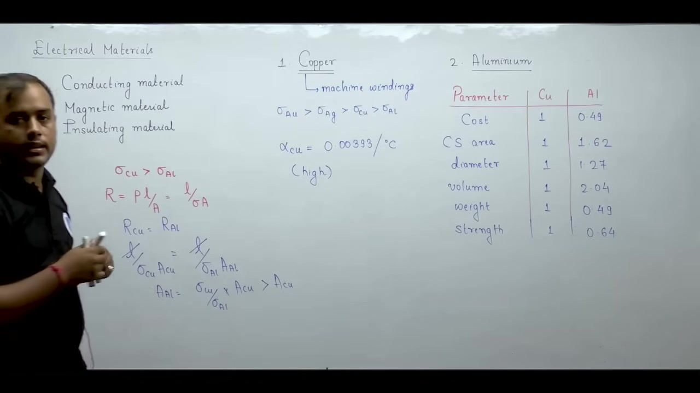
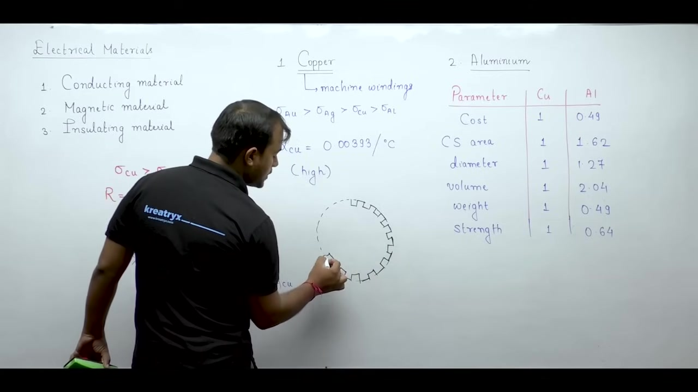

### Practical Impact on Slots and Applications
- **Larger Slots**: Thicker aluminium wire requires deeper, wider stator/rotor slots. This steals space from the magnetic iron teeth, meaning an aluminium-wound machine requires a physically bulkier iron frame.
- **Squirrel-Cage Rotors**: Solid molten aluminium is cleanly cast into thick rotor bars for large induction motors (over 100kW).
- **Foil Windings**: Aluminium rolls easily into wide foils, replacing circular wire in low-voltage transformer windings for better heat conduction.

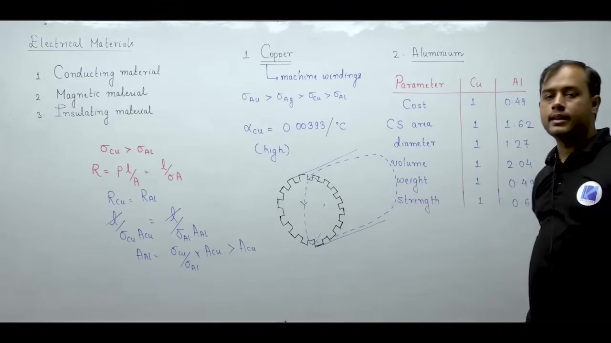

## Aluminium Passivation and Electrical Carbon Brushes
_(34:35 - 42:22)_

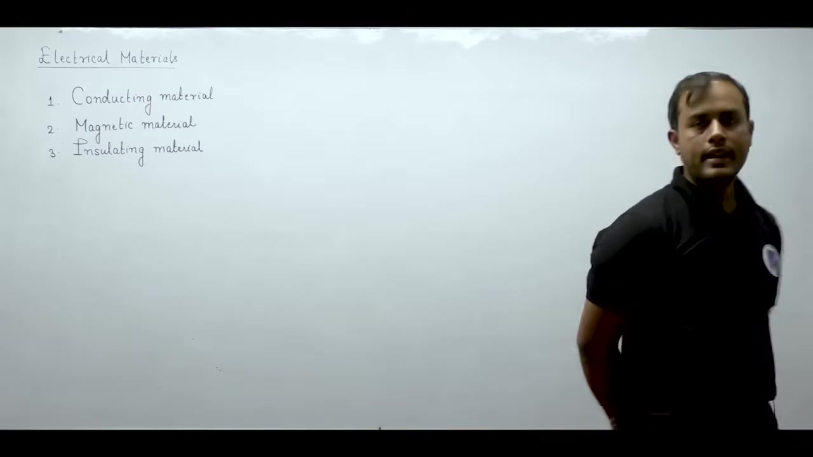

### Aluminium Passivation & Transformer Tanks
1. **Self-Passivating Oxide Layer**: Air exposure instantly forms a microscopic, tough shield ($4\text{Al} + 3\text{O}_2 \longrightarrow 2\text{Al}_2\text{O}_3$) that stops further oxidation, ensuring decades of weather resistance.
2. **Reducing Stray Load Losses**: Stray magnetic flux escaping into a steel tank induces massive eddy currents. Using non-magnetic aluminium for the tank walls prevents these stray losses, boosting transformer efficiency.

### Electrical Carbon Brushes
Carbon (graphite) has poor conductivity compared to copper, so it is never used for windings. Instead, it is the universal standard for electrical brushes.

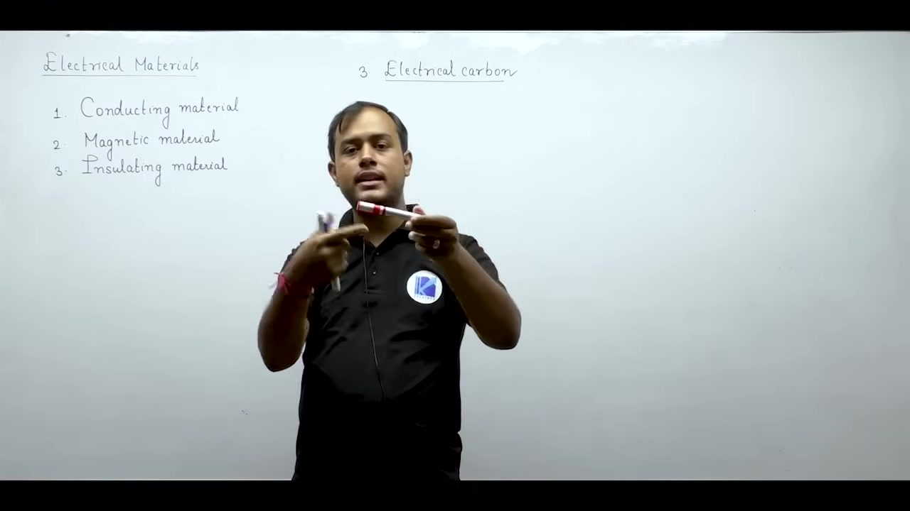

> [!info] Definition: Function of a Brush
> A stationary brush maintains sliding electrical contact with a rotating machine member (commutator/slip rings) to transfer current without twisting cables.

### Why Carbon Brushes Replace Metal Contacts
1. **Reduced Friction & Sparking**: Metal-on-metal sliding causes severe gouging, friction, and sparking. Carbon provides a smooth, self-lubricating surface.
2. **Graphitization**: Heat treatment increases carbon's conductivity and softens it, allowing the brush to gently polish the rotating copper commutator instead of cutting into it.

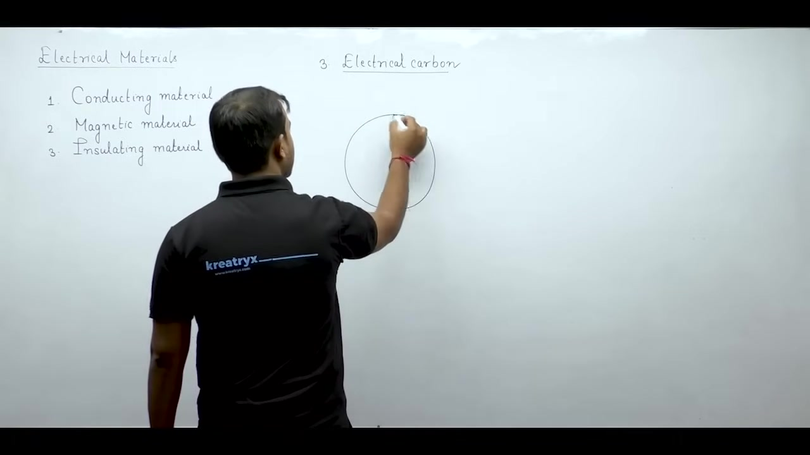
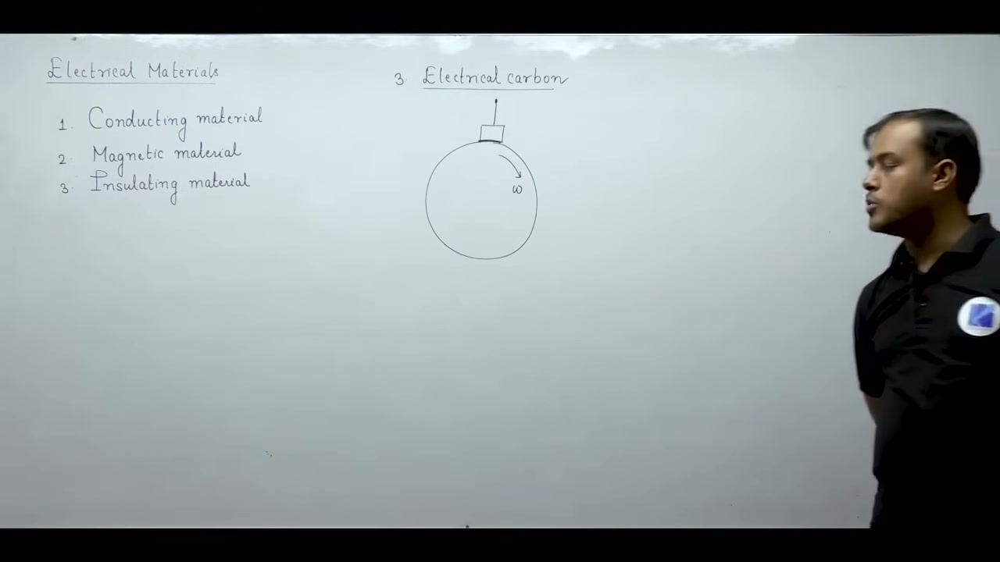

## Brush Contact Voltage Drop and Introduction to Magnetic Materials
_(42:25 - 47:25)_

### Why Brush Contact Voltage Drop Remains Constant
Carbon behaves like a semiconductor when heated—its resistance *decreases* as temperature *increases* (negative temperature coefficient).

> [!success] Result: Constant Brush Contact Drop
> When load current $I$ increases, contact friction and heating rise. This heat lowers brush resistance $R_{\text{brush}}$. Since $I$ goes up while $R_{\text{brush}}$ goes down, their product stays roughly constant:
> $$V_{\text{bd}} = I \cdot R_{\text{brush}} \approx \text{constant} \quad (\approx 1\text{ to }2\text{ V})$$

### Summary of Primary Conducting Materials
1. **Copper**: Standard for all windings; high conductivity, mechanical toughness, corrosion resistant.
2. **Aluminium**: Viable low-cost alternative. Used for cage rotors, foil windings, and tank walls.
3. **Carbon**: Exclusively used for brushes. Self-lubricating, suppresses sparks, maintains constant voltage drop.

### Introduction to Magnetic Materials
Without high-permeability magnetic cores, machines would require immense electric currents and gigantic copper coils to establish necessary magnetic fields across air gaps.

> [!info] Definition: Magnetic Materials
> Substances that readily establish, support, and guide magnetic flux lines with minimal opposition.

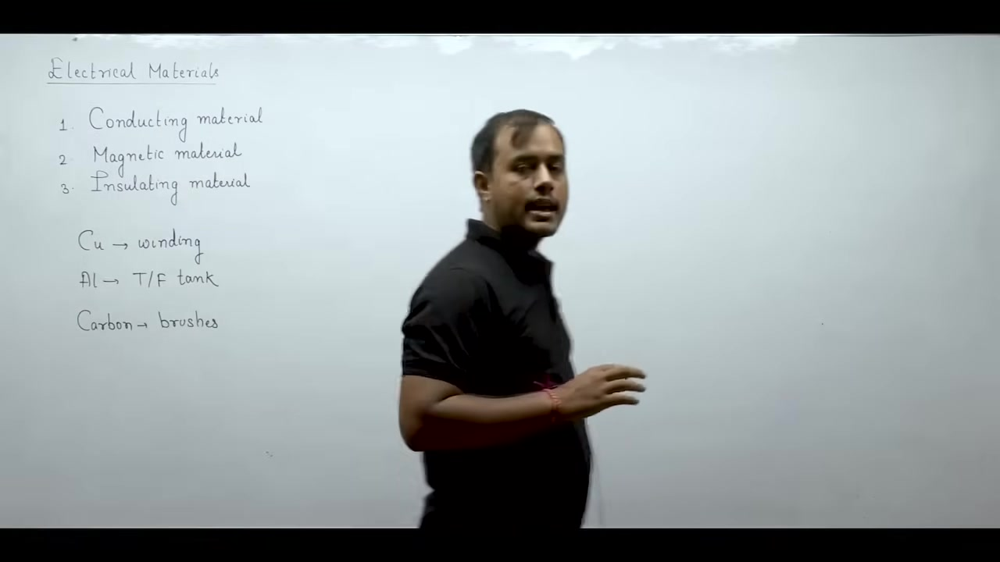

## Diamagnetic Materials and Induced Dipole Alignment
_(47:34 - 52:26)_

Materials respond to magnetic fields differently based on their atomic structure.

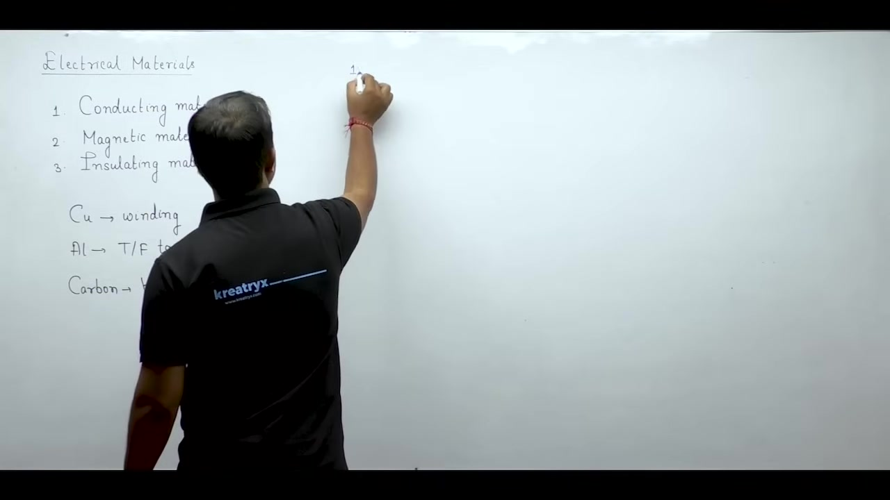

### Behavior of Diamagnetic Materials
> [!info] Definition: Diamagnetic Material
> A substance with zero permanent magnetic dipoles at rest. When an external field is applied, it induces tiny dipoles that strictly align *opposite* to the applied field.

- **Absence of External Field**: Electron orbitals balance out perfectly. Net dipole moment is exactly zero.
- **Presence of External Field ($H$)**: The external field alters electron motion, inducing tiny dipoles that align backwards against $H$. 

### Internal Dipole Field and Boundary Polarization
- Because induced dipoles point backward, uncancelled south poles appear on the entering surface and north poles on the exiting surface.
- The internal field created by these dipoles points directly against the applied external field, slightly weakening the total magnetic field inside the material.

### Concept of Magnetization
> [!info] Definition: Magnetization ($M$)
> The net magnetic dipole moment per unit volume established inside a material:
> $$M = \frac{\sum m_{\text{dipole}}}{V}$$

Because diamagnetic dipoles point backwards, the magnetization vector $\vec{M}$ directly opposes the applied field $\vec{H}$.

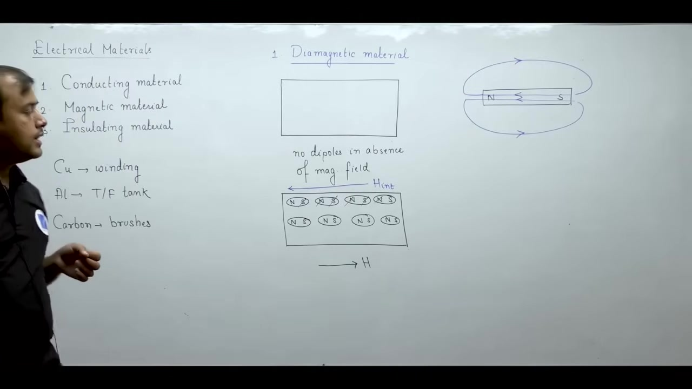

## Magnetic Susceptibility and Relative Permeability of Diamagnetic Materials
_(52:29 - 57:00)_

### Magnetic Susceptibility
> [!info] Definition: Magnetic Susceptibility ($\chi_m$)
> Measures how easily a material develops magnetization in an external field: $\vec{M} = \chi_m \vec{H}$.

Because $\vec{M}$ opposes $\vec{H}$ in diamagnetic materials, susceptibility is negative:
$$ \chi_m < 0 \quad (\text{negative and small}) $$

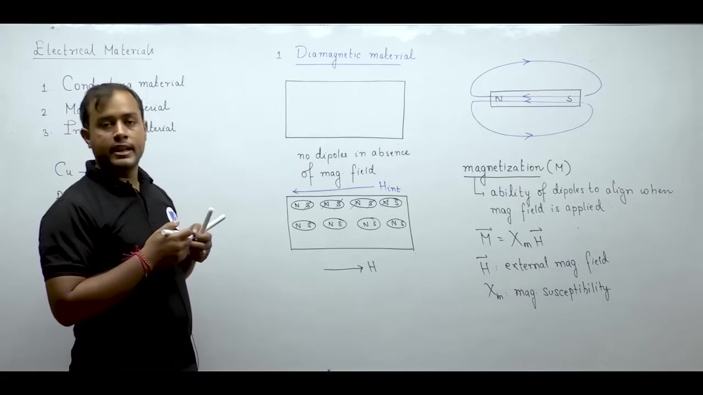

### Absolute and Relative Permeability
- **Total Permeability**: $\mu = \mu_0 \mu_r$.
- **Free Space Permeability**: $\mu_0 = 4\pi \times 10^{-7}\text{ H/m}$.
- **Relative Permeability**: $\mu_r = 1 + \chi_m$.

> [!success] Result: Diamagnetic Permeability Relations
> Because $\chi_m < 0$, adding it to unity makes $\mu_r < 1$. 
> Thus, $\mu < \mu_0$. Diamagnetic materials oppose magnetic flux slightly more than a pure vacuum does.

## Field Divergence in Diamagnets and Paramagnetic Fundamentals
_(57:00 - 62:17)_

### Magnetic Flux Density and Field Line Divergence
- **Flux Density**: $\vec{B} = \mu \vec{H}$. Indicates how tightly field lines pack together.
- Since $\mu < \mu_0$ in diamagnetic materials, $B_{\text{dia}} < B_{\text{air}}$ for the same applied field.
- As field lines enter a diamagnetic medium, they push outward and spread apart (diverge). Upon exiting into air, they converge back.

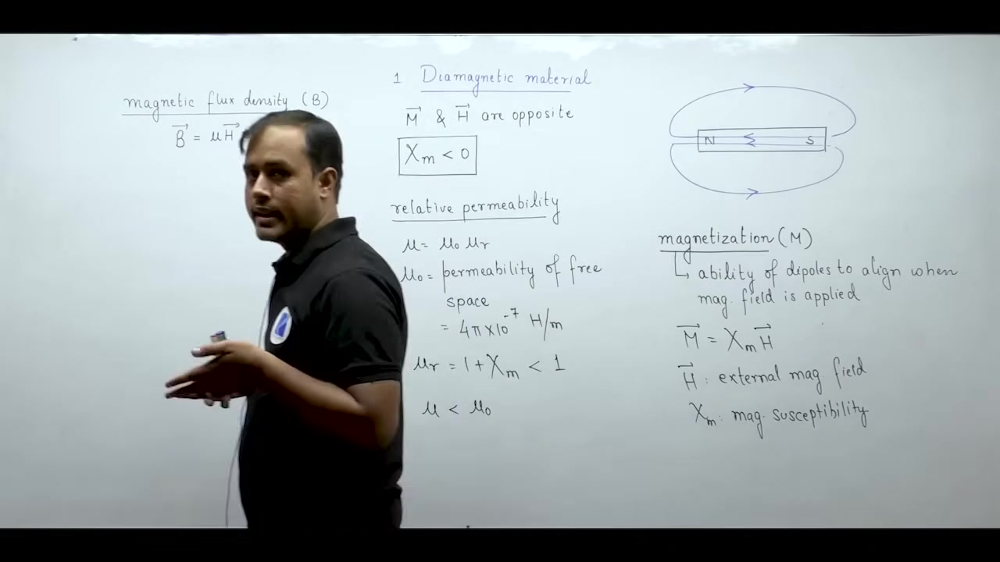
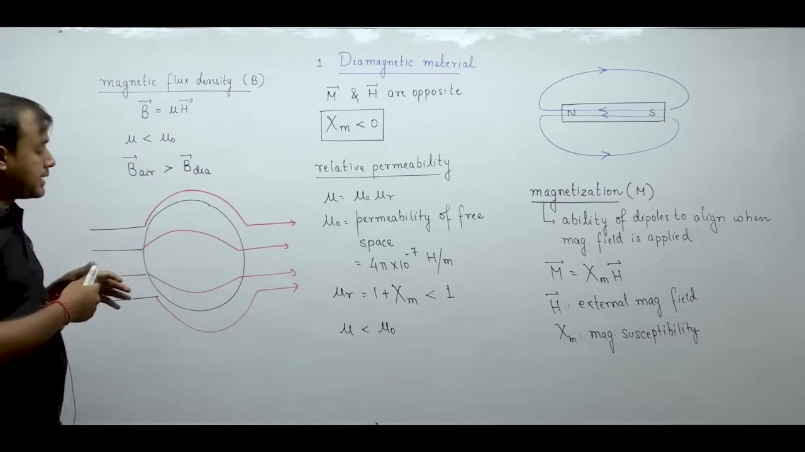

**Common Diamagnets**: Copper, Gold, Silicon, Diamond. Copper (a winding material) actually repels magnetic flux!

### Introduction to Paramagnetic Materials
> [!info] Definition: Paramagnetic Material
> A substance containing permanent atomic magnetic dipoles caused by unpaired electron spins. At rest, thermal agitation keeps them randomly oriented.

In paired orbitals, electrons spin oppositely, cancelling their magnetic moments (causing diamagnetism). In paramagnetic atoms, unpaired valence electrons create an intrinsic, uncancelled magnetic dipole moment.

## Paramagnetic Dipole Alignment and Positive Susceptibility
_(62:20 - 67:27)_

### Dipole Alignment Under an Applied Field
1. **Zero Applied Field ($H = 0$)**: Thermal energy jumbles the intrinsic dipoles. The vector sum cancels to zero macroscopic magnetization.
2. **External Field Applied ($H > 0$)**: The field exerts an aligning torque. Dipoles rotate to align *parallel* to the external field, aiding it.

### Magnetic Susceptibility and Permeability
Because the magnetization vector $\vec{M}$ points in the same direction as $\vec{H}$, susceptibility is positive.

> [!success] Result: Paramagnetic Susceptibility and Permeability
> - Susceptibility is positive ($\chi_m > 0$).
> - Relative permeability exceeds unity ($\mu_r = 1 + \chi_m > 1$).
> - Absolute permeability exceeds free space ($\mu > \mu_0$).

## Flux Concentration in Paramagnets and Comprehensive Lecture Summary
_(67:39 - 72:56)_

### Flux Concentration and Field Line Convergence
- Because $\mu > \mu_0$, internal flux density is greater than in air ($B > B_{\text{air}}$).
- Field lines pack slightly closer together (converge) as they enter a paramagnetic material.
- **Common Paramagnets**: Potassium, Molecular Oxygen, Tungsten.

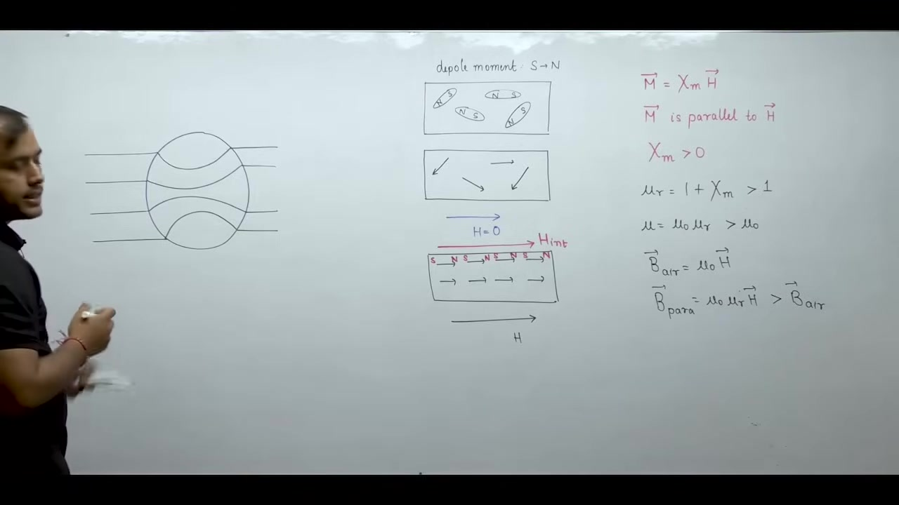
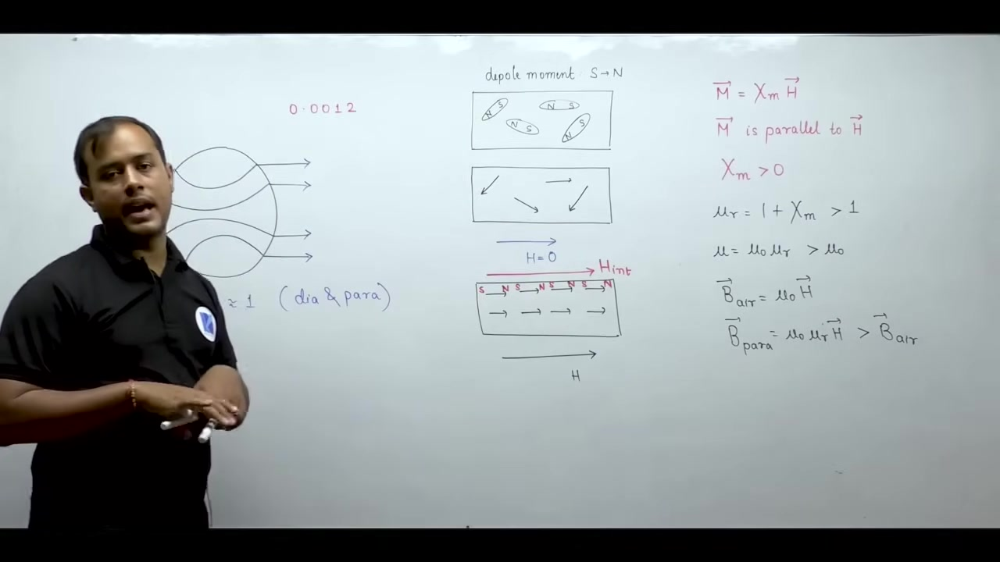

### Comparison Summary
| Property | Diamagnetic | Paramagnetic |
| :--- | :--- | :--- |
| **Permanent Dipoles** | Absent | Present (unpaired spins) |
| **Alignment** | Opposes applied field | Aligns parallel to field |
| **Susceptibility ($\chi_m$)** | Negative ($\chi_m < 0$) | Positive ($\chi_m > 0$) |
| **Rel. Permeability ($\mu_r$)** | $\mu_r \approx 0.9999$ | $\mu_r \approx 1.0001$ |
| **Field Behavior** | Lines diverge (spread out) | Lines converge (pack in) |

> [!success] Result: Core Suitability
> Because $\mu_r \approx 1$ for both, neither can act as a magnetic core. Machines require ferromagnetic materials ($\mu_r \approx 2000 - 6000$) to concentrate significant flux.

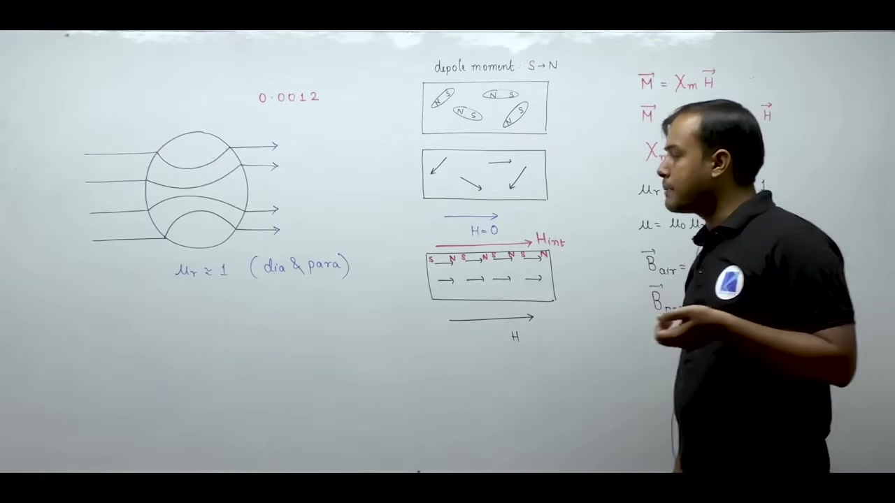

---

## Summary and Key Takeaways

- Highly conducting winding materials demand a low temperature coefficient ($\alpha$) to prevent a thermal runaway of $I^2 R$ losses.
- Hard-drawn copper is the universal winding standard due to high conductivity, high tensile strength, and corrosion resistance.
- Aluminium wire requires a 62% larger cross-sectional area ($A_{\text{Al}} \approx 1.62 A_{\text{Cu}}$) for identical resistance, forcing machines to have bulkier iron slots.
- Aluminium serves well in cage rotors, foil coils, and self-passivating non-magnetic transformer tanks (cutting stray eddy losses).
- Carbon brushes offer self-lubricating sliding contact; their negative temperature coefficient naturally yields a constant contact drop ($V_{\text{bd}} \approx 1\text{ to }2\text{ V}$) despite varying loads.
- **Diamagnetic materials** (like Copper) have no permanent dipoles, $\chi_m < 0$, $\mu_r < 1$, and slightly repel/diverge magnetic field lines.
- **Paramagnetic materials** possess unpaired-spin dipoles, $\chi_m > 0$, $\mu_r > 1$, and slightly attract/converge magnetic field lines.
- Neither diamagnets nor paramagnets have high enough permeability to serve as machine cores.

---

[← Lec 001: Introduction to Electrical Machines](Lecture_001_Introduction_to_Electrical_Machines.md) | [🏠 Index](00_yt_study_guide.md) | [Lec 003: Electrical Materials 2 →](Lecture_003_Electrical_Materials_2.md)
