[← Lec 002: Electrical Materials](Lecture_002_Electrical_Materials.md) | [🏠 Index](00_yt_study_guide.md) | [Lec 004: Laws of Electromagnetism 1 →](Lecture_004_Laws_of_Electromagnetism_1.md)

---

# Electrical Machines | Lec 3 | Electrical Materials-2 | GATE Electrical Engineering | CRACK GATE Exam

- **Source**: https://www.youtube.com/watch?v=nTmQHHvjjlU
- **Duration**: 01:07:36
- **Compiled**: 2026-09-16

---

## Overview

This lecture examines magnetic and insulating materials used in electrical machines. It explains how ferromagnetic materials amplify flux and form non-linear hysteresis loops. The discussion details magnetic domains, magnetostriction, and the selection criteria for silicon steel and high-resistivity ferrites. Finally, it explains how insulating materials prevent dielectric breakdown under strong electric fields.

## Contents

- [[#Ferromagnetic Materials and Dipole Magnetization|Ferromagnetic Materials and Dipole Magnetization]]
- [[#Flux Density Amplification and Field Line Convergence|Flux Density Amplification and Field Line Convergence]]
- [[#Hysteresis Loop, Residual Magnetism, and Coercive Force|Hysteresis Loop, Residual Magnetism, and Coercive Force]]
- [[#Domain Theory and Magnetostriction|Domain Theory and Magnetostriction]]
- [[#Transformer Hum and Ferrimagnetic Materials|Transformer Hum and Ferrimagnetic Materials]]
- [[#Ferrites and Material Selection in Machines|Ferrites and Material Selection in Machines]]
- [[#Eddy Current Losses and Soft Magnetic Materials|Eddy Current Losses and Soft Magnetic Materials]]
- [[#Hard and Soft Magnetic Materials|Hard and Soft Magnetic Materials]]
- [[#Silicon Steel and Core Rolling Methods|Silicon Steel and Core Rolling Methods]]
- [[#Silicon Content Limits and CRGO Steel|Silicon Content Limits and CRGO Steel]]
- [[#Insulating Materials and Dielectric Breakdown|Insulating Materials and Dielectric Breakdown]]
- [[#Dielectric Properties and Materials Summary|Dielectric Properties and Materials Summary]]

---

## Ferromagnetic Materials and Dipole Magnetization
_(00:12 - 05:15)_

Ferromagnetic materials provide the strong magnetic coupling required for practical power equipment.

### Atomic Basis of Ferromagnetism
> [!info] Definition: Ferromagnetic Materials
> Materials containing large numbers of unpaired electron spins that produce powerful intrinsic magnetic dipoles. In an applied magnetic field, these dipoles align strongly with the field.

- **Primary Examples**: Iron (most important), Cobalt, Nickel, Gadolinium, Dysprosium.
- Without an external field, thermal energy keeps dipoles randomized (net magnetization is zero).
- When an external field $H$ is applied, dipoles rotate and align parallel to the field, causing enormous magnetization $M$.

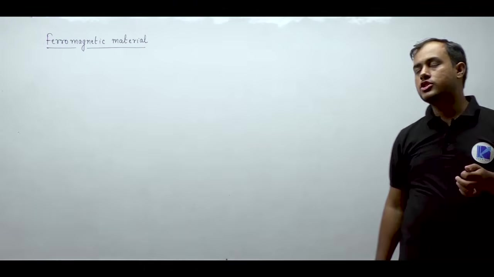

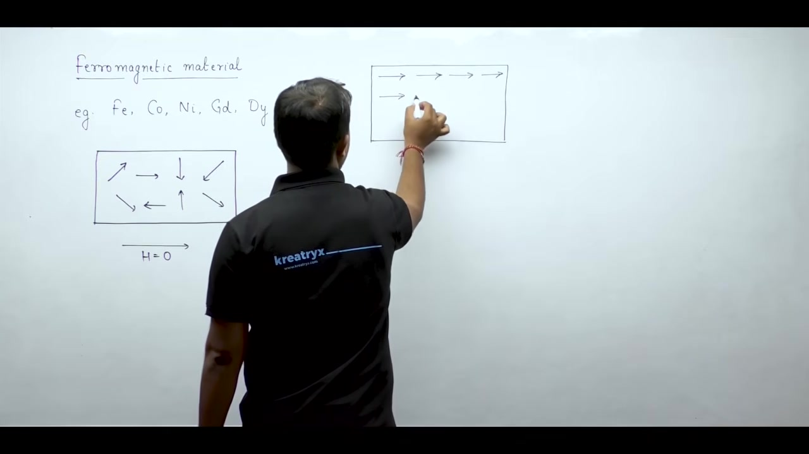

## Flux Density Amplification and Field Line Convergence
_(05:15 - 09:10)_

### Relative Permeability and Flux Density Amplification
- Magnetic susceptibility is enormous ($\chi_m \gg 0$), so relative permeability is vastly greater than unity ($\mu_r = 1 + \chi_m \gg 1$).
- Inside iron, the flux density ($B = \mu_0 \mu_r H$) is thousands of times larger than in air ($B_{\text{air}} = \mu_0 H$).
- Typical engineering iron has $\mu_r \approx 2500$ to $4000$.

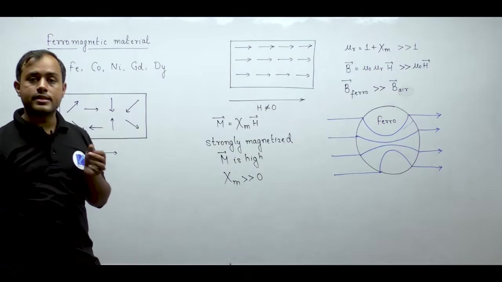

### Convergence of Magnetic Field Lines
> [!success] Result: Field Line Convergence
> Field lines traveling through air converge sharply as soon as they enter iron, concentrating where permeability is highest.

### Memory Effect
Unlike diamagnetic and paramagnetic materials, when the external field is removed, ferromagnetic dipoles remain partially locked in alignment, retaining residual magnetism.

## Hysteresis Loop, Residual Magnetism, and Coercive Force
_(09:48 - 16:58)_

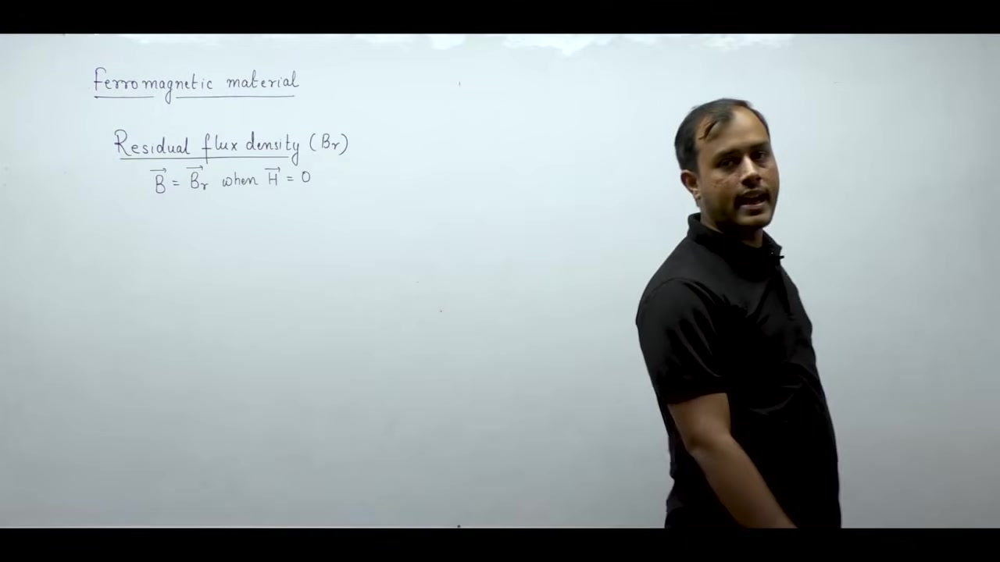

### The Virgin Curve and Saturation
- **Virgin Curve**: The initial $B-H$ curve traced by a fresh, unmagnetized sample starting from $(0, 0)$.
- **Saturation**: Increasing $H$ eventually aligns all dipoles. Further increases yield no more magnetization.

### Residual Flux Density and Coercive Force
> [!success] Result: Residual Flux Density ($B_r$)
> The magnetic flux density remaining inside the material when the applied field intensity drops to zero ($H = 0$).

> [!info] Definition: Coercive Force ($H_c$)
> The reverse magnetic field intensity required to wipe out residual magnetism and force flux density back to zero ($B = 0$).

- Cycling $H$ between positive and negative limits traces the non-linear **hysteresis loop**.

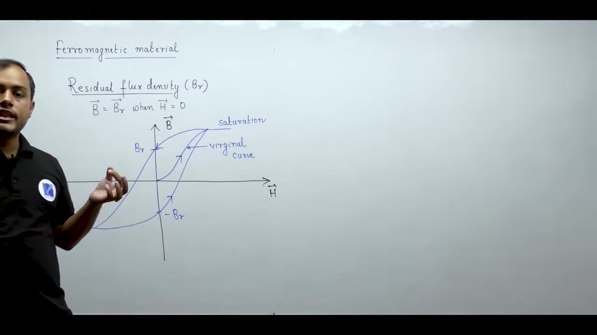

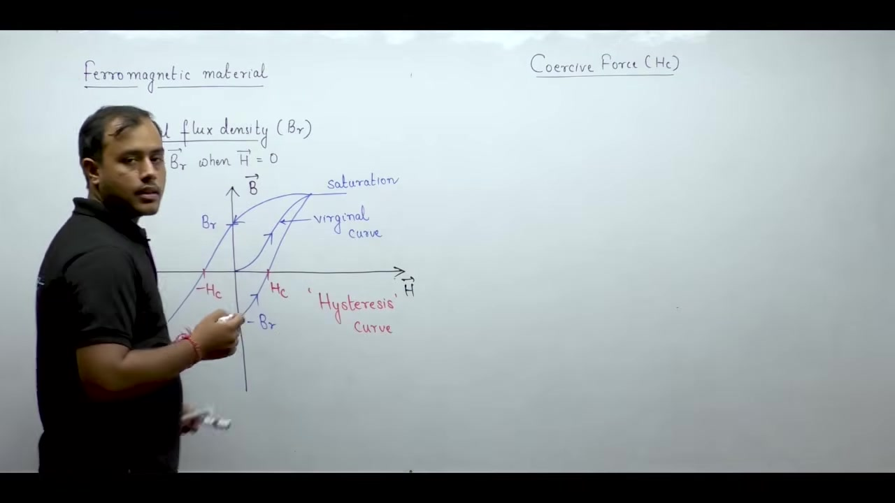

## Domain Theory and Magnetostriction
_(17:27 - 23:02)_

Why doesn't an ordinary iron nail act like a permanent magnet if it retains residual magnetism?

### Domain Theory
> [!info] Magnetic Domain
> A microscopic region where all atomic dipoles lock into identical alignment.

- An unmagnetized bulk specimen minimizes its energy by splitting into microscopic domains separated by transition layers called **Bloch walls**.
- At $H = 0$, domains point in random directions, canceling each other out ($B_{\text{net}} = 0$).
- When $H$ is applied, favorably oriented domains grow, and dipoles in other domains rotate until all merge into one single saturated direction.

### Magnetostriction
> [!info] Magnetostriction
> The slight change in physical dimensions (elongation/contraction) of a ferromagnetic material when exposed to an external magnetic field.

## Transformer Hum and Ferrimagnetic Materials
_(23:02 - 27:59)_

### Core Vibration and Transformer Hum
- Under an AC field, core dimensions cyclically expand and contract due to magnetostriction.
- This continuous mechanical vibration produces the familiar audible transformer hum.
- **Solution**: Damping mats (sand/rubber) absorb the vibrations.

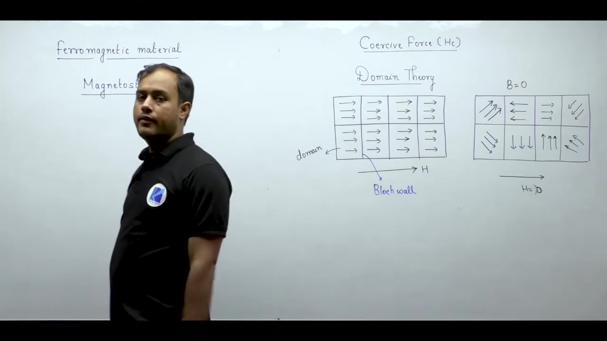

### Magnetization Characteristics Comparison
- **Paramagnetic**: Linear $B-H$ curve passing through origin.
- **Ferromagnetic**: Non-linear $B-H$ curve exhibiting saturation and hysteresis.

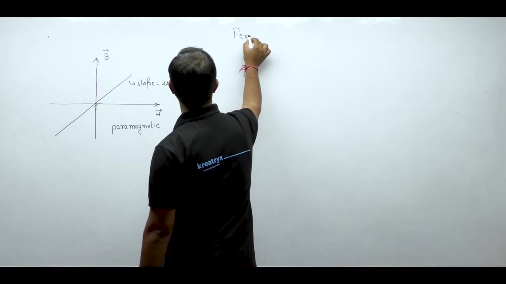

### Ferrimagnetic Materials
> [!info] Ferrimagnetic Material
> Adjacent dipoles align in opposite directions (antiparallel), but have unequal magnitudes ($|\vec{m}_{\uparrow}| > |\vec{m}_{\downarrow}|$).

- The net magnetization points along the applied field, so susceptibility is positive ($\chi_m > 0$).
- Relative permeability is lower than ferromagnetic metals ($\mu_{r, \text{ferri}} < \mu_{r, \text{ferro}}$).

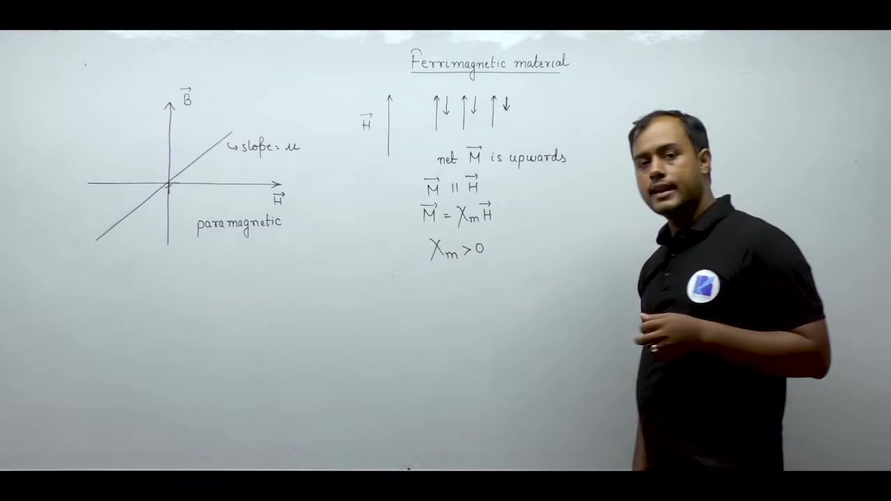

## Ferrites and Material Selection in Machines
_(27:59 - 32:46)_

### Ferrites (Ceramics)
- **Structure**: Metal ions (manganese/nickel) substituted into iron oxides.
- **Resistivity**: Extremely high electrical resistivity ($\rho_{\text{ferri}} \gg \rho_{\text{ferro}}$). They resist electric current, unlike conductive iron.

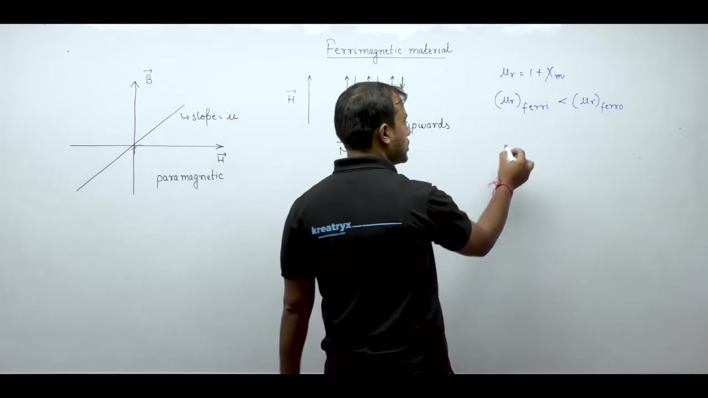

### Core Material Selection
- **Power Frequency Machines (Low Frequency, High Power)**: Need high flux density ($B$) to keep core area ($A = \Phi/B$) compact. Ferromagnetic silicon steel is used.
- **High Frequency Applications (Low Power)**: High frequency induces massive eddy currents. Ferrites are used because their high electrical resistivity chokes off these currents, despite having lower flux density capabilities.

## Eddy Current Losses and Soft Magnetic Materials
_(32:51 - 38:17)_

### Frequency Effects and Eddy Current Loss
- Alternating magnetic flux induces circulating (eddy) currents in conductive cores.
- **Power Loss**: $P_e \propto \frac{f^2 B_m^2}{\rho}$
- Eddy current loss grows with the square of frequency. High resistivity ($\rho$) limits this loss.

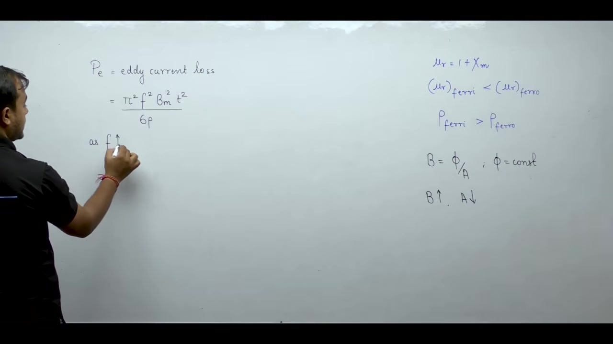

### Soft Magnetic Materials
> [!info] Soft Magnetic Material
> A material that is easy to magnetize and demagnetize. It has nothing to do with physical texture.

- Reverses polarity smoothly with low energy loss under AC excitation.
- Ideal for electromagnets, transformers, and machine stators/rotors.

## Hard and Soft Magnetic Materials
_(38:22 - 43:46)_

### Hard Magnetic Materials
> [!info] Hard Magnetic Material
> A material difficult to magnetize and difficult to demagnetize (retains strong magnetism).

- Used for permanent magnets (e.g., in PMDC toy motors).

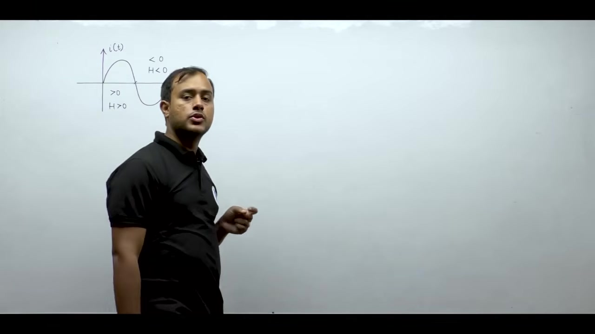

### Hysteresis Loop Comparison
- **Soft Materials**: Narrow loop, small coercive force ($H_c$). Low cyclic hysteresis loss.
- **Hard Materials**: Broad/wide loop, large coercive force ($H_c$). Resists demagnetization.

### Non-Oriented Sheet Steel
- Machine cores use thin sheets rather than solid blocks to cut eddy currents.
- In **non-oriented** steel, crystalline grains point randomly, giving uniform magnetic properties in all directions.

## Silicon Steel and Core Rolling Methods
_(43:46 - 48:18)_

### Benefits of Adding Silicon
Early pure-iron cores suffered "magnetic aging" (widening hysteresis loop over time). Alloying iron with silicon (0.3% to 4.5%) provides two benefits:
1. **Narrows Hysteresis Loop**: Cuts cyclic hysteresis energy loss.
2. **Raises Electrical Resistivity ($\rho$)**: Chokes off eddy currents, lowering eddy current loss ($P_e \propto 1/\rho$).

### Hot vs. Cold Rolling
- **Hot Rolling**: Rolled at high temps. Metal stays soft, grains reform uniformly without severe stress.
- **Cold Rolling**: Rolled at room temp under immense pressure. Deforms grains and induces internal strain, requiring specialized treatment to restore properties.

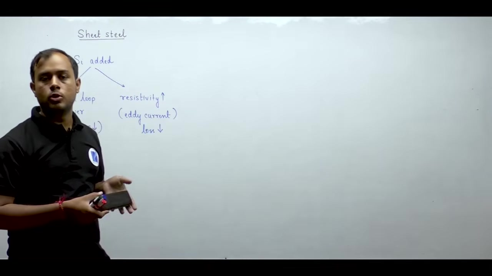

## Silicon Content Limits and CRGO Steel
_(48:21 - 54:57)_

### Silicon Content Limits
- **Large Power Transformers**: High efficiency needed. Uses ~4.5% silicon (transformer-grade steel).
- **Small Motors**: Cost matters more than efficiency. Uses ~0.3% silicon.
- **The Limit**: Above 4.5% silicon, the steel becomes too brittle and shatters when punched into laminations.

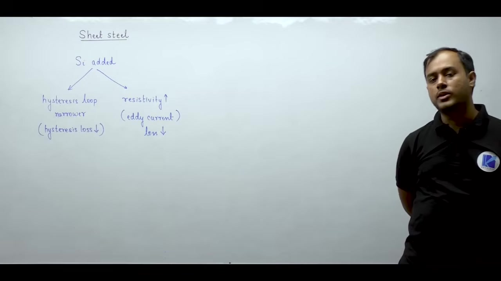
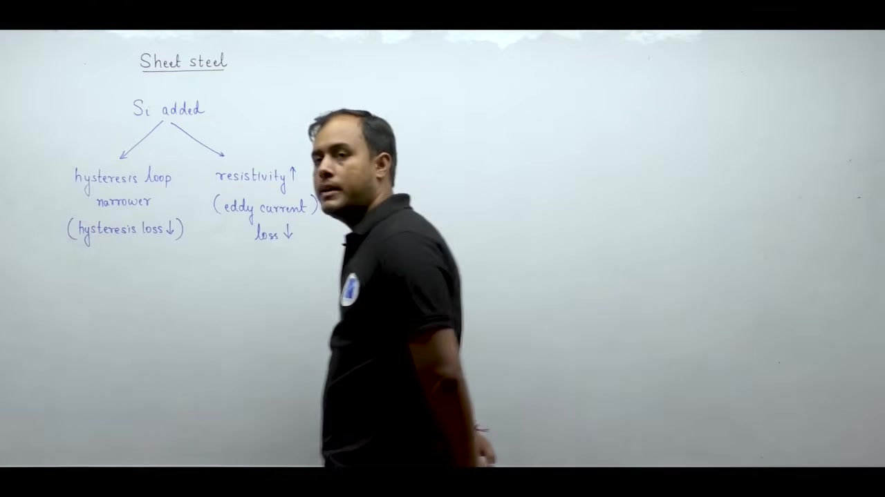

### Cold-Rolled Grain-Oriented (CRGO) Steel
> [!info] CRGO Steel
> Silicon steel cold-rolled through a heat-treatment cycle that aligns crystal grains parallel to the rolling direction, creating highly directional (anisotropic) permeability. ($\mu_{\text{rolling}} \gg \mu_{\text{transverse}}$)

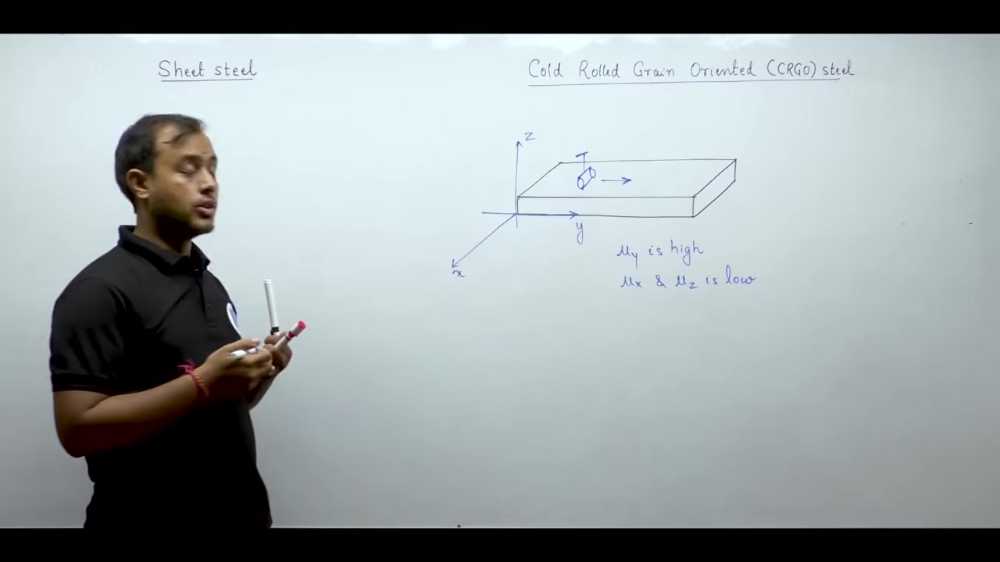

### CRGO Applications
- **Transformers**: Flux travels in straight lines along rectangular limbs. CRGO steel is perfect here.
- **Rotating Machines**: Flux vectors rotate radially/circumferentially through 360°. Since CRGO is only highly permeable in one axis, it is useless here. Rotating machines use non-oriented steel.

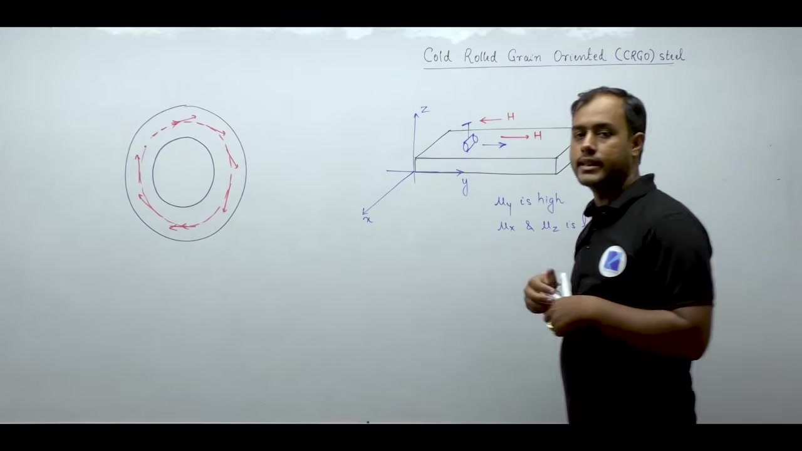

## Insulating Materials and Dielectric Breakdown
_(54:57 - 60:50)_

Insulators separate live conductors from grounded frames (e.g., winding enamel, transformer bushings).

### Electric Dipoles in Dielectrics
- A dielectric consists of bound charge pairs (electric dipoles) where opposite charges are locked together by Coulomb attraction.
- Dipole moment vector: $\vec{p} = q \vec{d}$.

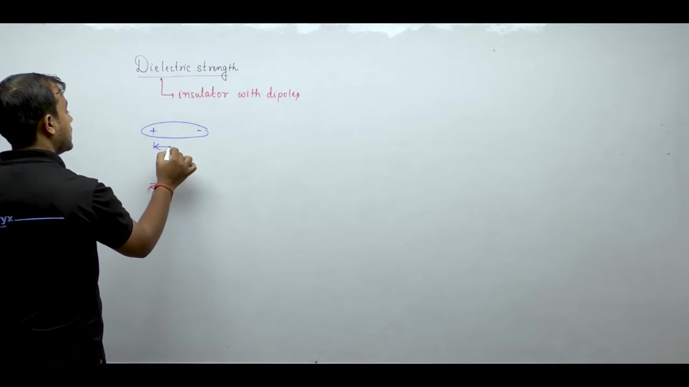

### Dielectric Breakdown
When an external electric field $\vec{E}$ is applied, it pulls positive charges one way and negative charges the other.
> [!info] Dielectric Breakdown
> Occurs when the external electric field overpowers the internal Coulomb attraction, tearing the dipole apart into free mobile charges. The material instantly transitions into an electrical conductor.

## Dielectric Properties and Materials Summary
_(60:50 - 67:28)_

### Dielectric Strength
> [!info] Dielectric Strength
> The threshold electric field intensity (typically in $\text{kV/mm}$) at which dielectric breakdown occurs.

### Essential Properties of Electrical Insulators
1. **Low Dielectric Hysteresis**: Prevents internal heat buildup from alternating field polarization.
2. **High Thermal Conductivity**: Conducts ohmic winding heat outward to cooling systems.
3. **High Thermal Stability**: Withstands continuous hot operating temperatures.
4. **Non-Hygroscopic**: Must never absorb moisture, as water conducts electricity and causes breakdown.
5. **Corrosion Resistance**: Stable against hot oil and atmospheric contaminants.

---

## Summary and Key Takeaways

- **Ferromagnetic Materials**: High relative permeability ($\mu_r \gg 1$) concentrates flux lines, producing enormous flux density. Dipole locking creates non-linear $B-H$ hysteresis loops.
- **Domains & Magnetostriction**: Randomly oriented domains keep bulk iron unmagnetized at rest. Field-induced dimensional changes (magnetostriction) cause transformer hum.
- **Ferrites (Ferrimagnetic)**: Opposing but unequal dipoles. High electrical resistivity suppresses high-frequency eddy currents ($P_e \propto f^2 B_m^2 / \rho$), making them ideal for RF transformers despite lower flux capacity.
- **Silicon Steel**: Adding silicon (up to 4.5% max before brittleness) narrows hysteresis loops and raises resistivity to cut core losses in low-frequency power machines.
- **CRGO Steel**: Crystal grains are aligned to the rolling direction, giving massive permeability in one axis. Perfect for straight transformer limbs; useless for rotating machines (which use non-oriented steel).
- **Dielectric Breakdown**: Occurs when an external electric field exceeds the insulator's dielectric strength, tearing bound atomic dipoles apart into free conductive charges.

---

[← Lec 002: Electrical Materials](Lecture_002_Electrical_Materials.md) | [🏠 Index](00_yt_study_guide.md) | [Lec 004: Laws of Electromagnetism 1 →](Lecture_004_Laws_of_Electromagnetism_1.md)
