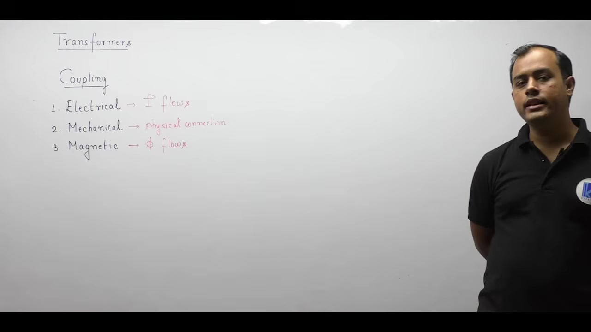
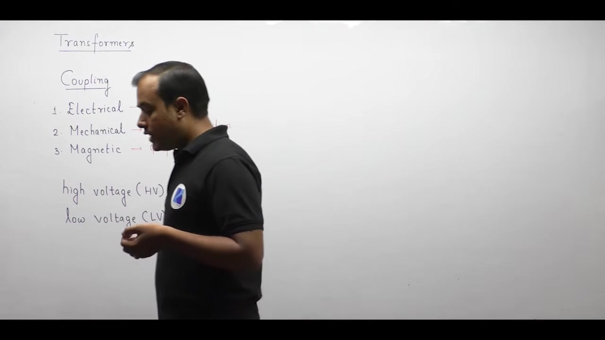
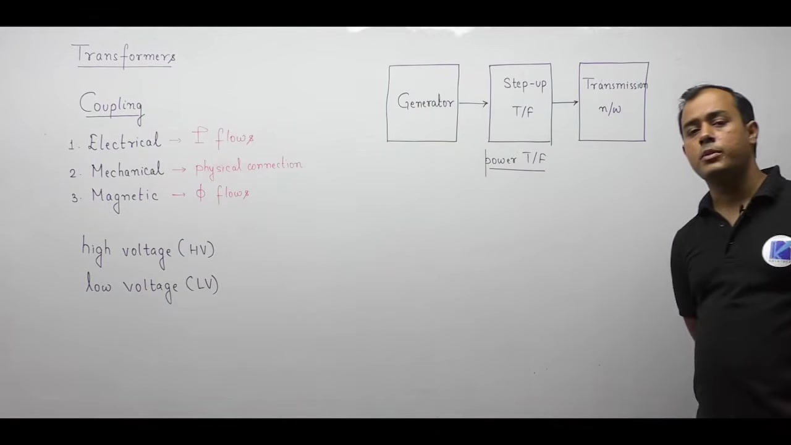
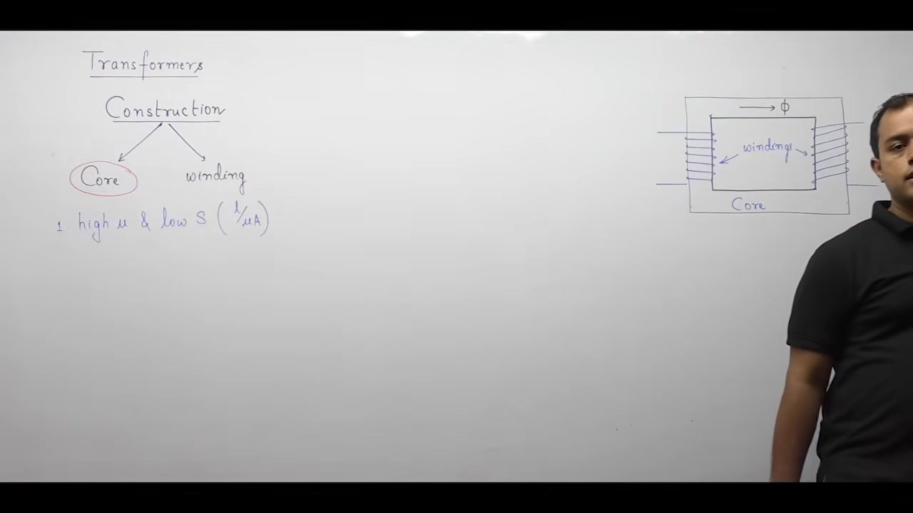
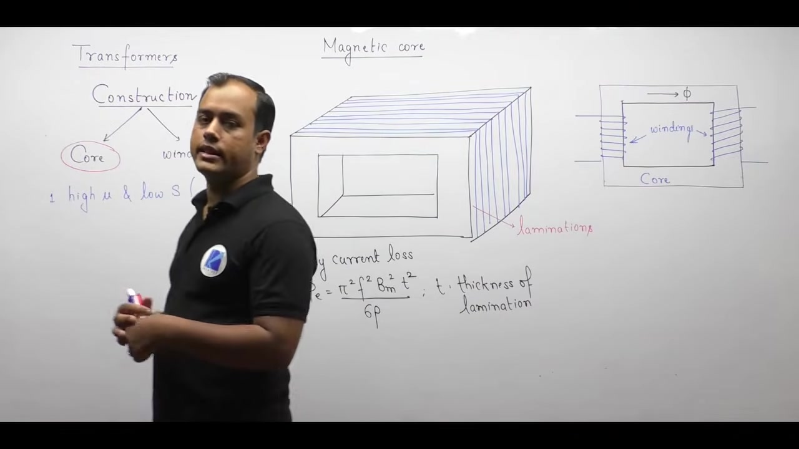
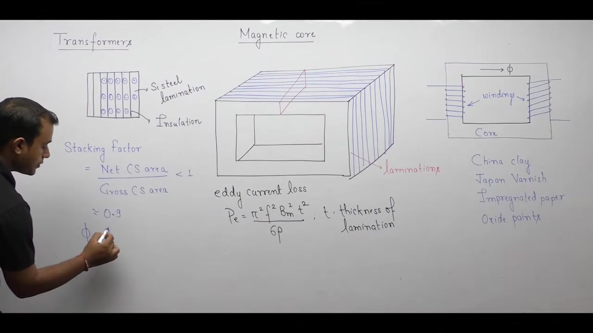
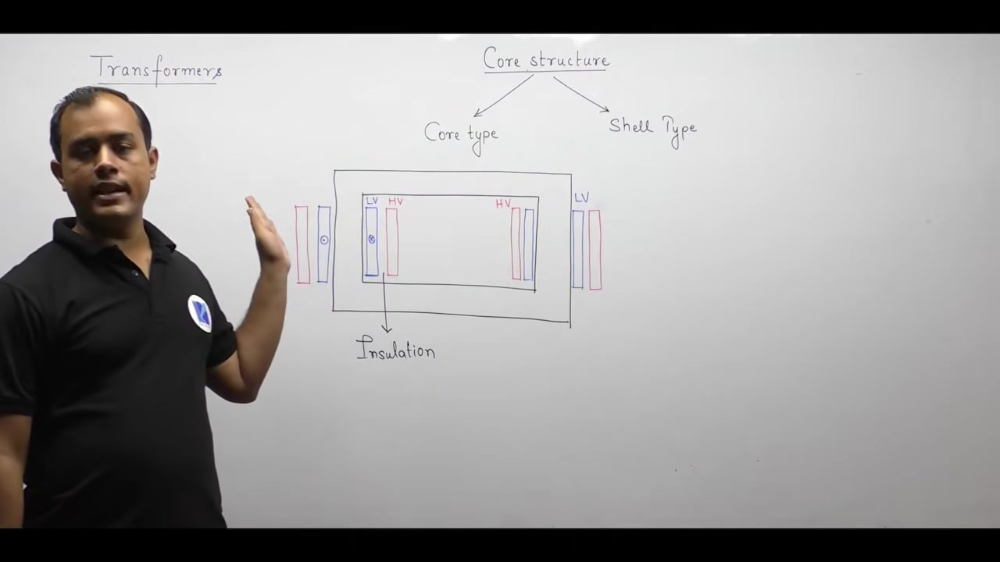
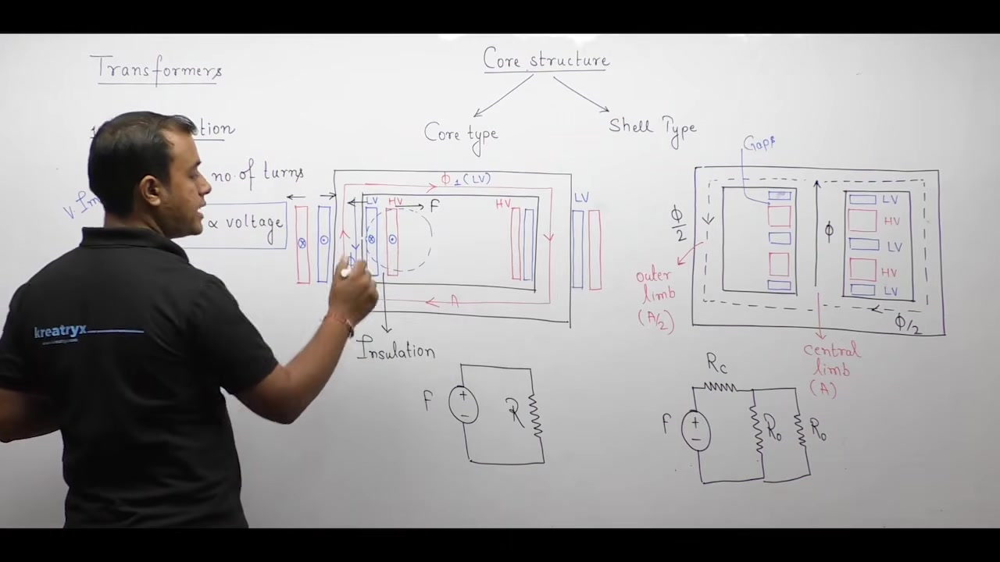
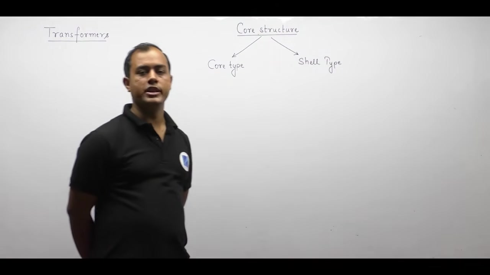

[← Lec 010: Problems Based on Per Unit Systems](Lecture_010_Problems_Based_on_Per_Unit_Systems.md) | [🏠 Index](00_yt_study_guide.md) | [Lec 012: Transformer Construction Part 2 →](Lecture_012_Transformer_Construction_Part_2.md)

---

# Transformer Construction - 1 | Electrical Machines | Lec 8 | | GATE & ESE | Ankit Goyal

- **Source**: https://www.youtube.com/watch?v=n1r4cOF2zW4
- **Duration**: 01:14:32
- **Compiled**: 2026-09-19

---

## Overview

This lecture introduces the fundamental principles and physical construction of the single-phase transformer. It explains how energy transfers between isolated circuits via magnetic flux at constant frequency. The lecture covers core material selection, showing why cold rolled grain oriented (CRGO) silicon steel minimizes losses. It derives mathematical relationships for eddy current loss and stacking factor in laminated cores. Finally, it contrasts core-type and shell-type geometries across mechanical, magnetic, thermal, and economic criteria.

## Contents

- [[#Introduction to Transformers and Types of Coupling|Introduction to Transformers and Types of Coupling]]
- [[#Operational Terminology and Power System Applications|Operational Terminology and Power System Applications]]
- [[#Applications in Electronics and Comparison with Amplifiers|Applications in Electronics and Comparison with Amplifiers]]
- [[#Transformer Construction: Core, Windings, and Insulation|Transformer Construction: Core, Windings, and Insulation]]
- [[#Core Materials and CRGO Silicon Steel|Core Materials and CRGO Silicon Steel]]
- [[#Core Laminations and Eddy Current Mitigation|Core Laminations and Eddy Current Mitigation]]
- [[#Stacking Factor and High-Frequency Core Materials|Stacking Factor and High-Frequency Core Materials]]
- [[#Core-Type versus Shell-Type Geometries and Winding Arrangements|Core-Type versus Shell-Type Geometries and Winding Arrangements]]
- [[#Magnetic Circuit Equivalence and Structural Comparison|Magnetic Circuit Equivalence and Structural Comparison]]
- [[#Insulation Design and Mechanical Repulsive Forces|Insulation Design and Mechanical Repulsive Forces]]
- [[#Mechanical Protection, Leakage Flux, and Ease of Repair|Mechanical Protection, Leakage Flux, and Ease of Repair]]
- [[#Cooling Mechanisms and Application Domains|Cooling Mechanisms and Application Domains]]
- [[#Comprehensive Comparison of Core-Type and Shell-Type Transformers|Comprehensive Comparison of Core-Type and Shell-Type Transformers]]

---

## Introduction to Transformers and Types of Coupling
_(00:12 - 10:03)_

### Definition of a Transformer
> [!info] Definition: Transformer
> A static electromagnetic device that transfers electrical energy from a source to a load. It changes voltage and current levels while keeping electrical frequency strictly constant.

- Transformers exhibit the highest efficiency among all electrical machines because they lack moving parts, eliminating friction and windage losses.

### Primary and Secondary Windings
- **Primary Winding:** Connects directly to the AC power source.
- **Secondary Winding:** Connects to the electrical load.
- Energy transfers via **magnetic coupling**—there is no direct electrical contact between primary and secondary.

### HV and LV Classifications
- **High Voltage (HV) Winding:** Has more turns, handles higher voltage, carries lower current.
- **Low Voltage (LV) Winding:** Has fewer turns, handles lower voltage, carries higher current.

## Operational Terminology and Power System Applications
_(10:03 - 16:10)_

### Primary/Secondary vs. HV/LV
- **HV/LV** is fixed by design (number of turns).
- **Primary/Secondary** depends entirely on how the transformer is connected in a circuit.

### Power System Applications
1. **Generating Station (Step-Up):** Steps up generation voltage ($11\text{ kV}$) to transmission grid levels ($400\text{ kV}$) to reduce current, drastically cutting $I^2 R$ transmission losses.
2. **Load Center (Step-Down):** Steps down high voltage to safe utilization values for consumers ($400\text{ V}$ / $230\text{ V}$).

## Applications in Electronics and Comparison with Amplifiers
_(16:14 - 22:50)_

### Electronics Applications
- **Impedance Matching:** Reflects impedance by the square of the turns ratio ($Z_L = Z_{th}^*$) to ensure maximum power transfer without lossy resistors.
- **Galvanic Isolation:** A 1:1 unity transformer provides safety and protects control circuits from power circuit voltage spikes since there is no conductive path.

### Transformer vs. Amplifier
> [!info] Conceptual Comparison
> An **amplifier** is an active device that increases total signal power by drawing from an external DC supply. A **transformer** is a passive device. By conservation of energy, $V_1 I_1 \approx V_2 I_2$. It cannot amplify power.

## Transformer Construction: Core, Windings, and Insulation
_(22:50 - 28:06)_

### Core Components
1. **Magnetic Core:** Ferromagnetic loop providing a low-reluctance path for mutual flux.
2. **Windings:** Insulated copper/aluminum coils linking the flux.

> [!info] Fundamental Construction Rule
> Both windings must be wrapped around the core but electrically insulated from the core and each other to prevent shorts and fatal shock hazards.

## Core Materials and CRGO Silicon Steel
_(28:06 - 32:45)_

### Desirable Properties
- **High Permeability ($\mu$):** Allows flux to pass easily.
- **Low Reluctance ($\mathcal{S} = l/\mu A$):** Minimizes the magnetizing current drawn from the supply.

### CRGO Silicon Steel
> [!success] Core Material Summary
> Power transformers use Cold Rolled Grain Oriented (CRGO) silicon steel because rolling aligns the magnetic grains, delivering exceptionally high permeability and very low hysteresis loss along the rolling direction.

## Core Laminations and Eddy Current Mitigation
_(32:50 - 40:37)_

### Why Laminate?
A solid steel block would suffer massive circulating eddy currents, causing dangerous heating. The core is built from thin sheets ($0.27\text{ mm}$ - $0.35\text{ mm}$ thick) to break the current paths.

### Eddy Current Loss Equation
> [!success] Dependence on Lamination Thickness
> Eddy current power loss is proportional to the square of thickness ($P_e \propto t^2$).
> $$P_e = \frac{\pi^2 f^2 B_m^2 t^2}{6 \rho}$$

- **Practical Limit**: Making sheets too thin destroys mechanical rigidity, raises manufacturing costs, and introduces microscopic air gaps that increase magnetic reluctance.
- **Inter-Lamination Insulation**: Bare sheets provide no benefit. Laminations must be coated with insulation (e.g., varnish, oxide) to effectively break eddy current loops.

## Stacking Factor and High-Frequency Core Materials
_(40:38 - 45:55)_

### Stacking Factor
> [!info] Definition: Stacking Factor ($k_s$)
> The ratio of net magnetic iron area ($A_n$) to gross physical core area ($A_g$).
> $$k_s = \frac{A_n}{A_g} \approx 0.9$$

Because inter-lamination insulation occupies volume and carries zero flux, magnetic flux must be calculated using the net area:
$$\Phi = B \cdot A_n = B \cdot (k_s A_g)$$

### High-Frequency Transformer Cores
- At high frequencies (kHz range), $P_e \propto f^2$ causes silicon steel to overheat instantly.
- High-frequency transformers use **ferrimagnetic materials (ferrites)** due to their extreme electrical resistivity, which naturally chokes eddy currents.

## Core-Type versus Shell-Type Geometries and Winding Arrangements
_(46:01 - 50:44)_

### Core-Type Geometry (Concentric Windings)
- 2 limbs, 1 window. Windings surround the core.
- **Concentric Layout**: Insulation $\rightarrow$ LV winding $\rightarrow$ Insulation $\rightarrow$ HV winding.
- LV sits closest to the core to minimize insulation thickness requirements.
- Turns are divided equally across both limbs (half LV and half HV on each limb).

### Shell-Type Geometry (Sandwich Windings)
- 3 limbs, 2 windows. Core surrounds the windings.
- All windings sit on the central limb. Outer limbs provide return paths for $\Phi/2$.
- **Sandwich / Interleaved Layout**: Flat pancake discs stack vertically: LV $\rightarrow$ HV $\rightarrow$ LV $\rightarrow$ HV. The outermost top/bottom discs are always half-sized LV coils to save insulation.

## Magnetic Circuit Equivalence and Structural Comparison
_(50:48 - 55:46)_

### Core-Type: Series Circuit
- Constant flux $\Phi$ circulates through the entire loop.
- $\mathcal{F} = \Phi \cdot \mathcal{R}_{\text{total}}$.

### Shell-Type: Parallel Circuit
- Central limb carries total flux $\Phi$. Outer limbs carry $\Phi/2$.
- Outer limbs have half the cross-sectional area ($A/2$) to keep flux density $B$ uniform.
> [!success] Equivalent Reluctance
> $$\mathcal{R}_{\text{eq}} = R_c + \frac{R_o}{2}$$

## Insulation Design and Mechanical Repulsive Forces
_(55:47 - 60:51)_

### Insulation Economy in Core-Type
- Voltage is proportional to turns ($V \propto N$).
- Insulation thickness is proportional to voltage ($d \propto V$).
- Because a core-type transformer splits total turns across two limbs, the voltage per limb is halved ($V/2$). This results in substantial insulation savings for high-voltage applications.

### Mechanical Repulsive Forces
- By Lenz's law, primary and secondary currents flow in opposite directions, causing powerful radial repulsive forces ($F \propto I_1 I_2$).
- Inner LV pushes inward against the core; outer HV pushes outward.
- During short-circuit faults, currents spike 10x–20x, causing mechanical forces to multiply by 100x–400x, threatening to rip the coils apart.

## Mechanical Protection, Leakage Flux, and Ease of Repair
_(60:51 - 66:14)_

### Shell-Type Mechanical Advantage
- In **shell-type**, the heavy outer steel limbs act as rigid shields, providing natural bracing against short-circuit forces.
- **Core-type** coils sit on the outside and require heavy external clamping to prevent distortion.

### Leakage Flux
> [!info] Definition: Leakage Flux
> Flux that links only one winding, creating an inductive voltage drop (leakage reactance).

- **Core-Type**: High leakage flux because HV is far from the core.
- **Shell-Type**: Low leakage flux because the interleaved pancake discs are tightly coupled.

### Ease of Repair
- **Core-Type**: Coils are exposed. Easy to inspect and rewind.
- **Shell-Type**: Coils are buried inside the core. Requires total lamination disassembly to fix.

## Cooling Mechanisms and Application Domains
_(66:15 - 72:09)_

### Cooling Behavior
- **Core-Type**: Superior winding cooling (coils radiate heat directly to surrounding oil). Harder to cool the central core.
- **Shell-Type**: Superior core cooling (steel is on the outside). Harder to cool the buried windings.

### Application Domains
> [!success] Application Rule
> **Core-Type** is preferred for **High Voltage and High Power** (easier cooling, less insulation needed). **Shell-Type** is preferred for **Low Voltage and Low Power** where mechanical rigidity/compactness is the main concern.

## Comprehensive Comparison of Core-Type and Shell-Type Transformers
_(72:12 - 74:24)_

| Design Parameter | Core-Type | Shell-Type |
| :--- | :--- | :--- |
| **Physical Layout** | Windings surround the core. | Core surrounds the windings. |
| **Limbs / Windows** | 2 limbs, 1 window. | 3 limbs, 2 windows. |
| **Magnetic Circuit** | Series (constant $\Phi$). | Parallel ($\Phi / 2$ in outer limbs). |
| **Mechanical Support**| Poor (requires clamps). | Excellent (braced by outer steel). |
| **Leakage Flux** | Higher leakage flux/reactance. | Lower leakage flux. |
| **Ease of Repair** | Easy (exposed windings). | Difficult (buried windings). |
| **Cooling** | Superior winding cooling. | Superior core cooling. |
| **Insulation Req.** | Lower (voltage halved per limb).| Higher (full voltage on center limb). |
| **Copper Weight** | Higher (concentric mean length).| Lower (sandwich discs). |
| **Applications** | **High Voltage / High Power** | **Low Voltage / Low Power** |

---

## Summary and Key Takeaways

- A transformer transfers AC energy via mutual magnetic coupling without altering frequency. It cannot amplify total signal power.
- Power transformers use **CRGO silicon steel** to maximize permeability and minimize hysteresis losses along the rolling direction.
- Eddy current loss ($P_e \propto t^2$) is mitigated by building the core from thin ($0.35\text{ mm}$), insulated steel laminations.
- Net magnetic iron area must be calculated using the stacking factor: $\Phi = B \cdot (k_s A_g)$.
- **Core-type** transformers divide concentric LV/HV windings across two limbs, creating a series magnetic circuit that halves voltage insulation stress and cools coils effectively.
- **Shell-type** transformers sandwich flat interleaved coils on a single central limb with two outer flux return paths ($\Phi/2$), offering superior mechanical bracing but difficult repairability.

---

[← Lec 010: Problems Based on Per Unit Systems](Lecture_010_Problems_Based_on_Per_Unit_Systems.md) | [🏠 Index](00_yt_study_guide.md) | [Lec 012: Transformer Construction Part 2 →](Lecture_012_Transformer_Construction_Part_2.md)
