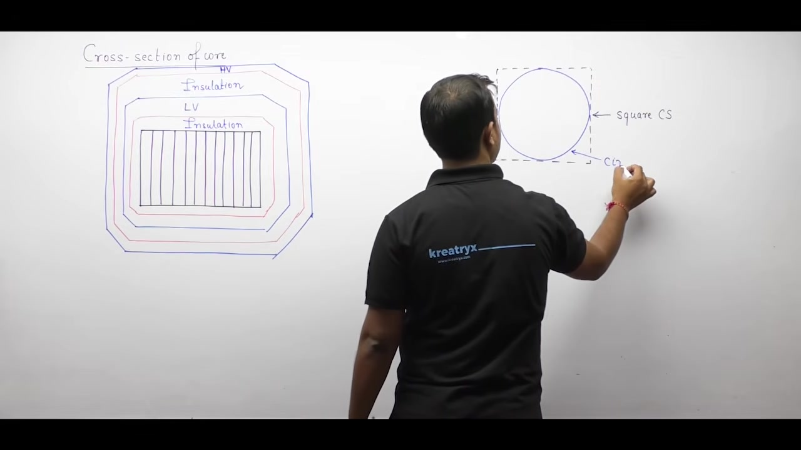
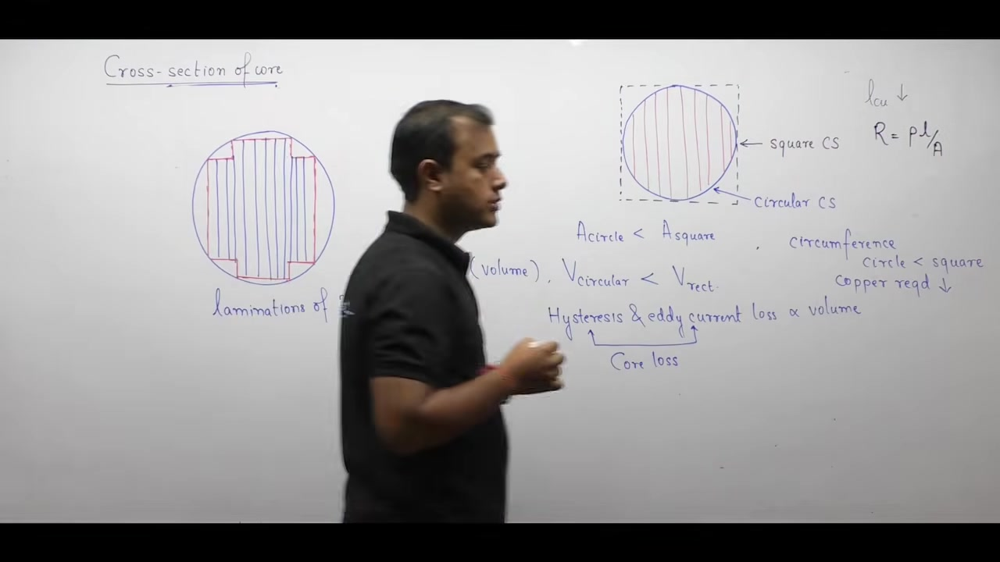
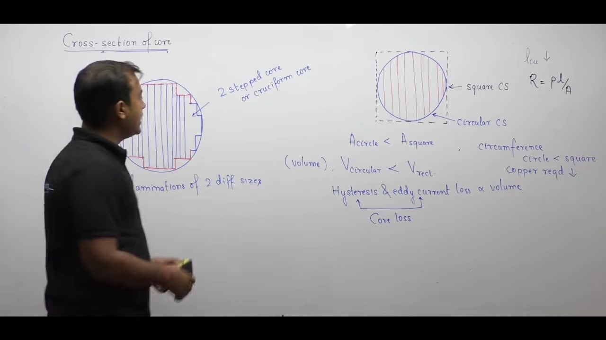
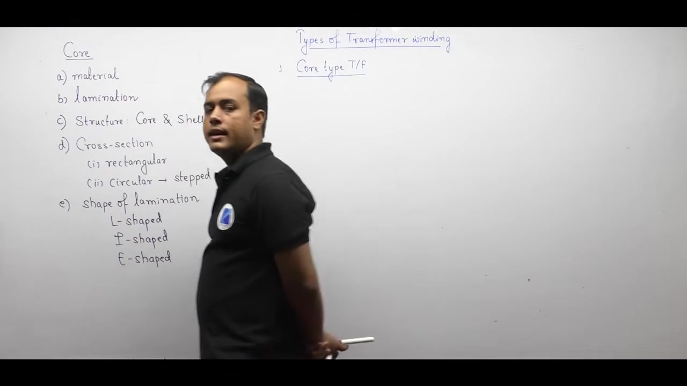
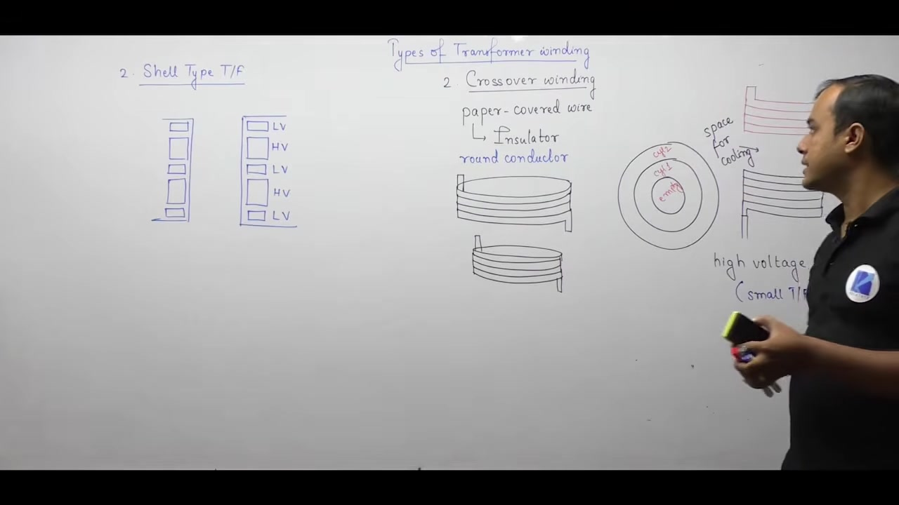
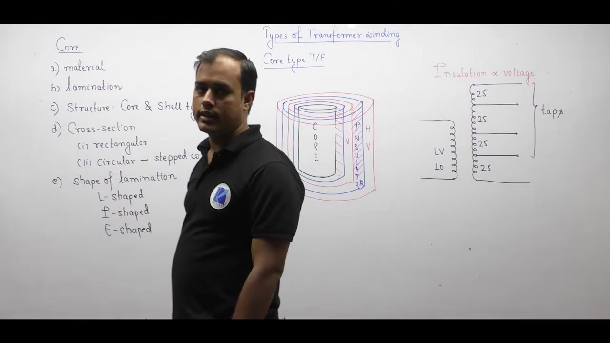

[← Lec 011: Transformer Construction 1](Lecture_011_Transformer_Construction_1.md) | [🏠 Index](00_yt_study_guide.md) | [Lec 013: Problems based on Transformer Construction and Working →](Lecture_013_Problems_based_on_Transformer_Construction_and_Working.md)

---

# Electrical Machines | Lec 9 | Transformer Construction (Part 2) | GATE Electrical Engineering

- **Source**: https://www.youtube.com/watch?v=3zpzzpEH940
- **Duration**: 01:07:28
- **Compiled**: 2026-09-19

---

## Overview

This lecture examines the physical construction and geometric design of power and distribution transformers. It covers the optimization of core cross-sections from simple rectangular profiles to multi-stepped cruciform shapes to minimize copper losses. The discussion details concentric and sandwich winding arrangements, explaining the technical rationale for winding placement and tap connections. Finally, it introduces essential auxiliary components: dielectric oil, insulating bushings, conservator tanks, and silica gel breathers.

## Contents

- [[#Transformer Core Cross-Section: Rectangular vs. Circular Geometries|Transformer Core Cross-Section: Rectangular vs. Circular Geometries]]
- [[#Stepped Cores and the Cruciform Core Approximation|Stepped Cores and the Cruciform Core Approximation]]
- [[#Lamination Shapes and Staggered Butt Joints|Lamination Shapes and Staggered Butt Joints]]
- [[#Concentric Windings and Placement Rationale|Concentric Windings and Placement Rationale]]
- [[#Helical, Crossover, and Disc-Type Windings|Helical, Crossover, and Disc-Type Windings]]
- [[#Shell-Type Sandwich Windings and Tap Connections|Shell-Type Sandwich Windings and Tap Connections]]
- [[#Transformer Oil, Bushings, and Breathing Mechanism|Transformer Oil, Bushings, and Breathing Mechanism]]
- [[#Silica Gel Breathers and Conservator Tanks|Silica Gel Breathers and Conservator Tanks]]

---

## Transformer Core Cross-Section: Rectangular vs. Circular Geometries
_(00:12 - 11:26)_

### Rectangular Cross-Section
- Small, low-power transformers use a rectangular or square core.
- Easy and cheap to manufacture from silicon steel strips with zero scrap, but uses copper inefficiently.

### Why Circular Geometries are Preferred in Large Transformers
> [!info] Core Geometry Selection
> Large transformers require circular core geometry to minimize winding perimeter, copper loss, and conductor weight.

- **Lower Core Volume/Losses**: A circle encloses less area than a circumscribing square. Less volume reduces total hysteresis and eddy current loss ($P_c \propto V_{\text{core}}$).
- **Lower Copper Requirement**: A circle has the minimum possible perimeter. Shorter mean turn length reduces total copper weight and winding resistance ($R = \rho l / A_c$).
- **Lower Copper Loss**: Lower resistance directly cuts $I^2 R$ heat dissipation, boosting efficiency.

## Stepped Cores and the Cruciform Core Approximation
_(11:29 - 17:58)_

### Manufacturing Challenges
- A purely circular core requires thousands of laminations, all with different widths. Stamping this requires multiple dies and huge labor costs.

### The Cruciform Approximation
> [!info] Cruciform Core Definition
> A two-stepped core utilizing laminations of only two distinct widths. It roughly approximates a circle while keeping die and assembly costs reasonable.

- **Multi-Step Cores**: Adding more steps (e.g., 3, 4, 6 steps) approximates a circle more closely.
- **Trade-off**: More steps mean less copper loss and material weight, but higher stamping/assembly costs. Large power transformers use multi-step cores because copper savings justify the manufacturing expense.

## Lamination Shapes and Staggered Butt Joints
_(17:58 - 28:51)_

### Standard Shapes
- Cores are assembled from flat strips (L-shaped, I-shaped, or E-shaped for shell-type).
- Coils are pre-wound on rigid insulating cylinders first. The steel laminations are then threaded through the hollow coil opening to build the core limb.

### Staggered Butt Joints
Whenever steel edges butt together, microscopic air gaps form, increasing magnetic reluctance ($\mathcal{R}_g$).
> [!info] Principle of Staggered Joints
> Alternating odd/even lamination layers invert their joint locations. This prevents continuous air gaps from forming completely through the core. Flux simply bypasses the joint by diving into the solid sheets above and below it.

## Concentric Windings and Placement Rationale
_(28:54 - 38:51)_

### LV vs HV Placement
In core-type transformers, concentric coils sit coaxially on the limb.
- **Layout**: Iron Core $\rightarrow$ Inner Insulation $\rightarrow$ **LV Winding** $\rightarrow$ Barrier Insulation $\rightarrow$ **HV Winding**.

> [!success] Why LV sits closest to the core
> Insulation thickness is proportional to voltage ($d \propto V$). The inner insulation separates the coil from the grounded iron core ($0\text{V}$). Placing the LV winding inside only requires a thin insulation layer.
> Placing the HV winding inside would require extremely thick ground insulation, unnecessarily expanding the diameter and copper weight of both coils.

## Helical, Crossover, and Disc-Type Windings
_(38:55 - 49:53)_

### Types of Concentric Windings
1. **Helical Winding**: A simple continuous spiral. Best for LV coils in small/medium units.
2. **Crossover Winding**: Multi-layer paper-insulated cylindrical coils stacked axially in series with cooling ducts. Best for HV coils in small units.
3. **Continuous Disc Winding**: Spirally wound flat copper strips connected in series with radial oil ducts. Very strong against axial short-circuit forces. Used for HV coils in large power transformers.

## Shell-Type Sandwich Windings and Tap Connections
_(44:51 - 54:51)_

### Sandwich Windings (Shell-Type)
- Shell-type units use interleaved pancake discs stacked vertically on the central limb.
- **Sequence**: $\frac{\text{LV}}{2} \rightarrow \text{HV} \rightarrow \text{LV} \rightarrow \text{HV} \rightarrow \frac{\text{LV}}{2}$
- **Advantage**: The half-turns ($\text{LV}/2$) placed at the top and bottom sit against the grounded core yokes, needing minimal insulation.
- Because primary/secondary currents oppose each other (Lenz's law), sandwiching forces tight flux coupling, yielding very low leakage reactance.

### Tapping Placement
Voltage regulation requires taps to adjust the active turn ratio ($N_1/N_2$).
> [!info] Why Taps are on the HV Winding
> 1. **Finer Control**: High turn counts mean changing one turn creates a small, precise voltage step ($1.25\%$).
> 2. **Lower Current**: $I_{\text{HV}} < I_{\text{LV}}$, meaning tap changer switches endure less destructive arcing.
> 3. **Accessibility**: In core-type units, the HV winding sits on the outside, making leads easy to reach.

## Transformer Oil, Bushings, and Breathing Mechanism
_(49:56 - 61:54)_

### Dual Role of Mineral Oil
The entire transformer sits in a steel tank filled with mineral oil.
1. **Coolant**: Convection circulates the oil to extract $I^2R$ and core heat.
2. **Dielectric Insulator**: Fills voids to provide high breakdown strength.

### Bushings
- **Function**: Provide an insulated passage for live high-voltage leads through the grounded steel tank wall without causing line-to-ground faults.
- **Design**: Corrugated porcelain shells increase surface creepage distance to prevent external flashovers.

## Silica Gel Breathers and Conservator Tanks
_(61:54 - 67:20)_

### The Breathing Cycle & Silica Gel
As oil heats under load, it expands and pushes headspace air out of the tank ("breathing out"). As it cools, it contracts and sucks atmospheric air back in ("breathing in").
> [!info] Silica Gel Breather
> Moisture destroys the oil's dielectric strength. Incoming air must pass through a silica gel breather, which absorbs all water vapor. (Active gel is blue; wet saturated gel turns pink).

### Conservator Tank
A small drum mounted above the main tank.
1. **Oil Volume Compensation**: Provides room for oil expansion/contraction.
2. **Prevents Oxidation**: Keeps the main tank completely full of oil, minimizing oil contact with oxygen (sludge prevention).
3. **Relay Housing**: The pipe connecting to the conservator houses the gas-actuated Buchholz relay for fault protection.

---

## Summary and Key Takeaways

- **Circular/Stepped Cores**: Minimize winding perimeter to slash copper weight and $I^2 R$ loss, approximating a circle using multi-width lamination packets (cruciform).
- **Staggered Joints**: Alternate butt joint orientations to prevent continuous air gaps, maintaining low core reluctance.
- **Winding Order (Core-Type)**: LV sits inside next to the core because $d \propto V$; this requires less ground insulation and keeps overall diameter small.
- **Tappings**: Located on the HV winding for finer voltage control, lower switch arcing current, and easier physical access.
- **Sandwich Coils (Shell-Type)**: Use $\text{LV}/2$ on outer ends to save ground insulation and tightly interleave coils to slash leakage flux.
- **Transformer Oil**: Serves as both a convective coolant and a liquid dielectric insulator.
- **Auxiliaries**: Bushings safely route live leads through grounded tanks. Conservator tanks handle oil expansion, while silica gel breathers strip moisture from inhaled air.

---

[← Lec 011: Transformer Construction 1](Lecture_011_Transformer_Construction_1.md) | [🏠 Index](00_yt_study_guide.md) | [Lec 013: Problems based on Transformer Construction and Working →](Lecture_013_Problems_based_on_Transformer_Construction_and_Working.md)
