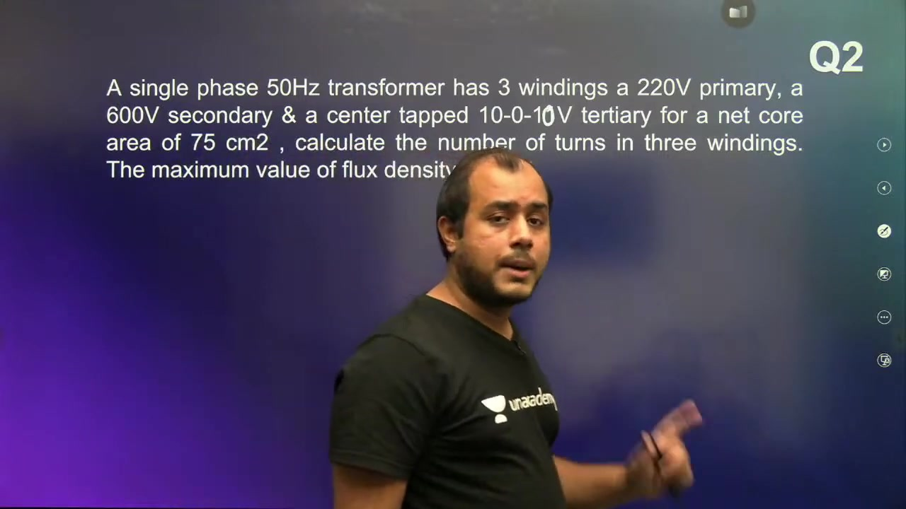
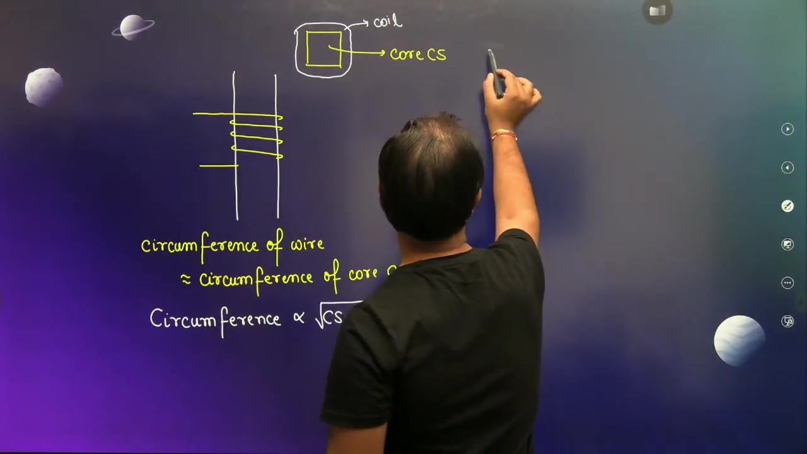
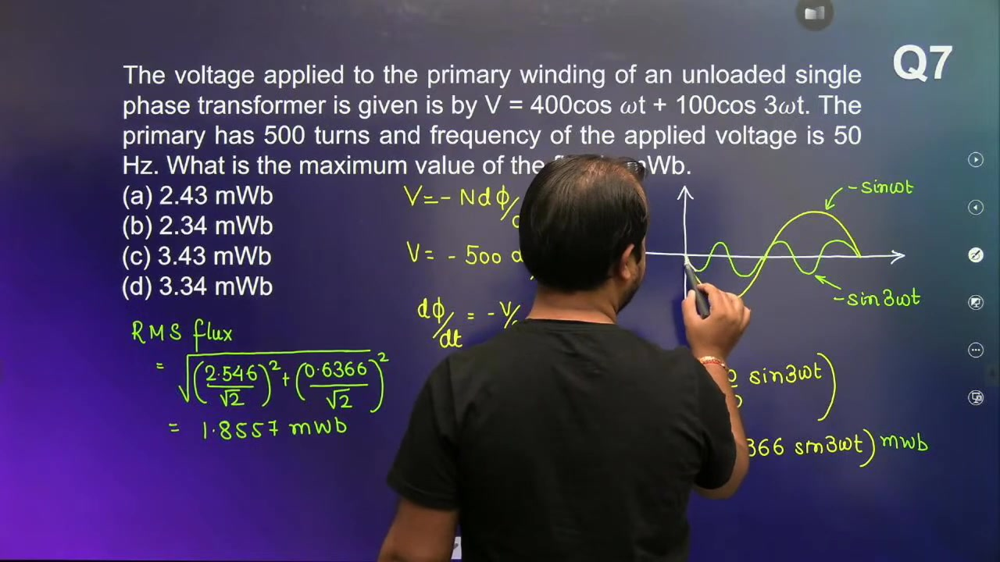
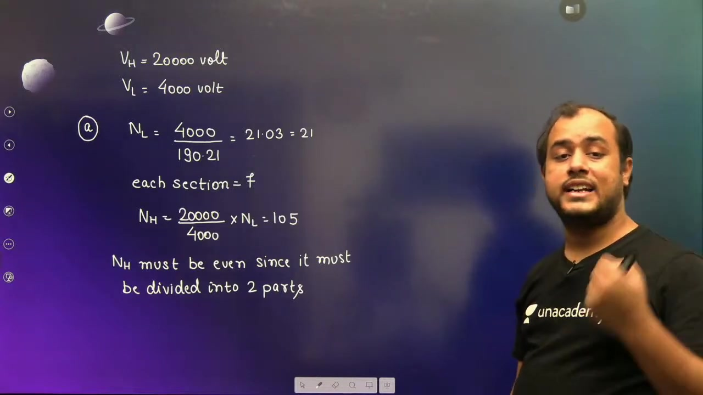
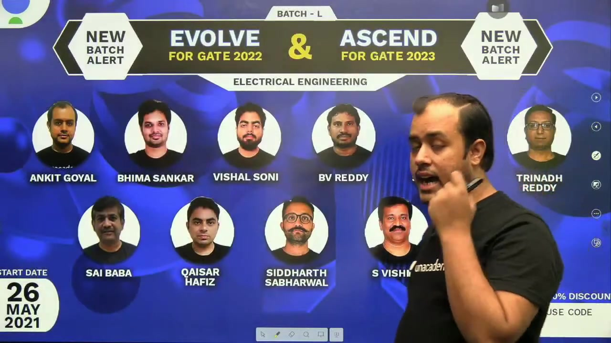

[← Lec 012: Transformer Construction Part 2](Lecture_012_Transformer_Construction_Part_2.md) | [🏠 Index](00_yt_study_guide.md) | [Lec 014: Ideal Transformer Part 1 →](Lecture_014_Ideal_Transformer_Part_1.md)

---

# Problems based on Transformer Construction & Working | L4 | Electrical Machines | GATE 2022

- **Source**: https://www.youtube.com/watch?v=HwlgfqiNMvI
- **Duration**: 01:20:05
- **Compiled**: 2026-09-19

---

## Overview

This lecture solves advanced numerical problems on transformer construction, magnetic circuits, and induced EMF equations. It connects physical core geometries and lamination properties directly to electrical circuit parameters. The discussion develops rigorous methods for turn allocation under integer divisibility and center-tap constraints. It also analyzes non-sinusoidal voltage excitation through direct calculus integration.

## Contents

- [[#Transformer Construction and Induced EMF Problem Foundations|Transformer Construction and Induced EMF Problem Foundations]]
- [[#Net Core Area and Turn Allocation with Ratio Constraints|Net Core Area and Turn Allocation with Ratio Constraints]]
- [[#Three-Winding Transformers and Center-Tapped Winding Design|Three-Winding Transformers and Center-Tapped Winding Design]]
- [[#Transformer Optimization and Material Weight Redesign|Transformer Optimization and Material Weight Redesign]]
- [[#Material Savings in Transformer Redesign: Core and Copper Scaling Laws|Material Savings in Transformer Redesign: Core and Copper Scaling Laws]]
- [[#Copper Savings Derivation and RMS versus Peak Flux Distinctions|Copper Savings Derivation and RMS versus Peak Flux Distinctions]]
- [[#Core Reluctance and Magnetizing Current Determination|Core Reluctance and Magnetizing Current Determination]]
- [[#Magnetizing Susceptance, Frequency Scaling, and V/f Control|Magnetizing Susceptance, Frequency Scaling, and V/f Control]]
- [[#Harmonic Voltages and Core Flux Integration from First Principles|Harmonic Voltages and Core Flux Integration from First Principles]]
- [[#Multi-Harmonic Waveform Pitfalls and Extremum Analysis|Multi-Harmonic Waveform Pitfalls and Extremum Analysis]]
- [[#Stacking Factor Calculations and Shell-Type Core Geometry|Stacking Factor Calculations and Shell-Type Core Geometry]]
- [[#Sandwich Coil Turn Allocation and Integer Divisibility Constraints|Sandwich Coil Turn Allocation and Integer Divisibility Constraints]]
- [[#Three-Phase Transformer Design and Coil Type Classification|Three-Phase Transformer Design and Coil Type Classification]]
- [[#Air Core Substitution and Hysteresis Loss Elimination|Air Core Substitution and Hysteresis Loss Elimination]]

---

## Transformer Construction and Induced EMF Problem Foundations
_(00:18 - 05:32)_

### Core Induced EMF Relations
- By Faraday's law, a sinusoidal core flux $\phi(t) = \Phi_m \sin(\omega t)$ induces an RMS voltage of:
  $$E_{\text{rms}} = 4.44 f N \Phi_m$$
- The maximum flux is $\Phi_m = B_m A_n$, where $B_m$ is peak flux density and $A_n$ is net core area.

> [!info] Definition: EMF per Turn
> The induced EMF per turn is identical for all windings on a common magnetic core:
> $$E_{\text{turn}} = \frac{E_{\text{rms}}}{N} = 4.44 f \Phi_m = 4.44 f B_m A_n$$

## Net Core Area and Turn Allocation with Ratio Constraints
_(05:50 - 11:23)_

### Gross vs. Net Area
- Laminations are separated by thin insulation, defined by stacking factor $k_s \approx 0.90$.
- $$A_{\text{gross}} = \frac{A_n}{k_s}$$

### Integer Turn Selection Strategy
1. **Always calculate Low-Voltage (LV) turns first**: $N_{\text{LV}} = V_{\text{LV}} / E_{\text{turn}}$.
2. Round $N_{\text{LV}}$ to a nearby integer.
3. Calculate High-Voltage (HV) turns strictly via transformation ratio: $N_{\text{HV}} = N_{\text{LV}} \times (V_{\text{HV}} / V_{\text{LV}})$.
4. Choose an even integer for $N_{\text{LV}}$ if the voltage ratio requires it to keep $N_{\text{HV}}$ a whole number.

## Three-Winding Transformers and Center-Tapped Winding Design
_(11:46 - 18:23)_

### Center-Tapped Winding Constraints
> [!info] Center-Tap Constraint
> A center-tapped winding requires an equal number of turns on either side of the tap. Therefore, total turns for a center-tapped coil must be an even integer.

- Use the lowest voltage winding to find the base integer turn count, then scale all other windings using exact voltage ratios.

## Transformer Optimization and Material Weight Redesign
_(18:23 - 28:43)_

### Material Redesign Scaling Laws
When redesigning a core to operate at a higher flux density (e.g., changing hot-rolled steel at $1.2\text{ T}$ to CRGO at $1.6\text{ T}$) while keeping total flux $\Phi_m$ constant:
- **Core Area Reduction**: $A_2/A_1 = B_1/B_2 = 1.2/1.6 = 0.75$.
- **Core Weight Saving**: Scales linearly with area. Weight drops to $75\%$ (a $25\%$ saving).
- **Copper Weight Saving**: Winding turn length scales with core perimeter, which scales with $\sqrt{A_n}$. Copper weight drops to $\sqrt{0.75} \approx 0.866$ (a $13.4\%$ saving).

> [!info] Scaling Principle
> Core weight scales linearly with core area: $W_{\text{iron}} \propto A_n$.
> Copper weight scales with the square root of core area: $W_{\text{cu}} \propto \sqrt{A_n}$.

## Copper Savings Derivation and RMS versus Peak Flux Distinctions
_(28:50 - 35:25)_

### RMS vs. Peak Flux Density
> [!info] Voltage Interpretation
> The equation $E = 4.44 f N \Phi_m$ yields RMS voltage, but $\Phi_m$ must always be the **peak** core flux.
> If given RMS flux density $B_{\text{rms}}$, you must first convert it: $B_m = \sqrt{2} B_{\text{rms}}$.

## Core Reluctance and Magnetizing Current Determination
_(35:25 - 46:24)_

### Magnetizing Current Calculation
- Reluctance: $\mathcal{R} = l / (\mu_0 \mu_r A_n)$
- Hopkinson's law (MMF): $N_1 I_m = \Phi \mathcal{R}$
- Using RMS flux $\Phi_{\text{rms}}$ yields RMS magnetizing current $I_{m,\text{rms}}$.

### Magnetizing Susceptance & V/f Control
- Susceptance $B_m = 1/(\omega L_m)$.
- Since $V \approx 4.44 f N B_m A_n$, peak flux density scales directly with the V/f ratio ($B_m \propto V/f$).
- **Warning**: Increasing voltage by $50\%$ while cutting frequency by $50\%$ causes flux density to triple, severely saturating the core.

## Harmonic Voltages and Core Flux Integration from First Principles
_(46:24 - 56:22)_

### Non-Sinusoidal Applied Voltages
When applied voltage contains harmonics (e.g., $v(t) = v_1 \cos(\omega t) + v_3 \cos(3\omega t)$):
1. **Never use 4.44 or $\sqrt{2}$ crest factors**.
2. **Integrate First Principles**: $v(t) = N_1 (d\phi/dt) \implies \phi(t) = \frac{1}{N_1} \int v(t) dt$.

### Finding True Peak Flux
- The flux reaches its peak extremum exactly when $d\phi/dt = 0$, meaning when applied voltage $v(t) = 0$.
- Solve $v(t) = 0$ to find $\omega t$, then plug into the flux expression.

## Stacking Factor Calculations and Shell-Type Core Geometry
_(56:25 - 61:30)_

### Shell-Type Central Limb Cross Section
- In shell-type units, all coils mount on the central limb.
- Flux splits equally into the outer limbs.
- EMF per turn calculations must use the central limb's cross-sectional area: $A_n = \text{Width} \times \text{Depth}$.

## Sandwich Coil Turn Allocation and Integer Divisibility Constraints
_(61:30 - 69:52)_

### Sandwich Divisibility Rules
In interleaved shell-type windings (e.g., split into 3 LV and 2 HV sections):
1. $N_{\text{LV}}$ must be divisible by the number of LV sections.
2. $N_{\text{HV}} = a \cdot N_{\text{LV}}$ must be divisible by the number of HV sections.
3. This sets an LCM divisibility requirement on the nominal turn count, forcing round-offs to a specific multiple.

## Three-Phase Transformer Design and Coil Type Classification
_(69:58 - 77:39)_

### Three-Phase Turn Calculations
- **Always calculate using per-phase voltages**, never line-to-line.
- Example: Star-Delta $10000/500\text{V}$.
  - $V_{\text{ph,LV}} = 500\text{V}$.
  - $V_{\text{ph,HV}} = 10000 / \sqrt{3}\text{V}$.

### Coil Types
- **Sandwich**: Shell-type transformers.
- **Disc**: High-current LV windings.
- **Crossover**: High-voltage winding of small distribution transformers.

## Air Core Substitution and Hysteresis Loss Elimination
_(77:39 - 80:01)_

### Replacing Iron with Air
- Air is a non-ferromagnetic medium with $\mu_r \approx 1$.
- Its $B-H$ curve is a straight line, enclosing zero loop area.
- Therefore, replacing an iron core with an air core drops hysteresis loss to strictly zero ($P_h = 0$).

> [!success] Trade-off
> Air eliminates iron losses but possesses immense magnetic reluctance, requiring massive magnetizing current and causing severe leakage flux.

---

## Summary and Key Takeaways

- The induced EMF per turn $E_{\text{turn}} = 4.44 f B_m A_n$ is identical across all windings sharing a common magnetic core.
- Low-voltage turns must be calculated first, then high-voltage turns are determined using the exact voltage transformation ratio.
- Center-tapped windings require an even integer number of turns to provide symmetrical turns on both sides of the tap.
- Active core weight scales linearly with core area, while winding copper weight scales with the square root of core area $\sqrt{A_n}$.
- Core reluctance $\mathcal{R} = l / (\mu_0 \mu_r A_n)$ determines the magnetizing current via Hopkinson's law $N_1 I_m = \Phi \mathcal{R}$.
- Non-sinusoidal voltages must be integrated in the time domain, because multi-harmonic waveforms cannot use the standard $4.44$ factor or a $\sqrt{2}$ crest factor.
- In shell-type sandwich windings, low-voltage turns must be a common multiple of section counts to prevent fractional turns.
- Replacing a ferromagnetic core with an air core eliminates hysteresis loss because the $B\text{--}H$ curve of air is linear and encloses zero area.

---

[← Lec 012: Transformer Construction Part 2](Lecture_012_Transformer_Construction_Part_2.md) | [🏠 Index](00_yt_study_guide.md) | [Lec 014: Ideal Transformer Part 1 →](Lecture_014_Ideal_Transformer_Part_1.md)
