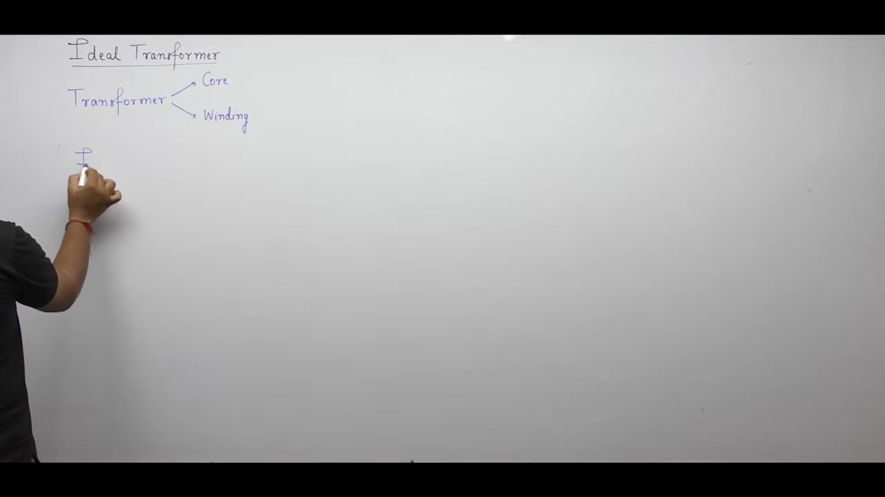
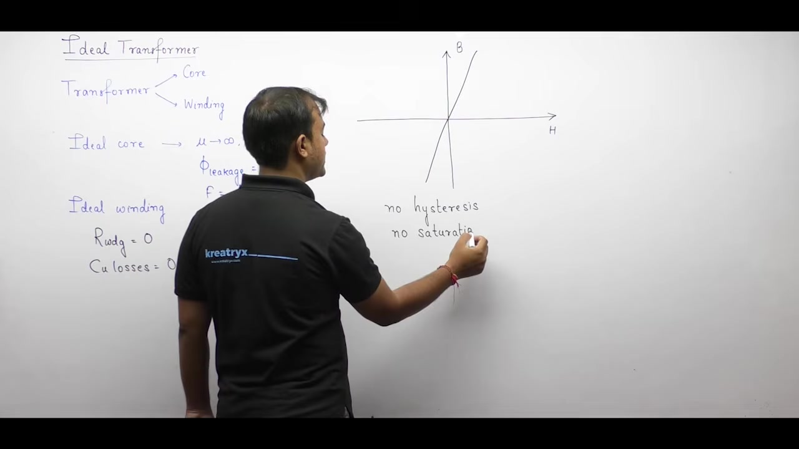
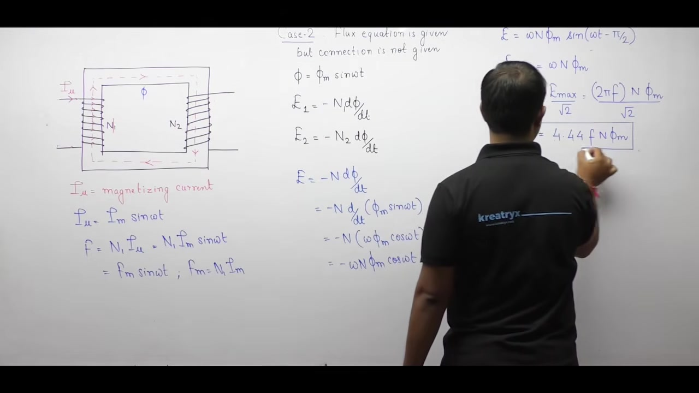
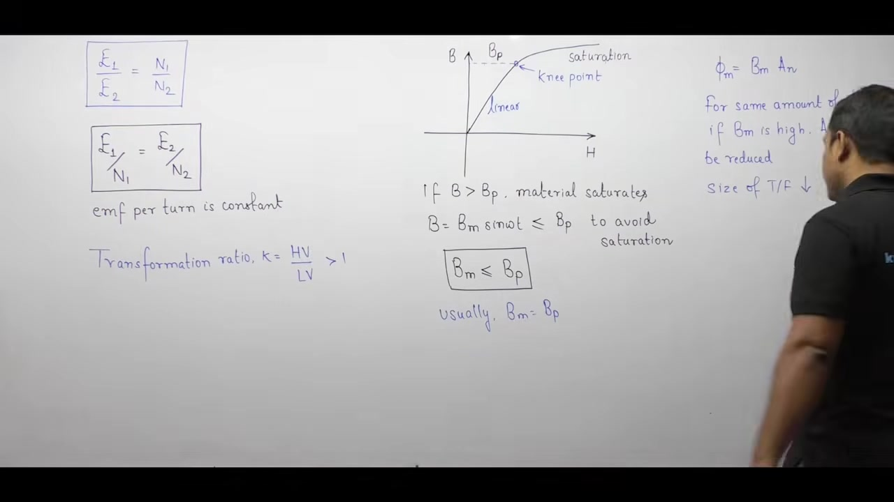
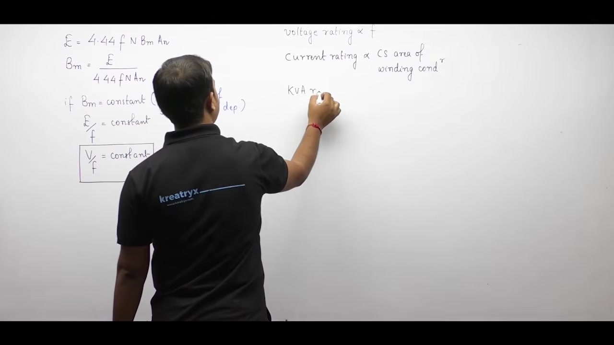

[← Lec 013: Problems based on Transformer Construction and Working](Lecture_013_Problems_based_on_Transformer_Construction_and_Working.md) | [🏠 Index](00_yt_study_guide.md) | [Lec 015: Ideal Transformer Part 2 →](Lecture_015_Ideal_Transformer_Part_2.md)

---

# Electrical Machines | Lec 10 | Ideal Transformer (Part 1) | GATE Electrical Engineering

- **Source**: https://www.youtube.com/watch?v=WMBJMfTAmO8
- **Duration**: 01:04:38
- **Compiled**: 2026-09-19

---

## Overview

This lecture establishes the theoretical foundation and governing mathematical equations of the ideal single-phase transformer. It details the defining physical assumptions for the magnetic core and electrical windings. It resolves the classical polarity conventions of Faraday's and Lenz's law, derives the fundamental RMS induced EMF equation, and constructs the complete no-load phasor diagram. Finally, it outlines core dimensioning criteria and frequency scaling relationships for practical machine design.

## Contents

- [[#Ideal Transformer Concept and Assumptions|Ideal Transformer Concept and Assumptions]]
- [[#Core Losses and Linear Magnetization Characteristics|Core Losses and Linear Magnetization Characteristics]]
- [[#Alternating Magnetizing Current and Core Flux Setup|Alternating Magnetizing Current and Core Flux Setup]]
- [[#Polarity Determination: Faraday's Law versus Lenz's Law|Polarity Determination: Faraday's Law versus Lenz's Law]]
- [[#Derivation of the Transformer Induced EMF Equation|Derivation of the Transformer Induced EMF Equation]]
- [[#Phase Conventions, Turns Ratio, and Phasor Diagrams|Phase Conventions, Turns Ratio, and Phasor Diagrams]]
- [[#Observations on EMF, Transformation Ratio, and Core Saturation|Observations on EMF, Transformation Ratio, and Core Saturation]]
- [[#Core Materials Comparison and the $V/f$ Ratio Principle|Core Materials Comparison and the $V/f$ Ratio Principle]]
- [[#Frequency Scaling Laws and Rating Proportionalities|Frequency Scaling Laws and Rating Proportionalities]]
- [[#Back-EMF Opposition and Primary Phasor Representation|Back-EMF Opposition and Primary Phasor Representation]]
- [[#Complete No-Load Phasor Summary and Practice Problem|Complete No-Load Phasor Summary and Practice Problem]]

---

## Ideal Transformer Concept and Assumptions
_(00:12 - 05:14)_

A transformer has two primary active parts: the magnetic core and the electrical windings. An ideal transformer model assumes perfection in both.

### Properties of an Ideal Magnetic Core
- **Infinite Permeability**: Magnetic reluctance depends on permeability ($\mathcal{R} = \frac{l}{\mu A}$). As permeability approaches infinity ($\mu \to \infty$), the core's reluctance drops to zero ($\mathcal{R} \to 0$).
- **Zero Leakage Flux**: Zero reluctance acts like a magnetic short circuit. Just as current favors the path of least resistance, flux favors the path of minimum reluctance. Because the iron core offers zero opposition while the surrounding air has high reluctance, all magnetic flux perfectly links both windings without escaping into the air ($\Phi_{\text{leakage}} = 0$).

> [!info] Definition: Ideal Core Reluctance
> An ideal magnetic core has infinite permeability ($\mu = \infty$) and zero reluctance ($\mathcal{R} = 0$). All magnetic flux links both windings completely with zero leakage flux.

### Zero Magnetizing Current Requirement
- The magnetomotive force (MMF) required to drive flux is $\text{MMF} = \Phi \times \mathcal{R}$.
- Since ideal core reluctance is zero, the required MMF is zero.
- Because $\text{MMF} = N I_\mu = 0$, the ideal transformer needs absolutely zero magnetizing current ($I_\mu = 0$) to set up and sustain magnetic flux.

### Properties of Ideal Windings
- **Zero Resistance**: The hypothetical conductors have zero electrical resistance ($R_1 = 0, \quad R_2 = 0$).
- **Zero Copper Loss**: Without resistance, ohmic heating cannot occur, so copper losses vanish completely ($P_{\text{cu1}} = 0, \quad P_{\text{cu2}} = 0$).

> [!success] Result: Core and Winding Assumptions
> 1. Infinite core permeability ($\mu = \infty$), giving zero reluctance and zero leakage flux.
> 2. Zero magnetizing current ($I_\mu = 0$) to set up flux.
> 3. Zero winding resistance ($R = 0$), giving zero copper loss ($P_{\text{cu}} = 0$).

## Core Losses and Linear Magnetization Characteristics
_(05:14 - 10:13)_

The ideal transformer model also eliminates all internal iron losses inside the magnetic core. 

### Elimination of Iron Losses
Total iron loss comprises hysteresis and eddy current losses ($P_i = P_h + P_e$):
- **Hysteresis loss ($P_h = k_h B_m^x f V$)**: An ideal core has a perfectly linear B-H magnetization curve. It traces the exact same path during magnetization and demagnetization. Because the cyclic loop encloses zero area, hysteresis loss is zero ($P_h = 0$).
- **Eddy current loss ($P_e = k_e B_m^2 f^2 t^2 V$)**: The ideal core material possesses infinite electrical resistivity ($\rho \to \infty$). With zero conductivity, induced eddy currents cannot circulate, so eddy loss is zero ($P_e = 0$).
- Combining these, the total iron loss vanishes ($P_i = 0$).

> [!info] Definition: Ideal Magnetic Characteristics
> The B-H curve of an ideal transformer is perfectly linear through the origin. It exhibits neither hysteresis loss nor magnetic saturation.

### Comprehensive Summary of Ideal Assumptions
1. **Infinite Permeability**: $\mu = \infty \implies \mathcal{R} = 0$.
2. **Zero Leakage Flux**: $\Phi_{\text{leakage}} = 0$.
3. **Zero Magnetizing Current**: $I_\mu = 0$.
4. **Zero Winding Resistance**: $R_1 = R_2 = 0 \implies P_{\text{cu}} = 0$.
5. **Linear Core without Losses**: No hysteresis or eddy currents $\implies P_i = 0$.

Because it has zero internal losses, the ideal transformer operates at 100% efficiency. Practical transformer analysis starts here and removes these ideal assumptions one by one to build accurate equivalent circuits.

## Alternating Magnetizing Current and Core Flux Setup
_(10:18 - 15:19)_

To derive the induced electromotive force, we analyze how alternating current establishes magnetic flux in the core.

### Physical Core and Helical Winding Setup
- Consider an alternating magnetizing current flowing through the primary winding: $i_\mu(t) = I_{\mu m} \sin(\omega t)$.
- This produces a time-varying MMF: $\mathcal{F}(t) = N_1 I_{\mu m} \sin(\omega t) = F_m \sin(\omega t)$.
- We must use alternating current because Faraday's law dictates that an EMF is induced only when magnetic flux changes over time.

### Determination of Core Flux
- The instantaneous mutual flux equals MMF divided by reluctance:
  $$\phi(t) = \frac{\mathcal{F}(t)}{\mathcal{R}} = \frac{F_m}{\mathcal{R}} \sin(\omega t)$$
- Defining the maximum flux as $\Phi_m = \frac{F_m}{\mathcal{R}}$, the instantaneous flux equation becomes:
  $$\phi(t) = \Phi_m \sin(\omega t)$$

> [!info] Definition: Sinusoidal Core Flux
> An alternating sinusoidal magnetizing current establishes an in-phase sinusoidal core flux $\phi(t) = \Phi_m \sin(\omega t)$.

### Determining Flux and Current Direction
- **Right-hand grip rule**: Curl the fingers of your right hand along the winding current. Your extended thumb points in the direction of the magnetic flux.
- If current flows across the front of the left limb from left to right, the thumb points upward. The magnetic flux travels upward through the left limb and circulates around the core.

### Polarity Determination Using Lenz's Law
- When the time-varying flux induces an EMF in the secondary winding, use Lenz's law to find the polarity:
  1. Observe the main flux $\phi(t)$ direction.
  2. The induced flux $\phi_{\text{induced}}$ must oppose this main flux.
  3. Use the right-hand rule on $\phi_{\text{induced}}$ to determine the induced current direction.
  4. The terminal where this induced current leaves the winding is marked positive (+).

## Polarity Determination: Faraday's Law versus Lenz's Law
_(15:22 - 22:40)_

Engineers often face confusion regarding when to write Faraday's law with a positive or negative sign.

### Polarity Derivation when Physical Winding Is Given
When physical winding wraps are explicitly shown:
1. Identify the instantaneous direction of the main mutual flux $\phi(t)$.
2. Apply Lenz's law to define an opposing induced flux $\phi_{\text{induced}}$.
3. Use the right-hand grip rule to find the induced current direction.
4. Mark the terminal where current leaves as positive (+).

### Comparing Derived Polarity with Specified Polarity
Next, compare your physically derived polarity with the problem's specified reference polarity (e.g., $e_{ab}$ means $a$ is positive).
- **Case A (Matches Derived Polarity)**: If the specified polarity matches what you derived from Lenz's law, write the equation with a positive sign:
  $$e = +N \frac{d\phi}{dt}$$
- **Case B (Opposes Derived Polarity)**: If the specified polarity is opposite to what you derived, Kirchhoff's Voltage Law (KVL) terminal reversal introduces a negative sign:
  $$e = -N \frac{d\phi}{dt}$$

> [!info] Crucial Distinction: Origin of the Minus Sign
> The negative sign here comes from KVL terminal reversal, not directly from Lenz's law (which was already used to establish the physical terminal polarities).

> [!success] Result: Polarity Sign Rule
> - Matches physical polarity: $e = +N \frac{d\phi}{dt}$
> - Opposes physical polarity: $e = -N \frac{d\phi}{dt}$

## Derivation of the Transformer Induced EMF Equation
_(22:42 - 29:07)_

When the physical winding geometry is not illustrated, we cannot evaluate the wrapping orientation directly.

### Case 2: Winding Connection Not Specified
- When only the sinusoidal flux equation is given without a physical diagram, we include the negative sign directly in Faraday's law to mathematically honor Lenz's law:
  $$e_1(t) = -N_1 \frac{d\phi}{dt}, \quad e_2(t) = -N_2 \frac{d\phi}{dt}$$

### Step-by-Step Mathematical Derivation
- Let the mutual core flux be: $\phi(t) = \Phi_m \sin(\omega t)$
- The induced EMF in a coil of $N$ turns is:
  $$e(t) = -N \frac{d}{dt}\left[\Phi_m \sin(\omega t)\right] = -N \omega \Phi_m \cos(\omega t)$$
- Using the trigonometric identity $-\cos\theta = \sin(\theta - 90^\circ)$, we rewrite this as:
  $$e(t) = N \omega \Phi_m \sin\left(\omega t - \frac{\pi}{2}\right)$$
- The peak value of the induced EMF is $E_m = N \omega \Phi_m = 2 \pi f N \Phi_m$.

### Calculating the RMS Value
- The root-mean-square (RMS) value for a sinusoidal waveform is the peak value divided by $\sqrt{2}$:
  $$E_{\text{rms}} = \frac{2 \pi}{\sqrt{2}} f N \Phi_m = \sqrt{2} \pi f N \Phi_m$$
- Evaluating the constant ($\sqrt{2} \pi \approx 4.44$) gives the fundamental RMS induced EMF equation:
  $$E = 4.44 f N \Phi_m$$

### Phase Relationship Between Flux and EMF
- Core flux $\phi(t)$ has an angle of $0^\circ$.
- Induced EMF $e(t)$ has an angle of $-90^\circ$.
- Thus, the induced EMF inherently lags the mutual flux by $90^\circ$.

> [!success] Result: Induced EMF Equation
> The RMS induced EMF is $E = 4.44 f N \Phi_m$. Under the standard Lenz's law convention, it lags the mutual flux by $90^\circ$.

## Phase Conventions, Turns Ratio, and Phasor Diagrams
_(29:11 - 38:03)_

Textbooks often disagree on whether induced EMF leads or lags core flux. Both are mathematically valid depending on terminal definitions.

### Resolving the Lead versus Lag Dilemma
- **Lag ($90^\circ$ lag)**: Occurs when the connection diagram is not specified, or when the specified terminal polarity opposes the physical Lenz's law polarity.
- **Lead ($90^\circ$ lead)**: Occurs when you use a positive sign ($+N \frac{d\phi}{dt}$), which requires that the specified polarity explicitly matches the physical Lenz's law polarity.

> [!info] Definition: Phase Relationship
> The magnitude is always $E = 4.44 f N \Phi_m$. The phase angle is $-90^\circ$ (lagging) or $+90^\circ$ (leading) strictly based on the defined reference polarity.

### Turns Ratio and Voltage Transformation
- Taking the ratio of RMS induced voltages proves that the voltage ratio strictly equals the turns ratio:
  $$\frac{E_1}{E_2} = \frac{N_1}{N_2}$$
- Dividing each voltage by its turn count shows that the induced EMF per turn is identical in both windings because they link the exact same core flux:
  $$\frac{E_1}{N_1} = \frac{E_2}{N_2} = 4.44 f \Phi_m$$
- **Step-down**: $N_1 > N_2 \implies E_1 > E_2$.
- **Step-up**: $N_2 > N_1 \implies E_2 > E_1$.

### Expression in Terms of Core Dimensions
- Maximum flux $\Phi_m$ is the product of peak flux density $B_m$ and the net iron cross-sectional area $A_n$:
  $$\Phi_m = B_m A_n$$
- Substituting this into the EMF equation yields a useful design formula:
  $$E = 4.44 f N B_m A_n$$

### Phasor Diagrams for Both Conventions
- The magnetizing current $i_\mu(t)$ and core flux $\phi(t)$ lie on the horizontal reference axis ($0^\circ$).
- **Lagging Convention**: Induced EMFs $E_1, E_2$ are drawn vertically downward at $-90^\circ$.
- **Leading Convention**: Induced EMFs $E_1, E_2$ are drawn vertically upward at $+90^\circ$.

## Observations on EMF, Transformation Ratio, and Core Saturation
_(38:06 - 44:46)_

Several critical engineering deductions follow from the induced EMF equation that govern transformer design.

### Definition of Transformation Ratio
- In power engineering, transformers have high-voltage (HV) and low-voltage (LV) sides. To avoid step-up/step-down ambiguity, the transformation ratio $k$ is defined as:
  $$k = \frac{V_{\text{HV}}}{V_{\text{LV}}} = \frac{N_{\text{HV}}}{N_{\text{LV}}}$$
- Because high voltage is always in the numerator, $k$ is strictly greater than one ($k > 1$).

> [!info] Definition: Transformation Ratio
> The transformation ratio $k = \frac{V_{\text{HV}}}{V_{\text{LV}}}$. It is always greater than unity ($k > 1$).

### Magnetic Saturation and the Knee Point
- Practical ferromagnetic cores have a saturation boundary called the knee point ($B_p$).
- If operating flux density ($B_m$) exceeds $B_p$, the core enters deep saturation, causing permeability to collapse. This forces the transformer to draw destructive magnetizing current spikes.
- Designers must ensure that operating flux density remains safe: $B_m \le B_p$.

### Core Area Minimization Rationale
- Why operate near the knee point ($B_p$) rather than safely below it?
- The required core area is $A_n = \frac{\Phi_m}{B_m}$.
- For a fixed voltage and frequency, peak flux $\Phi_m$ is constant. Selecting the maximum allowable flux density ($B_m \approx B_p$) mathematically minimizes the required iron area $A_n$.
- Minimizing core area vastly reduces total core volume, iron weight, copper winding length, resistance, and manufacturing costs.

> [!success] Result: Core Optimization Principle
> Transformers operate right at the knee of the magnetization curve ($B_m \approx B_p$). This minimizes core size and weight without pushing the core into saturation.

## Core Materials Comparison and the $V/f$ Ratio Principle
_(44:46 - 50:32)_

Operating at maximum allowable flux density reduces transformer size, but this limit depends heavily on the chosen core material.

### Silicon Steel versus CRGO Steel
- **Ordinary Silicon Steel**: The knee point occurs around $B_p \approx 1.0 - 1.2\text{ T}$.
- **Cold-Rolled Grain-Oriented (CRGO) Steel**: The knee point extends up to $B_p \approx 1.2 - 1.6\text{ T}$.
- Because CRGO steel supports higher flux density without saturating, it requires significantly less iron cross section ($A_n$) to carry the same flux. This makes CRGO transformers much smaller and lighter.

> [!info] Definition: Operating Flux Density versus Knee Point
> The parameter $B_p$ is a fixed material property (the limit). The parameter $B_m$ is the operating flux density (the applied stress). Designers set $B_m \approx B_p$ for maximum efficiency of materials.

### Derivation of the $V/f$ Proportionality
- For an ideal transformer, terminal voltage equals induced EMF ($V_1 \approx E_1$).
- From $E_1 = 4.44 f N_1 B_m A_n$, solving for operating flux density yields:
  $$B_m = \frac{V_1}{4.44 f N_1 A_n}$$
- Since turn count and core area are fixed after manufacturing, we find that operating flux density is strictly proportional to the ratio of applied voltage to frequency:
  $$B_m \propto \frac{V_1}{f}$$

### Maintaining Constant Flux Density
- To keep the core operating exactly at the knee point without saturating, the $V/f$ ratio must remain constant.
- If supply frequency decreases, the applied voltage must decrease proportionally to prevent the flux density from spiking into saturation.

> [!success] Result: The $V/f$ Principle
> Peak core flux density scales directly with the voltage to frequency ratio ($B_m \propto \frac{V}{f}$). Maintaining a constant $V/f$ ratio prevents magnetic saturation.

## Frequency Scaling Laws and Rating Proportionalities
_(50:32 - 55:55)_

Operating frequency directly dictates the physical dimensions and power capacity of electrical machines.

### Voltage and Current Scaling Relationships
- **Voltage Scaling**: Since $E = 4.44 f N B_m A_n$, the voltage rating scales directly with frequency ($V \propto f$).
- **Current Scaling**: The current rating depends purely on the physical copper wire area ($A_w$) and thermal limits. It is entirely independent of frequency.

### Apparent Power (kVA) Proportionality
- The apparent power rating is $S = V \times I$.
- Because voltage scales with frequency but current does not, the power rating scales directly with frequency:
  $$S \propto f$$
- Running a transformer at a higher frequency increases its power capacity proportionally.

### Core Area Scaling with Frequency
- Rearranging the EMF equation for core area gives $A_n = \frac{V}{4.44 f N B_m}$.
- For a fixed voltage and fixed turns, core area is inversely proportional to frequency:
  $$A_n \propto \frac{1}{f}$$
- This is why aircraft power systems operate at $400\text{ Hz}$ instead of $50\text{ Hz}$—the higher frequency drastically shrinks the required iron core, yielding an exceptionally lightweight transformer.

> [!success] Result: Summary of Scaling Deductions
> 1. **Induced EMF**: $E = 4.44 f N \Phi_m$.
> 2. **Phase Angle**: EMF leads or lags flux by $90^\circ$.
> 3. **Transformation Ratio**: $\frac{E_1}{E_2} = \frac{N_1}{N_2}$.
> 4. **Core Area Reduction**: Higher $B_m$ minimizes required $A_n$.
> 5. **Power Scaling**: Apparent power rating scales with frequency ($S \propto f$).
> 6. **Physical Size Scaling**: Core area shrinks as frequency rises ($A_n \propto \frac{1}{f}$).

## Back-EMF Opposition and Primary Phasor Representation
_(55:56 - 61:37)_

The primary winding induced EMF acts as a counter-electromotive force (back-EMF) that regulates current intake from the supply.

### The Causal Chain of Lenz's Law
Consider the physical sequence when a transformer connects to an AC source $V_1$:
1. Applied voltage $V_1$ drives primary current $I_1$.
2. Current $I_1$ establishes the alternating core flux $\Phi$.
3. The time-varying flux $\Phi$ induces a back-EMF $E_1$ across the primary turns.
- This induced back-EMF directly opposes the applied voltage that created it, honoring Lenz's law. In an ideal transformer with zero impedance, they balance exactly ($V_1 = E_1$).

### Phasor Diagram: Drawing $V_1$ and $E_1$
- Magnetizing current $I_\mu$ and core flux $\Phi$ sit at $0^\circ$ on the horizontal axis.
- The induced EMF $E_1$ lags flux by $90^\circ$, pointing vertically downward (at $-90^\circ$).
- To graphically illustrate electrical opposition, the applied voltage phasor $V_1$ is drawn $180^\circ$ opposite to $E_1$:
  $$\vec{V}_1 = -\vec{E}_1$$
- Therefore, $V_1$ points vertically upward at $+90^\circ$, leading the core flux by $90^\circ$.

> [!info] Definition: Graphical Convention versus Numerical Sign
> While $V_1$ and $E_1$ are drawn opposite on phasor diagrams to visually represent physical back-EMF opposition, numerical equivalent circuits still use standard positive terminal conventions.

> [!success] Result: Primary Equilibrium
> The applied voltage phasor perfectly balances the induced primary back-EMF: $\vec{V}_1 = -\vec{E}_1$.

## Complete No-Load Phasor Summary and Practice Problem
_(61:43 - 64:30)_

This concludes the foundational voltage analysis. We now assemble the complete no-load phasor diagram.

### Complete No-Load Phasor Diagram
The complete diagram for an ideal transformer combines five core phasors:
1. **Magnetizing Current ($I_\mu$)**: Drives the magnetic circuit along the horizontal axis at $0^\circ$.
2. **Mutual Core Flux ($\Phi$)**: Stays exactly in phase with $I_\mu$ at $0^\circ$.
3. **Primary Induced EMF ($E_1$)**: Lags mutual flux by $90^\circ$ (points downward at $-90^\circ$).
4. **Secondary Induced EMF ($E_2$)**: Lags mutual flux by $90^\circ$ (points downward at $-90^\circ$).
5. **Applied Primary Voltage ($V_1$)**: Exactly balances back-EMF $E_1$ (points upward at $+90^\circ$).

---

### Worked Practice Problem

> [!example] Problem: Turns Calculation and Core Dimensioning
> A single-phase, $2310 / 220\text{ V}, 50\text{ Hz}$ transformer has an EMF per turn of approximately $13\text{ V}$.
> 1. Calculate the number of turns on the primary and secondary windings.
> 2. Determine the net cross-sectional iron area of the core if peak flux density is $B_m = 1.4\text{ T}$.

#### Solution

**Part 1: Primary and Secondary Turn Counts**
- For the primary winding: $N_1 = \frac{2310}{13} \approx 177.69 \implies N_1 = 178\text{ turns}$.
- For the secondary winding: $N_2 = \frac{220}{13} \approx 16.92 \implies N_2 = 17\text{ turns}$.

**Part 2: Net Core Cross-Sectional Area**
- Using the EMF per turn formula: $\frac{E}{N} = 4.44 f B_m A_n$.
- Substituting values: $13 = 4.44 \times 50 \times 1.4 \times A_n$.
- Solving for area: $A_n = \frac{13}{310.8} \approx 0.04183\text{ m}^2$.
- Converting units: $A_n \approx 418.3\text{ cm}^2$.

> [!success] Result: Design Summary
> $N_1 = 178\text{ turns}$, $N_2 = 17\text{ turns}$, $A_n \approx 418.3\text{ cm}^2$.

### Outlook for Part 2
The next lecture covers transformer operation under electrical load, analyzing load current reflection, MMF balance, and impedance transformation.

---

## Summary and Key Takeaways

- **Ideal transformer**: Infinite core permeability ($\mu \to \infty$), zero reluctance ($\mathcal{R} \to 0$), zero leakage flux, zero magnetizing current ($I_\mu = 0$), and zero winding resistance.
- **Zero losses**: No copper loss ($R=0$) or iron loss (linear B-H curve).
- **Polarity rules**: Matches physical = $+N \frac{d\phi}{dt}$ (leading). Opposes physical = $-N \frac{d\phi}{dt}$ (lagging).
- **RMS Induced EMF**: $E = 4.44 f N \Phi_m = 4.44 f N B_m A_n$.
- **Constant EMF per turn**: $\frac{E_1}{N_1} = \frac{E_2}{N_2}$.
- **Transformation ratio**: $k = \frac{V_{\text{HV}}}{V_{\text{LV}}} > 1$.
- **$V/f$ Principle**: Peak flux density scales with voltage over frequency ($B_m \propto \frac{V}{f}$). Maintain a constant $V/f$ ratio to prevent saturation.
- **Scaling Laws**: Power capacity scales with frequency ($S \propto f$), while required core area is inversely proportional ($A_n \propto \frac{1}{f}$).
- **Equilibrium**: The applied primary voltage perfectly balances the induced back-EMF ($\vec{V}_1 = -\vec{E}_1$).

---

[← Lec 013: Problems based on Transformer Construction and Working](Lecture_013_Problems_based_on_Transformer_Construction_and_Working.md) | [🏠 Index](00_yt_study_guide.md) | [Lec 015: Ideal Transformer Part 2 →](Lecture_015_Ideal_Transformer_Part_2.md)