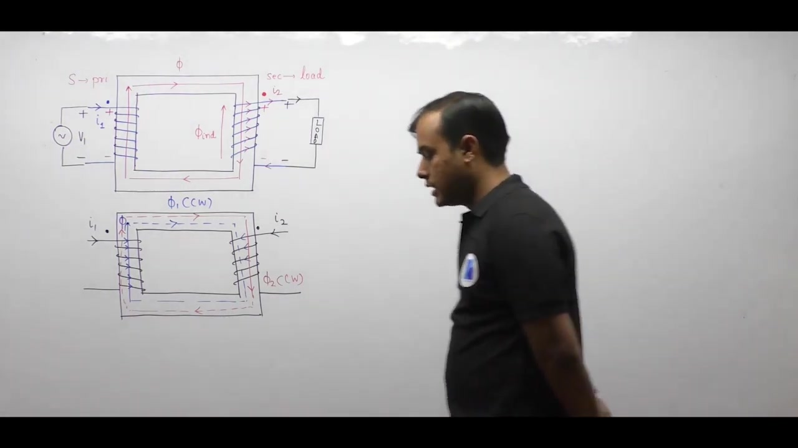
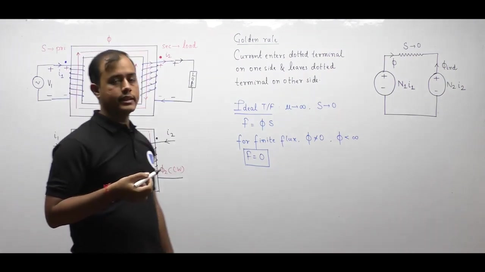
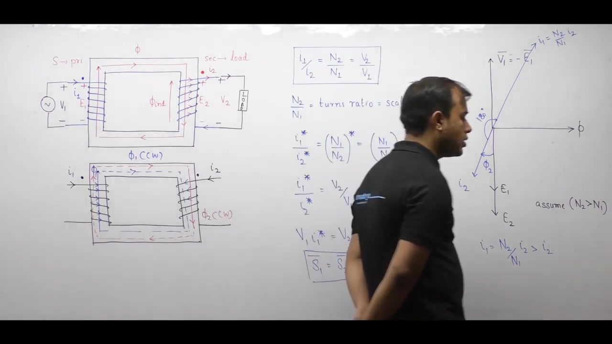
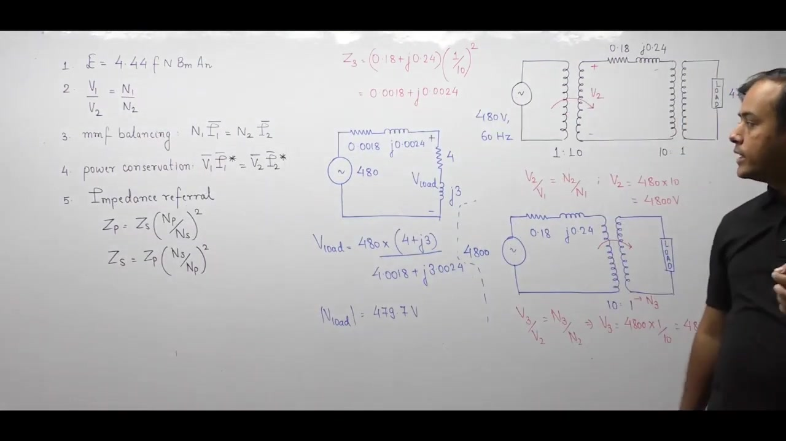

[← Lec 014: Ideal Transformer Part 1](Lecture_014_Ideal_Transformer_Part_1.md) | [🏠 Index](00_yt_study_guide.md) | [Lec 016: Problems Based on Ideal Transformer →](Lecture_016_Problems_Based_on_Ideal_Transformer.md)

---

# Electrical Machines | Lec 11 | Ideal Transformer (Part 2) | GATE Electrical Engineering

- **Source**: https://www.youtube.com/watch?v=zLFJN6WhM10
- **Duration**: 00:49:28
- **Compiled**: 2026-09-19

---

## Overview

This lecture completes the theoretical study of the ideal single-phase transformer under loaded conditions. It resolves transformer winding turns design through an iterative approximation method. The analysis establishes the electromagnetic basis of the dot convention and formulates the universal golden rule of transformer currents. It derives MMF balancing and complex power conservation from dual magnetic circuits. Finally, the lecture introduces the general impedance referral principle and demonstrates network simplification on a benchmark power transmission system.

## Contents

- [[#Ideal Transformer Review and Winding Turns Formulation|Ideal Transformer Review and Winding Turns Formulation]]
- [[#The Dot Convention and Polarity in Transformers|The Dot Convention and Polarity in Transformers]]
- [[#Power Flow Conventions and the Golden Rule of Transformers|Power Flow Conventions and the Golden Rule of Transformers]]
- [[#Magnetic Circuit Modeling and MMF Balancing|Magnetic Circuit Modeling and MMF Balancing]]
- [[#Complex Power Conservation and Loaded Phasor Diagrams|Complex Power Conservation and Loaded Phasor Diagrams]]
- [[#Impedance Referral Across Transformer Windings|Impedance Referral Across Transformer Windings]]
- [[#The General Referral Rule and Master Synthesis|The General Referral Rule and Master Synthesis]]
- [[#Step-by-Step Circuit Solution via Impedance Referral|Step-by-Step Circuit Solution via Impedance Referral]]

---

## Ideal Transformer Review and Winding Turns Formulation
_(00:12 - 10:13)_

### Ideal Transformer Synthesis
1. **Core**: Infinite permeability ($\mu \to \infty$) $\implies$ Zero magnetic reluctance ($\mathcal{R} \to 0$).
2. **Current**: Zero reluctance means no magnetizing current needed ($I_\mu = 0$). All flux is confined to iron (no leakage flux).
3. **Losses**: Linear B-H curve $\implies$ No hysteresis/eddy losses. Ideal windings $\implies$ No copper losses.

### Winding Turns Design: The Cardinal Rules
> [!info] Rule 1: Design from the Low-Voltage Side
> Always begin transformer turn calculations from the low-voltage (LV) winding using $N_{\text{LV}} = V_{\text{LV}} / E_{\text{turn}}$.

> [!info] Rule 2: Compute HV Turns from the Turns Ratio
> Never compute high-voltage turns independently from $E_{\text{turn}}$. Always scale $N_{\text{LV}}$ by the voltage turns ratio: $N_{\text{HV}} = N_{\text{LV}} \times (V_{\text{HV}} / V_{\text{LV}})$.

- **Iterative Approximation**: If the calculated $N_{\text{HV}}$ is a fraction, adjust the rounded $N_{\text{LV}}$ (e.g., from 17 to 18) until $N_{\text{HV}}$ is an exact whole integer. Fractional turns are impossible.

## The Dot Convention and Polarity in Transformers
_(10:17 - 16:07)_

### The Dot Convention
The dot convention marks winding terminals that possess the same instantaneous electrical polarity.
- Using the right-hand grip rule on the primary gives the direction of primary flux $\phi_1$.
- By Lenz's law, secondary flux $\phi_2$ must oppose $\phi_1$.
- Using the right-hand rule in reverse gives the secondary current direction needed to produce $\phi_2$.

> [!info] Coupled Circuit Polarities
> 1. **Additive Polarity**: Currents enter both dotted terminals, adding mutual fluxes ($\Phi_{\text{net}} = \phi_1 + \phi_2$).
> 2. **Subtractive Polarity**: Current enters one dotted terminal and leaves the other, opposing mutual fluxes ($\Phi_{\text{net}} = \phi_1 - \phi_2$). Normal transformer operation is inherently subtractive.

## Power Flow Conventions and the Golden Rule of Transformers
_(16:11 - 22:17)_

### The Golden Rule
> [!success] The Golden Rule of Transformer Currents
> In any operating transformer, **current enters the dotted terminal on one side and leaves the dotted terminal on the other side.**

This is dictated by two laws:
1. **Thermodynamic Law**: Power is absorbed on the primary (current enters the + terminal) and delivered on the secondary (current leaves the + terminal).
2. **Electromagnetic Law**: Lenz's law forces secondary flux to oppose primary flux.

## Magnetic Circuit Modeling and MMF Balancing
_(22:17 - 27:03)_

### Zero Reluctance and MMF Balance
- In an ideal core, $\mu \to \infty \implies \mathcal{R} = 0$.
- Net MMF must be zero: $\text{MMF}_{\text{net}} = \Phi \cdot \mathcal{R} = \Phi \cdot 0 = 0$.
- KVL on the magnetic circuit gives $N_1 I_1 - N_2 I_2 = 0$.

> [!info] MMF Balancing
> $N_1 I_1 = N_2 I_2$. The secondary load current creates a demagnetizing MMF. The primary winding instantly draws a balancing current to keep net core flux constant.

### Unified Transformation Ratio
$$ \frac{V_1}{V_2} = \frac{N_1}{N_2} = \frac{I_2}{I_1} $$

## Complex Power Conservation and Loaded Phasor Diagrams
_(27:05 - 33:19)_

### Power Conservation
Because $V_1 / V_2 = I_2 / I_1 \implies V_1 / V_2 = I_2^* / I_1^*$ (scalars), cross-multiplying gives:
$$ V_1 I_1^* = V_2 I_2^* \implies S_1 = S_2 $$
> [!success] Result: Power Conservation
> An ideal transformer consumes zero real and zero reactive power. All input power transfers directly to the load.

### Phasor Conventions
> [!info] Phasor Sign Rule
> On phasor diagrams, primary current $I_1$ is drawn $180^\circ$ opposite to $I_2$ to visually illustrate MMF balancing (Lenz's law). But in numerical circuit analysis, both currents share the **identical phase angle**: $\angle I_1 = \angle I_2 = -\phi_2$.

## Impedance Referral Across Transformer Windings
_(33:19 - 44:00)_

### The General Referral Rule
> [!info] Rule: Destination-over-Source Squared
> To transfer an impedance from a source winding to a destination winding, multiply by the square of the turns ratio:
> $$Z_{\text{dest}} = Z_{\text{source}} \times \left(\frac{N_{\text{destination}}}{N_{\text{source}}}\right)^2$$

- **Secondary to Primary**: $Z_1 = Z_2 \times (N_1 / N_2)^2$
- **Primary to Secondary**: $Z_2 = Z_1 \times (N_2 / N_1)^2$

### Master Synthesis: The 5 Pillars of Ideal Transformers
1. **EMF**: $E = 4.44 f N B_m A_n$
2. **Voltage**: $V_1/V_2 = N_1/N_2$
3. **Current (MMF)**: $N_1 I_1 = N_2 I_2$
4. **Power**: $S_1 = S_2$
5. **Impedance**: $Z' = Z \times (N_{\text{dest}}/N_{\text{src}})^2$

## Step-by-Step Circuit Solution via Impedance Referral
_(44:33 - 49:20)_

### Practical Benchmark Problem
**System**: A $480\text{V}$ generator $\rightarrow$ 1:10 Step-up TX $\rightarrow$ Transmission Line $(0.18 + j0.24)\Omega \rightarrow$ 10:1 Step-down TX $\rightarrow$ Load $(4 + j3)\Omega$.

**Solution via Referral to the Load side**:
1. **Refer the Generator across Step-Up TX**:
   $$V_2 = 480 \times (10/1) = 4800\text{V}$$
2. **Refer the 4800V source across Step-Down TX**:
   $$V_3 = 4800 \times (1/10) = 480\text{V}$$
3. **Refer Line Impedance across Step-Down TX**:
   $$Z_{\text{line}}' = (0.18 + j0.24) \times (1/10)^2 = (0.0018 + j0.0024)\Omega$$
4. **Solve Single-Mesh Series Circuit**:
   $$Z_{\text{total}} = Z_{\text{line}}' + Z_{\text{load}} = 4.0018 + j3.0024\Omega$$
   $$|Z_{\text{total}}| \approx 5.00288\Omega$$
   $$|V_L| = V_s \times \frac{|Z_{\text{load}}|}{|Z_{\text{total}}|} = 480 \times \frac{5}{5.00288} \approx 479.7\text{V}$$

> [!success] Result
> By stepping up voltage for transmission, line impedance effects dropped by $100\times$, delivering nearly the full $480\text{V}$ to the load.

---

## Summary and Key Takeaways

- Transformer turn design must start from the low-voltage winding ($N_{\text{LV}}$), with high-voltage turns computed via the turns ratio to ensure both windings achieve integer turn counts.
- The dot convention marks terminals of identical instantaneous polarity. Under the **golden rule of transformers**, current enters the dotted terminal on one side and leaves the dotted terminal on the other side.
- Zero core reluctance ($\mathcal{R} = 0$) forces net driving MMF to zero, establishing exact primary and secondary MMF balance: $N_1 I_1 = N_2 I_2$.
- Complex power is strictly conserved across ideal windings ($S_1 = S_2$), meaning the transformer absorbs zero real power and zero reactive power.
- Any electrical impedance transfers across windings according to the general destination-over-source squared rule: $Z_{\text{dest}} = Z_{\text{source}} \times (N_{\text{destination}} / N_{\text{source}})^2$.
- Multi-transformer transmission circuits reduce to a single-mesh network by referring sources and line impedances directly to the load terminals.

---

[← Lec 014: Ideal Transformer Part 1](Lecture_014_Ideal_Transformer_Part_1.md) | [🏠 Index](00_yt_study_guide.md) | [Lec 016: Problems Based on Ideal Transformer →](Lecture_016_Problems_Based_on_Ideal_Transformer.md)
