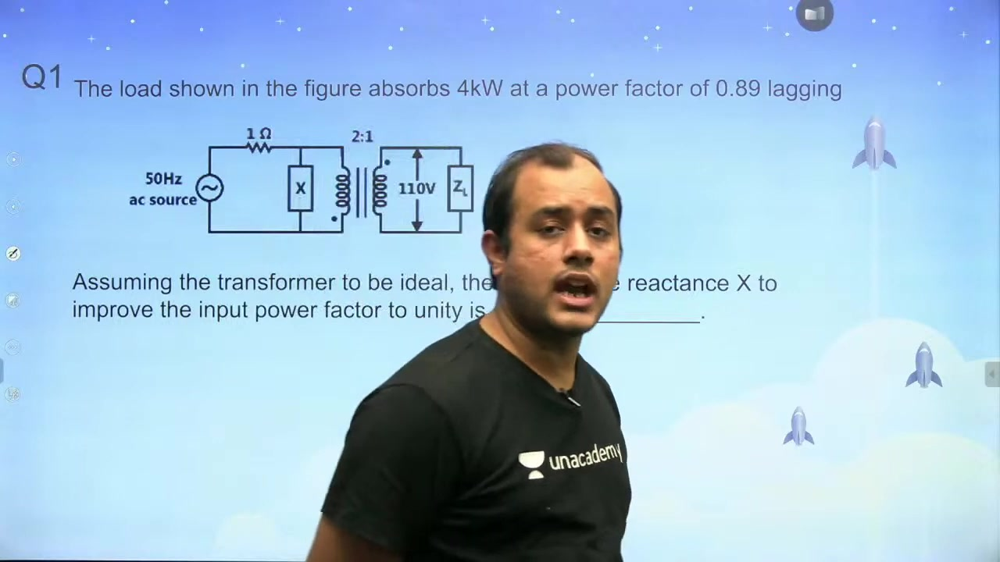
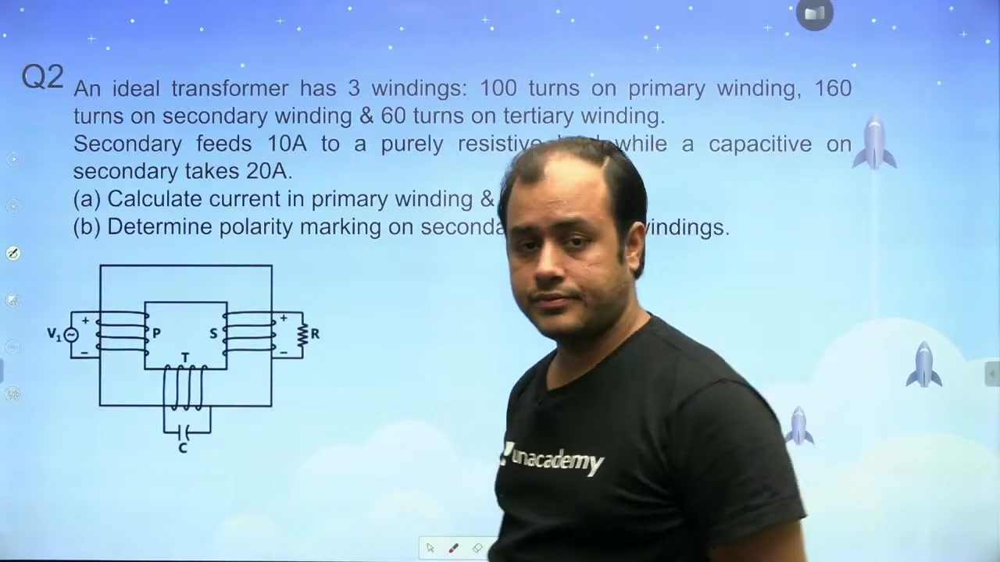
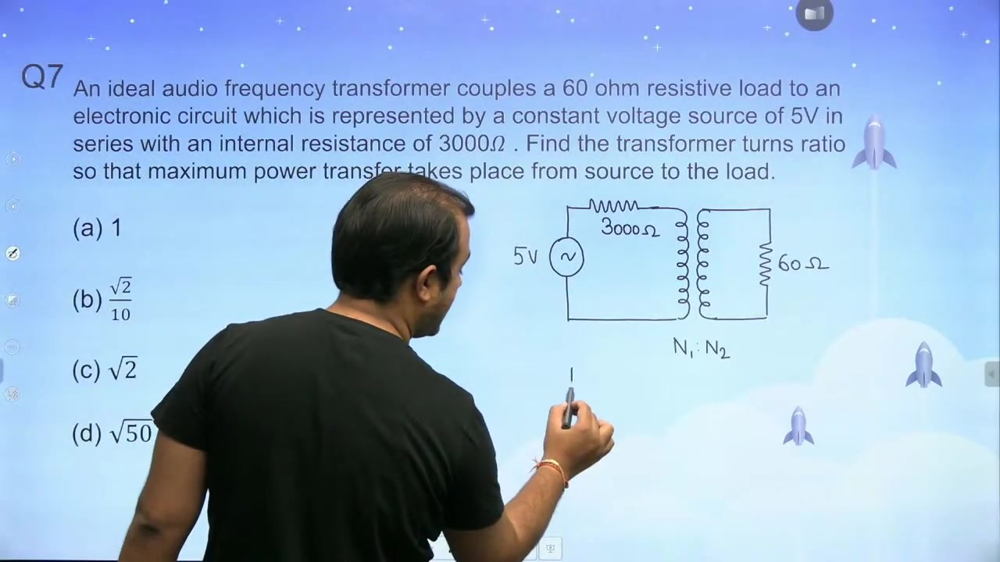
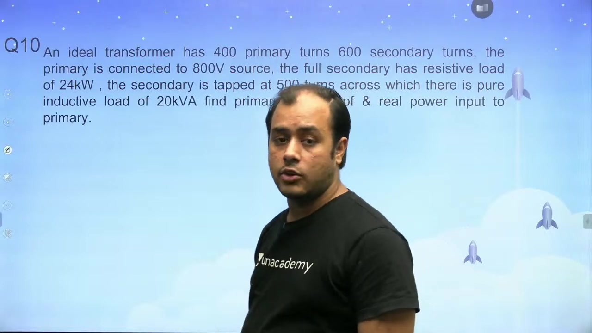

[← Lec 015: Ideal Transformer Part 2](Lecture_015_Ideal_Transformer_Part_2.md) | [🏠 Index](00_yt_study_guide.md) | [Lec 017: Practical Transformer Part 1 →](Lecture_017_Practical_Transformer_Part_1.md)

---

# Problems Based on Ideal Transformer | L5 | Electrical Machines | GATE 2022

- **Source**: https://www.youtube.com/watch?v=6kjfz_rje-Y
- **Duration**: 01:06:42
- **Compiled**: 2026-09-19

---

## Overview

This lecture presents problem-solving techniques for single-phase and multi-winding ideal transformers. It demonstrates both phasor branch analysis and direct complex power balancing across diverse circuit configurations. Key topics include power factor improvement with shunt reactances, turns ratio impedance matching, and transmission voltage regulation. In addition, the session examines frequency scaling of transformer leakage impedance and physical polarity markings based on Lenz's law.

## Contents

- [[#Problem 1: Power Factor Correction|Problem 1: Power Factor Correction]]
- [[#Problem 2: Three-Winding Transformer Polarity & MMF|Problem 2: Three-Winding Transformer Polarity & MMF]]
- [[#Problem 3: Multi-Stage Transformer Transmission|Problem 3: Multi-Stage Transformer Transmission]]
- [[#Problem 4 & 6: Frequency Scaling of Short-Circuit Impedance|Problem 4 & 6: Frequency Scaling of Short-Circuit Impedance]]
- [[#Problem 5: Total Primary Current (No-Load + Load)|Problem 5: Total Primary Current (No-Load + Load)]]
- [[#Problem 7: Impedance Matching for Maximum Power Transfer|Problem 7: Impedance Matching for Maximum Power Transfer]]
- [[#Problem 8 & 9: Complex Power Balancing on Tapped Windings|Problem 8 & 9: Complex Power Balancing on Tapped Windings]]
- [[#Problem 10: DC Constraints and Phasor Sign Conventions|Problem 10: DC Constraints and Phasor Sign Conventions]]

---

## Problem 1: Power Factor Correction
_(00:13 - 10:20)_

> [!example] Problem
> A load absorbs $4\text{ kW}$ at $0.89$ lagging pf connected to a $110\text{V}$ secondary of an ideal 2:1 step-down transformer. A reactance $X$ is placed across the $220\text{V}$ primary. Find $X$ to make the overall source power factor unity.

### Method 1: Power Balancing
- At unity pf, source reactive power is zero.
- Reactance must supply the exact reactive power demanded by the load: $Q_X = Q_{\text{load}}$.
- Load: $Q_{\text{load}} = P \tan\phi = 4000 \times \tan(\cos^{-1}(0.89)) = 2049.5\text{ VAR}$.
- Reactance: $Q_X = V_1^2 / X \implies 220^2 / X = 2049.5 \implies X = 23.6\,\Omega$ (Capacitive).

## Problem 2: Three-Winding Transformer Polarity & MMF
_(10:23 - 21:38)_

> [!example] Problem
> Primary $N_1 = 100$, Secondary $N_2 = 160$ ($10\text{A}$ resistive), Tertiary $N_3 = 60$ ($20\text{A}$ capacitive). Find primary current $I_1$ and polarity markings.

### MMF Balance
- Ideal core: Net MMF = 0 $\implies N_1 I_1 = N_2 I_2 + N_3 I_3$.
- $I_2 = 10\angle 0^\circ\text{ A}$ (Resistive), $I_3 = 20\angle +90^\circ\text{ A}$ (Capacitive).
- $100 I_1 = 1600 + j1200 \implies I_1 = 16 + j12\text{ A}$.
- Magnitude: $|I_1| = \sqrt{16^2 + 12^2} = 20\text{ A}$.
- Power Factor: $\cos(\tan^{-1}(12/16)) = 0.8\text{ leading}$.

## Problem 3: Multi-Stage Transformer Transmission
_(21:59 - 28:12)_

> [!example] Problem
> Generator $480\text{V} \rightarrow$ 1:10 TX $\rightarrow$ Line $(0.18+j0.24)\Omega \rightarrow$ 10:1 TX $\rightarrow$ Load $(4+j3)\Omega$. Find $V_L$.

- **Refer to Load Side**:
  - Source refers as: $480 \times 10 \times (1/10) = 480\text{V}$.
  - Line refers as: $(0.18+j0.24) \times (1/10)^2 = 0.0018 + j0.0024\,\Omega$.
- **Voltage Divider**:
  - $V_L = 480 \times \frac{5}{5.0027} \approx 479.7\text{V}$.

## Problem 4 & 6: Frequency Scaling of Short-Circuit Impedance
_(28:15 - 33:11, 38:05 - 43:34)_

> [!example] Problem
> SC current is $30\text{A}$ at $0.25$ lagging pf at $50\text{Hz}$. What is the pf at $75\text{Hz}$?

- **Impedance Scaling Rule**: Resistance $R$ is constant. Leakage reactance $X \propto f$.
- At $50\text{Hz}$: $\tan\phi_1 = X_1/R = \tan(\cos^{-1}(0.25)) = 3.873$.
- At $75\text{Hz}$: $X_2 = 1.5 X_1 \implies \tan\phi_2 = 1.5 \times 3.873 = 5.809$.
- New Power Factor: $\cos(\tan^{-1}(5.809)) = 0.17\text{ lagging}$.

## Problem 5: Total Primary Current (No-Load + Load)
_(33:12 - 38:04)_

> [!example] Problem
> 230/115V TX. No-load current $I_0 = 2\text{A}$ at $0.2$ lagging. Load current $I_2 = 15\text{A}$ at $0.8$ lagging. Find total primary current $I_1$.

- $I_0 = 2\angle -78.46^\circ = 0.4 - j1.96\text{ A}$.
- $I_1' = I_2(N_2/N_1) = 15\angle -36.87^\circ \times (115/230) = 7.5\angle -36.87^\circ = 6.0 - j4.5\text{ A}$.
- Total $I_1 = I_0 + I_1' = 6.4 - j6.46\text{ A} = 9.1\angle -45.2^\circ\text{ A}$.

## Problem 7: Impedance Matching for Maximum Power Transfer
_(38:05 - 43:34)_

> [!example] Problem
> Match a $60\,\Omega$ load to a $3000\,\Omega$ source. Find turns ratio.

- MPT Theorem requires $R_L' = R_s$.
- $R_L (N_1/N_2)^2 = R_s \implies 60 (N_1/N_2)^2 = 3000 \implies N_1/N_2 = \sqrt{50} = 7.07$.

## Problem 8 & 9: Complex Power Balancing on Tapped Windings
_(43:36 - 53:52)_

> [!example] Problem 9
> $800\text{V}$ primary. Full secondary supplies $24\text{ kW}$ (resistive). A tap supplies $20\text{ kVAR}$ (inductive). Find $I_1$.

- Ideal transformer: $S_{\text{primary}} = \sum S_{\text{loads}}$.
- $S_{\text{primary}} = 24 + j20\text{ kVA}$.
- $|S| = \sqrt{24^2 + 20^2} = 31.24\text{ kVA}$.
- $I_1 = |S| / V_1 = 31240 / 800 = 39.05\text{ A}$.

## Problem 10: DC Constraints and Phasor Sign Conventions
_(53:55 - 66:16)_

### Why Transformers Fail on DC
- Steady DC current produces steady flux ($d\Phi/dt = 0$).
- Induced back-EMF is zero.
- Primary current is limited only by tiny winding resistance ($I = V/R$), causing catastrophic overheating.

### Inductor Sign Convention
- If current $i(t)$ **leaves** the positive terminal of an inductor (active sign convention), $v = -L(di/dt)$.
- This forces the current to **lead** the voltage by $90^\circ$ mathematically ($V$ lags $I$).

---

## Summary and Key Takeaways

- To improve the source power factor to unity across an ideal transformer, the parallel reactance must supply reactive power equal to load demand: $Q_X = P \tan\phi$.
- For an ideal multi-winding transformer with zero net core reluctance, the ampere-turns balance equation is $N_1 I_1 = N_2 I_2 + N_3 I_3$.
- In energy-delivering windings, induced current leaves the positive terminal to establish magnetic flux opposing the primary flux.
- When referring an impedance across an ideal transformer from a source winding to a destination winding, the impedance scales by the turns ratio squared: $Z' = Z (N_{\text{dest}} / N_{\text{src}})^2$.
- In transformer short-circuit testing, leakage reactance is directly proportional to frequency ($X \propto f$), while winding resistance remains essentially constant.
- For maximum power transfer from a source to a load through an ideal transformer, the primary-referred load resistance must equal the internal source resistance: $R_L (N_1 / N_2)^2 = R_s$.
- Ideal transformers cannot operate on steady direct current because time-invariant flux ($d\Phi/dt = 0$) induces zero opposing back-emf, causing destructive overcurrent.
- Under complex power conservation, the primary apparent power equals the vector sum of active and reactive powers absorbed by all secondary loads: $S_{\text{primary}} = \sum (P_k + jQ_k)$.

---

[← Lec 015: Ideal Transformer Part 2](Lecture_015_Ideal_Transformer_Part_2.md) | [🏠 Index](00_yt_study_guide.md) | [Lec 017: Practical Transformer Part 1 →](Lecture_017_Practical_Transformer_Part_1.md)
