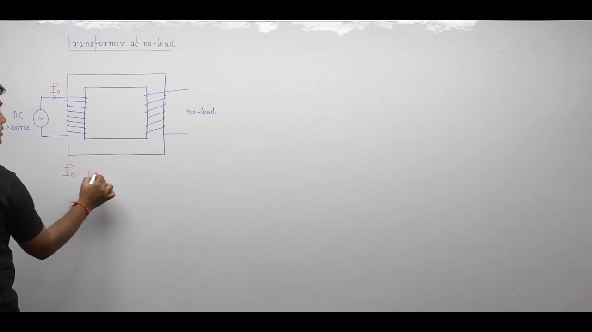
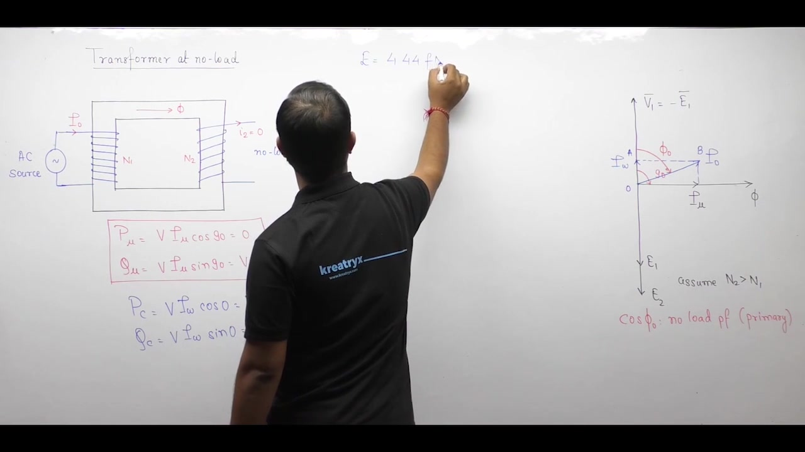
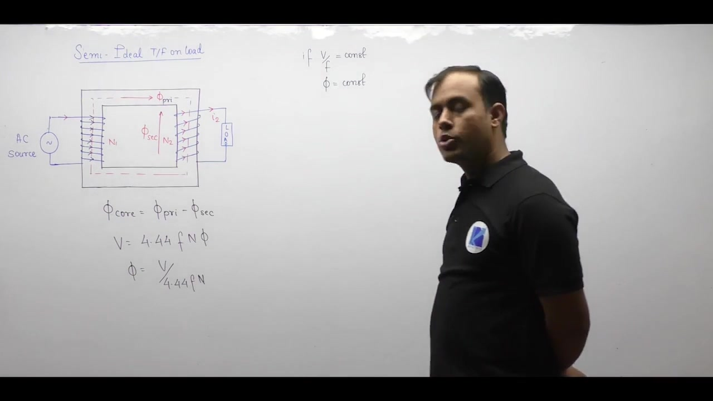
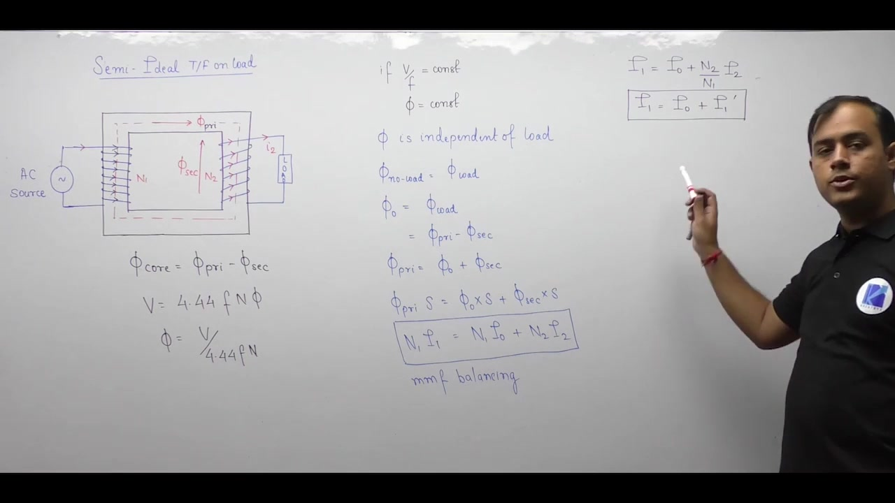
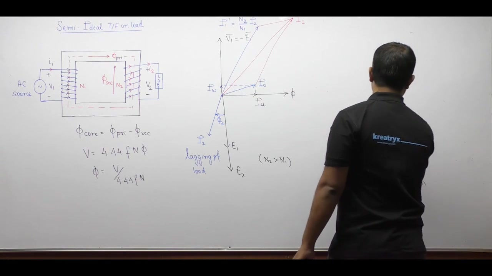

[← Lec 016: Problems Based on Ideal Transformer](Lecture_016_Problems_Based_on_Ideal_Transformer.md) | [🏠 Index](00_yt_study_guide.md) | [Lec 018: Practical Transformer Part 2 →](Lecture_018_Practical_Transformer_Part_2.md)

---

# Electrical Machines | Lec 12 | Practical Transformer (Part 1) | GATE Electrical Engineering

- **Source**: https://www.youtube.com/watch?v=u7nJUkUgWrs
- **Duration**: 01:04:23
- **Compiled**: 2026-09-19

---

## Overview

This lecture transitions the analysis from an ideal transformer to a practical transformer. It examines how finite core permeability and core losses create the primary no-load excitation current. The discussion models these phenomena with an equivalent parallel shunt branch placed across an ideal transformer core. It then explores secondary loading and derives the compensation effect that preserves constant mutual core flux. Complete on-load phasor diagrams demonstrate how loading improves the overall primary operating power factor.

## Contents

- [[#Practical Transformer at No-Load|Practical Transformer at No-Load]]
- [[#Core Loss Nature and Magnetizing Current Phasor Analysis|Core Loss Nature and Magnetizing Current Phasor Analysis]]
- [[#No-Load Current Components and Power Factor|No-Load Current Components and Power Factor]]
- [[#No-Load Equivalent Circuit Modeling|No-Load Equivalent Circuit Modeling]]
- [[#Frequency Variation Effects on No-Load Operation|Frequency Variation Effects on No-Load Operation]]
- [[#Secondary Demagnetization and the Compensation Effect|Secondary Demagnetization and the Compensation Effect]]
- [[#MMF Balance and Primary Current on Load|MMF Balance and Primary Current on Load]]
- [[#Complex Power Conservation and Complete On-Load Phasors|Complex Power Conservation and Complete On-Load Phasors]]
- [[#Power Factor Improvement Under Load|Power Factor Improvement Under Load]]

---

## Practical Transformer at No-Load
_(00:12 - 07:07)_

### Non-Idealities of the Core
Practical magnetic cores have finite permeability ($\mu < \infty$) and therefore non-zero magnetic reluctance ($\mathcal{R} = l / \mu A$).
- Establishing a mutual flux $\Phi_m$ requires an MMF: $\text{MMF} = \Phi_m \mathcal{R} = N_1 I_\mu$.
- The primary must draw a **magnetizing current** ($I_\mu$) from the supply just to sustain the core flux, even at no-load ($I_2 = 0$).

> [!info] Magnetizing Current ($I_\mu$)
> The reactive component of primary current required to overcome core reluctance and establish working magnetic flux.

### Core Losses
Alternating primary voltage creates alternating flux, causing two heat losses in the iron core:
1. **Hysteresis Loss ($P_h$)**: From reversing magnetic domains.
2. **Eddy Current Loss ($P_e$)**: From induced circulating currents in laminations.

## Core Loss Nature and Magnetizing Current Phasor Analysis
_(07:07 - 13:30)_

### Active vs. Reactive Power
- **Core Loss**: Converts electrical energy to heat irreversibly. It consumes **active** real power ($P_c = P_h + P_e$).
- **Magnetizing Current ($I_\mu$)**: Oscillates energy between source and magnetic field. Because $I_\mu$ produces the flux $\Phi_m$, it is directly in phase with $\Phi_m$.
- Since applied voltage $\mathbf{V}_1$ leads flux by $90^\circ$, **$I_\mu$ lags $V_1$ by exactly $90^\circ$**.
- $I_\mu$ draws pure reactive power: $Q_\mu = V_1 I_\mu$. It supplies zero real power.

## No-Load Current Components and Power Factor
_(13:35 - 22:25)_

### The Working Component ($I_w$)
Because $I_\mu$ supplies no real power, the source must provide a second current component to supply the core loss heat.
- **Working component ($I_w$)**: Lies in phase with $\mathbf{V}_1$ ($\theta = 0^\circ$). Supplies active power: $P_c = V_1 I_w$.

### Total No-Load Current ($I_0$)
The net primary current drawn at no load is the phasor sum:
$$\mathbf{I}_0 = \mathbf{I}_w + \mathbf{I}_\mu$$
Magnitude: $I_0 = \sqrt{I_w^2 + I_\mu^2}$

> [!success] No-Load Power Factor Characteristic
> In practical transformers, $I_\mu$ is much larger than $I_w$ ($I_\mu \gg I_w$). The phase angle $\phi_0$ between $\mathbf{V}_1$ and $\mathbf{I}_0$ is typically $70^\circ - 75^\circ$. Thus, the no-load power factor is very low: $\cos\phi_0 \approx 0.2\text{ lagging}$.

## No-Load Equivalent Circuit Modeling
_(22:26 - 28:05)_

### Parallel Exciting Branch
Because $I_w$ (in-phase) and $I_\mu$ (quadrature) both experience the same applied voltage $V_1$, they are modeled as parallel elements:
- **Core loss resistance ($R_c$)**: $R_c = V_1 / I_w$.
- **Magnetizing reactance ($X_m$)**: $X_m = V_1 / I_\mu$.

These two elements form the **shunt exciting branch** placed across the primary terminals of an ideal transformer core.

## Frequency Variation Effects on No-Load Operation
_(28:08 - 34:02)_

### Reducing Frequency at Constant Voltage
From $E_1 \approx V_1 = 4.44 f N_1 \Phi_m \implies \Phi_m \propto V_1/f$.
If frequency drops while voltage remains constant:
1. Mutual core flux $\Phi_m$ **increases**.
2. Higher flux requires higher magnetizing current ($I_\mu$ increases sharply).
3. Core loss $P_c \propto B_m^2$ increases, so $I_w$ increases.
4. Total no-load current $I_0$ **increases**.
5. Because $I_\mu$ grows faster than $I_w$, the angle $\phi_0$ increases, causing the no-load power factor $\cos\phi_0$ to **decrease**.

## Secondary Demagnetization and the Compensation Effect
_(39:37 - 44:09)_

### The Compensation Effect
When a load connects, secondary current $I_2$ flows.
1. By Lenz's law, $I_2$ creates an opposing MMF and flux $\Phi_2$ that attempts to demagnetize the core ($\Phi_{\text{net}} = \Phi_1 - \Phi_2$).
2. A drop in net flux causes the primary counter-EMF $E_1$ to drop.
3. The supply voltage $V_1$ now sees less opposition, causing a surge of additional primary current.
4. This extra primary current creates exactly enough forward flux to neutralize $\Phi_2$.
5. The core flux is perfectly restored to its initial value.

> [!info] Constant Flux Machine
> A transformer is a constant flux machine. As long as $V_1/f$ is constant, the peak mutual flux $\Phi_m$ remains unchanged from no-load to full-load.

## MMF Balance and Primary Current on Load
_(44:15 - 50:43)_

### Total Primary Current Equation
Because the load flux is perfectly neutralized, the net flux equals the no-load flux:
$$\Phi_{\text{primary}} - \Phi_{\text{secondary}} = \Phi_0$$
Multiplying by reluctance gives the MMF balance:
$$N_1 \mathbf{I}_1 - N_2 \mathbf{I}_2 = N_1 \mathbf{I}_0$$
Dividing by $N_1$ yields:
$$\mathbf{I}_1 = \mathbf{I}_0 + \frac{N_2}{N_1} \mathbf{I}_2 = \mathbf{I}_0 + \mathbf{I}_1'$$

> [!success] Total Primary Current
> Under load, the total primary current $\mathbf{I}_1$ is the phasor sum of the no-load excitation current $\mathbf{I}_0$ and the reflected load current $\mathbf{I}_1'$.

## Complex Power Conservation and Complete On-Load Phasors
_(50:43 - 61:42)_

### Power Balance
Multiplying the current equation by $\mathbf{V}_1$:
$$\mathbf{S}_1 = \mathbf{V}_1 \mathbf{I}_1^* = \mathbf{V}_1 \mathbf{I}_0^* + \mathbf{V}_1 \mathbf{I}_1'^*$$
Which simplifies to:
$$\mathbf{S}_1 = \mathbf{S}_0 + \mathbf{S}_2$$
The practical transformer demands input power to supply both the secondary load ($\mathbf{S}_2$) and its own core losses/magnetization ($\mathbf{S}_0$).

### On-Load Phasor Construction
1. $\mathbf{\Phi}_m$ is the horizontal reference.
2. $\mathbf{V}_1$ leads flux by $90^\circ$ (up). $\mathbf{E}_1, \mathbf{E}_2$ lag flux by $90^\circ$ (down).
3. $\mathbf{I}_0$ lags $\mathbf{V}_1$ by $\phi_0$ (mostly reactive).
4. Secondary load $I_2$ lags $E_2$ by $\theta_2$.
5. Reflected current $\mathbf{I}_1'$ is drawn $180^\circ$ opposite to $I_2$ to show MMF cancellation.
6. Total current $\mathbf{I}_1 = \mathbf{I}_0 + \mathbf{I}_1'$ via vector addition.

## Power Factor Improvement Under Load
_(61:42 - 64:15)_

At no-load, the power factor is poor ($\cos\phi_0 \approx 0.2$) because $I_0$ is heavily inductive. 
When load is applied, the reflected load current $\mathbf{I}_1'$ is added to the primary phasor. Because $\mathbf{I}_1'$ typically operates at a higher power factor (e.g., $0.8$ or $0.9$), the vector addition pulls the resultant total current $\mathbf{I}_1$ closer to the voltage $\mathbf{V}_1$.
- The net primary phase angle decreases: $\phi_1 < \phi_0$.
- The primary operating power factor increases: $\cos\phi_1 > \cos\phi_0$.

---

## Summary and Key Takeaways

- Finite core permeability creates core reluctance $\mathcal{R} = \frac{l}{\mu A}$, demanding a magnetizing current $I_\mu = \frac{\Phi_m \mathcal{R}}{N_1}$ that consumes purely reactive power ($Q_\mu = V_1 I_\mu$).
- Alternating mutual flux causes hysteresis and eddy current losses in core laminations, dissipating active power supplied by the in-phase core loss current $I_w = \frac{P_c}{V_1}$.
- The total no-load current is the vector sum $\mathbf{I}_0 = \mathbf{I}_w + \mathbf{I}_\mu$, with magnitude $I_0 = \sqrt{I_w^2 + I_\mu^2}$ and a low lagging power factor $\cos\phi_0 \approx 0.2$.
- The exciting branch models core phenomena as a parallel combination of core loss resistance $R_c = \frac{V_1}{I_w}$ and magnetizing reactance $X_m = \frac{V_1}{I_\mu}$.
- Reducing operating frequency at constant voltage increases mutual flux ($\Phi_m \propto \frac{V_1}{f}$), increasing $I_0$ and decreasing the no-load power factor.
- By the compensation effect, secondary load current $I_2$ induces an opposing MMF that is canceled by an additional primary current $\mathbf{I}_1' = \frac{N_2}{N_1} \mathbf{I}_2$.
- Under load, total primary current is $\mathbf{I}_1 = \mathbf{I}_0 + \mathbf{I}_1'$, satisfying both MMF balance $N_1 \mathbf{I}_1 = N_1 \mathbf{I}_0 + N_2 \mathbf{I}_2$ and power balance $\mathbf{S}_1 = \mathbf{S}_0 + \mathbf{S}_2$.
- Adding the higher power factor load current $\mathbf{I}_1'$ reduces the net primary phase angle ($\phi_1 < \phi_0$), improving the operating power factor from its no-load value.

---

[← Lec 016: Problems Based on Ideal Transformer](Lecture_016_Problems_Based_on_Ideal_Transformer.md) | [🏠 Index](00_yt_study_guide.md) | [Lec 018: Practical Transformer Part 2 →](Lecture_018_Practical_Transformer_Part_2.md)
