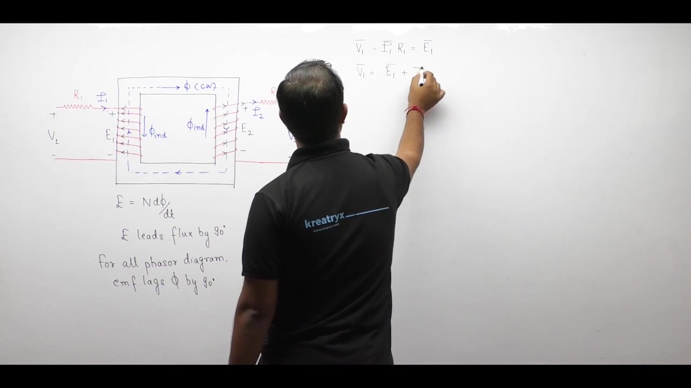
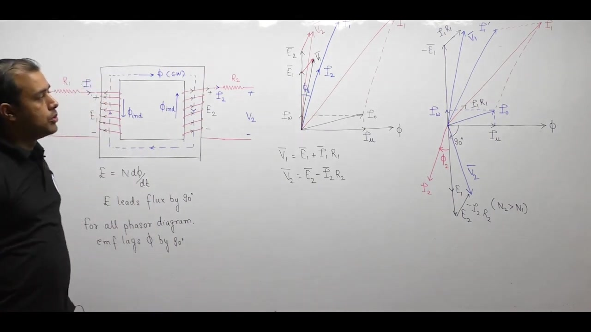
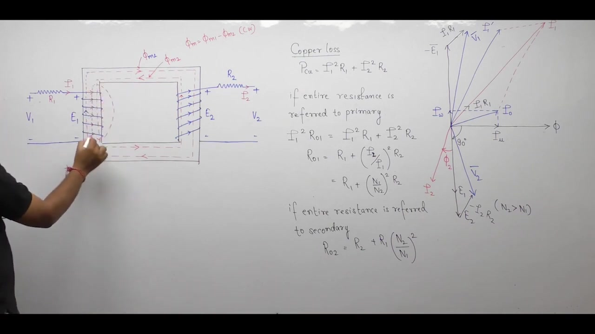
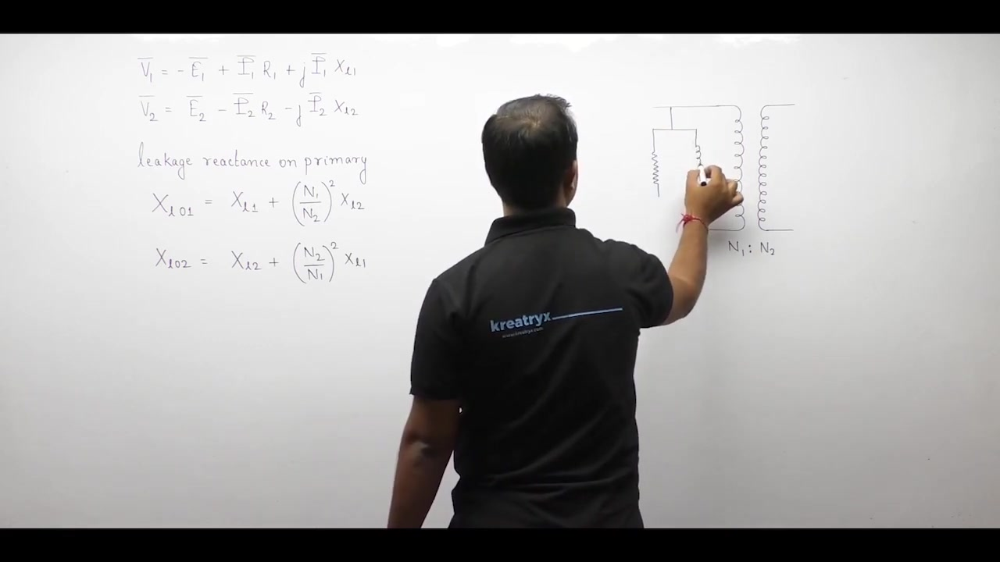
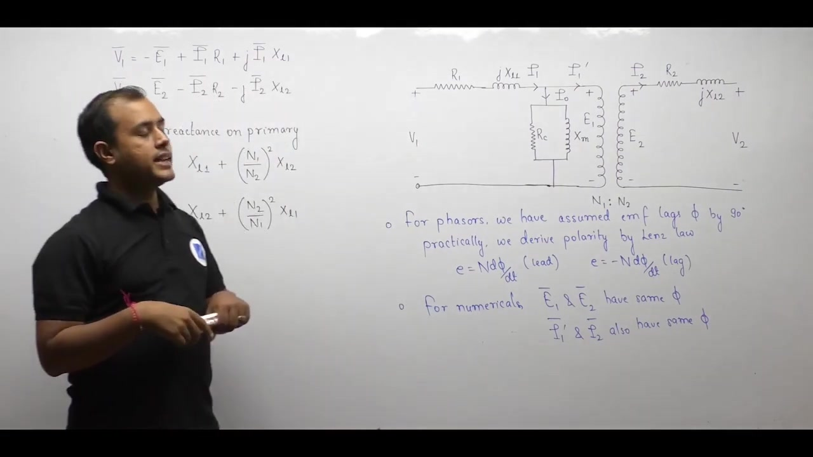

[← Lec 017: Practical Transformer Part 1](Lecture_017_Practical_Transformer_Part_1.md) | [🏠 Index](00_yt_study_guide.md) | [Lec 019: Practical Transformer Part 3 →](Lecture_019_Practical_Transformer_Part_3.md)

---

# Electrical Machines | Lec 13 | Practical Transformer (Part 2) | GATE Electrical Engineering

- **Source**: https://www.youtube.com/watch?v=7Hzdp0TXM5E
- **Duration**: 00:54:24
- **Compiled**: 2026-09-19

---

## Overview

This lecture incorporates winding resistance and magnetic leakage flux into the practical transformer model. It examines how finite conductor resistance creates internal ohmic drops and introduces total copper loss. The analysis then distinguishes between mutual core flux and leakage flux closing through air paths around individual coils. By representing leakage induced voltages as inductive reactance drops, the discussion synthesizes the complete equivalent circuit of the practical transformer.

## Contents

- [[#Winding Resistance and Ohmic Voltage Drops|Winding Resistance and Ohmic Voltage Drops]]
- [[#Phasor Construction with Winding Resistance|Phasor Construction with Winding Resistance]]
- [[#Resistance Referral and Total Copper Loss|Resistance Referral and Total Copper Loss]]
- [[#Magnetic Leakage Flux|Magnetic Leakage Flux]]
- [[#Leakage EMF and Complete Phasor Diagram|Leakage EMF and Complete Phasor Diagram]]
- [[#Modeling Leakage as Reactance (Equivalent Circuit Synthesis)|Modeling Leakage as Reactance (Equivalent Circuit Synthesis)]]
- [[#Conventions for Numerical Problems|Conventions for Numerical Problems]]

---

## Winding Resistance and Ohmic Voltage Drops
_(00:12 - 10:01)_

### Physical Resistance
Practical transformer windings are made of copper/aluminum with finite resistance ($R_1, R_2$).
- In circuit analysis, this distributed resistance is modeled as a lumped resistor placed in series with the ideal winding.

### KVL Equations with Resistance
Applying Kirchhoff's Voltage Law to both sides:
- **Primary**: The source drives current against the counter-EMF and the resistance drop:
  $$V_1 = -E_1 + I_1 R_1$$
- **Secondary**: The induced EMF drives the load:
  $$E_2 - I_2 R_2 = V_2$$

## Phasor Construction with Winding Resistance
_(10:01 - 19:50)_

### Voltage Drops on the Phasor Diagram
- The resistance drop $\mathbf{I}_1 R_1$ is **in phase** with primary current $\mathbf{I}_1$. It is drawn starting from $-\mathbf{E}_1$.
- The resistance drop $\mathbf{I}_2 R_2$ is **in phase** with secondary current $\mathbf{I}_2$. It is subtracted from $\mathbf{E}_2$ to get $\mathbf{V}_2$.

### Pedagogic Convention vs. Network Diagram
In actual mathematical networks, induced EMF leads flux by $90^\circ$ ($e = N \frac{d\phi}{dt}$). However, to prevent a crowded diagram where all phasors overlap in the upper half-plane, standard pedagogy uses $e = -N \frac{d\phi}{dt}$:
- Primary quantities ($V_1, -E_1, I_1, I_1', I_0$) are plotted above the flux axis.
- Secondary quantities ($E_2, V_2, I_2$) are plotted below.
- *Note:* The $180^\circ$ inversion of $I_1'$ relative to $I_2$ visually illustrates Lenz's law (MMF cancellation).

## Resistance Referral and Total Copper Loss
_(19:50 - 25:05)_

### Total Copper Loss
Winding resistance causes active heat loss:
$$P_{\text{cu}} = I_1^2 R_1 + I_2^2 R_2$$

### Power Invariance Principle
When transferring impedances across windings, electrical power must remain invariant ($P_1 = P_2$).
- **Referred to Primary ($R_{01}$)**: 
  $$R_{01} = R_1 + R_2 \left(\frac{N_1}{N_2}\right)^2 = R_1 + R_2'$$
- **Referred to Secondary ($R_{02}$)**:
  $$R_{02} = R_2 + R_1 \left(\frac{N_2}{N_1}\right)^2 = R_2 + R_1'$$

> [!success] Universal Referral Rule
> To refer any impedance to a new side, multiply by the square of the turns ratio: $\left(\frac{N_{\text{destination}}}{N_{\text{source}}}\right)^2$.

## Magnetic Leakage Flux
_(25:08 - 32:46)_

### Flux Classification
Due to finite core permeability and non-zero air permeability ($\mu_0$), flux takes two paths:
1. **Mutual Core Path ($\Phi_m$)**: Links both windings. Transfers energy.
2. **Leakage Air Path ($\Phi_l$)**: Escapes the core, closes through the air, and links *only* its own winding.

The total flux linking each winding:
- $\Phi_1 = \Phi_m + \Phi_{l1}$
- $\Phi_2 = \Phi_m + \Phi_{l2}$

## Leakage EMF and Complete Phasor Diagram
_(33:00 - 40:12)_

### Induced Leakage EMF
By Faraday's law, a time-varying leakage flux induces a self-voltage:
$$e_1 = -N_1 \frac{d\Phi_m}{dt} - N_1 \frac{d\Phi_{l1}}{dt} = E_1 + E_{l1}$$
- **Phase Rule**: Leakage flux is in phase with the current producing it ($\Phi_{l1} \parallel I_1$). Therefore, the induced leakage EMF $E_{l1}$ **lags** the current $I_1$ by $90^\circ$.

### Updated KVL with Leakage EMF
- $\mathbf{V}_1 = -\mathbf{E}_1 - \mathbf{E}_{l1} + \mathbf{I}_1 R_1$
- $\mathbf{V}_2 = \mathbf{E}_2 + \mathbf{E}_{l2} - \mathbf{I}_2 R_2$

## Modeling Leakage as Reactance (Equivalent Circuit Synthesis)
_(40:12 - 50:03)_

### Synthesizing Leakage Reactance
Because leakage paths are mostly in air (constant $\mu_0$), leakage flux is strictly proportional to winding current. 
- Since $E_{l1}$ lags $I_1$ by $90^\circ$, the term $-E_{l1}$ leads $I_1$ by $90^\circ$. 
- A $90^\circ$ leading voltage drop is mathematically identical to an inductor:
  $$-E_{l1} = +j I_1 X_{l1}$$
  $$X_{l1} = \omega L_{l1}$$

### Complete Equivalent Circuit
Substituting the reactance drops yields the final loop equations:
- $\mathbf{V}_1 = -\mathbf{E}_1 + \mathbf{I}_1 (R_1 + j X_{l1}) = -\mathbf{E}_1 + \mathbf{I}_1 \mathbf{Z}_1$
- $\mathbf{V}_2 = \mathbf{E}_2 - \mathbf{I}_2 (R_2 + j X_{l2}) = \mathbf{E}_2 - \mathbf{I}_2 \mathbf{Z}_2$

The equivalent circuit consists of:
1. Primary series branch ($R_1, X_{l1}$).
2. Parallel exciting branch ($R_c \parallel jX_m$).
3. Ideal core ($N_1 : N_2$).
4. Secondary series branch ($R_2, X_{l2}$).

## Conventions for Numerical Problems
_(50:03 - 54:17)_

> [!important] Phase Invariance in Calculations
> While phasor diagrams use a $180^\circ$ visual inversion to illustrate MMF cancellation, do NOT use this negative sign in numerical network equations.
> - $\mathbf{E}_1$ and $\mathbf{E}_2$ have the **same phase angle** ($\angle E_1 = \angle E_2$).
> - $\mathbf{I}_1'$ and $\mathbf{I}_2$ have the **same phase angle** ($\angle I_1' = \angle I_2$).

---

## Summary and Key Takeaways

- Winding resistances $R_1$ and $R_2$ are placed in series with the coils, creating ohmic voltage drops $I_1 R_1$ and $I_2 R_2$ and causing total copper loss $P_{\text{cu}} = I_1^2 R_1 + I_2^2 R_2$.
- Based on power invariance, total winding resistance referred to the primary is $R_{01} = R_1 + R_2 \left(\frac{N_1}{N_2}\right)^2$, and referred to the secondary is $R_{02} = R_2 + R_1 \left(\frac{N_2}{N_1}\right)^2$.
- Leakage fluxes $\Phi_{l1}$ and $\Phi_{l2}$ close through air paths around individual windings, linking only their own turns without contributing to mutual coupling.
- Time-varying leakage fluxes induce leakage EMFs $E_{l1}$ and $E_{l2}$ that lag their respective winding currents by $90^\circ$.
- Because leakage paths lie primarily in air, leakage flux is proportional to current, allowing leakage EMF to be modeled as an inductive drop $-E_l = j I X_l$.
- Leakage reactances refer across windings by the turns ratio squared: $X_{l01} = X_{l1} + X_{l2}\left(\frac{N_1}{N_2}\right)^2$ and $X_{l02} = X_{l2} + X_{l1}\left(\frac{N_2}{N_1}\right)^2$.
- The complete equivalent circuit combines series winding impedances $\mathbf{Z}_1 = R_1 + j X_{l1}$ and $\mathbf{Z}_2 = R_2 + j X_{l2}$ with the parallel exciting branch ($R_c \parallel j X_m$) and central ideal turns ratio.
- In numerical network calculations, induced EMFs $\mathbf{E}_1$ and $\mathbf{E}_2$ share the same phase angle, and currents $\mathbf{I}_1'$ and $\mathbf{I}_2$ share the same phase angle.

---

[← Lec 017: Practical Transformer Part 1](Lecture_017_Practical_Transformer_Part_1.md) | [🏠 Index](00_yt_study_guide.md) | [Lec 019: Practical Transformer Part 3 →](Lecture_019_Practical_Transformer_Part_3.md)
