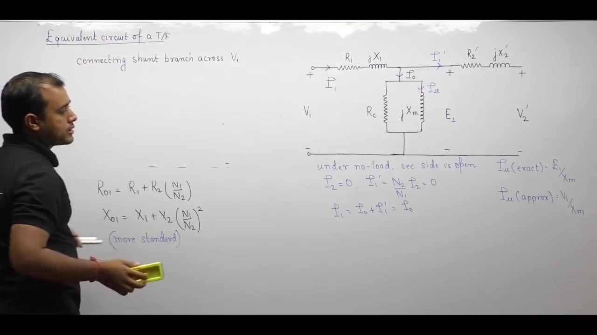
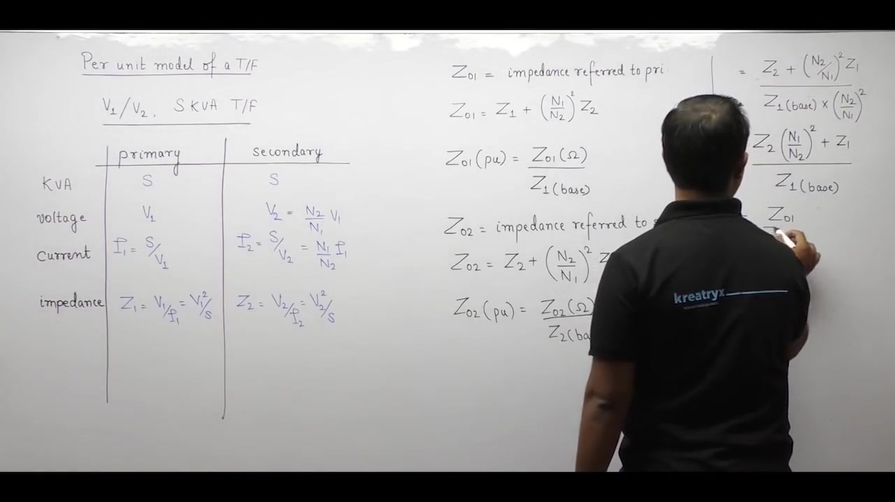

[← Lec 018: Practical Transformer Part 2](Lecture_018_Practical_Transformer_Part_2.md) | [🏠 Index](00_yt_study_guide.md) | [Lec 020: Problems based on Equivalent Circuit →](Lecture_020_Problems_based_on_Equivalent_Circuit.md)

---

# Electrical Machines | Lec 14 | Practical Transformer (Part 3) | GATE Electrical Engineering

- **Source**: https://www.youtube.com/watch?v=fcMvjUicjtA
- **Duration**: 01:10:45
- **Compiled**: 2026-09-19

---

## Overview

This lecture develops the exact and approximate equivalent circuit representations of practical transformers. It explains how parameters reflect across the ideal core to eliminate coupled windings and form single-loop T-networks. Shifting the exciting shunt branch to the terminal pair produces the standard approximate circuit and combines series impedances into lumped parameters. The lecture analyzes the four mathematical errors introduced by this approximation and proves the invariance of per-unit transformer impedances. A complete step-up transformer problem illustrates voltage regulation, input power factor, and operating efficiency.

## Contents

- [[#Exact Equivalent Circuit and Referral Rules|Exact Equivalent Circuit and Referral Rules]]
- [[#The Approximate Equivalent Circuit|The Approximate Equivalent Circuit]]
- [[#Errors in the Approximate Model|Errors in the Approximate Model]]
- [[#Per-Unit Impedance Invariance|Per-Unit Impedance Invariance]]
- [[#Worked Example: Equivalent Circuit Analysis|Worked Example: Equivalent Circuit Analysis]]

---

## Exact Equivalent Circuit and Referral Rules
_(00:12 - 15:35)_

### Referral Concept
To simplify analysis, we refer all parameters to one side, effectively removing the ideal transformer and merging the two coupled circuits into a single T-network.

### Scaling Rules
1. **Voltages** scale directly with turns ratio: $V_p = V_s \left(\frac{N_1}{N_2}\right)$.
2. **Currents** scale inversely: $I_p = I_s \left(\frac{N_2}{N_1}\right)$.
3. **Impedances** scale with the *square* of the turns ratio: $Z_p = Z_s \left(\frac{N_1}{N_2}\right)^2$.

### Exact Primary-Referred Circuit
- The secondary voltage $V_2$ reflects as $V_2' = V_2 (N_1/N_2)$.
- The load current $I_2$ reflects as $I_1' = I_2 (N_2/N_1)$.
- Secondary impedances $R_2$ and $X_2$ reflect as $R_2' = R_2 (N_1/N_2)^2$ and $X_2' = X_2 (N_1/N_2)^2$.
- The shunt exciting branch $R_c \parallel jX_m$ sits in the middle across induced EMF $E_1$.

## The Approximate Equivalent Circuit
_(15:39 - 26:41)_

### Shifting the Shunt Branch
The exact T-model is tedious for hand calculations because the internal node voltage $E_1$ changes with load.
- **Solution**: Shift the parallel exciting branch $R_c \parallel jX_m$ to the input terminals ($V_1$).

### Merging Series Impedances
Once the shunt branch is moved, the primary and referred-secondary series impedances are directly in series. They combine into equivalent lumped parameters:
$$R_{01} = R_1 + R_2' = R_1 + R_2 \left(\frac{N_1}{N_2}\right)^2$$
$$X_{01} = X_1 + X_2' = X_1 + X_2 \left(\frac{N_1}{N_2}\right)^2$$
$$Z_{01} = R_{01} + jX_{01}$$

> [!warning] Loss of Internal Node
> Merging the series impedances eliminates the internal node. The induced EMF $E_1$ cannot be observed directly in the approximate circuit.

## Errors in the Approximate Model
_(26:44 - 37:17)_

Moving the shunt branch to the input terminals ($V_1$) introduces four mathematical discrepancies (assuming a lagging load where $V_1 > E_1$):

1. **Overestimated Core Loss**: Calculated as $V_1^2 / R_c$ instead of $E_1^2 / R_c$.
2. **Overestimated Magnetizing Current**: Calculated as $V_1 / X_m$ instead of $E_1 / X_m$.
3. **Ignored No-Load Series Drop**: $I_0$ no longer flows through $R_1 + jX_1$.
4. **Ignored No-Load Copper Loss**: The $I_0^2 R_1$ heating is omitted.

Despite these errors (typically <1-2%), the approximate model is standard for exams and manual calculations due to its simplicity.

## Per-Unit Impedance Invariance
_(37:18 - 52:01)_

### Base Quantities
- $S_{\text{base}}$ is identical on both sides.
- $V_{\text{base}}$ follows the rated voltages.
- Base impedance: $Z_{\text{base}} = V_{\text{base}}^2 / S_{\text{base}}$.

### Impedance Referral
Because voltages scale by turns ratio, base impedances scale by turns ratio squared:
$$Z_{2,\text{base}} = Z_{1,\text{base}} \left(\frac{N_2}{N_1}\right)^2$$

### The Invariance Theorem
Converting an ohmic impedance into per-unit yields the identical numerical value regardless of which side it is referred to:
$$Z_{01,\text{pu}} = \frac{Z_{01}}{Z_{1,\text{base}}} = \frac{Z_{02}}{Z_{2,\text{base}}} = Z_{02,\text{pu}}$$

> [!success] Global Invariance
> In per-unit, the transformer reduces to a simple series impedance $Z_{\text{eq, pu}}$ with a shunt branch. The turns ratio disappears, making power system analysis uniform.

## Worked Example: Equivalent Circuit Analysis
_(52:01 - 70:38)_

> [!example] Problem
> Transformer: $2500\text{ V} / 250\text{ V}$. (LT = $250\text{V}$, HT = $2500\text{V}$, Step-up ratio = $10$).
> LT-referred parameters: $R_{\text{eq, LT}} = 0.2\,\Omega$, $X_{\text{eq, LT}} = 0.7\,\Omega$, $R_c = 500\,\Omega$, $X_m = 250\,\Omega$.
> HT load: $Z_L = 380 + j230\,\Omega$. Primary supply: $V_1 = 250\text{V}$. Find $V_2$, $I_1$, pf, and $\eta$.

### 1. Reflected Load and Secondary Voltage
- **Refer load to LT**: $Z_L' = Z_L (N_L/N_H)^2 = (380 + j230) / 100 = 3.8 + j2.3\,\Omega$.
- **Total Series Z**: $Z_{\text{series}} = (0.2 + j0.7) + (3.8 + j2.3) = 4.0 + j3.0\,\Omega = 5.0\,\Omega$.
- **Voltage Divider for $V_2'$**: $|V_2'| = V_1 \frac{|Z_L'|}{|Z_{\text{series}}|} = 250 \times \frac{4.4418}{5.0} = 222.09\text{V}$.
- **Actual HT Terminal Voltage**: $V_2 = 10 \times 222.09 = 2221\text{V}$.

### 2. Primary Input Current and Power Factor
- **Load Current ($I_1'$)**: $V_1 / Z_{\text{series}} = 250\angle 0^\circ / 5.0\angle 36.87^\circ = 50\angle -36.87^\circ = 40 - j30\text{ A}$.
- **Core Loss Current ($I_w$)**: $V_1 / R_c = 250 / 500 = 0.5\text{ A}$.
- **Magnetizing Current ($I_\mu$)**: $V_1 / jX_m = 250 / j250 = -j1.0\text{ A}$.
- **Total $I_1$**: $I_w + I_\mu + I_1' = (0.5 - j1.0) + (40 - j30) = 40.5 - j31\text{ A} = 51.0\angle -37.4^\circ\text{ A}$.
- **Power Factor**: $\cos(37.4^\circ) = 0.794\text{ lagging}$.

### 3. Power and Efficiency
- **Output Power**: $P_{\text{out}} = |I_1'|^2 R_L' = (50)^2 \times 3.8 = 9500\text{ W}$.
- **Input Power**: $V_1 I_1 \cos\phi = 250 \times 51.0 \times 0.794 = 10123.5\text{ W}$.
- **Efficiency**: $\eta = 9500 / 10123.5 \approx 93.83\%$.

---

## Summary and Key Takeaways

- Referring parameters across an ideal core scales voltages by $(N_1/N_2)$, currents inversely by $(N_2/N_1)$, and impedances by $(N_1/N_2)^2$.
- The exact T-circuit eliminates the ideal transformer core but leaves the shunt branch between the primary and secondary series impedances.
- Shifting the parallel exciting branch to the input terminals forms the standard approximate equivalent circuit and merges series impedances into $R_{01} = R_1 + R_2'$ and $X_{01} = X_1 + X_2'$.
- Merging series impedances in the approximate circuit obscures the internal node, making induced EMF unobservable directly from terminal measurements.
- For lagging loads, the approximate model overestimates core losses ($V_1^2/R_c > E_1^2/R_c$) and magnetizing current ($V_1/X_m > E_1/X_m$), while ignoring no-load copper loss and no-load series voltage drop.
- Base impedances scale across windings by the square of the turns ratio, $Z_{2,\text{base}} = Z_{1,\text{base}} (N_2/N_1)^2$, when base kVA is kept constant on both sides.
- The equivalent per-unit impedance is invariant to referral side, satisfying $Z_{01,\text{pu}} = Z_{02,\text{pu}} = Z_{\text{eq, pu}}$.
- The full per-unit equivalent circuit is completely identical whether formulated from primary or secondary ratings, eliminating turns-ratio complexities in power network calculations.

---

[← Lec 018: Practical Transformer Part 2](Lecture_018_Practical_Transformer_Part_2.md) | [🏠 Index](00_yt_study_guide.md) | [Lec 020: Problems based on Equivalent Circuit →](Lecture_020_Problems_based_on_Equivalent_Circuit.md)
