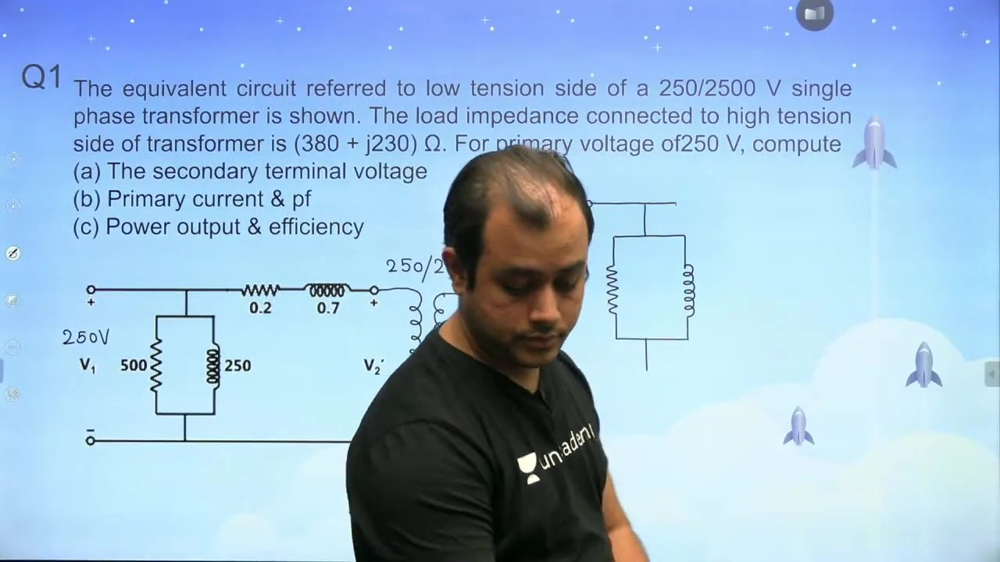
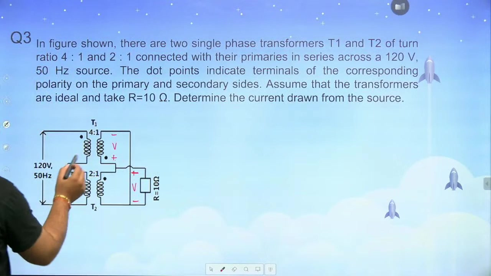

[← Lec 019: Practical Transformer Part 3](Lecture_019_Practical_Transformer_Part_3.md) | [🏠 Index](00_yt_study_guide.md) | [Lec 021: Testing of Transformer 1 →](Lecture_021_Testing_of_Transformer_1.md)

---

# Problems based on Equivalent Circuit | L6 | Electrical Machines | GATE 2022

- **Source**: https://www.youtube.com/watch?v=mJ3nL1tHAf0
- **Duration**: 01:17:16
- **Compiled**: 2026-09-19

---

## Overview

This lecture solves practical problems on transformer equivalent circuits. It connects physical winding parameters to circuit network equations. The discussion works through impedance reflection, series-parallel ideal transformers, and complex conjugate matching for maximum power transfer. It also analyzes short-circuit test responses, per-unit models, and phasor reference selection when load current is directly specified.

## Contents

- [[#Equivalent Circuit Analysis: Load Impedance Reflection|Equivalent Circuit Analysis: Load Impedance Reflection]]
- [[#Series-Parallel Ideal Transformer Networks|Series-Parallel Ideal Transformer Networks]]
- [[#Maximum Power Transfer in Transformers|Maximum Power Transfer in Transformers]]
- [[#Transformer Short-Circuit Test Evaluation|Transformer Short-Circuit Test Evaluation]]
- [[#Phasor Reference Selection in Load-Current Specified Problems|Phasor Reference Selection in Load-Current Specified Problems]]
- [[#Per-Unit Transformer Models and Exciting Current Decomposition|Per-Unit Transformer Models and Exciting Current Decomposition]]

---

## Equivalent Circuit Analysis: Load Impedance Reflection
_(00:05 - 14:13)_

### Principle of Impedance Reflection
To simplify analysis, refer all parameters to one side. An impedance $Z_2$ on the secondary transfers to the primary as:
$$Z_2' = a^2 Z_2 = \left(\frac{N_1}{N_2}\right)^2 Z_2$$

> [!example] Problem 1: Practical Transformer Analysis
> Transformer rated $250/2500\text{ V}$. LV side parameters: $R_{01} = 0.2\ \Omega$, $X_{01} = 0.7\ \Omega$, $R_c = 500\ \Omega$, $X_m = 250\ \Omega$.
> HV Load $Z_L = 380 + j230\ \Omega$. Primary $V_1 = 250\text{ V}$. Find terminal voltage, currents, and pf.

1. **Reflect Load to Primary (LV)**: 
   $a = 250/2500 = 0.1$. 
   $Z_L' = (0.1)^2 (380 + j230) = 3.8 + j2.3\ \Omega$.
2. **Total Series Impedance**: 
   $Z_{\text{series}} = (0.2+3.8) + j(0.7+2.3) = 4.0 + j3.0\ \Omega = 5.0\angle 36.87^\circ\ \Omega$.
3. **Reflected Load Current ($I_1'$)**: 
   $I_1' = \frac{V_1}{Z_{\text{series}}} = \frac{250\angle 0^\circ}{5.0\angle 36.87^\circ} = 50\angle -36.87^\circ\text{ A} = 40 - j30\text{ A}$.
4. **Secondary Terminal Voltage ($V_2$)**: 
   $V_2' = I_1' |Z_L'| = 50 \times 4.4419 = 222.09\text{ V}$.
   Actual $V_2 = V_2'/a = 2220.9\text{ V}$.
5. **Exciting Current ($I_0$)**: 
   $I_w = 250/500 = 0.5\text{ A}$. 
   $I_\mu = 250/j250 = -j1.0\text{ A}$. 
   $I_0 = 0.5 - j1.0\text{ A}$.
6. **Total Primary Current ($I_1$)**: 
   $I_1 = I_0 + I_1' = 40.5 - j31\text{ A} = 51.0\angle -37.43^\circ\text{ A}$. ($\text{pf} = 0.794$ lagging).

## Series-Parallel Ideal Transformer Networks
_(14:15 - 19:04)_

> [!example] Problem 2: Two Ideal Transformers
> $T_1$ ($4:1$) and $T_2$ ($2:1$). Primaries in series across $120\text{ V}$. Secondaries in parallel across $R_L = 10\ \Omega$.

1. **Secondary Voltage Reference**: Since secondaries are in parallel, $V_{s1} = V_{s2} = V$.
2. **Primary Voltage Relations**: $V_{p1} = 4V$, $V_{p2} = 2V$.
3. **Primary Loop**: $V_{p1} + V_{p2} = 120 \implies 6V = 120 \implies V = 20\text{ V}$. (Load voltage $V_L = 20\text{ V}$).
4. **Power & Current**: $P_L = 20^2 / 10 = 40\text{ W}$. For ideal transformers, $P_{\text{in}} = P_L \implies 120 I_1 = 40 \implies I_1 = 0.333\text{ A}$.

## Maximum Power Transfer in Transformers
_(19:05 - 28:43)_

> [!info] Complex Conjugate Matching Theorem
> For maximum power transfer from an AC source to a load, the referred load impedance must satisfy:
> $$Z_L' = Z_S^* = R_S - j X_S$$
> 1. Resistance matching: $a^2 R_L = R_S \implies$ Determines turns ratio $a$.
> 2. Reactance cancellation: $a^2 X_{L,\text{net}} = -X_S \implies$ Determines tuning capacitor.

> [!example] Problem 3: Max Power Transfer
> Source: $Z_S = 10 + j10\sqrt{3}\ \Omega$. Load branch: $Z_L = 2\angle 36.86^\circ\ \Omega$ + series capacitor $-jX_C$. Find $a$ and $X_C$.

1. **Load Impedance**: $Z_L = 1.6 + j1.2\ \Omega$. Total load: $1.6 + j(1.2 - X_C)$.
2. **Determine $a$**: Match real parts: $a^2(1.6) = 10 \implies a^2 = 6.25 \implies a = 2.5$.
3. **Determine $X_C$**: Cancel imaginary parts: $a^2(1.2 - X_C) = -10\sqrt{3} \implies 6.25(1.2 - X_C) = -17.32 \implies X_C \approx 3.97\ \Omega$.
4. **Maximum Power**: Loop is purely resistive ($20\ \Omega$). $I = 20\text{V} / 20\Omega = 1\text{A}$. $P_{\max} = I^2 R_L' = (1)^2 \times 10 = 10\text{ W}$.

## Transformer Short-Circuit Test Evaluation
_(29:28 - 39:11)_

During a SC test, applied voltage is small, core flux is negligible, and the shunt exciting branch is omitted.

> [!example] Problem 4: SC Test Voltage
> Step-down transformer $a = 6$. HV: $R_1 = 0.9\,\Omega$, $X_1 = 5.0\,\Omega$. LV: $R_2 = 0.03\,\Omega$, $X_2 = 0.13\,\Omega$. Find HV voltage to circulate full-load $200\text{A}$ in LV short-circuit.

1. **Refer to LV**: $R_{02} = 0.03 + (0.9/36) = 0.055\,\Omega$. $X_{02} = 0.13 + (5.0/36) = 0.2689\,\Omega$.
2. **Total Impedance (LV)**: $Z_{02} = 0.055 + j0.2689 = 0.2745\angle 78.43^\circ\,\Omega$.
3. **Required LV Voltage**: $V_1' = I_2 Z_{02} = 200 \times 0.2745 = 54.89\text{ V}$.
4. **Required HV Voltage**: $V_1 = a V_1' = 6 \times 54.89 = 329.34\text{ V}$.

> [!info] Power Factor Insight
> Leakage reactance is typically 4-5x larger than winding resistance. Consequently, the SC test power factor is very low ($\cos(78.43^\circ) \approx 0.20$ lagging).

## Phasor Reference Selection in Load-Current Specified Problems
_(49:30 - 65:35)_

### The Conceptual Pitfall
When a load is specified by current and power factor (e.g., $10\text{A}$ at $0.8$ pf lagging), setting the *primary supply voltage* as the $0^\circ$ reference is a **fatal error**. The power factor angle ($\phi = \cos^{-1}(0.8)$) is defined strictly between the *terminal load voltage* and the *load current*, not the primary voltage.

### The Correct Strategy
Set the **secondary terminal voltage** as the reference: $\mathbf{V}_2' = V_2' \angle 0^\circ$.

> [!example] Problem 6: Calculating Load Voltage
> Step-up transformer $1:2$ ($a=0.5$). Primary $V_1 = 200\text{V}$. LV parameters: $R_{01} = 0.15\,\Omega$, $X_{01} = 0.37\,\Omega$. Secondary delivers $10\text{A}$ at $0.8$ lagging pf. Find $V_2$.

1. **Reflect Current**: $I_1' = I_2 / a = 10 / 0.5 = 20\text{A}$. Phasor: $\mathbf{I}_1' = 20\angle -36.87^\circ = 16 - j12\text{ A}$.
2. **Voltage Drop**: $\Delta\mathbf{V} = (16 - j12)(0.15 + j0.37) = 6.84 + j4.12\text{ V}$.
3. **KVL Equation**: $\mathbf{V}_1 = \mathbf{V}_2' + \Delta\mathbf{V} \implies 200\angle\delta = (V_2' + 6.84) + j4.12$.
4. **Solve Magnitude**: $200^2 = (V_2' + 6.84)^2 + 4.12^2 \implies V_2' \approx 193.12\text{ V}$.
5. **Actual Secondary Voltage**: $V_2 = V_2' / a = 386.24\text{ V}$.

## Per-Unit Transformer Models and Exciting Current Decomposition
_(65:35 - 77:07)_

### Invariance of Per-Unit Impedance
The per-unit resistance and reactance are identical regardless of the referred side:
$$R_{\text{pu, HV}} = R_{\text{pu, LV}}, \quad X_{\text{pu, HV}} = X_{\text{pu, LV}}$$

### Decomposing Exciting Current
The total no-load exciting current $I_0$ consists of the active core-loss component $I_w$ (in phase with $V$) and the reactive magnetizing component $I_\mu$ (lagging $V$ by $90^\circ$).
$$I_0 = \sqrt{I_w^2 + I_\mu^2}$$

> [!example] Problem 7: Exciting Current
> Transformer draws $I_0 = 0.5\text{A}$ at $2200\text{V}$ no-load. Core loss is $360\text{W}$. Find $I_w$ and $I_\mu$.
1. **Core Loss Current**: $P_c = V I_w \implies I_w = 360 / 2200 = 0.1636\text{ A}$.
2. **Magnetizing Current**: $I_\mu = \sqrt{0.5^2 - 0.1636^2} = 0.472\text{ A}$.

---

## Summary and Key Takeaways

- Secondary impedance $Z_2$ transfers to the primary winding as $Z_2' = a^2 Z_2$, where $a = N_1 / N_2$.
- When secondaries connect in parallel across a common load, their secondary terminal voltages are identical, simplifying network analysis.
- Maximum power transfer across an ideal transformer requires conjugate matching $Z_L' = Z_S^*$, which sets $a^2 R_L = R_S$ and cancels net loop reactance.
- During a short-circuit test, the applied voltage is small, so the shunt core exciting branch can be neglected.
- The short-circuit power factor is very low ($\cos\theta_{\text{sc}} \approx 0.15 - 0.25\text{ lag}$) because leakage reactance dominates series winding resistance.
- When load current and power factor are specified directly, the load voltage $V_2$ must be chosen as the reference phasor rather than the supply voltage $V_1$.
- Transformer per-unit resistance and reactance are identical on both high-voltage and low-voltage sides ($R_{\text{pu, HV}} = R_{\text{pu, LV}}$ and $X_{\text{pu, HV}} = X_{\text{pu, LV}}$).
- Total exciting current decomposes into orthogonal components satisfying $I_0 = \sqrt{I_w^2 + I_\mu^2}$, where $I_w$ supplies core losses and $I_\mu$ produces mutual flux.

---

[← Lec 019: Practical Transformer Part 3](Lecture_019_Practical_Transformer_Part_3.md) | [🏠 Index](00_yt_study_guide.md) | [Lec 021: Testing of Transformer 1 →](Lecture_021_Testing_of_Transformer_1.md)
