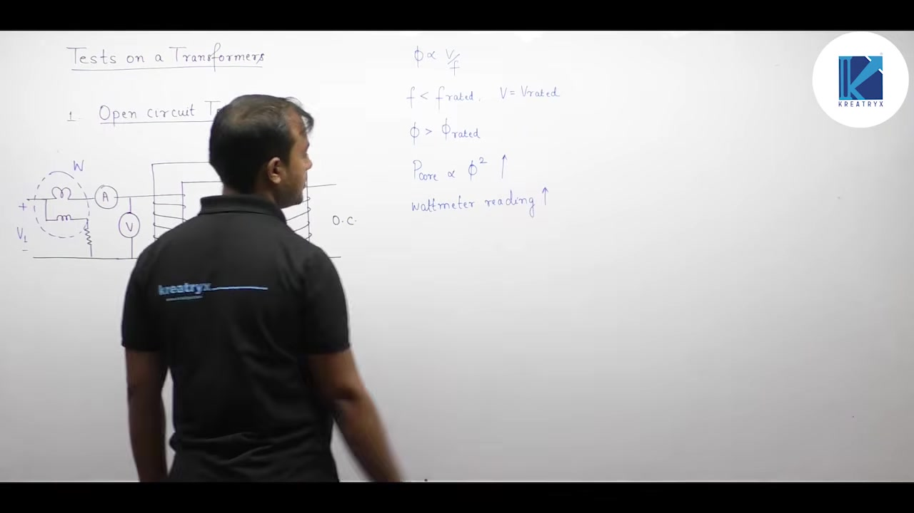
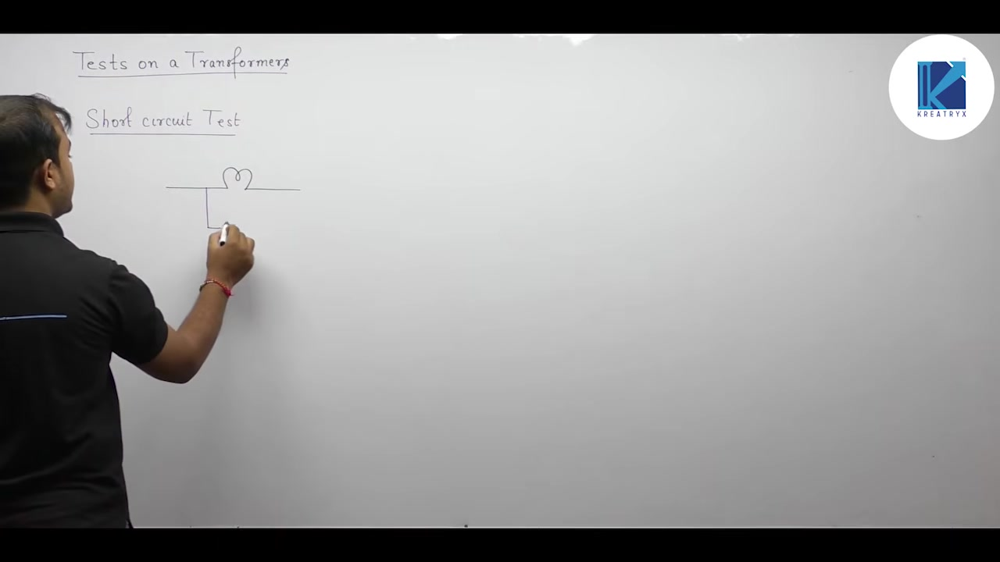
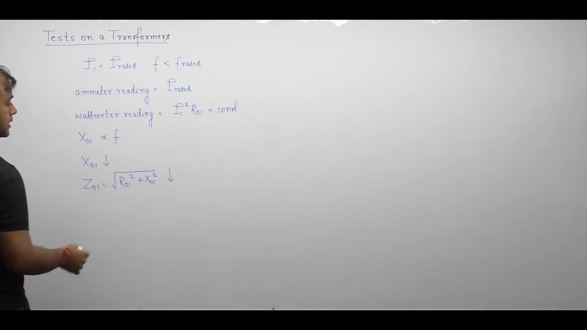

[← Lec 020: Problems based on Equivalent Circuit](Lecture_020_Problems_based_on_Equivalent_Circuit.md) | [🏠 Index](00_yt_study_guide.md) | [Lec 022: Testing of Transformer Part 2 →](Lecture_022_Testing_of_Transformer_Part_2.md)

---

# Testing of Transformer - 1 | Electrical Machines | Lec 15 | GATE/ESE (EE, ECE) | Ankit Goyal

- **Source**: https://www.youtube.com/watch?v=-DVEz0hhAdY
- **Duration**: 00:52:53
- **Compiled**: 2026-09-19

---

## Overview

This lecture establishes the experimental procedures used to determine transformer equivalent circuit parameters and operating losses. It details the open-circuit test conducted at rated voltage to extract core loss resistance and magnetizing reactance. It then presents the short-circuit test conducted at rated current to extract total series resistance and leakage reactance. Each test is justified through circuit approximations based on operating flux and current levels. The lecture also analyzes the response of test instruments to non-rated currents and reduced supply frequencies.

## Contents

- [[#Open-Circuit (OC) Test: Procedure and Parameters|Open-Circuit (OC) Test: Procedure and Parameters]]
- [[#OC Test Nuances: Phasor Diagram, Wattmeter, and Frequency Variations|OC Test Nuances: Phasor Diagram, Wattmeter, and Frequency Variations]]
- [[#Short-Circuit (SC) Test: Procedure and Parameters|Short-Circuit (SC) Test: Procedure and Parameters]]
- [[#SC Test Nuances: Non-Rated Current and Frequency Variations|SC Test Nuances: Non-Rated Current and Frequency Variations]]
- [[#Worked Example: Complete Parameter Extraction|Worked Example: Complete Parameter Extraction]]

---

## Open-Circuit (OC) Test: Procedure and Parameters
_(00:13 - 18:19)_

### Objectives
1. Measure core losses ($P_{\text{core}}$), comprising hysteresis and eddy current losses.
2. Extract shunt exciting branch parameters: core loss resistance $R_c$ and magnetizing reactance $X_m$.

### Experimental Setup
- **Conditions**: Rated voltage ($V_{\text{rated}}$) at rated frequency ($f_{\text{rated}}$). Rated flux ($\Phi_m \propto V/f$) must be established to measure true core loss.
- **Winding Selection**: Always conducted on the **Low-Voltage (LV)** side for safety and instrument availability. The HV side is left open.
- **Instruments (LV side)**: Voltmeter ($V_1$), Ammeter ($I_0$), Wattmeter ($W_0$).

### Equivalent Circuit Approximation
- Because the secondary is open, $I_2 = 0 \implies I_1' = 0$.
- The exciting current $I_0$ is very small ($2-6\%$ of rated). The primary winding copper loss ($I_0^2 R_1$) is negligible.
- **Wattmeter Reading**: Represents purely core loss. $W_0 = P_{\text{core}}$.

### Parameter Extraction Formulas
From LV readings $(V_1, I_0, W_0)$:
1. **Core Loss Resistance**: $R_c = \frac{V_1^2}{W_0}$
2. **Core Loss Current**: $I_w = \frac{W_0}{V_1}$
3. **Magnetizing Current**: $I_\mu = \sqrt{I_0^2 - I_w^2}$
4. **Magnetizing Reactance**: $X_m = \frac{V_1}{I_\mu}$

## OC Test Nuances: Phasor Diagram, Wattmeter, and Frequency Variations
_(18:19 - 26:42)_

### No-Load Power Factor and Wattmeter Selection
- The magnetizing current $I_\mu$ is much larger than the active current $I_w$. The exciting current $I_0$ lags the voltage by a large angle ($\approx 70^\circ-75^\circ$).
- The no-load power factor is very low ($\cos\phi_0 \approx 0.2$ lagging).
- **Rule**: A **Low Power Factor (LPF) wattmeter** must be used for the OC test to avoid massive measurement errors.

### Effect of Reduced Frequency ($V = \text{const}, f \downarrow$)
If the test runs at rated voltage but lower frequency:
- Core flux increases: $\Phi_m \propto V/f \uparrow$. The core pushes into saturation.
- Core loss increases: $P_{\text{core}} \propto \Phi_m^2 \uparrow$. Wattmeter reading $W_0 \uparrow$.
- Exciting current increases heavily due to saturation: Ammeter reading $I_0 \uparrow$.
- Power factor drops: $\cos\phi_0 \downarrow$.

## Short-Circuit (SC) Test: Procedure and Parameters
_(26:42 - 43:13)_

### Objectives
1. Determine full-load copper loss ($P_{\text{cu,fl}}$).
2. Extract equivalent series branch parameters ($R_{01}$ and $X_{01}$).

### Experimental Setup
- **Conditions**: Rated current ($I_{\text{rated}}$). Copper loss requires rated current ($P_{\text{cu}} \propto I^2$).
- **Winding Selection**: Always conducted on the **High-Voltage (HV)** side because it has a lower rated current, making ammeters easier to source. The LV side is shorted with a thick copper bar.
- **Voltage**: Applied voltage is slowly increased via a variac until the ammeter reads rated current. The required voltage $V_{\text{sc}}$ is small, typically $5-10\%$ of rated.

### Equivalent Circuit Approximation
- Because $V_{\text{sc}}$ is only $5-10\%$ of rated voltage, the core flux is only $5-10\%$ of rated.
- Core loss ($P_{\text{core}} \propto \Phi_m^2$) drops to $< 1\%$ and exciting current $I_0$ becomes negligible.
- **The shunt branch is completely neglected.** The circuit reduces to a simple series impedance $Z_{01} = R_{01} + jX_{01}$.
- **Wattmeter Reading**: Represents purely series copper loss. $W_{\text{sc}} = I_{\text{sc}}^2 R_{01}$.

### Parameter Extraction Formulas
From HV readings $(V_{\text{sc}}, I_{\text{sc}}, W_{\text{sc}})$:
1. **Equivalent Impedance**: $Z_{01} = \frac{V_{\text{sc}}}{I_{\text{sc}}}$
2. **Equivalent Resistance**: $R_{01} = \frac{W_{\text{sc}}}{I_{\text{sc}}^2}$
3. **Equivalent Reactance**: $X_{01} = \sqrt{Z_{01}^2 - R_{01}^2}$
4. **Power Factor**: $\cos\theta_{\text{sc}} = \frac{R_{01}}{Z_{01}}$ (typically $0.15 - 0.35$ lagging).

If separating parameters is required without further tests, assume $R_1 = R_2' = R_{01}/2$ and $X_1 = X_2' = X_{01}/2$.

## SC Test Nuances: Non-Rated Current and Frequency Variations
_(43:16 - 52:45)_

### Testing at Non-Rated Current
If the SC test is conducted at a current $I_{\text{sc}}$ lower than rated:
- **Series Parameters**: $R_{01}, X_{01}, Z_{01}$ are physical properties. They do not change. Calculate them directly from the raw readings without scaling.
- **Full-Load Copper Loss**: Must be scaled. $P_{\text{cu,fl}} = W_{\text{sc}} \left(\frac{I_{\text{rated}}}{I_{\text{sc}}}\right)^2$.

### Effect of Reduced Frequency ($I = \text{const}, f \downarrow$)
If the test runs at rated current but lower frequency:
- Winding resistance and wattmeter reading are unaffected: $R_{01}, W_{\text{sc}} = \text{const}$.
- Leakage reactance decreases: $X_{01} \propto f \downarrow$.
- Total impedance decreases: $Z_{01} \downarrow$.
- Required test voltage decreases: $V_{\text{sc}} = I_{\text{sc}} Z_{01} \downarrow$.
- Power factor improves: $\cos\theta_{\text{sc}} = R_{01}/Z_{01} \uparrow$.

## Worked Example: Complete Parameter Extraction
_(52:45 - end)_

> [!example] Problem
> $20\text{ kVA}$, $2500/250\text{ V}$ transformer.
> OC test (LV side): $250\text{ V}, 1.4\text{ A}, 105\text{ W}$.
> SC test (HV side): $104\text{ V}, 8\text{ A}, 320\text{ W}$.
> Find parameters referred to LV side.

1. **Turns Ratio**: $a = 2500 / 250 = 10$.
2. **Shunt Parameters (from LV)**:
   - $R_c = 250^2 / 105 = 595.24\ \Omega$.
   - $I_w = 105 / 250 = 0.42\text{ A}$.
   - $I_\mu = \sqrt{1.4^2 - 0.42^2} = 1.3355\text{ A}$.
   - $X_m = 250 / 1.3355 = 187.20\ \Omega$.
3. **Series Parameters (from HV)**:
   - $Z_{01} = 104 / 8 = 13\ \Omega$.
   - $R_{01} = 320 / 8^2 = 5\ \Omega$.
   - $X_{01} = \sqrt{13^2 - 5^2} = 12\ \Omega$.
4. **Refer Series Parameters to LV ($a^2 = 100$)**:
   - $R_{02} = 5 / 100 = 0.05\ \Omega$.
   - $X_{02} = 12 / 100 = 0.12\ \Omega$.

---

## Summary and Key Takeaways

- The open-circuit test is conducted on the low-voltage side with rated voltage applied while the high-voltage winding remains open.
- The open-circuit wattmeter measures rated core loss $P_{\text{core}}$, yielding core loss resistance $R_c = V_1^2 / W_0$ and magnetizing reactance $X_m = V_1 / I_\mu$.
- Because the no-load power factor is very low ($\cos\phi_0 \approx 0.2\text{ lagging}$), accurate core loss measurement requires a Low Power Factor (LPF) wattmeter.
- If an open-circuit test operates at reduced frequency with rated voltage, mutual flux increases as $\Phi_m \propto V/f$, causing core loss, exciting current, and ammeter readings to rise while power factor drops.
- The short-circuit test is conducted on the high-voltage winding with the low-voltage winding dead shorted by applying a small variable voltage ($V_{\text{sc}} \approx 5\% - 10\% V_{\text{rated}}$).
- The shunt exciting branch is neglected during the short-circuit test because the tiny applied voltage produces negligible core flux and exciting current ($I_0 \ll I_1$).
- Short-circuit test readings yield equivalent series impedance $Z_{01} = V_{\text{sc}} / I_{\text{sc}}$, equivalent resistance $R_{01} = W_{\text{sc}} / I_{\text{sc}}^2$, and equivalent leakage reactance $X_{01} = \sqrt{Z_{01}^2 - R_{01}^2}$.
- If the short-circuit test is run at a non-rated current $I_{\text{sc}}$, series parameters $R_{01}$ and $X_{01}$ remain unchanged, but full-load copper loss must be scaled by $P_{\text{cu,fl}} = P_{\text{cu,sc}} (I_{\text{rated}} / I_{\text{sc}})^2$.
- In the short-circuit test at rated current, reducing frequency lowers leakage reactance $X_{01}$ and applied voltage $V_{\text{sc}}$ while improving the short-circuit power factor.

---

[← Lec 020: Problems based on Equivalent Circuit](Lecture_020_Problems_based_on_Equivalent_Circuit.md) | [🏠 Index](00_yt_study_guide.md) | [Lec 022: Testing of Transformer Part 2 →](Lecture_022_Testing_of_Transformer_Part_2.md)
