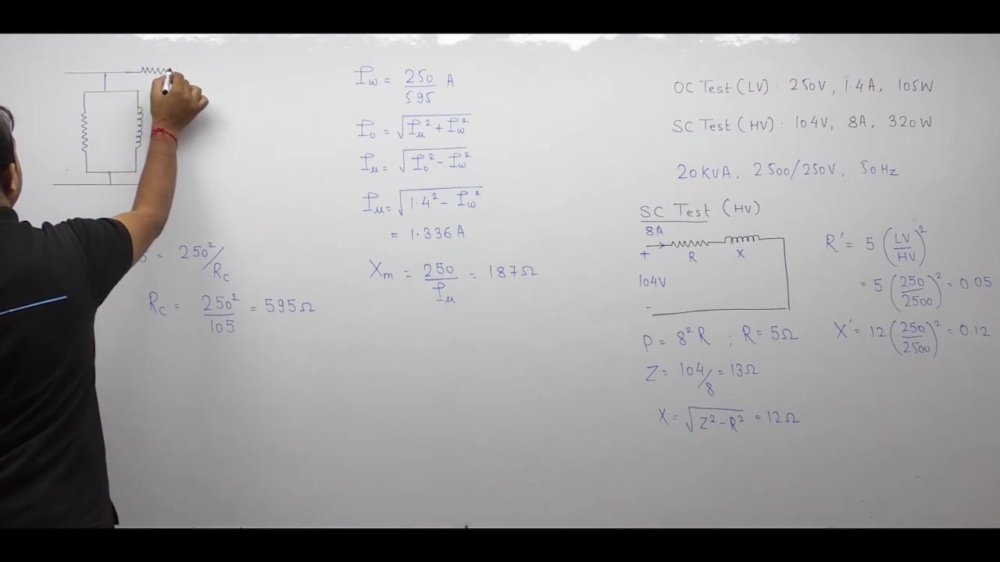
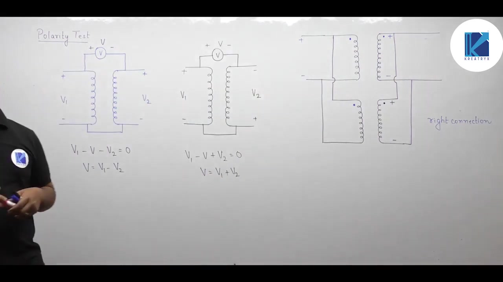
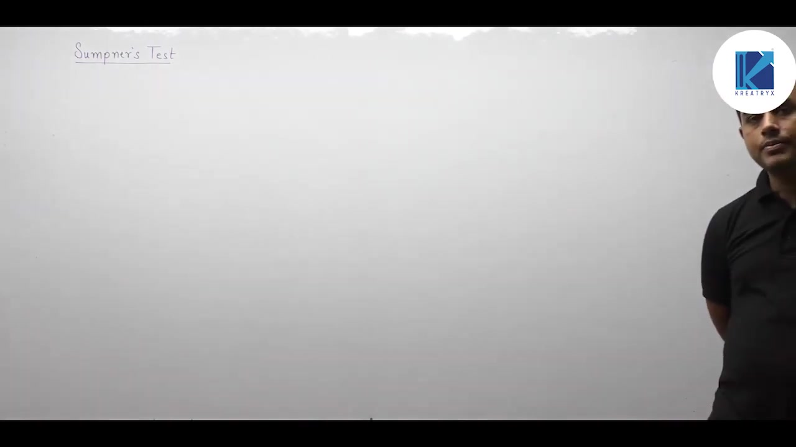
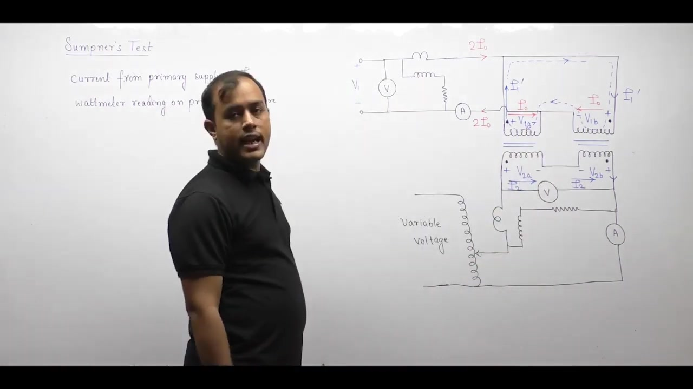

[← Lec 021: Testing of Transformer 1](Lecture_021_Testing_of_Transformer_1.md) | [🏠 Index](00_yt_study_guide.md) | [Lec 023: Problems Based on Testing of Transformer →](Lecture_023_Problems_Based_on_Testing_of_Transformer.md)

---

# Electrical Machines | Lec 16 | Testing of Transformer (Part 2) | GATE Electrical Engineering

- **Source**: https://www.youtube.com/watch?v=rW6b0dr-F3Y
- **Duration**: 00:48:37
- **Compiled**: 2026-09-19

---

## Overview

This lecture completes the study of experimental testing on power and distribution transformers. It begins by extracting equivalent circuit parameters and constructing the approximate model from laboratory test data. The lecture then establishes the polarity test to identify relative winding potentials and prevent destructive circulating currents during parallel operation. Finally, it presents Sumpner's back-to-back test, analyzing how phantom loading achieves full-load thermal steady-state while drawing only internal losses from the supply.

## Contents

- [[#Parameter Determination from Test Data|Parameter Determination from Test Data]]
- [[#The Polarity Test and Parallel Operation|The Polarity Test and Parallel Operation]]
- [[#Limitations of Standard Tests|Limitations of Standard Tests]]
- [[#Sumpner's Back-to-Back Test (Heat Run Test)|Sumpner's Back-to-Back Test (Heat Run Test)]]

---

## Parameter Determination from Test Data
_(00:13 - 07:54)_

### Referring Raw Data Directly
Instead of calculating parameters and transferring them across windings, test data can be transferred directly. 
- Voltages scale by $N_1/N_2$
- Currents scale by $N_2/N_1$
- Power is conserved across windings.

> [!example] Problem
> $20\text{ kVA}$, $2500/250\text{ V}$. 
> SC test (HV side): $104\text{ V}, 8\text{ A}, 320\text{ W}$. Find $Z_{02}$ on LV side.
1. Transfer Voltage: $V_{\text{sc,LV}} = 104 \times (250/2500) = 10.4\text{ V}$
2. Transfer Current: $I_{\text{sc,LV}} = 8 \times (2500/250) = 80\text{ A}$
3. Keep Power: $W_{\text{sc,LV}} = 320\text{ W}$
4. Compute: $Z_{02} = 10.4 / 80 = 0.13\ \Omega$.

## The Polarity Test and Parallel Operation
_(07:59 - 23:11)_

### The Need for a Polarity Test
Parallel operation of transformers requires connecting terminals of identical instantaneous polarity. Reversing polarity creates massive circulating currents because the secondary voltages sum ($2E_2$) instead of canceling.

### Test Procedure and Rules
1. Connect one primary terminal directly to the adjacent secondary terminal.
2. Connect a voltmeter across the remaining two open terminals.
3. Apply a small AC voltage $V_1$ to the primary.

- **Subtractive Polarity**: $V = V_1 - V_2 < V_1$. (Tied terminals have identical polarity. Place dots on the same side). Standard for power transformers to lower dielectric stress.
- **Additive Polarity**: $V = V_1 + V_2 > V_1$. (Tied terminals have opposite polarity. Place dots on opposite sides).

## Limitations of Standard Tests
_(23:11 - 29:26)_

The standard OC and SC tests isolate losses. Neither test subjects the transformer to simultaneous core and copper losses.
- To verify transformer temperature rise before delivery, a thermal heat-run is needed. 
- Running large transformers (e.g., $50\text{ MVA}$) on direct load wastes massive energy.

## Sumpner's Back-to-Back Test (Heat Run Test)
_(29:26 - end)_

### Principle of Phantom Loading
Sumpner's test evaluates two identical transformers under simultaneous rated voltage and rated current conditions while consuming only the power equivalent to internal losses.

### Circuit Setup
1. **Primary**: Primaries connected in parallel across the rated AC supply. ($V_1$, Wattmeter $W_1$).
2. **Secondary**: Secondaries connected in series opposition. 

### Testing Steps
1. **Series Opposition Verification**: $V_{\text{sec}} = V_{2A} - V_{2B} = 0$. If non-zero, reverse leads.
2. **Open Secondary (Core Loss)**: With secondaries open, the primary acts as an OC test. 
   - Primary wattmeter $W_1$ reads total core loss: $W_1 = 2 P_{\text{core}}$.
3. **Secondary Injection (Copper Loss)**: A small auxiliary source injects voltage into the secondary loop until rated current flows. 
   - Reflected primary currents circulate internally in a closed loop without entering the main supply line.
   - Secondary wattmeter $W_2$ reads total copper loss: $W_2 = 2 P_{\text{cu,fl}}$.

### Current Asymmetry and Steady State
- In Transformer A, primary current is $I_1' - I_0$. In Transformer B, it is $I_1' + I_0$.
- The two transformers run until thermal equilibrium is reached, allowing temperature rise measurements.
- Efficiency at fraction $x$: $\eta = \frac{x S \cos\theta}{x S \cos\theta + (W_1/2) + x^2(W_2/2)}$.

---

## Summary and Key Takeaways

- Raw open-circuit and short-circuit test data can be directly referred across windings by scaling voltages by turns ratio and currents by inverse turns ratio while keeping power constant.
- The polarity test identifies secondary terminals that have the same instantaneous potential as primary terminals to place dot markings.
- Connecting parallel transformers with reversed polarities causes massive circulating currents driven by double the secondary voltage ($2 E_2$), resulting in destructive heating.
- In the polarity test with one primary and secondary terminal tied together, a voltmeter reading $V = V_1 - V_2$ indicates subtractive polarity, while $V = V_1 + V_2$ indicates additive polarity.
- Standard power transformers use subtractive polarity because it reduces dielectric voltage stress between adjacent terminal bushings.
- Open-circuit and short-circuit tests cannot predict thermal temperature rise because neither test subjects the transformer to simultaneous core and copper losses.
- Sumpner's test connects two identical transformers with primaries in parallel across rated voltage and secondaries in series opposition, verified by zero secondary voltmeter reading ($V_{\text{sec}} = V_{2A} - V_{2B} = 0$).
- Primary wattmeter $W_1$ measures total core loss for both units ($2 P_{\text{core}}$), while auxiliary secondary wattmeter $W_2$ measures total full-load copper loss ($2 P_{\text{cu,fl}}$).
- Reflected secondary current circulates within the closed primary loop without entering the main supply line, enabling phantom loading where total power drawn equals strictly internal losses.

---

[← Lec 021: Testing of Transformer 1](Lecture_021_Testing_of_Transformer_1.md) | [🏠 Index](00_yt_study_guide.md) | [Lec 023: Problems Based on Testing of Transformer →](Lecture_023_Problems_Based_on_Testing_of_Transformer.md)
